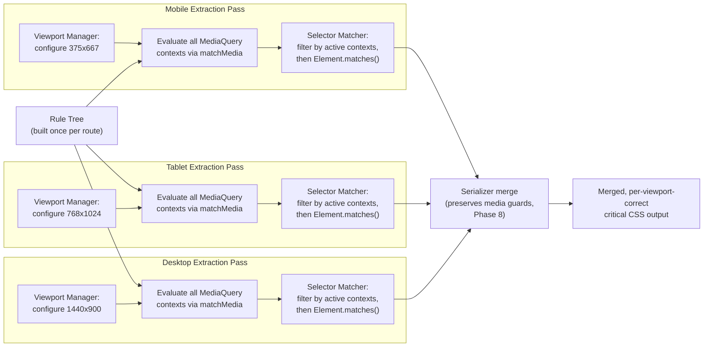
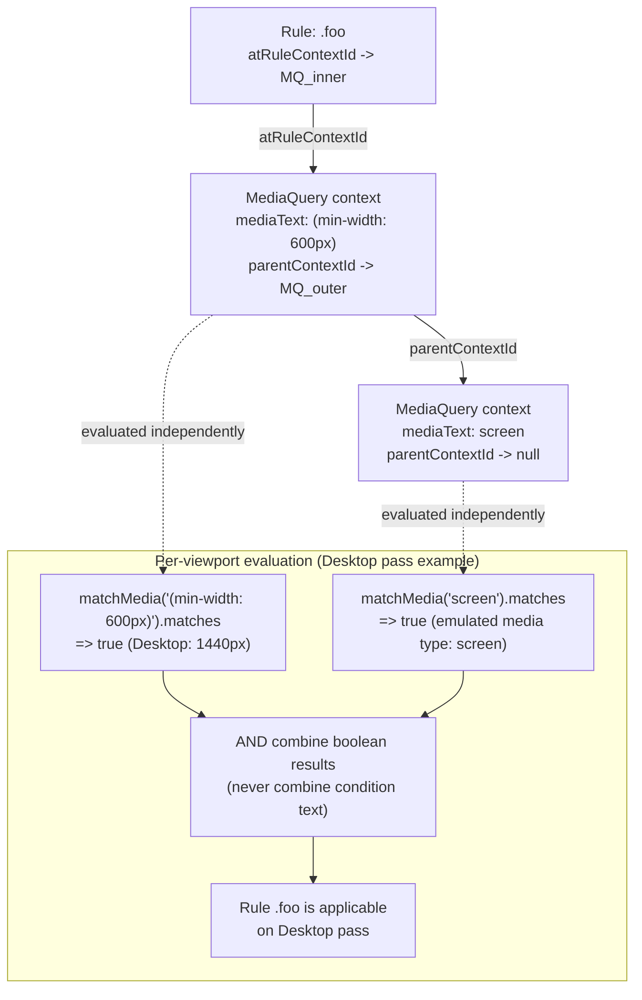
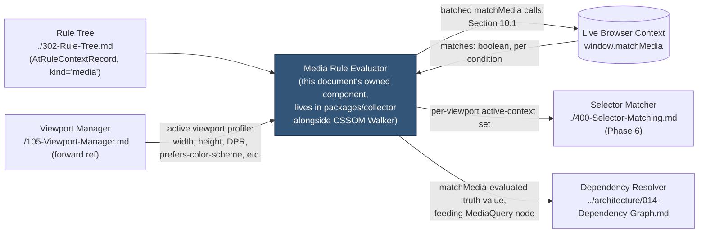
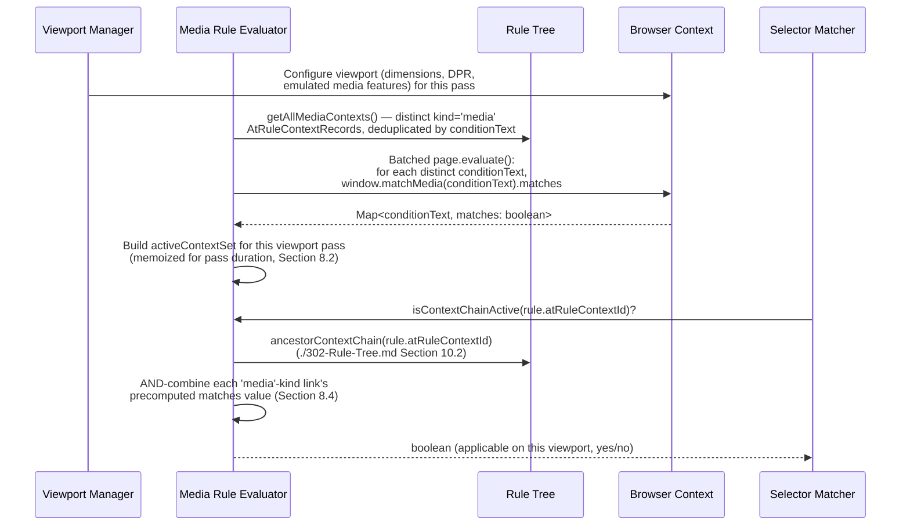

# 303 — Media Rules

## 1. Title

**Critical CSS Extraction Engine — `@media` Rule Capture, Representation, and Per-Viewport Applicability**

## 2. Version

| Field | Value |
|---|---|
| Document Version | 1.0.0 |
| Status | Draft — Phase 5 (CSSOM) |
| Last Updated | 2026-07-09 |
| Owners | Core Architecture Working Group |
| Stability | Core evaluation model stable; nested-media interaction with multi-viewport merge subject to refinement once Phase 6 Selector Matcher lands |

## 3. Purpose

This document specifies how the engine captures `@media` rules during CSSOM traversal, represents them inside the Rule Tree (`./302-Rule-Tree.md`), and — the part of this document with the most operational consequence — how it decides, per viewport profile, whether a given `@media`-guarded rule is applicable during a given extraction pass. `@media` is the single most consequential at-rule type for a multi-viewport critical CSS engine: nearly every production stylesheet uses media queries to express responsive behavior, and getting media-query applicability wrong in either direction is directly user-visible — a false negative drops a rule that should render on some viewport (causing FOUC/layout shift), and a false positive retains a rule that will never apply on a given viewport (bloating the critical CSS payload for that viewport, defeating the extraction's purpose).

This document commits to one governing design position, consistent with [ADR-0001-Browser-Is-Source-of-Truth](../adr/ADR-0001-Browser-Is-Source-of-Truth.md) and [ADR-0002-No-Custom-Selector-Parser](../adr/ADR-0002-No-Custom-Selector-Parser.md): **media query applicability is never hand-rolled.** The engine never parses `mediaText` to interpret feature/value pairs, ranges, boolean logic, or the `not`/`only`/`and`/`or` grammar itself. Every applicability decision is delegated to the browser via `window.matchMedia(mediaText).matches`, evaluated inside a browser context configured for the specific viewport profile under extraction. This is the identical "browser is source of truth" principle already applied to selector matching (Selectors delegated to `Element.matches()`) and layout/visibility (geometry delegated to `getBoundingClientRect()`/`IntersectionObserver`) — applied here to the third major CSS sub-language the engine must interpret: media query conditions.

This document covers: how `@media` rules are captured into the Rule Tree's At-Rule Context table (Section 8.4 of `./302-Rule-Tree.md`); how `matchMedia`-based evaluation is performed per viewport profile without ever hand-parsing `mediaText`; how this interacts with the multi-viewport extraction strategy (a rule can be applicable on Mobile's media query and inapplicable on Desktop's, or vice versa — inherently viewport-dependent); and how nested media queries (`@media screen { @media (min-width: 600px) { ... } }`) are represented and evaluated. It is scoped to `@media` specifically; `@supports` and `@container` follow an analogous but distinct evaluation model owned by `./304-Supports-Rules.md` (forward reference) and Phase 6's container-query work (`./405-Container-Queries.md`, forward reference) respectively.

## 4. Audience

- Implementers of the CSSOM Walker (`packages/collector`) who populate `AtRuleContextRecord`s of `kind: 'media'` during Rule Tree construction.
- Implementers of the Selector Matcher (`packages/matcher`, Phase 6, `./400-Selector-Matching.md`) and the multi-viewport orchestration layer, both of which consume per-viewport media-applicability decisions to determine the final matched rule set for a given extraction pass.
- Implementers of the Viewport Manager (`./105-Viewport-Manager.md`), whose viewport/device profile configuration is the direct input this document's evaluation algorithm depends on.
- Senior engineers reviewing whether the "always delegate to `matchMedia`" commitment is being honored correctly at every call site, given how tempting it is to special-case a "simple" media query (e.g., `(min-width: 768px)`) with a hand-rolled numeric comparison for a perceived performance win.

Readers are assumed to be senior engineers familiar with the CSS Media Queries Level 4/5 specification's feature set (width/height ranges, `prefers-color-scheme`, `prefers-reduced-motion`, `hover`, `pointer`, boolean combinators), with the `window.matchMedia` API and `MediaQueryList` object, and with this project's foundational "browser is source of truth" commitment.

## 5. Prerequisites

- [006-Design-Principles.md](../architecture/006-Design-Principles.md) — Principle 1 (Browser Is Source of Truth) and Principle 2 (No Custom Selector Parser, whose "never hand-roll a browser sub-language's grammar" spirit this document extends to media query syntax) are the direct governing constraints.
- `./302-Rule-Tree.md` — this document's `AtRuleContextRecord` schema (Section 8.4 of that document) is the structure `@media` capture populates; this document assumes that schema and does not redefine it.
- [014-Dependency-Graph.md](../architecture/014-Dependency-Graph.md) — Section 8.1's `MediaQuery` node kind and the `conditioned-by` edge kind are the Dependency Resolver's consumption of this document's evaluation results; this document is the authority on what "the `MediaQuery` node's `matchMedia(...).matches` result" (as that document's node-taxonomy table puts it) actually means and how it is computed.
- [ADR-0001-Browser-Is-Source-of-Truth](../adr/ADR-0001-Browser-Is-Source-of-Truth.md) and [ADR-0002-No-Custom-Selector-Parser](../adr/ADR-0002-No-Custom-Selector-Parser.md).
- Familiarity with `window.matchMedia`, `MediaQueryList.matches`, and the `CSSMediaRule.media` (a `MediaList`) / `media.mediaText` CSSOM surface.

## 6. Related Documents

- [006-Design-Principles.md](../architecture/006-Design-Principles.md)
- [014-Dependency-Graph.md](../architecture/014-Dependency-Graph.md) — `MediaQuery` node kind, `conditioned-by` edge
- `./302-Rule-Tree.md` — the `AtRuleContextRecord` schema this document populates for `kind: 'media'`
- `./300-CSSOM-Walker.md` (forward reference) — the traversal that discovers `CSSMediaRule` instances and hands them to this document's capture logic
- `./301-Stylesheet-Loader.md` (forward reference) — stylesheet registry that `@media` rules are traversed within
- `./304-Supports-Rules.md` (forward reference) — the analogous, but distinct, evaluation model for `@supports`, and the sibling document nested-context chains (Section 8.4 of `./302-Rule-Tree.md`) most often terminate in alongside this document's `@media` contexts
- `./305-Cascade-Layers.md` (forward reference) — cascade layer nesting, which frequently wraps or is wrapped by `@media` blocks in real stylesheets
- `./306-At-Import.md` (forward reference) — `@import` rules can themselves carry a media condition (`@import url(...) screen and (min-width: 768px)`), a case this document's evaluation model must also cover
- `./105-Viewport-Manager.md` (forward reference, Phase 3) — the source of the viewport/device profile configuration this document evaluates media queries against
- `./400-Selector-Matching.md` (forward reference, Phase 6) — consumes this document's per-viewport applicability decisions when deciding whether a candidate rule is even eligible for matching on a given pass
- [ADR-0001-Browser-Is-Source-of-Truth](../adr/ADR-0001-Browser-Is-Source-of-Truth.md)
- [ADR-0002-No-Custom-Selector-Parser](../adr/ADR-0002-No-Custom-Selector-Parser.md)

## 7. Overview

Every `@media` rule the CSSOM Walker encounters becomes one `AtRuleContextRecord` with `kind: 'media'` in the Rule Tree's At-Rule Context table (`./302-Rule-Tree.md` Section 8.4), storing the rule's raw, browser-reported `mediaText` verbatim and a `parentContextId` link if it is nested inside another conditional or layered block. This capture step is cheap, mechanical, and identical regardless of which viewport profile the engine is currently extracting for — it happens exactly once per Rule Tree construction (`./302-Rule-Tree.md` Section 10.1), not once per viewport.

**Evaluation** — deciding whether a given `MediaQuery` context is *currently active* — is where this document's real complexity lives, and it is fundamentally viewport-dependent: the same `AtRuleContextRecord` with `mediaText: "(min-width: 768px)"` evaluates to active on a 1440px Desktop viewport and inactive on a 375px Mobile viewport. Because the engine's multi-viewport strategy (Section 2.6 of `BRIEF.md`) runs independent extraction passes per viewport profile, media-query evaluation is re-run once per pass, against a browser context actually configured for that pass's viewport — never computed once and reused across viewports, and never approximated by parsing the numeric threshold out of `mediaText` and comparing it to a viewport width in Node-side JavaScript.

This document is organized as follows: Section 8 specifies the capture representation, the delegation-to-`matchMedia` evaluation model in detail (including why this is the only acceptable model, with alternatives explicitly considered and rejected), the multi-viewport interaction, and nested media query handling. Section 9 diagrams the evaluation pipeline. Section 10 provides pseudocode and complexity analysis for per-viewport applicability evaluation and for nested-media resolution. Sections 11 onward cover implementation notes, edge cases, tradeoffs, performance, testing, and future work.

## 8. Detailed Design

### 8.1 Capture: Populating the At-Rule Context Table

During Rule Tree construction (`./302-Rule-Tree.md` Section 10.1), whenever the CSSOM Walker's depth-first traversal encounters a `CSSMediaRule`, it creates exactly one `AtRuleContextRecord`:

```
{
  id: makeContextId(sourceStylesheetId, ruleIndexPath, 'media'),
  kind: 'media',
  parentContextId: <enclosing context, or null>,
  conditionText: rule.media.mediaText,   // verbatim, browser-normalized
  layerName: null
}
```

`rule.media` is a `MediaList` (the CSSOM object backing a `CSSMediaRule`'s condition), and `mediaText` is its browser-normalized serialization of the media query list. Critically, this capture step reads `mediaText` **as an opaque string** — it is stored, not interpreted. No tokenization, no feature/value extraction, no boolean-operator parsing happens at capture time. This is a deliberate, load-bearing property: capture is viewport-independent and evaluation-agnostic, which is what allows the same `AtRuleContextRecord` to be evaluated fresh, correctly, against arbitrarily many different viewport profiles later without ever needing to re-traverse the CSSOM.

Every rule (`RuleRecord`, `./302-Rule-Tree.md` Section 8.1) lexically nested inside this `@media` block receives `atRuleContextId` pointing at this record, exactly as specified generically in `./302-Rule-Tree.md` Section 8.4 — this document does not extend or modify that schema, it only specifies what `kind: 'media'` records mean and how they are evaluated.

### 8.2 Evaluation: Delegating Entirely to `window.matchMedia`

**Statement of the decision.** Determining whether a `MediaQuery` context is active for a given viewport/device profile is performed **exclusively** by calling `window.matchMedia(conditionText).matches` inside a live browser context that has been configured (viewport dimensions, device pixel ratio, `prefers-color-scheme`, `prefers-reduced-motion`, emulated media type, and any other CDP/Playwright-controllable media-relevant environment property) to match that profile. The engine never parses `conditionText` to extract a `min-width`/`max-width` numeric threshold, never implements boolean-logic evaluation (`and`/`or`/`not`/comma-separated lists) for media feature combinations, and never maintains a table of "known" media features it understands versus does not.

**Why.** This is a direct, specific application of Principle 1 and the spirit of Principle 2 from [006-Design-Principles.md](../architecture/006-Design-Principles.md), for reasons that are, if anything, more acute for media queries than for selectors:

1. **The media query grammar is large, actively evolving, and has interaction effects a hand-rolled evaluator would need to reimplement perfectly.** Beyond simple `width`/`height` ranges, the specification includes range syntax (`(400px <= width <= 700px)`), discrete-valued features (`orientation`, `hover`, `pointer`, `any-hover`, `any-pointer`, `prefers-color-scheme`, `prefers-reduced-motion`, `prefers-contrast`, `forced-colors`, `scripting`, `update`), boolean combinators with specific precedence and negation rules (`not`, `and`, `or`, comma as implicit `or`), and media-type qualifiers (`screen`, `print`, `all`). A hand-rolled evaluator attempting to replicate this is exactly the "second, inevitably divergent, rendering engine" [006-Design-Principles.md](../architecture/006-Design-Principles.md)'s Overview section warns against — and unlike selector matching, where `:has()` browser-support variance is the primary spec-conformance risk, media query evaluation risk is spread across dozens of individually low-profile but collectively significant features, any one of which a hand-rolled evaluator could silently mishandle.
2. **Some media features are not statically determinable from viewport dimensions alone even in principle**, which forecloses "just parse the numeric comparison" as a viable partial shortcut. `prefers-color-scheme`, `prefers-reduced-motion`, `hover`, `pointer`, and `forced-colors` are OS/user-preference/input-modality signals that have no textual relationship to viewport width — a hand-rolled evaluator that only handles `min-width`/`max-width` numerically and falls back to "assume true" or "assume false" for everything else is not a performance optimization of a correct algorithm, it is a silently incomplete algorithm masquerading as one, which is precisely what Principle 3 in [006-Design-Principles.md](../architecture/006-Design-Principles.md) forbids ("Skipping visibility recomputation... without an explicit, opt-in configuration flag and documented accuracy tradeoff" — the media-query analogue of that forbidden pattern).
3. **The browser already has a fully spec-compliant, continuously-updated implementation, exposed directly via `window.matchMedia`.** There is no correctness gap to close by reimplementing it, and no performance gap either — `matchMedia` evaluation is a native, highly optimized browser operation; the cost this document must manage (Section 8.3, Section 10) is the *round-trip* cost of invoking it from Node-host orchestration code across the automation-protocol boundary, not the cost of the evaluation itself.

**What this permits.**
- Calling `window.matchMedia(conditionText).matches` once per `(MediaQuery context, viewport profile)` pair, inside a browser context/page instance that has already been configured for that viewport profile via the Viewport Manager (`./105-Viewport-Manager.md`).
- Batching multiple `matchMedia` calls (for multiple distinct `conditionText` values discovered in a single Rule Tree) into a single `page.evaluate()` round trip, since this is bookkeeping over the *invocation*, not a reimplementation of the *evaluation logic* itself — directly analogous to the batched-discovery permitted pattern in [014-Dependency-Graph.md](../architecture/014-Dependency-Graph.md) Section 10.1.
- Memoizing the `(conditionText, viewportProfileId) → matches` result for the duration of a single extraction pass, since the underlying truth value cannot change mid-pass for a stable, non-resized viewport configuration (an application of Principle 3's permitted memoization pattern, exactly analogous to `Element.matches()` memoization).
- Using `matchMedia`'s returned `MediaQueryList` object's `media` property (browser-normalized echo of the input text) purely for diagnostic/logging purposes — never for a second, independent evaluation path.

**What this forbids.**
- Any code path that extracts a numeric threshold from `conditionText` via regex/string-parsing and compares it against `viewportProfile.width` in Node.js or in-page JavaScript, even for the "simple," seemingly unambiguous case of a single `(min-width: Npx)` feature — because "simple-looking" media queries are exactly where a maintainer is most tempted to special-case an optimization, and exactly where CSS Media Queries Level 4/5's range syntax, unit variety (`em`, `rem`, `vw` are all valid in some contexts), and combinators can silently invalidate an assumption the hand-rolled comparison depended on.
- A cache keyed only on `conditionText` without `viewportProfileId` as part of the key — evaluation is inherently a function of both the condition and the environment it is evaluated in (Section 8.3), and collapsing that into a `conditionText`-only cache would silently reuse a Mobile-viewport evaluation result for a Desktop pass.
- Treating `matchMedia` evaluation failure/exception (which should not occur for syntactically valid CSS, since `mediaText` is always the browser's own normalized serialization of a rule the same browser already parsed, but could occur for a browser-version feature-support gap on an exotic media feature) as equivalent to `matches: false` without a diagnostic — per Principle 6 in [006-Design-Principles.md](../architecture/006-Design-Principles.md), "cannot evaluate" and "evaluates to false" are semantically different outcomes and must be distinguishable, exactly as already established for `:has()` selector-evaluation failure in that document's Edge Cases.

**Alternatives considered and rejected.**

- **A hybrid model: hand-parse "simple" `min-width`/`max-width`-only queries for speed, delegate everything else to `matchMedia`.** Rejected outright, not merely deprioritized. The performance motivation is weak (Section 14 shows the actual bottleneck is round-trip count, not per-call evaluation cost, and batching solves that without any parsing), while the correctness risk is real and insidious: a query classified as "simple" by a naive check (e.g., "matches `/^\(min-width:\s*\d+px\)$/`") could still interact with a media *type* prefix (`screen and (min-width: 768px)`) or a comma-separated list the naive classifier fails to detect, silently reintroducing exactly the class of bug this document exists to prevent. A hybrid model also creates two divergent code paths that must be kept behaviorally identical forever, which is a maintenance liability disproportionate to any measured benefit.
- **Static analysis of `mediaText` to build a Node-side media query AST/evaluator library** (e.g., adopting a third-party media-query-parsing npm package). Rejected for the same reason third-party selector-matching libraries are rejected in [006-Design-Principles.md](../architecture/006-Design-Principles.md) Principle 2: it is a second implementation, executed outside a real browser, subject to divergence, and fails Principle 1 by definition.
- **Caching evaluation results across extraction runs (not just within a run), keyed by `(conditionText, viewportProfileId)` independent of the Cache Manager's whole-run fingerprint.** Considered as a performance idea but not adopted as a standalone mechanism — media query evaluation results for a fixed, well-known viewport profile are deterministic and rarely change, so this could in principle be a long-lived cache, but it is subsumed by, and should not duplicate, the Cache Manager's existing fingerprint-based reuse (Principle 8, [006-Design-Principles.md](../architecture/006-Design-Principles.md)); a standalone secondary cache would create a second invalidation surface to keep correct, for a marginal benefit given how cheap batched in-run evaluation already is (Section 14).

### 8.3 Interaction With the Multi-Viewport Extraction Strategy

Section 2.6 of `BRIEF.md` requires the engine to generate critical CSS independently for Mobile, Tablet, and Desktop (and any additional configured device profiles), then merge results. Media query applicability is the primary mechanism by which the *same* stylesheet legitimately produces *different* matched rule sets per viewport pass, and this document's evaluation model must compose correctly with that strategy rather than be a bolt-on afterthought.

**The core invariant.** A `MediaQuery` context's `matches` value is not a property of the context alone — it is a property of the pair `(context, viewportProfile)`. The Rule Tree (`./302-Rule-Tree.md`) is constructed once per route (its structural facts — which rules exist, their selectors, their nesting — do not vary by viewport, per that document's Section 14 caching-strategy discussion), but the *applicability* of any given `MediaQuery`-guarded rule is recomputed fresh for every viewport pass against that same, structurally-unchanged Rule Tree. Concretely: extracting critical CSS for Mobile and Desktop from the same page performs two independent `matchMedia`-evaluation sweeps over the identical set of `AtRuleContextRecord`s, and the two sweeps are expected — indeed, are the entire point of media queries existing — to disagree on some subset of contexts.

**Consequence for the Selector Matcher (Phase 6).** The Selector Matcher's per-viewport matching pass (`./400-Selector-Matching.md`, forward reference) must first resolve, for the current viewport profile, the full set of currently-active `MediaQuery` contexts (Section 10.1's algorithm), and only then consider a `RuleRecord` a matching candidate if its `atRuleContextId`'s ancestor chain (`./302-Rule-Tree.md` Section 10.2) resolves entirely to active contexts (see Section 8.4 on nested media queries for why "entirely," not "at least one," is the correct composition rule). A rule guarded by `@media (min-width: 768px)` is a valid Selector Matcher candidate on the Desktop pass and is filtered out before `Element.matches()` is even attempted on the Mobile pass — this filtering happens once per viewport pass over the small number of distinct `MediaQuery` contexts (typically tens, not thousands, even in large stylesheets), not once per rule, which is why Section 8.2's batching permission matters more for overall pipeline cost than any per-rule optimization would.

**Consequence for merge (Section 2.6 of `BRIEF.md`).** Because a rule matched on Mobile but not Desktop (or vice versa) is a *legitimate, expected* per-viewport difference — not a bug to reconcile away — the merge step that Section 2.6 describes ("merge by: identical rules, media query normalization, dependency deduplication") must preserve the viewport-conditional structure of such rules in the merged output rather than collapsing them into a single unconditional rule. A rule that only matched on Desktop should reappear in the merged critical CSS still wrapped in its original `@media (min-width: 768px)` guard (or an equivalent, normalized guard), so that the merged critical CSS remains correct when served to the actual range of client viewports in production, rather than being incorrectly hoisted out of its guard as if it always applied. This document does not own the merge algorithm itself (a Serializer concern, `../design/601-Rule-Ordering.md`/`602-Deduplication.md`, Phase 8, not yet written) but establishes the invariant those documents must respect: **this document's evaluation results are inputs to per-viewport matching, never license to discard the original media guard from the output.**



### 8.4 Nested Media Queries

CSS permits nesting `@media` blocks inside other `@media` blocks (`@media screen { @media (min-width: 600px) { .foo { ... } } }`), and this is distinct from — though it can be confused with — a single `@media` rule with a comma/`and`-combined condition list (`@media screen and (min-width: 600px) { ... }`), which the browser's own CSSOM already represents as a single `CSSMediaRule` with a single, already-combined `mediaText`.

**Representation.** Nested `@media` blocks are captured as a **chain of `AtRuleContextRecord`s**, exactly per the general nesting mechanism already specified in `./302-Rule-Tree.md` Section 8.4: the outer `@media screen { ... }` becomes one context record; the inner `@media (min-width: 600px) { ... }` becomes a second context record whose `parentContextId` points at the first. This document introduces no new schema — nested media queries are simply the `kind: 'media'` case of the general parent-context-chain mechanism, and a chain can contain multiple `'media'`-kind links in a row (unlike, say, a `'layer'`-then-`'media'` chain, which mixes kinds).

**Evaluation composition rule: conjunction (AND), not disjunction (OR).** A rule nested inside two `@media` blocks is only applicable when *both* conditions are independently true — this mirrors the CSS specification's own behavior for nested conditional groups (nesting is lexical containment; the browser only renders a nested block's contents when every enclosing conditional context is satisfied) and is exactly analogous to how nested `@supports`/`@layer`/`@container` contexts already compose in this engine's general model. The evaluation algorithm (Section 10.1) therefore walks the *entire* ancestor context chain (`./302-Rule-Tree.md` Section 10.2's `ancestorContextChain`) for a candidate rule and requires every `'media'`-kind (and, by the same general rule, every `'supports'`/`'container'`-kind) link in that chain to independently evaluate `true` via its own `matchMedia` (or construct-appropriate) call — it is never sufficient for only the innermost or only the outermost condition to hold.

**Why not pre-combine nested conditions into a single synthetic `mediaText` string and call `matchMedia` once?** This was considered — e.g., synthesizing `"screen and (min-width: 600px)"` from the two nested `mediaText` values and issuing one `matchMedia` call instead of two. It is rejected as the primary mechanism for a subtle but important reason: synthesizing a combined media query string requires the engine to understand media query *combination* grammar well enough to concatenate two conditions correctly (in particular, handling the case where an outer condition is itself a comma-separated list, e.g., `@media screen, print { @media (min-width: 600px) { ... } }`, whose correct combination is `(screen or print) and (min-width: 600px)`, not a naive string join) — this is precisely the kind of media-query-grammar knowledge Section 8.2 forbids the engine from encoding. Evaluating each nesting level independently via its own unmodified, browser-reported `mediaText` and combining the *boolean results* (not the *condition text*) with a simple logical AND sidesteps this entirely: boolean AND composition is not CSS-media-query-grammar knowledge, it is ordinary conditional-logic composition, identical in kind to how the engine already composes `member-of`/`conditioned-by` chains generically. This is the same "compose browser-verified boolean outcomes, never compose browser-syntax text" discipline [006-Design-Principles.md](../architecture/006-Design-Principles.md) Principle 2 already applies to selector-list splitting (comma-separated selector lists may be split as pure bookkeeping, but never semantically re-parsed).



## 9. Architecture

### 9.1 Component Placement



### 9.2 Sequence: One Viewport Pass's Media Evaluation



## 10. Algorithms

### 10.1 Algorithm: Per-Viewport Media-Context Applicability Evaluation

**Problem statement.** Given the full set of `MediaQuery`-kind `AtRuleContextRecord`s discovered in a Rule Tree and a specific viewport profile, determine which contexts are currently active for that viewport, without parsing or interpreting `conditionText`, and expose an efficient, memoized per-rule "is my full ancestor chain active" predicate for the Selector Matcher to consume.

**Inputs.** `mediaContexts: AtRuleContextRecord[]` (all `kind: 'media'` records from the Rule Tree, `./302-Rule-Tree.md` Section 8.4); `viewportProfile: ViewportProfile` (from `./105-Viewport-Manager.md`); `browserContext` (already configured for `viewportProfile` by the Viewport Manager prior to this algorithm running).

**Outputs.** `activeContextMap: Map<contextId, boolean>` — one boolean per `MediaQuery` context, plus a derived `isChainActive(ruleAtRuleContextId): boolean` function usable by the Selector Matcher.

**Pseudocode.**

```text
function evaluateMediaApplicability(mediaContexts, viewportProfile, browserContext) -> ActiveContextIndex:
    // Step 1: deduplicate by conditionText — many rules commonly share
    // the exact same @media condition (e.g., a whole responsive section
    // of a design system under one breakpoint), so evaluate each
    // distinct condition text exactly once, never once per context record.
    distinctConditions = distinct(mediaContexts.map(c => c.conditionText))

    // Step 2: single batched round trip into the browser context.
    // This is the one and only place window.matchMedia is invoked;
    // conditionText is passed through completely unmodified.
    resultsByText = browserContext.evaluate(
        (conditions) => {
            const out = {}
            for (const text of conditions) {
                out[text] = window.matchMedia(text).matches
            }
            return out
        },
        distinctConditions
    )

    // Step 3: map each context record to its (already deduplicated) result.
    activeByContextId = Map<string, boolean>()
    for context in mediaContexts:
        activeByContextId[context.id] = resultsByText[context.conditionText]

    return ActiveContextIndex(activeByContextId, viewportProfile.id)

function isChainActive(ruleAtRuleContextId, activeContextIndex, ruleTree) -> boolean:
    if ruleAtRuleContextId == null:
        return true  // no governing context at all; unconditionally applicable
    chain = ruleTree.ancestorContextChain(ruleAtRuleContextId)  // ./302-Rule-Tree.md Section 10.2
    for context in chain:
        if context.kind == 'media':
            if not activeContextIndex.get(context.id):
                return false  // AND-composition: any inactive link fails the whole chain
        // 'supports'/'layer'/'container' links are evaluated by their own
        // owning documents (304, 305, container-query work) using the
        // same AND-composition discipline; this function's 'media'-only
        // branch composes correctly alongside them because every kind
        // contributes an independent boolean into the same AND chain.
    return true
```

**Time complexity.** Step 1 (dedup) is `O(m)` where `m` is total `'media'`-kind context count. Step 2 is a single round trip evaluating `O(u)` distinct condition texts where `u <= m` (typically `u << m` in real stylesheets, since breakpoints are heavily reused), and the in-browser evaluation cost of `u` `matchMedia` calls is dominated by round-trip latency, not per-call cost (native browser operation). Step 3 is `O(m)`. `isChainActive` for a single rule is `O(d)` where `d` is chain depth (small, bounded, per `./302-Rule-Tree.md` Section 8.2's nesting-depth argument); called once per candidate rule during Selector Matcher filtering, total cost across all rules is `O(R * d)` where `R` is rule count — this is why the deduplicated, precomputed `activeByContextId` map (rather than re-invoking `matchMedia` per rule) is essential: without it, cost would be `O(R)` browser round trips instead of `O(u)`.

**Memory complexity.** `O(m)` for `activeByContextId`; `O(u)` transient for the batched call's input/output payload. Negligible relative to Rule Tree memory footprint (`./302-Rule-Tree.md` Section 14).

**Failure cases.** A `matchMedia` call throwing or returning an unexpected shape for a syntactically valid `mediaText` should not occur in a spec-compliant browser (the text is the browser's own prior normalization of a rule it already parsed successfully during stylesheet load) but, per Section 8.2's forbidding of silent-false substitution, any anomaly here must surface as a diagnostic (`MediaQueryEvaluationError`, attributed to the specific `conditionText` and `viewportProfile.id`) rather than defaulting the affected contexts to `false`; a browser/engine version lacking support for a specific media feature (e.g., a very new Level 5 feature on an older Chromium build controlled by `../adr/ADR-0003-Playwright-As-Browser-Abstraction.md`'s pinned version) causes `matchMedia` to return a `MediaQueryList` whose `.matches` is deterministically `false` per spec for unrecognized features (unknown features are treated as never-matching, not as parse errors) — this is correct, browser-defined behavior, not an engine bug, and requires no special handling, but should still be visible in diagnostics as an "unrecognized/unsupported media feature" note when detectable, to aid debugging of unexpectedly-dropped rules on older browser targets.

**Optimization opportunities.** The deduplicated `distinctConditions` batching (Step 1-2) is the primary optimization and is mandatory, not optional, per Section 8.2's explicit permission for batching. A secondary opportunity: `activeByContextId` results for viewport profiles that share identical relevant media-feature values (e.g., two device profiles that differ only in device pixel ratio but agree on width/height/`prefers-color-scheme`) could in principle be shared, but this requires knowing in advance which media features a given `conditionText` set actually depends on — which would require the exact grammar-inspection this document forbids — so this optimization is explicitly not pursued; the cost of a fresh per-viewport batched evaluation (Section 14) is low enough that this added complexity is not justified.

### 10.2 Algorithm: Nested-Media Ancestor Chain Composition (Detail of `isChainActive`)

**Problem statement.** Given a rule nested inside an arbitrary-depth mixture of `@media` (and, generically, `@supports`/`@layer`/`@container`) contexts, compute the single boolean "is this rule reachable at all" by composing each context kind's own independently-evaluated boolean via logical AND, without synthesizing combined condition text (Section 8.4's rejected alternative).

**Inputs.** `ruleAtRuleContextId: string`; `activeContextIndex` (from Algorithm 10.1, and its `'supports'`/`'layer'`/`'container'` analogues from sibling documents); `ruleTree: RuleTree`.

**Outputs.** `boolean`.

**Pseudocode.** (Shown inline as the body of `isChainActive` above, Section 10.1; restated here with explicit complexity framing since it is the specific mechanism Section 8.4 defends.)

```text
// See Section 10.1's isChainActive. The essential property being specified
// here is composition order-independence: AND is commutative and
// associative, so the order in which the ancestor chain is walked
// (innermost-first, per ./302-Rule-Tree.md Section 10.2's convention)
// does not affect the result — this is what makes independent,
// per-kind evaluation (Section 8.2/8.4) safe to compose generically
// across document boundaries (this document's 'media' links interleave
// arbitrarily with 304's 'supports' links and 305's 'layer' links in
// the same chain, and the composition function does not need to know
// which kind it is looking at beyond dispatching to the right
// precomputed boolean source).
```

**Time complexity.** `O(d)` per rule, `d` = chain depth, as stated in Section 10.1.

**Memory complexity.** `O(d)` transient (the materialized chain array from `ancestorContextChain`); amortized to near-zero if `./302-Rule-Tree.md` Section 10.2's optional eager-precomputation optimization is adopted.

**Failure cases.** A chain containing a context `kind` this function does not recognize (a future at-rule type, per `./302-Rule-Tree.md` Edge Cases' open-enum design) must fail toward "cannot determine applicability, treat as not-yet-supported" with a diagnostic, not toward silently skipping that link (which would be equivalent to treating it as trivially `true`, an unsound default under Principle 6, [006-Design-Principles.md](../architecture/006-Design-Principles.md)).

**Optimization opportunities.** Short-circuit evaluation: since AND-composition can return `false` as soon as any link is inactive, the chain walk should check `'media'`/`'supports'`/`'container'` links (cheap map lookups against a precomputed index) before any hypothetically more expensive link kind, though in the current architecture every kind's applicability is precomputed identically cheaply, so this is a minor, defensive ordering concern rather than a measured bottleneck.

## 11. Implementation Notes

- The batched `matchMedia` evaluation call (Section 10.1, Step 2) should execute inside the same `page.evaluate()` wave as other per-viewport-pass browser queries where feasible (e.g., alongside any `@supports`/`CSS.supports()` batch from `./304-Supports-Rules.md`), rather than as a separate round trip, to minimize total automation-protocol round-trip count for a single viewport pass, consistent with the general batching discipline established in [014-Dependency-Graph.md](../architecture/014-Dependency-Graph.md) Section 11.
- The Viewport Manager (`./105-Viewport-Manager.md`) must configure *all* media-relevant environment properties before this document's evaluation runs, not just width/height — `prefers-color-scheme`, `prefers-reduced-motion`, `forced-colors`, and the emulated media type (`screen` vs. `print`) are all independently controllable via Playwright's `page.emulateMedia()`-equivalent API and all affect `matchMedia` results; an incomplete viewport-profile configuration silently produces incorrect applicability decisions that this document's delegation model cannot itself detect, since delegation is only as correct as the environment it delegates into.
- `distinctConditions` deduplication (Section 10.1, Step 1) must key on the exact `conditionText` string, not a normalized/trimmed variant, unless the normalization is itself something the browser already performed (recall `conditionText` is already browser-normalized `mediaText` at capture time, `./302-Rule-Tree.md` Section 8.1 / this document Section 8.1) — introducing a second, engine-side normalization step for deduplication purposes would risk conflating two `conditionText` values that are textually different but that the engine's own normalization treats as identical, reintroducing exactly the "engine judges media query equivalence" problem this document delegates away.
- `activeContextIndex` (Section 10.1's output) must be scoped and discarded per extraction pass (never reused across a Mobile pass and a subsequent Desktop pass), and must be keyed/tagged with the `viewportProfile.id` it was computed against, so that a defensive assertion can catch any accidental cross-viewport reuse during development — this directly operationalizes the "forbids" list in Section 8.2 regarding cache keys that omit `viewportProfileId`.

## 12. Edge Cases

- **`@import` with a trailing media condition.** `@import url("print.css") print;` attaches a media condition to the *entire imported stylesheet*, not to a single rule. Per `./306-At-Import.md`'s flattening contract (forward reference), this must be represented as if every rule in the imported stylesheet were wrapped in an implicit `@media print { ... }` context — i.e., a synthetic `AtRuleContextRecord` of `kind: 'media'` is created at the import site, and every flattened-in rule's `atRuleContextId` chain includes it, evaluated by this document's ordinary `matchMedia` mechanism with no special-casing beyond the synthetic-context creation itself, which is `./306-At-Import.md`'s responsibility, not this document's.
- **Media queries referencing custom media features via `@custom-media` (still experimental/non-standard in most engines) or CSS environment variables in media contexts.** Where a target browser engine does not support such a feature at all, `window.matchMedia` on text containing it should, per spec-defined graceful degradation, evaluate the unrecognized portion as never-matching rather than throwing — this document treats that as correct, delegated behavior (Section 10.1's Failure Cases) requiring no engine-side special-casing, only diagnostic visibility.
- **Zero distinct media conditions in a stylesheet with no `@media` usage at all.** `evaluateMediaApplicability` (Section 10.1) with `mediaContexts.length === 0` must short-circuit to an empty batched call (or skip the browser round trip entirely) rather than issuing a wasted round trip — a cheap but easily-missed optimization, called out here because "no `@media` at all" is a common real-world case (older or simpler stylesheets) that should not pay any part of this document's evaluation cost.
- **A `MediaQuery` context whose `conditionText` is the empty string or the bare `all` keyword.** Both are valid CSS (an `@media {}` block, while unusual, is syntactically legal, as is `@media all { ... }`) and both evaluate to always-`true` per spec; delegation to `matchMedia('')`/`matchMedia('all')` handles this correctly without special-casing, but test fixtures should explicitly cover this to confirm the delegation model does not silently mishandle degenerate-but-legal input.
- **Viewport resize mid-extraction-pass.** If a plugin hook or an unexpected page-side script resizes the viewport after the Viewport Manager's initial configuration but before this document's evaluation completes, memoized `activeContextIndex` results (Section 8.2's permitted memoization) become stale for the remainder of the pass; this is guarded architecturally by the same DOM/CSSOM-snapshot-stability precondition already required for Selector Matcher and Dependency Resolver correctness (per [001-Vision.md](../architecture/001-Vision.md) Section 8.1's post-hydration stability requirement, referenced analogously in [014-Dependency-Graph.md](../architecture/014-Dependency-Graph.md) Edge Cases) — this document assumes, rather than re-establishes, that stability guarantee.
- **Print stylesheets and non-`screen` media types on a Mobile/Tablet/Desktop-only viewport matrix.** If no configured viewport profile ever emulates `print` media, every rule exclusively guarded by `@media print` will be inapplicable on every configured pass and thus never appear in any viewport's critical CSS — this is correct behavior given the roadmap's Section 2.6 viewport-profile scope (Mobile/Tablet/Desktop, not print), but should be called out in Reporter diagnostics (a `PrintOnlyRulesExcluded` informational note, not a warning) so that a user is not confused about why print-specific rules never surface in any critical CSS output, consistent with the fail-loud-not-silent posture of Principle 6.
- **Future CSS Media Queries specifications (e.g., further Level 5/6 features).** Because this document never inspects feature grammar, no engine-side change is required when new media features are standardized and shipped in the target browser engine — the delegation model is, by construction, forward-compatible with the entire future evolution of the media query grammar, which is the single strongest practical argument in this document's favor and is called out explicitly here as the intended behavior, not an incidental side effect.

## 13. Tradeoffs

| Decision | Why | Alternative Considered | Tradeoff Accepted |
|---|---|---|---|
| Delegate all `@media` applicability evaluation to `window.matchMedia`, never hand-parse `mediaText` | Media query grammar is large, evolving, and has non-textually-determinable features (`prefers-color-scheme`, `hover`, etc.); browser already implements it correctly | Hand-rolled numeric parser for "simple" `min-width`/`max-width` queries, delegate the rest | Cannot bypass the browser-round-trip cost even for trivial-looking conditions; mitigated by batching (Section 10.1), which removes most of the cost this alternative would have saved anyway |
| Compose nested media contexts by AND-ing independently-evaluated booleans, never by synthesizing combined `mediaText` | Combining condition *text* correctly requires media-query-combination grammar knowledge (handling nested comma-lists, media-type prefixes) that Principle 2's spirit forbids; combining *boolean results* requires no such knowledge | Synthesize a single combined `mediaText` string per nesting chain and call `matchMedia` once per rule-chain instead of once per nesting level | One extra `matchMedia` call per nesting level instead of one combined call; negligible given deduplication (Section 10.1) already collapses shared conditions across many rules |
| Deduplicate `matchMedia` calls by distinct `conditionText`, batched into one round trip per viewport pass | Real stylesheets reuse a small number of breakpoints across many rules; per-rule evaluation would be needlessly expensive | Evaluate `matchMedia` once per rule at match time, no precomputed index | Requires an extra data structure (`activeContextIndex`) and a discipline of scoping/discarding it per pass, in exchange for reducing round-trip count from `O(R)` to `O(u)`, `u << R` |
| Treat `@import`'s trailing media condition as a synthetic wrapping context rather than a rule-record field | Keeps the "media condition" concept uniformly represented as an `AtRuleContextRecord`, reusing all of this document's machinery unchanged for a superficially different syntactic form | A dedicated `importMediaCondition` field on affected `RuleRecord`s | Slightly more indirection at capture time (owned by `306-At-Import.md`) in exchange for zero special-casing anywhere in this document's evaluation logic |

## 14. Performance

- **CPU complexity.** Per viewport pass: `O(u)` browser-native `matchMedia` evaluations (Section 10.1), where `u` is distinct condition-text count, typically small (tens) even in large stylesheets; `O(R * d)` cheap map-lookup-based chain composition across all candidate rules, dominated in practice by map access cost, not by any parsing or grammar work, since none occurs.
- **Memory complexity.** `O(m)` for the per-pass active-context map, `O(u)` transient for the batched call payload — both small relative to Rule Tree memory (`./302-Rule-Tree.md` Section 14).
- **Caching strategy.** Within a single extraction pass, `activeContextIndex` is memoized for the pass's duration (Section 8.2); across passes for the *same route*, the underlying `MediaQuery` context set (structural facts from the Rule Tree) is unchanged and reusable, but the *evaluated* `matches` values are not, and must be recomputed per viewport profile — this document's caching boundary is therefore one level "below" the Rule Tree's own cross-viewport structural reuse (`./302-Rule-Tree.md` Section 14), which is the correct place for it given that applicability, not structure, is what varies by viewport.
- **Parallelization opportunities.** The batched `matchMedia` call for a given viewport pass has no useful sub-parallelism (it is already a single, cheap round trip); however, the three (or more) viewport passes themselves are architecturally independent of one another (per Section 2.6 of `BRIEF.md`, distinct browser contexts/pages per profile) and can run concurrently across a browser pool, which is the primary parallelization lever relevant to this document, owned by the Browser Manager/Browser Pool (`./102-Browser-Pool.md`, Phase 3) rather than by this document itself.
- **Incremental execution.** If a Cache Manager fingerprint hit (Principle 8, [006-Design-Principles.md](../architecture/006-Design-Principles.md)) occurs for a given `(route, viewport, mode)` combination, this document's evaluation is skipped entirely, not merely accelerated — consistent with the general incremental-caching architecture; absent a full cache hit, there is no meaningful further incremental-execution opportunity within a single pass's media evaluation, since it is already a single batched, cheap operation.
- **Profiling guidance.** If media-query evaluation ever appears as a measurable contributor to per-pass wall-clock time in profiling (an unlikely but checkable outcome), the first suspect should be an accidentally unbatched call site (one `matchMedia` invocation per rule rather than per distinct condition, i.e., Section 10.1's Step 1 deduplication being bypassed somewhere) rather than `matchMedia`'s own native cost, which is negligible.
- **Scalability limits.** This document's cost scales with distinct condition-text count, not rule count, and distinct condition-text count is bounded in practice by the number of meaningfully different breakpoints/media-feature combinations a design system actually uses (rarely more than a few dozen even in very large enterprise stylesheets) — this is a comfortably scalable component of the overall pipeline and is not expected to become a bottleneck even at the "tens of thousands of rules" enterprise scale `./302-Rule-Tree.md` Section 8.5 is specifically concerned with, precisely because rule count and distinct-condition count are only weakly correlated.

## 15. Testing

- **Unit tests.** `evaluateMediaApplicability` and `isChainActive`'s composition logic should be tested against synthetic `AtRuleContextRecord` fixtures (no real browser) with a mocked `matchMedia` response map, covering: single-level media contexts, multi-level nested media contexts (verifying AND-composition), mixed `'media'`/`'supports'`/`'layer'` chains (verifying kind-agnostic composition per Section 10.2), and the `ruleAtRuleContextId == null` unconditional-applicability case.
- **Integration tests.** Real Playwright-driven evaluation against fixtures covering: standard `min-width`/`max-width` breakpoints across configured Mobile/Tablet/Desktop profiles (verifying the core viewport-dependent-matching claim from Section 8.3 with concrete before/after matched-rule-set diffs per viewport), `prefers-color-scheme`/`prefers-reduced-motion`-guarded rules evaluated against profiles that vary those settings independently of viewport dimensions, nested `@media` blocks (verifying the AND-composition example from Section 8.4 end-to-end against a real browser), and `@import`-with-media-condition fixtures (verifying the synthetic-context mechanism from Edge Cases).
- **Visual tests.** Rendering-parity visual regression across the full configured viewport matrix (per [001-Vision.md](../architecture/001-Vision.md) Section 15) is the ultimate oracle for this document's correctness — an incorrectly evaluated media query manifests as a visible difference between the critical-CSS-only render and the full-CSS render specifically on the viewport(s) where the evaluation was wrong, and this class of bug is exactly what multi-viewport visual diffing is designed to catch.
- **Stress tests.** A fixture with a very large number of distinct media conditions (e.g., a design system with dozens of named breakpoints, each independently used) should be exercised to verify the deduplication-and-batching mechanism (Section 10.1) keeps round-trip count proportional to distinct-condition count, not rule count, even as rule count scales into the enterprise range covered by `./302-Rule-Tree.md` Section 15's stress fixtures.
- **Regression tests.** Any production bug involving incorrect per-viewport media applicability (e.g., a rule that should have applied on Tablet but was dropped, or vice versa) gains a permanent fixture + golden per-viewport-matched-rule-set snapshot, consistent with this documentation set's general golden-snapshot regression philosophy.
- **Benchmark tests.** `benchmarks/` should track total round-trip count and wall-clock cost of media evaluation per viewport pass across the `fixtures/enterprise-huge/` stylesheet variant (per `./302-Rule-Tree.md` Section 15), to confirm the O(distinct-conditions) scaling claim in Section 14 holds in practice as that fixture grows.

## 16. Future Work

- **Container query (`@container`) evaluation is a close structural cousin of this document's model but is explicitly out of scope here** — `./405-Container-Queries.md` (Phase 6, forward reference) will need to address a materially harder version of the "viewport-dependent" problem this document solves for `@media`, because container query truth depends on ancestor container *element* size, not just the document viewport, which interacts with the Visibility Engine's geometry computations (Phase 4) in ways `@media` evaluation does not; this document's AND-composition and delegation-only principles should carry over directly, but the *inputs* to evaluation are materially more complex and deserve their own careful treatment.
- **Cross-viewport-profile evaluation result sharing for profiles agreeing on all media-relevant features except one** (Section 10.1's rejected secondary optimization) — revisit if profiling data (Section 14) ever shows this document's evaluation cost as a non-negligible fraction of total per-pass time, which is not currently expected but should be confirmed empirically once Phase 5 implementation and Phase 14 benchmarking exist.
- **Formal test-suite alignment with the CSS Media Queries Level 5 specification's own test suite (WPT)**, analogous to the WPT-alignment idea already flagged for selector conformance in [006-Design-Principles.md](../architecture/006-Design-Principles.md) Future Work — would strengthen confidence that the delegation model (Section 8.2) remains correct as new media features ship in target browser engines, without the engine needing to track those features itself.
- **Open question: should `PrintOnlyRulesExcluded`-style informational diagnostics (Edge Cases) be extended into a general "media type coverage report"** showing which media types/features appear in a stylesheet but are never satisfied by any configured viewport profile, as a proactive authoring aid (e.g., flagging a `@media (prefers-contrast: more)` block that no configured profile ever exercises, which may indicate a testing gap in the *page's own* responsive design, not an engine bug) — flagged as a Reporter/diagnostics enhancement idea (Phase 13, `docs/design/1000-Diagnostics-Overview.md`, not yet written) rather than committed scope here.
- **Open question: how should the eventual multi-viewport merge algorithm (Phase 8, `docs/design/601-Rule-Ordering.md`/`602-Deduplication.md`) represent a rule that matched under textually-different but semantically-equivalent media conditions across two stylesheets** (e.g., `(min-width: 768px)` in one file and `(min-width:768px)` — differing only in whitespace — in another, both browser-normalized identically by `mediaText` at capture time per Section 8.1, so this specific example is likely already a non-issue, but the general question of semantically-equivalent-but-textually-distinct conditions, e.g. `(min-width: 768px)` vs. `(width >= 768px)`, remains open and is explicitly deferred to the Serializer's ownership since resolving it would require exactly the grammar-level equivalence judgment this document declines to make).

## 17. References

- [006-Design-Principles.md](../architecture/006-Design-Principles.md)
- [014-Dependency-Graph.md](../architecture/014-Dependency-Graph.md)
- `./302-Rule-Tree.md`
- `./300-CSSOM-Walker.md` (forward reference, Phase 5)
- `./301-Stylesheet-Loader.md` (forward reference, Phase 5)
- `./304-Supports-Rules.md` (forward reference, Phase 5)
- `./305-Cascade-Layers.md` (forward reference, Phase 5)
- `./306-At-Import.md` (forward reference, Phase 5)
- `./105-Viewport-Manager.md` (forward reference, Phase 3)
- `./400-Selector-Matching.md` (forward reference, Phase 6)
- `./405-Container-Queries.md` (forward reference, Phase 6)
- [ADR-0001-Browser-Is-Source-of-Truth](../adr/ADR-0001-Browser-Is-Source-of-Truth.md)
- [ADR-0002-No-Custom-Selector-Parser](../adr/ADR-0002-No-Custom-Selector-Parser.md)
- W3C CSS Object Model (CSSOM) specification — `CSSMediaRule`, `MediaList` — https://www.w3.org/TR/cssom-1/
- W3C Media Queries Level 4 specification — https://www.w3.org/TR/mediaqueries-4/
- W3C Media Queries Level 5 specification (range syntax, `prefers-contrast`, `forced-colors`, `scripting`, `update`) — https://www.w3.org/TR/mediaqueries-5/
- MDN `Window.matchMedia()` / `MediaQueryList` reference — evaluation semantics for unrecognized features referenced in Section 10.1's Failure Cases
