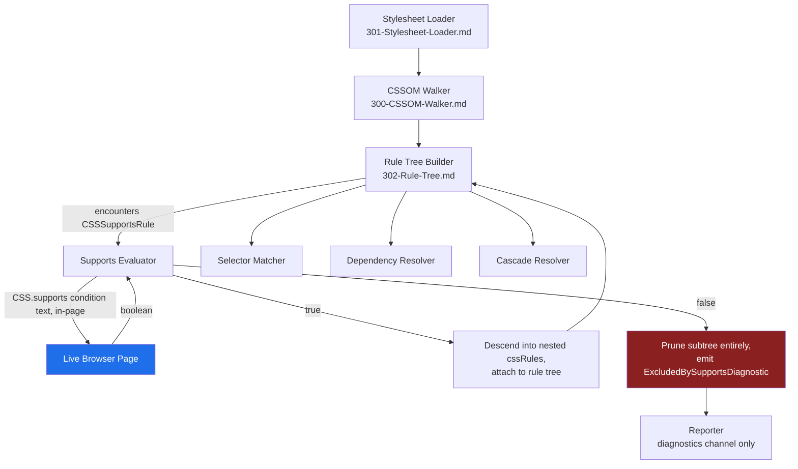

# CSSOM Walker: `@supports` Feature-Query Rule Handling

## Version

1.0.0 — Phase 5 (CSSOM)

## Purpose

This document specifies how the CSSOM Walker discovers, evaluates, and prunes `@supports` feature-query rules during rule-tree construction. It defines the exact boundary between "asking the browser whether a feature query is true" (permitted, mandatory) and "parsing or interpreting feature-query grammar in engine code" (forbidden, per [ADR-0002-No-Custom-Selector-Parser](../adr/ADR-0002-No-Custom-Selector-Parser.md)). It also specifies the dead-code-elimination behavior required so that rules nested inside a false `@supports` block are never presented as extraction candidates to the Selector Matcher, Cascade Resolver, or any other downstream consumer.

`@supports` is, structurally, the simplest of the CSSOM's three major conditional-group rule types (the others being `@media`, covered in [303-Media-Rules.md](./303-Media-Rules.md), and `@layer`, covered in [305-Cascade-Layers.md](./305-Cascade-Layers.md)) because its condition is a pure boolean over static feature-support facts rather than a runtime-varying viewport/container state. That simplicity is precisely why it is dangerous to get wrong: engineers reach for "just parse the feature-query string, it's simple boolean logic" far more readily than they would for a full media-query parser, and that impulse is the exact failure mode this document forecloses.

## Audience

Senior engineers implementing or reviewing the CSSOM Walker, the Rule Tree builder ([302-Rule-Tree.md](./302-Rule-Tree.md)), and any module that consumes the rule tree downstream (Selector Matcher, Dependency Resolver, Cascade Resolver). Assumes familiarity with the CSS Conditional Rules Module Level 3/4 specification, the `CSSSupportsRule` CSSOM interface, and the project's foundational principles in [006-Design-Principles.md](../architecture/006-Design-Principles.md).

## Prerequisites

- Familiarity with [300-CSSOM-Walker.md](./300-CSSOM-Walker.md) — the general traversal algorithm this document specializes for `@supports`
- Familiarity with [302-Rule-Tree.md](./302-Rule-Tree.md) — the in-memory rule-tree representation that `@supports` filtering feeds into
- Familiarity with [ADR-0002-No-Custom-Selector-Parser](../adr/ADR-0002-No-Custom-Selector-Parser.md) — the governing decision this document applies to feature-query grammar
- Familiarity with [006-Design-Principles.md](../architecture/006-Design-Principles.md), specifically Principle 1 (Browser Is Source of Truth) and Principle 2 (Never Implement a Custom Selector Parser)
- Working knowledge of `CSS.supports()`, `CSSSupportsRule.conditionText`, and the `@supports selector()` syntax

## Related Documents

- [300-CSSOM-Walker.md](./300-CSSOM-Walker.md) — parent traversal algorithm
- [301-Stylesheet-Loader.md](./301-Stylesheet-Loader.md) — how stylesheets are loaded prior to walking
- [302-Rule-Tree.md](./302-Rule-Tree.md) — the rule-tree data structure that supports-filtering populates
- [303-Media-Rules.md](./303-Media-Rules.md) — sibling conditional-group-rule handling for `@media`
- [305-Cascade-Layers.md](./305-Cascade-Layers.md) — sibling at-rule handling for `@layer`, including how `@layer` and `@supports` can nest around each other
- [306-At-Import.md](./306-At-Import.md) — how `@import` conditions (including `@import ... supports(...)`) interact with this document's evaluation model
- [307-Constructable-Stylesheets.md](./307-Constructable-Stylesheets.md) — adopted stylesheets, which can also contain `@supports` rules
- [ADR-0002-No-Custom-Selector-Parser](../adr/ADR-0002-No-Custom-Selector-Parser.md) — governs why feature-query grammar is never hand-parsed
- [006-Design-Principles.md](../architecture/006-Design-Principles.md) — Principles 1, 2, and 3 (Correctness Over Premature Optimization) all bear directly on this document

## Overview

`@supports` is a conditional-group rule (per the CSS Conditional Rules Module) whose block of nested rules is only "live" — eligible to participate in the cascade at all — when its feature-query condition evaluates to true in the browser executing the page. The CSSOM exposes this as `CSSSupportsRule`, a subtype of `CSSConditionRule`/`CSSGroupingRule`, with a `conditionText` string property and a `cssRules` list of nested rules exactly like `CSSMediaRule`.

There are three distinct condition grammars a `@supports` block's `conditionText` may contain:

1. **Declaration-support queries**: `(display: grid)`, `(color: oklch(0% 0% 0))` — "does this property/value pair parse and is it supported."
2. **Boolean combinators**: `and`, `or`, `not`, and parenthesized grouping of the above, e.g. `(display: grid) and (gap: 1rem)`, `not (display: contents)`.
3. **Selector-support queries** (`@supports selector(...)`), introduced to let authors gate rules on selector support (e.g. `@supports selector(:has(a))`) rather than property/value support.

The engine's position, consistent with [ADR-0002](../adr/ADR-0002-No-Custom-Selector-Parser.md)'s governing philosophy extended to this at-rule, is: **the engine never parses or evaluates any of these three grammars itself.** All three reduce to a single call: `CSS.supports(conditionText)`, executed inside the live browser page context established per Principle 1 of [006-Design-Principles.md](../architecture/006-Design-Principles.md). `CSS.supports()` natively understands declaration queries, the `and`/`or`/`not` boolean grammar (including arbitrary nesting and parenthesization), and, since browsers that implement `@supports selector()` also implement the two-argument or one-argument `CSS.supports('selector(...)')` form, selector-support queries as well. There is no case in the feature-query grammar that requires the engine to understand feature-query *syntax* — only to extract the condition string verbatim from the CSSOM and hand it to the browser's own evaluator.

This mirrors the Selector Matcher's relationship to `element.matches()`: the CSSOM Walker is a thin extraction and delegation layer, never an interpreter.

## Detailed Design

### Why delegate wholesale to `CSS.supports()`

**Decision.** Every `@supports` condition string encountered during rule-tree construction is evaluated by calling `CSS.supports(rule.conditionText)` inside the browser page context, and the boolean result is attached to the corresponding rule-tree node. No engine code parses `and`/`or`/`not` tokens, no engine code splits declaration queries into property/value pairs, and no engine code special-cases `selector()` syntax.

**Why.** Three independent forces point at the same answer:

1. **Grammar surface is nontrivial and still evolving.** The Conditional Rules specification permits arbitrary nesting of parenthesized boolean expressions, and `@supports selector()` was added years after the base `@supports` syntax shipped, exactly the kind of incremental extension that a hand-rolled parser must be revisited for every time. `font-tech()`, a newer `@supports` condition function for font technology support queries, is the latest example of this pattern continuing.
2. **`CSS.supports()` is already the correct, spec-compliant evaluator, built into every browser this engine targets.** It is not a convenience wrapper the engine would be choosing over "the real thing" — it *is* the real thing. A hand-rolled evaluator would be a second, competing implementation of exactly the logic the browser already runs when it decides whether to apply the `@supports` block during its own cascade — the same divergence risk that justifies Principle 1 (Browser Is Source of Truth) for every other browser-authority decision in this engine.
3. **Declaration-query evaluation depends on engine/version-specific feature support tables that live inside the browser, not in any specification-derivable static list.** Whether `(backdrop-filter: blur(4px))` is "supported" is not answerable by string inspection; it requires the actual rendering engine's compiled-in property/value support matrix, including vendor-specific parsing quirks (e.g., an engine that parses but does not paint a value may report different support than one that rejects the value at parse time). Only the browser itself has this information.

**Alternatives considered.**

- *Hand-rolled boolean-grammar parser over declaration-query primitives supplied by a lookup table of "known supported features per browser version."* Rejected: requires the engine to maintain and continuously update a per-browser-version feature-support database, which is precisely the static-approximation failure mode the whole project exists to avoid (see [006-Design-Principles.md](../architecture/006-Design-Principles.md) Principle 1's rationale about Critical/Critters/Penthouse). It would also silently drift out of date the moment the target browser's own support matrix changes between engine releases, producing false "supported" or false "unsupported" classifications with no engine-side signal that anything had gone stale.
- *Use a third-party CSS parser (e.g., `postcss-supports` conditionals AST) to build a condition tree and evaluate leaves against `CSS.supports('(prop: value)')` per leaf, doing only the boolean combination in the engine.* Rejected as unnecessary complexity with no correctness benefit: `CSS.supports()` already accepts the full compound condition string, including `and`/`or`/`not` and parentheses, in a single call. Splitting it into leaves and recombining boolean logic in the engine reintroduces exactly the grammar-parsing surface this document forbids, for zero performance or correctness gain — a single `CSS.supports()` call on the full condition string is not meaningfully more expensive than N calls on decomposed leaves plus engine-side boolean recombination, and the single-call form has no possibility of the recombination logic disagreeing with the browser's own boolean evaluator on operator precedence or `not` scoping.
- *Evaluate `@supports selector()` by attempting `document.querySelector(selector)` and treating a thrown `SyntaxError` as "unsupported."* Rejected: this conflates "the selector is not parseable/supported" with "the selector is supported but matched zero elements," which are semantically different questions, and it duplicates logic that `CSS.supports('selector(...)')` already implements correctly and atomically.

**Tradeoffs.** The cost of full delegation is an extra `page.evaluate()`-class round trip per distinct `conditionText` encountered (mitigated by memoization, see Algorithms below, since a given condition string's truth value is invariant for the lifetime of a single browser instance and does not depend on the DOM or viewport at all — unlike `@media`, whose truth value can change with viewport). The benefit is that `@supports` evaluation can never diverge from the actual browser's cascade behavior, and the engine incurs zero maintenance cost when new feature-query grammar (such as `font-tech()` or future condition functions) ships in browsers — the moment the target browser supports new `@supports` syntax, `CSS.supports()` with that syntax simply works, with no engine code change required, exactly as `element.matches()` "just works" for new selector syntax under [ADR-0002](../adr/ADR-0002-No-Custom-Selector-Parser.md).

### Nested `@supports` and boolean combinators

`@supports` blocks may nest arbitrarily: an `@supports (display: grid)` block may itself contain an `@supports selector(:has(a))` block, which may contain ordinary style rules or further `@media`/`@layer` blocks. The engine's obligation at each level of nesting is identical and independent of depth: read that level's own `conditionText` verbatim (never influenced by, or combined with, a parent's condition text — each `CSSSupportsRule.conditionText` already fully expresses its own condition per the CSSOM spec; conditions are not implicitly ANDed across nesting levels by the browser's CSSOM representation, though they are effectively ANDed in *effect* because a nested rule is only reachable through both parent and child being true), evaluate it via `CSS.supports()`, and combine only the pass/fail *booleans* — never the condition strings — as the walker descends.

This means the boolean combinator handling (`and`, `or`, `not`, parentheses) that appears *within* a single `conditionText` string is entirely opaque to the engine — it is inside the string handed to `CSS.supports()` — while the *nesting* of separate `@supports` rules inside each other is handled by the walker's own tree-descent logic (structural, not grammatical): a nested `@supports` rule is only visited, let alone evaluated, if its parent's condition was already found true. This is a direct application of the general conditional-group-rule short-circuit described in [302-Rule-Tree.md](./302-Rule-Tree.md).

### `@supports selector()` queries

`@supports selector(:has(a))` and its two-argument sibling form used inside `CSS.supports(property, value)`-style calls are handled identically to declaration queries: the entire string, including the `selector(...)` wrapper, is passed verbatim to `CSS.supports()`. The browser's own implementation of `CSS.supports()` recognizes the `selector()` function and evaluates it against its own selector-parsing and conformance logic — the same logic `element.matches()` uses per [ADR-0002](../adr/ADR-0002-No-Custom-Selector-Parser.md). This is a direct, intentional convergence: `@supports selector()` and `element.matches()`-based rule matching share the same underlying browser selector engine, so gating a rule's inclusion in the rule tree on `@supports selector(...)` support is exactly as trustworthy as the matching decision the Selector Matcher will later make for elements against selectors inside that block. The engine never independently validates whether a selector inside `selector()` is "the kind of selector we know how to match" — if the browser considers it supported, the engine's own later matching pass (per [400-Selector-Matching.md](./400-Selector-Matching.md), planned) will use exactly the same primitive to decide actual matches, so there is no risk of a selector being deemed "supported" by `@supports selector()` but then failing to be evaluable by the Selector Matcher.

### Dead-code elimination at the rule-tree level

**Statement.** A style rule, or any at-rule, that is lexically nested inside an `@supports` block whose condition evaluates to `false` MUST NOT be included in the rule tree at all, and MUST NOT be presented to the Selector Matcher, Dependency Resolver, or Cascade Resolver as a candidate under any circumstance, including as a "known-unmatched" diagnostic entry that participates in matching logic. It may still appear as a diagnostic/reporting artifact (see Implementation Notes) recording *that* it was excluded and why, consistent with Principle 6 (Fail-Fast Diagnostics), but it is structurally absent from the live rule tree that feeds extraction decisions.

**Why.** This is not merely a performance optimization (though it is one — see Performance) — it is a correctness requirement. A rule inside a false `@supports` block is not a rule that "might apply but doesn't happen to match any element"; it is a rule the browser's own cascade never considers a candidate for any element, under any selector, ever, for the lifetime of that page load on that browser. Treating it as live and simply relying on the Selector Matcher to (correctly) find zero matching elements would be redundant work at best, but worse, it risks the rule surviving into diagnostics as "0 elements matched, but selector was valid" when the true, more informative fact is "this rule was never a candidate because the browser's own feature-support gate excluded it." Conflating "excluded by `@supports`" with "excluded because no elements matched" degrades the Reporter's dependency-graph and matched/unmatched-selector diagnostics (per Section 2.12 of the brief) in a way that misleads engineers debugging why a rule was dropped from critical CSS output.

This is precisely the "dead-code elimination at the rule-tree level" the [302-Rule-Tree.md](./302-Rule-Tree.md) design document (forward-referenced from this document) must support as a first-class tree operation, not a filter bolted onto a later pipeline stage.

## Architecture

### Where `@supports` filtering sits in the pipeline



### Supports evaluation state machine

```mermaid
stateDiagram-v2
    [*] --> Encountered: Walker visits a CSSRule
    Encountered --> NotSupportsRule: rule.type != SUPPORTS_RULE
    NotSupportsRule --> [*]: handled by generic rule-tree logic (302)

    Encountered --> ConditionLookup: rule.type == SUPPORTS_RULE
    ConditionLookup --> CacheHit: conditionText seen before this session
    ConditionLookup --> CacheMiss: conditionText not yet evaluated

    CacheMiss --> Evaluating: dispatch CSS.supports(conditionText) in page
    Evaluating --> Resolved: boolean returned
    Resolved --> CacheHit: memoize (conditionText -> boolean)

    CacheHit --> ConditionTrue: cached/result == true
    CacheHit --> ConditionFalse: cached/result == false

    ConditionTrue --> DescendChildren: recurse into rule.cssRules\nwith parent-chain still all-true
    ConditionFalse --> PruneSubtree: exclude entire nested subtree\nfrom rule tree; emit diagnostic

    DescendChildren --> [*]
    PruneSubtree --> [*]
```



### Nesting composition example

The following flowchart shows a concrete three-level nesting example — `@supports (display: grid)` containing `@supports selector(:has(a))` containing an ordinary style rule — and how each level's independent evaluation composes into a single inclusion decision for the innermost rule.

```mermaid
flowchart LR
    A["@supports (display: grid)\nconditionText A"] -->|CSS.supports(A) == true| B["@supports selector(:has(a))\nconditionText B"]
    A -->|CSS.supports(A) == false| PA[Prune entire subtree\nincluding B and its children]
    B -->|CSS.supports(B) == true| C[".card:has(a) { ... }\nincluded in rule tree"]
    B -->|CSS.supports(B) == false| PB[Prune subtree from B down]

    style PA fill:#8b2020,color:#fff
    style PB fill:#8b2020,color:#fff
    style C fill:#1a7f37,color:#fff
```

## Algorithms

### Algorithm: Supports-Rule Filtering During Rule-Tree Construction

**Problem statement.** Given a CSSOM subtree rooted at a `CSSSupportsRule` (potentially containing further nested `CSSSupportsRule`, `CSSMediaRule`, `CSSLayerBlockRule`, and style rules), produce the subset of that subtree that is reachable under the actual browser's feature-support evaluation, attaching each surviving rule to the rule tree, and excluding — with an attributed diagnostic — every rule that is not reachable because some ancestor `@supports` condition on its path evaluated to false.

**Inputs.**
- `node: CSSRule` — the current CSSOM node under traversal (may or may not be a `CSSSupportsRule`).
- `ancestorAllTrue: boolean` — accumulator indicating whether every `@supports` ancestor of `node` evaluated to true (initially `true` at the stylesheet root).
- `supportsCache: Map<string, boolean>` — memoization cache, keyed by raw `conditionText`, shared across the entire extraction run (see Algorithms/Performance rationale below on why this cache key is safe across the whole run, unlike the analogous `@media` cache in [303-Media-Rules.md](./303-Media-Rules.md)).
- `page: BrowserPageHandle` — live browser page context capable of executing `CSS.supports(conditionText)`.

**Outputs.** A pruned rule (sub)tree containing only nodes reachable under true `@supports` conditions, plus a list of `ExcludedBySupportsDiagnostic` records for every pruned subtree root.

**Pseudocode.**

```
function buildSupportsFilteredSubtree(node, ancestorAllTrue, supportsCache, page, diagnostics):
    if not ancestorAllTrue:
        # Should not normally be reached directly (caller prunes before recursing),
        # but guards against future callers that traverse eagerly.
        diagnostics.push(ExcludedBySupportsDiagnostic(node, reason: "ancestor condition false"))
        return null

    if node.type != CSSRule.SUPPORTS_RULE:
        # Not our concern: hand off to the generic rule-tree builder (302-Rule-Tree.md),
        # which will recurse into this function again if it later encounters a
        # nested CSSSupportsRule inside a @media or @layer block.
        return genericRuleTreeBuild(node, ancestorAllTrue, supportsCache, page, diagnostics)

    conditionText = node.conditionText   # read verbatim; never tokenized or parsed

    if supportsCache.has(conditionText):
        conditionTrue = supportsCache.get(conditionText)
    else:
        # Single delegated call; no engine-side grammar interpretation.
        conditionTrue = page.evaluate(
            (text) => CSS.supports(text),
            conditionText
        )
        supportsCache.set(conditionText, conditionTrue)

    if not conditionTrue:
        diagnostics.push(ExcludedBySupportsDiagnostic(
            rule: node,
            conditionText: conditionText,
            reason: "CSS.supports() returned false"
        ))
        return null   # entire subtree pruned; nothing below this node reaches the rule tree

    supportsTreeNode = new RuleTreeNode(kind: "supports", conditionText: conditionText)
    for childRule in node.cssRules:
        childNode = buildSupportsFilteredSubtree(childRule, true, supportsCache, page, diagnostics)
        if childNode != null:
            supportsTreeNode.children.push(childNode)

    return supportsTreeNode
```

**Time complexity.** Let `S` be the number of distinct `@supports` rules (by CSSOM node count, not by distinct condition text) encountered across all stylesheets, and `D` be the number of distinct `conditionText` strings among them. Evaluation cost is O(D) `CSS.supports()` calls due to memoization (each unique condition text is evaluated at most once per extraction run), while the tree-walk itself, excluding evaluation, is O(S + R) where `R` is the total rule count in the subtrees actually descended into (pruned subtrees contribute O(1) — the pruning decision — rather than O(subtree size), because the walker never recurses into a false `@supports` block's children at all).

**Memory complexity.** O(D) for the memoization cache, plus O(R_included) for the surviving rule-tree nodes, where `R_included` is the count of rules that survived filtering — strictly a subset of total rule count `R_total`, which is itself the mechanism by which this algorithm reduces downstream memory pressure on the Selector Matcher and Cascade Resolver (they never see, and never allocate matching state for, pruned rules).

**Failure cases.**
- `CSS.supports(conditionText)` throwing (rather than returning a boolean) for a condition string the target browser's own CSSOM has already accepted as a valid `CSSSupportsRule.conditionText` should not occur per spec (if the CSSOM successfully parsed the at-rule into a `CSSSupportsRule`, `CSS.supports()` on its `conditionText` should not throw) — but if it does (e.g., due to a browser-specific implementation gap), the walker must catch the exception, emit a `SupportsEvaluationError` diagnostic (Principle 6), and treat the condition conservatively as `false` (excluding the subtree) rather than optimistically as `true`, because including a subtree the engine could not actually verify as supported risks shipping critical CSS containing rules the target browser cannot itself apply reliably — an inclusion bias would compromise Principle 3 (Correctness Over Premature Optimization) more severely than a conservative exclusion bias, which merely risks under-inclusion, itself already visible via the diagnostic.
- Extremely deep `@supports` nesting (pathological, but not excluded by spec) causing recursion-depth concerns in the traversal implementation — mitigated by an explicit stack-based rewrite if depth exceeds a configurable threshold (see Implementation Notes).
- A condition string containing characters requiring escaping when passed through `page.evaluate()`'s serialization boundary — mitigated by passing `conditionText` as a data argument to `evaluate()` (as shown in the pseudocode) rather than interpolating it into a source string, which avoids injection/escaping concerns entirely.

**Optimization opportunities.**
- Because `CSS.supports()` results depend only on the browser engine, version, and build flags — never on the DOM, viewport, or any per-page state — the memoization cache described here can safely be promoted from "per extraction run" to "per browser-instance lifetime" (i.e., shared across every route and viewport extracted against the same warm browser instance in a Browser Pool, see [102-Browser-Pool.md](./102-Browser-Pool.md), planned), unlike the `@media` cache in [303-Media-Rules.md](./303-Media-Rules.md), which must be invalidated per viewport. This is a strictly larger cache-sharing opportunity than media-query caching and should be implemented as a distinct, longer-lived cache scope.
- Batch-evaluate all distinct `conditionText` values discovered during an initial fast CSSOM enumeration pass (before full tree construction) in a single `page.evaluate()` round trip, rather than one round trip per unique condition encountered depth-first, reducing round-trip count from O(D) to O(1) amortized (a single batched call returning a map of `conditionText -> boolean`).

## Implementation Notes

- The Supports Evaluator must live in the same package as the general Rule Tree Builder ([302-Rule-Tree.md](./302-Rule-Tree.md)) rather than being split into a separate package, because pruning decisions must be made *during* tree construction, not as a post-hoc filter pass — a post-hoc filter would require first fully materializing pruned subtrees (wasted allocation) and would complicate diagnostic attribution (harder to know precisely which ancestor condition caused exclusion once the tree is already flattened).
- `ExcludedBySupportsDiagnostic` records must carry enough context (stylesheet URL, source rule index, the raw `conditionText`, and the boolean result) to let the Reporter (per Section 2.12 of the brief) render a human-readable "this block was excluded because your target browser does not support `(condition)`" message — this is often the single most actionable diagnostic in a critical CSS run when an author has written progressive-enhancement CSS that silently never activates on the automation browser's engine/version.
- The batched pre-evaluation pass (Algorithms, Optimization opportunities) requires a preliminary lightweight enumeration of the CSSOM purely to collect `conditionText` strings, distinct from the full rule-tree construction pass; this preliminary pass must not itself make inclusion/exclusion decisions — it only seeds the cache — so it must not be confused with, or allowed to short-circuit, the authoritative pass described in the main algorithm.
- The recursion in the pseudocode above should be implemented with an explicit work-stack in production code (rather than native call-stack recursion) to bound stack depth deterministically regardless of pathological author-authored nesting depth, consistent with the general defensive posture required by Principle 6 (Fail-Fast Diagnostics over silent stack-overflow crashes).
- The `@supports selector()` and declaration-query forms must never be distinguished by engine-side string inspection (e.g., checking whether `conditionText` starts with `selector(`) for any purpose other than diagnostic labeling (e.g., tagging the diagnostic as "selector-support query" vs. "declaration-support query" purely for human-readable reporting). No behavioral branch may depend on this distinction — the evaluation call and the pruning logic are identical for both.

## Edge Cases

- **`@supports` wrapping `@import`.** The `@import` at-rule itself supports an inline `supports(...)` condition (`@import "foo.css" supports(display: grid);`), which is a distinct mechanism from a `@supports` block wrapping style rules; the former is documented and handled in [306-At-Import.md](./306-At-Import.md) but shares the identical delegation principle: the condition inside `@import ... supports(...)` is evaluated via `CSS.supports()` exactly as described here, never parsed independently.
- **`@supports` nested inside `@layer`, and vice versa.** Per the CSS Cascade Layers specification, `@layer` and `@supports` can nest in either order (`@layer foo { @supports (...) { ... } }` or `@supports (...) { @layer foo { ... } }`). The rule-tree builder must attach layer-membership metadata (per [305-Cascade-Layers.md](./305-Cascade-Layers.md)) independently of supports-pruning: a rule pruned by a false `@supports` condition never receives layer-membership metadata at all (it is absent from the tree), while a rule that survives `@supports` filtering but is nested inside a named layer must still carry that layer's identity forward regardless of nesting order.
- **Unknown/future `@supports` condition functions** (e.g., `font-tech()`, or condition functions not yet standardized at documentation time) are handled transparently: `CSS.supports()` on a target browser that recognizes the function returns a correct boolean; on a target browser that does not recognize the function, the CSSOM itself may fail to parse the at-rule as a valid `CSSSupportsRule` in the first place (a stylesheet-loading-level concern, see [301-Stylesheet-Loader.md](./301-Stylesheet-Loader.md)), or `CSS.supports()` may return `false` for the unrecognized condition — both outcomes are correct browser-native behavior requiring no engine-side special-casing.
- **Empty `@supports` blocks** (`@supports (display: grid) {}`) evaluate their condition exactly as normal and simply contribute zero children to the rule tree regardless of the boolean result; this is not a distinct case requiring special handling, but implementers should confirm this behavior explicitly in tests to avoid an accidental off-by-one in child-collection logic.
- **Whitespace and formatting differences in `conditionText`** across semantically identical conditions (e.g., `(display:grid)` vs. `(display: grid)`) are guaranteed by the CSSOM specification to be normalized by the browser's own CSSOM serialization of `conditionText`, so the memoization cache key (the raw `conditionText` string as reported by the CSSOM) is safe to use directly without engine-side normalization — re-normalizing it independently would itself be a form of grammar interpretation forbidden by this document's governing principle.
- **Cross-origin stylesheets containing `@supports` rules.** If a cross-origin stylesheet's `cssRules` list throws a `SecurityError` on access (see [006-Design-Principles.md](../architecture/006-Design-Principles.md) Edge Cases and [301-Stylesheet-Loader.md](./301-Stylesheet-Loader.md)), the entire stylesheet — including any `@supports` blocks within it — is excluded at the stylesheet-loading stage before this document's algorithm ever runs; this is a distinct exclusion diagnostic (`CrossOriginStylesheetSkipped`) from `ExcludedBySupportsDiagnostic` and the two must not be conflated in reporting.
- **`@supports` conditions referencing custom properties or `@property`-typed values** in declaration queries (e.g., `(--my-color: red)`, which per spec is always considered "supported" as a custom-property declaration regardless of value, since custom properties accept any value) are handled correctly and transparently by `CSS.supports()`, which implements this specification carve-out natively; the engine has no visibility into, and needs none, of the distinction between custom-property and standard-property declaration queries.

## Tradeoffs

| Dimension | Hand-rolled boolean-grammar + feature-support table (rejected) | Leaf-level `CSS.supports()` + engine-side boolean recombination (rejected) | Whole-string delegation to `CSS.supports()` (chosen) |
|---|---|---|---|
| Correctness vs. target browser | Diverges whenever the static table is stale or the browser's actual parse-time behavior differs from the table | Correct at the leaf level, but recombination logic can diverge from the browser's own operator-precedence/`not`-scoping rules | Correct by construction — identical to the browser's own `@supports` gate |
| Maintenance cost for new syntax (`selector()`, `font-tech()`, future condition functions) | High — every new condition function requires a table/parser update | Moderate — new condition functions still work at the leaf level, but any new *boolean*-grammar extension needs engine-side updates | Zero — inherited automatically the moment the target browser supports it |
| Round-trip cost | None (fully local) | Higher (N leaf calls plus recombination) | Lower (1 call per distinct compound condition, memoized) |
| Risk class | Silent incorrect inclusion/exclusion (the worst class per Principle 6) | Subtle divergence only in complex nested boolean expressions — rare but non-zero | None beyond ordinary browser-conformance risk, already accepted project-wide under Principle 1 |
| Codebase complexity | High (parser + table maintenance pipeline) | Moderate (parser for splitting only, no full grammar) | Minimal (string extraction + delegation + memoization) |

**Why whole-string delegation was chosen over leaf-level splitting.** Even the seemingly "safer" middle-ground option — splitting a compound condition into declaration-query leaves, evaluating each leaf independently via `CSS.supports('(prop: value)')`, and recombining `and`/`or`/`not` in engine code — still requires the engine to correctly implement the CSS boolean-grammar's precedence and grouping rules (which resemble but are not guaranteed to be identical to general boolean-logic precedence conventions engineers might assume from other languages). This is a smaller but real instance of exactly the divergence risk [ADR-0002](../adr/ADR-0002-No-Custom-Selector-Parser.md) identifies for selector matching: any independent reimplementation of a browser-native evaluation algorithm, however small, is a second implementation that can diverge from the first. Whole-string delegation has zero such surface.

## Performance

- **CPU complexity.** As derived in Algorithms: O(D) `CSS.supports()` round trips (D = distinct condition strings) rather than O(S) (S = total `@supports` rule occurrences), thanks to memoization; the tree-pruning walk itself is O(S + R_included), never O(S + R_total), because pruned subtrees are never descended into.
- **Memory complexity.** O(D) for the cache plus O(R_included) for surviving tree nodes; pruned rules impose no CSSOM-object retention beyond what the browser itself already holds for the loaded stylesheet (the engine simply never wraps them in rule-tree nodes).
- **Caching strategy.** The `conditionText -> boolean` cache can be promoted to browser-instance lifetime scope (see Algorithms, Optimization opportunities) because `CSS.supports()` results are pure functions of (browser engine, version, build flags) — a strictly more aggressive and safe caching scope than the analogous `@media` evaluation cache in [303-Media-Rules.md](./303-Media-Rules.md), which is viewport-dependent and must be scoped per viewport profile.
- **Parallelization opportunities.** The batched pre-evaluation pass (collect all distinct `conditionText` strings across all stylesheets before building any tree) is embarrassingly parallel with the equivalent pre-evaluation passes for `@media` ([303-Media-Rules.md](./303-Media-Rules.md)) and can be dispatched in the same or an adjacent `page.evaluate()` round trip to amortize IPC overhead further.
- **Incremental execution.** Under the Cache Manager's fingerprinting model ([006-Design-Principles.md](../architecture/006-Design-Principles.md) Principle 8), a change to CSS content that does not alter any `@supports` `conditionText` string can safely reuse a prior run's supports-evaluation cache entries even if other parts of the fingerprint changed, provided the browser engine/version component of the fingerprint is unchanged — this is a candidate for a finer-grained sub-fingerprint specific to feature-query evaluation, to be considered when [801-Fingerprinting.md](./800-Cache-Overview.md) (Phase 10, planned) is authored.
- **Profiling guidance.** Because evaluation is memoized and typically small in count (real-world stylesheets rarely contain more than a few dozen distinct `@supports` conditions), this stage should never dominate extraction wall-clock time; if profiling shows otherwise, the first suspect is a missing or defeated memoization cache (e.g., condition strings differing only by insignificant whitespace due to a stylesheet transpilation step producing non-canonical `conditionText` — though per Edge Cases, the CSSOM itself should already normalize this).
- **Scalability limits.** Pathological stylesheets with thousands of distinct `@supports` conditions (unlikely in practice, since `@supports` is typically hand-authored for a small number of progressive-enhancement decisions, unlike class selectors which utility frameworks can generate in bulk) would still complete in bounded time due to memoization and batching; no scalability limit specific to this document's algorithm is anticipated beyond the general `page.evaluate()` round-trip-count concerns shared with [303-Media-Rules.md](./303-Media-Rules.md) and [400-Selector-Matching.md](./400-Selector-Matching.md).

## Testing

- **Unit tests.** Test the pruning algorithm against a synthetic rule tree with a mocked `CSS.supports()` oracle, asserting: (a) a false top-level condition excludes 100% of its subtree regardless of depth; (b) memoization causes only one oracle call per distinct condition text across a tree with repeated identical conditions; (c) nested `@supports` under a true parent evaluates the child's own condition independently rather than inheriting or combining with the parent's.
- **Integration tests.** Run against real browser instances (via the Browser Manager) with fixture stylesheets containing: a simple true condition, a simple false condition, `and`/`or`/`not` combinators, deeply nested `@supports`, `@supports selector(:has(a))` on both `:has()`-supporting and (if available in the test matrix) non-supporting engines, and `@supports` interleaved with `@layer` and `@media`. Assert the resulting rule tree contains exactly the rules a manual, browser-console `CSS.supports()` check would predict.
- **Visual tests.** Verify that critical CSS extracted from a page using `@supports`-gated progressive enhancement (e.g., a grid layout with a flexbox fallback gated by `@supports not (display: grid)`) renders visually identically to the full page when only the correctly-gated block is included — the visual regression fixture set from [006-Design-Principles.md](../architecture/006-Design-Principles.md) Section 2.15 should include at least one `@supports`-gated layout fixture.
- **Stress tests.** A fixture stylesheet with hundreds of distinct `@supports` conditions (e.g., generated to probe cache behavior at scale) to confirm round-trip count scales with distinct-condition count, not total-rule count.
- **Regression tests.** Any bug report of the form "a rule that should have been excluded/included by `@supports` was mishandled" is a P0-severity regression per the same rationale as selector-matching bugs in [ADR-0002](../adr/ADR-0002-No-Custom-Selector-Parser.md) Testing section, since this document's entire design commits to zero independent interpretation of feature-query grammar — any observed divergence is almost certainly a caching bug, a nesting-composition bug, or (rarely) a genuine browser conformance issue, never a "grammar edge case we missed," because there is no grammar being interpreted.
- **Benchmark tests.** Track round-trip count and wall-clock cost of the supports-evaluation stage per fixture across engine versions to catch regressions in the batching/memoization strategy (e.g., an accidental per-occurrence rather than per-distinct-condition evaluation).

## Future Work

- Investigate whether `@supports` evaluation can be fully folded into the same batched `page.evaluate()` round trip used for the initial `@media` condition pre-evaluation pass described in [303-Media-Rules.md](./303-Media-Rules.md), since both are pure, viewport-independent-or-dependent boolean pre-computation passes that could share one IPC round trip with a combined payload and a tagged result map.
- Explore whether the browser-instance-lifetime supports cache (Algorithms, Optimization opportunities) should be persisted to the Cache Manager's on-disk store (Phase 10, [800-Cache-Overview.md](./800-Cache-Overview.md), planned) keyed by engine/version fingerprint, so that even a cold browser process restart within the same engine version does not require re-evaluating previously-seen condition strings.
- Open question: should the Reporter's dependency graph (Section 2.12 of the brief) model `@supports`-excluded subtrees as a distinct graph-node type (rather than simply "absent"), so that authors can visualize "this progressive-enhancement CSS never activates in your CI browser matrix" as a first-class report rather than an implicit absence? This has UX value but needs to be reconciled with the "never present pruned rules as candidates" invariant this document establishes — the diagnostic representation must remain strictly separate from the live rule tree.
- Research whether `@supports` condition strings could usefully feed a "browser-matrix coverage" report — flagging conditions that are true on the automation browser but might be false on other browsers in an organization's real user-agent distribution — as a distinct, opt-in diagnostic mode building on Coverage Engine integration (Phase 9, [700-Coverage-Mode.md](./700-Coverage-Mode.md), planned).
- Monitor the CSS Conditional Rules Module's evolution (e.g., any future condition functions beyond `selector()` and `font-tech()`) to confirm the whole-string delegation model continues to require zero engine changes — this document's core claim is that it should, by design, but this should be periodically re-verified against new specification drafts as a lightweight audit rather than assumed indefinitely.

## References

- [300-CSSOM-Walker.md](./300-CSSOM-Walker.md)
- [301-Stylesheet-Loader.md](./301-Stylesheet-Loader.md)
- [302-Rule-Tree.md](./302-Rule-Tree.md)
- [303-Media-Rules.md](./303-Media-Rules.md)
- [305-Cascade-Layers.md](./305-Cascade-Layers.md)
- [306-At-Import.md](./306-At-Import.md)
- [307-Constructable-Stylesheets.md](./307-Constructable-Stylesheets.md)
- [ADR-0002-No-Custom-Selector-Parser](../adr/ADR-0002-No-Custom-Selector-Parser.md)
- [006-Design-Principles.md](../architecture/006-Design-Principles.md)
- W3C CSS Conditional Rules Module Level 3 and Level 4 specifications
- W3C CSSOM specification — `CSSSupportsRule`, `CSSConditionRule`, `CSSGroupingRule` interfaces
- MDN documentation: `CSS.supports()`, `@supports`
- WHATWG/W3C discussion threads on `@supports selector()` and `font-tech()` condition functions
