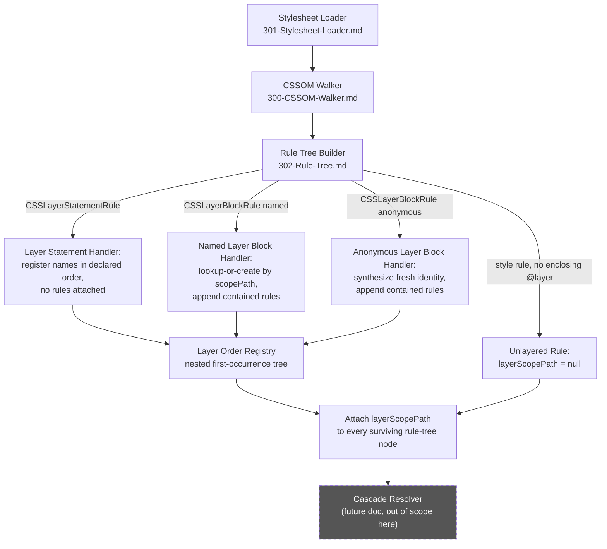
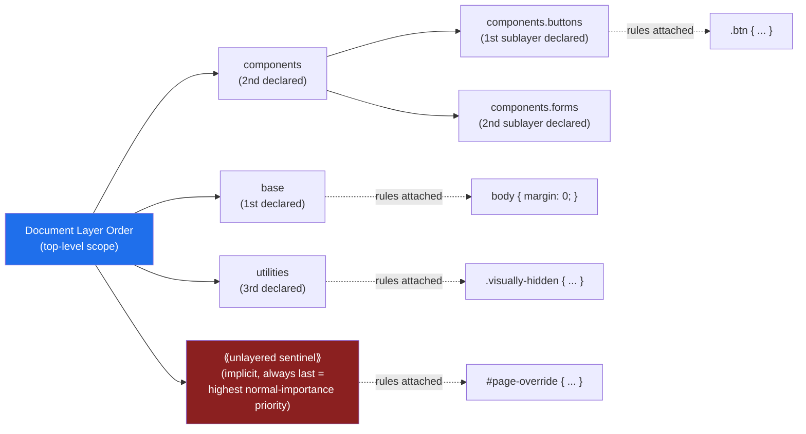

# CSSOM Walker: `@layer` Cascade Layer Capture and Ordering

## Version

1.0.0 — Phase 5 (CSSOM)

## Purpose

This document specifies how the CSSOM Walker captures `@layer` cascade-layer declarations and rule membership during rule-tree construction, and how the engine bookkeeps layer *order* — both declaration order and usage order — so that a later Cascade Resolver stage can correctly rank layers when resolving the cascade. This document covers **CSSOM-level layer capture and ordering bookkeeping only**. The actual cascade-order algorithm (how layer order interacts with specificity, origin, and importance to pick a cascade winner among competing declarations) is explicitly out of scope here and belongs to a future Cascade Resolver design document, forward-referenced throughout this document and not yet written at time of authoring. This document's job is to ensure the Cascade Resolver has, by the time it runs, a complete and correctly ordered record of every layer and every rule's layer membership — nothing more.

## Audience

Senior engineers implementing or reviewing the CSSOM Walker, the Rule Tree builder ([302-Rule-Tree.md](./302-Rule-Tree.md)), and the (future) Cascade Resolver. Assumes familiarity with the CSS Cascade Layers specification (CSS Cascade Level 5), the `CSSLayerBlockRule` and `CSSLayerStatementRule` CSSOM interfaces, and the project's foundational principles in [006-Design-Principles.md](../architecture/006-Design-Principles.md).

## Prerequisites

- Familiarity with [300-CSSOM-Walker.md](./300-CSSOM-Walker.md) — the general traversal algorithm this document specializes for `@layer`
- Familiarity with [302-Rule-Tree.md](./302-Rule-Tree.md) — the in-memory rule-tree representation that layer-membership metadata attaches to
- Familiarity with [304-Supports-Rules.md](./304-Supports-Rules.md) — the sibling conditional-rule document, since `@layer` and `@supports` can nest around each other and this document assumes that interaction is understood
- Familiarity with [006-Design-Principles.md](../architecture/006-Design-Principles.md), specifically Principle 1 (Browser Is Source of Truth) and Principle 5 (Determinism of Output)
- Working knowledge of the CSS Cascade Layers specification: named layers, anonymous layers, nested layers (`@layer a.b`), the layer-statement form (`@layer a, b, c;`), and unlayered styles

## Related Documents

- [300-CSSOM-Walker.md](./300-CSSOM-Walker.md) — parent traversal algorithm
- [301-Stylesheet-Loader.md](./301-Stylesheet-Loader.md) — how stylesheets are loaded prior to walking, including how per-stylesheet layer scoping interacts with loading order
- [302-Rule-Tree.md](./302-Rule-Tree.md) — the rule-tree data structure that layer-membership metadata attaches to (forward-referenced; this document assumes each rule-tree node has an addressable, mutable-during-construction `layerId` field)
- [303-Media-Rules.md](./303-Media-Rules.md) — sibling conditional/grouping-rule handling for `@media`, which can nest inside or around `@layer` blocks
- [304-Supports-Rules.md](./304-Supports-Rules.md) — sibling at-rule handling for `@supports`, which can nest inside or around `@layer` blocks
- [306-At-Import.md](./306-At-Import.md) — `@import ... layer(name)` syntax, which assigns imported stylesheet content to a named layer at import time
- [307-Constructable-Stylesheets.md](./307-Constructable-Stylesheets.md) — adopted stylesheets, which participate in their own independent layer-ordering scope
- [ADR-0002-No-Custom-Selector-Parser](../adr/ADR-0002-No-Custom-Selector-Parser.md) — the governing decision this document's sibling documents apply; referenced here because layer-name tokens (unlike selectors) are simple identifiers and are read verbatim from the CSSOM rather than parsed, consistent with the same non-interpretation posture
- [006-Design-Principles.md](../architecture/006-Design-Principles.md) — Principles 1 and 5 both bear directly on this document
- *(Forward reference, not yet authored)* `docs/design/Cascade-Resolver.md` — the future document that will specify the actual cascade-order algorithm consuming the layer metadata this document produces; likely to live in the `600`-series or a dedicated Cascade Resolver design slot per [007-Repository-Structure.md](../architecture/007-Repository-Structure.md)
- [algorithms/506-Cascade-Layers.md](../algorithms/506-Cascade-Layers.md) *(planned, Phase 7)* — the Dependency Resolver's treatment of `@layer` as a dependency-graph node type, distinct from this document's CSSOM-capture concern

## Overview

CSS Cascade Layers (`@layer`) let authors partition their stylesheets into named or anonymous priority buckets whose *relative order* — not their source-code position, not their specificity — determines which bucket wins when two declarations from different layers both apply to the same element with equal importance. This is a fundamentally different ordering axis from anything else in the cascade: two rules in different layers are compared first by layer order, and only within the same layer (or when both are unlayered) does ordinary specificity/source-order comparison apply.

The CSSOM exposes `@layer` in two syntactic forms, both of which the CSSOM Walker must recognize:

1. **The block form**: `@layer name { ... }` or `@layer { ... }` (anonymous), represented by `CSSLayerBlockRule`, which is a `CSSGroupingRule` subtype containing nested `cssRules` — structurally similar to `CSSMediaRule` and `CSSSupportsRule`.
2. **The statement form**: `@layer name1, name2, name3;`, represented by `CSSLayerStatementRule`, which declares layer order **without** creating a rule block. This form's entire purpose is bookkeeping: it lets an author establish that `name1` comes before `name2` comes before `name3` in the cascade, at a point in the stylesheet before any of those layers necessarily has any rules assigned to it yet.

Layer names may be **nested**, written with dot-separated segments (`@layer a.b`), which declares `b` as a sublayer scoped inside `a`; `a.b`'s position in `a`'s internal layer order is independent of, and does not affect, `a`'s own position relative to other top-level layers.

This document's central bookkeeping obligation is to reconcile two potentially different orderings — **declaration order** (the order in which layer names are first mentioned, whether via a statement form or a block form, textually in the stylesheet(s)) and **usage order** (the order in which layer blocks actually contain rules) — into a single, correct, deterministic layer-order record per the CSS Cascade Layers specification's own resolution algorithm, which this document describes at the bookkeeping level (Algorithms section) while deferring the *consumption* of that order for actual cascade-winner resolution to the future Cascade Resolver document.

## Detailed Design

### Named vs. anonymous layers

**Named layers** (`@layer utilities { ... }`) have a stable, author-chosen identity that persists across multiple `@layer utilities { ... }` blocks appearing anywhere in the document's stylesheets — the specification requires that all rules contributed to a layer with the same name, regardless of how many separate `@layer utilities { ... }` blocks appear (even across different stylesheets), are treated as belonging to one single layer, appended in the textual order those blocks are encountered.

**Anonymous layers** (`@layer { ... }`, no name given) receive a fresh, unique layer identity every single time the anonymous form is used — even textually identical anonymous blocks are distinct layers with no shared identity, unlike named layers. The CSSOM does not expose a stable "name" for an anonymous layer (`CSSLayerBlockRule.name` is the empty string for anonymous layers), so the engine must synthesize its own internal, stable-for-this-run identifier for each anonymous layer occurrence, distinct from any author-visible name, purely for internal bookkeeping (rule-tree attachment and order-list construction) — this synthesized identifier must never be treated as semantically meaningful outside the engine (it has no CSS-visible counterpart an author could reference), and it must be assigned deterministically (by document/stylesheet/rule traversal order, per Principle 5 of [006-Design-Principles.md](../architecture/006-Design-Principles.md)) so that repeated extraction runs against unchanged input produce identical synthesized identifiers.

**Why this distinction matters for capture.** Because named layers merge across occurrences while anonymous layers never do, the rule-tree builder's layer-registry lookup must key strictly on `(scopePath, name)` for named layers — where `scopePath` accounts for nesting, see below — and must never attempt this merge for anonymous layers, instead keying each anonymous occurrence by its synthesized per-occurrence identifier. Getting this wrong in either direction is a real correctness bug: merging anonymous layers that should stay distinct would incorrectly consolidate cascade priority buckets the author intended to keep separate (anonymous layers are often used precisely to get a private, non-mergeable priority slot); failing to merge named layers that should combine would incorrectly fragment a single author-intended priority bucket into several, corrupting the layer-order list the Cascade Resolver depends on.

### Layer declaration order vs. layer usage order

**The core subtlety this document exists to resolve:** a bare `@layer name;` *statement* (no block) declares that `name` exists and fixes its position in the overall layer order **at the point the statement is encountered**, without contributing any rules to it. A later `@layer name { ... }` *block* elsewhere in the same or another stylesheet contributes rules to that already-declared layer without changing its declared position — position is fixed by first mention (whether by statement or by block), never by where rules are actually assigned.

This means layer order is a strict function of **first-occurrence order**, and the engine must never use "when did this layer receive its first rule" as a proxy for "when should this layer rank in cascade order" — those are two different questions with two different answers whenever a statement-form declaration precedes the layer's first block-form usage.

**Concrete illustrative case** (bookkeeping behavior, not cascade-resolution behavior — cascade winner determination is out of scope here):

```css
@layer base, components, utilities;   /* declares order: base < components < utilities */

@layer utilities {
  .visually-hidden { position: absolute; }   /* first RULE usage of "utilities", but NOT first declaration */
}

@layer base {
  body { margin: 0; }                         /* first rule usage of "base" */
}
```

Here, the statement form on line 1 fixes the order `base < components < utilities` before any block has contributed a single rule. The engine's layer-order list must record exactly that order — `[base, components, utilities]` — regardless of the fact that `utilities` receives rules before `base` does in textual/rule-usage order. An implementation that (incorrectly) derived order from "the order layers first receive rules" would produce `[utilities, base]` (omitting `components` entirely, since it never receives rules in this example) — both the wrong order and a wrongly-dropped layer, either of which would corrupt every downstream cascade decision that depends on layer rank.

**Why this design (first-occurrence order, tracked independently of rule assignment) is correct and required, not a stylistic choice.** This is not an engineering decision the project is free to make differently — it is a direct transcription of the CSS Cascade Layers specification's own layer-ordering algorithm, which defines layer order strictly in terms of first mention (statement or block) in cascade-origin and document order. The engine's obligation under Principle 1 ([006-Design-Principles.md](../architecture/006-Design-Principles.md)) is to reproduce the browser's own layer-order computation faithfully; the *alternative* the project explicitly rejects is deriving an "engine's own opinion" of layer order from some other proxy (rule-count order, block-appearance order, alphabetical order) that happens to be easier to compute but diverges from the specification whenever declaration and usage order differ, exactly the scenario illustrated above.

### Nested layers (`@layer a.b`)

A dotted layer name such as `@layer a.b { ... }` is syntactic sugar, per specification, for declaring (if not already declared) an outer layer `a`, then declaring/using a sublayer `b` nested *inside* `a`'s own private layer-order scope. Equivalently, `@layer a.b { ... }` behaves as if written `@layer a { @layer b { ... } }`. The CSSOM's `CSSLayerBlockRule.name` for such a rule reports the full dotted path (`"a.b"`) rather than requiring the engine to reconstruct nesting from physically nested `CSSLayerBlockRule` objects — but physically nested block forms (the `@layer a { @layer b { ... } }` explicit form) are equally valid and must be captured identically, meaning the engine's internal layer-identity model must normalize both forms to the same `scopePath` representation (e.g., an array `["a", "b"]`) regardless of which syntactic form the author used.

**Consequence for the order-tracking model.** Layer order is scoped: `a.b`'s rank is meaningful only *relative to other sublayers of `a`* (i.e., other `a.*` layers), and has no bearing on `a`'s own rank among top-level layers or among sibling top-level layers `c`, `d`, etc. This means the engine's layer-order bookkeeping structure cannot be a single flat list — it must be a tree (or, equivalently, a map keyed by parent `scopePath` to an ordered child-list), where each node in the tree carries its own independently-tracked first-occurrence order among its siblings. This nested-order tree is precisely the structure the future Cascade Resolver document will need to consume to compute a fully flattened total order (per the Cascade Layers specification's own "flatten nested layer order into a total order via depth-first, sibling-order-preserving traversal" procedure) — a procedure this document deliberately stops short of specifying in full, since it is cascade-resolution logic, not CSSOM-capture bookkeeping. This document's obligation ends at producing a correct, complete nested-order tree; flattening it into cascade ranks is the Cascade Resolver's job.

### Layer membership: how it attaches to rules in the rule tree

**Decision.** Every rule-tree node produced by the Rule Tree Builder ([302-Rule-Tree.md](./302-Rule-Tree.md), forward-referenced) that represents a style rule (or a nested conditional-group rule) carries a `layerScopePath: string[] | null` field, populated during tree construction by the CSSOM Walker as it descends into (and out of) `@layer` blocks. A rule not lexically nested inside any `@layer` block at all — an **unlayered** rule — carries `layerScopePath: null`, explicitly and unambiguously distinct from `layerScopePath: []` (which this document reserves, if ever needed, for a rule directly inside a nameless/anonymous top-level layer with an empty synthesized path segment — in practice this should not arise since anonymous layers always receive a synthesized non-empty segment, but the type-level distinction between `null` and `[]` is kept strict to avoid ambiguity).

**Why attach membership to every rule rather than only to top-level rule-tree groupings.** A naive design might attach a single `layerScopePath` to a `CSSLayerBlockRule`'s corresponding rule-tree *group* node and leave individual child rules to "inherit" it implicitly by tree position. This document instead requires the scope path to be materialized onto every individual rule-tree node (not merely inherited implicitly at read time) for three reasons: (1) it makes the Cascade Resolver's per-rule lookups O(1) rather than requiring an ancestor-chain walk for every rule at cascade-resolution time, a real cost at the scale of tens of thousands of rules; (2) it keeps rule-tree nodes self-describing, which simplifies the Dependency Resolver's planned `@layer`-as-dependency-graph-node treatment ([algorithms/506-Cascade-Layers.md](../algorithms/506-Cascade-Layers.md), Phase 7) since that stage can read layer membership directly off each rule without re-walking the tree; (3) it is consistent with this project's general preference (Principle 5, Determinism) for materializing derived facts explicitly rather than recomputing them ad hoc at multiple call sites, which is itself a source of subtle divergence bugs if two call sites' inheritance-walk implementations ever drift apart.

**Interaction with `@supports` pruning.** As established in [304-Supports-Rules.md](./304-Supports-Rules.md), a rule inside a false `@supports` block is pruned from the rule tree entirely and therefore never receives `layerScopePath` metadata at all — pruning happens first, structurally, and layer-membership assignment only applies to rules that survive. A rule that survives `@supports` filtering but is nested inside a named layer (in either nesting order — `@layer` inside `@supports`, or `@supports` inside `@layer`) must still carry that layer's `scopePath` forward exactly as if the intervening `@supports` wrapper were transparent to layer bookkeeping — because it is: `@supports` gates *whether* a rule is live at all, but has no effect on *which layer* a live rule belongs to.

### Unlayered styles' implicit position: highest priority, not lowest

**Statement.** Per the CSS Cascade Layers specification, style rules that are not inside any `@layer` block at all — "unlayered" styles — are treated, for cascade-ordering purposes, as if they belong to a final, implicit layer that is ordered **after every explicitly declared layer**, meaning unlayered normal-importance declarations win over *any* layered normal-importance declaration of equal specificity, regardless of how many layers were declared or in what order. This is the single most common point of confusion this document must document unambiguously, because it inverts the intuition many engineers bring from ordinary source-order/specificity reasoning: "no layer" sounds like it should mean "no special priority," but it actually means "highest layer priority, effectively the last, most-important layer."

**Why the specification defines it this way (context, not a project decision).** Cascade Layers were designed to let a codebase incrementally adopt layered organization (e.g., a design system authored entirely in layers: `reset`, `base`, `components`, `utilities`) while allowing any code *outside* that system — most importantly, an application's own page-specific overrides, or a `<style>` block an author adds without thinking about layers at all — to continue overriding the layered system by default, exactly as it would have without Cascade Layers existing at all. If unlayered styles had been given the *lowest* priority instead, adopting Cascade Layers anywhere in a codebase would have silently made all pre-existing unlayered overrides stop winning against the newly-layered code, a breaking change the specification authors explicitly designed against. (Important precision: this "wins over layered rules" property holds specifically for normal-importance declarations; `!important` inverts every one of these priority relationships per the Cascade Layers specification's `!important` handling, which is itself explicitly deferred to the future Cascade Resolver document since it is cascade-resolution logic, not CSSOM-capture bookkeeping.)

**Consequence for this document's bookkeeping model.** The engine's layer-order tree (see Nested Layers above) must reserve an explicit, well-known sentinel entry — not merely "absence of an entry" — representing the unlayered position, and that sentinel must be documented and implemented as sorting *after* every explicitly declared top-level layer in the flattened order the Cascade Resolver will eventually consume. Concretely, `layerScopePath: null` on a rule-tree node is not merely "no layer information available" (which would be a modeling gap) — it is a fully meaningful, first-class value whose cascade-priority meaning ("higher priority than every named/anonymous layer, for normal-importance declarations") must be encoded in whatever ordered representation this document's algorithm produces, not left for the Cascade Resolver to infer from absence.

## Architecture

### Layer capture in the CSSOM traversal pipeline



### Layer order tree with nesting and the unlayered sentinel

The following diagram shows a worked example: top-level layers `base`, `components`, `utilities` declared via a statement, with `components` further split into nested sublayers `components.buttons` and `components.forms`, plus the implicit unlayered sentinel ranked last (highest priority).



### Rule-to-layer assignment sequence for a mixed nesting example

The sequence below shows the walker processing a stylesheet containing a layer statement, a named block, and an unlayered rule, in that source order, and how the registry accumulates order independently of rule-attachment order.

```mermaid
sequenceDiagram
    participant CW as CSSOM Walker
    participant Reg as Layer Order Registry
    participant RTB as Rule Tree Builder

    CW->>Reg: encounter "@layer base, components, utilities;"
    Reg->>Reg: register base (order=0), components (order=1), utilities (order=2)
    Note over Reg: no rules attached yet for any of these

    CW->>Reg: encounter "@layer utilities { .visually-hidden {...} }"
    Reg->>Reg: utilities already registered (order=2, unchanged)
    Reg->>RTB: attach rule .visually-hidden with layerScopePath=["utilities"]

    CW->>Reg: encounter "@layer base { body { margin:0; } }"
    Reg->>Reg: base already registered (order=0, unchanged)
    Reg->>RTB: attach rule "body" with layerScopePath=["base"]

    CW->>RTB: encounter unlayered rule "#page-override {...}"
    RTB->>RTB: attach rule with layerScopePath=null (implicit highest-priority sentinel)

    Note over Reg,RTB: Final order for Cascade Resolver: base(0) < components(1) < utilities(2) < unlayered(sentinel, highest)
```

## Algorithms

### Algorithm: Layer Order Registry Construction

**Problem statement.** Given a CSSOM traversal encountering `CSSLayerStatementRule`, `CSSLayerBlockRule` (named and anonymous, at any nesting depth), and unlayered style rules in document/stylesheet order, construct a nested first-occurrence order tree recording each layer's rank among its siblings, correctly merging repeated named-layer occurrences and never merging anonymous-layer occurrences, and attach a `layerScopePath` (or `null` for unlayered) to every surviving rule-tree node.

**Inputs.**
- A sequence of CSSOM traversal events, each either `EnterLayerStatement(names: string[])`, `EnterLayerBlock(name: string | null, isAnonymous: boolean)`, `ExitLayerBlock()`, `EmitStyleRule(ruleTreeNode)`, produced by the general walker described in [300-CSSOM-Walker.md](./300-CSSOM-Walker.md) as it processes stylesheets in load order (per [301-Stylesheet-Loader.md](./301-Stylesheet-Loader.md)) and, within each stylesheet, in document order.
- A `currentScopeStack: LayerScopeFrame[]` maintained by the walker, where each frame tracks the current nesting context (empty at the stylesheet root).

**Outputs.** A `LayerOrderRegistry` — a tree of `LayerNode { scopePath: string[], siblingOrder: number, children: Map<string, LayerNode> }` — plus, as a side effect, every rule-tree node annotated with its resolved `layerScopePath`.

**Pseudocode.**

```
class LayerOrderRegistry:
    root: LayerNode = LayerNode(scopePath: [], siblingOrder: -1, children: {})
    anonymousCounter: int = 0

    function registerOrLookup(parentPath: string[], name: string | null, isAnonymous: boolean) -> string[]:
        parentNode = resolveNode(parentPath)   # tree lookup, creating intermediate nodes if a statement
                                                 # declared a deep path before any block used it
        if isAnonymous:
            self.anonymousCounter += 1
            key = "::anon" + self.anonymousCounter    # never merges with any other occurrence
        else:
            key = name

        if key not in parentNode.children:
            order = len(parentNode.children)          # first-occurrence order among siblings
            parentNode.children[key] = LayerNode(
                scopePath: parentPath + [key],
                siblingOrder: order,
                children: {}
            )
        # If key already exists (named layer re-opened), return existing node's path unchanged —
        # this is the merge behavior for repeated named-layer occurrences.
        return parentNode.children[key].scopePath

    function registerStatement(parentPath: string[], names: string[]):
        # Statement form: register every named layer in the given order, without
        # creating any rule attachment. Establishes order even with zero rules.
        for name in names:
            registerOrLookup(parentPath, name, isAnonymous: false)


function walkWithLayerTracking(node, scopeStack, registry, diagnostics):
    if node.type == CSSRule.LAYER_STATEMENT_RULE:
        parentPath = currentScopePath(scopeStack)
        registry.registerStatement(parentPath, node.nameList)   # e.g. ["base","components","utilities"]
        return   # no children to recurse into; statement form has none

    if node.type == CSSRule.LAYER_BLOCK_RULE:
        parentPath = currentScopePath(scopeStack)
        resolvedPath = registry.registerOrLookup(parentPath, node.name, isAnonymous: node.name == "")
        scopeStack.push(LayerScopeFrame(scopePath: resolvedPath))
        for child in node.cssRules:
            walkWithLayerTracking(child, scopeStack, registry, diagnostics)
        scopeStack.pop()
        return

    if node.type == CSSRule.STYLE_RULE or isOtherAttachableRuleType(node.type):
        # Delegates to whatever conditional-rule handling already pruned/passed this node
        # through (e.g., 304-Supports-Rules.md's filter runs upstream or interleaved;
        # by the time a style rule reaches here it has already survived @supports pruling).
        currentPath = currentScopePath(scopeStack)   # null if scopeStack is empty (unlayered)
        ruleTreeNode = buildOrFetchRuleTreeNode(node)
        ruleTreeNode.layerScopePath = currentPath    # null explicitly for unlayered rules
        return

    # @media, @supports, and other grouping rules: recurse transparently,
    # preserving the current layer scope stack unchanged, since these at-rules
    # do not themselves establish or alter layer scope (see 304-Supports-Rules.md
    # for how @supports pruning composes with this walk).
    for child in node.cssRules ?? []:
        walkWithLayerTracking(child, scopeStack, registry, diagnostics)


function currentScopePath(scopeStack) -> string[] | null:
    if scopeStack.isEmpty():
        return null   # unlayered sentinel
    return scopeStack.top().scopePath
```

**Time complexity.** O(L + R) where `L` is the total number of `@layer` statement/block occurrences across all stylesheets (each processed in O(1) amortized for the registry lookup-or-create, using a hash map keyed by sibling-scoped name) and `R` is the total number of style-rule nodes visited for annotation. This is a single linear pass over the CSSOM; no re-traversal is required because layer order is derivable purely from first-occurrence position during the same walk that builds the rule tree.

**Memory complexity.** O(L) for the layer order tree (bounded by total distinct layer occurrences, where anonymous layers each count as one distinct occurrence and named layers count once regardless of how many blocks reopen them) plus O(R) for the `layerScopePath` annotations attached to rule-tree nodes (each annotation is a shared reference to an already-interned `scopePath` array, not a fresh allocation per rule, to avoid O(R × depth) memory blowup for deeply nested layers applied to many rules).

**Failure cases.**
- A `@layer` block reopening a name that was previously used as an *anonymous* layer's synthesized key is impossible by construction (synthesized keys use a reserved `::anon` prefix that cannot collide with any valid CSS identifier an author could write as a layer name), so no special collision-handling is needed here.
- Circular or self-referential layer statements are not expressible in the `@layer` grammar (`@layer a, a;` merely re-registers `a` idempotently at its already-established order, a no-op per the `registerOrLookup` merge behavior above, not an error) — this is not a failure case requiring diagnostics, simply idempotent behavior.
- A stylesheet-load ordering bug (wrong stylesheet load order fed into the walker) would silently produce a wrong-but-plausible-looking layer order, since this algorithm trusts its input traversal order completely; this is why [301-Stylesheet-Loader.md](./301-Stylesheet-Loader.md)'s own ordering guarantees are a hard precondition for this document's correctness, not an independent concern — this document's algorithm has no way to detect a wrong input order on its own, and must not be treated as a place to add defensive reordering logic (that would risk silently "fixing" a genuinely different, author-intended order).
- Cross-stylesheet named-layer merging across a `@import ... layer(name)` boundary (see [306-At-Import.md](./306-At-Import.md)) requires that the imported stylesheet's rules be walked as if inlined at the `@import` point with `name` as their enclosing scope — a failure to do this correctly would incorrectly treat the imported content as either unlayered or as its own anonymous layer, both wrong; this composition point is owned jointly by this document and [306-At-Import.md](./306-At-Import.md) and must be tested at the integration level (see Testing).

**Optimization opportunities.**
- Because the registry construction is already a single linear pass co-located with the general rule-tree build (per [302-Rule-Tree.md](./302-Rule-Tree.md)), there is no separate "layer pre-pass" to optimize away, unlike the `@media`/`@supports` condition pre-evaluation batching opportunities described in [303-Media-Rules.md](./303-Media-Rules.md) and [304-Supports-Rules.md](./304-Supports-Rules.md) — layer order requires no browser round trip at all (it is derivable purely from CSSOM structure and document order, with no feature-support or viewport-dependent evaluation involved), making it strictly cheaper than its `@media`/`@supports` siblings.
- `scopePath` arrays should be interned/shared (a single canonical array instance per distinct scope path, referenced by every rule-tree node in that scope) rather than freshly allocated per rule, both for memory efficiency (Memory complexity above) and so that the future Cascade Resolver can use reference equality as a fast-path check for "these two rules are in the exact same layer scope" before falling back to path-segment comparison for cross-scope ranking.

## Implementation Notes

- The Layer Order Registry must be constructed by the same traversal pass that builds the rule tree and applies `@supports` pruning ([304-Supports-Rules.md](./304-Supports-Rules.md)) and `@media` filtering ([303-Media-Rules.md](./303-Media-Rules.md)) — these three concerns compose over a single walker pass rather than three independent passes, since each concern only needs to (a) decide "is this node live" (`@supports`, `@media`) or (b) annotate "what scope is this node in" (`@layer`), and both kinds of decision can be made incrementally as the walker descends, without needing to see the rest of the tree first.
- `layerScopePath` must be attached only to rule-tree nodes that *survive* `@supports`/`@media` filtering — a pruned rule never receives layer metadata because it never becomes a rule-tree node at all, consistent with the dead-code-elimination model established in [304-Supports-Rules.md](./304-Supports-Rules.md).
- The Layer Order Registry, once fully constructed for a given extraction run, should be exposed as an immutable, serializable artifact (not merely internal walker state) so that the Reporter (Section 2.12 of the brief) can render a human-readable "layer order: base < components < utilities < (unlayered)" diagnostic, which is often the single most useful piece of information for an engineer debugging an unexpected cascade-priority outcome — even before the Cascade Resolver's full algorithm is implemented, simply exposing the *order* is independently valuable.
- Because layer order is a pure function of document/stylesheet structure (no browser feature-evaluation or viewport dependency, unlike `@media`/`@supports`), it is trivially cacheable across viewport variants of the same route under the Incremental Cache model (Principle 8, [006-Design-Principles.md](../architecture/006-Design-Principles.md)) — the registry can be computed once per unique CSS-asset-content fingerprint and reused across every viewport profile extracted for that content.
- Anonymous-layer synthesized identifiers must never leak into any user-facing diagnostic or serialized output in a way that implies they are meaningful CSS — diagnostics referencing an anonymous layer should render as `"anonymous layer #<n> (declared at <stylesheet>:<line>)"` rather than exposing the internal `::anon<n>` key directly, to avoid confusing engineers into thinking `::anon3` is valid, referenceable CSS syntax.

## Edge Cases

- **`@import ... layer(name)` and `@import ... layer;` (anonymous import layers).** Per [306-At-Import.md](./306-At-Import.md), an imported stylesheet can itself be assigned to a named or anonymous layer at the `@import` statement, meaning the entire imported stylesheet's contents are treated as if wrapped in `@layer name { ...imported rules... }`. This document's registry construction must treat the import boundary exactly like an ordinary `@layer` block boundary for order-tracking purposes — the import's layer assignment participates in the same first-occurrence ordering as any other `@layer` usage in the importing document.
- **Reopening a named layer across multiple, non-adjacent stylesheets.** A named layer `components` can be declared in stylesheet A, then reopened with additional rules in stylesheet C loaded later, with no requirement that all of a layer's contributions be textually adjacent. The registry's merge-by-name behavior handles this correctly by construction (lookup-or-create is idempotent regardless of how much walker traversal happens between two occurrences of the same name), but this must be explicitly covered in integration tests (see Testing) since it is easy to accidentally implement a registry that only merges within a single stylesheet.
- **A named layer declared via statement but never given any block at all.** This is fully valid CSS (the layer exists, has an established order, and simply never receives rules) and must not be treated as an error or omitted from the registry — an empty layer still occupies a rank that affects the relative ordering of layers declared after it.
- **`revert-layer` and other layer-aware CSS-wide keywords.** These are cascade-*resolution*-time concerns (what a declaration's computed value becomes when it reverts to "the value it would have had if the current layer's rules did not exist") and are explicitly out of scope for this document; this document's obligation is limited to ensuring the layer-membership and order data such resolution logic will need is captured correctly and completely — the resolution semantics themselves belong to the future Cascade Resolver document.
- **Shadow DOM and `@layer`.** Per the Cascade Layers specification, layer order is scoped per shadow tree (and per the document's own outer tree) — a shadow root's stylesheets establish their own independent layer-order registry, not a shared one with the outer document (consistent with [006-Design-Principles.md](../architecture/006-Design-Principles.md)'s Shadow DOM edge case for `Element.matches()`/`querySelectorAll` boundary-crossing behavior). The CSSOM Walker must construct one `LayerOrderRegistry` instance per shadow root/document tree it traverses, never a single global registry spanning shadow boundaries.
- **Constructable stylesheets (`adoptedStyleSheets`) containing `@layer`.** Per [307-Constructable-Stylesheets.md](./307-Constructable-Stylesheets.md), adopted stylesheets participate in the layer ordering of whichever tree (document or shadow root) they are adopted into, in the position determined by their place in the `adoptedStyleSheets` array combined with ordinary document-stylesheet ordering rules — the registry construction must process adopted stylesheets in that combined order, not append them unconditionally after all `document.styleSheets` content.
- **Nested layers referencing a not-yet-declared parent (`@layer a.b` before any bare `@layer a` mention).** This is valid and must implicitly create `a` in the registry at the moment `a.b` is first seen, with `a`'s own sibling order determined by *this* first mention (via the dotted form), even though `a` was never separately declared on its own — the `registerOrLookup`/`resolveNode` logic in the Algorithms section handles this via intermediate-node creation, and this must be explicitly tested.

## Tradeoffs

| Dimension | Flat single-list layer order (rejected) | Rule-count / usage-order-derived ranking (rejected) | Nested first-occurrence order tree (chosen) |
|---|---|---|---|
| Correctness vs. specification | Cannot represent nested (`a.b`) scoping at all — loses information | Diverges whenever declaration order and rule-usage order differ (the common `@layer a, b, c;` statement-first pattern) | Correct by construction; directly mirrors the specification's own first-occurrence, nesting-aware model |
| Handles empty/rule-less layers | N/A (depends on which flat-list construction strategy) | Loses them entirely — a layer with no rules never "occurs" under a rule-usage-order model | Preserved — statement-only declarations still occupy a registry node and a rank |
| Implementation complexity | Low, but incomplete (fails nested layers) | Low, but silently wrong in a common, easy-to-hit case | Moderate (tree structure, path resolution) but no known correctness gaps |
| Anonymous-layer handling | Ambiguous — flat lists usually assume mergeable identity, wrong for anonymous layers | Same ambiguity | Explicit: anonymous layers always get a fresh synthesized key, never merged |
| Cost to compute | O(L) either way for a linear walk | O(L) either way | O(L) — no additional asymptotic cost over the rejected alternatives, only added correctness |

**Why the nested tree was chosen despite added implementation complexity over a flat list.** The flat-list alternatives are not merely "less general" — they are actively wrong on real, unremarkable CSS (any codebase using the extremely common `@layer reset, base, components, utilities;` statement-first pattern immediately at the top of a stylesheet, which is close to the recommended authoring pattern in most Cascade Layers usage guides, would already trigger the declaration-vs-usage-order divergence this document identifies as the central subtlety). Given that the added implementation cost is a bounded, one-time tree-structure decision with no asymptotic penalty, and the correctness gap in the alternatives is not an edge case but closer to the mainline authoring pattern, this was not a close decision.

**Why layer-order computation is kept entirely separate from cascade-order computation (deferred to a future document) rather than combined here.** Combining them would couple this document's CSSOM-capture concern to the Cascade Resolver's much larger surface (specificity computation research, `!important` and `revert-layer` handling, origin ordering, transition/animation-layer interactions) that has not yet been designed and is explicitly sequenced later in the roadmap. Keeping this document scoped to capture-and-bookkeeping only means the eventual Cascade Resolver document can be authored, reviewed, and iterated on independently, consuming this document's `LayerOrderRegistry` and per-rule `layerScopePath` as a stable, already-correct input contract — an application of the same interface-based decoupling philosophy Principle 4 (Pluggable, Strategy-Based Extraction Architecture) applies elsewhere in [006-Design-Principles.md](../architecture/006-Design-Principles.md), here applied to sequencing documentation and implementation work rather than to runtime strategy selection.

## Performance

- **CPU complexity.** O(L + R) for a single linear walk, as derived in Algorithms — no browser round trips are required at all for this document's concerns (contrast with [303-Media-Rules.md](./303-Media-Rules.md) and [304-Supports-Rules.md](./304-Supports-Rules.md), both of which require `page.evaluate()`-mediated boolean evaluation), making `@layer` capture the cheapest of the three Phase 5 conditional/grouping-rule handling documents in this series.
- **Memory complexity.** O(L) for the registry tree plus O(R) shared-reference annotations (interned `scopePath` arrays, per Implementation Notes), avoiding O(R × depth) blowup.
- **Caching strategy.** The entire `LayerOrderRegistry` is a pure function of CSS asset content (never of viewport, DOM, or browser feature support), making it cacheable at an even coarser grain than the `@supports` cache described in [304-Supports-Rules.md](./304-Supports-Rules.md): it can be keyed purely on the CSS-asset-content component of the Cache Manager's fingerprint (Principle 8, [006-Design-Principles.md](../architecture/006-Design-Principles.md)) and reused across every viewport, device profile, and even across different routes that happen to share identical CSS assets.
- **Parallelization opportunities.** Per-stylesheet layer-statement/block occurrences could, in principle, be collected in parallel across independently-loaded stylesheets, but final registry assembly (merging named-layer occurrences in correct cross-stylesheet order) is inherently sequential with respect to stylesheet load order — this mirrors the general constraint noted in [006-Design-Principles.md](../architecture/006-Design-Principles.md) Principle 5 that parallel work must still reassemble into a canonical, order-preserving structure; parallel *collection* is safe, parallel *merge* is not, and implementations should parallelize only the former.
- **Incremental execution.** A change to CSS content that does not alter any `@layer` statement or block structure (e.g., a change only to declaration values inside an already-registered layer) leaves the `LayerOrderRegistry`'s structure unchanged and can safely reuse a cached registry, recomputing only the per-rule `layerScopePath` annotations for genuinely new/changed rules — a candidate optimization for the eventual incremental-extraction design in [704-Incremental-Extraction.md](./704-Incremental-Extraction.md) (Phase 9, planned).
- **Profiling guidance.** Because this stage requires no IPC round trips, it should be profiled purely as an in-process CPU cost; if it becomes a measurable fraction of wall-clock time (unlikely for realistic layer counts, since real-world stylesheets rarely declare more than a handful of top-level layers and a similarly small number of sublayers), the first suspect is unnecessary array-copying of `scopePath` values rather than genuine registry-lookup cost, given the O(1)-amortized hash-map-based lookup design.
- **Scalability limits.** No scalability concern specific to layer count is anticipated; the practical scalability ceiling for this stage is governed entirely by total rule count `R` (the annotation pass), which is the same ceiling every other rule-tree-construction concern in this Phase 5 series shares.

## Testing

- **Unit tests.** Test the registry construction algorithm directly against synthetic event sequences (bypassing a real browser) covering: statement-then-block order preservation; block-then-statement-redundant-declaration idempotency; named-layer merge across non-adjacent occurrences; anonymous-layer non-merge even for textually identical blocks; nested dotted-name path resolution including implicit-parent creation; unlayered sentinel assignment (`layerScopePath: null`) for rules outside any `@layer`.
- **Integration tests.** Run against real browser instances with fixture stylesheets covering: the canonical `@layer reset, base, components, utilities;` statement-first pattern with out-of-declaration-order block usage (the central worked example in this document); cross-stylesheet named-layer reopening; `@import ... layer(name)` composition (jointly with [306-At-Import.md](./306-At-Import.md) fixtures); `@layer` nested inside `@supports` and vice versa (jointly with [304-Supports-Rules.md](./304-Supports-Rules.md) fixtures); shadow-DOM-scoped layer registries remaining independent of the outer document's registry; adopted/constructable stylesheets contributing to layer order per their `adoptedStyleSheets` position (jointly with [307-Constructable-Stylesheets.md](./307-Constructable-Stylesheets.md) fixtures). Assert the resulting `LayerOrderRegistry` matches a hand-derived expected tree for each fixture.
- **Visual tests.** Because this document explicitly defers cascade-winner computation, direct visual-parity assertions belong to the future Cascade Resolver's test suite; however, a lightweight visual smoke test confirming that a page using layered CSS with an unlayered override renders with the override winning (validating the "unlayered wins" behavior end-to-end once a minimal Cascade Resolver exists) should be included in the fixture set referenced by [006-Design-Principles.md](../architecture/006-Design-Principles.md) Section 2.15 once that stage is implemented.
- **Stress tests.** A fixture with a large number of distinct named and anonymous layers (tens to low hundreds) and deep nesting (`a.b.c.d`) to confirm registry construction remains linear in practice and that interned `scopePath` sharing keeps memory bounded.
- **Regression tests.** Any bug report of the form "a rule was assigned to the wrong layer, or layer order was computed incorrectly" is high-severity, since layer-membership errors silently corrupt every downstream cascade decision without necessarily producing an obviously-broken render (a subtly wrong cascade winner often still "looks plausible"); such bugs should be added as permanent golden fixtures.
- **Benchmark tests.** Track registry-construction wall-clock time and memory footprint across engine versions on the largest layer-count fixture, to catch any accidental regression from the O(L+R) linear design back toward an accidental O(L×R) or O(L²) implementation (e.g., from a naive non-interned path-copying bug).

## Future Work

- The future Cascade Resolver document must specify: the depth-first, sibling-order-preserving flattening of the nested `LayerOrderRegistry` tree into a single total layer rank; the precise interaction of layer rank with specificity and origin per the full CSS Cascade specification; and `!important`/`revert-layer` handling, all of which this document deliberately excludes. This is the single most important forward-reference dependency this document creates and should be prioritized early in whichever future phase covers cascade resolution.
- [algorithms/506-Cascade-Layers.md](../algorithms/506-Cascade-Layers.md) (Phase 7, planned) will treat `@layer` as a Dependency Resolver graph-node type — investigate whether that document should consume this document's `LayerOrderRegistry` directly as a shared artifact, or whether the Dependency Resolver needs a distinct, purpose-built representation; premature sharing risks coupling two modules (CSSOM capture and dependency-graph construction) that Principle 4 ([006-Design-Principles.md](../architecture/006-Design-Principles.md)) suggests should remain independently evolvable.
- Investigate whether the `LayerOrderRegistry`'s coarse, viewport-independent cacheability (Performance section) can be exposed as an explicit, separately-versioned cache artifact in the eventual Cache Manager design (Phase 10), distinct from the full extraction-result cache, so that a CSS-asset-only change invalidates just the relevant sub-cache rather than the entire route/viewport extraction cache.
- Open question: should the Reporter (Section 2.12 of the brief) render the full nested layer-order tree, including empty/rule-less declared layers, as a first-class diagnostic visualization even before the Cascade Resolver exists? This has clear debugging value (surfacing "you declared a layer that never received any rules" as a potential authoring mistake) independent of cascade-resolution completeness, and could plausibly ship earlier than the full Cascade Resolver.
- Monitor CSS Cascade Layers specification evolution (the specification was still stabilizing certain shadow-DOM and constructable-stylesheet interaction details at the time of authoring) and revisit the Edge Cases section of this document if browser implementations diverge or specification text is clarified in ways that affect the ordering model described here.

## References

- [300-CSSOM-Walker.md](./300-CSSOM-Walker.md)
- [301-Stylesheet-Loader.md](./301-Stylesheet-Loader.md)
- [302-Rule-Tree.md](./302-Rule-Tree.md)
- [303-Media-Rules.md](./303-Media-Rules.md)
- [304-Supports-Rules.md](./304-Supports-Rules.md)
- [306-At-Import.md](./306-At-Import.md)
- [307-Constructable-Stylesheets.md](./307-Constructable-Stylesheets.md)
- [algorithms/506-Cascade-Layers.md](../algorithms/506-Cascade-Layers.md) *(planned, Phase 7)*
- [ADR-0002-No-Custom-Selector-Parser](../adr/ADR-0002-No-Custom-Selector-Parser.md)
- [006-Design-Principles.md](../architecture/006-Design-Principles.md)
- W3C CSS Cascade and Inheritance Level 5 specification (Cascade Layers)
- W3C CSSOM specification — `CSSLayerBlockRule`, `CSSLayerStatementRule` interfaces
- MDN documentation: `@layer`, `CSS Cascade Layers`
- W3C CSS Cascade and Inheritance specification — `revert-layer` keyword and `!important`/layer interaction (forward reference for the future Cascade Resolver document)
