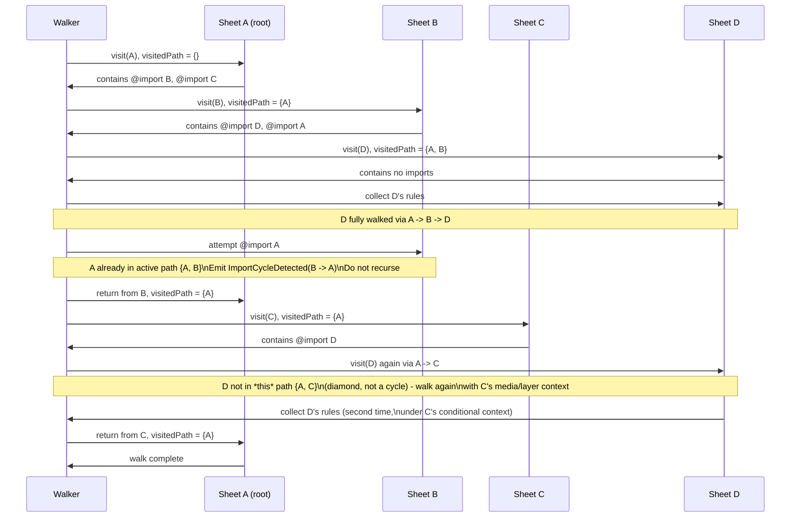

# At-Import Handling in the CSSOM Walker

## Version

1.0.0 — Phase 5 (CSSOM)

## Purpose

This document specifies how the CSSOM Walker resolves `@import` rules during stylesheet traversal: how imported stylesheets are discovered through the browser's own CSSOM rather than by fetching and parsing CSS text out-of-band, how import chains and cycles are detected and terminated safely, how conditional (media-qualified) and layer-tagged imports are represented in the rule tree, and how cross-origin `@import` restrictions are surfaced as diagnostics rather than silently swallowed. It exists so that any contributor implementing or reviewing `@import` support has a single, authoritative description of the walk algorithm, its termination guarantees, and its interaction with cascade layers and media conditions — all of which are easy to get subtly wrong if approached as "just another kind of stylesheet fetch."

## Audience

Senior engineers implementing the CSSOM Walker (`packages/collector`) or the Dependency Resolver, and reviewers evaluating changes to stylesheet traversal. Familiarity with the CSSOM specification's `CSSImportRule` interface, the CSS Cascade specification's treatment of `@import` as a stylesheet-level (not rule-level) construct, and this project's Design Principles is assumed.

## Prerequisites

- [006-Design-Principles.md](../architecture/006-Design-Principles.md), specifically Principle 1 (Browser Is the Source of Truth) and Principle 2 (Never Implement a Custom Selector Parser)
- [300-CSSOM-Walker.md](./300-CSSOM-Walker.md) — the base traversal algorithm this document extends
- [301-Stylesheet-Loader.md](./301-Stylesheet-Loader.md) — how top-level stylesheets enter the walk before `@import` resolution begins
- Familiarity with the CSSOM specification's `CSSImportRule` and `StyleSheet` interfaces
- Familiarity with CORS as it applies to `<link>` stylesheets and, by extension, `@import`

## Related Documents

- [300-CSSOM-Walker.md](./300-CSSOM-Walker.md) — the walker this module plugs into as a rule-type-specific handler
- [301-Stylesheet-Loader.md](./301-Stylesheet-Loader.md) — top-level sheet discovery via `document.styleSheets`
- [302-Rule-Tree.md](./302-Rule-Tree.md) — the intermediate representation that import-produced subtrees are attached to
- [303-Media-Rules.md](./303-Media-Rules.md) — conditional `@import ... screen` shares its evaluation model with `@media`
- [304-Supports-Rules.md](./304-Supports-Rules.md) — conditional `@import ... supports(...)` shares its evaluation model with `@supports`
- [305-Cascade-Layers.md](./305-Cascade-Layers.md) — layer-tagged imports (`@import url(...) layer(name)`) interact directly with layer ordering
- [307-Constructable-Stylesheets.md](./307-Constructable-Stylesheets.md) — a sibling discovery mechanism for stylesheets that bypass `@import` entirely
- [006-Design-Principles.md](../architecture/006-Design-Principles.md) — Principle 1's mandate that CSSOM traversal never re-implement fetch-and-parse
- [002-Problem-Statement.md](../architecture/002-Problem-Statement.md) — the general thesis that static approximation diverges from browser behavior, directly applicable to import-chain resolution

## Overview

`@import` is unusual among CSS at-rules in that it is the only construct whose resolution the browser has already fully performed by the time the CSSOM Walker observes it. When a browser parses a stylesheet containing `@import url("other.css");`, it does not merely record the URL as a string: it fetches the referenced resource, parses it into a full CSSOM stylesheet, and exposes that parsed stylesheet directly through the `CSSImportRule.styleSheet` property. This is a `CSSStyleSheet` object — indistinguishable, from a traversal standpoint, from a stylesheet that arrived via a top-level `<link rel="stylesheet">`. The browser has already done the network round-trip, the byte decoding, the CSS parsing, and — critically — the recursive resolution of any nested `@import` rules inside the imported sheet.

This has a load-bearing consequence for the CSSOM Walker's design: **import resolution in this engine is tree traversal, not fetch orchestration.** The walker never issues its own HTTP request for an imported stylesheet's URL, never runs a CSS parser over imported text, and never re-derives the imported sheet's rule list from scratch. It asks the browser, via `CSSImportRule.styleSheet`, for the sheet the browser already resolved, and recurses into that object exactly as it would recurse into any other `CSSStyleSheet`. This is a direct, specific instance of Principle 1 (Browser Is the Source of Truth) from [006-Design-Principles.md](../architecture/006-Design-Principles.md): the alternative — parsing the top-level sheet's text with a standalone CSS parser to find `@import` statements, then fetching and parsing each target ourselves — would build a second, browser-independent import resolver that must independently get right every quirk of URL resolution (relative-to-stylesheet-base, not relative-to-document), charset detection, redirect handling, and CORS enforcement that the browser's network stack and CSS parser already handle correctly and are continuously updated to handle correctly as specifications evolve.

Four properties of `@import` create design pressure that this document resolves in turn:

1. **Import chains can be arbitrarily deep**, and a naive recursive walker without cycle tracking risks unbounded recursion if two sheets import each other (directly or transitively), even though browsers themselves prevent the resulting network/parse cycle from actually executing more than once.
2. **`@import` accepts a conditional media list** (`@import url(...) screen and (min-width: 800px);`), meaning the imported subtree's applicability is gated by a runtime condition exactly like an `@media` block wrapping the same rules — but the condition lives on the *import edge*, not inside the imported sheet.
3. **`@import` accepts a layer designator** (`@import url(...) layer(name);` or the bare `@import url(...) layer;` for an anonymous layer), meaning the entire imported subtree is cascade-layered as a unit, which interacts with this engine's layer-ordering model from [305-Cascade-Layers.md](./305-Cascade-Layers.md).
4. **`@import` targets are subject to the same cross-origin constraints as top-level `<link>` stylesheets**, per Section 2.16 of the brief — a cross-origin import without permissive CORS headers yields a `CSSImportRule` whose `styleSheet.cssRules` throws a `SecurityError` when accessed from page script, structurally identical to the cross-origin `<link>` case, but easier to miss because the import is nested inside an otherwise same-origin sheet.

## Detailed Design

### 8.1 `CSSImportRule` as a traversal edge, not a fetch instruction

The CSSOM Walker's rule dispatch (see [300-CSSOM-Walker.md](./300-CSSOM-Walker.md) for the general dispatch table) treats each entry in a stylesheet's `cssRules` collection according to its `type`/constructor. For `CSSImportRule`, the handler's *only* job is:

1. Read `importRule.href` (the resolved, absolute URL — the browser has already resolved it relative to the importing sheet's base URL, not the document's base URL, which is itself a browser behavior this engine benefits from without having to reimplement).
2. Read `importRule.media` (a `MediaList`; empty/`all` if no condition was specified) and, if present in the engine's target browser version, `importRule.layerName` (see §8.4).
3. Attempt to read `importRule.styleSheet`. If this throws or returns an object whose `cssRules` access throws `SecurityError`, emit a `CrossOriginStylesheetSkipped` diagnostic (§8.5) and stop — do not recurse.
4. If the sheet is accessible, recurse into it using the *same* stylesheet-traversal entry point used for top-level sheets, passing forward the accumulated media-condition stack and layer-context (§8.3, §8.4).

**Why.** Steps 1–2 are pure metadata reads; step 3 is the security-sensitive branch that must be attempted before step 4's recursion, because attempting to enumerate `cssRules` on a cross-origin, non-CORS sheet is itself the operation that throws. Framing the handler this way keeps the import handler a thin adapter over the general stylesheet walk rather than a parallel, import-specific walk — consistent with keeping one traversal algorithm rather than N special cases.

**Alternatives considered.**
- *Fetching `importRule.href` directly with the engine's own HTTP client and parsing it with a standalone CSS parser.* Rejected outright by Principle 1: this would require the engine to reimplement relative-URL resolution against the *stylesheet's* base (not the document's), charset sniffing, and CORS enforcement, and would diverge from the browser the moment any of those behaviors differ by engine or version. It would also require re-fetching resources the browser has already fetched, doubling network cost for no correctness benefit.
- *Treating `@import` as an opaque, unresolved rule and asking the Dependency Resolver to resolve it out-of-band.* Rejected because it fragments import resolution across two modules for no benefit — `CSSImportRule.styleSheet` already gives the walker everything needed in-place, and deferring it would only reintroduce the fetch-and-parse problem one module later.

**Tradeoffs.** The cost of this approach is that the walker's behavior is bounded by whatever the browser has already decided to fetch and expose — if a browser applies its own import-depth limit or fails to resolve an import for a reason opaque to page script (e.g., a `Content-Security-Policy` `style-src` violation), the walker sees only an inaccessible or absent `styleSheet` and must treat that as a terminal, diagnosable condition rather than something it can retry or work around. This is accepted because working around it would mean re-implementing exactly the browser behavior Principle 1 forbids re-implementing.

### 8.2 Cycle detection: why it's still needed despite browser-side prevention

Browsers already prevent an `@import` cycle (A imports B, B imports A) from causing an infinite fetch/parse loop: per the CSSOM and HTML fetch specifications, a stylesheet resource that is already in the process of being fetched (or has already been fetched) as part of the *same* import chain is not re-fetched, and the resulting `CSSImportRule.styleSheet` for the cyclic edge is typically an empty or already-resolved sheet rather than triggering unbounded recursion in the browser's own parser. This means the browser's CSSOM, as exposed to page script, is already acyclic-safe from a memory/hang perspective *for the browser's own parsing*. It does not, however, mean the CSSOM Walker's traversal is automatically safe.

The reason is that `CSSImportRule.styleSheet` for a revisited sheet still returns a valid, non-null `CSSStyleSheet` object — the *same* object (or an equivalent one), because the browser resolved it once and is exposing the resolved result. If the walker's recursion does not track which `CSSStyleSheet` objects (or, more precisely, which resolved-sheet identities) it has already descended into within the current chain, it will happily recurse into that returned object again, re-walking every rule in B (and every import B itself makes) a second time, and if the cycle is A → B → A → B → ..., the walker itself — not the browser — produces the infinite recursion, because from the walker's point of view each `styleSheet` reference it dereferences looks like "a stylesheet with rules to walk," not "a stylesheet I've already walked."

**Design.** The walker maintains a `visitedSheets: Set<CSSStyleSheet>` (by object/reference identity — see Principle 2's carve-out for non-decisional bookkeeping; this is not selector parsing, it is identity tracking) scoped to the *current import chain being walked*, not the entire extraction run. Before recursing into `importRule.styleSheet`, the handler checks membership:

- If `styleSheet` is already in `visitedSheets` for the active chain, the walker records an `ImportCycleDetected` diagnostic (informational severity — this is expected, spec-legal behavior, not an error) identifying the two hrefs involved, and does **not** recurse further down that edge. The rules inside the already-visited sheet are not re-collected on this edge, because they were already (or will already be) collected via the first edge that reached that sheet.
- If not visited, the sheet is added to `visitedSheets`, walked normally (including recursing into any of *its* `@import` rules), and — per the scoping rule below — removed from the *chain-scoped* visited set once that branch of the walk completes if the same physical sheet could legitimately be imported again via a sibling, non-cyclic edge and should be collected again for a different media/layer context.

This last point deserves elaboration: `visitedSheets` is not simply "never walk a given `CSSStyleSheet` twice, globally." A single stylesheet can be legitimately imported from two different places in the tree with two different conditional contexts — e.g., `@import "shared.css" screen;` from one branch and `@import "shared.css" print;` from another, both pointing at the same resolved sheet. Both imports are meaningful and both need their own conditional-context wrapper (§8.3) around the same underlying rules. The cycle-detection set therefore tracks the **current path from the root sheet to the current recursion frame** (a stack-scoped set, conceptually a `Set` per active DFS path, not one global set for the whole tree) — a sheet is "visited" for cycle-detection purposes only if it appears in the ancestor chain of the current recursion, not if it merely appears anywhere in the sheet tree.

This distinction — cycle detection along the *active path* versus a global "already seen" table — is the single most important correctness property of this section, because collapsing them into one global set would silently under-collect legitimate diamond-shaped import graphs (A imports both B and C, and B and C both import D) by treating D's second, non-cyclic import as if it were a cycle.

**Complexity implication.** Path-scoped visited-set tracking means a diamond import graph is walked once per distinct path reaching a given sheet, which is correct (each path may carry distinct media/layer context) but means the same rule text can be collected multiple times across distinct conditional contexts. This is intentional and mirrors how a browser itself would apply those rules — see §Algorithms for the precise complexity bound and why it is acceptable.

### 8.3 Conditional imports (`@import url(...) screen`)

`@import` accepts an optional media query list as its second argument (or third, if a layer designator is also present — see §8.4). The imported subtree's rules apply if and only if the media condition matches the current environment, exactly as if every rule in the imported sheet were wrapped in an `@media screen { ... }` block at the point of import.

The CSSOM Walker models this uniformly with `@media` handling (see [303-Media-Rules.md](./303-Media-Rules.md)): each recursion frame carries a `mediaConditionStack: MediaCondition[]`, and entering an `@import` edge with a non-trivial `importRule.media` pushes that condition onto the stack for the duration of the recursion into the imported sheet, popping it on return. The Selector Matcher and Cascade Resolver consume the *combined* (conjunctive) condition stack when deciding applicability — an import gated on `screen` whose imported sheet additionally contains an `@media (min-width: 800px)` block is subject to both conditions simultaneously, matching browser cascade behavior.

**Why model it as a stack push rather than synthesizing an `@media` wrapper rule around the imported subtree in the rule tree's IR.** Both approaches are semantically equivalent; the stack-based approach is chosen because it composes directly with the existing `@media` traversal machinery in [303-Media-Rules.md](./303-Media-Rules.md) without requiring the Rule Tree ([302-Rule-Tree.md](./302-Rule-Tree.md)) to represent a synthetic node that doesn't correspond to any actual CSSOM object — keeping the IR a faithful mirror of browser-observed structure (again a Principle 1 corollary: don't invent structure the browser didn't give you) rather than an approximation with synthetic wrapper nodes.

**Alternative considered and rejected.** Evaluating `importRule.media` eagerly at walk time (i.e., deciding "this import doesn't match the current profile, skip it entirely") was considered as a performance optimization but rejected as a *default* behavior per Principle 3 (Correctness Over Premature Optimization): a critical-CSS extraction pass may need to be aware of rules reachable under *other* media conditions for diagnostic/dependency-graph purposes (Section 2.12 of the brief) even if they are not "critical" for the current viewport. The walker therefore always walks the full import subtree and lets the Cascade Resolver / Selector Matcher decide applicability downstream; skipping unreachable-under-current-profile subtrees is available only as an explicit, opt-in fast path with a documented equivalence argument, matching the pattern the Design Principles document mandates for all such optimizations.

### 8.4 Layer-tagged imports (`@import url(...) layer(name)`)

CSS Cascade Layers extend `@import` with a layer designator: `@import url(...) layer(utilities);` imports the entire sheet's rule set into the named layer `utilities`, and the bare form `@import url(...) layer;` imports into a new, anonymous layer scoped to the position of that import statement. This is distinct from a `layer(name) { @import ...; }` block-form wrapping (which is not valid `@import` syntax but is analogous to how `@layer name { }` blocks work for non-import rules) — the layer designator is a direct argument to the `@import` at-rule itself.

This interacts directly with [305-Cascade-Layers.md](./305-Cascade-Layers.md)'s layer-ordering model, to which this section is a forward reference: the walker must read `importRule.layerName` (browser-exposed; a `CSSImportRule` gained this property alongside layer support) and register the imported subtree's root as a member of that layer in the same layer-registration data structure used for native `@layer` blocks. Three cases:

1. **Named layer, already declared.** The imported rules join the existing layer's position in the cascade order (layer order is determined by first-declaration order per the CSS Cascade Layers specification, not by where content happens to be heaviest) — the walker does not re-derive ordering; it reads whatever position the Cascade Layers registration mechanism (owned by [305-Cascade-Layers.md](./305-Cascade-Layers.md)) already assigned.
2. **Named layer, first declaration is this import.** The layer is registered at this position in cascade order, exactly as a bare `@layer name;` statement would register it.
3. **Anonymous layer (`layer` with no name).** A synthetic, unnameable layer is created at this position; because it cannot be referenced by name elsewhere, the walker assigns it an internal-only synthetic identifier (never surfaced in output, only used for the walker's own layer-position bookkeeping) so it participates correctly in ordering without being confused with a future named layer.

**Why defer full mechanics to 305 rather than duplicating them here.** Layer ordering is a cross-cutting concern that also applies to native `@layer` blocks, `@layer` statements without a block, and nested layers — duplicating the ordering algorithm in this document would create two sources of truth for the same rule. This document's contribution is narrower and specific to imports: recognizing that an import edge can *carry* a layer designator, and ensuring the walker threads that designator into the shared layer-registration mechanism at the correct point in the DFS, i.e., before descending into the imported sheet's own rules (so any nested `@layer` statements inside the imported sheet are registered as sub-positions within the import's layer, not as siblings of it).

### 8.5 Cross-origin `@import` restrictions

Per Section 2.16 of the brief ("Graceful handling of cross-origin stylesheets") and Principle 6 (Fail-Fast Diagnostics) of [006-Design-Principles.md](../architecture/006-Design-Principles.md), a cross-origin `@import` target without a permissive `Access-Control-Allow-Origin` response header is subject to exactly the same restriction as a cross-origin top-level `<link>` stylesheet: the browser will still *fetch and render* the imported stylesheet for actual page rendering (CORS does not block rendering, only script's *read* access to the resulting CSSOM), but page script's attempt to read `importRule.styleSheet.cssRules` (or, in some engines, even `importRule.styleSheet` itself as a populated object) throws a `SecurityError`.

This is a strictly more easily-missed case than the top-level cross-origin `<link>` case, because it is nested: a same-origin top-level stylesheet can contain an `@import` pointing at a third-party CDN resource (a common pattern for shared design-system CSS, web-font-adjacent stylesheets, or vendored component libraries), and a naive implementation that only checks the *origin of the top-level sheet* before attempting CSSOM access would not anticipate the exception surfacing several recursion levels deep.

**Handling.**
1. The import handler wraps its `styleSheet.cssRules` access (or the equivalent enumeration call) in the same try/catch boundary used for top-level cross-origin sheets (see [301-Stylesheet-Loader.md](./301-Stylesheet-Loader.md)'s handling of the analogous case for `<link>`).
2. On catching a `SecurityError` (or, defensively, any exception during rule enumeration attributable to cross-origin restriction), the walker emits a structured `CrossOriginStylesheetSkipped` diagnostic carrying: the offending `href`, the href of the *importing* sheet (so the diagnostic is attributable to a specific edge in the import graph, not just a bare URL), and the current recursion depth/path.
3. The walker does **not** recurse into the inaccessible sheet (there is nothing to recurse into — `cssRules` is unavailable) and does **not** silently treat the import as contributing zero rules without the diagnostic; per Principle 6, an empty contribution and a *known-incomplete* contribution are different states and must be distinguished in the `ExtractionResult`.
4. Because CORS blocks script access but not paint, the extraction result for this branch is explicitly and correctly documented as *possibly incomplete for that subtree* — this is an inherent limitation of browser security (rendered content is not always readable to script) rather than a defect in the walker, and Principle 6 requires that this limitation be visible as a diagnostic, not absorbed as a silent gap.

**Why not attempt a same-origin proxy re-fetch as a fallback.** A tempting workaround is to have the engine's own HTTP client re-fetch the cross-origin URL server-side (where CORS does not apply) and parse it with a standalone parser to recover the rules the browser is hiding from script. This is explicitly forbidden by Principle 1: it reintroduces a second, non-browser-verified parse of the CSS, and worse, it can produce content that renders differently than what the actual browser fetch produced (different `Accept` headers, different cookie/credential context, potential CDN content variation by request origin) — silently "fixing" the gap this way would replace a *known and diagnosed* incompleteness with an *unverified and undiagnosed* divergence, which is a strictly worse outcome under Principle 6.

## Architecture

The import handler is one dispatch branch within the CSSOM Walker's per-rule-type switch (see [300-CSSOM-Walker.md](./300-CSSOM-Walker.md)), not a separate traversal entry point. The following diagram shows where it sits in the overall walk and its interaction with the media-condition stack, the layer registry, and the cycle-detection set.

```mermaid
flowchart TD
    A[Walker: visit stylesheet S] --> B{For each rule in S.cssRules}
    B -->|CSSImportRule| C[Read importRule.href, .media, .layerName]
    C --> D{Access importRule.styleSheet.cssRules}
    D -->|Throws SecurityError| E[Emit CrossOriginStylesheetSkipped diagnostic]
    E --> B
    D -->|Accessible| F{Target sheet already in\nactive-path visitedSheets?}
    F -->|Yes| G[Emit ImportCycleDetected diagnostic\n(informational)]
    G --> B
    F -->|No| H[Push mediaCondition, layer context\nAdd sheet to active-path visitedSheets]
    H --> I[Recurse: visit stylesheet\n(imported target)]
    I --> J[Pop mediaCondition, layer context\nRemove sheet from active-path visitedSheets]
    J --> B
    B -->|Other rule types| K[Dispatch to respective handler\nsee 300/302/303/304/305]
    B -->|No more rules| L[Return collected rules to caller]
```

The next diagram illustrates a concrete import chain with a cycle, tracing exactly which edges the walker descends and where cycle detection halts recursion — including the diamond case (D reached via two independent, non-cyclic paths) that the path-scoped visited-set design in §8.2 is built to handle correctly.



## Algorithms

### Algorithm: Import-Chain DFS with Path-Scoped Cycle Detection

**Problem statement.** Given a root stylesheet whose `cssRules` may contain `CSSImportRule` entries pointing (directly or transitively) at other stylesheets, walk every reachable stylesheet exactly once per distinct root-to-node path, collecting rules under the correct accumulated media-condition and layer context, while guaranteeing termination in the presence of import cycles that the browser has already prevented from causing a *fetch* cycle but has not prevented from being *re-observable* as a CSSOM graph cycle.

**Inputs.** `rootSheet: CSSStyleSheet`; access to `CSSImportRule.href`, `.media`, `.layerName`, `.styleSheet` for every import rule encountered.

**Outputs.** A flattened, order-preserving list of `(rule, mediaConditionStack, layerContext, sourcePath)` tuples for every non-import rule reachable from `rootSheet`, plus a diagnostics list of `CrossOriginStylesheetSkipped` and `ImportCycleDetected` events.

**Pseudocode.**
```
function walkImports(sheet: CSSStyleSheet,
                      mediaStack: MediaCondition[],
                      layerContext: LayerContext,
                      activePath: Set<CSSStyleSheet>,
                      diagnostics: Diagnostic[]): MatchedRule[]

    if sheet in activePath:
        // unreachable in practice for the initial call; guards recursive re-entry
        diagnostics.push(ImportCycleDetected(current=sheet, path=activePath))
        return []

    activePath.add(sheet)
    results: MatchedRule[] = []

    for rule in sheet.cssRules:
        if rule is CSSImportRule:
            if rule.styleSheet in activePath:
                diagnostics.push(ImportCycleDetected(
                    fromHref = sheet.href, toHref = rule.href, path = activePath))
                continue

            accessible, target = tryAccess(() => rule.styleSheet.cssRules)
            if not accessible:
                diagnostics.push(CrossOriginStylesheetSkipped(
                    href = rule.href, importedFrom = sheet.href))
                continue

            childMediaStack = mediaStack + [rule.media]   // empty push if rule.media is trivial/all
            childLayerContext = resolveLayerContext(layerContext, rule.layerName)  // see 305

            childResults = walkImports(
                rule.styleSheet, childMediaStack, childLayerContext, activePath, diagnostics)
            results.extend(childResults)

        elif rule is CSSLayerStatementRule or CSSLayerBlockRule:
            results.extend(handleLayerRule(rule, mediaStack, layerContext, diagnostics))  // see 305

        elif rule is CSSMediaRule:
            results.extend(handleMediaRule(rule, mediaStack, layerContext, activePath, diagnostics))  // see 303

        elif rule is CSSSupportsRule:
            results.extend(handleSupportsRule(rule, mediaStack, layerContext, activePath, diagnostics))  // see 304

        else:
            results.push(MatchedRule(rule, mediaStack.clone(), layerContext, sheet))

    activePath.remove(sheet)   // path-scoped: allow re-entry via a sibling, non-cyclic edge
    return results
```

**Time complexity.** O(P × R) where P is the number of distinct root-to-sheet paths in the import graph (bounded above by the product of branching factors along the longest chain, and in practice small — real-world import graphs are shallow trees, rarely diamonds more than one or two levels deep) and R is the average number of rules per sheet. In the common case of a tree-shaped (non-diamond) import graph, P equals the number of distinct sheets and this reduces to the same O(total rules) bound as the base walker in [300-CSSOM-Walker.md](./300-CSSOM-Walker.md). Diamond-shaped graphs multiply cost by the number of distinct paths reaching the shared sheet, which is the deliberate, correctness-preserving cost of not collapsing distinct conditional contexts (§8.2).

**Memory complexity.** O(D) for `activePath` and the media/layer context stacks, where D is the maximum import-chain depth (typically single digits in practice); O(total collected rules across all paths) for `results`, which is the same order as the diamond-multiplication effect on time complexity above.

**Failure cases.**
- A sheet whose `styleSheet.cssRules` access throws for a reason *other* than cross-origin restriction (e.g., a detached/revoked stylesheet in an unusual browser state) is treated identically to the cross-origin case for diagnostic purposes but tagged with a distinct `StylesheetAccessError` diagnostic type so the Reporter can distinguish "known CORS limitation" from "unexpected engine behavior worth investigating."
- If `activePath` tracking is implemented incorrectly as a single global set (the bug this algorithm is explicitly designed to avoid — see §8.2), legitimate diamond imports are under-collected; this must be covered by a regression test (see Testing) fixturing exactly this shape.
- An import whose `href` fails to resolve to any sheet at all (e.g., a 404) results in `rule.styleSheet` being `null` in some engines rather than throwing; the handler must check for `null`/absent `styleSheet` as a distinct, also-diagnosed (`ImportTargetUnavailable`) case, not conflate it with the cross-origin case, since the remediation and root cause differ.

**Optimization opportunities.** Because path-scoped re-walking of diamond targets re-collects identical rule objects under different conditional contexts, the *rule extraction* work (reading `selectorText`, `style.cssText`, etc.) for a given underlying `CSSRule` object can be memoized by rule identity even though the *context* (media/layer) wrapping it differs per path — i.e., cache "what are this rule's raw properties" independently of "what condition stack applies to this occurrence of it." This is a pure performance cache over browser-observed facts (Principle 3-compliant) and does not change how many context-tagged tuples are emitted, only how much redundant property extraction work each tuple costs.

## Implementation Notes

- `activePath` must be implemented as a set keyed by `CSSStyleSheet` object identity (or an engine-stable stylesheet identity token if the automation layer's serialization boundary makes raw object identity awkward to preserve across `page.evaluate()` calls — see the note on `page.evaluate()` round-trip overhead in [006-Design-Principles.md](../architecture/006-Design-Principles.md)'s Performance section). If the walker's core loop executes inside the browser context in a single `page.evaluate()` call (recommended, to avoid per-rule round-trip overhead), object identity is trivial; if the walker is forced to make repeated round-trips, the identity token must be derived from something stable (e.g., resolved absolute `href` plus a disambiguator for same-href sheets loaded via different `<link>`/`@import` instances) rather than a Node-side object reference that does not survive serialization.
- The `mediaStack` and `layerContext` must be passed by value (structurally cloned) into each recursive call, never mutated in place and shared, so that popping state on return from one branch cannot leak into a sibling branch explored later — this is a determinism-preserving detail (Principle 5) as much as a correctness one.
- `ImportCycleDetected` is intentionally an informational-severity diagnostic by default (not a warning or error) because import cycles, while unusual, are valid CSS and browsers handle them without error; a project-level configuration flag may promote it to a warning for teams that want to flag it as a code-smell in their own stylesheets, but the engine's default must not fail a build over spec-legal input, per the general principle that diagnostic severity policy belongs to configuration, not hardcoded defaults (see the open question in [006-Design-Principles.md](../architecture/006-Design-Principles.md)'s Future Work).
- The import handler must be implemented as a sibling function to the top-level stylesheet-entry function in [301-Stylesheet-Loader.md](./301-Stylesheet-Loader.md), sharing the same rule-dispatch core, so that a bug fix or CSS-feature addition to rule handling (e.g., a new at-rule type) does not need to be duplicated between "walking a top-level sheet" and "walking an imported sheet" — they are the same operation with a different entry point and an extra context frame.

## Edge Cases

- **Self-import.** `@import` targeting the sheet's own `href` (whether directly or by an equivalent resolved URL) is a degenerate one-node cycle; the algorithm above handles it identically to any other cycle (the sheet is already in `activePath` from the outer call), requiring no special-case code, but is worth an explicit regression fixture since it's a common accidental authoring mistake (e.g., a build tool concatenation bug) that the engine should diagnose clearly rather than hang on.
- **Import as the very first statement, with a stray non-import rule before it.** Per the CSS specification, `@import` rules are only valid before any other rule (except `@charset`); a browser that encounters a misplaced `@import` after other rules will simply not create a `CSSImportRule` for it (it is dropped/ignored at parse time and never appears in `cssRules`). Because the walker only ever observes `cssRules` — already-valid, browser-parsed rules — this case requires no special handling: the invalid import simply never appears, which is correct behavior inherited for free from Principle 1.
- **`@import` with an unsupported conditional syntax** (e.g., a `supports()` function in the import condition on a browser version predating that support) is handled by the browser either ignoring the condition (treating the import as unconditional) or dropping the import entirely, depending on graceful-degradation rules in the specification; the walker observes only the resulting `CSSImportRule` (or its absence) and does not need to parse or validate the condition syntax itself, per Principle 2.
- **Layer-tagged import combined with a cyclic edge.** If a cyclic edge also carries a layer designator, the cycle-detection short-circuit in the algorithm fires before layer-context resolution is attempted for that edge, meaning a cyclic edge never contributes a duplicate layer-registration entry; this is correct because the layer was already registered (or will be) via the first, non-cyclic path that reached the target.
- **Constructable stylesheets referenced from within an imported sheet.** `@import` cannot target a `CSSStyleSheet` created via `new CSSStyleSheet()` — imports are strictly URL-based — so there is no interaction between this document's mechanism and [307-Constructable-Stylesheets.md](./307-Constructable-Stylesheets.md)'s discovery mechanism; the two are structurally disjoint discovery paths that the walker must both run (see 307) to be exhaustive, but neither feeds into the other.
- **Nested CSS inside an imported sheet.** Native CSS nesting inside an imported stylesheet is already flattened to browser-resolved `selectorText` by the time the walker sees it, per the general nested-CSS edge case in [006-Design-Principles.md](../architecture/006-Design-Principles.md); imports introduce no additional nesting-specific concern.
- **Future CSS specifications.** Should a future specification introduce additional arguments to `@import` (there is active discussion of `@import` `supports()` conditions, which browsers have begun shipping), the handler's contract of "read whatever browser-exposed properties `CSSImportRule` has, do not parse import syntax by hand" means new arguments are additive reads, not a rewritten parser — this is the direct payoff of Principle 2's discipline applied to at-rule handling generally, not only selector matching.

## Tradeoffs

| Design Choice | Cost Accepted | Benefit Gained | Chosen Because |
|---|---|---|---|
| Use `CSSImportRule.styleSheet` instead of independent fetch+parse | Walker is at the mercy of whatever the browser has already resolved/exposed; cannot recover rules from CORS-blocked cross-origin imports | Zero risk of import-resolution divergence from actual rendering; zero duplicate network cost | Principle 1 is non-negotiable; the "recoverable" data behind a CORS wall is a security boundary, not a bug to route around |
| Path-scoped (not global) cycle detection | More complex bookkeeping than a single "seen sheets" set; diamond graphs incur re-walk cost | Diamond import graphs are collected correctly under distinct conditional contexts, matching real cascade semantics | A global set would silently under-collect legitimate, common (non-cyclic) diamond import patterns |
| Model conditional imports as a media-condition stack push, not a synthetic IR wrapper node | Rule Tree consumers must understand "ambient stack context," not just "node has a media attribute" | IR stays a faithful mirror of actual CSSOM structure; reuses `@media` machinery in [303-Media-Rules.md](./303-Media-Rules.md) | Avoids inventing IR structure the browser never produced, per Principle 1's spirit |
| Diagnose cross-origin import failures rather than proxy-refetch them | Extraction can be knowingly incomplete for CORS-blocked subtrees | No unverified, potentially-divergent "recovered" content silently enters the output | Principle 6: known incompleteness with a diagnostic is strictly better than unverified content with none |

## Performance

- **CPU complexity.** As derived in Algorithms: O(P × R) where P is distinct import paths and R is average rules per sheet; effectively O(total rules) for the common tree-shaped case, with diamond-graph multiplication as the only super-linear factor, bounded in practice by shallow real-world import depths.
- **Memory complexity.** O(D) for path/stack bookkeeping (D = max chain depth) plus O(total collected tuples), dominated by the diamond-multiplication effect described above.
- **Caching strategy.** Raw rule-property extraction (selector text, declaration block content) can be memoized by underlying `CSSRule` object identity independent of conditional context, as noted in Algorithms' Optimization Opportunities; this is orthogonal to, and composable with, the engine-wide fingerprint-based Cache Manager (Principle 8) which operates at the whole-extraction-run granularity, not the per-rule granularity.
- **Parallelization opportunities.** Sibling import edges from the same sheet (e.g., `@import "a.css"; @import "b.css";`) can be walked in parallel — they are independent subtrees per Principle 3's permitted-parallelism criterion (traversal of one does not affect correctness of the other) — provided the Serializer's canonical reordering (Principle 5) is applied after reassembly, exactly as for independent top-level stylesheets in [300-CSSOM-Walker.md](./300-CSSOM-Walker.md).
- **Incremental execution.** An imported sheet's content is included in the Cache Manager's fingerprint computation transitively, because the top-level fingerprint is computed over *resolved* CSS asset content (per [006-Design-Principles.md](../architecture/006-Design-Principles.md)'s Fingerprint Computation algorithm) — but "resolved" must explicitly include recursively-imported content, not just the top-level sheet's own text, or a change to an imported-only stylesheet would produce a false cache hit. This is a required, testable property of the fingerprinting step, not an incidental detail.
- **Profiling guidance.** Deep or wide import graphs increase the number of `page.evaluate()`-boundary crossings if the walker is not implemented as a single in-page recursive function (see Implementation Notes); profiling should first confirm the entire import-chain walk executes within one browser-context call before investigating rule-level optimizations, since round-trip serialization overhead dominates at any nontrivial import-graph size.
- **Scalability limits.** Real-world import graphs are shallow (rarely more than 3-4 levels) and narrow; the primary scalability risk is not depth but width combined with diamond sharing in design-system-heavy codebases (many components each importing a shared base sheet) — the memoization strategy above is the direct mitigation.

## Testing

- **Unit tests.** Cycle detection correctness (A→B→A halts and diagnoses); diamond-graph correctness (A imports B and C, both import D, both D-visits collected under correct distinct contexts); media-condition stack composition (nested conditional imports produce a conjunctive condition); layer-designator threading into the shared layer registry (delegated to [305-Cascade-Layers.md](./305-Cascade-Layers.md)'s test suite via an integration point).
- **Integration tests.** A fixture page with a same-origin top-level sheet that `@import`s a genuinely cross-origin, non-CORS resource must produce a `CrossOriginStylesheetSkipped` diagnostic with the correct `importedFrom` attribution, verified end-to-end through the full extraction pipeline into the `ExtractionResult`.
- **Visual tests.** A fixture exercising conditional imports (`screen` vs `print`) rendered at a screen viewport must show only the `screen`-imported rules contributing to the critical CSS output, cross-checked against the browser's own `getComputedStyle` for elements styled exclusively by the conditional import.
- **Stress tests.** A synthetically deep (e.g., 50-level) non-cyclic import chain and a wide diamond fan-out (e.g., 20 sheets all importing one shared base) must complete within a bounded time/memory envelope, verifying the path-scoped algorithm does not have a hidden exponential blowup beyond the documented diamond-multiplication factor.
- **Regression tests.** The self-import and misplaced-`@import`-statement edge cases (Edge Cases section) are captured as permanent golden fixtures, since both are realistic authoring/tooling mistakes likely to recur in real-world stylesheets fed into the engine.
- **Benchmark tests.** Per Principle 3, any optimization to import-chain walking (e.g., the rule-identity memoization from Algorithms) must be benchmarked against the naive-correct baseline on a large, diamond-heavy fixture (e.g., a Tailwind-based design system with many small component stylesheets all importing shared tokens), with an equivalence test proving identical output.

## Future Work

- Investigate whether `@import` `supports()` conditions (an emerging CSSOM addition) can be threaded through the same conditional-stack mechanism as `media`, once browser support and a corresponding CSSOM property (analogous to `.media` for media conditions) stabilizes — likely a `.supportsCondition`-style property to watch for.
- Explore whether the rule-identity memoization opportunity (Algorithms section) should be promoted from an internal implementation detail to a documented, benchmarked default fast path, once real-world diamond-import-heavy fixtures (Section 2.15 of the brief) demonstrate a measurable win.
- Open question: should `ImportCycleDetected` ever be promotable to build-failing severity by default for specific known-bad patterns (e.g., self-import), even though cycles are spec-legal in general? Current lean is no — severity policy belongs in CI configuration per the open question already raised in [006-Design-Principles.md](../architecture/006-Design-Principles.md) — but self-import specifically may warrant a distinct diagnostic subtype so CI policy can target it more narrowly than generic cycles.
- Research whether HTTP/2 or HTTP/3 server push / preload hints for `@import` targets meaningfully change the browser's own import-resolution timing in a way that affects when `CSSImportRule.styleSheet` becomes populated relative to other navigation-stabilization signals tracked by the Navigation Engine ([103-Navigation-Engine.md](../design/103-Navigation-Engine.md), Phase 3) — relevant to avoiding a race where the walker runs before all imports have resolved.

## References

- [006-Design-Principles.md](../architecture/006-Design-Principles.md) — Principle 1 (Browser Is Source of Truth), Principle 2 (No Custom Selector Parser), Principle 6 (Fail-Fast Diagnostics)
- [002-Problem-Statement.md](../architecture/002-Problem-Statement.md) — the general thesis motivating browser-derived resolution over static approximation
- [300-CSSOM-Walker.md](./300-CSSOM-Walker.md) — base traversal algorithm and rule dispatch
- [301-Stylesheet-Loader.md](./301-Stylesheet-Loader.md) — top-level sheet discovery and its cross-origin handling, the pattern this document extends
- [302-Rule-Tree.md](./302-Rule-Tree.md) — IR that collected rules and their context are attached to
- [303-Media-Rules.md](./303-Media-Rules.md) — media-condition stack model shared with conditional imports
- [304-Supports-Rules.md](./304-Supports-Rules.md) — analogous conditional model for `@supports`
- [305-Cascade-Layers.md](./305-Cascade-Layers.md) — layer registration and ordering shared with layer-tagged imports
- [307-Constructable-Stylesheets.md](./307-Constructable-Stylesheets.md) — sibling, structurally disjoint stylesheet-discovery mechanism
- CSSOM specification (W3C) — `CSSImportRule`, `StyleSheet`, `CSSStyleSheet` interfaces
- CSS Cascading and Inheritance specification (W3C) — `@import` semantics as a stylesheet-level construct
- CSS Cascade Layers specification (W3C) — `layer()` import argument and layer-ordering rules
- Fetch specification (WHATWG) — CORS enforcement model applicable to cross-origin `@import` targets
