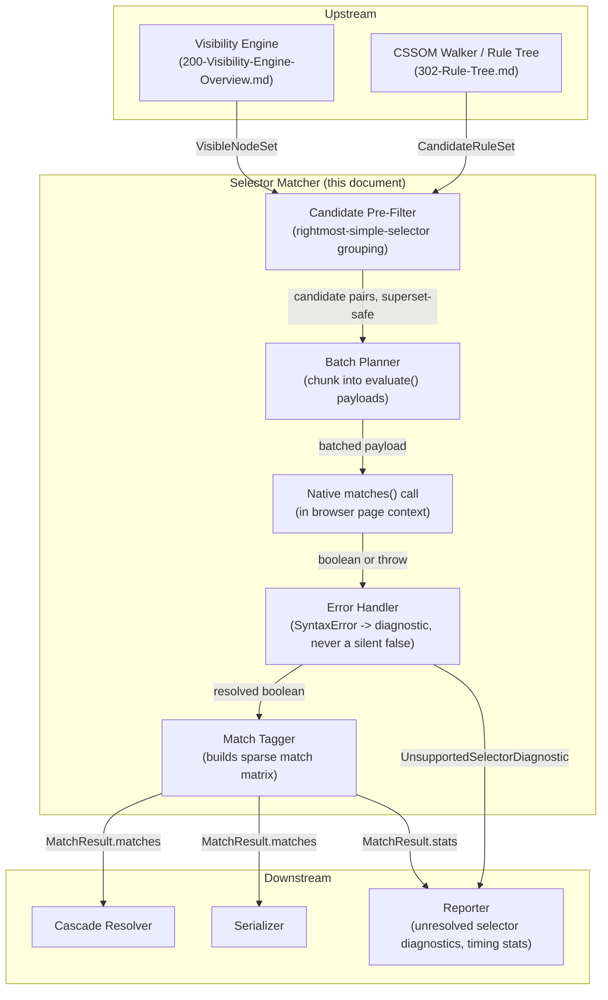
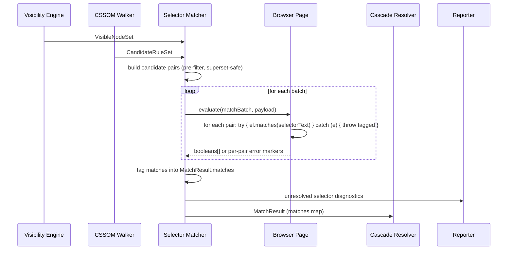

# Selector Matching

## Version

1.0.0 — Phase 6 (Selector Engine)

## Purpose

This document specifies the core selector-matching algorithm that determines, for every visible DOM node collected during an extraction run, which CSSOM rules apply to it. It is the load-bearing design document for the Selector Matcher module (see [003-Requirements.md](../architecture/003-Requirements.md) module table, "Selector Matcher" row) and is the direct implementation specification for [ADR-0002-No-Custom-Selector-Parser](../adr/ADR-0002-No-Custom-Selector-Parser.md). Every decision here is downstream of one non-negotiable constraint: selector-to-element matching is delegated entirely to the browser's native `Element.prototype.matches()`, never to a parser or matcher written for this project.

## Audience

Senior engineers implementing the `packages/matcher` package, engineers implementing the Cascade Resolver and Serializer that consume this module's output, and reviewers evaluating proposed performance optimizations to the matching pipeline. Familiarity with the CSSOM, the Selectors API, and the project's Design Principles is assumed.

## Prerequisites

- [006-Design-Principles.md](../architecture/006-Design-Principles.md), specifically Principle 1 (Browser Is Source of Truth) and Principle 2 (Never Implement a Custom Selector Parser)
- [ADR-0002-No-Custom-Selector-Parser.md](../adr/ADR-0002-No-Custom-Selector-Parser.md), the formal decision record this document implements
- A working understanding of `Element.prototype.matches()`, `page.evaluate()`-style bridge calls, and CSSOM rule enumeration
- Familiarity with the upstream Visibility Engine and CSSOM Walker outputs consumed by this module

## Related Documents

- [../design/200-Visibility-Engine-Overview.md](../design/200-Visibility-Engine-Overview.md) — produces the set of visible DOM nodes this module matches against (forward reference; Phase 4)
- [../design/302-Rule-Tree.md](../design/302-Rule-Tree.md) — produces the rule tree this module matches selectors from (forward reference; Phase 5)
- [401-Selector-Memoization.md](./401-Selector-Memoization.md) — the performance layer built directly on top of this document's baseline algorithm
- [402-Pseudo-Elements.md](./402-Pseudo-Elements.md) — pseudo-element-specific matching considerations
- [403-Pseudo-Classes.md](./403-Pseudo-Classes.md) — pseudo-class-specific matching considerations, including dynamic/stateful classes
- [404-Is-Where-Has.md](./404-Is-Where-Has.md) — logical combinator matching, including layout-dependent `:has()` scheduling
- [405-Container-Queries.md](./405-Container-Queries.md) — how container-query-scoped rules interact with the matching pass
- [ADR-0002-No-Custom-Selector-Parser.md](../adr/ADR-0002-No-Custom-Selector-Parser.md)
- [006-Design-Principles.md](../architecture/006-Design-Principles.md)

## Overview

The Selector Matcher sits at the pivot point of the extraction pipeline. Upstream, the Visibility Engine has already determined which DOM nodes are candidates for "above the fold" (per the Rule Matching algorithm summarized in [BRIEF.md](../../BRIEF.md) Section 2.5), and the CSSOM Walker has already enumerated every CSS rule reachable from the page's stylesheets, including rules nested inside `@media`, `@supports`, `@layer`, and container-query blocks, each carrying its `selectorText` exactly as reported by the browser's own CSSOM. The Selector Matcher's job is narrow and precisely bounded: for each `(node, rule)` pair drawn from these two upstream sets, answer the boolean question "does this rule apply to this node," and do so by invoking `element.matches(rule.selectorText)` — nothing else.

This narrowness is deliberate and is the entire point of the module. Section 2.5 of the brief states the Rule Matching algorithm plainly: use `element.matches()` as the canonical selector evaluator, support the full modern selector surface (combinators, nesting, pseudo-elements, `:is()`, `:where()`, `:has()` browser permitting, attribute selectors, namespace selectors), and never implement a custom selector parser. This document exists to make that mandate concrete: what the naive, correctness-first version of the algorithm looks like; how it is embedded in a real page-execution pipeline; how the module behaves when `matches()` itself fails; and how its output is shaped for consumption by the Cascade Resolver and Serializer.

The document is deliberately scoped to the *baseline, correctness-first* matching pass. The substantial performance work — memoization keyed by element-shape signature, and reverse indexing of selectors to candidate nodes — is described in [401-Selector-Memoization.md](./401-Selector-Memoization.md) as an additive layer that must be provably equivalent to the baseline described here, per Principle 3 (Correctness Over Premature Optimization). Nothing in this document should be read as prescribing that the naive O(nodes × rules) pass literally executes unmodified in production; rather, it establishes the ground-truth semantics that every optimization layered on top must preserve exactly.

## Detailed Design

### The Canonical Matching Operation

The single primitive this module is built around is:

```js
element.matches(selectorText)
```

executed inside the live browser page context established by the Browser Manager (per [ADR-0001-Browser-Is-Source-of-Truth](../adr/ADR-0001-Browser-Is-Source-of-Truth.md)). Every other concern in this document — batching, pre-filtering, error handling, output shaping — is scaffolding around this one call. The module MUST NOT, at any point, attempt to answer the matching question by inspecting `selectorText` structurally (tokenizing combinators, walking a parsed selector list, computing specificity from selector syntax) in order to *decide* a match. Structural inspection of `selectorText` is permitted only for two narrow, non-decisional purposes, both defined precisely in [ADR-0002](../adr/ADR-0002-No-Custom-Selector-Parser.md):

1. Splitting a comma-separated selector list into independently-trackable branches, purely as bookkeeping over which branch of a multi-selector rule matched — never to decide the match itself.
2. Extracting a cheap, false-negative-free candidate filter (e.g., "this rule's rightmost simple selector is a class name, and no visible node carries that class, so skip calling `matches()` for this rule entirely") used to prune the search space, discussed under Algorithms below and expanded in [401-Selector-Memoization.md](./401-Selector-Memoization.md).

Both are optimizations over *when* `matches()` is called, never substitutes for calling it.

### Inputs to the Matcher

The Selector Matcher receives two collections, each already normalized by upstream modules:

- **VisibleNodeSet** — the output of the Visibility Engine (forward reference, [200-Visibility-Engine-Overview.md](../design/200-Visibility-Engine-Overview.md)): a set of stable node handles, each carrying at minimum a `stableId` (an engine-injected identity token, not a DOM reference, so it survives serialization across `page.evaluate()` boundaries), `tagName`, `classList` snapshot, `id`, and a small set of attribute name/value pairs relevant to attribute-selector pre-filtering.
- **CandidateRuleSet** — the output of the CSSOM Walker via the Rule Tree (forward reference, [302-Rule-Tree.md](../design/302-Rule-Tree.md)): a set of `{ ruleId, selectorText, sourceStylesheetIndex, sourceRuleIndex, declarationBlock }` records, already filtered to rules whose containing conditional groups (`@media`, `@supports`, `@layer`, container queries) are believed active for the current viewport/mode, per the CSSOM Walker's own responsibility boundary. The Selector Matcher does not re-evaluate media/container conditions itself; see [405-Container-Queries.md](./405-Container-Queries.md) for how container-query-scoped rules are handled at the boundary between the two modules.

Neither collection is trusted to be small. Realistic pages easily produce thousands of visible nodes and, for enterprise stylesheets or unpurged utility frameworks, tens of thousands of candidate rules (see [BRIEF.md](../../BRIEF.md) Section 2.15 fixture list, which explicitly calls out "huge enterprise stylesheets" as a required test fixture).

### The Naive Correctness Baseline: O(nodes × rules)

The starting point for this module's design — and the algorithm every optimization must remain provably equivalent to — is exhaustive pairwise matching:

> For every visible node `n` in `VisibleNodeSet`, and for every rule `r` in `CandidateRuleSet`, evaluate `n.matches(r.selectorText)`. If true, record `r` as a matched rule contributing to `n`'s applicable style.

This is the only version of the algorithm that requires no argument for its correctness beyond "it is what Principle 1 and Principle 2 already establish as authoritative": every single decision is a direct browser-native `matches()` call, with no pre-filtering, no caching, no shortcut of any kind. Its cost is `O(|N| × |R|)` calls to `matches()`, each of which, executed naively one at a time via individual `page.evaluate()` round trips, is dominated by cross-process IPC/serialization overhead rather than the matching computation itself (matching inside the browser's own selector engine is typically sub-microsecond per call; the round trip is not).

This baseline is not a strawman to be immediately discarded — it is the specification. Every batching, pre-filtering, or memoization strategy this module or [401-Selector-Memoization.md](./401-Selector-Memoization.md) introduces exists purely to reduce the *number of round trips and redundant calls*, never to change *which* pairs are considered or *what answer* is accepted for a given pair. This is precisely Principle 3 (Correctness Over Premature Optimization) in [006-Design-Principles.md](../architecture/006-Design-Principles.md): "Performance optimizations MUST be introduced as additive, benchmarked, and toggleable layers on top of a correct baseline."

Why accept `O(|N| × |R|)` as the baseline rather than trying to find an asymptotically better algorithm at this layer? Because there is no way to know, in general, whether a rule matches a node without asking the entity that actually implements CSS selector semantics — the browser. Any claimed sub-quadratic algorithm that does not consult `matches()` for every pair it ultimately reports as a match is, by construction, a custom matcher of some kind, which is exactly what [ADR-0002](../adr/ADR-0002-No-Custom-Selector-Parser.md) forbids. What *is* legitimate, and is where all the real speedup comes from, is reducing which pairs are even considered for a `matches()` call — via superset-safe filtering — and reducing the number of *distinct* `matches()` invocations needed by recognizing when two pairs are guaranteed to produce the same answer. Both techniques are elaborated below and in [401-Selector-Memoization.md](./401-Selector-Memoization.md).

### Batching Strategy: Grouping by Candidate Signature Without Reimplementing Specificity

The primary lever available at this layer, without touching correctness, is reducing the number of `(node, rule)` pairs that require an actual `matches()` call, and reducing the number of `page.evaluate()` round trips needed to evaluate the pairs that remain.

**Grouping by rightmost simple selector token.** For the overwhelming majority of real-world selectors, the rightmost simple selector — the final class, ID, tag name, or attribute test in the compound selector, ignoring everything to its left — is a *necessary* condition for a match: if a node does not carry the class named in a selector's rightmost class component, it categorically cannot match that selector, no combinator or pseudo-class to the left can change that. This mirrors how real browser engines organize their internal rule-matching indices (bucket-by-key-selector), and it is explicitly called out as an acceptable technique in [ADR-0002](../adr/ADR-0002-No-Custom-Selector-Parser.md)'s Algorithms section and Implementation Notes: "group rules by their rightmost simple selector into an index... to make the pre-filter itself O(1) per node per relevant selector."

Extracting the rightmost simple selector token is a *lexical*, delimiter-based operation, not a parse of the selector's internal grammar. It is bounded to recognizing the last occurring `.class`, `#id`, `[attr...]`, or bare tag-name token before the end of the selector string (or before a trailing pseudo-class/pseudo-element, which is stripped for this purpose only and never interpreted). It is explicitly permitted as "purely a syntactic, delimiter-based operation" under [ADR-0002](../adr/ADR-0002-No-Custom-Selector-Parser.md)'s "What this permits" list, distinguished sharply from parsing a selector's combinator/pseudo-class structure to decide a match.

This lexical extraction must satisfy one invariant absolutely: it may only ever produce **false positives** (candidate pairs that turn out, upon calling `matches()`, not to actually match), never **false negatives** (excluding a pair that `matches()` would have accepted). Any selector whose rightmost token cannot be confidently extracted — an escaped character sequence, an unusual Unicode class name, a selector ending in a functional pseudo-class argument that could itself contain simple selectors (e.g., `:is(.a, .b)` at the tail) — must degrade to "no filter, include unconditionally" rather than risk excluding a true match. This conservatism is Implementation Note 1 from [ADR-0002](../adr/ADR-0002-No-Custom-Selector-Parser.md): "the pre-filter may only produce false positives... never false negatives."

**Grouping by tag name.** Similarly, a selector's rightmost simple selector may be a bare tag name (`div`, `article`) or the universal selector (`*`), in which case the pre-filter can only assert "candidate for all nodes of this tag" or "candidate for all nodes," respectively — a weaker but still useful filter when a stylesheet contains many tag-scoped rules.

**What batching explicitly does not do.** It does not attempt to compute or compare CSS specificity. Specificity is the Cascade Resolver's responsibility, derived either from browser-observable behavior or from well-vetted logic that itself never parses selector text to compute specificity values (per [ADR-0002](../adr/ADR-0002-No-Custom-Selector-Parser.md)'s explicit forbiddance of "reimplementing specificity calculation by parsing selector text"). The Selector Matcher's batching groups exist solely to reduce candidate-pair volume before `matches()` calls; they carry zero information about cascade ordering and must never be repurposed as a specificity proxy, even informally, by any downstream code that happens to have access to the grouping keys.

### Round-Trip Batching

Independent of pre-filtering, the module batches many `(node, rule)` pairs into a single `page.evaluate()` call rather than issuing one call per pair, because the dominant real-world cost is the IPC/serialization round trip, not the in-page matching computation. A batch payload carries an array of `{ nodeId, selectorText }` pairs; the in-page evaluation function resolves each `nodeId` back to a live element via a stable identity mechanism (an engine-injected `data-ccss-id` attribute or an in-page `WeakMap`, consistent with [ADR-0002](../adr/ADR-0002-No-Custom-Selector-Parser.md) Implementation Note 2) and calls `el.matches(selectorText)` for each pair, returning a parallel array of booleans. Batch sizing is a tuning knob bounded by `page.evaluate()` payload size and timeout limits, not a correctness-relevant parameter — see Performance section.

### Handling `element.matches()` Throwing

Not every selector string that appears in `selectorText` is guaranteed to be evaluable by every target browser build. Two situations must be distinguished carefully, because they have opposite correctness implications:

1. **The browser's parser rejects the selector as syntactically invalid or containing an unsupported/experimental feature** — `element.matches(selectorText)` throws a `DOMException` of type `SyntaxError`. This happens, for example, when a stylesheet contains a `:has()`-based selector evaluated against a browser build without `:has()` support, or a bleeding-edge pseudo-class behind a flag that is not enabled in the automated browser instance.
2. **The browser's parser accepts the selector and evaluates it, returning `false`** — this is a legitimate non-match, not a failure.

These two outcomes are semantically distinct and must never be conflated. Per [006-Design-Principles.md](../architecture/006-Design-Principles.md) Edge Cases and [ADR-0002](../adr/ADR-0002-No-Custom-Selector-Parser.md) Edge Cases: "a `SyntaxError` from `element.matches()` for a selector the browser does not recognize is caught and reported as 'unsupported by target browser,' never silently reinterpreted." Treating a thrown `SyntaxError` as an implicit `false` would be a silent correctness failure of exactly the kind Principle 6 (Fail-Fast Diagnostics) exists to prevent — a rule that genuinely applies in a *different*, more capable browser (e.g., the end user's actual browser, which may support the selector even if the automated extraction browser's pinned version does not) would be silently dropped from critical CSS, producing a flash-of-unstyled-content for real users with no trace in the extraction's diagnostics.

The matcher's error-handling contract is therefore:

- Wrap every `matches()` invocation (individually, inside the batched in-page evaluation function, so one throwing call does not abort the rest of the batch) in a try/catch.
- On `SyntaxError` (or any other thrown exception), record a structured `UnsupportedSelectorDiagnostic` — carrying `ruleId`, `selectorText`, the target browser's user-agent/version string, and the specific pair that failed — attached to the shared `ExtractionResult` diagnostics channel (per Principle 6 and the `Result<T, Diagnostic[]>` shape mandated in [006-Design-Principles.md](../architecture/006-Design-Principles.md) Implementation Notes).
- Treat the pair as **unresolved**, not as a non-match: the rule is neither included in the matched set nor definitively excluded. Downstream, in strict/CI-oriented presets (again per Principle 6), an unresolved selector due to browser-support gaps should be surfaced as a build-facing warning ("selector X could not be evaluated by the extraction browser (unsupported in <version>); critical CSS for this rule may be incomplete"), giving operators the choice to fail the build, ignore the specific selector via configuration, or upgrade the pinned browser.
- Never crash the extraction run for a single unsupported selector. Graceful degradation at the per-pair level, with loud, attributable diagnostics, is the required behavior — not silent suppression, and not a fatal abort.

### Output Shape: Tagging Matched Rules for Downstream Consumption

The Selector Matcher's output is a sparse match structure, not a flattened CSS string — flattening is explicitly the Serializer's responsibility, not this module's. The canonical output shape is:

```
MatchResult {
  matches: Map<NodeId, Set<RuleId>>      // which rules apply to which visible nodes
  unresolved: UnsupportedSelectorDiagnostic[]  // pairs that could not be evaluated
  stats: { candidatePairs: number, matchesFound: number, evaluateCalls: number }
}
```

Each `RuleId` in the `matches` map resolves back, via the Rule Tree (see [302-Rule-Tree.md](../design/302-Rule-Tree.md)), to its full `{ selectorText, declarationBlock, sourceStylesheetIndex, sourceRuleIndex }` record. This is a deliberate design choice: the Selector Matcher tags *which* rules matched *which* nodes, but does not itself decide cascade precedence, deduplicate declarations, or produce final serialized output. That separation of concerns follows directly from Principle 4 (Pluggable, Strategy-Based Extraction Architecture) and Principle 5 (Determinism of Output) in [006-Design-Principles.md](../architecture/006-Design-Principles.md): the Cascade Resolver is the sole consumer responsible for resolving specificity/origin/layer ordering across the matched-rule set the Selector Matcher hands it, and the Serializer is the sole consumer responsible for canonical ordering and final output formatting. The Selector Matcher must not pre-sort, pre-deduplicate by "apparent" precedence, or otherwise anticipate cascade decisions — doing so would blur module boundaries and risk violating Principle 5's requirement that canonicalization live in exactly one place (the Serializer).

The `unresolved` diagnostics list is threaded through unchanged to the Reporter (per Principle 6), and the `stats` block feeds the Reporter's timing/trace report (Section 2.12 of the brief) without being mixed into the deterministic matched-rule payload itself, consistent with Principle 5's prohibition on embedding non-deterministic or run-specific metadata into content that must be byte-identical across runs — `stats` is reporting-only and never affects `matches`.

## Architecture

The Selector Matcher occupies a fixed position in the pipeline: downstream of the Visibility Engine and CSSOM Walker, upstream of the Cascade Resolver and Serializer.



### Pipeline Sequence



### Matching Pipeline State Machine

```mermaid
stateDiagram-v2
    [*] --> PairGenerated: (node, rule) candidate emitted by pre-filter
    PairGenerated --> Dispatched: included in a batch payload
    Dispatched --> Evaluated: matches() returns boolean
    Dispatched --> Failed: matches() throws SyntaxError
    Evaluated --> Matched: result == true
    Evaluated --> NotMatched: result == false
    Failed --> Unresolved: recorded as UnsupportedSelectorDiagnostic
    Matched --> [*]: tagged into MatchResult.matches
    NotMatched --> [*]: discarded (not a match, not an error)
    Unresolved --> [*]: surfaced to Reporter; excluded from matches
```



## Algorithms

### Problem Statement

Given `VisibleNodeSet` (size `|N|`) and `CandidateRuleSet` (size `|R|`), produce `MatchResult.matches: Map<NodeId, Set<RuleId>>` such that for every `(n, r)` pair genuinely matched by the browser's own `Element.matches()` semantics, `r` appears in `matches.get(n)`, and no pair that `matches()` would reject (or that could not be evaluated) appears. The algorithm must use `element.matches()` as the exclusive source of truth for every reported match, per [ADR-0002](../adr/ADR-0002-No-Custom-Selector-Parser.md).

### Inputs and Outputs

- **Input:** `nodes: NodeHandle[]` (from Visibility Engine), `rules: RuleRecord[]` (from CSSOM Walker / Rule Tree)
- **Output:** `MatchResult { matches, unresolved, stats }` as defined above

### Pseudocode

```
function matchSelectors(nodes: NodeHandle[], rules: RuleRecord[]): MatchResult
    matches = new Map<NodeId, Set<RuleId>>()
    unresolved = []
    candidatePairs = []

    # Step 1: superset-safe pre-filter (never excludes a true match)
    ruleIndex = groupByRightmostSimpleSelector(rules)   # lexical extraction only
    for node in nodes:
        applicableRules = ruleIndex.lookupCandidates(node.tagName, node.classList, node.id, node.attributes)
        for rule in applicableRules:
            candidatePairs.append({ node, rule })

    # Step 2: batch dispatch to the browser; matches() is the only decision primitive
    for batch in chunk(candidatePairs, BATCH_SIZE):
        payload = batch.map(p => ({ nodeId: p.node.stableId, ruleId: p.rule.ruleId, selectorText: p.rule.selectorText }))
        batchResults = page.evaluate((payload) => {
            return payload.map(p => {
                const el = resolveStableNode(p.nodeId)
                try {
                    return { ruleId: p.ruleId, ok: true, value: el.matches(p.selectorText) }
                } catch (err) {
                    return { ruleId: p.ruleId, ok: false, errorName: err.name, errorMessage: err.message }
                }
            })
        }, payload)

        for i, pair in enumerate(batch):
            result = batchResults[i]
            if not result.ok:
                unresolved.append(makeUnsupportedSelectorDiagnostic(pair.rule, pair.node, result))
                continue
            if result.value:
                if not matches.has(pair.node.stableId):
                    matches.set(pair.node.stableId, new Set())
                matches.get(pair.node.stableId).add(pair.rule.ruleId)
            # result.value == false: legitimate non-match, no action

    return MatchResult(matches, unresolved, computeStats(candidatePairs, matches))
```

### Time Complexity

- **Worst case (no effective pre-filter reduction, e.g., every rule keyed on the universal selector or a class every node carries):** `O(|N| × |R|)` `matches()` evaluations, matching the naive baseline exactly.
- **Typical case:** the pre-filter (`groupByRightmostSimpleSelector`, itself `O(|R|)` to build once and `O(1)` amortized per lookup given a hash-indexed structure) reduces the candidate set to `O(Σ_n |rulesApplicableTo(n)|)`, which in practice is far smaller than `|N| × |R|` because real stylesheets are dominated by class selectors and any given node carries only a handful of classes. This does not change the asymptotic worst case but dominates observed real-world performance.
- **Round-trip cost:** `O(⌈candidatePairs / BATCH_SIZE⌉)` `page.evaluate()` calls, each with a fixed IPC overhead independent of asymptotic pair count — this is the primary lever the Batching Strategy above optimizes, and it is why batch sizing is a first-class tuning parameter (see Performance section) rather than an afterthought.

### Memory Complexity

- `O(|R|)` for the rightmost-simple-selector index.
- `O(candidatePairs)` transient, for the batch payload construction and results — bounded by `BATCH_SIZE` at any instant if streamed rather than materialized all at once, though the reference implementation may materialize the full candidate list before chunking for simplicity, trading peak memory for implementation clarity; this is a legitimate, documented tradeoff (see Tradeoffs).
- `O(matches found)` for the output map, which in the worst case (a page where every rule matches every node) is `O(|N| × |R|)`, though this is pathological and would itself be flagged by the Reporter as a stylesheet-hygiene warning (per [ADR-0002](../adr/ADR-0002-No-Custom-Selector-Parser.md) Performance section).

### Failure Cases

- **Pathologically large candidate sets** (unpurged utility CSS at scale) can produce a large `candidatePairs` list even after pre-filtering; must be chunked to respect `page.evaluate()` payload/timeout limits (see Edge Cases).
- **Stale node identity**: if the DOM mutates between node collection and match dispatch, `resolveStableNode(nodeId)` may fail to resolve; the reference implementation must treat an unresolvable node as a distinct, attributed diagnostic (`StaleNodeReferenceDiagnostic`), not as a silent skip, consistent with Principle 6.
- **Selector evaluation throwing** — handled per-pair as described above; a browser-wide catastrophic failure (e.g., the page context itself has navigated away or crashed mid-batch) is a different failure class handled by the Navigation Engine / Browser Manager's own error boundaries, not by this module.

### Optimization Opportunities

- Persist the rightmost-simple-selector index across viewport variants of the same route, since the CandidateRuleSet's non-conditional structure (ignoring which `@media` rules are currently active) is shared across Mobile/Tablet/Desktop passes of the same page.
- Parallelize batch dispatch across independent page contexts when matching multiple routes/viewports concurrently, since match results for disjoint node sets are independent (Principle 5's determinism requirement is satisfied by reassembling results into canonical order downstream, in the Serializer, not by serializing dispatch itself).
- Layer the memoization and reverse-indexing techniques of [401-Selector-Memoization.md](./401-Selector-Memoization.md) on top of this baseline for further reduction in both candidate-pair count and redundant `matches()` calls across nodes sharing an identical element shape.

## Implementation Notes

- The pre-filter (`groupByRightmostSimpleSelector`) must be implemented as a strictly conservative, lexical scan. Any selector text the scanner cannot confidently decompose (escaped Unicode class names, selectors ending in a functional pseudo-class whose argument list may itself contain simple selectors, e.g. `a:is(.x, .y)`) must fall back to "no filter — candidate for all nodes," per the superset-safety invariant. This scanner must be covered by fuzz/property tests asserting zero false negatives against a real-browser oracle, mirroring the testing approach specified in [ADR-0002](../adr/ADR-0002-No-Custom-Selector-Parser.md).
- Node identity must be established via the same mechanism used across the pipeline (`data-ccss-id` attribute injection or an in-page `WeakMap`, per [ADR-0002](../adr/ADR-0002-No-Custom-Selector-Parser.md) Implementation Note 2) so that this module's batch payloads are consistent with the identity scheme the Visibility Engine and CSSOM Walker already rely on.
- Selector text must never be normalized, minified, or rewritten before being passed to `matches()` — pass `selectorText` exactly as reported by the CSSOM (`ADR-0002` Implementation Note 3).
- `:is()`, `:where()`, `:has()`, and namespace selectors require no special-case matching logic in this module — they are passed to `matches()` unmodified. The only special handling any of them require is *scheduling* (see [404-Is-Where-Has.md](./404-Is-Where-Has.md) for `:has()`'s dependency on layout stabilization), which this module's batch planner must accept as an external scheduling signal (a "ready to match" gate) rather than reimplementing itself.
- Container-query-scoped rules (see [405-Container-Queries.md](./405-Container-Queries.md)) are expected to arrive in `CandidateRuleSet` only once the CSSOM Walker/Rule Tree has already resolved which container-conditional rules are active for the current layout; this module does not re-derive container query state.
- The `BATCH_SIZE` constant must be an explicit, documented, environment-tunable configuration value, not a magic number buried in the implementation, given its direct effect on round-trip count vs. per-call payload size (see Performance).

## Edge Cases

- **`:has()` and layout-dependent selectors.** `element.matches()` for a `:has()`-containing selector can legitimately depend on descendant subtree state that has not yet stabilized. This module must accept a "ready" signal from the batch scheduling layer (detailed in [404-Is-Where-Has.md](./404-Is-Where-Has.md)) before dispatching such pairs; dispatching too early risks a transient, non-final answer, which would violate Principle 5's determinism guarantee if two runs observed layout at different stabilization points.
- **Browser-unsupported selector syntax.** Handled explicitly above: `SyntaxError` from `matches()` produces an `UnsupportedSelectorDiagnostic`, never a silent `false`.
- **Shadow DOM boundaries.** `element.matches()` does not cross shadow boundaries; nodes inside a shadow root must be matched against rules scoped to that shadow root's own stylesheets (adopted or otherwise), following the same Visibility Engine / CSSOM Walker boundary already established per [006-Design-Principles.md](../architecture/006-Design-Principles.md) Edge Cases. This module receives shadow-scoped nodes and shadow-scoped rules as already-partitioned inputs; it does not itself flatten or bridge shadow boundaries.
- **Cross-origin stylesheet rules.** By the time `CandidateRuleSet` reaches this module, cross-origin rules inaccessible due to CORS should already have been excluded and diagnosed upstream by the CSSOM Walker (per [006-Design-Principles.md](../architecture/006-Design-Principles.md) Edge Cases); this module assumes `CandidateRuleSet` contains only rules whose `cssRules`/`selectorText` were successfully readable.
- **Constructable/adopted stylesheets.** Rules originating from `adoptedStyleSheets` arrive through the same `CandidateRuleSet` contract as `<link>`/`<style>`-sourced rules; this module treats them identically since matching is selector-text-driven, not source-driven.
- **Nested CSS.** By the time a nested rule reaches this module, its `selectorText` is already the browser-flattened, fully resolved selector (per [006-Design-Principles.md](../architecture/006-Design-Principles.md) Edge Cases on Nested CSS); this module never needs nesting-aware logic.
- **Namespaced (SVG/XML) selectors.** Matched via the same `matches()` call, unmodified; browser-native namespace resolution applies transparently.
- **Extremely long `:is()`/`:not()` argument lists** (common in auto-generated utility-framework output) can hit browser-internal selector complexity limits, manifesting as a thrown error from `matches()`; handled via the same per-pair error path, logged and continued, never aborting the batch.
- **Future CSS specifications** (e.g., new relational pseudo-classes, `@scope`-qualified matching) are expected to be absorbed with zero code change to the matching primitive itself, per the entire premise of [ADR-0002](../adr/ADR-0002-No-Custom-Selector-Parser.md); only the pre-filter's lexical scanner may occasionally need a conservative update to avoid mis-extracting a rightmost token from novel syntax, and even then only in the direction of "fall back to no filter," never toward asserting a positive match.

## Tradeoffs

| Decision | Alternative Considered | Why Chosen | Cost Accepted |
|---|---|---|---|
| Exclusive use of `element.matches()` | Custom/JS-library selector matcher for raw throughput | Correctness bounded by browser conformance, not this codebase; zero maintenance as selectors evolve (per [ADR-0002](../adr/ADR-0002-No-Custom-Selector-Parser.md)) | Matching throughput is bounded by IPC round-trip cost, mitigated via batching, not a faster in-process matcher |
| Lexical rightmost-simple-selector pre-filter | No pre-filter; exhaustive `O(\|N\|×\|R\|)` dispatch always | Dramatically reduces candidate pairs and round trips for realistic stylesheets with zero risk to correctness (superset-safe by construction) | Requires careful, conservatively-implemented lexical scanning and fuzz testing to guarantee zero false negatives |
| Sparse `matches: Map<NodeId, Set<RuleId>>` output, no cascade/serialize logic in this module | Have the matcher also resolve specificity/ordering inline for a "one-pass" pipeline | Preserves clean module boundaries (Principle 4) and keeps canonicalization in exactly one place, the Serializer (Principle 5) | An extra pass/handoff between modules; not a single monolithic loop |
| Per-pair try/catch around `matches()`, unresolved as a distinct outcome from non-match | Treat any thrown error as a non-match | Avoids silently dropping genuinely-applicable rules due to browser-support gaps (Principle 6) | More complex result plumbing (three outcomes — matched/not-matched/unresolved — instead of two) |
| Batched `page.evaluate()` dispatch | One `matches()` call per pair via individual round trips | Round-trip overhead dominates cost at realistic scale; batching amortizes it | Batch sizing becomes a tuning parameter requiring profiling per target environment |

## Performance

- **CPU complexity.** As derived in Algorithms: worst case `O(|N| × |R|)` `matches()` evaluations; typical case substantially smaller due to the rightmost-simple-selector pre-filter. The module's own host-side CPU cost (pre-filter index construction, pair generation, batch assembly) is near-linear in candidate-pair count and is not the dominant cost — the dominant cost is round-trip count, per [ADR-0002](../adr/ADR-0002-No-Custom-Selector-Parser.md) Performance section.
- **Memory complexity.** `O(|R|)` for the pre-filter index; `O(candidatePairs)` transient for batch construction; `O(matches found)` for output, bounded in practice by realistic stylesheet/DOM ratios.
- **Caching strategy.** This document's baseline performs no cross-call caching; memoization of identical `(element-shape, selector)` lookups across structurally identical nodes is the subject of [401-Selector-Memoization.md](./401-Selector-Memoization.md) and must be understood as strictly additive to this document's algorithm, never a replacement for it.
- **Parallelization opportunities.** Independent batches (disjoint node/rule subsets, or entirely independent route/viewport extraction runs) may be dispatched concurrently across separate page contexts; within a single page context, `evaluate()` calls are serialized by that page's single-threaded JS execution model, so intra-page parallelism is not available at this layer.
- **Incremental execution.** When the Dependency Resolver's graph analysis determines only a subset of stylesheets changed since a prior run (see forthcoming Phase 7 documents), this module can, in principle, re-match only rules originating from changed stylesheets, provided node identity is stable across the incremental check — this is an explicitly noted future integration point, not implemented in the baseline described here.
- **Profiling guidance.** Instrument `evaluateCalls`, `candidatePairs`, and wall-clock time per batch to find the practical `BATCH_SIZE` sweet spot per target environment (see [ADR-0002](../adr/ADR-0002-No-Custom-Selector-Parser.md) Performance section for the same guidance at the ADR level); regressions in `evaluateCalls` per fixture, tracked over time, are the leading indicator of an accidental reversion to per-pair round trips.
- **Scalability limits.** Pages with pathologically large rule counts (100k+ unpurged utility classes) combined with large DOM trees can still produce large candidate sets even after pre-filtering; the Reporter must surface a configurable-threshold warning rather than treating this purely as an engine defect, consistent with [ADR-0002](../adr/ADR-0002-No-Custom-Selector-Parser.md).

## Testing

- **Unit tests.** The rightmost-simple-selector lexical scanner must be unit-tested against a broad corpus of selector strings (simple, compound, combinator-joined, `:is()`/`:where()`/`:has()`-containing, attribute selectors with all matching operators, namespaced selectors, nested-CSS-flattened selectors) asserting it never excludes a pair a real-browser oracle would accept.
- **Integration tests.** Run the full pipeline (pre-filter + batch dispatch + error handling + tagging) against the fixture suite named in [BRIEF.md](../../BRIEF.md) Section 2.15 (Tailwind, Bootstrap, CSS Modules, Styled Components, Emotion, Shadow DOM, SVG, Container Queries, Nested CSS, huge enterprise stylesheets) and assert byte-for-byte identical `matches` output versus the unfiltered, unbatched naive baseline — this is the critical correctness invariant per Principle 3.
- **Visual tests.** Not directly exercised by this module in isolation; validated transitively by the end-to-end visual regression suite once matched rules flow through Cascade Resolution and Serialization into rendered critical CSS.
- **Stress tests.** Fixtures with 50,000+ rules and 10,000+ visible nodes to validate batching/chunking stays within `page.evaluate()` payload and timeout limits and completes within acceptable wall-clock bounds.
- **Regression tests.** Every reported "rule X should/should not have matched node Y" bug becomes a permanent fixture; per [ADR-0002](../adr/ADR-0002-No-Custom-Selector-Parser.md), a genuine `matches()`-gave-the-wrong-answer bug (as opposed to a pre-filter, stale-identity, or upstream CSSOM Walker bug) should be exceedingly rare and treated as P0.
- **Benchmark tests.** Track `evaluateCalls`, `candidatePairs`, and wall-clock time per fixture across engine versions to catch regressions in batching efficiency or pre-filter effectiveness.

## Future Work

- Investigate whether a WPT (Web Platform Tests)-derived selector conformance corpus can drive the pre-filter's fuzz-test suite continuously, catching lexical-scanner regressions before they risk a false negative in production.
- Explore extending the rightmost-simple-selector index into a richer, browser-RuleSet-inspired multi-key index (class, id, tag, and attribute name jointly) for further candidate-set reduction on pathological stylesheets, while preserving the superset-safety invariant — this is the direct precursor to the reverse-index design in [401-Selector-Memoization.md](./401-Selector-Memoization.md).
- Open question: should the module expose a plugin-visible hook for custom, domain-specific pre-filter heuristics (per Section 2.13 of the brief, "customize matching"), while mechanically enforcing the false-negative-free invariant at the hook boundary rather than trusting plugin authors to self-police it? See [ADR-0004-Plugin-Lifecycle-Model](../adr/ADR-0004-Plugin-Lifecycle-Model.md) for the general constraint this would need to satisfy.
- Open question: as WebDriver BiDi or future browser automation protocols potentially expose lower-overhead batch-evaluation primitives, should `BATCH_SIZE` tuning become protocol-aware rather than a single global constant?
- Monitor whether `@scope`-qualified selectors, once broadly supported, require this module to pass additional scoping context to `matches()` beyond the selector string alone, per the open question raised in [ADR-0002](../adr/ADR-0002-No-Custom-Selector-Parser.md) Future Work.

## References

- [ADR-0002-No-Custom-Selector-Parser](../adr/ADR-0002-No-Custom-Selector-Parser.md)
- [ADR-0001-Browser-Is-Source-of-Truth](../adr/ADR-0001-Browser-Is-Source-of-Truth.md)
- [006-Design-Principles](../architecture/006-Design-Principles.md)
- [401-Selector-Memoization.md](./401-Selector-Memoization.md)
- [402-Pseudo-Elements.md](./402-Pseudo-Elements.md)
- [403-Pseudo-Classes.md](./403-Pseudo-Classes.md)
- [404-Is-Where-Has.md](./404-Is-Where-Has.md)
- [405-Container-Queries.md](./405-Container-Queries.md)
- [200-Visibility-Engine-Overview.md](../design/200-Visibility-Engine-Overview.md) (forward reference, Phase 4)
- [302-Rule-Tree.md](../design/302-Rule-Tree.md) (forward reference, Phase 5)
- MDN documentation: `Element.prototype.matches()`
- W3C CSS Selectors Level 4 specification
- Section 2.5 ("Rule Matching") and Section 2.4 (module table, "Selector Matcher") of the Documentation Agent Brief
