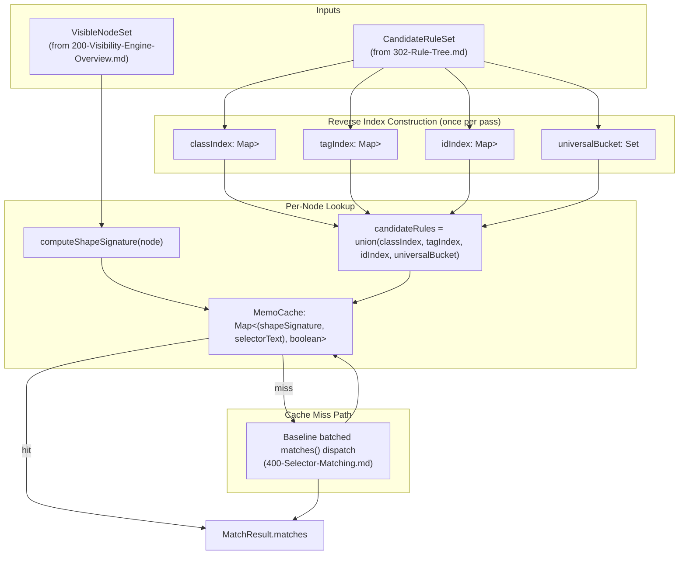
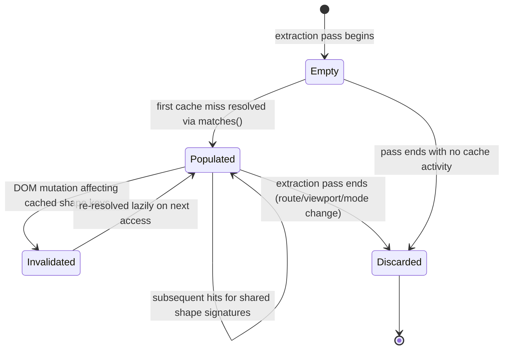
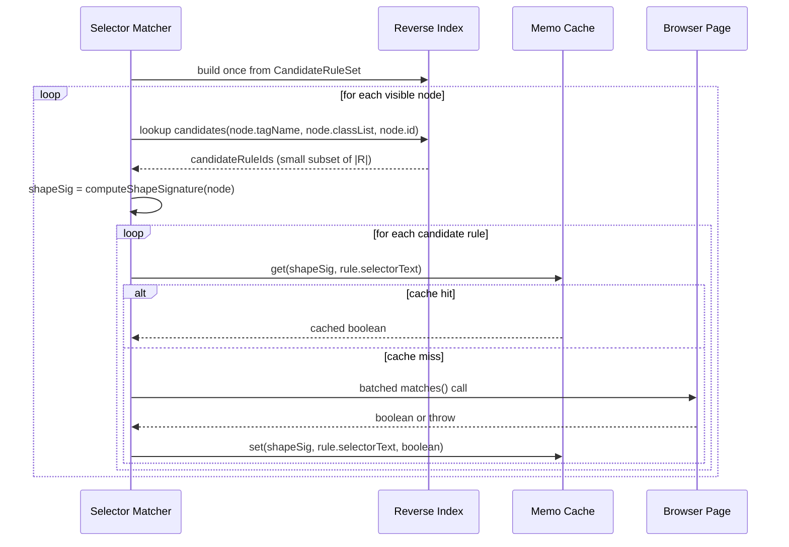

# Selector Memoization

## Version

1.0.0 — Phase 6 (Selector Engine)

## Purpose

This document specifies the performance layer built directly on top of the baseline matching algorithm in [400-Selector-Matching.md](./400-Selector-Matching.md): memoization of `element.matches()` results keyed by an element-shape signature and selector, and a reverse selector-to-candidate-node index that lets most rules skip most nodes entirely without ever calling `matches()`. Both techniques are additive optimizations over the correctness baseline, not replacements for it — per Principle 3 (Correctness Over Premature Optimization) in [006-Design-Principles.md](../architecture/006-Design-Principles.md), every optimization described here must be provably equivalent to the naive `O(nodes × rules)` pass, and per [ADR-0002-No-Custom-Selector-Parser](../adr/ADR-0002-No-Custom-Selector-Parser.md), neither technique may ever substitute for a native `matches()` call in producing a positive match result.

## Audience

Senior engineers implementing or reviewing the `packages/matcher` performance layer, and performance engineers evaluating the throughput/memory tradeoffs of index and cache sizing for large-scale extraction runs (enterprise stylesheets, high route/viewport counts). Familiarity with [400-Selector-Matching.md](./400-Selector-Matching.md) is required; this document assumes that baseline as given and does not re-derive it.

## Prerequisites

- [400-Selector-Matching.md](./400-Selector-Matching.md), the correctness baseline this document optimizes
- [006-Design-Principles.md](../architecture/006-Design-Principles.md), specifically Principle 2 (No Custom Selector Parser) and Principle 3 (Correctness Over Premature Optimization)
- [ADR-0002-No-Custom-Selector-Parser.md](../adr/ADR-0002-No-Custom-Selector-Parser.md)
- Familiarity with hash-based indexing structures and cache invalidation strategies

## Related Documents

- [400-Selector-Matching.md](./400-Selector-Matching.md) — the correctness baseline; this document is strictly additive to it
- [402-Pseudo-Elements.md](./402-Pseudo-Elements.md) — pseudo-element matching, which interacts with memoization keying (see Edge Cases)
- [403-Pseudo-Classes.md](./403-Pseudo-Classes.md) — dynamic/stateful pseudo-classes, which constrain what can safely be memoized
- [404-Is-Where-Has.md](./404-Is-Where-Has.md) — `:has()` layout-dependence, which constrains index/cache validity windows
- [405-Container-Queries.md](./405-Container-Queries.md) — container-query-scoped rules, relevant to cache invalidation across viewport variants
- [ADR-0002-No-Custom-Selector-Parser.md](../adr/ADR-0002-No-Custom-Selector-Parser.md)
- [006-Design-Principles.md](../architecture/006-Design-Principles.md)

## Overview

[400-Selector-Matching.md](./400-Selector-Matching.md) establishes that the only legitimate source of truth for "does rule `r` match node `n`" is a native `element.matches(r.selectorText)` call, and that the naive baseline cost is `O(|N| × |R|)` such calls. That document also introduces a first pre-filtering technique (grouping rules by rightmost simple selector) to reduce candidate-pair volume before dispatch. This document goes further, introducing two complementary techniques that exploit a structural property of real-world DOM trees and stylesheets that the baseline algorithm does not yet capture: **most DOM nodes on a real page are structurally interchangeable with respect to selector matching**, and **most rules are relevant to only a small fraction of nodes**.

The first observation motivates **memoization by element-shape signature**: a page built from a component-based framework (React, Vue, Angular, or any templating system) typically renders many DOM nodes that are structurally identical for matching purposes — the same tag name, the same class list, the same relevant attribute set — because they are repeated instances of the same component (list items, table rows, card grids, navigation links). If `matches()` has already been evaluated for one node with a given shape against a given selector, every other node sharing that exact shape is guaranteed, by the deterministic nature of `Element.matches()` against static structural selectors, to produce the identical boolean result for that selector. Memoizing on shape rather than on individual node identity collapses what would be thousands of redundant `matches()` calls into a handful.

The second observation motivates a **reverse selector-to-candidate-node index**: rather than iterating every rule against every node (even after cheap pre-filtering per node), build an index once — mapping class names, tag names, and IDs to the *set* of rules whose rightmost simple selector could possibly reference them — and then, for each node, look up only the rules relevant to that node's own class/tag/id set. This inverts the iteration order from "for each rule, scan nodes" to "for each node, look up relevant rules," and turns the pre-filter from a per-pair scan into an O(1)-amortized index lookup.

Both techniques are pure performance layers: neither one is permitted to decide a match independently of `matches()`, and both are strictly scoped to a single extraction pass to avoid the class of bugs described in Cache Invalidation below — namely, memoized results leaking across pages, routes, or DOM mutations where the underlying truth could have changed.

## Detailed Design

### Element-Shape Signature

An **element-shape signature** is a deterministic, cheaply-computable string or hash derived from the structural properties of a node that are sufficient to determine the outcome of `matches()` for any *static* (non-layout-dependent, non-stateful) selector. For the class of selectors this document's memoization applies to, the signature is composed of:

- `tagName` (lowercased, namespace-qualified where relevant for SVG/XML)
- the sorted, deduplicated `classList` (order-independent, since class-selector matching is order-independent)
- `id` (only relevant for ID-selector matching; often omitted from the signature key when a rule set contains no ID selectors, as a targeted optimization — see Algorithms)
- a canonicalized subset of attribute name/value pairs actually referenced by attribute selectors present in `CandidateRuleSet` (not the node's full attribute set, to keep signature computation cheap and avoid signature explosion from irrelevant attributes such as `data-testid` or auto-generated framework attributes not referenced by any selector)

Critically, the signature deliberately **excludes** ancestor/sibling structural context (parent tag, sibling position, DOM depth) and **excludes** dynamic/stateful pseudo-class-relevant state (`:hover`, `:focus`, `:nth-child`, `:checked`). This is not an oversight — it is the load-bearing boundary condition of this entire memoization strategy, discussed at length in Edge Cases and in [403-Pseudo-Classes.md](./403-Pseudo-Classes.md): a selector containing a combinator (`.card > .title`) or a structural/stateful pseudo-class (`:nth-child(2)`, `:hover`) cannot, in general, be answered purely from a node's own shape signature, because two nodes with identical tag/class/attribute signatures can have different ancestors, different sibling positions, or different live interaction state, and therefore different `matches()` results for such selectors.

The memoization cache is therefore keyed as `(shapeSignature, selectorText) -> boolean`, but it is only ever populated and consulted for selectors that have been classified, via the same lexical (non-parsing) technique used for the rightmost-simple-selector pre-filter in [400-Selector-Matching.md](./400-Selector-Matching.md), as **shape-only-decidable**: selectors composed exclusively of type, class, ID, and static attribute simple selectors with no combinator and no pseudo-class/pseudo-element that depends on context or interaction state. This classification is, again, purely lexical bookkeeping over the selector string for scheduling/caching purposes — never a parse that decides the match itself. A selector that cannot be confidently classified as shape-only-decidable is conservatively excluded from the memoization cache and always falls through to a direct `matches()` call (or the standard per-pair pre-filter path from [400-Selector-Matching.md](./400-Selector-Matching.md)), which preserves correctness at the cost of forgoing memoization for that selector.

### Why Memoize on Shape Rather Than Node Identity

An earlier design considered in review memoized directly on `(nodeId, selectorText)`. This is correct but nearly useless as a performance technique on its own, since a distinct `nodeId` per node produces exactly one cache hit — the node's own second lookup, if any — rather than sharing results across structurally identical nodes. Shape-signature keying is what actually collapses the search space: a `<ul>` with 200 `<li class="nav-item">` children produces 200 identical shape signatures, and a shape-only-decidable selector like `.nav-item` needs exactly one `matches()` call (against any one representative node of that shape) rather than 200. This is the single largest real-world performance lever this document introduces, precisely because component-based UIs are structurally repetitive by construction.

### Reverse Selector-to-Candidate-Node Index

Independent of memoization, this document specifies an index inverting the relationship between rules and nodes, built once per extraction pass from `CandidateRuleSet` and `VisibleNodeSet`:

- **By class name:** `Map<className, Set<RuleId>>` — for every rule whose rightmost simple selector (or any simple selector within a shape-only-decidable compound) references a class, add that rule to every class name it references.
- **By tag name:** `Map<tagName, Set<RuleId>>` — analogous, for type selectors.
- **By ID:** `Map<idValue, Set<RuleId>>` — analogous, for ID selectors, though in practice a much smaller index given the low cardinality of ID selectors in typical stylesheets.
- **Universal bucket:** a small, separate set of rules that could not be confidently keyed by any of the above (universal selector `*`, or selectors whose rightmost token could not be lexically extracted per [400-Selector-Matching.md](./400-Selector-Matching.md)'s conservatism requirement) — these rules remain candidates for every node, exactly as in the unindexed baseline, guaranteeing the superset-safety invariant holds even for the index's blind spots.

For each visible node, the candidate rule set is then the union of: `classIndex.get(c)` for every class `c` the node carries, `tagIndex.get(node.tagName)`, `idIndex.get(node.id)` if present, and the universal bucket — a small number of O(1) hash lookups and set unions per node, replacing the pre-filter's O(|R|) per-node scan from the baseline description in [400-Selector-Matching.md](./400-Selector-Matching.md).

This index is, precisely, the "browser-internal RuleSet-like bucketing structure" explicitly contemplated as a legitimate optimization in [ADR-0002](../adr/ADR-0002-No-Custom-Selector-Parser.md)'s Future Work section ("research whether rule-index structures analogous to browser-internal 'RuleSet' data structures could be safely mirrored in the host process purely for pre-filtering purposes"). It is built here as a first-class, specified component rather than left as an open research question, because it is a direct, low-risk generalization of the rightmost-simple-selector grouping already introduced in [400-Selector-Matching.md](./400-Selector-Matching.md) — the same superset-safety invariant applies unchanged: the index may only ever cause `matches()` to be called for a pair that turns out not to match; it may never cause a true match to be skipped.

### Combining the Index and the Cache

The two techniques compose in a single lookup path per node:

1. Look up the node's candidate rule set via the reverse index (fast, no `matches()` calls).
2. For each candidate rule, compute (or reuse, once computed for the node) the node's shape signature.
3. Consult the memoization cache for `(shapeSignature, rule.selectorText)`.
4. On a cache hit, use the cached boolean directly — zero `matches()` calls.
5. On a cache miss, dispatch a batched `matches()` call (per the batching mechanics of [400-Selector-Matching.md](./400-Selector-Matching.md)), then populate the cache with the result before returning it.

This ordering matters: the index runs first because it is cheaper and reduces the volume of pairs even considered for cache lookup; the cache runs second because, even after indexing, many nodes across a large page will share the same shape for the same subset of candidate rules.

### Cache Invalidation and Scope

The memoization cache and the reverse index are both **scoped strictly to a single extraction pass** — one route, one viewport/device profile, one extraction-mode invocation. This is a direct consequence of Principle 5 (Determinism) and Principle 8 (Incremental-by-Default Caching) in [006-Design-Principles.md](../architecture/006-Design-Principles.md) as applied specifically to this layer: those principles govern cross-run caching at the fingerprint level (the Cache Manager, packages/cache), which is an entirely different caching layer operating on content hashes of HTML/CSS/viewport/mode. The memoization described in this document is *intra-run* only, and must never be persisted or reused across:

- Different routes (a different page has a different DOM entirely; shape signatures from one page carry no guaranteed validity for another).
- Different viewport/device profiles of the *same* route, unless the underlying selector is provably viewport-independent — see the Optimization Opportunities note in [400-Selector-Matching.md](./400-Selector-Matching.md) about persisting the rightmost-simple-selector *index structure* (not matched *results*) across viewport variants; matched-result memoization specifically must not be shared across viewports because container-query-scoped and media-query-scoped rule sets differ between viewports (see [405-Container-Queries.md](./405-Container-Queries.md)), changing which rules are even present in `CandidateRuleSet`.
- Different extraction-mode invocations (CSSOM vs. Coverage vs. Hybrid), since each strategy may operate against a differently-prepared page state.
- Any DOM mutation within the same pass that could change a node's class list, attributes, or the introduction/removal of nodes — the cache must be invalidated (cleared, or scoped by a mutation-epoch counter) whenever such a mutation is observed, which is the direct analog of the "memoization is only valid within a single extraction pass" requirement.

The explicit invalidation triggers are therefore: (1) end of extraction pass — hard invalidation, the cache and index are discarded, never carried into the next `page.goto()`/route change; (2) any DOM mutation affecting class/attribute/tag state on a node already present in the cache's keyspace — soft invalidation of only the affected shape-signature buckets, or, more conservatively and more commonly implemented, a full cache clear if mutation tracking is not cheaply available; (3) a change in `CandidateRuleSet` itself (e.g., a `@container` boundary resolving differently after a layout pass) — invalidates the reverse index, since the index's correctness is a function of which rules exist in the current candidate set, not just which nodes exist.

The consequence of getting this wrong is severe and silent: a stale cache hit from a previous route would produce a `matches()`-shaped boolean that never actually queried the browser about the *current* page's node, silently reintroducing exactly the class of "second implementation that can diverge from the browser" risk [ADR-0002](../adr/ADR-0002-No-Custom-Selector-Parser.md) exists to eliminate — the cache would, in effect, be answering on the browser's behalf using stale data. This is why cache lifetime is treated here as a correctness-critical property, not merely a memory-management concern.

### Memory and Time Tradeoffs of Index Size vs. Lookup Speed

The reverse index's memory cost scales with `O(|R| × avgKeysPerRule)` — most rules contribute a small constant number of keys (one to a handful of classes/tags/ids per rule's shape-only-decidable prefix), so this is typically `O(|R|)` in practice. The memoization cache's memory cost scales with `O(distinctShapeSignatures × relevantSelectorsPerShape)`, which is bounded above by `O(|N| × |R|)` in the pathological case where every node has a unique shape and every rule is shape-only-decidable, but in realistic component-based UIs is dramatically smaller — often closer to `O(componentVariantCount × selectorsPerComponent)`, since the number of *distinct* shapes is bounded by the number of distinct component-rendering variants, not by raw node count.

There is a real tradeoff to size the cache and index against: a larger, more granular attribute-inclusion policy in the shape signature (including more attribute name/value pairs to widen shape-only-decidability coverage) increases signature-computation cost and cache key cardinality, potentially reducing the hit rate gain it was meant to produce if it fragments what would otherwise be identical shapes into slightly different ones. Conversely, an overly coarse signature (omitting attributes that a selector actually depends on) is not merely a performance tradeoff — it would be a correctness bug, since two nodes with different values for an attribute a selector tests would incorrectly share a cache entry. The signature composition rule above — include only attribute keys actually referenced by some selector in the current `CandidateRuleSet` — is deliberately chosen as the boundary that keeps the tradeoff strictly on the performance axis (smaller/larger cache, faster/slower signature computation) rather than ever risking correctness.

## Architecture



### Reverse Index Data Structure

```mermaid
graph LR
    subgraph ReverseIndex["Reverse Selector-to-Candidate-Node Index"]
        direction LR
        classIndex["classIndex\n.nav-item -> {r12, r47, r103}\n.card -> {r8, r91}\n.title -> {r91, r120}"]
        tagIndex["tagIndex\narticle -> {r3}\nli -> {r12}\nbutton -> {r55, r56}"]
        idIndex["idIndex\n#main-nav -> {r1}\n#footer -> {r2}"]
        universal["universalBucket\n{r0, r200}  (unindexable / * selectors)"]
    end

    node1["Node: <li class=\"nav-item\">"] -->|tag: li| tagIndex
    node1 -->|class: nav-item| classIndex
    node2["Node: <div class=\"card title\">"] -->|class: card, title| classIndex
    node3["Node: <div id=\"main-nav\">"] -->|id: main-nav| idIndex

    classIndex -.->|candidate rules for node1| result1["{r12, r47, r103} union tagIndex{r12} union universal{r0,r200}"]
```

### Memoization Cache Lifecycle



### Sequence: Indexed and Memoized Lookup



## Algorithms

### Problem Statement

Given the baseline matching problem from [400-Selector-Matching.md](./400-Selector-Matching.md) — determine, for every `(node, rule)` pair, whether `rule.selectorText` matches `node` — minimize the number of distinct `matches()` invocations and the per-node candidate-rule scan cost, without altering any reported match/non-match outcome relative to the exhaustive baseline, and without persisting any result beyond the current extraction pass.

### Inputs and Outputs

- **Input:** `nodes: NodeHandle[]`, `rules: RuleRecord[]` (identical to [400-Selector-Matching.md](./400-Selector-Matching.md))
- **Output:** identical `MatchResult` shape as [400-Selector-Matching.md](./400-Selector-Matching.md); this document changes only the internal computation path, never the output contract

### Pseudocode: Index Construction

```
function buildReverseIndex(rules: RuleRecord[]): ReverseIndex
    classIndex = new Map<string, Set<RuleId>>()
    tagIndex = new Map<string, Set<RuleId>>()
    idIndex = new Map<string, Set<RuleId>>()
    universalBucket = new Set<RuleId>()

    for rule in rules:
        keys = extractShapeKeys(rule.selectorText)   # lexical only; see 400-Selector-Matching.md
        if keys.isEmpty() or keys.isAmbiguous():
            universalBucket.add(rule.ruleId)           # superset-safe fallback
            continue
        for key in keys.classNames:
            classIndex.getOrCreate(key).add(rule.ruleId)
        for key in keys.tagNames:
            tagIndex.getOrCreate(key).add(rule.ruleId)
        for key in keys.ids:
            idIndex.getOrCreate(key).add(rule.ruleId)

    return ReverseIndex(classIndex, tagIndex, idIndex, universalBucket)
```

### Pseudocode: Indexed, Memoized Matching Pass

```
function matchSelectorsMemoized(nodes: NodeHandle[], rules: RuleRecord[]): MatchResult
    index = buildReverseIndex(rules)              # O(|R|), once per pass
    cache = new Map<(string, string), boolean>()  # (shapeSignature, selectorText) -> boolean
    matches = new Map<NodeId, Set<RuleId>>()
    unresolved = []
    misses = []                                    # pairs requiring a real matches() call

    for node in nodes:
        candidateRuleIds = union(
            index.classIndex.getMulti(node.classList),
            index.tagIndex.get(node.tagName),
            index.idIndex.get(node.id),
            index.universalBucket
        )
        shapeSig = computeShapeSignature(node, rules)   # tag + sorted classes + relevant attrs

        for ruleId in candidateRuleIds:
            rule = rules.byId(ruleId)
            cacheKey = (shapeSig, rule.selectorText)
            if cache.has(cacheKey):
                if cache.get(cacheKey):
                    recordMatch(matches, node, rule)
                # false cached result: no action, not an error
            else:
                misses.append({ node, rule, cacheKey })

    # Resolve all misses via the baseline batched matches() dispatch (400-Selector-Matching.md),
    # populating the cache as results return, then apply the same tagging/error handling.
    (batchMatches, batchUnresolved) = dispatchBatched(misses)
    for (node, rule, cacheKey), result in zip(misses, batchMatches):
        if result.ok:
            cache.set(cacheKey, result.value)
            if result.value:
                recordMatch(matches, node, rule)
        else:
            unresolved.append(makeUnsupportedSelectorDiagnostic(rule, node, result))

    return MatchResult(matches, unresolved, computeStats(...))
```

### Time Complexity

- **Index construction:** `O(|R| × avgKeysPerRule)`, effectively `O(|R|)` since `avgKeysPerRule` is a small constant for realistic stylesheets.
- **Per-node candidate lookup:** `O(avgClassesPerNode)` hash lookups plus one tag lookup and one optional ID lookup — effectively `O(1)` amortized per node, replacing the `O(|R|)` per-node scan implied by a non-indexed pre-filter.
- **Per-candidate cache lookup:** `O(1)` amortized hash lookup.
- **Overall:** `O(|N| × avgCandidatesPerNode)` for the indexed/cached pass, where `avgCandidatesPerNode` is bounded by realistic class/tag/id fan-out and is typically orders of magnitude smaller than `|R|`. The number of actual `matches()` calls is bounded by `O(distinctShapeSignatures × avgCandidatesPerShape)`, which — for component-heavy UIs — is far smaller than `|N| × avgCandidatesPerNode`, since repeated shapes resolve from cache after their first occurrence.
- **Worst case remains `O(|N| × |R|)`,** identical to the baseline, in the degenerate case where every node has a unique shape and every rule is in the universal bucket — the algorithm never performs asymptotically worse than [400-Selector-Matching.md](./400-Selector-Matching.md)'s baseline, since the index and cache can only reduce, never increase, the candidate/miss set relative to the unindexed path.

### Memory Complexity

- **Reverse index:** `O(|R| × avgKeysPerRule)`, i.e., effectively `O(|R|)`.
- **Memoization cache:** `O(distinctShapeSignatures × avgCandidatesPerShape)`, bounded above by `O(|N| × |R|)` in the degenerate case, but in practice `O(componentVariantCount × selectorsPerVariant)` — this is the primary memory/time tradeoff surface described in Detailed Design: a coarser signature (fewer distinguishing attributes) increases hit rate and decreases cache size at the risk of correctness if under-inclusive of selector-relevant attributes; a finer signature is always correctness-safe but yields diminishing cache-sharing returns as it approaches per-node uniqueness.
- **Transient miss-batch memory:** `O(missCount)`, bounded by the same batching mechanics as [400-Selector-Matching.md](./400-Selector-Matching.md).

### Failure Cases

- **Shape signature under-specification** would be a correctness bug, not merely a performance regression, if an attribute a selector depends on were omitted from the signature — mitigated by deriving the included-attribute set directly from `CandidateRuleSet`'s actual attribute-selector usage (see Detailed Design), never from a fixed, hardcoded allowlist that could drift out of sync with the stylesheet under test.
- **Index staleness from mid-pass DOM mutation** — if a node's class list changes after the reverse index was consulted for it but before its shape signature is finalized, the candidate set and signature could disagree; the reference implementation must recompute both atomically per node (i.e., read class/tag/id/attributes once, use that single snapshot for both index lookup and signature computation) to avoid a torn read.
- **Cache growing unbounded across an unusually long-lived single pass** (e.g., a pathological page with enormous shape diversity) — bounded via a configurable maximum cache size with LRU eviction as a safety valve; eviction never causes an incorrect result, only a forced cache miss that falls through to a fresh `matches()` call, preserving correctness under memory pressure.
- **Cross-pass leakage** — the single most severe failure mode, discussed at length in Cache Invalidation; the implementation must make cache/index lifetime scoping to a single pass a structural property (e.g., constructing a fresh cache/index instance per pass, never a shared module-level singleton) rather than a convention that can be silently violated under refactoring.

### Optimization Opportunities

- Persist the reverse index *structure* (not cached matched-result booleans) across viewport variants of the same route when `CandidateRuleSet`'s non-conditional rule set is otherwise identical, rebuilding only the media/container-conditional subset — see [405-Container-Queries.md](./405-Container-Queries.md) for the precise boundary of what is safe to share.
- Precompute shape signatures in the same host-side pass that already collects node metadata from the Visibility Engine, avoiding a second full node traversal.
- Explore a two-level cache (per-pass memoization as described here, plus an opt-in, explicitly-fingerprinted cross-run cache for CI environments that re-extract the same component library across many similar routes) as a future research direction — see Future Work; this is explicitly not part of the baseline design here, since cross-run reuse of matched-result caches is a materially different correctness problem than intra-pass reuse.

## Implementation Notes

- The memoization cache and reverse index must be instantiated fresh per extraction pass (per route × viewport × mode combination), never shared as global/module-level mutable state, to make the "scoped to a single pass" invariant structurally enforced rather than merely documented.
- `extractShapeKeys` and the shape-only-decidability classifier described in Detailed Design must share the same conservative, superset-safe philosophy as the pre-filter in [400-Selector-Matching.md](./400-Selector-Matching.md): any selector the classifier cannot confidently place is excluded from memoization (always dispatched fresh) or placed in the universal bucket for indexing purposes — never assumed cacheable/indexable by default.
- Attribute inclusion in the shape signature must be derived dynamically from the current `CandidateRuleSet`'s attribute-selector usage at the start of each pass, not hardcoded, so that the signature's correctness guarantee holds for arbitrary, unforeseen stylesheet attribute usage.
- The cache key's `selectorText` component must use the exact, unmodified `selectorText` string (per [400-Selector-Matching.md](./400-Selector-Matching.md) Implementation Notes and [ADR-0002](../adr/ADR-0002-No-Custom-Selector-Parser.md) Implementation Note 3) — never a normalized or rewritten form, to avoid two syntactically-distinct-but-semantically-ambiguous selector strings colliding in the cache.
- A maximum cache size (LRU-evicted) should be a configurable value with a sensible default, exposed alongside `BATCH_SIZE` from [400-Selector-Matching.md](./400-Selector-Matching.md) as part of the Selector Matcher's configuration schema.
- Diagnostics from this layer (cache hit rate, index build time, distinct-shape count) should be threaded into the same `stats` block described in [400-Selector-Matching.md](./400-Selector-Matching.md)'s output contract, for Reporter consumption, never mixed into the deterministic `matches` payload itself (Principle 5).

## Edge Cases

- **Dynamic/stateful pseudo-classes (`:hover`, `:focus`, `:checked`, `:nth-child`).** These are explicitly excluded from shape-only-decidability classification (see [403-Pseudo-Classes.md](./403-Pseudo-Classes.md)) because their `matches()` result depends on live interaction state or sibling position, not on the node's own tag/class/attribute shape; two nodes with identical shape signatures can legitimately disagree on `:nth-child(2)` or `:hover`. Memoizing these would be an outright correctness bug, not merely a stale-cache risk, so the classifier must treat any selector containing such a pseudo-class as ineligible for the memoization cache (it may still benefit from index-based candidate reduction if its rightmost simple selector is otherwise shape-derived, per the same logic as [400-Selector-Matching.md](./400-Selector-Matching.md)).
- **`:has()` and combinator-containing selectors.** Excluded from shape-only-decidability for the same reason as above — see [404-Is-Where-Has.md](./404-Is-Where-Has.md) for the layout-dependence this implies; these selectors always fall through to a direct, per-node `matches()` evaluation (potentially still benefiting from the reverse index for candidate reduction, but never from the memoization cache).
- **Shadow DOM.** Shape signatures are computed per shadow-scoped node against shadow-scoped rules, consistent with the shadow-boundary partitioning already established in [400-Selector-Matching.md](./400-Selector-Matching.md); a light-DOM node and a shadow-DOM node with an identical superficial tag/class signature must never share a cache entry across the shadow boundary, since the applicable rule set differs — cache keys should therefore be scoped (or namespaced) by shadow-root identity in addition to shape signature.
- **Constructable/adopted stylesheets.** No special handling required beyond what [400-Selector-Matching.md](./400-Selector-Matching.md) already establishes; the reverse index treats adopted-stylesheet-origin rules identically to `<link>`/`<style>`-origin rules.
- **Cross-origin and unresolvable selectors.** Unresolved (thrown) results are never cached as a boolean — caching a `SyntaxError` outcome as `false` would be exactly the silent-failure risk [400-Selector-Matching.md](./400-Selector-Matching.md) and Principle 6 forbid; unresolved pairs are recorded as diagnostics and always re-attempted (not permanently suppressed) if encountered again within the same pass, in case the failure was transient (e.g., a momentarily-detached node).
- **Container queries.** A rule's presence in `CandidateRuleSet` may itself change across the same pass if container-query state resolves differently after a layout pass (see [405-Container-Queries.md](./405-Container-Queries.md)); the reverse index must be rebuilt (or incrementally updated) if `CandidateRuleSet` changes mid-pass, since a stale index built from an earlier candidate set could omit a rule that becomes newly relevant.
- **Nested CSS and future selector syntax.** Handled identically to [400-Selector-Matching.md](./400-Selector-Matching.md) — the classifier's conservatism (fall back to non-memoized, non-indexed direct dispatch) absorbs any selector syntax it cannot confidently reason about, preserving correctness as CSS evolves without requiring updates to this document's algorithm.

## Tradeoffs

| Decision | Alternative Considered | Why Chosen | Cost Accepted |
|---|---|---|---|
| Memoize by element-shape signature, not node identity | Memoize by `(nodeId, selectorText)` | Node-identity keying yields near-zero cache sharing on realistic pages; shape keying collapses component-repetition redundancy | Requires a correctly-scoped, attribute-aware signature function; risk of correctness bugs if under-specified, mitigated by deriving attribute inclusion from actual selector usage |
| Restrict memoization to shape-only-decidable selectors | Attempt to memoize all selectors, including combinators/pseudo-classes, with additional context in the key | Simpler, provably-safe boundary; avoids the complexity and risk of encoding ancestor/sibling/state context into a cache key correctly | Selectors with combinators or dynamic pseudo-classes get no memoization benefit, only index-based candidate reduction |
| Reverse index by class/tag/id with a universal-bucket fallback | No index; rely solely on per-node lexical pre-filter from [400-Selector-Matching.md](./400-Selector-Matching.md) | Turns an O(\|R\|) per-node scan into O(1)-amortized lookups; scales better for large \|R\| | Index construction and memory cost upfront, amortized only if \|N\| is large enough to benefit |
| Hard pass-scoped cache lifetime (no cross-route/viewport/mode reuse) | Attempt cross-run reuse keyed by some cheap heuristic (e.g., DOM structural hash) | Cross-run reuse of matched-result caches is a correctness-sensitive problem better solved at the Cache Manager's content-fingerprint layer (Principle 8), not ad hoc here | Forgoes a theoretically larger cache-hit-rate win across near-identical pages (e.g., same site, different routes sharing a design system) in favor of correctness certainty |
| LRU eviction as a memory safety valve | Unbounded cache growth | Bounds worst-case memory on pathological pages without sacrificing correctness (eviction only forces a fresh, still-correct `matches()` call) | Slight risk of thrashing (evict-then-recompute) under adversarial access patterns; mitigated by sane default sizing and Reporter-visible hit-rate diagnostics |

## Performance

- **CPU complexity.** As derived in Algorithms: `O(|N| × avgCandidatesPerNode)` for the indexed/memoized pass in the common case, degrading gracefully to the `O(|N| × |R|)` baseline from [400-Selector-Matching.md](./400-Selector-Matching.md) only in pathological, low-shape-diversity/low-indexability scenarios — never worse than the baseline.
- **Memory complexity.** `O(|R|)` for the index, `O(distinctShapeSignatures × avgCandidatesPerShape)` for the cache, both bounded above by the unindexed/unmemoized baseline's implicit costs and, in realistic component-based pages, substantially smaller in practice.
- **Caching strategy.** Strictly intra-pass, as detailed in Cache Invalidation and Scope above; this is the layer's single most important correctness-adjacent design decision, and it must not be conflated with the cross-run, fingerprint-based caching owned by the Cache Manager (Principle 8) — the two caching layers solve different problems at different lifetimes and must remain architecturally distinct.
- **Parallelization opportunities.** Index construction is embarrassingly parallel across independent rule subsets (e.g., sharded by stylesheet) and can be merged in O(|R|); per-node candidate lookup and shape signature computation are independent across nodes and can be parallelized across worker threads on the host side (index/cache data structures themselves must then be either read-only during the parallel phase or use a thread-safe/sharded design for the write-on-miss path).
- **Incremental execution.** Within a single pass, if additional nodes are discovered after the initial visibility pass (e.g., due to lazy-rendered content becoming visible), the existing index and cache remain valid and can simply be consulted/extended for the new nodes, provided `CandidateRuleSet` itself has not changed — this is a strict performance win with no additional invalidation complexity, unlike the DOM-mutation case in Cache Invalidation.
- **Profiling guidance.** Track cache hit rate and distinct-shape-signature count per fixture as the primary health metrics for this layer; a low hit rate on a fixture expected to be component-repetitive (e.g., a large list/grid fixture) indicates either an overly fine-grained signature (too many irrelevant attributes included) or a classifier bug excluding selectors that should be shape-only-decidable.
- **Scalability limits.** The reverse index scales linearly with `|R|`; the memoization cache scales with shape diversity, not raw node count — the practical scalability limit is therefore stylesheet size (for the index) and DOM structural diversity (for the cache), both of which the Reporter should surface as diagnostics when they exceed configurable thresholds, mirroring the guidance already given in [400-Selector-Matching.md](./400-Selector-Matching.md) Performance section.

## Testing

- **Unit tests.** `computeShapeSignature` must be tested for determinism (same input node state always yields the same signature), for correct exclusion of non-selector-relevant attributes, and for correct inclusion of every attribute referenced by any attribute selector in a representative `CandidateRuleSet`. `extractShapeKeys` (index construction) must be tested against the same selector corpus used for [400-Selector-Matching.md](./400-Selector-Matching.md)'s pre-filter tests, asserting the universal-bucket fallback triggers exactly when expected and never causes a false negative.
- **Integration tests.** The full indexed/memoized pipeline must be run against the same fixture suite as [400-Selector-Matching.md](./400-Selector-Matching.md) (Tailwind, Bootstrap, CSS Modules, Styled Components, Emotion, Shadow DOM, SVG, Container Queries, Nested CSS, huge enterprise stylesheets) and assert byte-for-byte identical `MatchResult.matches` output versus the unindexed, unmemoized baseline from [400-Selector-Matching.md](./400-Selector-Matching.md) — this is the critical correctness invariant, per Principle 3, for this entire document.
- **Visual tests.** Not directly exercised by this layer in isolation; validated transitively once matched rules flow through Cascade Resolution and Serialization, identically to [400-Selector-Matching.md](./400-Selector-Matching.md).
- **Stress tests.** A synthetic fixture with high structural repetition (e.g., a 10,000-row table or list) must demonstrate a measurable, order-of-magnitude reduction in `evaluateCalls` relative to the unmemoized baseline, validating the memoization layer's real-world value proposition; a second synthetic fixture with maximal structural diversity (every node structurally unique) must demonstrate that performance degrades no worse than the baseline, never catastrophically worse due to index/cache overhead.
- **Regression tests.** Any bug where a cached result was incorrectly reused across a shape-signature collision (two structurally-distinct nodes/selectors that should not have shared a cache entry) becomes a permanent fixture; given the correctness-sensitivity of shape signature composition, such bugs should be treated as P0, identically to a genuine `matches()`-divergence bug in [400-Selector-Matching.md](./400-Selector-Matching.md).
- **Benchmark tests.** Track cache hit rate, index build time, distinct-shape count, and total `evaluateCalls` per fixture across engine versions, per Principle 3's mandate that every performance optimization ship with a benchmark against the naive-correct baseline and an equivalence proof/test.

## Future Work

- Investigate a cross-run, explicitly-fingerprinted cache tier (distinct from and layered above this document's intra-pass cache) for CI environments that repeatedly extract critical CSS for many routes sharing a common design system/component library, provided such a tier can be proven correctness-equivalent under the same fingerprinting discipline the Cache Manager already applies at the content level (Principle 8) — this is explicitly out of scope for the baseline design here and would require its own ADR given the correctness sensitivity involved.
- Explore automatically deriving the shape-signature attribute-inclusion set not just from literal attribute-selector usage but from computed-style-dependent custom property usage, if a future extraction mode (Computed Style Mode, Phase 9 roadmap) requires broader signature coverage.
- Research whether a probabilistic structure (e.g., a Bloom filter layer in front of the exact reverse index) could further reduce candidate-lookup memory for extremely large rule sets, accepting a bounded false-positive rate (superset-safe by construction, since a Bloom filter false positive only means an extra, ultimately-rejected `matches()` call, never a missed true match) in exchange for a smaller resident index.
- Open question: should the shape-signature classifier be exposed as a pluggable extension point (per Section 2.13 of the brief) so that domain-specific knowledge (e.g., "this design system's utility classes are always independent of DOM position") could safely widen shape-only-decidability beyond what a generic, conservative classifier can infer — while still mechanically enforcing the superset-safety/no-false-negative invariant at the plugin boundary? See [ADR-0004-Plugin-Lifecycle-Model](../adr/ADR-0004-Plugin-Lifecycle-Model.md).
- Monitor whether emerging CSS features (e.g., further container-query or `@scope` evolution) introduce new categories of context-dependent selectors that need explicit exclusion rules in the shape-only-decidability classifier, analogous to how `:has()` and `:nth-child` are excluded today.

## References

- [400-Selector-Matching.md](./400-Selector-Matching.md)
- [ADR-0002-No-Custom-Selector-Parser](../adr/ADR-0002-No-Custom-Selector-Parser.md)
- [006-Design-Principles](../architecture/006-Design-Principles.md)
- [402-Pseudo-Elements.md](./402-Pseudo-Elements.md)
- [403-Pseudo-Classes.md](./403-Pseudo-Classes.md)
- [404-Is-Where-Has.md](./404-Is-Where-Has.md)
- [405-Container-Queries.md](./405-Container-Queries.md)
- MDN documentation: `Element.prototype.matches()`
- W3C CSS Selectors Level 4 specification
- Section 2.14 ("Performance Optimizations": rule indexing, selector memoization) of the Documentation Agent Brief
