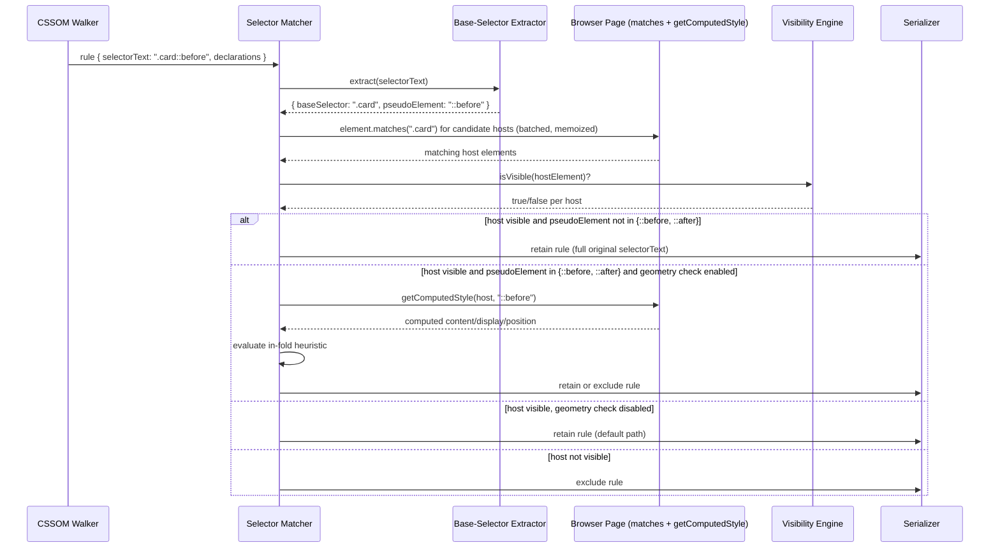

# Pseudo-Element Matching

## Version

1.0.0 — Phase 6 (Selector Engine)

## Purpose

This document specifies how the Selector Matcher resolves CSS pseudo-element selectors — `::before`, `::after`, `::placeholder`, `::selection`, `::marker`, `::backdrop`, `::first-line`, `::first-letter`, and related forms — against the live DOM during critical CSS extraction. Pseudo-elements are a structural outlier in the matching model this engine otherwise relies on: `Element.prototype.matches()` is defined over real DOM nodes, and a pseudo-element is, by specification, not a node in the document tree at all. It has no `Element` object, no `getBoundingClientRect()` in the ordinary sense, and — critically for [ADR-0002](../adr/ADR-0002-No-Custom-Selector-Parser.md)'s "never implement a custom selector parser" mandate — no direct way to hand it to `.matches()`. This document exists to specify, precisely and unambiguously, the strategy that lets the engine remain fully compliant with Principle 2 of [006-Design-Principles.md](../architecture/006-Design-Principles.md) while still correctly deciding whether a `::before`/`::after`/etc. rule belongs in the critical CSS payload.

## Audience

Senior engineers implementing or reviewing the Selector Matcher (`packages/matcher`) and CSSOM Walker (`packages/collector`) modules; engineers debugging incorrect inclusion/exclusion of generated-content rules in extracted critical CSS; plugin authors writing `customizeMatching` hooks that need to understand where pseudo-element decisions are made in the pipeline.

## Prerequisites

- [400-Selector-Matching.md](./400-Selector-Matching.md) — the base matching pipeline, batching, and memoization model this document extends
- [ADR-0002-No-Custom-Selector-Parser](../adr/ADR-0002-No-Custom-Selector-Parser.md) — the binding constraint that forbids parsing selector syntax to decide matches
- [006-Design-Principles.md](../architecture/006-Design-Principles.md), Principles 1 and 2 — browser-as-authority and no-custom-parser
- Familiarity with the CSS Pseudo-Elements Level 4 specification and the distinction between "originating element" and "generated box"
- Familiarity with the Visibility Engine's geometry model (forthcoming `200-Visibility-Engine-Overview.md`, Phase 4), referenced here for the generated-content geometry nuance

## Related Documents

- [400-Selector-Matching.md](./400-Selector-Matching.md) — core matching pipeline this document specializes
- [401-Selector-Memoization.md](./401-Selector-Memoization.md) — caching layer that pseudo-element base-selector extraction must interoperate with
- [403-Pseudo-Classes.md](./403-Pseudo-Classes.md) — sibling document; contrasts static structural pseudo-classes with pseudo-elements' "no node at all" problem
- [404-Is-Where-Has.md](./404-Is-Where-Has.md) — how `:is()`/`:where()`/`:has()` compose with pseudo-elements in a compound selector
- [405-Container-Queries.md](./405-Container-Queries.md) — container-conditioned rules that may themselves target pseudo-elements
- [ADR-0002-No-Custom-Selector-Parser](../adr/ADR-0002-No-Custom-Selector-Parser.md)
- [006-Design-Principles.md](../architecture/006-Design-Principles.md)

## Overview

`element.matches(selectorText)` answers exactly one question: "is `element` a member of the set of elements this selector would select?" Pseudo-elements are, by the CSS Pseudo-Elements specification, not members of any such set — `::before` does not select an `Element` from the tree; it identifies a *generated box* that the rendering engine synthesizes as a child of an originating element, with no corresponding DOM node, no `Element` interface, and consequently nothing that `.matches()` can be called on. Calling `document.querySelector('.card::before')` returns `null` even when a `.card` element with a rendered `::before` box exists on the page — not because there is no match, but because `querySelector`/`matches()` are node-returning/node-testing APIs and a pseudo-element is not a node.

This creates an apparent conflict with [ADR-0002](../adr/ADR-0002-No-Custom-Selector-Parser.md): if the engine cannot call `.matches('.card::before')` and get a meaningful answer, and it is forbidden from parsing selector syntax to work around that, how does it decide whether a `.card::before { content: "★" }` rule is critical?

The resolution is a narrow, spec-grounded, non-general operation that this document calls **base-selector extraction**: splitting a selector string at its trailing `::pseudo-element` token using the same purely-syntactic, delimiter-based technique already sanctioned by [ADR-0002](../adr/ADR-0002-No-Custom-Selector-Parser.md) for comma-separated selector lists (Section "What this permits," bullet 3). This is bookkeeping over a fixed, small, enumerable set of pseudo-element tokens — not parsing of arbitrary selector grammar — and it produces a base selector (`.card`) that *does* correspond to a real element, which is then handed to `element.matches()` exactly as any other selector would be. The full original selector (`.card::before`) is never itself passed to `.matches()`; only its base is. The matching decision — does `.card` exist and is it a candidate — is therefore still 100% delegated to the browser's native matcher. The engine adds exactly one additional decision on top of that native result: whether the *host* element's visibility is sufficient to treat the generated box as critical, with an explicit, documented carve-out for the subset of pseudo-elements that can acquire independent geometry.

This document's core claims, elaborated below, are:

1. Pseudo-element matching is decomposed into (a) syntactic base-selector extraction (non-decisional, delimiter-based, permitted under ADR-0002) and (b) native `element.matches(baseSelector)` (fully delegated, per ADR-0002).
2. A pseudo-element rule is retained in critical CSS if and only if its base selector matches at least one visible host element, by default.
3. Most pseudo-elements (`::selection`, `::placeholder`, `::marker`, `::backdrop`, `::first-line`, `::first-letter`) have no independent geometry and inherit the host's visibility outright — no further geometry check is performed for these.
4. `::before` and `::after` are a documented exception: because `content` can produce a generated box with its own layout box, size, and position (via `display`, positioning, `content-visibility`, etc.), an *additional*, opt-in geometry check against the host's pseudo-element box (obtainable via `window.getComputedStyle(host, '::before')` and, where feasible, layout-based approximation) is available and recommended for high-precision extraction, but is not required for baseline correctness because the common case (a decorative or icon generated box sized within its host's content box) is adequately covered by host-visibility inheritance.

## Detailed Design

### Why the host element is the right proxy in the common case

**Design choice:** treat host-element visibility as a sufficient (not merely necessary) condition for pseudo-element criticality, by default.

**Why.** A pseudo-element cannot render if its originating element does not render — pseudo-elements are defined by the specification as being "generated as if they were immediate children" of the originating element, and are subject to the same containing-block, `display`, and visibility inheritance rules that would suppress any other child box. If `.card { display: none }`, `.card::before` cannot possibly paint, full stop, no exception. Therefore host-invisibility is always a safe, sufficient *exclusion* signal without any pseudo-element-specific geometry work. Conversely, and this is the load-bearing simplifying assumption, in the overwhelming majority of real stylesheets a *visible* host implies a *visible* (or at least in-flow, above-fold-relevant) pseudo-element: decorative icons, list markers, quote marks, clearfix hacks, and tooltip carets are all sized and positioned relative to their host's content box and therefore inherit the host's above-fold status for all practical purposes.

**Alternatives considered.**
- *Always perform independent geometry computation for every pseudo-element.* Rejected as the default because it requires synthesizing a bounding box for a box that has no `Element` and therefore no native `getBoundingClientRect()` — the only path to a geometry approximation is `getComputedStyle(host, '::pseudo')` (which gives computed *style* values, not always resolved layout geometry for arbitrary positioning) combined with layout-engine-specific tricks (e.g., temporarily probing computed `top`/`left`/`width`/`height` for absolutely-positioned generated content, which is unreliable for `static`/`relative` generated content that flows inline). This is disproportionate engineering cost for a case that is already adequately handled by the cheaper host-visibility proxy in the common case, and it risks exactly the kind of bespoke, browser-behavior-guessing logic Principle 1 of [006-Design-Principles.md](../architecture/006-Design-Principles.md) warns against if done naively.
- *Never retain pseudo-element rules unless independently verified.* Rejected: this would systematically under-include critical CSS for the extremely common decorative-icon and clearfix patterns, producing visible flash-of-unstyled-content for content that is, in practice, always above-the-fold whenever its host is — directly contradicting the correctness-first stance of Principle 3.
- *Treat pseudo-elements as always critical if the rule exists anywhere in a matched stylesheet, regardless of host visibility.* Rejected outright: this discards the entire point of critical CSS extraction for a whole selector category and would balloon output size for pages with heavy icon-font or design-system usage (virtually all `::before`/`::after` rules in a modern component library).

**Tradeoff accepted.** The chosen default can, in principle, over-include (retain) an `::before`/`::after` rule whose generated box happens to be pushed off-screen or given `content-visibility: hidden` independently of its host (e.g., via `position: absolute; top: 9999px` used as a screen-reader-only visually-hidden technique, or a decorative pseudo-element deliberately clipped via `overflow: hidden` on a differently-sized ancestor while the host itself remains "visible" by the engine's own definition). This is accepted because over-inclusion is a strictly safer failure mode than under-inclusion for a critical CSS engine — see [Tradeoffs](#tradeoffs) and [Edge Cases](#edge-cases) below for the specific patterns and the opt-in geometry check that addresses the highest-value subset of them.

### Why `::before`/`::after` get a documented geometry-check carve-out and other pseudo-elements do not

Per the CSS Pseudo-Elements specification, `::before` and `::after` are the only two pseudo-elements in the target set whose generated content can be given `display` values that produce a real, independently laid-out box (block, inline-block, flex item, absolutely positioned, etc.) with its own `content` string, dimensions, and position, distinct from any single point of the host's own layout. `::selection`, `::placeholder`, `::marker` (mostly), `::backdrop`, `::first-line`, and `::first-letter` do not have this property in the same way:

- `::selection` has no box outside of active text selection state, is inherently ephemeral (see [403-Pseudo-Classes.md](./403-Pseudo-Classes.md) for the parallel treatment of dynamic *pseudo-class* state), and cannot be "above the fold" independent of the selected text's own geometry, which is the host's geometry.
- `::placeholder` renders exactly within the host `<input>`/`<textarea>`'s content box; it has no independent position.
- `::marker` is positioned relative to its list-item host per the list-style layout algorithm; while technically a box, its position is not author-controlled independent of the host in the way `::before`/`::after` content is (no arbitrary `position: absolute` escape from the host's marker box in current specifications).
- `::backdrop` is generated only for top-layer elements (`<dialog>`, fullscreen elements) and is defined to size to the containing viewport/block — its "visibility" is definitionally the host's top-layer visibility.
- `::first-line`/`::first-letter` are, by definition, sub-regions of the host's own rendered text; they cannot exist independent of the host's own layout box.

Because only `::before`/`::after` have specification-sanctioned independent geometry, the engine limits the *optional* deeper geometry check to exactly those two, rather than building a generalized "does this pseudo-element have its own box" abstraction for all eight. This keeps the common-path logic (host-visibility inheritance) simple and universal, and confines the special-cased complexity to the one place the specification actually creates it.

### Base-selector extraction: scope and limits

Base-selector extraction identifies the trailing pseudo-element token(s) in a selector string using a fixed lookup against the enumerable set of legal pseudo-element identifiers (`::before`, `::after`, `::first-line`, `::first-letter`, `::selection`, `::placeholder`, `::marker`, `::backdrop`, plus vendor/legacy single-colon forms `:before`/`:after` and any future additions tracked in a versioned constant table), and strips them (and only them) to produce a base selector suitable for `element.matches()`.

This operation is bounded and does not slide into "custom selector parsing" for the following reasons, each of which is a direct consequence of a permitted operation already enumerated in [ADR-0002](../adr/ADR-0002-No-Custom-Selector-Parser.md):

1. It operates on a fixed, small, spec-enumerable vocabulary (pseudo-element names), not on the general selector grammar (combinators, attribute operators, functional pseudo-class argument lists are never inspected or interpreted).
2. It never decides a match itself — the base selector is a *routing key* into `element.matches()`, exactly as splitting a comma-list selector into branches is a routing/bookkeeping operation, not a matching decision, per ADR-0002's explicitly permitted example.
3. It is conservative: any selector string not cleanly ending in a recognized pseudo-element token from the fixed vocabulary is passed to `element.matches()` unmodified, and if `.matches()` throws (e.g., an unrecognized or malformed pseudo-element the extraction browser does not support), the rule is routed to Fail-Fast Diagnostics (Principle 6) rather than silently reinterpreted.
4. `:is()`, `:where()`, and `:has()` arguments are never pseudo-element-stripped internally — per specification, pseudo-elements are not permitted inside the argument lists of `:is()`/`:where()`/`:has()` at all, so no ambiguity with [404-Is-Where-Has.md](./404-Is-Where-Has.md) territory arises; extraction only ever looks at the *end* of the top-level compound selector.

### Where this fits in the pipeline

The CSSOM Walker (Phase 5, `300-CSSOM-Walker.md`) emits raw `selectorText` per rule, exactly as reported by the browser's CSSOM, with no pre-processing. Base-selector extraction is performed by the Selector Matcher immediately upon receiving a rule whose selector text ends in a recognized pseudo-element token, *before* the rule enters the standard batching/memoization pipeline described in [400-Selector-Matching.md](./400-Selector-Matching.md). The extracted base selector is what gets memoized and batched; the original, full selector text (including the pseudo-element suffix) is preserved unmodified on the `MatchedRule` record so the Serializer emits the rule exactly as authored — extraction never rewrites selector text in engine output, only in the internal decision path.

## Architecture

```mermaid
flowchart TD
    A[CSSOM Walker emits rule\nselectorText, e.g. ".card::before"] --> B{Ends in recognized\npseudo-element token?}
    B -- no --> C[Pass selectorText unmodified\nto standard matching pipeline\n(400-Selector-Matching.md)]
    B -- yes --> D[Extract base selector\n e.g. ".card"\n+ pseudo-element token ::before]
    D --> E["element.matches(baseSelector)\n(native browser call, memoized)"]
    E -- no host element matches --> F[Rule excluded:\nno visible host, cannot render]
    E -- at least one host matches --> G{Is host element visible?\n(Visibility Engine result)}
    G -- not visible --> F
    G -- visible --> H{Pseudo-element token in\n{::before, ::after}?}
    H -- no --> I[Retain rule unconditionally\n(::selection/::placeholder/::marker/\n::backdrop/::first-line/::first-letter\ninherit host visibility, no independent geometry)]
    H -- yes --> J{Geometry check enabled?\n(opt-in config)}
    J -- disabled (default) --> I
    J -- enabled --> K[Probe generated-content box:\ngetComputedStyle(host, '::before'/'::after')\n+ layout-approximation heuristics]
    K -- box has display:none / empty content / off-fold position --> F
    K -- box present and in-fold --> I

    style E fill:#1f6feb,color:#fff
    style K fill:#8957e5,color:#fff
```

### Sequence: Batched pseudo-element resolution



## Algorithms

### Algorithm: Base-Selector Extraction

**Problem statement.** Given a raw CSSOM `selectorText` string, determine whether it targets a pseudo-element, and if so, produce (a) the base selector suitable for `element.matches()` and (b) the pseudo-element token, using only fixed-vocabulary lookup — never general selector-grammar parsing.

**Inputs.** `selectorText: string` (as reported verbatim by the browser's CSSOM; may be one branch of an already-comma-split selector list per the standard pipeline in [400-Selector-Matching.md](./400-Selector-Matching.md)).

**Outputs.** `{ baseSelector: string, pseudoElement: string | null }`.

**Pseudocode.**
```
PSEUDO_ELEMENT_TOKENS = [
    "::before", "::after", "::first-line", "::first-letter",
    "::selection", "::placeholder", "::marker", "::backdrop",
    ":before", ":after"   // legacy single-colon forms, CSS2.1 compatibility
]
// Sorted longest-first to avoid a shorter token matching a prefix of a longer one.

function extractBaseSelector(selectorText: string): {baseSelector, pseudoElement}
    trimmed = selectorText.trimEnd()
    for token in PSEUDO_ELEMENT_TOKENS.sortByLengthDescending():
        if trimmed.endsWith(token):
            # Guard: token must be preceded by a valid selector boundary
            # (not inside an attribute-selector string or a functional
            # pseudo-class argument list). This is a bracket/quote-depth
            # check, not a grammar parse: count unmatched '[', '(', '"', '\''
            # from the start of the string; only accept the match if depth
            # is zero at the token boundary.
            if bracketDepthAtPosition(trimmed, trimmed.length - token.length) == 0:
                base = trimmed.slice(0, trimmed.length - token.length)
                normalizedToken = normalizeLegacyForm(token)  // ":before" -> "::before"
                return { baseSelector: base, pseudoElement: normalizedToken }
    return { baseSelector: trimmed, pseudoElement: null }
```

**Time complexity.** O(k · m) where k is the (fixed, small, currently 10) size of `PSEUDO_ELEMENT_TOKENS` and m is the length of the selector string; effectively O(m) since k is a constant bounded by the CSS specification's enumerable pseudo-element vocabulary, not by input size. The bracket-depth guard is a single O(m) linear scan, memoizable per selector string since selector text is immutable once reported by the CSSOM.

**Memory complexity.** O(m) for the working string slices; O(1) additional state beyond the input string and output pair.

**Failure cases.**
- A selector string containing a pseudo-element-like substring inside an attribute value or `:is()`/`:not()` argument (e.g., `[data-foo="::before"]`) must not be misidentified — the bracket-depth guard exists specifically to prevent this. Any selector where the guard cannot confidently establish zero depth at the candidate boundary is treated conservatively as `pseudoElement: null` (passed through unmodified to `element.matches()`, which will itself throw a diagnosable `SyntaxError` if the selector text is genuinely malformed, per the Fail-Fast Diagnostics principle) rather than risk an incorrect strip.
- Multiple/chained pseudo-elements are not valid per specification (`::before::after` is invalid CSS) and the browser's own CSSOM would not report such a rule as parsed in the first place; the extractor does not need to handle chaining.
- A future CSS specification could add a new pseudo-element name not yet in `PSEUDO_ELEMENT_TOKENS`. Until the table is updated, such a rule falls through with `pseudoElement: null` and is matched (or fails to match, or throws) as an ordinary selector — this is a documented, versioned-table maintenance item, not a silent correctness gap, and it degrades safely (see Edge Cases).

**Optimization opportunities.** Since selector text is stable for the lifetime of a stylesheet snapshot (browser-reported, per Principle 1), extraction results are cached alongside the standard selector memoization cache described in [401-Selector-Memoization.md](./401-Selector-Memoization.md), keyed purely on `selectorText` (no node dependency), making repeated extraction for the same selector across many candidate hosts and across viewport variants of the same route a pure cache hit after the first occurrence.

### Algorithm: Pseudo-Element Retention Decision

**Problem statement.** Given a base-selector match result (which hosts matched) and the Visibility Engine's determination for each host, decide whether to retain the full original pseudo-element rule in the critical CSS output.

**Inputs.** `matchedHosts: ElementHandle[]`, `pseudoElement: string`, `visibility: (ElementHandle) => VisibilityResult`, `config.pseudoElementGeometryCheck: boolean` (default `false`).

**Outputs.** `retain: boolean`, plus a diagnostic record when a geometry check excludes a rule that would otherwise have been retained by the default path (so the stricter decision is auditable, per Principle 6).

**Pseudocode.**
```
function decideRetention(matchedHosts, pseudoElement, config): {retain, diagnostics}
    visibleHosts = matchedHosts.filter(h => visibility(h).isVisible)
    if visibleHosts.isEmpty():
        return { retain: false, diagnostics: [] }

    if pseudoElement not in {"::before", "::after"}:
        # No independent geometry possible per specification; host
        # visibility is both necessary and sufficient.
        return { retain: true, diagnostics: [] }

    if not config.pseudoElementGeometryCheck:
        # Default path: host visibility is sufficient (Design Choice above).
        return { retain: true, diagnostics: [] }

    # Opt-in stricter path.
    for host in visibleHosts:
        box = probeGeneratedContentBox(host, pseudoElement)  // getComputedStyle-based
        if box.hasRenderableContent and box.intersectsFold:
            return { retain: true, diagnostics: [] }
    return {
        retain: false,
        diagnostics: [{ type: "PseudoElementGeometryExcluded", host, pseudoElement }]
    }
```

**Time complexity.** O(h) in the number of matched hosts h for the default path (a single visibility lookup per host, already computed by the Visibility Engine and memoized). The opt-in geometry path adds one `getComputedStyle` round trip per host per pseudo-element, i.e., O(h) additional cross-process calls, batched using the same batching infrastructure as [400-Selector-Matching.md](./400-Selector-Matching.md).

**Memory complexity.** O(h) for the visible-host working set; O(1) additional per-decision state.

**Failure cases.** `probeGeneratedContentBox` cannot always produce a reliable bounding rectangle for inline-flow generated content (only `getComputedStyle` values are guaranteed; a true rect requires the generated box to be reachable via layout introspection, which browsers do not expose directly for pseudo-elements without workarounds such as temporarily-injected marker elements). When a reliable geometry cannot be obtained, the algorithm must fail toward retention (the safe, correctness-preserving direction per Principle 3), logging a `PseudoElementGeometryIndeterminate` diagnostic rather than silently excluding.

**Optimization opportunities.** Batch `getComputedStyle(host, pseudoElement)` calls for all visible hosts of a given stylesheet rule into a single `page.evaluate()` round trip, mirroring the batching strategy in [400-Selector-Matching.md](./400-Selector-Matching.md); skip the geometry check entirely for hosts whose bounding rect (already computed by the Visibility Engine) is deep in the "clearly above fold, large margin" zone, since the generated box is contained within the host's rendered region in the overwhelming majority of layouts (icons, markers, decorative content sized in ems/percent of the host).

## Implementation Notes

- Base-selector extraction must run *before* the selector reaches the shared batching/memoization pipeline of [400-Selector-Matching.md](./400-Selector-Matching.md), and the memoization cache key must be `(baseSelector, hostElementIdentity)`, never `(fullSelectorTextIncludingPseudoElement, hostElementIdentity)` — the latter would silently defeat cache sharing between, e.g., `.card::before` and `.card::after`, which share an identical base-selector match set.
- The `PSEUDO_ELEMENT_TOKENS` table lives in `packages/shared` (per [007-Repository-Structure.md](../architecture/007-Repository-Structure.md), planned) as a single versioned source of truth, consumed by both the Selector Matcher and any diagnostic/reporting code that needs to recognize pseudo-element selectors for display purposes — this avoids the vocabulary drifting between modules.
- The original, unmodified `selectorText` (including the pseudo-element suffix) must always be what the Serializer eventually writes to output; base-selector extraction is a matching-decision detail, never a rewriting of authored CSS, consistent with Principle 5 (Determinism) and Principle 1 (browser-reported text is authoritative).
- The `config.pseudoElementGeometryCheck` flag defaults to `false` project-wide but should default to `true` in any bundled "high-precision" or "strict" configuration preset, since it strictly improves accuracy at a bounded, batchable performance cost.
- Plugins that implement the `customizeMatching` hook (Section 2.13 of the brief) may intercept the retention decision for pseudo-elements, but per Principle 7 (Plugin Sandboxing) they receive the already-computed `{matchedHosts, pseudoElement, visibility}` decision context, not raw page access, and their patch must be an explicit typed override (`{ forceRetain: boolean, reason: string }`), never a mutation of shared matcher state.

## Edge Cases

- **`content: none` or `content: normal` on `::before`/`::after` with no other box-affecting properties.** Per specification, `::before`/`::after` do not generate a box at all when `content` computes to `none`, regardless of other declared properties. The default (no-geometry-check) path will still retain such a rule if the host is visible, which is a deliberate, accepted over-inclusion (see [Tradeoffs](#tradeoffs)); the opt-in geometry check specifically detects and excludes this case via `getComputedStyle(host, pseudoElement).content === 'none'`.
- **Visually-hidden `::before`/`::after` via off-screen absolute positioning** (a common accessibility pattern: `position: absolute; left: -9999px` on a decorative pseudo-element while the host remains visible) is exactly the scenario the opt-in geometry check is designed to catch; the default path over-includes here, which is accepted as documented.
- **`::marker` on `display: list-item` overrides and custom counter styles** ([505-Counters.md](../algorithms/505-Counters.md), Phase 7) do not require special geometry handling here; `::marker` visibility is treated as fully derived from host visibility per this document's default rule, and its content resolution (custom `@counter-style`) is a Dependency Resolver concern, not a matcher concern.
- **`::selection` and `::backdrop` are ephemeral/conditional pseudo-elements** whose applicability depends on live interaction state (text selection) or top-layer promotion (`<dialog>` open state) rather than static document structure. This document treats their *matching* (does the base selector apply to a real host) as fully static and browser-delegated, but their *practical relevance to a first-paint snapshot* is a policy question closely related to the dynamic pseudo-class discussion in [403-Pseudo-Classes.md](./403-Pseudo-Classes.md) — by default they are retained if the host matches and is visible, since suppressing legitimately-authored `::selection`/`::backdrop` rules from critical CSS risks a flash of default browser styling the instant a user selects text or opens a dialog, which is a worse outcome than a marginal over-inclusion.
- **Shadow DOM hosts.** Per [006-Design-Principles.md](../architecture/006-Design-Principles.md) Edge Cases, `element.matches()` does not cross shadow boundaries; a pseudo-element rule declared inside a shadow root's stylesheet must have its base selector matched against elements within that same shadow root's tree, not the light DOM, using the same shadow-aware traversal the base matching pipeline already requires.
- **`::part()` and `::slotted()`** are technically functional pseudo-elements with shadow-DOM-specific semantics distinct from the eight enumerated in this document's scope; they are explicitly out of scope for this document and are deferred to a future design note once Shadow DOM support matures beyond Phase 6's baseline (tracked in [Future Work](#future-work)).
- **Cross-origin stylesheets** contributing pseudo-element rules are subject to the same `SecurityError`-on-`cssRules`-access handling documented in [006-Design-Principles.md](../architecture/006-Design-Principles.md) Edge Cases — this document's logic never executes for rules the CSSOM Walker could not enumerate in the first place.
- **`content-visibility: auto` on the host** interacts with the Visibility Engine's own geometry model (Phase 4) rather than this document's pseudo-element logic directly; if the host is deemed not-yet-rendered by `content-visibility`, it is already excluded upstream and the pseudo-element rule is excluded by the same host-visibility check this document relies on — no duplicate handling is needed.
- **Legacy single-colon `:before`/`:after` syntax** must be normalized to the canonical double-colon form only for internal decision bookkeeping (as shown in the extraction pseudocode); the Serializer must still emit whichever form the original author used, per the "never rewrite authored CSS" implementation note above.

## Tradeoffs

| Dimension | Always independent geometry check | Host-visibility-only (chosen default) | Never retain generated content |
|---|---|---|---|
| Correctness for decorative/icon pseudo-elements (the common case) | Equivalent, at higher engineering/runtime cost | Correct and cheap | Systematically wrong (excludes needed content) |
| Correctness for off-screen accessibility-hidden pseudo-elements | Correct | Over-includes (safe direction) | Correct by accident, wrong for all other cases |
| Engineering complexity | High — requires layout-approximation heuristics per browser engine | Low — reuses existing Visibility Engine result | Trivial but wrong |
| Runtime cost | Additional `getComputedStyle` round trip per host per rule | None beyond existing visibility computation | None |
| Alignment with Principle 3 (Correctness over premature optimization) | Maximizes correctness, opt-in for those who need it | Chosen as the pragmatic, provably-safe-direction default | Violates Principle 3 outright |
| Alignment with Principle 1/2 (browser is authority, no custom parser) | Fully compliant — uses only native `getComputedStyle` | Fully compliant — uses only native `matches()`/visibility | Compliant but degenerate |

**Why host-visibility-only was chosen as the default rather than always requiring the geometry check:** the geometry check's value is concentrated in a narrow set of authoring patterns (deliberately off-screen decorative content, `content: none` overrides layered on top of otherwise-matching declarations) that are uncommon relative to the overwhelmingly dominant case of pseudo-elements sized within their host's content box. Making the more expensive, more complex path opt-in rather than default follows the same "additive, benchmarked, toggleable" discipline Principle 3 requires of every optimization-shaped decision — except here the direction is inverted: the *cheap* path is the default because it is already correctness-preserving in the dominant case, and the *expensive* path is the opt-in refinement for teams that need maximal precision (e.g., design systems that rely heavily on off-screen decorative techniques).

**Future implications.** If telemetry from the Reporter (`unmatched-selector` / `matched-selector` diagnostics, Section 2.12 of the brief) later shows the over-inclusion rate from decorative-hidden `::before`/`::after` patterns is materially inflating output size across the fixture corpus, the default should be revisited via a follow-up ADR rather than a silent config change, since it is a documented, principle-adjacent tradeoff, not an implementation detail.

## Performance

- **CPU complexity.** Base-selector extraction is O(m) per distinct selector string and is memoized (see Algorithms), so its aggregate cost across an extraction run is bounded by the number of *distinct* pseudo-element-bearing selectors in the stylesheet corpus, not by the number of DOM nodes. The retention decision is O(h) in matched hosts for the default path, reusing Visibility Engine results already computed for the base matching pass.
- **Memory complexity.** O(distinct pseudo-element selectors) for the extraction memoization table; negligible relative to the base match-matrix memory footprint documented in [400-Selector-Matching.md](./400-Selector-Matching.md).
- **Caching strategy.** Extraction results are cached purely by `selectorText` (no node dependency, see Optimization Opportunities above), giving a strictly higher cache-hit ceiling than node-dependent match caching; this cache can be warmed once per stylesheet corpus and reused across all viewport variants of the same route, since selector text does not change with viewport.
- **Parallelization opportunities.** Base-selector extraction has no shared mutable state and can be trivially parallelized across worker threads processing disjoint stylesheet subsets, consistent with the parallel stylesheet traversal principle in [006-Design-Principles.md](../architecture/006-Design-Principles.md).
- **Incremental execution.** When only a subset of stylesheets changes between cached extraction runs (Dependency Resolver graph analysis, Phase 7), pseudo-element extraction results for unaffected selectors are reused unmodified, since the extraction table is purely a function of selector text.
- **Profiling guidance.** If the opt-in geometry check is enabled, profile the incremental `getComputedStyle` round-trip count it adds on top of the baseline matching pass; this is the primary cost center this document introduces beyond the standard pipeline in [400-Selector-Matching.md](./400-Selector-Matching.md).
- **Scalability limits.** Pathological cases (tens of thousands of distinct `::before`/`::after` selectors, as with unpurged icon-font utility frameworks) are bounded by the same rule-count scalability limits documented in [400-Selector-Matching.md](./400-Selector-Matching.md) and [ADR-0002](../adr/ADR-0002-No-Custom-Selector-Parser.md); the Reporter should surface a dedicated diagnostic when pseudo-element rule count crosses a configurable threshold, since this often indicates an un-purged icon library rather than an engine performance defect.

## Testing

- **Unit tests.** Exhaustive coverage of `extractBaseSelector` against a table of selector strings covering every recognized token, legacy single-colon forms, selectors with pseudo-elements embedded inside attribute-value strings (must NOT be stripped), and selectors with no pseudo-element suffix (must return `pseudoElement: null` unchanged).
- **Integration tests.** Fixture pages with `::before`/`::after` decorative icons on visible and `display:none` hosts; `::placeholder` on visible/hidden `<input>` elements; `::selection`/`::backdrop` rules with no active selection/dialog state at extraction time; `::marker` on styled `<li>` elements with custom `@counter-style` — asserting retention/exclusion matches this document's decision table exactly.
- **Visual tests.** Golden-snapshot comparison of rendered pages using only the extracted critical CSS, verifying that decorative pseudo-element content renders identically to the full-stylesheet render for above-fold hosts.
- **Stress tests.** Fixtures with 10,000+ distinct `::before`/`::after` selectors (icon-font frameworks) validating that extraction memoization keeps the incremental cost near-linear rather than quadratic in selector count.
- **Regression tests.** Any reported bug of the form "`::before` icon missing/flashing in production despite being above the fold" becomes a permanent fixture; per the reasoning in [ADR-0002](../adr/ADR-0002-No-Custom-Selector-Parser.md) such bugs should trace to a host-visibility miscomputation or a base-extraction guard bug, not to `element.matches()` itself.
- **Benchmark tests.** Compare wall-clock and round-trip count with `pseudoElementGeometryCheck` enabled vs. disabled across the icon-font-heavy fixture, to keep the opt-in path's cost visible and trackable across engine versions.

## Future Work

- Investigate a general `::part()`/`::slotted()` design note once Shadow DOM support (tracked as a broader Phase 6+ dependency) is fully specified; these are functional pseudo-elements with matching semantics distinct from the fixed-vocabulary tokens handled here.
- Explore whether the Chrome DevTools Protocol or a future browser API could expose a native "get generated content box" primitive, which would eliminate the `getComputedStyle`-plus-heuristics approximation in the opt-in geometry check and let that path be promoted to the default without an accuracy/cost tradeoff.
- Research whether Coverage-mode data (Hybrid Extraction, Phase 9) can directly observe whether a pseudo-element's generated box was actually painted during the recorded frame, which would provide a strictly more accurate signal than either the default host-visibility heuristic or the opt-in `getComputedStyle` approximation, and could become the preferred verification path for `::before`/`::after` in Hybrid mode specifically.
- Open question: should `pseudoElementGeometryCheck` be promotable to per-selector granularity (e.g., via a plugin hook or stylesheet-level annotation) rather than a single global flag, for teams that know specific icon-font selectors are safe to over-include while wanting strict checking elsewhere?
- Open question: as `@starting-style` and CSS View Transitions introduce pseudo-elements (`::view-transition`, `::view-transition-group()`, etc.) with their own independent, animatable geometry, should these be added to the `::before`/`::after` geometry-check carve-out list, or do they warrant an entirely separate design note given their transition-lifecycle-bound visibility semantics? Tracked for a future ADR once View Transition dependency tracking (Section 2.5 of the brief) is specified.

## References

- [400-Selector-Matching.md](./400-Selector-Matching.md)
- [401-Selector-Memoization.md](./401-Selector-Memoization.md)
- [403-Pseudo-Classes.md](./403-Pseudo-Classes.md)
- [404-Is-Where-Has.md](./404-Is-Where-Has.md)
- [405-Container-Queries.md](./405-Container-Queries.md)
- [ADR-0002-No-Custom-Selector-Parser](../adr/ADR-0002-No-Custom-Selector-Parser.md)
- [006-Design-Principles.md](../architecture/006-Design-Principles.md)
- W3C CSS Pseudo-Elements Module Level 4 specification
- W3C CSS Lists and Counters Module Level 3 specification (`::marker` layout semantics)
- MDN documentation: `::before`, `::after`, `::placeholder`, `::selection`, `::marker`, `::backdrop`, `::first-line`, `::first-letter`
- MDN documentation: `Window.getComputedStyle()` pseudo-element argument form
- Section 2.5 ("Core Algorithms — Rule Matching") of the Documentation Agent Brief
