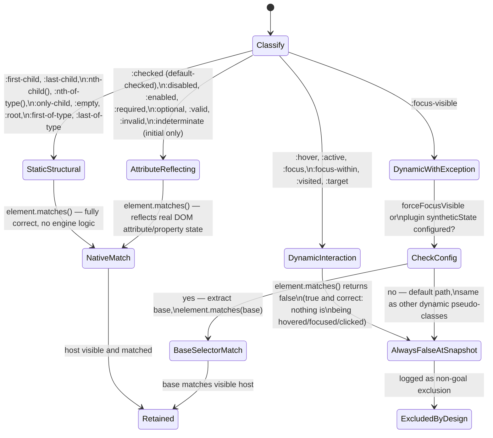

# Pseudo-Class Matching

## Version

1.0.0 — Phase 6 (Selector Engine)

## Purpose

This document specifies how the Selector Matcher resolves CSS pseudo-class selectors during critical CSS extraction, and — most importantly — draws an explicit, load-bearing distinction between two categories of pseudo-class that this engine treats fundamentally differently: **structural/static pseudo-classes** (`:first-child`, `:nth-child()`, `:last-of-type`, `:empty`, `:root`, and similar), which reflect document structure at snapshot time and are handled correctly by `element.matches()` with no special engine logic whatsoever; and **state-dependent/dynamic pseudo-classes** (`:hover`, `:focus`, `:active`, `:visited`, `:checked`, `:disabled`, `:target`, and similar), which reflect ephemeral UI/interaction state that a static DOM snapshot simply does not contain. This document formalizes the latter as an intentional, documented non-goal of the extraction engine, explains why that is the correct default given the project's purpose, and specifies the configuration surface (forced `:focus-visible` inclusion, plugin-injected synthetic state) available to teams that need to override the default for specific accessibility- or interaction-critical elements.

## Audience

Senior engineers implementing or reviewing the Selector Matcher (`packages/matcher`); accessibility engineers evaluating whether focus-visible styling is adequately covered by critical CSS; plugin authors implementing `beforeCollection`/`customizeMatching` hooks to inject synthetic interaction state; product engineers debugging "why does my `:hover` style flash unstyled on first paint" reports, who need to understand this is expected, documented behavior rather than a bug.

## Prerequisites

- [400-Selector-Matching.md](./400-Selector-Matching.md) — the base matching pipeline this document specializes for pseudo-classes
- [402-Pseudo-Elements.md](./402-Pseudo-Elements.md) — sibling document; contrasts pseudo-classes (which apply to real elements) with pseudo-elements (which do not)
- [ADR-0002-No-Custom-Selector-Parser](../adr/ADR-0002-No-Custom-Selector-Parser.md) — the binding constraint that pseudo-class matching, like all selector matching, must be fully delegated to `element.matches()`
- [006-Design-Principles.md](../architecture/006-Design-Principles.md), Principles 1, 2, and 6 — browser-as-authority, no-custom-parser, and fail-fast diagnostics
- Familiarity with the distinction the CSS Selectors specification draws between pseudo-classes that reflect "static" document/element state versus "dynamic" UI state (the User Action Pseudo-classes: `:hover`, `:active`, `:focus`, `:focus-within`, `:focus-visible`)

## Related Documents

- [400-Selector-Matching.md](./400-Selector-Matching.md) — core matching pipeline
- [401-Selector-Memoization.md](./401-Selector-Memoization.md) — caching layer; particularly relevant to why dynamic pseudo-classes are cache-hostile if naively included
- [402-Pseudo-Elements.md](./402-Pseudo-Elements.md) — sibling document on the pseudo-element matching gap
- [404-Is-Where-Has.md](./404-Is-Where-Has.md) — how dynamic pseudo-classes interact when nested inside `:is()`/`:where()`/`:has()` argument lists
- [405-Container-Queries.md](./405-Container-Queries.md) — a different, but structurally similar, "conditioned rule" problem: container-conditioned rules vs. state-conditioned rules
- [ADR-0002-No-Custom-Selector-Parser](../adr/ADR-0002-No-Custom-Selector-Parser.md)
- [006-Design-Principles.md](../architecture/006-Design-Principles.md)

## Overview

CSS pseudo-classes are not a homogeneous category with respect to what a critical CSS extractor can determine about them. The CSS Selectors specification itself groups pseudo-classes loosely by what they depend on — element type, tree structure, linguistic/directionality context, UI/interaction state, and so on — but for this engine's purposes, exactly one distinction matters: **does the fact this pseudo-class tests exist in a single static DOM snapshot, or does it depend on ephemeral runtime interaction state that has no representation in a snapshot at all?**

Structural pseudo-classes — `:first-child`, `:last-child`, `:nth-child(An+B)`, `:nth-of-type()`, `:only-child`, `:empty`, `:root`, `:first-of-type`, `:last-of-type` — are pure functions of the DOM tree's shape at the moment the snapshot is taken: sibling counts, element ordering, presence/absence of child nodes, and tree position. `element.matches()` evaluates these correctly and completely against the collected DOM snapshot with zero additional engine logic, for exactly the reason [ADR-0002](../adr/ADR-0002-No-Custom-Selector-Parser.md) exists: the browser's native matcher already knows how to answer "is this the third child of its parent" correctly, including every edge case (dynamically inserted/removed nodes prior to the snapshot, `<template>` content exclusion, etc.) that a hand-rolled matcher would need to rediscover.

State-dependent pseudo-classes — the User Action pseudo-classes `:hover`, `:active`, `:focus`, `:focus-within`, `:focus-visible`, plus form/interaction state pseudo-classes `:checked`, `:disabled`, `:enabled`, `:indeterminate`, `:required`, `:valid`/`:invalid`, history state `:visited`/`:link`, and the `:target` fragment-identifier pseudo-class — are fundamentally different: they test *transient runtime conditions* that exist only while a user is actively interacting with the page, or that depend on browser-privacy-protected history state (`:visited`), or that depend on the current URL fragment (`:target`). A DOM snapshot taken by the Navigation Engine at page-load time, with no synthetic mouse hovering over any element, no synthetic focus, and no simulated click-and-hold, has a perfectly well-defined and unambiguous answer for every one of these selectors: **false, for every element, always** — because nothing is being hovered, focused, or activated at snapshot time. `element.matches(':hover')` on any element in a freshly-loaded, non-interacted-with page will always return `false`. This is not a limitation of `element.matches()` — it is the correct, spec-compliant answer to a well-posed question ("is this element currently being hovered") whose answer is definitionally "no" during an automated, non-interactive snapshot.

This document's central position, elaborated below, is that this is not a defect to be worked around by simulating interaction state — it is the *correct* behavior given what critical CSS extraction is for. Critical CSS exists to eliminate render-blocking CSS needed for first paint of above-the-fold content. `:hover`-triggered, `:focus`-triggered, and `:active`-triggered styling is, by definition, not needed for first paint — it is needed only once a user begins interacting, at which point the full (non-critical, deferred-loaded) stylesheet has virtually always already loaded. Systematically excluding interaction-state-triggered CSS from critical CSS is therefore an intentional, explicit, documented **non-goal**, not an oversight, with one calibrated exception addressed by configuration: `:focus-visible` accessibility styling, which this document treats as sufficiently first-paint-adjacent (keyboard users tabbing through a page immediately after navigation, before any other stylesheet has loaded, is a real and important scenario) to warrant an opt-in forcing mechanism.

## Detailed Design

### Why `element.matches()` needs zero special-casing for structural pseudo-classes

**Design choice:** route structural/static pseudo-classes through the exact same unmodified pipeline described in [400-Selector-Matching.md](./400-Selector-Matching.md), with no pre-processing, no base-selector extraction (contrast [402-Pseudo-Elements.md](./402-Pseudo-Elements.md)), and no special decision logic.

**Why.** These pseudo-classes select real elements — `.list-item:nth-child(3)` selects an actual `<li>` that has an `Element` interface and a place in the tree — so there is no representational gap of the kind [402-Pseudo-Elements.md](./402-Pseudo-Elements.md) documents for pseudo-elements. The only question is whether `element.matches()` computes the structural predicate correctly against the DOM as it exists in the collected snapshot, and per Principle 1 and Principle 2 of [006-Design-Principles.md](../architecture/006-Design-Principles.md), the browser's native implementation is authoritative and requires no engine-side verification, re-derivation, or workaround.

**Alternatives considered.**
- *Pre-compute sibling indices and counter-style-aware position data in the host process to "verify" `:nth-child()` results.* Rejected: this would be a partial reimplementation of tree-structural selector semantics purely to double-check a browser primitive that is not in question — a direct violation of [ADR-0002](../adr/ADR-0002-No-Custom-Selector-Parser.md)'s prohibition on parallel matching logic, undertaken for no correctness benefit.
- *Treat `:empty` specially because it can change if child text nodes are added/removed by client-side scripts after the snapshot.* Considered and rejected as a general special case; this is a snapshot-timing concern (addressed generically by the DOM Collector's snapshot-freshness guarantees, not a pseudo-class-matching concern) rather than something specific to `:empty`'s semantics. Any DOM mutation after snapshot affects every selector type equally, not uniquely `:empty`.

**Tradeoff accepted.** None beyond the general snapshot-timing tradeoff already accepted project-wide (see [006-Design-Principles.md](../architecture/006-Design-Principles.md) Edge Cases, "Determinism under floating-point geometry" and related snapshot-staleness discussion) — structural pseudo-classes introduce no *additional* risk beyond ordinary selector matching.

### Why dynamic pseudo-classes are an explicit non-goal, not a bug

**Design choice:** by default, the engine performs no synthetic interaction-state injection before matching. `:hover`, `:active`, `:focus`, `:focus-within`, `:checked` (unless reflecting a genuine default-checked attribute — see Edge Cases), `:disabled`/`:enabled` (these do reflect real, static attribute/property state and are therefore treated as structural, not dynamic — see the classification note below), `:visited`, and `:target` are matched against the DOM exactly as it exists at snapshot time, with no simulated mouse, keyboard, or navigation-history events. Consequently, any rule whose sole matching path depends on active hover/focus/active state is, and is intended to be, absent from the default critical CSS payload.

**Why.** Three independent lines of reasoning converge on this being correct, not merely convenient:

1. **Semantic scope.** "Critical CSS" is defined project-wide (per [001-Vision.md](../architecture/001-Vision.md), referenced generally, and the brief's Non-Goals) as the CSS required to render above-the-fold content *correctly on first paint*. First paint precedes any user interaction by construction — a user cannot hover over, focus, or click an element before it has painted. CSS whose sole trigger is post-paint interaction therefore falls outside the problem definition on its own terms, independent of any implementation limitation.
2. **Determinism.** Principle 5 of [006-Design-Principles.md](../architecture/006-Design-Principles.md) requires byte-identical output for identical inputs. Simulated interaction state is not an input to the page — it would be an *engine-injected* fact with no canonical, deterministic value ("simulate hover over which element(s)? all of them simultaneously, which is physically impossible? a scripted sequence, which introduces an arbitrary and unstable ordering/selection choice?"). Attempting to include dynamic pseudo-class-triggered CSS by simulation would require the engine to invent an answer to an ill-posed question, which is antithetical to the determinism principle.
3. **Correctness bounding.** Per [ADR-0002](../adr/ADR-0002-No-Custom-Selector-Parser.md), matching is delegated entirely to `element.matches()`, which correctly reports `false` for every dynamic pseudo-class against a non-interacted-with page — this is the browser telling the truth about the current, real state of the page. Overriding that true answer with a synthetic one is not "improving accuracy," it is substituting a fabricated fact for an observed one, which is precisely the class of behavior Principle 1 forbids.

**Alternatives considered.**
- *Simulate `:hover` for every interactive element via CDP-dispatched synthetic mouse events before the matching pass, one element at a time, unioning the resulting matched rule sets.* Rejected as the default: cost scales linearly with the number of interactive elements (each requiring a real dispatched event and a settle/reflow wait, not a free operation), the resulting "critical" CSS would include hover styles for potentially every interactive element on the page (defeating the size-reduction purpose of critical CSS extraction), and — most importantly — it directly contradicts the semantic-scope argument above: hover styles are never needed for first paint regardless of how many elements are simulated.
- *Include all `:hover`/`:focus`/`:active` rules unconditionally, regardless of match, on the theory that "interaction feedback should never flash unstyled."* Rejected: this reintroduces exactly the over-inclusion problem critical CSS extraction exists to solve (every interactive element's hover/focus/active styling, project-wide, ships in the "critical" bundle, which for a component-library-heavy page can be a large fraction of total CSS) for a benefit (avoiding a flash-of-unstyled-interaction-state) that only matters after first paint, when the full stylesheet has virtually always already loaded asynchronously.
- *Exclude dynamic pseudo-class rules from consideration entirely, including from the Reporter's diagnostics.* Rejected: exclusion must be *visible* (Principle 6, Fail-Fast Diagnostics) — the Reporter must show these as a distinct, explicitly-labeled diagnostic category ("excluded: dynamic pseudo-class, non-goal by design") rather than lumping them in silently with ordinary "selector did not match any element" unmatched-selector diagnostics, so that a reviewing engineer can distinguish "this never had a chance to match" from "this is an intentional, documented exclusion category."

**Tradeoff accepted.** Any interaction-triggered styling — including `:hover` effects on above-fold navigation elements a user might interact with within milliseconds of page paint — is deferred to the main stylesheet's async load, accepting a theoretical (and in practice negligible, given typical async-CSS load times relative to human reaction time) risk of a very brief unstyled hover/focus flash for early interaction. This is accepted project-wide as consistent with every other critical-CSS tool's scope and with the semantic-scope argument above; see [Tradeoffs](#tradeoffs) for the one exception carved out for `:focus-visible`.

### The `:focus-visible` exception

**Design choice:** provide an opt-in configuration flag, `config.forceFocusVisible: { selector: string[] } | boolean`, that, when enabled, causes the engine to treat `:focus-visible` rules matching a configured selector allowlist (or, if `true`, all elements) as retained regardless of live focus state — i.e., their base selector (the compound selector minus the `:focus-visible` pseudo-class, extracted using the same fixed-vocabulary, non-parsing technique documented in [402-Pseudo-Elements.md](./402-Pseudo-Elements.md) for pseudo-elements) is matched via `element.matches()`, and if it matches a visible element, the full `:focus-visible` rule is retained without requiring simulated focus.

**Why.** Keyboard users who begin tabbing through a page immediately after it becomes interactive are a real, common, and accessibility-critical scenario — arguably more time-sensitive than mouse-hover feedback, since a keyboard user navigating by `Tab` key can reach an above-fold interactive element before any asynchronously-loaded, non-critical stylesheet arrives, and an unstyled focus ring (or worse, no visible focus indicator at all if the site relies entirely on `:focus-visible` styling with no browser default fallback) is an accessibility regression, not merely a cosmetic one. This is a narrow, deliberate exception to the general dynamic-pseudo-class non-goal, justified specifically because `:focus-visible` styling is disproportionately likely to matter within the first-paint-to-interactive window that critical CSS is designed to cover, unlike `:hover`/`:active` which require a mouse-driven, generally slower-to-occur gesture.

**Alternatives considered.**
- *Apply the same forcing behavior to plain `:focus` as well.* Rejected as the default (though available via the general plugin hook described below, not a dedicated flag) because `:focus` (unlike `:focus-visible`) also matches mouse-driven, non-keyboard focus in many browsers' legacy behavior, making blanket inclusion less precisely targeted at the accessibility scenario this exception exists for, and more likely to reintroduce meaningful bundle-size bloat for pages with many focusable elements.
- *Force-include `:focus-visible` unconditionally with no configuration, project-wide default `true`.* Rejected: this would silently increase output size for every project regardless of whether keyboard-navigation-on-first-paint is a meaningful scenario for that specific page (e.g., a marketing landing page with few focusable elements above the fold behaves differently from a data-dense admin dashboard), so it is made opt-in with a documented recommendation to enable it, rather than a silent default, consistent with Principle 6 (any behavior that changes output composition should be visible and deliberate, not implicit).

### General extensibility: the synthetic-state plugin hook

For teams whose needs are not covered by the `:focus-visible` exception — e.g., a page with a critical `:checked` state that should be initially checked (see Edge Cases below on the boundary between `:checked` as static-attribute-reflecting versus dynamic), or a design system that wants `:active`-styled above-fold call-to-action buttons included for a specific, deliberate product reason — the `beforeCollection` plugin hook (Section 2.13 of the brief; formal contract in [ADR-0004-Plugin-Lifecycle-Model](../adr/ADR-0004-Plugin-Lifecycle-Model.md), forthcoming) accepts a typed patch of the form `{ syntheticState: Array<{ selector: string, pseudoClasses: string[] }> }`. This patch does not mutate the live page or dispatch real events (per Principle 7, Plugin Sandboxing, plugins do not get raw page/event-dispatch access from this hook) — instead, it is passed to the Selector Matcher as an explicit, declared override: for each configured `(selector, pseudoClasses)` pair, the corresponding dynamic-pseudo-class-bearing selectors matching that base selector are force-retained exactly as the `:focus-visible` mechanism does internally, generalized to any dynamic pseudo-class the plugin author explicitly opts into. This keeps the override auditable (it appears in the extraction trace, Principle 6) and deterministic (it is a static configuration value, not a runtime-simulated event, preserving Principle 5).

## Architecture

```mermaid
flowchart TD
    A[Selector arrives at\nSelector Matcher] --> B{Contains a\npseudo-class?}
    B -- no --> Z[Standard matching pipeline\n(400-Selector-Matching.md)]
    B -- yes --> C{Classify pseudo-class}
    C -- structural/static\n(:first-child, :nth-child,\n:last-of-type, :empty, :root) --> D["element.matches(selectorText)\nunmodified, full delegation"]
    D --> E[Standard retention:\nmatched + visible host => retain]
    C -- form/attribute-reflecting\n(:checked, :disabled, :required,\n:enabled, :valid/:invalid) --> D
    C -- dynamic/interaction-state\n(:hover, :active, :focus,\n:focus-within, :visited, :target) --> F{Is this :focus-visible\nAND forceFocusVisible enabled\nfor this selector?}
    F -- yes --> G[Extract base selector\n(same technique as 402-Pseudo-Elements.md)\nmatch via element.matches(base)]
    G --> H[Force-retain if base matches\nvisible host, regardless of\nlive focus state]
    F -- no --> I{Plugin syntheticState\noverride declared for\nthis selector?}
    I -- yes --> G
    I -- no --> J["element.matches(selectorText)\ncorrectly returns false\n(no live interaction at snapshot time)"]
    J --> K[Excluded: dynamic pseudo-class,\nnon-goal by design\nlogged as distinct diagnostic]

    style D fill:#1f6feb,color:#fff
    style J fill:#1f6feb,color:#fff
    style K fill:#da3633,color:#fff
    style H fill:#3fb950,color:#fff
```

### State classification diagram



## Algorithms

### Algorithm: Pseudo-Class Classification

**Problem statement.** Given a compound selector's trailing (or embedded) pseudo-class token(s), classify each as structural/static, attribute-reflecting, or dynamic/interaction-state, using a fixed, versioned lookup table — never a grammar parse — to route the selector to the correct matching path.

**Inputs.** `selectorText: string`.

**Outputs.** For each pseudo-class token found: `classification: "static" | "dynamic" | "dynamic-with-exception"`.

**Pseudocode.**
```
STATIC_PSEUDO_CLASSES = new Set([
    ":first-child", ":last-child", ":nth-child", ":nth-last-child",
    ":only-child", ":first-of-type", ":last-of-type", ":nth-of-type",
    ":nth-last-of-type", ":only-of-type", ":empty", ":root",
    ":checked", ":disabled", ":enabled", ":required", ":optional",
    ":valid", ":invalid", ":indeterminate", ":default", ":lang",
    ":dir"
])
// These reflect either tree structure or a real, currently-set DOM
// attribute/property (checked, disabled, etc. as booleans on the
// actual snapshot), not ephemeral interaction state.

DYNAMIC_PSEUDO_CLASSES = new Set([
    ":hover", ":active", ":focus", ":focus-within",
    ":visited", ":link", ":target", ":target-within"
])

DYNAMIC_WITH_EXCEPTION = new Set([":focus-visible"])

function classifyPseudoClasses(selectorText: string): ClassifiedToken[]
    tokens = extractPseudoClassTokens(selectorText)  // fixed-vocabulary
                                                       // lookup, same
                                                       // bracket-depth-guarded
                                                       // technique as
                                                       // 402-Pseudo-Elements.md
    results = []
    for token in tokens:
        if token.name in STATIC_PSEUDO_CLASSES:
            results.append({ token, classification: "static" })
        elif token.name in DYNAMIC_WITH_EXCEPTION:
            results.append({ token, classification: "dynamic-with-exception" })
        elif token.name in DYNAMIC_PSEUDO_CLASSES:
            results.append({ token, classification: "dynamic" })
        else:
            # Unknown/future pseudo-class: conservative default is
            # "static" (pass through to element.matches() unmodified,
            # let the browser decide; log an UnclassifiedPseudoClass
            # diagnostic for table maintenance, per Principle 6).
            results.append({ token, classification: "static", diagnostic: "unclassified" })
    return results
```

**Time complexity.** O(k · m) where k is the fixed, small classification-table size (currently ~25 entries across all three sets) and m is selector string length; effectively O(m), identical reasoning to the base-selector extraction algorithm in [402-Pseudo-Elements.md](./402-Pseudo-Elements.md).

**Memory complexity.** O(m) for token extraction working state; O(1) additional beyond the fixed classification tables (loaded once, shared across the extraction run).

**Failure cases.** A selector combining a static and a dynamic pseudo-class in the same compound selector (e.g., `li:nth-child(2):hover`) must be classified per-token, not selector-wide — the presence of any `dynamic` token in a compound selector forces the *whole compound selector's* dynamic-exclusion path (since `element.matches()` on the full compound will correctly return `false` whenever the `:hover` component is false, structural component notwithstanding), so classification is used for diagnostic labeling and for the `:focus-visible`-style base-extraction path, not for independently deciding per-token whether to include a token in the query passed to `.matches()` — the full compound selector is always what gets passed to `element.matches()` in the static/attribute-reflecting case, per [ADR-0002](../adr/ADR-0002-No-Custom-Selector-Parser.md).

**Optimization opportunities.** Classification results are memoized per distinct `selectorText`, identical caching strategy to base-selector extraction in [402-Pseudo-Elements.md](./402-Pseudo-Elements.md); classification is a pure function of selector text and the (rarely-changing) classification tables, so cache invalidation is only needed on an engine version bump that updates the tables.

### Algorithm: `:focus-visible` / Synthetic-State Force-Retention

**Problem statement.** Given a selector containing `:focus-visible` (or a plugin-declared synthetic-state target), and a configuration declaring which selectors/elements should be treated as force-retained regardless of live focus/interaction state, determine whether to retain the rule using the same base-selector extraction technique as pseudo-elements, applied here to a pseudo-class instead.

**Inputs.** `selectorText: string`, `config.forceFocusVisible: boolean | string[]`, `pluginSyntheticState: Array<{selector, pseudoClasses}>`.

**Outputs.** `retain: boolean`.

**Pseudocode.**
```
function decideDynamicRetention(selectorText, classifiedTokens, config, pluginSyntheticState):
    dynamicTokens = classifiedTokens.filter(t => t.classification != "static")
    if dynamicTokens.isEmpty():
        return null  // not applicable; use standard matching path

    for token in dynamicTokens:
        overrideActive = false

        if token.name == ":focus-visible":
            if config.forceFocusVisible == true:
                overrideActive = true
            elif isArray(config.forceFocusVisible):
                base = extractBaseSelector(selectorText, token)  // strips
                                                                   // only the
                                                                   // :focus-visible
                                                                   // token, same
                                                                   // fixed-vocabulary
                                                                   // technique as
                                                                   // 402-Pseudo-Elements.md
                overrideActive = config.forceFocusVisible.some(
                    allowedSelector => elementMatches(base, allowedSelector)  // set
                                                                                # intersection
                                                                                # check, not a
                                                                                # live DOM match;
                                                                                # see Implementation
                                                                                # Notes
                )

        matchingPlugin = pluginSyntheticState.find(
            p => p.selector == extractBaseSelector(selectorText, token)
                 and token.name in p.pseudoClasses
        )
        if matchingPlugin:
            overrideActive = true

        if overrideActive:
            base = extractBaseSelector(selectorText, token)
            hosts = elementMatches(base)   # native element.matches(), batched
            if hosts.any(h => visibility(h).isVisible):
                return true   # retain

    return false  # default: excluded by design
```

**Time complexity.** O(d) in the number of dynamic tokens per selector (bounded, small constant in practice — compound selectors rarely carry more than one or two pseudo-classes) plus the underlying `element.matches()` batched cost already accounted for in [400-Selector-Matching.md](./400-Selector-Matching.md); no additional asymptotic cost beyond ordinary base-selector matching.

**Memory complexity.** O(1) additional per selector beyond the standard match-matrix memory footprint.

**Failure cases.** A plugin declaring `syntheticState` for a selector that never matches any element is not an error — it simply never triggers force-retention and should not be flagged as a warning by default, though the Reporter may optionally surface an "unused synthetic-state override" informational diagnostic to help plugin authors catch typos. A malformed `pseudoClasses` entry (a name not present in `DYNAMIC_PSEUDO_CLASSES` or `DYNAMIC_WITH_EXCEPTION`) must be rejected at plugin-configuration validation time with a structured error, per Principle 6, rather than silently ignored.

**Optimization opportunities.** Since `config.forceFocusVisible` and `pluginSyntheticState` are static, run-wide configuration (not per-node data), the override-applicability check can be precomputed once per distinct selector at classification time and cached alongside the classification result, avoiding repeated re-evaluation across many candidate hosts of the same selector.

## Implementation Notes

- The classification tables (`STATIC_PSEUDO_CLASSES`, `DYNAMIC_PSEUDO_CLASSES`, `DYNAMIC_WITH_EXCEPTION`) live in `packages/shared` alongside the `PSEUDO_ELEMENT_TOKENS` table from [402-Pseudo-Elements.md](./402-Pseudo-Elements.md), as a single versioned selector-vocabulary module, so that Selector Matcher, Reporter (diagnostic labeling), and Documentation generation tooling all reference one source of truth.
- `:checked`, `:disabled`, `:enabled`, `:required`, `:valid`/`:invalid`, and `:indeterminate` are classified as static/attribute-reflecting because they reflect the *current, real* value of a DOM property at snapshot time (an `<input checked>` in the initial HTML, or a `<button disabled>` attribute) — this is categorically different from `:hover`/`:focus`, which reflect transient event-driven state with no corresponding persistent DOM attribute. Note carefully, however, that `:checked`/`:disabled` reflecting *client-side-script-driven* state that changes only after some interaction (e.g., a checkbox checked by a user click after page load) is out of scope for a first-paint snapshot in exactly the same way dynamic pseudo-classes are — the classification here is about matching-mechanism correctness (does `.matches()` need special handling), not a guarantee that every attribute-reflecting pseudo-class's *eventual* runtime value is captured; only its value at snapshot time is.
- `extractBaseSelector` for pseudo-classes reuses the bracket-depth-guarded, fixed-vocabulary extraction primitive specified in [402-Pseudo-Elements.md](./402-Pseudo-Elements.md), parameterized by pseudo-class name instead of pseudo-element name — the two documents intentionally share one implementation, not two parallel ones, to avoid drift.
- The Reporter must emit dynamic-pseudo-class exclusions as a distinct diagnostic category (e.g., `DynamicPseudoClassExcludedByDesign`) separate from ordinary "selector did not match any element," so that reviewing engineers can immediately distinguish "this is working as designed" from "this might be a real coverage gap" — this is a direct application of Principle 6 (Fail-Fast Diagnostics) to a category of exclusion that is intentional rather than a failure.
- `elementMatches(base, allowedSelector)` in the `forceFocusVisible` array-form pseudocode above denotes a static-selector-set membership check (is the extracted base selector one of the configured allowlist entries, compared as selector text or resolved against the same DOM to confirm overlap) — implementers must not conflate this with re-parsing selector grammar; the comparison is either exact string match against configured entries or a delegated `element.matches()` call against the configured selector, never bespoke selector-equivalence logic.

## Edge Cases

- **`:link` and `:visited` privacy constraints.** Browsers deliberately limit what CSS properties `:visited` can apply (and, in some engines, deliberately return misleading `getComputedStyle` values for visited links) as a defense against history-sniffing attacks. This is an intentional browser privacy boundary, not an engine bug; `:visited` rules are classified as dynamic and excluded by default for exactly this reason in addition to the general ephemeral-state argument — even if the engine wanted to determine "was this link visited," the browser deliberately does not expose that fact reliably to script, reinforcing rather than conflicting with this document's default exclusion.
- **`:target` depends on URL fragment at navigation time.** If the Navigation Engine's collected snapshot was taken via a URL that already includes a fragment identifier matching an element's `id` (e.g., `https://example.com/page#section-2`), `element.matches(':target')` for that element will correctly return `true` at snapshot time — this is not a dynamic-state exception in the interaction sense; it is a legitimate static fact about the navigation URL used for the snapshot, and is retained via the ordinary static matching path, not the dynamic-exclusion path. Implementers must not misclassify `:target` as unconditionally excluded; its dynamism is about *subsequent* in-page fragment navigation (e.g., clicking an anchor link after load), not about the initial snapshot's URL.
- **`:focus-within` on an above-fold container whose descendant is autofocused.** An element with the `autofocus` HTML attribute genuinely does receive focus at page-load time in a real browser, meaning `:focus`/`:focus-within` rules could, in principle, be legitimately "live" at first paint for that specific element. This is a documented, narrow gap in the default exclusion: because the engine's snapshot process is not specified to guarantee it replicates `autofocus` timing precisely (it depends on when in the Navigation Engine's stabilization sequence the snapshot's DOM state is read relative to the browser's own autofocus application), teams relying on `autofocus`-driven first-paint focus styling should use the `pluginSyntheticState` hook to explicitly declare that element's focus-dependent rules as force-retained rather than relying on default snapshot timing, which is not guaranteed deterministic per Principle 5's requirements.
- **`:indeterminate` on checkboxes.** Only reflects a genuinely static, script-or-attribute-set initial state (there is no native HTML attribute for indeterminate; it is normally set via a script running before paint) — if such a script runs during the Navigation Engine's rendering-stabilization wait (Phase 3, `104-Rendering-Stabilization.md`) before the DOM Collector takes its snapshot, `element.matches(':indeterminate')` correctly reflects it; this is standard static matching, not a special case, as long as the stabilization wait is configured to allow such scripts to run to completion.
- **Shadow DOM focus/hover state.** Per the general Shadow DOM edge case in [006-Design-Principles.md](../architecture/006-Design-Principles.md), matching (dynamic or static) must be evaluated within the correct shadow tree context; this document's classification and retention logic applies identically inside shadow roots, with no additional special-casing beyond the general shadow-traversal requirement already imposed on the base matching pipeline.
- **`:hover`/`:focus` nested inside `:is()`/`:has()` argument lists** (e.g., `.nav:has(a:hover)`) are classified by inspecting the innermost dynamic token, per the same per-token classification algorithm; because `:has()`'s own relational matching is fully delegated to the browser per [404-Is-Where-Has.md](./404-Is-Where-Has.md), a `:has()` selector containing a dynamic pseudo-class in its argument will, like any other dynamic-pseudo-class-bearing selector, simply evaluate to `false` at snapshot time via native `element.matches()` — no special interaction between this document and [404-Is-Where-Has.md](./404-Is-Where-Has.md) is required beyond both delegating fully to the same native primitive.
- **Future pseudo-classes not yet in the classification tables** (e.g., speculative CSS Selectors Level 5 proposals) fall through to the conservative "static, unclassified" default described in the classification algorithm's failure-case handling, which passes the selector to `element.matches()` unmodified — correct in the common case where a new pseudo-class happens to be structural, but potentially under-excluding (retaining) a new pseudo-class that turns out to be dynamic, until the table is updated. This is logged as an `UnclassifiedPseudoClass` diagnostic specifically so the maintenance gap is visible rather than silent, per Principle 6.

## Tradeoffs

| Dimension | Simulate all interaction state | Unconditionally include all dynamic-pseudo-class rules | Exclude by default, opt-in exceptions (chosen) |
|---|---|---|---|
| Alignment with critical-CSS's problem definition (first paint only) | Poor — spends effort covering post-paint scenarios | Poor — includes definitionally non-critical CSS | Strong — matches the problem definition exactly |
| Determinism (Principle 5) | Violated — no canonical "which elements are hovered" answer | Preserved trivially (static inclusion) | Preserved — override set is static configuration |
| Output size / bundle bloat | High (many simulated states) | Very high (every dynamic rule, project-wide) | Minimal (only explicitly opted-in exceptions) |
| Accessibility risk (keyboard focus ring on first paint) | Covered, at high cost | Covered, at very high cost | Covered narrowly via `:focus-visible` exception, at negligible cost |
| Engineering complexity | High (event dispatch, settle waits, per-element simulation) | Trivial | Low (base-selector extraction reused from 402, static config check) |
| Risk of masking real coverage gaps in diagnostics | High (hard to tell simulated-inclusion from genuine match) | N/A (everything included, no signal at all) | Low — distinct diagnostic category makes exclusions auditable |

**Why exclusion-by-default with narrow, explicit opt-ins was chosen over both alternatives:** the "simulate everything" and "include everything" alternatives both attempt to solve a problem this project's scope does not actually pose — interaction-state styling is not needed for first paint, so effort spent making it "correct" in critical CSS is effort spent on a non-goal. The chosen design instead treats the *rare, real* first-paint-adjacent exception (keyboard focus visibility) as a named, deliberate carve-out with its own justification (see Detailed Design), and provides a generic plugin escape hatch for teams with genuinely unusual first-paint interaction requirements (e.g., `autofocus`), rather than attempting to generalize a solution for a category of selector this project's own vision statement excludes by definition.

**Future implications.** If a future CSS specification introduces a pseudo-class that is dynamic in the traditional sense but is nonetheless commonly relied upon for legitimate first-paint scenarios (analogous to how `:focus-visible` was carved out here), this document's exception mechanism (base-selector extraction plus a static configuration allowlist) generalizes directly — new exceptions should be added to `DYNAMIC_WITH_EXCEPTION` and given the same treatment rather than requiring a new mechanism, keeping this design's surface area stable over time.

## Performance

- **CPU complexity.** Classification is O(m) per distinct selector, memoized identically to [402-Pseudo-Elements.md](./402-Pseudo-Elements.md)'s extraction cache; the dominant cost for the *excluded* path is effectively zero beyond the classification lookup itself, since excluded selectors short-circuit before any `element.matches()` batching occurs for their host-visibility determination — this is a genuine performance win of the exclusion-by-default design, not merely a correctness one: dynamic-pseudo-class-only selectors never need a full matching pass at all once classified, because their outcome is already known (`false`) without consulting the browser, except for the opt-in override paths which do still need a real `element.matches()` call on the extracted base selector.
- **Memory complexity.** O(distinct selectors) for the classification cache; negligible relative to the base match-matrix.
- **Caching strategy.** Classification and override-applicability are both pure functions of static selector text and static configuration, and are cached exactly as described in [401-Selector-Memoization.md](./401-Selector-Memoization.md)'s general selector-level (not node-level) caching tier, giving full cross-viewport and cross-run cache reuse for the classification step specifically.
- **Parallelization opportunities.** Classification has no shared mutable state and parallelizes trivially across stylesheet-partitioned worker threads, identical to the base-selector extraction algorithm in [402-Pseudo-Elements.md](./402-Pseudo-Elements.md).
- **Incremental execution.** Because dynamic-pseudo-class exclusion by default requires no per-host browser round trip at all, incremental re-extraction after a stylesheet change involves reclassifying only the changed selectors — a strictly cheaper incremental unit of work than for ordinary selectors, which do require re-matching against hosts.
- **Profiling guidance.** If a project enables `forceFocusVisible` broadly (`true` rather than a narrow allowlist) or registers many `pluginSyntheticState` overrides, profile the additional `element.matches()` batch calls these introduce — this is the only place this document's logic adds meaningful round-trip cost beyond the (already accounted for) zero-cost default exclusion path.
- **Scalability limits.** None specific to this document beyond the general selector-count scalability limits of [400-Selector-Matching.md](./400-Selector-Matching.md); if anything, this document's default behavior *reduces* the effective candidate-pair workload relative to a hypothetical design that attempted to resolve dynamic pseudo-classes for every selector.

## Testing

- **Unit tests.** Exhaustive table-driven tests of `classifyPseudoClasses` against every entry in all three classification sets, plus representative compound selectors mixing static and dynamic tokens, plus unknown/future pseudo-class names to verify the conservative fallback and its accompanying diagnostic.
- **Integration tests.** Fixture pages containing: an above-fold navigation menu with `:hover` dropdown styling (must be excluded by default); a form with `:focus-visible` styling on a text input with `forceFocusVisible: true` (must be retained); a checkbox with a static `checked` attribute paired with `:checked` styling (must be retained via the static path); a link matching the current page's URL fragment paired with `:target` styling (must be retained via the static path, per the Edge Cases note); a plugin declaring `syntheticState` for a specific `:active` call-to-action button (must be retained only for that selector, not project-wide).
- **Visual tests.** Golden-snapshot rendering comparison confirming that pages built from extracted critical CSS render identically to full-stylesheet rendering for first-paint, non-interacted-with state — and, separately, confirming that the *known, accepted* difference (missing hover/active styling until the deferred stylesheet loads) is documented as expected rather than flagged as a regression by the visual-diff tooling ([703-Visual-Diff.md](./700-Coverage-Mode.md), Phase 9).
- **Stress tests.** Fixture with thousands of `:hover`/`:focus` rules (a component-library-heavy admin dashboard) verifying that the zero-cost default-exclusion path scales linearly in classification cost alone, with no `element.matches()` round-trip growth proportional to the number of excluded dynamic-pseudo-class selectors.
- **Regression tests.** Any bug report of the form "hover/focus styling missing from critical CSS" must be triaged against this document's decision table before being treated as a defect — if the selector is a plain `:hover`/`:active` rule with no configured override, the correct resolution is "expected behavior, not a bug," and such reports should be added as documentation/FAQ fixtures rather than code-fix regression tests; genuine regressions are limited to (a) `:focus-visible` with `forceFocusVisible` configured but not honored, or (b) a static/attribute-reflecting pseudo-class incorrectly classified as dynamic.
- **Benchmark tests.** Compare classification-only cost against a hypothetical full-matching-pass cost for a dynamic-pseudo-class-heavy fixture, to keep the performance benefit of the zero-cost default-exclusion path visible and regression-tracked across engine versions.

## Future Work

- Investigate whether Coverage-mode data (Hybrid Extraction, Phase 9) could ever legitimately capture genuine early-interaction hover/focus events if a recorded user session includes real interaction shortly after paint, and whether such Coverage-observed dynamic-pseudo-class rules should be treated differently (e.g., surfaced as a "near-critical" tier in the Reporter) rather than uniformly excluded — this would be a deliberate, cautious expansion of scope requiring its own ADR given the determinism concerns raised above.
- Research whether a standardized "critical interaction budget" concept (e.g., automatically including `:focus-visible` and `:hover` styling only for the first N above-fold interactive elements in DOM order, on the theory that these are the most likely candidates for near-instant interaction) is a worthwhile middle ground between full exclusion and full inclusion — currently rejected as premature optimization without concrete evidence of demand, per Principle 3.
- Explore whether `:focus-visible` force-retention should be extended to `:focus-within` for above-fold form-container elements by default, given that keyboard users tabbing into a form control also trigger `:focus-within` on ancestor containers, which currently requires an explicit `pluginSyntheticState` override rather than being covered by the built-in `forceFocusVisible` flag.
- Open question: should the classification tables be exposed as a public, documented API (`packages/shared`'s pseudo-class vocabulary) so that plugin authors and downstream tooling (e.g., the Visualizer, Phase 13) can build their own UI affordances around "this selector was excluded because it is a dynamic pseudo-class," rather than that knowledge being purely internal to the Selector Matcher?
- Open question: as `:has()`-based interaction patterns (e.g., `:has(:focus-visible)` to style a parent when any descendant receives visible focus) become more common in modern CSS authoring, should the `forceFocusVisible` exception mechanism be generalized to detect and force-retain such patterns automatically, or should this remain purely a `pluginSyntheticState` responsibility? See [404-Is-Where-Has.md](./404-Is-Where-Has.md) for the base `:has()` matching model this would build on.

## References

- [400-Selector-Matching.md](./400-Selector-Matching.md)
- [401-Selector-Memoization.md](./401-Selector-Memoization.md)
- [402-Pseudo-Elements.md](./402-Pseudo-Elements.md)
- [404-Is-Where-Has.md](./404-Is-Where-Has.md)
- [405-Container-Queries.md](./405-Container-Queries.md)
- [ADR-0002-No-Custom-Selector-Parser](../adr/ADR-0002-No-Custom-Selector-Parser.md)
- [ADR-0004-Plugin-Lifecycle-Model](../adr/ADR-0004-Plugin-Lifecycle-Model.md) (forthcoming; governs the `beforeCollection`/`customizeMatching` hook contracts referenced here)
- [006-Design-Principles.md](../architecture/006-Design-Principles.md)
- W3C CSS Selectors Level 4 specification — Structural, User Action, and Input pseudo-classes
- WHATWG HTML specification — `autofocus` attribute timing and focus-management algorithms
- MDN documentation: `:hover`, `:focus`, `:focus-visible`, `:focus-within`, `:active`, `:visited`, `:target`, `:checked`, `:disabled`, `:nth-child()`
- WCAG 2.2 — Focus Visible (2.4.7) and Focus Appearance (2.4.11) success criteria, informing the `:focus-visible` exception's accessibility rationale
- Section 2.5 ("Core Algorithms — Rule Matching") of the Documentation Agent Brief
