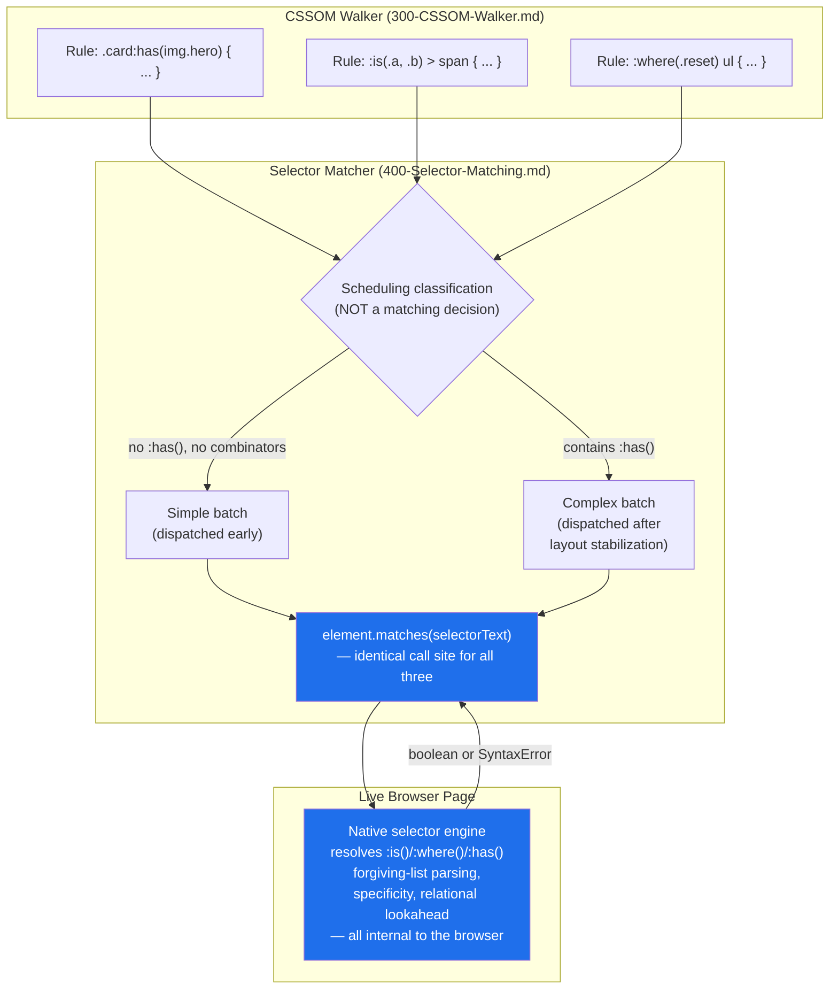
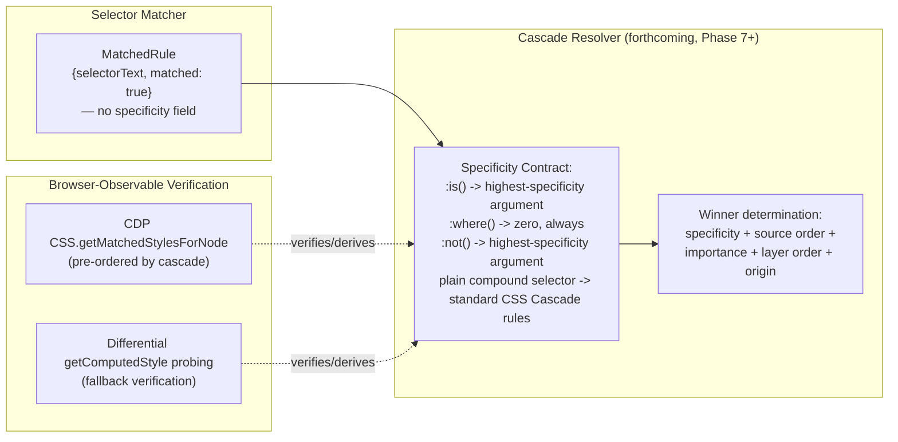
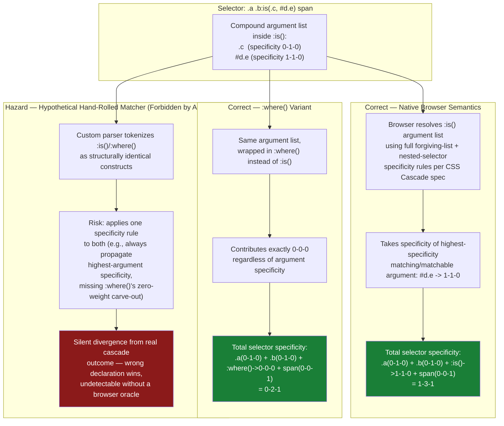

# 404 — `:is()`, `:where()`, and `:has()`

## 1. Title

**Critical CSS Extraction Engine — Logical and Relational Pseudo-Classes: `:is()`, `:where()`, and `:has()`**

## 2. Version

| Field | Value |
|---|---|
| Document Version | 1.0.0 |
| Status | Accepted |
| Last Updated | 2026-07-09 |
| Owners | Selector Engine Working Group |
| Stability | Stable (Phase 6 design document; changes require RFC) |

## 3. Purpose

BRIEF.md Section 2.5 (Rule Matching) explicitly enumerates `:is()`, `:where()`, and `:has()` — "browser permitting" — as selectors the Selector Matcher must support, in the same breath as the directive to "never implement a custom selector parser." [400-Selector-Matching.md](./400-Selector-Matching.md) and [ADR-0002-No-Custom-Selector-Parser](../adr/ADR-0002-No-Custom-Selector-Parser.md) establish the general principle that `Element.matches()` is the engine's sole matching primitive; this document is the concrete, selector-family-specific application of that principle to the three pseudo-classes that are most tempting to special-case, because they are structurally different from ordinary compound/complex selectors: `:is()` and `:where()` accept comma-separated selector lists as arguments and use *forgiving* list parsing, and `:has()` is a *relational* pseudo-class whose matching predicate depends on descendant (or sibling) subtree state rather than purely on the element and its ancestor chain.

This document exists to answer four questions with precision: (1) whether any special-case matching logic is required for these three pseudo-classes (answer: no — this is the direct payoff of [ADR-0002](../adr/ADR-0002-No-Custom-Selector-Parser.md)); (2) what real, non-matching-logic engineering work these pseudo-classes *do* require, specifically around specificity computation for the (forthcoming) Cascade Resolver, `:has()` performance characteristics, and cross-browser support gaps; (3) how forgiving vs. non-forgiving selector-list parsing differs between `:is()`/`:where()` and plain, top-level selector lists, and why the engine does not need to implement either parsing mode itself; and (4) how the engine's existing `matches()`-throws graceful-degradation contract, defined in [400-Selector-Matching.md](./400-Selector-Matching.md), extends cleanly to `:has()` support gaps in older or non-Chromium engines.

## 4. Audience

- Implementers of the Selector Matcher (`packages/matcher`) who need to confirm — and avoid regressing — the "no special-case code" invariant for these three pseudo-classes.
- Implementers of the (forthcoming) Cascade Resolver, who need the specificity semantics of `:is()` and `:where()` documented precisely before implementing cascade-order tie-breaking.
- Performance engineers evaluating `:has()`-heavy fixtures (per [206-Virtualized-Lists.md](./207-Virtualized-Lists.md)-adjacent and [401-Selector-Memoization.md](./401-Selector-Memoization.md) scheduling concerns) who need to understand why `:has()` selectors are batched differently from ordinary selectors.
- Reviewers auditing pull requests that touch `:is()`/`:where()`/`:has()` handling anywhere in the pipeline, who need a clear reference for what is and is not in scope for this codebase to implement.
- Diagnostics/Reporter implementers who need to know what diagnostic events these pseudo-classes can produce (e.g., unsupported-selector warnings) and how they should be attributed.

Readers should already be familiar with [400-Selector-Matching.md](./400-Selector-Matching.md)'s batching/memoization pipeline, [ADR-0002](../adr/ADR-0002-No-Custom-Selector-Parser.md)'s rationale, and the CSS Selectors Level 4 specification's treatment of logical combinators and relational selectors.

## 5. Prerequisites

- [400-Selector-Matching.md](./400-Selector-Matching.md) — the batched `element.matches()` pipeline and its `matches()`-throws graceful-degradation contract, which this document extends for `:has()` support gaps.
- [401-Selector-Memoization.md](./401-Selector-Memoization.md) — the memoization cache keyed by `(selectorText, nodeIdentity)`, into which `:is()`/`:where()`/`:has()` selectors are inserted with no special-case key structure.
- [ADR-0002-No-Custom-Selector-Parser](../adr/ADR-0002-No-Custom-Selector-Parser.md) — the parent decision this document specializes.
- [006-Design-Principles.md](../architecture/006-Design-Principles.md) Principle 1 (Browser Is Source of Truth) and Principle 2 (Never Implement a Custom Selector Parser).
- Familiarity with CSS Selectors Level 4's `<forgiving-selector-list>` and `<complex-selector-list>` grammar productions, and with the specificity computation rules for `:is()`, `:where()`, and `:not()`.

## 6. Related Documents

- [400-Selector-Matching.md](./400-Selector-Matching.md) — the general batching/memoization/graceful-degradation pipeline this document's three pseudo-classes flow through unmodified.
- [401-Selector-Memoization.md](./401-Selector-Memoization.md) — memoization cache keying, relevant to why `:has()` selectors are scheduled into a later batch (Architecture, below).
- [402-Pseudo-Elements.md](./402-Pseudo-Elements.md) — sibling document covering `::before`/`::after`/etc., structurally analogous in that pseudo-element handling is likewise delegated to the browser, though pseudo-elements are not matchable via `element.matches()` at all and therefore require a different treatment than the pseudo-*classes* this document covers.
- [403-Pseudo-Classes.md](./403-Pseudo-Classes.md) — the general pseudo-class document (`:hover`, `:nth-child`, `:checked`, etc.); this document is a deep-dive on the three pseudo-classes BRIEF.md Section 2.5 calls out by name as requiring explicit discussion.
- [405-Container-Queries.md](./405-Container-Queries.md) — sibling Phase 6 document; container queries are an `@`-rule condition rather than a selector, but both documents share the theme of "the browser evaluates this, not custom code."
- [ADR-0002-No-Custom-Selector-Parser](../adr/ADR-0002-No-Custom-Selector-Parser.md) — parent decision record.
- [006-Design-Principles.md](../architecture/006-Design-Principles.md) — Principles 1 and 2.
- [105-Viewport-Manager.md](./105-Viewport-Manager.md) — referenced for the multi-viewport model that also governs how `:has()`'s layout-dependent results can vary per viewport profile branch, analogous to (but independent of) the container-query interaction documented in [405-Container-Queries.md](./405-Container-Queries.md).
- CSS Selectors Level 4 specification (W3C) — the normative source for `:is()`, `:where()`, `:has()`, and forgiving selector-list parsing.
- CSS Cascade Level 4/5 specification (W3C) — the normative source for specificity computation involving `:is()`/`:where()`/`:not()`.

## 7. Overview

`:is()`, `:where()`, and `:has()` are grouped together in BRIEF.md Section 2.5 because they represent the leading edge of what a hand-rolled selector matcher would find hardest to implement correctly: functional pseudo-classes that take entire selector lists as arguments, with matching semantics that only converge with the target browser's own behavior if the *browser itself* evaluates them. [ADR-0002](../adr/ADR-0002-No-Custom-Selector-Parser.md) forbids the engine from ever attempting this, and [400-Selector-Matching.md](./400-Selector-Matching.md) already establishes that selector text is passed to `element.matches()` verbatim, with no tokenization or AST construction on the engine's side. This document confirms, in detail, that this general contract requires zero additional matching-logic code for `:is()`, `:where()`, or `:has()` specifically — but it also identifies the three areas where these pseudo-classes generate real engineering obligations *elsewhere* in the pipeline, none of which is matching logic:

1. **Specificity.** `:is()` and `:not()` take the specificity of their most specific argument; `:where()` always contributes zero specificity. This does not affect *matching* (a node either matches `element.matches(selector)` or it does not, regardless of specificity), but it is load-bearing for the Cascade Resolver's rule-ordering decision when two rules match the same element and their relative specificity determines which declaration wins. This document establishes the contract the Cascade Resolver must honor without prescribing that document's full design.
2. **Performance.** `:has()` is a relational, "look-ahead"/"look-around" selector whose evaluation cost is not bounded purely by the target element — it depends on descendant (or sibling) subtree size and, in some browser implementations, requires re-evaluation on subtree mutation. [400-Selector-Matching.md](./400-Selector-Matching.md)'s batching model already defers `:has()`-bearing selectors to a later batch (after layout stabilization); this document explains why, in more depth, and what it means for extraction wall-clock time at scale.
3. **Browser support gaps and forgiving parsing.** `:has()` support varies across browser engines and versions; `:is()`/`:where()`'s forgiving-selector-list parsing (silently dropping invalid branches rather than invalidating the whole selector) differs from the non-forgiving parsing of plain, top-level selector lists (`a, b, c` in a rule's `selectorText`, where an invalid branch invalidates the entire rule at CSS-parse time, before the engine ever sees it). Both of these are browser-native behaviors this engine observes rather than implements, but they interact with the engine's diagnostics and graceful-degradation contracts in specific, documented ways.

## 8. Detailed Design

### 8.1 No Special-Case Matching Logic — the Payoff of ADR-0002

**Design choice: `:is()`, `:where()`, and `:has()` selectors are passed to `element.matches()` exactly like any other selector, with no branching on selector content.** [400-Selector-Matching.md](./400-Selector-Matching.md)'s `matchAll` algorithm and its cheap pre-filter (Step 1 of that document's Algorithms section) never inspect whether a selector contains `:is(`, `:where(`, or `:has(` substrings for the purpose of deciding *how* to match — the only place selector content is inspected at all is the scheduling classification (Simple vs. Complex, per that document's state diagram), which changes *when* `element.matches()` is invoked, never *what algorithm* answers the question.

**Why this is correct, not merely convenient.** Consider the counterfactual: if the engine attempted to special-case `:is(.a, .b)` by splitting it into two matches() calls (`element.matches('.a')` OR `element.matches('.b')`) and OR-ing the results, this would appear to work for simple cases but would silently diverge from the specification in at least two ways. First, `:is()` argument lists can themselves contain combinators and nested pseudo-classes (`:is(.card > a:hover, .list li:first-child)`), and correctly decomposing this into independently-matchable branches requires exactly the selector-grammar parsing [ADR-0002](../adr/ADR-0002-No-Custom-Selector-Parser.md) forbids. Second, and more subtly, `:is()`'s forgiving-selector-list parsing means a browser that does not yet support some future selector feature used inside one branch of an `:is()` argument list will silently drop only that branch and continue matching the others — an engine-side decomposition that calls `matches()` on each split branch independently would need to replicate this forgiving behavior exactly, which is only guaranteed by *not* decomposing at all and letting the browser's own `:is()` implementation handle its own argument list end-to-end.

**Consequence: this document's "Detailed Design" for matching is, deliberately, almost entirely about proving a negative.** There is no algorithm to specify here beyond what [400-Selector-Matching.md](./400-Selector-Matching.md) Section 10 (Algorithms) already specifies for arbitrary selector text — `:is()`, `:where()`, and `:has()` selectors are literally indistinguishable, from the matcher's point of view, from a simple class selector, except insofar as they are classified as "Complex" for scheduling purposes when `:has()` is present (Section 8.3, below).

### 8.2 Specificity: The Cascade Resolver's Concern, Not the Matcher's

**Design choice: the Selector Matcher module never computes or reasons about specificity; specificity is entirely the Cascade Resolver's responsibility, sourced from browser-observable behavior, not from parsing selector text.** This is a direct instance of [ADR-0002](../adr/ADR-0002-No-Custom-Selector-Parser.md)'s explicit prohibition: "Reimplementing specificity calculation by parsing selector text... never by a bespoke specificity parser that could silently diverge from the CSS Cascade specification's edge cases (e.g., `:where()` has zero specificity, `:is()` takes the specificity of its most specific argument)." This document restates and elaborates that prohibition specifically for `:is()`/`:where()`, because the two pseudo-classes are, syntactically, near-identical (both take a forgiving selector list as an argument), yet their specificity contribution is maximally different — one takes the specificity of its highest-specificity matched or matchable branch, the other contributes exactly zero, unconditionally, regardless of what its argument list contains.

**Why this asymmetry exists (rationale, for context, not because the engine needs to reason about it).** `:where()` was introduced by the CSS Working Group specifically to give authors a mechanism to write reusable, scoped selector groups (e.g., for design systems and CSS methodologies where broad selector reuse is common) without those selectors accumulating cascade weight that would make them hard for an author's own more specific overrides to beat. `:is()`, by contrast, is intended as a purely syntactic convenience for writing compact selector lists without duplicating a shared prefix, and deliberately preserves ordinary specificity accounting so that it behaves, cascade-wise, exactly as if the author had written out the full expansion by hand (`:is(.a, .b) > span` behaves, for cascade purposes, as the more-specific of `.a > span` or `.b > span` matching, not as some new zero-weight category). The engine does not need to internalize *why* this asymmetry exists to correctly consume it — but the Cascade Resolver's design must encode it as an explicit, tested rule rather than deriving it incidentally.

**How the Cascade Resolver is expected to obtain specificity without a custom parser.** [ADR-0002](../adr/ADR-0002-No-Custom-Selector-Parser.md)'s Consequences section states that specificity must be "derived by browser-observable behavior (`getComputedStyle` cross-checks) or by delegating to well-vetted, browser-validated logic." Two concrete, ADR-0002-compliant approaches are available to a future Cascade Resolver implementation, and this document takes no position on which the Cascade Resolver ultimately chooses (that choice belongs to the forthcoming Cascade Resolver design document), but records both here because they are the direct consequence of this document's specificity discussion:

1. **CSSOM-native specificity, where exposed.** Some browser-internal DevTools Protocol surfaces (e.g., Chrome DevTools Protocol's CSS domain, `CSS.getMatchedStylesForNode`) return matched rules already ordered by the browser's own cascade resolution, which implicitly encodes correct specificity handling (including `:is()`/`:where()`/`:not()` asymmetry) without the engine ever computing a specificity number itself.
2. **Differential `getComputedStyle` probing.** For cases where CDP-level matched-style ordering is unavailable or insuffient, a synthetic differential test — applying two competing declarations at different points in a controlled test document and reading back which one won via `getComputedStyle` — can establish relative cascade order empirically, again without the engine parsing selector text to compute a specificity tuple by hand.

Both approaches keep specificity determination inside the "ask the browser" discipline of Principle 1 and Principle 2; neither requires this document, or the Selector Matcher, to implement the CSS Cascade specification's specificity algorithm in JavaScript.

**Forward reference.** The full Cascade Resolver design — including how it merges specificity, source order, importance, layer order (`@layer`), and origin into a single winner determination — is out of scope for this document and is expected to be specified in a forthcoming `docs/design/5xx`-series Cascade Resolver document (see [500-Dependency-Resolution-Overview.md](./500-Dependency-Resolution-Overview.md) and neighboring Phase 7 documents for the earliest point at which cascade concerns become load-bearing for dependency resolution). This document's contribution is narrow and precise: it fixes the *contract* — `:is()` takes its highest-specificity argument, `:where()` contributes zero, matching itself is uniform — that any future Cascade Resolver document must satisfy.

### 8.3 `:has()` — A Relational Pseudo-Class With Real Performance Cost

**What makes `:has()` different from every other selector this engine matches.** Every pseudo-class discussed in [403-Pseudo-Classes.md](./403-Pseudo-Classes.md) — `:hover`, `:nth-child`, `:checked`, `:focus-within` — evaluates a predicate over the candidate element and, at most, its ancestor chain or immediate sibling set, all of which are already resolved by the time layout has stabilized for a given DOM snapshot. `:has()` inverts this: `.card:has(img.hero)` asks whether *any descendant* of `.card` matches `img.hero` — a lookahead into the subtree, not a lookback into the ancestor chain. This is precisely the "relational pseudo-class" category BRIEF.md Section 2.5 flags with "(browser permitting)," because relational, subtree-dependent matching is exactly the class of selector semantics a from-scratch matcher would find hardest to implement correctly and efficiently — and exactly the class of semantics real browser engines have spent significant engineering effort optimizing internally (e.g., Chromium's `:has()` implementation includes subtree-invalidation tracking so that a mutation deep in a `:has()`-scoped subtree only triggers re-evaluation of the specific ancestors whose `:has()` predicate could be affected, rather than a full-document re-scan).

**Why the engine defers `:has()`-bearing selectors to a later matching batch.** [400-Selector-Matching.md](./400-Selector-Matching.md)'s state diagram already classifies any selector "contains combinators / `:has()` / container-dependent pseudo-classes" as `Complex`, dispatched only "after layout stabilization." This document elaborates the specific reason for `:has()`: because its result depends on descendant layout/content state, evaluating it before the DOM Collector's snapshot and [104-Rendering-Stabilization.md](../design/104-Rendering-Stabilization.md)-governed stabilization have completed risks reading a transient, not-yet-settled subtree — e.g., a lazy-loaded image that has not yet been inserted, or a hydration-pending component that has not yet rendered its children. Deferring `:has()` evaluation until after stabilization is not a workaround for a matching-correctness gap (the browser's `matches()` call is always correct for the DOM state it is given) but a workaround for a *snapshot-timing* gap — calling `matches()` too early would correctly report the true state of an incomplete DOM, which is not the state the engine actually wants to extract critical CSS against.

**Why `:has()` is called out in Performance, specifically, and not merely Correctness.** Because `:has()`'s matching cost is not O(1) relative to the candidate element the way a class or ID selector's cost effectively is — checking `.card:has(img.hero)` against a candidate `.card` element requires the browser to search (a bounded but potentially large) subtree for a matching `img.hero` descendant. At the scale this engine operates (thousands of candidate elements, per [400-Selector-Matching.md](./400-Selector-Matching.md)'s Algorithms section), a stylesheet with many `:has()`-bearing selectors, especially ones with large or unbounded argument selectors evaluated against large container subtrees (e.g., `.page:has(.rare-warning-banner)` evaluated against a `.page` element that is the root of the entire above-fold DOM), can materially increase per-selector matching cost even though each individual `matches()` call still executes inside the browser's own optimized native implementation. This is not a correctness risk (Principle 1/2 fully apply — the browser's answer is always used, verbatim) but it is a real, measurable wall-clock cost that the Reporter's timing diagnostics (per [006-Design-Principles.md](../architecture/006-Design-Principles.md) Principle 6, Fail-Fast Diagnostics) should attribute specifically to `:has()`-bearing selectors so that a project with pathologically broad `:has()` usage is visible as a distinct cost center, not folded anonymously into generic "matching time." See Performance, below, for the concrete diagnostic recommendation.

**No mitigation beyond scheduling and attribution is in scope.** Consistent with [ADR-0002](../adr/ADR-0002-No-Custom-Selector-Parser.md)'s prohibition on any matcher-side approximation, the engine does not attempt to pre-filter or short-circuit `:has()` evaluation based on any heuristic about the argument selector's likely match rate — doing so would risk exactly the false-negative risk [400-Selector-Matching.md](./400-Selector-Matching.md) Implementation Notes forbids for pre-filters generally ("the pre-filter may only produce false positives... never false negatives"). The only sanctioned response to `:has()` performance cost is observability (timing diagnostics) and, at the operator's discretion, stylesheet-authoring guidance surfaced through the Reporter, exactly analogous to the "missing PurgeCSS/Tailwind JIT configuration" guidance [400-Selector-Matching.md](./400-Selector-Matching.md) Performance section recommends for pathologically large rule counts.

### 8.4 Browser Support Gaps and the Graceful-Degradation Contract

**`:has()` support is not universal across all browser engines and versions the way `:is()`/`:where()` support is.** `:is()` and `:where()` reached broad, stable, cross-engine support (Chromium, WebKit, Gecko) earlier and more uniformly than `:has()`, which shipped in Chromium and WebKit well ahead of Gecko, and which — per [ADR-0003-Playwright-As-Browser-Abstraction](../adr/ADR-0003-Playwright-As-Browser-Abstraction.md)'s multi-engine ambitions — means an extraction run configured against an older engine build, or a non-Chromium engine predating `:has()` support, will encounter a selector its target browser genuinely cannot evaluate.

**The contract: this is a `SyntaxError` from `element.matches()`, caught and reported, never silently reinterpreted as "no match."** [ADR-0002](../adr/ADR-0002-No-Custom-Selector-Parser.md)'s Edge Cases section states this precisely for the general case: "on an engine/version without `:has()` support, `Element.matches()` throws a `SyntaxError` for that selector rather than silently returning false. This must be caught and reported... as an unsupported-selector diagnostic, not swallowed as a non-match, since 'no match' and 'cannot evaluate' are semantically different and the latter risks a false negative in extraction." [400-Selector-Matching.md](./400-Selector-Matching.md) is the document that defines the concrete mechanics of this contract — a try/catch boundary around each `element.matches()` invocation inside the batched `page.evaluate()` call, with a caught `SyntaxError` mapped to an `UnsupportedSelectorWarning` diagnostic carrying the specific selector text and rule identity, surfaced through the Reporter rather than being absorbed as an implicit `false`. This document's sole addition is to confirm that `:has()` is, in practice, the single most likely real-world trigger of this exact code path, because it is the newest and least uniformly supported of the three pseudo-classes this document covers — `:is()` and `:where()` support gaps are comparatively rare in any currently-maintained browser engine version this project is likely to target, but not theoretically impossible, and the same contract applies identically to them if encountered.

**Why "no match" would be a worse failure mode than a loud diagnostic.** If a stylesheet author writes `.card:has(.badge--urgent) { border-color: red; }` intending to highlight cards containing an urgent badge, and the extraction engine silently treated an unsupported `:has()` as "matches nothing," the resulting critical CSS would omit this rule for every element, even ones that plainly satisfy the intended condition, and no diagnostic would ever surface this omission. Given [006-Design-Principles.md](../architecture/006-Design-Principles.md) Principle 6 (Fail-Fast Diagnostics) and Principle 3 (Correctness Over Premature Optimization — silent degradation is exactly the kind of implicit accuracy trade the principle forbids), the engine instead treats this as a first-class, attributable diagnostic event, giving the operator the information needed to decide how to proceed (e.g., upgrade the target browser build, or explicitly accept the gap for a documented reason).

### 8.5 Forgiving vs. Non-Forgiving Selector Lists

**Two distinct parsing behaviors exist in the CSS Selectors Level 4 specification, and the engine relies on the browser to apply the correct one in each context, without implementing either.**

- **Non-forgiving selector lists** govern a rule's top-level `selectorText` — the comma-separated list directly following a style rule (`a, b, c { ... }`). If any single branch of this list is syntactically invalid (an unrecognized pseudo-class, a malformed attribute selector, etc.), the *entire rule* fails to parse and is dropped from the CSSOM entirely — the CSSOM Walker (per [300-CSSOM-Walker.md](./300-CSSOM-Walker.md)) will simply never see this rule at all, because the browser's own CSS parser has already discarded it before `document.styleSheets` exposes any rule list. There is nothing for the Selector Matcher to do here; an invalid top-level rule is invisible to the entire pipeline downstream of the CSSOM Walker by construction.
- **Forgiving selector lists** govern the argument lists of `:is()` and `:where()` (and, per the specification, `:has()`'s argument list is technically a forgiving relative selector list as well). Per spec, an invalid branch inside a forgiving list is dropped, and the remaining valid branches still apply — the rule as a whole is not invalidated. `:is(.valid, :invalid-future-pseudo, .also-valid)` behaves, on a browser that does not recognize `:invalid-future-pseudo`, exactly as `:is(.valid, .also-valid)` would.

**Why the engine needs no special handling for either behavior.** Both behaviors are already fully resolved by the time any engine code observes the selector: non-forgiving list failures are resolved at CSS-parse time, inside the browser's CSS parser, before the CSSOM Walker's traversal begins — the rule is either present in `cssRules` with valid `selectorText`, or it is not present at all. Forgiving list failures are resolved at `matches()`-evaluation time, inside the browser's selector-matching implementation — `element.matches(":is(.valid, :invalid-future-pseudo, .also-valid)")` either throws (if the *entire* construct is unparseable, e.g., on an engine that does not support `:is()` at all) or returns a correct boolean reflecting only the valid branches (if the engine supports `:is()` but not every argument inside it) — and either outcome flows through the exact same try/catch and boolean-result handling [400-Selector-Matching.md](./400-Selector-Matching.md) already defines for every selector. The distinction between forgiving and non-forgiving parsing is therefore purely informative context for engineers reading this document — useful for understanding *why* a given selector is or is not visible to the pipeline at a given stage — and never a decision point the engine's own code needs to branch on.

**Consequence for diagnostics precision.** Because non-forgiving list failures happen silently inside the browser's CSS parser (the CSSOM Walker cannot observe a rule that was dropped before parsing completed — there is no error event, no CSSOM entry, nothing to catch), the engine has no mechanism to diagnose "this top-level rule was silently dropped due to one invalid comma-separated branch" — this is an inherent CSSOM opacity limitation, not an engine gap, and is recorded here as an Edge Case (Section 12) and Future Work item (Section 16) rather than something this document claims to solve.

## 9. Architecture

### 9.1 Matching Pipeline — Uniform Path for All Three Pseudo-Classes



The critical property this diagram makes visible: `R1`, `R2`, and `R3` converge on the *same* `MATCHCALL` node. The only branch point (`CLASSIFY`) affects scheduling order, not algorithm choice — `:where(.reset) ul` and `:is(.a, .b) > span`, despite very different specificity implications (Section 8.2), are matched through byte-identical code paths, differing only in argument string content.

### 9.2 Specificity Contract Handoff to the Cascade Resolver



This diagram is a forward-reference boundary, not a specification of the Cascade Resolver's internals — its purpose is solely to make explicit that specificity is computed downstream of, and independently from, the Selector Matcher's boolean matched/unmatched decision, and that both sanctioned computation strategies (Section 8.2) remain browser-observation-based rather than selector-text-parsing-based.

### 9.3 Specificity Computation: `:is()` vs. `:where()` vs. a Hypothetical Hand-Rolled Matcher



This diagram exists specifically to satisfy the requirement that specificity computation for `:is()`, `:where()`, and a hypothetical hand-rolled matcher be visually contrasted. The two "Correct" branches are not something the engine implements directly (per Section 8.2, the engine defers to browser-observable behavior rather than computing these specificity tuples via a parser) — they represent the *ground truth* the Cascade Resolver's browser-observation strategies must converge on. The "Hazard" branch is the concrete failure mode [ADR-0002](../adr/ADR-0002-No-Custom-Selector-Parser.md) is written to prevent: a plausible-looking custom implementation that treats two syntactically similar constructs identically, silently producing wrong cascade outcomes with no build-time signal.

## 10. Algorithms

This section is deliberately thin, consistent with Section 8.1's "proving a negative" framing: there is no `:is()`/`:where()`/`:has()`-specific matching algorithm to specify, because none exists in this codebase. What follows is the one genuinely `:has()`-specific procedure — batch scheduling — stated precisely, plus an explicit statement of the specificity *non*-algorithm this document deliberately does not provide.

### 10.1 `:has()` Batch Deferral Classification

**Problem statement.** Given a candidate selector's text, determine whether it must be deferred to the post-stabilization "Complex" batch (per [400-Selector-Matching.md](./400-Selector-Matching.md) Section 9's state diagram) due to relational, layout-dependent semantics, without parsing the selector's internal grammar.

**Inputs.** `selectorText: string`.

**Outputs.** `batchClass: 'simple' | 'complex'`.

**Pseudocode.**

```text
function classifyForBatching(selectorText: string) -> BatchClass:
    // Purely lexical substring/delimiter checks — NOT selector-grammar
    // parsing. This is scheduling metadata, never a matching decision;
    // per Section 8.1, the classification result never substitutes for
    // element.matches() and can never produce a false match/non-match.
    if containsToken(selectorText, ":has(") or containsCombinator(selectorText):
        return 'complex'
    return 'simple'
```

**Time complexity.** O(L) where L is selector text length — a linear scan for the `:has(` substring and combinator characters, negligible relative to any downstream `page.evaluate()` round trip.

**Memory complexity.** O(1) beyond the input string itself.

**Failure cases.** A selector containing `:has(` as a literal substring inside an escaped attribute value or string literal (e.g., `[data-label="\:has\(x\)"]`) would be misclassified as requiring deferral when it does not actually contain a relational pseudo-class. This is an accepted, deliberately conservative false positive (deferring a selector that did not strictly need deferral costs only scheduling latency, never correctness) rather than a risk the engine attempts to resolve via deeper lexical analysis, since deeper analysis would begin to resemble the grammar-aware parsing [ADR-0002](../adr/ADR-0002-No-Custom-Selector-Parser.md) forbids. This mirrors the same "may only produce false positives, never false negatives" discipline [400-Selector-Matching.md](./400-Selector-Matching.md) Implementation Notes establishes for the candidate pre-filter.

**Optimization opportunities.** This classification can be computed once per distinct `selectorText` at CSSOM Walker traversal time (per [300-CSSOM-Walker.md](./300-CSSOM-Walker.md)) and cached alongside the rule's other traversal metadata, since it is a pure function of selector text with no dependency on DOM/node state — avoiding redundant re-classification across viewport-profile branches that share the same stylesheet.

### 10.2 The Deliberate Absence of a Specificity Algorithm

**Problem statement (explicitly not solved here).** Given a selector containing `:is()`, `:where()`, and/or `:not()`, compute its CSS specificity tuple.

**Why no pseudocode is provided.** Per Section 8.2 and [ADR-0002](../adr/ADR-0002-No-Custom-Selector-Parser.md)'s explicit prohibition, this codebase does not implement this algorithm by parsing selector text, in any module, under any circumstance. Providing pseudocode here — even labeled "reference only" — would create exactly the kind of "just this once, for a good reason" precedent [ADR-0002](../adr/ADR-0002-No-Custom-Selector-Parser.md)'s Future Work section warns against ("Any future proposal to add a JS selector library or custom matcher — even 'just for a quick pre-filter check' — must be scrutinized"). The two sanctioned browser-observation strategies (Section 8.2) are procedures over browser APIs (CDP calls, differential `getComputedStyle` probing), not selector-text algorithms, and their detailed specification belongs to the forthcoming Cascade Resolver design document, not this one.

**Complexity, stated at the contract level only.** Whatever the Cascade Resolver's chosen strategy, its complexity is bounded by the number of rules matching a given element (typically small, per [400-Selector-Matching.md](./400-Selector-Matching.md)'s observation that real-world class-selector-dominated stylesheets produce modest candidate sets per node) multiplied by the cost of one browser-observation call per comparison — an amortizable, cacheable cost, not a per-selector parsing cost this document needs to bound.

## 11. Implementation Notes

1. **No lint rule or code path in `packages/matcher` may special-case `:is(`, `:where(`, or `:has(` substrings for matching purposes.** The only sanctioned lexical inspection of these substrings anywhere in the pipeline is the batch-scheduling classification in Section 10.1, which must be clearly commented as scheduling-only, per the same discipline [400-Selector-Matching.md](./400-Selector-Matching.md) Implementation Notes item 1 already establishes for the general pre-filter.
2. **Diagnostics for `SyntaxError` from `matches()` must record which of `:is()`/`:where()`/`:has()` (if any) triggered the failure**, extracted via the same lexical substring check used for batch classification, purely for human-readable diagnostic attribution (e.g., "selector uses `:has()`, which the target browser build does not support") — this is presentation-layer convenience, not a matching decision, and must not be confused with the forbidden category of selector-grammar parsing; it is equivalent in kind to [ADR-0002](../adr/ADR-0002-No-Custom-Selector-Parser.md)'s allowlisted "non-decisional diagnostic formatting" carve-out.
3. **The `:has()`-triggers-complex-batch rule (Section 10.1) must be kept in sync with `400-Selector-Matching.md`'s state diagram** as the single source of truth for batch classification; this document does not duplicate ownership of that state diagram, only elaborates the `:has()`-specific rationale behind one of its transitions.
4. **Cascade Resolver implementers must not attempt to "shortcut" specificity determination for `:is()`/`:where()` by inspecting selector text as a stop-gap before the full browser-observation strategy is built.** Any interim Cascade Resolver milestone that has not yet implemented CDP-based or differential-probing specificity determination should explicitly flag matched-rule ordering as unresolved/best-effort (per [006-Design-Principles.md](../architecture/006-Design-Principles.md) Principle 6, Fail-Fast Diagnostics) rather than silently shipping a text-parsing shortcut that would need to be ripped out later.
5. **Fixture coverage should include at least one `:is()`, one `:where()`, and one `:has()` selector in the golden-snapshot regression suite** (per [006-Design-Principles.md](../architecture/006-Design-Principles.md) Testing discipline and Section 15 below), specifically including a case where `:is()` and `:where()` wrap syntactically identical argument lists so that a specificity-computation regression in the Cascade Resolver would be caught by a snapshot diff even though the Selector Matcher's own output (matched: true/false) would be identical for both.

## 12. Edge Cases

- **`:has()` support absent on the configured browser engine/version.** Per Section 8.4, this surfaces as a caught `SyntaxError` mapped to an `UnsupportedSelectorWarning`, never a silent non-match. Operators targeting multiple browser engines via [ADR-0003-Playwright-As-Browser-Abstraction](../adr/ADR-0003-Playwright-As-Browser-Abstraction.md)'s multi-engine ambitions should expect this diagnostic to appear only on the specific engine(s) lacking support, not uniformly.
- **`:is()`/`:where()` argument list containing a selector the target browser does not recognize at all (not merely one branch, but the entire construct).** If the browser does not support `:is()`/`:where()` syntax whatsoever (exceedingly rare on any currently-relevant engine, but theoretically possible on a very old pinned browser build), `matches()` throws `SyntaxError` for the whole selector, handled identically to the `:has()` case in Section 8.4 — the engine does not distinguish "unsupported pseudo-class name" from "unsupported argument inside a supported pseudo-class" at the diagnostic level beyond recording the full selector text.
- **Forgiving-list partial support: one argument branch inside `:is()`/`:where()` is unsupported, others are supported.** Per Section 8.5, the browser's native forgiving-list parsing handles this transparently — `matches()` returns a correct boolean reflecting only the valid branches, no `SyntaxError`, no diagnostic needed, because nothing failed from the browser's point of view.
- **Non-forgiving top-level selector list with one invalid branch, silently dropping the entire rule before the CSSOM Walker ever sees it (Section 8.5).** This is a genuine blind spot: the engine has no diagnostic for "a rule was silently dropped due to a CSS parse error the browser did not surface as an observable event." This is recorded as an accepted limitation rather than solved here (see Future Work).
- **`:has()` combined with `:is()`/`:where()` in the same selector** (e.g., `:has(:is(.a, .b))`), fully valid per spec and requiring no special handling beyond the ordinary batch-classification rule (Section 10.1's lexical check for `:has(` fires regardless of what is nested inside it) and the ordinary `matches()` call — both nesting and relational lookahead are resolved entirely by the browser's native implementation in a single call.
- **`:has()` scoped to a very large subtree at the root of the above-fold DOM** (e.g., `body:has(.rare-element)`), which is the worst-case performance scenario described in Section 8.3 — no correctness issue, but a real, attributable performance cost that the Reporter should surface (Section 14).
- **Shadow DOM boundaries and `:has()`.** Per [006-Design-Principles.md](../architecture/006-Design-Principles.md) Edge Cases (Shadow DOM), `:has()`'s descendant lookahead does not cross shadow boundaries by default, matching the same non-crossing behavior `Element.matches()`/`querySelectorAll` exhibit generally — this is not a `:has()`-specific gap but an instance of the general shadow DOM boundary discipline already established at the architecture level, and no additional handling is required beyond what the CSSOM Walker and Selector Matcher already do for shadow-encapsulated content.
- **`:where()` used to zero out specificity for a selector that also contains `:has()`** (e.g., `:where(.card:has(img))`), a valid and increasingly common authoring pattern for "match this condition but don't let it fight the cascade" — correctly handled by the ordinary combination of Section 8.2 (zero specificity from `:where()`) and Section 8.3 (relational deferral from the nested `:has()`), with no interaction effect requiring special-case code, since both behaviors are independently delegated to the browser.

## 13. Tradeoffs

| Decision | Why | Alternative Considered | Tradeoff Accepted |
|---|---|---|---|
| No engine-side decomposition of `:is()`/`:where()` argument lists, even for diagnostic granularity (e.g., "which specific branch matched") | Decomposition requires selector-grammar parsing, forbidden by ADR-0002, and risks replicating forgiving-list semantics incorrectly | Split comma-separated argument lists and match each branch independently to report per-branch match results | Diagnostics can report only "the compound `:is(...)` selector matched," not which internal branch caused it — an acceptable loss of granularity, per ADR-0002's explicit sanction of comma-splitting only at the top-level rule list, not inside functional pseudo-class arguments |
| `:has()`-bearing selectors deferred to a post-stabilization batch rather than matched eagerly | Avoids reading transient, not-yet-settled subtree state for relational lookahead (Section 8.3) | Match `:has()` selectors in the same early batch as simple selectors | Slightly higher latency for `:has()`-heavy stylesheets, and a small increase in batch-scheduling complexity (Section 10.1), in exchange for correctness against a stable snapshot |
| Specificity computation deferred entirely to a forthcoming Cascade Resolver via browser-observation strategies, not specified in this document | Keeps this document scoped to matching semantics; avoids prescribing Cascade Resolver internals prematurely | Specify a complete `:is()`/`:where()` specificity algorithm here, even if implemented by the Cascade Resolver later | Readers of this document must consult a not-yet-written Cascade Resolver document for the full specificity implementation; this document only fixes the contract those internals must satisfy |
| Lexical (substring/delimiter) `:has()` detection for batch scheduling, not grammar-aware parsing | Consistent with ADR-0002's "may only produce false positives" discipline; avoids any selector-grammar code in the matcher | Grammar-aware detection to avoid false-positive deferral on edge cases like escaped `:has(` inside attribute value strings | Rare selectors with `:has(`-like literal substrings inside escaped values are conservatively (harmlessly) deferred to the complex batch even when not strictly necessary |
| Browser-support gaps for `:has()` handled via the same generic `SyntaxError`-catch contract as any other unsupported selector, with no `:has()`-specific fallback behavior | Consistency and simplicity; avoids inventing a `:has()`-specific "approximate with a simpler selector" fallback that ADR-0002 would forbid | Attempt a best-effort fallback (e.g., matching only the outer selector, ignoring the `:has()` condition) on unsupported engines | An unsupported `:has()` selector produces a loud diagnostic and is excluded from extraction results, rather than a silently wrong approximate match |

## 14. Performance

- **CPU complexity.** Matching cost for `:is()`/`:where()`/`:has()` selectors is bounded entirely by the browser's native implementation, invoked through the same batched `page.evaluate()` mechanism as any other selector (per [400-Selector-Matching.md](./400-Selector-Matching.md) Section 14) — the engine's own CPU contribution is limited to the O(1)-per-selector batch classification (Section 10.1) and ordinary memoization bookkeeping (per [401-Selector-Memoization.md](./401-Selector-Memoization.md)).
- **Memory complexity.** No additional memory structures beyond what [400-Selector-Matching.md](./400-Selector-Matching.md) and [401-Selector-Memoization.md](./401-Selector-Memoization.md) already allocate for the memoization cache and candidate-pair lists; the batch-classification result (Section 10.1) is a single enum value per distinct selector, cached alongside existing CSSOM Walker rule metadata.
- **Caching strategy.** `:has()` selectors are memoized identically to any other selector, keyed on `(selectorText, nodeIdentity)` per [401-Selector-Memoization.md](./401-Selector-Memoization.md) — a memoization hit for a `:has()` selector avoids re-paying its relational-lookahead cost exactly as it would for a cheap class selector, which is a meaningful mitigation for repeated extraction passes across viewport-profile branches sharing the same DOM/CSSOM structure (per [105-Viewport-Manager.md](./105-Viewport-Manager.md) Section 8.1's device-profile model, where Mobile/Tablet/Desktop branches frequently share structurally identical DOM subtrees differing only in which media-query rules are active).
- **Parallelization opportunities.** Identical to the general matching pipeline's parallelization story (per [400-Selector-Matching.md](./400-Selector-Matching.md) Performance) — independent batches across disjoint node/rule subsets, or across independent viewport-profile branches, can be dispatched concurrently; `:has()` introduces no additional parallelization constraint beyond its later scheduling position within a single branch's batch sequence.
- **Incremental execution.** When only a subset of stylesheets changes (per the Dependency Resolver's future incremental-recheck logic), `:has()`-bearing selectors originating from unchanged stylesheets can reuse cached match results exactly as any other selector can, provided node identity is stable across the incremental re-check, per [400-Selector-Matching.md](./400-Selector-Matching.md) Performance's incremental-execution note.
- **Profiling guidance — the one `:has()`-specific recommendation.** The Reporter's per-batch timing instrumentation (per [400-Selector-Matching.md](./400-Selector-Matching.md) Performance's "profiling guidance") should additionally break out aggregate wall-clock time spent evaluating the Complex batch's `:has()`-classified selectors as a distinct line item, separate from other Complex-batch selectors (combinators without `:has()`), so that a project whose stylesheet makes heavy, broad-subtree use of `:has()` sees this as an attributable, investigable cost center rather than undifferentiated "complex selector matching time." This is the concrete Performance-section deliverable this document's Purpose (Section 3) commits to.
- **Scalability limits.** A stylesheet with a very large number of `:has()`-bearing rules, each scoped to a large subtree (worst case: `:has()` argument selectors evaluated against near-root-level candidate elements across a large above-fold DOM), is the primary scalability concern this document identifies; no algorithmic mitigation beyond memoization and browser-native optimization is available or in scope, and the Reporter's attributable diagnostic (above) is the intended operator-facing signal for this condition, consistent with how [400-Selector-Matching.md](./400-Selector-Matching.md) Performance handles the analogous "100k+ rule" scalability limit for unpurged utility-CSS frameworks — as a stylesheet-hygiene signal, not purely an engine defect.

## 15. Testing

- **Unit tests.** Test `classifyForBatching` (Section 10.1) against: selectors containing `:has(` in ordinary position; selectors containing a `:has(`-like literal substring inside an escaped attribute value (verifying the accepted conservative-false-positive behavior, Section 10.1 Failure Cases); selectors containing `:is()`/`:where()` without `:has()` (must classify as `simple` unless a combinator is also present); nested combinations (`:has(:is(...))`, `:where(:has(...))`).
- **Integration tests.** Real-browser fixtures asserting: `element.matches()` correctly returns true/false for `:is()`, `:where()`, and `:has()` selectors against representative fixture DOM structures; a deliberately unsupported-selector fixture (a selector using a syntax the target browser's pinned version does not recognize, simulated via a synthetic unsupported pseudo-class name for test stability rather than depending on a genuinely unsupported real feature) produces the expected `UnsupportedSelectorWarning` diagnostic with correct selector-text attribution, verifying the [400-Selector-Matching.md](./400-Selector-Matching.md)/[ADR-0002](../adr/ADR-0002-No-Custom-Selector-Parser.md) graceful-degradation contract end-to-end for this pseudo-class family specifically.
- **Visual tests.** A fixture exercising `:has()`-conditional styling (e.g., a card component whose border color changes only `:has()` a specific badge element present) should be screenshotted with and without the triggering descendant present, confirming the extracted critical CSS preserves the intended conditional visual behavior — a sanity check on end-to-end fidelity, not on the matcher's internal logic in isolation.
- **Stress tests.** A fixture stylesheet with a large number of `:has()`-bearing rules scoped to a large subtree (mirroring [400-Selector-Matching.md](./400-Selector-Matching.md) Testing's "50,000+ CSS rules" stress fixture, but specifically weighted toward `:has()` usage) to validate the Performance section's profiling/attribution recommendation surfaces a meaningfully distinct timing signal, and to catch batching-efficiency regressions specific to the Complex-batch scheduling path.
- **Regression tests.** A golden-snapshot fixture pinning `:is()`/`:where()` specificity-sensitive cascade outcomes (per Implementation Notes item 5) must be part of the permanent regression suite once the Cascade Resolver exists, so that any future change to the Cascade Resolver's specificity-derivation strategy (Section 8.2) that would silently reorder which declaration wins is caught by a snapshot diff.
- **Benchmark tests.** Track wall-clock time for the `:has()`-classified subset of the Complex batch across engine versions and fixture sizes, per Performance's profiling guidance, to catch both engine-side batching regressions and, informationally, browser-engine-version-driven changes in native `:has()` evaluation cost (the latter is not actionable by this codebase but is useful operator-facing signal, consistent with [ADR-0002](../adr/ADR-0002-No-Custom-Selector-Parser.md)'s acceptance that matching behavior/cost is inherently coupled to the specific browser build in use).

## 16. Future Work

- **Per-branch match attribution for `:is()`/`:where()` compound selectors**, revisiting the Tradeoffs-section decision not to decompose argument lists for diagnostic granularity — if a future diagnostics requirement demands "which specific branch of this `:is()` list caused the match" for richer reporting, this would need a browser-observable mechanism (e.g., re-querying `matches()` against each branch independently as a *reporting-only*, non-decisional follow-up call, never as the primary matching decision) rather than any engine-side decomposition of the primary match, preserving [ADR-0002](../adr/ADR-0002-No-Custom-Selector-Parser.md)'s boundary.
- **Diagnostic visibility into silently-dropped non-forgiving top-level rules** (Section 8.5's identified blind spot) — investigate whether CDP-level CSS parsing error events (if exposed by the target browser's DevTools Protocol) could surface "this rule failed to parse and was dropped" as an attributable diagnostic, closing the one genuine observability gap this document identifies, without requiring the engine to independently parse or validate selector syntax itself.
- **`:has()` performance attribution refinement** — investigate whether CDP-level style-recalculation timing (if exposed with sufficient granularity) could attribute native `:has()` evaluation cost more precisely than coarse per-batch wall-clock timing, potentially down to the individual rule level, to sharpen the Performance section's profiling recommendation.
- **Monitor emerging CSS Selectors Level 5+ relational and logical constructs** (e.g., potential future extensions to `:has()`'s argument grammar, or new logical combinators) for whether they fit this document's existing "no special-case matching logic, only scheduling/diagnostic metadata" model unchanged, or require a new companion document — the expectation, consistent with [ADR-0002](../adr/ADR-0002-No-Custom-Selector-Parser.md)'s "zero maintenance burden" argument, is that they will fit unchanged, but this should be explicitly re-verified against each new browser-shipped selector feature rather than assumed indefinitely.
- **Open question:** should the Reporter's `:has()`-attributed timing diagnostic (Section 14) escalate to a hard warning (not merely informational) past some configurable threshold, analogous to [400-Selector-Matching.md](./400-Selector-Matching.md) Performance's "candidate-pair count exceeds a configurable threshold" warning for oversized rule sets? Current lean is yes, with the threshold left as an operator-configurable value rather than an engine-hardcoded constant, to be formalized once real-world `:has()` usage-pattern data from production fixtures is available.

## 17. References

- [400-Selector-Matching.md](./400-Selector-Matching.md)
- [401-Selector-Memoization.md](./401-Selector-Memoization.md)
- [402-Pseudo-Elements.md](./402-Pseudo-Elements.md)
- [403-Pseudo-Classes.md](./403-Pseudo-Classes.md)
- [405-Container-Queries.md](./405-Container-Queries.md)
- [105-Viewport-Manager.md](./105-Viewport-Manager.md)
- [300-CSSOM-Walker.md](./300-CSSOM-Walker.md)
- [ADR-0002-No-Custom-Selector-Parser](../adr/ADR-0002-No-Custom-Selector-Parser.md)
- [ADR-0003-Playwright-As-Browser-Abstraction](../adr/ADR-0003-Playwright-As-Browser-Abstraction.md)
- [006-Design-Principles.md](../architecture/006-Design-Principles.md)
- [500-Dependency-Resolution-Overview.md](./500-Dependency-Resolution-Overview.md)
- BRIEF.md Section 2.5 (Rule Matching) — repository root
- CSS Selectors Level 4 specification (W3C) — `:is()`, `:where()`, `:has()`, forgiving-selector-list grammar — https://www.w3.org/TR/selectors-4/
- CSS Cascade Level 4/5 specification (W3C) — specificity computation rules for logical combinators — https://www.w3.org/TR/css-cascade-5/
- MDN documentation: `:is()`, `:where()`, `:has()`, `Element.prototype.matches()`
- Chrome DevTools Protocol, CSS domain (`CSS.getMatchedStylesForNode`) documentation
