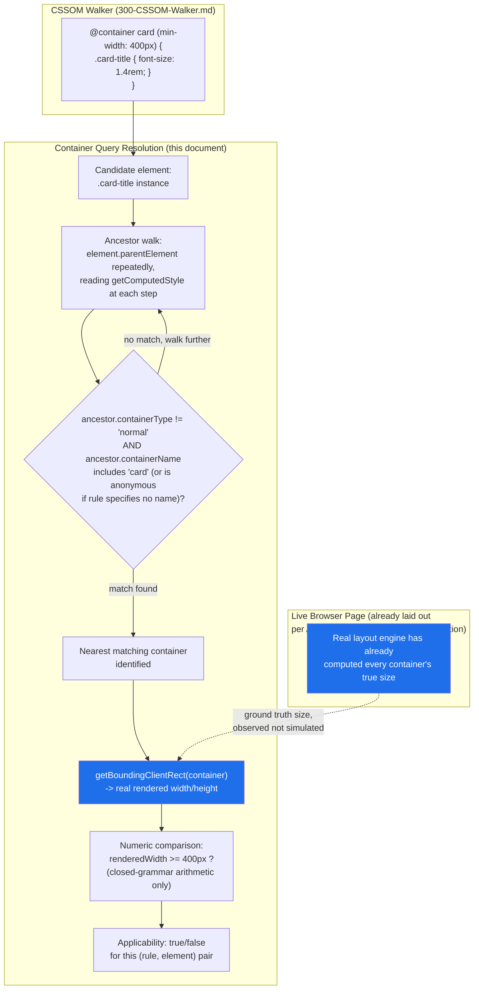
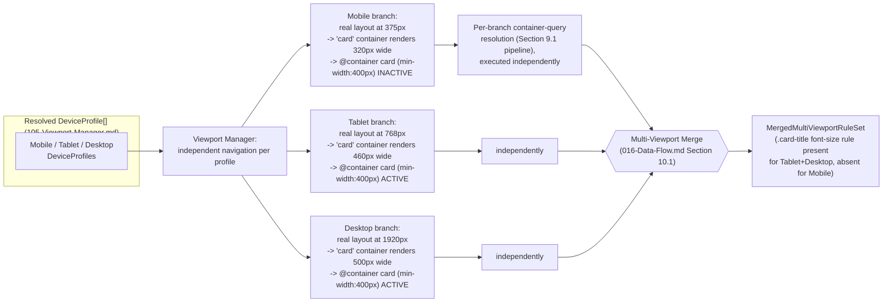
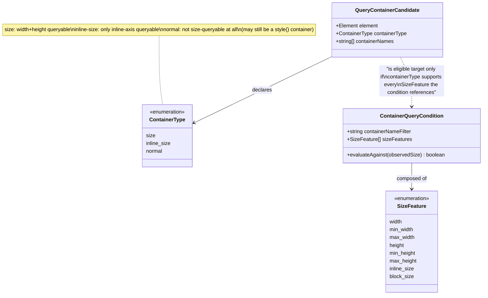

# 405 — Container Queries

## 1. Title

**Critical CSS Extraction Engine — Container Query Evaluation Against a Live-Rendered Container**

## 2. Version

| Field | Value |
|---|---|
| Document Version | 1.0.0 |
| Status | Accepted |
| Last Updated | 2026-07-09 |
| Owners | Selector Engine Working Group |
| Stability | Stable (Phase 6 design document; changes require RFC) |

## 3. Purpose

BRIEF.md Section 2.5 (Dependency Resolution) lists "container queries" alongside media queries, `@layer`, and `@supports` as an at-rule condition the Dependency Resolver must track, and Section 2.15's fixture list names "Container Queries" explicitly as a required test fixture. Unlike `@media` — resolved by [303-Media-Rules.md](./303-Media-Rules.md) against a single, globally-known viewport per extraction branch — `@container` conditions are resolved relative to a *nearest matching ancestor* whose own `container-type`/`container-name` establishes it as a query container, and whose *rendered size* (not the page viewport) is the value the condition is evaluated against. This introduces a genuinely new class of applicability question the engine has not previously had to answer: "is this rule active" now depends on a value (an ancestor's rendered dimensions) that is itself a property of the live-rendered page, computed by layout, and — critically — there is no direct JavaScript API analogous to `window.matchMedia()` that exposes "does this container query condition currently hold" as a queryable boolean.

This document specifies how the engine determines `@container` applicability without any such API: by inspecting the actual rendered size of the relevant container element via `getBoundingClientRect()`/`getComputedStyle()`, comparing it against the parsed condition using the same non-decisional, browser-verified discipline [ADR-0002-No-Custom-Selector-Parser](../adr/ADR-0002-No-Custom-Selector-Parser.md) already establishes for selector matching — because the DOM/CSSOM is already live-rendered by Playwright per [ADR-0001-Browser-Is-Source-of-Truth](../adr/ADR-0001-Browser-Is-Source-of-Truth.md), the engine can observe the real answer directly rather than reimplementing the CSS Containment specification's container-query resolution algorithm. It further specifies named vs. anonymous containers, the effect of `container-type: size | inline-size | normal` on what is queryable at all, and the interaction between per-container query results and the engine's existing multi-viewport strategy ([105-Viewport-Manager.md](./105-Viewport-Manager.md)), where container query outcomes can differ across Mobile/Tablet/Desktop branches exactly as media query outcomes can, but scoped per-container rather than globally per-page.

## 4. Audience

- Implementers of the (forthcoming) Dependency Resolver, specifically the container-query tracking obligation named in BRIEF.md Section 2.5, who need a concrete applicability-determination procedure before implementing the dependency graph node type for `@container` blocks.
- Implementers of the CSSOM Walker ([300-CSSOM-Walker.md](./300-CSSOM-Walker.md)), who must enumerate `@container` rules and their nearest-container relationships during traversal.
- Implementers of the Cascade Resolver, who need to know when a container-query-gated rule is or is not eligible to participate in cascade resolution for a given element in a given viewport-profile branch.
- Performance/testing engineers responsible for the Container Queries fixture (BRIEF.md Section 2.15), who need to understand what a correct extraction result looks like across multiple named/anonymous containers and multiple viewport profiles.
- Implementers of [105-Viewport-Manager.md](./105-Viewport-Manager.md)'s multi-viewport fan-out, who need to understand how per-container query results compose with (and differ from) the existing per-viewport-profile branching model.

Readers should already be familiar with [105-Viewport-Manager.md](./105-Viewport-Manager.md)'s `DeviceProfile`/`ViewportProfile` model and multi-viewport fan-out/fan-in architecture, [ADR-0001-Browser-Is-Source-of-Truth](../adr/ADR-0001-Browser-Is-Source-of-Truth.md) and [ADR-0002-No-Custom-Selector-Parser](../adr/ADR-0002-No-Custom-Selector-Parser.md), and the CSS Containment Module Level 3 specification's container-query condition grammar (size features, style features, and the `<container-name>`/`<container-condition>` production).

## 5. Prerequisites

- [105-Viewport-Manager.md](./105-Viewport-Manager.md) — the `DeviceProfile`/`ViewportProfile` model and multi-viewport fan-out architecture this document's per-container results compose with (Section 8.4).
- [300-CSSOM-Walker.md](./300-CSSOM-Walker.md) — the stylesheet traversal that enumerates `@container` rule bodies alongside other conditional group rules.
- [303-Media-Rules.md](./303-Media-Rules.md) — the sibling document for `@media` applicability determination; this document is structured in deliberate parallel to it, and Section 8.1 below states the contrast precisely rather than re-deriving `@media`'s design from scratch.
- [ADR-0001-Browser-Is-Source-of-Truth](../adr/ADR-0001-Browser-Is-Source-of-Truth.md) — the principle that live browser rendering, not static analysis, is the source of truth for layout-dependent facts, directly load-bearing for this document's core design choice (Section 8.3).
- [ADR-0002-No-Custom-Selector-Parser](../adr/ADR-0002-No-Custom-Selector-Parser.md) — the parent decision informing this document's refusal to hand-parse `@container` condition syntax (Section 8.3).
- [006-Design-Principles.md](../architecture/006-Design-Principles.md) Principle 1 and Principle 3 (Correctness Over Premature Optimization).
- Familiarity with the CSS Containment Module Level 3 specification's `container-type`, `container-name`, `container`, and `@container` condition syntax.

## 6. Related Documents

- [303-Media-Rules.md](./303-Media-Rules.md) — forward-referenced per this document's brief as the viewport-relative analogue; not required reading to understand this document, but structurally parallel to it.
- [105-Viewport-Manager.md](./105-Viewport-Manager.md) — the multi-viewport device-profile model this document's per-container results interact with.
- [300-CSSOM-Walker.md](./300-CSSOM-Walker.md) — stylesheet/rule-tree traversal, the upstream producer of `@container` rule bodies this document's applicability logic consumes.
- [304-Supports-Rules.md](./304-Supports-Rules.md) — sibling conditional-group-rule document (`@supports`), structurally analogous in that both are at-rule conditions gating a nested rule block, though `@supports` conditions are evaluable statically via `CSS.supports()` while `@container` conditions, per this document, are not similarly exposed via a direct JS query API.
- [404-Is-Where-Has.md](./404-Is-Where-Has.md) — sibling Phase 6 document; shares this document's theme that the browser resolves the hard semantic question (there, selector matching; here, container-relative size resolution) and the engine's job is observation and orchestration, not reimplementation.
- [400-Selector-Matching.md](./400-Selector-Matching.md) — the `element.matches()`-based matching pipeline that determines which element is the "nearest containing element" for a given query container name (Section 8.2).
- [ADR-0001-Browser-Is-Source-of-Truth](../adr/ADR-0001-Browser-Is-Source-of-Truth.md) and [ADR-0002-No-Custom-Selector-Parser](../adr/ADR-0002-No-Custom-Selector-Parser.md).
- [006-Design-Principles.md](../architecture/006-Design-Principles.md).
- CSS Containment Module Level 3 specification (W3C) — the normative source for `container-type`, `container-name`, and `@container` condition semantics.

## 7. Overview

A container query, unlike a media query, does not ask "what are the characteristics of the viewport/device the page is being rendered in" — it asks "what is the rendered size (or, for style container queries, computed style state) of the nearest ancestor element that has opted in to being a query container, matching the relevant `<container-name>` if one is specified." This relocates the "what am I querying against" question from a single, page-global value (the viewport, already fully modeled by [105-Viewport-Manager.md](./105-Viewport-Manager.md)'s `DeviceProfile`) to a per-element, per-ancestor-chain value that depends on the actual rendered layout of the page's content — meaning two elements on the same page, nested under different containers, can have their `@container`-gated rules resolve completely differently even at a fixed viewport size, and the same container query's applicability can change if the content inside (or around) its container changes, even with no viewport change at all.

This document's central design commitment, consistent with [ADR-0001-Browser-Is-Source-of-Truth](../adr/ADR-0001-Browser-Is-Source-of-Truth.md), is that the engine determines container query applicability by **directly inspecting the real, rendered size of the actual container element** in the live Playwright-controlled page — via `getBoundingClientRect()` / `getComputedStyle()` — and comparing that observed value against the `@container` condition, rather than attempting to predict or simulate container size through any static analysis of the DOM tree or CSS. There is no browser-exposed `matchMedia()`-equivalent for containers (Section 8.3 explains this gap and the engine's response to it in detail), so "ask the browser directly" here means something structurally different from `@media`'s `window.matchMedia(query).matches` one-liner: it means combining (a) identifying the correct nearest container element for a given rule's scope (a DOM-tree-relative, container-name-aware lookup) with (b) reading that specific element's real box size, and (c) evaluating the condition's comparison against that size — where step (c) is the only piece of "logic" the engine writes itself, and it is arithmetic comparison over already-observed numbers, never selector or condition *grammar* parsing.

## 8. Detailed Design

### 8.1 Container Queries vs. Media Queries: What Changes and What Does Not

**What stays the same.** Both `@media` and `@container` are CSS conditional group rules whose nested rule block is either fully active or fully inactive for a given evaluation context — the CSSOM Walker enumerates both uniformly as conditional-group-rule nodes in the rule tree (per [300-CSSOM-Walker.md](./300-CSSOM-Walker.md) and [303-Media-Rules.md](./303-Media-Rules.md)/[304-Supports-Rules.md](./304-Supports-Rules.md)'s shared traversal model), and in both cases the engine's guiding principle is "ask the browser/live-rendered page for the true answer, never reimplement the specification's evaluation algorithm by parsing condition syntax" — directly analogous to [ADR-0002-No-Custom-Selector-Parser](../adr/ADR-0002-No-Custom-Selector-Parser.md)'s selector-matching mandate, extended here to at-rule conditions.

**What changes, precisely.** `@media`'s evaluation context is a single, page-global set of characteristics (viewport dimensions, `prefers-color-scheme`, etc.) that is identical for every element on the page within a given navigation — this is exactly [105-Viewport-Manager.md](./105-Viewport-Manager.md)'s `DeviceProfile`, applied once per viewport-profile branch, and it is why `window.matchMedia(query).matches` is a meaningful, single-valued, page-level API: there is exactly one correct answer per media query per page load. `@container`'s evaluation context is **per-element**: the same `@container (min-width: 400px) { .card { ... } }` rule can be simultaneously active for a `.card` nested under a 500px-wide container and inactive for a different `.card` nested under a 300px-wide container, on the identical page, at the identical viewport size, in the identical navigation. There is no single "is this container query active" boolean for a page — applicability is a function of (rule, specific-element, specific-nearest-container's-current-size), which is why this document's applicability determination is necessarily an element-by-element (or, more precisely, container-instance-by-container-instance) procedure rather than a single page-level check, unlike [303-Media-Rules.md](./303-Media-Rules.md)'s single evaluation per viewport-profile branch.

**Consequence for the Dependency Resolver's tracking obligation.** BRIEF.md Section 2.5 groups container queries with media queries as dependency-graph-tracked conditional constructs, but this document establishes that the *shape* of what is tracked differs: a media-query dependency-graph node's activation state is a single boolean per viewport-profile branch; a container-query dependency-graph node's activation state must be modeled per (rule, container-instance) pair, because a single `@container` rule can be simultaneously active for some elements/containers and inactive for others within the same branch. The Dependency Resolver's data model must accommodate this — this document does not prescribe the Dependency Resolver's internal graph schema (out of scope, owned by the forthcoming `500`-series documents) but flags this cardinality difference as a hard requirement any conforming schema must satisfy.

### 8.2 Named vs. Anonymous Containers

**The `container-type`/`container-name` opt-in.** An element becomes a query container only if it (or a shorthand `container` property) declares `container-type: size | inline-size | normal` — plain elements are not implicitly queryable containers, mirroring the deliberate, explicit opt-in model of `contain` more broadly in the CSS Containment specification family. `container-name` is optional; when absent, the container is **anonymous** and matches any `@container` condition that does not specify a name; when present, it participates in named-container resolution for `@container <name> (...)` conditions, where the nearest ancestor container whose `container-name` list includes `<name>` (and whose `container-type` supports the requested query axis, per Section 8.3) is selected — a lookup the specification calls "the query container" for that rule, and which can skip over nearer, but non-matching-named, ancestor containers to reach a farther, correctly-named one.

**Why the engine does not implement nearest-container resolution as a hand-rolled tree walk over parsed CSS.** It would be tempting to implement "find the nearest ancestor with the right `container-name`" as a straightforward DOM `parentElement` walk in engine-side JavaScript, checking each ancestor's `container-name`/`container-type` computed style values — and this is, in fact, exactly what the engine does, but the distinction that matters is *what* it reads at each step: it reads `getComputedStyle(ancestor).containerName` / `.containerType`, which are browser-computed, cascade-resolved values (an element's `container-name` could itself be set via a class selector, a CSS variable, or inherited default), never a value derived from parsing the ancestor's own matched CSS rules by hand. The tree walk itself (`element.parentElement` repeatedly) is ordinary DOM traversal, not CSS selector or condition grammar parsing, and is therefore squarely within what [ADR-0002-No-Custom-Selector-Parser](../adr/ADR-0002-No-Custom-Selector-Parser.md)'s Consequences section permits: "Building a rule index... as a performance cache over matching results, as long as the underlying truth for any individual match is still" browser-observable computed style — the ancestor-walk is the container-query analogue of that permitted category, not a forbidden re-derivation of cascade/style resolution.

**Why this matters for extraction correctness specifically.** A stylesheet using `@container sidebar (min-width: 300px) { ... }` intends this to apply only within elements nested under a container explicitly named `sidebar` — if the engine's nearest-container resolution incorrectly matched the nearest anonymous or differently-named container instead (e.g., due to a naive walk that ignores `container-name` filtering), it would evaluate the condition against the wrong element's size entirely, potentially extracting the rule as critical when it is not, or omitting it when it is. Correct named-container resolution is therefore not a cosmetic nicety but a precondition for the size-comparison step (Section 8.3) to be evaluated against the *correct* element at all.

### 8.3 Determining Applicability Without a `matchMedia`-Equivalent API

**The gap.** `window.matchMedia(mediaQueryString).matches` is a stable, long-standing, single-call API that directly answers "does this media query currently hold." No analogous browser API exists for container queries as of this document's writing — there is no `element.matchContainer(conditionString)` or similar primitive that takes a condition string and an element and returns a boolean the way `matchMedia` does for the page-global case. This is a genuine capability gap in the platform, not an oversight in this engine's design, and any prior document's assumption that "ask the browser" always reduces to "call a matching browser API" must be qualified here: sometimes "ask the browser" means composing multiple already-available primitives (`getComputedStyle`, `getBoundingClientRect`) to reconstruct the answer from the same underlying rendered state the browser itself would use internally, rather than a single dedicated query call.

**The engine's answer: direct rendered-size inspection, comparison performed by the engine, over browser-observed numbers only.** The procedure, executed per `(@container rule, element)` pair inside the live browser page context (per [ADR-0001-Browser-Is-Source-of-Truth](../adr/ADR-0001-Browser-Is-Source-of-Truth.md)'s "execute inside a live page context" discipline):

1. Resolve the nearest matching query container for the element and the rule's `<container-name>` (Section 8.2).
2. Read that container's `container-type` (Section 8.4 determines which axes are queryable at all).
3. Read the container's real, rendered box size via `getBoundingClientRect()` (for width/height/inline-size/block-size features) or relevant computed style properties (for style container queries testing custom property values, a distinct but structurally similar sub-case of `@container style(...)` conditions).
4. Compare the observed numeric value(s) against the condition's stated thresholds (e.g., `min-width: 400px`, `(400px <= width < 800px)`) using ordinary numeric comparison — arithmetic, not CSS-condition-grammar parsing.

**Why the numeric comparison in step 4 does not violate [ADR-0002-No-Custom-Selector-Parser](../adr/ADR-0002-No-Custom-Selector-Parser.md).** The condition string itself (`(min-width: 400px)`, `(400px <= width < 800px)`, boolean combinations via `and`/`or`/`not`) has a real grammar, and evaluating it in the fully general case does require the engine to at least tokenize numeric thresholds, comparison operators, and boolean connectives out of the condition string — this is a materially narrower, more constrained task than parsing selector syntax (there is no combinator ambiguity, no pseudo-class namespace, no nesting beyond parenthesized boolean grouping, and the CSS Containment specification's size-feature grammar is a small, closed, unit-annotated numeric-comparison grammar, not an open-ended selector grammar). This document's position, consistent with the spirit (not merely the letter) of [ADR-0002-No-Custom-Selector-Parser](../adr/ADR-0002-No-Custom-Selector-Parser.md), is that this narrow, closed-grammar numeric-condition evaluation is categorically different from, and does not license, any selector-matching reimplementation — it is bookkeeping over already browser-observed numbers (the container's real rendered size), exactly parallel to how [ADR-0002](../adr/ADR-0002-No-Custom-Selector-Parser.md)'s Consequences section already permits "splitting a comma-separated selector list... as a purely syntactic, delimiter-based operation... without parsing the internal structure of each branch" as bookkeeping over browser-verified results. The engine never decides *whether an element matches a selector* through this arithmetic; it only decides *whether an already-selected, already-rendered container's already-observed size number satisfies a numeric threshold* — the hard, spec-defined, correctness-critical work (rendering the container to its real size in the first place, resolving cascade to determine `container-type`/`container-name`, and establishing the containment/layout context that makes the size meaningful at all) remains entirely the browser's, per [ADR-0001-Browser-Is-Source-of-Truth](../adr/ADR-0001-Browser-Is-Source-of-Truth.md).

**Why this could not instead be done by a static analysis of the page's CSS and DOM before rendering.** A static approach would need to predict the rendered size of every potential query container without running layout — precisely the "second rendering engine" [006-Design-Principles.md](../architecture/006-Design-Principles.md) Principle 1 forbids, and doubly unsound here because container sizes routinely depend on their *content* (intrinsic sizing, flex/grid layout algorithms, text wrapping), which cannot be determined without the same layout computation a real browser performs. Because Playwright has already performed real layout on the actual page content by the time the CSSOM Walker and Selector Matcher run (per [104-Rendering-Stabilization.md](./104-Rendering-Stabilization.md)'s stabilization guarantee), the container's true rendered size is already sitting in the live DOM, available for direct `getBoundingClientRect()` inspection — there is no need, and no correctness argument, for predicting it statically when the real, ground-truth value is one browser API call away.

### 8.4 `container-type` and What Becomes Queryable

**`container-type: size`.** Establishes both inline-size and block-size (width and height, in a horizontal writing mode) containment and query eligibility — both size and inline-size container-query features are queryable against this container. This is the most powerful, and most layout-impactful, opt-in: it applies full layout/size containment to the element, meaning the element's own size can no longer depend on its content's size (a deliberate CSS Containment constraint that makes container query evaluation well-defined and non-circular — a container cannot query its own descendants' effect on its own size, because containment has already fixed its size independent of content).

**`container-type: inline-size`.** Establishes only inline-axis (width, in a horizontal writing mode) containment and query eligibility — only inline-size-based container-query features (e.g., `min-width`, `max-inline-size`) are queryable against this container; block-size (height)-based features are not resolvable and, per specification, an `@container` condition attempting to query a block-size feature against an `inline-size`-only container simply does not match (evaluates false), not an error.

**`container-type: normal` (the default, absent explicit opt-in).** The element is not a query container for size features at all — it may still be selected as a *named* container for style-based `@container style(...)` conditions in specifications/implementations that support querying custom-property state independent of size containment, but it cannot satisfy any size-based `@container` condition, and the nearest-container resolution (Section 8.2) must continue walking further up the ancestor chain past a `normal`-type element even if that element happens to declare a matching `container-name`, since `container-name` alone without a size-relevant `container-type` does not make an element a valid target for a size-based query.

**Engine consequence: `container-type` must be read from computed style, per ancestor, during nearest-container resolution — not assumed from a single global default.** Because `container-type` is an ordinary (inherited: no, but cascaded) CSS property, its effective value for any given ancestor can be set via any selector, custom property, or `@container`-independent conditional CSS (e.g., a `@media`-gated `container-type` declaration, which is itself fully resolved by [303-Media-Rules.md](./303-Media-Rules.md)'s ordinary media-query applicability logic before this document's ancestor walk ever inspects it) — the engine's Section 8.2 ancestor walk must therefore read `getComputedStyle(ancestor).containerType` fresh, per ancestor, per viewport-profile branch (Section 8.5), rather than caching a single page-global assumption about which elements are containers, since that set can itself vary across viewport profiles if `container-type` is conditionally assigned via media queries.

### 8.5 Interaction With the Multi-Viewport Strategy

**Container query results are per-container, layered on top of the existing per-viewport-profile branching, not a replacement for it.** [105-Viewport-Manager.md](./105-Viewport-Manager.md) Section 9.3 establishes that each `ViewportProfile` (Mobile/Tablet/Desktop, or any configured custom profile) drives a fully independent extraction branch — independent navigation, independent DOM snapshot, independent CSSOM Rule List activation for `@media`-gated rules. Container queries do not introduce a fourth branching dimension parallel to viewport profiles; instead, **within each existing viewport-profile branch**, container query applicability is resolved per-container as described in Sections 8.2–8.4, and the *results* of that per-container resolution can differ across branches for the ordinary, expected reason that a page's layout — and therefore its containers' rendered sizes — legitimately differs between a 375px-wide Mobile branch and a 1920px-wide Desktop branch, exactly as a responsive page's content naturally reflows differently at different viewport widths.

**Concretely: the same `@container card (min-width: 350px) { ... }` rule can be active for `.card` elements on the Desktop branch (where a `card`-named container might render at 500px due to a multi-column grid) and inactive for the same markup on the Mobile branch (where the same container might render at 320px in a single-column stacked layout) — not because the engine treats container queries as viewport-relative (Section 8.1 explicitly establishes they are not), but because the container's actual rendered size is itself a downstream consequence of the page's real responsive layout, which is legitimately viewport-dependent even though the container query condition itself only ever references the container's own size, never the viewport directly.** This is the precise, correct sense in which "container query results can differ across Mobile/Tablet/Desktop viewport profiles... similar to media queries but per-container rather than global": the *mechanism* differs (container queries never read viewport dimensions directly; media queries do), but the *practical effect* — different active rule sets per viewport-profile branch — can look superficially similar from a critical-CSS-output point of view, and the Dependency Resolver's per-branch tracking (Section 8.1's consequence) must account for genuinely independent per-branch, per-container resolution rather than assuming any shortcut ("if Desktop matched, Mobile's differently-named/differently-sized container will too") that would not hold in general.

**No cross-branch container-query result reuse is assumed by default.** Because container size depends on full-page layout, which is independently computed per viewport-profile navigation (per [105-Viewport-Manager.md](./105-Viewport-Manager.md) Section 8.2's per-branch navigation model), the engine does not attempt to infer one branch's container-query results from another's, even for containers with identical DOM structure and identical `container-name` — this is a direct application of [006-Design-Principles.md](../architecture/006-Design-Principles.md) Principle 3 (Correctness Over Premature Optimization): a plausible-looking shortcut (e.g., "if the same container-name resolved to the same nearest element in both branches and their CSS is layout-equivalent, assume the same result") is exactly the class of unproven approximation Principle 3 forbids as a *default* behavior, though it remains a legitimate target for a future, explicitly-benchmarked, provably-equivalent optimization (Section 16).

## 9. Architecture

### 9.1 Nearest-Container Resolution and Condition Evaluation Pipeline



### 9.2 Per-Viewport-Profile Branch Interaction



This diagram makes explicit the point argued in Section 8.5: no branch's container-query result is derived from, or assumed equal to, another branch's — each branch runs the full Section 9.1 pipeline independently against its own real, independently-rendered layout, and only the final per-branch results are handed to the existing, unmodified multi-viewport merge step.

### 9.3 Class Model: `container-type` Effect on Queryability



## 10. Algorithms

### 10.1 Nearest Query Container Resolution

**Problem statement.** Given a candidate element and an optional `<container-name>` filter from an `@container` rule, find the nearest ancestor (including, per specification, certain non-ancestor ancestor ties resolved by DOM tree order) that is a valid query container for the requested query axis, without parsing CSS selector or condition grammar to do so.

**Inputs.** `element: ElementHandle`, `containerNameFilter: string | null`, `requiredAxis: 'inline-size' | 'size'`.

**Outputs.** `container: ElementHandle | null` (null if no ancestor qualifies, per specification meaning the condition never matches for this element).

**Pseudocode.**

```text
function resolveNearestContainer(element, containerNameFilter, requiredAxis) -> ElementHandle | null:
    current = element.parentElement
    while current is not null:
        style = getComputedStyle(current)          // browser-computed, cascade-resolved
        containerType = style.containerType         // 'size' | 'inline-size' | 'normal'
        containerNames = parseNameListLiteral(style.containerName)
        // parseNameListLiteral is a trivial whitespace-delimited split of an
        // already browser-serialized value (e.g., "card sidebar" -> ["card","sidebar"])
        // — NOT selector/condition grammar parsing; analogous to ADR-0002's
        // sanctioned comma-splitting of top-level selector lists.

        axisSatisfied = (requiredAxis == 'inline-size' and containerType in {'inline-size', 'size'})
                     or (requiredAxis == 'size' and containerType == 'size')

        nameSatisfied = (containerNameFilter is null)
                      or (containerNameFilter in containerNames)

        if axisSatisfied and nameSatisfied:
            return current

        current = current.parentElement
    return null
```

**Time complexity.** O(H) where H is the height of the ancestor chain from the candidate element to the document root — bounded by DOM depth, typically small (tens of levels) even for deeply nested real-world markup.

**Memory complexity.** O(1) beyond the traversal pointer; no additional structures beyond the trivially-parsed name list per ancestor visited.

**Failure cases.** No qualifying ancestor exists (condition can never match this element — correctly returns `null`, not an error); multiple candidate names on a single container that ambiguously satisfy overlapping `@container` rules with different names are resolved correctly because each rule's resolution is independent — this function is called once per (rule, element) pair, never shared/cached across rules with different `containerNameFilter` values without re-validation.

**Optimization opportunities.** Because the ancestor chain for a given element is identical regardless of which specific `@container` rule is being resolved, the *chain itself* (element -> ancestor list with each ancestor's `containerType`/`containerNames` already read) can be computed once per candidate element and reused across every `@container` rule whose condition needs to be evaluated for that element, turning what would otherwise be O(rules × H) into O(H) chain construction plus O(rules) cheap filter checks over the already-materialized chain — this is a legitimate performance cache over browser-observed values, not a matching-logic shortcut, consistent with the same caching latitude [ADR-0002-No-Custom-Selector-Parser](../adr/ADR-0002-No-Custom-Selector-Parser.md) grants the Selector Matcher's rule-indexing optimizations.

### 10.2 Size Condition Evaluation

**Problem statement.** Given a resolved query container and a parsed (but not selector-grammar-parsed — see Section 8.3) size condition, determine whether the container's real rendered size satisfies the condition.

**Inputs.** `container: ElementHandle`, `condition: ContainerQueryCondition` (already decomposed into a small, closed set of size-feature comparisons and boolean connectives by the CSSOM Walker's rule-tree traversal — see Implementation Notes item 2 for where this decomposition is expected to live).

**Outputs.** `matches: boolean`.

**Pseudocode.**

```text
function evaluateSizeCondition(container, condition) -> boolean:
    rect = getBoundingClientRect(container)     // ground-truth rendered size
    // condition is a small AST of {feature, operator, value, unit} leaves
    // combined with and/or/not — a closed, non-recursive-beyond-parens
    // grammar, structurally unlike open-ended selector syntax.
    return evaluateConditionTree(condition, {
        width: rect.width,
        height: rect.height,
        inlineSize: rect.width,   // horizontal writing mode assumed;
                                   // vertical writing modes swap these
        blockSize: rect.height
    })

function evaluateConditionTree(node, observed) -> boolean:
    if node.type == 'and': return evaluateConditionTree(node.left, observed) and evaluateConditionTree(node.right, observed)
    if node.type == 'or':  return evaluateConditionTree(node.left, observed) or evaluateConditionTree(node.right, observed)
    if node.type == 'not': return not evaluateConditionTree(node.child, observed)
    if node.type == 'comparison':
        observedValue = observed[node.feature]
        return compare(observedValue, node.operator, node.value)   // e.g. >=, <, ==
```

**Time complexity.** O(1) `getBoundingClientRect()` call plus O(K) for evaluating a condition tree with K leaf comparisons — K is typically 1–3 in real-world stylesheets (a single `min-width`, or a bounded range like `400px <= width < 800px`), so effectively O(1) per (rule, element) pair.

**Memory complexity.** O(K) for the condition AST, already materialized once per rule at CSSOM traversal time and reused across every element the rule is evaluated against.

**Failure cases.** Writing-mode-dependent axis mapping (`inline-size`/`block-size` swapping with `width`/`height` under vertical writing modes) must be read from the container's actual computed `writing-mode`, not assumed horizontal — an unhandled vertical-writing-mode container would silently evaluate `inline-size` conditions against the wrong physical dimension; style-based `@container style(...)` conditions (querying custom property values rather than size) follow an analogous but distinct evaluation path reading `getComputedStyle(container).getPropertyValue(name)` instead of `getBoundingClientRect`, not covered by this pseudocode but structurally parallel and subject to the same non-decisional-arithmetic discipline.

**Optimization opportunities.** `getBoundingClientRect()` results can be memoized per container per extraction pass (not per rule) since a container's rendered size does not change between successive condition evaluations within a single, already-stabilized DOM snapshot — multiple `@container` rules sharing the same nearest container should trigger only one `getBoundingClientRect()` call, not one per rule, mirroring [401-Selector-Memoization.md](./401-Selector-Memoization.md)'s general memoization discipline applied to a new cache key shape (container identity rather than selector text).

## 11. Implementation Notes

1. **`@container` condition strings must still never be routed through a general-purpose CSS selector parser or library.** The closed, small grammar described in Section 8.3/10.2 should be handled by a narrowly-scoped, purpose-built tokenizer that recognizes only the CSS Containment size-feature grammar (a small, fixed vocabulary of feature names, comparison operators, and length units) — this is categorically distinct from, and must not be conflated with or implemented via, any selector-matching library or parser forbidden by [ADR-0002-No-Custom-Selector-Parser](../adr/ADR-0002-No-Custom-Selector-Parser.md) for selector text specifically; a dependency audit rule analogous to that ADR's Implementation Notes item 6 should still flag any accidental introduction of a general CSS parsing library for this purpose, even though a narrow condition tokenizer is itself acceptable.
2. **The condition-AST decomposition (Section 10.2's `ContainerQueryCondition` input) should be produced once, during CSSOM Walker traversal, and cached alongside the rule's other traversal metadata** — exactly parallel to how [303-Media-Rules.md](./303-Media-Rules.md) is expected to pre-parse media-query condition ASTs once per rule rather than per-element-evaluation, avoiding redundant condition-tokenization cost across the many elements a single `@container` rule's inner selectors might target.
3. **Ancestor-chain materialization (Section 10.1's optimization) should be keyed by element identity and computed lazily, on first `@container` rule encountered for a given element**, then reused for all subsequent `@container` rules affecting that element within the same extraction branch — this is a per-branch cache, never shared across viewport-profile branches (Section 8.5), since ancestor `container-type`/`container-name` values and rendered sizes are independently computed per branch.
4. **Vertical writing-mode handling (`writing-mode`, `direction`) must be read from computed style per container, not assumed** — implementers should treat this as a mandatory correctness check, not an edge case to defer, since CJK-oriented and other vertical-writing-mode sites are a real, non-negligible fraction of the fixture corpus this engine must handle correctly per BRIEF.md Section 2.15's broad fixture mandate.
5. **Style-based `@container style(...)` conditions should be implemented as a structurally separate evaluation path from size-based conditions** (reading `getComputedStyle().getPropertyValue()` rather than `getBoundingClientRect()`), sharing only the nearest-container-resolution step (Section 10.1) and the boolean-connective evaluation logic (`evaluateConditionTree`'s and/or/not handling), since the two condition kinds are evaluated against fundamentally different observed data.

## 12. Edge Cases

- **A container query condition referencing a size axis the resolved container's `container-type` does not support** (e.g., a `block-size`-based condition against an `inline-size`-only container). Per specification and Section 10.1's `axisSatisfied` check, `resolveNearestContainer` continues walking past this container to find a further ancestor that does support the required axis (or returns `null` if none exists) — this is not an error condition, and the engine must not stop early at the first name-matching-but-axis-incapable container.
- **An element with no qualifying ancestor container at all** (e.g., a `@container` rule referencing a `container-name` that no ancestor declares). `resolveNearestContainer` correctly returns `null`, and the condition is treated as non-matching for that element — no diagnostic is warranted, since this is ordinary, spec-correct non-application, not a failure.
- **Container size changing due to content that has not yet finished loading/stabilizing at evaluation time.** Because container query evaluation, like `:has()` (see [404-Is-Where-Has.md](./404-Is-Where-Has.md) Section 8.3), depends on real rendered layout, it must be deferred until after [104-Rendering-Stabilization.md](../design/104-Rendering-Stabilization.md)'s stabilization has completed for the relevant viewport-profile branch — evaluating `getBoundingClientRect()` against a container whose content (images, fonts, lazy-loaded children) has not finished settling risks reading a transient, incorrect size and reaching a wrong applicability conclusion. This document's evaluation pipeline (Section 9.1) is therefore scheduled at the same post-stabilization point [400-Selector-Matching.md](./400-Selector-Matching.md)'s "Complex" batch occupies, and for the same underlying reason.
- **Nested containers with the same `container-name`**, where an inner container re-declares the same name as an outer one — per specification, the nearest one wins (standard nearest-ancestor semantics), and Section 10.1's walk, terminating at the first qualifying match, already implements this correctly by construction (it never needs to distinguish "nearest same-named container" as a special case — it is simply the first ancestor satisfying both `axisSatisfied` and `nameSatisfied`).
- **`container-type` and `container-name` set via `@media`-gated or `@supports`-gated rules**, making an element's status as a query container itself conditional on another at-rule's applicability. Section 8.4 already establishes that `container-type`/`container-name` must be read fresh from computed style per ancestor per branch — this handles the media-query-gated case transparently, since [303-Media-Rules.md](./303-Media-Rules.md)'s ordinary applicability resolution has already determined, before this document's logic runs, whether the gating media query is active, and `getComputedStyle` reflects the resulting cascade outcome automatically.
- **Container queries evaluated against elements inside Shadow DOM**, where the nearest-container ancestor walk must cross into (and potentially out of) shadow boundaries correctly. Consistent with [006-Design-Principles.md](../architecture/006-Design-Principles.md)'s general Shadow DOM edge case guidance, the ancestor walk (Section 10.1) must use the shadow-DOM-aware ancestor traversal (e.g., `getRootNode()`-aware host-crossing logic) rather than a naive `parentElement`-only walk that would incorrectly stop at a shadow root boundary.
- **A container whose size is affected by the very `@container`-gated CSS being evaluated** (a theoretically circular scenario the specification's containment model is explicitly designed to prevent via the `container-type: size`/`inline-size` containment guarantee — a container's own size cannot depend on descendant content once these containment types are declared). The engine relies entirely on the browser's own enforcement of this non-circularity guarantee (per [ADR-0001-Browser-Is-Source-of-Truth](../adr/ADR-0001-Browser-Is-Source-of-Truth.md)) and performs no independent circularity detection of its own — if a browser implementation had a containment bug permitting genuine circularity, the engine would simply observe whatever (possibly ambiguous) rendered size resulted, consistent with the accepted principle that engine correctness is bounded by, not superior to, target browser conformance.

## 13. Tradeoffs

| Decision | Why | Alternative Considered | Tradeoff Accepted |
|---|---|---|---|
| Direct `getBoundingClientRect()`/`getComputedStyle()` inspection of the real rendered container, composed by engine-side orchestration, rather than a single dedicated browser query API | No `matchMedia`-equivalent API exists for containers; this is the only way to obtain the ground-truth answer without static prediction | Approximate container size via static analysis of the DOM/CSS without rendering | Requires the engine to author its own (narrow) condition-evaluation and nearest-container-resolution logic instead of delegating to a single API call, in exchange for correctness that a static approximation could not guarantee (container sizing depends on real layout) |
| A small, purpose-built tokenizer for the closed `@container` size-feature condition grammar, distinct from any general selector parser | The condition grammar is small, closed, and non-selector in nature; treating it identically to selector-matching would either force an inappropriate reuse of forbidden selector-parsing machinery or an unnecessarily broad prohibition against any condition-string handling at all | Refuse to parse condition syntax at all and delegate size-comparison entirely to some hypothetical future browser API | Introduces a narrowly-scoped piece of first-party parsing code that must be kept audited and scoped (Implementation Notes item 1) to prevent scope creep toward a general CSS/selector parser |
| Per-branch, independent container-query resolution with no cross-viewport-profile result reuse by default | Container size is a genuine per-branch, layout-derived fact; assuming cross-branch equivalence without proof would violate Principle 3 | Heuristically reuse one branch's container-query results for structurally-similar containers in another branch | Forecloses an available performance optimization until it can be implemented as a provably-equivalent, benchmarked, opt-in fast path (Section 16), consistent with the discipline [006-Design-Principles.md](../architecture/006-Design-Principles.md) Principle 3 requires of all such optimizations |
| Ancestor-chain caching per element, shared across multiple `@container` rules affecting the same element, within a single branch | The ancestor chain and each ancestor's `container-type`/`container-name` are invariant across rules for a fixed, stable DOM snapshot | Re-walk the ancestor chain independently for every rule × element pair | Requires cache invalidation discipline scoped correctly to a single extraction branch's stable snapshot lifetime, mirroring the same scoping [400-Selector-Matching.md](./400-Selector-Matching.md) Performance section already applies to its own memoization cache |
| Deferring container-query evaluation until after rendering stabilization, exactly as `:has()` selectors are deferred | Container size, like `:has()`'s descendant lookahead, depends on settled layout/content state | Evaluate container queries eagerly, immediately upon DOM Collector snapshot | Slightly higher latency for container-query-heavy pages, in exchange for evaluating against a size the page's real, final layout will actually produce, not a transient intermediate one |

## 14. Performance

- **CPU complexity.** Nearest-container resolution (Section 10.1) is O(H) per (rule, element) pair, with the ancestor-chain-caching optimization (Implementation Notes item 3) reducing this to effectively O(H) once per element regardless of how many `@container` rules affect it; size-condition evaluation (Section 10.2) is O(1)-per-`getBoundingClientRect()`-call plus O(K) condition-tree evaluation, with per-container memoization (Section 10.2 optimization) reducing repeated `getBoundingClientRect()` calls across multiple rules sharing the same resolved container to a single call.
- **Memory complexity.** O(E × H) worst case for materialized ancestor chains across E distinct candidate elements if none share a common cached prefix, though in practice sibling elements sharing DOM ancestry share substantial chain prefixes; O(C) for the per-container `getBoundingClientRect()` memoization cache, where C is the number of distinct resolved containers, typically far smaller than the number of candidate elements or rules.
- **Caching strategy.** Two layers, both scoped to a single extraction branch's lifetime and never shared across viewport-profile branches (per Section 8.5): (1) per-element ancestor-chain caching for nearest-container resolution; (2) per-container `getBoundingClientRect()` memoization for size-condition evaluation. Neither interacts with the Cache Manager's cross-run fingerprint-based caching ([006-Design-Principles.md](../architecture/006-Design-Principles.md) Principle 8), which operates at the whole-extraction-result level and already includes `viewportProfileId` in its fingerprint per that principle's algorithm — a cross-run fingerprint match implies these per-branch caches would simply be regenerated identically on any actual re-run, never a source of correctness risk.
- **Parallelization opportunities.** Container-query resolution for distinct elements within the same branch is embarrassingly parallel (no shared mutable state beyond the read-only per-container size cache), and, as with every other per-viewport-profile computation in this engine, distinct branches are independently parallelizable per [105-Viewport-Manager.md](./105-Viewport-Manager.md) Performance's general branch-independence guarantee.
- **Incremental execution.** When only non-layout-affecting CSS changes between extraction runs (e.g., a color-only change unrelated to any container's box size), container-query resolution results could in principle be safely reused from a prior run — but per Section 8.5's Principle-3-driven default, no such reuse is attempted without an explicit, benchmarked, provably-equivalent incremental strategy (flagged as Future Work, Section 16); the safe, always-correct default is full re-resolution per run, consistent with [006-Design-Principles.md](../architecture/006-Design-Principles.md) Principle 3's "correctness-preserving design MUST be chosen by default."
- **Profiling guidance.** Because container-query resolution requires `getBoundingClientRect()`/`getComputedStyle()` round trips inside the live page context, its cost should be attributed and reported distinctly from ordinary selector matching in the Reporter's per-stage timing (per [400-Selector-Matching.md](./400-Selector-Matching.md) Performance's precedent for `:has()` attribution) — a page with many distinct named containers and many `@container`-gated rules is a distinguishable cost center from a page with few or none, and operators should be able to see this breakdown rather than an undifferentiated "dependency resolution time."
- **Scalability limits.** Pages with a very large number of distinct query containers (e.g., a component-library-heavy page where nearly every card/panel component declares its own `container-type`) combined with a large number of `@container`-gated rules is the primary scalability concern this document identifies — mitigated by the ancestor-chain and per-container size caches (Section 10, Implementation Notes items 2–3), but not eliminated; the Reporter's attribution (above) is the intended operator-facing signal for this condition, analogous to how [400-Selector-Matching.md](./400-Selector-Matching.md) treats pathological rule/node counts as a stylesheet-hygiene signal rather than purely an engine defect.

## 15. Testing

- **Unit tests.** `resolveNearestContainer` (Section 10.1) tested against: named vs. anonymous filters; `container-type` axis mismatches (block-size condition against inline-size-only container, correctly skipped); no-qualifying-ancestor cases (correct `null`); nested same-named containers (correct nearest-wins behavior). `evaluateConditionTree`/`evaluateSizeCondition` (Section 10.2) tested against boolean connective combinations (`and`/`or`/`not`), boundary comparisons (exactly-at-threshold values), and vertical-writing-mode axis swapping.
- **Integration tests.** Real-browser fixtures asserting: a page with a named container rendering at a controlled size correctly activates/deactivates a `@container` rule as the container's content (and therefore rendered size) is varied across fixture variants; anonymous containers correctly match unnamed `@container` conditions and correctly fail to match named ones targeting a different name; `container-type: inline-size` correctly rejects block-size-feature conditions; style-based `@container style(...)` conditions correctly resolve against custom-property computed-style state.
- **Visual tests.** A fixture with visually distinct container-query-gated layouts (e.g., a card component whose internal layout changes from stacked to side-by-side once its container crosses a width threshold) should be screenshotted at multiple container sizes (achieved by varying surrounding page layout, not by directly resizing the container in isolation, to keep the test realistic to actual extraction conditions) and the extracted critical CSS verified to match the visually-active variant for each size.
- **Stress tests.** A fixture with a large number of nested, named query containers and a large number of `@container`-gated rules (mirroring BRIEF.md Section 2.15's "Container Queries" fixture requirement, scaled up) to validate the ancestor-chain and per-container size caching optimizations (Section 10, Implementation Notes) meaningfully bound wall-clock cost as container/rule counts grow, and to catch cache-invalidation-scope regressions across viewport-profile branches.
- **Regression tests.** A golden-snapshot fixture spanning all three `container-type` values, named and anonymous containers, and at least two viewport profiles producing genuinely different container-query outcomes for the same rule (per Section 8.5's worked example) must be part of the permanent regression suite, so that any future change to the resolution or evaluation algorithms that would silently alter which rules are extracted as critical is caught by a snapshot diff.
- **Benchmark tests.** Track wall-clock time and `getBoundingClientRect()`/`getComputedStyle()` call counts across container/rule-count-scaled fixtures, per Performance's profiling guidance, to catch regressions in the ancestor-chain and per-container size caching optimizations specifically (e.g., an accidental reversion to re-walking the ancestor chain or re-querying size per rule instead of per element/container).

## 16. Future Work

- **Provably-equivalent cross-viewport-profile container-query result reuse**, revisiting Section 8.5's deliberately conservative "no reuse by default" stance: for containers whose rendered size can be shown, via some cheap, sound pre-check (e.g., an unchanged layout-relevant ancestor CSS subtree and unchanged content), to be identical across two viewport-profile branches, a future optimization could skip redundant `getBoundingClientRect()` re-evaluation — but only once such a pre-check can be proven never to produce a false equivalence, per [006-Design-Principles.md](../architecture/006-Design-Principles.md) Principle 3's discipline.
- **Direct browser API support for container-query evaluation**, should browser vendors ever expose a `matchMedia`-equivalent primitive for containers (e.g., a hypothetical `element.matchContainer(conditionString)`) — this would allow Section 8.3's composed, multi-step procedure to collapse into a single browser call, strictly reducing this document's own first-party condition-tokenization surface (Implementation Notes item 1) without any change to correctness, and should be adopted immediately if it materializes, consistent with [ADR-0002-No-Custom-Selector-Parser](../adr/ADR-0002-No-Custom-Selector-Parser.md)'s general preference for delegating to native browser primitives wherever one exists.
- **CDP-level layout/style-recalculation instrumentation for finer-grained container-query performance attribution**, analogous to the open question raised in [404-Is-Where-Has.md](./404-Is-Where-Has.md) Future Work for `:has()` — investigate whether per-container timing could be attributed more precisely than coarse per-branch wall-clock measurement.
- **Container query units (`cqw`, `cqh`, `cqi`, `cqb`, `cqmin`, `cqmax`) as a related but distinct dependency-tracking concern**: this document covers `@container` *condition* evaluation, but stylesheets using container query length units in ordinary (non-conditional) declarations (e.g., `font-size: 5cqi`) introduce a related dependency on the same nearest-container size-resolution machinery even outside any `@container` block — flagged as a closely related, but scope-distinct, future document or amendment, since BRIEF.md Section 2.5 does not explicitly separate the two but they have different triggering conditions (a conditional rule block vs. an ordinary declaration value).
- **Open question:** should the Dependency Resolver's container-query dependency-graph node type (per Section 8.1's cardinality observation) be modeled as one node per `(rule, resolved-container-instance)` pair, or one node per rule with an attached per-element-instance activation map? Current lean is the latter (one node per rule, richer internal activation data) for consistency with how media-query dependency nodes are expected to be modeled (per rule, single activation boolean per branch) with container queries simply carrying a richer, per-instance activation value instead of a single boolean — to be finalized jointly with the forthcoming Dependency Resolver design documents (Phase 7).

## 17. References

- [303-Media-Rules.md](./303-Media-Rules.md)
- [304-Supports-Rules.md](./304-Supports-Rules.md)
- [300-CSSOM-Walker.md](./300-CSSOM-Walker.md)
- [400-Selector-Matching.md](./400-Selector-Matching.md)
- [401-Selector-Memoization.md](./401-Selector-Memoization.md)
- [404-Is-Where-Has.md](./404-Is-Where-Has.md)
- [105-Viewport-Manager.md](./105-Viewport-Manager.md)
- [104-Rendering-Stabilization.md](./104-Rendering-Stabilization.md)
- [ADR-0001-Browser-Is-Source-of-Truth](../adr/ADR-0001-Browser-Is-Source-of-Truth.md)
- [ADR-0002-No-Custom-Selector-Parser](../adr/ADR-0002-No-Custom-Selector-Parser.md)
- [006-Design-Principles.md](../architecture/006-Design-Principles.md)
- [500-Dependency-Resolution-Overview.md](./500-Dependency-Resolution-Overview.md)
- BRIEF.md Section 2.5 (Dependency Resolution) and Section 2.15 (Testing Strategy fixtures) — repository root
- CSS Containment Module Level 3 specification (W3C) — `container-type`, `container-name`, `@container`, container query length units — https://www.w3.org/TR/css-contain-3/
- MDN documentation: `@container`, `container-type`, `container-name`, `Element.getBoundingClientRect()`, `window.getComputedStyle()`
- Chrome DevTools Protocol, CSS and DOM domains documentation
