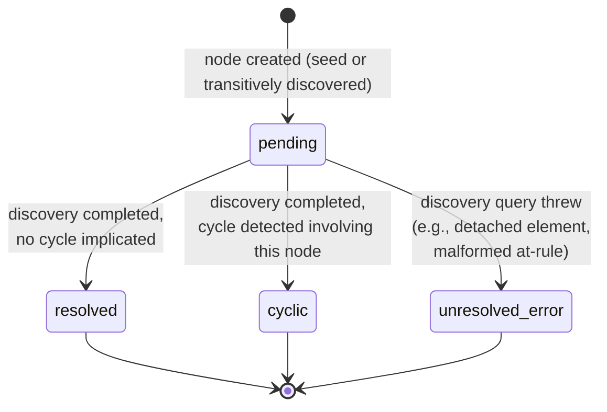
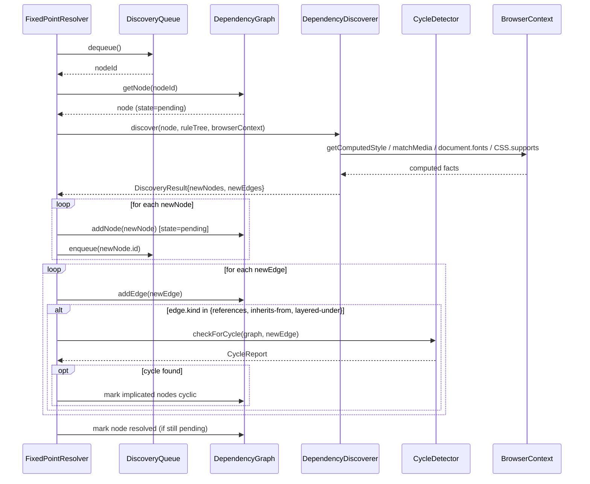

# 500 — Dependency Resolution Overview

## 1. Title

**Critical CSS Extraction Engine — Dependency Resolution Module: Fixed-Point Orchestration Design**

## 2. Version

| Field | Value |
|---|---|
| Document Version | 1.0.0 |
| Status | Draft — Phase 7 (Dependency Resolution) |
| Last Updated | 2026-07-09 |
| Owners | Core Architecture Working Group |
| Stability | Orchestration contract is stable; per-construct algorithm documents (siblings in `docs/algorithms/`) may refine discovery details without invalidating this document's control-flow model |

## 3. Purpose

[014-Dependency-Graph.md](../architecture/014-Dependency-Graph.md) established, at architecture level, that the engine builds a runtime CSS dependency graph and resolves it "iteratively until a fixed point," and it deliberately deferred two things: (1) the concrete per-construct discovery algorithms (how you actually find the `Variable` node behind a `var(--x)` reference, how you actually find the `@keyframes` block behind `animation-name`, and so on for keyframes, font faces, `@property`, counters, and layers), and (2) the concrete cycle-detection procedure. This document is the connective tissue between that architecture document and those algorithm documents. It exists to answer one question precisely: **how does the Dependency Resolver module actually drive a matched-rule-set to a fully resolved dependency graph, mechanically, step by step, and how do the six-plus per-construct algorithms plug into that mechanism without each one having to reinvent termination, ordering, or cycle-safety guarantees on its own?**

Put differently: [014-Dependency-Graph.md](../architecture/014-Dependency-Graph.md) is the *data model and system-placement* document — it tells you what a node is, what an edge is, where the Dependency Resolver sits in the pipeline, and what promises the resolved graph must satisfy when handed to the Cascade Resolver. This document is the *control-flow and orchestration* document — it tells you what function calls what other function, in what order, with what queue discipline, and it is the document a new contributor should read immediately before opening the source file that contains the actual `FixedPointResolver` implementation. Where the architecture document uses the phrase "the discovery loop" in prose, this document gives that loop a name, a state machine, an entry point, an exit condition, and a complexity budget, and it explains exactly how each of [501-CSS-Variables.md](../algorithms/501-CSS-Variables.md), [502-Keyframes.md](../algorithms/502-Keyframes.md), [503-Font-Faces.md](../algorithms/503-Font-Faces.md), [504-At-Property.md](../algorithms/504-At-Property.md), [505-Counters.md](../algorithms/505-Counters.md), [506-Cascade-Layers.md](../algorithms/506-Cascade-Layers.md), [507-Dependency-Graph-Construction.md](../algorithms/507-Dependency-Graph-Construction.md), and [508-Cycle-Detection.md](../algorithms/508-Cycle-Detection.md) are invoked as strategy plug-ins from within that loop.

A secondary purpose of this document is disambiguation-by-repetition: because [014-Dependency-Graph.md](../architecture/014-Dependency-Graph.md) Section 3.1 already warns readers not to confuse the runtime CSS dependency graph with the unrelated package-build-time dependency graph documented in `docs/architecture/007-Repository-Structure.md`, this document reiterates that warning once, briefly, in Section 7, and then never uses the bare word "dependency graph" again without a qualifier, exactly as the architecture document's own discipline requires of its descendants.

## 4. Audience

- Implementers of `packages/dependency-graph`'s `FixedPointResolver`, `DiscoveryQueue`, and `DependencyDiscoverer` components (the concrete classes named in [014-Dependency-Graph.md](../architecture/014-Dependency-Graph.md) Section 9.2's class diagram), who will write the orchestration code this document specifies.
- Authors of the six per-construct algorithm documents in `docs/algorithms/` (Phase 7 siblings), who need this document's orchestration contract as a stable interface to implement against: each per-construct document specifies *what* its discovery routine returns, not *when* or *how often* it is called — that is this document's job.
- Implementers of the Cascade Resolver and Serializer (downstream consumers of the resolved graph), who need to understand what "resolved" guarantees they can rely on before they run their own logic.
- QA and test engineers writing stress/regression fixtures for pathological dependency chains, who need to understand the resolution-budget circuit breaker's exact semantics to write meaningful "does it terminate" tests.
- Senior engineers reviewing this module's implementation for conformance with `BRIEF.md` Section 2.5's "iteratively resolve until fixed point" requirement.

Readers are assumed to already have read [014-Dependency-Graph.md](../architecture/014-Dependency-Graph.md) in full; this document does not re-explain node kinds, edge kinds, or the `member-of`/dependency distinction — it assumes that vocabulary and builds the orchestration layer on top of it.

## 5. Prerequisites

- [014-Dependency-Graph.md](../architecture/014-Dependency-Graph.md) — the data model (node/edge taxonomy), the architectural placement of the Dependency Resolver in the pipeline, and the Section 8.6/8.7 architectural contract for the fixed-point loop and cycle containment that this document operationalizes at implementation-plan level.
- [BRIEF.md](../../BRIEF.md) Section 2.5 ("Dependency Resolution") and Section 2.4's "Dependency Resolver" module-table row — the two source-of-truth passages this whole module exists to satisfy.
- `docs/architecture/006-Design-Principles.md` — Principle 1 (Browser Is Source of Truth), Principle 3 (Correctness Over Premature Optimization), Principle 5 (Determinism of Output), Principle 6 (Fail Fast, Fail Loud).
- `docs/architecture/016-Data-Flow.md` — DTO shapes for `MatchedRule`, `GraphNode`, `GraphEdge` that flow into and out of this orchestration.
- Familiarity with fixed-point iteration as a general computational pattern (as distinct from CSS-specific knowledge) — this document treats the loop as an instance of a well-known class of algorithm (monotone fixed-point computation over a discovery frontier), not a CSS-specific invention.

## 6. Related Documents

- [014-Dependency-Graph.md](../architecture/014-Dependency-Graph.md) — architecture-level data model and system placement (one level up from this document).
- [501-CSS-Variables.md](../algorithms/501-CSS-Variables.md) — per-construct discovery algorithm for custom properties, invoked as a strategy from this document's orchestration loop.
- [502-Keyframes.md](../algorithms/502-Keyframes.md) — per-construct discovery algorithm for `@keyframes`.
- [503-Font-Faces.md](../algorithms/503-Font-Faces.md) — per-construct discovery algorithm for `@font-face`, including fallback-chain resolution.
- [504-At-Property.md](../algorithms/504-At-Property.md) — per-construct discovery algorithm for `@property` registrations.
- [505-Counters.md](../algorithms/505-Counters.md) — per-construct discovery algorithm for `@counter-style` and counter usage.
- [506-Cascade-Layers.md](../algorithms/506-Cascade-Layers.md) — per-construct discovery algorithm for `@layer` membership and ordering.
- [507-Dependency-Graph-Construction.md](../algorithms/507-Dependency-Graph-Construction.md) — the concrete node/edge insertion algorithm this document's loop calls on every discovery result.
- [508-Cycle-Detection.md](../algorithms/508-Cycle-Detection.md) — the concrete cycle-detection algorithm this document's loop calls after every qualifying edge insertion.
- `docs/architecture/006-Design-Principles.md`, `docs/architecture/016-Data-Flow.md`.

## 7. Overview

Before proceeding: this document is about the **runtime CSS dependency graph** exclusively — the transient, per-extraction-run graph of CSS constructs discovered inside a target page, as defined in [014-Dependency-Graph.md](../architecture/014-Dependency-Graph.md) Section 3.1. It is not about the package-build-time graph of npm workspaces. If that distinction is unfamiliar, read Section 3.1 of that document first.

The Dependency Resolver's job begins after the Selector Matcher has produced a seed set of `MatchedRule` records — CSS rules that structurally matched at least one above-fold DOM element. None of these rules can be assumed self-contained. The Resolver's task is to compute the **closure** of that seed set under six kinds of dependency relationship (`references`, `inherits-from`, `renders-via`, `conditioned-by`, `requires-registration`, and the containment-only `member-of` fact) until no further expansion is possible — a **fixed point**.

The mechanism by which this happens is a **worklist algorithm**: a queue of "nodes whose dependencies have not yet been discovered" (the *discovery frontier*), a per-node discovery step that may enlarge the frontier, and a loop that runs until the frontier is empty. This is a well-studied pattern — the same shape used in dataflow analysis fixed points, mark-and-sweep garbage collection's reachability phase, and build-system dependency resolution — and this document deliberately borrows that framing rather than inventing CSS-specific terminology, because the correctness argument (termination, monotonicity, idempotence) is inherited for free from that general pattern once we show our specific instance satisfies its preconditions.

Three properties make this fixed point well-behaved rather than merely "hopefully terminates":

1. **Monotonicity.** Every step either adds a new node/edge to the graph or does nothing (re-discovering an already-`resolved` node is a no-op, guarded by `resolutionState`). The graph never shrinks mid-resolution. This guarantees that *if* the loop terminates, it terminates at a well-defined maximal graph, not an arbitrary snapshot.
2. **Finite frontier growth in practice, bounded worst case by policy.** The set of CSS constructs reachable from an above-fold seed set is, for any real page, small — a handful of variables, keyframes, and font faces per matched rule, not thousands. But because CSS itself does not forbid pathological or adversarial inputs (very deep `var()` chains, generated stylesheets with thousands of custom properties), the loop is not allowed to rely on "small in practice" as its only termination argument — a hard **resolution budget** (Section 9's flowchart, `BudgetCheck`) converts an unbounded worst case into a bounded, diagnosable failure, per Principle 6.
3. **Cycle safety.** Because `references`/`inherits-from`/`layered-under` edges can form true cycles (`--a: var(--b); --b: var(--a);`), the loop cannot simply "discover until no new edges appear" without also checking, incrementally, whether newly added edges close a cycle — otherwise a cyclic subgraph would never leave the `pending` state and the frontier would never empty. [508-Cycle-Detection.md](../algorithms/508-Cycle-Detection.md) supplies this check; this document specifies exactly when, in the loop, it is invoked.

This document's remaining sections work through: the precise state machine each graph node moves through (Detailed Design), where this loop sits relative to its six algorithm-document collaborators and the rest of the pipeline (Architecture), the orchestration pseudocode and its complexity (Algorithms), and the operational concerns — implementation discipline, edge cases, tradeoffs, performance, and testing — that follow from running this loop in production against arbitrary, occasionally hostile, real-world stylesheets.

## 8. Detailed Design

### 8.1 The Node State Machine

[014-Dependency-Graph.md](../architecture/014-Dependency-Graph.md) Section 8.1 defines `resolutionState: 'pending' | 'resolved' | 'cyclic' | 'unresolved-error'` as a field every node carries. This document specifies the state machine that field actually implements, because the architecture document names the states without drawing the transition diagram:



Every node is created in `pending` and every node ends the loop in exactly one of the three terminal states — `pending` is never a valid state for any node once the loop has terminated (Section 9.3's fixed-point definition depends on this). `unresolved-error` is a state this document introduces beyond the three named in the architecture document's prose, because Section 8.6 of that document lists "a discovery query throwing" as a named failure case without specifying what state the implicated node lands in; leaving it in `pending` forever would violate the "no node left pending" fixed-point definition, so this document resolves that gap by giving it its own terminal state, distinct from `cyclic`, so the Reporter can distinguish "this node's value is spec-defined-invalid due to a cycle" from "this node's value could not be determined due to an engine-internal failure" (REQ-461/462's matched/transitive/error reporting split, per [014-Dependency-Graph.md](../architecture/014-Dependency-Graph.md) Section 8.1).

### 8.2 The Discovery Frontier as an Explicit Data Structure

The "discovery queue" named informally in [014-Dependency-Graph.md](../architecture/014-Dependency-Graph.md) Section 8.5 is, in this orchestration, a concrete FIFO structure (`DiscoveryQueue`, per that document's Section 9.2 class diagram) holding node IDs, not node objects — node objects live in the `DependencyGraph`'s node map, keyed by the same deterministic IDs described in that document's Section 8.1. FIFO (rather than LIFO/stack, or priority-ordered) is a deliberate choice: it produces a breadth-first discovery order, which means that at any point mid-resolution, the frontier represents "all nodes discovered at the current depth from the seed set," which is useful both for the batched-query optimization (Section 10.1's per-wave batching, elaborated in Section 14 of this document) and for producing diagnostic traces that read, level by level, as "seed rules, then their direct dependencies, then those dependencies' dependencies," which is materially easier for a human to audit than a depth-first trace that plunges arbitrarily deep down one reference chain before backing out.

**Why FIFO over LIFO (DFS-order discovery):** a stack-based frontier would discover nodes in a depth-first order, chasing one `var()` chain to its end before examining a seed rule's second dependency. This has no correctness difference (the fixed point reached is identical — Section 8.1's monotonicity guarantees order-independence of the *result*), but it materially changes the *shape* of partial progress if the loop is interrupted (budget exceeded, error thrown): a DFS-ordered partial graph over-represents one deep chain and under-represents breadth, which is a worse diagnostic artifact when the Reporter needs to explain "how far did we get" for a `ResolutionBudgetExceededError`. BFS-ordered partial progress instead shows "we fully resolved depth 1 and 2, and got partway through depth 3," which maps intuitively onto "how transitively deep does this page's CSS get," a more actionable diagnostic.

**Alternative considered — priority queue ordered by node kind** (e.g., always fully resolve all `Variable` nodes before any `Keyframes` node, on the theory that variable chains are the likeliest source of cycles and should be isolated first): rejected because it would make discovery order depend on a per-run classification of "which kind is riskiest," which is both unnecessary (cycle detection, per [508-Cycle-Detection.md](../algorithms/508-Cycle-Detection.md), is triggered incrementally per-edge regardless of global ordering, so there is no correctness benefit) and actively harmful to determinism auditability (a priority queue reordering by kind produces a less intuitive trace than strict FIFO-by-discovery-order for a human debugging "why is this node in the graph").

### 8.3 Strategy Dispatch to Per-Construct Algorithms

The single most important structural decision in this document is that the orchestration loop itself **knows nothing about CSS**. It does not know what a `var()` is, what a `@keyframes` block is, or what cascade layer ordering means. All of that knowledge lives exclusively in the six per-construct algorithm documents, each of which is implemented as one `NodeKind`-keyed discovery routine behind a single `DependencyDiscoverer.discover(node, ruleTree, browserContext) -> DiscoveryResult` interface (named in [014-Dependency-Graph.md](../architecture/014-Dependency-Graph.md) Section 9.2). The orchestration loop's only obligation to each discovery routine is:

1. Call it exactly once per node (guaranteed by the `resolutionState != 'pending'` guard — Section 9.1's pseudocode).
2. Pass it a fully-formed `GraphNode`, the full `ruleTree` (so a `Rule`-kind discovery routine can look up candidate `Variable`/`Keyframes`/`FontFace` nodes by structural key without re-walking the CSSOM itself), and a live `browserContext` handle.
3. Take its `DiscoveryResult` (a `{ newNodes: GraphNode[], newEdges: GraphEdge[] }` pair) and feed it, unmodified, into [507-Dependency-Graph-Construction.md](../algorithms/507-Dependency-Graph-Construction.md)'s node/edge insertion procedure.

This is a **strategy pattern**, chosen specifically so that each of [501](../algorithms/501-CSS-Variables.md) through [506](../algorithms/506-Cascade-Layers.md) can be specified, implemented, tested, and evolved independently without touching this document's loop or each other's code. A `Variable` node's discovery routine ([501-CSS-Variables.md](../algorithms/501-CSS-Variables.md)) never calls into the `Keyframes` discovery routine directly, even though a `Rule` node's own discovery may produce both a `references` edge to a `Variable` node and a `renders-via` edge to a `Keyframes` node in the same call — both edges are returned in the same `DiscoveryResult` and both are inserted by the same generic insertion path, with no cross-talk between the two per-construct algorithms that produced them.

**Why not one monolithic discovery function covering all node kinds:** a single function with a large `switch` over `node.kind`, all inlined, would still technically satisfy the same interface — but it would make each of the six sibling algorithm documents describe a fragment of one shared function rather than a complete, independently testable unit, which directly conflicts with this project's phase structure (each algorithm document is written, reviewed, and can be revised independently, per the Phase 7 file list) and with Principle 3's correctness-first stance (a monolithic function invites accidental coupling — e.g., a font-face discovery bug leaking shared mutable state into the variable-discovery path). The dispatch-table approach costs one extra layer of indirection and a slightly more verbose `DiscoveryResult` merging step; that cost is accepted.

### 8.4 Why Construction and Cycle-Detection Are Interleaved, Not Phased

A naturally tempting simplification is to split this into two clean phases: Phase A, "discover everything reachable" (ignoring cycles, just chasing edges), followed by Phase B, "run cycle detection once over the completed graph." This is rejected, and the rejection is load-bearing enough to restate here even though [014-Dependency-Graph.md](../architecture/014-Dependency-Graph.md) Section 8.7 already makes the same point at the architecture level: a genuinely cyclic reference chain (`--a` → `--b` → `--a`) has **no finite "completed" state** under naive Phase-A discovery — discovering `--b`'s dependency on `--a` would, if `--a` is treated as "not yet in the graph, go discover it," re-enter a discovery call for a node already mid-discovery, either infinite-looping the call stack or (if guarded by a "currently being discovered" flag) silently producing a second, duplicate node for what should be the same logical `--a`. Interleaving cycle detection into the same loop, checked immediately after every new qualifying edge insertion (Section 9.1's pseudocode, step `for edge in discovery.newEdges`), is what allows the loop to recognize "this edge closes a cycle back to a node already in the graph" *before* attempting to re-discover that node, converting what would otherwise be an infinite recursion into a single `O(1)` graph lookup plus a bounded cycle-detection check.

### 8.5 Resolution Budget as a Distinct Safety Net From Cycle Detection

It is a common misconception (worth heading off explicitly) that cycle detection alone is a sufficient termination guarantee. It is not: a *non-cyclic* but pathologically deep reference chain (`--v0` → `--v1` → `--v2` → ... → `--v9999`, no repeats, hence no cycle) will never trip the cycle detector, yet will still perform 10,000 discovery iterations. The resolution budget (a simple iteration counter, Section 9.1's pseudocode) is an orthogonal safety net catching exactly this case — depth without repetition. Real above-fold CSS essentially never produces chains this deep (Section 14), so the budget's default is set generously (a multiple of seed-set size, not an absolute constant), making it a defensive circuit breaker against adversarial or generated inputs rather than a limit real usage is expected to approach.

## 9. Architecture

### 9.1 Placement Relative to the Pipeline and to [014-Dependency-Graph.md](../architecture/014-Dependency-Graph.md)

This document's orchestration loop *is* the `FixedPointResolver` component named in [014-Dependency-Graph.md](../architecture/014-Dependency-Graph.md) Section 9.2's class diagram; nothing here introduces a new component, this document simply specifies that component's internal control flow in the depth an architecture document intentionally does not. Its upstream and downstream collaborators (Selector Matcher, CSSOM Walker, Cascade Resolver, Reporter) are exactly as drawn in that document's Section 9.1 pipeline diagram — this document does not redraw that diagram, it only zooms into the box labeled "Dependency Resolver."

### 9.2 The Fixed-Point Loop, End to End

```mermaid
flowchart TD
    A([Seed set: MatchedRule[]<br/>from Selector Matcher]) --> B[Create Rule node per seed rule<br/>state=pending; enqueue in source order<br/>see Section 8.2 on FIFO ordering]
    B --> C{Frontier empty?}
    C -- no --> D[Dequeue next node id]
    D --> E{state == pending?}
    E -- no, already resolved via<br/>another discovery path --> C
    E -- yes --> F[Check resolution budget<br/>iterations++]
    F --> G{Budget exceeded?}
    G -- yes --> H([Throw ResolutionBudgetExceededError<br/>with partial graph + pending nodes])
    G -- no --> I["Dispatch to per-construct discoverer<br/>by node.kind<br/>(501/502/503/504/505/506)"]
    I --> J["Insert new nodes/edges<br/>via 507-Dependency-Graph-Construction"]
    J --> K{New edge is references /<br/>inherits-from / layered-under?}
    K -- yes --> L["Run 508-Cycle-Detection<br/>incrementally on this edge"]
    K -- no --> N
    L --> M{Cycle found?}
    M -- yes --> M2[Mark implicated nodes cyclic<br/>emit CyclicDependencyWarning]
    M -- no --> N[Enqueue any newly-added<br/>pending nodes]
    M2 --> N
    N --> O[Mark current node resolved<br/>if still pending]
    O --> C
    C -- yes, frontier empty --> P([Fixed point reached:<br/>every node resolved/cyclic/error])
    P --> Q[Emit DependencyGraph to<br/>Cascade Resolver + Reporter]
```

This flowchart is a refinement of [014-Dependency-Graph.md](../architecture/014-Dependency-Graph.md) Section 8.6's flowchart: that document's flowchart establishes the architectural shape (discover, check for new nodes, cycle-check, loop); this flowchart adds the concrete state-machine transitions (Section 8.1), the explicit budget-check placement, and the explicit dispatch step (Section 8.3) that the architecture document intentionally left as a single "Discover" box.

### 9.3 Definition of "Fixed Point" Used Throughout This Document

Formally, let `G_i = (N_i, E_i)` be the graph after `i` loop iterations. The loop has reached a fixed point at iteration `k` if `G_k = G_{k+1}` under the graph-equality notion that only counts node/edge *presence*, not `resolutionState` (a node changing from `pending` to `resolved` without any new node/edge appearing does not, by itself, change `G_i`'s node/edge set, but it does change whether the loop can terminate). The loop's actual termination condition — frontier empty — is a stronger, operationally checkable proxy for this: an empty frontier with no node left `pending` implies no further discovery calls are possible, which implies no further nodes/edges can appear, which implies `G_k = G_{k+1} = G_{k+2} = ...` for all future hypothetical iterations. This equivalence (empty-frontier-with-no-pending-nodes implies true fixed point) is what makes "frontier empty" a sound termination check rather than merely a convenient one, and it is the formal justification for treating the terms "fixed point reached" and "frontier empty, no pending nodes" as interchangeable throughout this document and its algorithm-document siblings.

### 9.4 Sequence Diagram — One Discovery Wave



## 10. Algorithms

### 10.1 Algorithm: Orchestrated Fixed-Point Resolution (Implementation-Level)

This restates and refines [014-Dependency-Graph.md](../architecture/014-Dependency-Graph.md) Section 10.1's algorithm at the level this document owns: explicit state transitions, explicit dispatch, explicit budget accounting.

**Problem statement.** Given a seed set of matched rules, drive the runtime CSS dependency graph to a fixed point (Section 9.3) by repeatedly dispatching discovery to the appropriate per-construct algorithm, inserting results, and checking for cycles, subject to a resolution budget.

**Inputs.**
- `seedRules: MatchedRule[]`
- `ruleTree: CSSOMRuleTree`
- `browserContext: BrowserContextHandle`
- `resolutionBudget: number` (default: `max(500, seedRules.length * 20)`, tunable per Section 13's tradeoff discussion)
- `discoverers: Map<NodeKind, DiscoveryFn>` — the dispatch table wiring in [501](../algorithms/501-CSS-Variables.md)–[506](../algorithms/506-Cascade-Layers.md)

**Outputs.** A `DependencyGraph` with every node in a terminal state, or a thrown `ResolutionBudgetExceededError` carrying the partial graph.

**Pseudocode.**

```text
function orchestrateResolution(seedRules, ruleTree, browserContext, resolutionBudget, discoverers) -> DependencyGraph:
    graph = new DependencyGraph()
    frontier = new DiscoveryQueue()  // FIFO, see 8.2

    orderedSeed = seedRules.sortedBy(r => (r.sourceStylesheetIndex, r.sourceRuleIndex))
    for rule in orderedSeed:
        node = makeRuleNode(rule, discoveredAt = 'seed', resolutionState = 'pending')
        graph.addNode(node)
        frontier.enqueue(node.id)

    iterations = 0
    while not frontier.isEmpty():
        nodeId = frontier.dequeue()
        node = graph.getNode(nodeId)
        if node.resolutionState != 'pending':
            continue                                   // 8.1: already resolved via another path

        iterations += 1
        if iterations > resolutionBudget:
            raise ResolutionBudgetExceededError(graph, graph.pendingNodes())

        discoverFn = discoverers.get(node.kind)         // 8.3: strategy dispatch
        try:
            result = discoverFn(node, ruleTree, browserContext)
        catch (err):
            node.resolutionState = 'unresolved-error'   // 8.1: distinct terminal state
            emitDiagnostic(DiscoveryErrorWarning(node, err))
            continue

        for newNode in result.newNodes:                 // -> 507-Dependency-Graph-Construction
            if not graph.hasNode(newNode.id):
                newNode.resolutionState = 'pending'
                graph.addNode(newNode)
                frontier.enqueue(newNode.id)

        for edge in result.newEdges:
            graph.addEdge(edge)
            if edge.kind in {'references', 'inherits-from', 'layered-under'}:
                report = CycleDetector.checkForCycle(graph, edge)   // -> 508-Cycle-Detection
                if report.foundCycle:
                    for id in report.nodeIds:
                        graph.getNode(id).resolutionState = 'cyclic'
                    emitDiagnostic(CyclicDependencyWarning(report))

        if node.resolutionState == 'pending':
            node.resolutionState = 'resolved'

    assert graph.pendingNodes().isEmpty()                // 9.3: fixed point invariant
    return graph
```

**Time complexity.** Identical in shape to [014-Dependency-Graph.md](../architecture/014-Dependency-Graph.md) Section 10.1's analysis: `O((S + D) * c)` where `S` is seed-set size, `D` is transitively-discovered node count, and `c` is the per-node cost of one dispatch call plus its proportional share of cycle-detection cost. This document adds one refinement the architecture document's analysis did not need: because dispatch is now an explicit table lookup (`discoverers.get(node.kind)`), that lookup itself is `O(1)` (a small fixed-size map keyed by an enum with at most ten entries per [014-Dependency-Graph.md](../architecture/014-Dependency-Graph.md) Section 8.1's node-kind table) and does not change the asymptotic bound — it is mentioned only because a naive per-kind `if/else` chain would also be `O(1)` amortized but with worse constant factor as more node kinds are added, which matters for Section 14's discussion of adding future node kinds (view transitions, scroll timelines) without degrading dispatch cost.

**Memory complexity.** `O(S + D)` for nodes, `O(E)` for edges, `O(D)` for frontier peak width — unchanged from the architecture document's bound; this document adds no new asymptotic memory cost, only the bookkeeping (`iterations` counter, `discoverers` map) which is `O(1)` and `O(number of node kinds)` respectively, both negligible.

**Failure cases.** (1) Resolution budget exceeded — thrown with the partial graph attached so the Reporter can render "how far we got" (Section 8.5). (2) A discovery call throwing — caught locally, node marked `unresolved-error`, loop continues (this is a deliberate deviation toward resilience: one bad node's discovery failure, e.g. a detached element or a malformed at-rule the browser itself chokes on, should not abort resolution of the rest of the graph, mirroring the containment philosophy already established for cycles in [014-Dependency-Graph.md](../architecture/014-Dependency-Graph.md) Section 8.7). (3) A discovery routine returning a `newNode` whose ID collides with an existing node's ID but with structurally different content (a discovery-routine bug, since IDs are supposed to be pure functions of structural key per that document's Section 8.1) — this is treated as a defensive assertion failure, not a silently-tolerated case, because silently accepting it would violate the determinism guarantee the whole ID scheme exists to provide.

**Optimization opportunities.** Batch multiple frontier nodes' `discoverFn` calls into a single browser round trip per "wave" (all currently-frontier nodes dequeued together, discovered together, results merged together, next wave computed) — this changes the loop's outer structure from "one node per iteration" to "one wave (a set of nodes) per iteration," reducing round-trip count from `O(S + D)` to `O(depth of the dependency chain)`, which for real pages is typically 2-4 (Section 14 elaborates this as the primary production-relevant optimization).

### 10.2 Algorithm: Discovery Result Merge (Idempotence Guard)

**Problem statement.** Two different frontier nodes, discovered independently (possibly in the same batched wave, per Section 10.1's optimization), may both produce a `DiscoveryResult` referencing the *same* transitively-discovered node (e.g., two different `Rule` nodes both use `var(--brand-color)`). The merge step must collapse these into one graph node without double-processing.

**Inputs.** A list of `DiscoveryResult` objects produced in the same wave.

**Outputs.** A deduplicated set of node insertions and a full (non-deduplicated — see rationale below) set of edge insertions.

**Pseudocode.**

```text
function mergeDiscoveryResults(results: DiscoveryResult[], graph: DependencyGraph, frontier: DiscoveryQueue) -> void:
    for result in results:
        for newNode in result.newNodes:
            if graph.hasNode(newNode.id):
                continue                      // idempotent: same logical node, already present
            graph.addNode(newNode)
            frontier.enqueue(newNode.id)
        for edge in result.newEdges:
            graph.addEdge(edge)               // edges are NOT deduplicated by endpoint pair alone
                                               // (see 014-Dependency-Graph.md Section 8.2:
                                               //  two edges of different kinds between the same
                                               //  pair of nodes are both meaningful)
```

**Time complexity.** `O(sum of |newNodes| + |newEdges| across all results in the wave)`, i.e., linear in the wave's total discovery output, with `O(1)` amortized dedup checks via the graph's node map.

**Memory complexity.** `O(1)` additional beyond the graph itself — this is a streaming merge, not a buffered one.

**Failure cases.** A node ID collision with differing content (Section 10.1's failure case 3, re-encountered here since this is where it is actually detected in the batched-wave variant of the loop).

**Optimization opportunities.** None beyond what is already linear; this step is not a bottleneck relative to the browser round trips that produce its inputs.

## 11. Implementation Notes

- The `discoverers` dispatch table (Section 10.1) should be constructed once per `FixedPointResolver` instantiation, not per node — it is a pure, stateless map from `NodeKind` to a discovery function reference, and re-constructing it per node would be wasted allocation for no benefit.
- Each per-construct discovery function ([501](../algorithms/501-CSS-Variables.md)–[506](../algorithms/506-Cascade-Layers.md)) must be implemented so that calling it twice on the same node (which should never happen given the `pending` guard, but defensive implementation discipline demands tolerance for it) produces an identical `DiscoveryResult` both times — this idempotence property is what makes Section 10.2's merge step's node-dedup-by-ID check sufficient rather than requiring content-diffing.
- The `unresolved-error` state (Section 8.1) must carry the original thrown error object (or a serializable summary of it) on the node itself, not merely in a side-channel diagnostic log, so that the Reporter's dependency-graph artifact (REQ-460, per [014-Dependency-Graph.md](../architecture/014-Dependency-Graph.md) Section 11) can render "this node failed to resolve, here is why" inline in the graph visualization rather than requiring cross-referencing a separate log file.
- Cycle detection ([508-Cycle-Detection.md](../algorithms/508-Cycle-Detection.md)) is invoked with the *edge*, not just the *node*, as its primary argument (Section 10.1's pseudocode: `checkForCycle(graph, edge)`) — this is a deliberate interface choice so the cycle detector can perform an incremental check (e.g., "does adding this specific edge close a path back to one of its own endpoints") rather than being forced to re-scan the whole graph on every call; the algorithm document is expected to exploit this to bound its own per-call cost well below a full graph traversal.
- Wave-batching (Section 10.1's optimization) must preserve the single-writer graph-mutation discipline already mandated by [014-Dependency-Graph.md](../architecture/014-Dependency-Graph.md) Section 11: the *querying* half of a wave (calling `browserContext` for every frontier node in the wave) may be issued as one batched `page.evaluate()`, but the *merge* half (Section 10.2) must run strictly sequentially, in deterministic order (Section 8.2's FIFO discipline), even when the underlying queries were answered in a single round trip.

## 12. Edge Cases

- **A node is discovered by two different waves' results before either wave's merge step runs**, if wave-batching is naively parallelized at the merge level rather than only at the query level (Section 11's single-writer discipline exists precisely to make this impossible by construction; this edge case is listed here as a reminder of *why* that discipline is load-bearing, not as an unresolved risk).
- **A discovery routine legitimately returns zero new nodes and zero new edges** (a `Rule` node with no custom properties, no animation, no special font, no layer membership) — the loop must still correctly transition this node from `pending` to `resolved` on an empty `DiscoveryResult`, not treat "nothing found" as an error or a stall; Section 10.1's pseudocode handles this naturally since the final `if node.resolutionState == 'pending': node.resolutionState = 'resolved'` runs unconditionally.
- **The resolution budget is exceeded on the very last node**, i.e., the frontier would have emptied on the next iteration. This is treated identically to any other budget-exceeded case (a thrown `ResolutionBudgetExceededError`) rather than special-cased to "just let it finish" — a fixed, deterministic budget is a fixed, deterministic budget, and adding a one-off "unless we're almost done" carve-out would reintroduce a nondeterminism the budget mechanism exists to eliminate (how close to "almost done" is close enough is itself an unbounded question).
- **A `Rule` node discovered transitively (not in the original seed set) is itself later found to structurally match an above-fold element too** (e.g., a `:root` rule pulled in as a `Variable`'s defining scope also happens to directly match the `<html>` element). This does not retroactively change its `discoveredAt: 'transitive'` marker — `discoveredAt` records how the node was *first* found, per [014-Dependency-Graph.md](../architecture/014-Dependency-Graph.md) Section 8.1, and is intentionally immutable once set, to keep the Reporter's matched/transitive split stable and auditable.
- **Two seed rules resolve to the same transitive dependency via different edge kinds simultaneously** (a `Rule` both `references`-and, through a separate declaration, `inherits-from` the same `Variable` node) — both edges are inserted (Section 8.2 of the architecture document: edges are not deduplicated purely by endpoint pair), and the node itself is only enqueued once (Section 10.2's dedup-by-ID).
- **A per-construct discoverer throws not because of a real failure but because a downstream algorithm document ([501](../algorithms/501-CSS-Variables.md)–[506](../algorithms/506-Cascade-Layers.md)) encounters a case its own "Failure cases" section documents as expected** (e.g., [503-Font-Faces.md](../algorithms/503-Font-Faces.md) encountering a cross-origin `@font-face` it cannot introspect) — this orchestration loop treats any thrown error identically (Section 10.1's `catch` block) regardless of whether the throwing algorithm document considers it "expected" or "unexpected"; it is each algorithm document's own responsibility to decide whether a given condition warrants throwing at all versus returning a degraded-but-valid `DiscoveryResult`, and this document intentionally does not adjudicate that per-construct policy choice.

## 13. Tradeoffs

| Decision | Why | Alternative Considered | Tradeoff Accepted |
|---|---|---|---|
| FIFO (BFS) discovery ordering over LIFO (DFS) | Produces depth-leveled partial-progress traces, better diagnostics under budget exhaustion (Section 8.2) | DFS via a stack, simpler to implement recursively | Slightly more explicit queue-management code versus a natural recursive call stack |
| Interleaved discovery + cycle-check per edge, not phased | A phased "discover everything, then cycle-check" approach cannot even terminate on a truly cyclic input (Section 8.4) | Two-phase batch design | Cycle detection's cost is paid incrementally, many small calls, rather than once, amortized — accepted because incremental is the only correct option here, not merely the faster one |
| Explicit `unresolved-error` terminal state, distinct from `cyclic` | Keeps "cascade-spec-defined cyclic value" semantically separate from "engine-internal discovery failure" for the Reporter (Section 8.1) | Collapse both into a single `cyclic`-or-failed catch-all state | One more state to test and document, in exchange for materially better diagnosability |
| Strategy-table dispatch to per-construct algorithms, rather than an inlined switch | Keeps each of [501](../algorithms/501-CSS-Variables.md)–[506](../algorithms/506-Cascade-Layers.md) independently specifiable, testable, and revisable (Section 8.3) | One monolithic discovery function | An extra layer of indirection and a `DiscoveryResult` merge convention, versus real modularity risk reduction |
| Resolution budget as iteration count, not wall-clock time | Iteration count is deterministic and reproducible across machines with different CPU speeds; wall-clock timing is not (Principle 5) | A wall-clock timeout on the whole resolution phase | Slightly less intuitive for operators used to thinking in seconds, but strictly better for reproducible CI failures |
| Default budget scaled to seed-set size (`S * 20`) rather than a flat constant | Large above-fold seed sets legitimately need proportionally more discovery iterations; a flat constant would false-positive on large, legitimate pages | A single flat constant (e.g., 1000) for all runs | Requires documenting the scaling formula so operators tuning the budget understand what "20" represents (empirically, real pages rarely exceed 3-4x seed-set size in transitive node count) |

## 14. Performance

- **CPU complexity.** As derived in Section 10.1: `O((S + D) * c)`, with `c` dominated by browser round-trip latency in the unbatched case. This is unchanged in asymptotic terms from [014-Dependency-Graph.md](../architecture/014-Dependency-Graph.md) Section 14's analysis; this document's contribution is identifying *where* the batching optimization actually plugs into the loop (Section 10.1's "wave" reframing) rather than merely asserting that batching is possible.
- **Memory complexity.** `O(S + D)` nodes, `O(E)` edges, `O(D)` frontier peak — unchanged from the architecture document, see Section 10.1.
- **Caching strategy.** Because each per-construct discovery function is required to be idempotent and side-effect-free with respect to global state (Section 11), memoizing a discovery function's result by the node's structural key across viewport passes within the same route (Mobile → Tablet → Desktop) is safe and is the single highest-value cache in this subsystem: a `Variable`/`Keyframes`/`FontFace`/`AtProperty`/`CounterStyle` node's definition does not change across viewports, only which `Rule` nodes seed the graph changes. This orchestration document is where that memoization would actually be wired in — as a cache-check wrapped around the `discoverFn` call in Section 10.1's pseudocode, keyed by `node.id`, shared across the three per-route `FixedPointResolver` invocations rather than instantiated fresh each time.
- **Parallelization opportunities.** Wave-batching (Section 10.1) is the primary lever: within one wave, every frontier node's discovery *query* can be issued as part of a single `page.evaluate()` call, collapsing what would be `O(wave size)` round trips into one. The *merge* step (Section 10.2) remains strictly sequential per Section 11's single-writer discipline. Across routes (not within one resolution run), each route's `FixedPointResolver` owns an independent graph instance and can run on a separate worker thread with zero cross-talk, consistent with `docs/architecture/015-Runtime-Model.md`'s worker-thread model.
- **Incremental execution.** The seed-driven, breadth-expanding nature of this loop (rather than whole-corpus graph construction) is itself the dominant incremental-execution property: cost tracks the above-fold seed set's transitive closure, not total page CSS size. A secondary incremental-execution opportunity specific to this orchestration layer is the per-node discovery memoization described above under Caching strategy.
- **Scalability limits.** The resolution budget (Section 8.5, Section 13) is the explicit, tunable ceiling that converts "how bad can this get" from an open question into an operator-controlled, CI-enforceable number. In the absence of the budget, the theoretical worst case is unbounded (an adversarially generated stylesheet with an arbitrarily long `var()` chain); with the budget, worst case is bounded by `resolutionBudget * c`, a number an operator can reason about directly.

## 15. Testing

- **Unit tests.** The state machine (Section 8.1) in isolation: verify every legal transition (`pending → resolved`, `pending → cyclic`, `pending → unresolved-error`) and verify no code path can leave a node in `pending` once the loop's outer `while` exits. Verify Section 10.1's budget-check fires exactly at the configured threshold, not off-by-one early or late. Verify Section 10.2's merge idempotence with a synthetic pair of `DiscoveryResult`s referencing the same node ID.
- **Integration tests.** Run the full orchestration loop against fixtures wired to real (not mocked) per-construct discoverers from [501](../algorithms/501-CSS-Variables.md)–[506](../algorithms/506-Cascade-Layers.md), verifying that the *loop's own bookkeeping* (frontier drains fully, every node terminal, correct `discoveredAt` markers) holds regardless of which specific CSS construct produced the discovery — this is the test suite's way of confirming the strategy-dispatch abstraction (Section 8.3) is actually construct-agnostic in practice, not just in interface design.
- **Visual tests.** Not owned directly by this document (owned by end-to-end rendering-parity tests per [014-Dependency-Graph.md](../architecture/014-Dependency-Graph.md) Section 15), but this document's loop is a necessary precondition for those tests to pass — a bug in wave-batching's merge ordering, for instance, would likely first surface as a visual regression before it surfaces as a unit-test failure, since the loop's own invariants (frontier empties, no node left pending) can hold even if a subtle edge got dropped during a buggy merge.
- **Stress tests.** A synthetic fixture with a 500-deep, non-cyclic `var()` chain (verifying the budget's scaling formula, Section 13, accommodates legitimate depth without false-positiving) and a fixture with a chain deliberately exceeding the budget (verifying `ResolutionBudgetExceededError` fires with a correctly populated partial graph, not a silent hang or an unhandled exception escaping the loop).
- **Regression tests.** Every bug found in production in the orchestration layer itself (as opposed to bugs in a specific per-construct algorithm, which belong to that algorithm's own document's regression suite) — e.g., a wave-batching merge race, an off-by-one in the budget counter — gains a permanent fixture plus a golden partial-or-full-graph snapshot.
- **Benchmark tests.** Compare wave-batched round-trip count against the naive one-round-trip-per-node baseline across the `fixtures/enterprise-huge/` high-fan-out variant (per [014-Dependency-Graph.md](../architecture/014-Dependency-Graph.md) Section 15), tracked over time in `benchmarks/`.

## 16. Future Work

- **Adaptive wave sizing.** Currently wave-batching (Section 10.1) is framed as "batch the whole current frontier every iteration"; a future refinement could cap wave size to avoid an unusually large single `page.evaluate()` payload on pathological pages with very wide (not deep) fan-out, trading round-trip count for per-round-trip payload size — an open profiling question pending real production telemetry.
- **Cross-viewport graph reuse**, as flagged in [014-Dependency-Graph.md](../architecture/014-Dependency-Graph.md) Future Work — this orchestration document is where such reuse would actually be implemented (skipping `orchestrateResolution`'s seed-node creation and frontier seeding for the viewport-invariant subgraph, seeding only with the current viewport's `Rule` nodes against an already-partially-populated graph). Not yet committed; requires resolving how `resolutionState` for a reused node interacts with a fresh `Rule` seed set.
- **Property-based termination proof.** As flagged in the architecture document, a property-based test (generate random, possibly cyclic, possibly deep synthetic dependency graphs; assert the loop always terminates within the budget or throws the expected error) would strengthen the current example-based stress-test coverage into something closer to a proof.
- **Priority-aware discovery ordering revisited.** Section 8.2 rejected priority-queue ordering by node kind for this phase; if a future profiling study finds that certain node kinds' discovery is disproportionately likely to be the long pole in wave-batched round trips, revisiting per-kind wave sub-batching (rather than kind-based priority) may be worth exploring without reintroducing the rejected priority-queue design.
- **Explicit backpressure for extremely wide (not deep) fan-out.** A page with one seed rule referencing hundreds of custom properties simultaneously (a design-token-heavy stylesheet) produces a very wide, shallow frontier; whether the current wave-batching approach handles this gracefully or needs explicit chunking is an open question pending a dedicated stress fixture.

## 17. References

- [014-Dependency-Graph.md](../architecture/014-Dependency-Graph.md)
- [501-CSS-Variables.md](../algorithms/501-CSS-Variables.md)
- [502-Keyframes.md](../algorithms/502-Keyframes.md)
- [503-Font-Faces.md](../algorithms/503-Font-Faces.md)
- [504-At-Property.md](../algorithms/504-At-Property.md)
- [505-Counters.md](../algorithms/505-Counters.md)
- [506-Cascade-Layers.md](../algorithms/506-Cascade-Layers.md)
- [507-Dependency-Graph-Construction.md](../algorithms/507-Dependency-Graph-Construction.md)
- [508-Cycle-Detection.md](../algorithms/508-Cycle-Detection.md)
- [BRIEF.md](../../BRIEF.md) Section 2.5, Section 2.4
- `docs/architecture/006-Design-Principles.md`
- `docs/architecture/016-Data-Flow.md`
- `docs/architecture/015-Runtime-Model.md`
- Kildall, G. (1973), "A Unified Approach to Global Program Optimization" — foundational treatment of fixed-point worklist algorithms in dataflow analysis, the general pattern this document's loop instantiates
- W3C CSS Custom Properties for Cascading Variables Module Level 1 — https://www.w3.org/TR/css-variables-1/
