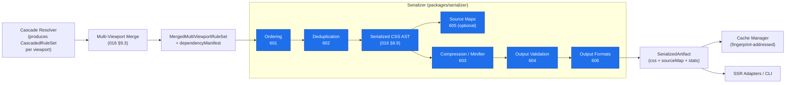
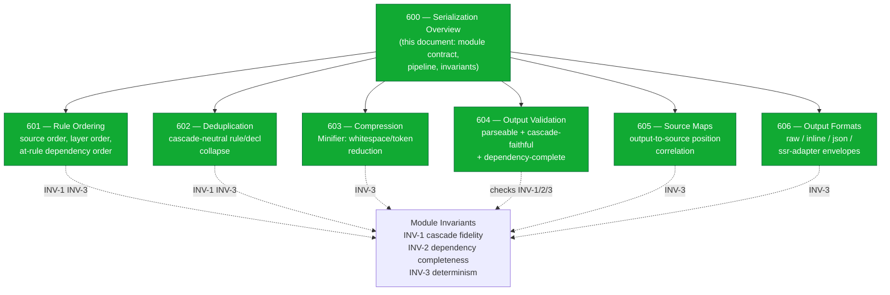
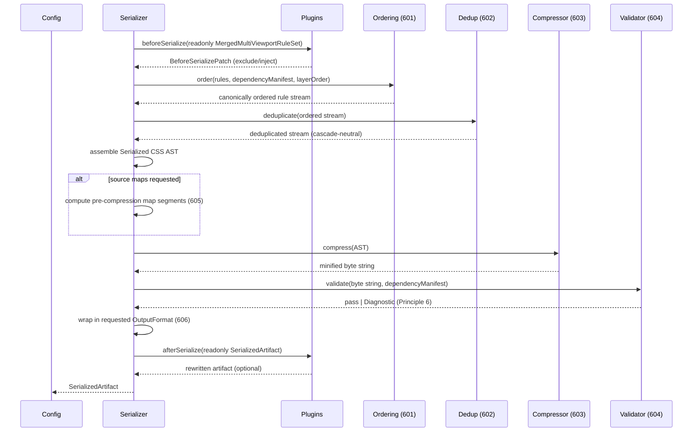

# 600 — Serialization Overview

## 1. Title

**Critical CSS Extraction Engine — Serializer Module: From Cascaded Rule Set to Valid CSS String**

## 2. Version

| Field | Value |
|---|---|
| Document Version | 1.0.0 |
| Status | Draft — Phase 8 (Serialization) |
| Last Updated | 2026-07-09 |
| Owners | Core Architecture Working Group |
| Stability | Module boundary and pipeline position stable; sub-concern specifics owned by sibling documents 601–606 (Section 6) |

## 3. Purpose

This document specifies the **Serializer module** (`packages/serializer`, per [007-Repository-Structure.md](../architecture/007-Repository-Structure.md)) at the level of its overall responsibility, its position in the extraction pipeline, and the decomposition of that responsibility into six sibling sub-concerns. The Serializer is the stage that takes the abstract, in-memory result of extraction — the resolved and cascaded matched-rule set produced by the Cascade Resolver, together with the dependency graph produced by Phase 7 — and turns it into a **valid, deterministic CSS text string** suitable for inlining into an HTML document's `<head>`, writing to a `.css` artifact, or handing to a downstream SSR adapter.

The Serializer sits between two well-defined boundaries. Upstream, it consumes the `MergedMultiViewportRuleSet` (or, in single-viewport runs, a single `CascadedRuleSet`) described in [016-Data-Flow.md](../architecture/016-Data-Flow.md) Section 8.7 and 9.3 — a structure that already carries every fact the Serializer needs (selector text, declaration text, origin, cascade-layer position, media-condition text, and dependency-graph linkage) and requires no further browser interaction to serialize. Downstream, it feeds the Minifier (`packages/serializer`'s compression sub-stage, owned by [603-Compression.md](./603-Compression.md)) and, ultimately, the Cache Manager, which persists the serialized-then-minified payload as a fingerprint-addressed artifact.

This document answers three questions with binding architectural weight:

1. **What is the Serializer's exact input and output contract**, and why is it a *pure, browser-independent, host-only* transformation — a property that lets it run during cache-hit replay when no live browser is attached at all (see [016-Data-Flow.md](../architecture/016-Data-Flow.md) Section 8.7's note on which stages can run outside a browser-attached process).
2. **What does "deterministic output" mean specifically at the serialization boundary** — a project-wide Design Principle (Principle 5 of [006-Design-Principles.md](../architecture/006-Design-Principles.md)) that the Serializer is the single most load-bearing enforcer of, because it is the last stage before the bytes that a fingerprint is computed over.
3. **How does the Serializer's monolithic-sounding job ("produce a CSS string") decompose** into six independently-designed, independently-testable sub-concerns — ordering, deduplication, compression, output validation, source maps, and output formats — each owned by a sibling document 601 through 606.

This document is scoped to the **module-level overview and the decomposition rationale**. It does not specify the rule-ordering algorithm (owned by [601-Rule-Ordering.md](./601-Rule-Ordering.md)), the deduplication algorithm (owned by [602-Deduplication.md](./602-Deduplication.md)), compression/minification (owned by [603-Compression.md](./603-Compression.md)), output validation (owned by [604-Output-Validation.md](./604-Output-Validation.md)), source-map generation (owned by [605-Source-Maps.md](./605-Source-Maps.md)), or the pluggable output-format targets (owned by [606-Output-Formats.md](./606-Output-Formats.md)). It specifies the **frame those six documents hang on**: the module's contract, its internal pipeline, and the invariants every sub-concern must preserve.

## 4. Audience

- Implementers of `packages/serializer`, who need the module's input/output contract and the sub-stage boundaries before implementing any single sub-concern.
- Authors of the sibling documents [601-Rule-Ordering.md](./601-Rule-Ordering.md) through [606-Output-Formats.md](./606-Output-Formats.md), each of whom extends this document's pipeline model with one sub-stage's detailed design and must preserve the invariants stated here.
- Implementers of `packages/cache`, who fingerprint the Serializer's (post-Minifier) output and therefore depend on the determinism guarantee this document establishes.
- Authors of SSR adapters (Phase 11, `docs/design/900-SSR-Overview.md`) and the CLI (`apps/cli`), the two primary external consumers of the Serializer's output string.
- Plugin authors using the `beforeSerialize` / `afterSerialize` lifecycle hooks ([ADR-0004-Plugin-Lifecycle-Model](../adr/ADR-0004-Plugin-Lifecycle-Model.md)), who need to understand what data those hooks see and what invariants their mutations must not break.

Readers are assumed to be senior engineers comfortable with the CSSOM `cssText` serialization model, the CSS cascade, and the project's foundational commitments in [006-Design-Principles.md](../architecture/006-Design-Principles.md). This is not an introduction to CSS or the cascade.

## 5. Prerequisites

- [006-Design-Principles.md](../architecture/006-Design-Principles.md) — Principle 1 (Browser Is Source of Truth) and, above all, Principle 5 (Determinism of Output), which the Serializer is the terminal enforcer of.
- [016-Data-Flow.md](../architecture/016-Data-Flow.md) — Sections 8.7 (`CascadedRuleSet` shape), 9.3 (`MergedMultiViewportRuleSet` shape, the Serializer's actual input), and 8.9–8.11 (the serialize→minify→cache stage sequence). This document assumes the reader knows what a `MergedRule` contains.
- [302-Rule-Tree.md](./302-Rule-Tree.md) — the `sourceOrderIndex` and `origin` fields threaded from the Rule Tree through matching and cascade into the Serializer's ordering input; this document assumes those fields exist in the shape 302 defines.
- [305-Cascade-Layers.md](./305-Cascade-Layers.md) — the `LayerOrderRegistry` and per-rule `layerScopePath` that constrain output ordering; the Serializer must not emit rules in an order that contradicts the layer order this registry records.
- Familiarity with the sibling Phase 8 documents' scope, even before they are read in full: [601-Rule-Ordering.md](./601-Rule-Ordering.md), [602-Deduplication.md](./602-Deduplication.md), [603-Compression.md](./603-Compression.md), [604-Output-Validation.md](./604-Output-Validation.md), [605-Source-Maps.md](./605-Source-Maps.md), [606-Output-Formats.md](./606-Output-Formats.md).

## 6. Related Documents

- [006-Design-Principles.md](../architecture/006-Design-Principles.md) — Principle 5 (Determinism) is the axis this entire module is organized around.
- [016-Data-Flow.md](../architecture/016-Data-Flow.md) — Sections 8.9 (Serialized CSS AST), 8.10 (Minified Output), 9.1 (full pipeline diagram) place this module in the end-to-end data flow.
- [302-Rule-Tree.md](./302-Rule-Tree.md) — the ultimate source of the `sourceOrderIndex`/`origin` ordering keys the Serializer sorts by.
- [305-Cascade-Layers.md](./305-Cascade-Layers.md) — the layer-order model that [601-Rule-Ordering.md](./601-Rule-Ordering.md) consumes to keep output order cascade-faithful.
- [601-Rule-Ordering.md](./601-Rule-Ordering.md) — sub-concern: correct ordering of the emitted rule stream.
- [602-Deduplication.md](./602-Deduplication.md) — sub-concern: removing redundant rules/declarations without changing computed style.
- [603-Compression.md](./603-Compression.md) — sub-concern: the Minifier stage (whitespace/token compression) that consumes the Serializer's AST-shaped output.
- [604-Output-Validation.md](./604-Output-Validation.md) — sub-concern: verifying the emitted string is parseable, balanced, and cascade-faithful.
- [605-Source-Maps.md](./605-Source-Maps.md) — sub-concern: mapping emitted output back to original stylesheet source positions.
- [606-Output-Formats.md](./606-Output-Formats.md) — sub-concern: the pluggable target formats (raw string, inline `<style>`, JSON envelope, SSR-adapter shape).
- [ADR-0004-Plugin-Lifecycle-Model](../adr/ADR-0004-Plugin-Lifecycle-Model.md) — the `beforeSerialize`/`afterSerialize` hook contract this module hosts.
- [014-Dependency-Graph.md](../architecture/014-Dependency-Graph.md) — the dependency graph the Serializer reads to know which `@keyframes`/`@font-face`/`@property` at-rules must be emitted alongside the style rules that reference them.

## 7. Overview

The Serializer is deceptively simple to describe in one sentence ("turn the matched-rule set into a CSS string") and deceptively hard to get right, because the string it produces is the input to a fingerprint. Two extraction runs against byte-identical page state must produce byte-identical output; if they do not, the Cache Manager's fingerprint-based reuse (Principle 8, [006-Design-Principles.md](../architecture/006-Design-Principles.md)) is unsound, CI baseline comparison (BRIEF.md Section 2.11) reports spurious diffs, and golden-file regression testing (BRIEF.md Section 2.15) becomes impossible. Determinism is therefore not a nice-to-have property of the Serializer — it is the module's defining constraint, and every internal design decision is subordinate to it.

The Serializer's input is a `MergedMultiViewportRuleSet` (or a single `CascadedRuleSet` when only one viewport is configured — a case the Serializer handles through the identical code path, per [016-Data-Flow.md](../architecture/016-Data-Flow.md) Section 12's single-viewport-as-general-case discipline). Every element of that input is already a browser-reported fact: `selectorText` and `declarationText` are the browser's own `cssText` serialization (Principle 1), `layerOrder` is the browser-resolved cascade-layer position (never hand-computed by the host), and `stylesheetIndex`/`ruleIndex` are the stable positional coordinates threaded unchanged from the Rule Tree ([302-Rule-Tree.md](./302-Rule-Tree.md)). The Serializer's job is not to *compute* any new CSS fact; it is to *arrange and encode* existing facts into text without introducing any order-, host-, or environment-dependent variation.

That arrangement-and-encoding job decomposes cleanly into six sub-concerns, each a sibling document:

1. **Ordering** ([601-Rule-Ordering.md](./601-Rule-Ordering.md)) — decide the sequence in which rules and at-rule blocks appear in the output, such that source order within an origin, cascade-layer order, and at-rule dependency order (a `@keyframes` must be emittable before or after the rule that animates with it without breaking, but `@layer` statement order must precede first layer use) are all preserved. This is the sub-concern most tightly coupled to correctness: a wrong order can silently change which declaration wins the cascade in the emitted output relative to the original page.
2. **Deduplication** ([602-Deduplication.md](./602-Deduplication.md)) — collapse rules and declarations that are provably redundant (identical selector+declaration tuples surviving the merge, or a later declaration fully shadowing an earlier one within the same rule) without altering the computed style of any above-fold element. Deduplication is *size reduction that must be cascade-neutral*, distinct from compression (which is *byte reduction that must be text-equivalent*).
3. **Compression / Minification** ([603-Compression.md](./603-Compression.md)) — remove insignificant whitespace, comments, and redundant tokens from the already-ordered, already-deduplicated rule stream. This is the "Minifier" module in BRIEF.md Section 2.4's table, positioned by [016-Data-Flow.md](../architecture/016-Data-Flow.md) Section 8.10 immediately after serialization.
4. **Output Validation** ([604-Output-Validation.md](./604-Output-Validation.md)) — verify the emitted string is syntactically valid CSS (balanced braces, terminated declarations, well-formed at-rules) and semantically faithful (every dependency the graph said was needed is present exactly once).
5. **Source Maps** ([605-Source-Maps.md](./605-Source-Maps.md)) — optionally emit a source map correlating output byte ranges back to original stylesheet positions (via the `stylesheetIndex`/`ruleIndex`/`origin` provenance carried through the pipeline), for debugging and for the visualizer (`apps/visualizer`).
6. **Output Formats** ([606-Output-Formats.md](./606-Output-Formats.md)) — wrap the final CSS string in one of several target envelopes: a bare `.css` string, an inline `<style>` element, a JSON artifact with metadata, or an SSR-adapter-specific shape.

These six are not arbitrary slices; they are chosen so that each can be independently tested, independently benchmarked, and independently plugged/toggled, and so that the correctness-critical concerns (ordering, deduplication, validation) are cleanly separated from the byte-reduction concerns (compression) and the packaging concerns (source maps, output formats). Section 9 diagrams how they compose into a single internal pipeline; Section 8 defines the module contract and the invariants they must all preserve.

## 8. Detailed Design

### 8.1 The Serializer's Input and Output Contract

**Input.** The Serializer's canonical input is one `MergedMultiViewportRuleSet` per route (its shape defined authoritatively in [016-Data-Flow.md](../architecture/016-Data-Flow.md) Section 9.3), consisting of:

- `rules: MergedRule[]` — each carrying `selectorText`, `declarationText`, `origin` (author/user/user-agent), `layerOrder`, `mediaConditionText`, `contributingViewports`, and the `stylesheetIndex`/`ruleIndex` provenance keys.
- `dependencyManifest: DependencyGraph` — the post-union, viewport-agnostic dependency graph whose non-style-rule nodes (`@keyframes`, `@font-face`, `@property`, `@counter-style`, layer declarations) enumerate the at-rules that must appear in the output alongside the style rules that reference them.
- `perViewportRetained` — retained only for diagnostics (REQ-353); the Serializer's *output-producing* path never reads it, so that a change to diagnostic granularity cannot perturb output determinism.

**Output.** The Serializer produces a `SerializedArtifact`:

```
SerializedArtifact {
  format: OutputFormat                 // which 606 target this is (raw | inline-style | json | ssr-adapter)
  css: string                          // the serialized (pre- or post-minification) CSS text
  sourceMap: SourceMap | null          // present iff source-map generation was requested (605)
  stats: SerializationStats            // rule/byte counts, dedup savings, per-viewport sizes (diagnostics)
}
```

**Purity.** The Serializer is a **pure, host-only, browser-independent** transformation: given the same `MergedMultiViewportRuleSet` and the same configuration, it produces a byte-identical `SerializedArtifact`, with no dependency on a live browser, on wall-clock time, on filesystem state, or on iteration order of any hash-map. This purity is what allows the entire serialize→minify stage to execute during a cache-*miss* while the browser is attached, and equally to be *re-executed deterministically* during golden-file test replay with no browser present at all — a property [016-Data-Flow.md](../architecture/016-Data-Flow.md) Section 8.7 relies on when it argues that cascade facts must be attached upstream (by the Cascade Resolver, while the page is live) so the Serializer never needs to re-enter the page.

### 8.2 Design Principle: What "Deterministic Output" Means Here

Determinism (Principle 5 of [006-Design-Principles.md](../architecture/006-Design-Principles.md)) is stated project-wide as "the same input produces the same output." At the serialization boundary specifically, that principle sharpens into four concrete, testable obligations, because the Serializer is where abstract structure becomes concrete bytes:

1. **Order determinism.** The sequence of rules and at-rule blocks in the output must be a pure function of the input's provenance keys (`stylesheetIndex`, `ruleIndex`, `layerOrder`), never of the order in which viewport branches completed, never of hash-map iteration order, never of the order plugins registered. This is owned in full by [601-Rule-Ordering.md](./601-Rule-Ordering.md), and it is the single largest determinism risk in the module: any place where the Serializer iterates a `Map` or `Set` and emits in iteration order is a latent nondeterminism bug unless that collection's iteration order is itself provably input-determined.

2. **Token determinism.** The exact spelling of each emitted token — property casing, color format, numeric precision, whitespace between selector combinators — must be fixed. Because the Serializer takes `selectorText`/`declarationText` verbatim from the browser's `cssText` (Principle 1), token form is *already* browser-normalized on input; the Serializer's obligation is to not *re-transform* it in any host-dependent way. Compression ([603-Compression.md](./603-Compression.md)) is the one stage permitted to rewrite tokens, and it must do so via a fixed, configuration-pinned transformation set, never a locale- or environment-sensitive one (e.g., number formatting must not depend on the host `Intl` locale).

3. **Structural determinism.** Whether two adjacent rules with identical media conditions are emitted inside one shared `@media` wrapper or two separate wrappers, whether an empty layer is emitted as an empty `@layer name {}` block or elided, whether declarations are one-per-line or joined — all such structural choices must be fixed by configuration, not left to incidental code-path variation.

4. **Environment independence.** No output byte may depend on the host OS, Node version, CPU endianness, timezone, locale, or environment variables. The one documented exception in the whole pipeline — the `createdAtLogical` timestamp in the cache envelope ([016-Data-Flow.md](../architecture/016-Data-Flow.md) Section 10.2) — lives in the cache metadata, *not* in the CSS payload the Serializer produces, precisely so the payload stays timestamp-free and therefore fingerprint-stable.

**Why determinism is the organizing principle, not merely a constraint.** The module could have been organized around, say, "minimize output size" as its primary axis. It is deliberately not. Determinism is prioritized above size because a nondeterministic-but-smaller output breaks caching, CI diffing, and golden tests — three separate load-bearing systems — whereas a deterministic-but-slightly-larger output degrades only a size metric that compression ([603-Compression.md](./603-Compression.md)) then largely recovers. This is a direct application of Principle 3 (correctness over premature optimization): the ordering algorithm in [601-Rule-Ordering.md](./601-Rule-Ordering.md), for instance, chooses a stable total order even when a "cleverer" order might pack rules into fewer `@media` wrappers, because the stable order is provably deterministic and the packing win is a compression-stage concern that must never come at determinism's expense.

### 8.3 The Internal Sub-Stage Pipeline

The Serializer is internally a fixed, linear pipeline of the six sub-concerns, executed in a specific order dictated by their data dependencies:

1. **Ordering first** ([601-Rule-Ordering.md](./601-Rule-Ordering.md)). Everything downstream assumes a canonical rule sequence exists. Ordering runs first so that deduplication, compression, and source-map generation all operate on a stream whose position is already meaningful and stable.
2. **Deduplication second** ([602-Deduplication.md](./602-Deduplication.md)). Dedup runs on the *ordered* stream because "which of two identical rules to keep" is answered by "keep the one that comes first in canonical order" — a decision that requires order to already be established. Dedup is cascade-neutral by construction (it only removes rules whose removal cannot change any element's computed style), which is why it is safe to run before validation.
3. **AST assembly third.** The ordered, deduplicated rule stream is assembled into a lightweight **Serialized CSS AST** ([016-Data-Flow.md](../architecture/016-Data-Flow.md) Section 8.9) — a structural representation (nested at-rule blocks wrapping style rules) that both the source-map generator and the compressor consume. This is not a re-parse of CSS text; it is a structural grouping of already-serialized `MergedRule` records into their at-rule wrappers per the ordering decisions from step 1.
4. **Source-map correlation (optional) fourth** ([605-Source-Maps.md](./605-Source-Maps.md)). If requested, source-map segments are computed against the AST *before* compression collapses whitespace, then adjusted for compression's byte movements — because mapping to original positions requires knowing both the pre- and post-compression byte offsets.
5. **Compression fifth** ([603-Compression.md](./603-Compression.md)). The Minifier stage collapses the AST to a minimal byte string. It runs late so that ordering and dedup (correctness concerns) are already settled and validation can check either the pre- or post-compression form.
6. **Validation sixth** ([604-Output-Validation.md](./604-Output-Validation.md)). Validation runs on the final byte string to confirm it parses, braces balance, and the dependency manifest is fully satisfied. Validation is a *gate*, not a transformation — it never mutates the output; it either passes it or raises a diagnostic (Principle 6).
7. **Format wrapping last** ([606-Output-Formats.md](./606-Output-Formats.md)). The validated string is wrapped in the requested output envelope.

The two plugin hooks bracket this pipeline: `beforeSerialize` receives a read-only view of the `MergedMultiViewportRuleSet` before step 1 and may return a patch (e.g., "exclude these selectors," "inject these rules"); `afterSerialize` receives a read-only view of the `SerializedArtifact` after step 7 and may return a rewritten string (e.g., a plugin that appends a comment banner). Per [ADR-0004-Plugin-Lifecycle-Model](../adr/ADR-0004-Plugin-Lifecycle-Model.md) and [016-Data-Flow.md](../architecture/016-Data-Flow.md) Section 11, hooks never receive mutable references to internal structures; they exchange explicit patch/decision DTOs, so that internal pipeline evolution cannot silently break the plugin API surface. A plugin that mutates output in `afterSerialize` is itself responsible for preserving determinism — a caveat surfaced to plugin authors in [606-Output-Formats.md](./606-Output-Formats.md) and [ADR-0004](../adr/ADR-0004-Plugin-Lifecycle-Model.md).

### 8.4 Invariants Every Sub-Concern Must Preserve

Regardless of which sub-concern a change touches, three module-wide invariants hold and are the contract every sibling document inherits:

- **INV-1 (Cascade fidelity).** The computed style of every above-fold element, when the emitted CSS is applied, must be identical to its computed style under the original full stylesheet set — for the viewport(s) the rule set was extracted for. No ordering, dedup, or compression transformation may change a cascade winner. [601-Rule-Ordering.md](./601-Rule-Ordering.md) and [602-Deduplication.md](./602-Deduplication.md) are the two documents most exposed to this invariant; [604-Output-Validation.md](./604-Output-Validation.md) is the document that *checks* it.
- **INV-2 (Dependency completeness).** Every at-rule the dependency manifest ([016-Data-Flow.md](../architecture/016-Data-Flow.md) Section 8.6) marks as required must appear in the output exactly once, and in a position where it is valid (e.g., `@keyframes` at a top-level or valid nested position, `@layer` statement before first layer use). Emitting a rule that animates `fade-in` without emitting the `@keyframes fade-in` is a correctness failure INV-2 forbids.
- **INV-3 (Determinism).** Byte-identical input plus identical configuration yields byte-identical output (Section 8.2). Every sub-concern must be a pure function; any use of an unordered collection must have provably input-determined iteration order.

These invariants are what make the six-way decomposition safe: because each sibling document preserves INV-1/2/3, the pipeline's composition preserves them, and the module as a whole satisfies the acceptance criteria (rendering parity, deterministic output) in BRIEF.md Section 2.18.

## 9. Architecture

### 9.1 Serializer Position in the End-to-End Pipeline



The diagram makes explicit that the Serializer is a single stage in the [016-Data-Flow.md](../architecture/016-Data-Flow.md) chain (its Stages 8.9–8.10), internally composed of the six sub-concerns. The Cascade Resolver upstream and the Cache Manager downstream are the module's two hard boundaries; everything inside the `SER` subgraph is `packages/serializer`'s own concern, decomposed across 601–606.

### 9.2 Sub-Concern Ownership Map



### 9.3 Sub-Stage Execution Sequence



## 10. Algorithms

### 10.1 Algorithm: Serializer Pipeline Orchestration

**Problem statement.** Given a `MergedMultiViewportRuleSet` and a resolved serializer configuration, orchestrate the six sub-concerns in dependency order to produce a `SerializedArtifact`, while enforcing the three module invariants and preserving determinism end to end.

**Inputs.** `input: MergedMultiViewportRuleSet`; `config: SerializerConfig` (output format, minify on/off, source-map on/off, dedup aggressiveness); `plugins: PluginHost`.

**Outputs.** `SerializedArtifact` (Section 8.1), or a raised `SerializationDiagnostic` on validation failure.

**Pseudocode.**

```text
function serialize(input, config, plugins) -> SerializedArtifact:
    # Plugin pre-hook: read-only view, returns a patch DTO (never mutates input)
    patch = plugins.runBeforeSerialize(readonlyView(input))
    rules = applyPatch(input.rules, patch)            # exclude/inject, deterministic order preserved

    # Step 1: ordering (601) — pure function of provenance keys + layer order
    ordered = orderRules(rules, input.dependencyManifest)   # see 601-Rule-Ordering.md

    # Step 2: deduplication (602) — cascade-neutral, first-in-canonical-order wins
    deduped = deduplicate(ordered)                          # see 602-Deduplication.md

    # Step 3: assemble structural AST (nest style rules inside their at-rule wrappers)
    ast = assembleAst(deduped, input.dependencyManifest)    # at-rules emitted per INV-2

    # Step 4: source maps (605), optional, computed pre-compression
    preMap = config.sourceMaps ? computeMapSegments(ast) : null

    # Step 5: compression (603)
    text = config.minify ? compress(ast) : renderPretty(ast)
    finalMap = preMap ? adjustMapForCompression(preMap, text) : null

    # Step 6: validation (604) — gate, not transform
    result = validate(text, input.dependencyManifest)       # INV-1/INV-2/INV-3 checks
    if result.isFailure:
        raise SerializationDiagnostic(result.reasons)       # Principle 6, fail-fast

    # Step 7: format wrapping (606)
    artifact = wrapFormat(text, finalMap, config.format, computeStats(input, deduped, text))

    # Plugin post-hook: read-only view, may return a rewritten artifact
    return plugins.runAfterSerialize(readonlyView(artifact)) ?? artifact
```

**Time complexity.** `O(R log R + B)` where `R` is the number of merged rules and `B` is the total output byte length. The `R log R` term is dominated by the ordering sort ([601-Rule-Ordering.md](./601-Rule-Ordering.md)); deduplication is `O(R)` amortized with a hash-keyed pass ([602-Deduplication.md](./602-Deduplication.md)); AST assembly, compression, and validation are each `O(B)` linear scans. No sub-stage exceeds `O(R log R + B)`, so the orchestration inherits that bound.

**Memory complexity.** `O(R + B)` — the rule stream plus the output byte string, with the AST a bounded-overhead structural grouping over the same rule records (no deep copy of declaration text; the AST holds references into the `MergedRule` records). Source-map generation adds `O(S)` for `S` mapping segments (bounded by rule count).

**Failure cases.** A validation failure (unbalanced braces, missing dependency, or a detected nondeterminism in a debug-mode double-serialize check) raises a `SerializationDiagnostic` rather than emitting a corrupt artifact (Principle 6). A plugin `afterSerialize` hook that returns a non-deterministic rewrite is a plugin defect, detectable in CI by the double-serialize determinism check (Section 15), not a defect this orchestration can prevent structurally.

**Optimization opportunities.** The AST assembly and source-map segment computation (steps 3–4) can share a single pass over the ordered stream. For batch runs across many routes sharing an identical dependency manifest (a shared design-system bundle), the at-rule sub-AST for shared dependencies (`@font-face`/`@keyframes`) can be assembled once and referenced, flagged in Future Work.

### 10.2 Algorithm: Determinism Self-Check (Debug/CI Mode)

**Problem statement.** Verify empirically, in CI, that the Serializer is deterministic for a given input — a guard against a latent nondeterminism bug (e.g., an accidental hash-map iteration-order dependency) slipping past review.

**Inputs.** `input: MergedMultiViewportRuleSet`; `config`; a repetition count `N` (default 3).

**Outputs.** `pass` if all `N` serializations are byte-identical; otherwise a `DeterminismViolation` diagnostic naming the first differing byte offset.

**Pseudocode.**

```text
function determinismSelfCheck(input, config, N=3) -> CheckResult:
    first = serialize(input, config, NoOpPlugins).css
    for i in 1..N-1:
        again = serialize(input, config, NoOpPlugins).css
        if again != first:
            offset = firstDifferingByteOffset(first, again)
            return DeterminismViolation(offset, first, again)
    return Pass
```

**Time complexity.** `O(N × (R log R + B))` — `N` full serializations. Cheap enough to run per-fixture in CI, since `N` is a small constant.

**Memory complexity.** `O(B)` — holds two output strings for comparison at a time.

**Failure cases.** A false *pass* is possible only if the nondeterminism is itself deterministic across a single process's repeated runs (e.g., a hash seed fixed per process but varying across processes); this is why the check must also run across separate process invocations in CI, not only in-process repetitions — flagged in [604-Output-Validation.md](./604-Output-Validation.md)'s testing section.

**Optimization opportunities.** Fingerprint (hash) each output and compare hashes rather than full strings for large `B`, reducing comparison cost to `O(B)` hashing plus `O(1)` compare; only materialize the differing-offset detail on a hash mismatch.

## 11. Implementation Notes

- The Serializer must never call back into the browser. Every fact it needs (`selectorText`, `declarationText`, `layerOrder`, `specificityVector`) is attached upstream by the Cascade Resolver while the page is live ([016-Data-Flow.md](../architecture/016-Data-Flow.md) Section 8.7). An implementer who finds themselves wanting a `page.evaluate()` inside `packages/serializer` has found a missing upstream field, not a legitimate Serializer responsibility — the fix belongs in the Cascade Resolver's output shape, not here.
- Any internal use of `Map`/`Set` whose iteration order reaches the output must be seeded from an input-determined order (e.g., insert in `sourceOrderIndex` order, or sort keys before iterating). Reviewers should treat `for (const x of someMap)` in output-producing code as a determinism red flag requiring justification, mirroring the join-key discipline [016-Data-Flow.md](../architecture/016-Data-Flow.md) Section 11 mandates for correlation keys.
- The six sub-concerns should be implemented as independently unit-testable pure functions with explicit inputs/outputs, not as methods sharing hidden mutable serializer state — this is what lets [601-Rule-Ordering.md](./601-Rule-Ordering.md) through [606-Output-Formats.md](./606-Output-Formats.md) each define and test their algorithm in isolation, and what lets the determinism self-check (Section 10.2) treat `serialize()` as a black-box pure function.
- The `beforeSerialize`/`afterSerialize` hooks must receive frozen, read-only views (`Object.freeze` on the exposed structures, or a proxy that throws on write) so that a misbehaving plugin cannot mutate internal state and silently break INV-3, consistent with [016-Data-Flow.md](../architecture/016-Data-Flow.md) Section 11's plugin-DTO discipline.
- Configuration (`SerializerConfig`) must be fully resolved (all defaults applied) before serialization begins, so that no sub-stage reads an unresolved-default value at a point where a later-resolved default could change output — a determinism hazard identical in spirit to [305-Cascade-Layers.md](./305-Cascade-Layers.md)'s insistence that layer order be fixed at first occurrence.
- Pretty-printing (`renderPretty`, the non-minified path) must itself be deterministic and is not merely a debug convenience: golden-file tests (BRIEF.md Section 2.15) may assert against the pretty form for readability, so its formatting rules (indentation width, declaration-per-line policy) must be configuration-pinned, not incidental.

## 12. Edge Cases

- **Empty rule set.** A route with no above-fold critical CSS (legitimately, or because of a zero-viewport misconfiguration per [016-Data-Flow.md](../architecture/016-Data-Flow.md) Section 12) must serialize to a well-formed empty string (or an empty `<style></style>` for the inline format), never `undefined`/`null`, and must surface a diagnostic distinguishing "legitimately empty" from "empty due to upstream failure" (Principle 6).
- **Dependency-only output.** A rule set whose only members are dependency at-rules (e.g., a `@font-face` needed by a matched rule that was itself deduplicated away) must still emit those at-rules per INV-2 — the presence of an at-rule in the output is governed by the dependency manifest, not by whether a style rule textually survived.
- **At-rule with no valid emission position.** A `@keyframes` referenced from inside a deeply nested `@supports`/`@media`/`@layer` context must be emitted at a position where it is valid (top-level, per CSS grammar `@keyframes` cannot be nested inside a style rule but may sit at stylesheet top level or inside a grouping at-rule); [601-Rule-Ordering.md](./601-Rule-Ordering.md) owns the placement decision, and this document's INV-2 owns the requirement that a valid position be found.
- **Conflicting media-condition text after merge.** Two `MergedRule`s with identical selector+declaration but distinct `mediaConditionText` must remain distinct in output (they were not merged upstream, per [016-Data-Flow.md](../architecture/016-Data-Flow.md) Section 9.3 step 2); the Serializer must not collapse them at emission time, which would defeat the merge algorithm's deliberate non-collapsing of semantically distinct media conditions.
- **Extremely large output (utility-class frameworks).** A Tailwind-scale critical set can still contain thousands of rules; the Serializer's `O(R log R + B)` bound holds, but the AST must not deep-copy declaration text (it references `MergedRule` records), consistent with [302-Rule-Tree.md](./302-Rule-Tree.md) Section 8.5's columnar-layout memory discipline for the analogous rule-count-heavy case.
- **Unicode in selectors/values.** Internationalized class names and `content` string values may contain multi-byte characters; the Serializer must treat `css` as a byte-accurate string and must not apply any locale-sensitive normalization (e.g., Unicode NFC/NFD re-normalization), because the browser's `cssText` already fixed the normalization form (Principle 1) and re-normalizing would break INV-3, echoing [016-Data-Flow.md](../architecture/016-Data-Flow.md) Section 12's note on unicode-normalized selector text.
- **Plugin `afterSerialize` injecting nondeterministic content.** A plugin appending a build timestamp comment would break INV-3; the module cannot prevent this structurally, but the CI determinism self-check (Section 10.2) will catch it, and [606-Output-Formats.md](./606-Output-Formats.md) documents the constraint for plugin authors.
- **Future CSS at-rules in the dependency manifest.** A dependency node of an unrecognized `kind` (a future at-rule type) must be emitted verbatim from its captured `declarationText` and placed conservatively at top level, with a Reporter diagnostic noting the unknown kind, rather than dropped — consistent with the open-enum, fail-safe posture of [302-Rule-Tree.md](./302-Rule-Tree.md) Section 12.

## 13. Tradeoffs

| Decision | Why | Alternative Considered | Tradeoff Accepted |
|---|---|---|---|
| Determinism prioritized above output size as the module's organizing axis | Nondeterminism breaks caching, CI diffing, and golden tests (three systems); size loss is largely recovered by compression | Optimize primarily for smallest output, accepting incidental order variation | Slightly larger pre-compression output in exchange for a hard determinism guarantee |
| Six independently-owned sub-concerns behind one orchestration | Each is independently testable, benchmarkable, and pluggable; correctness concerns cleanly separated from byte-reduction concerns | One monolithic serialize function | More documents/interfaces to maintain, versus a single hard-to-test function; the invariant contract (Section 8.4) is what keeps the composition sound |
| Serializer is strictly browser-independent (no `page.evaluate()`) | Enables cache-hit replay and golden-test replay with no browser attached; keeps the module pure | Let the Serializer query the live page for any missing fact | All cascade facts must be attached upstream by the Cascade Resolver, growing that stage's output shape ([016-Data-Flow.md](../architecture/016-Data-Flow.md) §8.7) |
| Ordering before deduplication before compression (fixed sub-stage order) | Dedup's "keep first in canonical order" needs order established; validation needs a settled byte string | Interleave dedup into ordering, or compress before dedup | A rigid pipeline order that each sibling doc must respect, versus a more flexible but harder-to-reason-about ordering |
| Plugins exchange read-only views + patch DTOs, never mutable internal structures | Sandboxing; internal evolution cannot silently break the plugin API | Expose internal structures directly to hooks for convenience | Plugin authors write a small patch DTO instead of mutating in place, in exchange for API stability and determinism safety |
| AST references `MergedRule` records rather than deep-copying declaration text | Avoids `O(B)` duplication of already-large declaration strings at utility-class scale | Materialize a fully independent AST with copied strings | AST lifetime is tied to the input rule set's lifetime, an acceptable constraint since both live only for the duration of one route's serialization |

## 14. Performance

- **CPU complexity.** `O(R log R + B)` overall (Section 10.1), dominated by the ordering sort and the linear output-byte passes. For the common page (hundreds to low thousands of critical rules) this is sub-millisecond-to-low-millisecond host CPU, negligible beside the browser-interaction cost of upstream stages ([001-Vision.md](../architecture/001-Vision.md) Section 10), so the Serializer is essentially never the pipeline bottleneck.
- **Memory complexity.** `O(R + B)` (Section 10.1). The dominant term is the output byte string; the AST is a thin structural overlay referencing `MergedRule` records, and source maps add `O(S)` bounded by rule count.
- **Caching strategy.** The Serializer's determinism is the precondition for the Cache Manager's fingerprint-based reuse: because output is a pure function of input, the fingerprint of the *input* (`MergedMultiViewportRuleSet`) can, in principle, key a cache of serialized output, letting a cache hit skip serialization entirely — though in practice the whole extraction (including serialization) is short-circuited far upstream on a cache hit ([016-Data-Flow.md](../architecture/016-Data-Flow.md) Section 14). The layer-order registry's coarse cacheability ([305-Cascade-Layers.md](./305-Cascade-Layers.md) Performance) further means the ordering sub-stage's layer-order input is often reusable across viewports.
- **Parallelization opportunities.** Serialization is per-route and per-route-independent, so many routes serialize in parallel across worker threads with zero shared mutable state (REQ-511/REQ-512). Within a single route, the sub-stages are a sequential dependency chain and are not internally parallelized (the work is too small to benefit); parallelism lives at the route-batch level, mirroring [016-Data-Flow.md](../architecture/016-Data-Flow.md) Section 14's fan-out parallelization surface one level up.
- **Incremental execution.** Because the Serializer is pure, a future incremental mode (REQ-704, Phase 9) that re-extracts only a changed viewport can re-run the merge and re-serialize only the affected route, reusing unchanged routes' cached `SerializedArtifact`s directly — the module's purity is precisely what makes that reuse sound.
- **Profiling guidance.** Profile the compression sub-stage ([603-Compression.md](./603-Compression.md)) first if serialization ever shows up in a flame graph, since token-level rewriting is the most CPU-intensive sub-concern; the ordering sort is `O(R log R)` but with a tiny constant, and dedup/validation are linear. Do not micro-optimize ordering before confirming compression is not the actual cost.
- **Scalability limits.** Governed by total output byte size `B` and rule count `R`; even at utility-class scale (`R` in the tens of thousands), the `O(R log R + B)` bound keeps single-route serialization well within CI time budgets, and route-level parallelism absorbs large route counts. There is no serialization-specific scalability ceiling below the memory ceiling that [302-Rule-Tree.md](./302-Rule-Tree.md) Section 14 already establishes for holding a large rule set in memory.

## 15. Testing

- **Unit tests.** Each sub-concern (601–606) has its own unit suite (defined in its own document); at the *overview* level, the orchestration (`serialize`, Section 10.1) is tested against synthetic `MergedMultiViewportRuleSet` inputs to verify sub-stage sequencing, invariant enforcement (a deliberately dependency-incomplete input must fail validation, not emit), and correct plugin-hook bracketing.
- **Integration tests.** End-to-end from a real extracted `MergedMultiViewportRuleSet` through to a `SerializedArtifact`, asserting that the emitted CSS, when re-applied in a browser to the same above-fold region, produces byte-identical computed styles for every critical node (INV-1, rendering parity per BRIEF.md Section 2.18) — the ultimate cascade-fidelity check that no ordering/dedup/compression step changed a cascade winner.
- **Visual tests.** Rendering-parity visual regression (per [001-Vision.md](../architecture/001-Vision.md) Section 15): apply the serialized output to each extracted viewport and diff the above-fold render against the full-CSS render, catching any INV-1 violation that a computed-style check might miss (e.g., a paint-order subtlety).
- **Determinism (self-check) tests.** The Section 10.2 self-check runs per-fixture *and* across separate process invocations in CI, asserting byte-identical output across repetitions and across processes (guarding against process-seeded hash-order nondeterminism). This is the single most important test class for this module.
- **Stress tests.** Serialize the `fixtures/enterprise-huge/` and Tailwind fixtures' full critical sets, verifying the `O(R log R + B)` time bound and `O(R + B)` memory bound hold and that the AST-references-not-copies discipline keeps peak memory bounded.
- **Regression tests.** Golden-file snapshots of serialized output for a curated fixture set; any change to serialized bytes for an unchanged fixture must be a deliberate, reviewed change (with the golden updated in the same commit), which is exactly the mechanism that would catch an accidental determinism or ordering regression introduced by a change to any sub-concern.
- **Benchmark tests.** Track serialization throughput (rules/second, bytes/second) and per-sub-stage timing across fixture sizes, establishing the empirical basis for whether the compression sub-stage ever warrants optimization (Section 14's profiling guidance).

## 16. Future Work

- **Shared-dependency AST caching across routes.** For a route manifest whose routes share a common design-system bundle, the sub-AST for shared `@font-face`/`@keyframes`/`@property` dependencies could be assembled once and referenced across routes, saving repeated assembly work — flagged here, to be resolved in coordination with Phase 10 caching (`docs/design/800-Cache-Overview.md`).
- **Streaming serialization for very large outputs.** For outputs large enough that holding the full byte string in memory is a concern (an unusual enterprise case), investigate a streaming serializer that emits the ordered rule stream chunk-by-chunk to a writable target, mirroring the windowed-construction direction flagged in [302-Rule-Tree.md](./302-Rule-Tree.md) Future Work; this would require the source-map generator ([605-Source-Maps.md](./605-Source-Maps.md)) to also support incremental segment emission.
- **Formal verification of the determinism invariant.** Investigate whether a lint/type-level check could statically flag any output-reaching iteration over an unordered collection (the INV-3 hazard in Section 11), rather than relying on the runtime self-check (Section 10.2) plus review discipline — a serialization-layer analogue of the data-flow verification idea in [016-Data-Flow.md](../architecture/016-Data-Flow.md) Future Work.
- **Open question: should the pre-minification pretty form be a first-class, separately-cached artifact** (for a "readable critical CSS" debugging affordance in `apps/visualizer`), or computed on demand? Deferred until the visualizer's requirements (Phase 13, `docs/design/1004-Visualization.md`) are concrete.
- **Open question: cross-engine serialization stability.** If a future multi-engine capability serializes rule sets extracted under different Playwright engines (Chromium vs. WebKit vs. Firefox, per [ADR-0003-Playwright-As-Browser-Abstraction](../adr/ADR-0003-Playwright-As-Browser-Abstraction.md)), `declarationText` may differ superficially across engines' `cssText` serialization; whether the Serializer should canonicalize to a single engine-independent form (rather than passing browser text through verbatim) is an open tension with Principle 1, to be revisited alongside [016-Data-Flow.md](../architecture/016-Data-Flow.md) Future Work's identical open question about the merge key.

## 17. References

- [006-Design-Principles.md](../architecture/006-Design-Principles.md)
- [016-Data-Flow.md](../architecture/016-Data-Flow.md)
- [014-Dependency-Graph.md](../architecture/014-Dependency-Graph.md)
- [302-Rule-Tree.md](./302-Rule-Tree.md)
- [305-Cascade-Layers.md](./305-Cascade-Layers.md)
- [601-Rule-Ordering.md](./601-Rule-Ordering.md)
- [602-Deduplication.md](./602-Deduplication.md)
- [603-Compression.md](./603-Compression.md)
- [604-Output-Validation.md](./604-Output-Validation.md)
- [605-Source-Maps.md](./605-Source-Maps.md)
- [606-Output-Formats.md](./606-Output-Formats.md)
- [ADR-0003-Playwright-As-Browser-Abstraction](../adr/ADR-0003-Playwright-As-Browser-Abstraction.md)
- [ADR-0004-Plugin-Lifecycle-Model](../adr/ADR-0004-Plugin-Lifecycle-Model.md)
- [001-Vision.md](../architecture/001-Vision.md)
- W3C CSS Object Model (CSSOM) — `cssText` serialization — https://www.w3.org/TR/cssom-1/
- W3C CSS Cascading and Inheritance Level 5 (cascade layers) — https://www.w3.org/TR/css-cascade-5/
- W3C CSS Syntax Module Level 3 (grammar for at-rule placement validity) — https://www.w3.org/TR/css-syntax-3/
- Source Map Revision 3 Proposal — https://sourcemaps.info/spec.html
- Project Brief, Sections 2.4 (System Modules), 2.6 (Multi-Viewport Strategy), 2.11 (CI/CD), 2.18 (Acceptance Criteria) — `BRIEF.md` at repository root.
