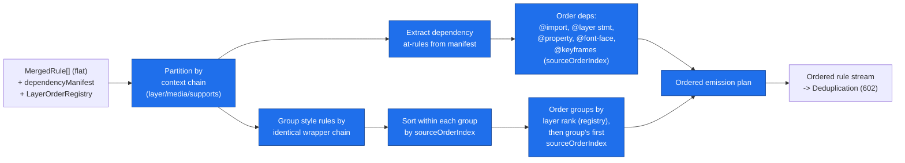
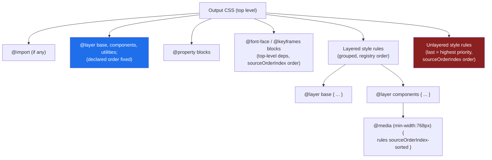
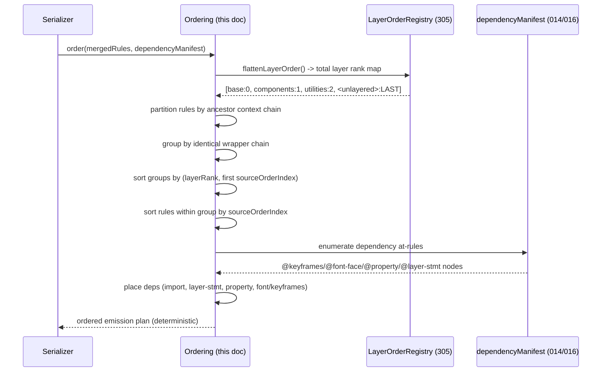

# 601 — Rule Ordering

## 1. Title

**Critical CSS Extraction Engine — Rule Ordering: Emitting the Critical Rule Stream in a Cascade-Faithful, Deterministic Sequence**

## 2. Version

| Field | Value |
|---|---|
| Document Version | 1.0.0 |
| Status | Draft — Phase 8 (Serialization) |
| Last Updated | 2026-07-09 |
| Owners | Core Architecture Working Group |
| Stability | Ordering contract stable; interaction with future streaming serialization deferred (Section 16) |

## 3. Purpose

This document specifies the **rule-ordering sub-concern** of the Serializer module ([600-Serialization-Overview.md](./600-Serialization-Overview.md), Section 8.3, step 1). It answers a single, load-bearing question: given the deduplication-eligible set of `MergedRule` records (and the at-rule dependency nodes that must accompany them), **in what exact sequence must they be emitted into the output CSS string**, such that (a) the cascade behavior of the emitted CSS is identical to that of the original page for the extracted viewport(s), (b) at-rule wrapper blocks (`@media`, `@supports`, `@layer`) remain structurally intact, (c) `@keyframes`/`@font-face`/`@property` dependency at-rules appear in positions where the rules that reference them remain valid, and (d) the sequence is a pure, deterministic function of input provenance keys.

Ordering is the correctness-critical heart of serialization. CSS is order-sensitive: when two declarations of equal specificity, equal origin, and equal cascade-layer rank both apply to an element, **the later one in source order wins**. If the Serializer emits those two rules in the wrong relative order, the emitted critical CSS produces a *different* computed style than the original page — a silent rendering-fidelity failure that no amount of downstream compression or validation of *syntax* would catch (the output would be perfectly valid CSS that happens to render wrong). This document exists to specify an ordering algorithm that provably cannot introduce such a failure.

This document is scoped to **ordering only**. It does not specify deduplication (owned by [602-Deduplication.md](./602-Deduplication.md), which consumes this document's ordered stream), compression (owned by [603-Compression.md](./603-Compression.md)), validation (owned by [604-Output-Validation.md](./604-Output-Validation.md)), source maps ([605-Source-Maps.md](./605-Source-Maps.md)), or output formats ([606-Output-Formats.md](./606-Output-Formats.md)). It consumes the layer-order model from [305-Cascade-Layers.md](./305-Cascade-Layers.md) and the `sourceOrderIndex`/`origin` provenance from [302-Rule-Tree.md](./302-Rule-Tree.md); it does not re-derive either. It positions its output as the input to deduplication per the fixed sub-stage sequence in [600-Serialization-Overview.md](./600-Serialization-Overview.md) Section 8.3.

## 4. Audience

- Implementers of `packages/serializer`'s ordering sub-stage, who need the exact ordering algorithm, its ordering keys, and its complexity characteristics.
- Author of [602-Deduplication.md](./602-Deduplication.md), whose "keep the first-in-canonical-order duplicate" rule depends on this document's total order being already established and stable.
- Author of [604-Output-Validation.md](./604-Output-Validation.md), whose cascade-fidelity check validates the property this document is responsible for preserving.
- Author of [605-Source-Maps.md](./605-Source-Maps.md), whose output byte-offset-to-source mapping is computed over the sequence this document produces.
- Senior engineers reviewing whether the ordering algorithm is provably cascade-faithful and provably deterministic.

Readers are assumed to be senior engineers who understand the CSS cascade (origin, importance, cascade layers, specificity, source order) at specification depth, the CSSOM `CSSRule` type hierarchy, and the project's determinism commitment (Principle 5 of [006-Design-Principles.md](../architecture/006-Design-Principles.md)). This is not an introduction to the cascade.

## 5. Prerequisites

- [600-Serialization-Overview.md](./600-Serialization-Overview.md) — the module contract, the fixed sub-stage pipeline, and the three module invariants (INV-1 cascade fidelity, INV-2 dependency completeness, INV-3 determinism) this document must preserve.
- [305-Cascade-Layers.md](./305-Cascade-Layers.md) — the `LayerOrderRegistry` (nested first-occurrence order tree) and the per-rule `layerScopePath`, plus the critical fact that **unlayered rules rank *after* all layered rules** for normal-importance declarations; this document's layer-order ordering key is derived directly from that registry.
- [302-Rule-Tree.md](./302-Rule-Tree.md) — the `sourceOrderIndex` (a single monotonically increasing integer reflecting depth-first document-order traversal) and `origin` (`{ stylesheetIndex, ruleIndexPath }`) that are this document's primary source-order ordering keys.
- [016-Data-Flow.md](../architecture/016-Data-Flow.md) — the `MergedRule` shape (Section 9.3) this document orders, including its `layerOrder`, `origin`, `mediaConditionText`, `stylesheetIndex`, and `ruleIndex` fields, and the `dependencyManifest` that enumerates the at-rules to co-emit.
- Familiarity with the CSS cascade sort order (CSS Cascade Level 5): origin+importance, then cascade layers, then specificity, then source order — and specifically with which of these axes are *positional in the output* (source order, layer order) versus *intrinsic to the declaration* (specificity, importance).

## 6. Related Documents

- [600-Serialization-Overview.md](./600-Serialization-Overview.md) — parent module; this document is its ordering sub-concern.
- [602-Deduplication.md](./602-Deduplication.md) — consumes this document's ordered stream; its dedup tie-break is "first in this order wins."
- [603-Compression.md](./603-Compression.md) — consumes the ordered, deduplicated stream; must not reorder rules.
- [604-Output-Validation.md](./604-Output-Validation.md) — validates the cascade-fidelity property this document preserves.
- [605-Source-Maps.md](./605-Source-Maps.md) — maps output positions (in this document's order) back to source.
- [606-Output-Formats.md](./606-Output-Formats.md) — wraps the ordered/serialized output.
- [305-Cascade-Layers.md](./305-Cascade-Layers.md) — the authoritative layer-order model this document's layer key consumes.
- [302-Rule-Tree.md](./302-Rule-Tree.md) — the `sourceOrderIndex`/`origin` source-order keys.
- [016-Data-Flow.md](../architecture/016-Data-Flow.md) — the `MergedRule`/`dependencyManifest` input shape.
- [014-Dependency-Graph.md](../architecture/014-Dependency-Graph.md) — the dependency graph whose edges tell this document which at-rules a style rule depends on (animation-name → `@keyframes`, font-family → `@font-face`, etc.).
- [006-Design-Principles.md](../architecture/006-Design-Principles.md) — Principle 1 (Browser Is Source of Truth: layer order and specificity are read, not recomputed) and Principle 5 (Determinism).

## 7. Overview

The critical rule set arriving at the Serializer is, structurally, a flat collection of `MergedRule` records plus a dependency manifest. But CSS output is not flat: it is a nested structure of at-rule blocks (`@layer`, `@media`, `@supports`) wrapping style rules, interleaved with top-level at-rules (`@keyframes`, `@font-face`, `@property`, `@import`). The ordering sub-concern's job is to take the flat collection and decide the exact linear sequence — and the exact nesting — in which it is emitted.

The governing insight is that **only two cascade axes are expressed positionally in a stylesheet, and therefore only two axes constrain output order**: source order and cascade-layer order. The other cascade axes — origin (author/user/user-agent), importance (`!important`), and specificity — are *intrinsic properties of a declaration*, resolved by the browser regardless of where the declaration physically sits in the file. The Serializer must never reorder rules in a way that changes a *positional* axis, but it is free (indeed obliged) to leave the *intrinsic* axes alone, because they travel with the declaration text itself.

This yields the central correctness rule this document enforces: **within a single cascade-layer scope and a single origin, the relative source order of any two rules must be preserved exactly.** Two rules `.a { color: red }` and `.a { color: blue }`, both unlayered, both author-origin, both equal specificity, produce `blue` on the page only because `blue` comes second; the Serializer must emit them in that same relative order, or the critical CSS renders `red`. Preserving relative source order within a scope is both necessary and sufficient for source-order fidelity — the Serializer does not need to preserve *absolute* position (gaps left by non-critical rules that were filtered out are fine), only relative order.

Layered rules add a second axis. Cascade layers ([305-Cascade-Layers.md](./305-Cascade-Layers.md)) establish that a rule in layer `base` is overridden by a rule in layer `components` regardless of source order or specificity, and that unlayered rules override all of them (for normal importance). The Serializer must emit rules grouped by their layer scope and in the layer order the `LayerOrderRegistry` recorded — but crucially, it must **preserve the browser's resolved layer order, never re-emit an `@layer` structure that changes it**. The safest, most faithful strategy (Section 8.2) is to reconstruct the same `@layer` wrapper blocks the original page had, in the same declared order, so that the browser re-computing the cascade on the critical CSS arrives at the identical layer ranking.

At-rule dependencies (`@keyframes`, `@font-face`, `@property`) add a placement concern rather than an ordering-among-style-rules concern: these at-rules are largely *order-insensitive relative to style rules* (a `@keyframes` works whether it appears before or after the rule that animates with it), but they are *position-validity-sensitive* (a `@keyframes` cannot be nested inside a style rule) and, in a few cases, *order-sensitive among themselves* (`@layer` statement order, `@property` registration before use in some engines). Section 8.4 specifies a conservative placement that satisfies all of these.

Section 8 specifies the ordering keys and the layer-reconstruction strategy; Section 9 diagrams the transformation and the nested output structure; Section 10 gives the ordering algorithm with pseudocode and complexity; the remaining sections cover implementation, edge cases, tradeoffs, performance, testing, and future work.

## 8. Detailed Design

### 8.1 The Ordering Key and the Source-Order Invariant

Every `MergedRule` carries the provenance keys threaded unchanged from the Rule Tree ([302-Rule-Tree.md](./302-Rule-Tree.md)) through matching, cascade, and merge: `stylesheetIndex`, `ruleIndex` (equivalently `ruleIndexPath`), and — reconstructable from these — a `sourceOrderIndex`, the single monotonically increasing integer that reflects depth-first, document-order traversal position across the entire stylesheet set. Because `sourceOrderIndex` is a *total order* over all rules that is *identical to the browser's document order*, sorting the critical rules by `sourceOrderIndex` reproduces exactly the relative source order they had on the page.

**The source-order invariant (a restatement of INV-1's positional half).** For any two `MergedRule`s `r1`, `r2` in the same cascade-layer scope and same origin, if `r1.sourceOrderIndex < r2.sourceOrderIndex` on the page, then `r1` must be emitted before `r2` in the output. Preserving this relation for all such pairs is necessary and sufficient to preserve source-order-determined cascade winners, because the browser re-resolving the cascade on the emitted CSS compares exactly those pairs by exactly this relation.

**Why `sourceOrderIndex` and not, say, re-sorting by specificity.** A tempting "optimization" would be to sort rules by specificity so that overriding rules always follow overridden ones, producing "cleaner" output. This is *wrong*: specificity is an intrinsic property the browser applies regardless of position, so reordering by specificity changes source order (the positional axis) while leaving specificity (the intrinsic axis) unchanged — which flips the source-order tie-break for equal-specificity pairs and silently corrupts the cascade. The Serializer must sort by the *positional* key (`sourceOrderIndex`) and let the browser re-apply the intrinsic axes, exactly as Principle 1 ([006-Design-Principles.md](../architecture/006-Design-Principles.md)) demands: the host does not recompute what the browser resolves.

### 8.2 Cascade-Layer Order: Reconstructing `@layer` Wrappers, Not Flattening

Layered rules cannot be ordered by `sourceOrderIndex` alone, because layer order overrides source order: a `base`-layer rule appearing *after* a `components`-layer rule in the file is still *overridden* by the `components` rule, the opposite of what source order would imply. The `LayerOrderRegistry` from [305-Cascade-Layers.md](./305-Cascade-Layers.md) records the correct layer order (a nested first-occurrence tree, with the unlayered sentinel ranked last = highest normal-importance priority).

**Decision: reconstruct the original `@layer` block structure in the output, rather than flatten layers away.** The Serializer emits an `@layer` statement (or block wrappers) that re-establishes the same layer order the page had, and emits each critical rule inside a wrapper for its `layerScopePath`. This means the emitted critical CSS is *itself layered*, and the browser re-resolving the cascade on it arrives at the identical layer ranking — the most faithful possible outcome.

**Why reconstruct rather than flatten.** A flattening strategy would attempt to sort all rules into a single unlayered sequence whose *source order* reproduces the layer-determined cascade winners (emit lower-priority-layer rules first, higher-priority-layer rules last, so source order alone yields the right winner). This is rejected for three reasons:

1. **It is not sound in the presence of specificity.** Layer order beats specificity: a low-specificity rule in a high-priority layer beats a high-specificity rule in a low-priority layer. A flattened, unlayered sequence *cannot* reproduce that, because in an unlayered context specificity beats source order — there is no arrangement of two unlayered rules that makes the lower-specificity one win. Flattening therefore cannot preserve INV-1 in the general case; only reconstructing the layer structure can.
2. **`!important` inverts layer order.** For `!important` declarations, the layer priority order is *reversed* (per CSS Cascade Level 5). A flattened source-order encoding would have to encode two contradictory orderings (normal reversed from important) in a single linear sequence, which is impossible; a reconstructed `@layer` structure lets the browser apply the correct inversion itself.
3. **Fidelity by construction beats fidelity by clever encoding.** Reconstructing the browser's own layer structure and letting the browser re-resolve is a direct application of Principle 1: reproduce the input structure, do not invent an equivalent-we-hope encoding. It is also simpler to validate (INV-1 check in [604-Output-Validation.md](./604-Output-Validation.md) reduces to "same layer structure → same cascade").

**The ordering key with layers.** The output order is therefore a **composite sort**: primary key is layer rank (from the `LayerOrderRegistry`'s flattened total order, with the unlayered sentinel last), secondary key is `sourceOrderIndex` within a layer scope. Rules are grouped by `layerScopePath`, each group emitted inside its reconstructed `@layer` wrapper in registry order, and within each group sorted by `sourceOrderIndex`. Unlayered rules are emitted last (matching their sentinel rank), also `sourceOrderIndex`-sorted among themselves. An `@layer name1, name2, ...;` statement is emitted first to fix the declared order deterministically even for layers whose rules were all filtered out (an empty-but-declared layer still occupies a rank, per [305-Cascade-Layers.md](./305-Cascade-Layers.md)).

### 8.3 At-Rule Wrapper Blocks: `@media` and `@supports` Kept Intact

A critical rule that lived inside `@media (min-width: 768px) { ... }` on the page must be emitted inside the same `@media` wrapper in the output, not hoisted to the top level — hoisting would change *whether* the rule applies at a given viewport, a rendering-fidelity failure distinct from cascade order. The `mediaConditionText` carried on each `MergedRule` ([016-Data-Flow.md](../architecture/016-Data-Flow.md) Section 9.3) and the at-rule context chain from [302-Rule-Tree.md](./302-Rule-Tree.md) Section 8.4 tell the Serializer which wrappers each rule needs.

**Decision: reconstruct the full at-rule context chain as nested wrappers.** For each critical rule, the Serializer reconstructs its ancestor context chain (`@layer` → `@media` → `@supports` in whatever nesting the page had, per [302-Rule-Tree.md](./302-Rule-Tree.md) Section 10.2's `ancestorContextChain`) and emits the rule inside those nested wrappers. Rules sharing an identical wrapper chain are grouped under a single shared set of wrapper blocks (rather than repeating the wrapper per rule) — a structural-grouping decision that is deterministic (grouping is by the exact `conditionText` chain, and group emission order follows the `sourceOrderIndex` of each group's first member) and is *not* the same as the media-condition collapsing the merge step explicitly avoids ([016-Data-Flow.md](../architecture/016-Data-Flow.md) Section 9.3 step 2): the Serializer never *combines distinct* conditions, it only *co-locates identical* ones.

**Why keep wrappers intact rather than inline conditions.** One could imagine flattening `@media` away by only emitting rules that apply at the extracted viewport, dropping the wrapper. This is rejected because the critical CSS may be extracted for *multiple* viewports and merged ([016-Data-Flow.md](../architecture/016-Data-Flow.md) Section 9.3), so a single merged output legitimately contains rules for different media conditions; the wrapper is what keeps each rule applying at the right viewport. Even in a single-viewport extraction, keeping the wrapper is more faithful (the rule genuinely was conditional) and costs nothing, so the wrapper is always preserved.

### 8.4 At-Rule Dependency Placement: `@keyframes`, `@font-face`, `@property`, `@import`

The dependency manifest ([016-Data-Flow.md](../architecture/016-Data-Flow.md) Section 8.6, [014-Dependency-Graph.md](../architecture/014-Dependency-Graph.md)) enumerates the non-style at-rules that must be co-emitted (INV-2). These fall into placement categories:

- **`@import`** must come *first*, before any style rule (CSS requires `@import` at the top of a stylesheet, after only `@charset` and `@layer` statements). In practice the critical CSS is typically inlined and imports are resolved/flattened upstream ([306-At-Import.md](./306-At-Import.md)), so an `@import` reaching the Serializer is rare; when present it is emitted at the very top.
- **`@layer` statement** (declaring layer order) is emitted immediately after any `@import`, before layered style rules, so the declared order is fixed before first use — mirroring the page's own statement-first pattern ([305-Cascade-Layers.md](./305-Cascade-Layers.md)).
- **`@property`** should be emitted near the top (before the style rules that use the registered custom property), because in some engines an `@property` registration affects how a custom property's value is parsed/inherited; emitting it before use is the conservative, always-valid choice.
- **`@font-face`** is order-insensitive relative to style rules (a font-family reference resolves regardless of `@font-face` position) but must sit at a valid top-level (or grouping-at-rule) position; it is emitted in a deterministic block after `@property` and before style rules.
- **`@keyframes`** is likewise order-insensitive relative to the animating rule but must be at a valid position (never nested inside a style rule); emitted alongside `@font-face` in the top dependency block.

**Ordering among dependency at-rules of the same kind.** Multiple `@keyframes` (or `@font-face`, etc.) are emitted in `sourceOrderIndex` order of their defining rule, so their relative order is deterministic and matches the page. This matters in the rare case where two `@keyframes` share a name (last definition wins, per CSS): preserving `sourceOrderIndex` order preserves that winner.

**Why a dedicated top dependency block rather than interleaving at point of use.** Emitting each `@keyframes` immediately before the first rule that references it would be equally valid CSS, but it makes placement order-dependent on *matched-rule* order (which rule referenced it first), coupling dependency placement to a concern it need not depend on and making the output more sensitive to upstream matching changes. A single deterministic dependency block, ordered by the dependencies' own `sourceOrderIndex`, is simpler to make deterministic (INV-3) and simpler to validate for completeness (INV-2: count at-rules in one place). The one exception is dependencies that are themselves scoped inside an `@layer`/`@media` context (e.g., a `@keyframes` declared inside `@media`); those are emitted inside the reconstructed wrapper, since their validity depends on that context.

## 9. Architecture

### 9.1 Ordering Transformation



### 9.2 Nested Output Structure



### 9.3 Ordering Sequence



## 10. Algorithms

### 10.1 Algorithm: Cascade-Faithful Rule Ordering

**Problem statement.** Given the critical `MergedRule[]`, the `dependencyManifest`, and the `LayerOrderRegistry`, produce a deterministic, cascade-faithful **emission plan**: a sequence of emission items (dependency at-rules and grouped, wrapper-nested style rules) such that, when serialized to text and re-parsed by a browser, the cascade winners for every above-fold element are identical to the original page's, for the extracted viewport(s).

**Inputs.** `rules: MergedRule[]`; `manifest: DependencyGraph`; `registry: LayerOrderRegistry`.

**Outputs.** `EmissionPlan` — an ordered list of `EmissionItem`s (`{kind: 'import'|'layer-stmt'|'property'|'font-face'|'keyframes'|'style-group', ...}`), each style-group carrying its wrapper chain and its `sourceOrderIndex`-sorted rules.

**Pseudocode.**

```text
function orderRules(rules, manifest, registry) -> EmissionPlan:
    # --- 1. Flatten layer order to a total rank map (305's deferred flattening) ---
    # Depth-first, sibling-order-preserving traversal of the registry tree;
    # unlayered sentinel assigned the maximum rank (emitted last, highest priority).
    layerRank = flattenLayerOrder(registry)          # Map<scopePathKey, int>, plus UNLAYERED = +inf

    # --- 2. Partition style rules by their full ancestor context chain ---
    # chainKey = deterministic string of [layerScopePath | mediaConditionText | supportsConditionText ...]
    groups = Map<chainKey, StyleGroup>()             # insertion irrelevant; sorted later
    for rule in rules:
        chain = ancestorContextChain(rule)           # 302 §10.2: [innermost ... outermost]
        key = canonicalChainKey(chain)               # pure function of condition texts + layer path
        group = groups.getOrCreate(key, () => StyleGroup(chain))
        group.rules.append(rule)

    # --- 3. Sort rules within each group by sourceOrderIndex (source-order invariant) ---
    for group in groups.values():
        group.rules.sortBy(r => r.sourceOrderIndex)  # stable; ties impossible (index is unique)
        group.firstIndex = group.rules[0].sourceOrderIndex

    # --- 4. Order the groups: primary layer rank, secondary first-member sourceOrderIndex ---
    orderedGroups = groups.values().sortBy(g => [
        layerRank.of(g.layerScopePath),              # UNLAYERED sorts last
        g.mediaAndSupportsRankTiebreak(),            # deterministic tie-break for same layer
        g.firstIndex
    ])

    # --- 5. Extract and order dependency at-rules from the manifest ---
    deps = manifest.nodes.filter(isAtRuleDependency)
    imports   = deps.filter(kind=='import').sortBy(d => d.sourceOrderIndex)
    layerStmt = buildLayerStatement(registry)        # single @layer a,b,c; in declared order
    props     = deps.filter(kind=='property').sortBy(d => d.sourceOrderIndex)
    fonts     = deps.filter(kind=='font-face').sortBy(d => d.sourceOrderIndex)
    frames    = deps.filter(kind=='keyframes').sortBy(d => d.sourceOrderIndex)
    # Context-scoped deps (e.g. @keyframes inside @media) are attached to their group instead:
    (topFonts, topFrames) = separateContextScopedDeps(fonts, frames, groups)

    # --- 6. Assemble the emission plan in canonical top-to-bottom order ---
    plan = EmissionPlan()
    plan.appendAll(imports.map(item('import')))
    if layerStmt.nonEmpty: plan.append(item('layer-stmt', layerStmt))
    plan.appendAll(props.map(item('property')))
    plan.appendAll(topFonts.map(item('font-face')))
    plan.appendAll(topFrames.map(item('keyframes')))
    for g in orderedGroups:
        plan.append(item('style-group', wrapperChain=g.chain, rules=g.rules,
                         scopedDeps=g.attachedDeps))   # deps scoped inside this wrapper
    return plan
```

**Time complexity.** `O(R log R + D log D)` where `R` is the critical style-rule count and `D` the dependency at-rule count. The dominant term is the within-group and cross-group sorting; grouping is `O(R)` with hash-keyed `getOrCreate`, chain-key construction is `O(depth)` per rule with `depth` small and bounded ([302-Rule-Tree.md](./302-Rule-Tree.md) Section 8.2), and layer flattening is `O(L)` in total layer count (`L << R`). Because every sort key is drawn from input-determined values (`sourceOrderIndex` is unique, layer rank is registry-determined), the sort is a true total order with no ties requiring a nondeterministic tie-break.

**Memory complexity.** `O(R + D)` — the groups collectively hold references to all `R` rules (no copying of declaration text; groups hold `MergedRule` references, per [600-Serialization-Overview.md](./600-Serialization-Overview.md) Section 8.3's AST-references-not-copies discipline) plus `O(G)` group structures with `G <= R`, and `O(D)` for the dependency partition.

**Failure cases.** A rule whose `layerScopePath` references a layer absent from the `LayerOrderRegistry` indicates an upstream capture bug ([305-Cascade-Layers.md](./305-Cascade-Layers.md) invariant violation) and must fail loudly as a diagnostic (Principle 6), not be silently emitted unlayered (which would change its cascade rank). A dependency at-rule with no valid emission position (e.g., a malformed manifest claiming a `@keyframes` must nest inside a style rule) is likewise a loud diagnostic, per INV-2. A `sourceOrderIndex` collision (two rules with the same index) is impossible if upstream invariants held and, if detected, is a fatal construction bug, not a runtime input error.

**Optimization opportunities.** For very large `R` (utility-class scale), the within-group sorts can be parallelized across groups (groups are independent), and the cross-group sort is over `G` group summaries (`G` typically far smaller than `R`), so it is cheap. The chain-key construction can memoize per distinct context-chain (the number of distinct chains is bounded by the small at-rule count), avoiding recomputation, mirroring [302-Rule-Tree.md](./302-Rule-Tree.md) Section 10.2's memoized chain-walk.

### 10.2 Algorithm: Layer-Order Flattening (Registry Tree → Total Rank)

**Problem statement.** Convert the nested first-occurrence `LayerOrderRegistry` tree from [305-Cascade-Layers.md](./305-Cascade-Layers.md) into a single total rank per layer scope, with the unlayered sentinel ranked last (highest normal-importance priority), so that Section 10.1 can use rank as a sort key. This is the flattening [305-Cascade-Layers.md](./305-Cascade-Layers.md) explicitly deferred to a later cascade-consuming stage.

**Inputs.** `registry: LayerOrderRegistry` (tree of `LayerNode { scopePath, siblingOrder, children }`).

**Outputs.** `Map<scopePathKey, int>` assigning each layer a total rank in ascending priority (lower = weaker), plus a reserved `UNLAYERED` rank that is strictly greater than every layer's rank.

**Pseudocode.**

```text
function flattenLayerOrder(registry) -> Map<scopePathKey, int>:
    ranks = Map()
    counter = 0
    # Depth-first, sibling-order-preserving: a sublayer ranks immediately relative to its
    # siblings, and the whole subtree of a parent ranks between that parent's siblings,
    # per CSS Cascade Level 5's nested-layer flattening.
    function visit(node):
        # assign the node's own rank before descending, so parent < its own sublayers'
        # positions relative to the parent's later siblings (spec order)
        if node is not root:
            ranks[key(node.scopePath)] = counter++
        for child in node.children.sortedBy(c => c.siblingOrder):
            visit(child)
    visit(registry.root)
    ranks[UNLAYERED] = counter    # strictly greater than every assigned layer rank
    return ranks
```

**Time complexity.** `O(L log L_sib)` where `L` is total layer count and `L_sib` the max sibling count at any node (for the per-node sibling sort); in practice `O(L)` since real layer trees are tiny (a handful of top-level layers, few sublayers). A single depth-first pass.

**Memory complexity.** `O(L)` for the rank map plus `O(depth)` recursion stack, `depth` small and bounded.

**Failure cases.** A malformed registry with a cycle in `children` (impossible by [305-Cascade-Layers.md](./305-Cascade-Layers.md)'s construction, which only ever creates tree edges) would infinite-loop; guarded by an assertion that a node is visited at most once, surfaced as a diagnostic if violated. A `siblingOrder` collision among siblings (should be impossible per registry construction) is a fatal construction bug.

**Optimization opportunities.** The flattened rank map is a pure function of the `LayerOrderRegistry`, which is itself coarsely cacheable (viewport-independent, per [305-Cascade-Layers.md](./305-Cascade-Layers.md) Performance); the flattened map can therefore be memoized per registry and reused across all viewports and even across routes sharing identical CSS assets, computing the flatten once per distinct layer structure rather than once per serialization.

## 11. Implementation Notes

- The ordering sub-stage must sort by `sourceOrderIndex` (or, equivalently, by the `(stylesheetIndex, ruleIndexPath)` lexicographic order it derives from — [302-Rule-Tree.md](./302-Rule-Tree.md) Section 8.1), never by any recomputed cascade property. A reviewer seeing a sort comparator that reads `specificity` or `origin` for *ordering* purposes (as opposed to for a diagnostic) should treat it as a likely INV-1 bug: specificity and origin are intrinsic and must not influence positional order.
- `canonicalChainKey` (Section 10.1) must be a pure, deterministic function of the *verbatim* browser-reported condition texts (`mediaConditionText`, `@supports` `conditionText`) and the interned `layerScopePath`, with no re-normalization beyond what the merge step already applied ([016-Data-Flow.md](../architecture/016-Data-Flow.md) Section 9.3 step 2). Re-normalizing condition text here risks either merging distinct conditions (a correctness bug) or splitting equivalent ones (a determinism/size bug).
- Layer flattening (Section 10.2) should be memoized against the `LayerOrderRegistry` instance, not recomputed per rule or per serialization, exploiting the registry's viewport-independent cacheability ([305-Cascade-Layers.md](./305-Cascade-Layers.md) Performance).
- The single `@layer a, b, c;` statement (Section 8.4) must be emitted in the registry's *declared* order (first-occurrence order), including layers whose rules were all filtered out of the critical set — because an empty layer still fixes the relative rank of layers declared after it ([305-Cascade-Layers.md](./305-Cascade-Layers.md) Edge Cases: "a named layer declared via statement but never given any block"). Dropping empty declared layers would change the ranks of subsequent layers.
- Grouping rules under shared wrapper blocks (Section 8.3) is a determinism-sensitive structural choice: groups must be emitted in a fully input-determined order (Section 10.1 step 4's composite sort), and rules within a group in `sourceOrderIndex` order, so that the same input always produces byte-identical nesting — the INV-3 obligation [600-Serialization-Overview.md](./600-Serialization-Overview.md) Section 8.2 places on structural determinism.
- Context-scoped dependencies (e.g., a `@keyframes` defined inside `@media`) must stay inside their reconstructed wrapper (Section 10.1 step 5's `separateContextScopedDeps`); hoisting them to the top-level dependency block could change validity or, for engine-specific `@property`-in-`@media` cases, behavior.

## 12. Edge Cases

- **A rule that appears in multiple layers across viewport branches.** After merge, a rule identical in every field *except* `layerOrder`/`layerScopePath` produces two distinct `MergedRule`s ([016-Data-Flow.md](../architecture/016-Data-Flow.md) Section 12), which this document emits in their two respective layer groups — never collapsed, because their differing layer rank is cascade-significant.
- **Unlayered rules must be emitted last.** The single most common ordering mistake would be to emit unlayered rules first (intuitively "no layer = base"). Per [305-Cascade-Layers.md](./305-Cascade-Layers.md), unlayered normal-importance rules have the *highest* priority and must be emitted *after* all `@layer` blocks so the browser ranks them last (= winning). The `UNLAYERED = +inf` rank in Section 10.2 enforces this.
- **Empty declared layer.** A `@layer components;` declared but contributing zero critical rules still appears in the emitted `@layer a, b, c;` statement (Section 8.4) so subsequent layers keep their correct relative rank; it simply has no corresponding block.
- **`@keyframes` with duplicate names.** If the critical set includes two `@keyframes spin` (a later one overriding an earlier per CSS), emitting them in `sourceOrderIndex` order (Section 8.4) preserves the last-wins outcome; emitting in any other order would change which animation definition wins.
- **Nested at-rule chains (`@layer` > `@media` > `@supports` > rule).** The full chain is reconstructed as nested wrappers ([302-Rule-Tree.md](./302-Rule-Tree.md) Section 10.2 chain), in the same nesting order the page had; the Serializer does not reorder the nesting (e.g., does not hoist `@media` outside `@layer`), because nesting order can be behaviorally significant and Principle 1 says reproduce, do not rearrange.
- **A rule inside `@supports` that the extracted browser supports.** The `@supports` wrapper is preserved even though "the browser supports it" — because a *different* consumer browser applying the critical CSS might not, and dropping the wrapper would wrongly apply the rule there. Fidelity means reproducing the conditionality, not resolving it against the extraction browser.
- **Container queries (`@container`).** Treated identically to `@media`/`@supports` as a preserved wrapper (its `conditionText` participates in `canonicalChainKey`); ordering-wise it is a wrapper, not a cascade axis, so it does not affect rule rank, only applicability — consistent with [405-Container-Queries.md](./405-Container-Queries.md)'s treatment (Phase 6).
- **Zero rules, dependencies only.** If ordering receives an empty `rules` array but a non-empty manifest (e.g., a `@font-face` needed by a rule that dedup will remove — though dedup runs *after* ordering, so this is the manifest-driven case), the emission plan contains only the dependency block; INV-2 still requires those at-rules emitted (owned jointly with [600-Serialization-Overview.md](./600-Serialization-Overview.md) Section 12).

## 13. Tradeoffs

| Decision | Why | Alternative Considered | Tradeoff Accepted |
|---|---|---|---|
| Sort by positional key (`sourceOrderIndex`) + layer rank only; never by intrinsic axes (specificity/origin) | Only positional axes are expressed by output order; the browser re-applies intrinsic axes (Principle 1). Sorting by specificity would flip source-order tie-breaks and corrupt the cascade | Sort by specificity for "cleaner" override-last output | None on correctness; output is not specificity-sorted, which is a non-goal anyway |
| Reconstruct `@layer` wrapper structure rather than flatten layers into unlayered source order | Flattening cannot reproduce layer-beats-specificity or `!important` layer inversion; reconstruction lets the browser re-resolve faithfully (INV-1) | Flatten to a single unlayered sequence encoding layer order via source order | Slightly larger output (wrapper blocks) in exchange for provable cascade fidelity |
| Keep `@media`/`@supports`/`@container` wrappers intact, never inline/drop | Merged multi-viewport output legitimately holds rules for different conditions; wrappers keep each applying at the right viewport | Drop wrappers, emit only rules applying at the extraction viewport | Larger output; but correctness across viewports and across consumer browsers requires it |
| Dependency at-rules in a single deterministic top block (except context-scoped ones) | Decouples dependency placement from matched-rule order; easier to make deterministic (INV-3) and to validate completeness (INV-2) | Interleave each `@keyframes` before its first referencing rule | Output groups deps at top rather than at point-of-use; a readability preference, not a correctness one |
| Group rules under shared wrapper blocks | Smaller, more readable output than repeating wrappers per rule; still fully deterministic | One wrapper per rule (never grouped) | Grouping logic must be provably deterministic (composite sort), a small added complexity for a real size/readability win |
| Emit `@layer` statement including empty declared layers | An empty declared layer still fixes subsequent layers' ranks ([305](./305-Cascade-Layers.md)) | Drop layers with no critical rules from the statement | A few bytes for empty layer names, in exchange for correct ranks of the layers that follow |

## 14. Performance

- **CPU complexity.** `O(R log R + D log D)` (Section 10.1), dominated by rule sorting; layer flattening is `O(L)` with `L` tiny. For a typical page (hundreds to low thousands of critical rules) this is sub-millisecond host CPU, negligible beside upstream browser interaction, so ordering is never the pipeline bottleneck (consistent with [600-Serialization-Overview.md](./600-Serialization-Overview.md) Section 14).
- **Memory complexity.** `O(R + D)` (Section 10.1), holding references (not copies) to `MergedRule`s, per the AST-references-not-copies discipline; no per-rule declaration-text duplication.
- **Caching strategy.** The flattened layer-rank map (Section 10.2) is memoizable against the viewport-independent `LayerOrderRegistry` and reusable across viewports and across routes sharing CSS assets ([305-Cascade-Layers.md](./305-Cascade-Layers.md) Performance). The full emission plan is a pure function of its inputs and is therefore implicitly covered by the Serializer-level determinism/caching story ([600-Serialization-Overview.md](./600-Serialization-Overview.md) Section 14).
- **Parallelization opportunities.** Within-group rule sorts are independent across groups and parallelizable at utility-class scale; the cross-group sort is over `G` group summaries (`G <= R`, usually much smaller). At the route-batch level, ordering is per-route-independent and parallelizes trivially (REQ-511/REQ-512), the primary parallelization surface.
- **Incremental execution.** If only one viewport changed (REQ-704, Phase 9), only the affected route's ordering re-runs; the layer-rank memoization survives unchanged (layer order is CSS-content-derived, not viewport-derived), so re-ordering pays only the `O(R log R)` re-sort, not layer re-flattening.
- **Profiling guidance.** If ordering ever shows in a flame graph, profile `canonicalChainKey` construction first (string concatenation of condition-chain texts per rule) — memoizing per distinct chain (Section 10.1 optimization) is the highest-leverage fix; the sorts themselves have tiny constants and are rarely the cost.
- **Scalability limits.** Governed by `R`; even at tens of thousands of critical rules the `O(R log R)` bound stays within CI budgets, and route-level parallelism absorbs large route counts. No ordering-specific ceiling below the memory ceiling for holding the rule set ([302-Rule-Tree.md](./302-Rule-Tree.md) Section 14).

## 15. Testing

- **Unit tests.** Order synthetic `MergedRule[]` sets against hand-derived expected emission plans covering: pure source-order preservation within a scope; layered rules ordered by registry rank with unlayered emitted last; empty declared layers retained in the `@layer` statement; `@media`/`@supports` wrapper reconstruction and shared-wrapper grouping; dependency at-rule placement (`@import` first, `@layer` statement, `@property`, `@font-face`, `@keyframes`); duplicate-name `@keyframes` last-wins order. No browser dependency, mirroring [305-Cascade-Layers.md](./305-Cascade-Layers.md) Section: unit-test-against-synthetic-events.
- **Integration tests.** Real-browser: extract a fixture with layered CSS, `@media` blocks, and animations; serialize; re-apply the ordered output in a browser and assert computed styles for every above-fold node match the full-CSS render (INV-1). A dedicated cascade-order fixture with equal-specificity same-selector rules whose only differentiator is source order verifies the source-order invariant end to end.
- **Visual tests.** Rendering-parity diff (per [001-Vision.md](../architecture/001-Vision.md) Section 15) specifically exercising layer-beats-specificity and `!important` layer-inversion fixtures, since these are the cases the reconstruct-not-flatten decision (Section 8.2) exists to get right and a computed-style check could miss a subtlety a visual diff catches.
- **Determinism tests.** Feed the same input in permuted `MergedRule[]` array order (simulating different viewport-branch completion orders) and assert byte-identical emission plans — the concrete INV-3 property, analogous to [016-Data-Flow.md](../architecture/016-Data-Flow.md) Section 15's merge-order-invariance test, applied to ordering.
- **Stress tests.** Order the `fixtures/enterprise-huge/` and Tailwind critical sets; verify the `O(R log R)` bound holds and memory stays bounded (references, not copies). Include a fixture with many distinct layers and deep nesting to exercise layer flattening at scale.
- **Regression tests.** Any bug where a rule was emitted in the wrong order (wrong cascade winner in output) gains a permanent golden-emission-plan fixture; layer-ordering bugs are high-severity because a subtly wrong cascade winner "looks plausible" ([305-Cascade-Layers.md](./305-Cascade-Layers.md) Testing makes the same point for capture-time layer bugs).
- **Benchmark tests.** Track ordering throughput (rules/second) and `canonicalChainKey` cost across fixture sizes, to catch a regression from `O(R log R)` toward an accidental `O(R^2)` (e.g., from an un-memoized per-rule chain-walk or a comparator recomputing derived keys).

## 16. Future Work

- **Streaming emission order.** A future streaming serializer ([600-Serialization-Overview.md](./600-Serialization-Overview.md) Future Work) would need ordering to emit its plan incrementally rather than materializing the full plan first; because the plan is a strict total order, chunked emission in that order is possible, but the top dependency block (which must precede style rules) forces a two-pass or buffered-header approach — an open design point deferred to that work.
- **Smarter wrapper grouping across the shared-dependency boundary.** Investigate whether context-scoped dependencies (Section 8.4) and their consuming style groups can share wrapper emission more aggressively without risking validity — a size optimization flagged for coordination with [603-Compression.md](./603-Compression.md), since some of this overlaps with what compression could collapse.
- **Open question: should layer-rank flattening live here or be promoted to a shared utility** consumed by both this document and the future full Cascade Resolver ([305-Cascade-Layers.md](./305-Cascade-Layers.md) forward-references a Cascade Resolver that also needs the flattened order)? Sharing risks coupling serialization to cascade-resolution internals (a Principle 4 tension), but duplicating the flattening risks the two drifting; to be resolved when the Cascade Resolver document is authored.
- **Open question: cross-engine layer-order stability.** If multi-engine extraction ([ADR-0003-Playwright-As-Browser-Abstraction](../adr/ADR-0003-Playwright-As-Browser-Abstraction.md)) ever produces `LayerOrderRegistry` structures that differ across engines for the same CSS (unexpected, but the specification's shadow-DOM/constructable-stylesheet interactions were still stabilizing per [305-Cascade-Layers.md](./305-Cascade-Layers.md) Future Work), the ordering algorithm would need a defined reconciliation; currently it trusts a single-engine registry.
- **Research: proving cascade fidelity mechanically.** Investigate whether the source-order + layer-rank ordering can be accompanied by a machine-checkable proof obligation (e.g., a property test asserting that for every equal-specificity same-scope pair, output order equals `sourceOrderIndex` order), a stronger guarantee than example-based tests, complementing [604-Output-Validation.md](./604-Output-Validation.md)'s runtime cascade-fidelity check.

## 17. References

- [600-Serialization-Overview.md](./600-Serialization-Overview.md)
- [602-Deduplication.md](./602-Deduplication.md)
- [603-Compression.md](./603-Compression.md)
- [604-Output-Validation.md](./604-Output-Validation.md)
- [605-Source-Maps.md](./605-Source-Maps.md)
- [606-Output-Formats.md](./606-Output-Formats.md)
- [305-Cascade-Layers.md](./305-Cascade-Layers.md)
- [302-Rule-Tree.md](./302-Rule-Tree.md)
- [016-Data-Flow.md](../architecture/016-Data-Flow.md)
- [014-Dependency-Graph.md](../architecture/014-Dependency-Graph.md)
- [006-Design-Principles.md](../architecture/006-Design-Principles.md)
- [405-Container-Queries.md](./405-Container-Queries.md) (Phase 6)
- [001-Vision.md](../architecture/001-Vision.md)
- [ADR-0003-Playwright-As-Browser-Abstraction](../adr/ADR-0003-Playwright-As-Browser-Abstraction.md)
- W3C CSS Cascading and Inheritance Level 5 — cascade sort order, cascade layers, `!important` layer inversion — https://www.w3.org/TR/css-cascade-5/
- W3C CSS Object Model (CSSOM) — `CSSLayerBlockRule`, `CSSLayerStatementRule`, `CSSMediaRule`, `CSSSupportsRule` — https://www.w3.org/TR/cssom-1/
- W3C CSS Syntax Module Level 3 — at-rule placement validity (`@import`/`@charset` ordering) — https://www.w3.org/TR/css-syntax-3/
- W3C CSS Animations — `@keyframes` name resolution and last-definition-wins — https://www.w3.org/TR/css-animations-1/
