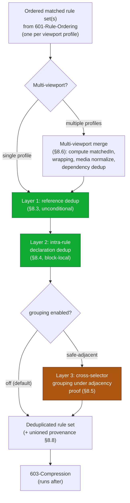
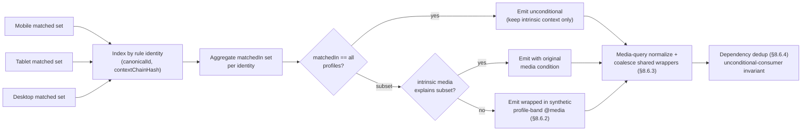
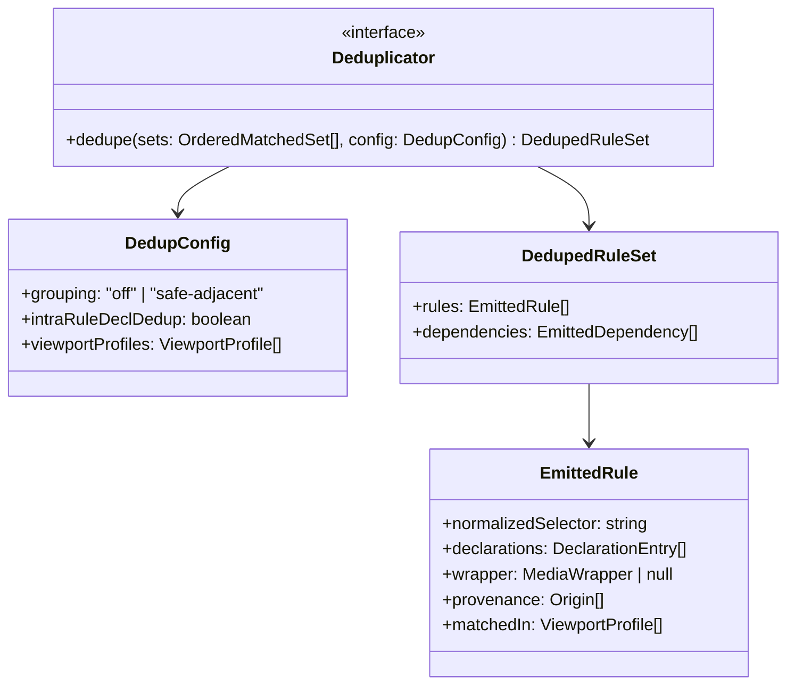

# 602 — Deduplication

## 1. Title

**Critical CSS Extraction Engine — Output Deduplication: Collapsing Redundant Rules and Declarations Across Nodes, Selectors, and Multi-Viewport Merges**

## 2. Version

| Field | Value |
|---|---|
| Document Version | 1.0.0 |
| Status | Draft — Phase 8 (Serialization) |
| Last Updated | 2026-07-09 |
| Owners | Serialization Working Group |
| Stability | Core dedup contract stable; multi-viewport merge normalization heuristics (Section 8.6) tunable behind config |

## 3. Purpose

This document specifies the **Deduplication stage** of the Serializer (`Serializer` module, BRIEF.md §2.4), the transformation that runs after rule ordering (`../design/601-Rule-Ordering.md`, forward reference) and before minification/compression (`../design/603-Compression.md`, forward reference) in the Phase 8 serialization pipeline. The stage takes the ordered, matched rule set — the subset of the Rule Tree (`../design/302-Rule-Tree.md`) that the Selector Matcher and Dependency Resolver determined is required to render above-the-fold content — and collapses redundancy that would otherwise bloat the emitted critical CSS payload without changing what the browser renders.

Deduplication in this engine addresses three distinct classes of redundancy, each with different correctness constraints:

1. **Multi-node identical-rule redundancy.** The same `RuleRecord` (same `sourceOrderIndex`, same stylesheet, same declaration block) is legitimately matched by *multiple* above-fold elements. A rule `.btn { color: red }` that matches twelve buttons on the page must appear in the output exactly **once**, not twelve times. This is the most common and most trivially safe form of dedup: it is deduplication of *references to one canonical rule*, not deduplication of *two rules that happen to look alike*.

2. **Cross-selector declaration redundancy.** Two structurally distinct rules with different selectors carry byte-identical declaration blocks (e.g., `.card` and `.panel` both declare exactly `{ padding: 16px; border-radius: 8px }`). Whether these may be merged into a grouped selector (`.card, .panel { ... }`) is **not** unconditionally safe — it depends on cascade context, source order relative to intervening rules, and `!important` interactions. This document specifies the conservative conditions under which such merging is semantics-preserving and, critically, when it must be refused.

3. **Multi-viewport merge redundancy (BRIEF.md §2.6).** The engine extracts critical CSS independently for Mobile, Tablet, and Desktop viewport profiles (BRIEF.md §2.3 item 3, §2.6). The same rule frequently appears in the matched set of two or three of those independent extractions. The merged multi-viewport output must collapse these into a single emission with **correct media-query wrapping** — a rule matched under all three profiles is emitted unconditionally, while a rule matched only under Mobile must be emitted wrapped in the Mobile media condition, never unconditionally (which would leak mobile-only styling onto desktop).

The binding thesis of this document, stated up front, is that **deduplication must be semantics-preserving under the CSS cascade, and a "duplicate" observed under different cascade contexts is not truly a duplicate.** Two identical-looking declaration blocks that sit at different specificity levels, in different cascade layers, under different media conditions, or separated by an intervening rule that would change the winner of the cascade, are *not* interchangeable, and collapsing them can silently change rendering. This document specifies dedup as a fundamentally *conservative* transformation: it eliminates only redundancy it can prove is invisible to the rendered result, and it declines every opportunity it cannot prove safe.

This document does **not** specify: how rules are ordered (owned by `../design/601-Rule-Ordering.md`), how whitespace/comments/values are compressed (owned by `../design/603-Compression.md`), how the final output is validated for correctness (owned by `../design/604-Output-Validation.md`, forward reference), or how the matched rule set was produced (owned by Phase 6/7). It specifies the dedup transformation itself: its identity model, its safety conditions, and the multi-viewport merge algorithm.

## 4. Audience

- Implementers of the Serializer (`packages/serializer`, per [007-Repository-Structure.md](../architecture/007-Repository-Structure.md)), who implement this stage between rule ordering and compression.
- Implementers of the multi-viewport extraction orchestration (BRIEF.md §2.6), who invoke the merge path defined in Section 8.6 and must understand its media-query-wrapping contract.
- Authors of `../design/601-Rule-Ordering.md` (forward reference), whose canonical ordering guarantee this document depends on as a precondition, and `../design/603-Compression.md` (forward reference), which consumes this stage's output.
- Authors of `../design/604-Output-Validation.md` (forward reference), whose rendering-parity validation is the safety net that catches any dedup that violated the semantics-preservation contract.
- Senior engineers evaluating whether the engine's conservative dedup posture (correctness over payload size) is correctly calibrated for enterprise CI use.

Readers are assumed to be senior engineers comfortable with the CSS cascade (origin, specificity, source order, `!important`, cascade layers), with the CSSOM `CSSRule` hierarchy, and with the project's determinism commitments in [006-Design-Principles.md](../architecture/006-Design-Principles.md). This is not an introduction to the cascade.

## 5. Prerequisites

- [006-Design-Principles.md](../architecture/006-Design-Principles.md) — Principle 3 (No premature optimization / correctness over payload size) and Principle 5 (Determinism of Output) directly govern this stage's refusal-to-merge posture and its stable output ordering.
- [302-Rule-Tree.md](../design/302-Rule-Tree.md) — the `RuleRecord` schema (`id`, `selectorText`, `declarationBlock`, `sourceOrderIndex`, `atRuleContextId`, `origin`) is the input unit this stage deduplicates; the `atRuleContextId` → `parentContextId` chain (Section 8.4 of that document) is the basis for the cascade-context distinction that makes two look-alike rules non-duplicates.
- `../design/600-Serialization-Overview.md` (forward reference) — the Phase 8 pipeline overview that places this stage between ordering (601) and compression (603).
- `../design/601-Rule-Ordering.md` (forward reference) — establishes the canonical total order over matched rules that this stage assumes as input; dedup preserves that order.
- Familiarity with the CSS Cascade specification (CSS Cascading and Inheritance Level 5), particularly cascade layers and the interaction of specificity with source order.

## 6. Related Documents

- [006-Design-Principles.md](../architecture/006-Design-Principles.md) — Principles 3 and 5
- [302-Rule-Tree.md](../design/302-Rule-Tree.md) — input schema; `AtRuleContext` chain as cascade-context source of truth
- `../design/600-Serialization-Overview.md` (forward reference) — Phase 8 pipeline context
- `../design/601-Rule-Ordering.md` (forward reference) — **runs before this stage**; provides canonical order
- `../design/603-Compression.md` (forward reference) — **runs after this stage**; consumes deduplicated rule set (see Section 8.7 for the ordering rationale)
- `../design/604-Output-Validation.md` (forward reference) — rendering-parity validation that backstops dedup safety
- `../design/605-Source-Maps.md` (forward reference) — source maps must survive dedup: a deduplicated rule's provenance must still map back to all originating `origin` coordinates (Section 8.8)
- `../design/606-Output-Formats.md` (forward reference) — output-format emitters consume the deduplicated set
- `../design/303-Media-Rules.md` (forward reference) — media condition normalization semantics referenced by the multi-viewport merge (Section 8.6)
- [ADR-0001-Browser-Is-Source-of-Truth](../adr/ADR-0001-Browser-Is-Source-of-Truth.md)

## 7. Overview

By the time control reaches this stage, the pipeline holds an **ordered matched rule set**: a list of `RuleRecord`s (or references to them) that Phase 6/7 determined are required, sorted into canonical cascade order by `../design/601-Rule-Ordering.md`. Two properties of this input are load-bearing. First, the set may contain the *same* `RuleRecord` more than once, because the matched set is accumulated per-element and multiple above-fold elements can match the same rule; the naive accumulation therefore carries duplicate references. Second — in the multi-viewport case — the pipeline actually holds *three* such ordered sets (one per viewport profile), each independently produced, and the merge that unifies them is where the majority of interesting dedup work happens.

Deduplication proceeds in three conceptual layers, from safest to least safe:

- **Reference dedup (Section 8.3):** collapse repeated references to the *same canonical rule identity* into one. This is unconditionally safe because it changes nothing about the cascade — a rule emitted once versus twice-in-a-row is rendered identically, and reference dedup is exactly "emit each canonical rule at most once." This is the bulk of realized savings and carries zero correctness risk.
- **Declaration-level dedup within a rule (Section 8.4):** within a single rule's declaration block, a later declaration of the same property with the same importance overrides an earlier one (intra-rule cascade: last-wins). The engine may drop the shadowed earlier declaration. This is safe *within one block* because intra-block precedence is unambiguous.
- **Cross-selector grouping (Section 8.5):** merge two distinct rules with identical declaration blocks into one grouped-selector rule. This is the *unsafe-by-default* layer, permitted only under the strict conditions of Section 8.5, and disabled entirely unless explicitly proven safe.

The multi-viewport merge (Section 8.6) is orthogonal to these three layers and composes with them: it first identifies which viewport profiles each canonical rule was matched under, then decides the media-query wrapping for each, then applies reference dedup across the union.

The chapter is organized as follows: Section 8 specifies the rule-identity model, the three dedup layers, the multi-viewport merge, the ordering relationship with compression, and source-map preservation. Section 9 diagrams the stage and the merge. Section 10 gives pseudocode and complexity for identity hashing and the merge. Sections 11 onward cover implementation notes, edge cases, tradeoffs, performance, testing, and future work.

## 8. Detailed Design

### 8.1 What "Duplicate" Means Here — and What It Does Not

The word "duplicate" is dangerously overloaded in a CSS context. This document uses three precise terms:

- **Identical reference.** Two entries in the matched set that point at the *same* `RuleRecord` (same `id` per [302-Rule-Tree.md](../design/302-Rule-Tree.md) §8.1 — a stable identifier derived from `(sourceStylesheetId, ruleIndexPath)`). These are the same rule; emitting it twice is pure waste. Collapsing them is unconditionally safe.
- **Structural twin.** Two *different* `RuleRecord`s (different `id`) whose `selectorText` and/or `declarationBlock` happen to be byte-identical or semantically equal. These are NOT the same rule. Whether they can be collapsed depends entirely on cascade context (Section 8.5). They are frequently *not* safely collapsible.
- **Cascade-context-distinct look-alikes.** Two rules with identical declaration blocks but sitting in different cascade contexts — different `@layer`, different specificity of selector, different `@media`/`@supports` conditions, or separated in source order by an intervening rule that overrides one but not the other. These look like duplicates to a naive textual comparison and are the single largest correctness hazard in this stage. **They are not duplicates and must not be collapsed.**

The engine's rule-identity model (Section 8.2) exists precisely to make these three cases mechanically distinguishable, so that dedup can aggressively collapse identical references while refusing to touch cascade-context-distinct look-alikes.

### 8.2 The Rule Identity Model

Deduplication operates over a **rule identity hash** computed for each candidate rule. Two rules are dedup-eligible only if their identity hashes are equal, and the identity hash deliberately incorporates every dimension of the cascade context that could make two textually similar rules behave differently. The identity tuple is:

| Component | Source | Why it is part of identity |
|---|---|---|
| `canonicalId` | `RuleRecord.id` ([302](../design/302-Rule-Tree.md) §8.1) | Distinguishes "same rule" (reference dedup) from "structural twin" |
| `normalizedSelector` | `selectorText`, normalized (Section 8.5.1) | Two rules with different selectors are never the *same* rule |
| `declarationHash` | Order-sensitive hash of `DeclarationEntry[]` (property, value, `important`) | The payload; differing declarations are never duplicates |
| `contextChainHash` | Hash of the ancestor `AtRuleContext` chain ([302](../design/302-Rule-Tree.md) §10.2) — the ordered list of enclosing `@media`/`@supports`/`@layer`/`@container` conditions | **A rule under `@media (min-width:768px)` is not the same as an identical rule under no media condition, nor one under a different condition** |
| `layerAssignment` | Cascade layer membership (from the context chain, resolved per `../design/305-Cascade-Layers.md`) | Identical declarations in different layers resolve differently in the cascade |

Reference dedup (Section 8.3) keys on `canonicalId` alone. Cross-selector grouping (Section 8.5) keys on `(declarationHash, contextChainHash, layerAssignment)` and additionally requires the source-order adjacency proof of Section 8.5.2. The multi-viewport merge (Section 8.6) uses `(canonicalId, contextChainHash)` and, separately, tracks the *set of viewport profiles* each identity was matched under.

**Why an order-sensitive `declarationHash`.** Declaration order within a block is cascade-significant (`{ color: red; color: blue }` renders blue). A hash that ignored declaration order would incorrectly equate two blocks that render differently. The hash therefore serializes declarations in their `DeclarationEntry[]` order (which [302](../design/302-Rule-Tree.md) §8.1 preserves deliberately) including the `important` flag per entry, then hashes the resulting canonical string.

**Why include the full context chain, not just the immediate context.** A rule inside `@layer base { @media (min-width:768px) { ... } }` differs from one inside `@media (min-width:768px)` alone (no layer) even though the *immediate* media condition is identical, because the layer changes cascade precedence. Hashing the full walked chain (innermost-first, per [302](../design/302-Rule-Tree.md) §10.2) captures this.

### 8.3 Layer 1 — Reference Deduplication (Unconditionally Safe)

The matched set arrives with repeated references to the same canonical rule because matching is accumulated per above-fold element. Reference dedup collapses these:

- Group all matched-set entries by `canonicalId`.
- Emit each `canonicalId` exactly once, at the position dictated by canonical order (`../design/601-Rule-Ordering.md`) — specifically the position of its (single) `sourceOrderIndex`, since all references to one canonical rule share one `sourceOrderIndex`.
- Union the *provenance* metadata (which elements matched it, which viewport profiles — Section 8.6) so that reporting and source maps (Section 8.8) retain the complete match evidence even though the rule text is emitted once.

This is safe with zero conditions because the CSS cascade is invariant to emitting a rule once versus emitting the byte-identical rule twice consecutively (the second is fully shadowed by being identical to the first at the same everything). The only observable difference is payload size — which is exactly what we want to reduce. Reference dedup typically accounts for the large majority of realized byte savings in this stage, because real pages match popular utility/component rules from dozens of elements.

### 8.4 Layer 2 — Intra-Rule Declaration Deduplication (Safe Within a Block)

Within a single rule's declaration block, the cascade resolves conflicting declarations of the same property by "last wins" (adjusted for `!important`: an `!important` declaration beats a non-important one regardless of order, and among same-importance declarations the last wins). A block emitted by a build tool may legitimately contain `{ color: red; background: white; color: blue }` — here the first `color: red` is fully shadowed by `color: blue` and can be dropped, yielding `{ background: white; color: blue }` with identical rendering.

The engine applies this **only within a single canonical block** where precedence is unambiguous, and applies it conservatively:

- For each property name, keep only the *winning* declaration per intra-block cascade (`!important` wins over non-important; among equal importance, the last-declared wins), dropping shadowed earlier declarations of the same property.
- **Refuse** when the property is one where multiple declarations of the "same" property are intentionally not redundant — most importantly the **custom-property / fallback double-declaration pattern** (`{ display: flex; display: grid }` used as a progressive-enhancement fallback: an older engine that does not understand `grid` will discard that declaration and fall back to `flex`). Dropping the "shadowed" `flex` here would break the intended fallback. The engine therefore does **not** dedup declarations where the two values differ *and* either value is not universally supported — because the double-declaration is a deliberate feature-detection pattern, not redundancy. When in doubt, keep both. This is a direct application of Principle 3 (correctness over premature optimization).

Because reliably distinguishing "redundant" from "fallback" double-declarations requires knowledge the engine does not want to hardcode (a fallback support matrix), the safe default is: only drop an earlier same-property declaration when its value is **byte-identical** to a later one (pure redundancy, `{ color: red; color: red }`) OR the property is on a small allowlist of properties with no meaningful fallback-pattern usage. Value-differing same-property declarations are preserved untouched by default.

### 8.5 Layer 3 — Cross-Selector Grouping (Unsafe by Default; Proven-Safe Only)

This is the layer where a naive implementation silently breaks pages. Two structural twins `.card { padding:16px }` and `.panel { padding:16px }` *look* mergeable into `.card, .panel { padding:16px }`, and doing so saves bytes. But it is safe only under strict conditions.

#### 8.5.1 Selector Normalization

Before comparison, selectors are normalized for whitespace and casing only where CSS guarantees insignificance (e.g., combinator whitespace `a>b` vs `a > b` is equivalent; but attribute-value casing and class-name casing are significant and are NOT normalized). The engine performs **no** selector re-parsing or re-writing (consistent with ADR-0002, No Custom Selector Parser): normalization is limited to browser-verifiable-equivalent whitespace collapse around combinators, and even this is conservative. Two selectors are treated as equal only if they normalize identically.

#### 8.5.2 The Adjacency / Cascade-Safety Proof

Grouping `.card` and `.panel` into one rule *moves* one of them in source order to sit next to the other. This is safe **only if that move cannot change the cascade outcome for any property, for any element, at any specificity.** The engine requires ALL of the following before grouping two structural twins A and B:

1. **Identical declaration blocks** (`declarationHash` equal) — including `!important` flags.
2. **Identical cascade context** (`contextChainHash` and `layerAssignment` equal) — same media/supports/container conditions, same layer. Two twins in different layers or different media contexts are never grouped.
3. **No intervening conflicting rule.** Between A's and B's positions in canonical order, there must be no rule R such that R declares a property also declared by A/B, and R could match an element that A or B matches, at a specificity/order relationship that R currently wins or loses relative to A or B. Concretely: moving B up to A (or A down to B) must not cause B's declarations to cross over R in source order for any shared property. Proving this in general is expensive and requires reasoning about which elements match all three selectors; the engine's **default is to require that A and B are already adjacent in canonical order with no intervening rule that shares any declared property**, which is a cheap, sufficient (if not necessary) condition.
4. **Same origin and specificity class** — grouping must not merge an author-origin rule with a user/UA-origin rule, and the grouped selector's specificity is per-selector (each selector in a group retains its own specificity), so this is naturally preserved; the check exists to reject pathological inputs.

Because condition 3's general form is costly and the sufficient adjacency condition is restrictive, **cross-selector grouping is disabled by default** (`grouping: 'off'`) and, when enabled (`grouping: 'safe-adjacent'`), applies only under the adjacency-based sufficient condition. A future `grouping: 'aggressive'` mode (Future Work) would require the full cascade-safety proof and is not specified here. This posture reflects Principle 3: the byte savings from grouping structural twins are modest relative to reference dedup (Section 8.3), and the correctness risk is high, so the engine declines the optimization unless it is cheaply provable.

### 8.6 Multi-Viewport Merge (BRIEF.md §2.6)

The engine extracts critical CSS independently for each configured viewport profile (Mobile, Tablet, Desktop). Each extraction produces its own ordered matched set. The merge unifies them into one output. Three sub-problems: identical-rule dedup across profiles, media-query normalization, and dependency dedup.

#### 8.6.1 Per-Profile Match Sets and the Applicability Question

For each canonical rule identity, the merge computes the **set of profiles under which it was matched**: `matchedIn ⊆ {mobile, tablet, desktop}`. Crucially, a rule's *own* `@media` context (from its `contextChainHash`) is distinct from *which viewport profile's extraction matched it*. A rule with no media condition that matches under all three profiles is genuinely unconditional. A rule already wrapped in `@media (max-width:600px)` will only ever be matched under the Mobile profile — its `matchedIn` will be `{mobile}` *because* its own media condition only holds at mobile widths, and its emission must retain that original media wrapping.

#### 8.6.2 Media-Query Wrapping Decision

The wrapping decision for each canonical identity is:

- **Matched in all profiles, no viewport-specific reason to restrict** → emit **unconditionally** (no added wrapper), preserving only the rule's *own* intrinsic at-rule context. Emitting it three times, once per profile-specific media wrapper, would be wrong (bloat and redundancy) and emitting it under one profile's wrapper only would be wrong (it would vanish at other widths).
- **Matched in a strict subset of profiles** → the rule is required only at those viewport ranges. If the rule *already carries* its own intrinsic media condition that explains the subset (the `@media (max-width:600px)` case above), emit it with its original condition unchanged — no synthetic wrapper is added, because the browser's own media evaluation already produces the correct per-viewport behavior. If the rule has *no* intrinsic media condition but was matched only under, say, Mobile (e.g., because the element it matched is only above-the-fold at mobile widths due to layout differences), the engine wraps it in a **synthetic media query** corresponding to the profile's width band (e.g., `@media (max-width: <mobile-max>) { ... }`), so that the rule does not leak onto viewports where it was not validated as needed.
- The synthetic-wrapper case is the subtle one and is applied **only** when the merge cannot attribute the subset-match to an intrinsic media condition. Its width band is derived from the profile definitions (BRIEF.md §2.4 Device Profiles / `../design/105-Viewport-Manager.md`).

#### 8.6.3 Media-Query Normalization

When rules from different profiles carry equivalent-but-textually-different media conditions, or when synthetic wrappers are generated, the merge normalizes media text so that logically identical conditions collapse to one `@media` block rather than several. Normalization is limited to browser-verifiable equivalences (feature ordering within a query, whitespace, unit normalization that the CSSOM already performs via `mediaText`) — the engine does **not** attempt to prove arbitrary media-condition equivalence (e.g., that `(min-width:768px)` and `(min-width:48em)` are equal, which depends on root font size). It relies on the browser-reported `mediaText` (per `../design/303-Media-Rules.md`) as the canonical form and groups rules whose canonical `mediaText` strings match after conservative whitespace/ordering normalization. Rules that end up sharing a normalized media condition are emitted inside a single `@media` block (one wrapper, many rules) rather than repeating the wrapper per rule — a structural dedup of the wrapper itself.

#### 8.6.4 Dependency Deduplication

The Dependency Resolver (Phase 7) attaches dependencies to each matched rule — CSS variables, `@keyframes`, `@font-face`, `@property`, etc. Across profiles, the same dependency (e.g., a `@keyframes spin` block, a `:root { --brand: #06f }` custom-property declaration) is pulled in by all three extractions. The merge must emit each dependency **once**, keyed by its own canonical identity (the dependency node's `origin`, per [302](../design/302-Rule-Tree.md) §8.1 / [014-Dependency-Graph.md](../architecture/014-Dependency-Graph.md)). Dependency dedup follows the same identity discipline as rule dedup: a `@keyframes` block referenced under all profiles is emitted unconditionally once; a dependency pulled in only under a subset gets the same wrapping analysis as its dependent rule (Section 8.6.2) — but with the additional constraint that a dependency required by *any* unconditionally-emitted rule must itself be emitted unconditionally, because an unconditional rule referencing a media-wrapped `@keyframes` would break at viewports where the wrapper does not apply. This "dependency required by an unconditional consumer is unconditional" rule is a correctness invariant, not an optimization.

### 8.7 Relationship to Compression (602 Runs Before 603)

Deduplication runs **before** compression (`../design/603-Compression.md`). The ordering is deliberate and not interchangeable:

- Dedup reasons about *structural and semantic* rule identity (selectors, declaration blocks, cascade context). It needs declarations in their canonical, browser-reported form to compute the `declarationHash` reliably. Running compression first (which shortens `#ffffff` → `#fff`, strips zero units, etc.) would change the byte content of declaration blocks *before* identity hashing, which is not itself harmful for identity (compression is deterministic, Section 8.2 of 603) but would mean dedup operates on already-mangled text, complicating source-map attribution (Section 8.8) and making the dedup logic depend on compression's normalization rules.
- More importantly, dedup can *eliminate whole rules*, so running it first means compression processes a strictly smaller input — compression never wastes work minifying a rule that dedup would have removed.
- The clean separation — dedup decides *what* rules exist, compression decides *how each surviving rule is spelled* — keeps each stage's correctness argument independent. See `../design/600-Serialization-Overview.md` (forward reference) for the full pipeline ordering rationale.

### 8.8 Source-Map Preservation Across Dedup

Because dedup collapses many references (and, in the multi-viewport case, many profiles) into one emitted rule, the source-map stage (`../design/605-Source-Maps.md`, forward reference) requires that the collapsed rule retain the **union** of all originating provenance. Concretely, the deduplicated rule carries a list of all originating `origin` coordinates ([302](../design/302-Rule-Tree.md) §8.1) and all matched profiles, so that a single emitted line can map back to every source location and every viewport that justified it. Dedup must therefore *merge*, never *discard*, provenance metadata even as it discards redundant rule text. This is why Section 8.3's reference dedup explicitly unions provenance.

## 9. Architecture

### 9.1 Stage Placement and Data Flow



### 9.2 Multi-Viewport Merge Detail



### 9.3 The `Deduplicator` Interface



## 10. Algorithms

### 10.1 Algorithm: Rule Identity Hashing and Reference Dedup

**Problem statement.** Given an ordered matched rule set that may contain repeated references to the same canonical rule, produce an order-preserving set with each canonical identity emitted once, provenance unioned.

**Inputs.** `orderedSet: MatchedEntry[]` (each referencing a `RuleRecord` and carrying provenance); the `contexts` table ([302](../design/302-Rule-Tree.md) §8.4) for context-chain hashing.

**Outputs.** `EmittedRule[]` in canonical order, one per identity.

**Pseudocode.**

```text
function referenceDedup(orderedSet, contexts) -> EmittedRule[]:
    seen = Map<IdentityKey, EmittedRule>()   // insertion order preserved
    for entry in orderedSet:                  // already in canonical order (601)
        idKey = identityKey(entry.rule, contexts)
        if seen.has(idKey):
            existing = seen.get(idKey)
            existing.provenance.union(entry.provenance)     // §8.8 merge, never discard
            existing.matchedIn.add(entry.profile)
        else:
            seen.set(idKey, EmittedRule.from(entry))
    return seen.values()   // insertion order == canonical order

function identityKey(rule, contexts) -> IdentityKey:
    chain = ancestorContextChain(rule.atRuleContextId, contexts)   // 302 §10.2
    return hash(
        rule.id,                                  // canonicalId
        normalizeSelector(rule.selectorText),     // §8.5.1, conservative
        declarationHash(rule.declarationBlock),   // order-sensitive incl. !important
        contextChainHash(chain),                  // full chain, innermost-first
        layerAssignmentOf(chain)                  // §8.2
    )
```

**Time complexity.** `O(N)` in the number of matched-set entries `N`, assuming `O(1)` amortized hash-map operations and treating identity-key computation as `O(s + d + k)` per entry where `s` = selector length, `d` = declaration count, `k` = context-chain depth (bounded/small per [302](../design/302-Rule-Tree.md) §8.2). Total: `O(N · (s + d))` dominated by hashing declaration/selector text once per entry — each entry is hashed exactly once.

**Memory complexity.** `O(U · (s + d))` where `U` ≤ `N` is the number of distinct identities, plus `O(N)` transient for provenance accumulation.

**Failure cases.** A hash collision producing a false-positive identity match would incorrectly merge two distinct rules; mitigated by using a wide (≥128-bit) hash and, in a debug/validation build, confirming candidate matches by full structural comparison before collapsing (Principle 5 determinism + 604 validation backstop). A dangling `atRuleContextId` is a construction-invariant violation upstream ([302](../design/302-Rule-Tree.md) §10.2) surfaced as a diagnostic.

**Optimization opportunities.** Identity keys for the *same* `RuleRecord.id` are invariant across profiles, so `declarationHash`/`contextChainHash` can be memoized per `RuleRecord.id` and reused across all three profile sets in the multi-viewport merge, eliminating redundant hashing of the same rule three times.

### 10.2 Algorithm: Multi-Viewport Merge

**Problem statement.** Given up to three per-profile ordered matched sets, produce one merged, deduplicated, correctly media-wrapped emitted set (BRIEF.md §2.6).

**Inputs.** `profileSets: Map<ViewportProfile, MatchedEntry[]>`; `profileBands: Map<ViewportProfile, MediaCondition>` (from `../design/105-Viewport-Manager.md`); `contexts`.

**Outputs.** `DedupedRuleSet`.

**Pseudocode.**

```text
function multiViewportMerge(profileSets, profileBands, contexts) -> DedupedRuleSet:
    byIdentity = Map<IdentityKey, {rule, matchedIn:Set, provenance}>()
    for (profile, set) in profileSets:
        for entry in set:
            k = identityKey(entry.rule, contexts)     // memoized per rule.id (10.1)
            slot = byIdentity.getOrCreate(k, entry)
            slot.matchedIn.add(profile)
            slot.provenance.union(entry.provenance)

    emitted = []
    allProfiles = profileSets.keys()
    for slot in byIdentity.values() ordered by canonical sourceOrderIndex:
        if slot.matchedIn == allProfiles:
            wrapper = intrinsicContextOnly(slot.rule)          // unconditional §8.6.2
        else if intrinsicMediaExplains(slot.rule, slot.matchedIn, profileBands):
            wrapper = slot.rule.intrinsicMedia                 // keep original §8.6.2
        else:
            wrapper = synthesizeBand(slot.matchedIn, profileBands)  // synthetic §8.6.2
        emitted.append(EmittedRule(slot.rule, wrapper, slot.provenance, slot.matchedIn))

    emitted = normalizeAndCoalesceWrappers(emitted)            // §8.6.3
    deps    = dedupDependencies(profileSets, emitted, contexts) // §8.6.4 + invariant
    return DedupedRuleSet(emitted, deps)
```

**Time complexity.** `O(M)` where `M` = total entries across all profile sets (each visited once for indexing), plus `O(U log U)` if a re-sort into canonical order is required (`U` distinct identities); with memoized identity keys the hashing cost is `O(U · (s+d))` not `O(M · (s+d))`. Wrapper decision and coalescing are `O(U)`. Dependency dedup is `O(D)` in total dependency edges.

**Memory complexity.** `O(U + D)` for the merged output plus provenance.

**Failure cases.** A rule matched in a subset of profiles with *neither* an intrinsic media explanation *nor* a synthesizable band (misconfigured profiles) must fail loudly rather than emit an unwrapped rule that could leak across viewports — surfaced as a diagnostic and, in strict CI mode, a build failure (Principle 6). The unconditional-consumer dependency invariant (§8.6.4) violation (a media-wrapped dependency consumed by an unconditional rule) must be resolved by promoting the dependency to unconditional, never by leaving it wrapped.

**Optimization opportunities.** Since Rule Tree construction is viewport-invariant ([302](../design/302-Rule-Tree.md) §14), only the *matched seed set* differs per profile; the identity-key memoization and shared `contexts` table mean the merge's marginal cost over a single-profile dedup is proportional to the *added* matched entries, not a full re-processing per profile.

## 11. Implementation Notes

- **Preserve canonical order through dedup.** Reference dedup (10.1) uses an insertion-ordered map so the first occurrence of each identity fixes its position; because input is already in canonical order (`../design/601-Rule-Ordering.md`), the first occurrence *is* the canonically-correct position. Do not re-sort after dedup except in the multi-viewport merge where a stable re-sort on `sourceOrderIndex` reconciles the interleaved profile sets — and that sort must be a stable sort keyed on a total order to preserve Principle 5 determinism.
- **`declarationHash` must hash browser-canonical declaration text**, read via indexed `CSSStyleDeclaration` access as established in [302](../design/302-Rule-Tree.md) §11 — never regex over `cssText`. This guarantees two rules that the browser considers declaration-identical hash identically regardless of source-authoring whitespace, and keeps dedup's notion of "identical" aligned with the browser's, per Principle 1.
- **Cross-selector grouping defaults to `off`.** Ship `grouping: 'off'` as the default `DedupConfig`; require explicit opt-in to `'safe-adjacent'`. Document prominently that grouping trades a small byte saving for real cascade risk, and that the 604 validation stage (rendering parity) is the required safety net whenever grouping is enabled.
- **Provenance union is mandatory, not optional.** Even when reporting/source-maps are disabled at the current run, the `EmittedRule.provenance` and `matchedIn` fields must be populated, because `../design/604-Output-Validation.md` uses `matchedIn` to verify that no rule leaked outside its validated viewport band.
- **Dependency dedup must run against a single shared dependency graph**, not per-profile graphs re-resolved independently, to guarantee the unconditional-consumer invariant (§8.6.4) is evaluable — the graph must know every consumer of a dependency across all profiles.

## 12. Edge Cases

- **Structural twins in different cascade layers.** `.a { color:red }` in `@layer base` and `.b { color:red }` in `@layer theme` have identical declarations but different `layerAssignment`; their identity keys differ (§8.2), so they are never reference-deduped and never grouped. This is correct: the layer difference is cascade-significant even though the declared value is identical.
- **Same rule, different `!important` in the block.** `{ color:red !important }` vs `{ color:red }` produce different `declarationHash` values (the `important` flag is part of each `DeclarationEntry`), so they are distinct identities — correct, since importance changes cascade behavior.
- **Fallback double-declaration** (`{ display:flex; display:grid }`). Intra-rule dedup (§8.4) preserves both by default because the values differ and this is a progressive-enhancement pattern; dropping `flex` would break older engines. The engine keeps both unless the property is on the no-fallback allowlist.
- **A rule matched under all profiles but carrying an intrinsic `@media` condition.** E.g., `@media print { ... }` content that above-fold matching pulled in under all screen profiles for some reason — the intrinsic condition is retained verbatim (§8.6.2 "keep intrinsic context only"); the merge never strips a rule's own media condition, only decides whether to *add* a synthetic one.
- **Vendor-prefixed twins.** `-webkit-box-shadow` and `box-shadow` declarations are different properties with different values; they are never merged, and their coexistence in one block is preserved (they are not same-property redundancy per §8.4).
- **A dependency (e.g., a custom property) redefined per profile with different values.** `:root{--gap:8px}` under Mobile and `:root{--gap:16px}` under Desktop are *different declaration blocks* → different identities → both emitted, each under its correct viewport wrapping. They are not duplicates and merging them would be a rendering bug.
- **Empty declaration block after intra-rule dedup.** If a rule's block reduces to empty (pathological, e.g., only redundant duplicates that all collapsed — cannot normally happen since at least one declaration survives), the rule is dropped entirely, and its provenance is attached to a diagnostic rather than emitted as an empty `selector {}` block.
- **Constructable-stylesheet-sourced rules** ([307](../design/307-Constructable-Stylesheets.md)) carry stable synthetic `sourceStylesheetId`s; their identity keys are computed identically, so a rule adopted by multiple shadow roots is already deduped at the Rule Tree layer ([302](../design/302-Rule-Tree.md) §12) and arrives here as one canonical identity.

## 13. Tradeoffs

| Decision | Why | Alternative Considered | Tradeoff Accepted |
|---|---|---|---|
| Reference dedup is unconditional; cross-selector grouping is off by default | Reference dedup is provably safe and captures most savings; grouping is cascade-risky for modest gain | Enable grouping by default for smaller output | Slightly larger output when structural twins exist, in exchange for zero cascade-correctness risk (Principle 3) |
| Identity hash includes full cascade context (layer, media chain), not just selector+declarations | Two look-alike rules in different contexts are not duplicates; collapsing them changes rendering | Textual dedup on selector+declarations only | More conservative dedup (fewer merges) but semantics-preserving by construction |
| Synthetic media wrapping only when intrinsic media cannot explain a subset match | Avoids leaking viewport-specific styling onto other viewports without over-wrapping already-correct rules | Always wrap subset-matched rules in synthetic bands | Extra analysis (intrinsic-explains check) to avoid redundant/incorrect wrappers |
| Dedup runs before compression | Keeps identity reasoning on browser-canonical text; compression processes a smaller input; independent correctness arguments | Compress first, then dedup on minified text | Dedup cannot benefit from compression-revealed equalities (e.g., `#fff` vs `#ffffff`), accepted since browser-canonical form already normalizes such cases upstream |
| Dependency required by any unconditional consumer is emitted unconditionally | An unconditional rule referencing a wrapped dependency breaks outside the wrapper | Wrap dependencies purely by their own matchedIn set | Occasionally emits a dependency more broadly than strictly matched, in exchange for correctness invariant |

## 14. Performance

- **CPU complexity.** Dominated by identity hashing: `O(N·(s+d))` for reference dedup over `N` entries and, in the multi-viewport case, `O(U·(s+d))` with per-`rule.id` memoization across profiles (Section 10). No stage is worse than linearithmic (`O(U log U)` for the reconciling stable sort). All hashing is single-pass per rule.
- **Memory complexity.** `O(U + D)` for the deduplicated output plus provenance; provenance union is the main growth term but bounded by total match evidence.
- **Caching strategy.** Because identity keys are pure functions of the (frozen, [302](../design/302-Rule-Tree.md) §9.3) Rule Tree, they are stable across viewport passes and across re-runs on unchanged input — memoize `declarationHash`/`contextChainHash` per `RuleRecord.id` and reuse across profiles and across the Cache Manager's incremental reuse path (Principle 8).
- **Parallelization opportunities.** Per-profile matched-set indexing (the first loop of Section 10.2) is independent per profile and parallelizable; the merge/aggregate step is a cheap sequential reconciliation. Identity hashing of distinct rules is embarrassingly parallel.
- **Incremental execution.** When only one profile's matched set changed between runs (e.g., a layout tweak affecting only mobile above-fold), the merge can reuse the other profiles' indexed identities and re-aggregate only the changed profile — deferred to Phase 9 incremental extraction (`../design/704-Incremental-Extraction.md`, planned).
- **Profiling guidance.** Profile hashing cost against the utility-class fixture (Tailwind, `fixtures/` per [007-Repository-Structure.md](../architecture/007-Repository-Structure.md)), where `N` (matched references) is largest and reference dedup yields the highest savings ratio — this is the case where dedup most pays for itself and where hashing throughput matters most.
- **Scalability limits.** Linear in matched-set size; the practical ceiling is match-set cardinality on utility-heavy pages, not dedup itself. Cross-selector grouping's general cascade-safety proof (not implemented) would be superlinear and is the reason it is deferred.

## 15. Testing

- **Unit tests.** Identity hashing must be tested to (a) collapse identical references, (b) *refuse* to collapse structural twins in different layers/media/importance, and (c) preserve fallback double-declarations — against synthetic `RuleRecord` fixtures with no browser dependency, mirroring the isolation strategy in [302](../design/302-Rule-Tree.md) §15.
- **Integration tests.** Real Playwright-driven multi-viewport extraction against fixtures with rules matched under (i) all three profiles, (ii) mobile-only via intrinsic `@media`, (iii) mobile-only via layout-only above-fold difference (forcing synthetic wrapping) — asserting the emitted wrapper for each and that no rule leaks across viewport bands.
- **Visual tests.** Rendering parity (via `../design/604-Output-Validation.md`) between the deduplicated output and the original page across all three viewport profiles is the definitive check that dedup preserved semantics — an incorrectly collapsed structural twin manifests as a visible divergence at one viewport.
- **Stress tests.** The `fixtures/enterprise-huge/` utility-class fixture (50,000+ rules, many matched from many elements) exercises reference-dedup throughput and the savings ratio; assert the output contains each canonical identity once.
- **Regression tests.** Any production bug where dedup dropped a needed rule or leaked a viewport-specific rule gains a permanent fixture + golden deduplicated-output snapshot, consistent with the golden-snapshot philosophy across this documentation set.
- **Benchmark tests.** `benchmarks/` tracks dedup wall-clock and savings ratio (bytes before/after dedup, before compression) across fixture sizes and profile counts, establishing that reference dedup dominates savings and grouping's marginal contribution is small (justifying its off-by-default posture).

## 16. Future Work

- **`grouping: 'aggressive'` with a full cascade-safety proof.** Implement the general form of Section 8.5.2 condition 3 (reasoning about which elements match all involved selectors, using the Selector Matcher's match evidence) to safely group non-adjacent structural twins. Deferred pending evidence the additional byte savings justify the complexity and the superlinear proof cost.
- **Media-condition equivalence solver.** A conservative solver that can prove `(min-width:768px)` equals `(min-width:48em)` given a known root font size, enabling more aggressive media-wrapper coalescing (§8.6.3). Currently the engine relies on browser-canonical `mediaText` string equality only.
- **Declaration-level cross-rule dedup via CSS custom properties.** Investigate hoisting a repeated declaration block into a shared custom-property set referenced by multiple rules — a form of dedup that trades rule-count for indirection. High risk, unclear win; flagged for research.
- **Open question: should synthetic viewport wrappers (§8.6.2) be preferred over intrinsic-media retention when both apply**, to normalize output structure? Current lean is to always prefer intrinsic (never add synthetic when intrinsic explains the subset), but a mode that rewrites to a uniform wrapper structure could aid diffing in CI baselines — revisit with Phase 10 caching/baseline-diff data.
- **Open question: is provenance union (§8.8) worth its memory cost when source maps and reporting are both disabled?** A mode that drops provenance under a "no-diagnostics" flag could reduce peak memory on huge fixtures, at the cost of losing the 604 leak-check input — deferred pending profiling.

## 17. References

- [006-Design-Principles.md](../architecture/006-Design-Principles.md) — Principles 3 (correctness over premature optimization) and 5 (determinism)
- [302-Rule-Tree.md](../design/302-Rule-Tree.md) — input schema, identity derivation, at-rule context chain
- [014-Dependency-Graph.md](../architecture/014-Dependency-Graph.md) — dependency identity for Section 8.6.4
- `../design/600-Serialization-Overview.md` (forward reference, Phase 8)
- `../design/601-Rule-Ordering.md` (forward reference, Phase 8) — canonical order precondition
- `../design/603-Compression.md` (forward reference, Phase 8) — runs after this stage
- `../design/604-Output-Validation.md` (forward reference, Phase 8) — rendering-parity backstop
- `../design/605-Source-Maps.md` (forward reference, Phase 8) — provenance preservation consumer
- `../design/606-Output-Formats.md` (forward reference, Phase 8) — consumes deduplicated set
- `../design/303-Media-Rules.md` (forward reference, Phase 5) — `mediaText` canonical form
- `../design/305-Cascade-Layers.md` (forward reference, Phase 5) — layer assignment for identity
- `../design/105-Viewport-Manager.md` (Phase 3) — viewport profile band definitions
- [ADR-0001-Browser-Is-Source-of-Truth](../adr/ADR-0001-Browser-Is-Source-of-Truth.md)
- [ADR-0002-No-Custom-Selector-Parser](../adr/ADR-0002-No-Custom-Selector-Parser.md)
- W3C CSS Cascading and Inheritance Level 5 (cascade layers, importance, source order) — https://www.w3.org/TR/css-cascade-5/
- BRIEF.md §2.4 (Serializer module), §2.6 (multi-viewport merge)
