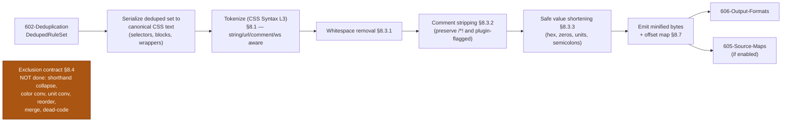
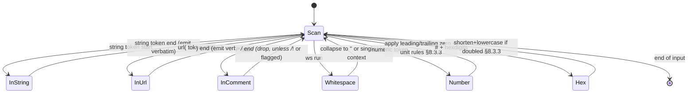
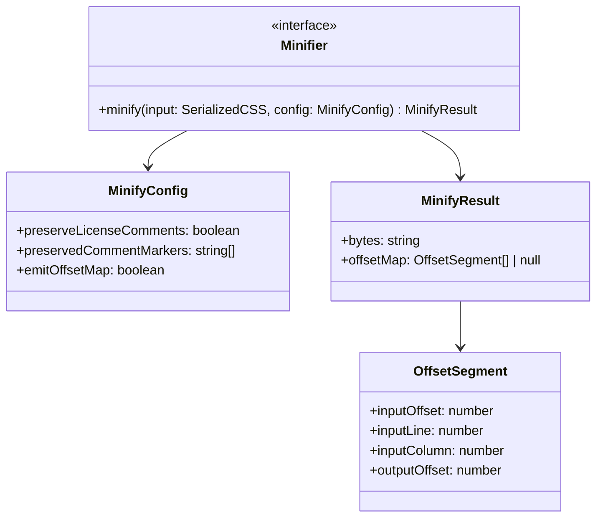

# 603 — Compression

## 1. Title

**Critical CSS Extraction Engine — The Minifier: Deterministic, Correctness-Preserving Compression of Serialized Critical CSS**

## 2. Version

| Field | Value |
|---|---|
| Document Version | 1.0.0 |
| Status | Draft — Phase 8 (Serialization) |
| Last Updated | 2026-07-09 |
| Owners | Serialization Working Group |
| Stability | Safe-transform set (Section 8.3) stable; the explicit exclusion list (Section 8.4) is a binding contract, not a backlog |

## 3. Purpose

This document specifies the **Minifier** (BRIEF.md §2.4 — "Minifier: Compression, whitespace removal"), the final byte-reduction transformation in the Phase 8 serialization pipeline. It runs **after** deduplication (`../design/602-Deduplication.md`) has decided *which* rules and declarations exist, and it decides only *how each surviving token is spelled* on the wire — never *what a declaration means*. Its output is handed to output-format emission (`../design/606-Output-Formats.md`, forward reference) and validated for rendering parity by (`../design/604-Output-Validation.md`, forward reference).

The Minifier performs exactly four classes of transformation, all of which the engine can prove leave the rendered result byte-for-byte identical to the browser's rendering of the un-minified input:

1. **Whitespace removal** — collapse insignificant whitespace between tokens, around combinators, and between declarations, down to the minimum the CSS grammar requires.
2. **Comment stripping** — remove `/* ... */` comments, with a narrow, explicit carve-out for license/preservation comments (`/*!`) and for any comment a plugin marked preserve.
3. **Safe value shortening** — a *closed, enumerated* set of value rewrites that CSS defines as exactly equivalent: hex-color shortening (`#ffffff` → `#fff`, `#aabbcc` → `#abc`), zero-value unit dropping (`0px` → `0` where the property permits a unitless zero length), leading-zero removal (`0.5em` → `.5em`), and redundant-semicolon / trailing-semicolon elimination.
4. **Structural byte trimming** — removing the final semicolon before a closing brace, removing the space after the last declaration, and similar grammar-safe trims.

The organizing thesis of this document, stated up front and enforced throughout, is: **correctness over premature optimization (Principle 3).** The Minifier does the compressions it can *prove* are semantics-neutral and refuses every "optimization" that could — even in an obscure edge case — change rendering. Section 8.4 is therefore not a "future work" list but a *binding exclusion contract*: the Minifier explicitly does **not** rewrite property values in risky ways (no shorthand collapsing, no longhand merging, no color-space conversion beyond exact hex equivalence, no `!important` reordering, no unit conversion like `px`↔`pt`, no rule reordering or merging — that is 602's job under its own safety proof). A minifier that shaves an extra few bytes by rewriting `margin-top:0;margin-right:0;margin-bottom:0;margin-left:0` into `margin:0` is *wrong for this engine* if it cannot prove no intervening cascade interaction is disturbed — and proving that is expensive and error-prone, so the engine simply does not attempt it.

The second binding property is **determinism** (Principle 5): given identical input bytes, the Minifier emits identical output bytes, every run, on every platform, with no dependence on hash-map iteration order, locale, floating-point rounding mode, or wall-clock. This is a hard requirement because the minified output feeds the Cache Manager's fingerprinting (Principle 8) and CI baseline diffing; non-deterministic minification would produce spurious cache misses and spurious CI diffs.

This document does **not** specify: rule ordering (`../design/601-Rule-Ordering.md`), deduplication/merging (`../design/602-Deduplication.md`), output validation (`../design/604-Output-Validation.md`), source-map generation (`../design/605-Source-Maps.md`), or output container formats (`../design/606-Output-Formats.md`). It specifies the token-level compression transform itself.

## 4. Audience

- Implementers of the Minifier (`packages/serializer`, per [007-Repository-Structure.md](../architecture/007-Repository-Structure.md)).
- Authors of `../design/602-Deduplication.md` (runs before) and `../design/606-Output-Formats.md` (runs after), who need the exact input/output byte contract of this stage.
- Authors of `../design/605-Source-Maps.md`, because whitespace removal and comment stripping change byte offsets and column positions, and source-map generation must track the offset remapping this stage produces (Section 8.7).
- Authors of `../design/604-Output-Validation.md`, whose rendering-parity check is the ultimate guarantor that the safe-transform set (Section 8.3) is genuinely safe.
- Senior engineers evaluating whether the engine's conservative "shave-only-provably-safe-bytes" posture is correctly calibrated against payload-size expectations for a critical-CSS payload (which is inlined into `<head>` and therefore highly size-sensitive).

Readers are assumed comfortable with the CSS value/grammar rules governing whitespace significance, hex color notation, and unitless-zero contexts, and with the project's determinism and correctness principles in [006-Design-Principles.md](../architecture/006-Design-Principles.md).

## 5. Prerequisites

- [006-Design-Principles.md](../architecture/006-Design-Principles.md) — Principle 3 (correctness over premature optimization) is the governing principle of Section 8.4's exclusion contract; Principle 5 (determinism) governs Section 8.2.
- `../design/602-Deduplication.md` — the stage that runs immediately before; the Minifier consumes its `DedupedRuleSet` output and must not undo any of its cascade-safety decisions.
- `../design/600-Serialization-Overview.md` (forward reference) — the pipeline overview that fixes the 601 → 602 → 603 → 604/605/606 ordering.
- [302-Rule-Tree.md](../design/302-Rule-Tree.md) — the `DeclarationEntry` model (`property`, `value`, `important`) whose `value` strings are the input to safe value shortening; the browser-canonical form these values already carry is why the Minifier's job is small (Section 8.6).
- Familiarity with CSS Syntax Module Level 3 (tokenization, whitespace significance) and CSS Values and Units (unitless zero, number serialization).

## 6. Related Documents

- [006-Design-Principles.md](../architecture/006-Design-Principles.md) — Principles 3 and 5
- [302-Rule-Tree.md](../design/302-Rule-Tree.md) — `DeclarationEntry` value provenance
- `../design/600-Serialization-Overview.md` (forward reference) — pipeline placement
- `../design/601-Rule-Ordering.md` (forward reference) — upstream ordering (unaffected by compression)
- `../design/602-Deduplication.md` — **runs before this stage** (see Section 8.5 for the ordering rationale)
- `../design/604-Output-Validation.md` (forward reference) — rendering-parity check backstopping the safe-transform set
- `../design/605-Source-Maps.md` (forward reference) — consumes this stage's byte-offset remapping (Section 8.7)
- `../design/606-Output-Formats.md` (forward reference) — **runs after this stage**; wraps minified CSS into the chosen container format
- [ADR-0002-No-Custom-Selector-Parser](../adr/ADR-0002-No-Custom-Selector-Parser.md) — the Minifier does not re-parse selectors; it treats selector text as opaque except for grammar-safe whitespace collapse (Section 8.3.1)

## 7. Overview

The Minifier receives, from `../design/602-Deduplication.md`, an ordered, deduplicated set of emitted rules — each a normalized selector, an ordered declaration list (`DeclarationEntry[]`), and an optional media wrapper — plus deduplicated dependencies. It produces a single CSS byte string (or a stream of chunks, Section 8.8) that renders identically to the un-minified serialization of the same set.

The engine's compression is deliberately *modest in ambition and total in caution*. It does not compete on byte count with aggressive minifiers that perform value-rewriting and shorthand-collapsing; it competes on *never producing a visual regression*. This is the right tradeoff for a critical-CSS payload specifically: critical CSS is inlined into the document `<head>` and blocks first paint, so a single incorrect byte that changes rendering is catastrophic (it degrades the very above-the-fold experience the engine exists to optimize), while the marginal bytes saved by risky value-rewriting are small relative to the dominant savings already achieved upstream — the payload is already tiny because it contains only above-fold rules (Phase 6), already de-duplicated (Phase 8/602). Whitespace and comments are the overwhelming majority of removable bytes in real CSS; the closed set of safe value rewrites captures nearly all of the remaining *safe* headroom.

Two properties are non-negotiable and pervade the design:

- **Semantics-neutrality.** Every transform is in the closed safe set (Section 8.3) precisely because CSS *defines* the before and after as exactly equivalent. Anything not provably equivalent lives in the exclusion contract (Section 8.4) and is simply not done.
- **Determinism.** The transform is a pure function of input bytes with no unordered iteration, no locale-sensitive operation, and a fixed number-serialization rule (Section 8.2).

The chapter is organized as follows: Section 8 specifies the determinism contract, the safe-transform set, the exclusion contract, the number/value serialization rules, the ordering relationship with dedup, comment handling, and source-map offset tracking. Section 9 diagrams the tokenizer-driven pipeline. Section 10 gives pseudocode and complexity. Sections 11 onward cover implementation notes, edge cases, tradeoffs, performance, testing, and future work.

## 8. Detailed Design

### 8.1 Tokenizer-Driven, Not Regex-Driven

The Minifier operates over a **CSS token stream**, not over raw string regex substitution. This is a deliberate correctness choice: whitespace significance in CSS is *contextual* (whitespace inside a string literal or a `url()` is significant; whitespace between a value's function name and its `(` matters for some functions; whitespace collapse around a `>` combinator is safe but collapse inside `[attr="a b"]` is not). A regex-based whitespace collapse cannot reliably distinguish these contexts and will eventually corrupt a string literal, a `url()`, a `content:` value, or a `data:` URI. The Minifier therefore tokenizes according to CSS Syntax Level 3 (recognizing string tokens, url tokens, comment tokens, whitespace tokens, delimiters, etc.) and makes each transform decision with token-type awareness.

This does **not** violate ADR-0002 (No Custom Selector Parser): tokenization is *lexing*, not *parsing/semantic interpretation*. The Minifier never builds a selector AST or interprets selector meaning — it only classifies bytes into CSS tokens so it knows which whitespace is significant. The declarations and selectors it emits are the browser-canonical text carried in `DeclarationEntry`/`normalizedSelector` from upstream ([302](../design/302-Rule-Tree.md), [602](../design/602-Deduplication.md)); the Minifier reorganizes whitespace and shortens enumerated values within that text, never rewriting its structure.

### 8.2 The Determinism Contract

The Minifier is a pure, deterministic function `minify(bytes) -> bytes`:

- **No unordered iteration.** The token stream is processed strictly left to right; no hash-map iteration order ever influences output.
- **Fixed number serialization.** Number shortening (leading-zero removal, trailing-zero removal in the fractional part) follows one canonical rule (Section 8.3.3) applied identically everywhere; there is no floating-point re-computation of values (the engine does *not* evaluate `calc()` or convert units — see Section 8.4), so there is no rounding-mode or platform-float dependence. Number *text* is trimmed textually, not numerically re-formatted.
- **Locale independence.** No locale-sensitive case-folding or number formatting. Hex-color case is normalized to a single fixed case (lowercase, Section 8.3.2) using ASCII-only folding.
- **Idempotence.** `minify(minify(x)) == minify(x)`. Running the Minifier on already-minified output is a no-op (modulo the already-applied transforms), which is both a useful property for pipelines and a strong test oracle (Section 15).

Determinism is load-bearing because the minified bytes are what the Cache Manager fingerprints (Principle 8) and what CI baseline-diffs; a non-deterministic Minifier would manufacture false cache misses and false CI regressions.

### 8.3 The Safe-Transform Set (What the Minifier DOES)

Each transform below is in the set because CSS defines the before/after as exactly equivalent, verifiable against the CSS Syntax and Values specs.

#### 8.3.1 Whitespace Removal

- Collapse runs of whitespace *between tokens* to nothing where the grammar permits, or to a single space where a token separator is required (e.g., between two identifiers in a selector `div .card`, the space is a descendant combinator and is significant — collapse a run of spaces to one, never to zero).
- Remove whitespace around structural punctuation where insignificant: `{`, `}`, `;`, `:` (declaration colon), `,` (selector/value lists), and combinators `>`, `+`, `~`.
- **Never** touch whitespace inside string tokens, `url()` tokens, or between a function name and args where significant. The tokenizer (Section 8.1) guarantees this by only collapsing *whitespace tokens that appear between other tokens*, never bytes inside a string/url token.
- Remove all newlines and indentation (they are whitespace tokens outside strings).

#### 8.3.2 Comment Stripping

- Remove all `/* ... */` comment tokens **except**: (a) comments beginning with `/*!` (the conventional "important"/license marker), which are preserved verbatim; and (b) comments a plugin explicitly flagged for preservation via the `beforeSerialize`/`afterSerialize` hooks (BRIEF.md §2.13). All other comments are removed in full, including the whitespace they occupied (a comment between two tokens that were only separated *by* the comment is replaced by the minimal required separator, so `a/* x */b` in a context needing a separator becomes `a b`, but `color:/* x */red` becomes `color:red`).

#### 8.3.3 Safe Value Shortening (Closed Enumeration)

Only these value rewrites are performed, each provably exact:

- **Hex color shortening.** A 6-digit hex color whose pairs are each doubled (`#RRGGBB` with `R==R`, etc.) shortens to 3-digit (`#ffffff`→`#fff`, `#aabbcc`→`#abc`); an 8-digit hex with doubled pairs shortens to 4-digit (`#ffffffff`→`#ffff`). Hex digits are lowercased. No conversion between hex and `rgb()`/named colors (that is in the exclusion contract, Section 8.4).
- **Leading-zero removal.** `0.5` → `.5`, `-0.5` → `-.5` in numeric tokens. The integer-zero token `0` is untouched.
- **Trailing fractional-zero removal.** `1.50` → `1.5`, `1.0` → `1` (textual trim of trailing zeros in the fractional part, then a trailing `.` is removed). Applied only to numeric tokens, never inside strings/urls.
- **Zero-unit dropping.** `0px`, `0em`, `0%`... → `0` **only** for `<length>` (and `<length-percentage>` where a bare `0` is defined as valid). The Minifier maintains a small, explicit table of which dimension tokens permit a unitless `0`. It does **not** drop the unit for `<time>` (`0s` must stay — `transition-delay:0` is valid but `0s` is safer and the engine leaves author-provided units on time/angle/frequency values untouched to avoid the ambiguous cases), nor for values where `0` without a unit changes meaning. When unsure whether a `0<unit>` context permits bare `0`, **keep the unit** (Principle 3).
- **Redundant/trailing semicolon removal.** The last `;` before a `}` is removed; consecutive `;;` collapse to one (an empty declaration between them is discarded). Leading `;` after `{` is removed.

That is the complete list. Anything not on it is not done.

### 8.4 The Exclusion Contract (What the Minifier Explicitly Does NOT Do)

This section is a *binding contract*, not a roadmap. The Minifier does not perform any of the following, because none is provably semantics-neutral in all cases, and the correctness risk to a first-paint-blocking payload outweighs the marginal bytes:

- **No shorthand collapsing / longhand merging.** It will not rewrite four `margin-*` longhands into `margin`, nor merge `border-width`/`border-style`/`border-color` into `border`. Reason: whether the collapse is safe depends on whether *all* constituent longhands are present, whether any is `!important` while others are not, whether an intervening rule (in the cascade) sets one longhand, and whether the shorthand resets constituents the longhands did not mention (e.g., `background` shorthand resets `background-position`). Proving safety requires cascade reasoning that belongs to 602's proven-safe layer, not to a byte-level minifier.
- **No shorthand *expansion* either** (the reverse) — the Minifier never changes the shorthand/longhand form the author (and browser CSSOM) produced.
- **No color-space conversion beyond exact hex equivalence.** No `rgb(255,255,255)`→`#fff`, no `#fff`→`white`, no `hsl()`→hex. These are *often* equivalent but not always (alpha handling, gamut, `currentColor`, named-color edge cases), and the byte win is small.
- **No unit conversion.** No `px`↔`pt`, no `100ms`→`.1s`, no `calc()` evaluation. Unit conversions depend on context (root font size for `rem`, viewport for `vw`) or on numeric evaluation that introduces float determinism risk.
- **No `!important` reordering or removal**, ever — importance is cascade-significant.
- **No declaration reordering.** Declaration order within a block is cascade-significant ([602](../design/602-Deduplication.md) §8.4); the Minifier preserves `DeclarationEntry[]` order exactly.
- **No rule reordering or merging.** That is entirely 601/602's domain under their own proofs; the Minifier receives a fixed rule order and preserves it.
- **No deduplication.** Already done by 602; the Minifier does not attempt to re-find duplicates (and could not do so safely without 602's cascade-context identity model).
- **No dead-code elimination** (e.g., dropping a rule it *guesses* is unused) — usage determination is Phase 6's job, done in the browser; the Minifier never second-guesses it.
- **No property-value normalization beyond Section 8.3.3** — e.g., it will not reorder `font-family` fallback lists, will not strip quotes from `font-family` names (quote-stripping is context-dependent and risky), will not normalize `url()` quoting.

The contract is intentionally broad. The design stance is that a minifier for first-paint-critical CSS should be *boring and trustworthy*, and that byte-shaving cleverness is a false economy when a single regression degrades the above-the-fold experience.

### 8.5 Ordering: 602 (Dedup) Runs Before 603 (Compression)

The pipeline order is fixed: deduplication precedes compression. The rationale (elaborated in [602](../design/602-Deduplication.md) §8.7 from the dedup side) as it bears on the Minifier:

- **The Minifier processes a strictly smaller input.** Dedup removes whole redundant rules and references first, so compression never spends cycles minifying text that would have been discarded.
- **Identity/semantic reasoning uses browser-canonical text.** Dedup's `declarationHash` (602 §8.2) is computed on the browser-canonical declaration form; if the Minifier ran first and rewrote `#ffffff`→`#fff`, dedup would hash the shortened form — deterministic, but it would couple dedup's identity model to the Minifier's rewrite rules, which is a needless entanglement. Keeping compression last means each stage's correctness argument is independent: dedup decides *what exists*, compression decides *how it is spelled*.
- **Source-map layering is cleaner.** Dedup's provenance union (602 §8.8) is expressed against pre-compression positions; the Minifier then applies a *single, final* byte-offset remap (Section 8.7) on top, giving source-map generation (`../design/605-Source-Maps.md`) one well-defined offset transformation to compose rather than two interleaved ones.

The Minifier must not perform any transform that would re-open a dedup opportunity dedup already declined for cascade-safety reasons — e.g., it must not shorten two structural twins into forms that *look* mergeable, because it does not merge (Section 8.4) and 602 already made the (conservative) merge decision.

### 8.6 Why the Minifier's Job Is Small: Browser-Canonical Input

A subtle but important design consequence of Principle 1 (Browser Is Source of Truth) and the [302](../design/302-Rule-Tree.md) declaration-extraction contract (§8.1/§11 — declarations read via indexed `CSSStyleDeclaration` access, never regex over `cssText`) is that the values the Minifier receives are *already browser-normalized*. The browser's CSSOM serialization has already: normalized most whitespace within values, canonicalized some color forms, expanded/normalized certain shorthands per its own rules, and produced consistent number formatting. This means much of what a from-raw-source minifier must handle (wild author whitespace, inconsistent casing, comment noise inside values) is already gone before the Minifier sees the input. The Minifier's remaining job is therefore genuinely small — inter-token whitespace/comments (which the CSSOM re-introduces as canonical spacing) and the closed value-shortening set. This is a further argument for the conservative posture: the risky rewrites the exclusion contract forbids would also duplicate or fight the browser's own normalization, risking divergence for little gain.

### 8.7 Byte-Offset Remapping for Source Maps

Because whitespace removal and comment stripping delete bytes and shift every subsequent byte's position, the Minifier emits, alongside the output bytes, an **offset-mapping segment list** that records, for each surviving token, its `(inputOffset, inputLine, inputColumn) → outputOffset` correspondence. `../design/605-Source-Maps.md` (forward reference) composes this with dedup's provenance (602 §8.8) and rule-ordering's source positions to produce the final source map that traces a minified byte back to its original stylesheet coordinate ([302](../design/302-Rule-Tree.md) `origin`). The mapping is emitted as a byproduct of the single tokenized pass (Section 10.1), not a second pass, so it costs no additional traversal. When source maps are disabled, the mapping is not accumulated (a cheap conditional), keeping the fast path fast.

## 9. Architecture

### 9.1 Pipeline Placement



### 9.2 Single-Pass Transform State Machine



### 9.3 The `Minifier` Interface



## 10. Algorithms

### 10.1 Algorithm: Single-Pass Tokenized Minification

**Problem statement.** Given serialized CSS text (from 602 → serialize), produce the minimal byte-equivalent CSS applying only the safe-transform set (Section 8.3), deterministically, in one pass, optionally emitting an offset map (Section 8.7).

**Inputs.** `input: string` (serialized deduped CSS); `config: MinifyConfig`.

**Outputs.** `MinifyResult { bytes, offsetMap? }`.

**Pseudocode.**

```text
function minify(input, config) -> MinifyResult:
    out = ByteBuffer()
    map = config.emitOffsetMap ? [] : null
    tokens = tokenizeCSS(input)          // §8.1, CSS Syntax L3 lexer
    prevSignificant = null               // last emitted significant token

    for tok in tokens:                   // strict left-to-right, deterministic
        switch tok.type:
            case STRING, URL:
                emit(out, map, tok.raw, tok)          // verbatim, never altered
            case COMMENT:
                if tok.raw.startsWith("/*!") or isPluginPreserved(tok, config):
                    emit(out, map, tok.raw, tok)
                // else: drop entirely
            case WHITESPACE:
                // collapse: emit single space only if a separator is
                // required between prevSignificant and the next token
                if separatorRequired(prevSignificant, peekNext(tokens)):
                    emit(out, map, " ", tok)
                // else drop
                continue    // whitespace is never 'prevSignificant'
            case NUMBER, DIMENSION, PERCENTAGE:
                emit(out, map, shortenNumeric(tok), tok)   // §8.3.3 zeros+unit
            case HASH:                                     // possibly a hex color
                emit(out, map, shortenHexIfColor(tok), tok) // §8.3.3
            case SEMICOLON:
                if nextNonWsIsCloseBrace(tokens) or prevWasSemicolonOrOpenBrace():
                    // drop trailing/redundant semicolon §8.3.3
                else:
                    emit(out, map, ";", tok)
            default:
                emit(out, map, tok.raw, tok)
        if tok.type not in {WHITESPACE, COMMENT}:
            prevSignificant = tok
    return MinifyResult(out.toString(), map)

function emit(out, map, text, tok):
    if map != null:
        map.append(OffsetSegment(tok.inputOffset, tok.line, tok.column, out.length))
    out.write(text)
```

**Time complexity.** `O(n)` in input byte length `n`. Tokenization is a single linear scan; each token is emitted-or-dropped in `O(len(token))`; total work is `O(n)`. `separatorRequired`/`peekNext` are `O(1)` (one-token lookahead). No stage revisits input.

**Memory complexity.** `O(n)` for the output buffer (bounded above by input size — output is never larger than input for this transform set). `O(m)` for the offset map where `m` = emitted-token count ≤ `n`; `O(1)` additional when the map is disabled. Tokenization can stream (Section 8.8), reducing peak to a bounded window.

**Failure cases.** A malformed/unterminated string or comment token in the input (should not occur — input is browser-serialized, well-formed) is handled by the tokenizer's error-recovery per CSS Syntax L3 (unterminated string consumes to newline/EOF), never by aborting; the recovered token is emitted verbatim to avoid corrupting output. An unrecognized token type is emitted verbatim (never dropped, never rewritten) — the conservative default (Principle 3): if the Minifier does not understand a byte sequence, it preserves it exactly.

**Optimization opportunities.** The tokenizer and the transform switch can be fused (transform decisions made during lexing) to avoid materializing an intermediate token array; the offset-map accumulation is skippable when source maps are off; and the whole pass is chunk-streamable (Section 8.8) for very large payloads.

### 10.2 Algorithm: Safe Numeric/Hex Shortening

**Problem statement.** Given a numeric/dimension/percentage or hash token, produce its shortest byte-equivalent form under the closed rules of Section 8.3.3, or return it unchanged if no rule applies.

**Inputs.** A single token (its raw text and classified type).

**Outputs.** The shortened token text (or the original).

**Pseudocode.**

```text
function shortenNumeric(tok) -> string:
    (sign, intPart, fracPart, unit) = splitNumeric(tok.raw)   // textual split, no float eval
    if fracPart != "":
        fracPart = stripTrailingZeros(fracPart)               // "50"->"5", "0"->""
    if intPart == "0" and fracPart != "":
        intPart = ""                                          // leading-zero removal .5
    number = sign + intPart + (fracPart != "" ? "." + fracPart : "")
    if number == "" or number == "-": number = sign + "0"     // guard: value was 0
    if isZeroValue(number) and unitPermitsBareZero(unit):     // §8.3.3 length table
        return "0"
    return number + unit

function shortenHexIfColor(tok) -> string:
    hex = tok.raw            // e.g. "#AABBCC"
    if not isHexColor(hex): return hex        // not a color hash -> untouched
    body = lowercase(hex[1:])                 // ASCII fold, deterministic
    if len(body) == 6 and pairsDoubled(body): return "#" + body[0]+body[2]+body[4]
    if len(body) == 8 and pairsDoubled(body): return "#" + body[0]+body[2]+body[4]+body[6]
    return "#" + body
```

**Time complexity.** `O(len(token))` — a bounded, tiny constant in practice (colors ≤ 9 chars, numbers short). Over the whole document this is subsumed by the `O(n)` of Section 10.1.

**Memory complexity.** `O(1)` per token beyond the emitted string.

**Failure cases.** A numeric token whose unit is not in the bare-zero table is returned with its unit intact (conservative default). A `#`-prefixed token that is an ID selector fragment rather than a color (the tokenizer classifies these by context; a hash in a selector position is not a color value) is left untouched by `isHexColor` returning false — the Minifier never shortens a `#id` selector.

## 11. Implementation Notes

- **Use a real CSS lexer, not regex.** Implement (or vendor, with vetting) a CSS Syntax Level 3 tokenizer. The single highest source of minifier bugs across the ecosystem is regex-based whitespace/comment handling corrupting string literals, `url()`s, `content:` values, and `data:` URIs. The tokenizer is the correctness foundation (Section 8.1); do not shortcut it.
- **The bare-zero unit table is explicit and conservative.** Enumerate exactly the `<length>`/`<length-percentage>` unit contexts where a bare `0` is valid; default to *keeping* the unit for anything not enumerated (time, angle, frequency, resolution, flex, and any ambiguous grammar position). This table is code, reviewed, and covered by tests — not inferred at runtime.
- **Hex shortening operates on value-position hashes only.** Because the tokenizer classifies a `#abc` in selector position differently from `#abc` in value position, `shortenHexIfColor` must only fire on value-position hash tokens. Never fold or shorten a `#id` selector (ADR-0002 boundary — selectors are opaque).
- **Preserve `/*!` and plugin-flagged comments byte-for-byte**, including their internal whitespace — do not minify *inside* a preserved comment. License compliance depends on verbatim preservation.
- **Determinism must be tested by idempotence and by cross-platform golden files** (Section 15). Any code path that iterates a map/set to produce output is a determinism bug; the algorithm (Section 10.1) is strictly stream-ordered specifically to preclude this.
- **Offset-map emission is a byproduct of the single pass** (Section 10.1's `emit`), gated on `config.emitOffsetMap`; do not implement source-map support as a separate second traversal.
- **Output is never larger than input** for this transform set; assert this in debug builds as a cheap sanity invariant (a larger output signals a bug, e.g., accidental whitespace insertion).

## 12. Edge Cases

- **Whitespace significant as a descendant combinator.** `div .card` (descendant) must not collapse to `div.card` (compound — different meaning). The tokenizer distinguishes: a whitespace run between two selector-token sequences with no explicit combinator is a descendant combinator and collapses to exactly one space, never zero. This is the most dangerous whitespace case and is handled by `separatorRequired`.
- **`content:` string values and `url()` data URIs.** `content:"  spaced  "` and `url(data:image/svg+xml;utf8,<svg> ... </svg>)` contain significant whitespace inside string/url tokens; the tokenizer emits these tokens verbatim (Section 10.1 STRING/URL cases), never collapsing internal whitespace.
- **Zero with a required unit.** `flex-basis:0%` — dropping `%` to get `flex-basis:0` changes meaning in some flex contexts; `0%` is not in the bare-zero length table for this property position, so the unit is kept. Similarly `transition:0s` keeps its `s` (time units are excluded from bare-zero dropping, Section 8.3.3).
- **Hex not reducible.** `#ab12cd` has non-doubled pairs, so it stays 6-digit (only lowercased). `#f00` is already minimal. The rule fires only when all pairs are doubled.
- **Numeric edge: `0.0`, `-0`, `00.500`.** `0.0`→`0` (trailing zeros stripped, empty frac, integer `0` remains), `-0`→`-0` is textually preserved as `-0` unless it is a length where `0` suffices — the Minifier keeps `-0` textual form rather than risk changing `-0` semantics in the rare contexts (e.g., `transform`) where sign of zero could matter; conservative default. `00.500`→`.5` (leading redundant zeros in the integer part collapse to nothing when a fractional part exists; a standalone `00`→`0`).
- **`!important` spacing.** `color:red !important` — the space before `!important` is required (it is a separator between the value and the `!important` flag); it collapses to exactly one space, not zero. The Minifier never removes or reorders the `!important` token itself (Section 8.4).
- **Empty rule blocks.** A `selector{}` (empty block) reaching the Minifier — 602 should have dropped these (602 §12), but if one arrives, the Minifier emits it verbatim (it does not perform dead-code elimination, Section 8.4); dropping empty blocks is 602's responsibility, not the Minifier's.
- **CSS custom properties (`--var: value`).** Custom-property *values* are nearly free-form and their whitespace/casing can be semantically significant to `var()` consumers; the Minifier treats a custom-property value as an opaque token sequence and applies only whitespace collapse that the tokenizer proves insignificant, and does **not** apply value shortening (hex/zero rules) inside custom-property values, because a `--color:#ffffff` might be concatenated or compared as a string by downstream `var()`/`env()` usage. Conservative default (Principle 3).
- **Future CSS value syntax.** Unknown functions or units (a future CSS spec's new unit) are tokenized as generic dimension/function tokens and emitted verbatim — never shortened by a rule that does not explicitly recognize them, so new syntax degrades to "preserved, un-shortened" rather than "corrupted."

## 13. Tradeoffs

| Decision | Why | Alternative Considered | Tradeoff Accepted |
|---|---|---|---|
| Closed safe-transform set + binding exclusion contract | First-paint-critical payload cannot tolerate a rendering regression; risky rewrites' byte win is small vs. dominant upstream savings | Aggressive minifier with shorthand collapse, color/unit conversion | Larger output by a few percent, in exchange for provable semantics-neutrality (Principle 3) |
| Tokenizer-driven, not regex | Whitespace significance is contextual; regex corrupts strings/urls/data-URIs | Regex substitution for whitespace/comments | More implementation cost (a real lexer) for correctness that regex cannot provide |
| Deterministic, strictly stream-ordered, textual number trimming | Output feeds fingerprint/cache and CI baseline diff; non-determinism causes false misses/regressions | Numeric re-formatting of values (float re-serialize) | No numeric normalization (e.g., `calc` fold) — accepted, since that also risks float/unit determinism issues |
| Compression runs after dedup | Smaller input; independent correctness arguments; single clean offset remap for source maps | Compress before dedup | Dedup cannot exploit compression-revealed textual equalities — accepted, browser-canonical form already normalizes those |
| No shortening inside custom-property values | `var()`/`env()` consumers may treat the value as an opaque/compared string | Apply hex/zero shortening everywhere uniformly | A few unshortened bytes inside `--vars`, in exchange for not breaking string-sensitive custom-property usage |
| Preserve `/*!` and plugin-flagged comments | License compliance and plugin-injected directives must survive | Strip all comments unconditionally | Slightly larger output when license comments exist, a legal/ecosystem necessity |

## 14. Performance

- **CPU complexity.** `O(n)` single linear pass over input bytes (Section 10.1); numeric/hex shortening (Section 10.2) is `O(1)` per short token, subsumed in the linear pass. No superlinear step exists — deliberately, since a first-paint tool must itself be fast.
- **Memory complexity.** `O(n)` output buffer (output ≤ input); `O(m)` offset map only when source maps are enabled; streamable to a bounded window (Section 8.8) for large payloads.
- **Caching strategy.** Minified output is deterministic and content-addressable; the Cache Manager (Principle 8) fingerprints the minified bytes, and because `minify` is idempotent (Section 8.2) and pure, a cached minification for an unchanged deduped input is directly reusable across runs and routes.
- **Parallelization opportunities.** Independent top-level rules (and `@media` blocks) can be minified in parallel and concatenated deterministically in canonical order, since the transform has no cross-rule state except the trivially reconstructable "previous significant token" at block boundaries; parallelism is bounded by the fact that the payload is already small (above-fold only), so parallel minification is rarely the bottleneck.
- **Incremental execution.** When only some rules changed (Phase 9 incremental extraction, `../design/704-Incremental-Extraction.md`, planned), only the changed rules' text need re-minifying; unchanged rules' minified byte spans are reusable, since minification is rule-local (no cross-rule dependency in the transform).
- **Profiling guidance.** Profile the tokenizer (it is the whole cost) against the largest realistic *critical* payload; note that critical CSS payloads are intentionally small (above-fold only), so the Minifier is almost never a pipeline hotspot — the browser round-trips of earlier phases dominate. Do not over-optimize the Minifier before profiling confirms it matters.
- **Scalability limits.** Linear in payload size; the practical payload is bounded (critical CSS that grows large defeats its own purpose and triggers the CI size-threshold failure per BRIEF.md §2.11). Streaming output (Section 8.8) removes any peak-memory ceiling for pathologically large inputs.

## 15. Testing

- **Unit tests.** Each safe transform (whitespace, comment, hex, zeros, unit-drop, semicolons) tested against enumerated input/output pairs, including the dangerous cases: descendant-combinator whitespace, `content:`/`url()`/`data:` internal whitespace, `!important` spacing, custom-property values, and every entry (and non-entry) of the bare-zero unit table.
- **Idempotence tests.** For a corpus of fixtures, assert `minify(minify(x)) == minify(x)` — a strong, cheap oracle for both correctness (no transform is unstable) and determinism.
- **Determinism / golden-file tests.** Byte-exact golden minified outputs committed for a fixture corpus, run cross-platform (CI matrix) to catch any locale/float/iteration-order nondeterminism; a byte diff fails the build.
- **Rendering-parity (visual) tests.** Via `../design/604-Output-Validation.md`, the minified critical CSS must render identically to the un-minified serialization and to the original page across viewport profiles — the definitive proof that the safe-transform set is genuinely safe. This is the guard that would catch any accidental semantics-changing transform.
- **Exclusion-contract tests.** Assert *negatively* that the Minifier does **not** perform excluded transforms: feed inputs where shorthand-collapse/color-conversion/unit-conversion *would* apply and assert the output preserves the original form (regression guard against a well-meaning contributor adding a risky "optimization").
- **Fuzz/stress tests.** Fuzz the tokenizer with malformed CSS (unterminated strings/comments, exotic `url()`/`data:` payloads, deeply nested functions) and assert it never corrupts a preserved token and never crashes; stress with the largest fixture to validate streaming and linear time.
- **Benchmark tests.** `benchmarks/` tracks minify throughput (bytes/sec) and compression ratio (bytes in/out) across fixtures, documenting that whitespace+comment removal dominates the ratio and that value shortening adds a small, safe increment — empirical support for the conservative posture.

## 16. Future Work

- **Optional, opt-in aggressive mode gated behind rendering-parity validation.** A future `compression: 'aggressive'` mode could enable specific risky transforms (e.g., color-space conversion) *only* when `../design/604-Output-Validation.md` runs and passes a per-transform visual diff, making the risky transform self-verifying. Deferred until the validation stage can cheaply attribute a diff to a specific transform.
- **Brotli/gzip-aware minification.** Because critical CSS is often transport-compressed, a truly optimal minifier would minimize *post-gzip* size, not raw bytes — which sometimes means *not* shortening (repeated longer tokens compress better). Investigate a mode that optimizes for compressed size; complex and currently out of scope.
- **`calc()` simplification with a proven float-determinism strategy.** Evaluating constant `calc()` (e.g., `calc(10px + 5px)`→`15px`) is a real byte win but requires a deterministic, cross-platform decimal arithmetic to preserve Principle 5; flagged for research alongside a decision on decimal vs. IEEE-754 handling.
- **Open question: should custom-property value shortening be enabled when static analysis proves the value is never string-compared?** Current lean is never (Section 8.4/12), but a dependency-graph-informed proof that a `--var` is only ever used as a color value could safely enable hex shortening inside it — revisit with Phase 7 dependency-graph data.
- **Open question: is a shared tokenizer with the CSSOM Walker (Phase 5) worthwhile?** Both stages tokenize CSS-ish text; a single vetted lexer reused across the codebase reduces the correctness surface. Flagged for a cross-cutting refactor evaluation.

## 17. References

- [006-Design-Principles.md](../architecture/006-Design-Principles.md) — Principle 3 (correctness over premature optimization), Principle 5 (determinism)
- [302-Rule-Tree.md](../design/302-Rule-Tree.md) — `DeclarationEntry` model; browser-canonical declaration provenance
- `../design/600-Serialization-Overview.md` (forward reference, Phase 8) — pipeline placement
- `../design/601-Rule-Ordering.md` (forward reference, Phase 8) — upstream ordering
- `../design/602-Deduplication.md` (Phase 8) — runs before this stage; §8.7 ordering rationale
- `../design/604-Output-Validation.md` (forward reference, Phase 8) — rendering-parity backstop
- `../design/605-Source-Maps.md` (forward reference, Phase 8) — consumes offset remapping (§8.7)
- `../design/606-Output-Formats.md` (forward reference, Phase 8) — runs after this stage
- `../design/704-Incremental-Extraction.md` (forward reference, Phase 9) — incremental re-minification
- [ADR-0002-No-Custom-Selector-Parser](../adr/ADR-0002-No-Custom-Selector-Parser.md) — selectors are opaque to the Minifier
- W3C CSS Syntax Module Level 3 — tokenization, comment/string/url tokens, whitespace significance — https://www.w3.org/TR/css-syntax-3/
- W3C CSS Values and Units Module Level 4 — number serialization, unitless zero, `<length>`/`<length-percentage>` — https://www.w3.org/TR/css-values-4/
- W3C CSS Color Module Level 4 — hex color notation and equivalence — https://www.w3.org/TR/css-color-4/
- BRIEF.md §2.4 (Minifier module), §2.13 (plugin serialize hooks), §2.11 (CI size threshold)
