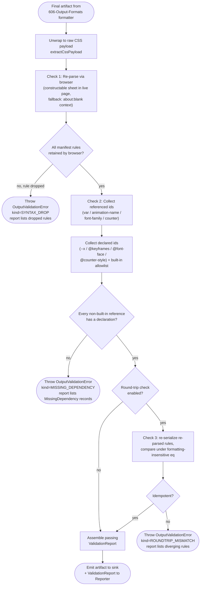

# 604 — Output Validation

## 1. Title

**Critical CSS Extraction Engine — Serialization Module: Output Validation Gate Design**

## 2. Version

| Field | Value |
|---|---|
| Document Version | 1.0.0 |
| Status | Draft — Phase 8 (Serialization) |
| Last Updated | 2026-07-09 |
| Owners | Core Architecture Working Group |
| Stability | The validation-gate contract (what checks run, in what order, and what a failure means to the CI pipeline) is stable; the internal implementation of individual checks may be refined as browser re-parse APIs evolve without invalidating this document's control-flow model |

## 3. Purpose

Every preceding stage of this engine — the Visibility Engine, the CSSOM Walker, the Selector Matcher, the Dependency Resolver, the Cascade Resolver — is a *producer* of belief: it decides, one construct at a time, that a given rule or declaration belongs in the critical set. The Serializer ([600-Serialization-Overview.md](../design/600-Serialization-Overview.md)) then commits those beliefs to a byte string. This document specifies the stage that exists to *disbelieve* that byte string until it has earned trust: the **Output Validation Gate**, the last checkpoint the emitted critical CSS must pass before it is written to disk, returned from the API, or published as a CI artifact.

The gate answers three questions, in escalating strength:

1. **Is the emitted text syntactically valid CSS at all?** Not "did our serializer intend to emit valid CSS," but "does the browser — the authority this whole engine defers to per Principle 1 — accept it without discarding rules?"
2. **Is the emitted text internally complete?** Every `var()`, every `animation-name`, every `font-family`, and every counter reference that *survives* into the output must have its backing declaration (`--x:`, `@keyframes`, `@font-face`, `@counter-style`) also present in the output. A critical stylesheet that references `var(--brand)` but does not carry `--brand`'s definition is a silent rendering defect: the browser will fall back or render nothing, and no syntax check will catch it.
3. **(Optional) Does the emitted text round-trip?** Re-parsing the output and re-serializing it should be idempotent modulo formatting; a mismatch reveals a serializer bug (a rule the browser silently dropped, a declaration the browser rewrote).

The gate is deliberately a *fail-fast* mechanism (Principle 6): any validation failure aborts the run loudly with a structured error rather than shipping a suspect stylesheet. This is what wires it into `BRIEF.md` Section 2.11's CI/CD pipeline, whose "Fail build if: … missing dependencies detected, extraction errors occur" clause this gate operationalizes. This document specifies exactly what runs, in what order, with what complexity, and what each failure mode means to an operator reading a red CI pipeline.

## 4. Audience

- Implementers of `packages/serializer`'s `OutputValidator` component, who will write the gate this document specifies.
- Authors of the sibling serialization documents ([601-Rule-Ordering.md](../design/601-Rule-Ordering.md), [602-Deduplication.md](../design/602-Deduplication.md), [603-Compression.md](../design/603-Compression.md), [606-Output-Formats.md](../design/606-Output-Formats.md)), who need to know which of their invariants the gate enforces downstream and which it assumes upstream.
- CI/CD engineers wiring the gate's structured errors into the pipeline's fail-build logic (`BRIEF.md` Section 2.11).
- Implementers of the Reporter/Diagnostics subsystem (Phase 13, e.g. [1000-Diagnostics-Overview.md](../design/1000-Diagnostics-Overview.md)), who consume the gate's `ValidationReport` as a diagnostic artifact.
- Senior engineers reviewing the engine for conformance with `BRIEF.md` Section 2.18's "Rendering parity" and "Deterministic output" acceptance criteria.

Readers are assumed to have read [600-Serialization-Overview.md](../design/600-Serialization-Overview.md) and to understand the dependency taxonomy established in `docs/architecture/014-Dependency-Graph.md` (variables, keyframes, font faces, `@property`, counters). This document does not re-derive that taxonomy; it uses it as the checklist for the completeness check.

## 5. Prerequisites

- [600-Serialization-Overview.md](../design/600-Serialization-Overview.md) — the overall serialization pipeline; this document specifies its terminal stage.
- [602-Deduplication.md](../design/602-Deduplication.md) — because deduplication is the stage most capable of *accidentally dropping a still-referenced declaration* (over-aggressive dedup of a `@keyframes` still named by a surviving rule), the completeness check exists partly to catch dedup bugs.
- [603-Compression.md](../design/603-Compression.md) — because minification is the stage most capable of *corrupting valid syntax* (a botched whitespace strip merging two tokens); the syntactic check exists partly to catch compression bugs.
- `docs/architecture/006-Design-Principles.md` — Principle 1 (Browser Is Source of Truth), Principle 3 (Correctness Over Premature Optimization), Principle 5 (Determinism of Output), Principle 6 (Fail Fast, Fail Loud).
- `docs/architecture/014-Dependency-Graph.md` — the reference taxonomy the completeness check walks.
- `BRIEF.md` Section 2.11 (CI/CD Pipeline) and Section 2.18 (Acceptance Criteria).

## 6. Related Documents

- [600-Serialization-Overview.md](../design/600-Serialization-Overview.md) — parent overview of the serialization pipeline.
- [601-Rule-Ordering.md](../design/601-Rule-Ordering.md) — rule-ordering guarantees the round-trip check relies on to make re-serialization comparison meaningful.
- [602-Deduplication.md](../design/602-Deduplication.md) — deduplication, whose correctness the completeness check verifies.
- [603-Compression.md](../design/603-Compression.md) — compression/minification, whose correctness the syntactic check verifies.
- [605-Source-Maps.md](../design/605-Source-Maps.md) — sibling document; when a validation check fails, the source map is the artifact that turns "declaration for `var(--x)` is missing" into "…and here is the origin rule that should have carried it."
- [606-Output-Formats.md](../design/606-Output-Formats.md) — because the gate must validate every emitted format variant (raw CSS string, `<style>`-wrapped, JSON-embedded), this document defines how the gate normalizes each back to a parseable CSS payload before checking.
- Phase 13 Diagnostics (e.g. [1000-Diagnostics-Overview.md](../design/1000-Diagnostics-Overview.md)) — downstream consumer of the `ValidationReport`.

## 7. Overview

The Output Validation Gate sits strictly *after* the last transformation that can alter bytes (compression, [603-Compression.md](../design/603-Compression.md)) and strictly *before* any sink (disk, HTTP response, CI artifact upload). It validates *exactly the bytes that will ship*, not an earlier, cleaner intermediate representation — because the whole point of a final gate is to catch defects introduced by the very last transformation, and validating a pre-compression form would blind the gate to compression bugs.

The gate is composed of three checks, run in a fixed order chosen so that cheaper, more-fundamental checks fail first:

1. **Syntactic Re-Parse (mandatory).** The emitted CSS is handed *back to the browser* — the same rendering authority the extraction relied on — via a constructable stylesheet (`new CSSStyleSheet(); sheet.replaceSync(cssText)`) inside the already-live page context, or a disposable parse context. The browser parses it and exposes the resulting `cssRules`. The check compares the *count and kind* of rules the browser retained against the count the serializer claims to have emitted. The browser silently drops rules it cannot parse; a mismatch means the serializer emitted something the browser rejected. This is the load-bearing application of Principle 1: we do not trust a hand-written CSS grammar validator, we trust the same engine that will ultimately render the page.

2. **Dependency Completeness (mandatory).** Over the re-parsed rule set, the gate collects two sets: *referenced identifiers* (every `var(--name)` custom-property reference, every `animation-name` / shorthand `animation` name token, every `font-family` name that resolves to an `@font-face`, every `list-style` / `counter()` / `counter-style` reference) and *declared identifiers* (every `--name:` custom property declaration, every `@keyframes name`, every `@font-face` with a `font-family` descriptor, every `@counter-style name`). Every referenced identifier of a kind the engine is responsible for must appear in the declared set. A referenced-but-undeclared identifier is a dropped dependency — a `BRIEF.md` Section 2.11 fail-build condition.

3. **Round-Trip Idempotence (optional, opt-in).** Re-serialize the re-parsed rule set through the same serializer and compare against the emitted bytes under a formatting-insensitive equivalence. A mismatch means serialization is not a fixed point — the serializer and the browser disagree about the canonical form of some construct — which is a determinism smell (Principle 5) even when neither syntactic nor completeness checks fail.

The gate produces a `ValidationReport` regardless of outcome; on failure it throws a typed `OutputValidationError` carrying that report, so the CI layer gets a machine-readable failure and the Reporter gets a human-readable diagnostic from the same object.

## 8. Detailed Design

### 8.1 Position in the Pipeline and What "The Output" Means

The gate validates the artifact produced by [606-Output-Formats.md](../design/606-Output-Formats.md)'s formatter, but it validates the *CSS payload within* that artifact, not the wrapper. A format variant such as a JSON envelope (`{"css": "...", "map": "..."}`) or an HTML `<style>` block is first **unwrapped** to its raw CSS string; the gate never asks the browser to parse JSON or HTML as CSS. The formatter therefore exposes a `extractCssPayload(artifact) -> string` inverse used exclusively by the gate. This keeps the gate's three checks format-agnostic: they operate on one canonical input, a CSS string, regardless of how it will be packaged.

**Why validate post-format rather than pre-format:** the format wrapper can itself introduce defects (a JSON encoder that mangles a `\` escape inside a `content: "\2014"` declaration, an HTML serializer that HTML-escapes a `>` inside a `[attr]>child` selector into `&gt;`). Validating the *unwrapped payload of the final artifact* catches wrapper-introduced corruption that validating a pre-format string would miss, at the cost of the gate needing an unwrap step per format. That cost is accepted.

### 8.2 Check 1 — Syntactic Re-Parse via the Browser

The engine does not implement a CSS parser for validation. It uses the browser's, via one of two mechanisms, in preference order:

- **Preferred: constructable stylesheet in the live page.** If the extraction page context is still open (the common case, since validation runs at the tail of the same run), the gate calls `new CSSStyleSheet()` and `sheet.replaceSync(cssText)` inside that context and reads back `sheet.cssRules`. This reuses an already-warm browser, avoids a fresh navigation, and — critically — parses under the exact same engine build that produced the extraction, eliminating cross-version parser drift.
- **Fallback: disposable parse context.** If the page context has been torn down (e.g. validation deferred to a later CI stage that only has the CSS text), the gate opens a minimal `about:blank` page, injects the CSS via a `<style>` element or constructable sheet, and reads `document.styleSheets[i].cssRules`. This is heavier (a navigation) and is documented as the fallback precisely because it is slower and requires re-establishing a browser.

The comparison is **rule-count-and-kind by nesting position**, not byte equality: the serializer records, as it emits, a `SerializedManifest` listing every top-level and nested rule it wrote with its kind (`style`, `@media`, `@keyframes`, `@font-face`, `@supports`, `@layer`, `@property`, `@counter-style`). The re-parse walks `cssRules` recursively and builds the same shape. A rule the browser dropped shows up as a manifest entry with no re-parse counterpart. This is deliberately *structural* rather than *textual*: the browser legitimately normalizes text (lowercasing hex colors, collapsing whitespace, reordering some shorthand components), so a byte comparison would false-positive constantly; a structural comparison flags only genuine drops.

**Why count-and-kind rather than full deep equality here:** deep semantic equality of every declaration belongs to Check 3 (round-trip), which is opt-in because it is expensive and occasionally over-strict. Check 1's job is narrower and mandatory: *did the browser keep every rule we wrote?* A dropped rule is unambiguously a defect; a rewritten-but-kept declaration is not necessarily one. Splitting these keeps the mandatory check cheap and false-positive-free.

### 8.3 Check 2 — Dependency Completeness

This check is the engine-specific heart of the gate, and the reason a generic "is this valid CSS" linter is insufficient. Valid CSS can be *incompletely extracted* CSS: `.hero{color:var(--brand)}` is perfectly valid syntax whether or not `--brand` is defined anywhere. The completeness check walks the re-parsed rules and cross-references references against declarations using the taxonomy of `docs/architecture/014-Dependency-Graph.md`:

| Reference site | Referenced identifier | Must be declared by |
|---|---|---|
| `var(--x)` in any declaration value | custom property `--x` | a `--x:` declaration on some in-output rule (typically `:root`) |
| `animation-name: x` / `animation: … x …` | keyframes name `x` | an `@keyframes x` in output |
| `font-family: … "X" …` resolving to a web font | family name `X` | an `@font-face` with `font-family:"X"` in output |
| `list-style-type: x` / `system: extends x` / `counter-style x` | counter-style name `x` | an `@counter-style x` in output (built-in names exempt) |

Two subtleties make this check nontrivial and are specified here rather than left to the implementer:

- **Built-in exemptions.** `font-family` values may name generic families (`sans-serif`) and system fonts; `list-style-type` may name built-in styles (`decimal`, `disc`). These are *not* dependencies the engine is responsible for shipping. The check carries an explicit allowlist of browser built-ins per identifier class, and a referenced identifier is only a defect if it is *not* built-in *and* not declared. The allowlist is derived from the spec, not hand-maintained per browser version, and is documented in [603-Compression.md](../design/603-Compression.md)'s shared identifier tables.
- **Fallback-legitimate references.** A `var(--x, fallback)` with a fallback value is *technically* still renderable if `--x` is undefined (the fallback applies). The engine's policy — consistent with Principle 3, correctness over cleverness — is that a `var()` reference to a custom property that the Dependency Resolver *classified as in-scope* must still ship its declaration even when a fallback exists, because the fallback is a different visual result than the intended value. The check therefore consults the Dependency Resolver's resolved-graph record (passed in as `expectedDeclarations`) to distinguish "reference the engine promised to satisfy" from "reference that was always intended to fall back." Only the former is a fail-build defect; the latter emits an informational note.

The check's output is a set of `MissingDependency` records, each naming the referenced identifier, its kind, the in-output rule that references it, and — via [605-Source-Maps.md](../design/605-Source-Maps.md) — the origin of that rule. This is exactly the "missing dependencies detected" signal `BRIEF.md` Section 2.11 fails the build on.

### 8.4 Check 3 — Round-Trip Idempotence (Opt-In)

Re-serialize the re-parsed `cssRules` through the identical serializer configuration that produced the output, then compare the two CSS strings under the *same* formatting-insensitive equivalence Check 1 uses structurally, but extended to declaration-level content. If `serialize(parse(serialize(rules))) ≠ serialize(rules)`, serialization is not idempotent, which means either the serializer or the browser is non-deterministic about some construct's canonical form.

This is opt-in (default off) for two reasons. First, cost: it doubles the serialization work and adds a second browser parse. Second, and more importantly, *legitimate* browser normalization can make round-tripping over-strict — e.g. the browser may expand a `background` shorthand into longhands on read-back, so a naive re-serialize would differ from the shorthand-preserving original even though both render identically. The round-trip check is therefore valuable primarily as a *diagnostic during serializer development and in a nightly "strict" CI lane*, not as a per-commit mandatory gate. Section 13 discusses this tradeoff.

### 8.5 Fail-Fast Semantics and the `OutputValidationError`

On the first mandatory-check failure, the gate throws `OutputValidationError`, a typed error carrying the full `ValidationReport` (all checks run so far, all findings). It does *not* attempt to "repair" the output — auto-repair would violate both Principle 6 (fail loud, do not paper over defects) and Principle 5 (a repaired output is a different, unpredicted output). The suspect CSS is never written to the primary sink; it may optionally be written to a `.rejected.css` sidecar for debugging, clearly named so it cannot be mistaken for a shippable artifact.

Ordering is deliberate: Check 1 (syntactic) runs before Check 2 (completeness) because completeness analysis over a rule set the browser could not even parse is meaningless — you cannot meaningfully ask "is `--brand` declared" of a stylesheet the browser rejected wholesale. Check 3, when enabled, runs last because it is the most expensive and its findings are the least likely to be true defects.

## 9. Architecture

### 9.1 The Validation Gate Flowchart



### 9.2 Sequence — One Validation Pass

```mermaid
sequenceDiagram
    participant SER as Serializer
    participant OV as OutputValidator
    participant BC as BrowserContext
    participant DR as DepResolver (expectedDeclarations)
    participant RPT as Reporter

    SER->>OV: validate(artifact, manifest, expectedDeclarations)
    OV->>OV: cssText = extractCssPayload(artifact)
    OV->>BC: replaceSync(cssText) on constructable sheet
    BC-->>OV: cssRules (post-parse, normalized)
    OV->>OV: structural diff(cssRules, manifest)
    alt rule dropped
        OV-->>SER: throw OutputValidationError(SYNTAX_DROP)
    end
    OV->>OV: refs = collectReferences(cssRules)
    OV->>OV: decls = collectDeclarations(cssRules) ∪ builtins
    OV->>DR: reconcile(refs, expectedDeclarations)
    DR-->>OV: fallback-legitimate vs promised set
    alt promised reference undeclared
        OV-->>SER: throw OutputValidationError(MISSING_DEPENDENCY)
    end
    opt round-trip enabled
        OV->>OV: re = serialize(cssRules); compare(re, cssText)
        alt mismatch
            OV-->>SER: throw OutputValidationError(ROUNDTRIP_MISMATCH)
        end
    end
    OV->>RPT: ValidationReport (pass)
    OV-->>SER: ValidationReport (pass)
```

### 9.3 Component Placement

The `OutputValidator` is a leaf component of `packages/serializer`, invoked once per emitted artifact. It holds no persistent state across artifacts; each `validate()` call is pure with respect to its inputs (artifact, manifest, expected-declaration record) plus its one impure dependency — the browser re-parse — which is the intentional Principle 1 coupling. It does not mutate the artifact; it only accepts or rejects it.

## 10. Algorithms

### 10.1 Algorithm: Output Validation Gate

**Problem statement.** Given the final emitted artifact, the serializer's rule manifest, and the Dependency Resolver's record of declarations the engine promised to satisfy, decide whether the artifact is syntactically valid (per the browser), dependency-complete, and (optionally) round-trip-idempotent — and either accept it or fail fast with a structured report.

**Inputs.**
- `artifact: OutputArtifact` — the formatted output from [606-Output-Formats.md](../design/606-Output-Formats.md).
- `manifest: SerializedManifest` — the serializer's record of every rule it wrote (kind + nesting position).
- `expectedDeclarations: ResolvedDeclarationSet` — from the Dependency Resolver: identifiers the engine promised to ship, and which references were intended to fall back.
- `browserContext: BrowserContextHandle` — for the re-parse (live or disposable).
- `options: { roundTrip: boolean }` — opt-in for Check 3.

**Outputs.** A `ValidationReport` on success; a thrown `OutputValidationError` (carrying the report) on any mandatory-check failure.

**Pseudocode.**

```text
function validateOutput(artifact, manifest, expectedDeclarations, browserContext, options):
    report = new ValidationReport()
    cssText = extractCssPayload(artifact)          // 8.1: unwrap format wrapper

    // ---- Check 1: syntactic re-parse (mandatory) ----
    sheet = browserContext.parse(cssText)          // 8.2: replaceSync or about:blank
    parsedShape = walkRulesStructurally(sheet.cssRules)   // recursive, kind+position
    dropped = manifest.rules.filter(m => not parsedShape.contains(m.position, m.kind))
    report.check1 = { emitted: manifest.rules.length, retained: parsedShape.count, dropped }
    if dropped.nonEmpty():
        throw OutputValidationError(SYNTAX_DROP, report)

    // ---- Check 2: dependency completeness (mandatory) ----
    refs  = collectReferences(sheet.cssRules)      // 8.3: var/animation/font/counter
    decls = collectDeclarations(sheet.cssRules)    // --x/@keyframes/@font-face/@counter-style
    missing = []
    for ref in refs:
        if isBuiltin(ref): continue
        if decls.contains(ref.identifier): continue
        if expectedDeclarations.isFallbackLegitimate(ref):
            report.notes.add(FallbackReference(ref)); continue
        missing.add(MissingDependency(ref, originOf(ref)))   // origin via 605-Source-Maps
    report.check2 = { referenced: refs.size, declared: decls.size, missing }
    if missing.nonEmpty():
        throw OutputValidationError(MISSING_DEPENDENCY, report)

    // ---- Check 3: round-trip idempotence (opt-in) ----
    if options.roundTrip:
        reSerialized = serialize(sheet.cssRules)   // same serializer config
        diff = compareFormattingInsensitive(reSerialized, cssText)
        report.check3 = { idempotent: diff.isEmpty(), diff }
        if diff.nonEmpty():
            throw OutputValidationError(ROUNDTRIP_MISMATCH, report)

    report.status = PASS
    return report
```

**Time complexity.** Let `R` be the number of rules in the output, `D` the total number of declarations across those rules, `V` the number of reference sites. Check 1 is `O(R)` for the structural walk plus the browser's own parse cost (opaque, roughly linear in `cssText` length `L`, so `O(L)`). Check 2 is `O(D + V)` to collect declarations and references, with `O(1)` amortized set lookups for the reference-vs-declaration reconciliation, so `O(D + V)`. Check 3, when enabled, adds one more serialization pass `O(R + D)` plus a second parse `O(L)`. Overall mandatory cost is `O(L + R + D + V)` — linear in output size — dominated in wall-clock terms by the single browser parse, not by the engine-side traversals.

**Memory complexity.** `O(R + D + V)` for the collected reference/declaration sets and the structural shape; the browser holds the parsed sheet, which is `O(L)` and released when the constructable sheet is dropped. No buffering beyond one artifact at a time.

**Failure cases.** (1) `SYNTAX_DROP` — browser dropped ≥1 emitted rule (compression/format bug). (2) `MISSING_DEPENDENCY` — a promised reference has no declaration (dedup bug or resolver/serializer disagreement). (3) `ROUNDTRIP_MISMATCH` — serialization not idempotent (canonical-form disagreement). (4) `PARSE_CONTEXT_UNAVAILABLE` — neither a live nor a disposable browser context could be obtained; this is itself a fail-fast condition, never a silent "skip validation," because skipping the mandatory checks would let an unvalidated artifact ship, defeating the gate.

**Optimization opportunities.** Reuse the *live* page context for the re-parse to avoid a navigation (Section 8.2). Collect references and declarations in a single combined walk of `cssRules` rather than two passes. Memoize the built-in identifier allowlist as a frozen set at module load, not per call.

### 10.2 Algorithm: Reference / Declaration Reconciliation

**Problem statement.** Given the referenced-identifier set and declared-identifier set extracted from the re-parsed output, classify each reference as satisfied, built-in-exempt, fallback-legitimate, or missing.

**Inputs.** `refs: Reference[]`, `decls: Set<Identifier>`, `expectedDeclarations: ResolvedDeclarationSet`.

**Outputs.** `{ missing: MissingDependency[], fallbackNotes: FallbackReference[] }`.

**Pseudocode.**

```text
function reconcile(refs, decls, expectedDeclarations):
    missing = []; fallbackNotes = []
    for ref in refs:
        if isBuiltin(ref):                      continue    // 8.3 built-in allowlist
        if decls.contains(ref.identifier):      continue    // satisfied
        if expectedDeclarations.wasPromised(ref.identifier):
            missing.add(MissingDependency(ref))             // fail-build
        else if ref.hasFallback:
            fallbackNotes.add(FallbackReference(ref))        // informational
        else:
            missing.add(MissingDependency(ref))             // undeclared, no fallback
    return { missing, fallbackNotes }
```

**Time complexity.** `O(V)` with `O(1)` set membership. **Memory complexity.** `O(missing + fallbackNotes)`. **Failure cases.** A reference whose identifier class is unknown to the engine (a construct the taxonomy does not yet cover, e.g. a future `@scope`-scoped custom ident) is conservatively treated as *not built-in and not promised*; per Principle 3 it is reported as an informational unknown-reference note rather than silently ignored, so coverage gaps surface rather than hide. **Optimization opportunities.** None beyond the linear scan; this is never a bottleneck relative to the browser parse.

## 11. Implementation Notes

- The re-parse (Check 1) must use the **same browser build** as extraction. Validating with a different engine version reintroduces exactly the cross-parser drift Principle 1 exists to eliminate; the gate therefore defaults to the live context and treats a version mismatch in the fallback path as a warning stamped into the `ValidationReport`.
- The `SerializedManifest` must be produced *by the serializer as it writes*, not reconstructed by re-parsing the serializer's own output — reconstructing it from the output would make Check 1 tautological (comparing the output to itself). The manifest is the serializer's *independent claim* of intent, and Check 1's value comes precisely from comparing that independent claim against what the browser actually retained.
- Reference collection (Check 2) must operate on the *re-parsed* rules, not the pre-serialization rule tree, because compression ([603-Compression.md](../design/603-Compression.md)) can legitimately drop a declaration that made a reference unnecessary, and we want to validate what actually ships.
- `collectReferences` must handle the `animation`/`animation-name` shorthand ambiguity: a token in `animation: 2s foo` may be the name `foo` or a keyword; the collector resolves this by excluding known animation keywords (`ease`, `infinite`, `alternate`, …) before treating a token as a keyframes name — the same keyword table [603-Compression.md](../design/603-Compression.md) uses for shorthand minification, shared to avoid divergence.
- `OutputValidationError` must be a distinct type from the extraction-phase errors so the CI layer can attribute a red build to "output validation" specifically, satisfying `BRIEF.md` Section 2.11's need to distinguish failure classes in pipeline reporting.
- The gate must run even for an *empty* critical CSS output (a page with no above-fold styled content): an empty string is trivially valid and complete, and the gate must return `PASS` rather than error on emptiness — emptiness is a legitimate, if rare, extraction result.

## 12. Edge Cases

- **Browser normalizes but retains a rule.** The browser rewrites `#FFFFFF` to `#fff`, expands `margin: 0` shorthand, or reorders `font` components. Check 1 (structural, count-and-kind) is deliberately blind to these; only Check 3 (opt-in) would notice, and it is documented as tolerant of pure normalization via the formatting-insensitive comparator (Section 8.4).
- **A `var()` inside a `@keyframes` or `@font-face` descriptor.** References can live inside at-rules, not only in top-level style rules; `collectReferences` walks nested rules recursively, so `@keyframes spin { from { color: var(--x) } }` correctly contributes a reference to `--x`.
- **Vendor-prefixed at-rules the browser under test does not support.** `@-webkit-keyframes` may be dropped by a non-WebKit engine even though it was validly emitted for a different target. This is not a defect but a target-mismatch; the gate consults the run's target-browser profile and exempts prefixed rules whose prefix does not match the validating engine, recording an informational note rather than a `SYNTAX_DROP`.
- **Custom property declared but only in a media/supports/layer block that the reference's context never matches.** A `--x` declared inside `@media(min-width:2000px)` does not satisfy a reference on a mobile-viewport rule. The completeness check is context-aware only to the degree of "declaration present somewhere in output"; deep context-matching is explicitly *out of scope* here and delegated to the Cascade Resolver's own guarantees, because reproducing full cascade context-matching in the validator would duplicate that subsystem. This is documented as a known limitation, not a silent gap.
- **Circular custom-property references that survived into output** (`--a: var(--b); --b: var(--a)`). Both are *declared*, so Check 2 passes; the cyclic invalidity is the Dependency Resolver's concern (marked `cyclic` upstream per `docs/architecture/014-Dependency-Graph.md`), and the gate does not re-litigate it — it only verifies presence, not semantic validity of the cycle.
- **Extremely large output exceeding the browser's per-stylesheet rule cap.** Some engines cap rules per sheet; the fallback path splits the payload across multiple constructable sheets for parsing and reunites the rule sets before the structural diff, so the cap does not manufacture a spurious `SYNTAX_DROP`.
- **Shadow-DOM / constructable-stylesheet output formats** ([307 constructable stylesheets], `docs/architecture/014`): when the emitted format is itself a constructable-stylesheet payload rather than a text stylesheet, the gate parses it via `replaceSync` directly (its native form) rather than round-tripping through text, avoiding a text-serialization step the format was designed to skip.

## 13. Tradeoffs

| Decision | Why | Alternative Considered | Tradeoff Accepted |
|---|---|---|---|
| Re-parse via the browser, not a hand-written CSS validator | Principle 1: the browser is the authority that will render this; only it can say what it accepts | Bundle a standalone CSS grammar validator (e.g. a PostCSS-based linter) | Adds a browser round trip to validation; accepted because a standalone validator can disagree with the actual rendering engine, which is exactly the failure class this engine exists to avoid |
| Check 1 structural (count-and-kind), not byte-equal | Browser normalization makes byte comparison hopelessly false-positive-prone | Byte comparison of emitted vs re-serialized | Cannot catch declaration-level rewrites in the mandatory path (Check 3 covers that opt-in) |
| Completeness check is mandatory; round-trip is opt-in | Missing dependencies are unambiguous rendering defects and cheap to detect; round-trip mismatches are often benign normalization and expensive | Make round-trip mandatory too | Serializer non-idempotence can slip past per-commit CI; mitigated by a nightly strict lane running Check 3 |
| Fail fast, never auto-repair | Principles 5 and 6: a repaired output is an unpredicted output; silent repair hides the upstream bug | Attempt to inject the missing declaration and re-validate | A red build instead of a "fixed" but unexplained one; accepted because the upstream defect must be found, not masked |
| Validate the post-format, post-compression bytes | Catches defects introduced by the last transformation, which validating an earlier form would miss | Validate the pre-compression rule tree | Requires a format-unwrap step per output format; accepted for end-to-end fidelity |
| Consult resolver's `expectedDeclarations` to classify `var(--x, fallback)` | Distinguishes "promised value" from "always-fallback"; avoids both false alarms and false passes | Treat any fallback-bearing reference as satisfied | Requires threading resolver state into the validator; accepted because it is the only way to honor extraction intent |

## 14. Performance

- **CPU complexity.** Engine-side work is linear in output size, `O(L + R + D + V)` (Section 10.1); in practice dominated by the single browser parse, which for a typical critical stylesheet (tens of KB) is sub-millisecond to low-single-digit-millisecond. Validation is therefore a negligible fraction of total extraction time, which is dominated by navigation and rendering stabilization upstream.
- **Memory complexity.** `O(L + R + D + V)`; one artifact validated at a time, no cross-artifact buffering. The parsed constructable sheet is the largest transient and is released immediately after Check 1/2 read from it.
- **Caching strategy.** The built-in identifier allowlist is a frozen module-level constant (built once). Within a multi-viewport run (Mobile/Tablet/Desktop), the *validation itself* is not cacheable across viewports because each viewport's output differs, but the live browser context is reused across all three re-parses, amortizing context setup.
- **Parallelization opportunities.** Per-artifact validation is embarrassingly parallel *across* routes/viewports when each has its own browser context (consistent with `docs/architecture/015-Runtime-Model.md`'s worker model). Within a single validation the three checks are sequential by design (Check 2 depends on Check 1's parsed rules), so intra-artifact parallelism is not pursued.
- **Incremental execution.** When the Cache Manager (Phase 10) reports an artifact identical to a previously-validated one (same fingerprint), validation may be skipped entirely — the gate exposes a `validatedFingerprints` fast-path so a cache hit does not re-pay the browser parse. This is the single highest-value performance lever in CI, where most routes are unchanged between builds.
- **Profiling guidance.** The metric to watch is *validation wall-clock as a fraction of total serialization time*; if it exceeds a few percent, the likely culprit is repeated disposable-context creation (the fallback path) rather than the engine-side traversals — the remedy is ensuring the live context stays open through validation.
- **Scalability limits.** The browser's per-sheet rule cap (Section 12) is the one hard ceiling; the multi-sheet splitting fallback pushes it out but does not remove it. For pathologically large outputs this is the constraint to design around, and it is documented as such.

## 15. Testing

- **Unit tests.** `collectReferences` and `collectDeclarations` in isolation against hand-built rule sets covering each identifier class (var/animation/font/counter), including nested-at-rule references and the animation-shorthand keyword ambiguity. `reconcile` against every classification branch (satisfied, built-in, fallback-legitimate, promised-missing, undeclared-no-fallback, unknown-class).
- **Integration tests.** Full-gate runs against serializer output for fixtures that deliberately trip each mandatory failure: a fixture whose compression config is buggy enough to drop a rule (expect `SYNTAX_DROP`); a fixture whose dedup drops a still-referenced `@keyframes` (expect `MISSING_DEPENDENCY`); a clean fixture (expect `PASS`).
- **Visual tests.** Not owned here directly (owned by end-to-end rendering-parity tests per `BRIEF.md` Section 2.18), but a passing validation gate is a *necessary precondition* for those tests: a `MISSING_DEPENDENCY` the gate lets through would surface downstream as a rendering-parity failure, so the gate is tested for the property "every validation pass is consistent with a subsequent parity pass" on the shared fixture corpus.
- **Stress tests.** A fixture exceeding the browser per-sheet rule cap (verifying multi-sheet split reunites correctly without spurious `SYNTAX_DROP`). A fixture with thousands of `var()` references (verifying Check 2 stays linear).
- **Regression tests.** Every production output-corruption bug (a specific compression edge that dropped a rule, a specific format-wrapper escape bug) gains a permanent fixture plus its expected `OutputValidationError` kind and `ValidationReport` snapshot.
- **Benchmark tests.** Track validation wall-clock and its fraction of total serialization time across the `fixtures/enterprise-huge/` corpus over time in `benchmarks/`, guarding against a regression that makes validation a bottleneck (e.g. an accidental switch to the disposable-context path).

## 16. Future Work

- **Context-aware completeness.** Section 12 notes that Check 2 verifies a declaration is present *somewhere* in output, not that it is present in a context the reference actually matches. A future refinement could borrow the Cascade Resolver's context-matching to catch "declared only under a non-matching media query" defects, at the cost of duplicating cascade logic — an open design question pending evidence this class of defect occurs in practice.
- **Rendering-diff validation.** Beyond parsing, a stronger gate could render the page with the critical CSS and screenshot-diff it against a full-CSS render inside the same run, turning "rendering parity" (`BRIEF.md` Section 2.18) from a separate test suite into an inline gate. This is expensive (a second render) and is flagged as a future opt-in "paranoid" validation lane.
- **Machine-learning-free anomaly detection on `ValidationReport` trends.** Tracking reference/declaration counts per route over CI history could flag a sudden drop in declared identifiers (a dedup regression) even before it produces a hard `MISSING_DEPENDENCY` — an early-warning research idea for Phase 13 diagnostics.
- **Standardized round-trip tolerance profiles.** Check 3's formatting-insensitive comparator currently encodes browser-normalization tolerances ad hoc; a future RFC could formalize per-engine normalization profiles so the strict lane's tolerances are declarative and versioned alongside the target-browser table.
- **Open question:** should `PARSE_CONTEXT_UNAVAILABLE` ever be downgradable to a warning in a documented "text-only" deployment where no browser is available at validation time? Current policy forbids it (fail fast); whether a genuinely browserless CI stage warrants an escape hatch is unresolved and deliberately left closed until a concrete need appears.

## 17. References

- [600-Serialization-Overview.md](../design/600-Serialization-Overview.md)
- [601-Rule-Ordering.md](../design/601-Rule-Ordering.md)
- [602-Deduplication.md](../design/602-Deduplication.md)
- [603-Compression.md](../design/603-Compression.md)
- [605-Source-Maps.md](../design/605-Source-Maps.md)
- [606-Output-Formats.md](../design/606-Output-Formats.md)
- `docs/architecture/006-Design-Principles.md`
- `docs/architecture/014-Dependency-Graph.md`
- `docs/architecture/015-Runtime-Model.md`
- [1000-Diagnostics-Overview.md](../design/1000-Diagnostics-Overview.md) — Phase 13 Reporter, downstream consumer of `ValidationReport`
- `BRIEF.md` Section 2.11 (CI/CD Pipeline), Section 2.18 (Acceptance Criteria)
- W3C CSS Object Model (CSSOM) — https://www.w3.org/TR/cssom-1/ — the `CSSStyleSheet.replaceSync` / `cssRules` surface the re-parse relies on
- W3C CSS Custom Properties for Cascading Variables Module Level 1 — https://www.w3.org/TR/css-variables-1/
