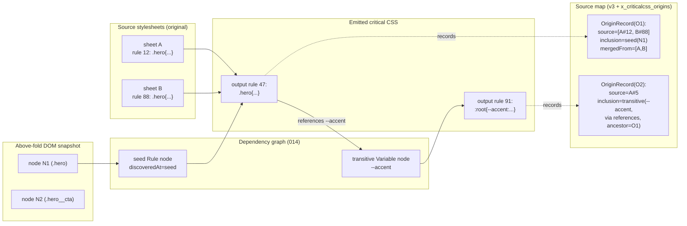
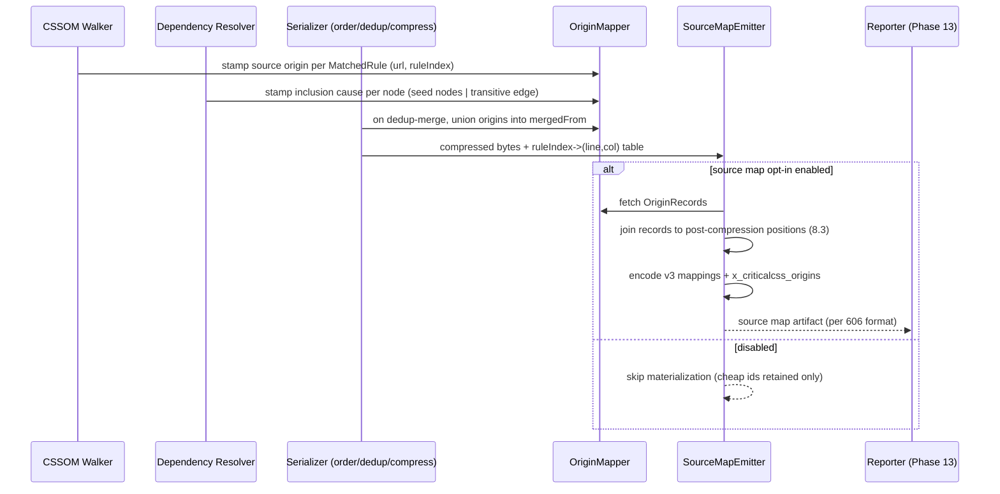

# 605 — Source Maps

## 1. Title

**Critical CSS Extraction Engine — Serialization Module: Origin-Mapping and Source-Map Design**

## 2. Version

| Field | Value |
|---|---|
| Document Version | 1.0.0 |
| Status | Draft — Phase 8 (Serialization) |
| Last Updated | 2026-07-09 |
| Owners | Core Architecture Working Group |
| Stability | The origin-mapping *data model* (what an origin record contains) is stable; the *serialized format* (which on-disk encoding is emitted) is versioned and may gain variants without breaking the model |

## 3. Purpose

When the engine emits a critical stylesheet, it emits a set of rules stripped of their history. Rule 47 in the output is `.hero__cta{background:var(--accent)}` — but *why* is it there? Which source stylesheet did it come from, at what rule index? Which above-fold DOM node caused it to be included? Was it a directly-matched rule or a transitively-pulled dependency? The output byte string answers none of these questions, and yet these are precisely the questions an engineer asks when a critical CSS defect appears: "this rule should not be here — where did it come from?" or, worse, "this rule is *missing* — why did we not include it?"

This document specifies the **origin-mapping** subsystem: the optional, opt-in facility that records, for each emitted critical rule, a back-reference to (a) its **source origin** — the source stylesheet URL and the rule's index within that stylesheet — and (b) its **inclusion cause** — the above-fold DOM node(s) whose visibility and selector match caused the rule to enter the critical set, or, for a transitively-included rule, the dependency edge and ancestor rule that pulled it in. The subsystem serializes these back-references into a **source map**: a sidecar artifact, parallel to the emitted CSS, that a diagnostics tool or the Reporter (Phase 13) can consume to reconstruct the full provenance of any line of output.

The purpose is diagnostics, not production delivery. Source maps are opt-in and never affect the shipped CSS bytes. They exist so that the engine — which deliberately treats the browser as an opaque rendering authority (Principle 1) and therefore makes many decisions the operator cannot easily reverse-engineer from output alone — can *explain itself* when asked. This document defines the origin data model, the serialized format choice and its size tradeoffs, the opt-in mechanism, and the tie to the Reporter/diagnostics subsystem.

## 4. Audience

- Implementers of `packages/serializer`'s `OriginMapper` and `SourceMapEmitter` components.
- Authors of the sibling serialization documents ([601-Rule-Ordering.md](../design/601-Rule-Ordering.md), [602-Deduplication.md](../design/602-Deduplication.md), [603-Compression.md](../design/603-Compression.md), [606-Output-Formats.md](../design/606-Output-Formats.md)), whose transformations must *carry forward* origin records rather than discarding them — this document specifies the propagation contract each must honor.
- Implementers of the Reporter/Diagnostics subsystem (Phase 13, e.g. [1000-Diagnostics-Overview.md](../design/1000-Diagnostics-Overview.md) and its visualization documents), the primary consumer of the emitted source map.
- Implementers of the Output Validation gate ([604-Output-Validation.md](../design/604-Output-Validation.md)), which uses origin records to turn a bare "missing dependency" finding into "…and here is the origin rule that referenced it."
- Senior engineers auditing the engine for the `BRIEF.md` Section 2.10 "rich diagnostics and reporting" and Section 2.18 "deterministic output" guarantees.

Readers are assumed to understand the matched-rule and dependency-graph vocabulary of `docs/architecture/014-Dependency-Graph.md` (seed vs transitive nodes, edge kinds) and the DOM-snapshot vocabulary of the DOM Collector / Visibility Engine subsystems.

## 5. Prerequisites

- [600-Serialization-Overview.md](../design/600-Serialization-Overview.md) — the serialization pipeline whose stages this document instruments with origin tracking.
- [601-Rule-Ordering.md](../design/601-Rule-Ordering.md) — because a source map maps *output positions* to origins, it depends on rule ordering being deterministic; a nondeterministic order would make a source map unstable across runs.
- [602-Deduplication.md](../design/602-Deduplication.md) — deduplication is the transformation that most complicates origin mapping, since one output rule may have *several* origins after identical rules are merged; this document specifies how those multiple origins are preserved.
- [603-Compression.md](../design/603-Compression.md) — minification changes byte offsets, so the source map's position anchoring must survive whitespace removal (Section 8.3).
- `docs/architecture/006-Design-Principles.md` — Principle 4 (Observability), Principle 5 (Determinism of Output).
- `docs/architecture/014-Dependency-Graph.md` — the source of the `discoveredAt` marker (seed vs transitive) and the dependency edges that make up a transitive rule's inclusion cause.
- `BRIEF.md` Section 2.10 (diagnostics/reporting requirement) and Section 2.12 (Diagnostics).

## 6. Related Documents

- [600-Serialization-Overview.md](../design/600-Serialization-Overview.md) — parent overview.
- [601-Rule-Ordering.md](../design/601-Rule-Ordering.md) — deterministic ordering the source map's position anchors rely on.
- [602-Deduplication.md](../design/602-Deduplication.md) — merge semantics that create many-origins-per-rule.
- [603-Compression.md](../design/603-Compression.md) — minification's effect on position anchoring.
- [604-Output-Validation.md](../design/604-Output-Validation.md) — consumes origin records to attribute `MissingDependency` findings to a source rule.
- [606-Output-Formats.md](../design/606-Output-Formats.md) — defines whether the source map ships as a separate file, an inline data-URI comment, or a JSON envelope field.
- Phase 13 Diagnostics (e.g. [1000-Diagnostics-Overview.md](../design/1000-Diagnostics-Overview.md)) — the consuming Reporter (forward reference; that phase's documents define the visualization that renders these maps).

## 7. Overview

A conventional web source map (the Source Map v3 format used by JS/CSS build tools) maps *generated byte positions* back to *original byte positions* in original source files, for the purpose of debugger line/column navigation. The critical-CSS problem is related but not identical, and the difference drives the whole design.

In our case the "generated" side is the emitted critical stylesheet, and the "original" side is *two distinct things*:

1. **The source stylesheet** the rule textually came from — a URL plus a rule index (or line/column, if available from the CSSOM Walker). This is the classic source-map dimension, and for it we can and do lean on the Source Map v3 format's proven position-mapping machinery.
2. **The inclusion cause** — *why the engine chose to emit this rule*. This has no analogue in a JS source map. It is a graph fact: either "this rule directly matched above-fold DOM node(s) N1, N2 via selector S" (a *seed* rule, per `docs/architecture/014-Dependency-Graph.md`'s `discoveredAt: 'seed'`) or "this rule was pulled in transitively as the definition of construct C, referenced by ancestor rule R via edge kind K" (`discoveredAt: 'transitive'`).

Because dimension 2 has no home in the Source Map v3 spec, the design is a **hybrid**: a standard-conformant Source Map v3 payload carries dimension 1 (so off-the-shelf tools can consume the position mapping), and a namespaced extension field carries dimension 2 (the inclusion-cause graph facts). A consumer that only understands v3 gets useful source→output navigation; a consumer that understands our extension (the Reporter) gets the full "why is this here" story.

Origin tracking is threaded through the *entire* serialization pipeline: the CSSOM Walker stamps each `MatchedRule` with its source origin at extraction time; the Dependency Resolver stamps each transitive node with its inclusion cause; the Serializer's ordering, deduplication, and compression stages must *carry these records forward*, transforming positions as they transform bytes, rather than discarding them. The `SourceMapEmitter` then serializes the accumulated records into the chosen format. All of this is gated behind an opt-in flag; when off, the pipeline carries lightweight origin *identifiers* (cheap) but never materializes the full map (the expensive part), so the common production path pays almost nothing.

## 8. Detailed Design

### 8.1 The Origin Record Data Model

Every emitted rule carries, when origin tracking is enabled, an `OriginRecord`:

```text
OriginRecord {
  outputPosition:  { ruleIndex: int, line: int, column: int }   // where in the OUTPUT
  source: {
    stylesheetUrl: string          // source stylesheet URL (or synthetic id for <style>/constructable)
    sourceRuleIndex: int           // index within that stylesheet's cssRules
    sourceLine?: int               // if the CSSOM Walker captured it
    sourceColumn?: int
  }
  inclusion:
      | { kind: 'seed', nodes: DomNodeRef[], selector: string }
      | { kind: 'transitive', construct: ConstructRef, viaEdge: EdgeKind, ancestorRuleId: RuleId }
  mergedFrom?: OriginRecord[]       // 8.4: populated when dedup merged several rules into one
}
```

The `DomNodeRef` is the same stable node handle the DOM Collector assigns (a deterministic path/index into the snapshot, not a live element pointer, which would be meaningless once the page is closed). The `ConstructRef` and `EdgeKind` come verbatim from the resolved dependency graph (`docs/architecture/014-Dependency-Graph.md`). This is deliberate reuse: the source map does not invent new provenance vocabulary, it *serializes the vocabulary the upstream stages already produced*, which is what keeps the map faithful to the engine's actual decisions rather than a plausible-looking reconstruction.

**Why record inclusion cause as structured graph facts, not a prose string.** A tempting shortcut is to store a human-readable note ("included because it matched .hero"). Rejected: a structured `inclusion` object lets the Reporter render provenance in whatever form it chooses (a graph edge, a tooltip, a tree) and lets [604-Output-Validation.md](../design/604-Output-Validation.md) *query* it programmatically ("find the origin rule for this missing `var()`"). Prose is a lossy terminal form; structure is composable. The prose rendering is the Reporter's job, downstream, from the structured facts.

### 8.2 Two Origin Dimensions, One Hybrid Format

As Section 7 establishes, dimension 1 (source position) maps cleanly onto Source Map v3 and dimension 2 (inclusion cause) does not. The emitted artifact is therefore a Source Map v3 JSON object with:

- Standard fields (`version: 3`, `sources`, `sourcesContent`, `mappings`, `names`) carrying dimension 1. `sources` lists the source stylesheet URLs; `mappings` is the VLQ-encoded position mapping from output line/column to source line/column; `sourcesContent` optionally inlines the original stylesheet text for self-contained diagnostics.
- An extension field `x_criticalcss_origins` — a namespaced (per the v3 convention that unknown `x_`-prefixed fields are ignored by conformant consumers) array of the `inclusion` facts, indexed parallel to the output rule order so a consumer joins them to `mappings` by output rule index.

**Why extend v3 rather than invent a bespoke format.** Reusing v3 for dimension 1 means existing source-map tooling (browser devtools, editor plugins) can already navigate from an output rule to its source stylesheet with zero custom code — a real, free capability. Inventing a wholly bespoke format would forfeit that. The cost is that dimension 2 lives in a non-standard extension, which no off-the-shelf tool understands — but dimension 2 is engine-specific by nature (no generic tool could interpret "pulled in via a `references` edge" anyway), so nothing is lost by making it bespoke. This split-the-difference choice maximizes reuse where a standard exists and accepts bespoke only where none could.

### 8.3 Position Anchoring Across Compression

The source map maps output *positions* (line/column), but [603-Compression.md](../design/603-Compression.md) removes whitespace and may collapse the entire stylesheet onto one line. A source map generated *before* compression would have positions that no longer correspond to the shipped bytes.

The resolution: origin mapping records positions at *rule granularity* (the `ruleIndex`), and byte-level line/column are computed **after** compression by the same emitter pass that writes the final bytes. Concretely, compression is required to emit, alongside the compressed bytes, a `ruleIndex -> (line, column)` position table for the *compressed* output (cheap: the compressor already walks rule boundaries as it strips whitespace). The `SourceMapEmitter` then joins its per-rule origin records to that post-compression position table to fill each `OriginRecord.outputPosition`. This makes rule index the *stable join key* that survives every byte transformation, while line/column are computed last against the actual shipped bytes. Rule ordering being deterministic ([601-Rule-Ordering.md](../design/601-Rule-Ordering.md)) is what makes the rule index a reliable key — a nondeterministic order would scramble the join.

### 8.4 Deduplication and Many-Origins-Per-Rule

[602-Deduplication.md](../design/602-Deduplication.md) may merge several identical (or mergeable) source rules into one output rule. After such a merge, the single output rule has *multiple* legitimate origins: it came from source rule 12 of sheet A *and* source rule 88 of sheet B, and it was included because it matched node N1 *and* because it matched node N2. Discarding all but one origin would produce a misleading map ("this rule came from A" when it also came from B).

The `mergedFrom` field preserves this: when dedup merges rules `r1, r2, r3` into output rule `r*`, `r*`'s `OriginRecord.mergedFrom = [origin(r1), origin(r2), origin(r3)]`, and `r*`'s own top-level `source`/`inclusion` fields are set to the *primary* origin (the first in rule order, for a deterministic default), with the full set available in `mergedFrom` for a consumer that wants complete provenance. This is the propagation contract [602-Deduplication.md](../design/602-Deduplication.md) must honor: its merge function must *union* origin records, never drop them.

### 8.5 Opt-In Mechanism and the Cheap/Expensive Split

Origin tracking has two cost tiers, and the opt-in flag selects between them:

- **Always-on, cheap tier:** every `MatchedRule` and every transitive graph node *already* carries a stable identity (rule ID, source stylesheet index, `discoveredAt` marker) for reasons unrelated to source maps — the Dependency Resolver and Cascade Resolver need these regardless. Carrying these lightweight identifiers through serialization costs essentially nothing (a few integer fields per rule) and is always on.
- **Opt-in, expensive tier:** materializing the full `OriginRecord` (resolving `DomNodeRef` back to a snapshot path, capturing `sourcesContent`, computing post-compression positions, VLQ-encoding `mappings`, writing the sidecar) is the expensive part and is gated behind `--source-map` / `config.sourceMap`. When off, the emitter skips materialization entirely.

**Why opt-in rather than always-emit.** A production build that ships critical CSS to a CDN has no use for a source map on every request and pays no diagnostic dividend for the extra CPU, memory, and artifact size; a developer debugging a parity defect, or a CI run archiving diagnostics, wants the full map. Making it opt-in (default off in production profiles, default on in a "diagnostic" profile) matches cost to benefit, consistent with Principle 3 (do not pay for correctness machinery you are not using) while keeping the cheap identifiers always available so enabling the map never requires re-running extraction — the identifiers needed to reconstruct it are already present.

## 9. Architecture

### 9.1 Origin-Mapping Structure



The diagram shows the two origin dimensions converging on each output rule: `O1` (a seed rule) traces back both to *source* (sheets A and B, merged) and to *cause* (node N1's match); `O2` (a transitive rule) traces back to its *source* and to the *dependency edge* from `O1` that caused its inclusion. The source map records both.

### 9.2 Sequence — Building and Emitting a Source Map



### 9.3 Component Placement

`OriginMapper` is a passive accumulator living beside the serializer; upstream stages *push* origin facts into it as they produce them, and it holds them keyed by rule ID. `SourceMapEmitter` is invoked once, after compression, only when the opt-in flag is set. Neither is on the critical path of the shipped CSS bytes — the CSS is emitted whether or not the map is — which is the structural guarantee that source-map generation can never corrupt or reorder the output it describes.

## 10. Algorithms

### 10.1 Algorithm: Origin Record Accumulation and Propagation

**Problem statement.** Maintain, across every byte-transforming serialization stage, a faithful mapping from each surviving output rule to its complete set of source origins and inclusion causes, without letting ordering, deduplication, or compression drop or corrupt a record.

**Inputs.** A stream of stage events: `stampSource(ruleId, sourceOrigin)` from the CSSOM Walker; `stampInclusion(ruleId, inclusionCause)` from the Dependency Resolver; `merge(survivorId, mergedIds[])` from deduplication; `reorder(ruleId, newIndex)` from ordering; `finalizePositions(ruleIndex -> line/col)` from compression.

**Outputs.** A map `ruleId -> OriginRecord` with fully-populated `outputPosition`, `source`, `inclusion`, and `mergedFrom`.

**Pseudocode.**

```text
class OriginMapper:
    records: Map<RuleId, OriginRecord> = {}

    function stampSource(ruleId, srcOrigin):
        records[ruleId].source = srcOrigin              // from CSSOM Walker

    function stampInclusion(ruleId, cause):
        records[ruleId].inclusion = cause               // seed(nodes,selector) | transitive(...)

    function merge(survivorId, mergedIds):               // 8.4: dedup contract
        survivor = records[survivorId]
        for mid in mergedIds:
            survivor.mergedFrom.append(records[mid])
            records.delete(mid)                          // merged rules leave the output
        // survivor keeps its own source/inclusion as the primary (first in order)

    function reorder(ruleId, newIndex):
        records[ruleId].outputPosition.ruleIndex = newIndex   // 601 ordering

    function finalizePositions(indexToLineCol):          // 8.3: after compression
        for (ruleId, rec) in records:
            (line, col) = indexToLineCol[rec.outputPosition.ruleIndex]
            rec.outputPosition.line = line
            rec.outputPosition.column = col
```

**Time complexity.** `stampSource`/`stampInclusion`/`reorder` are `O(1)` each, `O(R)` total over `R` rules. `merge` is `O(k)` in the number merged, `O(R)` total across all merges (each rule is merged at most once). `finalizePositions` is `O(R)`. Total accumulation is `O(R)` — linear, negligible against extraction cost.

**Memory complexity.** `O(R + M)` where `M` is the total merged-origin count across all merges; `sourcesContent` inlining (opt-in within opt-in) adds `O(total source stylesheet bytes)`, the single largest contributor and the reason it is separately gated (Section 13).

**Failure cases.** (1) A `stampInclusion` never arrives for a rule that reached output — a defect meaning some rule entered the critical set without a recorded cause; treated as an assertion failure under Principle 5, because an unexplained rule violates the "engine can explain itself" contract. (2) A `merge` referencing a `mergedId` with no record — a dedup/mapper desync, likewise an assertion failure. (3) `finalizePositions` missing an entry for a live rule — a compression/emitter desync, assertion failure. All three are loud, never silent, because a *silently* incomplete source map is worse than none (it misleads the debugger).

**Optimization opportunities.** When the opt-in flag is off, `stampSource`/`stampInclusion` degrade to storing only the lightweight identifier tuple (Section 8.5), skipping `DomNodeRef` resolution and `sourcesContent`; the propagation machinery still runs (it is `O(R)` and cheap) so that enabling the map never requires re-extraction.

### 10.2 Algorithm: Source Map Serialization (v3 + extension)

**Problem statement.** Encode the accumulated `OriginRecord`s into a Source Map v3 JSON object with the `x_criticalcss_origins` extension, joining positions to the post-compression byte layout.

**Inputs.** `records: Map<RuleId, OriginRecord>`, the compressed `ruleIndex -> (line,col)` table, and `options: { inlineSources: bool }`.

**Outputs.** A JSON source-map artifact (delivered per [606-Output-Formats.md](../design/606-Output-Formats.md): separate file, inline data-URI comment, or JSON envelope field).

**Pseudocode.**

```text
function emitSourceMap(records, positionTable, options):
    sources = distinct(records.values().map(r => r.source.stylesheetUrl))
    sourceIndex = indexBy(sources)
    ordered = records.values().sortedBy(r => r.outputPosition.ruleIndex)   // 601 order

    mappings = []             // VLQ segments, one per output rule (rule-granular)
    origins  = []             // parallel-indexed extension array
    for r in ordered:
        mappings.append(vlqSegment(
            genLine = r.outputPosition.line, genCol = r.outputPosition.column,
            srcIdx  = sourceIndex[r.source.stylesheetUrl],
            srcLine = r.source.sourceLine ?? deriveFromRuleIndex(r.source.sourceRuleIndex),
            srcCol  = r.source.sourceColumn ?? 0))
        origins.append({
            inclusion: r.inclusion,
            mergedFrom: r.mergedFrom.map(m => compactOrigin(m)) })

    map = {
        version: 3,
        sources: sources,
        sourcesContent: options.inlineSources ? sources.map(fetchSourceText) : null,
        names: [],
        mappings: encodeVLQ(mappings),
        x_criticalcss_origins: origins }
    return map
```

**Time complexity.** `O(R log R)` for the ordering sort (already-ordered input makes it effectively `O(R)`), `O(R)` for the encode; `sourcesContent` fetch is `O(total source bytes)` when enabled. **Memory complexity.** `O(R + total source bytes if inlined)`. **Failure cases.** A source URL that cannot be fetched for `sourcesContent` (cross-origin or offline) — the emitter records `null` for that entry and stamps a note, rather than failing the whole map, because a source map with one un-inlined source is still useful; this is the one place partial output is preferable to fail-fast, precisely because the source map is a diagnostic aid, not a shipped correctness artifact. **Optimization opportunities.** Skip `sourcesContent` by default (Section 13's size tradeoff); it is the dominant size contributor.

## 11. Implementation Notes

- The `x_criticalcss_origins` field name is deliberately `x_`-prefixed to comply with Source Map v3's convention that consumers ignore unknown extension fields — this guarantees a stock devtools consumer treats our map as a valid v3 map and simply ignores dimension 2, rather than rejecting the whole map.
- `DomNodeRef` must be a *snapshot-relative* path (e.g. a stable index path into the DOM Collector's snapshot), never a live element handle or a CSS selector that could match multiple nodes — the page is closed by the time the map is consumed, and the reference must remain resolvable against the archived snapshot the Reporter also holds.
- Rule index, not byte offset, is the stable join key across stages (Section 8.3); every stage that reorders or removes rules must update the mapper via `reorder`/`merge`, and no stage may compute byte positions until compression's `finalizePositions`. Enforcing this ordering is the single most important implementation discipline in this document.
- The deduplication stage's merge function ([602-Deduplication.md](../design/602-Deduplication.md)) must call `OriginMapper.merge` for *every* merge, unioning origins — a merge that forgets to union produces a map that under-reports provenance, the most insidious source-map defect because it looks complete but silently omits an origin.
- Source-map emission runs strictly after [604-Output-Validation.md](../design/604-Output-Validation.md) passes: there is no point emitting a provenance map for bytes that failed validation and will not ship. The one exception is that validation *failures* may attach the relevant partial origin records to the `OutputValidationError` for diagnostics, which is a pull from the mapper, not a full emit.
- When the output format is a constructable stylesheet or otherwise non-textual ([606-Output-Formats.md](../design/606-Output-Formats.md)), byte line/column are undefined; the map falls back to rule-index-only anchoring and omits the `mappings` VLQ line/column detail, retaining `x_criticalcss_origins` (which is index-keyed and format-independent).

## 12. Edge Cases

- **Inline `<style>` blocks and constructable stylesheets have no URL.** The CSSOM Walker assigns a synthetic, deterministic source identifier (`inline-style-#N`, `constructed-#N`) so the `sources` array is still well-formed; these synthetic ids are documented as such so a consumer does not attempt to fetch them.
- **A rule with no source position** (synthesized by the engine itself, e.g. a normalization rule the serializer inserts): its `source` is a reserved `synthetic:engine` origin, distinguishing engine-authored output from page-authored output — important so an operator does not chase a source rule that never existed.
- **Compression collapses everything to one line.** All output rules share `line: 1`, distinguished only by `column`; the rule-index join (Section 8.3) is what keeps them separable, and the source map is fully functional on single-line output.
- **A transitively-included rule whose ancestor was later dropped** (e.g. the seed rule that referenced a variable got deduped into a survivor). The `inclusion.ancestorRuleId` is remapped to the survivor via the mapper's `merge` bookkeeping, so the provenance chain does not point at a rule that no longer exists in output.
- **Many-to-many origins.** A rule matched by five above-fold nodes *and* merged from three source rules produces an `inclusion.seed.nodes` array of five and a `mergedFrom` of three — both are preserved fully; the map does not truncate multiplicity, because "why is this here" often has a legitimately plural answer.
- **Cross-origin source stylesheet with `sourcesContent` requested.** The source text cannot be inlined (CORS); the map records `null` for that `sourcesContent` slot and a note, still providing the URL and rule index (Section 10.2 failure handling).
- **Source map larger than the CSS it describes.** With `sourcesContent` and full inclusion causes, the map can exceed the critical CSS in size (Section 13); this is expected for a diagnostic artifact and is the reason `sourcesContent` is separately gated and the map is never shipped to end users.

## 13. Tradeoffs

| Decision | Why | Alternative Considered | Tradeoff Accepted |
|---|---|---|---|
| Hybrid: v3 for source position + `x_` extension for inclusion cause | Reuses proven v3 tooling for the dimension it fits; bespoke only where no standard exists (Section 8.2) | Wholly bespoke format for both dimensions | Dimension 2 is unreadable by stock tools — accepted, since it is engine-specific anyway |
| Opt-in, default off in production | Production delivery gains nothing from a map; developers/CI want it (Section 8.5) | Always emit | A first-time debugger must re-run with the flag on — mitigated by always retaining the cheap identifiers so no re-extraction of *matching* is needed |
| Structured inclusion facts, not prose | Composable, queryable by validator and Reporter (Section 8.1) | Human-readable note per rule | More verbose records; the prose rendering moves downstream to the Reporter |
| Rule-index join key, positions computed post-compression | Survives every byte transformation deterministically (Section 8.3) | Track byte offsets through each stage | Every reorder/merge must update the mapper; a missed update is a loud assertion failure |
| `sourcesContent` separately gated within the opt-in | It is the dominant size contributor and often unnecessary (URL+index usually suffices) | Always inline source text | A self-contained map requires a second flag; accepted to keep the default map small |
| Union origins on dedup-merge (`mergedFrom`) | A merged rule genuinely has plural provenance; dropping origins misleads (Section 8.4) | Keep only the primary origin | Larger records for heavily-deduped output; accepted because faithfulness beats size for a diagnostic artifact |

## 14. Performance

- **CPU complexity.** Accumulation is `O(R)` (Section 10.1); emission is `O(R log R)` dominated by an already-near-sorted ordering pass, effectively `O(R)`. With the flag off, the marginal cost over no-tracking is a handful of integer fields per rule — unmeasurable against navigation and rendering. With the flag on, the notable cost is `sourcesContent` fetching, which is why it is separately gated.
- **Memory complexity.** `O(R + M)` for records; `O(total source bytes)` when `sourcesContent` is inlined — the latter is the one term that can dominate and is the reason self-contained maps are opt-in-within-opt-in.
- **Caching strategy.** Because origin records key on stable rule IDs and source stylesheet identity, a source map for an unchanged route (same fingerprint, per Phase 10 caching) can be cached alongside the CSS and skipped on a cache hit, exactly as [604-Output-Validation.md](../design/604-Output-Validation.md)'s validation is skipped. Source stylesheet text fetched for `sourcesContent` is cached per URL across routes within a run.
- **Parallelization opportunities.** Map emission per route/viewport is independent and parallelizes across workers (`docs/architecture/015-Runtime-Model.md`), just like the CSS emission it accompanies. Within one map, emission is a single linear pass and is not internally parallelized.
- **Incremental execution.** The always-on cheap-identifier tier means enabling source maps for a previously-extracted run reconstructs the map from retained identifiers without re-running selector matching or dependency resolution — only the emit pass re-runs. This makes "turn on diagnostics and re-emit" cheap, a deliberate ergonomic choice for debugging.
- **Profiling guidance.** If map generation dominates serialization time, the culprit is almost always `sourcesContent` fetching (network-bound) rather than encoding (CPU-bound and linear); the remedy is disabling `inlineSources` and relying on URL+index.
- **Scalability limits.** The map's size, not its generation time, is the practical ceiling: for very large critical sets with full inclusion causes and inlined sources, the map can exceed the CSS several-fold. Since it never ships to end users this is acceptable, but archival storage in CI should account for it.

## 15. Testing

- **Unit tests.** `OriginMapper` transitions in isolation: `stampSource`/`stampInclusion` populate correctly; `merge` unions `mergedFrom` and deletes merged records and remaps `ancestorRuleId`; `reorder` and `finalizePositions` produce correct `outputPosition`. Assert the loud-failure paths (missing inclusion, missing merge target) actually throw.
- **Integration tests.** Full pipeline with tracking on: a fixture with dedup-merged rules (verify plural `mergedFrom`), a fixture with transitive variables (verify `inclusion.transitive` with correct `viaEdge` and `ancestorRuleId`), a fixture with inline `<style>` (verify synthetic source id). Verify the emitted map is valid Source Map v3 by loading it with an off-the-shelf v3 consumer and confirming source navigation works while the extension field is ignored.
- **Visual tests.** Not owned here; the Reporter (Phase 13) owns rendering the map. This document's contribution to visual tests is providing the structured `x_criticalcss_origins` the Reporter's provenance visualization consumes; a contract test asserts the extension schema the Reporter expects matches what the emitter produces.
- **Stress tests.** A fixture with thousands of rules and heavy dedup (verify `O(R)` accumulation holds and `mergedFrom` unions do not blow memory), and a fixture requesting `sourcesContent` for many large stylesheets (verify size accounting and cross-origin `null` handling).
- **Regression tests.** Every production provenance defect (a merge that dropped an origin, an `ancestorRuleId` pointing at a deleted rule) gains a fixture plus a golden source-map snapshot, compared structurally (not byte-wise, since VLQ/JSON key order can vary).
- **Benchmark tests.** Track map-generation time and map size (with and without `sourcesContent`) across `fixtures/enterprise-huge/` in `benchmarks/`, guarding against a regression that makes tracking non-linear or `sourcesContent` accidentally default-on.

## 16. Future Work

- **Reverse maps for "why is X missing."** The current map explains why an emitted rule is present; the symmetric, harder question — why a rule an operator *expected* is *absent* — needs a different artifact (a record of rules that matched but were excluded, and why: below-fold, deduped-away, cascade-loser). A future "exclusion map" is flagged for Phase 13 co-design.
- **Standardizing the extension.** If other critical-CSS or CSS-tree-shaking tools emerge, the `x_criticalcss_origins` schema could be proposed as a shared convention; an RFC to generalize "inclusion cause" beyond this engine is a research idea, not a commitment.
- **Compressed extension encoding.** `x_criticalcss_origins` is currently plain JSON; for very large maps a VLQ-style or dictionary-compressed encoding of repeated node refs and edge kinds could shrink it substantially — an open optimization pending evidence map size is a real operational problem.
- **Live source-map serving for a dev overlay.** A future dev-mode could serve the map to a browser overlay that highlights, on hover over a rendered element, which critical rules it caused — turning the static map into an interactive provenance explorer. This depends on Phase 13's Debug UI ([1005-Debug-UI.md](../design/1005-Debug-UI.md)) and is a forward-looking integration.
- **Open question:** should inclusion cause record *all* matching above-fold nodes, or only the first N for size? Current policy records all (faithfulness over size, Section 13); whether a cap is ever warranted for pathological pages with thousands of matching nodes per rule is unresolved and left open until such a page is observed.

## 17. References

- [600-Serialization-Overview.md](../design/600-Serialization-Overview.md)
- [601-Rule-Ordering.md](../design/601-Rule-Ordering.md)
- [602-Deduplication.md](../design/602-Deduplication.md)
- [603-Compression.md](../design/603-Compression.md)
- [604-Output-Validation.md](../design/604-Output-Validation.md)
- [606-Output-Formats.md](../design/606-Output-Formats.md)
- `docs/architecture/006-Design-Principles.md`
- `docs/architecture/014-Dependency-Graph.md`
- `docs/architecture/015-Runtime-Model.md`
- [1000-Diagnostics-Overview.md](../design/1000-Diagnostics-Overview.md), [1005-Debug-UI.md](../design/1005-Debug-UI.md) — Phase 13 Reporter, downstream consumers of the source map
- `BRIEF.md` Section 2.10 (diagnostics/reporting), Section 2.12 (Diagnostics), Section 2.18 (Acceptance Criteria)
- Source Map Revision 3 Proposal — https://sourcemaps.info/spec.html — the base format extended here for dimension 1
- W3C CSS Object Model (CSSOM) — https://www.w3.org/TR/cssom-1/
