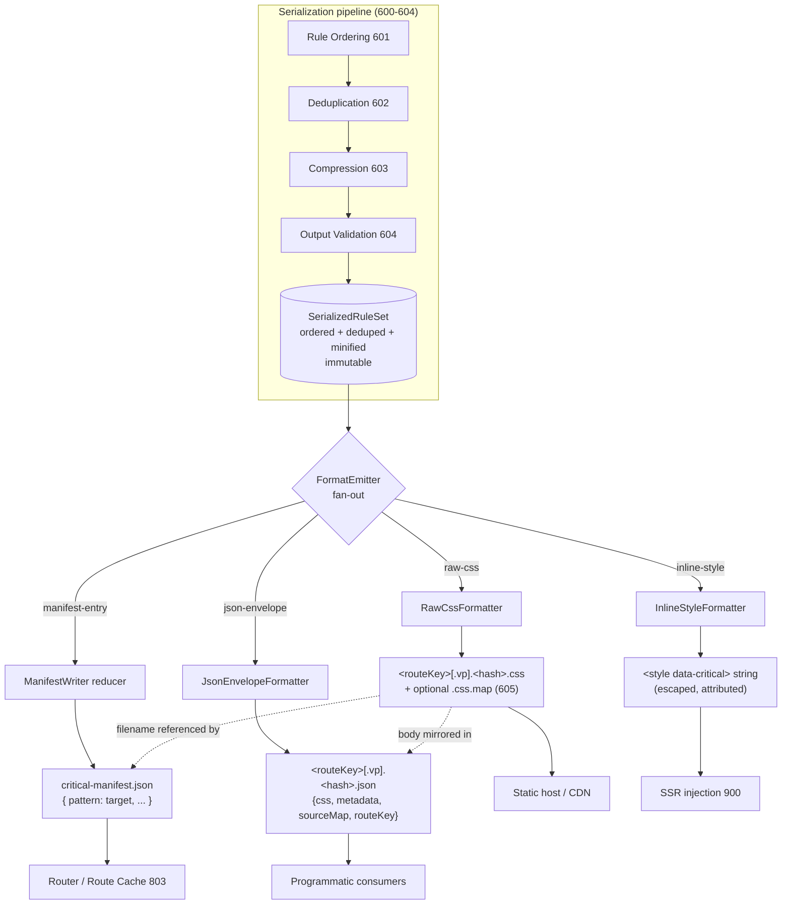
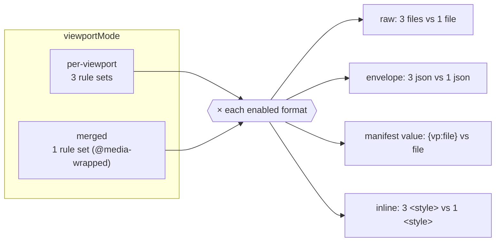

# 606 — Output Formats

## 1. Title

**Critical CSS Extraction Engine — Serializer Module: Output Format Emission Design**

## 2. Version

| Field | Value |
|---|---|
| Document Version | 1.0.0 |
| Status | Draft — Phase 8 (Serialization) |
| Last Updated | 2026-07-09 |
| Owners | Core Architecture Working Group |
| Stability | The set of format *kinds* (raw CSS, inline `<style>`, JSON envelope, manifest entry) is stable and treated as a public contract. The JSON envelope's field *schema* is versioned via its own `schemaVersion` field and may gain additive fields without a breaking change. Naming/hashing conventions are stable but tunable via configuration. |

## 3. Purpose

The Serializer is the last transform in the extraction pipeline: it receives a fully ordered, deduplicated, dependency-complete set of CSS rules (produced by the ordering pass of [601-Rule-Ordering.md](../design/601-Rule-Ordering.md) and the deduplication pass of [602-Deduplication.md](../design/602-Deduplication.md), optionally compressed per [603-Compression.md](../design/603-Compression.md) and validated per [604-Output-Validation.md](../design/604-Output-Validation.md)) and must turn that in-memory rule set into one or more **concrete, on-disk or in-band artifacts** that downstream consumers can actually use.

This document defines *what those artifacts are*, *why each one exists*, *how they are named and hashed on disk*, and *how the caller chooses which to emit*. It is deliberately narrow: it is not about how rules are ordered, deduplicated, or minified — those are the responsibility of sibling documents — and it is not about how the emitted artifacts are subsequently consumed at request time (that is the SSR layer's job, documented in [900-SSR-Overview.md](../design/900-SSR-Overview.md)) or how they are cached across runs (the cache layer's job, [803-Route-Cache.md](../design/803-Route-Cache.md)). This document sits at the seam between "the engine has computed the critical CSS" and "someone else consumes it," and it specifies the exact byte-level and structural shape of everything that crosses that seam.

Concretely, this document answers four questions:

1. **What can the Serializer emit?** Four format kinds: a raw `.css` file, an inline `<style>` string, a JSON envelope, and a per-route manifest entry. Each is justified against a specific consumer named in [BRIEF.md](../../BRIEF.md) Sections 2.9 (route manifest) and 2.10 (SSR integration).
2. **Per-viewport or merged?** How the format layer interacts with the multi-viewport strategy of [BRIEF.md](../../BRIEF.md) Section 2.6 — whether it emits one artifact per viewport profile or a single merged artifact, and how that choice threads through every format kind.
3. **How are files named and hashed?** The deterministic naming scheme, the content-hash discipline that makes emitted filenames cache-bustable and integrity-checkable, and how those hashes tie into [803-Route-Cache.md](../design/803-Route-Cache.md).
4. **How is the format chosen?** The configuration surface (`output.formats`, `output.viewportMode`, `output.hash`, `output.naming`) and its resolution precedence.

## 4. Audience

- Implementers of `packages/serializer`'s `FormatEmitter`, `RawCssFormatter`, `InlineStyleFormatter`, `JsonEnvelopeFormatter`, and `ManifestWriter` components — the concrete classes this document specifies.
- Implementers of the SSR adapters in Phase 11 ([900-SSR-Overview.md](../design/900-SSR-Overview.md) and its framework-specific descendants), who consume the inline `<style>` string and the JSON envelope and must rely on their exact shapes.
- Implementers of the Cache Manager ([803-Route-Cache.md](../design/803-Route-Cache.md)), who persist and look up emitted artifacts keyed by route and content hash.
- CLI and CI/CD integrators who configure which formats a build emits and where artifacts land.
- Authors of programmatic consumers (build plugins, bundler integrations) that read the JSON envelope rather than shelling out to the CLI.

Readers are assumed to have read [600-Serialization-Overview.md](../design/600-Serialization-Overview.md), which establishes the Serializer's placement in the pipeline and the shape of the `SerializedRuleSet` this document consumes as its input. This document does not re-explain rule ordering, deduplication, or minification.

## 5. Prerequisites

- [600-Serialization-Overview.md](../design/600-Serialization-Overview.md) — establishes the `SerializedRuleSet` data structure (the ordered, deduplicated rule list plus dependency preamble) that every formatter in this document consumes, and the Serializer's position as the terminal pipeline stage.
- [605-Source-Maps.md](../design/605-Source-Maps.md) — defines the source-map artifact that the JSON envelope optionally embeds or references, and the `sourceMap` sidecar file the raw-CSS format may emit alongside the `.css`.
- [BRIEF.md](../../BRIEF.md) Section 2.9 (Route Manifest) and Section 2.10 (SSR Integration) — the two source-of-truth passages that motivate the manifest-entry and inline-`<style>` formats respectively.
- [BRIEF.md](../../BRIEF.md) Section 2.6 (Multi-Viewport Strategy) — motivates the per-viewport vs merged artifact distinction.
- `docs/architecture/006-Design-Principles.md` — Principle 5 (Determinism of Output) and Principle 6 (Fail Fast, Fail Loud), both of which constrain the naming/hashing scheme and the envelope schema.
- `docs/architecture/016-Data-Flow.md` — the DTO conventions used across the pipeline, which the JSON envelope's field naming follows.
- Familiarity with content-addressable naming (the `name.<hash>.css` idiom used by webpack/Vite) and with subresource-integrity semantics.

## 6. Related Documents

- [600-Serialization-Overview.md](../design/600-Serialization-Overview.md) — parent document; defines the input to this stage.
- [601-Rule-Ordering.md](../design/601-Rule-Ordering.md) — produces the deterministic rule order that all formats preserve byte-for-byte.
- [602-Deduplication.md](../design/602-Deduplication.md) — guarantees the rule set contains no duplicate declarations before formatting.
- [603-Compression.md](../design/603-Compression.md) — the minification pass whose on/off state changes the *bytes* a format emits but never its *structure*.
- [604-Output-Validation.md](../design/604-Output-Validation.md) — validates emitted CSS parses cleanly; runs per format kind before an artifact is written.
- [605-Source-Maps.md](../design/605-Source-Maps.md) — the source-map artifact referenced/embedded by the raw and JSON formats.
- [900-SSR-Overview.md](../design/900-SSR-Overview.md) — *forward reference* (Phase 11, in progress); primary consumer of the inline `<style>` and JSON envelope formats.
- [803-Route-Cache.md](../design/803-Route-Cache.md) — *forward reference* (Phase 10, in progress); persists emitted artifacts keyed by route and consumes the manifest-entry format.

## 7. Overview

Extraction is expensive — it launches a real browser, navigates, stabilizes rendering, walks the CSSOM, matches selectors, and resolves a dependency graph. All of that work culminates in a single logical value: the set of CSS rules required above the fold for a given route and viewport profile. That value is useless until it is *serialized into a shape a consumer can hold*. Different consumers want radically different shapes:

- A **static build pipeline** wants a `.css` file on disk it can fingerprint, upload to a CDN, and reference from a `<link rel="preload">` or inline via its own tooling.
- An **SSR server** ([BRIEF.md](../../BRIEF.md) §2.10) wants a ready-to-inject `<style>` string it can splice into the `<head>` of an HTML response with no further processing — ideally already escaped and attributed.
- A **programmatic consumer** (a bundler plugin, a CI reporter, a custom deploy script) wants structured data: the CSS *plus* metadata (which route, which viewport, what size, what fingerprint, when generated) *plus* a source map, all in one addressable object it can reason about without re-parsing CSS.
- A **routing layer** ([BRIEF.md](../../BRIEF.md) §2.9) wants a compact map from route pattern to the filename holding that route's critical CSS — the *route manifest*.

Rather than force every consumer to adapt one canonical output, the Serializer offers four **output formats**, each a projection of the same underlying `SerializedRuleSet`. The critical design invariant is that **all four formats are derived from one identical serialized rule set** — they never re-run ordering, dedup, or minification independently, and they never disagree about the CSS bytes. The raw `.css` file, the inline `<style>` body, and the JSON envelope's `css` field are byte-for-byte identical for the same input and configuration; the manifest entry merely *points at* the raw file. This is what makes the multi-format design safe: format selection is a pure fan-out at the very end of the pipeline, not a branch that could produce divergent CSS.

Orthogonal to *format kind* is the *viewport dimension*. The engine extracts per viewport profile (Mobile, Tablet, Desktop — [BRIEF.md](../../BRIEF.md) §2.6). The format layer must decide whether to emit **one artifact per viewport** (three `.css` files, three manifest entries) or a **single merged artifact** (one `.css` with the per-viewport rules wrapped in normalized `@media` blocks). This is a configuration choice (`output.viewportMode`) that composes with every format kind: you can have per-viewport raw files, a merged JSON envelope, and so on. Section 8 works through the full cross-product.

The remaining structural concern is **naming and hashing**. Emitted files must have deterministic, collision-resistant, cache-bustable names so that (a) re-running extraction on unchanged input produces the identical filename (Principle 5, Determinism), (b) any change in CSS content changes the filename (enabling immutable CDN caching), and (c) the route manifest and the [803-Route-Cache.md](../design/803-Route-Cache.md) can key on those names/hashes without ambiguity.

## 8. Detailed Design

### 8.1 The four format kinds

Every formatter implements a common interface. The Serializer holds an ordered list of enabled formatters and invokes each against the same input:

```
interface Formatter {
  readonly kind: 'raw-css' | 'inline-style' | 'json-envelope' | 'manifest-entry';
  emit(input: SerializedRuleSet, ctx: EmitContext): EmitResult;
}

interface EmitContext {
  route: string;            // e.g. "/", "/products", "/blog/*"
  routeKey: string;         // stable slug derived from route, e.g. "home", "products", "blog_wildcard"
  viewport: ViewportId | 'merged';   // "mobile" | "tablet" | "desktop" | "merged"
  config: OutputConfig;
  buildId: string;          // opaque per-run id, used in metadata only, never in hashes
  sourceMap?: SourceMap;    // supplied when 605 source-map generation is enabled
}

interface EmitResult {
  kind: Formatter['kind'];
  // Exactly one of the following is populated per result:
  file?: { path: string; bytes: Buffer; integrity: string };   // raw-css, json-envelope, source-map sidecar
  inband?: { html: string };                                    // inline-style
  manifestEntry?: { pattern: string; target: string; hash: string; bytes: number };
}
```

#### 8.1.1 Raw `.css` file

The foundational format. It writes the serialized CSS bytes verbatim to a file. Its purpose is to be the canonical on-disk artifact that all other on-disk formats reference: the manifest entry points at it, and the JSON envelope's `css` field mirrors it. When [605-Source-Maps.md](../design/605-Source-Maps.md) generation is enabled and the CSS is minified, the raw formatter also emits a `.css.map` sidecar and appends a `/*# sourceMappingURL=<name>.css.map */` comment as the final line.

**Why it exists:** it is the lowest-common-denominator artifact. Every static host, CDN, and framework can consume a `.css` file. It is also the only format that is *self-describing on disk* independent of the engine.

#### 8.1.2 Inline `<style>` string (SSR injection)

Returns an HTML fragment — a `<style>` element whose body is the serialized CSS — as an in-band string (not written to disk by the Serializer itself; the SSR consumer splices it into a response). This directly serves the SSR injection consumers of [BRIEF.md](../../BRIEF.md) §2.10 and [900-SSR-Overview.md](../design/900-SSR-Overview.md).

The element carries attributes that let the SSR layer and the browser reason about it:

```html
<style data-critical="true"
       data-route="/products"
       data-viewport="mobile"
       data-hash="a1b2c3d4">/* ...css... */</style>
```

**Escaping discipline:** the CSS body is scanned and any literal `</style` sequence (case-insensitive, whitespace-tolerant) is neutralized by escaping the `<` as `\3C ` (CSS unicode escape), because CSS content inside a `<style>` element is *raw text* per the HTML parsing spec and a stray closing-tag sequence would terminate the element early. This is the one place the inline format's *bytes* legitimately differ from the raw `.css` file — and it differs only in the rare, well-defined case of an embedded closing-tag sequence (which is invalid to have unescaped in an HTML context anyway). Section 12 covers this edge case in full.

**Why it exists:** SSR frameworks want zero-latency injection — no extra network round trip for a `<link>`, no filesystem read at request time. A prebuilt string they concatenate into `<head>` is the fastest possible path. See [900-SSR-Overview.md](../design/900-SSR-Overview.md).

#### 8.1.3 JSON envelope

A single JSON object bundling the CSS with metadata, an optional source map, and the route key, for programmatic consumers:

```json
{
  "schemaVersion": "1.0",
  "routeKey": "products",
  "route": "/products",
  "viewport": "mobile",
  "css": "/* minified critical css string */",
  "sourceMap": { "version": 3, "sources": [], "mappings": "..." },
  "metadata": {
    "hash": "a1b2c3d4e5f6...",
    "bytes": 8421,
    "ruleCount": 142,
    "declarationCount": 610,
    "dependencyCounts": { "variables": 24, "keyframes": 3, "fontFaces": 2 },
    "extractionMode": "hybrid",
    "engineVersion": "1.0.0",
    "generatedAt": "2026-07-09T00:00:00.000Z",
    "buildId": "b-20260709-01"
  }
}
```

Field notes:

- `css` is byte-identical to the raw `.css` file's body (minus any `sourceMappingURL` trailer, which the envelope replaces with the embedded `sourceMap`).
- `sourceMap` is embedded inline (not a URL) when `output.sourceMap.embed = true`, per [605-Source-Maps.md](../design/605-Source-Maps.md); otherwise the field is `{ "url": "products.mobile.a1b2c3d4.css.map" }`.
- `routeKey` is the same stable slug used in filenames and manifest lookups, giving programmatic consumers a join key across all artifacts.
- `metadata.hash` is the content hash defined in §8.4 — the same value that appears in the filename and manifest.
- `metadata.generatedAt` and `metadata.buildId` are **excluded from the content hash** (§8.4) so that identical CSS produces an identical hash across runs despite differing timestamps.

**Why it exists:** programmatic consumers should never have to re-parse CSS to learn its size, route, or fingerprint, and should never have to correlate three separate files (`.css`, `.css.map`, manifest) by convention. The envelope is the single addressable unit for tooling. It is written to disk as `<name>.json` when the format is enabled for on-disk output, or returned in-band to a programmatic caller of the engine API.

#### 8.1.4 Per-route manifest entry

Not a per-route file but a *contribution* to a shared manifest. Each extraction of a route yields one manifest entry mapping the route pattern to the emitted raw `.css` filename ([BRIEF.md](../../BRIEF.md) §2.9):

```json
{ "/": "home.css", "/products": "products.css", "/blog/*": "blog.css" }
```

The `ManifestWriter` is a *reducer*: it accumulates entries across all routes in a build and writes a single `critical-manifest.json` at the end. Under per-viewport mode the value is itself an object keyed by viewport (§8.3). The manifest is the lookup table the routing/SSR layer consults at request time to find which CSS file serves the current route — see [803-Route-Cache.md](../design/803-Route-Cache.md) for how the cache layer keys on it.

**Why it exists:** SSR and edge routers need an O(1) route-to-CSS lookup that does not require loading every CSS file. The manifest is that index. It is deliberately tiny (pattern → filename) so it can be loaded once at server boot and held in memory.

### 8.2 One rule set, many projections

The Serializer computes the `SerializedRuleSet` exactly once per (route, viewport) pair, then fans out to every enabled formatter. This is enforced structurally: `emit()` receives an *already-serialized, immutable* input. No formatter may mutate it or re-serialize. This guarantees the cross-format consistency invariant of Section 7 and localizes all CSS-generation logic to the ordering/dedup/compression passes upstream.

### 8.3 Per-viewport vs merged artifacts

Two `output.viewportMode` values:

**`per-viewport`** — the engine emits a distinct artifact per profile. Three raw files (`products.mobile.<hash>.css`, `products.tablet.<hash>.css`, `products.desktop.<hash>.css`), three envelopes, and a manifest whose route value is an object:

```json
{ "/products": { "mobile": "products.mobile.a1b2.css",
                 "tablet": "products.tablet.c3d4.css",
                 "desktop": "products.desktop.e5f6.css" } }
```

This mode is chosen when the consumer serves viewport-specific CSS (e.g., an SSR layer that inspects the request User-Agent / client hints and injects only the matching profile's CSS), minimizing per-request bytes.

**`merged`** — the engine merges the three viewport rule sets into one artifact, wrapping viewport-specific rules in normalized `@media` blocks and hoisting rules common to all viewports outside any media query (the merge algorithm itself lives in [601-Rule-Ordering.md](../design/601-Rule-Ordering.md) / [602-Deduplication.md](../design/602-Deduplication.md); this document only consumes its output). One `products.<hash>.css`, one envelope with `"viewport": "merged"`, one manifest string value. Chosen when a single CSS payload must serve all devices (static hosting, or SSR that cannot vary by device).

The two dimensions (format kind × viewport mode) compose freely, giving the cross-product in §9's diagram. The `viewport` field in `EmitContext` is either a concrete `ViewportId` (per-viewport) or the literal `'merged'`.

### 8.4 Naming and hashing

**Filename grammar:**

```
<routeKey>[.<viewport>].<hash>.<ext>        (when output.hash = true, the default)
<routeKey>[.<viewport>].<ext>               (when output.hash = false)
```

- `routeKey`: a stable, filesystem-safe slug derived deterministically from the route pattern. `/` → `home` (configurable via `output.naming.indexKey`), `/products` → `products`, `/blog/*` → `blog_wildcard`, `/a/b` → `a_b`. Derivation is pure: same route ⇒ same key. Collisions across distinct routes that slugify identically are detected and are a fatal build error (Principle 6), never silently coalesced.
- `viewport` segment: present only in `per-viewport` mode.
- `hash`: the first `output.hash.length` (default 8) hex chars of a SHA-256 over the **content-defining bytes only** — the serialized CSS body plus a canonical serialization of the fields that affect rendering (viewport id, extraction mode). Timestamps, `buildId`, and `generatedAt` are excluded so the hash is reproducible. This is the same value surfaced in `metadata.hash`, the manifest, and the `<style data-hash>` attribute.
- `ext`: `css` for raw, `json` for envelope, `css.map` for source-map sidecar.

**Integrity:** each written file's `EmitResult.file.integrity` carries a full-length `sha256-<base64>` subresource-integrity string so consumers can emit `<link integrity=...>` or verify cache entries. The short filename `hash` and the full `integrity` derive from the same digest.

**Why content hashing:** immutable-caching CDNs require that a URL's content never changes; any change must produce a new URL. Content-addressed filenames satisfy this for free and make the manifest self-invalidating — a content change changes the filename, which changes the manifest value, which the [803-Route-Cache.md](../design/803-Route-Cache.md) treats as a new entry.

### 8.5 Configuration surface

```
interface OutputConfig {
  formats: Array<'raw-css' | 'inline-style' | 'json-envelope' | 'manifest-entry'>;
  viewportMode: 'per-viewport' | 'merged';       // default 'merged'
  hash: false | { length: number };               // default { length: 8 }
  dir: string;                                     // output directory for file-based formats
  naming: { indexKey: string; separator: string; }; // default { indexKey: 'home', separator: '.' }
  manifestPath: string;                            // default '<dir>/critical-manifest.json'
  sourceMap: { emit: boolean; embed: boolean };    // see 605
  inline: { attributes: Record<string,string>; escapeStyleClose: boolean }; // escape default true
}
```

**Resolution precedence** (highest wins): explicit CLI flags → config file (`critical.config.*`) → environment variables → built-in defaults. The Configuration Loader (BRIEF §2.4) resolves this before the Serializer runs; the Serializer receives a fully-resolved, validated `OutputConfig` and never reads raw config itself. If `formats` is empty, that is a fatal configuration error (an extraction that emits nothing is always a mistake — Principle 6).

## 9. Architecture (Mermaid)

Format variants branching from one serialized rule set:



Viewport dimension composing with format kind:



## 10. Algorithms (pseudocode + complexity)

### 10.1 Problem statement

Given one immutable `SerializedRuleSet` for a (route, viewport) pair and a resolved `OutputConfig`, produce the set of `EmitResult`s for every enabled format, plus accumulate the manifest entry into a shared reducer. Filenames must be deterministic and content-addressed.

**Inputs:** `SerializedRuleSet srs`, `EmitContext ctx`, shared `ManifestAccumulator man`.
**Outputs:** `EmitResult[]` (files buffered/written, in-band strings returned); `man` mutated with one entry.

### 10.2 Emission pseudocode

```
function emitAll(srs, ctx, man):
    body   := srs.cssBytes                        # already ordered/deduped/minified
    hash   := contentHash(body, ctx.viewport, ctx.config.extractionMode)   # SHA-256, hex
    short  := ctx.config.hash ? hash[0 : ctx.config.hash.length] : null
    results := []

    for fmt in ctx.config.formats:                # order-preserving; each kind at most once
        switch fmt:
          case 'raw-css':
              name := fileName(ctx.routeKey, ctx.viewport, short, 'css')
              bytes := body
              if srs.sourceMap and ctx.config.sourceMap.emit and not embed:
                  bytes := body + "\n/*# sourceMappingURL=" + name + ".map */"
                  results.push(file(name + ".map", serialize(srs.sourceMap)))
              results.push(file(name, bytes, integrity(hash)))

          case 'inline-style':
              css := ctx.config.inline.escapeStyleClose ? escapeStyleClose(body) : body
              html := "<style " + renderAttrs(ctx, short) + ">" + css + "</style>"
              results.push(inband(html))

          case 'json-envelope':
              env := {
                schemaVersion: "1.0", routeKey: ctx.routeKey, route: ctx.route,
                viewport: ctx.viewport, css: body,
                sourceMap: resolveSourceMap(srs, ctx, name),
                metadata: buildMetadata(srs, hash, ctx)   # excludes generatedAt/buildId from hash
              }
              jname := fileName(ctx.routeKey, ctx.viewport, short, 'json')
              results.push(file(jname, utf8(JSON.stringify(env)), integrity_of(env)))

          case 'manifest-entry':
              target := fileName(ctx.routeKey, ctx.viewport, short, 'css')
              man.add(ctx.route, ctx.viewport, target, hash, len(body))

    return results

function fileName(key, vp, short, ext):
    parts := [key]
    if vp != 'merged': parts.push(vp)
    if short != null:  parts.push(short)
    return join(parts, cfg.naming.separator) + "." + ext
```

`escapeStyleClose(body)` scans once for the regex `</\s*style` (case-insensitive) and replaces the `<` with the CSS escape `\3C ` — a single linear pass.

The `ManifestAccumulator.add` and final `flush`:

```
function ManifestAccumulator.add(route, vp, target, hash, bytes):
    key := route
    if cfg.viewportMode == 'per-viewport':
        entries[key] := entries[key] or {}
        if entries[key][vp] exists and entries[key][vp].target != target:
            fail("manifest conflict for " + route + "/" + vp)   # Principle 6
        entries[key][vp] := { target, hash, bytes }
    else:
        if entries[key] exists and entries[key].target != target:
            fail("manifest conflict for " + route)
        entries[key] := { target, hash, bytes }

function ManifestAccumulator.flush():
    # emit compact {pattern: target} plus a sidecar {pattern: {target,hash,bytes}} rich form
    write(cfg.manifestPath, JSON.stringify(project(entries)))
```

### 10.3 Complexity

Let `B` = CSS byte length, `F` = number of enabled formats (≤ 4), `R` = number of routes, `V` = number of viewports (≤ 3).

- **Per (route, viewport) emission:** `contentHash` is O(B). Each formatter is O(B) (a copy, an escape scan, or a JSON stringify over a payload dominated by the CSS body). Total per call: O(F · B) = O(B) since F ≤ 4.
- **Whole build:** O(R · V · B) time, which is optimal — every emitted byte must be produced at least once.
- **Memory:** O(B) transient per emission (the body plus the largest single projection). The manifest accumulator is O(R · V) — tiny (pattern→filename entries), held for the whole build. Files are streamed to disk and not retained.

### 10.4 Failure cases

- **Empty `formats`** → fatal before any emission.
- **RouteKey slug collision** across distinct routes → fatal at manifest flush.
- **Manifest target conflict** (same route/viewport mapped to two different files in one build) → fatal.
- **Disk write failure** → surfaced immediately; a partial artifact is deleted (no half-written `.css` left to be served). See §11.
- **Source map requested but absent** on the rule set → warning, emit CSS without the trailer (non-fatal; source maps are advisory per [605-Source-Maps.md](../design/605-Source-Maps.md)).

### 10.5 Optimization opportunities

The `contentHash` can be computed incrementally during the upstream compression pass (streaming the minified bytes through the hasher as they are produced) so the format layer receives the hash for free — eliminating one O(B) pass. The JSON stringify can stream directly to the file handle for very large envelopes rather than buffering the whole string.

## 11. Implementation Notes

- **Atomic writes.** Every file-based format writes to a temp path (`<name>.<pid>.tmp`) then `rename`s into place. Rename is atomic on POSIX; this guarantees a consumer (or [803-Route-Cache.md](../design/803-Route-Cache.md)) never observes a partial file. On write failure the temp file is unlinked.
- **Deterministic JSON.** The envelope and manifest are serialized with sorted object keys and a fixed 2-space (or none, if minified) indentation, so byte output is reproducible across platforms and Node versions (Principle 5). Numbers use canonical formatting; no `NaN`/`Infinity` can appear (guarded at metadata construction).
- **Hash stability.** `generatedAt`, `buildId`, `engineVersion` are intentionally *outside* the hash pre-image. This is the single most important implementation detail — getting it wrong makes every build produce new filenames and defeats caching. There is a golden test asserting two runs of identical input produce identical hashes ([604-Output-Validation.md](../design/604-Output-Validation.md) coordinates this check).
- **Formatter registration order.** `formats` array order is preserved and is the order results are returned, but it has no effect on file contents; it exists only so a caller can predict result ordering.
- **Inline attribute injection.** `output.inline.attributes` merges over the defaults; a consumer can add `nonce="..."` for CSP compliance. The `nonce` is *never* hashed (it is per-request in real SSR, supplied by the consumer, not the engine) — the engine emits a placeholder or omits it, and [900-SSR-Overview.md](../design/900-SSR-Overview.md) documents runtime nonce injection.
- **Manifest is a reducer, not a formatter.** It is the only stateful component; it lives for the whole build and flushes once. Treating it as per-route would produce R conflicting manifests. Implementers must wire it as a build-scoped singleton.
- **Encoding.** All text artifacts are UTF-8 without BOM. The raw `.css` is emitted with a leading `@charset "UTF-8";` only if the CSS contains non-ASCII bytes and no `@charset` was already produced upstream, per CSS spec ordering (must be first).

## 12. Edge Cases

- **`</style>` inside CSS content.** A declaration like `content: "</style>"` would, unescaped, terminate the inline `<style>` element early per HTML raw-text parsing. The inline formatter escapes the `<` (§8.1.2). The raw `.css` file is unaffected (it is not HTML). This is the sole legitimate byte-divergence between raw and inline formats.
- **Empty rule set.** A route with no above-fold critical CSS (e.g., a blank page) still emits a zero-length `.css` and a valid envelope with `css: ""`, `ruleCount: 0`. This is not an error — it is a meaningful result the consumer must be able to represent. The manifest still records the (empty) file.
- **Route slug collisions.** `/products` and `/products/` may slugify identically depending on trailing-slash policy; the engine normalizes trailing slashes before slugifying and fails loudly on any residual collision (§10.4).
- **Wildcard routes.** `/blog/*` → `blog.css` in the manifest keeps the literal `*` in the *key* but a safe slug (`blog_wildcard`) in the *filename*. Consumers match request paths against the manifest *keys* (patterns), then load the *value* (file).
- **Very large envelopes.** A huge stylesheet's envelope can exceed comfortable in-memory JSON string sizes; §10.5's streaming stringify path is the mitigation. Programmatic API consumers that request the envelope in-band receive an object, not a string, avoiding the issue.
- **Non-ASCII / emoji in `content`.** UTF-8 is preserved end-to-end; hashing operates on bytes, so identical Unicode content hashes identically regardless of platform locale.
- **Source-map + minification interaction.** Only minified output carries a source map that adds value; if `compression` is off, [605-Source-Maps.md](../design/605-Source-Maps.md) recommends skipping the map. The format layer honors whatever the rule set carries and does not itself decide to generate maps.
- **Constructable / adopted stylesheets contributing rules.** These arrive already flattened into the `SerializedRuleSet` by the CSSOM layer ([307-Constructable-Stylesheets.md](../design/307-Constructable-Stylesheets.md)); the format layer sees ordinary rules and needs no special handling — noted here only to close the loop for readers auditing every CSS source.
- **Merged mode with a viewport that has zero unique rules.** The merge upstream drops the empty `@media` block; the format layer never sees it. No empty media queries are ever emitted.

## 13. Tradeoffs

**Four formats vs one canonical format.**
*Why four:* each named consumer class in [BRIEF.md](../../BRIEF.md) §2.9/§2.10 has genuinely different ergonomic needs; forcing one format on all of them pushes adaptation cost onto every consumer and invites divergent, buggy re-serialization at each site.
*Alternatives considered:* (a) emit only raw `.css` and let consumers derive the rest — rejected because SSR injection and the manifest lookup are so common that leaving them to consumers guarantees inconsistent, insecure (unescaped) reimplementations; (b) emit only the JSON envelope as the universal format and have a thin adapter derive files — viable, and effectively what we do internally, but static hosts and CDNs cannot consume JSON directly, so the raw file must be a first-class artifact.
*Tradeoff:* more formatters to maintain and test, mitigated by the single-serialized-rule-set invariant that keeps all CSS-generation logic in one place.

**Content-hashed filenames vs stable filenames.**
*Why hashed (default):* immutable CDN caching and self-invalidating manifests.
*Alternative:* stable names (`products.css`) with cache-busting via query string — rejected as default because many CDNs ignore query strings for caching and because it complicates integrity verification; offered as `output.hash = false` for consumers (e.g., committed-to-repo workflows) that prefer stable names.
*Tradeoff:* hashed names require the manifest as an indirection layer; without hashing consumers could hardcode filenames but lose immutable caching.

**Per-viewport vs merged.**
*Merged (default)* minimizes artifact count and works everywhere but ships every device's CSS to every device (larger payload).
*Per-viewport* minimizes per-request bytes but requires a consumer capable of selecting the right profile (SSR with client hints). We default to `merged` because it is universally consumable; per-viewport is an opt-in for SSR-savvy deployments.

**Embedding source maps in the envelope vs referencing them.**
*Embedding* makes the envelope fully self-contained (one file, one fetch) at the cost of size; *referencing* keeps the envelope small but requires the `.css.map` sidecar to travel with it. Configurable (`sourceMap.embed`), defaulting to referenced for on-disk output and embedded for in-band programmatic use.

## 14. Performance

- **CPU:** O(R · V · B) total (§10.3), optimal — no format adds asymptotic cost beyond emitting bytes. The dominant constant is JSON stringification; for CSS-heavy envelopes the CSS body copy dominates. Hashing is a single SHA-256 pass, shareable with compression (§10.5).
- **Memory:** transient O(B) per emission; the only build-lifetime allocation is the manifest accumulator at O(R · V) small entries. Files stream to disk; no artifact set is held in memory simultaneously.
- **Caching strategy:** content-hashed names *are* the caching primitive. Unchanged input ⇒ identical hash ⇒ [803-Route-Cache.md](../design/803-Route-Cache.md) hits without re-emitting. The hash is the join key across cache, manifest, and CDN.
- **Parallelization:** formats for a single (route, viewport) are cheap and run serially; the real parallelism is across routes/viewports, orchestrated upstream (worker threads, BRIEF §2.14). The Serializer is stateless per call except the manifest reducer, whose `add` must be synchronized (or shard-then-merge) under parallel emission — the recommended pattern is per-worker local accumulators merged at flush, avoiding lock contention.
- **Incremental execution:** because hashing excludes timestamps, an incremental build that finds a route's fingerprint unchanged ([803-Route-Cache.md](../design/803-Route-Cache.md)) can skip emission entirely and reuse the prior filename in the manifest.
- **Profiling guidance:** watch JSON stringify time on large envelopes and the atomic-rename syscall count on builds with thousands of routes; batch renames if the filesystem is the bottleneck.
- **Scalability limits:** the manifest is a single JSON file; at tens of thousands of routes it grows to a few MB and should be sharded or served from a keyed store — a Future Work item.

## 15. Testing

- **Unit tests:** each formatter against a fixed `SerializedRuleSet`: assert raw bytes, assert inline escaping neutralizes `</style>`, assert envelope schema and field presence, assert manifest entry shape. Assert filename grammar for hashed/unhashed and per-viewport/merged.
- **Determinism (golden) tests:** run emission twice on identical input; assert byte-identical filenames, byte-identical `.css`, and byte-identical `.json` (after excluding `generatedAt`/`buildId`). This is the load-bearing test for the caching contract.
- **Cross-format consistency tests:** assert the raw `.css` body, the inline `<style>` body (modulo `</style>` escaping), and the envelope's `css` field are identical for the same input.
- **Integration tests:** full pipeline (extract → serialize → emit) on Tailwind, Bootstrap, CSS-Modules, and huge-enterprise fixtures ([BRIEF.md](../../BRIEF.md) §2.15); assert the manifest round-trips (every emitted `.css` filename appears as a manifest value and vice versa).
- **Regression tests:** freeze a known route's manifest and hashes; fail if a code change perturbs them unexpectedly (guards accidental hash-input changes).
- **Stress tests:** 10k-route build — assert manifest correctness, bounded memory, and acceptable rename throughput.
- **Consumer contract tests:** feed the emitted inline string through an HTML parser and assert the `<style>` element parses with the CSS intact (catches escaping regressions); feed the envelope to a JSON-schema validator pinned to `schemaVersion`.
- **Visual tests:** downstream of format — the emitted CSS is injected into the original page and compared per [703-Visual-Diff.md](../design/703-Visual-Diff.md); a format bug that corrupts bytes surfaces as a visual regression.

## 16. Future Work

- **Additional format kinds:** a `<link rel="preload">`-plus-async-swap HTML fragment; a Brotli/gzip pre-compressed sidecar (`.css.br`) with its own hash; an HTTP `103 Early Hints` payload for edge injection.
- **Manifest sharding / keyed store:** for very large sites, replace the single `critical-manifest.json` with a directory of shards or a queryable store, addressing the §14 scalability limit.
- **Streaming envelope API:** an async-iterator variant that yields the envelope's CSS in chunks for very large payloads, avoiding full buffering (extends §10.5).
- **Signed artifacts:** optional cryptographic signatures over the integrity hash so edge/SSR consumers can verify provenance, complementing SRI.
- **Per-format compression negotiation:** let the manifest advertise available encodings per route so an edge worker can serve the best-supported one.
- **Open questions:** Should the manifest key use the raw route pattern or a normalized form for wildcard precedence resolution? Should the envelope embed the dependency graph ([014-Dependency-Graph.md](../architecture/014-Dependency-Graph.md)) for advanced consumers, or is that too heavy for the default schema? These are deferred to the SSR ([900-SSR-Overview.md](../design/900-SSR-Overview.md)) and cache ([803-Route-Cache.md](../design/803-Route-Cache.md)) documents, which consume these formats and are the natural venue to settle consumer-driven schema questions.

## 17. References

- [600-Serialization-Overview.md](../design/600-Serialization-Overview.md) — Serializer placement and `SerializedRuleSet` definition.
- [601-Rule-Ordering.md](../design/601-Rule-Ordering.md) — deterministic ordering preserved by all formats; viewport-merge ordering.
- [602-Deduplication.md](../design/602-Deduplication.md) — duplicate elimination and viewport-merge dedup.
- [603-Compression.md](../design/603-Compression.md) — minification pass affecting emitted bytes.
- [604-Output-Validation.md](../design/604-Output-Validation.md) — per-format parse validation and determinism checks.
- [605-Source-Maps.md](../design/605-Source-Maps.md) — source-map artifact embedded/referenced by raw and JSON formats.
- [900-SSR-Overview.md](../design/900-SSR-Overview.md) — *forward reference*; consumer of inline `<style>` and JSON envelope (Phase 11).
- [803-Route-Cache.md](../design/803-Route-Cache.md) — *forward reference*; persists artifacts keyed by route and content hash, consumes the manifest (Phase 10).
- [307-Constructable-Stylesheets.md](../design/307-Constructable-Stylesheets.md) — how adopted stylesheets flatten into the rule set before formatting.
- [703-Visual-Diff.md](../design/703-Visual-Diff.md) — downstream visual verification of emitted CSS.
- [014-Dependency-Graph.md](../architecture/014-Dependency-Graph.md) — dependency graph considered for envelope enrichment.
- [BRIEF.md](../../BRIEF.md) — §2.4 (System Modules / Serializer), §2.6 (Multi-Viewport), §2.9 (Route Manifest), §2.10 (SSR Integration), §2.14 (Performance), §2.15 (Testing).
- `docs/architecture/006-Design-Principles.md` — Principle 5 (Determinism), Principle 6 (Fail Fast, Fail Loud).
- CSS Syntax Module Level 3 (`@charset` ordering), HTML Standard (raw-text element parsing for `<style>`), Source Map v3 spec, Subresource Integrity spec.
