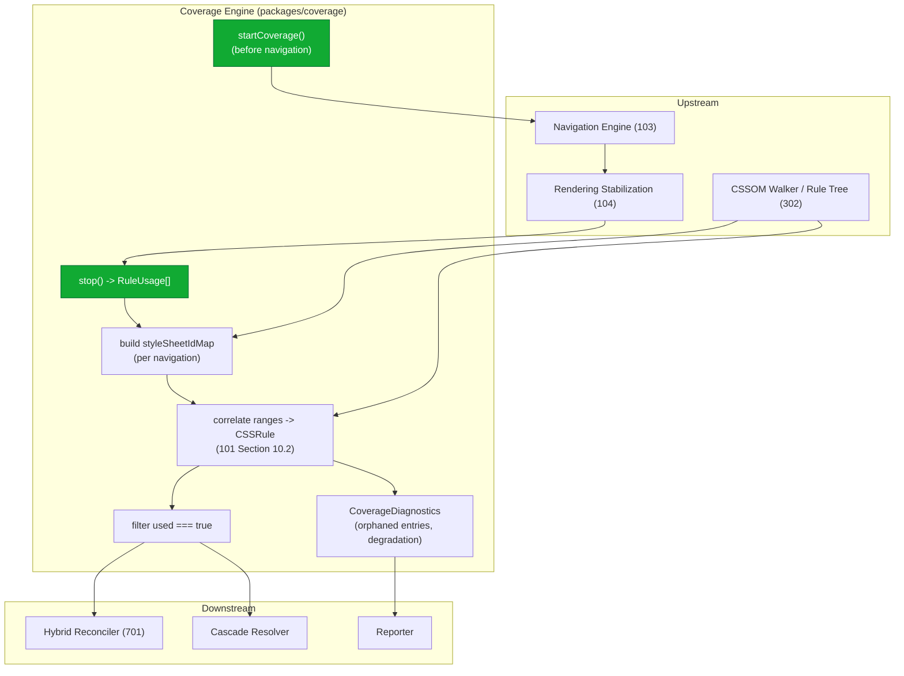
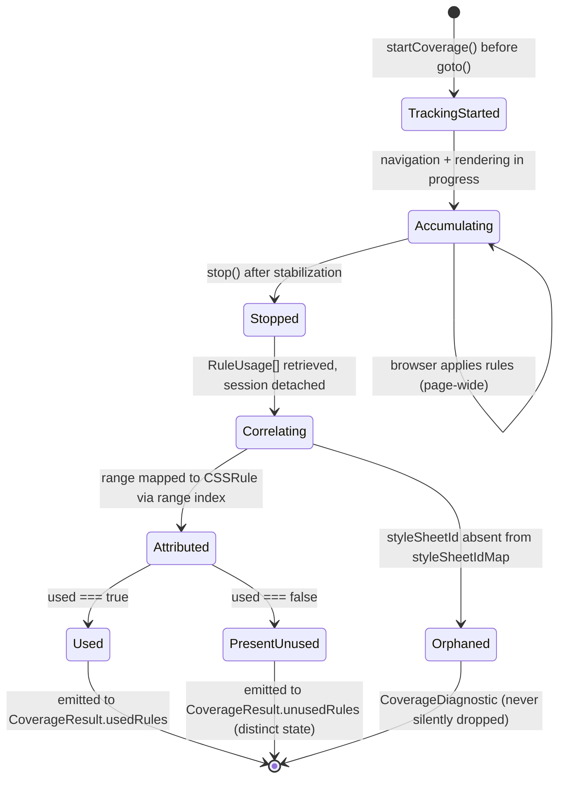

# 700 — Coverage Extraction Mode

## 1. Title

**Critical CSS Extraction Engine — Coverage Extraction Mode (Chrome DevTools CSS Coverage API Strategy)**

## 2. Version

| Field | Value |
|---|---|
| Document Version | 1.0.0 |
| Status | Draft — Phase 9 (Advanced Extraction) |
| Last Updated | 2026-07-09 |
| Owners | Coverage Engine Working Group |
| Stability | Interface stable against [ADR-0005](../adr/ADR-0005-Hybrid-Extraction-Mode.md); internal CDP wiring may evolve with the pinned Chromium build per [101-Playwright-Adapter.md](./101-Playwright-Adapter.md) Section 12 |

## 3. Purpose

This document specifies the **Coverage extraction mode** of the engine: the strategy that identifies which CSS rules to include in a critical bundle by consulting the Chrome DevTools Protocol (CDP) CSS Coverage API — `CSS.startRuleUsageTracking` / `CSS.takeCoverageDelta` / `CSS.stopRuleUsageTracking` — rather than (or, in Hybrid mode, alongside) the CSSOM selector-matching strategy defined in [400-Selector-Matching.md](./400-Selector-Matching.md).

Coverage mode answers a fundamentally different question from CSSOM matching. Where selector matching asks *"does this selector, as written, structurally match this DOM node?"*, Coverage asks *"did the browser's rendering engine actually mark this byte range of this stylesheet as used while it rendered the page?"* The distinction is the entire reason Coverage mode exists as a first-class, separately-documented strategy: it observes genuine runtime application rather than static structural correspondence, and it is the only signal in the engine that reflects the browser's own accounting of what it touched during layout and paint.

This document is scoped to Coverage mode as a **standalone strategy** and as the **Coverage-signal contributor to Hybrid mode**. It specifies what the Coverage API reports, how used-byte-ranges are mapped back to `CSSRule` objects, why Coverage's blind spots make it unsuitable as the sole strategy for a *fold-scoped* critical-CSS tool, and how it degrades on non-Chromium engines. It does not re-derive the CDP wiring itself (owned by [101-Playwright-Adapter.md](./101-Playwright-Adapter.md) Section 8.4) nor the three-signal reconciliation logic (owned by [701-Hybrid-Mode.md](./701-Hybrid-Mode.md) and [ADR-0005](../adr/ADR-0005-Hybrid-Extraction-Mode.md)).

## 4. Audience

- Implementers of the Coverage Engine package (`packages/coverage`), who own the code this document specifies.
- Implementers of [701-Hybrid-Mode.md](./701-Hybrid-Mode.md), who consume Coverage mode's output as one of three reconciled signals.
- Implementers of the Playwright Adapter ([101-Playwright-Adapter.md](./101-Playwright-Adapter.md) Section 8.4), who provide the `CoverageSession` primitive this mode drives.
- Engineers configuring extraction-mode selection in CI pipelines, deciding when a Coverage-only smoke check is sufficient versus when full Hybrid mode is warranted.
- Engineers debugging discrepancies between Coverage-reported rule sets and CSSOM-matched rule sets, for whom the Blind Spots section (Section 8.4) is the primary reference.

Readers are assumed to have read [ADR-0005-Hybrid-Extraction-Mode](../adr/ADR-0005-Hybrid-Extraction-Mode.md) in full, to understand the CDP `CSS` domain at the level presented in [101-Playwright-Adapter.md](./101-Playwright-Adapter.md) Section 8.4 and Section 10.2, and to be familiar with the CSSOM-matching baseline in [400-Selector-Matching.md](./400-Selector-Matching.md).

## 5. Prerequisites

- [ADR-0005-Hybrid-Extraction-Mode](../adr/ADR-0005-Hybrid-Extraction-Mode.md) — the decision record establishing Coverage as one of three signal sources and enumerating its blind spots (this document elaborates that ADR's Coverage-specific reasoning into implementation detail).
- [400-Selector-Matching.md](./400-Selector-Matching.md) — the CSSOM-matching strategy Coverage is contrasted against throughout.
- [101-Playwright-Adapter.md](./101-Playwright-Adapter.md) Section 8.4 (Coverage API Wiring) and Section 10.2 (Coverage-to-CSSOM Rule Correlation) — the concrete adapter mechanics this mode drives.
- Familiarity with the CDP `CSS` domain: `CSS.enable`, `CSS.startRuleUsageTracking`, `CSS.takeCoverageDelta`, `CSS.stopRuleUsageTracking`, and the `CSS.RuleUsage` record shape (`styleSheetId`, `startOffset`, `endOffset`, `used`).
- Familiarity with the browser's stylesheet-source-text model, since Coverage reports usage at byte-offset granularity within a stylesheet's source text, not at `CSSRule`-object granularity.
- [006-Design-Principles.md](../architecture/006-Design-Principles.md), particularly Principle 1 (Browser Is Source of Truth) and Principle 6 (Fail-Fast Diagnostics).

## 6. Related Documents

- [ADR-0005-Hybrid-Extraction-Mode](../adr/ADR-0005-Hybrid-Extraction-Mode.md) — decision record for combining Coverage with CSSOM matching and computed-style verification.
- [400-Selector-Matching.md](./400-Selector-Matching.md) — the CSSOM selector-matching strategy contrasted throughout this document.
- [101-Playwright-Adapter.md](./101-Playwright-Adapter.md) — the concrete `CoverageSession` implementation and the Coverage-to-CSSOM correlation algorithm this mode relies on.
- [701-Hybrid-Mode.md](./701-Hybrid-Mode.md) — the primary consumer of Coverage mode's output as one of three reconciled signals.
- [702-Computed-Style-Mode.md](./702-Computed-Style-Mode.md) — the third signal source in Hybrid mode; complements Coverage's rule-level granularity with per-node/property authority.
- [703-Visual-Diff.md](./703-Visual-Diff.md) — the end-to-end fidelity validation used to justify Coverage's blind-spot tradeoffs empirically.
- [704-Incremental-Extraction.md](./704-Incremental-Extraction.md) — consumes cached Coverage results and constrains how Coverage's page-wide collection model interacts with dependency-graph-scoped incremental runs.
- [006-Design-Principles.md](../architecture/006-Design-Principles.md)

## 7. Overview

Coverage mode is one of the pluggable extraction strategies mandated by Section 2.4 of the brief ("Pluggable extraction strategies (CSSOM, Coverage, Hybrid)") and the Coverage Engine module row in the same section ("Chrome DevTools Coverage API integration"). It occupies a position in the strategy space that is exactly orthogonal to CSSOM matching: it is *runtime-observed* rather than *structurally-inferred*.

The mechanics are deceptively simple to state and subtle to get right. Before navigation begins, the engine opens a CDP session against the target page and calls `CSS.startRuleUsageTracking`, which instructs Chromium to instrument its style-rule application machinery. The engine then navigates, waits for rendering to stabilize (per [104-Rendering-Stabilization.md](./104-Rendering-Stabilization.md)), and calls `CSS.stopRuleUsageTracking` (or `CSS.takeCoverageDelta`), which returns an array of `CSS.RuleUsage` records. Each record names a stylesheet (`styleSheetId`), a byte range within that stylesheet's source text (`startOffset`, `endOffset`), and a boolean `used` flag indicating whether the browser applied the rule occupying that range during the observed window. The engine then maps each used byte range back to a specific `CSSRule` object via the correlation algorithm in [101-Playwright-Adapter.md](./101-Playwright-Adapter.md) Section 10.2, producing a set of rule identifiers the browser genuinely applied.

The value of this signal is that it is grounded in the browser's actual cascade resolution. A rule that structurally matches a node but is entirely overridden by a higher-specificity rule — a false positive for CSSOM matching — is correctly *not* reported as used by Coverage for the properties it lost, because the browser never applied those losing declarations. Coverage therefore has near-zero false-positive rate with respect to "was this rule applied at all on this page." That accuracy is real and valuable.

But Coverage has two blind spots that are structural, not implementation bugs, and that this document treats as its central subject. **First**, Coverage reports usage across the *entire page*, not scoped to the above-the-fold region — it cannot, by itself, distinguish a rule used because it styles a visible hero banner from a rule used because it styles a footer 8,000 pixels below the fold. For a tool whose entire purpose is *fold-scoped* extraction (per Section 2.5 of the brief), this is a fundamental scope mismatch. **Second**, Coverage only reports what was actually triggered during the observed window; rules that would be needed for above-fold content but that were not triggered — because they depend on an interaction state, a class toggled by not-yet-run JavaScript, or a media/container condition not active at snapshot time — produce false negatives. These two blind spots are precisely why [ADR-0005](../adr/ADR-0005-Hybrid-Extraction-Mode.md) rejects Coverage as a standalone strategy for production and folds it into Hybrid mode, where CSSOM matching supplies the fold-scoping and computed-style verification supplies per-node authority.

## 8. Detailed Design

### 8.1 What Coverage Reports

The CDP `CSS.stopRuleUsageTracking` response is a list of `CSS.RuleUsage` records. The canonical shape, as surfaced by the Playwright Adapter before translation, is:

```
CSS.RuleUsage {
  styleSheetId: string      // opaque, engine-generated, per-navigation identifier
  startOffset: number       // byte offset into the stylesheet's source text
  endOffset: number         // byte offset (exclusive) into the stylesheet's source text
  used: boolean             // whether the rule occupying [startOffset, endOffset) was applied
}
```

Three properties of this shape drive the entire design of Coverage mode:

1. **Usage is reported at byte-range granularity, not `CSSRule`-object granularity.** A `RuleUsage` record identifies a span of source text, and it is the engine's responsibility (not Chromium's) to map that span to the specific `CSSStyleRule` the CSSOM Walker enumerated. This mapping is the Coverage-to-CSSOM correlation algorithm in [101-Playwright-Adapter.md](./101-Playwright-Adapter.md) Section 10.2, and it is where most of Coverage mode's real complexity lives.

2. **`styleSheetId` is opaque and per-navigation.** CDP assigns these identifiers freshly on each navigation and they bear no relationship to the `sourceStylesheetIndex` numbering the CSSOM Walker uses. A `styleSheetIdMap` must be built fresh per page to bridge the two numbering schemes, and must never be cached across navigations (per [101-Playwright-Adapter.md](./101-Playwright-Adapter.md) Implementation Notes).

3. **`used` is a boolean at rule granularity, not declaration granularity.** Coverage tells you the rule was applied; it does *not* tell you which of the rule's individual declarations won the cascade. A rule `.btn { color: red; padding: 4px }` where `color` is overridden elsewhere but `padding` wins is reported simply as `used: true` — the losing `color` declaration is invisible to Coverage's granularity. This is discussed further in Section 8.4 and is a key input to Hybrid mode's provisional-include-by-default policy ([701-Hybrid-Mode.md](./701-Hybrid-Mode.md)).

### 8.2 How Used-Rule Extraction Differs from CSSOM Matching

The two strategies produce set-shaped output of the same nominal type — a set of rule identifiers — but arrive at it through entirely different means and with entirely different error profiles. The following table is the conceptual core of this document:

| Dimension | CSSOM Matching ([400](./400-Selector-Matching.md)) | Coverage Mode (this document) |
|---|---|---|
| Question answered | "Does this selector structurally match this node?" | "Did the browser apply this rule while rendering?" |
| Primitive | `element.matches(selectorText)` per `(node, rule)` pair | `CSS.startRuleUsageTracking` → `RuleUsage[]` for the whole page |
| Scoping | Naturally scoped to the node set it is given (e.g., above-fold nodes) | Page-wide; no intrinsic fold-scoping |
| Cascade awareness | None — reports structural match regardless of who wins the cascade | Reflects real cascade outcome (overridden rules' losing properties not counted as used) |
| False positives | High — includes cascade-overridden rules | Near-zero for "applied at all" |
| False negatives | Low — comprehensive over structure | Moderate-to-high — misses untriggered-but-needed rules |
| Granularity | Per `(node, rule)` pair | Per byte range → per rule (never per declaration) |
| Engine support | All engines (Chromium/Firefox/WebKit) | Chromium only |
| Cost driver | IPC round trips for `matches()` calls | Browser-side instrumentation overhead, borne by the engine |

The single most important line in that table for understanding *why* the two strategies must be combined rather than chosen between is the **Scoping** row. CSSOM matching is scoped by construction: you hand it a node set, and it only reports matches against those nodes, so if you hand it the above-fold node set from the Visibility Engine, its output is already fold-scoped. Coverage has no such input — it observes the browser rendering the entire document, above and below the fold alike, and its output conflates the two. Coverage mode alone therefore cannot produce fold-scoped critical CSS; it can only produce "CSS used anywhere on the page," which is a strictly larger and different set.

### 8.3 The Coverage Extraction Pipeline

Coverage mode's standalone pipeline is a strict temporal sequence. Unlike CSSOM matching, which operates entirely on an already-stabilized DOM snapshot and can therefore run at any point after stabilization, Coverage mode has a hard ordering constraint: **tracking must be started before navigation and rendering begin.** Starting late means the browser may have already applied — and finished accounting for — the render-blocking stylesheets whose usage is *most* relevant to above-fold content, and that early usage would be silently lost. This ordering constraint is inherited directly from [ADR-0005](../adr/ADR-0005-Hybrid-Extraction-Mode.md) Implementation Notes item 1.

The standalone Coverage pipeline is:

1. **Acquire a page** from the Browser Pool with a Chromium engine (Coverage mode fails fast on non-Chromium — see Section 8.5).
2. **Start tracking** via `PageHandle.startCoverage()` ([101-Playwright-Adapter.md](./101-Playwright-Adapter.md) Section 8.4), which opens a CDP session, calls `CSS.enable`, then `CSS.startRuleUsageTracking`. This happens *before* `goto()`.
3. **Navigate** to the route via the Navigation Engine.
4. **Stabilize** rendering per the configured stabilization policy ([104-Rendering-Stabilization.md](./104-Rendering-Stabilization.md)). Coverage accumulates usage across this entire window.
5. **Stop tracking** via `CoverageSession.stop()`, retrieving `RuleUsage[]` and detaching the CDP session.
6. **Build the `styleSheetIdMap`** correlating CDP `styleSheetId` values to the CSSOM Walker's `sourceStylesheetIndex`, fresh for this navigation.
7. **Correlate** each `used` byte range to a `CSSRule` via the range-index algorithm ([101-Playwright-Adapter.md](./101-Playwright-Adapter.md) Section 10.2), producing a `CoverageResult` in the CSSOM Walker's own indexing scheme.
8. **Filter to used rules** — retain entries where `used === true`; entries where `used === false` are retained separately as an explicitly-representable "present but unused" state (per [101-Playwright-Adapter.md](./101-Playwright-Adapter.md) Section 12), never collapsed with "not reported at all."
9. **Emit** the used-rule set plus a `CoverageDiagnostics` channel (orphaned-coverage warnings, non-Chromium degradation markers).

In standalone Coverage-only mode, step 8's used-rule set is the extraction output directly. In Hybrid mode, it is instead handed to the Signal Reconciler ([701-Hybrid-Mode.md](./701-Hybrid-Mode.md)) as the Coverage signal `C`.

### 8.4 Coverage's Blind Spots

This section is the document's analytical center. Each blind spot is stated, explained mechanistically, and paired with the mitigation Hybrid mode provides.

**Blind Spot 1 — Page-wide, not fold-scoped.** Coverage instruments the browser applying rules to the whole document. A rule styling a below-fold footer, a below-fold testimonial carousel, or a below-fold data table is reported `used: true` identically to a rule styling the above-fold hero. Coverage has no concept of viewport geometry; it does not know or care where in the layout a styled element sits. For a critical-CSS tool, this means Coverage-only output systematically *over-includes* below-fold-only rules. *Mitigation:* Hybrid mode intersects Coverage's used set with CSSOM matches against the above-fold node set — a rule is a strong include only if Coverage reports it used AND it structurally matches an above-fold node (per [ADR-0005](../adr/ADR-0005-Hybrid-Extraction-Mode.md) Decision and [701-Hybrid-Mode.md](./701-Hybrid-Mode.md)).

**Blind Spot 2 — Only reports what was triggered.** Coverage reflects the browser's actual rendering during the observed window. Rules that would apply to above-fold content but were never triggered are false negatives. Concretely, this happens when: (a) a rule applies to an interaction state (`:hover`, `:focus`, `:active`, `[aria-expanded="true"]`) the engine did not simulate; (b) a rule applies to a class that not-yet-run JavaScript would add; (c) a rule lives in an `@media`/`@supports`/container-query branch inactive at snapshot time (this is *expected* agreement, not a bug — such a rule genuinely should not be in the current-viewport critical CSS); (d) content is lazily hydrated after the stabilization window closes. *Mitigation:* CSSOM matching is comprehensive over current structural state and catches (a)–(b) for states already present in the DOM; for states requiring simulation, neither signal helps and the gap is surfaced as a diagnostic rather than silently accepted. Coverage's false negatives are exactly why Hybrid mode treats CSSOM-matched-but-Coverage-silent rules as *provisional includes* (kept by default), not exclusions.

**Blind Spot 3 — Rule granularity, not declaration granularity.** As noted in Section 8.1, `used` is per-rule. A matched rule with one winning and one losing declaration is `used: true` wholesale. Coverage therefore cannot, alone, prune the losing declaration from the critical bundle. This is a granularity limitation of the current CDP API, not the engine; it is tracked in Future Work pending a hypothetical declaration-level CDP extension ([ADR-0005](../adr/ADR-0005-Hybrid-Extraction-Mode.md) Future Work).

**Blind Spot 4 — Byte-range-to-rule attribution imprecision for minified stylesheets.** Coverage's byte ranges do not always align cleanly with `CSSRule` boundaries, particularly for aggressively minified stylesheets where whitespace elision and rule concatenation blur offsets, or for rules nested several levels deep in `@media`/`@layer`/`@supports` blocks. The correlation algorithm ([101-Playwright-Adapter.md](./101-Playwright-Adapter.md) Section 10.2) mitigates this by mapping ranges through the CSSOM Walker's own rule-boundary bookkeeping rather than naive text-offset arithmetic, but residual imprecision at exact boundaries is a documented, version-dependent risk requiring validation against the pinned Chromium build.

## 9. Architecture

### 9.1 Coverage Mode Component View



### 9.2 Sequence: start → navigate → stop → map-ranges-to-rules

```mermaid
sequenceDiagram
    participant Orch as Orchestrator
    participant Cov as Coverage Engine
    participant Adapter as PlaywrightPageHandle
    participant CDP as CDPSession
    participant Browser as Chromium renderer
    participant Walker as CSSOM Walker

    Orch->>Cov: begin Coverage extraction (Chromium confirmed)
    Cov->>Adapter: startCoverage()
    Adapter->>CDP: newCDPSession(page)
    Adapter->>CDP: send('CSS.enable')
    Adapter->>CDP: send('CSS.startRuleUsageTracking')
    CDP->>Browser: begin instrumenting rule application
    Note over Cov,Browser: MUST precede navigation (ADR-0005 IN item 1)

    Orch->>Adapter: goto(route)  [via Navigation Engine]
    Browser->>Browser: parse CSS, layout, paint\n(accumulate rule usage, page-wide)
    Orch->>Adapter: await stabilization (104)

    Orch->>Cov: coverageSession.stop()
    Cov->>CDP: send('CSS.stopRuleUsageTracking')
    CDP->>Browser: retrieve accumulated RuleUsage[]
    Browser-->>CDP: RuleUsage[] (styleSheetId, offsets, used)
    CDP-->>Cov: RuleUsage[]
    Cov->>CDP: detach()

    Cov->>Walker: request rule-boundary metadata + sourceStylesheetIndex
    Walker-->>Cov: RuleTree with per-rule byte ranges
    Cov->>Cov: build styleSheetIdMap (CDP id -> sourceStylesheetIndex)
    Cov->>Cov: for each RuleUsage: binary-search range index -> sourceRuleIndex
    Cov->>Cov: filter used === true; record orphaned entries as diagnostics
    Cov-->>Orch: CoverageResult { usedRules, unusedRules, diagnostics }
```

### 9.3 Coverage Signal State Machine



## 10. Algorithms

### 10.1 Problem Statement

Given a Chromium page navigated to a route and stabilized, and given the CSSOM Walker's `RuleTree` (carrying, per rule, its `sourceStylesheetIndex`, `sourceRuleIndex`, and source byte range), produce the set of rules the browser actually applied during rendering, expressed in the CSSOM Walker's own indexing scheme, plus a diagnostics channel for coverage entries that cannot be attributed to any known rule.

### 10.2 Inputs and Outputs

- **Input:** `ruleUsage: CDPRuleUsage[]` (from `CSS.stopRuleUsageTracking`), `ruleTree: RuleTree` (from the CSSOM Walker), `styleSheetIdMap: Map<CDPStyleSheetId, sourceStylesheetIndex>` (built fresh per navigation).
- **Output:** `CoverageResult { usedRules: Set<RuleId>, unusedRules: Set<RuleId>, diagnostics: CoverageDiagnostic[] }`.

### 10.3 Pseudocode

The correlation core is specified in [101-Playwright-Adapter.md](./101-Playwright-Adapter.md) Section 10.2; the Coverage-mode wrapper adds the used/unused partition and the diagnostics emission:

```
function extractCoverage(ruleUsage, ruleTree, styleSheetIdMap) -> CoverageResult:
    usedRules   = new Set()
    unusedRules = new Set()
    diagnostics = []

    # One-time per-stylesheet sorted range index (see 101 Section 10.2).
    rangeIndexByStylesheet = {}
    for stylesheetIdx in ruleTree.stylesheets:
        rangeIndexByStylesheet[stylesheetIdx] =
            buildSortedRangeIndex(ruleTree.rulesIn(stylesheetIdx))   # O(R log R)

    for entry in ruleUsage:
        stylesheetIdx = styleSheetIdMap.get(entry.styleSheetId)
        if stylesheetIdx is undefined:
            # Coverage saw a stylesheet the CSSOM Walker did not enumerate
            # (cross-origin, skipped, constructable-attribution gap).
            diagnostics.append({
                type: "ORPHANED_COVERAGE_ENTRY",
                styleSheetId: entry.styleSheetId,
                range: [entry.startOffset, entry.endOffset],
                severity: "investigate"
            })
            continue

        rangeIndex = rangeIndexByStylesheet[stylesheetIdx]
        ruleIdx = rangeIndex.findRuleContaining(entry.startOffset, entry.endOffset)  # O(log R)
        if ruleIdx is null:
            # Range does not align with any known rule boundary
            # (minified-stylesheet offset drift, Blind Spot 4).
            diagnostics.append({
                type: "UNATTRIBUTABLE_COVERAGE_RANGE",
                stylesheetIndex: stylesheetIdx,
                range: [entry.startOffset, entry.endOffset],
                severity: "warn"
            })
            continue

        ruleId = ruleTree.ruleIdFor(stylesheetIdx, ruleIdx)
        if entry.used:
            usedRules.add(ruleId)
        else:
            unusedRules.add(ruleId)   # distinct "present but unused" state, never merged with orphaned

    return CoverageResult(usedRules, unusedRules, diagnostics)
```

### 10.4 Time Complexity

`O(S · R log R + U log R)` where `S` is the number of stylesheets, `R` the average rule count per stylesheet (dominating the one-time sorted-index construction), and `U` the number of `RuleUsage` entries, each resolved by binary search against its stylesheet's range index. This is the same bound derived in [101-Playwright-Adapter.md](./101-Playwright-Adapter.md) Section 10.2, and is a substantial improvement over the naive `O(U · R)` linear-scan-per-entry approach that a first implementation might reach for. The used/unused partition and diagnostics emission add only `O(U)` constant-per-entry work on top.

### 10.5 Memory Complexity

`O(S · R)` for the per-stylesheet sorted range indexes, held only for the duration of the correlation and discarded afterward, consistent with the transient-per-route memory model of [015-Runtime-Model.md](../architecture/015-Runtime-Model.md) Section 8.5. The output sets are `O(U)`.

### 10.6 Failure Cases

- **Orphaned coverage entry** (`styleSheetId` not in `styleSheetIdMap`): the browser applied a rule from a stylesheet the CSSOM Walker could not enumerate (cross-origin without CORS, or a constructable-stylesheet attribution gap on some Chromium versions per [ADR-0005](../adr/ADR-0005-Hybrid-Extraction-Mode.md) Edge Cases). Recorded as a diagnostic per Principle 6, never silently discarded, since it signals a real Walker/Coverage visibility mismatch.
- **Unattributable range** (range within a known stylesheet but matching no rule boundary): minified-stylesheet offset drift (Blind Spot 4). Recorded and continued.
- **Stale coverage session** (page navigated away mid-recording): surfaced as `StaleCoverageSessionError` by the adapter ([101-Playwright-Adapter.md](./101-Playwright-Adapter.md) Section 12) before this algorithm is ever reached.

### 10.7 Optimization Opportunities

Cache the per-stylesheet range index across routes that share an unchanged stylesheet within a batch run, contingent on Cache Manager fingerprinting recognizing the shared-asset case (flagged in [101-Playwright-Adapter.md](./101-Playwright-Adapter.md) Future Work and relevant to [704-Incremental-Extraction.md](./704-Incremental-Extraction.md)). Also, `takeCoverageDelta` can be called mid-run to sample usage at multiple stabilization checkpoints, useful for diagnosing which rules became used at which point in the rendering timeline, though this is a diagnostic feature, not part of the standard extraction path.

## 11. Implementation Notes

1. **Start tracking before navigation, unconditionally.** The Coverage Engine must sequence `startCoverage()` before the Navigation Engine issues `goto()`. This is not a performance preference; it is a correctness requirement, because render-blocking stylesheet usage applied during initial paint is the usage most relevant to above-fold content and is exactly what a late start loses. This ordering is coordinated with the plugin `beforeLaunch`/navigation timing per [ADR-0005](../adr/ADR-0005-Hybrid-Extraction-Mode.md) Implementation Notes item 1.
2. **Build `styleSheetIdMap` fresh per navigation.** CDP `styleSheetId` values are per-navigation and opaque; a stale map from a prior route silently misattributes coverage to the wrong rules ([101-Playwright-Adapter.md](./101-Playwright-Adapter.md) Implementation Notes). This is the single most dangerous silent-correctness trap in Coverage mode.
3. **Route rule attribution through the CSSOM Walker's boundary bookkeeping**, never raw byte-offset math, to correctly handle rules nested inside `@media`/`@layer`/`@supports`/container-query blocks where a single reported range may correspond to a deeply nested rule ([ADR-0005](../adr/ADR-0005-Hybrid-Extraction-Mode.md) Implementation Notes item 3).
4. **Keep "present but unused" and "orphaned/unattributable" as distinct, separately-representable states** in `CoverageResult` — they are semantically different facts ("rule exists, browser did not apply it" versus "coverage reported usage but rule is unidentifiable") and must not be collapsed into a single boolean ([101-Playwright-Adapter.md](./101-Playwright-Adapter.md) Section 12).
5. **Tear down the CDP session** (`detach()` after `stopRuleUsageTracking`) before the page/context is released back to the Browser Pool, to avoid leaking CDP session state across pooled page reuse ([ADR-0005](../adr/ADR-0005-Hybrid-Extraction-Mode.md) Implementation Notes item 6).
6. **Never treat `used: false` as authoritative for exclusion in Hybrid mode.** A rule may be `used: false` because it applies only to below-fold or untriggered content; the decision to exclude belongs to the reconciler ([701-Hybrid-Mode.md](./701-Hybrid-Mode.md)), which cross-checks against CSSOM matching, not to Coverage mode alone.

## 12. Edge Cases

- **Cross-origin stylesheets.** Coverage, operating at the network-resource level via CDP, can report usage for cross-origin sheets that the CSSOM Walker cannot enumerate (opaque `cssRules` under CORS). These surface as orphaned-coverage diagnostics; in Hybrid mode this means Coverage-only partial signal for such sheets, reflected accurately rather than treated as full reconciliation ([ADR-0005](../adr/ADR-0005-Hybrid-Extraction-Mode.md) Edge Cases).
- **Constructable / adopted stylesheets.** Coverage's resource-tracking model was designed around `<link>`/`<style>`-sourced sheets; attribution for `adoptedStyleSheets` is Chromium-version-dependent and must be validated against the pinned build ([ADR-0005](../adr/ADR-0005-Hybrid-Extraction-Mode.md) Edge Cases, [101-Playwright-Adapter.md](./101-Playwright-Adapter.md) Section 12).
- **Shadow DOM.** Coverage reports usage per stylesheet resource regardless of shadow-root encapsulation; mapping a covered range back to the correct shadow tree's rule requires the CSSOM Walker's shadow-root-aware enumeration.
- **Minified stylesheets.** Offset drift can make exact rule-boundary attribution imprecise (Blind Spot 4); the range-index containment check tolerates this but boundary-exact cases must be validated.
- **`@media`/`@supports`-short-circuited rules.** A rule in an inactive conditional branch is correctly not reported by Coverage and correctly not CSSOM-matched — expected agreement, not a disagreement to flag ([ADR-0005](../adr/ADR-0005-Hybrid-Extraction-Mode.md) Edge Cases).
- **`!important` and cascade layers.** Coverage reflects the browser's real cascade resolution including `!important` and layer ordering; no special handling is needed in the Coverage signal itself ([ADR-0005](../adr/ADR-0005-Hybrid-Extraction-Mode.md) Edge Cases).
- **Interaction-state-only rules.** `:hover`/`:focus`/`:active` rules never triggered during the observed window are false negatives for Coverage; this is expected and handled by CSSOM matching in Hybrid mode, not by Coverage.
- **Very large stylesheets.** Enterprise-scale sheets (per Section 2.15 fixtures) stress the range-index construction; this is the primary Coverage-mode scaling concern (Section 14).

## 13. Tradeoffs

| Decision | Alternative Considered | Why Chosen | Cost Accepted |
|---|---|---|---|
| Coverage as a distinct, separately-documented strategy | Fold Coverage entirely into Hybrid mode with no standalone existence | A standalone Coverage-only mode is a legitimate fast CI smoke check ([ADR-0005](../adr/ADR-0005-Hybrid-Extraction-Mode.md) Tradeoffs); documenting it independently clarifies its blind spots for the Hybrid consumer | An extra strategy surface to maintain and test independently |
| Byte-range-to-rule correlation via CSSOM Walker boundaries | Naive text-offset arithmetic against stylesheet source | Correctly handles nested rules and minification; text arithmetic breaks on both | More complex correlation code and dependence on Walker metadata |
| Retain `used: false` as a distinct state, not exclusion | Discard unused entries entirely | Reconciler needs "present but unused" to distinguish from "never reported" ([701](./701-Hybrid-Mode.md)) | Larger `CoverageResult` payload |
| Fail fast (throw) on non-Chromium rather than silently returning empty | Silently return an empty used set on Firefox/WebKit | Silent empty output would look like "nothing is critical," a catastrophic silent-correctness failure (Principle 6) | Callers must handle `CapabilityUnavailableError` and choose a fallback explicitly |
| Never trust Coverage alone for fold-scoped extraction | Ship Coverage-only as the production default | Coverage is page-wide, structurally mismatched to fold-scoping (Blind Spot 1) | Production requires the more expensive Hybrid mode ([ADR-0005](../adr/ADR-0005-Hybrid-Extraction-Mode.md)) |

**Why Coverage alone was rejected as the production default** (restating [ADR-0005](../adr/ADR-0005-Hybrid-Extraction-Mode.md) Tradeoffs at the mode level): its page-wide scope answers "what is used on the page," not "what is used above the fold," which is a different question from the one this engine exists to answer. No amount of implementation quality closes that gap, because the gap is in *what Coverage measures*, not in *how well it measures it*.

## 14. Performance

- **CPU complexity.** The engine-side cost is dominated by the correlation algorithm (Section 10.4), `O(S · R log R + U log R)`. The browser-side instrumentation overhead of rule-usage tracking is borne by Chromium itself and is largely proportional to the number and size of loaded stylesheets; it is not on the engine's critical path except as wall-clock latency during the stabilization window.
- **Memory complexity.** `O(S · R)` transient for range indexes plus `O(U)` for output sets, all freed once `CoverageResult` is finalized.
- **Caching strategy.** Coverage results are cacheable under the same fingerprinting scheme as any extraction output (Section 2.8 of the brief); the per-stylesheet range index is a candidate for cross-route reuse within a batch ([704-Incremental-Extraction.md](./704-Incremental-Extraction.md)).
- **Parallelization.** Coverage collection cannot be parallelized away from the navigation-to-stabilization window — it must span that entire window on the page it is tracking. Correlation (post-stop) is embarrassingly parallel across independent routes/pages.
- **Incremental execution.** Coverage's page-wide, non-rule-scoped collection model resists incremental scoping: even if only one stylesheet changed, Coverage re-observes the whole page. [704-Incremental-Extraction.md](./704-Incremental-Extraction.md) discusses limiting *reconciliation* to changed stylesheets while accepting that Coverage *collection* remains whole-page.
- **Profiling guidance.** The Reporter should break Coverage-mode time into: tracking-start overhead, the accumulation window (largely stabilization time, not Coverage-specific), stop/retrieve round trip, and correlation. Correlation dominating is the signal that stylesheet scale (Section 14 scalability) is the bottleneck.
- **Scalability limits.** Enterprise-scale stylesheets (tens of thousands of rules) make range-index construction the dominant cost; caching the index across shared stylesheets is the primary mitigation.

## 15. Testing

- **Unit tests.** `extractCoverage()` with synthetic `RuleUsage[]`, `RuleTree`, and `styleSheetIdMap` inputs covering: used/unused partition, orphaned entries, unattributable ranges, and nested-rule attribution. The range-index construction and binary-search lookup are fully branch-coverable without a real browser.
- **Integration tests.** Full Coverage-mode extraction against the fixture suite (Section 2.15), especially fixtures with minified stylesheets (Blind Spot 4), cross-origin sheets, shadow DOM, and constructable stylesheets, asserting orphaned/unattributable diagnostics fire as documented.
- **Blind-spot tests.** Fixtures deliberately constructed so a rule is used *only* below the fold, asserting Coverage-only over-includes it while Hybrid correctly excludes it — this is the empirical demonstration of Blind Spot 1 and belongs in the standing test suite, cross-referenced from [701-Hybrid-Mode.md](./701-Hybrid-Mode.md).
- **Visual tests.** Compare pages built from Coverage-only output against pages built from Hybrid output to quantify the over-inclusion cost (bundle size) and any fidelity difference ([703-Visual-Diff.md](./703-Visual-Diff.md)).
- **Degradation tests.** Assert Coverage mode throws `CapabilityUnavailableError` (not a silent empty result) on Firefox and WebKit.
- **Stress tests.** Enterprise-scale stylesheet fixtures measuring correlation scaling per Section 14.
- **Regression tests.** Every reported mis-attribution bug (a range mapped to the wrong rule) becomes a permanent fixture with an explicit expected attribution.

## 16. Future Work

- **Declaration-granularity coverage.** If a future CDP version exposes declaration-level usage, Coverage mode could report *which declarations within a rule* were applied, eliminating Blind Spot 3 and reducing Hybrid mode's reliance on the provisional-include default ([ADR-0005](../adr/ADR-0005-Hybrid-Extraction-Mode.md) Future Work).
- **Multi-checkpoint delta sampling** via repeated `takeCoverageDelta` across the stabilization timeline, to attribute usage to rendering phases and better diagnose late-hydration false negatives (Blind Spot 2).
- **Interaction-state simulation harness** that scripts `:hover`/`:focus`/scroll interactions during the accumulation window to reduce Blind Spot 2 false negatives, weighed against the determinism cost of scripted interaction (Principle 5).
- **Coverage-equivalent for Firefox/WebKit** should a non-CDP API ever expose comparable data (tracked jointly with [101-Playwright-Adapter.md](./101-Playwright-Adapter.md) / [ADR-0003](../adr/ADR-0003-Playwright-As-Browser-Abstraction.md) WebDriver BiDi future work), which would lift Coverage mode's Chromium-only constraint.
- **Cross-route range-index reuse** for shared stylesheets within a batch, contingent on Cache Manager fingerprinting ([704-Incremental-Extraction.md](./704-Incremental-Extraction.md)).

## 17. References

- [ADR-0005-Hybrid-Extraction-Mode](../adr/ADR-0005-Hybrid-Extraction-Mode.md)
- [400-Selector-Matching.md](./400-Selector-Matching.md)
- [101-Playwright-Adapter.md](./101-Playwright-Adapter.md)
- [701-Hybrid-Mode.md](./701-Hybrid-Mode.md)
- [702-Computed-Style-Mode.md](./702-Computed-Style-Mode.md)
- [703-Visual-Diff.md](./703-Visual-Diff.md)
- [704-Incremental-Extraction.md](./704-Incremental-Extraction.md)
- [006-Design-Principles.md](../architecture/006-Design-Principles.md)
- [015-Runtime-Model.md](../architecture/015-Runtime-Model.md)
- Chrome DevTools Protocol, CSS domain (`CSS.startRuleUsageTracking`, `CSS.takeCoverageDelta`, `CSS.stopRuleUsageTracking`) — https://chromedevtools.github.io/devtools-protocol/tot/CSS/
- Chromium DevTools Coverage panel documentation (user-facing analog of the underlying protocol feature)
- Section 2.4 ("System Modules"), 2.5 ("Rule Matching"), and 2.7 ("Hybrid Extraction Mode") of the Documentation Agent Brief — `BRIEF.md` at repository root
