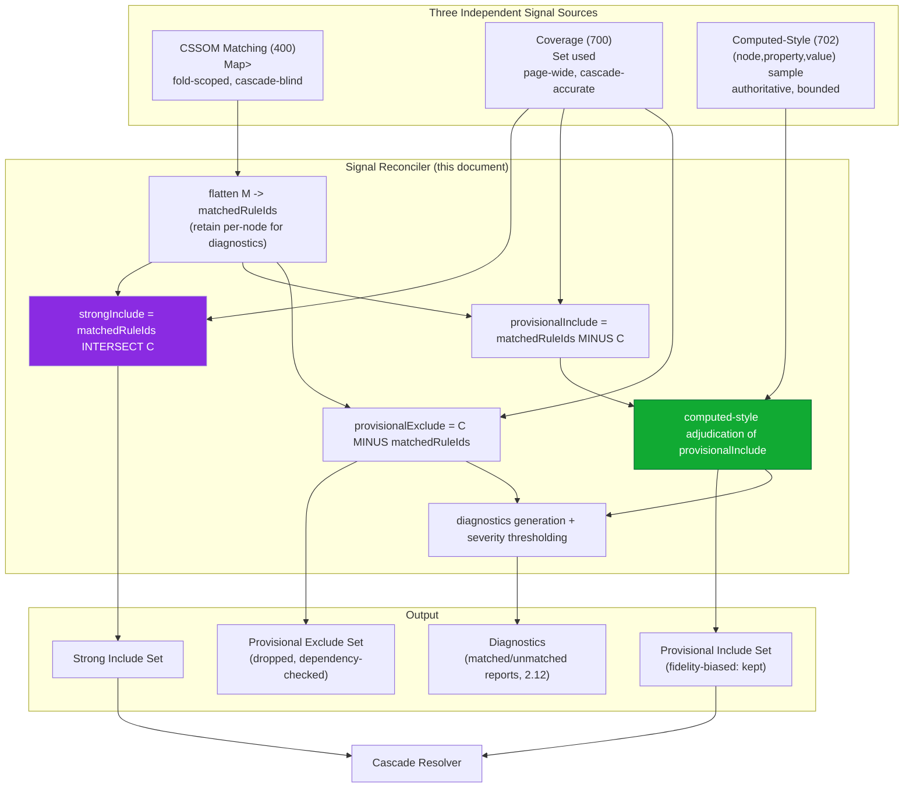
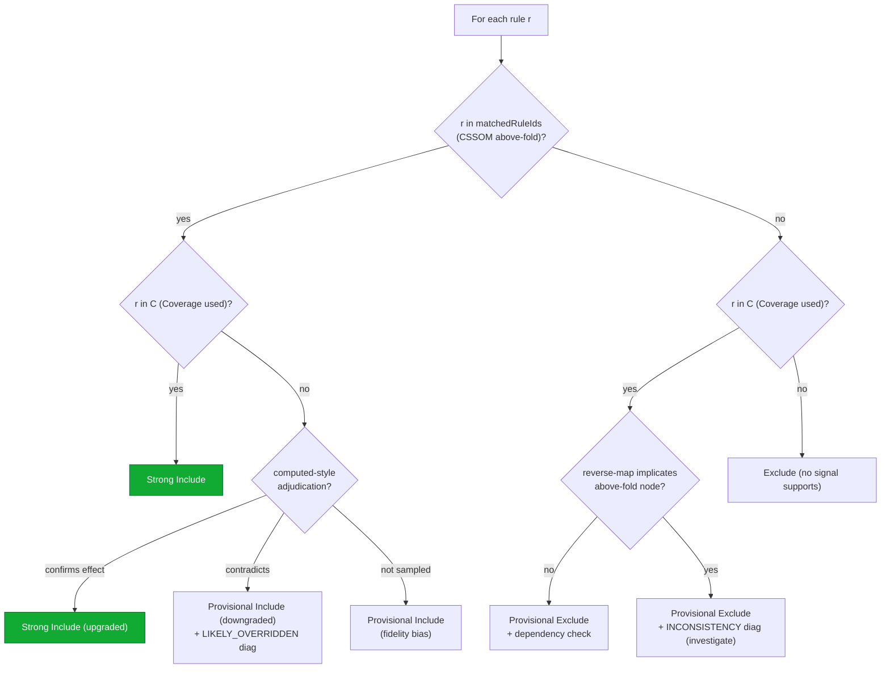

# 701 — Hybrid Extraction Mode

## 1. Title

**Critical CSS Extraction Engine — Hybrid Extraction Mode (Three-Signal Reconciliation of CSSOM Matching, Coverage, and Computed-Style Verification)**

## 2. Version

| Field | Value |
|---|---|
| Document Version | 1.0.0 |
| Status | Draft — Phase 9 (Advanced Extraction) |
| Last Updated | 2026-07-09 |
| Owners | Extraction Strategy Working Group |
| Stability | Reconciliation policy stable against [ADR-0005](../adr/ADR-0005-Hybrid-Extraction-Mode.md); thresholds and weights are tunable configuration |

## 3. Purpose

This document is the implementation specification for **Hybrid extraction mode**, the engine's recommended default strategy for production critical-CSS generation, decided in [ADR-0005-Hybrid-Extraction-Mode](../adr/ADR-0005-Hybrid-Extraction-Mode.md). Hybrid mode combines three independent signal sources — CSSOM selector matching ([400-Selector-Matching.md](./400-Selector-Matching.md)), Chrome CSS Coverage ([700-Coverage-Mode.md](./700-Coverage-Mode.md)), and targeted `getComputedStyle` verification ([702-Computed-Style-Mode.md](./702-Computed-Style-Mode.md)) — and reconciles their three result sets into a single rule-inclusion decision per rule, plus a diagnostics stream surfacing every disagreement between signals.

Where [ADR-0005](../adr/ADR-0005-Hybrid-Extraction-Mode.md) records *why* the three signals are combined and states the reconciliation policy at the decision-record level, this document specifies *how* the reconciliation is implemented: the precise set algebra that produces the strong-include / provisional-include / provisional-exclude partition, the per-rule decision logic that determines which signal wins when they conflict, the union-versus-intersection-versus-weighted design choice and why the engine lands where it does, and the operational mechanics of running and sequencing all three signal collectors within a single extraction run.

The document's central thesis, inherited from [ADR-0005](../adr/ADR-0005-Hybrid-Extraction-Mode.md), is that the three signals' blind spots are close to orthogonal — CSSOM matching over-includes cascade-overridden rules but is fold-scopable; Coverage is cascade-accurate but page-wide and misses untriggered rules; computed-style is per-node authoritative but infeasible at bulk scale — and that reconciling them yields materially higher-confidence output than any single signal, with disagreements between signals being the single most valuable diagnostic the engine produces.

## 4. Audience

- Implementers of the Signal Reconciler (`packages/reconciler` or the reconciliation submodule of `packages/coverage`), who own the `reconcile()` function this document specifies.
- Implementers of the three signal sources — [400-Selector-Matching.md](./400-Selector-Matching.md), [700-Coverage-Mode.md](./700-Coverage-Mode.md), [702-Computed-Style-Mode.md](./702-Computed-Style-Mode.md) — who must produce output in the shapes this document consumes.
- Cascade Resolver implementers, who consume the reconciled include sets Hybrid mode produces.
- Engineers configuring extraction-mode selection and reconciliation thresholds for CI gating (Section 2.11 of the brief).
- Engineers debugging why a specific rule was or was not included in a Hybrid-mode bundle, for whom the Decision Logic (Section 8.3) and Edge Cases (Section 12) are the primary references.

Readers must have read [ADR-0005-Hybrid-Extraction-Mode](../adr/ADR-0005-Hybrid-Extraction-Mode.md) in full, and should be familiar with all three signal-source documents, particularly the blind-spot analysis in [700-Coverage-Mode.md](./700-Coverage-Mode.md) Section 8.4 and the false-positive characterization in [400-Selector-Matching.md](./400-Selector-Matching.md).

## 5. Prerequisites

- [ADR-0005-Hybrid-Extraction-Mode](../adr/ADR-0005-Hybrid-Extraction-Mode.md) — the decision record this document implements, including its Algorithms section's `reconcile()` pseudocode, which this document elaborates.
- [400-Selector-Matching.md](./400-Selector-Matching.md) — produces the CSSOM match signal `M: Map<NodeId, Set<RuleId>>`.
- [700-Coverage-Mode.md](./700-Coverage-Mode.md) — produces the Coverage signal `C: Set<RuleId>` (used rules) and the distinct present-but-unused set.
- [702-Computed-Style-Mode.md](./702-Computed-Style-Mode.md) — produces the verification sample `V` of `(node, property, computedValue)` observations.
- [101-Playwright-Adapter.md](./101-Playwright-Adapter.md) Section 8.4 — the `CoverageSession` primitive and the "fall back to CSSOM-only on unsupported engines" degradation path Hybrid mode depends on.
- Familiarity with set algebra (union, intersection, difference) over hash-set-backed identifiers, and with the CSS cascade (specificity, origin, source order, `!important`, layers).
- [006-Design-Principles.md](../architecture/006-Design-Principles.md), particularly Principle 3 (Correctness Over Premature Optimization), Principle 5 (Determinism), and Principle 6 (Fail-Fast Diagnostics).

## 6. Related Documents

- [ADR-0005-Hybrid-Extraction-Mode](../adr/ADR-0005-Hybrid-Extraction-Mode.md)
- [400-Selector-Matching.md](./400-Selector-Matching.md) — CSSOM signal source.
- [700-Coverage-Mode.md](./700-Coverage-Mode.md) — Coverage signal source.
- [702-Computed-Style-Mode.md](./702-Computed-Style-Mode.md) — computed-style verification signal source.
- [703-Visual-Diff.md](./703-Visual-Diff.md) — the end-to-end fidelity benchmark that empirically justifies Hybrid mode's added cost over single-signal modes.
- [704-Incremental-Extraction.md](./704-Incremental-Extraction.md) — how Hybrid reconciliation participates in dependency-graph-scoped incremental runs.
- [101-Playwright-Adapter.md](./101-Playwright-Adapter.md) — Coverage wiring and non-Chromium degradation.
- [006-Design-Principles.md](../architecture/006-Design-Principles.md)

## 7. Overview

Hybrid mode is the reconciliation layer that sits atop the three signal sources. It does not itself collect any signal; it orchestrates the three collectors, waits for their outputs, and merges them. Its output is not a single set but a three-way partition of the rule universe plus diagnostics:

- **Strong include** — rules the engine is highly confident belong in the critical bundle.
- **Provisional include** — rules included by default (fidelity-biased) but flagged as lower-confidence and candidates for verification.
- **Provisional exclude** — rules excluded from the bundle but logged (and dependency-checked), never silently dropped.
- **Diagnostics** — a structured record of every place the three signals disagreed, which is both a debugging aid and the source of the "matched selector report" / "unmatched selector report" required by Section 2.12 of the brief.

The reconciliation is grounded in a specific reading of each signal's epistemic status. CSSOM matching, when scoped to the above-fold node set, answers "does this rule structurally apply to something visible above the fold?" — comprehensive but cascade-blind. Coverage answers "did the browser actually apply this rule anywhere on the page?" — cascade-accurate but fold-blind. The **intersection** of those two — CSSOM-matched-above-fold AND Coverage-used — is the high-confidence core: a rule that both structurally applies above the fold and was genuinely applied by the browser. That intersection is the *strong include* set, and it is the conceptual heart of why Hybrid mode works: each signal supplies exactly the scoping the other lacks.

The two set *differences* are where the interesting decisions live. CSSOM-matched-but-not-Coverage-used rules (`M \ C`) are provisional includes: they might be cascade-overridden (Coverage correctly silent) or they might be needed for an above-fold state the browser did not trigger during observation (Coverage falsely silent). Because distinguishing these two cases reliably is not possible from set algebra alone, the engine biases toward inclusion (fidelity over minimality, per Section 2.18 acceptance criteria) and flags them for computed-style spot-verification. Coverage-used-but-not-CSSOM-matched-above-fold rules (`C \ M`) are provisional excludes: Coverage saw them used, but they do not structurally match anything above the fold, so their usage is attributable to below-fold content — excluded from the critical bundle, but logged because their dependencies (variables, keyframes) may still matter per Section 2.5.

Computed-style verification is the third signal, applied not as a bulk partition input but as a *targeted adjudicator*: over a bounded, curated sample of `(node, property)` pairs, it observes what the cascade actually resolved to, and its observations are used to raise or lower confidence on provisional-include rules and to catch disagreements that would otherwise pass silently. It is the tie-breaker and the auditor, not a primary partitioner, because — per [702-Computed-Style-Mode.md](./702-Computed-Style-Mode.md) and [ADR-0005](../adr/ADR-0005-Hybrid-Extraction-Mode.md) — it is prohibitively expensive to run exhaustively.

## 8. Detailed Design

### 8.1 The Three Signals and Their Shapes

| Signal | Source | Shape | Epistemic status |
|---|---|---|---|
| CSSOM match `M` | [400-Selector-Matching.md](./400-Selector-Matching.md) | `Map<NodeId, Set<RuleId>>` over above-fold nodes | Structural match; fold-scopable; cascade-blind (false positives) |
| Coverage `C` | [700-Coverage-Mode.md](./700-Coverage-Mode.md) | `Set<RuleId>` of used rules (+ distinct present-but-unused set) | Runtime-applied; cascade-accurate; page-wide (fold-blind); misses untriggered (false negatives) |
| Computed-style `V` | [702-Computed-Style-Mode.md](./702-Computed-Style-Mode.md) | `{node, property, computedValue}[]` over a curated bounded sample | Per-node/property authoritative; infeasible at bulk scale (sampling gaps) |

The reconciler first collapses `M` from a per-node map to a flat rule set `matchedRuleIds = ⋃_{n ∈ aboveFoldNodes} M[n]`, since inclusion decisions are made per-rule, not per-node. (The per-node structure is retained separately for diagnostics — "which above-fold node caused this rule to match" is useful when investigating a disagreement.)

### 8.2 Reconciling the Three Result Sets: Union vs. Intersection vs. Weighted

The core design question is: given three signals, how do you combine them into one decision? Three canonical approaches were considered, and Hybrid mode deliberately uses a *different combination operator for a different pair of signals*, rather than a single global operator. This is the key insight of the design and deserves explicit justification.

**Pure union (`M ∪ C`).** Include a rule if *any* signal says include. This maximizes recall (fewest false negatives) but inherits *every* signal's false positives simultaneously: CSSOM's cascade-overridden rules AND Coverage's below-fold rules would all be included. The result is a bloated bundle that defeats the purpose of critical-CSS extraction. **Rejected as the global operator** — but note that the *fidelity bias* within provisional-include is union-like in spirit (keep-when-in-doubt), applied narrowly rather than globally.

**Pure intersection (`M ∩ C`).** Include a rule only if *all* signals agree. This maximizes precision but inherits every signal's false negatives: a rule Coverage missed because a state wasn't triggered (a real above-fold need) would be excluded despite CSSOM correctly matching it. For a fidelity-first tool, silently excluding a genuinely-needed rule is the worst possible failure (flash of unstyled content for real users). **Rejected as the global operator** — but note that the *strong-include core* is exactly `M ∩ C`, used as the high-confidence set, not as the final bundle.

**Weighted scoring.** Assign each signal a weight, compute a per-rule score, threshold it. This is tempting and flexible, but it obscures *why* a rule was included behind a numeric threshold, undermining the diagnostic transparency that is one of Hybrid mode's chief benefits ([ADR-0005](../adr/ADR-0005-Hybrid-Extraction-Mode.md) Consequences: "rich diagnostic output for free"). A rule included at score 0.61 against a 0.60 threshold tells an engineer nothing actionable. **Rejected as the primary mechanism**, though weighting survives in a narrow, transparent form: the computed-style adjudication and the severity-thresholding of diagnostics (Section 8.3) are effectively per-signal confidence weights applied to the *provisional* sets, not to the primary partition.

**The chosen design: structured set algebra with a fidelity-biased default and computed-style adjudication.** Hybrid mode computes the intersection `M ∩ C` as the strong-include core, treats the two differences as provisional sets with an explicit fidelity-biased default (provisional-include is kept, provisional-exclude is dropped-but-logged), and uses computed-style verification `V` to adjudicate the provisional-include set and surface disagreements. This is neither pure union nor pure intersection nor opaque weighting: it is a *reconciliation policy* that assigns each region of the Venn diagram a specific, explainable disposition. Every inclusion decision traces to a stateable reason ("both signals agreed" / "CSSOM matched, Coverage silent, kept for fidelity, computed-style did/didn't confirm"), which is exactly the transparency the weighted approach sacrifices.

### 8.3 Decision Logic: Which Signal Wins Per Rule

For every rule in the universe, the reconciler assigns exactly one disposition. The decision logic, resolving toward *correctness* (rendering fidelity) when signals conflict, is:

| CSSOM (above-fold) | Coverage (used) | Computed-style adjudication | Disposition | Rationale |
|---|---|---|---|---|
| match | used | — | **Strong include** | Both independent signals agree; highest confidence |
| match | silent | confirms effect on sample node | **Strong include (upgraded)** | Coverage false-negatived (untriggered state); computed-style proves real effect |
| match | silent | contradicts (no visible effect) | **Provisional include (downgraded)** + `CSSOM_MATCH_LIKELY_OVERRIDDEN` diagnostic | Likely cascade-overridden, but a *different* above-fold node might still need it — keep by default, flag |
| match | silent | not sampled | **Provisional include** | Insufficient evidence to downgrade; fidelity bias keeps it |
| no match | used | — | **Provisional exclude** + dependency check | Coverage usage attributable to below-fold; drop from bundle but preserve dependencies |
| no match | used | above-fold node found in reverse-map | **Provisional exclude** + `INCONSISTENCY` diagnostic (severity: investigate) | Possible above-fold-enumeration bug; do not trust silently |
| no match | silent | — | **Exclude** | No signal supports inclusion; genuinely irrelevant to this route/viewport |

The governing principle when signals conflict is stated plainly in [ADR-0005](../adr/ADR-0005-Hybrid-Extraction-Mode.md) Implementation Notes item 5: **bias toward rendering fidelity over minimal bundle size.** Provisional includes default to being *in* the bundle, not out. This is a deliberate, prominently-documented choice: Hybrid mode's output is not the theoretical minimum bundle; it is the highest-confidence-of-correctness bundle. The reasoning is that a false negative (missing rule) causes a visible flash-of-unstyled-content for real users, whereas a false positive (extra rule) costs only bytes — and Section 2.18's acceptance criteria list "rendering parity" ahead of minimality.

Computed-style is the *adjudicator* that can move a rule between the "upgraded" and "downgraded" provisional states, but it never *silently drops* a CSSOM-matched rule on the strength of a single sample node, because that node may not be the one that needs the rule. Its role is to add confidence signal and diagnostics, resolving conflicts toward correctness rather than toward minimality.

### 8.4 Diagnostics as First-Class Output

Because disagreements between orthogonal signals are, by construction, the interesting cases, Hybrid mode treats the diagnostics stream as a primary output equal in importance to the include sets. Each diagnostic carries a `type`, the offending `ruleId`, the implicated `node`/`property` where relevant, and a `severity`. Severity distinguishes *expected, benign* disagreement (e.g., a component library shipping many utility classes where only some win the cascade — extremely common, per [ADR-0005](../adr/ADR-0005-Hybrid-Extraction-Mode.md) Edge Cases) from *investigate*-level disagreement (a Coverage-used rule whose reverse-mapping implicates an above-fold node CSSOM claims it does not match — a possible enumeration bug). Only disagreements crossing configurable thresholds (high specificity, `!important`, allow-list membership) escalate to actionable severity, avoiding alert fatigue ([ADR-0005](../adr/ADR-0005-Hybrid-Extraction-Mode.md) Implementation Notes item 4).

### 8.5 Signal Collection Sequencing

Hybrid mode has a stricter sequencing requirement than any single-signal mode because Coverage must span the navigation-to-stabilization window while CSSOM matching and computed-style sampling operate on the stabilized snapshot:

1. **Start Coverage** (`startCoverage()`) *before* navigation ([700-Coverage-Mode.md](./700-Coverage-Mode.md) Section 8.3, [ADR-0005](../adr/ADR-0005-Hybrid-Extraction-Mode.md) Implementation Notes item 1).
2. **Navigate and stabilize.** Coverage accumulates throughout.
3. **Run CSSOM matching** against the above-fold node set on the stabilized DOM ([400-Selector-Matching.md](./400-Selector-Matching.md)). This can run concurrently with step 4.
4. **Run computed-style sampling** over the curated `(node, property)` set ([702-Computed-Style-Mode.md](./702-Computed-Style-Mode.md)). Concurrent with step 3, since neither depends on the other.
5. **Stop Coverage** (`stop()`), retrieve and correlate `RuleUsage[]`.
6. **Reconcile** all three signals.

Steps 3 and 4 are parallelizable against the same stabilized page state; step 1's timing is non-negotiable and step 5 must follow stabilization. This is the sequence diagrammed in [ADR-0005](../adr/ADR-0005-Hybrid-Extraction-Mode.md) Architecture and refined in Section 9.2 below.

### 8.6 Graceful Degradation on Non-Chromium Engines

Coverage is Chromium-only ([101-Playwright-Adapter.md](./101-Playwright-Adapter.md) Section 8.4). When the target engine is Firefox or WebKit, `startCoverage()` throws `CapabilityUnavailableError`, and Hybrid mode degrades to **CSSOM-matching-plus-computed-style-verification** — both signals are engine-agnostic. In this degraded mode, `C` is treated as universally silent, so the strong-include core `M ∩ C` is empty and *every* CSSOM match becomes a provisional include, adjudicated by computed-style verification where sampled. This is a strictly weaker but still-correct mode (fidelity-biased, no fold-scope loss since CSSOM supplies scoping), and it is surfaced in diagnostics as running without the Coverage signal so operators know the confidence level differs. The degradation branch is implemented once against the abstraction's error type, with no Playwright-specific or engine-specific branching in the reconciler ([101-Playwright-Adapter.md](./101-Playwright-Adapter.md) Section 8.4).

## 9. Architecture

### 9.1 Three-Signal Reconciliation Component View



### 9.2 Sequence: Hybrid Extraction Run

```mermaid
sequenceDiagram
    participant Orch as Orchestrator
    participant Cov as Coverage (700)
    participant Page as Browser Page
    participant Match as CSSOM Matcher (400)
    participant Comp as Computed-Style (702)
    participant Recon as Signal Reconciler

    Orch->>Cov: startCoverage()  [Chromium only; else degrade]
    Note over Cov,Page: MUST precede navigation
    Orch->>Page: navigate(route)
    Page-->>Orch: rendering stabilized (104)

    par CSSOM matching
        Orch->>Match: matchAll(aboveFoldNodes, allRules)
        Match-->>Orch: M: Map<NodeId, Set<RuleId>>
    and Computed-style sampling
        Orch->>Comp: sample(curated node/property set)
        Comp-->>Orch: V: (node,property,value)[]
    end

    Orch->>Cov: stop()
    Cov-->>Orch: C: Set<RuleId> (used) + correlation diagnostics

    Orch->>Recon: reconcile(M, C, V, aboveFoldNodes)
    Recon->>Recon: matchedRuleIds = flatten(M)
    Recon->>Recon: strongInclude = matchedRuleIds INTERSECT C
    Recon->>Recon: provisionalInclude = matchedRuleIds MINUS C
    Recon->>Recon: provisionalExclude = C MINUS matchedRuleIds
    Recon->>Recon: adjudicate provisionalInclude with V
    Recon->>Recon: dependency-check + reverse-map provisionalExclude
    Recon-->>Orch: {strongInclude, provisionalInclude, provisionalExclude, diagnostics}
    Orch->>Orch: Cascade Resolver over (strongInclude UNION provisionalInclude)
```

### 9.3 Per-Rule Disposition Decision Tree



## 10. Algorithms

### 10.1 Problem Statement

Given (a) above-fold DOM nodes `N`, (b) CSSOM match results `M: Map<NodeId, Set<RuleId>>`, (c) Coverage used-rule set `C: Set<RuleId>`, and (d) a bounded computed-style verification sample `V`, produce a per-rule inclusion decision — partitioning the rule universe into strong include, provisional include, provisional exclude, and (implicit) exclude — plus a diagnostics list for every signal disagreement, resolving conflicts toward rendering fidelity.

### 10.2 Inputs and Outputs

- **Input:** `M: Map<NodeId, Set<RuleId>>`, `C: Set<RuleId>`, `V: {node, property, computedValue, expectedFromRule}[]`, `aboveFoldNodes: NodeId[]`.
- **Output:** `{ strongInclude: Set<RuleId>, provisionalInclude: Set<RuleId>, provisionalExclude: Set<RuleId>, diagnostics: DisagreementReport[] }`.

### 10.3 Pseudocode

Elaborating [ADR-0005](../adr/ADR-0005-Hybrid-Extraction-Mode.md) Algorithms with the explicit upgrade/downgrade adjudication and degradation handling:

```
function reconcile(M, C, V, aboveFoldNodes, coverageAvailable):
    # Step 1: flatten CSSOM matches to a rule set (retain per-node map for diagnostics).
    matchedRuleIds = union(M[n] for n in aboveFoldNodes)          # O(sum |M[n]|)

    # Step 2: degradation — if Coverage unavailable, treat C as universally silent.
    if not coverageAvailable:
        strongInclude      = emptySet()
        provisionalInclude = copy(matchedRuleIds)                 # every match provisional
        provisionalExclude = emptySet()
        diagnostics        = [{ type: "RUNNING_WITHOUT_COVERAGE_SIGNAL", severity: "info" }]
    else:
        # Step 3: primary set-algebra partition.
        strongInclude      = intersect(matchedRuleIds, C)         # O(min(|matched|,|C|))
        provisionalInclude = difference(matchedRuleIds, C)        # CSSOM-matched, Coverage silent
        provisionalExclude = difference(C, matchedRuleIds)        # Coverage-used, not matched above fold
        diagnostics        = []

    # Step 4: adjudicate provisionalInclude with computed-style sample.
    for entry in V:
        r = entry.expectedFromRule
        if r not in provisionalInclude: continue
        if computedValueMatchesRule(entry.computedValue, r, entry.property):
            # Coverage false-negatived; computed style proves the rule had real effect.
            move(r, from=provisionalInclude, to=strongInclude)
            diagnostics.append({ type: "CSSOM_MATCH_CONFIRMED_BY_COMPUTED_STYLE",
                                 ruleId: r, severity: "info" })
        else:
            # Structurally matched, Coverage silent, no visible effect on THIS node.
            # Keep in provisionalInclude (a different above-fold node may need it), flag.
            diagnostics.append({ type: "CSSOM_MATCH_LIKELY_OVERRIDDEN",
                                 ruleId: r, node: entry.node, property: entry.property,
                                 severity: severityFor(r) })   # escalates only if high-specificity/!important/allow-listed

    # Step 5: sanity-check provisionalExclude for above-fold-enumeration bugs.
    for r in provisionalExclude:
        relatedNodes = findNodesCoverageAttributesTo(r)   # best-effort reverse map; most expensive step
        if any(n in aboveFoldNodes for n in relatedNodes):
            diagnostics.append({ type: "INCONSISTENCY_COVERAGE_USED_NOT_CSSOM_MATCHED_ABOVE_FOLD",
                                 ruleId: r, severity: "investigate" })

    return { strongInclude, provisionalInclude, provisionalExclude, diagnostics }
```

The final bundle handed to the Cascade Resolver is `strongInclude ∪ provisionalInclude` — the fidelity-biased set. `provisionalExclude` is not in the bundle but is passed to the Dependency Resolver so that variables/keyframes it references are considered (Section 2.5).

### 10.4 Time Complexity

- **Set-algebra partition (Step 3):** `O(|R|)` overall using hash-set-backed identifiers — union over per-node sets is `O(Σ|M[n]|)`, and intersection/difference are linear in the smaller operand.
- **Computed-style adjudication (Step 4):** `O(|V|)`, deliberately bounded because `V` is a curated sample, not exhaustive (per [702-Computed-Style-Mode.md](./702-Computed-Style-Mode.md) and [ADR-0005](../adr/ADR-0005-Hybrid-Extraction-Mode.md)).
- **Provisional-exclude reverse check (Step 5):** `O(|provisionalExclude| × avgNodesPerRule)` — the most expensive step, and the primary optimization target (limit to high-impact rules; see Section 14).

Overall the reconciler is near-linear in the rule universe plus the bounded sample, with the reverse-mapping check as the only super-linear-risk component.

### 10.5 Memory Complexity

`O(|R| + |N| + |V|)`, dominated by the rule and node sets already resident from the CSSOM matching and Coverage stages; reconciliation itself adds only the diagnostics list and a handful of derived sets ([ADR-0005](../adr/ADR-0005-Hybrid-Extraction-Mode.md) Algorithms).

### 10.6 Failure Cases

- **Coverage byte ranges spanning multiple logical rules** (minified stylesheets) — handled upstream in [700-Coverage-Mode.md](./700-Coverage-Mode.md)/[101-Playwright-Adapter.md](./101-Playwright-Adapter.md) correlation; the reconciler consumes already-correlated `RuleId`s and is insulated from raw offset math.
- **Stale computed-style sample nodes** mutated between DOM collection and the verification pass — re-resolve node identity before trusting a `getComputedStyle` result ([702-Computed-Style-Mode.md](./702-Computed-Style-Mode.md), [ADR-0005](../adr/ADR-0005-Hybrid-Extraction-Mode.md) Edge Cases); a stale sample entry is dropped from adjudication with a diagnostic, never used to downgrade a rule.
- **Empty Coverage signal on Chromium** (a real page with zero reported usage) is treated as an `investigate`-severity diagnostic, not silently accepted, since it usually indicates a sequencing bug (Coverage started too late — Section 8.5) rather than a genuinely style-free page.

### 10.7 Optimization Opportunities

Limit `findNodesCoverageAttributesTo` (Step 5) to rules flagged high-impact by stylesheet size or selector generality; cache reconciliation per `(route, viewport, mode)` fingerprint since reconciliation is deterministic given its three inputs ([ADR-0005](../adr/ADR-0005-Hybrid-Extraction-Mode.md) Algorithms, [704-Incremental-Extraction.md](./704-Incremental-Extraction.md)).

## 11. Implementation Notes

1. **Provisional-include defaults to inclusion.** This is the single most important, most-documented policy: the final bundle is `strongInclude ∪ provisionalInclude`. Hybrid mode's output is the highest-confidence-of-*correctness* set, not the minimal set. Any configuration toggling this toward minimality (Section 16) must be explicit and prominently surfaced ([ADR-0005](../adr/ADR-0005-Hybrid-Extraction-Mode.md) Implementation Notes item 5).
2. **Different combination operators for different Venn regions.** Do not refactor the reconciler into a single global union/intersection/weighted operator; the whole point is that `M ∩ C` is the core, `M \ C` and `C \ M` are the interesting differences, and `V` adjudicates. Collapsing these into one operator reintroduces exactly the correctness gap Hybrid mode exists to close (Section 8.2).
3. **Computed-style never silently drops a CSSOM match.** A single sample node showing no effect proves nothing about other above-fold nodes; it downgrades confidence and emits a diagnostic, never excludes ([ADR-0005](../adr/ADR-0005-Hybrid-Extraction-Mode.md) Algorithms).
4. **Diagnostics severity must distinguish benign from investigate.** Legitimately overridden CSSOM matches are common, not rare (competing utility classes); do not escalate every `CSSOM_MATCH_LIKELY_OVERRIDDEN` to actionable severity — gate on specificity/`!important`/allow-list thresholds ([ADR-0005](../adr/ADR-0005-Hybrid-Extraction-Mode.md) Implementation Notes item 4).
5. **Sequencing is a correctness constraint.** Coverage-start-before-navigation and Coverage-stop-after-stabilization must be enforced by the orchestrator, not left to caller discipline (Section 8.5).
6. **Degradation is implemented once, against the abstraction error type.** The `coverageAvailable === false` branch must not contain any engine-specific logic; it keys purely on catching `CapabilityUnavailableError` from `startCoverage()` ([101-Playwright-Adapter.md](./101-Playwright-Adapter.md) Section 8.4).
7. **Reconciliation must be deterministic** given identical `(M, C, V)` inputs, per Principle 5 — set iteration order must be canonicalized (e.g., sort rule IDs) before emitting diagnostics so two runs produce byte-identical diagnostic output.

## 12. Edge Cases

- **Legitimately overridden CSSOM-matched rules are common.** Component libraries ship many variant classes on the same element where only some win the cascade; CSSOM reports all as matching, Coverage reports only cascade-winning declarations' ranges as used. Provisional-include-by-default handles this gracefully by erring toward inclusion ([ADR-0005](../adr/ADR-0005-Hybrid-Extraction-Mode.md) Edge Cases).
- **Coverage page-wide vs. fold-scoped** — the reason `C` is intersected with CSSOM above-fold matches rather than trusted standalone. A Coverage-used rule not matching above the fold is a provisional exclude, not an include ([700-Coverage-Mode.md](./700-Coverage-Mode.md) Blind Spot 1).
- **`@media`/`@supports`-short-circuited rules** correctly appear in neither `M` nor `C` — expected agreement, produces no diagnostic ([ADR-0005](../adr/ADR-0005-Hybrid-Extraction-Mode.md) Edge Cases).
- **Cross-origin stylesheets** may yield Coverage-only partial signal (opaque to CSSOM enumeration); Hybrid mode reflects this as partial reconciliation in diagnostics rather than treating it as full three-signal agreement ([700-Coverage-Mode.md](./700-Coverage-Mode.md) Edge Cases).
- **Constructable/adopted stylesheets** may have version-dependent Coverage attribution gaps; a CSSOM-matched rule from such a sheet with no Coverage signal becomes provisional-include (fidelity-safe) rather than being incorrectly excluded ([ADR-0005](../adr/ADR-0005-Hybrid-Extraction-Mode.md) Edge Cases).
- **Shadow DOM** — signals must agree on shadow-tree attribution; a Coverage range and a CSSOM match must resolve to the same shadow-scoped rule for the intersection to be meaningful.
- **Stale computed-style sample nodes** — dropped from adjudication with a diagnostic, never used to downgrade (Section 10.6).
- **`!important` and cascade layers** — Coverage already reflects real cascade resolution; the reconciler needs no special-case, only correct interpretation of provisional-include disagreements ([ADR-0005](../adr/ADR-0005-Hybrid-Extraction-Mode.md) Edge Cases).
- **Non-Chromium degradation** — degraded mode has an empty strong-include core and all-provisional includes; correct but lower-confidence, and explicitly diagnosed (Section 8.6).

## 13. Tradeoffs

| Decision | Alternative Considered | Why Chosen | Cost Accepted |
|---|---|---|---|
| Structured set algebra (`∩` core, `\` differences, `V` adjudication) | Single global union | Union inherits every signal's false positives → bloated bundle | More reconciliation logic than a one-line union |
| Same, vs. single global intersection | Intersection | Intersection inherits every signal's false negatives → silent FOUC risk | Bundle is larger than the theoretical minimum |
| Same, vs. weighted scoring | Weighted per-rule score + threshold | Opaque; a rule at 0.61 vs 0.60 threshold gives no actionable reason, sacrificing diagnostic transparency | Cannot tune inclusion with a single knob |
| Provisional-include kept by default (fidelity bias) | Exclude provisional-includes unless confirmed (minimality bias) | Section 2.18 ranks rendering parity ahead of minimality; a missing rule causes user-visible FOUC | Output is not the minimal bundle |
| Computed-style as adjudicator, not partitioner | Use computed-style as a third primary partition input | Exhaustive computed-style is infeasible at scale ([702](./702-Computed-Style-Mode.md)); sampling can't partition reliably | Adjudication only covers sampled nodes; unsampled provisional-includes stay provisional |
| Diagnostics as first-class output | Emit only the include set | Cross-signal disagreement is the highest-value diagnostic and satisfies Section 2.12 for free | Larger output payload; severity thresholding needed to avoid alert fatigue |
| Chromium-only for full Hybrid, degrade elsewhere | Refuse to run on non-Chromium | Degraded CSSOM+computed-style mode is still correct and fold-scoped | Non-Chromium runs have lower confidence, explicitly diagnosed |

**Why Hybrid mode despite highest cost:** the three signals' blind spots are near-orthogonal, so combining them closes gaps no single signal can close alone, and Section 2.18 prioritizes rendering parity ahead of performance — directly justifying the added cost as the production default while cheaper single-signal modes remain available for dev iteration and CI smoke checks ([ADR-0005](../adr/ADR-0005-Hybrid-Extraction-Mode.md) Tradeoffs).

## 14. Performance

- **CPU complexity.** Total cost ≈ CSSOM matching cost ([400-Selector-Matching.md](./400-Selector-Matching.md), IPC-bound) + Coverage session overhead (browser-borne, spanning the stabilization window) + bounded computed-style sample (`O(|V|)` batched `getComputedStyle` calls) + reconciliation's near-linear cost (Section 10.4). The reconciler itself is not the bottleneck except for the Step-5 reverse-mapping check on pathological stylesheets.
- **Memory complexity.** Dominated by the union of memory already required by CSSOM matching and Coverage collection; reconciliation adds a small incremental footprint.
- **Caching strategy.** Full Hybrid result cacheable under the standard fingerprint scheme (Section 2.8); reconciliation additionally cacheable independently of input recomputation since it is deterministic given `(M, C, V)` ([704-Incremental-Extraction.md](./704-Incremental-Extraction.md)).
- **Parallelization.** CSSOM matching and computed-style sampling run concurrently against the same stabilized page (Section 8.5, Section 9.2); Coverage cannot be parallelized away from its navigation-to-stabilization timing window.
- **Incremental execution.** When the Dependency Resolver indicates only a subset of stylesheets changed, reconciliation can, in principle, re-evaluate only rules from changed stylesheets — non-trivial given Coverage's page-wide collection model, discussed in [704-Incremental-Extraction.md](./704-Incremental-Extraction.md) and [ADR-0005](../adr/ADR-0005-Hybrid-Extraction-Mode.md) Performance.
- **Profiling guidance.** The Reporter should break Hybrid wall-clock into four phases — CSSOM matching, Coverage session, computed-style sampling, reconciliation — to reveal which signal-collection phase dominates and whether a lighter standalone mode suffices for a given site ([ADR-0005](../adr/ADR-0005-Hybrid-Extraction-Mode.md) Performance).
- **Scalability limits.** For enterprise-scale stylesheets, the reverse-mapping check (Step 5) is the reconciler's likely bottleneck; limiting it to high-impact rules is the primary mitigation (Section 10.7).

## 15. Testing

- **Unit tests.** `reconcile()` in isolation with synthetic `M`, `C`, `V` covering every row of the decision table (Section 8.3): strong include; provisional include with confirming/contradicting/absent computed-style evidence; provisional exclude with/without above-fold reverse-map inconsistency; the degraded (no-Coverage) branch. Assert deterministic, canonically-ordered diagnostic output (Principle 5).
- **Integration tests.** Full Hybrid extraction against the fixture suite (Section 2.15), especially cascade-override fixtures (competing utility classes, `!important`, cascade layers) validating the reconciliation behaves as documented, not merely "produces some output" ([ADR-0005](../adr/ADR-0005-Hybrid-Extraction-Mode.md) Testing).
- **Blind-spot cross-tests.** Reuse the below-fold-only fixture from [700-Coverage-Mode.md](./700-Coverage-Mode.md) Testing to assert Hybrid correctly moves the below-fold rule to provisional-exclude while Coverage-only over-includes it.
- **Visual tests.** Compare rendering fidelity of Hybrid-mode critical CSS against each standalone mode's output, quantifying Hybrid's fidelity gain — the most direct justification of its cost, tracked as a standing benchmark ([703-Visual-Diff.md](./703-Visual-Diff.md)).
- **Degradation tests.** Assert that on Firefox/WebKit the reconciler runs the no-Coverage branch, produces all-provisional includes, emits `RUNNING_WITHOUT_COVERAGE_SIGNAL`, and still yields fold-scoped output.
- **Stress tests.** Enterprise-scale fixtures (tens of thousands of rules) measuring reconciliation scaling, especially Step 5.
- **Regression tests.** Every reported mis-classification (a rule wrongly placed in provisional-exclude that should be strong-include) becomes a permanent fixture with an explicit expected disposition.
- **Benchmark tests.** Track the four-phase timing breakdown across the fixture suite to catch per-phase regressions ([ADR-0005](../adr/ADR-0005-Hybrid-Extraction-Mode.md) Testing).

## 16. Future Work

- **Declaration-granularity reconciliation.** If a future CDP exposes declaration-level Coverage ([700-Coverage-Mode.md](./700-Coverage-Mode.md) Future Work), the reconciler could distinguish "this declaration within a matched rule was applied," reducing reliance on the provisional-include default ([ADR-0005](../adr/ADR-0005-Hybrid-Extraction-Mode.md) Future Work).
- **Incremental, dependency-graph-scoped reconciliation** to avoid recomputing the full three-signal collection when few stylesheets changed ([704-Incremental-Extraction.md](./704-Incremental-Extraction.md)).
- **Adaptive computed-style sampling** that expands the verification sample around nodes/properties where signals disagree most for a given site, rather than a static curated property list ([702-Computed-Style-Mode.md](./702-Computed-Style-Mode.md), [ADR-0005](../adr/ADR-0005-Hybrid-Extraction-Mode.md) Future Work).
- **Configurable minimality-bias mode** — an explicit toggle excluding provisional-includes unless confirmed, for organizations prioritizing bundle size, with defined interaction with the CI size-growth gate (Section 2.11); open question in [ADR-0005](../adr/ADR-0005-Hybrid-Extraction-Mode.md) Future Work.
- **Multi-engine full Hybrid** should a Coverage-equivalent become available outside CDP (WebDriver BiDi), lifting the Chromium-only constraint on the full three-signal mode.
- **Machine-assisted provisional-include classifier** trained on historical reconciliation diagnostics to predict, before the expensive computed-style pass, which provisional-includes are genuinely necessary versus prunable ([ADR-0005](../adr/ADR-0005-Hybrid-Extraction-Mode.md) Future Work).

## 17. References

- [ADR-0005-Hybrid-Extraction-Mode](../adr/ADR-0005-Hybrid-Extraction-Mode.md)
- [400-Selector-Matching.md](./400-Selector-Matching.md)
- [700-Coverage-Mode.md](./700-Coverage-Mode.md)
- [702-Computed-Style-Mode.md](./702-Computed-Style-Mode.md)
- [703-Visual-Diff.md](./703-Visual-Diff.md)
- [704-Incremental-Extraction.md](./704-Incremental-Extraction.md)
- [101-Playwright-Adapter.md](./101-Playwright-Adapter.md)
- [006-Design-Principles.md](../architecture/006-Design-Principles.md)
- [015-Runtime-Model.md](../architecture/015-Runtime-Model.md)
- Chrome DevTools Protocol, CSS domain (`CSS.startRuleUsageTracking`, `CSS.takeCoverageDelta`, `CSS.stopRuleUsageTracking`)
- MDN documentation: `Window.getComputedStyle()`
- W3C CSS Cascading and Inheritance Level 4/5 specifications (specificity, layers, `!important`)
- Section 2.4 ("System Modules"), 2.7 ("Hybrid Extraction Mode"), 2.12 (diagnostics/reporting), and 2.18 (Acceptance Criteria) of the Documentation Agent Brief — `BRIEF.md` at repository root
