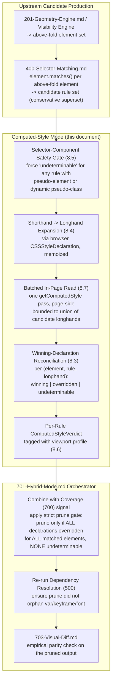
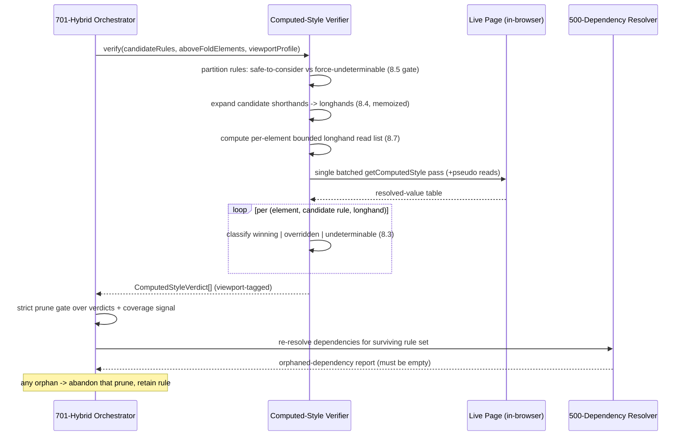

# 702 — Computed-Style Mode

## 1. Title

**Critical CSS Extraction Engine — Computed-Style Mode: `getComputedStyle` as a Winning-Declaration Verification and Over-Match Pruning Signal**

## 2. Version

| Field | Value |
|---|---|
| Document Version | 1.0.0 |
| Status | Accepted |
| Last Updated | 2026-07-09 |
| Owners | Advanced Extraction Working Group |
| Stability | Stable (Phase 9 design document; Computed-Style Mode is a verification-pass component of Hybrid Mode per [701-Hybrid-Mode.md](./701-Hybrid-Mode.md), not a standalone extraction strategy — changes to the winning-declaration contract require RFC because Hybrid Mode's confidence model depends on it) |

## 3. Purpose

The three primary extraction strategies enumerated in BRIEF.md Section 2.3 (CSSOM selector matching, Chrome CSS Coverage in [700-Coverage-Mode.md](./700-Coverage-Mode.md), and their combination in [701-Hybrid-Mode.md](./701-Hybrid-Mode.md)) all answer the question *"which rules could apply to an above-fold element?"* — they establish candidacy. None of them, on their own, answers the strictly narrower question *"which rules actually contribute a winning value to an above-fold element's rendered appearance?"* A CSSOM selector match via `element.matches(selector)` (per [400-Selector-Matching.md](./400-Selector-Matching.md)) proves only that the selector's subject would be this element; it says nothing about whether any declaration inside that rule survives the cascade to become the computed value the browser actually paints. A rule can match every above-fold element it targets and still contribute *nothing* to the rendered page because every one of its declarations is overridden by a higher-specificity, later-origin, or higher-layer rule.

This document defines **Computed-Style Mode**: a verification pass that reads each above-fold element's *resolved* `getComputedStyle()` values and cross-references them against the set of candidate declarations selector-matching produced, in order to identify declarations that CSSOM-match but never win — declarations that could, in principle, be pruned from the critical CSS with zero rendering impact. It is the operationalization of the third signal listed in BRIEF.md Section 2.7's Hybrid Extraction Mode (`getComputedStyle` verification), and it exists to shrink the over-inclusive output that pure selector matching, being deliberately conservative (per [006-Design-Principles.md](../architecture/006-Design-Principles.md) Principle 3), produces.

Where [701-Hybrid-Mode.md](./701-Hybrid-Mode.md) is the orchestrator that decides *when* to trust each signal and how to reconcile disagreements between them, this document is the authority for *what a computed-style verification actually measures*, why that measurement is expensive, why it is a verification pass rather than a primary strategy, and — most importantly — the precise conditions under which a "this declaration never wins" observation is safe to act on versus the far larger set of conditions under which it is a trap that would cause a false negative (a dropped rule that the page actually needs). The load-bearing thesis of this document is that computed-style verification is a **high-cost, narrow-applicability pruning signal**, not a general-purpose extraction engine, and that most of its apparent pruning opportunities are unsafe once shorthand expansion, pseudo-element state, interaction states, and responsive re-layout are accounted for.

## 4. Audience

- Implementers of the Computed-Style verification pass within `packages/collector`'s advanced-extraction subsystem, who need the exact winning-declaration reconciliation algorithm and its safety gating.
- Implementers of [701-Hybrid-Mode.md](./701-Hybrid-Mode.md)'s orchestrator, who consume this document's `ComputedStyleVerdict` per-declaration output as one input to the Hybrid confidence model and need to understand exactly how conservative each verdict is.
- Implementers of [700-Coverage-Mode.md](./700-Coverage-Mode.md), who should understand how this document's signal differs from Coverage's byte-range signal (Coverage says "the browser parsed and considered this rule"; this document says "this rule's declarations did or did not win") so the two are not conflated.
- Reviewers evaluating a proposed expansion of what Computed-Style Mode is permitted to prune, who should treat this document's Edge Cases and Tradeoffs sections as the enumeration of failure modes any such expansion must first defeat.
- Senior engineers debugging a suspected over-prune (a critical rule dropped that caused a flash-of-unstyled-content), who need this document's Edge Cases section as the first-pass diagnostic checklist for "did the computed-style verifier wrongly conclude this declaration never wins?"

Readers should be familiar with `window.getComputedStyle(element)`'s resolved-value contract (CSSOM View / CSSOM specifications), the CSS cascade (origin, importance, specificity, order, and layers — see [305-Cascade-Layers.md](./305-Cascade-Layers.md)), the distinction between shorthand and longhand properties, and the CSSOM `CSSStyleDeclaration` interface used to enumerate a matched rule's declarations (per [302-Rule-Tree.md](./302-Rule-Tree.md)).

## 5. Prerequisites

- [701-Hybrid-Mode.md](./701-Hybrid-Mode.md) — the orchestrating strategy that invokes this document's verification pass; this document is meaningful only as a component of that strategy and must not be run standalone (Section 8.1 explains why).
- [700-Coverage-Mode.md](./700-Coverage-Mode.md) — the coverage signal this document's verdict is combined with inside Hybrid Mode; understanding the difference between "byte was used" (Coverage) and "declaration won" (this document) is a prerequisite for not conflating the two.
- [400-Selector-Matching.md](./400-Selector-Matching.md) — the selector-match pass that produces the *candidate* declaration set this document verifies; Computed-Style Mode never re-runs selector matching, it consumes its output.
- [201-Geometry-Engine.md](./201-Geometry-Engine.md) — the source of the above-fold element set (via the Visibility Engine) that this document iterates; Computed-Style Mode reads computed styles only for elements the Geometry/Visibility Engine already classified as above-fold, never for the whole DOM.
- [106-DOM-Snapshot.md](./106-DOM-Snapshot.md) — the frozen node enumeration whose element handles this document's pass reads `getComputedStyle` against, within the same live-page context, before the page is torn down.
- [305-Cascade-Layers.md](./305-Cascade-Layers.md) and [302-Rule-Tree.md](./302-Rule-Tree.md) — the cascade and rule-tree model this document's winning-declaration reasoning operates within.
- [006-Design-Principles.md](../architecture/006-Design-Principles.md) Principle 1 (Browser Is Source of Truth), Principle 3 (Correctness Over Premature Optimization), and Principle 5 (Determinism of Output).

## 6. Related Documents

- [700-Coverage-Mode.md](./700-Coverage-Mode.md) — sibling Phase 9 strategy; the byte-range coverage signal combined with this one in Hybrid Mode.
- [701-Hybrid-Mode.md](./701-Hybrid-Mode.md) — sibling Phase 9 orchestrator and the sole legitimate caller of this document's verification pass.
- [704-Incremental-Extraction.md](./704-Incremental-Extraction.md) — sibling Phase 9 document; describes how a verified extraction result is fingerprinted and reused, and why the expensive computed-style pass is a prime candidate to skip on a cache hit.
- [703-Visual-Diff.md](./703-Visual-Diff.md) — sibling Phase 9 document; the empirical safety net that catches a wrong prune this document's static reasoning missed, closing the loop between "we think this is safe to drop" and "the rendered page proves it was."
- [201-Geometry-Engine.md](./201-Geometry-Engine.md) — supplies the above-fold element set this document restricts its reads to.
- [400-Selector-Matching.md](./400-Selector-Matching.md) — supplies the candidate declaration set this document verifies.
- [402-Pseudo-Elements.md](./402-Pseudo-Elements.md) and [403-Pseudo-Classes.md](./403-Pseudo-Classes.md) — the pseudo-element/pseudo-class state whose invisibility to a single default-state `getComputedStyle` read is this document's central safety hazard.
- [305-Cascade-Layers.md](./305-Cascade-Layers.md) — the cascade/layer ordering that determines which declaration wins.
- [500-Dependency-Resolution-Overview.md](./500-Dependency-Resolution-Overview.md) — the dependency graph that must be re-consulted after any prune, since dropping a winning-value-less rule can still orphan a variable or keyframe reference.
- BRIEF.md Section 2.7 (Hybrid Extraction Mode), Section 2.5 (Core Algorithms), Section 2.18 (Acceptance Criteria — rendering parity) — repository root.

## 7. Overview

The Computed-Style Mode contract, reduced to one sentence: given the set of candidate rules that CSSOM selector matching retained for the above-fold element set, read each above-fold element's resolved computed style and classify each candidate declaration as *observably-winning*, *observably-overridden*, or *undeterminable*, emitting a conservative per-declaration verdict that [701-Hybrid-Mode.md](./701-Hybrid-Mode.md) may use to prune only the declarations proven overridden under a strict safety gate.

Four design commitments run through this document:

1. **Verification, not extraction.** Computed-Style Mode never produces critical CSS on its own. It cannot: `getComputedStyle` returns *resolved values keyed by property*, not *the rule that supplied them*, so it can confirm what a property's final value is but cannot, by itself, enumerate the set of rules that should be emitted. It is strictly a filter applied to a candidate set another strategy produced. This is why it appears in BRIEF.md Section 2.7 only as the third element of a *hybrid*, never as a fourth peer to CSSOM and Coverage in the strategy list of Section 2.3.

2. **A "never wins" observation is a pruning *hint*, not a pruning *authority*.** The gap between "this declaration's value does not appear in the element's default-state computed style" and "this declaration is safe to remove from the critical CSS" is enormous, and most of this document (Sections 8.3–8.6, 12) is devoted to enumerating that gap. The default posture is that a declaration is *retained* unless it clears every safety gate; the burden of proof is on pruning, consistent with [006-Design-Principles.md](../architecture/006-Design-Principles.md) Principle 3's correctness-over-optimization asymmetry.

3. **Cost is intrinsic and non-amortizable within a pass.** Each `getComputedStyle()` call forces the browser to resolve style for that element if not already resolved, and reading individual properties off the returned `CSSStyleDeclaration` can force style/layout flushes. Reading the full set of properties this verification needs, for every above-fold element, is materially more expensive than either selector matching (which the browser's own `matches()` optimizes heavily) or coverage collection (which the browser produces as a side effect of parsing). Section 8.7 and Section 14 quantify this. It is the primary reason this is a verification pass gated behind Hybrid Mode, not the default strategy.

4. **The browser remains the source of truth, applied at a finer grain.** Where selector matching trusts the browser's `matches()` and Coverage trusts the browser's parser instrumentation, this document trusts the browser's *cascade resolution* as exposed through `getComputedStyle`. It never reimplements specificity/origin/layer arithmetic to decide a winner (that would be the "second, divergent rendering engine" [006-Design-Principles.md](../architecture/006-Design-Principles.md) Principle 1 forbids); it reads the browser's already-computed answer and reconciles candidate declarations against it.

## 8. Detailed Design

### 8.1 Why Computed-Style Mode Is Not the Primary Strategy

The most direct way to explain this document's positioning is to explain why the tempting "just use `getComputedStyle` for everything" design fails.

A naive proposal periodically resurfaces: for each above-fold element, read its full computed style, and emit exactly the declarations needed to reproduce those computed values. This would seem to produce minimal, exactly-correct critical CSS directly. It does not work, for four independent and each-sufficient reasons:

- **`getComputedStyle` loses rule provenance.** The resolved value of `color` is `rgb(17, 17, 17)`; the API does not tell you it came from `.article p { color: #111 }` versus `body { color: #111 }` versus an inline style. Reconstructing emittable *rules* (which must preserve selectors so they continue to match after the page loads, and must preserve media/container/layer context per [303-Media-Rules.md](./303-Media-Rules.md) and [305-Cascade-Layers.md](./305-Cascade-Layers.md)) from resolved property values is not possible without re-attributing each value back to a source rule — which requires the CSSOM rule set the selector matcher already walked. So computed style can only ever *annotate* an existing candidate set, never replace the walk that produces it.

- **Computed values are not authored values.** `getComputedStyle` resolves relative units, inherited values, `var()` substitutions, and computed-value-time transformations. Emitting resolved values would discard the authored form (e.g., a `clamp()` or a `var(--brand)` reference), breaking dependency resolution ([500-Dependency-Resolution-Overview.md](./500-Dependency-Resolution-Overview.md)) and producing CSS that no longer responds to variable overrides or container/viewport changes. The critical CSS must ship *authored declarations*, not *resolved snapshots*.

- **A single computed-style read captures one state, one viewport, one instant.** It reflects the default interaction state (no `:hover`, no `:focus`, no `:active`, no `:checked` unless the DOM actually has that state at capture time), the current container/viewport, and the current animation frame. Any rule whose *purpose* is to style a state, breakpoint, or animation keyframe the capture instant did not exercise contributes nothing observable to that one read — yet is unambiguously critical. This is not an edge case; it is the common case for interactive above-fold UI (buttons, form fields, navigation).

- **It is the most expensive signal per element.** Selector matching is a batched in-page loop the browser optimizes; coverage is free (a parser side effect); a thorough computed-style read is neither. Making the most expensive signal the primary one inverts the cost hierarchy for no correctness benefit.

The conclusion, which this entire document is built on: computed style is uniquely well-suited to answering one narrow question — *"among the rules selector matching already told me match this above-fold element, which ones demonstrably contribute a winning value in the captured state?"* — and uniquely ill-suited to being the strategy that decides the candidate set in the first place. It is therefore a **verification/pruning pass layered on top of** the CSSOM candidate set, invoked by [701-Hybrid-Mode.md](./701-Hybrid-Mode.md), and nothing more.

### 8.2 What `getComputedStyle` Actually Reports

`window.getComputedStyle(element, pseudoElt?)` returns a live, read-only `CSSStyleDeclaration` whose values are the *resolved values* per the CSSOM specification: the used value where one exists (e.g., a pixel length for a percentage width once layout has run), otherwise the computed value. Key properties of this contract that this document depends on:

- **It is keyed by property, fully expanded to longhands.** Reading `getComputedStyle(el).margin` returns a serialized shorthand *reconstructed from* the four resolved longhands; the authoritative resolved state lives in the longhands (`margin-top`, `margin-right`, etc.). This document therefore reasons in **longhand space** exclusively (Section 8.4), because a candidate declaration written as a shorthand (`margin: 0 auto`) must be verified against the resolved longhands it expands to, not against a shorthand-vs-shorthand string comparison that would be brittle and frequently wrong.

- **It reflects the full cascade already applied.** The returned value is the winner of origin + importance + specificity + order + layer arithmetic (per [305-Cascade-Layers.md](./305-Cascade-Layers.md)), plus inheritance and computed-value processing. This is exactly why it is a reliable *winner* oracle and an unreliable *candidate* oracle.

- **It requires a pseudo-element argument to see pseudo-element styles.** `getComputedStyle(el)` sees nothing about `::before`/`::after`/`::marker`; those require a second call with the pseudo argument (per [402-Pseudo-Elements.md](./402-Pseudo-Elements.md)). A verifier that forgets this will conclude every `::before` rule "never wins" and wrongly flag all of them for pruning — a catastrophic false-negative class this document explicitly guards against in Section 8.5.

- **It is state-dependent.** It reflects the element's DOM/interaction state at the instant of the call. There is no `getComputedStyle` overload that reports "what this element's style would be if hovered."

### 8.3 The Winning-Declaration Reconciliation

The core operation is: for a given above-fold element `E` and a candidate rule `R` that `E.matches(R.selectorText)` confirmed, determine whether any longhand declaration in `R` supplies a value that equals the corresponding resolved longhand in `getComputedStyle(E)`.

For each longhand `p` that rule `R` sets (after expanding `R`'s shorthands to longhands using the CSSOM's own expansion, never a hand-rolled one — Section 8.4):

- Let `authored` = the value `R` declares for `p`.
- Let `resolved` = `getComputedStyle(E)[p]`.
- `R` *may* be the winner for `p` if `authored`, once itself resolved in `E`'s context, equals `resolved`.

The crucial subtlety: comparing `authored` (which may be `var(--x)`, `2em`, `inherit`, a percentage, or a `calc()`) against `resolved` (always a fully resolved value) is not a string comparison. The reconciliation must resolve the authored value *in the element's context* before comparing, which in practice means the only robust comparison is: does `resolved` match what `R` would produce if `R` won? Because we cannot cheaply recompute "what `R` would produce" without reimplementing computed-value resolution (forbidden by Principle 1), the verifier uses a **conservative equality-or-uncertain trichotomy** rather than a boolean:

- **observably-winning**: `resolved` is present, the property is one where authored→resolved mapping is identity or trivially checkable (e.g., a keyword like `display: flex`, a already-resolved color, `position: sticky`), and it equals `authored`. High confidence `R` contributes this value.
- **observably-overridden**: `resolved` is present, `authored` is a value form whose resolved form is deterministically computable *and* differs from `resolved` for *every* candidate that sets `p` except one other candidate `R'` which matches `resolved` exactly. Only then can we say `R` lost to `R'` for `p`. High confidence `R` does *not* contribute this value.
- **undeterminable**: any case where authored→resolved is not trivially checkable (relative units, `var()`, `calc()`, context-dependent keywords, custom properties), or where multiple candidates could each explain `resolved`. Default posture: treat as if `R` might win; do not prune on this property alone.

A rule `R` is a prune candidate only if **every** declaration it contributes is `observably-overridden` for **every** above-fold element it matches, with **no** declaration ever `undeterminable` or `observably-winning` for any such element. This is a deliberately high bar; Section 10.1's algorithm encodes it.

### 8.4 Shorthand Expansion and Longhand-Space Reasoning

All reconciliation happens in longhand space. A candidate rule declaring `font: 14px/1.5 system-ui` sets `font-size`, `line-height`, `font-family`, and resets several other font longhands; a naive check of the shorthand string against `getComputedStyle(E).font` is unreliable because the serialized shorthand may not round-trip and because partial overrides (another rule setting only `font-weight`) make the shorthand comparison meaningless.

**Design choice: expand every candidate declaration to longhands using the browser's own `CSSStyleDeclaration` expansion, then verify each longhand independently.** The engine constructs a throwaway `CSSStyleDeclaration` (e.g., via a detached element's `style` or a constructable stylesheet rule per [307-Constructable-Stylesheets.md](./307-Constructable-Stylesheets.md)), assigns the authored shorthand, and reads back the expanded longhands the browser produced. This keeps expansion the browser's job (Principle 1) rather than maintaining a hand-written shorthand→longhand table that would inevitably drift from the specification as new shorthands (`inset`, `gap`, `place-items`, `container`) are added.

**Why not maintain a static shorthand table.** A static table is a second source of truth for CSS syntax that must be kept in lockstep with every browser CSS update — exactly the maintenance liability [006-Design-Principles.md](../architecture/006-Design-Principles.md) Principle 1 exists to avoid. The throwaway-declaration approach costs one extra CSSOM round trip per *distinct* shorthand encountered (memoizable per authored string, since expansion is context-free), a small, bounded cost.

### 8.5 Pseudo-Elements, Pseudo-Classes, and Interaction State — The Central Hazard

This is the section every implementer must internalize, because it is where computed-style verification most easily produces catastrophic false negatives.

A default-state `getComputedStyle(E)` (no pseudo argument, page in its as-loaded interaction state) is **blind** to:

- **Pseudo-element rules** (`::before`, `::after`, `::marker`, `::placeholder`, `::selection`, `::first-line`, `::first-letter`). Their styles are invisible unless `getComputedStyle` is called with the matching pseudo argument (per [402-Pseudo-Elements.md](./402-Pseudo-Elements.md)). A verifier that reads only the element's own computed style will find no evidence that any `::before` declaration wins, and will flag every pseudo-element rule as prunable. Since above-fold decorative content (icons, badges, quote marks, custom bullets, focus rings) is very commonly implemented via pseudo-elements, this failure would strip visible content.

- **Interaction-state rules** (`:hover`, `:focus`, `:focus-visible`, `:active`, `:target`, and form states like `:checked`, `:disabled`, `:invalid` not present at capture). Per [403-Pseudo-Classes.md](./403-Pseudo-Classes.md), the capture instant exercises only whatever states the DOM happens to be in. A `.btn:hover { background: ... }` rule contributes nothing to a non-hovered button's computed style, yet is unambiguously critical for an above-fold button. The verifier has no observable evidence this rule wins, because in the captured state it *correctly* does not — but "does not win now" is not "never wins."

- **Structural/dynamic pseudo-classes whose state can shift** (`:nth-child`, `:first-child` are stable; `:empty`, `:checked`, `:hover` are not). The verifier must distinguish structurally-stable pseudo-classes (safe to reason about) from dynamic ones (unsafe).

**Design choice: rules containing any dynamic-state or pseudo-element selector component are categorically exempt from pruning by Computed-Style Mode.** Such a rule is force-classified `undeterminable` regardless of what the captured computed style shows, and is always retained. This is not a heuristic tuning knob; it is a hard safety invariant. The selector-component classification (dynamic vs. structural, pseudo-element present or not) is available from the selector-matching layer ([400-Selector-Matching.md](./400-Selector-Matching.md), [402-Pseudo-Elements.md](./402-Pseudo-Elements.md), [403-Pseudo-Classes.md](./403-Pseudo-Classes.md)) and is consulted before any computed-style reasoning runs.

**Optional, bounded state exploration (Future Work, Section 16).** A more aggressive mode could drive the page into specific states (focus an element, dispatch `:hover` via CDP `Emulation.setEmulatedMedia`/forced pseudo-states) and re-read computed style per state. This is explicitly deferred: it multiplies cost by the number of states explored, is incomplete (cannot enumerate all reachable states), and its safety benefit is better and more cheaply obtained by simply *retaining* interaction-state rules, which are typically small.

### 8.6 Media, Container, and Viewport Context

A single classification pass runs at one viewport per BRIEF.md Section 2.6's per-viewport strategy. A rule inside a `@media` or `@container` block ([303-Media-Rules.md](./303-Media-Rules.md), [405-Container-Queries.md](./405-Container-Queries.md)) that does not match the current condition set is not even in the candidate set for this pass (the CSSOM walker already excluded it), so Computed-Style Mode never sees it — correct. But a rule inside a *matching* media block whose declarations are overridden *in this viewport* might win *in another viewport*. Because per-viewport extraction is independent and later merged (BRIEF.md Section 2.6), this document's pruning verdicts are always **scoped to the current viewport's pass** and must never be applied across viewports. The Hybrid orchestrator ([701-Hybrid-Mode.md](./701-Hybrid-Mode.md)) is responsible for keeping verdicts viewport-scoped; this document produces verdicts tagged with the viewport profile they were computed under.

### 8.7 Cost Model and the Read-Batching Discipline

Reading computed style is expensive for two reasons: (1) it can force a style recalculation and, for used-value properties, a layout flush; (2) the number of property reads is large — a thorough verification reads dozens of longhands per element, across all above-fold elements.

**Design choice: batch every computed-style read into a single in-page evaluated function, mirroring [106-DOM-Snapshot.md](./106-DOM-Snapshot.md) Section 8.6's single-walk discipline.** The verifier serializes, into one in-page script, the set of `(elementRef, propertyList, pseudo)` reads it needs, executes them in one pass while the page is already laid out and stable (per [104-Rendering-Stabilization.md](./104-Rendering-Stabilization.md)), and returns a compact resolved-value table to the host. This avoids per-property host↔page round trips (each of which is a serialization boundary crossing per [015-Runtime-Model.md](../architecture/015-Runtime-Model.md) Section 10.2) and confines all forced style/layout flushes to one contiguous window rather than scattering them.

Critically, the property list read per element is bounded to **the union of longhands that the element's candidate rules actually set**, not all ~350 CSS properties. If no candidate rule sets `grid-template-columns` for element `E`, there is no reason to read it for `E`. This keeps the per-element read cost proportional to candidate-declaration count, not to the size of the CSS property universe.

## 9. Architecture

### 9.1 Verification-Pass Data Flow



This diagram makes the document's central structural claim visible: Computed-Style Mode is bracketed on the left by the candidate-producing strategy it depends on and on the right by the orchestrator and empirical validator that act on its output. It is never a root or a leaf of the extraction pipeline — it is a middle stage that only refines.

### 9.2 Verification Sequence



## 10. Algorithms

### 10.1 Algorithm: Winning-Declaration Verification and Prune-Candidate Identification

**Problem statement.** Given the CSSOM candidate rule set for the above-fold element set at one viewport, identify the subset of rules that provably contribute no winning value to any above-fold element in the captured state, under a safety gate that guarantees no rule serving a pseudo-element, interaction state, or undeterminable value is ever flagged.

**Inputs.** `candidateRules: Rule[]`; `aboveFold: Element[]` with, per rule, the elements it matched (from [400-Selector-Matching.md](./400-Selector-Matching.md)); `viewportProfile`.

**Outputs.** `ComputedStyleVerdict[]` — per rule, one of `{PRUNE_CANDIDATE, RETAIN}` plus a per-(element, longhand) classification trace for diagnostics ([701-Hybrid-Mode.md](./701-Hybrid-Mode.md), BRIEF.md Section 2.12).

**Pseudocode.**

```
function verify(candidateRules, aboveFold, viewportProfile) -> Verdict[]:
    verdicts = []
    expansionMemo = new Map()   // authoredShorthandString -> {longhand: value}[]

    // Phase A: batched in-page read (8.7)
    readPlan = new Map()        // element -> Set<longhand>, plus pseudo variants
    for rule in candidateRules:
        if isForceUndeterminable(rule):   // 8.5 safety gate, no reads needed to decide
            continue
        longhands = expandToLonghands(rule, expansionMemo)   // 8.4, browser-driven
        for el in rule.matchedElements ∩ aboveFold:
            readPlan.get(el).addAll(longhands.keys())
            if rule.hasPseudoElement:            // never reached: gate excludes these
                readPlan.addPseudo(el, rule.pseudo, longhands.keys())
    resolved = pageBatchGetComputedStyle(readPlan)   // single pass, O(reads)

    // Phase B: per-rule classification
    for rule in candidateRules:
        if isForceUndeterminable(rule):
            verdicts.push(Verdict{rule, RETAIN, reason: "pseudo/dynamic-state safety gate"})
            continue
        longhands = expandToLonghands(rule, expansionMemo)
        anyWinningOrUndet = false
        allOverridden = true
        for el in rule.matchedElements ∩ aboveFold:
            for (p, authored) in longhands:
                cls = classify(authored, resolved[el][p], p, candidateRules, el)  // 8.3
                if cls == WINNING or cls == UNDETERMINABLE:
                    anyWinningOrUndet = true
                    allOverridden = false
                // OVERRIDDEN leaves allOverridden unchanged
        if allOverridden and not anyWinningOrUndet:
            verdicts.push(Verdict{rule, PRUNE_CANDIDATE, viewportProfile})
        else:
            verdicts.push(Verdict{rule, RETAIN, viewportProfile})
    return verdicts

function classify(authored, resolvedVal, p, allCandidates, el) -> Class:
    if resolvedVal is absent: return UNDETERMINABLE
    if isContextDependent(authored):        // var(), calc(), relative units, inherit, keywords w/ context
        return UNDETERMINABLE
    if authored == resolvedVal:             // trivially-checkable identity value
        return WINNING
    // authored != resolvedVal: only 'overridden' if exactly one other candidate explains resolvedVal
    explainers = [c for c in allCandidates if c.matches(el)
                    and c.longhandValue(p) == resolvedVal and not isContextDependent(c.longhandValue(p))]
    if explainers.length == 1: return OVERRIDDEN
    return UNDETERMINABLE                    // ambiguous provenance -> never prune
```

**Time complexity.** Let `A` = above-fold element count, `C` = candidate rules, `L` = average longhands per rule, `M` = average matched-elements per rule. Phase A read planning is `O(C · M · L)`; the in-page read itself is `O(total distinct reads)` ≤ `O(A · L_max)`. Phase B classification is `O(C · M · L)` in the common path; the `classify` fallback that scans candidates to find an explainer is `O(C)` per invocation in the worst case, making the pathological bound `O(C² · M · L)` — but this fallback is reached only for non-identity, non-context-dependent values with ambiguous provenance, an uncommon subset, and can be reduced to near-linear by pre-indexing candidates by `(element, longhand) -> value` (Section 14 optimization). Practically the pass is `O(A · L)` dominated by the read.

**Memory complexity.** `O(A · L)` for the resolved-value table plus `O(distinct shorthands)` for `expansionMemo` — bounded and modest relative to the CSSOM already in memory.

**Failure cases.** (a) A cross-origin stylesheet whose rules could not be enumerated ([301-Stylesheet-Loader.md](./301-Stylesheet-Loader.md), BRIEF.md Section 2.16) yields candidate rules that cannot be provenance-checked; `classify` returns `UNDETERMINABLE`, so such rules are always retained — safe. (b) A `getComputedStyle` read that throws (detached element, torn-down frame) is caught and treated as `UNDETERMINABLE` for every property of that element. (c) A page whose layout is not yet stable produces unreliable used values; the pass must run only after [104-Rendering-Stabilization.md](./104-Rendering-Stabilization.md) reports stability, else all verdicts are discarded.

**Optimization opportunities.** Pre-index candidate declarations by `(element, longhand)` to make the explainer search `O(1)`; memoize shorthand expansion (already specified); skip the entire pass on an incremental cache hit ([704-Incremental-Extraction.md](./704-Incremental-Extraction.md)) since it is the single most expensive advanced-extraction stage.

### 10.2 Algorithm: Post-Prune Dependency Re-Validation

**Problem statement.** A rule flagged `PRUNE_CANDIDATE` may itself be the only reference keeping a CSS variable, `@keyframes`, `@font-face`, or `@property` alive in the retained set; dropping it must not orphan a dependency that a *retained* rule still needs.

**Inputs.** `retainedRules` (candidate set minus prune candidates), `dependencyGraph` (from [500-Dependency-Resolution-Overview.md](./500-Dependency-Resolution-Overview.md)).

**Outputs.** `safeToPrune: Rule[]` (subset of prune candidates whose removal orphans nothing), `mustRetain: Rule[]` (the rest).

**Pseudocode.**

```
function revalidate(pruneCandidates, retainedRules, depGraph) -> {safeToPrune, mustRetain}:
    // Recompute the dependency closure of the retained set WITHOUT the prune candidates
    neededDeps = depGraph.closureOf(retainedRules)   // fixed-point per 500
    safeToPrune = []; mustRetain = []
    for r in pruneCandidates:
        // A prune candidate is safe only if nothing it uniquely provided is still needed.
        provided = depGraph.symbolsDefinedBy(r) ∪ depGraph.symbolsReferencedBy(r)
        if provided ∩ neededDeps is empty:
            safeToPrune.push(r)
        else:
            mustRetain.push(r)     // its removal would orphan a still-needed symbol
    return {safeToPrune, mustRetain}
```

**Time complexity.** Dominated by the dependency-closure recomputation, `O(V + E)` over the dependency graph (per [500-Dependency-Resolution-Overview.md](./500-Dependency-Resolution-Overview.md)), plus `O(P · d)` for `P` prune candidates each with `d` associated symbols.

**Memory complexity.** `O(V + E)` for the recomputed closure.

**Failure cases.** A dependency cycle among prune candidates is handled by the same cycle detection [500-Dependency-Resolution-Overview.md](./500-Dependency-Resolution-Overview.md) already specifies; a conservatively over-broad `symbolsReferencedBy` only causes fewer prunes (safe), never an orphan.

**Optimization opportunities.** Incrementally update the closure rather than recomputing it wholesale when the prune-candidate set is small relative to the retained set.

## 11. Implementation Notes

- The verification pass must execute **before the page is torn down**, in the same live context [400-Selector-Matching.md](./400-Selector-Matching.md) and the Visibility Engine ran in, because it needs live element handles for `getComputedStyle`. It cannot run against the frozen `DomSnapshot` alone (that snapshot deliberately does not retain live handles per [106-DOM-Snapshot.md](./106-DOM-Snapshot.md)). Practically this means Hybrid Mode schedules the computed-style pass as the last in-page operation of the collection phase.
- Shorthand expansion via a throwaway `CSSStyleDeclaration` must use a detached element or a constructable stylesheet ([307-Constructable-Stylesheets.md](./307-Constructable-Stylesheets.md)) so it does not perturb the live page's own style resolution. Assigning to a live element's inline style to read back longhands would mutate the page and invalidate concurrent reads — forbidden.
- The `isForceUndeterminable` gate (Section 8.5) must be driven by selector-component metadata computed once at selector-match time, not re-parsed here (no custom selector parser, per BRIEF.md Section 2.5 and ADR-0002). If that metadata is unavailable for a rule, the rule is force-retained — fail safe.
- Verdicts must be tagged with the viewport profile and never reused across profiles (Section 8.6). The Hybrid orchestrator merges per-viewport results per BRIEF.md Section 2.6; this document produces only per-viewport verdicts.
- A configuration flag `computedStyle.enabled` (default off outside Hybrid Mode, and even within Hybrid Mode gated behind a `hybrid.verifyWithComputedStyle` toggle) must exist, because the pass's cost may not be justified for every project. When disabled, Hybrid Mode simply skips the pruning refinement and ships the conservative CSSOM+Coverage union.
- The pass must emit a diagnostic trace (BRIEF.md Section 2.12) recording, per pruned rule, the `(element, longhand, resolvedValue, winningExplainer)` evidence, so an over-prune regression caught by [703-Visual-Diff.md](./703-Visual-Diff.md) can be root-caused to a specific wrong classification.

## 12. Edge Cases

- **Pseudo-element-only rules.** `.card::before { content: "★" }` produces no evidence in the element's own computed style; force-retained by the Section 8.5 gate. Reading with the pseudo argument would confirm it wins, but the gate retains it regardless, so the pseudo read is optional and used only for diagnostics.
- **Interaction-state rules absent at capture.** `a:hover`, `button:focus-visible`, `:checked` toggles — force-retained by the gate. Never pruned even though they contribute nothing to the captured computed style.
- **`!important` interactions.** An `!important` declaration in a candidate rule can win over higher-specificity normal declarations; `getComputedStyle` reflects this correctly, so the resolved value already accounts for importance. No special handling needed beyond trusting the resolved value — the browser did the importance arithmetic.
- **Inherited values.** A resolved value may equal a candidate's authored value purely because the element *inherited* that value from an ancestor the candidate also matched, not because the candidate won on this element. The provenance ambiguity this creates is exactly why `classify` returns `UNDETERMINABLE` whenever more than one candidate can explain a value; inheritance is a common source of such ambiguity and is handled by the ambiguity rule, not a dedicated inheritance branch.
- **Custom properties (`--x`).** A candidate defining `--brand: #f00` contributes no *directly observable* computed longhand (custom properties resolve into other properties via `var()`); its "winning" status is undeterminable from resolved longhands alone. Force-retained via the context-dependent branch, and additionally protected by the dependency re-validation (Section 10.2) if any retained rule references it.
- **`all: unset`/`all: revert` and wide keywords.** A candidate using `all` or a wide keyword (`initial`/`inherit`/`unset`/`revert`/`revert-layer`) expands to every longhand with context-dependent resolution; classified `UNDETERMINABLE` wholesale and retained.
- **Constructable and adopted stylesheets.** Rules from `adoptedStyleSheets` (per [307-Constructable-Stylesheets.md](./307-Constructable-Stylesheets.md)) participate in the cascade and are reflected in computed style normally; no special reconciliation logic is needed, provided the CSSOM walker surfaced them as candidates.
- **Shadow DOM boundaries.** Computed style resolves correctly across shadow boundaries for inherited properties; a candidate rule inside a shadow root is verified against `getComputedStyle` of a shadow-tree element, which the batched read must target using the correct per-fragment element reference ([106-DOM-Snapshot.md](./106-DOM-Snapshot.md) fragment linkage). A rule that only styles slotted content must be verified against the slotted (light-DOM) element's computed style, not the slot's.
- **Animations and transitions mid-flight.** If capture occurs while a transition/animation is running, `getComputedStyle` returns an interpolated value that matches *no* authored declaration; every affected longhand is then `UNDETERMINABLE` (no identity match) and rules are retained — safe, but a reason to ensure [104-Rendering-Stabilization.md](./104-Rendering-Stabilization.md) settles animations before the pass.

## 13. Tradeoffs

| Decision | Why | Alternative Considered | Tradeoff Accepted |
|---|---|---|---|
| Verification/pruning pass only, never a primary strategy | `getComputedStyle` loses rule provenance and authored form, captures one state/viewport/instant, and is the costliest signal (Section 8.1) | Direct computed-value extraction emitting resolved declarations | Cannot shrink output without a candidate set from another strategy; adds a stage rather than replacing one |
| Prune only if ALL declarations overridden for ALL matched elements with NONE undeterminable | Guarantees the correctness-over-optimization asymmetry (Principle 3): never drop a rule that might render above-fold | Prune per-declaration or on majority evidence | Prunes far less than a naive verifier would; leaves some genuinely-dead declarations in place, accepted as the safe direction |
| Force-retain all pseudo-element and dynamic-state rules unconditionally | Default-state computed style is blind to them (Section 8.5); pruning them strips visible/interactive above-fold UI | Drive the page into states and re-read (bounded exploration) | Retains some genuinely-overridden state rules; accepted because state rules are typically small and the failure mode of pruning them is severe |
| Expand shorthands via the browser's own `CSSStyleDeclaration` | Keeps CSS-syntax knowledge in the browser (Principle 1); resilient to new shorthands | Maintain a static shorthand→longhand table | One extra memoized CSSOM round trip per distinct shorthand; accepted over a drifting parallel spec table |
| Trichotomy (winning/overridden/undeterminable) rather than boolean | Ambiguous provenance (inheritance, multiple explainers, context-dependent values) must not be forced into a false "overridden" | Boolean winner test | More conservative, more retained rules; accepted as the only sound handling of ambiguity |
| Viewport-scoped verdicts, never cross-viewport | A declaration overridden at one viewport can win at another (Section 8.6) | Global verdicts merged once | Cannot deduplicate the pass across viewports; each viewport pays the cost independently |
| Gate behind Hybrid Mode + explicit toggle, default-conservative | The pass's cost may exceed its value for many projects (Section 14) | Always run computed-style verification | Some projects ship slightly larger critical CSS by default; accepted for predictable cost |

## 14. Performance

- **CPU complexity.** The pass is `O(A · L)` in the common path (Section 10.1), dominated by the single batched `getComputedStyle` read of the bounded longhand set per above-fold element. The classification loop is the same order; the explainer-search fallback is made near-`O(1)` per property by pre-indexing candidate values by `(element, longhand)`.
- **The dominant real cost is the forced style/layout flush**, not algorithmic complexity. Reading used-value properties (anything layout-dependent: widths, positions, resolved lengths) can force the browser to flush pending layout. Batching all reads into one in-page pass (Section 8.7) after [104-Rendering-Stabilization.md](./104-Rendering-Stabilization.md) confines this to one flush window; scattering reads would trigger repeated flushes and is the single largest avoidable cost.
- **Memory complexity.** `O(A · L)` for the resolved-value table; negligible beside the CSSOM and DOM snapshot already resident.
- **Caching strategy.** The pass's *result* (verdicts) is folded into the extraction result that [704-Incremental-Extraction.md](./704-Incremental-Extraction.md) fingerprints; on a fingerprint match, the entire computed-style pass is skipped, which is the highest-value caching win available because this is the costliest advanced stage. Within a pass, shorthand expansion is memoized (Section 8.4).
- **Parallelization opportunities.** The in-page read is a single synchronous browser operation and cannot be parallelized within one page context; however, per-route/per-viewport passes across a crawl are independent and parallelize across the browser pool ([102-Browser-Pool.md](./102-Browser-Pool.md)). The host-side classification loop is trivially parallelizable across rules but is rarely the bottleneck.
- **Incremental execution.** Because verdicts are viewport- and content-fingerprint-scoped, an unchanged route skips the pass entirely on re-extraction ([704-Incremental-Extraction.md](./704-Incremental-Extraction.md)).
- **Profiling guidance.** Measure (1) the batched-read wall time separately from (2) host-side classification and (3) dependency re-validation; the read should dominate. If classification dominates, the explainer-search fallback is likely un-indexed. If dependency re-validation dominates, the closure recompute should be made incremental (Section 10.2 optimization).
- **Scalability limits.** Above-fold element count `A` is the practical scaling variable, not total DOM size; a page with a very dense above-fold region (a data-heavy dashboard header) costs more than a sparse one. Projects with large above-fold node counts should weigh whether the pruning benefit justifies the pass, since the conservative gate may prune little on such pages.

## 15. Testing

- **Unit tests.** `classify()` against: identity keyword match (`display: flex` → WINNING), differing value with a single explainer (OVERRIDDEN), `var()`/`calc()`/relative-unit authored values (UNDETERMINABLE), absent resolved value (UNDETERMINABLE), and multi-explainer ambiguity (UNDETERMINABLE). `expandToLonghands()` against `font`, `margin`, `inset`, `grid`, `place-items`, asserting expansion matches the browser's own longhand serialization.
- **Integration tests.** Real-browser fixtures: (a) a rule whose every declaration is overridden by a higher-specificity rule on every matched above-fold element → confirmed PRUNE_CANDIDATE, and confirmed that removing it produces byte-identical rendering; (b) a `::before` content rule → confirmed force-RETAIN despite no own-element evidence; (c) a `:hover` rule on an above-fold button → confirmed force-RETAIN; (d) a rule whose value is inherited from an ancestor → confirmed UNDETERMINABLE (not wrongly OVERRIDDEN).
- **Visual tests.** For each fixture where the pass prunes at least one rule, render full-CSS vs. pruned-critical and pixel-diff the above-fold region via [703-Visual-Diff.md](./703-Visual-Diff.md); any non-anti-aliasing pixel delta is a failed prune and a test failure. This is the empirical backstop for the static reasoning.
- **Stress tests.** The `fixtures/enterprise-huge/` stylesheet (BRIEF.md Section 2.15) with a dense above-fold region, to measure batched-read wall time and confirm the flush window stays bounded; the Tailwind and Bootstrap fixtures, which produce many low-specificity utility rules frequently overridden, to exercise the OVERRIDDEN path at scale.
- **Regression tests.** Golden verdict sets pinned per fixture per viewport; any change to `classify()` or the safety gate that alters a golden verdict must be a reviewed, intentional change (Principle 5 determinism discipline).
- **Benchmark tests.** Measure end-to-end extraction time with the pass enabled vs. disabled on representative fixtures, alongside the critical-CSS byte-size reduction it achieves, so the cost/benefit that justifies the default-conservative gating (Section 13) is continuously validated rather than assumed.

## 16. Future Work

- **Bounded interaction-state exploration.** Drive the page through a small, configured set of states (focus, hover via forced pseudo-states, common form states) and re-read computed style per state, allowing safe pruning of state rules proven overridden *in every explored state*. Deferred because it multiplies cost by state count, is inherently incomplete, and the safe alternative (retain state rules) is cheap — but valuable for projects with unusually large interaction-state stylesheets.
- **Pseudo-element evidence for diagnostics.** Use `getComputedStyle(el, '::before')` reads (already permitted, currently optional) to enrich the diagnostic trace with positive confirmation that a retained pseudo-element rule genuinely wins, improving the [703-Visual-Diff.md](./703-Visual-Diff.md) root-causing loop without changing prune decisions.
- **Rule-provenance API adoption.** Should a stable cross-browser API for "which rule supplied this computed value" emerge (some engines expose experimental inspector-only capabilities), Computed-Style Mode could graduate from a provenance-ambiguity trichotomy to a definitive winner oracle, dramatically increasing safe-prune coverage. Flagged as an open dependency on browser platform evolution.
- **Incremental closure recomputation** for the post-prune dependency re-validation (Section 10.2), to avoid a full `O(V+E)` closure rebuild when the prune-candidate set is small.
- **Open question: should Computed-Style Mode ever run outside Hybrid Mode as an opt-in diagnostic-only pass** (producing an over-match report per BRIEF.md Section 2.12 without acting on it), to help authors find dead CSS in their above-fold styles even when they do not want automatic pruning? Current lean is yes as a report-only mode, deferred to the Diagnostics phase (Phase 13).

## 17. References

- [700-Coverage-Mode.md](./700-Coverage-Mode.md)
- [701-Hybrid-Mode.md](./701-Hybrid-Mode.md)
- [703-Visual-Diff.md](./703-Visual-Diff.md)
- [704-Incremental-Extraction.md](./704-Incremental-Extraction.md)
- [201-Geometry-Engine.md](./201-Geometry-Engine.md)
- [104-Rendering-Stabilization.md](./104-Rendering-Stabilization.md)
- [106-DOM-Snapshot.md](./106-DOM-Snapshot.md)
- [301-Stylesheet-Loader.md](./301-Stylesheet-Loader.md)
- [302-Rule-Tree.md](./302-Rule-Tree.md)
- [303-Media-Rules.md](./303-Media-Rules.md)
- [305-Cascade-Layers.md](./305-Cascade-Layers.md)
- [307-Constructable-Stylesheets.md](./307-Constructable-Stylesheets.md)
- [400-Selector-Matching.md](./400-Selector-Matching.md)
- [402-Pseudo-Elements.md](./402-Pseudo-Elements.md)
- [403-Pseudo-Classes.md](./403-Pseudo-Classes.md)
- [405-Container-Queries.md](./405-Container-Queries.md)
- [500-Dependency-Resolution-Overview.md](./500-Dependency-Resolution-Overview.md)
- [102-Browser-Pool.md](./102-Browser-Pool.md)
- [015-Runtime-Model.md](../architecture/015-Runtime-Model.md)
- [006-Design-Principles.md](../architecture/006-Design-Principles.md)
- BRIEF.md Section 2.3 (High-Level Requirements), Section 2.5 (Core Algorithms), Section 2.6 (Multi-Viewport Strategy), Section 2.7 (Hybrid Extraction Mode), Section 2.12 (Diagnostics), Section 2.16 (Security), Section 2.18 (Acceptance Criteria) — repository root
- CSSOM specification (W3C) — `getComputedStyle`, `CSSStyleDeclaration`, resolved values
- CSSOM View Module (W3C) — used-value resolution and forced-layout semantics
- CSS Cascading and Inheritance Level 5 (W3C) — origin, importance, specificity, order, layers
