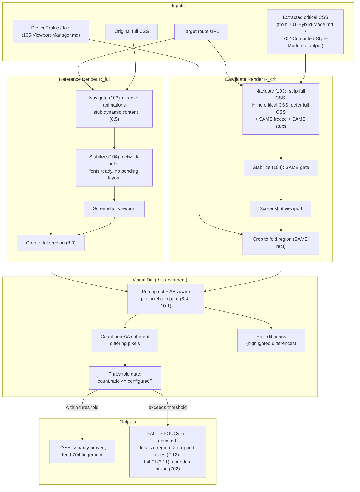

# 703 — Visual Diff

## 1. Title

**Critical CSS Extraction Engine — Visual-Diff Validation: Dual-Render Screenshot Comparison for Rendering-Parity Proof and Missing-Critical-Rule Detection**

## 2. Version

| Field | Value |
|---|---|
| Document Version | 1.0.0 |
| Status | Accepted |
| Last Updated | 2026-07-09 |
| Owners | Advanced Extraction Working Group |
| Stability | Stable (Phase 9 design document; Visual Diff is the empirical validation backstop for every extraction strategy and the CI gate per BRIEF.md Section 2.11 — changes to the pass/fail threshold contract require RFC because the CI pipeline's build-failure semantics depend on it) |

## 3. Purpose

Every strategy this project produces — CSSOM matching, [700-Coverage-Mode.md](./700-Coverage-Mode.md), [701-Hybrid-Mode.md](./701-Hybrid-Mode.md), and the pruning refinement of [702-Computed-Style-Mode.md](./702-Computed-Style-Mode.md) — reasons *statically* about which CSS an above-fold region needs. All of that reasoning, however careful, is a model of the browser's behavior, and BRIEF.md Section 2.18's headline acceptance criterion is not "the model is sound" but "**rendering parity with the original page**." A model cannot certify itself; only the rendered pixels can. This document defines **Visual-Diff Validation**: the pass that renders the page twice — once with the full, original CSS, once with the extracted critical-CSS-only — screenshots both at each viewport profile, and pixel-diffs the above-fold region to *empirically prove* that the critical CSS reproduces the original's above-fold appearance, or to flag exactly where it does not.

This is the mechanism that operationalizes BRIEF.md Section 2.18's rendering-parity criterion and Section 2.15's Visual Regression and Golden-CSS testing layers, and it is the concrete check behind the CI gate of BRIEF.md Section 2.11 ("Compare against baseline … Fail build if … missing dependencies detected"). Its two jobs are complementary: (1) a **parity proof** — the critical CSS is *sufficient*, i.e., nothing visible above the fold shifted, disappeared, or restyled between the two renders; and (2) a **missing-critical-rule detector** — when parity fails, the diff localizes the failure to a region, which the diagnostics layer (BRIEF.md Section 2.12) maps back to the DOM subtree and the rules that were dropped, catching the two failure modes that matter most: flash-of-unstyled-content (FOUC) and layout shift (elements moving because a layout-affecting rule was omitted).

Where [702-Computed-Style-Mode.md](./702-Computed-Style-Mode.md) is a *static* over-match filter that reasons about which declarations win, this document is the *empirical* under-match detector that catches any rule wrongly dropped by *any* strategy, including a wrong prune that the computed-style verifier's static reasoning missed. The two form a closed loop: static pruning shrinks the output; visual diff proves the shrink was safe (or rejects it). This document is the authority for how the dual render is set up so the two renders differ *only* in CSS, how the above-fold region is isolated, how anti-aliasing and font-rendering noise is prevented from producing false failures, and how the pass/fail threshold is configured and wired into CI.

## 4. Audience

- Implementers of the Visual-Diff pass within `packages/reporter` (or a dedicated validation package), who need the dual-render setup, region isolation, noise-handling, and diff algorithm.
- Implementers of the CI integration (BRIEF.md Section 2.11), who need the pass/fail contract and how a diff failure maps to a build-failing exit code and an uploaded artifact.
- Implementers of [701-Hybrid-Mode.md](./701-Hybrid-Mode.md) and [702-Computed-Style-Mode.md](./702-Computed-Style-Mode.md), who use a visual-diff failure as the signal to abandon an unsafe prune and fall back to the conservative union.
- Implementers of the testing subsystem (BRIEF.md Section 2.15), who wire visual-diff into the Visual Regression and Golden layers.
- Reviewers investigating a flaky or false-positive visual-diff failure, who need this document's noise-handling and Edge Cases sections as the diagnostic reference for distinguishing a real parity break from rendering nondeterminism.
- Senior engineers debugging a reported FOUC or layout shift in production, who need this document's region-localization mechanism to trace the visible symptom back to a dropped rule.

Readers should be familiar with headless-browser screenshotting (Playwright's `page.screenshot`, per [101-Playwright-Adapter.md](./101-Playwright-Adapter.md)), the concept of perceptual vs. exact pixel diffing, anti-aliasing and sub-pixel font rendering as sources of non-semantic pixel variance, and the viewport/fold model of [105-Viewport-Manager.md](./105-Viewport-Manager.md) and [201-Geometry-Engine.md](./201-Geometry-Engine.md).

## 5. Prerequisites

- [201-Geometry-Engine.md](./201-Geometry-Engine.md) and [105-Viewport-Manager.md](./105-Viewport-Manager.md) — the fold definition (viewport-relative physical Y-boundary) that determines the above-fold region this document crops and diffs.
- [104-Rendering-Stabilization.md](./104-Rendering-Stabilization.md) — the stabilization contract both renders must reach before screenshotting, so the diff compares two settled pages, not two mid-animation frames.
- [101-Playwright-Adapter.md](./101-Playwright-Adapter.md) and [102-Browser-Pool.md](./102-Browser-Pool.md) — the screenshot API and the pool that supplies the (ideally identical) browser contexts for both renders.
- [103-Navigation-Engine.md](./103-Navigation-Engine.md) — how the page is navigated/loaded identically for both renders except for the CSS substitution.
- [700-Coverage-Mode.md](./700-Coverage-Mode.md), [701-Hybrid-Mode.md](./701-Hybrid-Mode.md), [702-Computed-Style-Mode.md](./702-Computed-Style-Mode.md) — the strategies whose output this document validates.
- [604-Output-Validation.md](./604-Output-Validation.md) — the serializer-level static validation this document complements with empirical validation (static checks that the CSS parses and dependencies resolve; visual diff checks that it *renders* the same).
- [006-Design-Principles.md](../architecture/006-Design-Principles.md) Principle 1 (Browser Is Source of Truth — the rendered pixels are the ultimate authority) and Principle 5 (Determinism of Output — both renders and the diff must be reproducible).
- BRIEF.md Section 2.11 (CI/CD Pipeline), Section 2.15 (Testing Strategy), Section 2.18 (Acceptance Criteria).

## 6. Related Documents

- [700-Coverage-Mode.md](./700-Coverage-Mode.md), [701-Hybrid-Mode.md](./701-Hybrid-Mode.md), [702-Computed-Style-Mode.md](./702-Computed-Style-Mode.md) — sibling Phase 9 strategies whose output this document validates; the closed static-prune-then-visually-verify loop with [702-Computed-Style-Mode.md](./702-Computed-Style-Mode.md) is central.
- [704-Incremental-Extraction.md](./704-Incremental-Extraction.md) — sibling Phase 9 document; a passing visual diff is part of the extraction result whose fingerprint lets a re-run skip re-validation, and a content change that invalidates the fingerprint mandates re-running the diff.
- [201-Geometry-Engine.md](./201-Geometry-Engine.md) and [105-Viewport-Manager.md](./105-Viewport-Manager.md) — define the above-fold crop region.
- [104-Rendering-Stabilization.md](./104-Rendering-Stabilization.md) — defines when each render is ready to screenshot.
- [101-Playwright-Adapter.md](./101-Playwright-Adapter.md), [102-Browser-Pool.md](./102-Browser-Pool.md), [103-Navigation-Engine.md](./103-Navigation-Engine.md) — the browser/navigation/screenshot substrate.
- [604-Output-Validation.md](./604-Output-Validation.md) — static output validation this document complements empirically.
- [1004-Visualization.md](./1004-Visualization.md) — the diagnostics visualization that overlays a diff heat-map on the DOM (BRIEF.md Section 2.12), consuming this document's diff mask.
- BRIEF.md Section 2.11 (CI/CD Pipeline), Section 2.15 (Testing Strategy — Visual Regression, Golden), Section 2.18 (Acceptance Criteria — rendering parity) — repository root.

## 7. Overview

The Visual-Diff contract, reduced to one sentence: for each viewport profile, render the target page twice under conditions that differ *only* in which CSS is applied (full original vs. extracted critical), screenshot the above-fold region of each after both reach rendering stabilization, and compute a noise-tolerant pixel diff whose above-threshold difference count is the empirical verdict on rendering parity — pass meaning the critical CSS is sufficient, fail meaning at least one region reveals a missing (or wrongly pruned) rule.

Four design commitments run through this document:

1. **The rendered pixels are the final authority.** Consistent with [006-Design-Principles.md](../architecture/006-Design-Principles.md) Principle 1, no static analysis is trusted over what the browser actually paints. Visual diff exists precisely because every upstream strategy is a *model* and models can be wrong; the pixels cannot lie about parity. This is why visual diff, not any static check, is the acceptance-criterion gate for BRIEF.md Section 2.18's rendering-parity requirement.

2. **The two renders must be identical except for CSS.** Any other difference — different DOM, different network responses, different fonts loaded, different animation phase, different scroll position, different device scale — would contaminate the diff with variance unrelated to the critical-CSS question and produce false failures. Section 8.2 specifies the controlled-variable discipline: same URL, same navigation, same viewport, same fonts, same stabilization gate, same device scale factor; the *only* independent variable is the stylesheet set.

3. **Diff the fold region, not the full page.** The engine's contract is above-fold correctness (BRIEF.md Section 2.1); below-fold content is expected to differ (critical CSS deliberately omits below-fold styling, which loads asynchronously afterward). Diffing the full page would flag every intended below-fold difference as a failure. The diff is therefore cropped to the fold region defined by [105-Viewport-Manager.md](./105-Viewport-Manager.md) / [201-Geometry-Engine.md](./201-Geometry-Engine.md), per viewport.

4. **Noise must be distinguished from signal, structurally, not by inflating the threshold.** Anti-aliasing, sub-pixel font rasterization, and GPU-vs-CPU compositing differences produce small, spatially-scattered, low-magnitude pixel deltas that are *not* parity breaks. A real parity break (a missing rule) produces spatially-coherent, higher-magnitude deltas (a block moved, a color changed, text reflowed). Section 8.4 handles noise via a perceptual/anti-aliasing-aware comparison and font-rendering determinism, so the threshold can stay tight enough to catch real breaks rather than being loosened until it catches nothing.

## 8. Detailed Design

### 8.1 The Dual-Render Model

Two renders are produced per viewport profile:

- **Reference render (R_full).** The page loaded normally with all its original CSS intact — the ground truth of "what the user is supposed to see above the fold."
- **Candidate render (R_crit).** The same page loaded with the original CSS *removed* and the extracted critical CSS inlined in its place, exactly as the SSR integration ([900-SSR-Overview.md](./900-SSR-Overview.md), BRIEF.md Section 2.10) would inline it in production — with the full stylesheet either absent or deferred (loaded `async`/after paint), so the candidate render represents the *first-paint* state a real user experiences before the full CSS arrives.

The parity question is precisely: does `R_crit`'s above-fold region look like `R_full`'s above-fold region? If yes, the critical CSS is sufficient for a flash-free first paint. If no, the difference *is* the FOUC or layout shift a real user would experience.

**Why compare against the full-CSS render rather than a stored golden image.** A stored golden (a checked-in reference screenshot) is used in the *regression* layer (Section 15) to detect drift over time, but it is the wrong reference for the *parity* question: a golden could itself encode a rendering that a browser update, font change, or content change has since made stale, and comparing critical-vs-golden would then fail for reasons unrelated to extraction quality. Comparing critical-vs-full, both rendered *in the same session on the same browser build with the same content*, isolates exactly one variable — the CSS — which is the only variable extraction controls. Golden images serve a different, complementary purpose (catching unintended changes in the *full* render itself), addressed in Section 15.

### 8.2 Controlled-Variable Discipline

For the diff to mean "difference attributable to CSS," everything else must be pinned identical across `R_full` and `R_crit`:

- **Same navigation and content.** Both renders navigate the same URL via the same [103-Navigation-Engine.md](./103-Navigation-Engine.md) path with the same request interception/mocking, so dynamic content (timestamps, A/B variants, personalized blocks, ads) is *frozen identically*. If content differs between the two renders, the diff is meaningless. Where content is inherently nondeterministic, it must be stubbed (Section 8.5) — the same stubbing applied to both renders.
- **Same viewport and device scale.** Both use the identical `DeviceProfile` (width, height, `deviceScaleFactor`) from [105-Viewport-Manager.md](./105-Viewport-Manager.md). A different DPR changes rasterization and would produce whole-image noise.
- **Same fonts.** Both must have the identical set of fonts loaded and rendered. Because font loading is asynchronous and a missing `@font-face` in the critical set is itself a legitimate parity failure (text renders in a fallback font, shifting layout), fonts are handled carefully: the diff must wait for font loading to settle in both renders (via `document.fonts.ready`, part of [104-Rendering-Stabilization.md](./104-Rendering-Stabilization.md)), so that a font-swap-induced difference is attributed to a genuinely missing `@font-face` dependency, not to a race.
- **Same stabilization gate.** Both renders screenshot only after [104-Rendering-Stabilization.md](./104-Rendering-Stabilization.md) reports settled (network idle, fonts ready, animations/transitions completed or disabled, no pending layout). Screenshotting at different animation phases would diff two different frames of the same animation.
- **Same scroll position.** Both at scroll origin (0,0), since the fold is defined at the initial viewport (BRIEF.md, [105-Viewport-Manager.md](./105-Viewport-Manager.md)).

**Why disable animations/transitions for the diff rather than trying to synchronize them.** CSS animations and transitions are time-dependent; two renders started microseconds apart will be at slightly different animation phases at screenshot time, producing spurious diffs. The pass injects a stylesheet forcing `animation: none !important; transition: none !important` (and `caret-color: transparent` to suppress the blinking text caret) into *both* renders identically, freezing them at their initial/final computed state. Because the freeze is applied identically to both, it cannot mask a real CSS difference between them — it only removes a shared, non-semantic source of variance. This mirrors the standard visual-regression-testing discipline and is why animation keyframe *rules* are still validated (they are in the critical set if their target is above-fold, and the diff of the frozen initial state still catches a missing keyframe that affects the resting appearance).

### 8.3 Above-Fold Region Isolation

The diff is computed only over the fold region. Two isolation approaches are possible and this document specifies which and why:

- **Crop by fold height (chosen default).** Screenshot the full viewport, then crop both images to `[0, 0, viewportWidth, foldHeight]` where `foldHeight` is the fold from [105-Viewport-Manager.md](./105-Viewport-Manager.md). This is simple, deterministic, and requires nothing from the DOM at diff time. The crop rectangle is identical for both renders (same viewport/fold), so no misalignment is introduced.
- **Mask by above-fold element bounding boxes (available, secondary).** Using the above-fold element set from [201-Geometry-Engine.md](./201-Geometry-Engine.md), build a mask of exactly the pixels covered by above-fold elements and diff only masked pixels. This is more precise (it ignores below-fold pixels that happen to fall within the fold-height crop because an element straddles the boundary) but introduces a subtlety: the two renders may have *different* element bounding boxes if the critical CSS caused a layout shift — which is exactly the failure we want to detect. Masking by `R_crit`'s boxes could mask *away* the very shift we need to catch. Therefore the mask, when used, is always taken from `R_full` (the ground truth), never `R_crit`.

**Design choice: crop-by-fold-height is the default; box-masking is an opt-in precision mode.** The crop is chosen as the default because it cannot accidentally hide a shift (it includes every pixel in the fold band regardless of layout) and needs no DOM correlation at diff time, keeping the diff a pure image operation. Box-masking is offered for pages with large fixed decorative below-fold-but-within-fold-band regions where crop-diffing produces expected, ignorable differences; when enabled it always masks from the reference render for the reason above.

### 8.4 Noise Handling: Anti-Aliasing and Font Rendering

The core difficulty of any visual diff is that two *identical-in-intent* renders are rarely bit-identical: anti-aliasing at glyph and shape edges, sub-pixel font hinting, and compositor differences produce small, low-amplitude, edge-localized pixel deltas that are not parity breaks. Naively counting any non-zero pixel delta would fail every diff. This document handles noise through three layers, in order of preference:

1. **Eliminate noise sources at the source (preferred).** Because both renders run on the *same browser build in the same session* (Section 8.2), most nondeterminism is already controlled. Additionally, the pass disables subpixel-antialiasing-dependent variance where possible by pinning `deviceScaleFactor`, disabling GPU acceleration if it introduces nondeterminism (`--disable-gpu` / software compositing in the headless launch, per [101-Playwright-Adapter.md](./101-Playwright-Adapter.md)), and using the same font-rendering backend for both. Eliminating a noise source is always preferable to tolerating it, because tolerance widens the blind spot for real breaks.

2. **Anti-aliasing-aware perceptual comparison (primary diff algorithm).** The diff does not compare raw RGB equality. It uses a perceptual, anti-aliasing-aware comparison (the well-known approach popularized by the `pixelmatch`/`Blink-diff` family: for each pixel, compute a perceptual color distance in a luminance-weighted space, and additionally classify a differing pixel as *anti-aliasing noise* if its difference is explained by being on an edge where neighboring pixels in either image show the expected gradient — an AA pixel is one whose value lies between its neighbors' values, characteristic of edge smoothing rather than a content change). AA-classified pixels are excluded from the failure count. Section 10.1 gives the algorithm.

3. **Threshold on the *count* of coherent non-AA differing pixels, not on any single pixel (final gate).** After perceptual + AA filtering, remaining differing pixels are counted; the diff fails if the count (or its fraction of the fold-region area) exceeds a configured threshold. A tiny threshold absorbs residual single-pixel noise while still failing on any spatially-coherent block of differences (a moved element, a recolored region, reflowed text) which necessarily produces far more differing pixels than residual noise.

**Threshold configuration.** Three configurable parameters, with conservative defaults:
- `perceptualThreshold` (per-pixel color-distance sensitivity, default ~0.1 on a 0–1 scale): how different two pixels must be to count as differing at all. Lower = stricter.
- `maxDiffPixels` and/or `maxDiffRatio` (aggregate gate): the count/fraction of non-AA differing pixels tolerated before the diff fails (default very small, e.g., ratio ≤ 0.001, tuned per project). This absorbs residual noise, not real breaks.
- `includeAA` (default false): whether to count AA-classified pixels. Kept false so AA noise never fails a diff.

The defaults are deliberately strict (correctness-over-tolerance, consistent with the engine's [006-Design-Principles.md](../architecture/006-Design-Principles.md) Principle 3 bias): it is better for the diff to occasionally fail and demand human confirmation than to silently pass a real FOUC. Per-project tuning loosens only where a project's own rendering is demonstrably noisier.

### 8.5 Handling Nondeterministic Content

Content that changes between renders (ads, timestamps, randomized ordering, live data) must be neutralized identically in both renders, or it produces diffs unrelated to CSS. The pass supports: request interception to serve fixed responses ([103-Navigation-Engine.md](./103-Navigation-Engine.md)), CSS-based masking of known-dynamic regions (a configured selector list rendered as opaque blocks in *both* renders before screenshot), and clock/`Math.random` seeding via injected script. Because these neutralizations are applied identically to `R_full` and `R_crit`, they cannot hide a CSS difference between the two — they only remove a shared confound.

### 8.6 Wiring Into the CI Gate

BRIEF.md Section 2.11's pipeline (`Build → Crawl routes → Generate critical CSS → Compare against baseline → Publish artifacts → Upload reports`) with "Fail build if … missing dependencies detected" is realized as follows: after generation, for each crawled route and each viewport, the visual-diff pass runs; a diff failure sets a nonzero exit code and marks the build failed. The three diff artifacts — reference image, candidate image, and diff mask (with differing pixels highlighted) — are uploaded per failing (route, viewport) so a human can inspect exactly what broke. A passing diff contributes its result to the extraction result fingerprinted by [704-Incremental-Extraction.md](./704-Incremental-Extraction.md), so unchanged routes skip re-diffing on the next CI run. The gate is configurable: a project may run visual-diff as a *soft* gate (report-only, non-failing) during rollout and promote it to a *hard* gate once thresholds are tuned — but the default for the acceptance-criterion-bearing pipeline is hard-fail, since rendering parity is a stated acceptance criterion (BRIEF.md Section 2.18), not an advisory metric.

## 9. Architecture

### 9.1 Dual-Render Diff Pipeline



### 9.2 Dual-Render Diff Sequence

```mermaid
sequenceDiagram
    participant Val as Visual-Diff Validator
    participant Pool as 102-Browser-Pool
    participant Ref as Reference Context (R_full)
    participant Cand as Candidate Context (R_crit)
    participant Cmp as Diff Comparator

    Val->>Pool: acquire two matched contexts (same profile)
    Pool-->>Val: Ref, Cand

    par Reference render
        Val->>Ref: navigate(url) + freeze anims + stub content
        Ref->>Ref: stabilize (104): network idle, fonts.ready
        Val->>Ref: screenshot(viewport)
        Ref-->>Val: refImage
    and Candidate render
        Val->>Cand: navigate(url), strip full CSS, inline critical, defer full
        Val->>Cand: SAME freeze + SAME stubs
        Cand->>Cand: stabilize (104): SAME gate
        Val->>Cand: screenshot(viewport)
        Cand-->>Val: candImage
    end

    Val->>Val: crop both to fold region (same rect, 8.3)
    Val->>Cmp: diff(refCrop, candCrop, thresholds)
    Cmp->>Cmp: perceptual compare + AA classification (10.1)
    Cmp->>Cmp: count non-AA differing pixels
    Cmp-->>Val: {diffCount, diffRatio, diffMask}
    alt diffRatio <= maxDiffRatio
        Val-->>Val: PASS (parity proven; feed 704)
    else exceeds threshold
        Val-->>Val: FAIL (emit mask, localize region, fail CI)
    end
```

## 10. Algorithms

### 10.1 Algorithm: Noise-Tolerant Above-Fold Pixel Diff

**Problem statement.** Given two RGBA images of identical dimensions (the fold-region crops of `R_full` and `R_crit`), count the pixels that differ in a way attributable to a real CSS parity break, excluding anti-aliasing/sub-pixel/font-rasterization noise, and return a pass/fail verdict against configured thresholds plus a diff mask for diagnostics.

**Inputs.** `ref: Image`, `cand: Image` (equal `W × H`); `perceptualThreshold ∈ [0,1]`; `maxDiffRatio ∈ [0,1]`; `includeAA: boolean`.

**Outputs.** `{ diffCount: int, diffRatio: float, verdict: PASS|FAIL, mask: Image }`.

**Pseudocode.**

```
function visualDiff(ref, cand, perceptualThreshold, maxDiffRatio, includeAA) -> Result:
    assert ref.width == cand.width and ref.height == cand.height   // else render mismatch = FAIL
    W = ref.width; H = ref.height
    mask = blankImage(W, H)
    diffCount = 0
    maxDelta = maxPerceptualDistance()   // normalization constant (luminance-weighted YIQ)

    for y in 0..H-1:
        for x in 0..W-1:
            p_ref = ref.pixel(x, y); p_cand = cand.pixel(x, y)
            delta = perceptualDistance(p_ref, p_cand) / maxDelta   // 0..1, luminance-weighted
            if delta <= perceptualThreshold:
                continue                    // indistinguishable: not a difference
            // candidate differing pixel; test whether it is anti-aliasing noise
            if not includeAA and (isAntiAliased(ref, x, y) or isAntiAliased(cand, x, y)):
                mask.set(x, y, YELLOW)      // mark AA (informational), do not count
                continue
            mask.set(x, y, RED)             // real difference
            diffCount += 1

    diffRatio = diffCount / (W * H)
    verdict = (diffRatio <= maxDiffRatio) ? PASS : FAIL
    return { diffCount, diffRatio, verdict, mask }

function isAntiAliased(img, x, y) -> bool:
    // A pixel is AA if, among its 8 neighbors, it has both a sufficiently darker and a
    // sufficiently brighter neighbor AND is adjacent to a pixel that is the min or max
    // luminance in the neighborhood -> characteristic of an edge-smoothing gradient,
    // not a flat-region content change. (Yang et al. AA-detection heuristic.)
    center = luminance(img.pixel(x, y))
    hasDarker = false; hasBrighter = false; adjacentToExtreme = false
    for (nx, ny) in neighbors8(x, y):
        l = luminance(img.pixel(nx, ny))
        if l < center - AA_DELTA: hasDarker = true
        if l > center + AA_DELTA: hasBrighter = true
        if isLocalExtreme(img, nx, ny): adjacentToExtreme = true
    return hasDarker and hasBrighter and adjacentToExtreme
```

**Time complexity.** `O(W · H)` — one pass over the fold-region pixels; `isAntiAliased` is `O(1)` (fixed 8-neighborhood) and invoked only for the subset of pixels that already exceeded `perceptualThreshold`, so the AA cost is bounded by the number of differing pixels, not total pixels. Overall linear in fold-region area.

**Memory complexity.** `O(W · H)` for the two input images plus the mask; no auxiliary structure grows with anything else.

**Failure cases.** (a) Dimension mismatch between `ref` and `cand` indicates the two renders produced different viewport/crop sizes — a setup error (different DPR or viewport), returned as an immediate FAIL with a distinct error code, never silently resized (resizing would fabricate pixels and mask real differences). (b) A fully-transparent or all-black screenshot from a render that failed to paint is detected by a sanity pre-check (reject images below a minimum non-background-pixel fraction) and reported as a render failure, not a diff result. (c) An image decode error surfaces as a validator error, not a PASS.

**Optimization opportunities.** Early-exit once `diffCount` exceeds `maxDiffPixels` (the diff has already failed; no need to finish counting) — but only when the full diff mask is not required for diagnostics; when the mask is needed for a failing CI artifact, the full pass runs. Tile-parallelize the pixel loop across worker threads for large viewports (horizontal bands are independent). Downscale-then-diff as a fast pre-filter is *rejected* because downsampling blends adjacent pixels and can hide a thin-but-real difference (a 1px border, a hairline shift).

### 10.2 Algorithm: Failure Localization to Dropped Rules

**Problem statement.** When the diff fails, map the spatially-coherent differing region(s) back to the DOM subtree and the CSS rules that were dropped, so the failure is actionable (which rule to add back) rather than merely "something looks different."

**Inputs.** `diffMask` (from 10.1), `aboveFoldElements` with bounding boxes ([201-Geometry-Engine.md](./201-Geometry-Engine.md)), the set of rules the strategy *dropped* (original candidate set minus emitted critical set).

**Outputs.** `localizations: { region, overlappingElements, suspectDroppedRules }[]`.

**Pseudocode.**

```
function localize(diffMask, aboveFoldElements, droppedRules) -> Localization[]:
    regions = connectedComponents(diffMask.redPixels())    // cluster coherent differences
    results = []
    for region in regions:
        if region.area < MIN_REGION_AREA: continue          // ignore residual specks
        overlap = [el for el in aboveFoldElements
                     if boxIntersects(el.boundingBox, region.bounds)]
        suspects = [r for r in droppedRules
                      if any(el in overlap where el.matches(r.selectorText))]
        results.push({ region: region.bounds,
                       overlappingElements: overlap,
                       suspectDroppedRules: rankBySpecificityAndArea(suspects) })
    return results
```

**Time complexity.** `connectedComponents` is `O(W · H)` (union-find or flood fill over the mask). Overlap/suspect computation is `O(regions · aboveFold + regions · droppedRules · matchCost)`; bounded and small because regions and dropped rules are few in a near-passing diff.

**Memory complexity.** `O(W · H)` for the component labeling.

**Failure cases.** If no dropped rule overlaps a failing region, the failure is likely *not* a dropped-rule problem (e.g., a font-loading race, a nondeterministic-content leak, or a genuine noise underestimate) — the localizer reports "no dropped-rule explanation" so the investigator looks at setup/noise (Section 8.4–8.5) rather than hunting a nonexistent rule.

**Optimization opportunities.** Cache the `element.matches` results reused from the original selector-matching pass ([401-Selector-Memoization.md](./401-Selector-Memoization.md)) rather than re-matching.

## 11. Implementation Notes

- The candidate render must inline the critical CSS *exactly as production will* (SSR-injected, per BRIEF.md Section 2.10 / [900-SSR-Overview.md](./900-SSR-Overview.md)) and must defer/async the full stylesheet the same way production does — otherwise the diff validates a rendering configuration that never ships. The most faithful setup strips the original `<link rel=stylesheet>` and injects the critical CSS in a `<style>` in `<head>`, matching the SSR adapter's output byte-for-byte.
- Animation/transition freezing and dynamic-content stubbing must be applied to **both** renders through the identical injection path, ideally the same injected initialization script, so there is zero chance of applying a confound to only one side.
- Screenshotting must occur only after [104-Rendering-Stabilization.md](./104-Rendering-Stabilization.md) signals settled *and* `document.fonts.ready` has resolved in each render independently; a common bug is screenshotting `R_full` after fonts load but `R_crit` before, producing a font-swap diff misattributed to CSS.
- Both contexts should come from the same [102-Browser-Pool.md](./102-Browser-Pool.md) with identical launch flags (including software-rendering flags if used for determinism, Section 8.4); mismatched launch flags are a silent noise source.
- The diff thresholds must be centrally configured (per BRIEF.md config-loader model) with per-project overrides, and the effective thresholds recorded in the diff artifact so a pass/fail is reproducible and auditable ([006-Design-Principles.md](../architecture/006-Design-Principles.md) Principle 5).
- When used as [702-Computed-Style-Mode.md](./702-Computed-Style-Mode.md)'s prune backstop, a diff failure on a pruned output must cause the orchestrator to abandon *that specific prune* and re-diff with the rule restored — not to fail the whole extraction — so a single unsafe prune degrades gracefully to the conservative union rather than blocking the build.

## 12. Edge Cases

- **Fonts loaded in reference but missing `@font-face` in critical.** This is a *real* parity failure (text renders in fallback, reflows), and the diff correctly catches it — provided both renders wait for `fonts.ready`, so the difference is attributed to the missing font dependency and not a timing race. This is the canonical example of visual diff catching a missing critical *dependency* ([500-Dependency-Resolution-Overview.md](./500-Dependency-Resolution-Overview.md)) that static analysis missed.
- **Scrollbar presence differences.** If `R_crit` omits a rule that changes content height, one render may show a scrollbar the other does not, shifting layout by the scrollbar width and producing a full-width diff stripe. Handled by rendering both with `scrollbar-gutter: stable` forced identically, or by overlay-scrollbar emulation, so scrollbar presence is not itself a variable.
- **`content-visibility: auto` and lazy rendering.** An element with `content-visibility: auto` may be unrendered until scrolled into view; both renders must be stabilized identically so such elements are in the same render state. A critical CSS that drops the `content-visibility` rule can change what paints — a real failure the diff should catch, again contingent on identical stabilization.
- **GPU/compositor nondeterminism.** Sub-pixel differences from hardware compositing (gradients, shadows, filters, `backdrop-filter`) can exceed AA tolerance. Mitigated by forcing software compositing for the diff (Section 8.4); where a project cannot, the affected regions are the reason `maxDiffRatio` exists as a small tolerance, and persistent noise there is a candidate for box-masking (Section 8.3).
- **Emoji and color-font rendering.** Color-font glyphs (emoji) rasterize identically across two same-session renders, so they are not a noise source here — but they are a reason not to naively downscale (rejected in 10.1) since downscaling blends their edges.
- **Retina/high-DPR crops.** At `deviceScaleFactor > 1`, the screenshot is physical-pixel sized; the crop rectangle must be scaled by DPR consistently for both renders. A DPR-scaling bug produces a dimension mismatch caught by 10.1's assertion.
- **Dark-mode / `prefers-color-scheme` and other media features.** The emulated media state ([303-Media-Rules.md](./303-Media-Rules.md)) must be identical in both renders; diffing a light `R_full` against a dark `R_crit` because media emulation was set on only one side is a setup error, not an extraction failure.
- **Cross-origin / tainted canvas.** If a cross-origin image taints the screenshot pipeline (rare with Playwright's native screenshot, which is not canvas-based), the pass falls back to the native screenshot API rather than a canvas read, avoiding the taint entirely ([101-Playwright-Adapter.md](./101-Playwright-Adapter.md)).
- **Genuinely empty above-fold (splash/redirect pages).** A page whose above-fold is a solid background with no content produces a trivially-passing diff; the render-sanity pre-check (10.1 failure case b) ensures this is a real blank page, not a failed paint masquerading as parity.

## 13. Tradeoffs

| Decision | Why | Alternative Considered | Tradeoff Accepted |
|---|---|---|---|
| Compare critical-vs-full in the same session | Isolates CSS as the only variable; immune to browser/font/content drift | Compare critical against a stored golden image | Cannot detect drift in the *full* render itself (delegated to the separate golden regression layer, Section 15) |
| Diff only the fold region, not the full page | Below-fold is intentionally unstyled at first paint; full-page diff would fail on intended differences | Full-page diff | Misses parity issues strictly below the fold — acceptable, since below-fold correctness is not the engine's first-paint contract |
| AA-aware perceptual diff + small aggregate threshold | Distinguishes non-semantic edge noise from real breaks without loosening sensitivity to real breaks | Exact pixel equality; or a large blanket threshold | AA heuristic can misclassify a rare 1px real change as AA; mitigated by the coherent-region requirement (a real change is rarely a single isolated AA-shaped pixel) |
| Freeze animations/transitions identically in both renders | Removes time-phase variance that would produce spurious diffs | Synchronize animation clocks across renders | Cannot validate mid-animation appearance; accepted since first-paint parity concerns the resting/initial state |
| Default hard-fail CI gate | Rendering parity is a stated acceptance criterion (2.18), not advisory | Soft/report-only gate by default | Occasional threshold-tuning friction on noisy projects; mitigated by per-project threshold config and a soft-gate rollout option |
| Reject downscale-then-diff pre-filter | Downsampling blends pixels and can hide thin real differences (1px borders, hairline shifts) | Fast downscaled pre-pass | Full-resolution diff is costlier; accepted for correctness, mitigated by early-exit and tiling |
| Box-mask always from reference render, not candidate | Masking from candidate could hide the very layout shift being detected | Mask from candidate, or from union | Slightly less precise masking of shifted elements; accepted because it cannot hide a shift |

## 14. Performance

- **CPU complexity.** The diff itself is `O(W · H)` per (route, viewport) — linear in fold-region pixel area (Section 10.1). The dominant *wall-clock* cost is not the diff but the two full page renders (navigation + stabilization + screenshot), each of which is orders of magnitude more expensive than the pixel comparison. This is the defining performance characteristic: visual diff is expensive because it *renders twice*, and that cost is why it is gated (Section 8.6) and cached (below), not run indiscriminately.
- **Memory complexity.** `O(W · H)` for the image buffers and mask; bounded by fold-region size, independent of DOM/CSS size.
- **Caching strategy.** A passing diff is part of the extraction result fingerprinted by [704-Incremental-Extraction.md](./704-Incremental-Extraction.md); if the route's HTML, CSS, viewport, and mode fingerprints are unchanged, both renders *and* the diff are skipped entirely on re-run — the single largest performance win, since it elides two renders. Screenshots themselves may be cached per fingerprint to allow re-diffing at a changed threshold without re-rendering.
- **Parallelization opportunities.** The two renders of one (route, viewport) run concurrently in two pooled contexts ([102-Browser-Pool.md](./102-Browser-Pool.md), Section 9.2's `par` block); distinct (route, viewport) pairs parallelize across the pool up to its size. The pixel loop tiles across worker threads for large viewports (Section 10.1).
- **Incremental execution.** Only changed routes are re-diffed in CI (Section 8.6, [704-Incremental-Extraction.md](./704-Incremental-Extraction.md)); a stylesheet-only change re-diffs all routes that reference it, a content change re-diffs the affected route.
- **Profiling guidance.** Measure render+stabilize time separately from diff time; render time should dominate by far. If diff time is significant, the fold region is very large or worker tiling is disabled. If stabilization time dominates and varies, the stabilization gate ([104-Rendering-Stabilization.md](./104-Rendering-Stabilization.md)) is likely waiting on a never-idling network resource that should be stubbed (Section 8.5).
- **Scalability limits.** The practical limit is *number of (route × viewport) pairs × 2 renders*, bounded by browser-pool throughput. A large crawl with many routes and viewports is the scaling pressure; incremental caching (only diff changed routes) is what keeps CI cost sublinear in total route count across successive runs.

## 15. Testing

- **Unit tests.** `visualDiff()` against synthetic image pairs: identical images (0 diff), a single-pixel change (below `maxDiffRatio` → PASS, confirming noise tolerance), a shifted block (coherent region → FAIL), an AA-only edge difference (classified AA, not counted), and a dimension mismatch (immediate FAIL). `isAntiAliased()` against known AA-edge vs. flat-region-change pixel neighborhoods. `localize()` against a mask with a known region overlapping a known element/dropped-rule.
- **Integration tests (the core value).** Real fixtures where the critical CSS is *deliberately* correct → diff PASSES with byte-differing but visually-identical renders; and fixtures where a known-critical rule is *deliberately removed* (a layout-affecting `display:flex`, a `@font-face`, a `position` rule) → diff FAILS and `localize()` names the removed rule. These prove both the sufficiency-proof and the missing-rule-detection halves of the contract (Section 3).
- **Visual tests.** This document *is* the visual-test mechanism (BRIEF.md Section 2.15's Visual Regression layer); its own meta-test is that it produces stable PASS verdicts across repeated runs of an unchanged fixture (no flakiness), validating the noise handling of Section 8.4.
- **Golden files.** Complementary to the dual-render diff: a stored golden screenshot of each fixture's `R_full` above-fold region is pinned; a golden regression run compares the *current* `R_full` against the stored golden to catch unintended drift in the reference itself (browser update, fixture change), a different question from critical-vs-full parity (Section 8.1). Golden updates are reviewed, intentional commits (Principle 5).
- **Stress tests.** Very large viewports (4K desktop profile) and dense above-fold fixtures (`fixtures/enterprise-huge/`) to measure diff wall time and confirm worker tiling keeps it bounded; noisy fixtures (heavy gradients, shadows, `backdrop-filter`) to validate that software-compositing + AA handling keep false-failure rates at zero.
- **Regression tests.** Pinned thresholds and pinned expected verdicts per (fixture, viewport); any threshold change or verdict flip must be a reviewed change, so the CI gate's strictness cannot silently erode.
- **Benchmark tests.** End-to-end wall time of the dual-render diff per (route, viewport), tracked over time, so the caching wins of [704-Incremental-Extraction.md](./704-Incremental-Extraction.md) (skipping unchanged routes) are continuously validated against the un-cached baseline.

## 16. Future Work

- **Perceptual metrics beyond pixel counting.** Adopt SSIM (structural similarity) or a learned perceptual metric (LPIPS-style) as an additional signal, to better match human judgment of "looks the same" than luminance-weighted per-pixel distance — deferred pending evidence that the current AA-aware count produces false failures the structural metric would avoid, and weighed against the added nondeterminism a learned metric could introduce (Principle 5).
- **DOM-diff correlation as a first-class signal.** Combine the pixel diff with a computed-layout diff (compare above-fold element bounding boxes between `R_full` and `R_crit` directly, via [201-Geometry-Engine.md](./201-Geometry-Engine.md)); a bounding-box shift is a layout-shift parity break detectable without pixels and localizes to the exact element faster than connected-components on the mask. Would strengthen Section 10.2's localization and give a numeric Cumulative-Layout-Shift-style score.
- **Automatic threshold calibration per project.** Learn `maxDiffRatio`/`perceptualThreshold` from a project's own noise floor (diff `R_full` against itself across repeated renders to measure inherent nondeterminism, set the threshold just above it), removing manual per-project tuning while keeping the gate as tight as the project's rendering allows.
- **Missing-rule auto-repair.** When `localize()` confidently identifies a single dropped rule explaining a failing region, optionally re-emit it and re-diff automatically, turning a hard failure into a self-healing conservative fallback — coordinated with [701-Hybrid-Mode.md](./701-Hybrid-Mode.md)'s fallback logic and [702-Computed-Style-Mode.md](./702-Computed-Style-Mode.md)'s prune-abandonment path.
- **Open question: should the diff validate additional interaction states** (hovered nav, focused input) by driving both renders into the same state before screenshotting, closing the gap left by [702-Computed-Style-Mode.md](./702-Computed-Style-Mode.md)'s deferred state exploration (that document's Section 16)? Current lean is yes for a small configured state set, deferred until the base first-paint diff is proven stable in production CI.

## 17. References

- [700-Coverage-Mode.md](./700-Coverage-Mode.md)
- [701-Hybrid-Mode.md](./701-Hybrid-Mode.md)
- [702-Computed-Style-Mode.md](./702-Computed-Style-Mode.md)
- [704-Incremental-Extraction.md](./704-Incremental-Extraction.md)
- [201-Geometry-Engine.md](./201-Geometry-Engine.md)
- [105-Viewport-Manager.md](./105-Viewport-Manager.md)
- [104-Rendering-Stabilization.md](./104-Rendering-Stabilization.md)
- [103-Navigation-Engine.md](./103-Navigation-Engine.md)
- [101-Playwright-Adapter.md](./101-Playwright-Adapter.md)
- [102-Browser-Pool.md](./102-Browser-Pool.md)
- [303-Media-Rules.md](./303-Media-Rules.md)
- [401-Selector-Memoization.md](./401-Selector-Memoization.md)
- [500-Dependency-Resolution-Overview.md](./500-Dependency-Resolution-Overview.md)
- [604-Output-Validation.md](./604-Output-Validation.md)
- [900-SSR-Overview.md](./900-SSR-Overview.md)
- [1004-Visualization.md](./1004-Visualization.md)
- [006-Design-Principles.md](../architecture/006-Design-Principles.md)
- BRIEF.md Section 2.1 (Vision), Section 2.10 (SSR Integration), Section 2.11 (CI/CD Pipeline), Section 2.12 (Diagnostics), Section 2.15 (Testing Strategy), Section 2.18 (Acceptance Criteria) — repository root
- CSSOM View Module (W3C) — screenshot/viewport coordinate semantics
- pixelmatch / Blink-diff — anti-aliasing-aware perceptual pixel-diff prior art referenced in Section 8.4 / 10.1
- Yang et al., "Anti-aliased pixel detection" heuristic — referenced in `isAntiAliased` (Section 10.1)
- SSIM (Wang et al., "Image Quality Assessment: From Error Visibility to Structural Similarity") — referenced in Section 16
