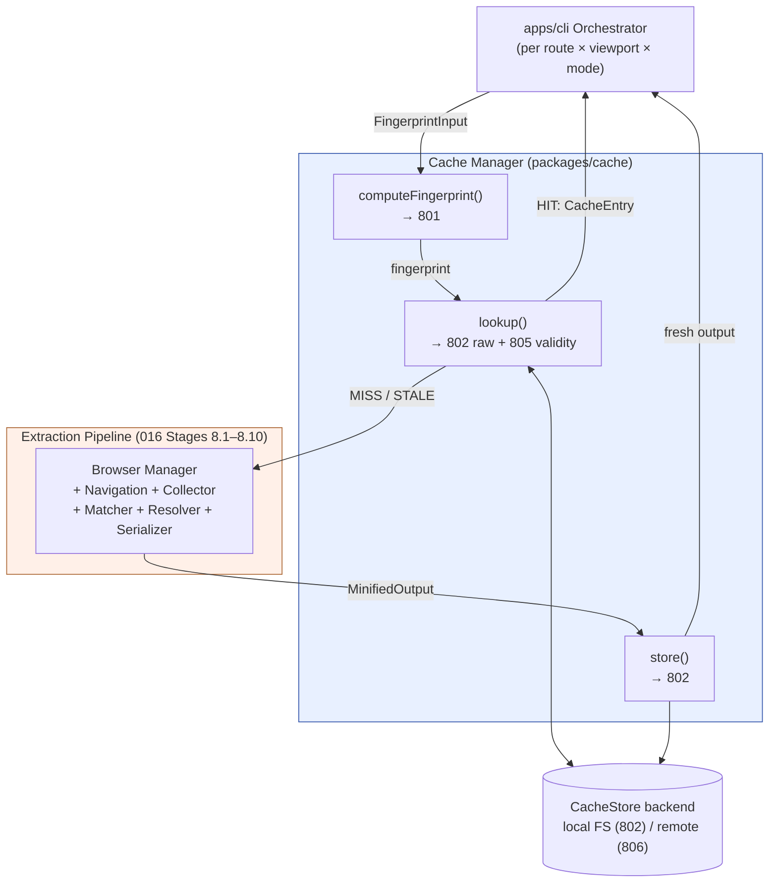
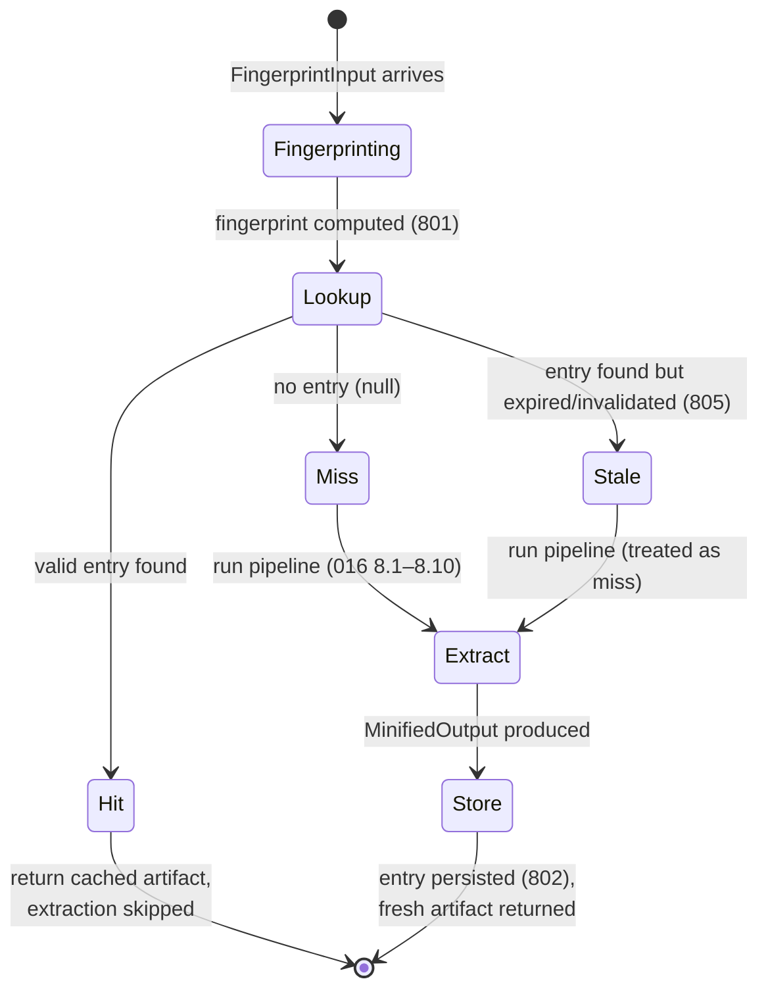

# 800 — Cache Overview

## 1. Title

**Critical CSS Extraction Engine — Cache Manager Module: Purpose, Placement, and Sub-Concern Decomposition**

## 2. Version

| Field | Value |
|---|---|
| Document Version | 1.0.0 |
| Status | Draft — Phase 10 (Caching) |
| Last Updated | 2026-07-09 |
| Owners | Core Architecture Working Group |
| Stability | The module's *placement* (fingerprint-gated, in front of the browser) and its *public contract* (`CacheStore` interface, fingerprint-as-key) are stable and load-bearing for the rest of Phase 10. The internal decomposition into siblings 801–806 is stable as a partition of responsibilities; individual sibling documents may refine their own internals without invalidating this overview. |

## 3. Purpose

This document is the entry point for the Cache Manager module (module `M13` in [003-Requirements.md](../architecture/003-Requirements.md) Section, `packages/cache` in [007-Repository-Structure.md](../architecture/007-Repository-Structure.md)). It exists to answer four questions in one place, before a reader descends into any of the six sibling documents that specify the machinery in detail:

1. **What problem does the Cache Manager solve, and why is it a first-class module rather than a bolt-on optimization?** The short answer, elaborated in Section 7, is that browser-driven extraction is expensive — a full navigate-render-collect-match-resolve-serialize cycle costs 200 ms to 2 s per (route, viewport) pair (per [003-Requirements.md](../architecture/003-Requirements.md) Section, "Caching strategy") — and enterprise CI pipelines run this across many routes × many viewports × many builds per day. Recomputing unchanged work on every build is the single largest avoidable cost in the whole system.

2. **Where does the Cache Manager sit in the pipeline?** In front of the Browser Manager, not behind the Serializer. This is the load-bearing placement decision: a cache *hit* must be able to short-circuit the entire extraction chain — including browser launch — not merely skip the final serialization step. Section 8 makes this precise; [016-Data-Flow.md](../architecture/016-Data-Flow.md) Section 10.2 and the pipeline sequence in [003-Requirements.md](../architecture/003-Requirements.md) already commit the architecture to this shape.

3. **What is the cache key?** A *fingerprint* — a content hash over exactly the inputs that determine an extraction result (HTML content, referenced CSS asset contents, viewport profile, extraction mode, and engine version/config). Fingerprint equality is designed to be *both necessary and sufficient* for output equivalence: no false hits, no spurious misses. This document treats the fingerprint as an opaque key and delegates its construction entirely to [801-Fingerprinting.md](./801-Fingerprinting.md).

4. **How does the module decompose into siblings 801–806, and where does the boundary with the incremental-extraction *strategy* lie?** Section 8.4 lays out the partition. Critically, this document draws a firm line between the Cache Manager (a *storage and lookup mechanism*) and the incremental-extraction *strategy* documented in [704-Incremental-Extraction.md](./704-Incremental-Extraction.md) (a *policy* that decides what to recompute and what to reuse). The strategy is a *client* of the mechanism. Confusing the two — treating "caching" and "incremental extraction" as synonyms — is the single most common category error a reader can make here, and Section 7.3 is dedicated to preventing it.

This document does **not** specify the fingerprint algorithm (that is 801), the persistence backend (802), per-route or per-viewport granularity (803, 804), invalidation semantics (805), or the distributed backend (806). It specifies the *shape of the whole* into which those six pieces fit.

## 4. Audience

- Implementers of `packages/cache` who need the module's charter and its internal decomposition before writing any one sub-component.
- Implementers of `apps/cli` (the orchestration path) who must consult the Cache Manager *before* invoking any extraction strategy, and who need to understand the lookup → hit/miss → store contract precisely.
- Authors of the incremental-extraction strategy ([704-Incremental-Extraction.md](./704-Incremental-Extraction.md)), who consume this module as a dependency and must understand exactly what guarantees a "hit" carries.
- Downstream consumers (Reporter, [016-Data-Flow.md](../architecture/016-Data-Flow.md)'s Stage 12 "Cached Artifact") that read cache entries or observe hit/miss events for diagnostics.
- Senior engineers reviewing conformance with [003-Requirements.md](../architecture/003-Requirements.md) REQ-300–304 and [006-Design-Principles.md](../architecture/006-Design-Principles.md) Principle 8 (Incremental-by-Default Caching).

Readers are assumed to have read [016-Data-Flow.md](../architecture/016-Data-Flow.md) at least through its Section 10.2 (Fingerprint-to-Cache-Entry Data Mapping), and to be familiar with Principle 8. This document does not re-derive why caching must be content-addressed rather than mtime-based; it takes that as settled by Principle 8's Rejected Alternatives.

## 5. Prerequisites

- [006-Design-Principles.md](../architecture/006-Design-Principles.md) — Principle 5 (Determinism of Output) and Principle 8 (Incremental-by-Default Caching). Determinism is a *precondition* for caching to be sound at all: a cache is only correct if identical inputs provably produce byte-identical outputs, so that a stored artifact is a faithful stand-in for a recomputation that never ran.
- [003-Requirements.md](../architecture/003-Requirements.md) — REQ-300 (fingerprint over HTML/CSS/viewport/mode), REQ-301 (reuse without browser re-invocation), REQ-302 (explicit + TTL invalidation), REQ-303 (per-route/per-viewport granularity), REQ-304 (distributed backend, optional).
- [016-Data-Flow.md](../architecture/016-Data-Flow.md) — Stage 12 ("Cached Artifact + Route Manifest Entry"), the `CacheEntry` DTO, and the `storeCacheEntry` / `lookupCacheEntry` data mapping in its Section 10.2.
- [007-Repository-Structure.md](../architecture/007-Repository-Structure.md) — the `packages/cache` package boundary and its `CacheStore`-behind-an-interface posture.
- Working familiarity with content-addressed storage as a general pattern (the same shape used by Git object stores, Nix, and build-artifact caches); this document borrows that framing deliberately rather than inventing terminology.

## 6. Related Documents

- [801-Fingerprinting.md](./801-Fingerprinting.md) — the fingerprint algorithm that produces the cache key this document treats as opaque.
- [802-Cache-Store.md](./802-Cache-Store.md) — the `CacheStore` interface and its filesystem backend: how entries are persisted, read, and enumerated.
- [803-Route-Cache.md](./803-Route-Cache.md) — per-route cache granularity (REQ-303): keeping one route's change from invalidating unrelated routes.
- [804-Viewport-Cache.md](./804-Viewport-Cache.md) — per-viewport granularity: reusing viewport branches independently within a route.
- [805-Cache-Invalidation.md](./805-Cache-Invalidation.md) — explicit and TTL-based invalidation (REQ-302), and the diagnostic trail a hit/miss must leave (Principle 6).
- [806-Distributed-Cache.md](./806-Distributed-Cache.md) — the remote/shared backend (REQ-304) for multi-node CI fleets, implemented additively behind the `CacheStore` interface.
- [704-Incremental-Extraction.md](./704-Incremental-Extraction.md) — the incremental-extraction *strategy*: the policy layer that uses this mechanism. See Section 7.3 for the mechanism/policy boundary.
- [016-Data-Flow.md](../architecture/016-Data-Flow.md) — where the cache sits as a data state in the transformation chain.
- [006-Design-Principles.md](../architecture/006-Design-Principles.md) — the principles this module operationalizes.

## 7. Overview

### 7.1 The problem, stated economically

The Critical CSS Extraction Engine is, by [001-Vision.md](../architecture/001-Vision.md)'s founding commitment, browser-driven: it does not parse HTML and CSS statically, it *renders* the page in a real browser and interrogates the live CSSOM. This is the source of its correctness advantage over static tools (Critical, Critters, Penthouse). It is also the source of its cost. A single extraction requires launching or leasing a browser context, navigating to a URL, waiting for rendering to stabilize ([104-Rendering-Stabilization.md](./104-Rendering-Stabilization.md)), snapshotting the DOM, walking the CSSOM, matching selectors, resolving the dependency graph to a fixed point, and serializing. Empirically this is 200 ms to 2 s per (route, viewport) pair.

Now multiply. A real deployment target (per [003-Requirements.md](../architecture/003-Requirements.md) Section 2.18, "Suitable for enterprise CI pipelines") has hundreds of routes, three-plus viewport profiles (Mobile, Tablet, Desktop per Section 2.6), and tens of CI builds per day. The naive cost is `routes × viewports × builds × per-extraction-cost` — and on the overwhelming majority of builds, *most inputs are unchanged*. A typo fix in one component changes one route's HTML; the other several hundred routes render byte-identically to the previous build. Recomputing all of them is pure waste, and at scale it is the dominant cost — the difference between a CI step that takes 40 seconds and one that takes 40 minutes.

The Cache Manager exists to convert "most inputs are unchanged" into "most work is skipped." Its correctness bar, inherited from Principle 8, is uncompromising: it must skip work only when it can *prove* the inputs are equivalent, never when it merely *guesses* they are. That proof is the fingerprint.

### 7.2 Placement: in front of the browser, not behind the serializer

The most important architectural fact about the Cache Manager is *where the lookup happens*. There are two candidate placements:

- **Naive placement (rejected):** cache the *serialized output* keyed by whatever, and check the cache just before writing the file. This saves only the serialization step — the browser has already launched, navigated, and done all the expensive work. It captures almost none of the available savings.
- **Chosen placement:** consult the cache *before* the orchestrator (`apps/cli`) invokes any extraction strategy at all — before browser launch. A hit returns the stored artifact and the entire chain of Stages 8.1–8.10 in [016-Data-Flow.md](../architecture/016-Data-Flow.md) is skipped. This captures the full 200 ms–2 s savings per hit.

This placement is why the fingerprint must be computable from *inputs alone* (HTML, CSS assets, viewport, mode, engine version) without running the browser. If computing the key required first rendering the page, the cache could never short-circuit rendering. The whole architecture of 801 flows from this constraint. [016-Data-Flow.md](../architecture/016-Data-Flow.md) Section states this precisely: "`apps/cli`'s orchestration must be able to short-circuit before Stage 8.1's Live Page acquisition, not merely before Stage 8.10's serialization."

### 7.3 The mechanism/policy boundary: Cache Manager vs. incremental-extraction strategy

This is the disambiguation this document most needs to make, because "caching" and "incremental extraction" are colloquially interchangeable and are *not* interchangeable here.

- The **Cache Manager** (this module, `packages/cache`) is a **mechanism**: a content-addressed key-value store with a fingerprint key. It answers exactly one question — "given this fingerprint, do you have a stored artifact, yes or no, and if yes, here it is." It has no opinion about *which* fingerprints are worth computing, *when* to compute them, or *what to do* on a miss. It is deliberately dumb, in the way a hash map is dumb, and its dumbness is what makes it correct and testable.
- The **incremental-extraction strategy** ([704-Incremental-Extraction.md](./704-Incremental-Extraction.md)) is a **policy**: it decides, for a whole route manifest across a build, which (route, viewport, mode) combinations to fingerprint and look up, in what order, with what parallelism, how to fan misses into the extraction pipeline, and how to report the resulting hit/miss profile. It *uses* the Cache Manager the way a build system uses a content store: the store provides "have I seen these bytes before"; the build system provides "what should I build and in what order given the answers."

The relationship is strictly layered: the strategy depends on the mechanism, never the reverse. The Cache Manager package has no dependency on the extraction pipeline; it could be lifted out and reused for an unrelated content-addressed cache without change. This layering is a direct application of Principle 4 (Extensibility via stable interfaces) and it is what lets 704 evolve its heuristics (e.g., "also invalidate a route if a shared design-token file changed") without touching a line of `packages/cache`.

Concretely: 704 owns "*what to reuse*"; 800–806 own "*how storage and lookup work*." When you find yourself asking "should we recompute route X because file Y changed," you are in 704's territory. When you ask "how is the artifact for fingerprint Z persisted and retrieved," you are in this module's territory.

### 7.4 The three-way outcome of a lookup

Every cache interaction resolves to one of three outcomes, and the rest of this document (and the siblings) are organized around them:

1. **Hit.** The fingerprint is present and valid (not past TTL, not explicitly invalidated). The stored artifact is returned and extraction is skipped entirely.
2. **Miss.** The fingerprint is absent (never computed, or evicted). Extraction runs; the result is stored under the fingerprint for future builds.
3. **Stale/invalidated.** The fingerprint is present but the entry is no longer valid — past TTL (REQ-302) or explicitly invalidated (805). This is *treated as a miss* for control flow (extraction runs) but is diagnostically distinct (the trace records "expired," not "never seen"), because "why did this rerun" must always be answerable (Principle 6).

## 8. Detailed Design

### 8.1 The module's public contract

The Cache Manager exposes a small, deliberately minimal surface. In TypeScript-flavored pseudo-interface form:

```
interface FingerprintInput {
  htmlContent: string
  cssAssets: Asset[]              // resolved, post-bundle content (see 801)
  viewportProfile: ViewportProfile
  extractionMode: 'cssom' | 'coverage' | 'hybrid'
  engineVersion: string          // semantic version + config digest (see 801)
}

interface CacheEntry {
  fingerprint: string            // the key, redundantly stored for integrity checks
  css: string                    // the MinifiedOutput content (see 016 Stage 11)
  perViewportSizes: Record<string, number>
  createdAtLogical: LogicalTimestamp   // envelope metadata; NOT part of the deterministic payload
  engineVersion: string
}

interface CacheManager {
  computeFingerprint(input: FingerprintInput): string          // delegates to 801
  lookup(fingerprint: string): CacheEntry | null | Stale       // delegates to 802/805
  store(fingerprint: string, entry: CacheEntry): void          // delegates to 802
  invalidate(predicate: InvalidationPredicate): number         // delegates to 805
}

interface CacheStore {                // the pluggable backend seam (802, 806)
  get(fingerprint: string): CacheEntry | null
  put(fingerprint: string, entry: CacheEntry): void
  delete(fingerprint: string): boolean
  entries(): Iterable<CacheEntryMeta>
}
```

Note the `CacheStore` seam: `CacheManager` orchestrates fingerprinting and validity, but delegates raw persistence to a `CacheStore` backend that is filesystem-local by default (802) and remote/distributed as an additive implementation (806). This is the seam Principle 8 mandates from day one so that 806 is "an additive backend implementation, not a breaking interface change."

### 8.2 Fingerprint as the cache key — treated opaquely here

This document treats the fingerprint as an opaque, fixed-length string. Everything a reader of *this* document needs to know about it is captured in two invariants, both proven in [801-Fingerprinting.md](./801-Fingerprinting.md):

- **Soundness (no false hits):** if two `FingerprintInput`s produce the same fingerprint, they produce the same extraction output. This is what makes returning a cached artifact on a hit *correct* rather than a gamble.
- **Completeness (no spurious misses):** if two inputs would produce the same output, they produce the same fingerprint — i.e., the fingerprint canonicalizes away input differences that do not affect output (whitespace-only HTML diffs, asset ordering). This is what makes the cache *effective* rather than accidentally always-miss.

The fingerprint's construction — which inputs, why each, what hash, what canonicalization — is 801's entire subject and is not restated here beyond these two invariants.

### 8.3 Lookup control flow

The canonical control flow, executed by the orchestrator per (route, viewport, mode) combination, is:

1. Gather `FingerprintInput` from inputs available *without* the browser: the route's HTML (from build output or a cheap fetch), the resolved CSS assets, the viewport profile, the mode, and the engine version/config digest.
2. `fingerprint = computeFingerprint(input)` (801).
3. `result = lookup(fingerprint)` (802 raw fetch, 805 validity gate).
4. If `result` is a valid `CacheEntry` → **hit**: emit a hit trace event (805), return the entry's `css` and metadata, skip extraction.
5. If `result` is `Stale` → **stale**: emit an "expired" trace event, fall through to extraction as a miss.
6. If `result` is `null` → **miss**: emit a "cold" trace event, run the extraction pipeline (Stages 8.1–8.10 of [016-Data-Flow.md](../architecture/016-Data-Flow.md)), obtain the `MinifiedOutput`, `store(fingerprint, entry)`, return the freshly computed output.

The store on miss (step 6) is what makes the *next* build a hit. Because output is deterministic (Principle 5), storing the same fingerprint twice with byte-identical content is idempotent and safe under concurrent identical-fingerprint writes from parallel route/viewport batches (REQ-512, per [016-Data-Flow.md](../architecture/016-Data-Flow.md) Section 10.2's failure-case note).

### 8.4 Decomposition into siblings 801–806

The Cache Manager is decomposed along orthogonal axes of concern, each owned by exactly one sibling document. The partition is designed so that each sibling can be read, implemented, and tested independently:

| Sibling | Concern | Answers the question |
|---|---|---|
| [801-Fingerprinting.md](./801-Fingerprinting.md) | Key construction | What are the exact inputs, and how do they hash into a stable, sound, complete key? |
| [802-Cache-Store.md](./802-Cache-Store.md) | Persistence | How is a `CacheEntry` written to, read from, and enumerated in a backend? What is the `CacheStore` interface? |
| [803-Route-Cache.md](./803-Route-Cache.md) | Route granularity | How does per-route keying keep one route's change from busting unrelated routes (REQ-303)? |
| [804-Viewport-Cache.md](./804-Viewport-Cache.md) | Viewport granularity | How are viewport branches cached and reused independently within a route (REQ-303, Section 2.6)? |
| [805-Cache-Invalidation.md](./805-Cache-Invalidation.md) | Validity & lifetime | How are entries invalidated explicitly and by TTL (REQ-302), and how is every hit/miss/stale made diagnostically visible (Principle 6)? |
| [806-Distributed-Cache.md](./806-Distributed-Cache.md) | Backend scale | How does a remote/shared `CacheStore` serve a multi-node CI fleet (REQ-304)? |

The forward references in this table are deliberate: this overview is written first and pins down the contract each sibling must satisfy, so the siblings implement against a fixed interface rather than negotiating it pairwise.

### 8.5 What this module deliberately does not own

To keep the boundary crisp, the following are explicitly *out of scope* for the Cache Manager and belong elsewhere:

- **Deciding what to extract** — 704 (strategy).
- **Determinism of the extraction output** — the Serializer ([600-series]) and every strategy; the cache merely relies on it. A nondeterministic serializer would silently poison the cache; that is a Serializer defect, not a cache defect.
- **The manifest of routes** — the route manifest (Section 2.9) is orchestration input; the cache sees only individual `FingerprintInput`s.
- **Cross-run reporting UI** — the Reporter consumes hit/miss trace events but the cache only emits them (805 defines the event shape).

## 9. Architecture

### 9.1 The Cache Manager in the pipeline



The diagram makes the load-bearing placement visible: the `HIT` arrow returns directly to the orchestrator and the `BR` (browser + extraction) subgraph is never entered. Only the `MISS / STALE` path descends into the expensive pipeline, and its result flows back through `store()` so the next build hits.

### 9.2 The hit/miss/store lifecycle as a state view



`Stale` and `Miss` converge on `Extract` for control flow but are recorded distinctly for diagnostics (805) — this is the state-machine expression of Principle 6's "why didn't this rerun / why did this rerun must always be answerable."

### 9.3 Package dependency direction


Dependencies point only downward (policy → mechanism → backend). `packages/cache` never imports from the strategy or the pipeline — it is a leaf that both the orchestrator and the strategy consume.

## 10. Algorithms

The Cache Manager's own logic is thin — the heavy algorithm (fingerprint computation) lives in [801-Fingerprinting.md](./801-Fingerprinting.md). What this module contributes algorithmically is the **lookup-and-store control procedure** and its cost accounting.

### 10.1 Algorithm: fingerprint-gated extraction

**Problem statement.** Given a (route, viewport, mode) work item, produce its critical-CSS artifact while performing extraction only when no valid cached artifact exists for equivalent inputs.

**Inputs.** `workItem` (route path, viewport profile, mode), access to inputs (`htmlContent`, `cssAssets`, `engineVersion`), a `CacheManager`.

**Outputs.** `MinifiedOutput` (the artifact) and a `CacheOutcome` diagnostic (`hit | miss | stale`).

**Pseudocode.**
```
function extractWithCache(workItem, deps, cache) -> (MinifiedOutput, CacheOutcome)
    input = gatherFingerprintInput(workItem, deps)      // no browser required
    fp = cache.computeFingerprint(input)                // O(m) — see 801
    entry = cache.lookup(fp)                            // O(1) key lookup + validity gate
    if entry is ValidEntry:
        emitTrace(HIT, fp, workItem)
        return (entry.css, HIT)
    outcome = (entry is StaleEntry) ? STALE : MISS
    emitTrace(outcome, fp, workItem)
    output = runExtractionPipeline(workItem, deps)      // O(browser) — 016 8.1–8.10
    cache.store(fp, buildEntry(fp, output))             // O(size of output)
    return (output, outcome)
```

**Time complexity.** On a hit: `O(m)` for fingerprinting (m = total bytes of HTML + CSS assets) plus `O(1)` for the key lookup — no browser cost. On a miss: `O(m)` fingerprinting plus the full extraction pipeline cost `O(browser)` (dominated by navigation and CSSOM traversal, orders of magnitude larger than `m`) plus `O(|output|)` to store. The whole point of the module is that the common case (hit) pays only `O(m)`, and `O(m)` ≪ `O(browser)`.

**Memory complexity.** `O(m)` transient during fingerprinting; `O(|output|)` for the entry held in flight. Aggregate store footprint is `O(number of distinct fingerprints retained)`, bounded operationally by TTL/eviction (805), not by this algorithm.

**Failure cases.**
- *Store write racing a concurrent identical-fingerprint write* — idempotent by construction (identical inputs → byte-identical output → identical bytes written), safe (REQ-512).
- *Backend unavailable on lookup* (e.g., remote store timeout, 806) — must degrade to a miss (extract fresh), never to an error that fails the build, unless caching is configured as required. Degradation is 806's concern; this algorithm mandates the *policy* (unavailable backend ⇒ treat as miss) but not the retry mechanics.
- *Corrupted entry* (fingerprint stored redundantly in the entry does not match the key) — treated as a miss and the entry evicted; an integrity failure must never be served as a hit.

**Optimization opportunities.** Asset-hash memoization keyed by `(canonicalUrl, mtime, size)` as a fast-path pre-check before full content hashing (per [006-Design-Principles.md](../architecture/006-Design-Principles.md)'s fingerprint algorithm optimization note) — owned by 801. Batching lookups for a whole manifest into one backend round-trip — owned by the strategy (704) and the distributed backend (806).

## 11. Implementation Notes

- **`packages/cache` is a leaf package.** It must not import from `packages/browser`, `packages/collector`, `packages/matcher`, `packages/serializer`, or `apps/*`. Its only inbound edges are from the orchestrator and the strategy. Enforce this with a package-boundary lint (dependency-cruiser or equivalent) so the mechanism/policy layering cannot erode over time.
- **The `CacheStore` interface ships before any backend.** Write the interface (802) first; the filesystem backend and the future remote backend (806) both implement it. `CacheManager` depends only on the interface, never on a concrete backend, so tests can inject an in-memory `CacheStore` fake.
- **Fingerprint is computed exactly once per work item** and threaded through lookup and store. Never recompute it for the store call — recomputation is both wasteful and a correctness hazard if any input were captured at a different instant.
- **Hit/miss/stale trace emission is not optional.** Every lookup emits exactly one outcome event (805 defines the shape). The Reporter and the extraction trace depend on this being total; a silent hit violates Principle 6.
- **The `createdAtLogical` field lives in the cache envelope, not the payload.** [016-Data-Flow.md](../architecture/016-Data-Flow.md) Section 10.2 is explicit: no timestamps in the deterministic CSS payload (Principle 5), but the envelope may carry a logical timestamp for TTL bookkeeping (805). Keep these strictly separated; a timestamp leaking into the fingerprinted content would make every build a miss.
- **Engine version must include a config digest, not just the semver string.** A config change (e.g., a different fold height or a different set of enabled plugins) can change output without changing the package version. 801 folds this into the `engineVersion` component; this module simply passes it through opaquely.

## 12. Edge Cases

- **Two routes render identical HTML/CSS.** They produce the same fingerprint and *share* one cache entry. This is correct and desirable (deduplication), but per-route granularity (803) means the manifest still records both route→artifact mappings; the artifact is shared by content, keyed by fingerprint, not by route path.
- **Same route, different viewport, identical rendering.** Where a page renders identically across two viewports (no viewport-conditional CSS-in-JS), the two viewport branches fingerprint identically (viewport profile is a fingerprint input, so this only happens if the *profiles* also serialize identically — normally they don't, so 804 handles the more common "different fingerprints, reuse each independently" case).
- **Engine upgrade.** A new `engineVersion` changes every fingerprint → cold cache by design. This is the intended, safe behavior: an engine that computes output differently must not serve artifacts computed by the old engine (Principle 8, "an engine upgrade invalidates stale caches by default").
- **Config change mid-fleet.** In a distributed setting (806), two nodes running different configs must not share entries. Because config is folded into `engineVersion`, their fingerprints diverge and they correctly do not collide.
- **Cache disabled.** When caching is explicitly disabled (`--no-cache`), `lookup` always returns `null` and `store` is a no-op; extraction always runs. The trace still records outcomes (all "miss (cache disabled)") so the disablement is visible.
- **TTL boundary.** An entry exactly at its TTL edge is treated as stale (extract fresh); TTL is a "not past" gate, not "before" — 805 pins the inequality direction to avoid a one-second flap.
- **Empty CSS output.** A route whose above-fold content needs no CSS produces an empty (but valid) artifact. This is a legitimate cache entry, not a miss sentinel; `null` (absent) and empty-string-artifact must be distinct.

## 13. Tradeoffs

| Decision | Why | Alternative | Tradeoff accepted |
|---|---|---|---|
| Cache in front of the browser (fingerprint from inputs only) | Captures the full 200 ms–2 s per-hit savings; makes the cache the single largest CI lever | Cache serialized output only (behind the pipeline) | Fingerprint must be computable without rendering, constraining what inputs 801 may use to pre-render-available data |
| Fingerprint as the sole key (content-addressed) | Soundness: a hit is a *proof* of input equivalence, not a heuristic | Key on route path + file mtimes | Fingerprinting costs `O(m)` per work item even on hits; accepted because `O(m)` ≪ `O(browser)` |
| Mechanism/policy split (800–806 vs. 704) | Keeps `packages/cache` dumb, correct, and reusable; lets the strategy evolve heuristics freely | One monolithic "incremental caching" module | An extra layer and interface; accepted for testability and evolvability (Principle 4) |
| `CacheStore` behind an interface from day one | 806 (distributed) is additive, not a rewrite | Hard-code filesystem persistence, generalize later | Slight upfront abstraction cost; accepted per Principle 8's explicit mandate |
| Degrade to miss on backend failure (default) | A cache is an optimization; its unavailability must not fail a build | Fail hard on backend error | Silent loss of caching benefit until the backend recovers; mitigated by a trace warning and an opt-in "cache required" mode |
| Stale treated as miss for control, distinct for diagnostics | Correctness (never serve stale) + observability (why did it rerun) | Collapse stale into miss entirely | Slightly more trace event kinds; accepted for Principle 6 |

## 14. Performance

- **CPU.** Fingerprinting is `O(m)` (hashing dominates), paid on every work item including hits. This is the price of soundness and is deliberately far below extraction cost. The asset-hash fast path (801) reduces the constant factor by skipping full content hashing when `(url, mtime, size)` is unchanged.
- **Memory.** Transient `O(m)` during hashing; per-entry `O(|output|)` in flight. Aggregate footprint is governed by retention policy (805), not by this module's algorithms.
- **Caching strategy (meta).** This module *is* the caching strategy's mechanism; its own "cache" of interest is the asset-hash memo (801) and, in the distributed case, a node-local read-through cache in front of the remote store (806).
- **Parallelization.** Lookups and stores for distinct fingerprints are independent and embarrassingly parallel; the strategy (704) drives that parallelism. Stores under identical fingerprints are idempotent (safe under races). The backend (802/806) must be safe for concurrent readers and last-write-idempotent for identical content.
- **Incremental execution.** The entire module exists to enable incremental execution; its performance contribution is measured not in its own runtime but in the *extraction cost it avoids*, i.e., hit-rate × per-extraction-cost. A well-tuned deployment sees hit rates well above 90% on typical incremental builds.
- **Scalability limits.** The local filesystem backend (802) is bounded by disk and inode count; beyond a single CI node's working set, the distributed backend (806) removes that ceiling at the cost of network round-trips, which the read-through node cache amortizes.

## 15. Testing

- **Unit tests.**
  - `lookup` returns a stored entry for the exact fingerprint (round-trip through an in-memory `CacheStore` fake).
  - `lookup` returns `null` for an unknown fingerprint and `Stale` for an expired one (with a controllable logical clock).
  - `store` is idempotent: storing the same fingerprint twice with identical content leaves one entry and does not throw.
  - Corrupted entry (embedded fingerprint ≠ key) is treated as a miss and evicted, never served.
  - Cache-disabled mode: `lookup` always `null`, `store` a no-op, trace records "miss (disabled)."
- **Integration tests.**
  - Full `extractWithCache` over a fake pipeline: first call is a miss (pipeline invoked, entry stored), second identical call is a hit (pipeline *not* invoked — assert the pipeline spy has zero calls on the second invocation). This is the single most important test in the module: it proves the browser is skipped on a hit (REQ-301).
  - Engine-version bump busts the cache (all misses after a version change).
- **Regression tests.**
  - Golden hit/miss trace: for a fixed sequence of inputs across simulated builds, the sequence of `CacheOutcome`s is stable, catching accidental changes to canonicalization (which would manifest as spurious misses).
- **Stress tests.**
  - Concurrent identical-fingerprint stores from N parallel workers converge to one entry with no lost updates or exceptions (REQ-512).
  - Large working set: N distinct fingerprints exercised against the filesystem backend to surface inode/latency ceilings.
- **Cross-references.** Determinism tests for the Serializer are a *precondition* for these tests to be meaningful — see [006-Design-Principles.md](../architecture/006-Design-Principles.md)'s determinism algorithm; a nondeterministic serializer would make the integration test's "second call is a hit" flaky, correctly signaling a serializer defect.

## 16. Future Work

- **Content-defined chunking of large CSS payloads** so that near-identical artifacts (e.g., a one-rule diff between two routes) share stored chunks, reducing aggregate footprint — an internal `CacheStore` optimization invisible to this contract, flagged also in [016-Data-Flow.md](../architecture/016-Data-Flow.md) Section 10.2.
- **Speculative/predictive warming**: the strategy (704) could pre-warm cache entries for routes likely to be requested, using a routing-graph heuristic. This is strategy territory but would exercise a `warm(fingerprint)` extension of the mechanism.
- **Negative caching**: caching the *fact* that a route produced an extraction error, to avoid re-attempting a deterministically failing route every build — requires careful invalidation semantics (805) and is deferred pending real failure-mode data.
- **Column-oriented metadata separation**: storing `perViewportSizes` and other small metadata apart from the (larger) CSS payload so Reporter size-only queries avoid reading full payloads (per [016-Data-Flow.md](../architecture/016-Data-Flow.md) Section 10.2's optimization note).
- **Cache analytics surface**: a first-class hit-rate/eviction dashboard fed by 805's trace events, to make cache health a monitored production metric rather than an inferred one.
- **Open question:** should a cached artifact retain a lazy, reconstructable back-reference to its source snapshot for a future "why was this rule included" debugger (Roadmap Phase 5, `apps/visualizer`)? This trades cache footprint for debuggability and is deferred until visualizer requirements are concrete (mirrors the open question in [016-Data-Flow.md](../architecture/016-Data-Flow.md)).

## 17. References

- [016-Data-Flow.md](../architecture/016-Data-Flow.md) — cached-artifact data stage (Stage 12), `CacheEntry` DTO, fingerprint-to-cache-entry mapping (Section 10.2).
- [704-Incremental-Extraction.md](./704-Incremental-Extraction.md) — the incremental-extraction *strategy* that consumes this mechanism (mechanism/policy boundary, Section 7.3).
- [801-Fingerprinting.md](./801-Fingerprinting.md) — the fingerprint algorithm producing the cache key.
- [802-Cache-Store.md](./802-Cache-Store.md) — `CacheStore` interface and filesystem backend.
- [803-Route-Cache.md](./803-Route-Cache.md) — per-route cache granularity (REQ-303).
- [804-Viewport-Cache.md](./804-Viewport-Cache.md) — per-viewport cache granularity.
- [805-Cache-Invalidation.md](./805-Cache-Invalidation.md) — explicit and TTL invalidation (REQ-302), hit/miss/stale diagnostics.
- [806-Distributed-Cache.md](./806-Distributed-Cache.md) — distributed backend (REQ-304).
- [003-Requirements.md](../architecture/003-Requirements.md) — REQ-300–304 (caching contract).
- [006-Design-Principles.md](../architecture/006-Design-Principles.md) — Principle 5 (Determinism), Principle 8 (Incremental-by-Default Caching), fingerprint algorithm.
- [007-Repository-Structure.md](../architecture/007-Repository-Structure.md) — `packages/cache` boundary.
- [001-Vision.md](../architecture/001-Vision.md) — the latency argument for caching (Section 14).
