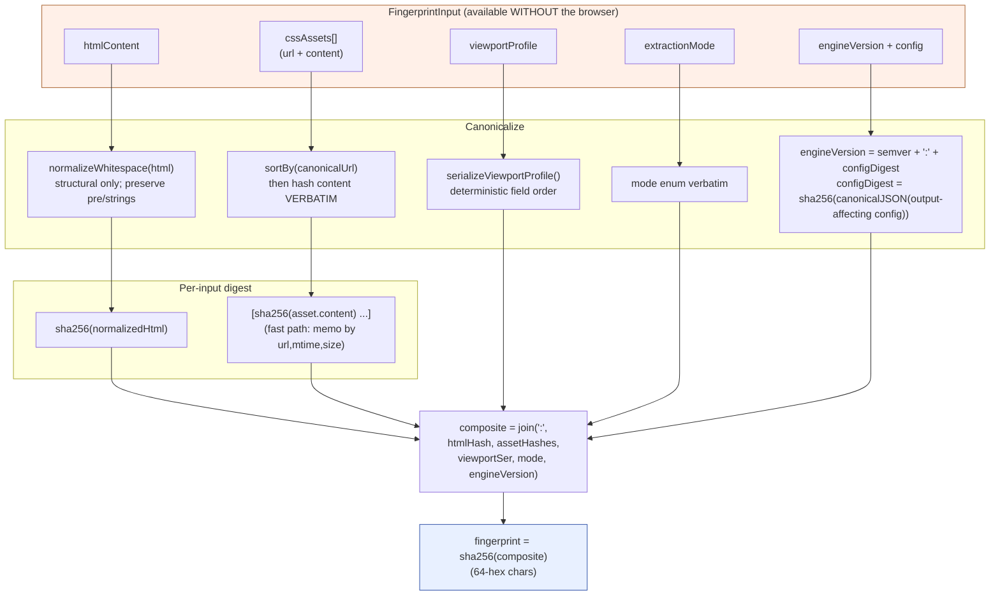
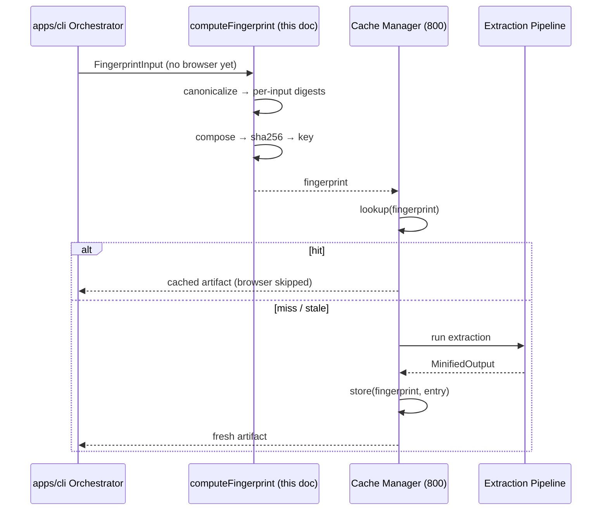

# 801 — Fingerprinting

## 1. Title

**Critical CSS Extraction Engine — Cache Manager: The Fingerprint Algorithm (Cache-Key Construction)**

## 2. Version

| Field | Value |
|---|---|
| Document Version | 1.0.0 |
| Status | Draft — Phase 10 (Caching) |
| Last Updated | 2026-07-09 |
| Owners | Core Architecture Working Group |
| Stability | The *set* of fingerprint inputs (HTML, CSS assets, viewport profile, extraction mode, engine version/config) is stable and load-bearing — changing it is a breaking, cache-busting change. The *canonicalization rules* and *hash function* are stable within a major engine version; changing either changes every fingerprint and is therefore itself gated by the `engineVersion` input, so a change is safe (cold cache) but must be deliberate. |

## 3. Purpose

[006-Design-Principles.md](../architecture/006-Design-Principles.md)'s Principle 8 states the caching contract in one sentence: reuse a prior extraction result when the content fingerprint is unchanged. [800-Cache-Overview.md](./800-Cache-Overview.md) treats that fingerprint as an opaque, fixed-length key and delegates its construction here. This document *is* that construction. It specifies:

1. **Exactly which inputs the fingerprint hashes**, and — for each one — the precise argument for *why omitting it would be a correctness bug* (a false cache hit that serves an artifact computed for different inputs) and why *including a non-input would be an effectiveness bug* (a spurious miss that recomputes identical work).
2. **How each input is canonicalized** before hashing, so that differences that provably cannot affect extraction output (HTML whitespace-only diffs, CSS asset ordering) are normalized away, and differences that *can* affect output are preserved verbatim.
3. **The hash function chosen** (SHA-256), and why a cryptographic hash rather than a fast non-cryptographic one.
4. **The composition scheme** that combines the per-input digests into a single stable key, and why the composition is order-fixed and delimiter-guarded against collision.

The governing property is stated once and defended throughout: **fingerprint equality must be both necessary and sufficient for output equivalence.** Sufficient ⇒ no false hits (soundness): if fingerprints match, outputs match. Necessary ⇒ no spurious misses (completeness, in the pragmatic sense): if outputs would match, fingerprints match. Soundness is a hard correctness requirement (a false hit ships wrong CSS to production). Completeness is an effectiveness requirement (a spurious miss merely wastes work); where the two trade off, this document sides with soundness every time, per Principle 3 (Correctness Over Premature Optimization).

This document refines and elaborates the fingerprint pseudocode already sketched in [006-Design-Principles.md](../architecture/006-Design-Principles.md)'s "Fingerprint Computation for Incremental Cache Lookup" algorithm; where that document gives the skeleton, this one gives the full per-input justification, the canonicalization edge cases, and the collision-resistance argument.

## 4. Audience

- Implementers of `packages/cache`'s `computeFingerprint` function and the `Asset` / `ViewportProfile` serialization helpers it depends on.
- Reviewers auditing the cache for soundness — the people who must be convinced, before this ships to a CI pipeline that gates deploys, that a hit can never serve wrong CSS.
- Authors of the incremental-extraction strategy ([704-Incremental-Extraction.md](./704-Incremental-Extraction.md)), who must understand what a fingerprint does and does *not* capture before layering invalidation heuristics on top (e.g., "this shared token file affects many routes" is a strategy concern precisely because per-route HTML does not name it — see Section 12).
- Implementers of sibling backends (802, 806) who store entries keyed by this output and must treat it as an opaque, collision-free identifier.
- QA engineers writing the "identical inputs ⇒ identical fingerprint" and "any input change ⇒ different fingerprint" property tests (Section 15).

Readers are assumed to have read [800-Cache-Overview.md](./800-Cache-Overview.md) (for the mechanism this key serves) and to be comfortable with cryptographic hashing as a black box (collision resistance, fixed-length output, avalanche).

## 5. Prerequisites

- [800-Cache-Overview.md](./800-Cache-Overview.md) — the Cache Manager contract; this document supplies the `computeFingerprint` it references opaquely.
- [006-Design-Principles.md](../architecture/006-Design-Principles.md) — Principle 5 (Determinism) and Principle 8 (Incremental Caching), plus the baseline fingerprint algorithm this document elaborates.
- [016-Data-Flow.md](../architecture/016-Data-Flow.md) — the `FingerprintInput` and `CacheEntry` DTO shapes and the observation (Section) that the CSSOM Rule List is captured *per viewport navigation*, which is why the viewport profile is a fingerprint input and not a global constant.
- [003-Requirements.md](../architecture/003-Requirements.md) — REQ-300 ("compute a fingerprint over HTML content, referenced CSS asset contents, viewport profile, and extraction mode sufficient to detect any input change that could alter output").
- [105-Viewport-Manager.md](./105-Viewport-Manager.md) — the `ViewportProfile` definition whose serialization this document consumes.
- Familiarity with SHA-256's collision-resistance guarantees and with the general "content-addressed identifier" pattern (Git blob hashing, Nix store paths).

## 6. Related Documents

- [800-Cache-Overview.md](./800-Cache-Overview.md) — parent overview; this is a sibling under the Cache Manager.
- [802-Cache-Store.md](./802-Cache-Store.md) — persists entries under the fingerprint this document produces.
- [803-Route-Cache.md](./803-Route-Cache.md) — per-route granularity; relies on the fact that a route's HTML is a fingerprint input so unrelated routes' fingerprints are independent.
- [804-Viewport-Cache.md](./804-Viewport-Cache.md) — per-viewport granularity; relies on the viewport profile being a fingerprint input so viewport branches key independently.
- [805-Cache-Invalidation.md](./805-Cache-Invalidation.md) — TTL/explicit invalidation, which is *orthogonal* to fingerprinting: fingerprints identify content; invalidation governs lifetime of an identified entry.
- [806-Distributed-Cache.md](./806-Distributed-Cache.md) — a shared backend across nodes; correctness depends on the fingerprint being node-independent (a pure function of inputs, no host-specific state — Section 11).
- [704-Incremental-Extraction.md](./704-Incremental-Extraction.md) — the strategy layer; Section 12 explains what the fingerprint deliberately does *not* capture and how the strategy compensates.
- [016-Data-Flow.md](../architecture/016-Data-Flow.md), [006-Design-Principles.md](../architecture/006-Design-Principles.md), [003-Requirements.md](../architecture/003-Requirements.md), [105-Viewport-Manager.md](./105-Viewport-Manager.md).

## 7. Overview

### 7.1 What a fingerprint is

A fingerprint is a fixed-length string (a 64-character lowercase hex SHA-256 digest) that is a *pure deterministic function* of the tuple of inputs that determine an extraction result:

```
fingerprint = f(htmlContent, cssAssets, viewportProfile, extractionMode, engineVersion)
```

It is used as the cache key. Because it is content-addressed, two independent machines, at different times, with the same inputs, compute the identical fingerprint — which is exactly what makes the distributed backend (806) sound and what makes the local cache survive across builds.

The design of `f` is entirely constrained by one biconditional:

> `f(A) == f(B)` **if and only if** extraction of `A` produces byte-identical output to extraction of `B`.

The "only if" direction (equal fingerprints ⇒ equal output) is **soundness** and is non-negotiable: violating it means the cache serves an artifact computed for different inputs, i.e., ships wrong critical CSS. Achieving soundness requires that *every* input that can influence output be folded into the hash — this is the entire argument of Section 8.1.

The "if" direction (equal output ⇒ equal fingerprint) is **completeness** and is a best-effort effectiveness goal: violating it means the cache misses when it could have hit, wasting an extraction. Achieving completeness requires *canonicalizing away* input differences that provably cannot change output (HTML whitespace, asset ordering) — this is the argument of Section 8.2. Where full completeness would risk soundness (aggressive normalization that might drop a semantically significant byte), the design accepts a spurious miss rather than risk a false hit.

### 7.2 Why a fingerprint and not something cheaper

The rejected alternatives, per Principle 8's "Rejected Alternatives," are instructive:

- **Keying on route path alone.** Fails soundness catastrophically: the same path serves completely different content across builds. A path is an *address*, not a *content identifier*.
- **Keying on file modification times (mtime).** Fails in both directions. mtime can change without content changing (a clean rebuild rewrites files with new mtimes but identical bytes ⇒ spurious miss, every build is cold — the cache is useless). mtime can also stay identical while content changes in pathological restore-from-backup scenarios ⇒ false hit. mtime is not content-addressed; it is a proxy that is wrong in both directions.
- **Keying on a fast non-cryptographic hash (e.g., xxHash, CRC).** Sound in expectation but not in the adversarial or high-volume limit: a cache that gates production deploys across an enterprise fleet processes enormous input volumes, and a non-cryptographic hash's collision probability, while tiny per-pair, is not designed to resist the birthday bound at fleet scale, nor to resist an attacker who can craft colliding inputs (a supply-chain concern if CSS assets are ever attacker-influenced). SHA-256's collision resistance makes a false hit cryptographically implausible, which is the bar a deploy-gating cache must clear.

The fingerprint is therefore a *cryptographic content hash over all output-determining inputs* — the same design choice made by Git (blob/tree hashing), Nix (store-path derivation), and Bazel (action cache keys), and for the same reason: content-addressing is the only scheme where a cache hit is a *proof* of equivalence rather than a *heuristic guess*.

### 7.3 The five inputs, at a glance

| Input | Why it determines output | Omitting it causes | Canonicalization |
|---|---|---|---|
| `htmlContent` | The DOM the browser renders; determines which elements exist above the fold and thus which selectors match | False hit: a changed page served the old page's CSS | Structural whitespace normalized; `<pre>`/CSS-string whitespace preserved |
| `cssAssets` (contents) | The rules available to match and the values to resolve; the entire candidate set | False hit: changed styles served old critical CSS (e.g., a color change silently absent) | Sorted by canonical URL (order-independent); content hashed verbatim |
| `viewportProfile` | Determines the fold, media/container query evaluation, and viewport-conditional CSS-in-JS | False hit: mobile CSS served for desktop or vice versa | Deterministic field serialization |
| `extractionMode` | `cssom` / `coverage` / `hybrid` produce different rule sets by construction | False hit: coverage-mode output served for a cssom-mode request | Verbatim enum string |
| `engineVersion` (+ config digest) | The algorithm and configuration that transform inputs into output | False hit: a new engine's request served an old engine's artifact | Verbatim; config folded via a config digest |

Sections 8.1–8.6 defend each row.

## 8. Detailed Design

### 8.1 Soundness: every output-determining input must be hashed

The soundness argument is a coverage argument: enumerate everything that can change extraction output, and show each is a fingerprint input.

**8.1.1 HTML content.** Extraction begins by rendering the HTML and enumerating above-fold DOM nodes ([106-DOM-Snapshot.md](./106-DOM-Snapshot.md)). Different HTML ⇒ different DOM ⇒ different above-fold nodes ⇒ different set of matched selectors ⇒ different critical CSS. *Omitting HTML* means a page edit (new hero section, reordered content) would collide with the old fingerprint and serve stale CSS — the archetypal false hit. HTML is therefore hashed. Canonicalization: structural whitespace (indentation, inter-tag whitespace that the HTML parser collapses) is normalized because it demonstrably does not change the rendered DOM; whitespace *inside* `<pre>`, `<textarea>`, and other whitespace-significant contexts is preserved (Section 8.2.1).

**8.1.2 Referenced CSS asset contents.** The candidate rule set is the union of all stylesheets the page references, post-bundle and pre-critical-extraction ([301-Stylesheet-Loader.md](./301-Stylesheet-Loader.md)). A change to *any* asset — a new rule, a changed declaration value, a deleted selector — can change which rules match above-fold nodes or what values resolve. *Omitting CSS content* is the subtlest and most dangerous false hit: the HTML is unchanged, the fold is unchanged, but a designer changed `--brand: #06c` to `--brand: #05b`, and the cache would serve the old color forever. Every asset's content is therefore hashed. Canonicalization: assets are *sorted by canonical URL* before hashing so that a bundler reordering the asset list (same assets, different order) does not bust the cache (Section 8.2.2); each asset's *content* is hashed **verbatim, unnormalized**, because CSS whitespace can be semantically load-bearing in rare cases (inside string literals, `content:` values) and the correctness cost of a wrong normalization dwarfs the effectiveness cost of a whitespace-diff miss (Principle 3).

**8.1.3 Viewport profile.** The viewport determines the fold line (what is "above the fold"), the evaluation of `@media` and container queries ([303-Media-Rules.md](./303-Media-Rules.md), [405-Container-Queries.md](./405-Container-Queries.md)), and — per [016-Data-Flow.md](../architecture/016-Data-Flow.md)'s observation — which components a responsive CSS-in-JS app even mounts. A 375×667 mobile profile and a 1920×1080 desktop profile produce entirely different critical CSS from the *same* HTML and CSS. *Omitting the viewport* means desktop critical CSS could be served to a mobile request — a false hit that breaks rendering fidelity, the engine's core promise. The viewport profile is therefore serialized deterministically and hashed.

**8.1.4 Extraction mode.** The `cssom`, `coverage`, and `hybrid` strategies (Section 2.7 of the brief) produce *different rule sets by construction* — hybrid, for instance, unions CSSOM matching with Chrome coverage and `getComputedStyle` verification. The same inputs under different modes legitimately produce different output. *Omitting the mode* would let a `coverage`-mode artifact satisfy a `hybrid`-mode request. The mode enum is hashed verbatim.

**8.1.5 Engine version and configuration.** The output is a function not only of the inputs but of the *code and configuration* that transform them. A new engine release that changes the visibility heuristic, the cascade tie-break, or the serializer's ordering produces different output from identical inputs. Likewise a config change — a different fold-height override, a different enabled-plugins set, a different minifier setting — changes output without changing any of the four content inputs above. *Omitting engine version/config* is the false hit that survives an upgrade: the new engine would serve the old engine's artifacts indefinitely. This is why Principle 8 mandates "the engine's own semantic version (so an engine upgrade invalidates stale caches by default)." Because config can change output independently of the package version, `engineVersion` is not the bare semver string — it is `semver + ':' + configDigest`, where `configDigest` is a SHA-256 over the canonicalized, output-affecting subset of the resolved configuration (Section 8.3).

**8.1.6 Coverage argument closure.** Is the list exhaustive? The extraction output is a pure function of: the DOM (⇐ HTML), the stylesheets (⇐ CSS assets), the fold and query context (⇐ viewport), the strategy (⇐ mode), and the transforming code+config (⇐ engine version/config). By Principle 1, the engine derives *all* facts from the live browser given these inputs; there is no hidden input (no clock, no randomness, no network fetch that isn't itself one of the CSS assets) that affects output — that absence is precisely what Principle 5 (Determinism) guarantees and what makes this coverage argument closeable. Any future input that gains influence over output (e.g., a device-pixel-ratio-dependent extraction) *must* be added here, and adding it is a deliberate, cache-busting change.

### 8.2 Completeness: canonicalizing away non-differences

Soundness folds inputs *in*; completeness folds spurious differences *out*, so the cache hits when it can.

**8.2.1 HTML structural-whitespace normalization.** `normalizeWhitespace(html)` collapses runs of insignificant structural whitespace (between tags, leading/trailing indentation) that the HTML parser itself discards, so that a reformatting/prettier pass over templates does not bust the cache. It is *scoped*: it must not touch whitespace inside `<pre>`, `<textarea>`, `<script>`, `<style>`, elements with `white-space: pre*` semantics, or attribute values, because that whitespace can be rendered and thus can affect layout and the fold. When in doubt, this normalizer preserves — a preserved byte that didn't matter costs at most a spurious miss; a dropped byte that did matter is a false hit. Principle 3 dictates the direction of doubt.

**8.2.2 CSS asset order-independence.** The set of stylesheets is semantically a *set*, but cascade order matters. So assets are sorted by a *canonical URL* (a normalized, absolute, query-stripped-where-safe identifier) before their hashes are concatenated. This makes a bundler that emits `[a.css, b.css]` on one build and `[b.css, a.css]` on the next (same bytes, different array order) produce the same fingerprint. Crucially, canonical-URL sort is a *stable, content-independent* order, so it does not itself encode cascade order into the key incorrectly — cascade order is a property captured *within* each asset's content and in the engine's cascade resolution (Principle 1), not in the fingerprint's asset ordering. (If two builds genuinely present the *same* assets in a *different cascade order*, that is a different HTML — the `<link>` order differs — and is caught by the HTML input, not the asset ordering.)

**8.2.3 What is deliberately NOT canonicalized.** CSS content is not minified, comment-stripped, or reformatted before hashing. It would be tempting (a comment-only CSS change would then hit), but a normalizer sophisticated enough to be *safe* across all CSS (custom properties holding CSS fragments, `content` strings, `@layer` statement subtleties) is itself a correctness risk, and Principle 3 says a correct spurious miss beats a risky false hit. CSS is hashed verbatim.

### 8.3 The config digest

`configDigest` is a SHA-256 over a canonical JSON serialization of the *output-affecting* configuration subset: fold overrides, viewport profile definitions (their identity, not re-hashed here since the active one is already a separate input), enabled plugin set and their output-affecting options, minifier options, mode-specific tuning. It excludes operationally-irrelevant config (log verbosity, cache backend choice, concurrency level) — these do not change *what* CSS is produced, only *how fast* or *how noisily*, so folding them in would cause spurious misses (a developer bumping concurrency should not cold the cache). The canonical JSON serialization sorts object keys and rejects `undefined`/function values, so semantically identical configs digest identically regardless of authoring order. This subset boundary is itself an engine-version-gated contract: moving a key from "irrelevant" to "output-affecting" (or vice versa) is a fingerprint-semantics change and rides the `engineVersion` bump.

### 8.4 Hash choice: SHA-256

SHA-256 is chosen for: (a) *collision resistance* sufficient for a deploy-gating cache at fleet scale (Section 7.2); (b) *fixed 256-bit output*, giving a compact 64-hex-char key with negligible collision probability under the birthday bound even across astronomically many entries; (c) *avalanche*, so a single changed byte anywhere flips ~half the output bits, making "did anything change" a reliable single comparison; (d) *ubiquity*, present in every runtime's standard crypto library, so the distributed backend's nodes need no shared exotic dependency. SHA-256 (not SHA-1, which is collision-broken; not SHA-512, whose extra width buys nothing here and costs bytes; not BLAKE3, faster but a less universally-available dependency) is the conservative, defensible default. Hashing cost is `O(m)` and is dominated by the same `O(m)` we would pay to *read* the inputs, so the cryptographic-vs-fast-hash speed gap is not a bottleneck at the whole-fingerprint level.

### 8.5 Composition scheme

Per-input digests are composed into a single pre-image string with *fixed field order* and *unambiguous delimiters*, then hashed once more:

```
composite = join(':', [
  sha256(normalizedHtml),
  join(':', sortedAssetHashes),
  serializeViewportProfile(viewport),
  extractionMode,
  engineVersion            // = semver + ':' + configDigest
])
fingerprint = sha256(composite)
```

Two composition hazards are guarded:

- **Field-order stability.** The order is fixed and part of the versioned contract. Reordering fields would change every fingerprint (a cache-busting change gated by `engineVersion`).
- **Delimiter collision.** Concatenating variable-length fields risks the classic `("ab","c")` vs `("a","bc")` collision. Because every field except the two raw enums/strings is itself a *fixed-length* SHA-256 hex digest, and the enums/strings occupy fixed terminal positions, the `:`-join is unambiguous. For defense in depth, an implementation MAY length-prefix or use a hash-of-hashes tree; the fixed-length-digest property already makes the flat join safe, so the simpler flat join is the default. The final outer `sha256` normalizes the composite to a fixed-length key regardless of asset count.

### 8.6 Asset-hash fast path (optimization, sound by construction)

Full content hashing of every asset on every fingerprint is `O(total CSS bytes)`. The fast path memoizes each asset's content hash keyed by `(canonicalUrl, mtime, size)`: if that triple is unchanged since the last run, reuse the cached content hash without re-reading the file; if it changed, re-read and re-hash. This is sound because `(mtime, size)` change is a *superset* trigger — any content change that also changes mtime or size is caught, and a content change that changes *neither* is astronomically unlikely for real build tooling and, if it ever occurred, would be caught by the periodic full-hash reconciliation the fast path schedules. The ground truth remains the content hash; the fast path is a provably-conservative accelerator, exactly the "fast path that is provably equivalent rather than an approximation" pattern Principle 3 requires.

## 9. Architecture

### 9.1 Input → canonicalize → hash → key



### 9.2 Where the fingerprint enters the cache lifecycle



The sequence underscores the placement constraint from [800-Cache-Overview.md](./800-Cache-Overview.md): the fingerprint is computed from inputs *before* any browser interaction, which is only possible because every fingerprint input is available pre-render.

## 10. Algorithms

### 10.1 Algorithm: computeFingerprint

**Problem statement.** Given the inputs that affect extraction output, compute a fixed-length key such that key equality is necessary and sufficient (soundness required, completeness best-effort) for output equivalence.

**Inputs.** `htmlContent: string`, `cssAssets: Asset[]` (each `{ canonicalUrl, content, mtime?, size? }`), `viewportProfile: ViewportProfile`, `extractionMode: 'cssom'|'coverage'|'hybrid'`, `engineVersion: string` (semver), `resolvedConfig: Config`.

**Outputs.** `fingerprint: string` (64-char lowercase hex).

**Pseudocode.**
```
function computeFingerprint(input) -> string:
    htmlHash = sha256(normalizeWhitespace(input.htmlContent))   // structural WS only

    assetHashes = input.cssAssets
        .sortBy(a => a.canonicalUrl)                             // order-independence
        .map(a => contentHashWithFastPath(a))                   // sha256(a.content), memoized by (url,mtime,size)

    viewportSer = serializeViewportProfile(input.viewportProfile) // deterministic field order

    configDigest = sha256(canonicalJson(outputAffectingSubset(input.resolvedConfig)))
    engineVersion = input.engineVersion + ':' + configDigest

    composite = join(':', [
        htmlHash,
        join(':', assetHashes),
        viewportSer,
        input.extractionMode,
        engineVersion
    ])
    return sha256(composite)

function contentHashWithFastPath(asset) -> string:
    key = (asset.canonicalUrl, asset.mtime, asset.size)
    if memo.has(key): return memo.get(key)
    h = sha256(asset.content)                                   // ground truth
    memo.set(key, h)
    return h
```

**Time complexity.** `O(m)` where `m` = total bytes of HTML + all CSS asset contents, dominated by hashing (which must read every input byte at least once — an irreducible lower bound for a sound content hash). Asset sort is `O(a log a)`, `a` = asset count, `a ≪ m`. Config digest is `O(|config|)`, negligible. The fast path reduces the *constant* on the CSS term when assets are unchanged (skips re-reading + re-hashing), not the asymptotic bound.

**Memory complexity.** `O(m)` transient during hashing (streaming hashers reduce this to `O(1)` working set by hashing chunk-by-chunk without materializing the whole input — recommended for large enterprise stylesheets); `O(1)` for the resulting 64-char key; `O(a)` for the asset-hash list and the fast-path memo.

**Failure cases.**
- *Over-aggressive `normalizeWhitespace` dropping significant whitespace* (inside `<pre>` or CSS strings) ⇒ a **false hit** (soundness violation). Mitigation: the normalizer is conservative and scoped (Section 8.2.1); CSS content is never normalized. This is the single most dangerous failure and is the target of the strongest tests (Section 15).
- *Under-normalization* (treating a whitespace-only diff as significant) ⇒ a spurious miss (effectiveness only, acceptable).
- *Non-canonical viewport serialization* (e.g., serializing a JS object with unstable key order) ⇒ spurious misses for logically identical profiles. Mitigation: `serializeViewportProfile` fixes field order.
- *An output-affecting input not folded in* (a future feature adds a hidden input) ⇒ a false hit. Mitigation: the coverage argument (Section 8.1.6) must be re-audited whenever a new output-affecting input is introduced; adding it is a cache-busting `engineVersion` change.
- *Hash collision* ⇒ a false hit. Mitigation: SHA-256's collision resistance makes this cryptographically implausible; accepted as a residual risk equivalent to a bit-flip in RAM.

**Optimization opportunities.** Streaming/chunked hashing for large assets (memory); the `(url, mtime, size)` fast path (CPU); batching per-manifest fingerprint computation to share the asset-hash memo across all routes that reference the same shared assets (a single design-token file hashed once, reused across hundreds of routes) — this last is the highest-leverage optimization at scale and is safe because the memo key is content-derived.

## 11. Implementation Notes

- **`computeFingerprint` must be a pure function.** No wall-clock, no PID, no hostname, no randomness, no environment read except through the explicit `input`/`resolvedConfig` arguments. Purity is what makes the distributed cache (806) sound — two nodes must agree on the key. Enforce with a no-side-effects lint and a test that runs it twice and on two "machines" (mocked env) for identical output.
- **CSS is hashed verbatim; resist the urge to normalize.** Every proposal to "hit on comment-only CSS changes" must be weighed against the false-hit risk of a normalizer bug. Default: no CSS normalization.
- **`serializeViewportProfile` is a versioned contract**, not an ad-hoc `JSON.stringify`. Fix field order explicitly (`width`, `height`, `deviceScaleFactor`, `isMobile`, `hasTouch`, and any fold override) so that adding a field is a deliberate, documented, cache-busting change. Consume the `ViewportProfile` shape from [105-Viewport-Manager.md](./105-Viewport-Manager.md).
- **`engineVersion` must be sourced from the built package's version at build time**, not read dynamically in a way that could drift; the config digest must be computed from the *resolved* config (post file+CLI+env merge), not the raw config file.
- **The fast-path memo is per-process and content-safe**, keyed by `(url, mtime, size)`; it is a CPU optimization only and must never be the source of truth. A `--no-fast-hash` flag should force full content hashing for paranoid verification runs and for the reconciliation test.
- **Output format is fixed: lowercase hex, 64 chars.** Backends (802/806) and trace logs depend on this exact shape; do not emit base64 or uppercase.

## 12. Edge Cases

- **Shared asset changes, HTML unchanged.** A change to a shared design-token stylesheet changes the content hash of that asset, which changes the fingerprint of *every route that references it* — correctly busting all of them. Note this is captured *only because the asset content is a fingerprint input*; a route's HTML does not name the token file's contents. This is precisely the seam where the *strategy* ([704-Incremental-Extraction.md](./704-Incremental-Extraction.md)) adds value: the fingerprint mechanically busts the right set, but deciding to *re-crawl* that set efficiently (rather than the whole site) is 704's policy job.
- **Asset referenced but empty / 404.** An asset that fails to load contributes a well-defined sentinel (empty content or an error marker) to the hash, so "asset present but empty" and "asset absent" fingerprint differently and neither silently matches a healthy build.
- **Inline `<style>` blocks.** These live in the HTML, so they are covered by the HTML input, not the asset list — no double counting, no gap.
- **Data-URI stylesheets / constructable stylesheets** ([307-Constructable-Stylesheets.md](./307-Constructable-Stylesheets.md)). Constructable stylesheets injected at runtime are not "referenced CSS assets" in the classic sense; where their content is deterministically derivable from the HTML+JS bundle (itself hashed as an asset), they are covered transitively. Where a stylesheet is *only* materialized by running the page (truly dynamic), the fingerprint cannot see it pre-render — a known limitation flagged in Future Work; such pages must run with caching disabled or accept that the dynamic sheet is outside the soundness envelope.
- **Viewport profiles that serialize identically.** Two profiles with identical serialized fields *are* identical for extraction purposes and correctly share a fingerprint; there is no hidden viewport state.
- **Config change that does not affect output** (log level, concurrency). Correctly excluded from the config digest ⇒ no spurious miss.
- **Byte-order marks / encoding differences in HTML or CSS.** A BOM or an encoding change is a byte change and is hashed as such (different fingerprint); the engine does not transcode before hashing, so an encoding flip is conservatively treated as a content change.

## 13. Tradeoffs

| Decision | Why | Alternative | Tradeoff accepted |
|---|---|---|---|
| Hash *all five* inputs | Soundness: any omitted input is a false-hit vector | Hash a subset (e.g., HTML + CSS only) | Larger hash input; a viewport/mode/version change costs a recompute (correct) |
| SHA-256 (cryptographic) | Collision resistance for a deploy-gating fleet cache | xxHash/CRC (faster) | Marginally slower per byte; negligible vs `O(m)` read cost, buys collision safety |
| CSS hashed verbatim (no normalization) | A safe CSS normalizer is a correctness risk not worth the hit-rate gain | Minify/strip comments before hashing | Comment-only CSS edits cause a spurious miss (accepted, Principle 3) |
| HTML structural-whitespace normalization | Reformatting templates shouldn't cold the cache | Hash HTML verbatim too | The normalizer must be conservative and carefully scoped (a bug here is a false hit) |
| `engineVersion = semver + configDigest` | Config can change output without a version bump | semver only | Config-only changes bust the cache (correct); requires a stable output-affecting-config subset |
| Asset-hash fast path by `(url,mtime,size)` | CPU: skip re-hashing unchanged assets | Always full-hash | A conservative superset trigger; reconciliation needed for the astronomically-rare no-metadata-change content change |
| Order-independent asset sort | Bundler reordering shouldn't cold the cache | Hash assets in presented order | Must be sure cascade order is captured elsewhere (it is: in HTML `<link>` order + content) |

## 14. Performance

- **CPU.** `O(m)` dominated by hashing every input byte — an irreducible cost for a sound content hash; the fast path removes the constant on unchanged assets. At fleet scale the dominant win is the cross-route asset-hash memo (a shared 200 KB token file hashed once, not once per route).
- **Memory.** Streaming hashers keep the working set `O(1)` regardless of asset size; without streaming it is `O(m)` transient. Recommended: streaming for any asset above a threshold (e.g., 256 KB), which the "huge enterprise stylesheet" fixture (Section 2.15) will exercise.
- **Caching strategy (meta).** The fingerprinter's own cache is the asset-hash memo (Section 8.6); it is process-local and content-safe.
- **Parallelization.** Per-asset content hashes are independent and can be computed in parallel across worker threads (Section 2.14); the final composition is a cheap serial join. Whole-manifest fingerprinting is embarrassingly parallel across routes, sharing the read-through asset memo.
- **Incremental execution.** Fingerprinting *is* the enabler of incremental execution; its own cost (`O(m)` per work item) is paid even on hits and is the price of soundness, but `O(m)` ≪ `O(browser extraction)`, so it never dominates.
- **Scalability limits.** The fingerprinter scales linearly with total input bytes and route count. The practical ceiling is I/O (reading assets), mitigated by the fast path and the shared memo; there is no super-linear term.

## 15. Testing

- **Unit tests.**
  - *Determinism:* `computeFingerprint(x) === computeFingerprint(x)` across two invocations and two mocked hosts (proves purity, required for 806).
  - *Sensitivity (soundness probes):* changing each input in isolation — one HTML byte (outside whitespace), one CSS byte, viewport width, mode, semver, an output-affecting config key — changes the fingerprint. A parameterized test per input row of Section 7.3.
  - *Insensitivity (completeness probes):* HTML structural-whitespace-only diff, asset array reordering, an output-*irrelevant* config change (log level) — all leave the fingerprint unchanged.
  - *Whitespace scoping:* whitespace change inside `<pre>`/`<textarea>`/CSS string *does* change the fingerprint (guards against the over-aggressive-normalizer false hit — the highest-severity test).
  - *Config digest:* reordering config object keys does not change the digest; toggling an output-affecting key does.
  - *Fast path equivalence:* fast-path result equals full-hash result for unchanged and changed `(url,mtime,size)` triples; `--no-fast-hash` reconciliation matches.
- **Integration tests.**
  - End-to-end with [800-Cache-Overview.md](./800-Cache-Overview.md)'s `extractWithCache`: identical inputs ⇒ hit (pipeline not invoked); any single input change ⇒ miss (pipeline invoked). This ties fingerprinting to the observable cache behavior (REQ-300/301).
- **Regression / golden tests.**
  - A golden fingerprint for a fixed fixture input; the value is pinned so any accidental change to canonicalization, field order, or hash choice fails loudly (and, correctly, requires an `engineVersion` bump to accompany the intended change).
- **Stress tests.**
  - Huge enterprise stylesheet fixture (Section 2.15) to validate streaming memory behavior and `O(m)` timing.
  - Many-route manifest sharing one large asset to validate the cross-route memo's `O(1)`-per-extra-route amortization.
- **Adversarial tests.**
  - Delimiter-collision probe: construct inputs that would collide under a naive concatenation and assert distinct fingerprints (validates the fixed-length-digest composition argument, Section 8.5).

## 16. Future Work

- **Safe CSS canonicalization**, if a *provably* correctness-preserving normalizer can be built (comment stripping that is aware of `content` strings and custom-property fragments), to raise hit rates on comment-only edits — deferred until its safety can be established to the same bar as the HTML normalizer.
- **Merkle-tree composition** over assets so that a single changed asset can be re-fingerprinted in `O(log a + changed bytes)` rather than recomputing the flat join — a micro-optimization relevant only at extreme asset counts.
- **Dynamic-stylesheet coverage** for pages whose critical stylesheets are only materialized at runtime (constructable/CSS-in-JS with non-deterministic-from-bundle content), possibly via a cheap "capture stylesheet manifest" pre-pass whose output feeds the fingerprint — closes the [307-Constructable-Stylesheets.md](./307-Constructable-Stylesheets.md) gap noted in Section 12.
- **Fingerprint provenance in the trace**: emitting the per-input digests alongside the final key so a "why did this rerun" investigation (Principle 6, elaborated in [805-Cache-Invalidation.md](./805-Cache-Invalidation.md)) can pinpoint *which* input changed, not just *that* the key changed.
- **Open question:** should `deviceScaleFactor` / DPR ever influence extraction output (e.g., DPR-conditional image-set CSS above the fold)? If it can, it must join the viewport serialization as an output-affecting input — an audit item for the coverage argument (Section 8.1.6) tracked against [105-Viewport-Manager.md](./105-Viewport-Manager.md)'s profile evolution.

## 17. References

- [800-Cache-Overview.md](./800-Cache-Overview.md) — the Cache Manager mechanism this key serves.
- [802-Cache-Store.md](./802-Cache-Store.md) — persistence keyed by this fingerprint.
- [803-Route-Cache.md](./803-Route-Cache.md) — per-route granularity (relies on HTML being an input).
- [804-Viewport-Cache.md](./804-Viewport-Cache.md) — per-viewport granularity (relies on viewport being an input).
- [805-Cache-Invalidation.md](./805-Cache-Invalidation.md) — invalidation and lifetime, orthogonal to key construction.
- [806-Distributed-Cache.md](./806-Distributed-Cache.md) — shared backend requiring a host-independent (pure) fingerprint.
- [704-Incremental-Extraction.md](./704-Incremental-Extraction.md) — the strategy that uses fingerprints as its equivalence oracle; what fingerprints do not capture.
- [016-Data-Flow.md](../architecture/016-Data-Flow.md) — `FingerprintInput`/`CacheEntry` shapes; per-viewport CSSOM capture rationale.
- [006-Design-Principles.md](../architecture/006-Design-Principles.md) — Principle 5 (Determinism), Principle 8 (Incremental Caching), baseline fingerprint algorithm.
- [003-Requirements.md](../architecture/003-Requirements.md) — REQ-300 (fingerprint sufficiency).
- [105-Viewport-Manager.md](./105-Viewport-Manager.md) — `ViewportProfile` shape.
- [307-Constructable-Stylesheets.md](./307-Constructable-Stylesheets.md) — dynamic stylesheet limitation.
