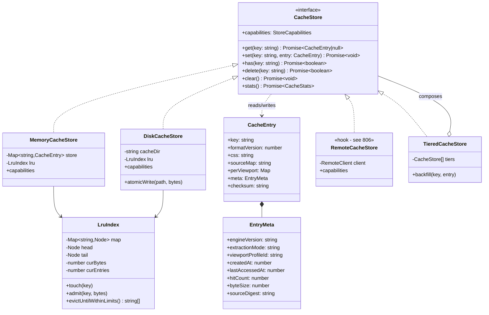
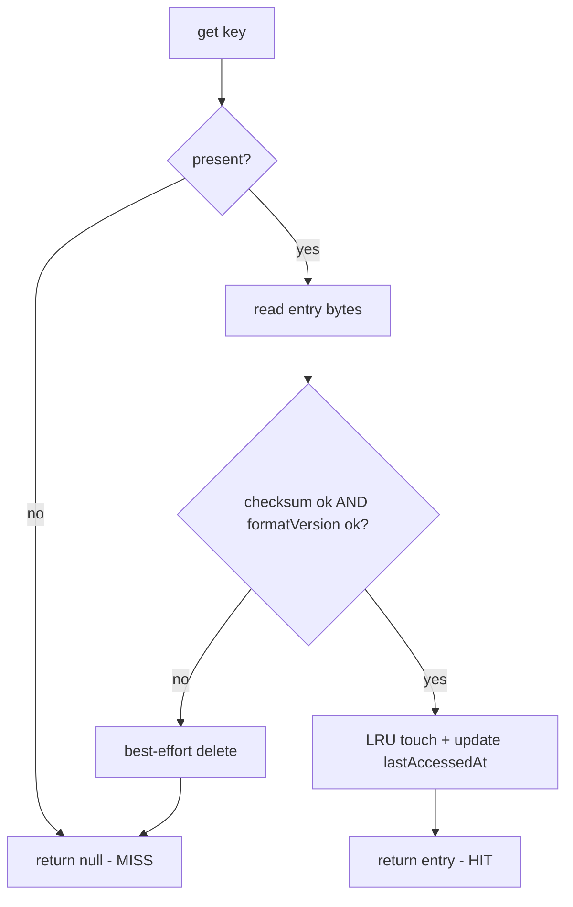

# 802 — Cache Store

## 1. Title

**Critical CSS Extraction Engine — Cache Store: Pluggable Storage Backend Abstraction, Entry Format, Eviction, and Concurrency-Safe Writes**

## 2. Version

| Field | Value |
|---|---|
| Document Version | 1.0.0 |
| Status | Draft — Phase 10 (Caching) |
| Last Updated | 2026-07-09 |
| Owners | Core Architecture Working Group |
| Stability | The `CacheStore` interface contract (Section 8.2) is stable and is the load-bearing seam every other Phase 10 document builds on. Concrete backend internals (memory eviction accounting, on-disk directory layout) may evolve behind the interface without invalidating callers. |

## 3. Purpose

[800-Cache-Overview.md](./800-Cache-Overview.md) established, at module level, that the Cache Manager is layered into three concerns — *what makes a cache key* ([801-Fingerprinting.md](./801-Fingerprinting.md)), *where bytes physically live* (this document), and *what higher-level keying policies exist on top* (route caching in [803-Route-Cache.md](./803-Route-Cache.md), viewport caching in [804-Viewport-Cache.md](./804-Viewport-Cache.md)). This document is the middle layer: the **storage backend abstraction**. It answers one question precisely: **given a fingerprint key and a critical-CSS extraction result, how are the bytes stored, retrieved, size-bounded, evicted, and written without corruption, and how is that mechanism made pluggable so that an in-memory store, an on-disk store, and a future remote store all satisfy one identical contract?**

Put differently, [800-Cache-Overview.md](./800-Cache-Overview.md) tells you *why* the engine caches and *which* subsystem owns caching; [801-Fingerprinting.md](./801-Fingerprinting.md) tells you *how a key is computed*; this document tells you *what the key indexes into*. It is the document a contributor reads immediately before opening the source file that contains the `CacheStore` interface and its `MemoryCacheStore` / `DiskCacheStore` implementations in `packages/cache`.

This document deliberately does **not** specify distributed/remote-store internals — network protocols, sharding, cross-node coherence, and eventual-consistency semantics are the subject of [806-Distributed-Cache.md](./806-Distributed-Cache.md). This document specifies only the *hook* through which a remote store attaches (the `RemoteCacheStore` shape and the `CacheStore` contract it must honour), and forward-references the rest. That is a deliberate scoping decision (Section 13): keeping the abstraction here and the distribution mechanics there prevents this document from becoming a networking treatise, and it forces the remote store to justify itself against the same interface every local store obeys.

## 4. Audience

- Implementers of `packages/cache`'s `CacheStore` interface, `MemoryCacheStore`, `DiskCacheStore`, and the `RemoteCacheStore` adapter seam.
- Authors of [803-Route-Cache.md](./803-Route-Cache.md) and [804-Viewport-Cache.md](./804-Viewport-Cache.md), whose higher-level keying policies are *clients* of this store contract and must not depend on any particular backend.
- Authors of [805-Cache-Invalidation.md](./805-Cache-Invalidation.md), which drives `delete`/`clear` operations through this contract and needs the exact semantics of deletion, tombstoning, and eviction interplay.
- Authors of [806-Distributed-Cache.md](./806-Distributed-Cache.md), who implement `RemoteCacheStore` against the contract defined here.
- CLI and CI integrators who configure which backend is active (`--cache-store=memory|disk|remote`) and set size limits.
- Senior reviewers verifying the store satisfies `BRIEF.md` Section 2.8 ("reuse previous extraction when fingerprints match") without sacrificing determinism or corrupting artifacts under concurrent multi-route crawls.

Readers are assumed to have read [800-Cache-Overview.md](./800-Cache-Overview.md) and [801-Fingerprinting.md](./801-Fingerprinting.md). This document does not re-derive the fingerprint; it treats a fingerprint as an opaque, collision-resistant string key.

## 5. Prerequisites

- [800-Cache-Overview.md](./800-Cache-Overview.md) — the Cache Manager's module boundary, the read-through/write-back flow, and the placement of the store beneath the keying policies.
- [801-Fingerprinting.md](./801-Fingerprinting.md) — the definition of a cache key: a stable digest over HTML, CSS assets, viewport profile, and extraction mode. This document consumes that digest as `CacheKey`.
- [BRIEF.md](../../BRIEF.md) Section 2.8 (Incremental Cache) — the source-of-truth requirement.
- `docs/architecture/006-Design-Principles.md` — Principle 3 (Correctness Over Premature Optimization), Principle 5 (Determinism of Output), Principle 6 (Fail Fast, Fail Loud). A cache that returns stale or corrupt bytes violates all three; the store's design is dominated by the requirement that a cache *miss* is always safe and a cache *hit* is always byte-identical to a fresh extraction under the same fingerprint.
- `docs/architecture/016-Data-Flow.md` — the `CriticalResult` DTO (critical CSS text, per-viewport slices, source map, diagnostics) that becomes the stored payload.
- [605-Source-Maps.md](./605-Source-Maps.md) — the source-map artifact that is co-stored with the CSS as part of a single cache entry.
- Working familiarity with LRU eviction, atomic file replacement (`write-temp + fsync + rename`), and advisory file locking.

## 6. Related Documents

- [800-Cache-Overview.md](./800-Cache-Overview.md) — parent module document.
- [801-Fingerprinting.md](./801-Fingerprinting.md) — key derivation (this document consumes its output).
- [803-Route-Cache.md](./803-Route-Cache.md) — route-level keying policy, a client of this store.
- [804-Viewport-Cache.md](./804-Viewport-Cache.md) — per-viewport keying policy, a client of this store.
- [805-Cache-Invalidation.md](./805-Cache-Invalidation.md) — invalidation and eviction triggers that drive `delete`/`clear`.
- [806-Distributed-Cache.md](./806-Distributed-Cache.md) — the remote-store implementation attached via this document's `RemoteCacheStore` hook (forward reference).
- [605-Source-Maps.md](./605-Source-Maps.md) — the co-stored source-map artifact.
- `docs/architecture/016-Data-Flow.md` — DTO shapes.

## 7. Overview

The Cache Store is a **key-value blob store specialised for critical-CSS extraction artifacts**. Its surface is intentionally narrow: `get`, `set`, `has`, `delete`, `clear`, plus `stats`. Everything interesting is in the guarantees attached to that narrow surface, not in the breadth of the surface itself. Three guarantees dominate the design:

1. **A hit is indistinguishable from a fresh extraction.** If `get(key)` returns an entry, its bytes must be exactly what a fresh extraction under the same fingerprint would produce. This is what makes the cache *transparent*: no downstream consumer (SSR injector, CI publisher) can behave differently on a hit versus a miss except in latency. The fingerprint ([801-Fingerprinting.md](./801-Fingerprinting.md)) is what makes this safe — the store itself performs *no* semantic validation of CSS; it trusts that identical keys imply identical content, and it protects that trust with integrity checks (Section 8.4) that turn corruption into a *miss*, never a wrong *hit*.
2. **A miss is always safe and cheap.** Any failure mode the store cannot serve correctly — a corrupt file, a checksum mismatch, an evicted entry, a partially-written blob, a lock timeout on read — degrades to a cache *miss*, which triggers a fresh extraction. The store never throws its way into failing a build over an internal storage problem; it logs, degrades, and lets the pipeline proceed. This is the concrete expression of Principle 6 applied to a cache: fail *loud in the logs*, but fail *soft in the pipeline*.
3. **Writes are atomic and concurrency-safe.** A crawl of 500 routes across a worker pool ([performance/001-Worker-Threads.md]) writes to the store concurrently. A reader must never observe a half-written entry; two writers racing on the same key must converge to a single valid entry; a writer must never corrupt an entry a reader is mid-read. The store achieves this with atomic replace on disk and copy-on-write snapshots in memory (Section 8.6).

The abstraction is pluggable via a single interface, `CacheStore`. Three implementations are specified here — `MemoryCacheStore` (process-local, LRU-bounded, fastest, non-persistent), `DiskCacheStore` (filesystem-backed, persistent across runs, the CI/CD default), and `RemoteCacheStore` (a thin adapter hook whose body lives in [806-Distributed-Cache.md](./806-Distributed-Cache.md)). A fourth composite, `TieredCacheStore`, is specified as a decorator that layers memory over disk over remote (Section 8.7) — this is how the engine gets in-process speed *and* cross-run persistence *and* cross-machine sharing simultaneously, without any single backend having to be all three.

The remainder of this document specifies: the entry format (Section 8.1), the interface contract (8.2), the memory and disk backends (8.3), integrity (8.4), size limits and LRU eviction (8.5), concurrency-safe writes (8.6), tiering (8.7), and the remote hook (8.8); then the class diagram (Section 9), pseudocode with complexity (Section 10), and the operational sections.

## 8. Detailed Design

### 8.1 Entry Format

A cache entry is the unit the store reads and writes atomically. It bundles the extraction *payload* with the *metadata* needed to validate, size-account, and evict it. The logical shape:

```ts
interface CacheEntry {
  // --- identity ---
  key: string;                 // the fingerprint from 801; the primary index
  formatVersion: number;       // entry-format schema version (currently 1)

  // --- payload ---
  css: string;                 // the critical CSS text (already serialized/minified)
  sourceMap?: string;          // JSON source map (see 605), optional
  perViewport?: Record<string, { css: string }>; // viewport slices (see 804)

  // --- metadata ---
  meta: {
    engineVersion: string;     // engine semver; participates in fingerprint but re-stored for auditing
    extractionMode: 'cssom' | 'coverage' | 'hybrid' | 'computed';
    viewportProfileId: string; // e.g. "mobile-390x844"
    createdAt: number;         // epoch ms, for TTL and diagnostics
    lastAccessedAt: number;    // epoch ms, mutated on read for LRU
    hitCount: number;          // diagnostics only
    byteSize: number;          // total accounted size (css + sourceMap + slices + framing)
    sourceDigest: string;      // digest of inputs (redundant with key; see 8.4)
    diagnosticsRef?: string;   // optional pointer to a separately-stored diagnostics blob
  };

  // --- integrity ---
  checksum: string;            // digest over {css, sourceMap, perViewport, meta-sans-lastAccessed}
}
```

Design notes and the reasoning behind them:

- **Payload and metadata co-located, source map included.** A single `get` returns everything a consumer needs — CSS, per-viewport slices, and the source map — in one round trip. *Why:* the SSR injector and the CI publisher both need CSS + map together; splitting them across keys would double the round trips and create a window where one is present and the other evicted (a torn read at the *logical* level). *Alternative considered:* storing the source map under a derived key `${key}.map`. *Rejected* because it reintroduces the torn-logical-read problem the atomic-entry design exists to eliminate, and because the source map is small relative to the CSS. *Tradeoff:* consumers that never need the map still pay to store it; mitigated by making `sourceMap` optional and gated on the build flag that produced it.
- **`lastAccessedAt` is deliberately excluded from `checksum`.** Reads mutate `lastAccessedAt` (for LRU), and we must not have to rewrite (and re-checksum) the whole entry on every read. The checksum covers only the immutable content. *Consequence:* LRU access-time updates are cheap metadata-only writes (Section 8.5), decoupled from content integrity.
- **`formatVersion` is a hard gate.** On read, if `formatVersion` differs from the reader's expected version, the entry is treated as a *miss* and eligible for eviction. *Why:* it lets the entry schema evolve without a migration step — old entries simply age out. This is cheaper and safer than writing migration code for a cache whose whole point is that it can be regenerated.
- **`sourceDigest` is redundant with `key` on purpose.** The key *is* the fingerprint, so storing a source digest inside looks redundant. It is kept for two reasons: (1) defence in depth against a store-level key/content mismatch bug (Section 8.4 cross-checks them), and (2) human-auditable diagnostics — an operator inspecting a disk entry can see what it was keyed on without recomputing.

### 8.2 The `CacheStore` Interface Contract

Every backend implements this contract. The contract *is* the pluggability seam.

```ts
interface CacheStore {
  get(key: string): Promise<CacheEntry | null>;   // null = miss (never throws on corruption)
  set(key: string, entry: CacheEntry): Promise<void>;
  has(key: string): Promise<boolean>;             // presence probe; may be cheaper than get
  delete(key: string): Promise<boolean>;          // true if an entry was removed
  clear(): Promise<void>;                          // remove all entries in this store
  stats(): Promise<CacheStats>;                    // size, entryCount, hit/miss counters
  readonly capabilities: StoreCapabilities;        // persistent?, sharedAcrossProcesses?, evicts?
}
```

Contract obligations that bind *all* implementations:

1. **`get` never throws on a corrupt or absent entry.** It returns `null`. Throwing is reserved for programmer errors (a `null` key), never data conditions. This is what makes "a miss is always safe" enforceable at the type level: callers handle `null`, never a corruption exception.
2. **`set` is atomic and idempotent.** After `set(k, e)` resolves, a subsequent `get(k)` returns an entry equal to `e` (modulo `lastAccessedAt`/`hitCount`) *or* returns `null` (if evicted meanwhile) — never a partial or blended entry. Calling `set(k, e)` twice is equivalent to calling it once.
3. **`has` may be racy but must be monotone-honest.** `has` is an optimisation hint (e.g., route cache checking presence before deciding to extract). It may return `true` for an entry that is evicted before the following `get`; callers must treat the subsequent `get` as authoritative. It must never return `false` for an entry that is definitely present and valid at the moment of the call.
4. **`capabilities` is declarative and honest.** A backend advertises whether it persists across process restarts, whether it is shared across processes/machines, and whether it self-evicts. Higher layers use this to decide, e.g., whether the `TieredCacheStore` should treat it as an authoritative or a best-effort tier.

### 8.3 Backend Implementations

**`MemoryCacheStore`.** A process-local `Map<string, CacheEntry>` guarded by an LRU accounting structure (Section 8.5). Fastest possible backend; zero serialization on the hot path (entries are stored as live objects, defensively frozen on `set` to prevent post-store mutation aliasing). Non-persistent: `capabilities = { persistent: false, sharedAcrossProcesses: false, evicts: true }`. This is the default for single-shot CLI runs where persistence is unnecessary and the worker set shares one process.

**`DiskCacheStore`.** Filesystem-backed, the default for CI/CD and repeated local runs. Directory layout (rationale in Section 11):

```
<cacheDir>/
  index.json                 # optional warm-start index (entry keys → {byteSize, lastAccessedAt}); advisory
  entries/
    ab/                      # first 2 hex chars of key (sharding fan-out)
      abf3c9…e21.entry.json  # the CacheEntry, JSON-encoded
      abf3c9…e21.entry.json.tmp.<pid>.<rand>   # transient; renamed into place atomically
  locks/
    abf3c9…e21.lock          # advisory lock file for write serialization on a hot key
```

`capabilities = { persistent: true, sharedAcrossProcesses: true, evicts: true }`. Persistence across runs is the whole point: a CI job that re-runs on an unchanged route hits disk and skips a full browser extraction. Cross-process sharing (multiple workers on one machine) is why atomic writes and advisory locks matter (Section 8.6).

**`RemoteCacheStore` (hook only).** A thin adapter that satisfies `CacheStore` by delegating `get/set/has/delete` to a remote backend (S3-compatible object store, Redis, or an HTTP cache service). Its *contract* is fixed here; its *implementation* — connection pooling, retry/backoff, cross-node coherence, consistency model, and how it composes as the bottom tier of `TieredCacheStore` — is specified in [806-Distributed-Cache.md](./806-Distributed-Cache.md). This document guarantees only that whatever that document builds *must* honour Section 8.2's contract, in particular the "`get` degrades to `null`, never throws" rule (a network timeout is a miss, not a build failure).

### 8.4 Integrity

On `set`, the store computes `checksum` over the immutable content and framing. On `get`, it recomputes and compares. A mismatch is treated as a *miss*: the entry is deleted (best-effort) and `null` is returned. Additionally, the store cross-checks that the requested `key` matches `meta.sourceDigest`'s expectation where cheaply available; a mismatch (which should be impossible absent a bug or a hostile disk) is again a miss. *Why this asymmetry between miss and wrong-hit:* a miss costs one extraction; a wrong hit silently ships incorrect critical CSS to production, causing FOUC or missing styles that no test may catch. The store is therefore biased maximally toward "when in doubt, miss."

### 8.5 Size Limits and LRU Eviction

Each store is bounded by two configurable limits: `maxBytes` (total accounted `byteSize`) and `maxEntries`. Eviction policy is **LRU** (least-recently-used), chosen over LFU and FIFO (Section 13).

The LRU accounting is a classic **hash map + intrusive doubly-linked list**:

- The map indexes `key → node`.
- The list orders nodes most-recently-used (head) to least (tail).
- `get`/`set` move the touched node to the head and update `lastAccessedAt`.
- When `maxBytes` or `maxEntries` is exceeded after a `set`, nodes are evicted from the tail until both limits are satisfied.

For `MemoryCacheStore` the list nodes hold the live entries. For `DiskCacheStore` the list is reconstructed lazily (or from the advisory `index.json` on warm start) and eviction deletes the backing file; the `lastAccessedAt` update on read is a cheap metadata-only rewrite that does not touch the checksummed content (Section 8.1). Eviction interacts with invalidation ([805-Cache-Invalidation.md](./805-Cache-Invalidation.md)): eviction is *capacity-driven* and silent; invalidation is *correctness-driven* and logged. Both funnel through `delete`.

### 8.6 Concurrency-Safe Writes

**In memory:** a `set` builds the full `CacheEntry` off to the side, freezes it, and swaps the map reference under a short critical section (or uses an immutable/persistent map with atomic pointer swap). Readers dereference the map once per `get`; because the swap is atomic and entries are frozen, a reader either sees the whole old entry or the whole new one — never a torn blend. LRU list mutation is guarded by the same short critical section.

**On disk:** the store uses **write-temp + fsync + atomic rename**. It writes the JSON to `…entry.json.tmp.<pid>.<rand>`, `fsync`s it, then `rename()`s it over the final path. POSIX `rename` within a filesystem is atomic, so any concurrent reader sees either the complete old file or the complete new file. Two writers racing on one key both write distinct temp files and both rename; last-rename-wins, and because both wrote a valid, self-consistent, correctly-checksummed entry for the *same* key (same fingerprint ⇒ same content), the winner is content-equivalent to the loser — the race is benign. An advisory lock (`locks/<key>.lock`, `flock`) is taken only to avoid *redundant* concurrent extraction+write of the same hot key (a *thundering-herd* optimisation), not for correctness; if the lock cannot be acquired within a short timeout the writer proceeds anyway (correctness does not depend on it) — this keeps a stuck lock from stalling the pipeline.

### 8.7 Tiering (`TieredCacheStore`)

`TieredCacheStore` is a `CacheStore` decorator composing an ordered list of stores (fast→slow, e.g., memory → disk → remote). `get` probes tiers in order, returning the first hit and *back-filling* faster tiers on the way up (a hit in disk populates memory). `set` writes through to all tiers (with the slowest tier's write allowed to be best-effort/async per policy). `delete` fans out to all tiers. This is how the engine gets speed + persistence + sharing at once, while each backend stays single-purpose.

### 8.8 The Remote Hook

The remote hook is exactly `RemoteCacheStore implements CacheStore`. Nothing in memory/disk/tiering code branches on "is this remote" — it branches only on `capabilities`. This keeps [806-Distributed-Cache.md](./806-Distributed-Cache.md) free to choose any backend without touching this layer.

## 9. Architecture





## 10. Algorithms

### 10.1 `get` (read-through with integrity + LRU)

- **Problem:** return a valid entry for `key`, or `null`, never a corrupt or torn entry.
- **Inputs:** `key`. **Outputs:** `CacheEntry | null`.

```
function get(key):
    node = index.lookup(key)              # O(1) map lookup
    if node is null: return null           # MISS
    entry = readEntry(node)                # memory: O(1); disk: O(sizeOfEntry) I/O
    if entry is null: return null           # file vanished ⇒ MISS
    if entry.formatVersion != EXPECTED: delete(key); return null
    if recomputeChecksum(entry) != entry.checksum: delete(key); return null
    lru.touch(key)                          # O(1) list splice
    entry.meta.lastAccessedAt = now()
    persistAccessTimeCheap(node)            # memory: O(1); disk: O(1) metadata write
    entry.meta.hitCount += 1
    return entry
```

- **Time:** memory O(1); disk O(1) + I/O proportional to entry size. **Memory:** O(1) beyond the returned entry.
- **Failure cases:** missing node → miss; corrupt/torn file → miss + delete; version drift → miss + delete. No path throws on data.
- **Optimisation:** `has()` skips `readEntry`/checksum for a presence-only probe.

### 10.2 `set` (atomic write + admission + eviction)

- **Problem:** durably and atomically store `entry`, then re-establish size limits.
- **Inputs:** `key`, `entry`. **Outputs:** none (throws only on programmer error).

```
function set(key, entry):
    entry.meta.byteSize = accountedSize(entry)
    entry.checksum = computeChecksum(entry)
    # --- atomic durable write ---
    if backend is memory:
        frozen = deepFreeze(entry)
        criticalSection: store.set(key, frozen); lru.admit(key, entry.meta.byteSize)
    else if backend is disk:
        tmp = tempPath(key)
        writeBytes(tmp, encode(entry)); fsync(tmp)
        rename(tmp, finalPath(key))          # atomic
        lru.admit(key, entry.meta.byteSize)
    # --- eviction to satisfy limits ---
    for victim in lru.evictUntilWithinLimits():   # amortized O(1) per victim
        removeBacking(victim)                       # map delete or file unlink
```

- **Time:** O(1) amortized + I/O proportional to entry size (disk). Eviction is amortized O(1) per victim, O(V) for V victims (V bounded by how far over-limit the new entry pushed the store).
- **Memory:** O(sizeOfEntry) transient.
- **Failure cases:** write/rename failure → log, best-effort cleanup of temp, treat as no-op (next read is a miss → fresh extraction). Lock timeout → proceed (Section 8.6).
- **Optimisation:** batch multiple `set`s in a route crawl and defer `fsync` to a barrier per batch (trades a small durability window for throughput).

### 10.3 `evictUntilWithinLimits` (LRU)

```
function evictUntilWithinLimits():
    victims = []
    while curBytes > maxBytes or curEntries > maxEntries:
        node = tail                # least recently used
        if node is null: break     # empty
        unlink node from list; map.delete(node.key)
        curBytes -= node.bytes; curEntries -= 1
        victims.append(node.key)
    return victims
```

- **Time:** O(V), V = victims. **Memory:** O(V) for the returned key list.
- **Failure cases:** none logical; backing removal failures are logged and retried lazily.

## 11. Implementation Notes

- **Two-hex-char sharding of the disk `entries/` tree** keeps any single directory from holding hundreds of thousands of files (a known performance cliff on ext4/APFS directory scans). The fan-out (256 buckets) is sufficient for the low-hundreds-of-thousands entry regime the engine targets; deeper fan-out is a config knob if ever needed.
- **`index.json` is advisory, never authoritative.** It accelerates warm-start LRU reconstruction but the filesystem is the source of truth; if `index.json` is missing or stale, the store rebuilds by scanning `entries/` lazily. This prevents the index from becoming a corruption single-point-of-failure.
- **Freeze memory entries on `set`** (`Object.freeze`, deep) to catch accidental post-store mutation by a buggy consumer during development; the freeze is cheap and turns a class of aliasing bugs into immediate throws.
- **Never store diagnostics inline if large.** The optional `diagnosticsRef` lets a big extraction trace live in a side blob so it does not bloat the hot CSS entry; keep the hot path lean.
- **Clock discipline:** `createdAt`/`lastAccessedAt` use a monotonic-ish wall clock; TTL logic ([805-Cache-Invalidation.md](./805-Cache-Invalidation.md)) tolerates modest skew because TTL is a coarse correctness backstop, not a precise timer.

## 12. Edge Cases

- **Disk full during `set`:** temp write fails; log, clean temp, no-op. Next read misses. The build proceeds via fresh extraction. The store must not partially write the final path — guaranteed by write-temp-then-rename.
- **Rename across filesystems:** if `cacheDir` and the temp dir straddle a mount, `rename` is not atomic. Mitigation: temp files live *inside* `entries/<shard>/`, guaranteeing same-filesystem rename.
- **Concurrent `set` on same key:** benign (Section 8.6) — both writers produce content-equivalent entries.
- **Concurrent `delete` + `get`:** `get` returns the pre-delete entry or `null`; both are valid outcomes (a delete is either an eviction — recoverable via re-extraction — or an invalidation — the caller *wanted* the miss).
- **Checksum collision:** cryptographic-strength digest makes this negligible; even so, a false match would require key equality too, i.e., identical fingerprint, i.e., legitimately identical inputs.
- **Zero-byte or empty-CSS entry:** legal (a page may legitimately need no critical CSS); stored and served like any other. Not treated as corruption.
- **Symlink/hostile `cacheDir`:** the store refuses to follow symlinks out of `cacheDir` and validates that resolved paths stay within it (path-traversal defence for `key`-derived paths, though keys are hex digests and cannot contain separators).
- **Constructable-stylesheet-derived CSS** and **Shadow DOM** slices are opaque strings to the store; it treats them like any payload — no special handling needed at this layer (relevant quirks live upstream in extraction).

## 13. Tradeoffs

- **LRU vs LFU vs FIFO.** *Chosen:* LRU. *Why:* crawl and CI access patterns are strongly recency-biased — the routes touched this run are the ones likely touched next run. *LFU rejected:* it needs frequency counters that decay poorly and can pin stale-but-once-hot entries. *FIFO rejected:* ignores access entirely, evicting hot entries that happen to be old. *Tradeoff:* LRU is vulnerable to a one-shot full scan (a crawl of everything) flushing the cache; mitigated because a full crawl legitimately wants all entries resident and `maxBytes` is sized for the working set.
- **JSON entry encoding vs binary.** *Chosen:* JSON. *Why:* human-auditable on disk (debuggability of a cache is worth a lot when a wrong-hit would be catastrophic), trivially portable, and CSS/maps are already text. *Tradeoff:* larger than a packed binary and slower to parse; acceptable because the alternative to a cache read is a full browser extraction that is orders of magnitude slower.
- **Atomic rename vs journaled write-ahead log.** *Chosen:* rename. *Why:* dramatically simpler, POSIX-guaranteed atomic, no recovery code. *WAL rejected:* overkill for a regenerable cache — the recovery story for a lost entry is "extract again," so durability engineering beyond atomic replacement is wasted.
- **Advisory lock as optimisation, not correctness dependency.** *Why:* a correctness-critical lock becomes a liveness hazard (stuck lock stalls the pipeline). Making it advisory means the worst case of lock failure is *duplicate work*, never *deadlock*.
- **Co-storing the source map vs separate key.** Covered in 8.1; co-storing wins on atomicity at the cost of always paying map storage when enabled.

## 14. Performance

- **CPU:** `get`/`set` are O(1) plus checksum cost (linear in entry size) and, on disk, serialization/parse cost. Checksum is the dominant CPU cost per op; for large stylesheets it is still trivial next to a browser extraction.
- **Memory:** `MemoryCacheStore` holds the working set live; bound it with `maxBytes` to a fraction of process memory. `DiskCacheStore`'s resident memory is just the LRU index (`key → {bytes, atime}`), O(entries), tens of bytes per entry — a million entries is a few tens of MB of index.
- **I/O:** disk `set` is one temp write + fsync + rename; `get` is one read. Sharding keeps directory ops flat. Batching `fsync` across a route crawl amortizes the durability barrier.
- **Parallelization:** the store is safe under the worker pool ([performance/002-Parallelization-Strategy.md]); memory backend uses short critical sections, disk backend relies on atomic rename so writers need no cross-worker coordination for correctness.
- **Incremental execution:** the store *is* the incremental-execution substrate — it is what makes [704-Incremental-Extraction.md](./704-Incremental-Extraction.md)'s "reuse when fingerprint matches" real.
- **Profiling guidance:** watch hit-rate (`stats()`), eviction rate (churn indicates undersized `maxBytes`), and checksum time (spikes indicate oversized entries — move diagnostics to `diagnosticsRef`).
- **Scalability limits:** single-machine disk stores scale to low-hundreds-of-thousands of entries comfortably; beyond that, or across machines, promote to `RemoteCacheStore` ([806-Distributed-Cache.md](./806-Distributed-Cache.md)) as the bottom tier.

## 15. Testing

- **Unit:** LRU eviction ordering; checksum mismatch → miss + delete; `formatVersion` drift → miss; `get`/`set`/`has`/`delete`/`clear` contract conformance run *identically* against every backend via a shared contract test suite (the pluggability seam gets a shared conformance harness).
- **Integration:** memory→disk→remote tiering back-fill and write-through; warm-start LRU reconstruction from `index.json` and from a missing index.
- **Concurrency/stress:** N workers hammering `set` on the same key → single valid entry, no torn reads (interleave a reader thread asserting every `get` is a complete valid entry or `null`); disk-full injection during `set` → clean no-op; kill -9 mid-`set` → next read is a clean miss (temp file orphaned, final untouched).
- **Regression:** golden entries written by version K read correctly by version K; version K+1 with bumped `formatVersion` treats them as misses (no crash).
- **Benchmark:** get/set throughput per backend; eviction cost under sustained over-limit `set` load; fsync-batched vs per-op durability throughput.
- **Corruption fuzz:** flip random bytes in on-disk entries → every read returns `null` (never a wrong hit); this is the single most important test the store has.

## 16. Future Work

- **Content-addressed dedup across keys:** two routes sharing identical critical CSS store the payload once (address = payload digest) with keys pointing at it. Saves space at the cost of a second indirection; deferred until dedup ratios justify it.
- **Compression at rest** (brotli the stored CSS) for large disk caches; trade CPU for disk footprint.
- **Pluggable eviction policy** (strategy object) so LFU/ARC can be A/B'd without touching store code.
- **Streaming `get`/`set`** for very large entries to bound peak memory.
- **Negative caching** (remember recent misses) — coordinate with [805-Cache-Invalidation.md](./805-Cache-Invalidation.md) to avoid caching a transient failure.
- Open question: should the store expose a `getMany`/`setMany` batch API to let the route crawler amortize per-op overhead? Prototype under [803-Route-Cache.md](./803-Route-Cache.md)'s crawl loop.

## 17. References

- [800-Cache-Overview.md](./800-Cache-Overview.md) — Cache Manager module overview.
- [801-Fingerprinting.md](./801-Fingerprinting.md) — cache-key derivation.
- [803-Route-Cache.md](./803-Route-Cache.md) — route-level keying policy (client).
- [804-Viewport-Cache.md](./804-Viewport-Cache.md) — per-viewport keying policy (client).
- [805-Cache-Invalidation.md](./805-Cache-Invalidation.md) — invalidation/eviction triggers.
- [806-Distributed-Cache.md](./806-Distributed-Cache.md) — remote-store implementation (this document's hook).
- [605-Source-Maps.md](./605-Source-Maps.md) — co-stored source-map artifact.
- [704-Incremental-Extraction.md](./704-Incremental-Extraction.md) — the incremental reuse this store enables.
- `docs/architecture/016-Data-Flow.md` — `CriticalResult` DTO.
- `docs/architecture/006-Design-Principles.md` — Principles 3, 5, 6.
- [BRIEF.md](../../BRIEF.md) Section 2.8 — Incremental Cache requirement.
- POSIX `rename(2)` atomicity; `flock(2)` advisory locking.
