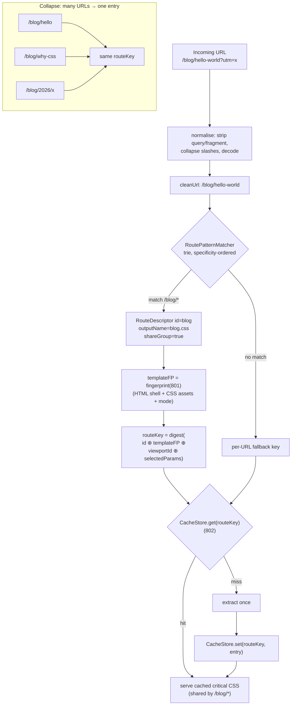
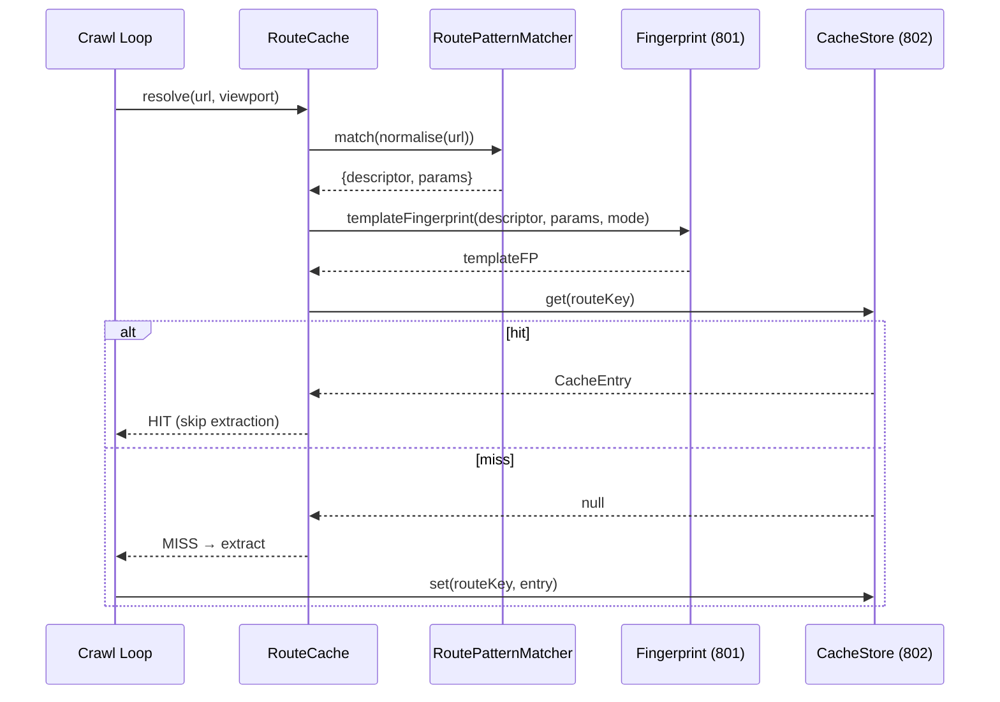

# 803 — Route Cache

## 1. Title

**Critical CSS Extraction Engine — Route Cache: Route-Manifest-Keyed Caching, Glob Route Patterns, and Fingerprint-Validated Template Sharing**

## 2. Version

| Field | Value |
|---|---|
| Document Version | 1.0.0 |
| Status | Draft — Phase 10 (Caching) |
| Last Updated | 2026-07-09 |
| Owners | Core Architecture Working Group |
| Stability | The route-manifest schema (Section 8.1) and the URL→pattern→entry resolution contract (Section 8.4) are stable. Manifest *generation* heuristics (Section 8.6) may evolve. |

## 3. Purpose

[800-Cache-Overview.md](./800-Cache-Overview.md) placed caching in three layers: key derivation ([801-Fingerprinting.md](./801-Fingerprinting.md)), physical storage ([802-Cache-Store.md](./802-Cache-Store.md)), and higher-level keying *policies* built on top. This document specifies the first such policy: the **route cache**. It answers one question precisely: **how does the engine map the (potentially unbounded) set of concrete URLs a crawler encounters onto a bounded set of cache entries, using the route manifest of `BRIEF.md` Section 2.9, such that many URLs sharing one template resolve to one entry — while fingerprint validation still guarantees that a template change invalidates every URL that shares it?**

The `BRIEF.md` Section 2.9 manifest is the anchoring artifact:

```json
{ "/": "home.css", "/products": "products.css", "/blog/*": "blog.css" }
```

That single glob entry, `"/blog/*": "blog.css"`, is the crux of this document. `/blog/hello-world`, `/blog/2026/announcement`, and `/blog/why-css` are *distinct URLs* but the *same template*; extracting critical CSS for each independently would be wasteful and would produce three near-identical (ideally identical) artifacts. The route cache collapses them to one logical entry. But collapsing carries a correctness hazard: if the blog template changes, all three URLs must invalidate together, and if two URLs that *look* like they share a template actually render differently, we must not serve one's CSS for the other. Section 8.4 and Section 8.5 resolve that tension by composing the route policy *with* fingerprinting rather than *instead of* it.

This document is the one a contributor reads before opening `packages/cache`'s `RouteCache`, `RouteManifest`, and `RoutePatternMatcher` sources. It is a *client* of [802-Cache-Store.md](./802-Cache-Store.md): the route cache decides *what key* to use; the store decides *where the bytes live*.

## 4. Audience

- Implementers of `packages/cache`'s `RouteCache`, `RouteManifest`, `RoutePatternMatcher`, and manifest-generation utility.
- Authors of the CLI/CI crawl loop (`BRIEF.md` Section 2.11 pipeline: *Crawl routes → Generate critical CSS*), who drive the route cache once per crawled URL.
- Authors of [804-Viewport-Cache.md](./804-Viewport-Cache.md), whose per-viewport keying composes *beneath* the route policy (one route entry may fan out per viewport).
- Authors of [805-Cache-Invalidation.md](./805-Cache-Invalidation.md), which invalidates by route pattern and needs the pattern→entry mapping defined here.
- SSR integrators ([900-SSR-Overview.md](./900-SSR-Overview.md)) who, at request time, must resolve an incoming request URL to a route pattern to inject the right cached critical CSS.
- Senior reviewers verifying route sharing never causes a wrong-template hit.

Readers are assumed to have read [801-Fingerprinting.md](./801-Fingerprinting.md) and [802-Cache-Store.md](./802-Cache-Store.md). This document does not re-specify the fingerprint or the store; it specifies the *key-selection policy* that sits above them.

## 5. Prerequisites

- [800-Cache-Overview.md](./800-Cache-Overview.md) — layered caching model and where the route policy sits.
- [801-Fingerprinting.md](./801-Fingerprinting.md) — the fingerprint that validates a route entry (HTML + CSS assets + viewport + mode). Route sharing *narrows what is fingerprinted* (the shared template's inputs), it does not replace fingerprinting.
- [802-Cache-Store.md](./802-Cache-Store.md) — the `CacheStore` interface (`get/set/has/delete`) the route cache calls, and the entry format it stores.
- [BRIEF.md](../../BRIEF.md) Section 2.9 (Route Manifest) and Section 2.11 (CI/CD pipeline crawl step) — source-of-truth requirements.
- `docs/architecture/006-Design-Principles.md` — Principle 3 (Correctness Over Premature Optimization), Principle 5 (Determinism of Output). Route sharing is an optimisation; it must never trade correctness for it.
- Familiarity with glob/route-pattern matching (Express-style `:param` and `*` wildcards), longest-prefix / specificity-ordered matching, and trie-based routing.

## 6. Related Documents

- [800-Cache-Overview.md](./800-Cache-Overview.md) — parent module document.
- [801-Fingerprinting.md](./801-Fingerprinting.md) — fingerprint that validates each route entry.
- [802-Cache-Store.md](./802-Cache-Store.md) — the storage backend this policy is a client of.
- [804-Viewport-Cache.md](./804-Viewport-Cache.md) — per-viewport keying, composed beneath route keying.
- [805-Cache-Invalidation.md](./805-Cache-Invalidation.md) — invalidation by route pattern.
- [806-Distributed-Cache.md](./806-Distributed-Cache.md) — shared route entries across machines (forward reference).
- [900-SSR-Overview.md](./900-SSR-Overview.md) — request-time URL→pattern resolution for injection.
- `docs/architecture/016-Data-Flow.md` — DTOs.

## 7. Overview

The route cache is a **URL-normalisation-and-grouping policy over the cache store**. Its job is to answer, for an incoming URL: *which cache key should I look under, and if I miss, which key should I write to?* The answer is derived by mapping the URL to a **route pattern** via the manifest, then combining that pattern's identity with the fingerprint of the *template's* inputs to form the store key.

There are two intertwined notions of "key" that must be kept distinct:

1. **Route identity** — the *logical* grouping. `/blog/hello` and `/blog/why-css` share the route pattern `/blog/*`, hence share a route identity (`blog`). This is what enables *one extraction for many URLs*.
2. **Fingerprint** — the *content validity* seal. Two URLs sharing a route identity still each carry the template's input fingerprint (the blog template's HTML shell + CSS assets + viewport + mode, per [801-Fingerprinting.md](./801-Fingerprinting.md)). This is what guarantees *staleness safety*: change the template, change its fingerprint, invalidate all URLs under that route.

The store key is a composition of both: `routeKey = digest(routePatternId ⊕ templateFingerprint ⊕ viewportProfileId)`. Because `templateFingerprint` is *shared* across all URLs matching the pattern (they render the same template with the same assets), all those URLs compute the *same* `routeKey` and therefore the *same* store entry — the desired collapse. And because a template edit perturbs `templateFingerprint`, the old `routeKey` is abandoned and every URL under the pattern now computes a new, empty key — the desired mass invalidation, achieved *for free* by fingerprinting rather than by explicit fan-out deletion.

The subtle and load-bearing claim is: **route sharing is safe only to the exact degree that URLs matching a pattern genuinely share the fingerprinted inputs.** The manifest is an *assertion* by the operator ("these URLs share this template"); the engine *verifies* that assertion, in two modes (Section 8.5): a **trusting** mode (fast, assumes the manifest is right — the CI default when templates are known), and a **verifying** mode (samples representative URLs per pattern, extracts, and confirms their fingerprints and outputs agree before trusting the collapse). Verifying mode is how the engine catches a mis-declared pattern (e.g., `/products/*` where product pages actually use two different templates) before it ships a wrong-template hit.

The rest of this document specifies: the manifest schema and pattern grammar (8.1–8.2), the matcher and its specificity ordering (8.3), the URL→pattern→key resolution and composition with fingerprinting (8.4), the trust modes and verification (8.5), manifest generation/update (8.6), and the interaction with viewport keying and invalidation (8.7); then the resolution diagram (9), pseudocode with complexity (10), and operational sections.

## 8. Detailed Design

### 8.1 The Route Manifest Schema

`BRIEF.md` Section 2.9's example is the minimal surface. The internal, richer schema the engine maintains:

```ts
interface RouteManifest {
  version: number;                 // manifest schema version
  generatedAt: number;             // epoch ms
  routes: RouteDescriptor[];       // ordered by specificity (most specific first)
}

interface RouteDescriptor {
  id: string;                      // stable route identity, e.g. "blog"
  pattern: string;                 // "/", "/products", "/blog/*", "/docs/:section/*"
  outputName: string;             // "blog.css" — the artifact name (matches BRIEF 2.9)
  templateFingerprintRef?: string; // last-known template fingerprint (for warm-start & diffing)
  sampleUrls?: string[];           // representative concrete URLs (used by verifying mode)
  shareGroup: boolean;             // true ⇒ all matching URLs collapse to one entry (default true)
  paramsInFingerprint?: string[];  // named params that DO affect rendering (opt-in split; see 8.4)
}
```

The `BRIEF.md` compact form `{ "/": "home.css", ... }` is the *authored* form; the engine expands it into this `RouteManifest` (deriving `id` from `outputName`, defaulting `shareGroup=true`). Keeping the authored form minimal honours the brief; keeping the internal form rich is what makes verification, warm-start, and selective param-splitting possible.

Design reasoning:

- **`shareGroup` defaults to true** because the manifest's *raison d'être* is sharing; an operator writing `/blog/*` almost always means "one template." An operator who knows a wildcard hides multiple templates sets `shareGroup=false`, forcing per-URL keys (no collapse) while still benefiting from fingerprint reuse across runs.
- **`paramsInFingerprint`** is the escape hatch for "mostly one template but one param genuinely changes rendering" (e.g., `/products/:category/*` where category drives a themed hero). Named params listed here are folded into the key, splitting the shared entry along exactly that axis — a *controlled* de-collapse, finer than `shareGroup=false`.
- **`sampleUrls`** exists so verifying mode (8.5) has representative URLs to probe without crawling every URL under a pattern.

### 8.2 Pattern Grammar

Patterns use a small, Express-compatible grammar (chosen so operators reuse familiar syntax and so `RoutePatternMatcher` can defer to the same well-tested matching semantics — echoing ADR-0002's "don't build a parser you can borrow"):

- **Literal segments:** `/products` matches exactly `/products`.
- **Named params:** `:name` matches one non-empty segment, captured as a param. `/docs/:section`.
- **Wildcard `*`:** matches one-or-more trailing segments. `/blog/*` matches `/blog/a`, `/blog/a/b`.
- **Root:** `/` matches exactly the site root.

Normalisation applied to *both* pattern and incoming URL before matching (Section 8.3): strip query string and fragment by default (query params do not, by default, change the *template*; they change *data*), collapse duplicate slashes, decode percent-encoding once, drop a trailing slash except at root, lowercase the host but preserve path case (paths are case-sensitive on most origins). Which query params (if any) participate is a manifest-level opt-in mirroring `paramsInFingerprint`.

### 8.3 The Matcher and Specificity Ordering

Multiple patterns can match one URL: `/blog/feed` matches both `/blog/*` and a hypothetical literal `/blog/feed`. Resolution must be deterministic (Principle 5), so patterns are ordered by **descending specificity** and the first match wins:

Specificity ranking (most → least specific): more literal segments beat fewer; a literal segment beats a `:param` at the same position; a `:param` beats a `*`; longer patterns beat shorter at equal class. Ties (which the schema forbids by construction — two identical patterns is a manifest error) are rejected at manifest-load time.

Implementation is a **routing trie** keyed by path segment, with literal edges tried before param edges before wildcard edges at each node. This gives O(path-length) matching independent of the number of patterns, versus O(patterns) for a linear scan — important when the SSR path resolves a URL on every request (Section 14).

### 8.4 URL → Pattern → Key Resolution (Composition with Fingerprinting)

This is the core contract. Given a URL and a viewport profile:

```
1. normalise(url)                       → cleanUrl
2. matcher.match(cleanUrl)              → { descriptor, params } | null
3. if null → UNMATCHED policy (8.7): key = per-URL fallback fingerprint
4. templateFP = fingerprint(descriptor, params)   # see below
5. keyMaterial = descriptor.id ⊕ templateFP ⊕ viewportProfileId
                 ⊕ selectedParams(params, descriptor.paramsInFingerprint)
6. routeKey = digest(keyMaterial)
7. store.get(routeKey) / store.set(routeKey, …)
```

Step 4 is the composition point with [801-Fingerprinting.md](./801-Fingerprinting.md). The `templateFP` is the fingerprint of the *template's inputs* — the HTML shell served for that route and the CSS assets it references, plus extraction mode. For a `shareGroup` route, `templateFP` is *identical* across all matching URLs *because they fetch the same template shell and the same stylesheets*; the per-URL data (blog post body text) is *below the fold or non-structural* and, critically, is excluded from the fingerprint by [801-Fingerprinting.md](./801-Fingerprinting.md)'s scoping (the fingerprint covers CSS-affecting inputs, not article prose). That exclusion is precisely what makes the collapse both possible and safe.

Two consequences, stated as invariants:

- **Collapse invariant:** if two URLs match the same `shareGroup` descriptor and produce the same `templateFP`, they produce the same `routeKey` and share one entry. *This is the optimisation.*
- **Invalidation invariant:** if the template's CSS-affecting inputs change, `templateFP` changes, `routeKey` changes, and every URL under the pattern misses the old entry and (on next crawl) populates a new one. The old entry ages out via the store's LRU ([802-Cache-Store.md](./802-Cache-Store.md) §8.5) or is explicitly dropped by [805-Cache-Invalidation.md](./805-Cache-Invalidation.md). *No manual per-URL fan-out deletion is needed* — invalidation is a property of the key, not an action on the store. This is the single most important design property in this document.

### 8.5 Trust Modes and Verification

The manifest is an operator *assertion*. The engine offers two ways to treat it:

- **Trusting mode (default in CI where templates are authored and known):** believe `shareGroup`; extract *once* per (pattern, viewport, templateFP) and serve to all matching URLs. Fast — O(patterns) extractions, not O(URLs).
- **Verifying mode (`--verify-routes`):** for each `shareGroup` pattern, extract for `sampleUrls` (2–3 representative URLs) and confirm their `templateFP` *and* their serialized critical CSS agree. If they diverge, the collapse is unsafe: the engine emits a diagnostic naming the pattern and the divergent samples, and either (a) auto-splits the pattern by the differing param if one can be identified, or (b) demotes the pattern to `shareGroup=false` for this run and logs a recommendation to fix the manifest. Verifying mode is the guardrail that turns a mis-declared manifest from a silent wrong-hit into a loud, actionable finding (Principle 6).

Verification cost is bounded (a few samples per pattern), so verifying mode is affordable to run in CI on a schedule even if not on every build.

### 8.6 Manifest Generation and Update

Operators may author the manifest by hand (the `BRIEF.md` form), but the engine also *generates* and *updates* it:

- **Generation (crawl-derived):** after a full crawl in per-URL mode, the engine clusters URLs whose extracted critical CSS is byte-identical (or within a similarity threshold) and whose paths share a common prefix, and proposes glob patterns (`/blog/*`) for each cluster. The proposal is written to a candidate manifest for human review — never auto-applied, because a wrong auto-generated pattern would silently collapse distinct templates.
- **Update:** on each run the engine refreshes `templateFingerprintRef` and `generatedAt` and appends newly-seen concrete URLs to `sampleUrls` (capped, reservoir-sampled). A `--manifest-check` CI mode fails the build if the live routes no longer match the committed manifest (a route was added/removed), keeping the manifest honest.

Generation heuristics are explicitly *advisory* and *reviewable*; the manifest remains an operator-owned artifact. This is a deliberate line: the engine proposes, the human disposes, because the blast radius of a bad collapse is production-visible.

### 8.7 Interaction with Viewport Keying, Invalidation, and Unmatched URLs

- **Viewport composition:** `viewportProfileId` is part of `keyMaterial` (step 5), so one route pattern fans out to one entry *per viewport profile*. [804-Viewport-Cache.md](./804-Viewport-Cache.md) owns viewport identity; the route cache simply includes it in the key. The composition order is route-outer, viewport-inner: one logical route, N physical entries.
- **Invalidation:** [805-Cache-Invalidation.md](./805-Cache-Invalidation.md) can invalidate a whole route by *pattern* — it enumerates known `routeKey`s for a descriptor (across viewports and recent `templateFP`s tracked in the manifest) and `delete`s them, or, more commonly, relies on the fingerprint-change mechanism (8.4) to strand old keys and lets LRU reclaim them.
- **Unmatched URLs:** a URL matching no pattern falls back to a **per-URL fingerprint key** (no collapse) — it is still cached, just not shared. This guarantees the route cache is never *worse* than no route cache: unknown URLs degrade to individual caching, they are never dropped.

## 9. Architecture





## 10. Algorithms

### 10.1 `resolveRouteKey`

- **Problem:** map a URL + viewport to the store key it should read/write.
- **Inputs:** `url`, `viewportProfileId`, `mode`, `manifest`. **Outputs:** `routeKey`, `descriptor | null`.

```
function resolveRouteKey(url, viewportProfileId, mode, manifest):
    clean = normalise(url)                       # O(len(url))
    hit = manifest.matcher.match(clean)          # O(path segments), trie
    if hit is null:
        templateFP = fingerprintPerUrl(clean, mode)   # 801, no collapse
        return { key: digest(clean ⊕ templateFP ⊕ viewportProfileId), descriptor: null }
    d = hit.descriptor
    if not d.shareGroup:
        base = clean                              # per-URL key, still fingerprint-reused across runs
    else:
        base = d.id                               # shared identity ⇒ collapse
    templateFP = fingerprintTemplate(d, mode)     # 801: HTML shell + CSS assets + mode
    selected = pick(hit.params, d.paramsInFingerprint)   # controlled de-collapse
    key = digest(base ⊕ templateFP ⊕ viewportProfileId ⊕ selected)
    return { key, descriptor: d }
```

- **Time:** O(len(url) + segments) for normalise + trie match; fingerprint cost per [801-Fingerprinting.md](./801-Fingerprinting.md) (dominated by hashing CSS assets, memoized per template per run). **Memory:** O(1) beyond inputs.
- **Failure cases:** ambiguous manifest (rejected at load, not here); unmatched URL → per-URL fallback (never fails). Query-param handling is deterministic per normalisation policy.
- **Optimisation:** memoize `fingerprintTemplate(d, mode)` per (descriptor, mode) for the run — computed once, reused for every URL under the pattern. This is what makes trusting-mode extraction O(patterns), not O(URLs).

### 10.2 `RoutePatternMatcher.match` (trie)

```
function match(cleanUrl):
    segs = split(cleanUrl, "/")
    node = root; params = {}
    for i, seg in segs:
        next = node.literal[seg]                 # try literal first (most specific)
        if next is null and node.param:          # then :param
            params[node.param.name] = seg; next = node.param.node
        if next is null and node.wildcard:       # then * (captures rest)
            params["*"] = segs[i:].join("/"); return node.wildcard.descriptor, params
        if next is null: return null              # no match
        node = next
    return node.descriptor, params                # exact match if node terminal
```

- **Time:** O(number of path segments), independent of pattern count. **Memory:** O(depth) for params.
- **Failure cases:** returns `null` on no match (caller applies fallback).
- **Optimisation:** compile the manifest into the trie once at load; the trie is immutable per run and shareable across workers read-only.

### 10.3 `verifyShareGroup` (verifying mode)

```
function verifyShareGroup(descriptor, mode, viewport):
    if not descriptor.shareGroup: return OK
    samples = descriptor.sampleUrls  # 2..3 representatives
    results = [extractCritical(u, mode, viewport) for u in samples]
    fps = distinct(map(r → r.templateFP, results))
    css = distinct(map(r → normalizeCss(r.css), results))
    if len(fps) == 1 and len(css) == 1: return OK
    else: return DIVERGENT(descriptor, samples, differingParam(results))
```

- **Time:** O(samples) extractions per pattern (small constant). **Memory:** O(samples).
- **Failure cases:** DIVERGENT → auto-split or demote + loud diagnostic (Section 8.5).

## 11. Implementation Notes

- **The matcher trie is built once and frozen**, shared read-only across the worker pool and reused by the SSR path at request time; never mutated during a crawl.
- **`templateFingerprint` memoization keys on (descriptor.id, mode)** and lives for the crawl. This is the difference between "extract once per template" and "extract once per URL" — get it wrong and route caching provides no speedup.
- **Query strings are stripped by default.** Sites where a query param changes the *template* (rare) opt that param into the key via manifest config; do not silently fold all query params into keys or the collapse disappears for tracking-param-laden URLs (`?utm=...`).
- **Manifest load validates for ambiguity and dead patterns** (a pattern shadowed entirely by an earlier more-specific one that covers all its URLs is flagged as likely-redundant).
- **`outputName` (e.g. `blog.css`) is the artifact filename** the CI publisher writes; the route cache carries it through so the published artifact set matches `BRIEF.md` Section 2.9's manifest values exactly.
- **Generated manifests are written to a candidate file** (`route-manifest.candidate.json`), never over the committed manifest — human review is mandatory (Section 8.6).

## 12. Edge Cases

- **Trailing slash / index:** `/blog/` and `/blog` normalise together (except root `/`); a site treating them as distinct templates must opt out via config.
- **Percent-encoding:** decoded once during normalise; double-decoding is refused (a `%2F` in a segment is not treated as a path separator — path-injection defence).
- **Overlapping patterns:** `/blog/feed` (literal) vs `/blog/*` — specificity ordering (8.3) makes the literal win deterministically.
- **Wildcard depth:** `/blog/*` matches `/blog/a/b/c`; if `/blog/:year/*` also exists, specificity (param+wildcard) beats bare wildcard for `/blog/2026/x`.
- **Mis-declared shareGroup:** two templates hidden under one `/products/*` — caught by verifying mode (8.5); in trusting mode this is the one wrong-hit hazard, which is exactly why verifying mode exists and why generation never auto-applies.
- **Empty manifest:** every URL is unmatched → per-URL fallback; route cache degrades gracefully to plain fingerprint caching.
- **URL matching multiple viewports:** handled by viewport-inner composition (8.7) — one route, N entries; not an ambiguity.
- **SSR request for a URL absent at crawl time:** matcher still resolves it to a pattern; if the shared entry exists it is served, else SSR falls back to synchronous extraction or no-critical-CSS per its own policy ([900-SSR-Overview.md](./900-SSR-Overview.md)).
- **Shadow-DOM / constructable-stylesheet templates:** their CSS is part of the template fingerprint via [801-Fingerprinting.md](./801-Fingerprinting.md); the route cache treats the resulting fingerprint opaquely.

## 13. Tradeoffs

- **Manifest-declared sharing vs automatic clustering.** *Chosen:* operator-declared manifest, engine-assisted generation. *Why:* the operator knows the site's template topology; a wrong automatic collapse is production-visible (wrong styles). *Automatic-only rejected:* too risky to auto-apply. *Tradeoff:* operators must maintain a manifest; mitigated by generation + `--manifest-check`.
- **Trusting vs verifying by default.** *Chosen:* trusting default, verifying opt-in. *Why:* in authored-CI contexts the manifest is reliable and verifying costs extra extractions. *Tradeoff:* trusting mode can serve a wrong-template hit if the manifest lies; mitigated by making verifying cheap and CI-schedulable, and by generation never auto-applying.
- **Fingerprint-driven invalidation vs explicit fan-out delete.** *Chosen:* fingerprint-driven (change template ⇒ new key ⇒ old key stranded). *Why:* zero bookkeeping, impossible to forget a URL, composes with the store's LRU. *Explicit delete rejected* as the *primary* mechanism (kept as a secondary tool in [805-Cache-Invalidation.md](./805-Cache-Invalidation.md)) because enumerating every concrete URL under a wildcard is exactly the unbounded set route caching exists to avoid. *Tradeoff:* stranded old entries linger until LRU reclaims them (bounded, harmless).
- **Trie matcher vs linear scan.** *Chosen:* trie. *Why:* O(path-length) matching matters at SSR request rate. *Tradeoff:* trie build cost at load; negligible and one-time.
- **Query-strip default vs query-in-key.** *Chosen:* strip. *Why:* query params usually carry data/tracking, not template identity; folding them in would defeat collapse. *Tradeoff:* the rare query-driven-template site must opt in.

## 14. Performance

- **CPU:** matching is O(path-length) per URL via the trie; key composition is one digest. The expensive part — `fingerprintTemplate` — is memoized per (descriptor, mode), so a crawl of 10,000 blog URLs computes the blog template fingerprint *once*.
- **Extraction reduction:** the headline win. A site with 10,000 URLs across 12 templates does ~12 extractions in trusting mode instead of 10,000 — a ~800× reduction in the dominant cost (browser extraction). This is the entire economic justification of the route cache.
- **Memory:** the trie is O(total pattern segments), tiny; shared read-only across workers.
- **Parallelization:** the matcher and memoized fingerprints are immutable during a crawl and freely shared across the worker pool ([performance/002-Parallelization-Strategy.md]); each worker resolves keys independently and hits the shared store ([802-Cache-Store.md](./802-Cache-Store.md)).
- **Incremental execution:** across runs, unchanged templates keep the same `templateFP` and hit the persistent disk store — a re-run touches zero extractions if nothing changed. This is the cross-run half of the incremental story that [704-Incremental-Extraction.md](./704-Incremental-Extraction.md) describes.
- **SSR request path:** O(path-length) match + O(1) store `get`; fast enough to run per request. Cache the matcher in the SSR process at boot.
- **Scalability limits:** bounded by the number of *templates*, not URLs — the design's core scalability property. Very large pattern sets (thousands of templates) remain O(path-length) to match.

## 15. Testing

- **Unit:** normalisation (query strip, slash collapse, decode-once, trailing slash); specificity ordering (literal > param > wildcard); trie match correctness incl. deep wildcards; key composition determinism (same inputs ⇒ same key); `paramsInFingerprint` split behavior; unmatched-URL fallback.
- **Collapse tests:** many URLs under `/blog/*` resolve to one `routeKey`; changing the blog template's CSS changes every one of their keys (invalidation invariant); a URL under `shareGroup=false` gets a distinct key.
- **Verification tests:** verifying mode flags a `/products/*` pattern hiding two templates as DIVERGENT and auto-splits/demotes; agreeing samples pass.
- **Integration:** end-to-end crawl of a fixture site with the `BRIEF.md` manifest → correct artifact names (`home.css`, `products.css`, `blog.css`), correct hit/miss counts (extractions == template count).
- **Regression/golden:** committed manifest + fixture → golden `routeKey` set; `--manifest-check` fails on added/removed routes.
- **Stress:** 100k synthetic URLs across 20 templates → extraction count ≈ 20; matcher throughput at SSR rate.
- **Adversarial:** tracking-param URLs (`?utm=...`) collapse correctly; percent-encoded separators do not escape their segment; ambiguous manifest rejected at load.

## 16. Future Work

- **Similarity-threshold sharing:** allow near-identical (not byte-identical) templates to share via a canonicalized-CSS fingerprint, with a configurable tolerance — trades a little precision for more collapse; must interlock carefully with verifying mode.
- **Automatic param-split inference:** when verification finds divergence, infer *which* param drives it and propose a `paramsInFingerprint` entry automatically (review-gated).
- **Manifest-as-code:** generate the manifest from framework route definitions (Next.js `app/`, Remix routes) directly, eliminating hand authoring for those stacks — coordinate with [903-NextJS.md](./903-NextJS.md), [905-Remix.md](./905-Remix.md).
- **Cross-run pattern drift detection:** alert when a pattern's `templateFP` changes unusually often (sign of a non-deterministic template).
- **Distributed route entries:** sharing one route entry across CI machines via [806-Distributed-Cache.md](./806-Distributed-Cache.md) — one machine extracts `/blog/*`, all machines reuse it.
- Open question: should query params be *allow-listed* per pattern rather than opt-in single-param, to support sites that key templates on `?variant=`?

## 17. References

- [800-Cache-Overview.md](./800-Cache-Overview.md) — Cache Manager module overview.
- [801-Fingerprinting.md](./801-Fingerprinting.md) — fingerprint that validates each route entry.
- [802-Cache-Store.md](./802-Cache-Store.md) — storage backend this policy consumes.
- [804-Viewport-Cache.md](./804-Viewport-Cache.md) — per-viewport keying composed beneath route keying.
- [805-Cache-Invalidation.md](./805-Cache-Invalidation.md) — invalidation by route pattern.
- [806-Distributed-Cache.md](./806-Distributed-Cache.md) — cross-machine route-entry sharing.
- [900-SSR-Overview.md](./900-SSR-Overview.md) — request-time URL→pattern resolution.
- [704-Incremental-Extraction.md](./704-Incremental-Extraction.md) — cross-run incremental reuse.
- `docs/adr/ADR-0002-No-Custom-Selector-Parser.md` — the "borrow well-tested matching semantics" principle applied to route patterns.
- `docs/architecture/006-Design-Principles.md` — Principles 3, 5.
- [BRIEF.md](../../BRIEF.md) Sections 2.9 (Route Manifest) and 2.11 (CI/CD crawl step).
