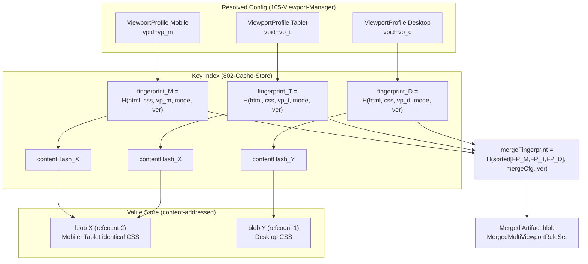
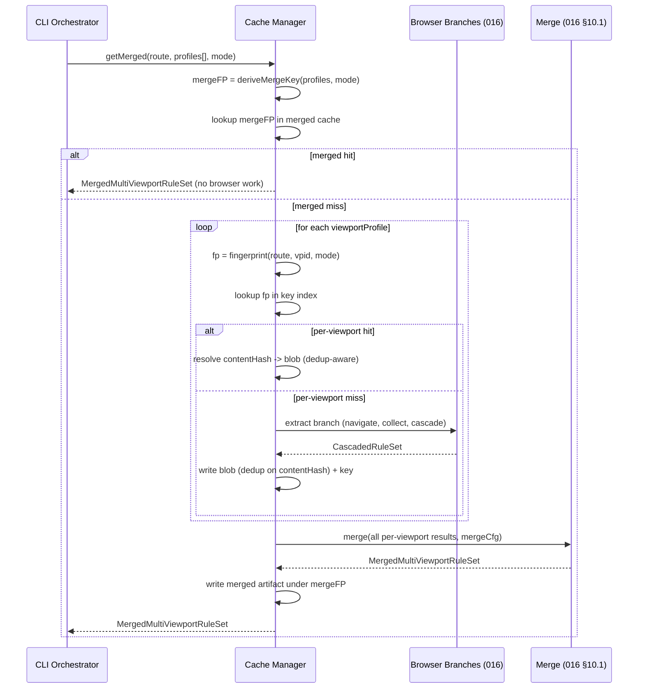

# 804 — Viewport Cache

## 1. Title

**Critical CSS Extraction Engine — Viewport Cache: Per-Viewport Cache Keying, Cross-Profile Output Deduplication, and the Merged Multi-Viewport Artifact**

## 2. Version

| Field | Value |
|---|---|
| Document Version | 1.0.0 |
| Status | Accepted |
| Last Updated | 2026-07-09 |
| Owners | Caching Working Group |
| Stability | Stable (Phase 10 design document; changes require RFC) |

## 3. Purpose

BRIEF.md Section 2.8 (Incremental Cache) specifies that the extraction fingerprint includes "HTML, CSS assets, **viewport**, extraction mode," and Section 2.6 (Multi-Viewport Strategy) requires the Engine to "generate critical CSS independently for Mobile, Tablet, Desktop" and then "merge." [006-Design-Principles.md](../architecture/006-Design-Principles.md) Principle 8 restates this as an incremental-by-default cache keyed on a composite fingerprint that names "the active viewport/device profile" as a first-class input. [105-Viewport-Manager.md](./105-Viewport-Manager.md) establishes the authoritative `ViewportProfile`/`DeviceProfile` data model and the `viewportProfileId` — a deterministic hash of the full `DeviceProfile` content — that is threaded through every downstream `viewportProfileId`-keyed structure in [016-Data-Flow.md](../architecture/016-Data-Flow.md).

The consequence, made explicit here, is that **the viewport is not an incidental parameter of a route's cache entry — it is part of the cache key**. Two viewport profiles applied to the same route are, from the cache's perspective, two distinct extractions with two distinct fingerprints and therefore (in the general case) two distinct cache entries. This document is the authority for exactly *how* the viewport dimension participates in cache keying, for the important optimization that two profiles which happen to yield **byte-identical** critical CSS should not pay to store that output twice (cross-profile deduplication at the cache layer), and for how the per-viewport cache entries relate to the **merged multi-viewport artifact** — the single combined stylesheet that [016-Data-Flow.md](../architecture/016-Data-Flow.md) Section 10.1 produces from the per-profile branches, which is itself a cacheable object with its own key.

This document does **not** re-specify the fingerprint composition algorithm (owned by [801-Fingerprinting.md](./801-Fingerprinting.md)), the physical key→value storage mechanism (owned by [802-Cache-Store.md](./802-Cache-Store.md)), the route-level cache-entry lifecycle and route-manifest interaction (owned by [803-Route-Cache.md](./803-Route-Cache.md)), the invalidation triggers (owned by [805-Cache-Invalidation.md](./805-Cache-Invalidation.md)), or the remote/fleet backend (owned by [806-Distributed-Cache.md](./806-Distributed-Cache.md)). It owns exactly the viewport-specific slice of the caching subsystem: how the `viewportProfileId` from [105-Viewport-Manager.md](./105-Viewport-Manager.md) becomes a key discriminator, how output identity is exploited across profiles, and how per-viewport entries fold into (and out of) the merged artifact.

## 4. Audience

- Implementers of the Cache Manager (`packages/cache`, per BRIEF.md Section 2.4 and [006-Design-Principles.md](../architecture/006-Design-Principles.md) Principle 8's "first-class package" mandate), who must key entries per viewport and implement cross-profile output deduplication.
- Implementers of [016-Data-Flow.md](../architecture/016-Data-Flow.md)'s multi-viewport merge step, who must understand which per-viewport branches can be served from cache (and therefore skipped entirely, browser and all) before the merge runs, and how the merge output is itself cached.
- Implementers of [105-Viewport-Manager.md](./105-Viewport-Manager.md), who produce the `viewportProfileId` this document consumes as a key discriminator; changes to how that identifier is computed change this document's keying behavior.
- Implementers of [801-Fingerprinting.md](./801-Fingerprinting.md), who own the composite fingerprint into which this document's viewport component is injected; the boundary between "the viewport component of the key" (this document) and "how all components compose into one fingerprint" (that document) is defined in Section 8.1.
- CI/CD pipeline authors (BRIEF.md Section 2.11) tuning cache hit rates across large route × viewport matrices, who need to reason about why some viewport branches hit and others miss.

Readers should already understand the `ViewportProfile`/`DeviceProfile` model and the `viewportProfileId` derivation from [105-Viewport-Manager.md](./105-Viewport-Manager.md) Section 8.1, the fan-out/fan-in multi-viewport model from [016-Data-Flow.md](../architecture/016-Data-Flow.md) Section 9.2, and content-addressed storage as introduced in [006-Design-Principles.md](../architecture/006-Design-Principles.md) Principle 8.

## 5. Prerequisites

- BRIEF.md Section 2.6 (Multi-Viewport Strategy) and Section 2.8 (Incremental Cache) — the two requirements this document jointly operationalizes.
- [105-Viewport-Manager.md](./105-Viewport-Manager.md) Section 8.1 (`viewportProfileId` as a deterministic content hash of `DeviceProfile`) and Section 14 (its explicit statement that `viewportProfileId` "is part of [the Cache Manager's] fingerprint composite") — this document is the fulfillment of that forward reference.
- [016-Data-Flow.md](../architecture/016-Data-Flow.md) Section 9.2 (independent per-viewport branches) and Section 10.1 (the merge algorithm producing the `MergedMultiViewportRuleSet`) — the artifact this document explains how to cache.
- [006-Design-Principles.md](../architecture/006-Design-Principles.md) Principle 5 (Determinism of Output) and Principle 8 (Incremental-by-Default Caching), including its Fingerprint Computation algorithm — the correctness foundation on which per-viewport keying and cross-profile deduplication both rest.
- [801-Fingerprinting.md](./801-Fingerprinting.md) — the composite fingerprint into which this document's viewport component is one input.
- [802-Cache-Store.md](./802-Cache-Store.md) — the key/value storage abstraction (the `CacheStore` interface named in [006-Design-Principles.md](../architecture/006-Design-Principles.md)'s Future Work) whose two-level (key→content-hash→blob) layout this document's deduplication relies on.
- [803-Route-Cache.md](./803-Route-Cache.md) — the route-scoped view of the cache this document's per-viewport keying nests within.

## 6. Related Documents

- [105-Viewport-Manager.md](./105-Viewport-Manager.md) — defines `viewportProfileId`, the sole viewport discriminator this document injects into the key; also the source of the observation that emulation-only variants (dark mode, reduced motion) fan out identically to spatial variants, which this document inherits directly as "every profile is just another key discriminator."
- [800-Cache-Overview.md](./800-Cache-Overview.md) — the Phase 10 overview that situates this document as the viewport-specific slice of the caching subsystem and defines the overall cache read/write flow this document specializes.
- [801-Fingerprinting.md](./801-Fingerprinting.md) — owns composite fingerprint construction; this document owns only the viewport component's contribution to it.
- [802-Cache-Store.md](./802-Cache-Store.md) — owns physical storage; this document's cross-profile deduplication is a client of that document's content-addressed value layer.
- [803-Route-Cache.md](./803-Route-Cache.md) — owns route-level entry lifecycle; per-viewport entries are children of a route in that model.
- [805-Cache-Invalidation.md](./805-Cache-Invalidation.md) — owns invalidation; a viewport profile change invalidates only that profile's entries (implicit invalidation), a property this document establishes and that document consumes.
- [806-Distributed-Cache.md](./806-Distributed-Cache.md) — owns the remote backend; cross-profile deduplication has a distinct cost/benefit profile over a network store, discussed in Section 13.
- [016-Data-Flow.md](../architecture/016-Data-Flow.md) — owns the merge algorithm; this document explains how its inputs (per-viewport branches) and output (merged artifact) are cached.
- [006-Design-Principles.md](../architecture/006-Design-Principles.md) — Principles 5 and 8, cited throughout.
- BRIEF.md Section 2.6 and Section 2.8 — the authoritative requirement source.

## 7. Overview

The Viewport Cache is not a separate cache; it is a **keying discipline and a deduplication policy** layered on the single content-addressed cache store defined in [802-Cache-Store.md](./802-Cache-Store.md). Three ideas define it.

**First: the viewport is in the key.** A cache entry is not "the critical CSS for route `/products`." It is "the critical CSS for route `/products` *under viewport profile `vp_a1b2…`* in extraction mode `cssom`." The fingerprint composite from [801-Fingerprinting.md](./801-Fingerprinting.md) — HTML, CSS assets, `viewportProfileId`, extraction mode, engine version — already encodes this, and the `viewportProfileId` component is the sole carrier of the viewport dimension. The direct consequence for multi-viewport runs: a single route configured for Mobile, Tablet, and Desktop produces (up to) three independent cache entries, each independently hit-or-miss. A cache hit for Desktop does not imply a hit for Mobile, and a change that affects only Mobile (e.g., editing a rule inside `@media (max-width: 480px)`) will miss on Mobile while continuing to hit on Tablet and Desktop — the ideal granularity BRIEF.md Section 2.8's "reuse previous extraction when fingerprints match" implies.

**Second: identical output is stored once, regardless of how many profiles produced it.** Keying per viewport is correct but potentially wasteful: many pages produce *the same* critical CSS across two or more profiles (a page with no `prefers-color-scheme` rules yields identical output for a Light and a Dark profile of the same spatial size; a page whose above-the-fold region is layout-identical at 1920px and at a slightly narrower custom Desktop breakpoint yields identical output for both). Because [802-Cache-Store.md](./802-Cache-Store.md) is a **two-level** store — a *key index* mapping fingerprint→content-hash, and a *value store* mapping content-hash→blob (content-addressed) — two viewport keys whose extractions produce byte-identical CSS naturally converge on the same content-hash and therefore the same single stored blob. The two keys remain distinct (they must, for correct per-viewport invalidation); only the *value* is shared. This is deduplication at the cache layer, and it is a property the Engine gets nearly for free from content-addressing, not a bespoke mechanism — a direct dividend of Principle 5's determinism (identical inputs-that-matter produce byte-identical output, so identical output is a reliable, not accidental, signal).

**Third: the merged artifact is a first-class cached object with a derived key.** [016-Data-Flow.md](../architecture/016-Data-Flow.md) Section 10.1's merge takes N per-viewport `CascadedRuleSet`s and produces one `MergedMultiViewportRuleSet`. That merged output is expensive enough (and reused often enough — it is what SSR adapters in Phase 11 actually inject) to warrant its own cache entry, keyed not by a single `viewportProfileId` but by the **ordered set of the N per-viewport fingerprints** that fed it (plus the merge configuration). This lets the Engine skip the merge step itself when all N inputs are unchanged, and — crucially — correctly re-run *only* the merge (not the browser-bound per-viewport extractions) when the set of inputs is unchanged but the merge *configuration* changed (e.g., a media-query normalization option toggled).

The remainder of this document specifies the key structure (Section 8.1), the deduplication mechanism and its correctness argument (Section 8.2), the merged-artifact cache (Section 8.3), the read/write algorithms (Section 10), and the many edge cases where viewport identity and output identity interact subtly (Section 12).

## 8. Detailed Design

### 8.1 The Viewport Component of the Cache Key

**Design choice: the viewport contributes to the key solely through `viewportProfileId`, an opaque content hash owned by [105-Viewport-Manager.md](./105-Viewport-Manager.md), never through raw width/height or profile name.** The Cache Manager does not inspect `device.width`, `device.colorScheme`, or `device.name` when constructing a key; it consumes the single `viewportProfileId` string that [105-Viewport-Manager.md](./105-Viewport-Manager.md) Section 8.1 already computed as `sha256(canonicalJsonStringify(device))`.

**Why route this through `viewportProfileId` rather than hashing viewport fields into the cache key directly.** Three reasons, each an application of a stated principle:

1. **Single source of identity truth (Principle 5).** If the Cache Manager independently hashed viewport fields, and the Viewport Manager independently hashed the same fields (for its own `viewportProfileId`), the two hashes could drift — a field added to `DeviceProfile` and included in one hash but not the other would silently break either cache correctness or context reuse. Consuming the one canonical identifier makes drift impossible by construction.
2. **Automatic coverage of emulation-only dimensions.** Because `viewportProfileId` is a hash of the *entire* `DeviceProfile` — including `colorScheme`, `reducedMotion`, `forcedColors`, and `customFoldOffsetPx`, not just spatial dimensions ([105-Viewport-Manager.md](./105-Viewport-Manager.md) Section 8.4) — a Dark-mode variant and a Light-mode variant of the same spatial size have *different* `viewportProfileId`s and therefore different cache keys, with zero viewport-specific logic in the Cache Manager. The cache treats "Desktop-Light" and "Desktop-Dark" exactly as it treats "Mobile" and "Desktop": four distinct keys, no special-casing — mirroring [105-Viewport-Manager.md](./105-Viewport-Manager.md) Section 8.4's "there is no structural distinction in the pipeline between a spatial viewport variant and an emulation-only variant."
3. **Forward-compatibility.** If a future `DeviceProfile` field is added ([105-Viewport-Manager.md](./105-Viewport-Manager.md) Future Work contemplates `foldRegion: Rect` and finer-grained `forcedColors`), it is automatically incorporated into `viewportProfileId` by the Viewport Manager, and therefore automatically into the cache key here, with no change to this document — the additive-change property [105-Viewport-Manager.md](./105-Viewport-Manager.md) Section 8.3 explicitly designs for.

**The composite key.** The full cache key for a per-viewport extraction is the fingerprint from [801-Fingerprinting.md](./801-Fingerprinting.md):

```
fingerprint = H( normalizedHtml,
                 resolvedCssAssets,     // post-bundle, pre-extraction
                 viewportProfileId,     // <-- this document's contribution
                 extractionMode,        // 'cssom' | 'coverage' | 'hybrid'
                 engineVersion )
```

This document owns only the third line. Its correctness obligation is narrow and precise: **`viewportProfileId` must appear in the composite, and it must be the *only* viewport-derived value that appears** — no raw viewport field may leak in alongside it (which would over-specify the key and cause false misses when a semantically irrelevant field representation changed) and none may be omitted (which would cause false hits across genuinely different profiles). Since `viewportProfileId` already captures every `DeviceProfile` field, including it whole satisfies both halves.

### 8.2 Cross-Profile Output Deduplication

**The problem.** Per-viewport keying is correct but can store the same bytes many times. Consider a marketing page with no dark-mode styles, extracted under `Desktop-Light` and `Desktop-Dark`: the CSSOM Rule Lists observed under both profiles are identical (no `@media (prefers-color-scheme)` block toggled), so the extracted critical CSS is byte-identical. Under naive one-blob-per-key storage, that CSS is written twice. At enterprise scale (BRIEF.md Section 2.18) — thousands of routes × several profiles — the redundancy is significant, and it grows precisely with the number of profiles that *don't* actually differentiate a given route.

**The mechanism: content-addressed value store with a key→content-hash indirection.** [802-Cache-Store.md](./802-Cache-Store.md) defines the store as two maps:

- **Key index:** `fingerprint → contentHash` (small, one entry per (route, viewport, mode)).
- **Value store:** `contentHash → blob` (content-addressed; the blob is the serialized critical CSS plus its metadata).

Deduplication is then automatic: the write path hashes the *output* to get `contentHash`, writes the blob under `contentHash` only if absent, and points the `fingerprint` key at it. Two viewport keys whose outputs are byte-identical produce the same `contentHash` and therefore share one blob. No profile-comparison logic is needed; the Engine never asks "are these two profiles equivalent?" — it lets identical output answer that question after the fact.

```
DeviceProfile A (Desktop-Light)  -> fingerprint_A -\
                                                     >-- both extractions yield identical CSS
DeviceProfile B (Desktop-Dark)   -> fingerprint_B -/     -> same contentHash -> ONE blob

Key index:                          Value store:
  fingerprint_A -> contentHash_X      contentHash_X -> "<critical css bytes>"
  fingerprint_B -> contentHash_X      (single copy, refcount 2)
```

**Why deduplicate at the value layer rather than at the key layer (i.e., rather than detecting profile-equivalence up front and using one key).** A tempting alternative is to detect *before* extraction that two profiles will produce identical output and extract only once. This is rejected because profile-equivalence for output purposes is **not statically decidable** from `DeviceProfile` fields alone: whether `Desktop-Light` and `Desktop-Dark` yield identical CSS depends entirely on whether *this specific page's* stylesheets contain `prefers-color-scheme` rules that gate above-the-fold content — a fact known only after the CSSOM is observed for at least one profile. Any static "these profiles are equivalent" predicate would be either unsound (declaring equivalence that a page's dark-mode rules violate, producing wrong output — a Principle 3 violation) or uselessly conservative (never declaring equivalence, capturing no benefit). Post-hoc, output-driven deduplication is sound by construction: it deduplicates exactly the outputs that *are* identical, discovered empirically, never guessed.

**Refcounting and the interaction with invalidation.** Because one blob may back multiple keys, the value store must refcount (or, equivalently, garbage-collect unreferenced blobs), so that invalidating `fingerprint_A` (Section 8.1 of [805-Cache-Invalidation.md](./805-Cache-Invalidation.md)) does not delete a blob still referenced by `fingerprint_B`. This is a [802-Cache-Store.md](./802-Cache-Store.md) responsibility; this document's obligation is only to state the invariant it depends on: **a per-viewport key deletion must decrement, not unconditionally delete, the referenced blob.** Section 12 enumerates the failure that occurs if this invariant is violated.

### 8.3 The Merged Multi-Viewport Artifact Cache

**The merged artifact is cached under a derived, set-valued key.** [016-Data-Flow.md](../architecture/016-Data-Flow.md) Section 10.1 merges N per-viewport `CascadedRuleSet`s into one `MergedMultiViewportRuleSet` (identical-rule collapsing, media-query normalization, dependency deduplication per BRIEF.md Section 2.6). The result is what downstream consumers (SSR injection, the final `.css` artifact named in the route manifest) actually use. It is cached under:

```
mergeFingerprint = H( sortedList( perViewportFingerprint_1 … perViewportFingerprint_N ),
                      mergeConfig,          // media-query normalization opts, ordering policy
                      engineVersion )
```

**Why the merge key is the *set of input fingerprints*, not a fresh hash of page content.** The merge is a pure function of its N inputs and its configuration; its output cannot change unless one of those changes. Keying on the input fingerprints (rather than re-deriving from HTML/CSS) means the merge cache hits exactly when all N per-viewport results are unchanged — even across engine restarts, even if the per-viewport results themselves were served from cache. It also means the merge correctly *misses* when the set of profiles changes (adding a Tablet profile changes N and thus the set), which is correct: a merge over {Mobile, Desktop} is a different artifact than a merge over {Mobile, Tablet, Desktop}.

**Why `sortedList` and not the raw fan-out order.** Per Principle 5, the merged artifact must be identical regardless of the order in which the fan-out branches happened to complete (a scheduling accident). Sorting the input fingerprints before hashing makes the merge key order-independent, mirroring the canonical-ordering discipline in [006-Design-Principles.md](../architecture/006-Design-Principles.md)'s Fingerprint Computation algorithm. [016-Data-Flow.md](../architecture/016-Data-Flow.md) Section 10.1's merge algorithm is itself required to be order-independent, so a sorted key is consistent with the artifact it names.

**The three-way relationship.** The per-viewport caches (Section 8.1) and the merged cache (this section) are complementary, not redundant:

- A per-viewport cache hit lets the Engine skip one browser-bound extraction branch entirely.
- A merged cache hit lets the Engine skip the merge computation *and*, transitively, need not even consult the per-viewport caches — if the merge output is present and its input-set fingerprint matches, the answer is final.
- The merged cache is consulted *first* (it is the coarser, more valuable hit); only on a merged miss does the Engine fall through to per-viewport lookups to determine which branches must actually be re-extracted before re-merging.

This ordering (merged-first, then per-viewport) is the read strategy formalized in Section 10.1.

## 9. Architecture

### 9.1 Per-Viewport Entries and the Merged Artifact



This diagram shows the two-level store (Section 8.2): three distinct per-viewport keys, two of which (Mobile, Tablet) converge on one deduplicated blob X while Desktop occupies its own blob Y. The merge key is derived from the *set* of the three per-viewport fingerprints (Section 8.3), pointing at a separately-stored merged artifact.

### 9.2 Read/Merge Sequence



This makes the merged-first read strategy explicit: browser-bound extraction is reached only on a merged miss *and* a per-viewport miss for that specific branch — the two cache layers together minimize the number of live browser navigations, which is the dominant cost per [006-Design-Principles.md](../architecture/006-Design-Principles.md) Principle 1's tradeoff table.

## 10. Algorithms

### 10.1 Multi-Viewport Cached Read

**Problem statement.** Given a route, a list of `ViewportProfile`s, and an extraction mode, return the merged multi-viewport critical CSS, performing the minimum browser-bound work: skip the merge if the merged artifact is cached; otherwise extract only the per-viewport branches that miss, then merge.

**Inputs.** `route: string`, `profiles: ViewportProfile[]`, `mode: ExtractionMode`, `ctx: FingerprintInput` (resolved HTML + CSS assets + engineVersion, from [801-Fingerprinting.md](./801-Fingerprinting.md)).

**Outputs.** `MergedMultiViewportRuleSet`.

**Pseudocode.**

```text
function getMergedCritical(route, profiles, mode, ctx) -> MergedMultiViewportRuleSet:
    perViewportFps = []
    for vp in profiles:
        perViewportFps.push(fingerprint(ctx.html, ctx.css, vp.viewportProfileId, mode, ctx.engineVersion))

    mergeFp = hash(canonical(sort(perViewportFps)), mergeConfig, ctx.engineVersion)

    merged = mergedCache.get(mergeFp)
    if merged is not null:
        return merged                       // coarse hit: zero browser, zero merge work

    results = []
    for (vp, fp) in zip(profiles, perViewportFps):
        contentHash = keyIndex.get(fp)
        if contentHash is not null:
            results.push(valueStore.get(contentHash))     // per-viewport hit (dedup-transparent)
        else:
            cascaded = extractBranch(route, vp, mode)      // BROWSER-BOUND: 016 §9.2 branch
            ch = hash(serialize(cascaded))
            valueStore.putIfAbsent(ch, serialize(cascaded))// dedup: no-op if blob already present
            keyIndex.put(fp, ch)                           // refcount++ on ch
            results.push(cascaded)

    merged = merge(results, mergeConfig)                   // 016 §10.1
    mergedCache.put(mergeFp, merged)
    return merged
```

**Time complexity.** O(N) fingerprint/key lookups where N = number of profiles (typically 3–6 per [016-Data-Flow.md](../architecture/016-Data-Flow.md)). Each lookup is O(1) expected (hash map / content-addressed store). The dominant cost is the number of `extractBranch` calls, which is between 0 (all cached) and N (cold) — the entire point of the cache is to drive this toward 0. The merge itself is O(R) in total rule count across branches ([016-Data-Flow.md](../architecture/016-Data-Flow.md) Section 10.1). A merged hit short-circuits to O(N) hashing + one O(1) lookup, with **zero** browser and merge cost.

**Memory complexity.** O(N × R_avg) transient to hold the N per-viewport results during merge; O(R_merged) for the merged output. The dedup value store holds one blob per *distinct* output, so peak storage is bounded by the number of distinct outputs, not the number of keys — the memory dividend of Section 8.2.

**Failure cases.** (a) A `valueStore.get(contentHash)` miss when `keyIndex` still points at that `contentHash` indicates a dangling key (blob GC'd while key survived) — must be treated as a per-viewport miss and re-extracted, never as a hard error (Principle 3: degrade to correct-but-slow, never serve wrong/absent output as success). (b) A serialization that is not byte-deterministic across runs would break dedup (identical logical output → different `contentHash` → no sharing) and, worse, break the merged-artifact hit rate; this is why Principle 5 determinism is a hard prerequisite, enforced by [802-Cache-Store.md](./802-Cache-Store.md)'s serializer contract.

**Optimization opportunities.** The N per-viewport lookups on a merged miss can be issued in parallel (they are independent reads); the surviving `extractBranch` calls are already independently parallelizable per [016-Data-Flow.md](../architecture/016-Data-Flow.md) Section 9.2, bounded by [102-Browser-Pool.md](./102-Browser-Pool.md) concurrency. A merged-hit fast path should be checked before *any* per-viewport work, as shown, since it is the highest-value short-circuit.

### 10.2 Dedup-Aware Per-Viewport Write

**Problem statement.** Persist a per-viewport extraction result such that byte-identical outputs across profiles share a single stored blob, while keeping each profile's key independently addressable and independently invalidatable.

**Inputs.** `fingerprint: string` (per-viewport, from Section 8.1), `cascaded: CascadedRuleSet`.

**Outputs.** none (side effect: store updated).

**Pseudocode.**

```text
function writePerViewport(fingerprint, cascaded):
    blob = serialize(cascaded)          // MUST be deterministic (Principle 5)
    contentHash = hash(blob)
    if not valueStore.has(contentHash):
        valueStore.put(contentHash, blob)   // first writer of these exact bytes
    valueStore.incref(contentHash)           // this key now references the blob
    prev = keyIndex.get(fingerprint)
    if prev is not null and prev != contentHash:
        valueStore.decref(prev)              // key re-pointed; release old blob
    keyIndex.put(fingerprint, contentHash)
```

**Time complexity.** O(|blob|) for hashing and (on first write) storing the serialized bytes; O(1) for the index update. Refcount ops are O(1).

**Memory complexity.** O(1) additional index memory per key; O(|blob|) value memory *only on the first write of a given content hash* — subsequent identical outputs cost O(1) (an incref), which is the storage saving quantified in Section 14.

**Failure cases.** A crash between `valueStore.put` and `keyIndex.put` leaves an unreferenced blob (harmless; GC reclaims it) — never a dangling key, because the key is written last. This write-ordering (value before key) is the durability invariant [802-Cache-Store.md](./802-Cache-Store.md) must uphold; reversing it would risk a key pointing at an absent blob. The `prev != contentHash` decref handles the re-extraction case where the same profile's output changed content (e.g., after an input edit that missed and re-extracted): the old blob's refcount is released so it can be GC'd when it reaches zero.

**Optimization opportunities.** `valueStore.has` + `put` can be a single atomic `putIfAbsent` to avoid a check-then-act race under concurrent branch writes (two profiles extracting identical output simultaneously); [802-Cache-Store.md](./802-Cache-Store.md) provides that primitive. For very large blobs over a distributed backend ([806-Distributed-Cache.md](./806-Distributed-Cache.md)), a `has`-first roundtrip avoids re-uploading an already-present blob — the dedup check is *more* valuable over a network, discussed in Section 13.

## 11. Implementation Notes

- The Cache Manager must consume `viewportProfileId` as an opaque string and must never reconstruct it from `DeviceProfile` fields — this preserves the single-source-of-identity invariant (Section 8.1) and means a change to [105-Viewport-Manager.md](./105-Viewport-Manager.md)'s hashing needs no corresponding change here.
- The merged-artifact cache and the per-viewport cache should share one physical `CacheStore` instance ([802-Cache-Store.md](./802-Cache-Store.md)) but occupy distinct key namespaces (e.g., a `pv:` vs `merged:` prefix) so that a per-viewport key can never collide with a merge key even in the astronomically unlikely event of a hash coincidence, and so that namespace-scoped purges (Section of [805-Cache-Invalidation.md](./805-Cache-Invalidation.md)) can target one class of entry.
- Dedup refcounting is a [802-Cache-Store.md](./802-Cache-Store.md) responsibility, but this document's write path (Section 10.2) is the caller that establishes the refcount contract; implementers must keep the incref/decref calls paired with key writes/deletes, never with blob presence, or the refcount will diverge from reality.
- The merged-first read order (Section 10.1) should be preserved even when a caller "knows" it wants a specific single viewport's CSS (not the merge) — in that case the caller uses the per-viewport read path directly (`getPerViewport`), bypassing the merge layer entirely; the merged path is only for consumers wanting the combined artifact. Both paths are public on the Cache Manager.
- Serialization determinism (the precondition for both dedup and merged-cache hits) is not this document's to enforce, but this document is its most cost-sensitive consumer; implementers should treat a dedup-ratio regression in the benchmark suite (Section 15) as a likely early signal of a determinism regression in the Serializer, even before a golden-snapshot test catches it.
- When [806-Distributed-Cache.md](./806-Distributed-Cache.md)'s remote backend is active, the two-level layout should be preserved remotely (a small key-index object store + a large content-addressed blob store), so that dedup's network-transfer savings (Section 13) are realized rather than collapsed into a single-level remote store that re-uploads identical blobs.

## 12. Edge Cases

- **Two profiles differing only in `customFoldOffsetPx` (same spatial size, same emulation) that nonetheless produce identical critical CSS.** `customFoldOffsetPx` is part of `viewportProfileId` ([105-Viewport-Manager.md](./105-Viewport-Manager.md) Section 8.1), so the two profiles have *different* keys — correct, because the fold *could* differentiate output (a smaller fold might exclude a below-fold rule). If in fact the fold difference does not change which rules are above the fold for this page, the two extractions produce identical bytes and dedup collapses them to one blob (Section 8.2). The keys stay distinct (correct for invalidation); only storage is shared. This is exactly the intended behavior: distinct-but-may-differ keys, shared-when-actually-identical values.
- **A dangling key after blob garbage collection.** If the value store GCs a blob whose refcount incorrectly reached zero (a refcount bug) while a key still points at it, the read path (Section 10.1) sees a `valueStore.get` miss on a present key. This MUST be treated as a per-viewport cache miss and re-extracted, never surfaced as a hard failure — a correctness-preserving degradation per Principle 3. A diagnostic (`DanglingCacheKeyWarning`) should be emitted so the underlying refcount bug is attributable.
- **Hash collision between two genuinely-different outputs mapping to the same `contentHash`.** With a cryptographic hash (SHA-256, per [006-Design-Principles.md](../architecture/006-Design-Principles.md)'s algorithm) this is cryptographically negligible and treated as impossible for engineering purposes; the Engine does not defensively byte-compare on content-hash match (which would defeat the point of content-addressing). This assumption is documented and shared with [801-Fingerprinting.md](./801-Fingerprinting.md) and [802-Cache-Store.md](./802-Cache-Store.md), which make the same assumption at the same strength.
- **A profile set that changes between two runs (e.g., a Tablet profile added to config).** The merged key is derived from the *set* of per-viewport fingerprints (Section 8.3), so adding Tablet changes the merge key → merged miss → re-merge. The Mobile and Desktop per-viewport entries still hit (their keys are unchanged), so only the new Tablet branch is browser-extracted, then all three are re-merged. This is the ideal incremental behavior for the common "we added a viewport" change: one new extraction, not three.
- **Duplicate profiles in config (two entries resolving to the same `viewportProfileId`).** [105-Viewport-Manager.md](./105-Viewport-Manager.md) Section 10.2 already deduplicates these at expansion time with a `DuplicateViewportProfileWarning`, so the cache never sees two identical `viewportProfileId`s in one merge set. If, defensively, it did, the sorted-set merge key (Section 8.3) would still be well-defined (duplicates in the sorted list), and the per-viewport cache would simply hit the same entry twice — wasteful but not incorrect, matching that document's own idempotency argument.
- **Emulation dimension unsupported by the active browser engine** (e.g., `forcedColors` on a WebKit build that no-ops it, per [105-Viewport-Manager.md](./105-Viewport-Manager.md) Implementation Notes). The `viewportProfileId` still differs (the *configured* profile differs), so the key differs, but the *output* may be identical to the `forcedColors: none` profile because the engine ignored the setting. Dedup correctly collapses the identical outputs to one blob. The `UnsupportedEmulationDimensionWarning` from [105-Viewport-Manager.md](./105-Viewport-Manager.md) is the operator's signal that the distinct key is not backed by a distinct rendering — the cache does the right thing regardless.
- **Constructable/CSS-in-JS stylesheets that inject different rules per navigation even for the same profile.** [016-Data-Flow.md](../architecture/016-Data-Flow.md) Section 8.4 warns runtime injection can vary across navigations; if it varies *nondeterministically* for a fixed profile, the per-viewport output is non-reproducible, dedup ratios drop, and merged-cache hits become unreliable. This is a determinism violation upstream of the cache (Principle 5), not a cache defect; the cache faithfully stores whatever it is given and correctly misses when the bytes differ. It is called out here because a mysteriously low dedup/hit ratio is a useful diagnostic symptom of such upstream nondeterminism.

## 13. Tradeoffs

| Decision | Why | Alternative Considered | Tradeoff Accepted |
|---|---|---|---|
| Viewport enters the key solely via `viewportProfileId` | Single source of identity truth (Principle 5); automatic coverage of emulation-only dimensions and future fields | Cache Manager independently hashes viewport fields into the key | Cache correctness is coupled to [105-Viewport-Manager.md](./105-Viewport-Manager.md)'s hashing being complete and stable; a bug there is a cache bug — accepted because the alternative risks silent drift between two hashers |
| Post-hoc, output-driven dedup at the value layer | Sound by construction; deduplicates exactly the outputs that are identical, discovered empirically | Static "these profiles are equivalent" prediction to extract once | Cannot avoid the *second* extraction (both profiles still run the browser); only avoids storing the second copy. Accepted because static equivalence is undecidable from profile fields alone (Section 8.2) |
| Merged artifact cached separately under a set-valued key | Skips the merge entirely on a coarse hit; correctly re-merges only when the input set or merge config changes | Recompute merge every run from live per-viewport results; or fold merge into per-viewport entries | Extra key namespace and refcount surface; a merge-config change invalidates all merged artifacts but no per-viewport entries (correct, but two invalidation domains to reason about) |
| Merged-first read order | Highest-value short-circuit checked first; minimizes live browser navigations | Per-viewport-first, merge on demand | On a merged miss, pays one extra (cheap) merged-key lookup before falling through — negligible cost for the common-case hit benefit |
| Refcounted shared blobs | Enables dedup without risking premature blob deletion on single-key invalidation | One blob per key (no sharing); or dedup without refcounts (unsafe deletes) | Refcount bookkeeping must stay consistent with key writes/deletes (Section 12's dangling-key hazard); mitigated by value-before-key write ordering and degrade-to-miss on dangling reads |

## 14. Performance

- **CPU complexity.** Per-viewport lookups are O(N) hashes + O(N) O(1) index reads (Section 10.1). The write path adds one O(|blob|) content-hash per extracted branch. The merged read is O(N) hashing + one lookup. None of this is on the critical path relative to browser navigation, which dominates by orders of magnitude ([006-Design-Principles.md](../architecture/006-Design-Principles.md) Principle 1 tradeoff table) — the cache's entire performance value is in *eliminating* that browser cost, not in its own cheap bookkeeping.
- **Memory / storage complexity.** Peak value-store size is bounded by the number of *distinct* outputs, not the number of (route, viewport) keys. For a corpus where a fraction `d` of (route, viewport) pairs produce output identical to some sibling, storage is reduced by roughly `d` relative to naive one-blob-per-key. Pages with no emulation-differentiating rules (a large fraction of real sites for the Light/Dark and near-identical-breakpoint cases) drive `d` up, making dedup most valuable exactly where multi-viewport configs are most redundant.
- **Caching strategy.** This document *is* a caching-strategy specialization; its interaction with [801-Fingerprinting.md](./801-Fingerprinting.md) (key composition) and [802-Cache-Store.md](./802-Cache-Store.md) (two-level storage) is the whole mechanism. The merged-artifact cache is a second, coarser cache layer over the per-viewport layer.
- **Parallelization opportunities.** Per-viewport lookups and surviving extractions are independent and parallelizable (Section 10.1 optimization notes), bounded by [102-Browser-Pool.md](./102-Browser-Pool.md). The merge is a single join point after the fan-out, unchanged from [016-Data-Flow.md](../architecture/016-Data-Flow.md) Section 9.2.
- **Incremental execution.** This is the incremental core: a change touching only one profile's inputs (a Mobile-only `@media` edit) misses only that profile's key and re-merges; a change to the merge config alone re-runs only the merge over cached per-viewport results, with zero browser work — the finest incremental granularity BRIEF.md Section 2.8 admits.
- **Profiling guidance.** The Reporter (per [011-Execution-Pipeline.md](../architecture/016-Data-Flow.md)) should expose, per run: per-viewport hit/miss counts, merged hit/miss, and the **dedup ratio** (distinct blobs / total keys). A falling dedup ratio across runs is an early determinism-regression signal (Section 11).
- **Scalability limits.** Over a distributed backend ([806-Distributed-Cache.md](./806-Distributed-Cache.md)), dedup's benefit *grows*: it saves network transfer and remote storage, not just local disk, because `putIfAbsent` on a content-hash avoids re-uploading bytes already present in the fleet cache. The scaling lever is the value store's ability to hold the distinct-output working set; the key index (small, one entry per (route, viewport)) is rarely the constraint.

## 15. Testing

- **Unit tests.** `deriveMergeKey` must be order-independent (permuting `profiles` yields the same `mergeFingerprint`) and set-sensitive (adding/removing a profile changes it). The dedup write path (Section 10.2) must be verified to produce one blob for two byte-identical inputs and two blobs for two differing inputs, with correct refcounts. Dangling-key reads must degrade to a miss, not throw.
- **Integration tests.** A fixture page with **no** `prefers-color-scheme` rules, extracted under Light and Dark profiles, must produce two distinct keys pointing at one shared blob (dedup confirmed). A fixture page **with** above-the-fold dark-mode rules, under the same two profiles, must produce two distinct keys pointing at two distinct blobs (correct differentiation confirmed). Both assert the merged artifact is produced correctly in each case.
- **Visual tests.** The merged artifact rendered against the fixture under each profile must achieve rendering parity (BRIEF.md Section 2.18) whether the per-viewport inputs were freshly extracted or served from cache — a cache hit must never change the rendered result versus a cold run (the defining correctness property of a sound cache).
- **Stress tests.** A large matrix (e.g., 500 routes × 4 profiles = 2000 per-viewport keys) with a controlled fraction of routes designed to produce cross-profile-identical output must confirm the dedup ratio matches the designed fraction within tolerance, and that refcounted deletion of one profile's keys (simulated invalidation) never deletes a blob still referenced by a surviving profile.
- **Regression tests.** The merged-first read order and its short-circuit (zero browser calls on a merged hit) must be pinned with a mock browser that fails the test if navigated during a merged-hit path — guarding against a refactor that accidentally reintroduces per-viewport work before the merged-cache check.
- **Benchmark tests.** Measure end-to-end multi-viewport run latency at three cache states — cold (all miss), warm-partial (one profile changed), warm-full (merged hit) — to quantify the incremental-execution dividend and to establish the dedup-ratio baseline whose regression signals a determinism problem (Section 11).

## 16. Future Work

- **Cross-*route* output dedup.** This document deduplicates identical output across *profiles of one route*; the same content-addressed value store would also collapse identical output across *different routes* (e.g., two templated pages whose above-the-fold CSS is identical). The mechanism already supports this (content-hash is route-agnostic at the value layer); the open question is whether the per-route cache lifecycle in [803-Route-Cache.md](./803-Route-Cache.md) and route-level invalidation in [805-Cache-Invalidation.md](./805-Cache-Invalidation.md) interact cleanly with route-spanning shared blobs. Flagged for joint resolution with those documents.
- **Partial-output structural sharing.** Beyond whole-blob dedup, two profiles' outputs are often *nearly* identical (differing by one dark-mode block). A future value store could store a base blob plus per-profile deltas, sharing the common substructure rather than only whole identical blobs — a larger storage win at the cost of reconstruction complexity and a harder determinism contract. Speculative; deferred pending evidence the whole-blob dedup ratio is insufficient in practice.
- **Merge-config-aware per-viewport caching.** Currently the merge config affects only the merged key; a future normalization option could conceivably alter per-viewport serialization too, which would require folding merge config into the per-viewport key. Watched as a forward-compatibility item should the Serializer's output ever depend on merge-time configuration.
- **Speculative profile-equivalence hinting.** Although static equivalence is undecidable in general (Section 8.2), a *hint* ("this route has no `prefers-color-scheme` rules, so Light and Dark will match") could be derived cheaply from a single profile's CSSOM observation and used to skip the *second* profile's browser extraction (not just its storage). This trades a small soundness-risk (the hint must be conservative) for eliminating the second navigation, and is the natural next optimization beyond post-hoc storage dedup. Deferred as it touches [016-Data-Flow.md](../architecture/016-Data-Flow.md)'s fan-out, not just the cache.
- **Open question: should the merged artifact's key incorporate the *per-viewport content hashes* rather than the per-viewport *fingerprints*?** Keying on content hashes would let two different input fingerprints that happened to produce identical per-viewport output share a merged artifact — a deeper dedup. It would, however, couple the merge key to output rather than input, complicating the "merge misses when inputs change" mental model. Believed not worth the added indirection at current scale; flagged for revisit if merged-artifact storage becomes a measured bottleneck.

## 17. References

- [105-Viewport-Manager.md](./105-Viewport-Manager.md)
- [800-Cache-Overview.md](./800-Cache-Overview.md)
- [801-Fingerprinting.md](./801-Fingerprinting.md)
- [802-Cache-Store.md](./802-Cache-Store.md)
- [803-Route-Cache.md](./803-Route-Cache.md)
- [805-Cache-Invalidation.md](./805-Cache-Invalidation.md)
- [806-Distributed-Cache.md](./806-Distributed-Cache.md)
- [016-Data-Flow.md](../architecture/016-Data-Flow.md)
- [006-Design-Principles.md](../architecture/006-Design-Principles.md)
- [011-Execution-Pipeline.md](../architecture/011-Execution-Pipeline.md)
- [102-Browser-Pool.md](./102-Browser-Pool.md)
- BRIEF.md Section 2.6 (Multi-Viewport Strategy), Section 2.8 (Incremental Cache), Section 2.18 (Acceptance Criteria) — repository root
- CSS Media Queries Level 5 — `prefers-color-scheme` (the canonical example of an emulation-only profile discriminator) — https://www.w3.org/TR/mediaqueries-5/
