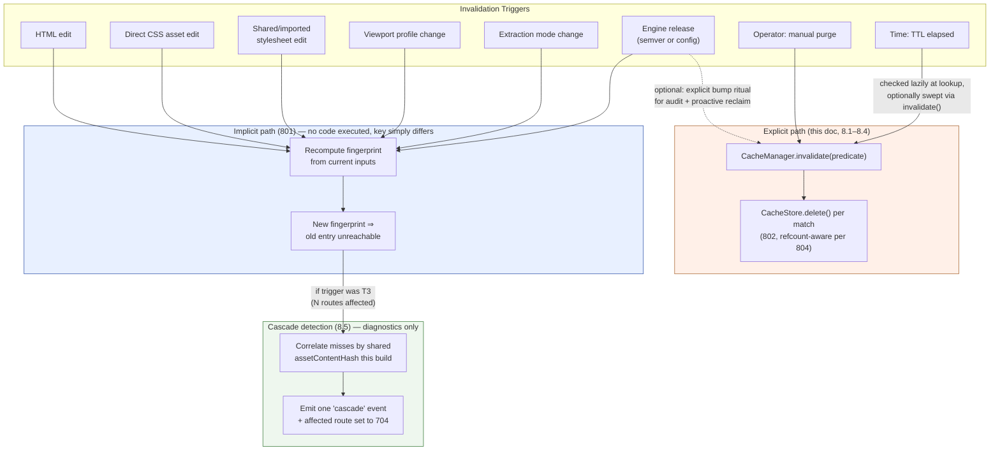
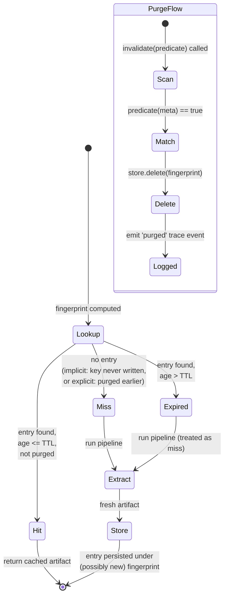

# 805 — Cache Invalidation

## 1. Title

**Critical CSS Extraction Engine — Cache Invalidation: Implicit Fingerprint Invalidation, Explicit Purge, TTL, Engine-Version Busting, and Cascade Invalidation**

## 2. Version

| Field | Value |
|---|---|
| Document Version | 1.0.0 |
| Status | Draft — Phase 10 (Caching) |
| Last Updated | 2026-07-10 |
| Owners | Core Architecture Working Group |
| Stability | The three-way classification of invalidation (implicit / explicit / cascade) and the `InvalidationPredicate` contract (Section 8.1) are stable and are depended on by [802-Cache-Store.md](./802-Cache-Store.md), [803-Route-Cache.md](./803-Route-Cache.md), [804-Viewport-Cache.md](./804-Viewport-Cache.md), and [806-Distributed-Cache.md](./806-Distributed-Cache.md). The specific TTL default and the cascade-detection heuristic in Section 8.5 may be tuned without breaking that contract. |

## 3. Purpose

[800-Cache-Overview.md](./800-Cache-Overview.md) named this document as the owner of "validity & lifetime" — the answer to *how are entries invalidated explicitly and by TTL (REQ-302), and how is every hit/miss/stale made diagnostically visible (Principle 6)*. This document delivers that answer, and it delivers a second, more consequential thesis alongside it: **most invalidation in this system requires no invalidation logic at all**, because the cache key is a fingerprint ([801-Fingerprinting.md](./801-Fingerprinting.md)), and a fingerprint is a content-addressed proof of input equivalence. When an input changes, the fingerprint changes, the old key is simply never looked up again, and the entry it names becomes unreachable — not "invalidated" in the sense of an active operation, but *stranded*, a fact [803-Route-Cache.md](./803-Route-Cache.md) §8.4 already states for route templates and which this document generalizes to the whole cache.

This document therefore does three things:

1. **Names and formalizes implicit invalidation** — the mechanical consequence of content-addressed keying — and argues precisely why it, not any explicit mechanism, is the *default* invalidation path for the overwhelming majority of input changes (HTML edits, CSS edits, viewport changes, mode changes).
2. **Specifies the three forms of explicit control** that remain necessary because implicit invalidation cannot cover them: **manual purge** (an operator or CI step forcibly evicts entries that are still validly keyed, e.g., "clear everything before a security audit"), **TTL expiry** (an entry ages out even though its fingerprint was never recomputed, guarding against unbounded staleness in low-traffic corners of a route manifest), and **engine-version bump** (a deliberate, blanket invalidation of every entry when the engine itself changes how it transforms inputs into output, per [801-Fingerprinting.md](./801-Fingerprinting.md) §8.1.5).
3. **Specifies cascade invalidation** — the case where implicit invalidation is mechanically correct but *operationally invisible* without help: a shared imported stylesheet (a design-token file, a CSS custom-property sheet, a shared component library's stylesheet) changes, and every route that imports it must be treated as changed, even though no individual route's own HTML changed at all. [801-Fingerprinting.md](./801-Fingerprinting.md) §12 already proves this is *sound* (the shared asset's content hash is folded into every dependent route's fingerprint, so every dependent route's fingerprint *does* change). What is missing, and what this document supplies, is the *reporting and re-crawl trigger* layer: knowing that a cascade *happened* (for diagnostics, Principle 6) and knowing *which* routes to re-crawl efficiently (for the CI pipeline, [BRIEF.md](../../BRIEF.md) §2.11), rather than falling back to a blind full-site recrawl.

The governing claim of this document, stated once and defended in Section 7: **fingerprinting converts almost all invalidation from an *active problem* (tracking dependencies, deciding what to bust) into a *passive property* (recompute the key, see if it changed). Explicit invalidation exists only for the residual cases where "the key would still be valid, but we want to force a miss anyway" — TTL, manual purge, and engine upgrades — and cascade invalidation exists only to make an already-correct implicit outcome observable and actionable.**

## 4. Audience

- Implementers of `packages/cache`'s `invalidate(predicate)` method (declared in [800-Cache-Overview.md](./800-Cache-Overview.md) §8.1) and the TTL-checking logic inside `lookup()`.
- Implementers of [802-Cache-Store.md](./802-Cache-Store.md) who must distinguish eviction (capacity-driven, silent) from invalidation (correctness-driven, logged) at the `delete`/`clear` call sites this document drives.
- Implementers of [803-Route-Cache.md](./803-Route-Cache.md) and [804-Viewport-Cache.md](./804-Viewport-Cache.md), who rely on this document's conclusion that a template or profile change invalidates *implicitly* and need the explicit-purge escape hatch only for the residual cases this document names.
- Implementers of the incremental-extraction strategy ([704-Incremental-Extraction.md](./704-Incremental-Extraction.md)) and the CI crawl loop ([BRIEF.md](../../BRIEF.md) §2.11), who consume cascade-invalidation output (the set of affected routes) to drive an efficient re-crawl rather than a full-site one.
- Implementers of [806-Distributed-Cache.md](./806-Distributed-Cache.md), who rely on this document's "content-addressed keys make explicit invalidation largely unnecessary" conclusion to justify a distributed cache with no cross-node coherence protocol.
- Senior reviewers verifying REQ-302 ("explicit + TTL invalidation") is satisfied without smuggling in a dependency-tracking system that the fingerprint design was explicitly meant to avoid.
- Reporter/diagnostics authors who consume the hit/miss/stale/expired/purged trace event vocabulary this document defines (Principle 6).

Readers are assumed to have read [800-Cache-Overview.md](./800-Cache-Overview.md) in full and [801-Fingerprinting.md](./801-Fingerprinting.md) at least through its soundness argument (§8.1) and its shared-asset edge case (§12). This document does not re-derive fingerprint soundness; it relies on it as settled.

## 5. Prerequisites

- [800-Cache-Overview.md](./800-Cache-Overview.md) — the three-way lookup outcome (hit/miss/stale), the `CacheManager.invalidate(predicate)` signature, and Principle 6's "why did/didn't this rerun must always be answerable."
- [801-Fingerprinting.md](./801-Fingerprinting.md) — the fingerprint's soundness/completeness biconditual (§7.1), the five fingerprint inputs (§7.3), and specifically §12's "shared asset changes, HTML unchanged" edge case, which is the seed of this document's cascade-invalidation section.
- [802-Cache-Store.md](./802-Cache-Store.md) — the `CacheStore` interface's `get/set/has/delete/clear/stats` surface, its LRU eviction (§8.5, referenced by [803-Route-Cache.md](./803-Route-Cache.md)), and the eviction/invalidation interplay it names at line ~170 ("eviction is capacity-driven and silent; invalidation is correctness-driven and logged. Both funnel through `delete`").
- [803-Route-Cache.md](./803-Route-Cache.md) §8.4 — the "invalidation invariant" already stated there: a template fingerprint change strands the old `routeKey` with no fan-out deletion required. This document generalizes that specific case.
- [804-Viewport-Cache.md](./804-Viewport-Cache.md) §8 and its refcounting invariant — per-viewport keys and the requirement that deleting one key decrements, not unconditionally deletes, a shared content blob.
- [006-Design-Principles.md](../architecture/006-Design-Principles.md) — Principle 5 (Determinism), Principle 6 (Fail Fast, Fail Loud — the diagnostic-visibility mandate), Principle 8 (Incremental-by-Default Caching).
- [003-Requirements.md](../architecture/003-Requirements.md) — REQ-302 ("explicit + TTL invalidation").
- [BRIEF.md](../../BRIEF.md) §2.8 (Incremental Cache), §2.11 (CI/CD pipeline), §4 (Global Rules).

## 6. Related Documents

- [800-Cache-Overview.md](./800-Cache-Overview.md) — parent module document; the hit/miss/stale outcome vocabulary and the `invalidate()` contract this document fills in.
- [801-Fingerprinting.md](./801-Fingerprinting.md) — the mechanism that makes implicit invalidation possible; the shared-asset edge case this document elaborates into cascade invalidation.
- [802-Cache-Store.md](./802-Cache-Store.md) — the storage layer whose `delete`/`clear` this document's explicit paths call, and whose LRU eviction is a *distinct* mechanism this document is careful not to conflate with invalidation.
- [803-Route-Cache.md](./803-Route-Cache.md) — per-route keying; the origin of the "stranding, not fan-out delete" pattern this document generalizes, and the consumer of this document's cascade output (which route patterns to re-crawl).
- [804-Viewport-Cache.md](./804-Viewport-Cache.md) — per-viewport keying and the refcounted-blob invariant this document's purge and cascade paths must respect.
- [806-Distributed-Cache.md](./806-Distributed-Cache.md) — the distributed backend whose lack of cross-node coherence protocol is justified by this document's "no stale reads under content-addressing" conclusion.
- [704-Incremental-Extraction.md](./704-Incremental-Extraction.md) — the strategy layer that decides, given this document's cascade output, what and in what order to re-crawl.
- [016-Data-Flow.md](../architecture/016-Data-Flow.md) — Stage 12 (Cached Artifact), whose trace events this document's hit/miss/stale/expired/purged vocabulary feeds.
- [006-Design-Principles.md](../architecture/006-Design-Principles.md) — Principle 6, the diagnostic-visibility mandate this document operationalizes throughout.

## 7. Overview

### 7.1 Why "invalidation" is usually the wrong question

Most caching systems treat invalidation as their hardest problem. The canonical formulation — "there are only two hard things in computer science: cache invalidation and naming things" — assumes a cache keyed on something *other than* the content it stores: a route path, a database row ID, an object's identity. Under that kind of key, the cached value can silently drift out of sync with the world, and the system needs an explicit mechanism (a pub/sub invalidation bus, a dependency graph, a version counter) to notice the drift and evict.

This engine's cache is not keyed that way. [801-Fingerprinting.md](./801-Fingerprinting.md) keys every entry on a cryptographic digest of *every input that can affect the output* (HTML, CSS assets, viewport profile, extraction mode, engine version/config). The key **is** a content identity, not a proxy for one. This has a structural consequence worth stating precisely:

> Under content-addressed keying, "the cached value has drifted from what the current inputs would produce" is **not a state the system can be in**. If the inputs are as they were, the fingerprint is as it was, and the stored value — by [801-Fingerprinting.md](./801-Fingerprinting.md)'s soundness invariant — is still exactly what a fresh extraction would produce. If the inputs changed, the fingerprint changed, and the *old* fingerprint's entry is not stale relative to the *new* inputs — it is simply an entry for a *different, no-longer-relevant* key that nobody will look up again.

This is the same reasoning [806-Distributed-Cache.md](./806-Distributed-Cache.md) §7 leans on to justify a distributed cache with zero coherence protocol, and the same reasoning [803-Route-Cache.md](./803-Route-Cache.md) §8.4 already uses locally: "invalidation is a property of the key, not an action on the store." This document's first job is to state that principle at the level of the whole cache (not just the route layer) and derive its consequences precisely.

### 7.2 What is left over: three explicit residuals

If content-addressing dissolves "did the input change" as an invalidation problem, what remains? Exactly three cases, each of which is a case where **the fingerprint is unchanged and the entry is still, by definition, correct — yet the system must serve a miss anyway**:

1. **Manual purge.** An operator wants a fresh extraction *despite* unchanged inputs — for example, to validate that the pipeline's non-cached path still works, to clear a cache believed to be corrupted, or to comply with a data-retention policy ("purge everything older than the last audit"). The fingerprint didn't change; the human's *intent* changed. This requires an explicit `invalidate(predicate)` call (Section 8.2).
2. **TTL expiry.** An entry has not been looked up or re-validated in a long time, and the system wants a bound on how long *any* entry (even one whose fingerprint would still match if recomputed) can be served without a fresh check-in. This exists as a defensive backstop against unknown-unknowns — a fingerprint input the coverage argument in [801-Fingerprinting.md](./801-Fingerprinting.md) §8.1.6 failed to anticipate, an external side channel the engine does not model, or simply organizational policy ("nothing older than 30 days is trusted without re-verification"). This is a *time-driven*, not content-driven, expiry (Section 8.3).
3. **Engine-version bump.** Formally this is *already* implicit — [801-Fingerprinting.md](./801-Fingerprinting.md) §8.1.5 folds `engineVersion` into the fingerprint, so an engine upgrade changes every fingerprint and every entry is implicitly stranded. It is listed here as a *named, first-class* explicit operation anyway (Section 8.4) because operationally a release process wants to *assert* "this deploy invalidates the whole cache" as a deliberate, auditable, loggable act — not rely on the emergent fact that fingerprints happened to change. The mechanism is implicit; the ritual around it is explicit.

Cascade invalidation (Section 8.5) is a fourth topic but is not a fourth *residual* — it is implicit invalidation operating correctly on an input the naive reader might not expect to be "the route's own," namely a shared imported stylesheet. Section 8.5 exists to make that already-correct behavior *visible and actionable*, not to make it *correct* (it already is).

### 7.3 The four-way classification used throughout this document

| Class | Fingerprint changes? | Who decides? | Analogous state | Owning section |
|---|---|---|---|---|
| **Implicit** | Yes — recomputing the fingerprint from current inputs yields a different key | Nobody; it is a mechanical consequence of [801-Fingerprinting.md](./801-Fingerprinting.md) | `Miss` (new key, never seen) | 8.0 |
| **Explicit — purge** | No | An operator / CI step, via `invalidate(predicate)` | `Stale` (deliberately evicted) | 8.2 |
| **Explicit — TTL** | No | The system, via a time comparison at lookup | `Stale` (expired) | 8.3 |
| **Explicit — engine-version bump** | Yes, but the bump is itself the deliberate act | A release process, asserting a blanket bump | `Miss` (new key) formally; treated operationally like a purge | 8.4 |
| **Cascade** | Yes, per-route, but the *trigger* is a shared asset, not the route's own HTML | Nobody for correctness (implicit); the strategy layer for efficient re-crawl scoping | `Miss` (new key) for each affected route | 8.5 |

## 8. Detailed Design

### 8.0 Implicit invalidation: the mechanical baseline

Restating the exact mechanism, so it is precise rather than merely asserted: every extraction's cache key is `fingerprint = computeFingerprint(htmlContent, cssAssets, viewportProfile, extractionMode, engineVersion)` ([801-Fingerprinting.md](./801-Fingerprinting.md) §10.1). On the next build, the orchestrator recomputes this fingerprint from the *current* state of each input. If any input differs from what produced the previous fingerprint, the recomputed fingerprint differs (by [801-Fingerprinting.md](./801-Fingerprinting.md)'s soundness property, applied contrapositively: different output-affecting inputs ⟹, in the overwhelming practical case, a different digest — collision aside, per §8.4's cryptographic argument). `lookup(newFingerprint)` finds nothing, because nothing was ever stored under `newFingerprint`; the old entry, still sitting under `oldFingerprint`, is never consulted again for this route/viewport/mode.

No code path examines "did the HTML change since last time" and decides to delete the old entry. There is no delete call at all on this path. The old entry becomes **unreachable garbage**, and its fate belongs entirely to [802-Cache-Store.md](./802-Cache-Store.md)'s LRU eviction (§8.5 of that document) or, if a store never evicts, it simply persists, harmlessly, forever, until reclaimed. This is the crux of why this document is short on "detection" logic and long on "why detection isn't needed": there is no detection step, only a re-derivation step that already exists as part of computing the cache key in the first place (Section 8.3 of [800-Cache-Overview.md](./800-Cache-Overview.md)).

This is why [803-Route-Cache.md](./803-Route-Cache.md) §8.4 could already state, without needing this document, that "no manual per-URL fan-out deletion is needed." That is not a special property of route keys — it is this document's general baseline, and every sibling's specific case is an instance of it.

### 8.1 The `InvalidationPredicate` contract

[800-Cache-Overview.md](./800-Cache-Overview.md) §8.1 declares `invalidate(predicate: InvalidationPredicate): number` on `CacheManager` without defining `InvalidationPredicate`. This document owns that definition, because every explicit-residual case (Sections 8.2–8.4) is expressed through it:

```
type CacheEntryMeta = {
  fingerprint: string
  createdAtLogical: LogicalTimestamp
  lastAccessedAtLogical: LogicalTimestamp
  engineVersion: string          // semver + ':' + configDigest, per 801 §8.3
  sizeBytes: number
  // route/viewport-scoped keying policies (803, 804) may attach additional
  // metadata (routePattern, viewportProfileId) to the entry envelope; this
  // predicate type is deliberately generic over that extra metadata so 803/804
  // can filter on it without this document depending on their schemas.
  [extra: string]: unknown
}

type InvalidationPredicate = (meta: CacheEntryMeta) => boolean

interface CacheManager {
  invalidate(predicate: InvalidationPredicate): number   // returns count deleted
}
```

`invalidate` iterates `CacheStore.entries()` ([802-Cache-Store.md](./802-Cache-Store.md) §8.2's `stats`/enumeration surface), evaluates `predicate(meta)` per entry, and `delete`s every entry for which it returns `true`, returning the count. This single primitive expresses all three explicit residuals as different predicates:

- **Purge everything:** `() => true`.
- **Purge by namespace/pattern** (route pattern, per [803-Route-Cache.md](./803-Route-Cache.md); viewport-profile prefix, per [804-Viewport-Cache.md](./804-Viewport-Cache.md) §12's `pv:`/`merged:` namespacing): `(meta) => meta.routePattern === '/blog/*'`.
- **TTL sweep:** `(meta) => (now - meta.createdAtLogical) > ttlThreshold` — though in practice TTL is checked lazily at `lookup()` time (Section 8.3) rather than only via a sweep, for reasons given there.
- **Engine-version bump:** `(meta) => meta.engineVersion !== currentEngineVersion` — though again, in practice this predicate is redundant with implicit invalidation (Section 8.4) and its main value is the *audit log entry* the explicit call produces.

Every `invalidate` call, regardless of predicate, emits a `purged` trace event per deleted entry (Section 8.6), distinguishing it from silent LRU eviction ([802-Cache-Store.md](./802-Cache-Store.md)'s "eviction is capacity-driven and silent; invalidation is correctness-driven and logged").

### 8.2 Manual purge

Manual purge is `invalidate(predicate)` invoked directly by an operator (a CLI subcommand, e.g., `critical-css cache purge --route '/blog/*'` or `critical-css cache purge --all`) or by a CI step (e.g., "purge the cache before a scheduled full-fidelity nightly build, to get a clean-room verification run independent of any cache-only defect masking a real regression").

**Why this must exist despite implicit invalidation being sufficient for correctness:** implicit invalidation guarantees a cache *never serves wrong output*. It does not guarantee an operator can force a *fresh computation of currently-correct output* when they have a reason to distrust the pipeline itself — the classic case being "I suspect the cache is masking a serializer nondeterminism bug; let me force real runs and diff them against what the cache claims." A sound cache is not a substitute for the ability to bypass it. Manual purge is exactly the `--no-cache`-adjacent knob generalized to a stored, addressable set of entries rather than a blanket per-run disable already described in [800-Cache-Overview.md](./800-Cache-Overview.md) §12 ("Cache disabled").

**Scoping.** Purge predicates are typically scoped by the metadata [803-Route-Cache.md](./803-Route-Cache.md) and [804-Viewport-Cache.md](./804-Viewport-Cache.md) attach to entries (route pattern, viewport-profile ID, namespace prefix), never by re-deriving a fingerprint — a purge is explicitly a case where the operator does *not* want to reason about fingerprints, only about which visible slice of the cache to clear. This is why `invalidate` takes a predicate over metadata rather than a fingerprint or a list of fingerprints: fingerprints are opaque 64-hex-char strings no operator can usefully type.

**Interaction with refcounted blobs.** Per [804-Viewport-Cache.md](./804-Viewport-Cache.md) §8's invariant, deleting a per-viewport key must decrement, not unconditionally delete, a possibly-shared content blob. `invalidate`'s per-entry `delete` calls go through [802-Cache-Store.md](./802-Cache-Store.md)'s `delete`, which is the single choke point already responsible for honoring that invariant; this document does not re-implement refcounting, it only guarantees that a purge, like any other deletion path, is routed through that one function rather than a bespoke bulk-delete that could bypass it.

### 8.3 TTL expiry

TTL is a coarse, time-based backstop, not a primary correctness mechanism (correctness comes entirely from the fingerprint). It answers a narrower question than "did the input change": *"how long are we willing to trust an entry without any check-in at all, even if nothing detectably changed?"*

**Why TTL is needed given implicit invalidation already guarantees soundness.** [801-Fingerprinting.md](./801-Fingerprinting.md) §8.1.6's coverage argument is a closure argument over *known* output-affecting inputs. It is, by its own admission (§16, "Open question"), not a guarantee against an input the engine's model has not yet accounted for — a browser engine upgrade that changes rendering behavior without a corresponding `engineVersion` bump in this project's own semver (a Playwright/Chromium version drift, per [102-Browser-Pool.md](./102-Browser-Pool.md)), an external resource fetched over the network whose content is not itself hashed as a CSS asset, or simply an organizational policy requirement independent of any technical staleness argument ("nothing in a compliance-relevant cache may be trusted past 30 days without re-verification, full stop"). TTL exists to bound the blast radius of any such unknown-unknown, and to satisfy policy requirements that have nothing to do with technical correctness at all.

**Mechanism.** TTL is checked lazily, at `lookup()` time, not via a separate background sweep as the primary mechanism (though a periodic sweep MAY run via `invalidate` with a TTL predicate, purely to reclaim storage — Section 8.3.2):

```
function lookup(fingerprint, store, ttl, now) -> CacheEntry | null | Stale:
    entry = store.get(fingerprint)
    if entry == null:
        return null                                    // true miss
    age = now - entry.createdAtLogical
    if age > ttl:                                       // strictly greater than
        emitTrace(EXPIRED, fingerprint)
        return Stale                                    // treated as miss for control flow
    emitTrace(HIT, fingerprint)
    return entry
```

**TTL boundary direction.** [800-Cache-Overview.md](./800-Cache-Overview.md) §12 already commits to the inequality direction: "An entry exactly at its TTL edge is treated as stale... TTL is a 'not past' gate, not 'before'." Concretely, `age > ttl` (strict), so an entry is valid through and including the instant `age == ttl` and becomes stale only once `age` strictly exceeds it. This avoids a one-tick flap where an entry created and checked in the same logical instant is spuriously already expired, while still guaranteeing that no entry is trusted indefinitely past the threshold.

**8.3.1 Why lazy-at-lookup rather than eager background sweep as the primary mechanism.** A background sweep that proactively deletes every expired entry the instant it crosses the TTL boundary adds a scheduler, a concurrency surface (a sweep racing a concurrent `store()` for the same key), and a resource cost (waking up periodically to walk potentially the entire store) — all to reclaim storage *slightly* earlier than the lazy check would. Since an expired entry is inert until looked up (it consumes storage but never serves a wrong result — the lazy check always catches it), eager sweeping buys only storage reclamation, not correctness. This document defers eager reclamation entirely to [802-Cache-Store.md](./802-Cache-Store.md)'s LRU eviction, which already reclaims storage under capacity pressure using the entry's `lastAccessedAtLogical` — an expired-but-never-looked-up entry naturally becomes LRU-cold and is evicted by the existing mechanism without new machinery.

**8.3.2 Optional sweep for storage-bound deployments.** A deployment with a hard storage cap and no eviction pressure signal in between builds (an unusual configuration; most deployments rely on [802-Cache-Store.md](./802-Cache-Store.md)'s size-bounded LRU) MAY schedule `invalidate((meta) => (now - meta.createdAtLogical) > ttl)` as a periodic maintenance job. This is explicitly optional and is layered on top of the same `invalidate` primitive from Section 8.1 — it introduces no new mechanism, only a new caller.

**8.3.3 Default TTL value.** A default of 30 days is recommended, chosen to be long enough that a typical CI cadence (daily to hourly builds) never observes TTL expiry as the dominant miss cause — which would defeat the point of caching — while short enough to bound the unknown-unknown blast radius (Section 8.3) to a auditable, human-scale window. The value is configurable per REQ-302 and is itself *not* a fingerprint input (Section 8.6 below explains why: it would make every build cold the instant the TTL config changed, an effectiveness bug with no soundness benefit, since TTL is evaluated at lookup time from stored metadata, not baked into the key).

### 8.4 Engine-version bump

**The mechanism is already implicit.** [801-Fingerprinting.md](./801-Fingerprinting.md) §8.1.5 folds `engineVersion` (semver + config digest) into the composite fingerprint. The instant a release changes that string, every fingerprint computed against the new engine differs from every fingerprint stored under the old one. No entry is examined, no entry is deleted — the entire existing cache becomes implicitly unreachable, exactly as Section 8.0 describes for any other input change. This is, precisely, [800-Cache-Overview.md](./800-Cache-Overview.md) §12's stated edge case: "A new `engineVersion` changes every fingerprint → cold cache by design."

**Why this document still names it as a first-class explicit ritual.** Three reasons, none of which change the underlying mechanism:

1. **Auditability.** A release process wants a loggable, timestamped assertion — "this deploy is known to invalidate the fleet cache" — independent of and prior to observing the emergent miss storm on the next build. `invalidate((meta) => meta.engineVersion !== newEngineVersion)` executed as an explicit release step produces exactly that log entry, even though every one of those entries would also have gone unreached implicitly.
2. **Proactive storage reclamation.** Without an explicit purge, the old entries linger as dead weight until [802-Cache-Store.md](./802-Cache-Store.md)'s LRU naturally reclaims them under capacity pressure. A release step that knows a bump just happened can immediately reclaim that storage rather than waiting for organic eviction — a legitimate optimization, not a correctness need.
3. **Distributed-cache hygiene.** In [806-Distributed-Cache.md](./806-Distributed-Cache.md)'s shared backend, stranded entries under old `engineVersion`s accumulate across every contributing node. An explicit, coordinated purge at release time (rather than per-node organic eviction, which each node performs on its own schedule and its own subset) keeps the shared store's size bounded predictably rather than growing until the *union* of every node's cold data crosses a limit.

**What must NOT happen:** an engine upgrade must never be accompanied by *deleting entries that remain validly keyed under the old engine* if a rollback is possible — that is, a purge tied to a bump should target only truly superseded `engineVersion` strings, never `clear()` the whole store indiscriminately, because a same-day rollback to the prior engine version would otherwise cold-start unnecessarily. The `InvalidationPredicate` for a version bump is therefore always scoped to `engineVersion !== newVersion`, never `() => true`.

### 8.5 Cascade invalidation

This is the most operationally significant residual, because it is the one case that is *already correct by construction* and yet, without this section, easy to mismanage at the CI level.

**The setup.** A shared imported stylesheet — a design-token file (`tokens.css`), a shared component library's base stylesheet, a CSS custom-property sheet consumed via `@import` or a bundler-level shared chunk — is referenced, directly or transitively, by dozens or hundreds of routes. A single edit to that file (a color token changes, a spacing scale shifts) is, from the perspective of any *one* route's own HTML, invisible: the route's HTML did not change. But [801-Fingerprinting.md](./801-Fingerprinting.md) §8.1.2 already establishes that *every referenced CSS asset's content* is a fingerprint input, and §12 states the consequence explicitly: "A change to a shared design-token stylesheet changes the content hash of that asset, which changes the fingerprint of every route that references it — correctly busting all of them."

**Why this is implicit invalidation, not a fourth mechanism.** Every affected route's fingerprint mechanically changes the next time it is computed, by the same content-addressing argument as Section 8.0 — there is no separate "shared-asset-changed" code path, no dependency graph the Cache Manager itself walks. The correctness question is already closed by [801-Fingerprinting.md](./801-Fingerprinting.md); this document does not reopen it.

**What is missing, and what this section supplies.** Correctness alone does not answer two operational questions the CI pipeline needs:

1. **"Why did 200 routes suddenly all miss on this build?"** — a diagnostic question (Principle 6). Without an explicit cascade *report*, an operator sees 200 unrelated-looking cache misses and has to manually correlate them to a single shared-asset edit. This document requires the Cache Manager to detect, at store-time, when a set of misses in the same build share a fingerprint dependency on the same underlying asset content hash, and to emit a single aggregated `cascade` diagnostic event naming the shared asset and the affected route set, rather than 200 independent unexplained `miss` events.
2. **"Which routes need re-crawling, and can we scope the crawl instead of recrawling the entire site?"** — an efficiency question owned jointly with [704-Incremental-Extraction.md](./704-Incremental-Extraction.md) and the route manifest ([803-Route-Cache.md](./803-Route-Cache.md)). Because the Cache Manager itself has no notion of "which routes reference which assets" (that mapping lives in the build's own dependency graph, [014-Dependency-Graph.md](../architecture/014-Dependency-Graph.md), or is reconstructed from the route manifest's asset references), this document's contribution is a **detection primitive**, not a **routing decision**: it flags "these N misses, across this build, correlate with one changed asset-content-hash" so that the strategy layer can act on it (e.g., prioritize recrawling those N routes first, or batch them together for parallelism), rather than leaving 704 to infer the correlation after the fact from raw miss logs.

**Detection mechanism.** Because the fingerprint composition ([801-Fingerprinting.md](./801-Fingerprinting.md) §8.5) already produces a per-asset content hash as an intermediate value (`assetHashes`, sorted by canonical URL, before the final composite hash), the Cache Manager can, at negligible extra cost, retain this intermediate per-asset hash alongside the final fingerprint in a build-scoped (not persisted) side index: `assetContentHash → [fingerprints computed this build that included it]`. When a build's miss set is being assembled, entries whose only differing per-asset hash (relative to the prior known-good fingerprint components, when available) is the *same* single asset are grouped and reported as one cascade event rather than N independent misses. This is a diagnostics-time correlation over already-computed intermediate values — it adds no new hashing, no new fingerprint inputs, and no new soundness surface; it only re-surfaces information [801-Fingerprinting.md](./801-Fingerprinting.md) already computes and would otherwise discard after composing the final key.

**Why not a dependency graph inside the Cache Manager instead.** The alternative — the Cache Manager itself maintaining a live "asset → dependent routes" graph and proactively pushing invalidation notifications when an asset changes — was considered and rejected, for the same reason [800-Cache-Overview.md](./800-Cache-Overview.md) §7.3 rejects blurring the mechanism/policy boundary: a dependency graph is exactly the kind of stateful, route-topology-aware machinery that belongs to the build system and the strategy layer ([014-Dependency-Graph.md](../architecture/014-Dependency-Graph.md), [704-Incremental-Extraction.md](./704-Incremental-Extraction.md)), not to a "dumb," reusable, content-addressed cache. The Cache Manager's cascade contribution is deliberately the minimum viable correlation — grouping already-computed per-asset hashes — not a general dependency-tracking subsystem.

### 8.6 Diagnostic trace vocabulary

Every lookup, purge, and cascade detection emits exactly one of the following trace event kinds (Principle 6: no silent outcome). This vocabulary is the concrete fulfillment of [800-Cache-Overview.md](./800-Cache-Overview.md)'s repeated forward reference to "805 defines the event shape":

```
type CacheTraceEvent =
  | { kind: 'hit',      fingerprint: string, workItem: WorkItemRef }
  | { kind: 'miss',     fingerprint: string, workItem: WorkItemRef, reason: 'cold' }
  | { kind: 'miss',     fingerprint: string, workItem: WorkItemRef, reason: 'expired', ageMs: number }
  | { kind: 'miss',     fingerprint: string, workItem: WorkItemRef, reason: 'disabled' }
  | { kind: 'purged',   fingerprint: string, cause: 'manual' | 'engine-version-bump', operator?: string }
  | { kind: 'cascade',  assetContentHash: string, assetCanonicalUrl: string, affectedFingerprints: string[], affectedWorkItems: WorkItemRef[] }
```

Note that `expired` (TTL, Section 8.3) and `cold` (true implicit miss, Section 8.0) are both surfaced as `miss` for control-flow purposes (extraction always runs on either) but are diagnostically distinct `reason` values — this is the concrete implementation of [800-Cache-Overview.md](./800-Cache-Overview.md) §7.4's "Stale/invalidated... is treated as a miss for control flow... but is diagnostically distinct." `purged` is never emitted for organic LRU eviction ([802-Cache-Store.md](./802-Cache-Store.md)'s eviction remains silent by design, being capacity-driven rather than correctness-driven) — conflating the two in one log stream would make "why did this rerun" investigations noisy with routine, uninteresting capacity churn.

## 9. Architecture

### 9.1 Invalidation triggers and their outcome



The diagram's central point: six of eight triggers (T1–T6) resolve through the implicit path with zero invalidation code executing at all; only T7 and T8 require the explicit `invalidate()` primitive; T6 optionally *also* routes through explicit purge for audit/reclaim reasons even though it is already implicitly handled; and T3 (the shared-asset case) additionally feeds a diagnostics-only correlation step so the already-correct implicit outcome is human-legible.

### 9.2 Lookup-time state view, extended with TTL and purge



`Purged` entries are removed from the store entirely, so a subsequent `Lookup` for that fingerprint (if ever re-issued — e.g., a rollback recomputing the same inputs) resolves to the ordinary `Miss` branch, not a distinct "was purged" state; the distinction between "never existed" and "was purged and removed" matters only for the trace log (Section 8.6), not for lookup control flow.

## 10. Algorithms

### 10.1 Algorithm: `invalidate(predicate)`

**Problem statement.** Given a predicate over cache-entry metadata, delete every matching entry from the store, correctly interacting with refcounted content blobs ([804-Viewport-Cache.md](./804-Viewport-Cache.md)), and emit one diagnostic event per deletion.

**Inputs.** `predicate: InvalidationPredicate`, `store: CacheStore`.

**Outputs.** `count: number` (entries deleted).

**Pseudocode.**
```
function invalidate(predicate, store, cause) -> number:
    count = 0
    for meta in store.entries():                 // O(n) enumeration, 802 §8.2
        if predicate(meta):
            deleted = store.delete(meta.fingerprint)   // refcount-aware, 802/804
            if deleted:
                emitTrace(PURGED, meta.fingerprint, cause)
                count += 1
    return count
```

**Time complexity.** `O(n)` where `n` = total entries in the store, dominated by the enumeration required to evaluate `predicate` against every entry — there is no index structure that lets an arbitrary predicate skip non-matching entries, since the predicate is an opaque function over metadata, not a declarative query the store can plan against. A namespace-prefixed predicate (route pattern, viewport-profile prefix) MAY be optimized to an `O(k)` prefix-scan where `k` is the matching subset, if the store's key layout supports prefix iteration ([802-Cache-Store.md](./802-Cache-Store.md)'s `DiskCacheStore` directory layout is a natural fit for this); this is a store-level optimization opportunity, not a change to this algorithm's contract.

**Memory complexity.** `O(1)` beyond the iterator state; deletions are applied incrementally, not batched into a materialized list first.

**Failure cases.**
- *Predicate throws mid-scan* — the scan MUST fail loudly (Principle 6) and MUST NOT leave a partially-applied purge silently incomplete; implementations should either wrap the whole `invalidate` call in a transaction-like all-or-nothing semantics where the backend supports it, or clearly report the count actually deleted before the throw so partial application is visible, never silent.
- *Concurrent `store()` for a fingerprint being concurrently purged* — the store's `delete` and `set` must be linearizable per key ([802-Cache-Store.md](./802-Cache-Store.md)'s concurrency-safe write contract); a purge racing a fresh store for the *same* fingerprint (only possible if inputs reverted exactly, re-deriving the old key) may leave either "deleted" or "freshly stored," both acceptable outcomes — what is not acceptable is a corrupted partial write.
- *Refcount underflow* on a viewport-shared blob ([804-Viewport-Cache.md](./804-Viewport-Cache.md) §8's invariant) — `store.delete` decrements a refcount rather than unconditionally deleting content; this algorithm calls `delete` exactly once per matched key and relies on the store to honor that invariant, never attempting to manage refcounts itself.

**Optimization opportunities.** Prefix-scoped predicates over a key-namespaced store (route/viewport prefixes, per [804-Viewport-Cache.md](./804-Viewport-Cache.md) §12) reduce the scan to the matching subset; batching deletions into a single backend transaction where the store supports it (relevant mainly for [806-Distributed-Cache.md](./806-Distributed-Cache.md)'s remote backends, where per-call network round-trips dominate).

### 10.2 Algorithm: TTL-gated lookup (restated with explicit complexity)

**Problem statement.** Given a fingerprint, return a valid entry, or signal miss/stale, in a way that never serves an entry older than the configured TTL.

**Inputs.** `fingerprint: string`, `store: CacheStore`, `ttlMs: number`, `now: LogicalTimestamp`.

**Outputs.** `CacheEntry | null | Stale`.

**Pseudocode.** (as in Section 8.3; restated here for the algorithm-section contract)
```
function lookup(fingerprint, store, ttlMs, now) -> CacheEntry | null | Stale:
    entry = store.get(fingerprint)          // O(1) — 802 key-value get
    if entry == null:
        emitTrace(MISS, fingerprint, reason='cold')
        return null
    if (now - entry.createdAtLogical) > ttlMs:
        emitTrace(MISS, fingerprint, reason='expired', ageMs=now-entry.createdAtLogical)
        return Stale
    emitTrace(HIT, fingerprint)
    return entry
```

**Time complexity.** `O(1)` — a single key-value get plus a constant-time comparison, independent of store size. This is deliberately cheaper than the `O(m)` fingerprint computation that produced the key ([801-Fingerprinting.md](./801-Fingerprinting.md) §10.1); TTL gating adds no asymptotic cost to the lookup path.

**Memory complexity.** `O(1)`.

**Failure cases.**
- *Clock skew* between the machine that wrote `createdAtLogical` and the machine performing the lookup (relevant for [806-Distributed-Cache.md](./806-Distributed-Cache.md)'s shared store across CI runners) — TTL tolerates modest skew because, per [802-Cache-Store.md](./802-Cache-Store.md) §11's "clock discipline" note, TTL is "a coarse correctness backstop, not a precise timer"; a few minutes of skew changes when an entry expires by a negligible fraction of a 30-day default window.
- *`createdAtLogical` missing or corrupted* — treated conservatively as already-expired (fail toward re-extraction, never toward serving an unverifiable entry), consistent with [802-Cache-Store.md](./802-Cache-Store.md)'s corrupted-entry-is-a-miss posture.

**Optimization opportunities.** None beyond what is already `O(1)`; the interesting optimization surface is upstream, in avoiding redundant `lookup` calls at all via the strategy layer's batching (704), not in this primitive.

### 10.3 Algorithm: cascade correlation (diagnostics)

**Problem statement.** Given a build's set of miss events, detect and report subsets whose misses are attributable to the same changed shared asset, rather than reporting N unrelated-looking misses.

**Inputs.** `missEvents: MissEvent[]` (each carrying the per-asset hash list computed during fingerprinting, per [801-Fingerprinting.md](./801-Fingerprinting.md) §8.5's `assetHashes`), `priorAssetHashes: Map<canonicalUrl, hash>` (from the previous build's recorded fingerprint components, if available).

**Outputs.** Zero or more `CascadeEvent`s, plus the residual set of misses not attributable to any single shared asset (ordinary independent misses, reported individually as before).

**Pseudocode.**
```
function correlateCascades(missEvents, priorAssetHashes) -> CascadeEvent[]:
    changedAssetGroups = groupBy(missEvents, event =>
        // the set of asset canonical URLs whose hash differs from priorAssetHashes
        event.assetHashes.filter(a => priorAssetHashes.get(a.url) != a.hash)
                         .map(a => a.url)
    )
    cascades = []
    for (changedUrlSet, group) in changedAssetGroups:
        if len(changedUrlSet) == 1 and len(group) > cascadeThreshold:
            // many routes, one single differing asset ⇒ report as one cascade
            cascades.append({
                assetCanonicalUrl: changedUrlSet[0],
                affectedFingerprints: group.map(e => e.fingerprint),
                affectedWorkItems: group.map(e => e.workItem)
            })
            markReported(group)
    return cascades
    // misses not marked reported fall through to ordinary per-fingerprint
    // 'miss' trace events, unchanged from Section 8.6
```

**Time complexity.** `O(n · a)` where `n` = number of misses in the build and `a` = average asset count per route (typically small, single digits to low tens); the grouping key construction dominates. This is a one-time, end-of-build diagnostics pass, not a per-lookup cost, and runs off the critical path of any individual extraction.

**Memory complexity.** `O(n · a)` for the grouping structure, released after the build's diagnostic report is emitted.

**Failure cases.**
- *No prior build's asset hashes available* (first build, or prior metadata lost) — correlation degrades gracefully to "no cascades detected, all misses reported individually," which is exactly the pre-cascade-detection behavior; this is a diagnostics-quality degradation, never a correctness one.
- *`cascadeThreshold` too low* — over-reports small, coincidental groupings as false "cascades," adding noise; too high — under-reports genuine cascades as scattered individual misses. The threshold is a tunable diagnostics parameter (Section 16), not a correctness parameter, so miscalibration costs signal quality, not soundness.

**Optimization opportunities.** Precomputing and persisting per-asset hashes from the prior build (rather than recomputing `priorAssetHashes` from scratch) turns this into an incremental diff rather than a full pass; sharing this computation with [704-Incremental-Extraction.md](./704-Incremental-Extraction.md)'s own batching so the correlation and the re-crawl scheduling are one pass, not two.

## 11. Implementation Notes

- **`invalidate` must never be the only path a route's stale entry can be removed through.** If it were, every input change would require someone to remember to call it — exactly the dependency-tracking burden content-addressing exists to avoid. Implicit invalidation (Section 8.0) must remain the default; `invalidate` is strictly an *additional*, opt-in tool for the three named residuals.
- **TTL metadata (`createdAtLogical`) lives in the envelope, never the fingerprinted payload**, per [800-Cache-Overview.md](./800-Cache-Overview.md) §11's explicit rule — restated here because this document is the primary consumer of that field and a careless implementation could be tempted to fold it into the hashed content for "simplicity," which would make every entry a one-time-use artifact (a timestamp changes every build) and silently defeat caching entirely.
- **Engine-version-bump purges must scope by `engineVersion !=` the new version, never `clear()` unconditionally**, to preserve rollback safety (Section 8.4).
- **Cascade correlation is diagnostics-only and must never gate control flow.** Whether or not a set of misses is successfully correlated into a cascade report, every individual miss still runs its own extraction and stores its own entry exactly as Section 8.0 describes; correlation changes what is *logged*, never what is *executed*. A bug in the correlator must never be able to skip an extraction or serve a wrong artifact.
- **`invalidate`'s predicate must be pure and side-effect-free** with respect to anything other than reading `CacheEntryMeta` — it runs once per entry during a scan and must not, for instance, perform network calls per entry (that cost belongs in the store's bulk-delete path if a remote backend batches it, not in the predicate).
- **Purge and TTL both funnel through the same `CacheStore.delete`** that implicit staleness relies on for reclamation via LRU — there is exactly one deletion code path in the whole system ([802-Cache-Store.md](./802-Cache-Store.md)'s `delete`), invoked by three different callers (LRU eviction, `invalidate`, and — indirectly, never directly — nothing else, since implicit invalidation never calls `delete` at all, per Section 8.0).

## 12. Edge Cases

- **A purge predicate matches zero entries.** `invalidate` returns `0` and emits no `purged` events; this is not an error, but implementations should still log the *attempt* (predicate description, zero matched) so an operator who expected a purge to do something can see it ran, distinct from silence that could be mistaken for the call not having executed at all.
- **Rollback after an engine-version bump.** Rolling back to the prior engine version recomputes the prior fingerprints; if those entries were not purged (only the newer version's entries were, per Section 8.4's scoping rule), the rollback build serves hits immediately — this is the reason the bump-purge predicate must scope to the *new* version rather than clearing indiscriminately.
- **TTL and engine-version bump interacting.** An entry that would still be within TTL is nonetheless made unreachable by an engine-version bump (implicit) — the two mechanisms are independent axes and either can "invalidate" first; there is no ordering dependency between them because both ultimately resolve to "this specific key is either present-and-valid or it isn't."
- **Cascade threshold at the boundary** (`len(group) == cascadeThreshold` exactly) — treated as *not yet a cascade* (`>` not `>=`), by the same "prefer under-reporting to over-reporting noise at exact boundaries" reasoning as [800-Cache-Overview.md](./800-Cache-Overview.md)'s TTL boundary discussion, though here the stakes are diagnostic quality, not correctness.
- **A shared asset changes back to its previous content within the same build cycle** (e.g., a revert commits before any crawl observed the intermediate state) — the fingerprint returns to its previous value, the previously-stranded entry becomes reachable again, and it is served as an ordinary hit. Nothing needs to "un-invalidate" it; implicit invalidation has no notion of a one-way ratchet, entries are addressed by content, not by a monotonic version counter.
- **Two unrelated shared assets change in the same build.** Cascade correlation (Section 10.3) groups by the *set* of differing asset URLs per miss; routes referencing only asset A group separately from routes referencing only asset B, and routes referencing both (if any) form their own group — the grouping key is the exact changed-URL set, not a single asset, so multi-asset cascades are still correctly partitioned rather than merged into one misleading report.
- **Purge racing implicit invalidation for the same conceptual entry.** An operator purges a fingerprint at the same moment its inputs change and the orchestrator is about to compute a new fingerprint for the same route — these operate on different keys (old vs. new fingerprint) and cannot conflict; there is no shared mutable state between "delete the old key" and "compute and eventually store the new key."
- **A cascade-detected shared asset is itself served from a distributed cache node that has not yet observed the asset's new content** ([806-Distributed-Cache.md](./806-Distributed-Cache.md)) — this is not a cache-invalidation problem but an asset-fetch/build-input problem upstream of fingerprinting; the fingerprint is only ever as fresh as the asset content the orchestrator hands it, and stale asset fetching is out of this document's scope (it would be an input-acquisition defect, not an invalidation defect).

## 13. Tradeoffs

| Decision | Why | Alternative | Tradeoff accepted |
|---|---|---|---|
| Implicit invalidation as the default, explicit as residual-only | Content-addressing already guarantees soundness; avoids building a dependency-tracking subsystem the fingerprint makes unnecessary | An active dependency graph inside the Cache Manager that pushes invalidations | None functionally lost for correctness; the residual explicit paths exist only for intent/policy/audit reasons, not to patch a soundness gap |
| TTL checked lazily at lookup, not via mandatory eager sweep | Zero added scheduling/concurrency surface; an unreached expired entry is inert, not wrong | Background sweep deletes expired entries proactively | Expired-but-unreached entries linger in storage until LRU reclaims them or an optional sweep runs; accepted because storage, not correctness, is the only cost |
| Engine-version bump purge scoped to old version only, never `clear()` | Preserves same-day rollback safety | Unconditional full-store clear on every release | Old-version entries not explicitly purged persist until LRU reclaims them; a minor storage cost for meaningful rollback safety |
| Cascade detection as a diagnostics-only correlation, not a dependency graph | Keeps the Cache Manager a "dumb," reusable mechanism (Section 7.3 of [800-Cache-Overview.md](./800-Cache-Overview.md)); reuses fingerprint intermediates already computed | A first-class asset→route dependency graph inside `packages/cache` | Cascade grouping is heuristic (threshold-based) and can under/over-report at the margins; correctness is unaffected either way since implicit invalidation already handled every affected route regardless of whether it is grouped into a report |
| `InvalidationPredicate` over metadata, not fingerprints or route strings | One primitive expresses purge-all, purge-by-namespace, and TTL-sweep uniformly | Separate `purgeAll()`, `purgeByRoute()`, `purgeByTTL()` methods | Predicate evaluation is `O(n)` full-scan unless the store offers a prefix-scan optimization; accepted for the uniform, composable surface |
| `purged` events distinct from silent LRU eviction | Principle 6: correctness-driven removals must be loggable; capacity-driven ones would be noise if logged identically | Log every deletion, eviction included, identically | Requires the store and the invalidation layer to agree on a `cause` tag at every `delete` call site; a small bookkeeping discipline for a large diagnostic-clarity gain |

## 14. Performance

- **CPU.** The dominant-path lookup (Section 10.2) is `O(1)`, unaffected by TTL or invalidation machinery. `invalidate` is `O(n)` in the worst case (full scan), reducible to `O(k)` (matching subset) with namespace-prefixed storage layouts. Cascade correlation is an `O(n·a)` end-of-build pass, off the per-lookup critical path entirely.
- **Memory.** `O(1)` per lookup; `O(1)` incremental during a purge scan; `O(n·a)` transient during cascade correlation, released after the build's diagnostic report.
- **Caching strategy (meta).** Invalidation itself introduces no additional cache — it is the mechanism that *bounds* the primary cache's staleness and size, not a cached computation of its own, except insofar as the optional TTL-sweep (Section 8.3.2) is itself a periodic, low-frequency job rather than a per-lookup cost.
- **Parallelization.** `invalidate` scans are embarrassingly parallel across independent store partitions (route/viewport namespaces) if the backend supports partitioned iteration; cascade correlation's per-miss-event grouping is a standard parallel group-by, safely shardable across worker threads for large builds.
- **Incremental execution.** This document's entire purpose *is* incremental execution's safety valve — implicit invalidation is what lets incremental caching (Principle 8) be trusted at all, and the explicit residuals exist precisely to bound the cases where "nothing detectably changed" still shouldn't mean "trust forever."
- **Scalability limits.** `invalidate`'s full-scan worst case is the practical ceiling for very large stores without prefix-partitioned layouts; for fleets at [806-Distributed-Cache.md](./806-Distributed-Cache.md) scale, unscoped full-store purges should be avoided in favor of namespace-scoped or version-scoped predicates, which is why Section 8.4 insists on scoped, not blanket, engine-version purges.

## 15. Testing

- **Unit tests.**
  - Implicit path: two `FingerprintInput`s differing only in HTML produce different fingerprints; `lookup` on the new fingerprint returns `null` (miss), never a stale hit of the old entry — this is really a [801-Fingerprinting.md](./801-Fingerprinting.md) property but is re-verified here at the `lookup` boundary.
  - TTL: an entry with `age == ttl` is a hit; `age == ttl + 1` is `Stale`/miss-with-`reason=expired` (boundary test for the strict-`>` rule, Section 8.3).
  - `invalidate(() => true)` deletes every entry and returns the total count; `invalidate` with a namespace predicate deletes only the matching subset and leaves others intact.
  - `invalidate` on a refcounted per-viewport key decrements rather than deletes a shared blob still referenced elsewhere ([804-Viewport-Cache.md](./804-Viewport-Cache.md) invariant), verified via a fake store that asserts refcount arithmetic.
  - Every `purged` deletion emits exactly one trace event with the correct `cause`; LRU-evicted entries (simulated via a capacity-bound fake store) emit no `purged` event.
- **Integration tests.**
  - Engine-version bump: bump `engineVersion`, rerun the same work items — assert every one is a `miss` (`reason='cold'`, since the key is genuinely new), and assert an explicit scoped purge afterward deletes exactly the old-version entries and none of the new ones.
  - Cascade: three routes reference a shared `tokens.css`; edit the file; rerun all three plus one unrelated route — assert a single `cascade` event names `tokens.css` and lists the three affected routes, and the unrelated route's miss (if any, e.g. its own HTML also changed) is reported independently, not folded into the cascade.
  - Manual purge mid-build does not corrupt an in-flight `store()` for the same fingerprint from a concurrent worker (race test against [802-Cache-Store.md](./802-Cache-Store.md)'s concurrency contract).
- **Regression tests.**
  - Golden cascade report for a fixed fixture (N routes, one shared asset, one edit) — the affected-route set and correlation grouping are pinned so an accidental change to the grouping heuristic (Section 10.3) is caught.
- **Stress tests.**
  - `invalidate` over a store with 10^5+ entries, measuring scan time with and without namespace-prefix optimization, to validate the `O(n)` vs `O(k)` claim.
  - Cascade correlation over a build with a very high fan-out shared asset (thousands of dependent routes) to validate the `O(n·a)` grouping stays within acceptable end-of-build reporting latency.
- **Cross-references.** These tests assume [801-Fingerprinting.md](./801-Fingerprinting.md)'s determinism and sensitivity property tests already pass; a nondeterministic fingerprint would make "implicit invalidation" tests flaky in a way that is actually a fingerprinting defect, not an invalidation defect — see that document's Section 15 note on the same dependency, mirrored here.

## 16. Future Work

- **Persisted cross-build asset-hash history** so cascade correlation (Section 10.3) never degrades to "no prior data" on cold diagnostic state, and so `priorAssetHashes` survives across CI runner churn without depending on runner-local disk persistence — likely stored alongside the distributed cache metadata in [806-Distributed-Cache.md](./806-Distributed-Cache.md)'s backend.
- **Configurable, per-namespace TTLs** (a shorter TTL for rapidly-changing marketing routes, a longer one for stable legal/compliance pages) rather than one global default — deferred until real hit-rate data justifies the added configuration surface.
- **Automatic re-crawl scheduling from cascade reports**, closing the loop from "cascade detected" directly into [704-Incremental-Extraction.md](./704-Incremental-Extraction.md)'s prioritized work queue rather than requiring a human or a separate CI step to consume the report — currently the report is informational; making it actionable is a natural next RFC once cascade reporting has run in production long enough to validate the grouping heuristic's accuracy.
- **Negative-cache-aware purge**: if negative caching (failed extractions, per [800-Cache-Overview.md](./800-Cache-Overview.md) §16's Future Work) is ever implemented, its invalidation semantics need their own predicate class here — a failed-extraction entry likely wants a much shorter TTL than a successful one, since a transient failure should not be trusted for 30 days.
- **Cascade-aware CI cost estimation**: reporting not just "these routes are affected" but an estimated recompute cost for the affected set, to help CI schedulers decide whether to run the cascade's affected routes inline or defer them to a batched off-peak recrawl.
- **Open question:** should the engine ever support a *partial* engine-version bump — e.g., a serializer-only change that provably cannot affect selector-matching output — with a finer-grained fingerprint component than one monolithic `engineVersion` string, so that a serializer patch doesn't cold the entire cache? This trades fingerprint-composition complexity ([801-Fingerprinting.md](./801-Fingerprinting.md) §8.5) for hit-rate preservation across narrowly-scoped releases, and is deferred pending evidence that whole-cache busting on every release is a real operational pain point rather than a theoretical one.

## 17. References

- [800-Cache-Overview.md](./800-Cache-Overview.md) — hit/miss/stale outcome vocabulary, `CacheManager.invalidate` signature, mechanism/policy boundary.
- [801-Fingerprinting.md](./801-Fingerprinting.md) — the fingerprint algorithm that makes implicit invalidation sound; §8.1.5 (engine version), §12 (shared-asset cascade seed), §8.5 (per-asset hash intermediates this document's cascade correlation reuses).
- [802-Cache-Store.md](./802-Cache-Store.md) — `CacheStore` interface, `delete`/`clear`, LRU eviction vs. invalidation distinction, concurrency-safe writes.
- [803-Route-Cache.md](./803-Route-Cache.md) — route-level "stranding, not fan-out delete" pattern this document generalizes; cascade output consumer.
- [804-Viewport-Cache.md](./804-Viewport-Cache.md) — refcounted content blobs; namespace-scoped purge targets.
- [806-Distributed-Cache.md](./806-Distributed-Cache.md) — distributed backend relying on this document's "no stale reads under content-addressing" conclusion.
- [704-Incremental-Extraction.md](./704-Incremental-Extraction.md) — the strategy layer consuming cascade reports for re-crawl scheduling.
- [016-Data-Flow.md](../architecture/016-Data-Flow.md) — Stage 12 cached-artifact data mapping; trace event consumption by the Reporter.
- [006-Design-Principles.md](../architecture/006-Design-Principles.md) — Principle 5 (Determinism), Principle 6 (Fail Fast, Fail Loud), Principle 8 (Incremental-by-Default Caching).
- [003-Requirements.md](../architecture/003-Requirements.md) — REQ-302 (explicit + TTL invalidation).
- [BRIEF.md](../../BRIEF.md) — §2.8 (Incremental Cache), §2.11 (CI/CD pipeline), §4 (Global Rules).
