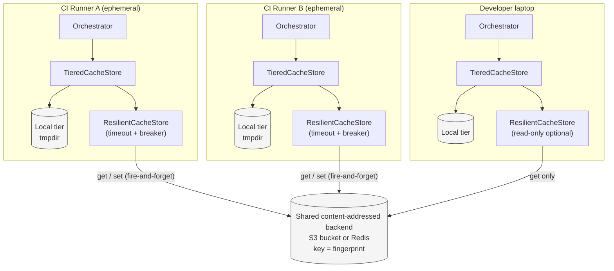
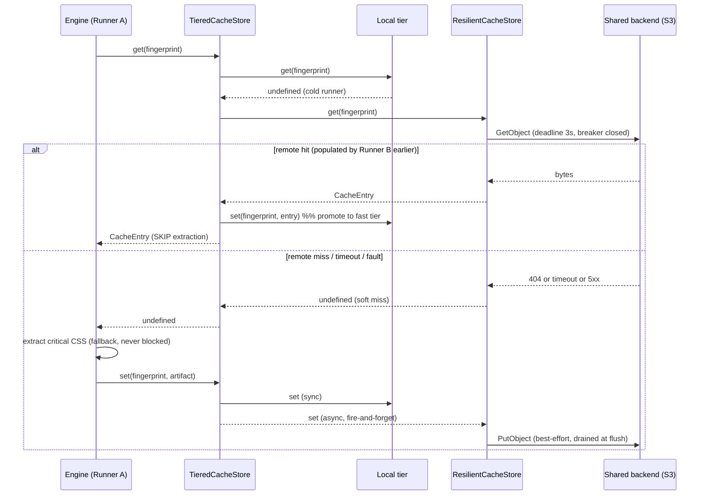
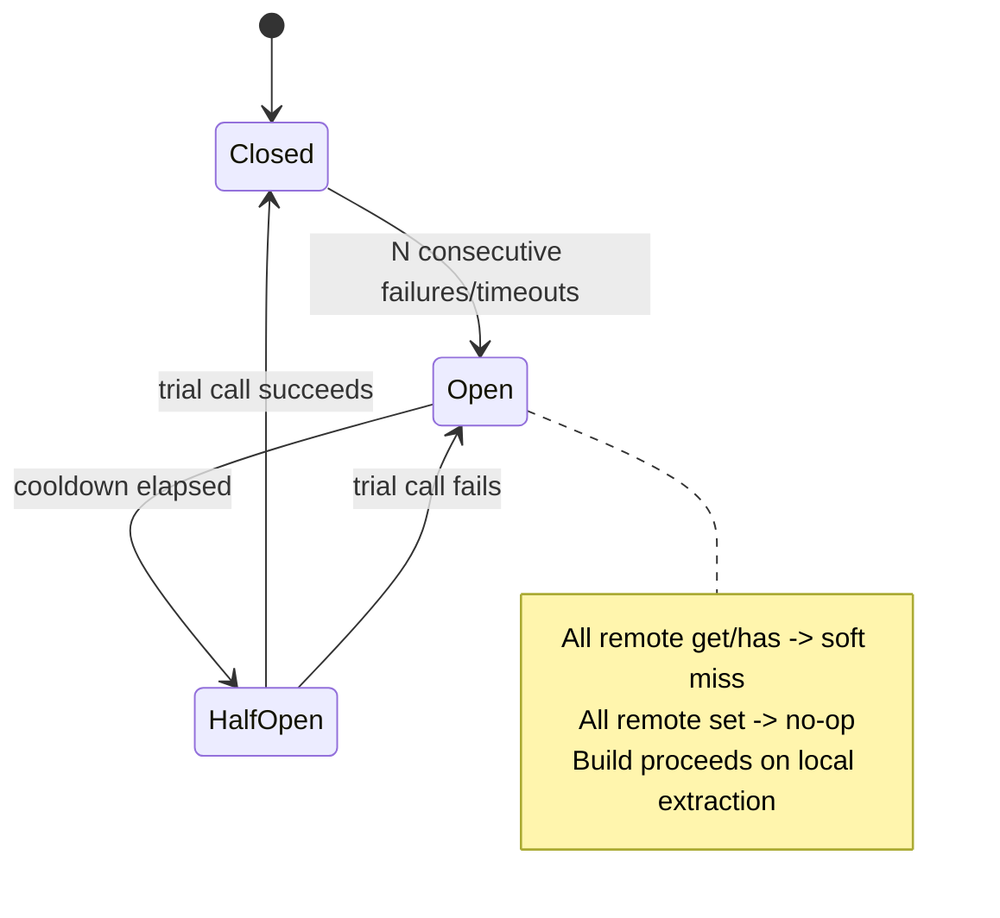

# 806 — Distributed Cache

## 1. Title

**Critical CSS Extraction Engine — Distributed / Shared Cache: Remote Content-Addressed Cache Backend for CI and Multi-Machine Builds**

## 2. Version

| Field | Value |
|---|---|
| Document Version | 1.0.0 |
| Status | Draft — Phase 10 (Caching) |
| Last Updated | 2026-07-09 |
| Owners | Core Architecture Working Group |
| Stability | The store-interface contract this document layers onto (from [802-Cache-Store.md](../design/802-Cache-Store.md)) is stable; the concrete remote backends (S3, Redis) described here are pluggable and may be added, removed, or reconfigured without invalidating this document's read-through / write-back protocol or its network-failure fallback contract |

## 3. Purpose

The incremental cache described in [800-Cache-Overview.md](../design/800-Cache-Overview.md) and keyed by the fingerprint algorithm of [801-Fingerprinting.md](../design/801-Fingerprinting.md) is, in its base form, a **local** cache: a fingerprint computed during an extraction run is looked up in, and written to, a store that lives on the same machine as the extraction process. That model is sufficient for a developer's laptop, where the same machine that computes a fingerprint is the machine that would benefit from a hit. It is **structurally unable** to serve the primary economic motivation for caching, which is the CI/CD pipeline of [BRIEF.md](../../BRIEF.md) Section 2.11: in CI, the machine that computes a fingerprint (an ephemeral runner spun up for one job) is almost never the machine that populated the cache on a previous run (a different ephemeral runner, already destroyed). A local cache in CI is a cache that is cold on every single run.

This document specifies the **distributed cache**: a remote, shared cache backend that sits *behind* the store interface defined in [802-Cache-Store.md](../design/802-Cache-Store.md), so that a fingerprint computed on one machine — a CI runner, a developer's laptop, a build farm node — can be satisfied by a cache entry that was populated by a *different* machine. Concretely, it answers four questions precisely:

1. **How does a remote backend implement the same `CacheStore` interface** as the local backend, so that the rest of the engine (the orchestrator, the CI harness, the SSR adapters) is entirely unaware of whether a hit came from local disk or from an object store three availability zones away?
2. **Why is sharing a content-addressed cache safe** without any of the distributed-systems machinery (locks, leases, quorum, consensus) that shared mutable caches require — and where the boundaries of that safety lie.
3. **How the read-through / write-back layering** composes a fast local tier with a slow shared tier, and what the exact ordering, population, and promotion semantics are.
4. **How network failure is contained** so that a slow, unreachable, throttled, or misconfigured remote backend can *never* block, fail, or even measurably slow a build — the remote cache is a pure accelerator whose worst-case behavior is "no faster than no cache at all."

This document is the connective tissue between the store abstraction ([802-Cache-Store.md](../design/802-Cache-Store.md)) and the CI workflow ([BRIEF.md](../../BRIEF.md) §2.11). It does not redefine what a fingerprint is (that is [801-Fingerprinting.md](../design/801-Fingerprinting.md)) nor what is stored under a fingerprint (that is [800-Cache-Overview.md](../design/800-Cache-Overview.md) and [802-Cache-Store.md](../design/802-Cache-Store.md)); it specifies the *distribution* of that store.

## 4. Audience

- Implementers of `packages/cache`'s remote backend adapters (`S3CacheStore`, `RedisCacheStore`) and the `TieredCacheStore` composition layer, who will write the code this document specifies.
- Authors of the CI harness ([BRIEF.md](../../BRIEF.md) §2.11) who must wire cache credentials, scoping keys, and fallback behavior into build pipelines.
- SRE / platform engineers who provision the object store or KV cluster, set retention/lifecycle policies, and reason about the security posture of a shared artifact cache.
- Senior engineers reviewing the fallback-never-blocks-the-build guarantee for correctness, since a violation of that guarantee turns a performance optimization into an availability liability.
- QA engineers writing fault-injection tests (latency, throttling, partial reads, corruption) against the remote backend.

Readers are assumed to have read [802-Cache-Store.md](../design/802-Cache-Store.md) in full and to understand the `CacheStore` interface, the `CacheKey`/`CacheEntry` DTOs, and the store's serialization contract. This document builds the distribution layer directly on top of that vocabulary and does not restate it.

## 5. Prerequisites

- [800-Cache-Overview.md](../design/800-Cache-Overview.md) — the cache subsystem's purpose, what a cache entry contains (the serialized critical-CSS artifact plus its metadata), and the hit/miss lifecycle.
- [801-Fingerprinting.md](../design/801-Fingerprinting.md) — the fingerprint algorithm: what inputs (HTML, CSS assets, viewport, extraction mode) are hashed and why the fingerprint is a *content-addressed* key. This is the single most load-bearing prerequisite for this document's consistency argument.
- [802-Cache-Store.md](../design/802-Cache-Store.md) — the `CacheStore` interface (`get`, `set`, `has`, `delete`), the key/value DTO shapes, and the local backend. This document adds remote backends and a tiered composition behind that same interface.
- [805-Cache-Invalidation.md](../design/805-Cache-Invalidation.md) — the invalidation model. Critically, this document relies on 805's conclusion that *content-addressed keys make explicit invalidation largely unnecessary* — a changed input yields a new fingerprint, so stale reads are structurally impossible. The distributed cache inherits that property.
- [BRIEF.md](../../BRIEF.md) §2.8 (Incremental Cache), §2.11 (CI/CD Pipeline), §2.14 (Performance Optimizations), §2.17 (Roadmap Phase 5 — Distributed crawler).
- Working familiarity with object-store semantics (S3 `GetObject`/`PutObject`, eventual vs. read-after-write consistency) and KV-store semantics (Redis `GET`/`SETEX`, TTL, eviction policies).

## 6. Related Documents

- [800-Cache-Overview.md](../design/800-Cache-Overview.md) — cache subsystem overview and lifecycle.
- [801-Fingerprinting.md](../design/801-Fingerprinting.md) — fingerprint (cache key) computation; the source of content-addressing.
- [802-Cache-Store.md](../design/802-Cache-Store.md) — the `CacheStore` interface this document's backends implement, and the local backend they compose with.
- [805-Cache-Invalidation.md](../design/805-Cache-Invalidation.md) — invalidation model; the basis for the "no stale reads" argument reused here.
- [BRIEF.md](../../BRIEF.md) — §2.8, §2.11, §2.14, §2.17.

## 7. Overview

A cache is a map from keys to values. What makes distributing a cache hard, in the general case, is that the values are *mutable*: two writers can disagree about the value for a key, so you need a protocol (locking, leader election, last-writer-wins with vector clocks, quorum reads) to decide who wins and when readers see it. The central observation of this document — inherited from [801-Fingerprinting.md](../design/801-Fingerprinting.md) and [805-Cache-Invalidation.md](../design/805-Cache-Invalidation.md) — is that **this cache is not mutable in that sense**. The key *is* a cryptographic digest of the inputs, and the value is a deterministic function of exactly those inputs (the critical-CSS extraction is deterministic per [BRIEF.md](../../BRIEF.md) §2.18 acceptance criteria). Therefore:

> For a given key K, *every* correct producer computes the *same* value V. Two writers cannot disagree. A reader who observes V-from-runner-A and a reader who observes V-from-runner-B observe byte-identical artifacts.

This is the defining property of a **content-addressed store** (the same property that makes Git object stores, Nix binary caches, and Bazel remote caches safe to share). It collapses the entire distributed-cache consistency problem into a non-problem: there is no coherence to maintain because there is no disagreement to resolve. All the machinery this document *does* need is therefore not about correctness but about **performance layering** (fast local tier in front of slow shared tier) and **failure containment** (a shared tier that is remote can be slow or absent, and the build must not care).

The distributed cache is realized as three cooperating pieces, all implementing or composing the `CacheStore` interface from [802-Cache-Store.md](../design/802-Cache-Store.md):

- **A remote backend** — one of `S3CacheStore` (object store; the recommended default for CI because it is cheap, durable, and needs no always-on server) or `RedisCacheStore` (KV store; lower latency, useful when a shared Redis already exists). Both implement `CacheStore` and speak only in terms of the fingerprint key and the serialized artifact blob.
- **A tiered composer** — `TieredCacheStore`, which wraps an ordered list of tiers (typically `[LocalCacheStore, RemoteCacheStore]`) and implements read-through and write-back across them.
- **A failure guard** — a decorator (`ResilientCacheStore`, or an option on the tiered composer) that wraps every remote call in a timeout + circuit breaker, translating any remote fault into a *soft miss* (behaves as though the key was absent) so that control flow always continues to local extraction.

The rest of the pipeline is unchanged. The orchestrator asks the injected `CacheStore` for `get(fingerprint)`; if it gets a value it uses it; if it gets nothing it extracts and calls `set(fingerprint, artifact)`. It never learns whether the store it holds is local, remote, or tiered.

## 8. Detailed Design

### 8.1 The store interface (recap of the contract from 802)

From [802-Cache-Store.md](../design/802-Cache-Store.md), the interface every backend in this document conforms to:

```typescript
interface CacheStore {
  get(key: CacheKey): Promise<CacheEntry | undefined>;
  set(key: CacheKey, entry: CacheEntry, opts?: SetOptions): Promise<void>;
  has(key: CacheKey): Promise<boolean>;
  delete(key: CacheKey): Promise<void>;
}

type CacheKey = string;                 // the hex fingerprint from 801
interface CacheEntry {
  artifact: Uint8Array;                 // serialized critical-CSS payload
  meta: CacheEntryMeta;                 // size, createdAt, engineVersion, sourceRoutes...
}
interface SetOptions { ttlSeconds?: number; }
```

The distributed cache adds **no new methods**. This is deliberate (Why: keeping the surface identical is what lets the orchestrator remain oblivious; Alternative: a richer interface with `getRemote`/`getLocal` explicit tiers — rejected because it leaks the topology into every caller; Tradeoff: the tiered store must express promotion internally rather than letting callers orchestrate it).

### 8.2 `S3CacheStore` (object-store backend)

Keys map to object paths under a configured prefix: `s3://<bucket>/<prefix>/<key[0:2]>/<key>`. The two-character shard prefix (`key[0:2]`) mirrors Git's fan-out and avoids hot-partition issues in stores that key-range-partition; it is cosmetic for S3 but harmless and useful for filesystem-backed S3-compatible stores (MinIO on ext4).

- `get` → `GetObject`. A `404 NoSuchKey` is a **miss** (returns `undefined`), not an error. Any other error is surfaced to the resilience layer (§8.4).
- `set` → `PutObject` with the serialized `CacheEntry`. Metadata is stored as object metadata headers *and* embedded in the blob (self-describing), so a blob is verifiable without a separate metadata round-trip. Writes are idempotent: because the key is content-addressed, re-`PutObject`-ing the same key with the same bytes is a no-op semantically (Why this matters: two runners racing to populate the same key is fine — they write identical bytes).
- `has` → `HeadObject`.
- TTL is *not* enforced by the client; it is delegated to an S3 **lifecycle policy** (e.g., expire objects older than N days), because object stores do not offer per-object TTL and doing it client-side would require a scan.

Why S3 as the default: it needs no always-on service, is effectively infinitely durable, is pay-per-use (ideal for spiky CI load), and its read-after-write consistency for new objects (guaranteed by AWS S3 since 2020) is exactly the semantic a content-addressed cache wants. Alternatives considered: a dedicated cache server (rejected — an operational burden and a single point of failure for something that must degrade gracefully anyway); a git-lfs-style store (rejected — couples cache to VCS). Tradeoff: per-object GET latency (tens of ms) is higher than a local disk read (sub-ms), which is precisely why a local tier sits in front (§8.3).

### 8.3 `RedisCacheStore` (KV backend)

For deployments that already run a shared Redis (or a managed equivalent) and want lower tail latency than an object store, `RedisCacheStore` maps `key → value` with `GET`/`SETEX`. Native per-key TTL (`SETEX`) is used directly. The artifact blob is stored as a binary string value; keys are namespaced `ccss:<scope>:<key>` (§8.5). Large artifacts (rare — critical CSS is small, typically < 100 KB) are still well within Redis value-size comfort, but a `maxArtifactBytes` guard rejects pathological blobs to protect the shared cluster.

Why offer Redis at all if S3 is the default: some organizations forbid new object-store buckets but already operate Redis; latency-sensitive local build farms benefit from single-digit-ms lookups. Tradeoff: Redis is an always-on service (an availability dependency), it is memory-bound (eviction under pressure can silently drop entries — acceptable for a cache, since a dropped entry is just a future miss), and it lacks the durability of an object store.

### 8.4 `ResilientCacheStore` — the failure guard (the load-bearing safety property)

This is the most important component in the document. It decorates any `CacheStore` (in practice, the remote one) and enforces the invariant:

> **No remote-cache operation may ever block, fail, or delay the build. Every remote fault degrades to a soft miss (`get`) or a fire-and-forget drop (`set`).**

It wraps calls with three mechanisms:

1. **Per-operation timeout.** `get`/`has` have a strict deadline (default 3 s, configurable). If the deadline elapses, the operation resolves to `undefined` (a soft miss) and control proceeds to local extraction. `set` has its own deadline; if it elapses the write is abandoned (a future miss, never an error).
2. **Circuit breaker.** After *N* consecutive remote failures/timeouts (default 3) within a window, the breaker *opens* and all remote calls short-circuit to soft-miss/no-op for a cooldown period (default 30 s), after which a single trial call is allowed (half-open). This prevents a dead or throttled backend from adding its timeout to *every* fingerprint lookup in a run (which, for a route manifest with hundreds of routes, would otherwise add hundreds × 3 s of pure latency).
3. **Error swallowing.** Any thrown error (network, auth, serialization, throttling `503`/`SlowDown`) is caught, logged once at `warn` with a rate limit, counted toward the breaker, and converted to a soft miss/no-op.

Why this is non-negotiable: the cache is an *accelerator*. If a misconfigured credential or a regional S3 outage could fail a build, teams would (correctly) disable the cache, defeating its purpose. The design goal is that the worst case of the remote cache is *identical to not having a remote cache* — you fall back to local extraction and produce a correct artifact, just without the speed-up. Alternatives: fail-loud on remote errors (rejected — violates the accelerator principle; contradicts [BRIEF.md](../../BRIEF.md) §2.16's graceful-degradation posture); retry-with-backoff inside the request path (rejected for `get` — retries add latency to the critical path; a miss is cheaper than a retry. Retries *are* acceptable for the async `set` path since it is off the critical path).

### 8.5 Auth and access scoping

The remote backend takes a `RemoteAuth` config and a `scope`:

```typescript
interface RemoteCacheConfig {
  backend: 's3' | 'redis';
  endpoint?: string;                 // for S3-compatible / self-hosted
  bucket?: string; prefix?: string;  // s3
  url?: string;                      // redis
  scope: string;                     // namespace, e.g. "<org>/<repo>/<engineMajor>"
  auth: RemoteAuth;                  // credential source (env, IAM role, token)
  access: 'read-write' | 'read-only';
  timeoutMs?: number; breaker?: BreakerConfig;
  maxArtifactBytes?: number;
}
```

- **Scoping.** The `scope` is prepended to (or path-prefixes) every key. Its purpose is *isolation*, not correctness — content-addressing already guarantees that a key collision across two repos would only happen if their inputs were byte-identical (in which case sharing the entry is *correct*, not a bug). But scoping is still valuable: it enforces tenant boundaries for security/billing, lets retention policies differ per project, and — critically — **must include the engine major version**, because the *serialization format* of the artifact (not its content) can change across engine versions; a v2 reader must not deserialize a v1 blob. (The fingerprint itself already folds `engineVersion` per [801-Fingerprinting.md](../design/801-Fingerprinting.md); scoping the namespace is defense-in-depth plus a clean way to age out an entire old format.)
- **Access mode.** `read-only` scopes let untrusted contexts (e.g., forked-PR CI, which must not be able to poison a shared cache) *read* the cache for speed but never *write* to it. Because the cache is content-addressed, a read-only consumer cannot be poisoned by definition — but a *writer* with bad code could upload a wrong blob under a correct key, so restricting write access to trusted branches is the poisoning defense. This is the same trust model as Bazel's remote cache and GitHub Actions' cache-write-on-default-branch policy.
- **Credentials** come from the ambient environment (IAM role on the runner, `AWS_*` env, or a scoped token), never checked into config. The engine only *consumes* a credential provider.

### 8.6 `TieredCacheStore` — read-through / write-back composition

`TieredCacheStore` wraps an ordered tier list `[local, remote]` and implements:

- **Read-through (`get`).** Query tiers in order. On the first hit at tier *i*, **promote** the entry into all tiers `< i` (populate the faster local tier so the *next* lookup in this same run — or a later run on this same machine — is a local hit), then return it. On a miss in all tiers, return `undefined`.
- **Write-back (`set`).** Write to the local tier **synchronously** (fast, on the critical path, so the value is available immediately for subsequent same-run lookups), then write to the remote tier **asynchronously / fire-and-forget** through the resilience guard (off the critical path — the build does not wait for the upload to a shared cache to complete). The pending remote writes are drained/awaited at a well-defined flush point (end of the extraction run / CI job teardown) with a bounded overall deadline, so a run does not exit before best-effort uploading, but also never hangs on it.

Why write-back (async remote) rather than write-through (synchronous remote): the artifact is already usable the moment it is extracted and written locally; blocking the build to confirm a shared-cache upload would put remote latency on the critical path for zero local benefit. Tradeoff: a run that crashes between extraction and flush loses the chance to populate the shared cache for that key — acceptable, because the next run simply re-extracts and re-uploads (content-addressing means the eventual entry is identical). Alternative — write-through — is available as an opt-in (`writePolicy: 'through'`) for the narrow case where a build explicitly wants to guarantee cache population before signalling downstream jobs.

### 8.7 CI/CD workflow tie-in ([BRIEF.md](../../BRIEF.md) §2.11)

The pipeline is `Build → Crawl routes → Generate critical CSS → Compare against baseline → Publish artifacts → Upload reports`. The distributed cache slots into the **Generate critical CSS** step:

1. CI job starts on a fresh, cache-cold runner. The harness constructs a `TieredCacheStore([LocalCacheStore(tmpdir), ResilientCacheStore(S3CacheStore(scope=<org>/<repo>/<engineMajor>, access=<read-write on default branch | read-only on PR>))])`.
2. For each route in the manifest ([BRIEF.md](../../BRIEF.md) §2.9), the engine computes a fingerprint ([801-Fingerprinting.md](../design/801-Fingerprinting.md)) over HTML + CSS assets + viewport + mode and calls `get(fingerprint)`.
3. **Hit** (populated by a *previous* CI run on a *different* runner) → the artifact is reused; extraction is skipped for that route. This is the entire economic payoff: unchanged routes cost a cheap remote lookup instead of a full browser extraction.
4. **Miss or remote fault** → the engine extracts normally (never blocked by §8.4), writes locally, and best-effort uploads to the shared cache at flush, populating it for the *next* run on *any* runner.
5. The remainder of the pipeline (compare-against-baseline, fail-if-CSS-grows-beyond-threshold, publish, upload reports) is unchanged and consumes the artifacts identically whether they were cached or freshly extracted — the output is deterministic per [BRIEF.md](../../BRIEF.md) §2.18, so a cached artifact and a freshly extracted one are byte-identical.

This directly serves [BRIEF.md](../../BRIEF.md) §2.14's scalability goals and §2.17's Phase-5 distributed-crawler roadmap: a fleet of crawler runners shares one cache, so overlapping route/asset fingerprints across runners are extracted exactly once, fleet-wide.

## 9. Architecture







## 10. Algorithms

### 10.1 Tiered read-through with promotion

**Problem.** Given ordered tiers `T[0..n-1]` (fastest first), return the entry for `key` from the nearest tier that has it, populating all nearer tiers so subsequent lookups are faster; return absence if no tier has it.

**Inputs.** `key: CacheKey`, tiers `T[]`. **Output.** `CacheEntry | undefined`.

```
function tieredGet(key, T):
    for i in 0 .. len(T)-1:
        entry = T[i].get(key)          # remote tier is wrapped by resilience guard
        if entry is not undefined:
            for j in 0 .. i-1:         # promote into all nearer (faster) tiers
                fireAndForget(T[j].set(key, entry))
            return entry
    return undefined
```

**Time complexity.** O(n) store calls in the worst case (miss in all tiers), n = number of tiers (typically 2). Cost is dominated by network latency of the remote tier, bounded by the resilience deadline `d`: worst-case wall time ≤ `d` (breaker guarantees it is `~0` after it opens). **Memory complexity.** O(|entry|) for the artifact being carried; promotion adds no asymptotic memory. **Failure cases.** Remote tier fault → guard returns `undefined` for that tier → loop continues → overall soft miss. Promotion write failure → swallowed (a promotion is itself best-effort). **Optimization opportunities.** Single-flight de-duplication (§11) so concurrent lookups of the same key issue one remote call; negative caching of recent misses within a run to skip a second remote round-trip for a known-absent key.

### 10.2 Write-back with bounded async drain

**Problem.** Persist an entry to all tiers, keeping the fast tier synchronous and the shared tier off the critical path, without letting the run exit before a bounded best-effort flush.

```
pending = []                            # module-scoped set of in-flight remote writes

function tieredSet(key, entry):
    T[0].set(key, entry)                # local, synchronous, on critical path
    for i in 1 .. len(T)-1:
        p = guard(T[i]).set(key, entry) # resilient, fire-and-forget
        pending.add(p)
        p.finally(() => pending.remove(p))

function flush(deadlineMs):             # called at end of run / CI teardown
    raceWithTimeout(waitAll(pending), deadlineMs)   # never hangs; abandons stragglers
```

**Time complexity.** `set` returns after O(1) synchronous local write; remote write is amortized off-path. `flush` is bounded by `deadlineMs` regardless of how many writes are pending. **Memory complexity.** O(k · |entry|) worst case where k = concurrently pending remote writes; bounded by a `maxPendingWrites` semaphore (backpressure: if k hits the cap, `set` awaits the oldest before enqueueing). **Failure cases.** Remote write error → swallowed, counted toward breaker. Process killed before flush → key simply not populated remotely this run (re-extracted next run — content-addressing keeps the eventual blob identical). **Optimization opportunities.** Batch multiple pending PUTs into a single multipart/pipelined request; coalesce duplicate keys in `pending`.

### 10.3 Resilient call (timeout + circuit breaker)

**Problem.** Execute a remote operation such that it never blocks longer than `d` and never lets a failing backend tax every call.

```
function guardedGet(remote, key):
    if breaker.state == OPEN:
        return undefined                # short-circuit, zero remote latency
    try:
        entry = withTimeout(remote.get(key), d)   # d = timeoutMs
        breaker.recordSuccess()
        return entry
    catch NotFound:
        breaker.recordSuccess()         # a 404 is a healthy miss, not a fault
        return undefined
    catch (Timeout | NetworkError | AuthError | ThrottleError) as e:
        breaker.recordFailure()
        logRateLimited("warn", e)
        return undefined                # soft miss -> caller falls back to extraction
```

**Time complexity.** ≤ `d` per call when breaker closed; O(1) (`~0`) when open. **Memory complexity.** O(1) (breaker holds a small failure counter + timestamps). **Failure cases.** All remote faults are, by construction, converted to soft misses — the function has no failure mode that propagates to the caller. **Optimization opportunities.** Adaptive timeout (track p95 remote latency, set `d = p95 × safety`); per-endpoint breakers when multiple remote replicas are configured.

## 11. Implementation Notes

- **Single-flight.** Within one process, wrap remote `get` in a single-flight map keyed by `key`, so that when many routes (or many parallel workers per [BRIEF.md](../../BRIEF.md) §2.14) request the same fingerprint concurrently, exactly one remote round-trip is issued and the rest await it. This matters most on the very first shared asset (a common vendor bundle) whose fingerprint recurs across routes.
- **Serialization symmetry.** The blob written to the remote tier is byte-for-byte the blob the local tier stores (the `CacheEntry` serialization from [802-Cache-Store.md](../design/802-Cache-Store.md)). No remote-specific encoding — this keeps promotion a raw copy and guarantees that a local hit and a remote-then-promoted hit are indistinguishable.
- **Integrity check on read.** Because the key is a content digest of the *inputs* and the value is derived, the engine can (optionally, behind `verifyOnRead`) recompute a cheap checksum embedded in the blob metadata and treat a mismatch as a soft miss (a defense against a truncated/corrupted object-store read). This is cheap insurance; content-addressing of the key does not by itself detect a corrupted *value*.
- **Compression.** Artifacts are small but text-like; gzipping the blob before upload (transparent in the S3 backend, or Redis client-side) cuts transfer time and storage. Store the codec in metadata so future codecs coexist.
- **Idempotent writes / races.** Two runners racing to `PutObject` the same key write identical bytes; no locking needed. Do not use conditional puts / if-none-match — the extra round-trip buys nothing when the payload is deterministic.
- **Configuration precedence.** Remote cache is opt-in and off by default (a laptop without credentials must not attempt network calls). Enabled by presence of `RemoteCacheConfig` (env-driven in CI). Absent config → the store is just `LocalCacheStore`, and every code path above degenerates cleanly.
- **Observability.** Emit per-run counters: `remoteHits`, `remoteMisses`, `remoteSoftMisses` (faults), `promotions`, `bytesUploaded`, `breakerOpenMs`. These feed the timing/diagnostics reports ([BRIEF.md](../../BRIEF.md) §2.12) and let SRE distinguish "cold cache" from "cache backend is sick."

## 12. Edge Cases

- **Clock skew across runners.** Irrelevant to correctness — the cache key contains no timestamp (fingerprint is content-only per [801-Fingerprinting.md](../design/801-Fingerprinting.md)); TTL/lifecycle is enforced by the backend's own clock, not the client's.
- **Engine version bump changing serialization format.** Handled by folding `engineVersion` into the fingerprint ([801-Fingerprinting.md](../design/801-Fingerprinting.md)) *and* into the scope namespace (§8.5); a v2 runner never reads a v1 blob because it never computes a v1 key.
- **Partial / truncated object read.** Caught by `verifyOnRead` checksum (§11) → soft miss → local extraction.
- **Backend throttling under a CI stampede** (many runners starting at once, e.g., a monorepo touching every package). Circuit breaker + jittered backoff on `set` prevents the fleet from amplifying an S3 `SlowDown`; worst case is a temporary cache-cold window, never a failed build.
- **Forked-PR CI (untrusted).** Runs with `access: 'read-only'`: reads for speed, cannot write. Content-addressing makes read-poisoning impossible; write-restriction makes the shared cache untamperable by untrusted code.
- **Non-deterministic extraction (a bug).** If extraction ever produced input-dependent-but-not-fingerprinted output, two runners would upload different blobs under the same key and clobber each other. This is a *correctness bug in extraction*, not the cache — surfaced by the golden-CSS snapshot tests ([BRIEF.md](../../BRIEF.md) §2.15) and the `verifyOnRead` mismatch counter, and is the reason [BRIEF.md](../../BRIEF.md) §2.18 determinism is a hard acceptance criterion.
- **Cross-origin / restricted stylesheets** ([BRIEF.md](../../BRIEF.md) §2.16): if an input asset could not be fetched and the fingerprint reflects that degraded input, the cached artifact is the artifact-of-the-degraded-input — consistent and safe, though a later run with the asset reachable computes a *different* fingerprint and re-extracts. Correct by content-addressing.
- **Shadow DOM / constructable stylesheets / container queries** as inputs: opaque to the cache — they are simply part of the fingerprinted input surface. The distributed layer treats every artifact as a blob and imposes no CSS-feature constraints.
- **Very large artifact** (pathological huge stylesheet fixture per [BRIEF.md](../../BRIEF.md) §2.15): guarded by `maxArtifactBytes`; oversize entries are not uploaded (logged), preventing a shared Redis from being blown out — extraction still succeeds locally.

## 13. Tradeoffs

- **Content-addressing vs. explicit coherence protocols.** We buy zero-coordination sharing at the cost of *never being able to overwrite a key with a "better" value* — but there is no better value for a given key, by construction, so the cost is illusory. This is the same bet Nix and Bazel make and it has held up at planetary scale.
- **Write-back (async remote) vs. write-through.** Async keeps remote latency off the critical path (fast builds) at the cost of a small window where a crashed run fails to populate the shared cache. We accept it because re-population is cheap and idempotent. Write-through is offered as opt-in for pipelines that gate downstream jobs on cache population.
- **Soft-miss-on-fault vs. fail-loud.** We choose availability over cache-hit-rate: a sick backend costs speed, never correctness or build success. The alternative (fail the build on cache error) was rejected as it makes an optimization into a liability and pushes teams to disable caching.
- **S3 (default) vs. Redis.** S3: serverless, durable, cheap, higher latency — best for CI. Redis: low latency, always-on, memory-bound, evictable — best for hot local build farms. Both are offered; neither is forced.
- **Scoping for isolation vs. maximal sharing.** Scoping per org/repo/engine-version sacrifices some cross-project cache reuse (two repos with an identical vendor bundle won't share its entry) in exchange for clean tenancy, billing, retention, and format-versioning boundaries. A future `sharedScope` for genuinely public common assets is possible (§16).

## 14. Performance

- **CPU.** Negligible engine-side: serialization/deserialization (shared with the local backend) plus optional gzip and checksum. No CSS work happens in this layer.
- **Memory.** O(|artifact|) per in-flight operation; O(k·|artifact|) for k pending async writes, bounded by `maxPendingWrites`. Artifacts are small (tens of KB), so absolute footprint is trivial.
- **Latency.** The whole point. A remote *hit* replaces a full browser extraction (hundreds of ms to seconds) with one object-store GET (tens of ms). A remote *miss* adds at most one bounded GET (≤ `d`, and `~0` once the breaker opens) before falling back — the fallback path is the un-cached path, so the ceiling on added latency is `d` per unique key, and near-zero under a dead backend.
- **Caching strategy.** This document *is* the cross-machine caching strategy; the local tier ([802-Cache-Store.md](../design/802-Cache-Store.md)) is the intra-machine layer it composes with, and fingerprinting ([801-Fingerprinting.md](../design/801-Fingerprinting.md)) is the keying strategy both share.
- **Parallelization.** Fully compatible with [BRIEF.md](../../BRIEF.md) §2.14 worker threads / route batching: single-flight de-dupes concurrent same-key lookups; async write-back means parallel workers never serialize on uploads.
- **Incremental execution.** The shared cache is the mechanism that makes CI *incremental across machines*: only routes whose inputs changed (new fingerprint) are extracted; unchanged routes are served from the shared cache regardless of which runner last built them.
- **Scalability limits** ([BRIEF.md](../../BRIEF.md) §2.14). S3 backend scales with the object store (effectively unbounded, request-rate-limited per prefix — mitigated by the two-char shard fan-out). Redis backend is bounded by cluster memory and eviction — the scaling ceiling for very large fleets, at which point S3 is the correct choice. The breaker guarantees the *engine* degrades gracefully well before any backend is saturated.

## 15. Testing

- **Unit tests.** Each backend's `get`/`set`/`has`/`delete` against a mock/local S3 (MinIO) and a local Redis; 404→undefined mapping; idempotent double-`set`; scope/key path construction; `maxArtifactBytes` rejection.
- **Integration tests.** `TieredCacheStore` end-to-end: local-miss→remote-hit→promotion; miss-everywhere→extract→write-back→flush; verify promoted local entry equals remote entry byte-for-byte; verify a second same-run lookup hits local after promotion.
- **Fault-injection / stress tests.** Latency injection (assert `get` returns by `d`); backend down (assert soft miss + build success); throttling/`503` storm (assert breaker opens, subsequent calls are ~0 latency, build still succeeds); truncated read (assert `verifyOnRead` soft-miss); two concurrent runners racing to populate the same key (assert identical bytes, no error).
- **Visual / golden tests.** Reuse the golden-CSS snapshots ([BRIEF.md](../../BRIEF.md) §2.15): assert a cached-path artifact and a fresh-extraction artifact are byte-identical for the same fingerprint — the determinism contract the whole sharing model rests on.
- **Regression tests.** Pin the fallback-never-blocks-the-build invariant with a test that runs the full pipeline against a *guaranteed-unreachable* remote endpoint and asserts identical output and non-regressed build success versus no-remote-config.
- **Benchmark tests.** Measure cold-CI vs. warm-shared-cache wall time across a multi-route manifest on N simulated runners; report hit rate, bytes transferred, and the speed-up factor that justifies the subsystem.

## 16. Future Work

- **Shared public scope for common assets.** A `sharedScope` (opt-in, read-only for most, write for a trusted publisher) so byte-identical vendor bundles across repos share one entry — trading isolation for reuse where safe.
- **Adaptive resilience.** Track p95 remote latency per run and auto-tune the timeout `d`; per-region/per-replica circuit breakers for multi-backend deployments.
- **Delta / chunked artifacts.** For large stylesheets that change slightly, content-defined chunking (à la restic/borg) so only changed chunks transfer — likely overkill given artifact sizes, but an open question for the huge-enterprise-stylesheet fixture class.
- **Signed, verifiable entries.** Cryptographically sign uploaded blobs so read-only consumers can *verify provenance*, hardening against a compromised writer even within a trusted scope.
- **Distributed-crawler integration** ([BRIEF.md](../../BRIEF.md) §2.17, Phase 5). Coordinate a fleet's route/asset assignment against the shared cache so the fleet globally extracts each unique fingerprint exactly once (work-stealing keyed by not-yet-cached fingerprints).
- **Open questions.** What is the right default retention window (cost vs. hit-rate)? Should promotion be eager (always) or lazy (only for keys seen ≥ 2×)? Should the breaker be shared across processes on one runner via a small shared file/socket to avoid each worker independently re-discovering a dead backend?

## 17. References

- [800-Cache-Overview.md](../design/800-Cache-Overview.md) — cache subsystem overview and hit/miss lifecycle.
- [801-Fingerprinting.md](../design/801-Fingerprinting.md) — fingerprint (content-addressed cache key) computation.
- [802-Cache-Store.md](../design/802-Cache-Store.md) — `CacheStore` interface, DTOs, and local backend that this document's remote backends implement and compose with.
- [805-Cache-Invalidation.md](../design/805-Cache-Invalidation.md) — invalidation model; basis for the "no stale reads under content-addressing" argument.
- [BRIEF.md](../../BRIEF.md) — §2.8 (Incremental Cache), §2.9 (Route Manifest), §2.11 (CI/CD Pipeline), §2.12 (Diagnostics), §2.14 (Performance Optimizations), §2.15 (Testing Strategy), §2.16 (Security), §2.17 (Roadmap), §2.18 (Acceptance Criteria), §4 (Global Rules).
- AWS S3 strong read-after-write consistency (2020) — semantic basis for §8.2.
- Prior art in content-addressed shared caches: Git object model, Nix binary cache, Bazel remote cache — the design lineage referenced in §7 and §13.
