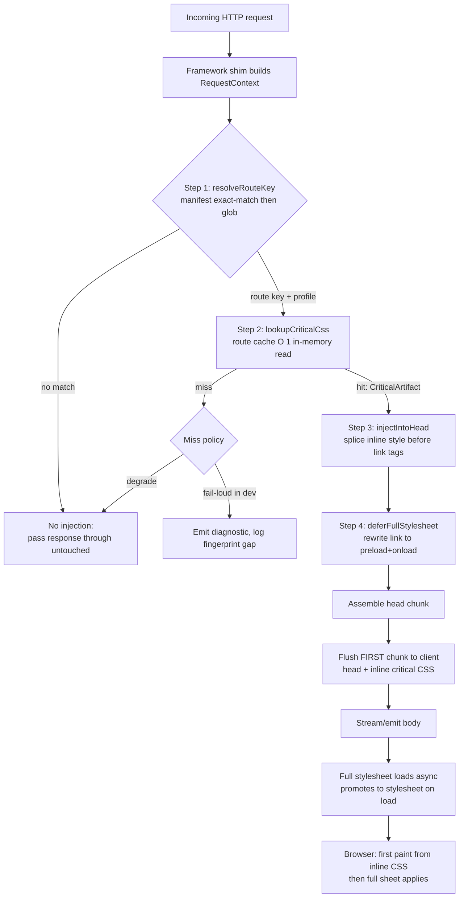
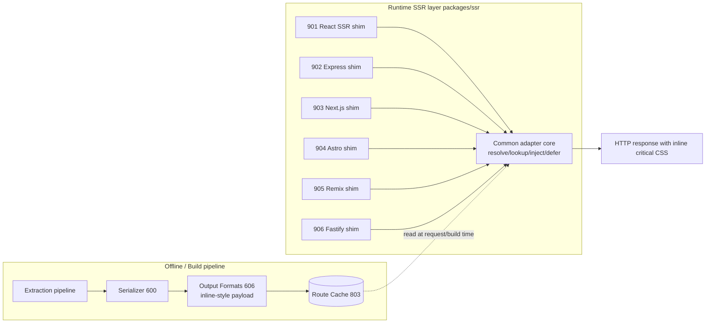

# 900 — SSR Integration Overview

## 1. Title

**Critical CSS Extraction Engine — Server-Side Rendering Integration Layer: The Common Adapter Contract for Per-Route Critical CSS Injection**

## 2. Version

| Field | Value |
|---|---|
| Document Version | 1.0.0 |
| Status | Draft — Phase 11 (SSR Integration) |
| Last Updated | 2026-07-09 |
| Owners | Delivery & Integration Working Group |
| Stability | The adapter contract (`resolve → lookup → inject → defer`) defined in Section 8 is **stable** and is the interface every framework-specific adapter (901–906) implements. Framework-specific injection mechanics are documented in the sibling files and may evolve independently without invalidating this contract. |

## 3. Purpose

The engine's job, everywhere else in this documentation, ends when a per-route critical CSS artifact has been extracted, serialized ([600-Serialization-Overview.md](./600-Serialization-Overview.md)), formatted ([606-Output-Formats.md](./606-Output-Formats.md)), and cached ([803-Route-Cache.md](./803-Route-Cache.md)). That artifact is inert until something *delivers* it into a real HTTP response at the exact moment a browser is about to paint. This document defines that delivery layer.

The problem this layer solves is narrow and precise: **on every server-rendered HTTP response, the correct per-route critical CSS must appear inline inside the document `<head>`, in the first bytes the browser receives, while the full stylesheet is demoted to a non-render-blocking asset loaded asynchronously.** If any part of that sentence is violated — wrong route's CSS, CSS arriving after the body, or the full stylesheet still blocking render — the entire value proposition of critical CSS collapses. Inlining the wrong route's CSS produces a flash of unstyled or mis-styled content (FOUC); inlining it late produces no first-paint benefit at all; failing to defer the full sheet means the render-blocking request the engine exists to eliminate is still present.

This document exists because six different server frameworks — raw React SSR, Express, Next.js, Astro, Remix, and Fastify — each have radically different request lifecycles, streaming models, and HTML-assembly conventions, yet all six must perform *the same four logical steps*. Rather than let each adapter reinvent route resolution, cache lookup, injection semantics, and deferral markup, this document factors those four steps into a single **common adapter contract**. The framework-specific documents ([901-React-SSR.md](./901-React-SSR.md), [902-Express.md](./902-Express.md), [903-NextJS.md](./903-NextJS.md), [904-Astro.md](./904-Astro.md), [905-Remix.md](./905-Remix.md), [906-Fastify.md](./906-Fastify.md)) then document only the *delta*: how that specific framework surfaces the route, where in its lifecycle the injection hook attaches, and how its particular HTML-assembly or streaming mechanism is driven.

Put differently: this is the document a contributor reads before writing *any* new adapter, and the document a reviewer reads to check that a proposed adapter honours the shared guarantees rather than open-coding a subtly different injection that breaks caching or determinism.

## 4. Audience

- Implementers of `packages/ssr` (the shared adapter core) who will write the `resolveRouteKey`, `lookupCriticalCss`, `injectIntoHead`, and `deferFullStylesheet` primitives that all six framework adapters call.
- Authors of the six framework-specific adapter documents (Phase 11 siblings), who implement against the contract defined here and must not re-specify the shared steps.
- Backend/platform engineers wiring the engine into an existing SSR server, who need to understand what the middleware requires of their response pipeline (a mutable `<head>`, access to the resolved route, and control over when the first byte flushes).
- Performance engineers reasoning about Time To First Byte (TTFB), First Contentful Paint (FCP), and the interaction between streaming SSR and inline critical CSS.
- Reviewers verifying conformance with `BRIEF.md` Section 2.10 ("Adapters: React SSR, Next.js, Astro, Remix, Express, Fastify; Provide middleware for automatic CSS injection").

Readers are assumed to understand HTTP response streaming, the browser's preload scanner and render-blocking CSS model, and the engine's route-manifest concept from `BRIEF.md` Section 2.9.

## 5. Prerequisites

- [606-Output-Formats.md](./606-Output-Formats.md) — the `inline-<style>` output format is the exact payload this layer injects. This document consumes that format; it does not define it. (Written in parallel; this document does not block on its completion and references only its stable conceptual contract: a self-contained `<style>` string plus an optional companion `<link>` for the full sheet.)
- [803-Route-Cache.md](./803-Route-Cache.md) — the route-keyed cache from which critical CSS is looked up at request time.
- [800-Cache-Overview.md](./800-Cache-Overview.md) — cache fingerprinting and invalidation semantics that determine whether a request-time lookup hits or misses.
- `BRIEF.md` Section 2.9 (Route Manifest) and Section 2.10 (SSR Integration) — the source-of-truth passages this module satisfies.
- `docs/architecture/006-Design-Principles.md` — Principle 3 (Correctness Over Premature Optimization), Principle 5 (Determinism of Output), Principle 6 (Fail Fast, Fail Loud). The SSR layer must never *silently* inject wrong or stale CSS.
- Working familiarity with the render-blocking CSS problem: a `<link rel="stylesheet">` in `<head>` blocks first paint until downloaded and parsed; inline `<style>` does not incur a network round-trip and paints with the document.

## 6. Related Documents

- [606-Output-Formats.md](./606-Output-Formats.md) — defines the `inline-<style>` payload injected by this layer.
- [901-React-SSR.md](./901-React-SSR.md) — adapter for raw React SSR (`renderToString` / `renderToPipeableStream`), including streaming-shell injection.
- [902-Express.md](./902-Express.md) — Express middleware adapter (`res.write`/`res.end` interception).
- [903-NextJS.md](./903-NextJS.md) — Next.js adapter (App Router and Pages Router integration points).
- [904-Astro.md](./904-Astro.md) — Astro adapter (integration hook + middleware).
- [905-Remix.md](./905-Remix.md) — Remix adapter (`entry.server` `handleRequest`).
- [906-Fastify.md](./906-Fastify.md) — Fastify plugin adapter (`onSend` hook).
- [803-Route-Cache.md](./803-Route-Cache.md), [800-Cache-Overview.md](./800-Cache-Overview.md) — request-time lookup source.
- `docs/architecture/016-Data-Flow.md` — DTO shapes for the artifacts flowing between cache and adapter.

## 7. Overview

The SSR integration layer is a thin, framework-agnostic core (`packages/ssr`) plus six thin framework-specific shims. The core owns four primitives; the shims own attachment and HTML assembly. The whole layer is stateless per request except for the cache handle it holds, which makes it trivially safe under concurrency — a property that matters enormously because SSR servers handle thousands of concurrent requests and any per-request mutable shared state would be a data-race liability.

There are two distinct operating modes, and conflating them is the most common integration error, so this document names them explicitly up front:

1. **Build-time injection (static / SSG).** The critical CSS is inlined into HTML *once*, when pages are pre-rendered at build time. There is no request-time work. This is the domain of static-site generators (Astro's static output, Next.js `getStaticProps` pages, any pre-rendered route). The adapter runs inside the build's render step, not inside a live request handler. It is cheaper and simpler — the cache lookup happens once per route per build — but it cannot react to per-request signals (cookies, A/B buckets, device class beyond what was pre-rendered).

2. **Request-time injection (SSR / dynamic).** The critical CSS is inlined into HTML *on every response*, inside a live request handler, immediately before the first byte flushes. This is the domain of `renderToPipeableStream`, Express handlers, Remix `handleRequest`, Fastify routes, and Next.js dynamic rendering. It costs one cache lookup per request (an in-memory map read, sub-microsecond on a hot cache) and must be engineered to add negligible latency to TTFB.

The four logical steps are identical across both modes and across all six frameworks:

1. **Resolve route.** Turn the incoming request (or the build-time page being rendered) into a canonical **route key** — the same key the extraction pipeline used when it wrote the artifact to the route cache. This is where the route manifest (`BRIEF.md` §2.9), with its exact-match and glob-pattern entries (`"/blog/*": "blog.css"`), is consulted.
2. **Look up cached critical CSS by route key.** Read the route cache ([803-Route-Cache.md](./803-Route-Cache.md)) for that key. A hit yields a ready-to-inline `inline-<style>` payload plus the URL of the full stylesheet. A miss triggers the miss policy (Section 12).
3. **Inject into the HTML stream.** Splice the `<style>` payload into the document `<head>`, positioned so it is in the first flushed chunk and ordered correctly relative to any other head content.
4. **Mark the full stylesheet non-blocking.** Emit (or rewrite) the full-stylesheet `<link>` so it loads asynchronously and does not block first paint, while still applying before interaction to avoid a flash when critical CSS is a strict subset.

The remainder of this document specifies each step precisely (Detailed Design), diagrams the request→lookup→inject flow (Architecture), gives the injection algorithm and its complexity (Algorithms), and covers the operational concerns — implementation discipline, edge cases (cache miss, streaming, route ambiguity), tradeoffs (build-time vs request-time), performance (TTFB budget), and testing — that any production deployment must confront.

## 8. Detailed Design

### 8.1 The Common Adapter Contract

Every adapter, regardless of framework, is a realization of the following interface. This is the load-bearing contract of the entire phase:

```ts
interface CriticalCssAdapter {
  /** Step 1: request/page → canonical route key (manifest-driven). */
  resolveRouteKey(ctx: RequestContext): RouteKey | null;

  /** Step 2: route key → cached artifact, or null on miss. */
  lookupCriticalCss(key: RouteKey, profile: DeviceProfile): CriticalArtifact | null;

  /** Step 3: splice inline <style> into <head> of the HTML being assembled. */
  injectIntoHead(head: HeadFragment, artifact: CriticalArtifact): HeadFragment;

  /** Step 4: rewrite/emit the full stylesheet <link> as non-render-blocking. */
  deferFullStylesheet(head: HeadFragment, artifact: CriticalArtifact): HeadFragment;
}

interface CriticalArtifact {
  routeKey: RouteKey;
  profile: DeviceProfile;          // mobile | tablet | desktop
  inlineStyle: string;             // the <style>…</style> block from 606
  fullStylesheetHref: string;      // URL of the complete sheet
  fingerprint: string;             // matches the cache fingerprint (800)
  integrity?: string;              // optional SRI hash for the full sheet
}
```

The core package (`packages/ssr`) supplies default, framework-independent implementations of all four methods operating over an abstract `HeadFragment` (a small string-or-token abstraction, see 8.4). Framework adapters do **not** re-implement these methods; they supply the glue that (a) constructs a `RequestContext`, (b) provides a `HeadFragment` view over their HTML-assembly mechanism, and (c) decides *when* in the framework's lifecycle to call the four methods.

**Why a shared contract rather than six independent implementations.** Route resolution, cache lookup, and deferral markup are correctness-critical and identical in intent everywhere. If each adapter open-coded them, a bug fixed in one (say, glob-precedence ordering in route resolution) would silently persist in the other five, and the determinism guarantee (Principle 5) would hold per-adapter rather than globally. Centralizing the four steps means one audited implementation and six trivially-thin shims.

**Alternatives considered.** (a) A single mega-adapter with framework switches internally — rejected because it couples all frameworks' dependency trees into one package and forces every consumer to pull in transitive deps for frameworks they don't use. (b) No shared core, pure copy-paste per adapter — rejected on the maintenance/determinism grounds above. The chosen design (thin shared core + thin shims) keeps each framework's dependencies isolated in its own sub-package while sharing the correctness-critical logic.

### 8.2 Step 1 — Route Resolution

The route key is the join key between extraction and delivery. Extraction wrote `blog.css` under key `/blog/*`; delivery must arrive at the *same* key from a live request to `/blog/my-post`. Resolution proceeds against the route manifest (`BRIEF.md` §2.9):

1. Extract the request path (framework-specific: `req.path`, `request.url`, the Astro `Astro.url.pathname`, the Remix loader URL, etc.). The shim normalizes this into `RequestContext.pathname`.
2. Attempt an **exact match** against manifest keys first (`"/products"` before `"/products/*"`).
3. Fall back to **glob patterns**, evaluated in a deterministic order: more specific (longer literal prefix, fewer wildcards) before less specific. Ties are broken by lexical order of the pattern string to guarantee determinism (Principle 5).
4. If a device-profile dimension is active (multi-viewport, `BRIEF.md` §2.6), the resolved route key is paired with the profile derived from the request (User-Agent hints, `Sec-CH-UA-Mobile`, or an explicit override header) to form the composite lookup key.

Route resolution is **pure** and side-effect free; it is the same function at build time and request time, which is precisely why the two modes can share it.

### 8.3 Step 2 — Cache Lookup

Given the composite `(routeKey, profile)`, the adapter reads the route cache ([803-Route-Cache.md](./803-Route-Cache.md)). At request time this is an in-memory map hydrated at server start from the on-disk cache store ([802-Cache-Store.md](./802-Cache-Store.md)); the read is O(1) and must not touch disk or network on the hot path. The lookup returns a `CriticalArtifact` on hit or `null` on miss.

The artifact's `fingerprint` is carried through so downstream logging/diagnostics can confirm *which* extraction produced the injected CSS — essential for debugging "why is stale CSS being served" incidents. The adapter never *computes* critical CSS on the request path; extraction is strictly an offline/build activity. If the cache misses, the miss policy (Section 12) governs behaviour — it never triggers a synchronous extraction inside a request handler, because a browser-driven extraction takes seconds and would be catastrophic for TTFB.

### 8.4 Step 3 — Head Injection and the `HeadFragment` Abstraction

The core operates over a `HeadFragment` — a minimal abstraction that represents "the place where head content is being assembled" without committing to a concrete representation. Concretely it is one of:

- a **string builder** (Express, Fastify, raw string templating): the fragment is a mutable buffer; injection is a splice at the `</head>` boundary or after a sentinel comment `<!--critical-css-->`.
- a **stream shell** (React `renderToPipeableStream`): the fragment is the pre-computed head chunk that is written *before* the React stream begins (see [901-React-SSR.md](./901-React-SSR.md) §8).
- a **framework head API** (Next.js `<Head>`, Remix `<Meta>/<Links>`, Astro head slot): the fragment is a token list the framework serializes.

Injection places the `<style>` block at a well-defined position: **after** any `<meta charset>` and critical `<meta>` tags (so the browser's encoding is fixed before it parses CSS bytes) and **before** any `<link rel="stylesheet">` (so inline critical CSS wins the cascade tie against the deferred full sheet if both apply the same rule, and so the browser paints from inline styles without waiting). The engine's serializer already guarantees deterministic rule ordering ([601-Rule-Ordering.md](./601-Rule-Ordering.md)); injection must not reorder the payload.

### 8.5 Step 4 — Deferring the Full Stylesheet

The full stylesheet must load but must not block first paint. The canonical technique the adapter emits:

```html
<link rel="preload" href="/assets/app.[hash].css" as="style"
      onload="this.onload=null;this.rel='stylesheet'">
<noscript><link rel="stylesheet" href="/assets/app.[hash].css"></noscript>
```

The `preload`+`onload`-swap pattern downloads the sheet without blocking render and promotes it to a stylesheet once available; the `<noscript>` fallback preserves correctness when JavaScript is disabled. Adapters that operate in strictly-static build-time mode and cannot rely on JS may instead use `media="print" onload="this.media='all'"` — the tradeoff is documented in Section 13. The `integrity` attribute (SRI) is emitted when the artifact carries one, per Principle 6 (fail loud on tampering).

Critically, if the deployment already emits its own `<link rel="stylesheet">` for the full sheet (common: the framework's asset pipeline injected it), the adapter's job in Step 4 is to **rewrite** that existing tag into the non-blocking form, not to add a second one. This rewrite is the single most common source of double-loading bugs and is called out in Edge Cases (Section 12).

### 8.6 Build-Time vs Request-Time: Which Path Runs

| Dimension | Build-time injection | Request-time injection |
|---|---|---|
| When steps 1–4 run | Once per route, during pre-render | Once per HTTP response |
| Route resolution input | The page being statically generated | The live request path |
| Cache read cost | Amortized to zero (build only) | O(1) in-memory per request |
| Reacts to per-request signals | No | Yes (device profile, headers) |
| Failure blast radius | Build fails loudly (good) | Must degrade gracefully per request |
| Frameworks | Astro static, Next SSG, any SSG | React SSR, Express, Fastify, Remix, Next dynamic |

The same four primitives serve both; only the *host* that calls them differs. This is the central design economy of the layer.

## 9. Architecture

The end-to-end request → lookup → inject flow, request-time mode:



Component/placement view of the layer relative to the rest of the engine:



## 10. Algorithms

### 10.1 Route Resolution (manifest match)

**Problem.** Map a request pathname to the canonical route key used at extraction time, deterministically.

**Inputs.** `pathname: string`; `manifest: Array<{pattern: string, key: RouteKey}>` (from `BRIEF.md` §2.9).
**Output.** `RouteKey | null`.

```
function resolveRouteKey(pathname, manifest):
    # 1. exact match wins
    for entry in manifest where entry.pattern has no wildcard:
        if entry.pattern == pathname: return entry.key
    # 2. glob match, most-specific first
    candidates = [e for e in manifest if e.pattern has wildcard and globMatch(e.pattern, pathname)]
    sort candidates by (literalPrefixLength desc, wildcardCount asc, pattern lex asc)
    if candidates non-empty: return candidates[0].key
    return null
```

**Complexity.** Time O(N) scan + O(K log K) sort of matching globs, where N = manifest size, K = matching globs (K ≤ N, both small — manifests are tens to low-hundreds of entries). Memoizable per distinct pathname. Memory O(N).
**Failure cases.** Ambiguous manifest (two equally-specific globs) — resolved by the lexical tie-break, and flagged by a build-time manifest linter (Future Work). No match returns `null` → no injection.

### 10.2 Head Injection (splice at position)

**Problem.** Insert the inline `<style>` payload at the correct head position without reordering existing content and without O(n²) string rebuilding.

**Inputs.** `head: HeadFragment`; `artifact.inlineStyle: string`.
**Output.** mutated `HeadFragment`.

```
function injectIntoHead(head, artifact):
    pos = head.findInsertionPoint()   # after <meta charset>, before first stylesheet link
    head.spliceAt(pos, artifact.inlineStyle)
    return head
```

For a string-builder `HeadFragment`, `findInsertionPoint` locates the sentinel `<!--critical-css-->` if present (O(1) if index cached at construction, else O(m) scan of the head string of length m) or falls back to the `</head>` boundary. `spliceAt` on a rope/segment-list head is O(1) amortized; on a flat string it is O(m). Since the head is small (rarely > a few KB) this is negligible relative to body rendering.

**Complexity.** Time O(m) worst case (m = head length), O(1) with a segmented head. Memory O(m) for the reassembled head.
**Failure cases.** No insertion point found (malformed head, no `</head>`) → append-before-body fallback + diagnostic warning.

### 10.3 Full-Stylesheet Deferral (rewrite existing link)

**Problem.** Ensure exactly one non-blocking full-stylesheet reference exists.

```
function deferFullStylesheet(head, artifact):
    existing = head.findStylesheetLinks(matching artifact.fullStylesheetHref)
    if existing found:
        rewrite existing → preload+onload form   # NOT add a new tag
    else:
        head.append(preloadOnloadLinkFor(artifact.fullStylesheetHref, artifact.integrity))
    return head
```

**Complexity.** Time O(L) over L link tags in head (L tiny). Memory O(1).
**Failure cases.** Multiple existing links to the same href (misconfigured pipeline) → rewrite first, remove duplicates, emit dedup diagnostic.

## 11. Implementation Notes

- **`packages/ssr` is dependency-light.** The core imports nothing from any framework. Framework shims live in sibling entry points (`packages/ssr/express`, `/react`, `/next`, etc.) so consumers only pull the framework glue they use. This mirrors how `@sentry/*` and `@opentelemetry/*` factor per-framework packages.
- **Cache handle injection.** The adapter receives the route-cache handle by dependency injection at construction, never as a global singleton, so multiple engines/caches can coexist in one process (multi-tenant SSR).
- **Concurrency.** All four primitives are pure functions of their inputs plus an immutable cache snapshot. No per-request shared mutable state → no locks on the hot path.
- **Idempotence guard.** Injection tags the head with a `data-critical-css` marker attribute on the injected `<style>`; if the adapter runs twice (e.g., middleware double-registered), the second run detects the marker and no-ops rather than double-injecting.
- **Hydration parity.** The inline critical CSS is invisible to React/Remix/Astro hydration because it lives in `<head>`, outside the hydration root. Adapters must never inject into the hydrated body subtree, which would cause a hydration mismatch. This is the single hard rule shared by all client-hydrating frameworks and is reiterated in each sibling.
- **Fingerprint logging.** On every hit, the adapter logs `(routeKey, profile, fingerprint)` at debug level so operators can correlate served CSS with a specific extraction run.

## 12. Edge Cases

- **Cache miss (no artifact for route).** Miss policy is configurable: `degrade` (default in prod) passes the response through untouched — the full stylesheet remains render-blocking but the page is *correct*, never broken; `fail-loud` (default in dev/CI) emits a visible diagnostic and logs the missing `(routeKey, profile)` so gaps are caught before production. The layer never blocks a response waiting to compute CSS.
- **Streaming SSR — critical CSS must be in the first chunk.** With `renderToPipeableStream` and similar, the head is flushed before the body streams. If injection happens after the first flush, the browser has already begun parsing without critical CSS → no first-paint benefit and potential FOUC. Every streaming adapter must inject into the pre-stream shell. Fully specified in [901-React-SSR.md](./901-React-SSR.md).
- **Route resolves but wrong profile.** If the device profile derived from the request has no cached artifact but another profile does, policy `nearest-profile` may fall back (e.g., serve desktop CSS to an unknown UA) with a diagnostic; default is treat-as-miss to avoid FOUC from a mismatched fold.
- **Double stylesheet link.** The framework's asset pipeline already emitted a blocking `<link>`; Step 4 must rewrite it in place, not add a second. Failure to do so double-downloads the sheet.
- **Cross-origin / CDN full stylesheet.** The deferred `<link>` may point at a CDN; SRI `integrity` should be present. If cross-origin without CORS the `onload` swap still works but SRI requires `crossorigin` — adapter adds it.
- **Nested/streamed Suspense boundaries (React 18).** Late-arriving Suspense chunks may carry their own styles; the critical CSS covers only above-the-fold, so late chunks are expected to rely on the async full sheet. Documented in 901.
- **Empty inline payload.** If the route legitimately has no above-fold CSS (blank landing), the artifact's `inlineStyle` may be empty; the adapter still defers the full sheet and skips the empty `<style>`.
- **Non-HTML responses.** JSON/API responses have no `<head>`; route resolution short-circuits when the response content-type is not `text/html`.

## 13. Tradeoffs

- **Build-time vs request-time injection.** Build-time is cheaper (zero per-request cost) and cannot serve wrong CSS under load, but cannot react to per-request signals and bloats the pre-rendered HTML for every visitor identically. Request-time adds an O(1) lookup and a small head-splice per response (sub-millisecond) but enables per-request device profiles and dynamic routes. **Chosen:** support both via the same primitives; let the host framework's nature decide. *Why:* forcing one mode would exclude either SSG or dynamic SSR consumers.
- **Preload+onload swap vs media=print swap.** The former is cleaner and standard but relies on JS for the promotion; the latter works without JS but is a documented hack that some tools flag. **Chosen:** preload+onload as default with `<noscript>` fallback; media-print available as an opt-in for JS-hostile static contexts.
- **Shared core vs per-adapter code.** Shared core centralizes correctness at the cost of an abstraction layer (`HeadFragment`) that each shim must satisfy. **Chosen:** shared core — determinism and single-audit-surface outweigh the abstraction cost.
- **Degrade-on-miss vs fail-on-miss default.** Degrading keeps prod resilient but can silently ship a slow page; failing catches gaps but risks breaking prod on a cache eviction. **Chosen:** environment-split default (degrade in prod, fail-loud in dev/CI) — matches Principle 6 without sacrificing prod availability.
- **Rewriting existing links vs owning stylesheet emission.** Rewriting is fragile (depends on recognizing the framework's tag) but non-invasive; owning emission is clean but requires the consumer to remove their own stylesheet wiring. **Chosen:** rewrite by default, with an opt-in "engine owns stylesheets" mode.

## 14. Performance

- **Per-request cost (request-time mode).** Route resolution: O(N) manifest scan, N ≈ tens–hundreds, memoized per pathname → effectively O(1) on repeat paths. Cache lookup: O(1) in-memory map read. Head injection: O(m) over a few-KB head. Deferral rewrite: O(L) over a handful of link tags. **Total added latency budget: < 1 ms p99**, dominated by the head string manipulation, negligible next to React/template rendering (typically 5–50 ms).
- **TTFB.** Because injection targets the *first* flushed chunk, it does not delay TTFB beyond the head-assembly time that already exists; it merely enlarges the first chunk by the inline CSS size (typically 5–30 KB). The net effect is *faster* FCP despite a marginally larger first chunk, because the browser no longer round-trips for a render-blocking stylesheet.
- **Memory.** The route cache is shared and immutable; the adapter holds only a handle. Per-request allocation is the reassembled head string. No per-request cache copies.
- **Parallelization.** Statelessness means the layer scales linearly with server concurrency; no shared locks. Build-time mode parallelizes trivially across routes.
- **Scalability limits.** Bounded by the route cache's in-memory footprint (one inline payload per route×profile). For very large route counts, the route cache may spill to LRU ([804-Viewport-Cache.md](./804-Viewport-Cache.md) discusses eviction); a miss then falls to the miss policy rather than a synchronous extraction.
- **Profiling guidance.** Instrument the four primitives with per-step timers; alert if injection p99 exceeds the 1 ms budget (indicates an oversized head or unmemoized resolution).

## 15. Testing

- **Unit tests.** Route resolution: exact-before-glob, glob specificity ordering, lexical tie-break, no-match → null. Injection: correct position relative to `<meta charset>` and `<link>`; idempotence marker prevents double-inject; malformed-head fallback. Deferral: rewrite-in-place vs append; dedup of multiple existing links; SRI/crossorigin emission.
- **Integration tests.** Per framework (spawned in the sibling docs): boot a minimal server, request a mapped route, assert the response head contains the expected inline `<style data-critical-css>` before any stylesheet `<link>`, and that the full sheet link is in preload+onload form.
- **Streaming tests.** Assert the inline critical CSS appears in the *first* flushed chunk for `renderToPipeableStream` (901), not a later Suspense chunk.
- **Visual/regression tests.** Render the page with injected critical CSS in a headless browser; screenshot first paint before the async full sheet loads; diff against the golden "styled first paint" ([703-Visual-Diff.md](./703-Visual-Diff.md), [003-Golden-Files.md](../testing/003-Golden-Files.md)) to catch FOUC regressions.
- **Miss-policy tests.** Assert `degrade` passes the response through unmodified and correct; assert `fail-loud` emits a diagnostic in dev/CI.
- **Stress tests.** Drive thousands of concurrent requests; assert no cross-request CSS leakage (route A never gets route B's CSS) — the definitive statelessness test.
- **Determinism tests.** Same route + same profile + same cache → byte-identical injected head across runs (Principle 5).

## 16. Future Work

- **Route-manifest linter.** A build-time check that flags ambiguous glob overlaps and manifest entries with no corresponding cached artifact, closing the miss gap before deploy.
- **Edge/CDN injection.** Move request-time injection to a CDN edge worker (Cloudflare Workers, Lambda@Edge) so the O(1) lookup and splice happen at the edge, removing it from origin servers entirely. Requires shipping the route cache to the edge KV.
- **Per-request adaptive fold.** Use client hints (viewport, device memory) to select among multiple pre-extracted profiles at request time beyond the current mobile/tablet/desktop trichotomy.
- **Automatic full-sheet emission mode.** A first-class "engine owns stylesheets" integration that removes the fragile rewrite step.
- **HTTP 103 Early Hints.** Emit an Early Hints response preloading the full stylesheet before the HTML head is even assembled, further overlapping network with render.
- **Streaming-native injection API.** A `TransformStream`-based head injector so adapters over Web Streams (Remix, Next App Router, edge runtimes) share a single streaming implementation.

## 17. References

- [606-Output-Formats.md](./606-Output-Formats.md) — inline-`<style>` payload definition.
- [901-React-SSR.md](./901-React-SSR.md), [902-Express.md](./902-Express.md), [903-NextJS.md](./903-NextJS.md), [904-Astro.md](./904-Astro.md), [905-Remix.md](./905-Remix.md), [906-Fastify.md](./906-Fastify.md) — framework-specific adapters.
- [800-Cache-Overview.md](./800-Cache-Overview.md), [803-Route-Cache.md](./803-Route-Cache.md), [804-Viewport-Cache.md](./804-Viewport-Cache.md) — request-time lookup source and eviction.
- [601-Rule-Ordering.md](./601-Rule-Ordering.md), [703-Visual-Diff.md](./703-Visual-Diff.md) — deterministic ordering and FOUC regression detection.
- `docs/architecture/006-Design-Principles.md`, `docs/architecture/016-Data-Flow.md`.
- `BRIEF.md` Section 2.9 (Route Manifest), Section 2.10 (SSR Integration).
- Filament Group, "The Simplest Way to Load CSS Asynchronously" — preload+onload pattern.
- web.dev, "Extract critical CSS" and "Preload critical assets" — render-blocking CSS background.
- WHATWG HTML Standard — `<link rel=preload>`, `<noscript>`, resource loading.
