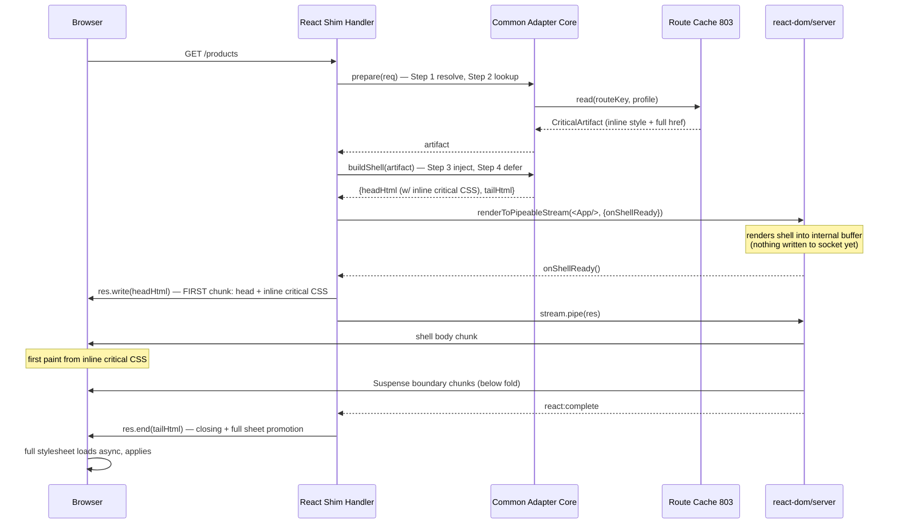
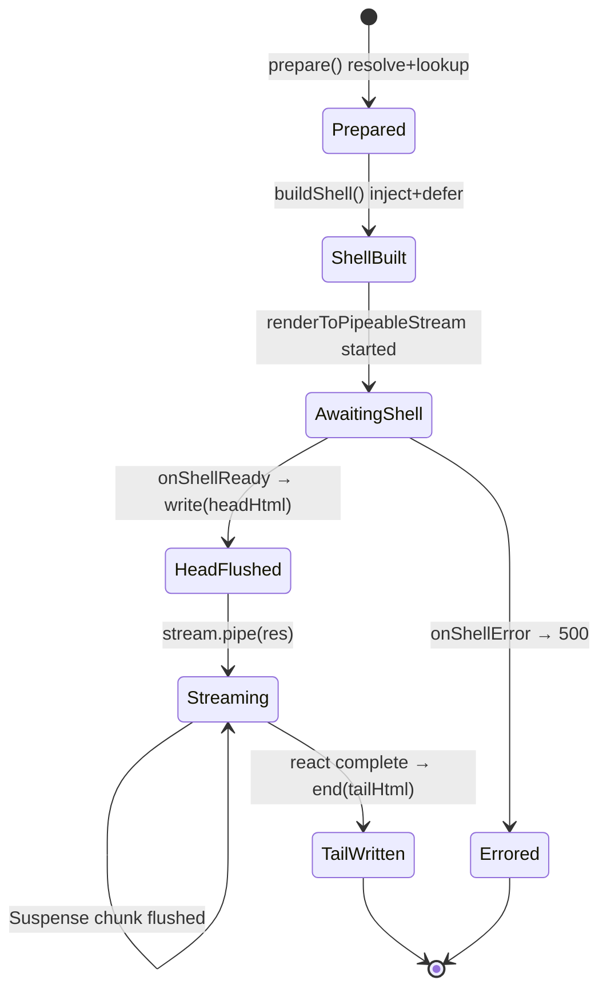

# 901 — React SSR Adapter

## 1. Title

**Critical CSS Extraction Engine — Raw React Server-Side Rendering Adapter: Critical CSS Injection into `renderToString` and Streaming `renderToPipeableStream` Output**

## 2. Version

| Field | Value |
|---|---|
| Document Version | 1.0.0 |
| Status | Draft — Phase 11 (SSR Integration) |
| Last Updated | 2026-07-09 |
| Owners | Delivery & Integration Working Group |
| Stability | The shell-injection contract for `renderToPipeableStream` (Section 8.3) is **stable**. The `renderToString` path is a simpler special case of it. Behaviour under future React streaming APIs (`renderToReadableStream` on the Web Streams runtime) is tracked in Future Work. |

## 3. Purpose

[900-SSR-Overview.md](./900-SSR-Overview.md) defined the common adapter contract — the four steps (`resolve → lookup → inject → defer`) every framework performs — and deliberately deferred the framework-specific *delta*: how a given framework surfaces the route, where in its lifecycle injection attaches, and how its HTML-assembly or streaming mechanism is driven. This document supplies that delta for **raw React server-side rendering**: not Next.js, not Remix (those are [903-NextJS.md](./903-NextJS.md) and [905-Remix.md](./905-Remix.md)), but the case where an engineer directly calls `react-dom/server` APIs — `renderToString`, `renderToStaticMarkup`, or the React 18 streaming APIs `renderToPipeableStream` (Node) and `renderToReadableStream` (Web) — inside their own server handler.

Raw React SSR is the foundational case precisely because it is the least opinionated: there is no framework-provided head-management API, no framework router, and no framework asset pipeline. The engineer assembles the full HTML document themselves — typically an outer shell string with `<html><head>…</head><body><div id="root">` + React output + `</div>…</body></html>`. That means the adapter cannot lean on any host convention; it must inject critical CSS into a document *the application author controls byte-for-byte*. Getting this case right establishes the pattern every higher-level framework adapter specializes.

The hard problem this document solves is **streaming**. With `renderToString` the entire HTML is a single string and injection is a trivial splice. But `renderToString` is being superseded by `renderToPipeableStream`, which flushes HTML in chunks as React resolves Suspense boundaries — and the first chunk (the "shell") is sent to the browser *before rendering completes*. **If the critical CSS is not present in that first flushed chunk, it arrives too late to affect first paint, defeating the entire purpose of critical CSS.** This document specifies exactly how to guarantee the inline `<style>` block lands in the shell, ahead of the streamed body, and how that interacts with React 18 Suspense and selective hydration.

## 4. Audience

- Engineers integrating the engine into a hand-rolled React SSR server (Express/Fastify/http calling `react-dom/server` directly — note the *transport* may be Express/Fastify but the *rendering* is raw React; the HTTP wiring is covered by [902-Express.md](./902-Express.md)/[906-Fastify.md](./906-Fastify.md), the React rendering integration is covered here).
- Implementers of `packages/ssr/react`, the React-specific shim over the common core.
- Engineers migrating from `renderToString` to `renderToPipeableStream` who must preserve inline critical CSS across the migration.
- Reviewers checking that streaming injection lands in the first flushed chunk.

Readers must have read [900-SSR-Overview.md](./900-SSR-Overview.md) in full — this document does not re-explain the four steps, the `CriticalArtifact` shape, or route resolution; it assumes that vocabulary and specifies only React mechanics.

## 5. Prerequisites

- [900-SSR-Overview.md](./900-SSR-Overview.md) — the common adapter contract this document specializes; the `HeadFragment` "stream shell" variant (Section 8.4 of that doc) is the abstraction realized here.
- [606-Output-Formats.md](./606-Output-Formats.md) — the inline-`<style>` payload injected into the shell.
- [803-Route-Cache.md](./803-Route-Cache.md) — the request-time lookup source.
- React 18 server rendering knowledge: the shell/stream distinction, `onShellReady` vs `onAllReady`, `Suspense`, selective hydration, and `hydrateRoot`.
- `docs/architecture/006-Design-Principles.md` — Principle 5 (Determinism) and Principle 6 (Fail Fast, Fail Loud).

## 6. Related Documents

- [900-SSR-Overview.md](./900-SSR-Overview.md) — parent contract.
- [606-Output-Formats.md](./606-Output-Formats.md) — inline-`<style>` payload.
- [902-Express.md](./902-Express.md) — HTTP transport most commonly hosting raw React SSR; complements this document.
- [906-Fastify.md](./906-Fastify.md) — alternative HTTP transport.
- [903-NextJS.md](./903-NextJS.md), [905-Remix.md](./905-Remix.md) — higher-level frameworks that build on React SSR with their own head APIs; contrast with the raw case here.
- [904-Astro.md](./904-Astro.md) — sibling adapter for the island architecture.
- [803-Route-Cache.md](./803-Route-Cache.md), [601-Rule-Ordering.md](./601-Rule-Ordering.md).

## 7. Overview

React server rendering comes in two shapes, and the adapter handles each differently at the mechanical level while presenting the same four-step contract.

**Buffered rendering (`renderToString` / `renderToStaticMarkup`).** React produces the entire body markup as one string synchronously. The adapter's job is trivial: render the body, assemble the document shell, and splice the inline `<style>` into the head of that shell before sending. Because everything is buffered, there is no "first chunk" subtlety — the whole document is one write. The cost is that the server holds the full HTML in memory and TTFB waits for the *entire* render (no streaming benefit). This path remains valid and is the simplest correct integration.

**Streaming rendering (`renderToPipeableStream`).** React begins emitting HTML as soon as the *shell* (everything outside Suspense boundaries) is ready, then streams additional chunks as each `Suspense` boundary resolves, appended with inline `<script>` reconciliation snippets React injects automatically. The browser starts parsing and painting from the shell immediately. This is where critical CSS must be engineered carefully: the inline `<style>` must be part of the shell's `<head>`, written before or as the first bytes of the stream, so it is parsed before the browser paints the shell body.

The React streaming API's design actually makes this clean, if you understand the sequencing. `renderToPipeableStream` gives two callbacks: `onShellReady` (fires when the shell — the non-suspended content — is renderable, i.e., the earliest safe moment to start streaming) and `onAllReady` (fires when everything including all Suspense content is done, used for crawlers/SSG). The adapter's insight: **write the document opening — including `<head>` with the injected critical CSS — into the response stream inside `onShellReady`, *before* piping React's stream.** React's `pipe(res)` then appends the body. Because the head bytes are written first, they are guaranteed to be in the first flushed chunk.

The rest of this document specifies the exact write sequence (Detailed Design), diagrams it as a sequence (Architecture), gives the shell-assembly algorithm and its complexity (Algorithms), and covers the Suspense/hydration edge cases, tradeoffs against buffered rendering, performance, and testing.

## 8. Detailed Design

### 8.1 The React Shim

`packages/ssr/react` exposes a small wrapper the application uses in place of a bare `react-dom/server` call:

```ts
import { renderToPipeableStream } from "react-dom/server";
import { createReactCriticalAdapter } from "@cce/ssr/react";

const adapter = createReactCriticalAdapter({
  routeCache,            // handle from 803, injected
  manifest,              // BRIEF §2.9 route manifest
  missPolicy: "degrade", // 900 §12
});

function handler(req, res) {
  const artifact = adapter.prepare(req); // steps 1+2: resolve route, lookup CSS
  const { headHtml, tailHtml } = adapter.buildShell(artifact, {
    // author-controlled shell pieces:
    lang: "en",
    title: pageTitle,
    rootId: "root",
  });

  const stream = renderToPipeableStream(<App />, {
    bootstrapScripts: ["/client.[hash].js"],
    onShellReady() {
      res.statusCode = artifact ? 200 : 200;
      res.setHeader("Content-Type", "text/html");
      res.write(headHtml);   // <-- FIRST bytes: <html><head>…inline critical CSS…</head><body><div id=root>
      stream.pipe(res);      // <-- React body chunks appended
    },
    onShellError(err) { res.statusCode = 500; res.end("<!doctype html>…error…"); },
    onAllReady() { /* used only for bots: switch to buffered for full-content crawl */ },
  });

  // React signals stream end; adapter appends the tail after React finishes.
  res.on("react:complete", () => res.end(tailHtml)); // </div>…full-stylesheet defer…</body></html>
}
```

`prepare(req)` performs Steps 1 and 2 (route resolution + cache lookup) from [900-SSR-Overview.md](./900-SSR-Overview.md). `buildShell(artifact, opts)` performs Steps 3 and 4, producing two strings: `headHtml` (the document open through the root container's opening tag, *with* the inline `<style>` injected and the full-stylesheet `<link>` present in deferred form) and `tailHtml` (the closing markup). The application controls the shell content; the adapter owns only the critical-CSS-relevant splicing within it.

### 8.2 Buffered path (`renderToString`)

```ts
function handler(req, res) {
  const artifact = adapter.prepare(req);
  const bodyHtml = renderToString(<App />);
  const html = adapter.assembleDocument(artifact, { bodyHtml, title, rootId: "root" });
  res.setHeader("Content-Type", "text/html");
  res.end(html);
}
```

`assembleDocument` is `buildShell`'s headHtml + bodyHtml + tailHtml collapsed into one string. Injection (Step 3) splices the inline `<style>` into the head; deferral (Step 4) rewrites/emits the full-stylesheet link. There is exactly one write; the inline CSS is trivially in the (only) chunk. This path is the reference semantics against which the streaming path's output is diffed in tests.

### 8.3 Streaming path (`renderToPipeableStream`) — the shell-injection contract

This is the load-bearing mechanism of the document. The guarantee is: **the inline critical `<style>` is written to the socket before any React body byte.**

The sequence, precisely:

1. `prepare(req)` runs Steps 1–2 *synchronously before rendering starts*. The cache lookup is O(1) in-memory, so this adds no meaningful latency and, crucially, means the critical CSS is available the instant the shell is ready — it is never awaited.
2. `buildShell` runs Steps 3–4, producing `headHtml` and `tailHtml`. This also happens before/independently of React's render — it depends only on the artifact, not on React output.
3. `renderToPipeableStream(<App/>, opts)` begins rendering. React does **not** write anything to `res` yet; it renders into its own internal buffer until the shell is ready.
4. `onShellReady` fires. The adapter writes `headHtml` to `res` **first** (`res.write(headHtml)`), then calls `stream.pipe(res)`. Because Node writes in order, `headHtml` — containing the inline critical CSS — occupies the first flushed chunk. React's shell body follows in the same or immediately subsequent chunk.
5. React streams Suspense boundary content as it resolves, injecting its own `<template>`/`<script>` reconciliation. These late chunks are *below the fold by construction* (anything above the fold is not suspended in a well-built app, or its fallback is part of the shell), so they legitimately rely on the async full stylesheet, not the critical CSS.
6. When React finishes, the adapter appends `tailHtml` (closing `</div></body></html>` plus, if not already in the head, the deferred full-stylesheet promotion). `tailHtml` is where any end-of-body scripts live.

**Why write the head manually instead of putting it inside `<App/>`.** React's streaming model expects the *document shell* (the `<html><head>` part) to be written by the server around React's output; putting the entire `<html>` inside a React component is possible in React 18 but complicates injecting server-computed critical CSS because the CSS string would have to be threaded through React props and `dangerouslySetInnerHTML`, adding a render dependency and a hydration surface. Writing the head as a raw string in `onShellReady` keeps the critical CSS entirely outside the React tree — it is never hydrated, never diffed, never a mismatch risk (Principle: hydration parity, [900-SSR-Overview.md](./900-SSR-Overview.md) §11). This is the single most important design decision in the React adapter.

**Alternatives considered.** (a) Inject via a React component using `<style dangerouslySetInnerHTML>` inside the head rendered by React — rejected: couples critical CSS into the hydration tree and risks mismatches; also `renderToPipeableStream` streaming of a React-owned `<head>` cannot guarantee head-before-body ordering without the same manual write anyway. (b) Post-process the entire streamed output through a `Transform` stream that regex-splices the `<style>` on the fly — rejected: fragile (must parse partial HTML across chunk boundaries), CPU cost on every chunk, and defeats the "first chunk" guarantee because the splice point may not have arrived when the first chunk flushes. The chosen manual-head-write is simplest, correct-by-construction, and zero-copy for the body.

### 8.4 Positioning within the head

Within `headHtml`, injection order (per [900-SSR-Overview.md](./900-SSR-Overview.md) §8.4) is: `<meta charset>` → critical `<meta>` (viewport) → **inline critical `<style data-critical-css>`** → deferred full-stylesheet `<link rel=preload …>` → `bootstrapScripts` are emitted by React at body end, not head. The `data-critical-css` marker enables the idempotence guard and lets client code optionally remove the inline block after the full sheet loads (Future Work).

### 8.5 Web Streams variant (`renderToReadableStream`)

On Web-standard runtimes (edge, Deno, Bun) React exposes `renderToReadableStream`, returning a `ReadableStream`. The same head-first principle applies but is expressed as prepending a head chunk to the stream. The adapter provides `injectHeadStream(reactStream, headHtml, tailHtml)` that returns a new `ReadableStream` enqueuing `headHtml`, then the React chunks, then `tailHtml`. This is the streaming-native injector flagged in [900-SSR-Overview.md](./900-SSR-Overview.md) §16 and is shared with Remix/Next App Router.

## 9. Architecture

Sequence of `renderToPipeableStream` + critical-CSS shell injection:



State of the response body assembly:



## 10. Algorithms

### 10.1 Shell assembly with critical CSS injection

**Problem.** Produce `headHtml` (guaranteed to carry the inline critical CSS as its first-flushed content) and `tailHtml`, given the artifact and author shell options.

**Inputs.** `artifact: CriticalArtifact | null`; `opts: {lang, title, rootId, meta[], bootstrapScripts[]}`.
**Output.** `{headHtml: string, tailHtml: string}`.

```
function buildShell(artifact, opts):
    head = new HeadFragment()
    head.append(`<!doctype html><html lang="${opts.lang}"><head>`)
    head.append(`<meta charset="utf-8">`)
    head.append(`<meta name="viewport" content="width=device-width,initial-scale=1">`)
    for m in opts.meta: head.append(m)
    if artifact and artifact.inlineStyle non-empty:
        head = injectIntoHead(head, artifact)      # Step 3 (900 §10.2)
    if artifact:
        head = deferFullStylesheet(head, artifact) # Step 4 (900 §10.3)
    head.append(`</head><body><div id="${opts.rootId}">`)
    headHtml = head.toString()
    tailHtml = `</div></body></html>`
    return {headHtml, tailHtml}
```

**Complexity.** Time O(k + m) where k = number of author meta/script tags and m = inline CSS length (single append/splice). Memory O(m) for the head string. No React dependency → runs before/parallel to render.
**Failure cases.** `artifact == null` (cache miss): under `degrade`, head is built without inline CSS and *without* deferral rewrite — the author's own stylesheet link (if any) is left blocking, page correct. Under `fail-loud`, emit diagnostic. Empty `inlineStyle`: skip the `<style>` but still defer the full sheet.

### 10.2 First-chunk guarantee (ordering invariant)

**Problem.** Prove the inline CSS is in the first flushed chunk without buffering the whole document.

**Invariant.** In `onShellReady`, `res.write(headHtml)` is called *before* `stream.pipe(res)`. Node's writable stream preserves write order; therefore the socket receives `headHtml` bytes before any React body byte. The first TCP segment flushed thus contains `headHtml`'s prefix, which begins with `<!doctype html><html><head>` and reaches the inline `<style>` within the first few hundred bytes (head is small). ∎

**Complexity.** O(1) sequencing; no additional buffering. This is a *protocol ordering* guarantee, not an algorithm with runtime cost.
**Failure cases.** If an author erroneously calls `stream.pipe(res)` before `res.write(headHtml)`, the invariant breaks; the shim's API shape (adapter owns the `onShellReady` body) prevents this by construction — the author never touches `pipe` directly when using `buildShell`.

## 11. Implementation Notes

- **Never `await` the cache lookup in the render path.** `prepare` is synchronous against the in-memory route cache. If the cache handle is async (distributed cache, [806-Distributed-Cache.md](./806-Distributed-Cache.md)), the shim resolves it *before* calling `renderToPipeableStream`, not inside `onShellReady`, so shell readiness is never delayed by CSS lookup.
- **`bootstrapScripts` stay at body end.** React emits hydration bootstrap scripts after the body; the adapter never moves them into the head, preserving non-blocking script order.
- **Idempotence marker.** The injected `<style data-critical-css>` marker also lets the *client* bundle optionally detect and (post-load) drop the inline block once the full sheet is confirmed applied, saving DOM weight on SPA navigations.
- **Error shell.** `onShellError` must still emit a valid minimal document; it should include neither stale critical CSS nor a broken head — a clean 500 shell.
- **`onAllReady` for bots.** When a crawler is detected, switch to waiting for `onAllReady` (fully buffered) so the entire content — not just the shell — is in the response; critical CSS injection is identical, just written once at the end.
- **Content-Length.** Streaming responses use chunked transfer encoding (no `Content-Length`); do not set it, or the manual `headHtml` write plus streamed body will mismatch.

## 12. Edge Cases

- **Above-fold content inside a Suspense boundary.** If the app suspends content that is actually above the fold, that content (and its fallback) streams late and the critical CSS — extracted against the *resolved* above-fold DOM — may reference elements not yet present at first paint. Mitigation: the fallback UI should be part of the shell; extraction runs against the stabilized page ([104-Rendering-Stabilization.md](./104-Rendering-Stabilization.md)) so the critical CSS covers the resolved state, and the shell's fallback is styled by it. This is a page-design constraint, documented so integrators keep above-fold content out of Suspense or ensure fallbacks are shell-resident.
- **Selective hydration reordering.** React 18 may hydrate boundaries out of order; because critical CSS lives in `<head>` outside all hydration roots, hydration order cannot affect it. No action needed — but the adapter must never inject into a hydrated subtree.
- **Double render (StrictMode / dev).** In development React may render twice; `prepare`/`buildShell` are pure and idempotent, so a double render produces identical shells. The idempotence marker prevents any accidental double `<style>`.
- **`renderToStaticMarkup` (no hydration).** Used for emails/static fragments; the adapter still injects but omits `bootstrapScripts`. The deferred full sheet may be switched to the `media=print` swap since there is no client JS.
- **Streaming error mid-body.** If a Suspense boundary errors after the shell (and thus after the head+critical CSS) has flushed, React emits an error boundary fallback chunk; the already-sent critical CSS remains valid for the shell — no corruption.
- **Empty React output.** A component tree rendering nothing still gets a valid shell with critical CSS; the body is empty but styled containers may exist.
- **Very large inline CSS.** If the inline payload is unusually large (poorly-scoped fold), the first chunk grows; the adapter does not chunk the `<style>` itself (splitting a style block across TCP segments is fine but the block must be syntactically whole in the head). Size regressions are caught by CI budget checks (`BRIEF.md` §2.11).

## 13. Tradeoffs

- **Streaming vs buffered.** Streaming (`renderToPipeableStream`) gives faster TTFB and progressive paint but requires the head-first write discipline and constrains above-fold content out of Suspense. Buffered (`renderToString`) is dead-simple and injection is a one-line splice, but holds the whole document in memory and waits for full render before first byte. **Chosen:** support both; recommend streaming for user-facing pages, buffered for bots/SSG/emails. *Why:* the head-first mechanism makes streaming correct without sacrificing the critical-CSS guarantee, so there is no reason to force buffered.
- **Manual head write vs React-owned head.** Manual write keeps critical CSS out of the hydration tree (no mismatch risk) and guarantees ordering; React-owned head would unify the document under React but reintroduce mismatch risk and prop-threading. **Chosen:** manual head write. *Why:* hydration safety and the first-chunk guarantee are non-negotiable; the ergonomic cost (author supplies shell opts) is small.
- **Transform-stream splicing vs pre-stream write.** A transform stream that splices on the fly would let the author put the head inside React, but is fragile across chunk boundaries and cannot guarantee first-chunk presence. **Chosen:** pre-stream write. *Why:* correctness-by-construction beats flexibility here.
- **Removing inline CSS on client vs leaving it.** Leaving the inline block is simplest and harmless (a few KB in the DOM); removing it after full-sheet load saves DOM weight on long-lived SPAs. **Chosen:** leave by default, offer opt-in removal via the marker. *Why:* removal adds client complexity for marginal gain on most pages.

## 14. Performance

- **Added latency.** `prepare` (O(1) cache read) + `buildShell` (O(k+m) string build over a small head) run before/parallel to React render and add well under 1 ms; they never sit on the critical path to `onShellReady` because they don't depend on React. Net p99 overhead vs bare `renderToPipeableStream`: sub-millisecond.
- **TTFB.** Unchanged from bare streaming — `onShellReady` fires at the same moment; the adapter simply writes a slightly larger first chunk (head + inline CSS, typically +5–30 KB). FCP improves because the render-blocking stylesheet is gone.
- **Memory.** Streaming path holds only the small head/tail strings plus React's internal shell buffer; the body is never fully materialized in adapter code (React pipes directly to the socket). Buffered path holds the whole document — the memory tradeoff that motivates streaming for large pages.
- **CPU.** No per-chunk processing (we do not transform React's stream), so CPU cost is O(1) beyond React's own rendering — a key advantage of pre-stream write over transform-stream splicing.
- **Parallelization/concurrency.** Stateless per request (only the immutable cache handle is shared); scales linearly with server concurrency. React's stream backpressure is respected because we `pipe` rather than buffer.
- **Profiling.** Time `prepare`+`buildShell` separately from render; alert if either exceeds budget (indicates async cache on hot path or oversized inline payload).

## 15. Testing

- **Unit tests.** `buildShell`: inline `<style>` positioned after `<meta viewport>`, before deferred `<link>`; empty inlineStyle skips `<style>` but still defers; null artifact under `degrade` builds head with no inline CSS. `assembleDocument` (buffered) equals `headHtml`+body+`tailHtml`.
- **First-chunk streaming test (critical).** Boot the shim over a mock socket; assert the *first* `write` to the socket contains `<style data-critical-css>` and that it precedes any React body marker. Simulate a Suspense boundary that resolves late; assert the inline CSS is *not* in the late chunk but in the first. This test is the definitive guard for the document's core guarantee.
- **Ordering invariant test.** Assert `res.write(headHtml)` is invoked before `stream.pipe(res)` in `onShellReady`.
- **Hydration test.** Client-hydrate a page rendered with injected critical CSS; assert no hydration mismatch warnings (critical CSS lives outside the root, so there must be none).
- **Buffered-vs-streaming parity.** Render the same `<App/>` and route via `renderToString` and `renderToPipeableStream`; assert the head (and thus injected critical CSS) is byte-identical (Principle 5 determinism).
- **Visual/FOUC test.** Headless-render the streamed output, screenshot at first paint before the async full sheet loads, diff against golden styled-first-paint ([703-Visual-Diff.md](./703-Visual-Diff.md)).
- **Error-shell test.** Force `onShellError`; assert a clean 500 document with no partial/stale CSS.
- **Web Streams variant test.** Same first-chunk assertion for `renderToReadableStream` via `injectHeadStream`.

## 16. Future Work

- **`renderToReadableStream`-first shim.** Promote the Web Streams `injectHeadStream` to the primary implementation as edge/Bun/Deno runtimes displace Node streaming, sharing it with Remix and Next App Router (per [900-SSR-Overview.md](./900-SSR-Overview.md) §16).
- **React Server Components (RSC) integration.** Specify critical CSS injection for the RSC flight-stream world, where the document shell and RSC payload interleave differently; likely still a head-first write but with RSC-specific hooks.
- **Automatic inline-CSS eviction hook.** Ship a tiny client helper keyed on `data-critical-css` that drops the inline block after the full sheet's `onload`, reducing DOM weight on SPA-navigated apps.
- **Suspense-aware above-fold detection.** Feed the extraction pipeline knowledge of which boundaries are shell-resident so the reporter ([1000-Diagnostics-Overview.md](./1000-Diagnostics-Overview.md)) can warn when above-fold content is (mis)placed inside a streamed boundary.
- **HTTP 103 Early Hints from the shim.** Emit Early Hints preloading the full stylesheet before `onShellReady`, overlapping the network fetch with React's shell render.

## 17. References

- [900-SSR-Overview.md](./900-SSR-Overview.md) — common adapter contract (parent).
- [606-Output-Formats.md](./606-Output-Formats.md) — inline-`<style>` payload.
- [902-Express.md](./902-Express.md), [906-Fastify.md](./906-Fastify.md) — HTTP transports hosting raw React SSR.
- [903-NextJS.md](./903-NextJS.md), [905-Remix.md](./905-Remix.md), [904-Astro.md](./904-Astro.md) — higher-level framework adapters.
- [803-Route-Cache.md](./803-Route-Cache.md), [601-Rule-Ordering.md](./601-Rule-Ordering.md), [104-Rendering-Stabilization.md](./104-Rendering-Stabilization.md), [703-Visual-Diff.md](./703-Visual-Diff.md).
- `docs/architecture/006-Design-Principles.md`.
- React documentation — `renderToPipeableStream`, `renderToReadableStream`, `onShellReady`/`onAllReady`, Suspense, selective hydration, `hydrateRoot`.
- `BRIEF.md` Section 2.10 (SSR Integration), Section 2.11 (CI/CD size budgets).
