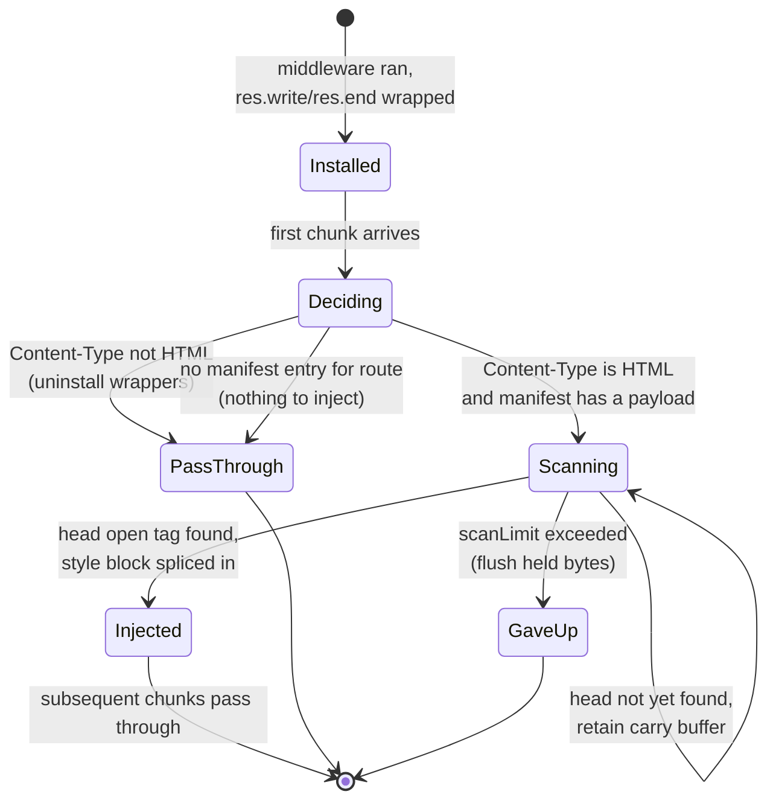
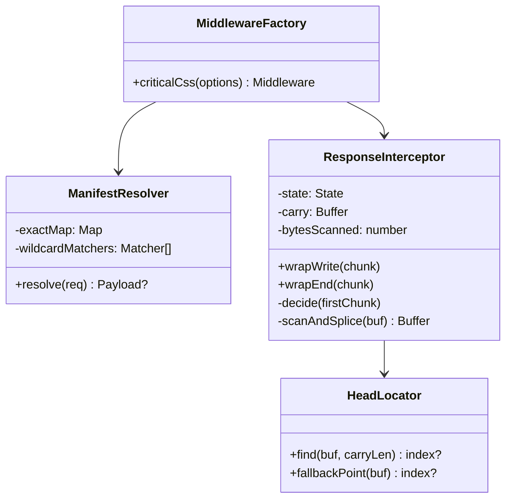

# 902 — Express Middleware Adapter

## 1. Title

**Critical CSS Extraction Engine — Express Adapter: Response-Interception Middleware for Automatic Critical-CSS Injection**

## 2. Version

| Field | Value |
|---|---|
| Document Version | 1.0.0 |
| Status | Draft — Phase 11 (SSR Integration) |
| Last Updated | 2026-07-09 |
| Owners | SSR Integration Working Group |
| Stability | The middleware factory signature and manifest contract are stable; the internal response-interception mechanics (buffer-vs-stream heuristics, `<head>` locator) may be refined without changing the public API |

## 3. Purpose

The Critical CSS Extraction Engine produces, per route, a small block of *critical CSS* — the exact set of rules required to paint the above-the-fold viewport without a flash of unstyled content (FOUC). [900-SSR-Overview.md](../design/900-SSR-Overview.md) established the general shape of the SSR integration surface: a build-time step generates per-route critical CSS, a *route manifest* (BRIEF.md §2.9) maps a request path to the critical-CSS artifact for that path, and a framework-specific *adapter* is responsible for inlining that artifact into the `<head>` of the server-rendered HTML response before it reaches the browser. This document specifies the **Express** adapter: a standard `app.use()` middleware that performs this inlining automatically, transparently, and without requiring the application author to modify a single route handler, template, or view.

The problem this document solves is deceptively narrow but operationally sharp. Express does not give middleware a clean "here is the final HTML, transform it" hook. Response bodies are written imperatively through `res.write()` and `res.end()`, may be streamed in arbitrarily many chunks, may be produced by any of dozens of view engines (EJS, Pug, Handlebars, raw `res.send`, `res.sendFile`, piped streams), and may not be HTML at all (JSON APIs, images, downloads, redirects). A correct adapter must intercept only HTML responses, locate the `<head>` within a byte stream that may straddle chunk boundaries, inject exactly once, correct the `Content-Length` when the body is buffered, and — critically — **not** transparently buffer multi-megabyte streaming responses that were deliberately streamed for latency reasons. This document explains the mechanics, the failure modes, and the design tradeoffs of doing all of this inside the constraints of the Node.js `http.ServerResponse` contract.

Put differently: this is the document a contributor reads immediately before opening `packages/adapter-express/src/middleware.ts`. It tells that contributor exactly which methods to wrap, in what order, what to do when the `<head>` tag is split across two `res.write()` calls, and how to guarantee that a response is never injected into twice.

## 4. Audience

- Implementers of `packages/adapter-express` — the engineers writing the middleware factory, the response-interceptor, and the `<head>` locator.
- Application authors integrating the engine into an existing Express or Connect-compatible application (any framework using the `(req, res, next)` middleware contract: Express 4/5, Connect, and by extension the compatibility layer used by [906-Fastify.md](../design/906-Fastify.md)).
- Implementers of sibling SSR adapters ([901-React-SSR.md](../design/901-React-SSR.md), [903-NextJS.md](../design/903-NextJS.md), [904-Astro.md](../design/904-Astro.md), [905-Remix.md](../design/905-Remix.md)) who need to understand how the Express adapter's response-interception model differs from framework-native render hooks, so their own adapters can reuse the shared injection primitive rather than reinventing it.
- Reviewers verifying conformance with BRIEF.md §2.10 ("Provide middleware for automatic CSS injection").

Readers are assumed to be fluent in the Node.js HTTP module (`http.ServerResponse`, streams, `Transfer-Encoding: chunked`) and the Express middleware lifecycle. This document does not teach Express; it specifies an adapter built on top of it.

## 5. Prerequisites

- [900-SSR-Overview.md](../design/900-SSR-Overview.md) — the shared SSR integration model: the route-manifest contract, the injection-payload shape (`{ css, hash, preloadHints }`), the "inline once in `<head>`" invariant, and the terminology (critical CSS, FOUC, above-fold) reused throughout this document.
- BRIEF.md §2.9 (Route Manifest) — the `{ "/": "home.css", "/products": "products.css", "/blog/*": "blog.css" }` mapping this adapter consumes at request time, including glob semantics for wildcard routes.
- BRIEF.md §2.10 (SSR Integration) — the source-of-truth requirement this adapter satisfies.
- Familiarity with the Node.js `http.ServerResponse` write model: `write(chunk, encoding, callback)`, `end(chunk, encoding, callback)`, `writeHead`, `getHeader`/`setHeader`/`removeHeader`, and the fact that once the first byte is flushed to the socket, headers are immutable ("headers already sent").
- Familiarity with HTTP `Content-Length` vs `Transfer-Encoding: chunked` framing, because the adapter's behavior differs materially between the two.

## 6. Related Documents

- [900-SSR-Overview.md](../design/900-SSR-Overview.md) — parent overview; defines the manifest and injection payload this adapter consumes.
- [901-React-SSR.md](../design/901-React-SSR.md) — the framework-agnostic React `renderToString`/`renderToPipeableStream` adapter; frequently composed *with* this Express middleware (React produces the HTML, Express middleware injects into it).
- [903-NextJS.md](../design/903-NextJS.md) — Next.js adapter; contrasts with this document because Next owns its own server and does not expose a raw `app.use()` seam in the App Router.
- [904-Astro.md](../design/904-Astro.md) — Astro adapter; Astro's middleware model is conceptually close to this one and shares the `<head>` locator.
- [905-Remix.md](../design/905-Remix.md) — Remix adapter; Remix commonly runs *on* an Express server via `@remix-run/express`, making this middleware directly relevant as the outermost injection layer.
- [906-Fastify.md](../design/906-Fastify.md) — Fastify adapter; documents the equivalent mechanics under Fastify's `onSend` hook, which is a cleaner seam than Express's `res` method-wrapping and is contrasted explicitly here.

## 7. Overview

The Express adapter is exported as a **middleware factory**: `criticalCss(options) -> (req, res, next)`. The application registers it once, as early as practical in the middleware stack — before the route handlers that generate HTML, so that the interceptor is installed on `res` before any handler calls `res.write`/`res.end`/`res.send`:

```js
app.use(criticalCss({ manifest: './dist/critical/manifest.json' }));
```

The factory loads (and watches, in development) the route manifest, and returns a middleware whose entire job on each request is to **install a response interceptor** and then immediately call `next()`. It does *not* block, does *not* buffer speculatively, and adds sub-millisecond overhead to requests it ultimately does not touch. The actual work — locating `<head>`, injecting the critical-CSS `<style>` block — happens lazily, only if and when the downstream handler produces an HTML response.

The interceptor is installed by **monkey-patching the response object's write path**: the middleware replaces `res.write` and `res.end` (and, for correct header timing, observes `res.writeHead`) with wrappers that see every outgoing chunk. This is the only mechanism Express offers for a generic middleware to observe an arbitrary handler's output, because Express provides no post-render hook. The wrappers implement a small state machine (Section 8.3) that, on the first chunk, decides whether the response *could* be HTML (from `Content-Type`), and if not, restores the original methods and gets out of the way entirely — the zero-overhead fast path for JSON APIs, images, and redirects.

For responses that *are* HTML, the interceptor scans the outgoing byte stream for the `<head>` open tag and injects the critical-CSS `<style>` block immediately after it, exactly once. The scan is designed to handle the `<head>` tag being split across chunk boundaries (a real and common occurrence with template streaming) by retaining a small trailing "carry" buffer between chunks. Crucially, the interceptor is *stream-preserving*: once injection has occurred (or has been determined impossible), all subsequent chunks pass through untouched with zero buffering, so a 10 MB streamed HTML page is never fully resident in memory on account of this middleware.

Three invariants govern the entire design and are referenced throughout:

1. **Inject at most once per response.** A response carries a private sentinel (`res[INJECTED]`) so that double-registration of the middleware, or a manual injection by a sibling adapter (e.g., [901-React-SSR.md](../design/901-React-SSR.md) already inlined the CSS), is detected and the second injection is skipped (Section 8.5).
2. **Never corrupt a non-HTML response.** The `Content-Type` gate (Section 8.2) must be conservative: if the type is unknown or ambiguous when the first byte flushes, the adapter errs toward *not* injecting.
3. **Never force-buffer a stream.** The adapter only rewrites the portion of the stream up to and including the `<head>` injection point; everything after streams through. If `<head>` is never found within a bounded scan window (Section 8.6), the adapter flushes what it held and disables itself for the rest of that response.

## 8. Detailed Design

### 8.1 The Middleware Factory and Manifest Binding

`criticalCss(options)` accepts:

- `manifest`: a path to the route-manifest JSON, or a pre-loaded manifest object, or an async resolver function `(req) => Promise<Payload | null>`. The function form exists for applications whose route→CSS mapping cannot be expressed as a static path map (multi-tenant apps keyed on hostname, A/B-test variants keyed on a cookie).
- `resolvePath`: `(req) => string`, defaulting to `req.path`, allowing normalization (stripping locale prefixes, trailing slashes) before manifest lookup.
- `inject`: `'style' | 'link'`, defaulting to `'style'` (inline `<style>` block). The `'link'` mode instead injects a `<link rel="preload">` — used when the CSS is served from a CDN and inlining is not desired; see [900-SSR-Overview.md](../design/900-SSR-Overview.md) for the payload distinction.
- `scanLimit`: maximum bytes to scan for `<head>` before giving up (default 64 KiB — see Section 8.6).
- `shouldIntercept`: `(req, res) => boolean`, an escape hatch to skip specific responses (e.g., health checks).

The manifest is resolved into a lookup structure once at factory time: exact paths into a `Map`, wildcard patterns (`/blog/*`) compiled into an ordered list of matchers tested longest-prefix-first so that a more specific exact entry always wins over a wildcard. In development, the manifest file is watched (`fs.watch`) and hot-reloaded so a rebuild of critical CSS reflects without a server restart; in production it is loaded once and frozen.

**Why a factory rather than a singleton middleware:** applications commonly mount multiple Express routers with different asset pipelines (a marketing site and an embedded app), each with its own manifest. A factory lets each router mount its own configured instance. The alternative — a single global middleware reading a global config — was rejected because it cannot express per-router manifests and forces a hidden global, conflicting with the composability Express middleware is expected to have.

### 8.2 The Content-Type Gate

The single most important correctness gate is: **is this response HTML?** The adapter must never inject a `<style>` tag into a JSON payload or a binary image. The gate reads `res.getHeader('Content-Type')` at the moment the first chunk is about to be written (not earlier — the handler may set the header late, e.g. `res.type('html')` right before `res.send`).

The decision procedure:

1. If `Content-Type` is set and its media type is `text/html` (ignoring `; charset=...` parameters), the response is eligible.
2. If `Content-Type` is set to anything else (`application/json`, `image/png`, `text/plain`), the response is **ineligible**; the interceptor immediately uninstalls itself (restores original `write`/`end`) so subsequent chunks incur zero overhead.
3. If `Content-Type` is *unset* at first-byte time, the adapter applies a conservative fallback: it peeks at the first non-whitespace bytes of the first chunk. A leading `<!doctype html` or `<html` (case-insensitive) is treated as HTML; anything else is treated as ineligible. This handles handlers that write raw HTML via `res.write` without setting a content type, while refusing to guess on ambiguous binary or JSON-looking payloads.

**Why gate at first-byte rather than in the middleware entry:** the content type is frequently not known when the middleware runs — it is set by the downstream handler. Gating at first-byte is the earliest point at which the type is reliably knowable while still being early enough to uninstall before overhead accrues. **Alternative — gate on the request `Accept` header:** rejected because `Accept` describes what the client will *take*, not what the server *sent*; a handler may return JSON to a browser that sent `Accept: text/html`.

### 8.3 Response Interceptor State Machine

Each intercepted response moves through this state machine, driven by the wrapped `write`/`end` calls:



The states `PassThrough`, `Injected`, and `GaveUp` are all *terminal* with respect to interception: once in any of them, the wrappers become thin pass-throughs (or are physically uninstalled) so no further scanning or buffering occurs. Only the `Scanning` state ever holds bytes back, and it holds back at most `scanLimit` bytes plus one chunk.

### 8.4 The `<head>` Locator and Injection Splice

While `Scanning`, the interceptor accumulates incoming chunks into a small working buffer and searches for the case-insensitive `<head` token followed by the tag close `>` (accounting for attributes like `<head data-foo>`). Two subtleties:

- **Chunk-straddling.** The `<head>` tag may be split, e.g. chunk 1 ends `...<he` and chunk 2 begins `ad>...`. The locator therefore never discards the tail of a chunk that could be a prefix of the target token; it retains a *carry* of up to `len("<head") + maxAttrScan` bytes across chunk boundaries and re-scans the concatenation of carry + new chunk.
- **Injection point.** The `<style data-critical>` block is spliced in **immediately after** the `<head ...>` open tag (not before `</head>`, not at end of `<head>` content). Inserting at the top of `<head>` maximizes the chance the critical CSS is parsed before any subsequent `<link rel="stylesheet">` the page declares, so the browser has above-fold styles as early as possible — the entire point of critical CSS. If the document has no `<head>` but does have `<html>` or `<body>`, the locator falls back to injecting a synthesized `<head>` right after `<html>`, or before `<body>` as a last resort (Section 12).

The spliced payload is the string from [900-SSR-Overview.md](../design/900-SSR-Overview.md)'s injection contract: `<style data-critical="<hash>">...css...</style>`, optionally preceded by `<link rel="preload">` hints. The `data-critical` attribute carries the payload hash and doubles as the double-injection sentinel marker (Section 8.5).

### 8.5 Guaranteeing At-Most-Once Injection

Double injection produces duplicated CSS and, worse, can defeat client-side runtime that removes the critical block once the full stylesheet loads. Two independent guards prevent it:

1. **Response-object sentinel.** Before installing wrappers, the middleware checks `res[INJECTED_SYMBOL]`. If set, another instance of this middleware (double-`app.use`) or a sibling adapter already claimed this response, and the middleware calls `next()` without installing anything. On successful injection, it sets the symbol.
2. **In-stream marker detection.** While `Scanning`, if the locator encounters an existing `data-critical` marker in the outgoing bytes *before* it finds an injection point, it concludes the HTML was already injected upstream (e.g., [901-React-SSR.md](../design/901-React-SSR.md) inlined during render) and transitions directly to `PassThrough`. This guard is essential precisely because the two adapters are composable: React SSR may have already inlined, and Express must not inline again.

**Why two guards rather than one:** the sentinel guards against two *instances of this adapter*; the in-stream marker guards against a *different adapter or a build-time inlining* that never touched `res`. Neither subsumes the other.

### 8.6 Bounded Scan and the Stream-Preservation Guarantee

The adapter must not become an accidental full-response buffer. Two bounds enforce this:

- **`scanLimit` (default 64 KiB).** If `<head>` is not found within the first `scanLimit` bytes, the response is almost certainly not a normal HTML document with an early `<head>` (or is a pathological/minified-into-one-line document); the adapter flushes everything it held and transitions to `GaveUp`, streaming the remainder untouched. 64 KiB comfortably exceeds any realistic prologue (`<!doctype>`, `<html>`, opening `<head>`), while capping worst-case retained memory per in-flight response.
- **Post-injection pass-through.** The instant the `<head>` is found and the splice performed (state `Injected`), the *entire remaining body streams through with zero retention*. This is what makes the adapter safe on multi-megabyte streaming HTML (React `renderToPipeableStream`, Astro streaming): only the bytes up to and including `<head>` are ever buffered, which for a normal document is a few hundred bytes.

This bounded-scan design is the crux of satisfying BRIEF.md §2.10's implicit requirement that automatic injection not regress the latency benefits of streaming SSR.

### 8.7 Content-Length and Header Correction

If the handler set an explicit `Content-Length` (typical for buffered `res.send(htmlString)`), injecting bytes invalidates it. The interceptor handles this by:

- For **buffered** responses (single `res.end(body)` or `res.send`), the adapter computes the injected body's byte length and rewrites `Content-Length` via `res.setHeader` *before* the first byte flushes. This is always possible for the buffered case because the full body is available before any header commits.
- For **chunked/streamed** responses (`Transfer-Encoding: chunked`, no `Content-Length`), there is nothing to correct — chunked framing has no length header. If a handler paradoxically set both a `Content-Length` *and* streamed in multiple writes, the adapter removes the now-unknowable `Content-Length` and lets Node fall back to chunked encoding, logging a diagnostic.

**Why not always strip `Content-Length` and force chunked:** chunked encoding disables some intermediary optimizations and complicates certain client expectations; preserving an accurate `Content-Length` for the common buffered case is strictly better, so the adapter corrects rather than discards it when it can.

## 9. Architecture

### 9.1 Placement in the Express Middleware Stack


The middleware must be registered **before** the route handlers whose output it should transform, so that its wrappers are installed on `res` prior to any handler write. It should be registered **after** `compression` middleware only if the compressor also wraps `res.write` — ordering between two `res`-wrapping middlewares matters (Section 11). The recommendation is: register `criticalCss` *before* `compression`, so injection happens on plaintext HTML and compression then operates on the already-injected bytes.

### 9.2 Sequence of an Intercepted HTML Response

```mermaid
sequenceDiagram
    participant Client
    participant MW as criticalCss MW
    participant H as Route Handler
    participant Res as Wrapped res
    Client->>MW: GET /products
    MW->>MW: resolvePath -> "/products"<br/>manifest lookup -> payload
    MW->>Res: wrap write/end, set res[INJECTED]=pending
    MW->>H: next()
    H->>Res: res.type('html'); res.write(chunk1 "<!doctype...<head>...")
    Res->>Res: gate: Content-Type=text/html -> Scanning
    Res->>Res: locate <head>, splice <style data-critical>
    Res->>Res: correct/observe Content-Length; state=Injected
    Res->>Client: flush injected chunk1
    H->>Res: res.write(chunk2), res.end(chunk3)
    Res->>Client: pass through chunk2, chunk3 untouched
```

### 9.3 Class/Component View



## 10. Algorithms

### 10.1 Streaming Scan-and-Inject

**Problem.** Given a sequence of outgoing byte chunks, inject a fixed `<style>` payload exactly once immediately after the first `<head ...>` open tag, tolerating the tag being split across chunk boundaries, while retaining O(scanLimit) memory and never blocking pass-through after injection.

**Inputs.** Chunks `c_1..c_n` (Buffers/strings); `payload` (string); `scanLimit` (int).
**Outputs.** The same byte sequence with `payload` spliced in once, or unchanged if no `<head>` found within `scanLimit` or a `data-critical` marker was already present.

**Pseudocode.**

```
state = Deciding; carry = empty; scanned = 0
on write(chunk):
    if state == PassThrough: return original.write(chunk)
    if state == Injected:    return original.write(chunk)
    if state == Deciding:
        if not isHtml(res, chunk): state = PassThrough; uninstall(); return original.write(chunk)
        if manifest.resolve(req) == null: state = PassThrough; uninstall(); return original.write(chunk)
        state = Scanning
    # Scanning
    buf = concat(carry, chunk)
    if buf contains "data-critical":            # already injected upstream
        state = PassThrough; return original.write(buf)
    idx = HeadLocator.find(buf)
    if idx != NOT_FOUND:
        out = buf[0..idx] + payload + buf[idx..]
        correctContentLength(out.len - buf.len)
        state = Injected
        return original.write(out)
    scanned += chunk.len
    if scanned > scanLimit:                      # give up
        state = PassThrough; carry = empty
        return original.write(buf)
    # retain a safe carry: last (len("<head")+maxAttr) bytes that could be a token prefix
    keep = safeCarryLength(buf)
    original.write(buf[0 .. buf.len-keep])
    carry = buf[buf.len-keep ..]
on end(chunk):
    if chunk: write(chunk)
    if state == Scanning and carry not empty: original.write(carry)   # flush unmatched tail
    original.end()
```

**Time complexity.** O(B) where B = total body bytes for the pass-through portion, but the *scan* work is O(min(B, scanLimit)) with a Boyer-Moore-style search over the retained window; carry re-scan overlap is bounded by the constant carry length, so no quadratic blowup.
**Memory complexity.** O(scanLimit) retained bytes worst case (state `Scanning`); O(1) after `Injected`/`PassThrough`. For a normal document, retained bytes ≈ the document prologue length (a few hundred bytes).
**Failure cases.** (a) `<head>` never appears → `GaveUp`, response emitted unmodified plus a diagnostic. (b) Malformed/truncated `<head` at end of stream → flushed as-is by `end`. (c) `res.write` throws (socket closed) → wrapper propagates the error unchanged; no injection state leaks because state is per-response.
**Optimization opportunities.** Cache the compiled Boyer-Moore skip table for the constant `<head` token at module load; short-circuit the whole scan when the payload is empty (no critical CSS for the route).

### 10.2 Manifest Route Resolution

**Problem.** Map a request path to at most one critical-CSS payload, preferring exact matches over wildcards, deterministically.

**Pseudocode.**

```
resolve(path):
    if exactMap.has(path): return exactMap.get(path)
    for matcher in wildcardMatchers (ordered by descending prefix specificity):
        if matcher.test(path): return matcher.payload
    return null
```

**Time complexity.** O(1) for exact hits; O(W) worst case over W wildcard patterns (W is small — a handful per app). **Memory.** O(R) for R routes, loaded once. **Failure cases.** No match → `null` → adapter passes through (a route with no critical CSS is a valid, common state). **Optimization.** Compile wildcards into a single trie/radix structure if W grows large; not warranted for typical manifests.

## 11. Implementation Notes

- **Wrapping order with other `res`-wrapping middleware.** If `compression` is registered *after* `criticalCss`, then at the time `criticalCss` installs its wrappers, `res.write` is the *original*; `compression` will later wrap *criticalCss's* wrappers, so writes flow compression → criticalCss → socket — wrong order (compression sees plaintext, good, but criticalCss then can't see plaintext if compression buffered). The tested, recommended registration is `criticalCss` **before** `compression` so writes flow criticalCss → compression → socket: injection on plaintext, then compression. Document this ordering prominently; it is the most common integration mistake.
- **`res.send` and view engines.** Express's `res.send`/`res.render` ultimately call `res.end` with a buffered body and set `Content-Type` and `Content-Length` first — the buffered fast path where `Content-Length` correction (Section 8.7) always succeeds.
- **`res.sendFile` / piped streams.** These call `stream.pipe(res)`, which invokes the wrapped `res.write` per chunk — the streaming path is exercised. Files served this way are typically not HTML (static assets), so the `Content-Type` gate short-circuits them.
- **Preserve method identity for `writeHead`.** Some code calls `res.writeHead(status, headers)` which sets headers and may flush. The adapter observes `writeHead` to capture the final `Content-Type` but must call through so status/headers commit correctly.
- **TypeScript.** Type the middleware as `express.RequestHandler`; use a module augmentation for the `res[INJECTED_SYMBOL]` sentinel rather than `any`.

## 12. Edge Cases

- **No `<head>` in the document.** Fragment responses (HTMX partials, `res.send('<div>...')`) have no `<head>`. The locator's fallback returns no injection point and the response passes through unmodified — correct, since a fragment has no above-fold document to style.
- **`<head>` split across chunks** — handled by the carry buffer (Section 8.4).
- **Multiple `<head>` tags** (malformed HTML) — inject after the *first*, ignore the rest.
- **Response already injected upstream** — in-stream `data-critical` marker detection (Section 8.5) → pass through.
- **Handler ends without writing a body** (`res.end()` with no chunk, e.g. 204/304) — `Deciding` never reaches HTML; pass through.
- **Redirects (3xx)** — typically no HTML body; `Content-Type` gate or empty body short-circuits.
- **Compressed response written by an inner middleware before injection** — mitigated by the mandated registration order (Section 11); if violated, the gate sees a non-text/gzip `Content-Type` or unreadable bytes and safely passes through rather than corrupting.
- **`scanLimit` exceeded** (minified single-line giant prologue, or non-standard document) — `GaveUp`, emitted unmodified with a diagnostic.
- **Double `app.use(criticalCss(...))`** — response sentinel (Section 8.5) makes the second a no-op.
- **Socket closed mid-write** — wrapper propagates the error; per-response state prevents leakage.

## 13. Tradeoffs

- **Monkey-patching `res.write`/`res.end` vs a dedicated hook.** Express offers no post-render hook, so method-wrapping is the only generic mechanism. It is fragile (order-sensitive, competes with other wrappers). The tradeoff is accepted because it is the *only* way to satisfy "automatic, no route-handler changes." Contrast [906-Fastify.md](../design/906-Fastify.md), where Fastify's first-class `onSend` hook makes the same feature far cleaner — a reason to prefer Fastify's native hook where available, while still shipping the Express path for the large installed base.
- **Bounded scan vs guaranteed injection.** Capping the scan at `scanLimit` means a pathological document past that bound is not injected. The alternative — unbounded scan — risks buffering an entire large response. Correctness of the *latency guarantee* was prioritized over injecting into pathological documents (which are vanishingly rare and detectable via diagnostics).
- **Conservative `Content-Type` gate vs aggressive injection.** Erring toward *not* injecting when the type is ambiguous means occasionally missing a legitimately-HTML response that set no content type. This is strictly safer than the alternative (corrupting a JSON/binary payload), and the raw-`<html>` sniff (Section 8.2) recovers the common case.
- **Inline `<style>` vs `<link>` injection.** Inlining eliminates a round-trip (best FCP) at the cost of not being cacheable across pages; `<link>` mode trades a request for cacheability. Defaulting to inline matches the critical-CSS use case; the option exists for CDN-served setups.

## 14. Performance

- **Non-HTML fast path:** one `Content-Type` check on the first chunk, then wrappers uninstall — effectively zero marginal cost for JSON APIs and static assets, which dominate request volume in most apps.
- **HTML path retained memory:** O(document-prologue) ≈ hundreds of bytes for normal documents; hard cap O(scanLimit) = 64 KiB per in-flight response.
- **CPU:** a single Boyer-Moore search over the prologue window; the payload string is precomputed per route at manifest load, so injection is a buffer splice (one allocation) — sub-microsecond for typical prologues.
- **Streaming preserved:** post-injection zero-copy pass-through means streaming SSR (React `renderToPipeableStream`, Astro) keeps its time-to-first-byte characteristics; the middleware adds latency only up to the `<head>` byte, which is emitted essentially first anyway.
- **Manifest lookup:** O(1) exact / O(small W) wildcard per request; the compiled lookup is shared and immutable in production.
- **Recommended benchmark:** compare TTFB and full-response time of a streaming route with and without the middleware; the delta should be within noise for the pass-through region and bounded by one prologue-sized buffer splice for the injection.

## 15. Testing

- **Unit — `<head>` locator:** tag at start; tag with attributes; tag split across two/three chunks at every byte offset (property test); no `<head>`; multiple `<head>`; `<head>` beyond `scanLimit`.
- **Unit — Content-Type gate:** `text/html`, `text/html; charset=utf-8`, `application/json`, `image/png`, unset+`<!doctype`, unset+`{json}`.
- **Unit — Content-Length correction:** buffered `res.send`; chunked stream; paradoxical Content-Length + multi-write.
- **Unit — double-injection guards:** double `app.use`; pre-existing `data-critical` marker in body.
- **Integration:** real Express app with EJS/Pug/Handlebars view engines; `res.sendFile` for a static HTML file; a streaming route via `renderToPipeableStream` piped to `res` (cross-check with [901-React-SSR.md](../design/901-React-SSR.md)); a Remix-on-Express server (cross-check [905-Remix.md](../design/905-Remix.md)); ordering with `compression` in both registration orders (assert correct output for the recommended order, a clear diagnostic for the wrong one).
- **Golden-CSS snapshots:** for a fixed manifest + fixed HTML, assert byte-exact injected output (guards against accidental whitespace/attribute drift).
- **Performance regression:** assert retained memory stays O(scanLimit) on a 10 MB streamed HTML fixture and that TTFB delta is within threshold.
- **Fuzz:** random chunk boundaries over a corpus of real HTML documents to exercise carry-buffer correctness.

## 16. Future Work

- **`Accept-Encoding`-aware coordination with compression** so the adapter can inject *after* declaring it will compress, removing the ordering footgun (Section 11) by detecting a downstream compressor and self-ordering.
- **HTTP/2 server push / 103 Early Hints** — emit `Link: rel=preload` Early Hints for the critical CSS artifact before the body flushes, complementing inline injection.
- **Edge-runtime variant** — a `WHATWG ReadableStream` `TransformStream` implementation of the same scan-and-inject algorithm for Cloudflare Workers / Deno Deploy, shared with [903-NextJS.md](../design/903-NextJS.md)'s edge middleware and [905-Remix.md](../design/905-Remix.md).
- **Manifest push invalidation** — subscribe to the build pipeline (BRIEF.md §2.11) so production manifests update without redeploy.
- **Per-request payload composition** — merge a route's critical CSS with a component-level fragment supplied by the handler via a response-local, for micro-frontend scenarios.

## 17. References

- [900-SSR-Overview.md](../design/900-SSR-Overview.md) — SSR integration overview, manifest and injection-payload contract.
- [901-React-SSR.md](../design/901-React-SSR.md) — React SSR adapter, composed with this middleware.
- [903-NextJS.md](../design/903-NextJS.md) — Next.js adapter (contrasting server-owned model).
- [904-Astro.md](../design/904-Astro.md) — Astro adapter (shared `<head>` locator).
- [905-Remix.md](../design/905-Remix.md) — Remix adapter (commonly on Express).
- [906-Fastify.md](../design/906-Fastify.md) — Fastify adapter (native `onSend` hook contrast).
- BRIEF.md §2.9 (Route Manifest), §2.10 (SSR Integration), §4 (Global Rules).
- Node.js `http.ServerResponse` documentation — `write`, `end`, `writeHead`, header mutability.
- MDN — Critical rendering path, `<style>` in `<head>`, HTTP `Content-Length` vs `Transfer-Encoding: chunked`.
