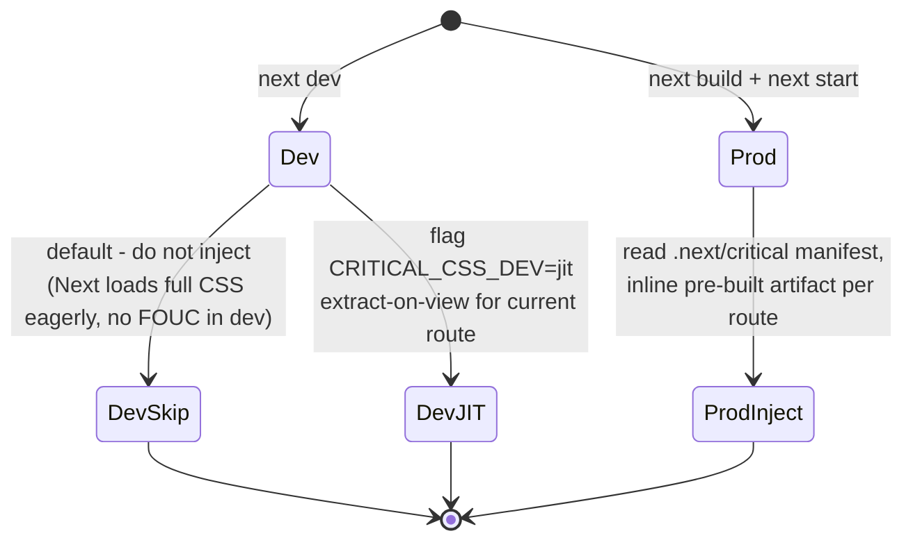
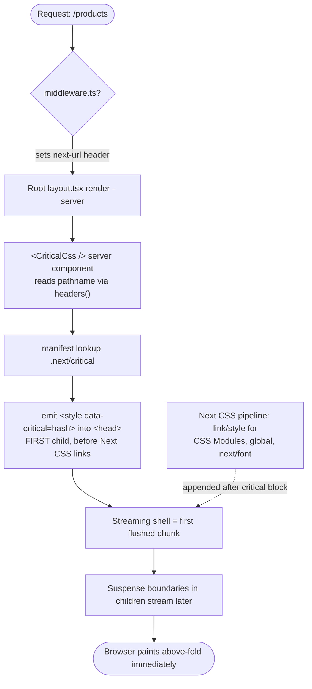
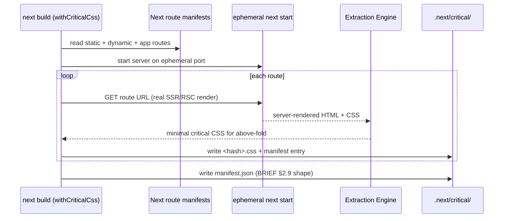
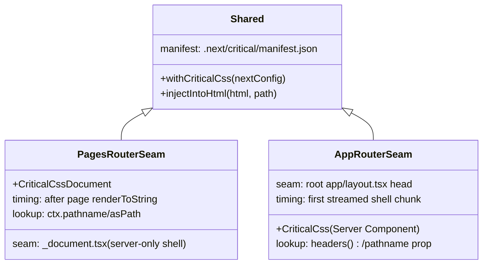

# 903 — Next.js Adapter

## 1. Title

**Critical CSS Extraction Engine — Next.js Adapter: Per-Route Critical-CSS Injection Across the Pages Router and the App Router**

## 2. Version

| Field | Value |
|---|---|
| Document Version | 1.0.0 |
| Status | Draft — Phase 11 (SSR Integration) |
| Last Updated | 2026-07-09 |
| Owners | SSR Integration Working Group |
| Stability | The build-time route-enumeration contract and the injection payload are stable; the specific injection seams track Next.js internals (custom `Document`, root layout, Route Handlers) and are versioned against Next major releases |

## 3. Purpose

Next.js is the most structurally complex target the Critical CSS Extraction Engine integrates with, and it is complex for a specific reason: it is not one rendering model but **two coexisting ones**. The **Pages Router** (`pages/` directory, stable since Next 9) renders via a per-request `getServerSideProps`/`getStaticProps` data phase followed by React `renderToString`, with a single customizable `pages/_document.tsx` controlling the outer HTML shell. The **App Router** (`app/` directory, stable since Next 13) renders **React Server Components** with **streaming SSR** by default, has *no* `_document`, injects the document shell through a *root layout*, owns its own CSS pipeline (CSS Modules, global CSS, `next/font`), and can run on the Node runtime or the Edge runtime. An adapter that only understood one router would leave half the Next.js ecosystem uncovered.

This document specifies how the engine integrates with **both** routers such that each server-rendered route ships with its route-specific critical CSS inlined into the document `<head>`, without conflicting with Next's own CSS handling and without a flash of unstyled content. It covers three concerns the [902-Express.md](../design/902-Express.md) adapter does not have to face: (1) Next owns its server, so there is no clean `app.use()` seam in the App Router — injection must happen at framework-native points (custom `Document`, root layout, or a Route Handler / middleware); (2) Next has an opinionated, first-class CSS pipeline that the adapter must *cooperate* with rather than fight; and (3) Next's build (`next build`) already enumerates every route, which the engine leverages to drive build-time critical-CSS generation. It also specifies the deliberately different behavior in `next dev` versus `next build`/`next start`.

Put concretely: this is the document a contributor reads before writing `packages/adapter-next/src/document.tsx` (Pages Router), `packages/adapter-next/src/injectCriticalCss.tsx` (App Router root-layout component), and `packages/adapter-next/src/build.ts` (the `next build` hook that enumerates routes and invokes the extraction engine).

## 4. Audience

- Implementers of `packages/adapter-next` — the engineers writing the Pages-Router `Document` enhancer, the App-Router root-layout injection component, the build-time route enumerator, and the optional Edge middleware.
- Next.js application authors integrating the engine, who need to know exactly which file to touch (`_document.tsx` vs root `layout.tsx`) for their router and what changes in dev vs prod.
- Implementers of sibling adapters — especially [901-React-SSR.md](../design/901-React-SSR.md) (the App Router injection reuses the React streaming injection primitive) and [905-Remix.md](../design/905-Remix.md) (another streaming, nested-route React meta-framework with analogous seams).
- Reviewers verifying conformance with BRIEF.md §2.10.

Readers are assumed to understand React Server Components, streaming SSR, the difference between `getServerSideProps` and `getStaticProps`, and the Next.js App Router file conventions (`layout.tsx`, `page.tsx`, `route.ts`). This document does not teach Next.js.

## 5. Prerequisites

- [900-SSR-Overview.md](../design/900-SSR-Overview.md) — the route-manifest contract, the injection payload (`{ css, hash, preloadHints }`), and the "inline once, early in `<head>`" invariant.
- [901-React-SSR.md](../design/901-React-SSR.md) — the framework-agnostic React injection primitive (how a `<style data-critical>` is emitted into a `renderToString`/`renderToReadableStream` output), which the App Router path reuses.
- BRIEF.md §2.9 (Route Manifest) and §2.10 (SSR Integration).
- BRIEF.md §2.11 (CI/CD Pipeline) — the `Build → Crawl routes → Generate critical CSS` sequence the build-time hook participates in.
- Familiarity with the Next.js rendering internals named above.

## 6. Related Documents

- [900-SSR-Overview.md](../design/900-SSR-Overview.md) — parent overview; manifest and payload contracts.
- [901-React-SSR.md](../design/901-React-SSR.md) — React SSR injection primitive reused by the App Router path.
- [902-Express.md](../design/902-Express.md) — response-interception middleware; contrasted here because the App Router does *not* expose an equivalent raw `res` seam, and Next's custom-server mode can layer the Express adapter underneath.
- [904-Astro.md](../design/904-Astro.md) — another content-oriented framework with a build-time route list and streaming.
- [905-Remix.md](../design/905-Remix.md) — sibling streaming React meta-framework; closest analog for the App Router injection seam.
- [906-Fastify.md](../design/906-Fastify.md) — hook-based server adapter; relevant only for Next custom-server-on-Fastify setups.

## 7. Overview

The adapter provides **three cooperating pieces**, of which an application uses one or two depending on its router:

1. **A build-time route enumerator + extractor hook** (`withCriticalCss(nextConfig)`), shared by both routers. During `next build` it reads Next's own route manifest (`.next/routes-manifest.json` / the app/pages route list), maps each renderable route to a URL, drives the extraction engine ([900-SSR-Overview.md](../design/900-SSR-Overview.md)) against a locally-served build of the app, and emits the engine's route manifest (BRIEF.md §2.9) plus one critical-CSS artifact per route into `.next/critical/`. This is where per-route critical CSS actually comes from; the runtime pieces only *inject* pre-computed artifacts.
2. **A Pages Router injector** — an enhanced `_document.tsx` (`CriticalCssDocument`) that, during the document render, resolves the current route to its critical-CSS artifact and emits a `<style data-critical>` block into `<Head>`.
3. **An App Router injector** — a Server Component (`<CriticalCss />`) placed inside the root `app/layout.tsx`'s `<head>`, which resolves the current route (via the segment/`headers()` context) to its artifact and renders the `<style data-critical>` inline within the streamed RSC output.

The unifying principle is: **critical CSS is generated once at build time, keyed by route; at request time the adapter does an O(1) manifest lookup and inlines the pre-built artifact.** No extraction happens at request time in production. This keeps request-time overhead to a string lookup and a rendered `<style>` element.

The second principle is **non-interference with Next's CSS pipeline**. Next already inlines/links its own CSS (CSS Modules, global stylesheets, `next/font`) via `<link>` tags and, in the App Router, a sophisticated per-segment CSS chunking system. The adapter's critical CSS is *additive and idempotent*: it is emitted with a `data-critical` marker, placed *before* Next's own stylesheet `<link>`s so it paints first, and it never removes, reorders, or deduplicates Next's tags. The critical block is a fast-paint accelerator that Next's own (full) stylesheets supersede once they load. Section 8.6 details exactly how the ordering is achieved without fighting Next's `<head>` management.

Dev vs prod differs deliberately (Section 8.7): in `next dev` the adapter can either skip injection entirely (fastest iteration, Next's own CSS already prevents FOUC in dev because stylesheets load eagerly) or run a *just-in-time* extraction for the currently viewed route behind a flag; in `next build`/`next start` it always injects the pre-built artifact.

## 8. Detailed Design

### 8.1 Build-Time Route Enumeration and Extraction

`withCriticalCss(nextConfig, options)` wraps the user's `next.config.js`. It hooks the end of `next build` (via a webpack/turbopack plugin `done` hook, or a `postbuild` orchestration in the CI pipeline) and performs:

1. **Enumerate routes.** For the Pages Router, read `.next/routes-manifest.json` (`staticRoutes`, `dynamicRoutes`). For the App Router, read the app route tree (`.next/app-path-routes-manifest.json`). Dynamic routes (`/blog/[slug]`) are represented as glob entries (`/blog/*`) in the emitted manifest per BRIEF.md §2.9; optionally, `options.sampleParams` supplies concrete params so a representative instance is crawled for extraction.
2. **Serve the built app locally.** Start `next start` on an ephemeral port (or use the CI's already-running preview) so the extraction engine crawls the *real* server-rendered HTML — critical for correctness, since RSC output and Next's CSS chunking only exist in a real render (Principle: Browser Is Source of Truth, per [900-SSR-Overview.md](../design/900-SSR-Overview.md)).
3. **Extract per route.** For each route URL, invoke the engine (headless browser navigation → above-fold visibility → CSSOM extraction). The engine returns the minimal critical CSS for that route's above-fold viewport(s).
4. **Emit artifacts.** Write `.next/critical/<route-hash>.css` and a `manifest.json` mapping route pattern → artifact + content hash. The manifest is bundled so the runtime injectors can read it (Node runtime: filesystem; Edge runtime: inlined into the bundle as a JSON import — Section 11).

**Why crawl a real `next start` server rather than statically analyze bundles:** Next's CSS is split, tree-shaken, and (App Router) per-segment; the actual set of rules that apply above-fold for a route is only knowable from a real render in a real browser. Static bundle analysis would over- or under-include. This mirrors the engine's core design principle that the browser is the source of truth.

### 8.2 Pages Router — Custom `Document` Injection

The Pages Router renders in two phases: a data phase (`getServerSideProps`/`getStaticProps`) then `renderToString` of the page wrapped by `_document`. `_document` is rendered **once per request on the server only** (never on the client) and controls `<html>`, `<head>`, `<body>` — exactly the shell where critical CSS belongs.

The adapter exports `CriticalCssDocument`, either as a drop-in `_document.tsx` or a mixin the app's existing `Document` extends. In `Document.getInitialProps` (or the render), it resolves `ctx.pathname`/`ctx.asPath` to the route pattern, looks up the manifest, and emits into `<Head>`:

```tsx
<style data-critical={payload.hash} dangerouslySetInnerHTML={{ __html: payload.css }} />
```

placed as the **first** child of `<Head>` so it precedes Next's injected stylesheet `<link>`s (Next appends its CSS links to head during render; being first in `<Head>` keeps the critical block ahead in source order — Section 8.6).

**Timing note re: `getServerSideProps`.** Data fetching happens *before* the render, and `_document` renders *after* the page tree is stringified. The critical-CSS lookup therefore has full knowledge of the resolved route at document-render time — there is no timing hazard. The adapter must *not* attempt extraction in `getServerSideProps` (that would run per request and is the anti-pattern this design avoids); it only reads the pre-built manifest.

**Why `_document` and not `_app`:** `_app.tsx` runs on both server and client and does not own `<head>` structurally (it renders the page component, not the HTML shell). `_document` is server-only and owns the shell — the correct and only clean seam for shell-level `<head>` injection in the Pages Router.

### 8.3 App Router — Root Layout Server-Component Injection

The App Router has no `_document`. The document shell is defined by the **root `app/layout.tsx`**, which renders `<html>` and `<body>` (and may render `<head>` content). Server Components stream to the client; the shell is emitted first in the stream, so anything the root layout puts in `<head>` arrives at the very top of the HTML — ideal for critical CSS.

The adapter exports a **Server Component** `<CriticalCss />` intended to be rendered inside the root layout's head region:

```tsx
// app/layout.tsx
import { CriticalCss } from '@critical-css/next';
export default function RootLayout({ children }) {
  return (
    <html>
      <head>
        <CriticalCss />
      </head>
      <body>{children}</body>
    </html>
  );
}
```

`<CriticalCss />` is `async` and reads the current pathname from the App Router request context (via `headers()` — Next sets a `x-invoke-path`/`next-url` header the adapter reads, or an explicit `pathname` prop for setups where header access is undesirable). It resolves the manifest and renders `<style data-critical={hash}>{css}</style>`. Because it is a Server Component, the CSS never ships to the client as JS and is emitted directly into the streamed HTML head.

**Streaming interaction.** The root layout (and thus `<CriticalCss />`) renders in the **first flushed chunk** (the "shell") of the streaming response, *before* any Suspense boundary in `children` resolves. This guarantees the critical CSS is in the very first bytes the browser receives — the streaming model actively helps here, unlike the [902-Express.md](../design/902-Express.md) response-interception model that has to *find* `<head>` in a byte stream. There is no chunk-straddling problem because the adapter emits a React element into the tree; React's streaming renderer serializes it atomically into the shell.

**Why root-layout Server Component and not middleware/Route Handler:** the App Router's `middleware.ts` runs before render and cannot see or edit the rendered HTML (it operates on requests/responses at the edge but Next's streamed HTML body is not a plain string it can rewrite without buffering the stream — the same anti-pattern [902-Express.md](../design/902-Express.md) works hard to avoid). Emitting a Server Component into the shell is the idiomatic, zero-buffering seam. A Route Handler (`route.ts`) returns arbitrary responses and is used for API-style endpoints, not page shells; it is only relevant for the fallback custom-render case (Section 8.5).

### 8.4 Route Handlers and Non-Page Responses

App Router **Route Handlers** (`app/**/route.ts`) return `Response` objects (JSON, streams, files) and are *not* page renders — they have no `<head>`. The adapter does not touch them, exactly as [902-Express.md](../design/902-Express.md)'s `Content-Type` gate skips non-HTML. If an application uses a Route Handler to hand-render HTML (rare), the developer opts in explicitly by composing the shared React injection primitive from [901-React-SSR.md](../design/901-React-SSR.md) into that handler; the adapter provides `injectIntoHtml(htmlString, pathname)` for this case.

### 8.5 Custom Server Fallback

Some Next deployments run a custom server (`server.js` with `express`/`fastify` fronting `next()`), typically Pages Router. In this mode the [902-Express.md](../design/902-Express.md) middleware (or [906-Fastify.md](../design/906-Fastify.md) `onSend` hook) can be layered *in front of* Next's request handler as an additional injection path. The adapter documents this as a fallback for teams that cannot edit `_document`, and relies on the shared double-injection guards (`data-critical` marker detection, [902-Express.md](../design/902-Express.md) §8.5) so that if *both* `_document` and the Express middleware are active, injection still happens exactly once.

### 8.6 Cooperating With Next's CSS Pipeline (Non-Interference)

Next manages `<head>` aggressively: it injects `<link rel="stylesheet">` for CSS Modules/global CSS, `<link rel="preload">`/`<style>` for `next/font`, and (App Router) per-segment CSS. The adapter must not conflict:

- **Ordering:** the critical block is emitted *first* in `<head>` (Pages: first child of `<Head>`; App: first child rendered inside `<head>` in the root layout). Source order determines cascade for equal-specificity rules and, more importantly, determines paint order — critical CSS ahead of Next's `<link>`s means the browser can paint above-fold before those links resolve.
- **No mutation of Next's tags:** the adapter only *adds* one `<style data-critical>`; it never edits, removes, dedupes, or reorders Next's own head tags. Next's full stylesheets load and, being later and complete, define the final rendered styles; the critical block becomes redundant-but-harmless once they apply (and a client runtime may remove it — [900-SSR-Overview.md](../design/900-SSR-Overview.md)).
- **Idempotency with Fast Refresh:** in dev, Next re-injects CSS on HMR; the adapter's block carries `data-critical` and is keyed by route so a re-render replaces rather than duplicates it.

**Why "additive, first, never mutate" rather than replacing Next's CSS:** Next's CSS pipeline is load-bearing for correctness (hashing, chunking, dedup across segments). Replacing or reordering it risks subtle cascade bugs and breaks on every Next upgrade. The adapter's job is a *paint accelerator*, not a CSS manager — a strict boundary that keeps the integration robust across Next versions.

### 8.7 Dev vs Production Behavior



- **`next dev`:** default is *no injection*. Dev serves full CSS eagerly and unminified, so there is no FOUC to prevent and no build-time artifacts exist yet; injecting a stale/empty block would only add noise. A `jit` mode extracts on demand for the viewed route (slower first paint, useful for previewing the critical block during development).
- **`next build` + `next start`:** always inject the pre-built artifact. If a route has no artifact (extraction skipped/failed), the adapter injects nothing and logs a diagnostic — the page still works, just without the accelerator.

**Why differ:** the dev feedback loop must stay fast and the artifacts do not exist in dev; production is where FOUC-prevention and the artifacts both matter. Conflating the two would either slow dev or ship stale critical CSS.

## 9. Architecture

### 9.1 App Router Injection Points



### 9.2 Build-Time Generation Pipeline



### 9.3 Pages vs App Router Seam Comparison



## 10. Algorithms

### 10.1 Build-Time Route → Critical CSS Generation

**Problem.** Given a built Next app, produce one minimal critical-CSS artifact per renderable route and a manifest mapping route patterns to artifacts.

**Inputs.** Next route manifests; optional concrete params for dynamic routes; viewport set.
**Outputs.** `{ [routePattern]: { file, hash } }` manifest + per-route CSS files.

**Pseudocode.**

```
routes = enumerate(pagesRoutes ∪ appRoutes)        # static + dynamic(as globs)
server = startNextStart(ephemeralPort)
manifest = {}
for r in routes:
    url = toConcreteUrl(r, sampleParams[r])         # fill [slug] if provided, else skip dynamic
    if url == null: continue                        # unsampled dynamic -> glob entry, no artifact
    html = engine.navigateAndRender(server, url)    # real browser render
    critical = engine.extractCritical(html, viewports)
    hash = sha256(critical)
    write(`.next/critical/${hash}.css`, critical)
    manifest[patternOf(r)] = { file: `${hash}.css`, hash }
writeJson('.next/critical/manifest.json', manifest)
stopServer(server)
```

**Time complexity.** O(R · C) where R = number of routes, C = per-route extraction cost (dominated by browser navigation + CSSOM walk); routes are independent and parallelizable across a browser pool ([102-Browser-Pool] in the engine core), so wall-clock ≈ O(R·C / poolSize).
**Memory complexity.** O(largest single-route CSS + browser working set); artifacts are streamed to disk, not held.
**Failure cases.** (a) route render errors → skip route, emit diagnostic, do not fail the whole build unless CI threshold demands it (BRIEF §2.11). (b) dynamic route with no sample params → emitted as glob with no artifact (runtime injects nothing for it). (c) server fails to start → hard error, build fails.
**Optimization opportunities.** Reuse the engine's incremental cache (BRIEF §2.8): fingerprint (HTML, CSS assets, viewport) per route and skip re-extraction when unchanged across builds; parallelize with the browser pool; batch routes sharing a layout.

### 10.2 Request-Time Route Resolution and Injection (Production)

**Problem.** For a request path, inline the pre-built critical CSS exactly once, early in `<head>`.

**Pseudocode (App Router `<CriticalCss />`).**

```
async CriticalCss(props):
    path = props.pathname ?? headers().get('next-url') ?? headers().get('x-invoke-path')
    payload = manifest.resolve(normalize(path))     # exact then glob, O(1)/O(W)
    if payload == null: return null                 # nothing to inject
    return <style data-critical={payload.hash} dangerouslySetInnerHTML={{__html: payload.css}} />
```

**Time complexity.** O(1) exact / O(W) glob per request; no extraction. **Memory.** O(payload size), the CSS string. **Failure cases.** missing header → fall back to prop or render nothing; missing artifact → render nothing + dev-only warn. **Optimization.** manifest and CSS strings are module-loaded once and cached; on Edge runtime the manifest is inlined into the bundle (Section 11) so there is no filesystem read.

## 11. Implementation Notes

- **Edge runtime constraint.** App Router routes may run on the Edge runtime (no Node `fs`). The manifest and CSS strings must therefore be **importable as JS/JSON** (inlined into the bundle at build via the webpack/turbopack plugin), not read from disk at request time. The build hook emits both a filesystem copy (Node runtime) and a generated `manifest.generated.ts` module (Edge runtime); the injector imports the module so bundling resolves it statically.
- **`headers()` and dynamic rendering.** Reading `headers()` opts a route into dynamic rendering in the App Router. For fully static routes, prefer passing `pathname` explicitly (known at build) so the route can remain static; the build hook can code-gen per-route layouts with the pathname baked in for static export scenarios.
- **`next/font` interplay.** `next/font` injects `<style>` and preloads; the adapter's critical block should include the above-fold font-face rules the engine extracts, but must not remove `next/font`'s own tags. Ordering (critical first) ensures the font-face declarations are present at first paint.
- **App Router `<head>` handling.** Next hoists and dedupes certain head elements. The `<style data-critical>` is a plain style element and is emitted as-authored; verify against the target Next major that it is not stripped, and pin the seam per Next version in the adapter's compatibility matrix.
- **Type safety.** Ship `.d.ts` for `withCriticalCss`, `CriticalCss`, and `injectIntoHtml`; augment `next.config` typing.

## 12. Edge Cases

- **Dynamic route with many instances** (`/blog/[slug]`) — one glob artifact covers all; if per-slug above-fold differs materially, `sampleParams` can register representative variants, otherwise the glob's critical CSS is a superset chosen for safety.
- **Route with no CSS above-fold** (blank/redirect page) — empty artifact; injector renders nothing.
- **Parallel routes / intercepting routes** (App Router `@slot`, `(.)`) — resolved to their base path for manifest lookup; the shell layout still owns injection.
- **`next export` / static HTML export** — build hook injects at export time by emitting per-route layouts with baked pathnames (no runtime header available in a static file).
- **Both Pages and App routers in one app** (migration state) — the build hook enumerates both; each router uses its own seam; manifests merge by pattern.
- **Middleware rewrites/redirects** — the adapter resolves against the *final* rendered path (post-rewrite `next-url`), not the incoming URL, so a rewritten route gets the correct artifact.
- **Fast Refresh in dev (jit mode)** — `data-critical` keyed block is replaced, not duplicated.
- **Custom server double-injection** — guarded by `data-critical` marker detection shared with [902-Express.md](../design/902-Express.md).
- **Missing artifact in production** — no injection, diagnostic logged; page functions via Next's own CSS.

## 13. Tradeoffs

- **Framework-native seams vs response interception.** Unlike [902-Express.md](../design/902-Express.md)'s `res` wrapping, the Next adapter injects via idiomatic seams (`_document`, root layout Server Component). This is cleaner, streaming-safe, and Edge-compatible, but couples the adapter to Next internals that change across majors — hence the per-version compatibility matrix. Accepted because response interception is impossible/unsafe against Next's streamed RSC body without buffering the stream (defeating streaming's latency benefit).
- **Build-time extraction vs request-time.** All extraction happens at `next build`; request time is a lookup. This makes production request-time overhead negligible and deterministic, at the cost of artifacts being only as fresh as the last build (mitigated by the incremental cache, BRIEF §2.8, and manifest push invalidation as future work).
- **Additive/non-mutating cooperation with Next CSS vs owning CSS.** Being a pure accelerator that never mutates Next's tags maximizes robustness across Next versions but means a small, transient redundancy (critical block + full stylesheet both present briefly). Accepted: correctness and upgrade-safety dominate a few hundred bytes of transient overlap.
- **Dev skip-by-default vs always-inject.** Skipping in dev keeps the loop fast and avoids stale artifacts, at the cost of not previewing the critical block by default (recoverable via jit mode). Prioritizes developer velocity where FOUC is not a concern.

## 14. Performance

- **Request time (prod):** O(1) manifest lookup + a rendered `<style>` element serialized into the streamed shell — no browser, no extraction, sub-microsecond beyond the string emit.
- **First byte:** because the root layout / `_document` emits the critical block in the very first flushed chunk, the browser receives above-fold CSS in the initial bytes — the ideal FCP posture, and strictly better than post-hoc byte-stream interception.
- **Build time:** O(R·C) extraction, parallelized across the browser pool and short-circuited by the incremental cache; on warm caches only changed routes re-extract.
- **Bundle impact (Edge):** the inlined manifest adds the sum of critical-CSS sizes to the Edge bundle; keep artifacts minimal (the engine's job) and consider lazy per-route imports if the total grows large.
- **No streaming regression:** injection is an element in the RSC tree, not a stream transform, so time-to-first-byte and progressive streaming are unaffected — a key advantage over the interception model.
- **Benchmark:** compare FCP and TTFB of a route with and without the adapter under `next start`; expect FCP improvement (FOUC eliminated) with no TTFB regression.

## 15. Testing

- **Build hook:** enumerate routes for a fixture app with Pages-only, App-only, and mixed routers; assert manifest shape (BRIEF §2.9) and one artifact per renderable route; dynamic routes as globs; sampleParams variants.
- **Pages Router:** render `CriticalCssDocument` for several routes; assert `<style data-critical>` present, first in `<Head>`, before Next's CSS links; assert no injection for a route with no artifact; assert `getServerSideProps` timing does not affect the lookup.
- **App Router:** render root layout + `<CriticalCss />` via `renderToReadableStream`; assert the critical block is in the first flushed shell chunk (cross-check with [901-React-SSR.md](../design/901-React-SSR.md)'s streaming primitive); assert Server-Component-only (no client JS carries the CSS); assert Edge-runtime path uses the inlined manifest module.
- **Non-interference:** assert Next's own `<link rel="stylesheet">` and `next/font` tags are unmodified and ordered after the critical block; Fast Refresh replace-not-duplicate.
- **Route Handlers:** assert `route.ts` responses are untouched.
- **Custom server:** compose with [902-Express.md](../design/902-Express.md) middleware and assert single injection (double-injection guard).
- **Dev vs prod:** assert no injection in `next dev` default; jit mode extracts for the viewed route; prod injects the artifact.
- **Golden-CSS snapshots** per route; **performance regression** on FCP/TTFB.
- **Version matrix:** run seam tests against each supported Next major.

## 16. Future Work

- **Turbopack-native plugin** for the build hook as Turbopack becomes the default bundler, replacing the webpack plugin path.
- **`generateStaticParams` integration** to auto-enumerate dynamic-route instances for extraction instead of manual `sampleParams`.
- **103 Early Hints from Next middleware** — emit `Link: rel=preload` for the critical artifact before the render streams, complementing inline injection.
- **Partial Prerendering (PPR) awareness** — align the critical block with PPR's static shell so it lives in the prerendered portion.
- **Manifest push invalidation** from the CI pipeline (BRIEF §2.11) so production critical CSS updates without a full redeploy.
- **Shared Edge `TransformStream` injector** with [905-Remix.md](../design/905-Remix.md) and [902-Express.md](../design/902-Express.md)'s future edge variant for custom-render fallbacks.

## 17. References

- [900-SSR-Overview.md](../design/900-SSR-Overview.md) — SSR integration overview, manifest and payload contract.
- [901-React-SSR.md](../design/901-React-SSR.md) — React SSR streaming injection primitive reused by the App Router path.
- [902-Express.md](../design/902-Express.md) — Express response-interception middleware (custom-server fallback, contrast).
- [904-Astro.md](../design/904-Astro.md) — Astro adapter (build-time route list, streaming analog).
- [905-Remix.md](../design/905-Remix.md) — Remix adapter (closest streaming-meta-framework analog).
- [906-Fastify.md](../design/906-Fastify.md) — Fastify adapter (custom-server-on-Fastify relevance).
- BRIEF.md §2.8 (Incremental Cache), §2.9 (Route Manifest), §2.10 (SSR Integration), §2.11 (CI/CD Pipeline), §4 (Global Rules).
- Next.js documentation — custom `Document`, App Router root layout, Server Components, streaming, Route Handlers, Edge runtime, `next/font`.
