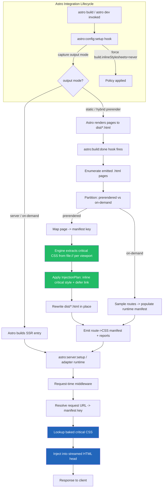

# 904 — Astro Adapter

## 1. Title

**Critical CSS Extraction Engine — Astro Integration Adapter: Build-Time (SSG) and Server (SSR) Critical CSS Injection Under Island Architecture**

## 2. Version

| Field | Value |
|---|---|
| Document Version | 1.0.0 |
| Status | Draft — Phase 11 (SSR Integration) |
| Last Updated | 2026-07-09 |
| Owners | SSR Integration Working Group |
| Stability | The integration-hook surface (`astro:config:setup`, `astro:build:done`, `astro:server:setup`) is stable and mirrors Astro's public Integration API contract; the internal mapping from Astro page routes to engine route-manifest keys is stable; heuristics for island-boundary CSS attribution may evolve without breaking the hook contract |

## 3. Purpose

[900-SSR-Overview.md](../design/900-SSR-Overview.md) established the general model by which the Critical CSS Extraction Engine attaches to a server or build framework: the engine produces, per route, a serialized critical-CSS payload keyed by the route-manifest scheme defined in [BRIEF.md](../../BRIEF.md) Section 2.9, and a framework-specific *adapter* is responsible for two mechanical tasks — resolving the current request or page to a manifest key, and injecting the corresponding critical CSS inline into the `<head>` of the emitted HTML while deferring the full stylesheet. This document specifies that adapter for **Astro**, and it is deliberately different in emphasis from every other adapter document in Phase 11.

The difference is architectural. [902-Express.md](../design/902-Express.md), [903-NextJS.md](../design/903-NextJS.md), and [906-Fastify.md](../design/906-Fastify.md) all describe *request-time* injection: a server receives an HTTP request, the adapter runs inside the response path, and critical CSS is chosen and inlined per request. Astro inverts this. Astro is **static-first**: the overwhelmingly common deployment mode is Static Site Generation (SSG), in which every page is rendered to an HTML file at build time and served as a static asset with no server in the request path at all. For a static-first framework, request-time injection is not merely one option among several — it is frequently *impossible*, because there is no live server to run middleware in. Therefore this adapter's center of gravity is the **build-time** path: critical CSS must be extracted and inlined during `astro build`, baked permanently into the emitted `.html` files, so that the deployed static artifact already carries its own above-the-fold CSS with zero runtime cost.

This document answers, precisely: (1) how the adapter registers itself using Astro's Integration API and which lifecycle hooks it subscribes to; (2) how, during an SSG build, it discovers the set of emitted pages, maps each to a route-manifest key, extracts critical CSS by driving the engine against the built HTML, and rewrites the emitted file to inline that CSS; (3) how, in Astro's optional SSR "on-demand rendering" mode, it falls back to the request-time middleware model shared with the other adapters; and (4) — the subtlest part — how the adapter interacts correctly with **Astro's island architecture** and **Astro's own scoped-style handling**, two features that fundamentally shape what CSS exists on the page and how it is attributed. Getting island interaction wrong produces the two classic critical-CSS failure modes: shipping too much (defeating the purpose) or shipping too little (causing a flash of unstyled content, FOUC, on hydration).

## 4. Audience

- Implementers of `packages/adapters/astro` (or the published `@critical-css/astro` integration package), who will write the hook handlers this document specifies.
- Astro application engineers integrating the engine into an existing Astro project, who need to understand what the integration does to their build output and their `astro.config.mjs`.
- Maintainers of the shared adapter core (see [900-SSR-Overview.md](../design/900-SSR-Overview.md) Section 8) who need to know which parts of the Astro adapter are Astro-specific versus delegated to the shared injection/manifest machinery.
- Reviewers verifying that the adapter honors Astro's scoped-style guarantees and does not break island hydration.

Readers are assumed to have read [900-SSR-Overview.md](../design/900-SSR-Overview.md) in full and to understand the engine's route-manifest concept ([BRIEF.md](../../BRIEF.md) Section 2.9). Familiarity with Astro's component model (`.astro` files, islands via `client:*` directives, scoped `<style>` blocks) is assumed at the level of Astro's public documentation; this document re-explains only the aspects that materially affect CSS attribution.

## 5. Prerequisites

- [900-SSR-Overview.md](../design/900-SSR-Overview.md) — the shared adapter model: manifest resolution, the inline-critical / defer-full injection contract, the `<head>` mutation rules, and the shared `InjectionPlan` DTO.
- [901-React-SSR.md](../design/901-React-SSR.md) — the base string-injection primitives (HTML head rewriting, `<style data-critical>` marker convention, preload/onload swap for the full sheet) that the Astro adapter reuses verbatim, since Astro emits plain HTML strings.
- [BRIEF.md](../../BRIEF.md) Section 2.9 (Route Manifest) and Section 2.10 (SSR Integration adapter list, which names Astro explicitly).
- The engine core extraction contract as documented across Phases 3–9 — the Astro adapter is a *consumer* of extracted critical CSS, not a re-implementation of extraction. It calls the same engine entry point that the CLI does.
- Astro Integration API concepts: the `AstroIntegration` object shape, the `hooks` map, and the semantics of `astro:config:setup`, `astro:build:done`, and `astro:server:setup`.

## 6. Related Documents

- [900-SSR-Overview.md](../design/900-SSR-Overview.md) — parent overview; the shared injection contract.
- [901-React-SSR.md](../design/901-React-SSR.md) — HTML string injection primitives reused here.
- [902-Express.md](../design/902-Express.md) — sibling adapter, request-time middleware model (used by Astro's SSR fallback).
- [903-NextJS.md](../design/903-NextJS.md) — sibling adapter; Next.js is the closest analogue for a hybrid static/SSR meta-framework and informs the SSG-vs-SSR branching here.
- [906-Fastify.md](../design/906-Fastify.md) — sibling adapter; the SSR-mode middleware shares Fastify/Express-style hook semantics.
- [905-Remix.md](../design/905-Remix.md) — sibling adapter; contrast Remix's always-SSR nested-route model with Astro's static-first model.
- [BRIEF.md](../../BRIEF.md) Sections 2.9, 2.10.

## 7. Overview

Astro is a web framework whose defining design decision is that it ships **zero JavaScript by default**. A `.astro` component renders to static HTML at build time; interactivity is opt-in per component via `client:*` directives, and only those explicitly hydrated components — the "islands" — ship JS to the browser. This has a direct and favorable consequence for critical CSS: because most of the page is static server-rendered markup, the above-the-fold DOM that the engine inspects is *stable and fully materialized in the emitted HTML file*, with no client-side rendering pass that could change layout after load. The engine's browser-driven extraction (Phases 3–4) can therefore load the emitted `.html` file directly and observe the true rendered above-fold region.

The adapter operates in one of two modes, determined by the project's Astro configuration (`output: 'static'` versus `output: 'server'` / `'hybrid'`):

1. **SSG mode (default, primary).** All work happens at build time inside the `astro:build:done` hook. Astro has already rendered every page to a `.html` file in the build output directory (`dist/` by default) and reports the full list of emitted routes and file paths to the hook. The adapter iterates those pages, maps each to a manifest key, drives the engine to extract critical CSS from the emitted file, and rewrites the file in place to inline the critical CSS and defer the full stylesheet. The deployed artifact is pure static HTML with baked-in critical CSS.

2. **SSR mode (opt-in).** For pages rendered on-demand by a server (Astro's adapter-backed SSR, e.g. Node, Cloudflare, Vercel), build-time baking is impossible for dynamic routes. The adapter registers request-time middleware — using the same shared middleware core as [902-Express.md](../design/902-Express.md) — that intercepts the streamed HTML response and injects critical CSS per request, looking the CSS up from a manifest generated by a *prior* build-time crawl of representative routes.

The two modes are not mutually exclusive: Astro's `hybrid` output pre-renders some routes statically and renders others on demand. The adapter handles both simultaneously, applying build-time baking to pre-rendered pages and request-time injection to on-demand pages.

The overwhelming majority of this document concerns SSG mode, consistent with Astro's static-first nature and the explicit instruction that build-time is the emphasis.

Two Astro-specific complications pervade both modes and are treated in depth in Section 8:

- **Island CSS.** A hydrated island (e.g. a React/Vue/Svelte component with `client:load`) may carry its own CSS — either scoped `<style>` in an `.astro` wrapper, or CSS imported by the framework component, or CSS-in-JS emitted at hydration. If that island is above the fold, its CSS is *critical*; if below the fold, it is not. But islands hydrate *after* first paint, so their styling must be present at first paint to avoid FOUC on the initial static render.
- **Astro scoped styles.** Astro rewrites `<style>` blocks inside `.astro` components by appending a per-component hash attribute (e.g. `data-astro-cid-xxxxx`) to both the selectors and the matching elements, achieving style scoping without Shadow DOM. The engine must treat these hashed selectors as ordinary attribute-qualified selectors — which, because the engine never parses selectors itself and delegates to `element.matches()` (see [400-Selector-Matching.md](../design/400-Selector-Matching.md)), it does correctly and automatically. This document explains *why* that automatic correctness holds and what the adapter must preserve to keep it holding.

## 8. Detailed Design

### 8.1 Integration registration and the config hook

Astro integrations are plain objects with a `name` and a `hooks` map. The adapter is a factory function returning such an object:

```ts
export default function criticalCss(options: CriticalCssAstroOptions = {}): AstroIntegration {
  let mode: 'static' | 'server' | 'hybrid';
  let outDir: URL;
  const resolved = resolveOptions(options); // merges engine config, viewport profiles, manifest path

  return {
    name: '@critical-css/astro',
    hooks: {
      'astro:config:setup': ({ config, command, updateConfig, logger }) => {
        mode = config.output;                 // capture SSG vs SSR
        // Ensure Astro emits full CSS as external files we can defer,
        // rather than inlining everything itself (see 8.6).
        updateConfig({ build: { inlineStylesheets: 'never' } });
        logger.info(`critical-css: mode=${mode}`);
      },
      'astro:server:setup': ({ server }) => {
        if (mode !== 'static') attachDevMiddleware(server, resolved); // dev-time preview only
      },
      'astro:build:done': async ({ dir, routes, pages, logger }) => {
        await runBuildTimeExtraction({ dir, routes, pages, resolved, mode, logger });
      },
    },
  };
}
```

Three hooks matter:

- **`astro:config:setup`** runs earliest, once, before build or dev. Its job here is *policy*, not extraction: capture `config.output` to decide the mode, and — critically — call `updateConfig({ build: { inlineStylesheets: 'never' } })`. This is a load-bearing configuration override discussed in Section 8.6: Astro by default may inline small stylesheets directly into `<head>`, which would make it impossible for the adapter to cleanly separate "the full sheet to defer" from "the critical subset to inline." Forcing external stylesheets gives the adapter a clean seam.

- **`astro:server:setup`** runs only in `astro dev`. It receives the underlying Vite dev server and lets the adapter attach dev-only middleware so developers can preview critical-CSS injection locally. This path never runs in production and is best-effort: dev serves un-baked HTML, so the middleware extracts on-the-fly (with caching) purely for parity preview.

- **`astro:build:done`** is the heart of the adapter. It runs after Astro has written all output. It receives `dir` (the output directory URL), `routes` (route metadata objects), and `pages` (the list of built page pathnames). This is where SSG baking happens.

### 8.2 The `astro:build:done` extraction pass (SSG)

The build-done handler executes the following pipeline:

1. **Enumerate emitted pages.** From `pages` and `routes`, build the concrete list of `.html` files written to `dir`. Astro reports pages as pathnames (`''`, `'about'`, `'blog/post-1'`); each maps to a file (`dist/index.html`, `dist/about/index.html`, etc.) according to Astro's `build.format` setting (`directory` vs `file`). The adapter resolves the physical path from the same setting captured in config-setup.

2. **Partition pre-rendered vs on-demand.** In `hybrid`/`server` mode, `routes` marks each route with a `prerender` boolean. Only pre-rendered routes have an emitted `.html` file to bake; on-demand routes are deferred to the SSR middleware and are only *sampled* here to populate the runtime manifest.

3. **Map each page to a manifest key.** Using the shared manifest matcher from [900-SSR-Overview.md](../design/900-SSR-Overview.md), resolve the page's pathname to a manifest key. Dynamic routes (`blog/[slug]`) collapse to a wildcard key (`/blog/*`) per Section 2.9; multiple concrete pages sharing a wildcard key are extracted once and the result reused (Section 8.5).

4. **Extract critical CSS.** For each unique manifest key, invoke the engine core against a `file://` URL pointing at the emitted `.html` file, for each configured viewport profile (Mobile/Tablet/Desktop per [BRIEF.md](../../BRIEF.md) Section 2.6). Because the file is fully static server-rendered markup, the browser loads it deterministically. The engine's own incremental cache ([BRIEF.md](../../BRIEF.md) Section 2.8) fingerprints the HTML + referenced CSS, so unchanged pages across builds skip re-extraction.

5. **Rewrite the emitted file.** Apply the shared `InjectionPlan` to the HTML string: insert a `<style data-critical>` block containing the (merged, minified) critical CSS at the top of `<head>`, and rewrite each existing `<link rel="stylesheet">` to the deferred-load pattern (`rel="preload" as="style" onload="this.rel='stylesheet'"` with a `<noscript>` fallback), exactly as specified in [901-React-SSR.md](../design/901-React-SSR.md) Section 8. Write the file back to disk.

6. **Emit the manifest artifact.** Write the route→critical-CSS manifest to the output (used by SSR middleware and by diagnostics). Emit the reporter output (matched/unmatched selectors, timing) per [BRIEF.md](../../BRIEF.md) Section 2.12.

### 8.3 Island architecture interaction

An Astro island is a component marked with a `client:*` directive. At build time, Astro server-renders the island's initial HTML *and* records that the component must hydrate on the client. The island's CSS can arrive by three routes:

- **Scoped `<style>` in the wrapping `.astro`** — baked into the HTML as a hashed stylesheet at build time (Section 8.4).
- **CSS imported by the UI-framework component** (`import './Widget.css'` in a React island) — Astro bundles this into an external stylesheet linked from the page. Present in the emitted HTML's `<link>` set.
- **CSS-in-JS produced at hydration** (Emotion/Styled-Components inside a React island) — *not present in the emitted static HTML at all*; it is injected by client JS after hydration.

The first two cases are handled correctly by build-time extraction with **no special logic**, and this is the key insight: the engine does not care that a stylesheet "belongs to an island." It loads the emitted HTML, observes which elements are above the fold, and asks `element.matches()` which rules apply. If an above-fold island's rendered markup matches a rule (scoped or bundled), that rule is critical and is included; if the island is below the fold, its rules are excluded. Island membership is irrelevant to the extraction because the engine reasons about *rendered geometry and matched selectors*, not component provenance. This is a direct dividend of the "browser is source of truth" principle ([006-Design-Principles.md](../architecture/006-Design-Principles.md), Principle 1).

The third case — CSS-in-JS injected only at hydration — is the genuine hazard, and it is a hazard *shared* with client-rendered content generally (see [901-React-SSR.md](../design/901-React-SSR.md) Section 12 on client-injected styles). The adapter's stance:

- If the island framework performs **SSR-time style extraction** (as Astro's official React/Vue/Svelte renderers do for their scoped styles, and as Emotion/Styled-Components do when configured for SSR), the styles *are* present in the emitted HTML — either as a `<style>` block or a linked sheet — and fall back into cases 1/2, handled automatically.
- If a component injects styles *purely on the client* with no SSR extraction, those styles are invisible at build time. The engine cannot extract what does not exist in the rendered snapshot. The adapter documents this as a known limitation (Section 12) and provides a `waitForHydration` option that, when set, instructs the engine's Navigation Engine ([103-Navigation-Engine.md](../design/103-Navigation-Engine.md)) to allow islands to hydrate and inject their styles *before* the CSSOM snapshot is taken. This is off by default because hydrating during extraction contradicts the "measure the first-paint state" goal and can pull in styles that were never part of first paint; it is offered as an escape hatch for CSS-in-JS-heavy island setups.

The above-fold-island FOUC concern is thus reframed: as long as an above-fold island's styles are SSR-rendered into the HTML, build-time extraction captures them, and they are inlined critical, so first paint is styled. The island hydrates later against already-correct markup. No FOUC.

### 8.4 Astro scoped-style handling

Astro scopes `.astro` component `<style>` blocks by hashing. A rule written `h1 { color: red }` inside `Card.astro` becomes, in the emitted CSS, `h1[data-astro-cid-abc123] { color: red }`, and every `<h1>` rendered by that component instance gets `data-astro-cid-abc123` in the HTML. This is compile-time scoping without Shadow DOM (contrast [307-Constructable-Stylesheets.md](../design/307-Constructable-Stylesheets.md) and shadow-based scoping).

The engine handles this **without any Astro-specific code** for exactly the reason it handles any attribute selector: the engine never parses selectors and never attempts to understand what `data-astro-cid-abc123` "means." It hands the emitted selector string to the browser's `element.matches()` ([ADR-0002](../adr/ADR-0002-No-Custom-Selector-Parser.md), [400-Selector-Matching.md](../design/400-Selector-Matching.md)). Since the emitted HTML carries the matching attribute on the matching elements, `matches()` returns the correct boolean, and scoped rules are attributed to exactly the elements Astro intended. The hash is opaque and irrelevant to correctness.

What the adapter *must not do*, and this is the load-bearing obligation: it must not run extraction against un-scoped source, and must not alter or strip `data-astro-cid-*` attributes during file rewriting. The adapter extracts from the *emitted* HTML (post-scoping) and only mutates `<head>` (inserting critical `<style>`, rewriting `<link>` elements); it never touches element attributes in `<body>`. Preserving the emitted markup byte-for-byte except in `<head>` guarantees scoped selectors keep matching after rewrite.

### 8.5 Dynamic routes and page deduplication

Astro dynamic routes (`src/pages/blog/[slug].astro` with `getStaticPaths`) emit many concrete `.html` files at build time. Mapping all of them to a single wildcard manifest key (`/blog/*`) and extracting once would be fast but risky: two blog posts can have structurally different above-fold DOM. The adapter's policy, inherited from [900-SSR-Overview.md](../design/900-SSR-Overview.md) Section 9:

- **Default:** extract per concrete emitted file, but *store* under the wildcard key by unioning results across a bounded sample (configurable `sampleSize`, default 3 representative pages per wildcard). The union guards against under-inclusion (a rule needed by one post but not the sampled one) at the cost of mild over-inclusion.
- **`perPage: true`:** extract and bake every concrete page independently — maximal fidelity, higher build cost. Appropriate for pages whose above-fold structure varies significantly (dashboards, product pages).

The engine's incremental cache makes per-page extraction affordable across incremental builds: only pages whose HTML/CSS fingerprint changed are re-extracted.

## 9. Architecture

The following diagram shows the Astro integration lifecycle and where hook-driven injection occurs, covering both SSG (build) and SSR (server) paths.



The green nodes are the build-time (SSG) injection path — the primary path. The blue nodes are the request-time (SSR) injection path — the fallback for on-demand routes. Both converge on the same manifest artifact (`K`) produced during build.

## 10. Algorithms

### 10.1 Build-time page-baking algorithm

**Problem.** Given Astro's emitted static output, produce for each pre-rendered page an HTML file with critical CSS inlined and full CSS deferred, minimizing redundant extraction.

**Inputs:** `dir` (output URL), `routes[]` (with `prerender`, `pattern`), `pages[]` (pathnames), resolved options (viewports, manifest, sampleSize), engine handle.
**Outputs:** rewritten `.html` files; `manifest.json`; reporter artifacts.

```
function runBuildTimeExtraction(dir, routes, pages, opts):
    manifest = {}                      # key -> { viewport -> criticalCss }
    keyToFiles = groupPagesByManifestKey(pages, routes, opts)   # wildcard collapse
    for (key, files) in keyToFiles:
        prerendered = files.filter(f => routeOf(f).prerender)
        if prerendered.empty:
            # on-demand only: sample for runtime manifest, no baking
            sample = pick(files, opts.sampleSize)
        else:
            sample = opts.perPage ? prerendered : pick(prerendered, opts.sampleSize)
        merged = {}                    # viewport -> Set<rule>
        for file in sample:
            for vp in opts.viewports:
                css = engine.extract(fileUrl(file), vp)   # cache-aware
                merged[vp] = union(merged[vp], css.rules)
        critical = serializeMerged(merged, opts.viewports) # multi-viewport merge (2.6)
        manifest[key] = critical
        if opts.perPage:
            for file in prerendered:
                rewriteFile(file, extractFor(file), opts)
        else:
            for file in prerendered:
                rewriteFile(file, critical, opts)          # reuse merged result
    writeManifest(dir, manifest)
    writeReports(dir)
```

**Time complexity.** Let `P` = number of pre-rendered pages, `K` = distinct manifest keys, `V` = viewport count, `S` = sampleSize. Extraction cost is `O(K · min(P_k, S) · V · E)` where `E` is per-page engine extraction cost and `P_k` is pages under key `k`. With `perPage`, it degrades to `O(P · V · E)`. File rewriting is `O(P · H)` where `H` is HTML size (single-pass head rewrite). The incremental cache reduces `E` to near-zero for unchanged fingerprints, so amortized incremental-build cost is proportional to *changed* pages, not total pages.

**Memory complexity.** `O(V · R)` peak per key for the merged rule sets (`R` = rules per viewport), plus `O(H)` for the file being rewritten. Files are processed and released one at a time; the browser pool bounds concurrent page memory ([102-Browser-Pool.md](../design/102-Browser-Pool.md)).

**Failure cases.** Missing emitted file for a reported route (build/format mismatch) → warn and skip, do not fail the whole build unless `strict`. Engine extraction error on a page → recorded in reports; page left with full (non-deferred) CSS so it still renders correctly (fail-safe, not fail-broken). Manifest write failure → hard error (the artifact is required downstream).

**Optimization opportunities.** Parallelize per-key extraction across the browser pool; reuse a warm browser context across pages sharing a stylesheet set; skip rewriting when a page's fingerprint matches the previous build's baked output.

### 10.2 Head-rewrite algorithm

Reused verbatim from [901-React-SSR.md](../design/901-React-SSR.md) Section 10 (single-pass string injection: locate `<head>`, insert critical `<style data-critical>` immediately after `<head>` open, rewrite each `<link rel="stylesheet">` to the preload/onload swap with `<noscript>` fallback). Complexity `O(H)`. Not re-derived here; see that document.

## 11. Implementation Notes

- **`build.inlineStylesheets: 'never'`** is set defensively in `astro:config:setup`. Without it, Astro may inline small stylesheets into `<head>`, which the adapter would then have to *parse out* to know what to defer — a fragile inversion. Forcing external sheets gives a clean `<link>` seam. This override is logged so integrators understand why their small styles are no longer auto-inlined (the adapter re-inlines the *critical subset* instead).
- **File format resolution** (`build.format: 'directory' | 'file' | 'preserve'`) must be read from config and used to map pathnames to physical files; hardcoding `index.html` breaks `file` format.
- **`file://` extraction** requires the engine's Navigation Engine to accept local file URLs; relative asset references in the emitted HTML resolve against the file's directory. If the deployed site uses an absolute `base` path, the adapter passes a `base` rewrite so `element.matches()` still sees loaded stylesheets (a stylesheet that fails to load contributes no CSSOM, silently under-including — hence this is validated, and a load failure is a reported warning).
- **Dev middleware** (`astro:server:setup`) must never write to disk and must be clearly labeled preview-only; dev HTML differs from built HTML (unbundled, HMR-instrumented), so dev extraction is approximate.
- The adapter delegates *all* actual CSS extraction to the engine core and *all* head mutation to the shared injection module. Astro-specific code is confined to: hook wiring, mode detection, page enumeration, and format/path resolution. This keeps the Astro-specific surface small and testable.

## 12. Edge Cases

- **CSS-in-JS injected only at client hydration** (Section 8.3): invisible at build time; under-included unless `waitForHydration` is enabled. Documented limitation.
- **`view-transitions` / Astro's client router:** Astro's `<ViewTransitions />` swaps page content via client navigation without a full document load. Baked critical CSS is correct for the *initial* document load; subsequent client transitions swap `<body>` but retain the already-loaded full stylesheet, so no FOUC. The adapter must not strip the full-sheet `<link>` (only defer it) precisely so client transitions have their styles.
- **Astro scoped-style hash collisions / stability:** hashes are content-derived and stable across builds for unchanged components, which keeps the incremental cache warm; a component edit changes the hash, changing the fingerprint, correctly triggering re-extraction.
- **`is:global` styles** and global stylesheets: treated as ordinary global CSS; matched normally by `element.matches()`.
- **Empty pages / redirect routes:** routes with no HTML body (redirects, endpoints returning JSON) are skipped — the adapter only bakes text/html page routes.
- **Pages larger than the fold entirely below fold (rare):** engine returns minimal critical CSS; adapter still defers the full sheet. Correct.
- **Concurrent builds writing the same `dist/`:** file rewrite is not atomic across processes; the adapter assumes a single build process owns `dist/` (Astro's own invariant).

## 13. Tradeoffs

- **Build-time baking vs request-time injection.** *Why build-time as default:* Astro is static-first; baking yields zero runtime cost, CDN-cacheable pure-static artifacts, and deterministic output. *Alternative* (always request-time) requires a live server, defeating Astro's static deployment story. *Tradeoff:* baked CSS is fixed until the next build; content that changes without a rebuild (rare in SSG) would not get fresh critical CSS. Accepted, because SSG content is by definition build-time content.
- **Union-over-sample vs per-page extraction.** *Why union default:* bounds build cost on large dynamic-route sets while guarding under-inclusion. *Alternative* (`perPage`) is more accurate but scales linearly with page count. Exposed as an option; sensible default favors build speed with a safety margin.
- **Forcing `inlineStylesheets: 'never'`.** *Why:* a clean deferral seam. *Tradeoff:* tiny stylesheets that Astro would have inlined now round-trip as external files for *non-critical* CSS — but since the critical subset is inlined by the adapter, first paint is unaffected; only below-fold CSS is externalized, which is the desired behavior anyway.
- **No island-aware special-casing.** *Why:* the browser-is-source-of-truth model makes island provenance irrelevant to extraction, so special-casing would add complexity without benefit. *Tradeoff:* the sole gap (client-only CSS-in-JS) is handled by an opt-in flag rather than automatic detection, trading full automation for architectural simplicity and correctness.

## 14. Performance

- **CPU:** dominated by engine extraction (`O(K·S·V·E)`), which the incremental cache reduces to changed pages only. Head rewriting is linear in HTML size and negligible.
- **Memory:** bounded by browser-pool concurrency and single-file-at-a-time rewriting; no whole-site buffering.
- **Parallelization:** per-key extraction parallelizes across the browser pool up to the pool's concurrency cap ([102-Browser-Pool.md](../design/102-Browser-Pool.md)); file rewrites parallelize trivially (independent files).
- **Incremental execution:** the engine fingerprint (HTML + CSS assets + viewport + mode, [BRIEF.md](../../BRIEF.md) Section 2.8) skips unchanged pages; a no-op incremental build does near-zero extraction.
- **Scalability limits:** very large sites (10⁵+ pages) with `perPage` extraction are extraction-bound; the union-over-sample default keeps cost proportional to distinct route templates rather than concrete pages, which is the intended scaling axis.
- **Profiling guidance:** the reporter's timing output ([BRIEF.md](../../BRIEF.md) Section 2.12) breaks down per-key extraction time; cache hit/miss ratio is the primary metric for incremental-build health.

## 15. Testing

- **Unit tests:** manifest-key mapping from Astro route patterns (static, dynamic, wildcard collapse); file-path resolution across `build.format` variants; `inlineStylesheets` override application; head-rewrite string transformation (delegated tests shared with 901).
- **Integration tests:** run a real `astro build` on fixture projects (a static blog, a hybrid app, a page with React/Svelte islands, a page with Astro scoped styles) and assert emitted HTML contains `<style data-critical>`, deferred `<link>`, and preserved `data-astro-cid-*` attributes.
- **Island/scoped-style regression:** fixture with an above-fold scoped-styled island and a below-fold one; assert above-fold scoped rules are present in critical CSS and below-fold ones are absent.
- **Visual regression:** render baked page vs original (full CSS) at each viewport; pixel-diff the above-fold region must be within threshold (rendering parity, [BRIEF.md](../../BRIEF.md) Section 2.18). Golden CSS snapshots per fixture route.
- **SSR-mode tests:** boot Astro in `server` mode behind the request-time middleware; assert per-request injection matches the baked manifest.
- **Stress tests:** dynamic route with 10⁴ generated pages under `union` and `perPage`; assert build completes within budget and cache hit-rate on rebuild.
- **FOUC test:** hydrate an above-fold island in a headless browser against the baked page; assert no computed-style change to above-fold elements across hydration.

## 16. Future Work

- **Automatic client-only CSS-in-JS detection:** heuristically detect islands whose styles appear only post-hydration and auto-enable a scoped `waitForHydration` just for those islands, closing the one automation gap without globally hydrating.
- **Per-island critical extraction:** attribute critical CSS to specific islands so Astro could inline island-critical CSS adjacent to the island markup (finer-grained than page-level `<head>` inlining), aiding partial-hydration streaming.
- **Astro `<ViewTransitions>`-aware pre-fetch:** pre-inline critical CSS for likely next-navigation targets to keep client transitions instant.
- **Native Astro integration API for CSS attribution:** collaborate with Astro to expose per-component CSS provenance in `astro:build:done`, enabling attribution without re-deriving it from emitted HTML.
- **Open question:** should the adapter fingerprint on *rendered above-fold DOM* rather than whole-HTML, so content-only changes below the fold do not invalidate the critical-CSS cache? This would improve incremental hit rates but requires the engine to expose a fold-scoped fingerprint.

## 17. References

- [900-SSR-Overview.md](../design/900-SSR-Overview.md) — SSR integration overview and shared adapter contract.
- [901-React-SSR.md](../design/901-React-SSR.md) — HTML string injection primitives.
- [902-Express.md](../design/902-Express.md) — request-time middleware model (SSR fallback).
- [903-NextJS.md](../design/903-NextJS.md) — hybrid static/SSR meta-framework adapter.
- [905-Remix.md](../design/905-Remix.md) — sibling always-SSR nested-route adapter.
- [906-Fastify.md](../design/906-Fastify.md) — Fastify adapter.
- [400-Selector-Matching.md](../design/400-Selector-Matching.md) — `element.matches()` delegation (why scoped-style hashes just work).
- [307-Constructable-Stylesheets.md](../design/307-Constructable-Stylesheets.md) — contrast with Shadow-DOM scoping.
- [103-Navigation-Engine.md](../design/103-Navigation-Engine.md) — navigation and `waitForHydration`.
- [102-Browser-Pool.md](../design/102-Browser-Pool.md) — extraction concurrency bounds.
- [ADR-0002-No-Custom-Selector-Parser.md](../adr/ADR-0002-No-Custom-Selector-Parser.md) — no custom selector parsing.
- [006-Design-Principles.md](../architecture/006-Design-Principles.md) — Browser Is Source of Truth.
- [BRIEF.md](../../BRIEF.md) — Sections 2.6, 2.8, 2.9, 2.10, 2.12, 2.18.
- Astro Integration API — `AstroIntegration`, `astro:config:setup`, `astro:server:setup`, `astro:build:done` (public framework documentation).
