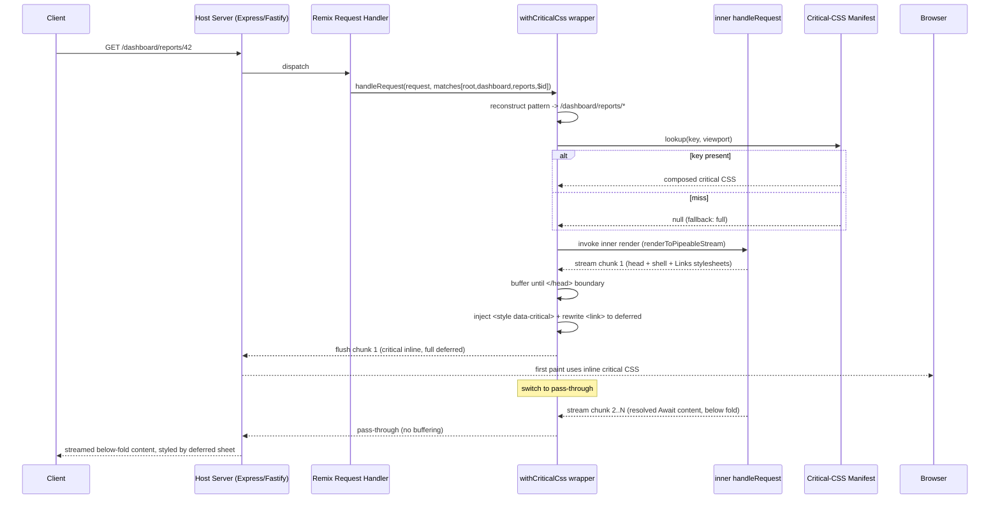

# 905 — Remix Adapter

## 1. Title

**Critical CSS Extraction Engine — Remix Integration Adapter: `entry.server` Injection, Nested-Route Loader Mapping, `links` Export vs Inline Critical CSS, and Streaming (Defer) Responses**

## 2. Version

| Field | Value |
|---|---|
| Document Version | 1.0.0 |
| Status | Draft — Phase 11 (SSR Integration) |
| Last Updated | 2026-07-09 |
| Owners | SSR Integration Working Group |
| Stability | The `entry.server.tsx` injection seam and the route-module → manifest-key mapping are stable; the streaming-injection ordering guarantees are stable; heuristics for composing per-route critical CSS across a nested-route match chain may evolve without breaking the injection contract |

## 3. Purpose

[900-SSR-Overview.md](../design/900-SSR-Overview.md) defined the shared adapter contract: resolve a request to a route-manifest key ([BRIEF.md](../../BRIEF.md) Section 2.9), then inline the critical CSS for that key into the emitted `<head>` while deferring the full stylesheet. This document specifies that adapter for **Remix** (and, by extension, React Router 7 in framework mode, which shares Remix's route-module and `entry.server` model).

Remix is architecturally the opposite of Astro ([904-Astro.md](../design/904-Astro.md)). Where Astro is static-first and does its critical-CSS work at build time, Remix is **server-first and always-SSR**: every request is rendered on the server through a single, user-owned entry point, `entry.server.tsx`. There is exactly one place where the full HTML document is produced, and it is code the application author controls. This is a *gift* for a CSS-injection adapter — there is a single, well-defined seam — but Remix also introduces a structural complication that no other Phase 11 adapter faces head-on: **nested routes**.

A Remix URL does not map to one route module; it maps to a *chain* of nested route modules (root → layout → sub-layout → leaf), all of which render simultaneously into one HTML document, each of which may contribute its own CSS via its `links` export. A single rendered page is therefore the composition of several route modules' markup and several route modules' stylesheets. The central question this document answers is: **how does per-route critical CSS map onto a chain of Remix route modules, and how is it composed into one inlined critical block for the document that the match chain produces?** Two secondary questions follow: how does inline critical CSS relate to Remix's idiomatic `links` export (the framework's own mechanism for declaring stylesheets), and how does injection behave under Remix's **streaming (`defer`) responses**, where the HTML is flushed to the client in chunks before all loader data is ready?

## 4. Audience

- Implementers of `packages/adapters/remix` (or `@critical-css/remix`), who will write the `entry.server` wrapper and the route-mapping logic specified here.
- Remix application engineers integrating the engine, who need to understand the one edit they must make to `entry.server.tsx` and how it interacts with their `links` exports.
- Maintainers of the shared adapter core ([900-SSR-Overview.md](../design/900-SSR-Overview.md)) verifying which logic is Remix-specific versus delegated.
- Reviewers confirming that injection is correct under both buffered and streaming responses.

Readers must have read [900-SSR-Overview.md](../design/900-SSR-Overview.md) and understand the route-manifest concept. Familiarity with Remix's route-module API (`loader`, `links`, `meta`, `default` export), the `entry.server.tsx` contract (`handleRequest` / `handleDataRequest`), `useMatches`, and `defer`/`Await` streaming is assumed at the level of Remix's public docs; this document re-explains only what materially affects CSS injection.

## 5. Prerequisites

- [900-SSR-Overview.md](../design/900-SSR-Overview.md) — shared manifest resolution and the inline-critical / defer-full injection contract.
- [901-React-SSR.md](../design/901-React-SSR.md) — React SSR string injection; Remix renders via `renderToPipeableStream` / `renderToReadableStream`, so the streaming-injection primitives there are the foundation for Section 8.5.
- [902-Express.md](../design/902-Express.md) — the request/response middleware model; Remix commonly runs atop an Express (or Fastify) server adapter, and the same manifest lookup applies.
- [903-NextJS.md](../design/903-NextJS.md) — sibling meta-framework adapter; App Router's nested layouts are the closest analogue to Remix nested routes and inform the composition strategy here.
- [906-Fastify.md](../design/906-Fastify.md) — alternative host server for Remix.
- [BRIEF.md](../../BRIEF.md) Sections 2.9 (route manifest) and 2.10 (adapter list; Remix named explicitly).
- The engine core extraction contract (Phases 3–9) — the adapter consumes extracted critical CSS produced by a build-time crawl; it does not extract per request.

## 6. Related Documents

- [900-SSR-Overview.md](../design/900-SSR-Overview.md) — parent overview.
- [901-React-SSR.md](../design/901-React-SSR.md) — React streaming SSR injection primitives.
- [902-Express.md](../design/902-Express.md) — host-server middleware.
- [903-NextJS.md](../design/903-NextJS.md) — nested-layout analogue.
- [904-Astro.md](../design/904-Astro.md) — sibling static-first adapter (contrast).
- [906-Fastify.md](../design/906-Fastify.md) — alternative host server.
- [BRIEF.md](../../BRIEF.md) Sections 2.9, 2.10.

## 7. Overview

Remix's rendering model has three properties that shape this adapter:

1. **Single server entry point.** `entry.server.tsx` exports `handleRequest`, the one function Remix calls to turn a matched route into an HTTP response. It receives the `Request`, the response status/headers, and a `<RemixServer>` React element already wired to the matched route chain and its loader data. The adapter wraps this function. This is the *only* seam required — no per-route wiring, no framework plugin hooks. It is the cleanest injection surface of any adapter in Phase 11.

2. **Nested route matching.** For URL `/dashboard/reports/42`, Remix matches a chain: `root` → `routes/dashboard` → `routes/dashboard.reports` → `routes/dashboard.reports.$id`. All render into one document; the parent renders an `<Outlet/>` into which the child renders, recursively. Each module in the chain may export `links()` returning `<link>` descriptors (stylesheets, preloads). The rendered document's total CSS is the union of all chain modules' linked stylesheets. Consequently the critical CSS for a URL is not "the leaf route's CSS" — it is the critical subset of the *composed* document produced by the whole chain.

3. **Route-based code/CSS splitting.** Remix (via Vite) code-splits per route module and, with CSS side-effect imports or `links`, ships per-route stylesheets. This is exactly the granularity the engine's route manifest wants: the manifest key naturally corresponds to a URL pattern, and the composed critical CSS for that pattern captures whatever the chain contributes.

The adapter runs in two phases, matching the general model but with Remix specifics:

- **Build-time crawl (offline).** A CLI/CI step crawls representative URLs (from the app's route table plus a supplied URL list for dynamic segments), driving the engine against the *server-rendered* HTML of each. Because Remix always SSRs, the crawled HTML is the true first-paint document — the same composition the production server will emit. Extraction produces a manifest keyed by route pattern (`/dashboard/reports/:id` → `/dashboard/reports/*`).

- **Request-time injection (online).** The wrapped `handleRequest` resolves the incoming request's matched route chain to a manifest key, looks up the composed critical CSS, and injects it into the streamed HTML `<head>` as it is produced, deferring the full `<link>` stylesheets that the route modules' `links` exports emitted.

The interaction with `links` and with streaming (`defer`) is the delicate part and is treated in Sections 8.4 and 8.5.

## 8. Detailed Design

### 8.1 The `entry.server.tsx` wrapper

Integration requires the application author to wrap their existing `handleRequest`. The adapter ships a higher-order function:

```ts
import { withCriticalCss } from '@critical-css/remix';

export default withCriticalCss(
  async function handleRequest(request, status, headers, remixContext, loadContext) {
    // ...the app's original renderToPipeableStream / renderToReadableStream logic...
  },
  { manifestPath: 'build/critical-css.manifest.json', viewportHint: 'width' }
);
```

`withCriticalCss` intercepts the response stream produced by the inner `handleRequest`. It does *not* re-implement rendering; it composes with whatever streaming call the app uses. Concretely, it wraps the `PassThrough`/`ReadableStream` the inner function pipes into, running the shared streaming-injection transform ([901-React-SSR.md](../design/901-React-SSR.md) Section 8.4) over the byte stream: buffer until `<head>` boundary, inject the critical `<style>` and rewrite `<link rel="stylesheet">` to deferred loading, then pass through the remainder untouched.

The wrapper reads the matched route chain from `remixContext.staticHandlerContext.matches` (the server-side equivalent of `useMatches`), which lists every matched route's `id` and params. This is how the wrapper knows the route chain without any client involvement.

### 8.2 Nested-route → manifest-key mapping

The core Remix-specific algorithm. Given the matched chain, the adapter must produce a single manifest key.

- The **route pattern** is reconstructed from the chain: each match contributes its path segment (`dashboard`, `reports`, `:id`), joined into `/dashboard/reports/:id`. Dynamic segments (`$id` → `:id`) are normalized to the wildcard form the manifest uses (`/dashboard/reports/*`), per [BRIEF.md](../../BRIEF.md) Section 2.9.
- The key is looked up in the manifest. If present, its composed critical CSS is used.
- If absent (a route not covered by the build-time crawl), the adapter falls back per policy (Section 8.6): serve full CSS un-deferred (safe, no FOUC, no optimization) and record a miss for the next crawl.

Because the key is derived from the *chain* (not just the leaf), two different leaves under the same layout still produce distinct keys, and the composed CSS for each key reflects the full chain that rendered it. This is the correct granularity: the manifest key identifies the *document composition*, which is what determines above-fold CSS.

### 8.3 Composed critical CSS across the chain

At build time, extraction operates on the fully composed server-rendered HTML — it does not extract per route module in isolation, and it must not. Reasoning per module would be wrong for two reasons:

- **Cross-module cascade.** A parent layout's stylesheet may style elements rendered by a child route (e.g. a layout `.card` class applied to child content). Per-module extraction would miss the parent rule when analyzing the child, or miss the child element when analyzing the parent. Only the composed document has both the rule and the element present together, so only composed extraction lets `element.matches()` attribute correctly ([400-Selector-Matching.md](../design/400-Selector-Matching.md)).
- **Above-fold is a document property.** Whether a child route's content is above the fold depends on how much vertical space the parent layout (header, nav) consumes — a document-level geometric fact. Only the composed render has the true geometry.

Therefore the composed critical CSS is stored whole against the chain-derived key. The union-of-linked-stylesheets that the chain's `links` exports produce is exactly the input CSS the engine sees when it loads the composed HTML (the browser loads all linked sheets), so no manual union of module stylesheets is needed — the composition is materialized in the DOM the engine inspects.

### 8.4 `links` export versus inline critical CSS

Remix's idiomatic way to attach a stylesheet to a route is the `links` export:

```ts
export const links = () => [{ rel: 'stylesheet', href: styles }];
```

Remix renders these as `<link>` elements in `<head>`, aggregated across the matched chain via `<Links/>` in the root route. This is the mechanism the adapter must *cooperate with*, not fight:

- **The adapter does not remove or replace `links`-emitted stylesheets.** They remain the source of the full CSS. The adapter's job is to (a) *add* an inline critical `<style>` block and (b) *rewrite* those `links`-emitted `<link rel="stylesheet">` elements to deferred loading (`rel="preload" ... onload=...` + `<noscript>`), exactly the transform from [901-React-SSR.md](../design/901-React-SSR.md).
- This means the developer keeps writing idiomatic Remix (`links` exports per route), and the adapter transparently upgrades the emitted document: critical CSS inline, full CSS deferred. The route modules need no change.
- **Why not have developers inline critical CSS manually via `links` with an inline style descriptor?** Remix's `links` cannot emit inline `<style>` (it emits `<link>` descriptors only); moreover manual maintenance of critical CSS per route is exactly the toil the engine exists to eliminate. Automatic injection at the `entry.server` seam keeps the critical CSS generated, versioned, and current with each crawl.

The relationship is therefore complementary: `links` declares the full stylesheets (deferred); the adapter injects the auto-generated critical subset (inline). The `<Links/>` output is the set the adapter rewrites; nothing about the developer's `links` authoring changes.

### 8.5 Streaming (`defer`) responses

Remix supports streaming responses: a `loader` returns `defer({ slow: somePromise })`, the route renders `<Await>` with `<Suspense>` fallbacks, and Remix flushes the initial HTML (shell + fallbacks) immediately, then streams the resolved content as promises settle. Under `renderToPipeableStream`, the `<head>` and shell are in the *first* flushed chunk; deferred content arrives in later chunks appended before `</body>`.

This is favorable for critical-CSS injection and the adapter exploits it:

- The critical CSS belongs in `<head>`, which is in the **first chunk**. The streaming-injection transform therefore only needs to operate on the initial flush: it buffers bytes until it has seen the complete `<head>` (or the `<Links/>`-produced link set and the injection point), performs the inline+defer rewrite, flushes, and then switches to **pass-through** for all subsequent streamed chunks. It never buffers the deferred content, so it does not defeat streaming's time-to-first-byte benefit.
- Because the fold is determined by the *shell* (the immediately-rendered content, not the suspended content), critical CSS is naturally the CSS for the shell — which is what should paint first. Suspended below-fold content that streams in later is styled by the deferred full stylesheet, which will have loaded by the time it arrives (or the preload swap completes). No FOUC for streamed content, because it is below the fold by construction of the shell/fallback pattern.
- **Ordering guarantee:** the adapter guarantees the critical `<style>` is emitted before the first byte of `<body>` shell content, so the browser has critical CSS before it paints any shell markup. This is enforced by the buffer-until-`<head>`-complete step; the transform never releases shell bytes ahead of the injected style.

A subtlety: if the app uses `renderToReadableStream` (Web Streams, common on edge runtimes) versus `renderToPipeableStream` (Node streams), the transform must support both stream types. The shared streaming-injection module abstracts over both ([901-React-SSR.md](../design/901-React-SSR.md) Section 8.4); the Remix wrapper detects which the inner `handleRequest` returned and applies the matching transform.

### 8.6 Fallback and miss handling

If a request resolves to a manifest key not present (uncrawled dynamic route, new route), the adapter must fail safe:

- **Default (`fallback: 'full'`):** emit the document with full `<link>` stylesheets *un-deferred* (no inline critical block). The page renders fully correctly with no optimization and no FOUC risk. The miss is logged to a hit/miss report so the next crawl covers it.
- **`fallback: 'nearest'`:** use the critical CSS of the nearest ancestor key present in the manifest (e.g. `/dashboard/*` when `/dashboard/reports/42` is missing). Faster first paint, small FOUC risk if the leaf adds above-fold structure the ancestor lacked. Opt-in.

Never fail the request on a manifest miss — a missing optimization must degrade to a correct, unoptimized page.

## 9. Architecture

The following sequence diagram shows request-time critical-CSS injection through Remix's `entry.server` across a nested route chain, including the streaming case.



The load-bearing steps are: pattern reconstruction from the *chain* (not the leaf), manifest lookup, buffer-until-`</head>`, inline+defer rewrite on chunk 1 only, then pass-through for all streamed chunks.

## 10. Algorithms

### 10.1 Chain-to-key reconstruction

**Problem.** Turn a matched nested-route chain into the canonical manifest key.

**Inputs:** `matches[]` (ordered root→leaf, each with `route.path` and resolved `params`).
**Outputs:** normalized route-pattern key string.

```
function chainToKey(matches):
    segments = []
    for m in matches:                     # root..leaf order
        p = m.route.path                  # e.g. "dashboard", "reports", ":id" or "$id"
        if p is null or p == "": continue # pathless layout routes contribute nothing
        for seg in split(p, "/"):
            if seg starts with ":" or "$": segments.push("*")   # dynamic -> wildcard
            else if seg == "*": segments.push("*")              # splat
            else: segments.push(seg)
    key = "/" + join(segments, "/")
    return normalizeWildcards(key)        # collapse consecutive "*", trim trailing "/"
```

**Time complexity.** `O(D · L)` where `D` = chain depth, `L` = max segments per route path — effectively `O(total path segments)`, tiny (URLs are short). **Memory:** `O(D·L)` for the segment array.

**Failure cases.** A chain with only pathless layout routes → key `/` (the root document), which is correct. Splat routes (`$`) map to trailing `*`. Params are intentionally discarded (the manifest keys on *pattern*, not concrete values), consistent with [BRIEF.md](../../BRIEF.md) Section 2.9.

**Optimization.** The reconstructed key can be memoized per route-id-tuple (the chain of `route.id`s), since the same chain always yields the same key regardless of params — turning the per-request cost into a single map lookup after warm-up.

### 10.2 Streaming inline-and-defer transform

**Problem.** Inject inline critical CSS and defer full stylesheets in the first stream chunk without buffering later chunks.

**Inputs:** byte stream from inner render; critical CSS string; injection markers.
**Outputs:** transformed byte stream.

```
state = BUFFERING; buf = ""
onChunk(chunk):
    if state == PASSTHROUGH: emit(chunk); return
    buf += chunk
    if contains(buf, "</head>"):
        headEnd = indexOf(buf, "</head>")
        head = slice(buf, 0, headEnd)
        head = injectCriticalStyle(head, criticalCss)       # after <head> open
        head = deferStylesheetLinks(head)                   # preload/onload + noscript
        emit(head + "</head>")
        rest = slice(buf, headEnd + len("</head>"))
        emit(rest)
        buf = ""; state = PASSTHROUGH
    # else keep buffering until </head> arrives (bounded: head is in chunk 1)
onEnd():
    if state == BUFFERING: emit(buf)   # defensive: no </head> seen (non-HTML?), flush as-is
```

**Time complexity.** `O(H₁)` where `H₁` = bytes up to `</head>` (buffered once); all later bytes are `O(1)` pass-through. **Memory:** `O(H₁)` peak — the head region only, never the streamed body. **Failure cases:** `</head>` split across chunk boundary is handled naturally (buffer accumulates across chunks); a response with no `</head>` (non-HTML) flushes untouched at end. **Optimization:** scan only the newly appended region for `</head>` rather than re-scanning `buf` each chunk (Boyer-Moore-style resumable search across the boundary).

## 11. Implementation Notes

- **One-line integration:** the only app change is wrapping the default export of `entry.server.tsx` in `withCriticalCss`. No route-module edits, no Vite plugin required for the injection path (a Vite/CLI step handles the *build-time crawl* that produces the manifest, separately).
- **Stream-type detection:** `withCriticalCss` must handle both `renderToPipeableStream` (Node `PassThrough`) and `renderToReadableStream` (Web `ReadableStream`). It inspects the inner return/pipe target and selects the matching transform from the shared module. Edge runtimes (Cloudflare/Deno) use Web Streams exclusively.
- **`<Links/>` placement:** the adapter relies on `<Links/>` (Remix's stylesheet-link aggregator) rendering inside `<head>`, which is the framework convention. The defer rewrite targets `<link rel="stylesheet">` regardless of which route contributed it, so it is agnostic to how the chain composed the links.
- **Do not touch `<Meta/>`, `<Scripts/>`, or hydration markers:** the transform only inserts a `<style>` and rewrites stylesheet `<link>`s; Remix's hydration script tags and route-data serialization (`window.__remixContext`) are passed through untouched, preserving hydration.
- **Viewport selection at request time:** the manifest stores per-viewport critical CSS ([BRIEF.md](../../BRIEF.md) Section 2.6). The adapter picks a viewport from a request hint (`Sec-CH-Viewport-Width`/Client Hints, or a cookie) or falls back to a merged all-viewport block; the choice policy is shared with [900-SSR-Overview.md](../design/900-SSR-Overview.md).
- The adapter delegates extraction entirely to the engine core (build-time crawl) and stream mutation to the shared injection module. Remix-specific code is confined to: the `entry.server` wrapper, chain-to-key reconstruction, and stream-type detection.

## 12. Edge Cases

- **Pathless layout routes:** contribute no key segment but do contribute markup and CSS to the composed document; handled by composed extraction (Section 8.3) and skipped only in *key reconstruction* (Section 10.1).
- **Splat routes (`$`):** map to a trailing `*` key; the crawl must sample representative splat URLs.
- **`</head>` spanning chunk boundaries:** handled by cross-chunk buffering (Section 10.2).
- **Non-HTML responses** (resource routes returning JSON, `handleDataRequest`): the wrapper detects non-`text/html` content-type and passes through without injection — critical CSS is meaningless for data responses.
- **Error boundaries / error documents:** when a route throws and Remix renders an `ErrorBoundary`, the composed document differs from the happy path; the adapter uses the error route's chain-derived key if crawled, else falls back to `full`. Error pages are typically simple and tolerate un-deferred CSS.
- **Client-side navigation (SPA transitions):** after hydration, Remix navigates client-side without re-invoking `entry.server`; the full stylesheets (already loaded via the deferred `<link>`s) style the new route. The adapter must therefore *defer, not remove*, full stylesheets so client navigation has its CSS — the same invariant as [904-Astro.md](../design/904-Astro.md)'s view-transitions case.
- **CSS-in-JS in route components** (Emotion/Styled-Components): if SSR style extraction is wired into `handleRequest`, those styles appear in the composed HTML and are extracted normally; if injected only on the client, they are invisible at crawl time — the shared limitation noted in [901-React-SSR.md](../design/901-React-SSR.md).
- **`defer` with an above-fold `<Await>`:** anti-pattern — if suspended content is above the fold, its fallback (not resolved content) is what paints first; the crawl extracts the fallback's CSS, which is correct for first paint but not for the resolved state. Flagged in reports.

## 13. Tradeoffs

- **Wrapping `entry.server` vs a Vite plugin for injection.** *Why the wrapper:* Remix guarantees `entry.server` is the single document-producing seam; wrapping it is minimal, explicit, and runtime-correct for streaming. *Alternative* (a Vite plugin rewriting output) cannot see per-request route matches or streamed chunks and cannot do request-time viewport selection. *Tradeoff:* the app author must make a one-line edit rather than just installing a plugin — accepted for correctness and transparency.
- **Composed extraction vs per-module extraction.** *Why composed:* cross-module cascade and document-level fold geometry make per-module extraction incorrect (Section 8.3). *Alternative* (per-module, then union) is tempting for cache granularity but loses correctness. *Tradeoff:* the manifest keys on chains rather than individual modules, so a change to a shared layout invalidates every key that includes it — accepted, since that change genuinely can alter every such document's above-fold CSS.
- **Defer `links` stylesheets vs replace them.** *Why defer:* keeps client-side navigation and below-fold content styled; preserves idiomatic `links` authoring. *Alternative* (strip full sheets, inline everything) breaks SPA navigation and bloats first paint. Clear win for deferring.
- **First-chunk-only injection under streaming.** *Why:* preserves streaming's TTFB benefit by never buffering the body. *Tradeoff:* assumes `<head>` is fully in the initial flush, which Remix's shell-first streaming guarantees; a hypothetical framework flushing `<head>` incrementally would need a different strategy — not a concern for Remix.

## 14. Performance

- **CPU (request time):** dominated by the first-chunk head scan (`O(H₁)`) plus a memoized map lookup for the key; negligible relative to React rendering. Pass-through for streamed chunks is `O(1)` per chunk.
- **CPU (build time):** the offline crawl runs the engine over representative URLs — `O(U · V · E)` for `U` crawled URLs, `V` viewports, `E` per-page extraction — reduced by the incremental cache to changed routes only.
- **Memory:** request-time peak is `O(H₁)` (head region buffer) per in-flight request; streamed body is never buffered, so memory does not scale with page size or with deferred payload size.
- **Parallelization:** requests are independent; the head-scan transform is per-stream and stateless across requests. The build-time crawl parallelizes across the browser pool ([102-Browser-Pool.md](../design/102-Browser-Pool.md)).
- **Incremental execution:** the crawl uses the engine fingerprint cache; adding one route re-crawls only affected keys.
- **Scalability limits:** request-time cost is effectively constant per request, so the adapter adds no meaningful latency at scale. The build-time crawl is the scaling axis; keying on route *patterns* (not concrete URLs) bounds it to the number of distinct route templates plus sampled dynamic instances.
- **Profiling guidance:** measure added TTFB (should be sub-millisecond — one head scan), manifest hit/miss ratio (drives crawl coverage), and crawl cache hit-rate.

## 15. Testing

- **Unit tests:** `chainToKey` across static/dynamic/splat/pathless-layout chains; stream transform with `</head>` in one chunk, split across chunks, and absent; viewport selection from client hints/cookie.
- **Integration tests:** a real Remix app with nested routes; assert the rendered document for `/parent/child` contains inline `<style data-critical>`, deferred `<link>`s from *both* parent and child `links` exports, and intact hydration scripts.
- **Nested-composition regression:** parent layout `.card` styling child content — assert the parent rule is present in the child route's composed critical CSS (proves composed, not per-module, extraction).
- **Streaming tests:** a route using `defer`/`Await`; assert critical `<style>` is flushed before any `<body>` shell bytes, that deferred content streams without being buffered (measure inter-chunk timing), and that below-fold resolved content is styled by the deferred sheet.
- **Both stream backends:** run under `renderToPipeableStream` (Node) and `renderToReadableStream` (edge/Web) and assert identical injected output.
- **Fallback tests:** request an uncrawled key; assert `full` fallback renders correct un-deferred CSS and logs a miss; assert `nearest` uses the ancestor key.
- **Visual regression:** injected page vs full-CSS baseline across viewports; above-fold pixel-diff within threshold (rendering parity, [BRIEF.md](../../BRIEF.md) Section 2.18). Golden CSS per route key.
- **Client-navigation test:** hydrate, navigate client-side to a sibling route, assert the new route is styled (proves stylesheets were deferred, not removed).

## 16. Future Work

- **Per-route-module critical fragments with composition metadata:** store critical CSS as chain-fragment contributions so that changing a leaf route invalidates only the leaf's fragment, then compose fragments at build time — improving cache granularity without sacrificing composed-extraction correctness. Requires the engine to attribute matched rules to originating stylesheets (the reporter's stylesheet-contribution report, [BRIEF.md](../../BRIEF.md) Section 2.12, is the enabling data).
- **`clientLoader`/`clientAction` and SPA-mode Remix:** for routes rendered purely client-side (Remix SPA mode / `ssr:false`), there is no `entry.server` render to inject into; investigate a build-time inject into the pre-rendered shell akin to the Astro adapter ([904-Astro.md](../design/904-Astro.md)).
- **Prefetch-aware critical CSS:** Remix's `<Link prefetch>` warms route data; extend it to prefetch the next route's critical CSS so client navigations paint instantly.
- **Automatic `entry.server` codemod:** ship a codemod that wraps `handleRequest` automatically, removing the one manual edit.
- **Open question:** should above-fold `<Await>` (the flagged anti-pattern) be handled by extracting *both* fallback and resolved-state critical CSS and inlining the union, accepting mild over-inclusion to eliminate the post-resolution restyle? This trades payload size for correctness on an uncommon pattern.

## 17. References

- [900-SSR-Overview.md](../design/900-SSR-Overview.md) — SSR integration overview and shared adapter contract.
- [901-React-SSR.md](../design/901-React-SSR.md) — React streaming SSR injection primitives (foundation for the stream transform).
- [902-Express.md](../design/902-Express.md) — host-server middleware model.
- [903-NextJS.md](../design/903-NextJS.md) — nested-layout meta-framework analogue.
- [904-Astro.md](../design/904-Astro.md) — sibling static-first adapter (contrast; client-navigation defer invariant).
- [906-Fastify.md](../design/906-Fastify.md) — alternative host server for Remix.
- [400-Selector-Matching.md](../design/400-Selector-Matching.md) — `element.matches()` delegation (why composed extraction attributes correctly).
- [102-Browser-Pool.md](../design/102-Browser-Pool.md) — build-time crawl concurrency.
- [BRIEF.md](../../BRIEF.md) — Sections 2.6, 2.8, 2.9, 2.10, 2.12, 2.18.
- Remix documentation — `entry.server.tsx` (`handleRequest`), route-module `links`/`loader` exports, nested routing, `defer`/`Await` streaming, `renderToPipeableStream` / `renderToReadableStream` (public framework documentation).
