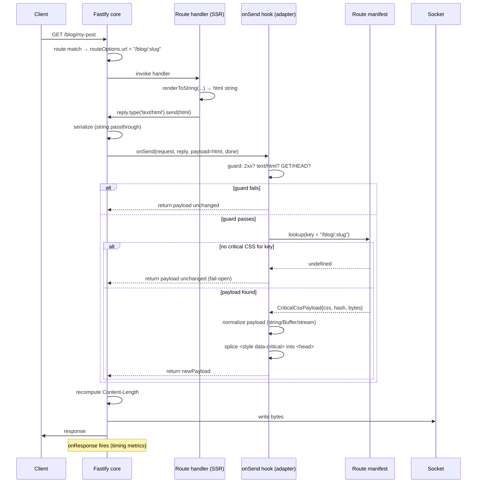
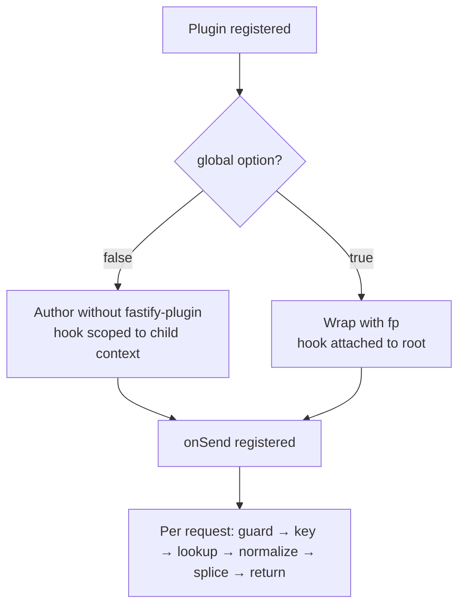

# 906 — Fastify Adapter

## 1. Title

**Critical CSS Extraction Engine — Fastify SSR Adapter: An Encapsulated Plugin and `onSend` Payload-Transformation Design for Per-Route Critical CSS Injection**

## 2. Version

| Field | Value |
|---|---|
| Document Version | 1.0.0 |
| Status | Draft — Phase 11 (SSR Integration) |
| Last Updated | 2026-07-09 |
| Owners | SSR Integration Working Group |
| Stability | The plugin surface (`@critical-css/fastify`) and its options schema are stable; the internal hook wiring may be re-tuned as Fastify's lifecycle evolves across major versions without changing the public contract |

## 3. Purpose

The engine's SSR integration story, framed in [900-SSR-Overview.md](900-SSR-Overview.md), is that critical CSS is *produced offline* (crawl routes, extract above-fold CSS, key the result by route pattern into the route manifest described in `BRIEF.md` Section 2.9) and *consumed online* by a thin, framework-specific adapter that inlines the correct CSS into the `<head>` of each server-rendered HTML response. The adapters are deliberately dumb: they do no extraction at request time, they own no browser, they perform a manifest lookup and a string splice. What differs between adapters is not the logic but the *insertion mechanism* each host framework exposes — and that mechanism is where all the subtlety lives.

This document specifies the **Fastify** adapter. Its purpose is to answer, precisely, three questions that the Express adapter document [902-Express.md](902-Express.md) answered for a fundamentally different framework model:

1. **Where in Fastify's request lifecycle do we intercept the outgoing HTML, and why is the `onSend` hook — and not `preHandler`, `onRequest`, or a wrapped `reply.send`/`reply.type` — the single correct injection point?**
2. **How do we transform the payload safely given that Fastify payloads may be a string, a `Buffer`, a stream, or a JSON-serialized object, and that Fastify's schema-based serialization is optimized for JSON and must never touch our HTML?**
3. **How do we respect Fastify's encapsulation model — the property that a plugin's hooks, decorators, and configuration are scoped to the plugin's registration context and its children — so that the CSS injector applies to exactly the route subtree the integrator intends and no more?**

The Fastify adapter is not a port of the Express middleware; it is a genuinely different design because Fastify is a genuinely different framework. Express middleware is a linear `(req, res, next)` chain in which you inject by monkey-patching `res.write`/`res.end` (see [902-Express.md](902-Express.md) Section 8). Fastify forbids that pattern: it discourages mutating the raw Node `res` object, it owns serialization and payload dispatch itself, and it provides a *typed, ordered, encapsulated* hook pipeline whose `onSend` stage exists precisely to let a plugin observe and rewrite an already-formed payload before it is written to the socket. This document explains why that difference matters and how the adapter exploits it.

## 4. Audience

- Implementers of the `@critical-css/fastify` package who will write the plugin, its `onSend` hook, and its options schema.
- Backend engineers integrating the engine into a Fastify service (with or without `@fastify/react`, `fastify-vite`, or a hand-rolled `renderToString` route) who need to understand *where to register* the plugin and *what encapsulation guarantees* they get.
- Maintainers of the sibling adapters — [901-React-SSR.md](901-React-SSR.md), [903-NextJS.md](903-NextJS.md), [904-Astro.md](904-Astro.md), [905-Remix.md](905-Remix.md) — who need to keep the injection contract consistent across frameworks and who will reuse the shared manifest-lookup and HTML-splice core described here.
- Reviewers checking conformance with `BRIEF.md` Section 2.10 ("Provide middleware for automatic CSS injection") and the route-manifest contract in Section 2.9.

Readers are assumed to have read [900-SSR-Overview.md](900-SSR-Overview.md) (the shared adapter contract, manifest schema, and the definition of "critical CSS payload") and to have at least skimmed [902-Express.md](902-Express.md), because this document is written substantially as a *contrast* with the Express middleware model. Familiarity with Fastify's plugin/encapsulation model and its lifecycle hooks is assumed at the level of the official Fastify "Lifecycle" and "Plugins" guides; this document does not re-teach them but does restate the two properties (encapsulation, `onSend` semantics) it depends on.

## 5. Prerequisites

- [900-SSR-Overview.md](900-SSR-Overview.md) — the shared adapter architecture: the offline/online split, the `RouteManifest` type, the `CriticalCssPayload` shape (raw CSS string plus metadata: hash, byte length, source route pattern, generation timestamp), and the canonical `<head>` injection rule (inject a single `<style data-critical>` element immediately before the first existing `<link rel="stylesheet">` or, absent one, before `</head>`).
- [902-Express.md](902-Express.md) — the contrasting middleware design, whose `res.write`/`res.end` interception and `Content-Length` recomputation logic this document references repeatedly to explain why Fastify does it differently.
- `BRIEF.md` Section 2.9 (Route Manifest) and Section 2.10 (SSR Integration).
- Working knowledge of Fastify v4/v5: the plugin function signature `(instance, opts, done)`, `fastify-plugin` (`fp`) and what "breaking encapsulation" means, the request lifecycle ordering (`onRequest` → `preParsing` → `preValidation` → `preHandler` → `preSerialization` → `onSend` → `onResponse`), and the `onSend` hook signature `(request, reply, payload, done)` / `async (request, reply, payload)`.
- Node.js streams (`Readable`) and the distinction between a string/`Buffer` payload and a stream payload.

## 6. Related Documents

- [900-SSR-Overview.md](900-SSR-Overview.md) — parent document; shared contract and manifest schema.
- [901-React-SSR.md](901-React-SSR.md) — framework-agnostic React `renderToString`/`renderToPipeableStream` adapter; the Fastify plugin frequently wraps a React SSR route, so its streaming concerns interact with Section 11 here.
- [902-Express.md](902-Express.md) — the Express middleware adapter; the primary contrast throughout this document.
- [903-NextJS.md](903-NextJS.md) — the Next.js adapter (custom server / App Router); relevant because a Fastify custom server can host Next.js.
- [904-Astro.md](904-Astro.md) — the Astro adapter; Astro's own SSR adapter can run atop a Fastify entry.
- [905-Remix.md](905-Remix.md) — the Remix adapter; `@remix-run/express` has a Fastify analog and shares the same injection contract.

## 7. Overview

Fastify processes a request through an ordered, well-documented lifecycle. After routing, the matched handler runs and calls `reply.send(payload)`. Fastify then serializes the payload (for JSON, via a schema-compiled fast serializer; for strings/Buffers/streams, as-is), and runs the **`onSend`** hooks — each receiving the *fully formed, about-to-be-written* payload with the ability to return a replacement payload — before finally writing to the socket and firing `onResponse`.

The Fastify adapter is a plugin that registers exactly one `onSend` hook. On each response the hook:

1. **Guards**: proceeds only for HTML responses (content-type `text/html`), only for GET/HEAD, and only for 2xx responses — bailing out early (returning the payload untouched) otherwise. This is the same guard set as [902-Express.md](902-Express.md) Section 8.2, restated here.
2. **Resolves the route key**: derives the manifest key from `request.routeOptions.url` (the *route pattern*, e.g. `/blog/:slug`, not the concrete URL) with a fallback to `request.url` path matching against manifest glob patterns — see Section 10.1.
3. **Looks up the payload**: fetches the `CriticalCssPayload` for that key from the loaded manifest; if absent, returns the payload untouched (fail-open, never break the page).
4. **Normalizes the payload to a string**: handles string, `Buffer`, and stream forms per Section 8.4.
5. **Splices**: inserts one `<style data-critical>…</style>` into `<head>` per the canonical rule from [900-SSR-Overview.md](900-SSR-Overview.md).
6. **Returns the new payload**, letting Fastify recompute framing.

The entire mechanism is a *payload transformation*, which is exactly what `onSend` is designed for — and this is the crux of the contrast with Express. Because we return a value rather than mutate `res`, Fastify remains the sole authority over the socket, `Content-Length`, compression ordering, and HTTP/2 framing.

## 8. Detailed Design

### 8.1 Public surface

The package default-exports a Fastify plugin authored with `fastify-plugin` *conditionally* (discussed in Section 8.6). The options schema:

```ts
export interface CriticalCssFastifyOptions {
  /** Route manifest: an object, a path to a JSON file, or an async loader. */
  manifest: RouteManifest | string | (() => Promise<RouteManifest>);
  /** Only inject for these content-types. Default: ['text/html']. */
  contentTypes?: string[];
  /** Only inject for these methods. Default: ['GET', 'HEAD']. */
  methods?: string[];
  /** Attribute set on the injected <style>. Default: { 'data-critical': '' }. */
  styleAttrs?: Record<string, string>;
  /** If true, decline injection when a <style data-critical> already exists. Default: true. */
  skipIfPresent?: boolean;
  /** Max HTML payload (bytes) the hook will buffer a stream for. Default: 2_000_000. */
  maxBufferBytes?: number;
  /** Hook error policy: 'fail-open' (default) returns original payload; 'throw' surfaces. */
  onError?: 'fail-open' | 'throw';
  /** Whether to break encapsulation (apply globally). Default: false. */
  global?: boolean;
}
```

Errors surface as typed `CriticalCssError` instances (`code`: `MANIFEST_LOAD_FAILED`, `PAYLOAD_TOO_LARGE`, `STREAM_READ_FAILED`) reused from the shared core in [900-SSR-Overview.md](900-SSR-Overview.md).

### 8.2 Why `onSend` and not another hook

Fastify offers several interception points. Each was evaluated:

- **`onRequest` / `preHandler`**: run *before* the handler produces a body. At these stages there is no HTML to modify — we would have to wrap `reply.send` ourselves, reintroducing exactly the monkey-patching fragility that Express suffers ([902-Express.md](902-Express.md) Section 8.1). Rejected.
- **`preSerialization`**: runs before Fastify serializes the *return value of the handler*, but only fires when the payload is an object that will be JSON-serialized; it explicitly does **not** run for strings, Buffers, or streams. SSR HTML is a string or stream, so `preSerialization` would never fire for our case. Rejected on correctness grounds — this is a subtle Fastify semantic worth stating loudly.
- **Wrapping `reply.send`** via a decorator or `reply` override: possible but adversarial to Fastify's design; it fights the framework's own dispatch and breaks with reply-level plugins (compression, `reply.sent` accounting). Rejected.
- **`onSend`**: runs after serialization, receives the final `payload` (string | Buffer | Stream | null), and its documented contract is that returning a new value replaces the payload and Fastify **recomputes `Content-Length`** and continues its pipeline. This is a first-class payload-transformation stage. **Chosen.**

**Why this is the right point (summary):** `onSend` is the *only* hook that (a) is guaranteed to run for HTML string/stream payloads, (b) gives us the payload as data to transform, and (c) hands the result back to Fastify so the framework — not the adapter — owns framing and downstream reply plugins. It is the Fastify-native analog of "the last thing before the bytes leave," which in Express we could only approximate by intercepting `write`/`end`.

### 8.3 Contrast with Express middleware (the core of this document)

| Concern | Express ([902-Express.md](902-Express.md)) | Fastify (this doc) |
|---|---|---|
| Model | Linear `(req,res,next)` chain | Encapsulated, ordered hook pipeline |
| Injection mechanism | Monkey-patch `res.write`/`res.end`, buffer chunks | Return replacement from `onSend(request, reply, payload)` |
| Who owns the socket | You do, once you patch `res` | Fastify, always |
| `Content-Length` | Adapter must delete/recompute the header manually | Fastify recomputes automatically on payload replacement |
| Scope control | Mount path (`app.use('/path', mw)`) — coarse | Encapsulation — plugin applies to its registration subtree |
| Serialization interference | N/A (Express has no schema serializer) | Must ensure JSON schema serializer never sees HTML (Section 8.5) |
| Streaming | Must buffer the patched `write` chunks yourself | Stream is handed to you as `payload`; you choose buffer or pass-through |
| Failure blast radius | A thrown error in patched `end` can corrupt the response | `onSend` error is caught by Fastify's error pipeline; fail-open is clean |

The through-line: **Express makes you take over the response to inject; Fastify lets you transform the response without taking it over.** The adapter design leans entirely into that difference. Because we never touch `reply.raw`, we are automatically compatible with `@fastify/compress` (which itself registers an `onSend` — ordering discussed in Section 12), HTTP/2, and `reply.hijack()` semantics.

### 8.4 Payload normalization: string, Buffer, stream

`onSend`'s `payload` may be:

- **string** — the common SSR case (`reply.type('text/html').send(html)`). Splice directly.
- **Buffer** — e.g. a pre-rendered page read from disk. Decode using the charset from the content-type (default UTF-8), splice, re-encode to a `Buffer`, return.
- **Readable stream** — e.g. React 18 `renderToPipeableStream` piped into `reply.send(stream)`, or a file stream. Two strategies (Section 11): **buffer-then-splice** (default, bounded by `maxBufferBytes`) or **transform-stream splice** (opt-in, for very large or truly streamed pages).
- **null / undefined** — no body (e.g. 204, HEAD). Return as-is.

The normalizer is a shared function reused by all adapters; only the *acquisition* of the payload differs per framework. See [900-SSR-Overview.md](900-SSR-Overview.md) for the canonical splice routine.

### 8.5 Not interfering with Fastify serialization

Fastify's headline performance feature is schema-based JSON serialization (`fast-json-stringify`). This concerns *object* payloads only. Our adapter must guarantee it never perturbs that path:

- The `onSend` hook runs **after** serialization; by the time we see `payload`, JSON responses are already a serialized string. Our content-type guard rejects non-HTML, so a JSON response's serialized body is returned untouched — we neither parse nor re-serialize it.
- The adapter registers **no** response schemas and does not call `reply.serializer`, so it cannot alter the compiled serializer for any route.
- Because we return the payload unchanged for non-HTML, the `Content-Type` and any schema-driven headers Fastify set remain intact.

The one rule to enforce in code and tests: **the content-type guard must run before any payload inspection**, so a JSON route pays only a single cheap `contentType.startsWith('text/html')` check.

### 8.6 Encapsulation: scoped vs global

Fastify plugins are *encapsulated* by default: hooks and decorators registered inside a plugin apply only to that plugin's instance and the routes registered within it (and its child plugins), not to sibling contexts. This is the mechanism we use for scope control — the Fastify-native replacement for Express's mount-path filtering.

Two integration modes:

- **Scoped (default, `global: false`)**: the integrator registers the plugin *inside* the encapsulated context that owns the SSR routes:

  ```ts
  fastify.register(async (ssr) => {
    await ssr.register(criticalCss, { manifest });
    ssr.get('/', htmlHandler);
    ssr.get('/blog/:slug', htmlHandler);
  });
  // API routes registered on the root `fastify` are untouched.
  ```

  Here we author the plugin *without* `fastify-plugin`, so its `onSend` hook stays inside the child context.

- **Global (`global: true`)**: for apps that serve HTML from the root context, the plugin uses `fastify-plugin` (`fp`) to *break* encapsulation and attach the `onSend` hook to the root instance. The content-type guard then does the filtering. We expose this as an explicit opt-in rather than a default because silently escaping encapsulation is a well-known Fastify footgun.

**Why offer both:** encapsulation is Fastify's idiomatic scoping tool and is strictly better than path-prefix filtering (it is structural, not string-based), but many real apps register everything at the root and want the Express-like "just apply everywhere and let the guard sort it out" behavior. Exposing `global` as a flag makes the encapsulation decision explicit and reviewable.

## 9. Architecture





## 10. Algorithms

### 10.1 Route-key resolution

**Problem:** map an incoming request to the manifest key that holds its critical CSS. The manifest (Section 2.9) keys by *route pattern* and *glob*, e.g. `"/"`, `"/products"`, `"/blog/*"`.

**Inputs:** `request.routeOptions.url` (Fastify's matched pattern, e.g. `/blog/:slug`), `request.url` (concrete path with query), the loaded `RouteManifest`.

**Output:** a `CriticalCssPayload | undefined`.

**Pseudocode:**

```
function resolveKey(request, manifest):
    pattern = request.routeOptions.url          # e.g. "/blog/:slug"
    if pattern != null:
        # 1. Direct pattern hit, normalizing param syntax :slug ~ *
        if manifest.has(pattern): return manifest.get(pattern)
        globbed = toGlob(pattern)               # "/blog/:slug" -> "/blog/*"
        if manifest.has(globbed): return manifest.get(globbed)
    path = stripQuery(request.url)              # e.g. "/blog/my-post"
    # 2. Exact path hit
    if manifest.has(path): return manifest.get(path)
    # 3. Glob scan, longest-prefix-wins for determinism
    best = null
    for (key, payload) in manifest.globEntries():   # pre-sorted by specificity
        if globMatch(key, path):
            best = payload; break
    return best
```

**Time complexity:** O(1) for the pattern/exact hits (hash lookups); O(G) worst case for the glob scan where G = number of glob keys, but glob entries are pre-sorted once at load by descending specificity so the first match wins deterministically. **Memory:** O(1) beyond the manifest itself.

**Failure cases:** `routeOptions.url` is `undefined` for 404s and for requests not matched to a declared route → we fall to path matching; if nothing matches, return `undefined` → fail-open. Query strings never participate in keying (stripped). Trailing-slash normalization follows the manifest's own convention (documented in [900-SSR-Overview.md](900-SSR-Overview.md)).

**Optimization opportunities:** cache `toGlob(pattern)` per route pattern (small fixed set) in a `WeakMap` keyed by `routeOptions`, since the same route object recurs across requests.

### 10.2 `onSend` payload transformation

**Problem:** given the final payload and a resolved CSS payload, return an HTML payload with the critical CSS inlined, preserving type (string in → string out, Buffer in → Buffer out).

**Inputs:** `payload` (string | Buffer | Readable | null), `cssPayload.css`, `options`.

**Output:** transformed payload of the same kind (or original on any bail condition).

**Pseudocode:**

```
async function transform(request, reply, payload, opts):
    if not guardsPass(reply, opts): return payload         # content-type/status/method
    css = resolveKey(request, opts.manifest)
    if css == null: return payload                          # fail-open
    kind = classify(payload)                                # 'string'|'buffer'|'stream'|'empty'
    if kind == 'empty': return payload
    if kind == 'stream':
        if opts.streamMode == 'transform': return spliceStream(payload, css, opts)
        html = await bufferStream(payload, opts.maxBufferBytes)   # may throw PAYLOAD_TOO_LARGE
    else:
        html = kind == 'buffer' ? payload.toString(charset) : payload
    if opts.skipIfPresent and html.includes('data-critical'): return payload
    out = spliceHead(html, css, opts.styleAttrs)            # shared core routine
    return kind == 'buffer' ? Buffer.from(out, charset) : out
```

**Time complexity:** O(n) in the HTML byte length n (one `indexOf` for the `<head>`/`<link>` anchor plus one concatenation). **Memory:** O(n) for the buffered forms; O(1) additional for the transform-stream form. **Failure cases:** stream exceeds `maxBufferBytes` → `PAYLOAD_TOO_LARGE` handled per `onError`; no `<head>` found → shared splicer falls back to prepending (documented in [900-SSR-Overview.md](900-SSR-Overview.md)) or returns original under strict mode. **Optimizations:** cache the rendered `<style …>…</style>` string per `cssPayload.hash` so repeated requests to the same route reuse the wrapped block and only pay the concatenation.

## 11. Implementation Notes

- **Async vs callback hook:** register the hook as `async (request, reply, payload) => newPayload`. The async form composes cleanly with the stream-buffering `await` and with Fastify's promise-aware pipeline; the callback `done(err, newPayload)` form is equivalent but noisier.
- **`reply.getHeader('content-type')`** is the guard's source of truth, not the handler's intent. SSR frameworks sometimes set it late; reading it in `onSend` (after serialization) is reliable. Match case-insensitively and tolerate `; charset=…`.
- **React 18 streaming (`renderToPipeableStream`)** is the important interaction with [901-React-SSR.md](901-React-SSR.md). When the handler pipes a stream to `reply.send`, the default buffer-then-splice mode collects the shell, injects, and returns a string — correct but it defeats streaming's TTFB benefit. For streamed responses we recommend the framework-level shell-injection approach from [901-React-SSR.md](901-React-SSR.md) (inject into the shell chunk before the first flush) and reserve the Fastify `onSend` transform-stream mode for non-progressive streams (e.g. file-backed HTML).
- **Manifest loading** happens once at plugin registration (`await` the loader in the plugin body, before `done`), never per request. The loaded manifest is closed over by the hook. Hot-reload in dev is handled by a file watcher that swaps the closed-over reference atomically.
- **Charset:** derive from content-type; default UTF-8. Non-UTF-8 SSR is rare but the Buffer path must honor it to avoid mojibake.
- **`skipIfPresent`** prevents double injection when an upstream adapter (e.g. a React shell injector) already inlined critical CSS — important because Fastify apps sometimes stack a framework adapter *and* this plugin.

## 12. Edge Cases

- **`@fastify/compress` ordering:** compression also registers an `onSend`. Fastify runs `onSend` hooks in registration order. Our injector **must** run before compression so it operates on plaintext HTML. Enforce by registering the critical-css plugin before `@fastify/compress`, and document this ordering requirement prominently; add a runtime warning if the payload arriving at our hook is already a compressed `Buffer` (detected via `content-encoding`).
- **`reply.hijack()`**: if a handler hijacks the reply and writes to `reply.raw` directly, Fastify's `onSend` does not fire — our hook is correctly bypassed, and such routes are outside our contract.
- **HEAD requests:** payload is typically empty; guard on method still allows HEAD but the empty-payload branch returns as-is, and Fastify sets `Content-Length` from the (absent) body correctly.
- **304 Not Modified / 3xx / 4xx / 5xx:** status guard bails; error pages are never rewritten (avoids injecting stale CSS into an error shell).
- **Non-route matches (404 handler):** `routeOptions.url` is undefined; key resolution falls through to path/glob and usually finds nothing → fail-open.
- **Already-serialized JSON with `text/html` mislabeled:** if a handler wrongly sets `text/html` on JSON, we would attempt a splice; the shared splicer finds no `<head>`, and in strict mode returns the original — no corruption. Documented as caller error.
- **Very large streamed pages exceeding `maxBufferBytes`:** raise `PAYLOAD_TOO_LARGE`; under `fail-open` the original stream is returned unmodified (no critical CSS, page still works).
- **Multiple registrations:** if the plugin is registered in overlapping contexts (scoped child *and* global), two `onSend` hooks could fire; `skipIfPresent` makes the second a no-op.

## 13. Tradeoffs

- **Buffer-then-splice as default (vs transform-stream):** buffering is simple, correct, and type-preserving, at the cost of TTFB for streamed responses. We chose it as the default because most Fastify SSR responses are strings, and for true streaming we defer to the framework-native shell injection in [901-React-SSR.md](901-React-SSR.md). *Alternative:* always transform-stream — rejected as complex and often unnecessary. *Future:* auto-select based on whether the payload is a stream and a `streamMode: 'auto'` heuristic.
- **`onSend` payload transform (vs `reply.send` wrap):** we accept running after serialization (a tiny extra hook cost per response) in exchange for never fighting Fastify's dispatch. This is the whole philosophical difference from [902-Express.md](902-Express.md): correctness and composability over the "take over the response" shortcut.
- **Encapsulated-by-default (vs global-by-default):** scoping is more idiomatic and safer but requires the integrator to register the plugin in the right context; global is easier but leaks the hook everywhere and relies on the guard. We default to scoped and make global explicit — favoring the framework's grain over convenience.
- **Fail-open (vs fail-closed):** a missing manifest entry or an oversized stream yields the original page, never an error page. A CSS optimization must never be able to take a page down. *Tradeoff:* silent under-injection is possible; mitigated by the diagnostics/reporting in `BRIEF.md` Section 2.12 flagging routes with no manifest entry at build time.

## 14. Performance

- **CPU:** per request, one content-type check, one route-key hash lookup (O(1)) or bounded glob scan, one O(n) HTML splice. The `<style>` block is memoized by CSS hash, so steady-state cost is a single concatenation over the HTML length.
- **Memory:** O(n) for buffered string/Buffer payloads (unavoidable — we hold one page). Transform-stream mode is O(1) additional. Manifest is loaded once and shared (O(routes)).
- **Caching strategy:** (1) wrapped `<style>` string cached by `cssPayload.hash`; (2) `toGlob(pattern)` cached per route object via `WeakMap`; (3) manifest parsed once at registration. No per-request allocation beyond the spliced output string.
- **Parallelization:** none needed — the hook is CPU-trivial and non-blocking except for the optional stream buffering, which is I/O-bound and already async.
- **Incremental execution:** manifest hot-swap in dev is atomic pointer replacement; no request stalls.
- **Profiling guidance:** compare `onResponse` timing with the plugin on vs off; the delta is the injection cost and should be sub-millisecond for typical pages. Watch for the anti-pattern of buffering large streams (spikes in memory and TTFB) — surfaced by the `PAYLOAD_TOO_LARGE` counter.
- **Scalability limits:** bounded by HTML size and `maxBufferBytes`; the plugin adds no shared state and no locks, so it scales linearly with Fastify's own throughput.

## 15. Testing

- **Unit:** `resolveKey` against a manifest with exact, param, and glob keys (including longest-prefix determinism and undefined `routeOptions.url`); `transform` for each payload kind (string, Buffer with non-UTF-8 charset, Readable stream, null); guard matrix (status, method, content-type variants with charset suffixes); `skipIfPresent` behavior.
- **Integration (real Fastify instance via `fastify.inject`):** end-to-end GET to an SSR route asserts the `<style data-critical>` appears once, before the first `<link rel=stylesheet>`; JSON route asserts the body is byte-identical with the plugin on and off (serialization non-interference, Section 8.5); `@fastify/compress` co-registration asserts injection happens on plaintext and gzip still applies.
- **Encapsulation:** register scoped and assert a sibling-context route is untouched; register `global: true` and assert all HTML routes are injected.
- **Streaming:** React `renderToPipeableStream` route under buffer mode asserts correct splice; oversized stream asserts `PAYLOAD_TOO_LARGE` and fail-open returns the original.
- **Golden CSS snapshots / visual regression:** reuse the shared adapter fixtures from [900-SSR-Overview.md](900-SSR-Overview.md) so all adapters (901–906) produce byte-identical injected `<head>` for the same route and manifest.
- **Failure injection:** manifest loader throws → `MANIFEST_LOAD_FAILED` at registration (fail-fast at boot, not per request).

## 16. Future Work

- **Auto stream detection (`streamMode: 'auto'`)** to transparently choose transform-stream splice for streamed payloads without losing TTFB.
- **Native React 18 shell integration** so Fastify + `renderToPipeableStream` injects into the shell chunk (coordinating with [901-React-SSR.md](901-React-SSR.md)) rather than buffering.
- **HTTP/2 Server Push / `103 Early Hints`**: emit `Link: rel=preload` early hints for the non-critical stylesheet alongside the inlined critical CSS, using Fastify's `reply.raw.writeEarlyHints` where available.
- **Per-route override decorator** (`reply.criticalCss(payloadOrKey)`) for handlers that compute their own route key.
- **Manifest-as-plugin**: ship a companion `@critical-css/fastify-manifest` decorator so multiple plugins (e.g. a Next.js custom server per [903-NextJS.md](903-NextJS.md)) can share one loaded manifest.
- **Metrics decorator** exposing injection hit/miss/bail counts for the diagnostics pipeline (`BRIEF.md` Section 2.12).

## 17. References

- [900-SSR-Overview.md](900-SSR-Overview.md) — shared SSR adapter contract, manifest schema, canonical `<head>` splice routine.
- [901-React-SSR.md](901-React-SSR.md) — React `renderToString`/`renderToPipeableStream` adapter and shell-injection streaming approach.
- [902-Express.md](902-Express.md) — Express middleware adapter; primary contrast (monkey-patched `res.write`/`res.end`).
- [903-NextJS.md](903-NextJS.md) — Next.js adapter (custom server / App Router).
- [904-Astro.md](904-Astro.md) — Astro adapter.
- [905-Remix.md](905-Remix.md) — Remix adapter.
- `BRIEF.md` Section 2.9 (Route Manifest), Section 2.10 (SSR Integration), Section 2.12 (Diagnostics).
- Fastify documentation: Lifecycle (`onSend`, `preSerialization`), Plugins & Encapsulation, `fastify-plugin`, Hooks reference.
- Node.js Streams API (`Readable`, backpressure), `@fastify/compress` `onSend` ordering.
