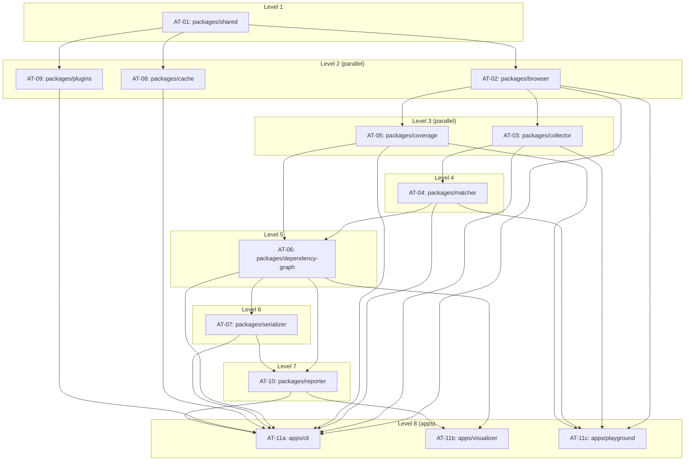

# Architecture Tasks

## 1. Title

Architecture Tasks — Package-Level Implementation Backlog for the Critical CSS Extraction Engine

## 2. Version

1.0.0 — Phase 16 (Implementation Task Catalog)

## 3. Purpose

This document is the bridge from fifteen phases of design documentation to an executable engineering backlog. It defines one **architecture task group** per package in the canonical monorepo layout (`docs/architecture/007-Repository-Structure.md`), states exactly which prior design documents each task group implements, and fixes the dependency order in which the task groups must be undertaken so that an autonomous coding agent — or a human engineering team — can begin implementation without re-deriving the sequencing logic from first principles. It does not decompose tasks to the file/function level; that finer grain is the job of `001-Task-Breakdown.md`, and the finest grain — one atomic, independently completable unit of work per file — is the job of `docs/tasks/`. This document answers one question precisely: **in what order, and against which design authority, does each package get built?**

## 4. Audience

Senior engineers and autonomous coding agents responsible for sequencing and executing the implementation of `packages/*` and `apps/*`. Assumes the reader has already internalized `007-Repository-Structure.md`'s package boundaries and dependency graph, and is fluent in the design documents this catalog cites — it does not re-explain design decisions already made in Phases 1–15, only translates them into task form.

## 5. Prerequisites

- [docs/STATUS.md](../STATUS.md) — the authoritative record of every design document produced in Phases 1–15; every citation in this document resolves to a file listed there
- [docs/architecture/007-Repository-Structure.md](../architecture/007-Repository-Structure.md) — the package boundary and build-time dependency graph this document's task ordering mirrors exactly
- [docs/architecture/006-Design-Principles.md](../architecture/006-Design-Principles.md) — the eight design principles every task must satisfy (browser-as-source-of-truth, no custom selector parser, additive benchmarked optimization, matcher/coverage peer strategies, serializer as convergence point, fingerprint-gated caching, plugin lifecycle contract, sandboxing)
- [docs/architecture/014-Dependency-Graph.md](../architecture/014-Dependency-Graph.md) — the *runtime* CSS dependency graph, not to be confused with the *build-time* package graph this document sequences (007 disambiguates the two explicitly; this document inherits that disambiguation)
- Familiarity with all Phase 3–13 design documents (`docs/design/1xx`–`10xx`, `docs/algorithms/5xx`, `docs/plugins/`, `docs/performance/`) as the per-package source material enumerated below

## 6. Related Documents

- [001-Task-Breakdown.md](./001-Task-Breakdown.md) — decomposes each task group below into concrete engineering work items
- [002-Milestones.md](./002-Milestones.md) — groups task groups into shippable milestones aligned with the brief's five-phase roadmap ([BRIEF.md §2.17](../../BRIEF.md))
- [003-Acceptance-Tests.md](./003-Acceptance-Tests.md) — the acceptance criteria each task group must satisfy before being considered done
- [004-Definition-of-Done.md](./004-Definition-of-Done.md) — the cross-cutting completion bar (tests, docs, benchmarks) applied uniformly to every task group in this catalog
- [docs/tasks/](../tasks/) — atomic task cards, the finest-grained decomposition, forward-referenced from `001-Task-Breakdown.md`

## 7. Overview

Fifteen documentation phases produced 91 design files describing *what* the Critical CSS Extraction Engine is and *why* it is shaped the way it is. None of them describe *in what order to write code*. This document closes that gap by defining eleven architecture task groups — one per package under `packages/*`, plus three for `apps/*` — each scoped to exactly the responsibilities `007-Repository-Structure.md` assigns to that package, each citing the specific design documents that constitute its implementation authority, and each positioned in a strict build order derived mechanically from the package dependency graph's topological levels.

The central organizing constraint is the same one that shaped the repository structure itself: `packages/shared` has zero internal dependencies and must exist before any other package can compile against its DTOs; `packages/browser` is the sole abstraction over Playwright and gates every subsequent package that needs a live page; `packages/collector`, `packages/matcher`, and `packages/coverage` form the extraction core, with matcher and coverage remaining strictly non-dependent on each other per Design Principle 4; `packages/dependency-graph` and `packages/serializer` converge the extraction outputs into a final artifact; and `packages/cache`, `packages/plugins`, `packages/reporter` are cross-cutting packages that depend only on `shared` (cache, plugins) or converge pipeline output for external consumption (reporter). `apps/cli`, `apps/visualizer`, and `apps/playground` sit at the top of the graph as pure consumers.

This document treats each task group as a **unit of architectural completion**: a package is "architecturally done" when its public API surface (barrel-exported per `007`'s `Implementation Notes`) satisfies every interface, DTO, and behavior contract specified in its cited design documents, independent of whether every edge case or performance optimization has been implemented — those refinements are tracked as separate, later-milestone task groups in `002-Milestones.md`, not blockers to the initial architecture task.

## 8. Detailed Design

### 8.1 Task Group Numbering Convention

Each task group is numbered `AT-NN` (Architecture Task, two-digit sequence) in build order, not alphabetical or brief-listing order. The sequence number is the authoritative "do not start `AT-05` until `AT-01`–`AT-04` are architecturally done" ordering signal consumed by `001-Task-Breakdown.md` and `002-Milestones.md`.

### 8.2 AT-01 — `packages/shared`

**Implements:** [003-Requirements.md](../architecture/003-Requirements.md) (module responsibility table, §2.4 of the brief), [004-Terminology.md](../architecture/004-Terminology.md), [005-Glossary.md](../architecture/005-Glossary.md), [006-Design-Principles.md](../architecture/006-Design-Principles.md) (all eight principles, since `shared` houses the DTOs every principle's contract is expressed through), and the error/diagnostic taxonomy implied by [1000-Diagnostics-Overview.md](../design/1000-Diagnostics-Overview.md).

**Scope:** Define and export the DTO shapes referenced throughout the design corpus — `ExtractionResult`, `Diagnostic`, `ViewportProfile`, `MatchedRule`, `DependencyNode`, `CacheFingerprint`, `PluginHookContext`, `RouteManifestEntry` — plus the configuration schema types consumed by the Configuration Loader ([007-Repository-Structure.md](../architecture/007-Repository-Structure.md) Implementation Notes), and the error type hierarchy used for fail-fast diagnostics per Design Principle 6. No browser-runtime or Node-runtime dependency may be introduced here; this package must remain evaluable inside a browser-injected function body, since `packages/collector` and `packages/matcher` execute logic in-page that references `shared` types.

**Depends on:** nothing internal. This is the unique DAG source.

**Why first:** every other package's `tsconfig.json` project reference and every other package's `package.json` workspace dependency includes `shared` (directly or transitively), per the dependency graph in `007-Repository-Structure.md`. A change to `shared` after downstream packages exist invalidates their build cache by design; sequencing it first minimizes churn.

### 8.3 AT-02 — `packages/browser`

**Implements:** [100-Browser-Abstraction.md](../design/100-Browser-Abstraction.md), [101-Playwright-Adapter.md](../design/101-Playwright-Adapter.md), [102-Browser-Pool.md](../design/102-Browser-Pool.md), [103-Navigation-Engine.md](../design/103-Navigation-Engine.md), [104-Rendering-Stabilization.md](../design/104-Rendering-Stabilization.md), [105-Viewport-Manager.md](../design/105-Viewport-Manager.md), [ADR-0003-Playwright-As-Browser-Abstraction](../adr/ADR-0003-Playwright-As-Browser-Abstraction.md).

**Scope:** Browser Manager (process/context pooling per `102`), Navigation Engine (page navigation and rendering-stabilization heuristics per `103`/`104`), and Viewport Manager (device-profile application per `105`). This is the direct implementation surface of Design Principle 1 (browser is source of truth) — every fact any other package needs about a rendered page flows through this package's page-context bridge.

**Depends on:** AT-01 (`packages/shared`, for DTOs only).

**Why second:** `007-Repository-Structure.md`'s dependency graph places `browser` at build-level 2 (immediately above `shared`), and every extraction-path package (`collector`, `matcher`, `coverage`) and both interactive apps (`cli`, `playground`) depend on it directly. It cannot be deferred behind any extraction-logic package because none of them can acquire a live page without it.

### 8.4 AT-03 — `packages/collector`

**Implements:** [106-DOM-Snapshot.md](../design/106-DOM-Snapshot.md), [200-Visibility-Engine-Overview.md](../design/200-Visibility-Engine-Overview.md), [201-Geometry-Engine.md](../design/201-Geometry-Engine.md), [202-Intersection-Engine.md](../design/202-Intersection-Engine.md), [203-Overflow-Handling.md](../design/203-Overflow-Handling.md), [204-Transform-Handling.md](../design/204-Transform-Handling.md), [205-Sticky-Elements.md](../design/205-Sticky-Elements.md), [206-Fixed-Elements.md](../design/206-Fixed-Elements.md), [207-Virtualized-Lists.md](../design/207-Virtualized-Lists.md), [300-CSSOM-Walker.md](../design/300-CSSOM-Walker.md), [301-Stylesheet-Loader.md](../design/301-Stylesheet-Loader.md), [302-Rule-Tree.md](../design/302-Rule-Tree.md), [303-Media-Rules.md](../design/303-Media-Rules.md), [304-Supports-Rules.md](../design/304-Supports-Rules.md), [305-Cascade-Layers.md](../design/305-Cascade-Layers.md), [306-At-Import.md](../design/306-At-Import.md), [307-Constructable-Stylesheets.md](../design/307-Constructable-Stylesheets.md).

**Scope:** Three internal, separately-barrel-exported modules bundled into one package per `007`'s Implementation Notes rationale (they share one browser-context collection pass): the DOM Collector (above-fold node enumeration), the Visibility Engine (geometry/intersection/overflow/transform/sticky/fixed/virtualized-list visibility classification), and the CSSOM Walker (stylesheet tree traversal including media/supports/layer/import/constructable-stylesheet handling). Output is an above-fold DOM/CSSOM snapshot DTO defined in `shared`.

**Depends on:** AT-02 (`packages/browser`, to obtain the live page/context), AT-01 (`packages/shared`, for DTOs).

**Why third:** this is the first package that produces the artifacts every downstream extraction-strategy package (`matcher`, `coverage`) consumes. It cannot start before `browser` exists (no page to collect from) and gates both strategy packages.

### 8.5 AT-04 — `packages/matcher`

**Implements:** [400-Selector-Matching.md](../design/400-Selector-Matching.md), [401-Selector-Memoization.md](../design/401-Selector-Memoization.md), [402-Pseudo-Elements.md](../design/402-Pseudo-Elements.md), [403-Pseudo-Classes.md](../design/403-Pseudo-Classes.md), [404-Is-Where-Has.md](../design/404-Is-Where-Has.md), [405-Container-Queries.md](../design/405-Container-Queries.md), [ADR-0002-No-Custom-Selector-Parser](../adr/ADR-0002-No-Custom-Selector-Parser.md).

**Scope:** A thin, memoizing wrapper around `Element.matches()`/`querySelectorAll` (Design Principle 2 — never implement a custom selector parser). Consumes the rule tree and node set produced by AT-03's CSSOM Walker and DOM Collector, and produces the matched-rule set, including `:is()`/`:where()`/`:has()` and container-query-aware matching.

**Depends on:** AT-02 (`packages/browser`, matching executes in-page), AT-03 (`packages/collector`, consumes its output shapes), AT-01 (`packages/shared`).

**Why fourth:** cannot begin until `collector`'s rule tree and node set shapes are stable, since matcher's entire input contract is defined by collector's output DTOs.

### 8.6 AT-05 — `packages/coverage`

**Implements:** [700-Coverage-Mode.md](../design/700-Coverage-Mode.md), [ADR-0005-Hybrid-Extraction-Mode](../adr/ADR-0005-Hybrid-Extraction-Mode.md).

**Scope:** Chrome DevTools Protocol Coverage domain integration, recording actually-painted style rules as a peer strategy input to matching. Per Design Principle 4 and the graph invariant in `007-Repository-Structure.md` §Dependency Graph, this package must share **no edge** with `packages/matcher` — introducing one is a design violation requiring an ADR, not a routine refactor.

**Depends on:** AT-02 (`packages/browser`), AT-01 (`packages/shared`). Deliberately does **not** depend on AT-04 (`packages/matcher`).

**Why fifth, and why parallel-eligible with AT-04:** `coverage` depends only on `browser`/`shared`, exactly like `matcher`, and shares no edge with it — both packages occupy the same build level (level 3) in `007`'s leveled schedule and may be implemented concurrently by separate engineers or agents once AT-02/AT-03 (note: `coverage` does not actually require AT-03's collector output, only `matcher` does — see Implementation Notes for the resulting parallelization nuance).

### 8.7 AT-06 — `packages/dependency-graph`

**Implements:** [500-Dependency-Resolution-Overview.md](../design/500-Dependency-Resolution-Overview.md), [501-CSS-Variables.md](../algorithms/501-CSS-Variables.md), [502-Keyframes.md](../algorithms/502-Keyframes.md), [503-Font-Faces.md](../algorithms/503-Font-Faces.md), [504-At-Property.md](../algorithms/504-At-Property.md), [505-Counters.md](../algorithms/505-Counters.md), [506-Cascade-Layers.md](../algorithms/506-Cascade-Layers.md), [507-Dependency-Graph-Construction.md](../algorithms/507-Dependency-Graph-Construction.md), [508-Cycle-Detection.md](../algorithms/508-Cycle-Detection.md), [701-Hybrid-Mode.md](../design/701-Hybrid-Mode.md), [702-Computed-Style-Mode.md](../design/702-Computed-Style-Mode.md).

**Scope:** The Dependency Resolver (variables, keyframes, font faces, `@property`, `@counter-style`, `@layer`, `@supports`, media/container queries, view transitions, scroll timelines, resolved iteratively to a fixed point per `500`) and the Cascade Resolver (specificity/origin/layer ordering, bundled here per `007`'s Implementation Notes since layer ordering is dependency-graph-shaped). Also hosts the Hybrid extraction strategy that composes `matcher` and `coverage` outputs (per `007`'s explicit instruction that this composition must live in `dependency-graph` or a dedicated module, never as a cross-import between matcher and coverage).

**Depends on:** AT-04 (`packages/matcher`), AT-05 (`packages/coverage`), AT-01 (`packages/shared`).

**Why sixth:** this is the convergence point for both extraction strategies; it cannot start until both AT-04 and AT-05 exist, since its Hybrid strategy composes their outputs directly.

### 8.8 AT-07 — `packages/serializer`

**Implements:** [600-Serialization-Overview.md](../design/600-Serialization-Overview.md), [601-Rule-Ordering.md](../design/601-Rule-Ordering.md), [602-Deduplication.md](../design/602-Deduplication.md), [603-Compression.md](../design/603-Compression.md), [604-Output-Validation.md](../design/604-Output-Validation.md), [605-Source-Maps.md](../design/605-Source-Maps.md), [606-Output-Formats.md](../design/606-Output-Formats.md), [703-Visual-Diff.md](../design/703-Visual-Diff.md), [704-Incremental-Extraction.md](../design/704-Incremental-Extraction.md).

**Scope:** Rule ordering (canonical-ordering algorithm from `006-Design-Principles.md`), deduplication, output formatting, and compression/minification. The single convergence point through which every extraction strategy's result must pass before becoming a final artifact (Design Principle 5).

**Depends on:** AT-06 (`packages/dependency-graph`, needs the resolved dependency set), AT-01 (`packages/shared`).

**Why seventh:** cannot serialize a result that has not yet had its dependency graph resolved — `dependency-graph`'s fixed-point output is a hard input to serialization's rule-inclusion decision.

### 8.9 AT-08 — `packages/cache` (parallel-eligible from AT-01)

**Implements:** [800-Cache-Overview.md](../design/800-Cache-Overview.md), [801-Fingerprinting.md](../design/801-Fingerprinting.md), [802-Cache-Store.md](../design/802-Cache-Store.md), [803-Route-Cache.md](../design/803-Route-Cache.md), [804-Viewport-Cache.md](../design/804-Viewport-Cache.md), [805-Cache-Invalidation.md](../design/805-Cache-Invalidation.md), [806-Distributed-Cache.md](../design/806-Distributed-Cache.md).

**Scope:** Fingerprinting (HTML, CSS assets, viewport, extraction mode), route cache, viewport cache, cache invalidation, behind a pluggable `CacheStore` backend interface (in-memory, filesystem, Redis/distributed).

**Depends on:** AT-01 (`packages/shared`) only, by design — the Cache Manager decides *whether to invoke* the pipeline and therefore must sit outside it.

**Why placed here but truly parallel:** although listed as AT-08 for narrative flow (matching `007`'s prose ordering), this task group has no dependency on AT-02 through AT-07 and may be started immediately after AT-01 completes. See §8.13 and the Mermaid diagram in §9 for the actual parallel build schedule.

### 8.10 AT-09 — `packages/plugins` (parallel-eligible from AT-01)

**Implements:** [000-Plugin-SDK-Overview.md](../plugins/000-Plugin-SDK-Overview.md), [001-Lifecycle-Hooks.md](../plugins/001-Lifecycle-Hooks.md), [002-Plugin-API.md](../plugins/002-Plugin-API.md), [003-Plugin-Examples.md](../plugins/003-Plugin-Examples.md), [004-Sandboxing.md](../plugins/004-Sandboxing.md), [ADR-0004-Plugin-Lifecycle-Model](../adr/ADR-0004-Plugin-Lifecycle-Model.md).

**Scope:** Hook lifecycle contracts (`beforeLaunch`, `afterNavigation`, `beforeCollection`, `afterCollection`, `beforeSerialize`, `afterSerialize`), the sandboxing boundary (Design Principle 7), and the plugin registration/execution runtime.

**Depends on:** AT-01 (`packages/shared`) only, for the same interface-inversion reason as AT-08: pipeline packages depend on the *plugin interface* this package defines, not vice versa.

**Why placed here but truly parallel:** identical parallelization argument as AT-08 — no dependency on AT-02 through AT-07.

### 8.11 AT-10 — `packages/reporter`

**Implements:** [1000-Diagnostics-Overview.md](../design/1000-Diagnostics-Overview.md), [1001-Logging.md](../design/1001-Logging.md), [1002-Metrics.md](../design/1002-Metrics.md), [1003-Tracing.md](../design/1003-Tracing.md), [1004-Visualization.md](../design/1004-Visualization.md), [1005-Debug-UI.md](../design/1005-Debug-UI.md).

**Scope:** Dependency graph visualization data, matched/unmatched selector reports, stylesheet contribution reports, timing reports, and extraction traces.

**Depends on:** AT-06 (`packages/dependency-graph`), AT-07 (`packages/serializer`), AT-01 (`packages/shared`).

**Why tenth:** it is a terminal consumer of both the resolved dependency graph and the serialized output; nothing internal depends on it, matching its sink position in `007`'s graph.

### 8.12 AT-11 — `apps/cli`, `apps/visualizer`, `apps/playground`

**Implements:** [900-SSR-Overview.md](../design/900-SSR-Overview.md) through [906-Fastify.md](../design/906-Fastify.md) (for CLI's CI/CD and SSR-adjacent orchestration awareness), [000-Performance-Overview.md](../performance/000-Performance-Overview.md) through [005-Benchmarks.md](../performance/005-Benchmarks.md) (for CLI's parallelization/worker-thread orchestration), and every package's public API surface transitively.

**Scope:**
- **`apps/cli`** orchestrates every `packages/*` public API per the sequence diagram in `007-Repository-Structure.md` §Architecture, owns argument parsing, the Configuration Loader, and route manifest expansion.
- **`apps/visualizer`** consumes `packages/reporter` and `packages/dependency-graph` output to render the interactive debugging view from `BRIEF.md` §2.12; deferred priority per the Roadmap's Phase 5, but its package boundary and DTO contracts are exercised as soon as `reporter` exists.
- **`apps/playground`** is a local sandbox depending on `browser`/`collector`/`matcher`/`coverage`/`shared` directly (bypassing `cache`/`plugins`/`dependency-graph`/`serializer`/`reporter` orchestration) for ad-hoc, low-ceremony iteration by plugin authors.

**Depends on:** all of AT-01 through AT-10 (`apps/cli`, `apps/visualizer`); a subset (AT-01 through AT-05) for `apps/playground`.

**Why last:** apps are pure consumers by construction (`007-Repository-Structure.md` §`apps/` — "Apps... MUST NOT contain extraction logic themselves"); they cannot be meaningfully implemented, let alone tested end-to-end, before the package surface they orchestrate exists.

### 8.13 Parallelization Within the Sequence

The AT-NN numbering above is a *narrative* sequence for readability, but the true build schedule (matching `007-Repository-Structure.md`'s leveled build schedule algorithm) permits more parallelism than the linear numbering implies:

- **Level 1:** AT-01 (`shared`) — must complete first, alone.
- **Level 2:** AT-02 (`browser`), AT-08 (`cache`), AT-09 (`plugins`) — all three depend only on `shared` and may proceed concurrently.
- **Level 3:** AT-03 (`collector`), AT-05 (`coverage`) — both depend only on level-2's `browser` (and `shared`); `coverage` does not require `collector`.
- **Level 4:** AT-04 (`matcher`) — requires `collector`'s output shapes.
- **Level 5:** AT-06 (`dependency-graph`) — requires both `matcher` and `coverage`.
- **Level 6:** AT-07 (`serializer`) — requires `dependency-graph`.
- **Level 7:** AT-10 (`reporter`) — requires `dependency-graph` and `serializer`.
- **Level 8:** AT-11 (`apps/*`) — requires the full package surface (or a relevant subset for `playground`).

This leveling is the authoritative parallel work-assignment input for `002-Milestones.md`, which maps these levels onto calendar-agnostic milestone boundaries.

## 9. Architecture



This build-sequence diagram is deliberately distinct from `007-Repository-Structure.md`'s static dependency graph: that document shows *which packages may import which*; this document's diagram shows *the order in which task groups should be started and completed*, grouped into the parallel levels an implementation team or fleet of autonomous agents can actually exploit. The edge set is identical to `007`'s (by construction, since task ordering must respect the same acyclic invariants), but the subgraph grouping is new information specific to scheduling.

## 10. Algorithms

### 10.1 Algorithm: Deriving Task Groups from the Package Graph

**Problem statement.** Given the canonical package dependency graph from `007-Repository-Structure.md` and the set of design documents indexed in `docs/STATUS.md`, produce an ordered list of architecture task groups, each assigned the design documents whose subject matter is owned by that package.

**Inputs.** The package dependency graph `G = (V, E)` from `007`; the design document index `D` from `STATUS.md`, where each document `d ∈ D` is tagged with the package(s) it documents (derivable from its directory and content — e.g., `docs/design/1xx` files document `packages/browser`, `docs/design/2xx`/`3xx` document `packages/collector`).

**Outputs.** A list of task groups `T = {t_1, ..., t_n}`, each `t_i = (package_i, docSet_i, dependsOn_i)`, ordered such that `dependsOn_i ⊆ {t_1, ..., t_{i-1}}` (a valid topological ordering of `G`).

**Pseudocode.**
```
function deriveTaskGroups(G: PackageGraph, D: DesignDocIndex): TaskGroup[]
    levels = computeBuildLevels(G)              // reuse 007's leveled topological sort
    taskGroups = []
    for level in levels:
        for pkg in level:
            docSet = D.documentsTaggedFor(pkg)   // directory/content-based tagging
            dependsOn = G.predecessors(pkg).map(p => taskGroups.find(t => t.package == p))
            taskGroups.push(TaskGroup(pkg, docSet, dependsOn))
    return taskGroups

function assignDocumentToPackage(doc: DesignDoc): Package
    // Deterministic mapping table, hand-curated once and then mechanically checked:
    // docs/design/1xx  -> packages/browser
    // docs/design/2xx  -> packages/collector (Visibility Engine sub-concern)
    // docs/design/3xx  -> packages/collector (CSSOM Walker sub-concern)
    // docs/design/4xx  -> packages/matcher
    // docs/design/5xx, docs/algorithms/5xx -> packages/dependency-graph
    // docs/design/6xx  -> packages/serializer
    // docs/design/7xx  -> packages/coverage (700) or packages/dependency-graph (701-704, Hybrid/Incremental)
    // docs/design/8xx  -> packages/cache
    // docs/design/9xx  -> apps/cli (SSR adapters are CLI-orchestration-adjacent, not their own package)
    // docs/design/10xx -> packages/reporter
    // docs/plugins/    -> packages/plugins
    // docs/performance/ -> cross-cutting; primarily informs apps/cli orchestration + packages/collector,matcher parallelization
    return lookupTable[doc.directoryPrefix]
```

**Time complexity.** O(V + E) for the leveled topological sort (Kahn's algorithm, identical to `007`'s Build Scheduling algorithm), plus O(D) for the one-time document-to-package tagging pass, where D is the total document count (91 at the close of Phase 15). Effectively linear and cheap at this corpus size.

**Memory complexity.** O(V + E + D) to hold the graph, the level partition, and the document index simultaneously.

**Failure cases.** A design document that cannot be assigned to exactly one package (e.g., a document whose content genuinely spans two packages, such as `701-Hybrid-Mode.md` which conceptually touches both `matcher` and `coverage` but is implemented in `dependency-graph`) must be resolved by an explicit editorial decision recorded in this document's task-group scope description (see AT-06), not left ambiguous — ambiguous ownership is treated as a documentation defect, consistent with the fail-fast principle applied to documentation itself.

**Optimization opportunities.** None needed at this corpus size; if the design corpus grows by an order of magnitude (e.g., after Phase 17's `docs/spec/` is folded into per-package implementation authority), consider an automated tagging pass driven by front-matter metadata rather than directory-prefix convention.

### 10.2 Algorithm: Validating Task-Group Ordering Against the Canonical Graph

**Problem statement.** Verify that the AT-NN ordering declared in §8 does not violate any edge in `007-Repository-Structure.md`'s dependency graph — i.e., that no task group is scheduled before a task group it depends on.

**Pseudocode.**
```
function validateOrdering(taskGroups: TaskGroup[], canonicalGraph: Graph): boolean
    seen = new Set()
    for t in taskGroups:
        for dep in t.dependsOn:
            if dep not in seen:
                throw OrderingViolation(t, dep)
        seen.add(t.package)
    return true
```

**Time complexity.** O(V + E), one pass over task groups and their declared dependencies.

**Memory complexity.** O(V) for the `seen` set.

**Failure cases.** An ordering violation here indicates either a typo in this document's dependency listing or a genuine, undocumented change to the package graph — in either case it must be resolved before implementation proceeds, since downstream task breakdown (`001-Task-Breakdown.md`) inherits this ordering as ground truth.

**Optimization opportunities.** This validation is cheap enough to run as a documentation-linting CI check whenever `000-Architecture-Tasks.md` or `007-Repository-Structure.md` changes, catching drift between the two documents automatically rather than relying on manual review.

## 11. Implementation Notes

- Each AT-NN task group should, in practice, be tracked as a single top-level epic/ticket in whatever project-tracking tool the team uses, with `001-Task-Breakdown.md`'s finer-grained items and `docs/tasks/`'s atomic cards nested beneath it — the three-tier structure described in `001-Task-Breakdown.md` §9 should map directly onto epic → story → task in most tracking tools.
- The Configuration Loader (per `007`'s Implementation Notes) is not a separate architecture task group here because it is not a separate package — it is scoped as a sub-item of AT-11's `apps/cli` task group. If it is later promoted to `packages/config` (per `007`'s Future Work), a new AT-NN entry must be inserted at level 2 (alongside `cache`/`plugins`, since a promoted config loader would also depend only on `shared`) and this document revised.
- `packages/collector`'s internal three-module bundling (DOM Collector, Visibility Engine, CSSOM Walker) should be reflected in AT-03's breakdown as three internally-separated work streams with their own barrel exports, per `007`'s Edge Cases note on keeping internal module boundaries clean for a future mechanical split — this is elaborated in `001-Task-Breakdown.md`.
- Because AT-08 (`cache`) and AT-09 (`plugins`) are placed narratively at positions 8 and 9 but are actually level-2 (parallel with `browser`), teams should not read the AT-NN numbers as a strict serial queue — always consult §8.13 and the Mermaid diagram in §9 for the real schedule before allocating engineers.
- Every task group's "done" state is defined precisely by `004-Definition-of-Done.md`, not by this document; this document only says *what* and *in what order*, not *how good is good enough*.
- Hybrid-strategy composition (matcher + coverage) is explicitly scoped to AT-06, not to AT-04 or AT-05, to preserve the non-dependency invariant between matcher and coverage — this is the single most important scoping decision in this catalog and should not be silently re-homed during breakdown.

## 12. Edge Cases

- **A task group's design documents are incomplete relative to Phase 17.** `packages/collector`'s CSSOM Walker and `packages/dependency-graph`'s resolver will eventually cite `docs/spec/000-CSSOM.md` through `008-Constructable-Stylesheets.md` (Phase 17, not yet generated at the time of this document). Until Phase 17 lands, AT-03 and AT-06 implementers should treat browser spec corner cases as informally sourced from the design documents' own Edge Cases sections and verify against live browser behavior, not block on Phase 17.
- **Circular re-scoping during breakdown.** If `001-Task-Breakdown.md` discovers that a work item genuinely needs to span two AT-NN groups (e.g., a shared test fixture needed by both `matcher` and `coverage`), the fixture itself should be promoted to `fixtures/` (repo-root, not a package), never resolved by adding a cross-package import that would violate `007`'s graph invariants.
- **An agent starts AT-04 before AT-03 is "done."** Because `matcher`'s entire input contract is `collector`'s output DTOs, starting `matcher` against an unstable `collector` API produces rework; the Definition of Done for AT-03 in `004-Definition-of-Done.md` must gate AT-04's start explicitly, not merely "recommend" it.
- **`apps/playground` outpacing package stability.** Per `007`'s Edge Cases, `playground` may reference in-progress package APIs; its AT-11c completion criteria are intentionally looser than AT-11a's and must not be used as a proxy for "the packages are done."
- **Package split after this catalog is written.** If `packages/collector` is later split (per `007`'s Future Work) into three packages, this document's AT-03 entry must be split into three new AT-NN entries at the same build level, and every downstream task group's `dependsOn` referencing `collector` must be re-verified against the new package names.

## 13. Tradeoffs

| Decision | Alternative Considered | Why Rejected | Cost Accepted |
|---|---|---|---|
| One task group per package (11 groups, matching `007`'s 10 packages + 1 combined apps group) | One task group per Section 2.4 module (16 groups) | Would fragment task groups below the level at which packages are independently buildable/testable, duplicating `007`'s own rejection of a 16-package layout | Coarser task groups mean e.g. `collector`'s three internal modules are tracked as one epic, requiring `001-Task-Breakdown.md` to carry the finer module-level distinction |
| Narrative AT-NN sequence (1 through 11) distinct from the true parallel build levels | Numbering task groups directly by build level (e.g., AT-2.1, AT-2.2, AT-2.3 for the three level-2 groups) | Level-based numbering is more "correct" but less readable as a linear checklist for teams that will execute mostly sequentially anyway; the Mermaid diagram and §8.13 recover the parallel information without sacrificing linear readability | Risk that a reader skims only the numbered list and misses the parallelization opportunity — mitigated by the explicit callout in §8.13 |
| `apps/cli`, `apps/visualizer`, `apps/playground` combined into one AT-11 group | Three separate top-level task groups (AT-11, AT-12, AT-13) | All three depend on an overlapping-but-distinct subset of the same completed package surface and have no dependency relationship among themselves; combining them as sub-items of one group avoids implying a false ordering between them | The combined group's internal sub-items (11a/11b/11c) need their own dependency notes, adding one extra layer of nesting |
| Citing design documents at the file level (e.g., `501-CSS-Variables.md`) rather than the section level | Citing specific sections within each file (e.g., `501-CSS-Variables.md §10 Algorithms`) | File-level citation keeps this catalog stable against internal section renumbering in cited documents; section-level citation would be more precise but brittle | Implementers must open the cited file and locate the relevant section themselves rather than jumping directly to it |

## 14. Performance

- **CPU/build complexity.** This document's own "algorithm" (task derivation, §10) is O(V + E + D) and runs once per catalog revision — not a runtime concern, but its output (the build-level partition) directly bounds how much of the *actual* implementation can proceed in wall-clock parallel, which is the real performance lever: a team that respects the level-2 parallelism (browser/cache/plugins simultaneously) finishes the architecture-task phase in 8 sequential levels' worth of critical-path time rather than 11.
- **Memory/resourcing.** "Memory" here is engineering headcount: level 2's three parallel groups (AT-02, AT-08, AT-09) can each be staffed independently since none shares files with another; level 3's two groups (AT-03, AT-05) likewise.
- **Caching strategy.** Not applicable to this document directly; however, AT-08 (`packages/cache`) being available early (level 2) means `apps/cli`'s fingerprint-gated pipeline-skip behavior (per `800-Cache-Overview.md`) can be integration-tested against a stub pipeline well before the full pipeline (through AT-07) is complete, front-loading a normally late-discovered integration risk.
- **Parallelization opportunities.** Explicitly enumerated in §8.13; this is the single most actionable performance-relevant content in this document for a staffing/scheduling decision.
- **Incremental execution.** As each AT-NN group completes, downstream groups' `tsconfig.json` project references (per `007`'s Build Tooling Conventions) enable incremental builds — a completed AT-01 need never rebuild once AT-02 through AT-11 are all that are changing, mirroring `007`'s own incremental-build argument.
- **Profiling guidance.** If the *implementation* schedule (not documentation) falls behind, the first diagnostic step is checking which build level is the current bottleneck and whether its task groups are staffed to the parallelism the level actually permits (e.g., level 2 sitting fully staffed on `browser` alone while `cache`/`plugins` sit unstaffed is a scheduling defect, not a technical one).
- **Scalability limits.** At 11 task groups and 8 build levels, this catalog scales comfortably; if `packages/collector`'s future split (Future Work) adds 2 more packages, expect roughly 12-13 task groups and no additional build levels (the split packages would occupy the same level 3 slot collector currently does).

## 15. Testing

- **Unit tests.** Each AT-NN task group's Definition of Done (`004-Definition-of-Done.md`) requires the package's own unit test suite (colocated per `007`'s Testing section) to exist and pass before the task group is marked architecturally complete.
- **Integration tests.** AT-11's `apps/cli` task group is where the full sequence-diagram flow from `007-Repository-Structure.md` §Architecture is first exercised end-to-end; its integration test suite is the primary acceptance gate described in `003-Acceptance-Tests.md`.
- **Visual tests.** Owned by AT-11b (`apps/visualizer`) and the fixture-driven visual regression suite from `002-Visual-Tests.md` (Phase 15); not exercised until level 8.
- **Stress tests.** `fixtures/enterprise-huge/` and `benchmarks/` (per `007`) are usable as soon as AT-03/AT-04/AT-05 (collector/matcher/coverage) exist, well before the full pipeline — this catalog recommends running stress tests against each strategy package independently at levels 3-4 rather than waiting for AT-11.
- **Regression tests.** The dependency-graph Cycle Detection algorithm from `007-Repository-Structure.md` (mandatory CI check on every `package.json` change) is the regression guard that keeps this catalog's task-group dependency claims honest as implementation proceeds.
- **Benchmark tests.** Each task group whose design documents include explicit performance claims (notably AT-04's selector memoization from `401-Selector-Memoization.md` and AT-07's compression from `603-Compression.md`) must produce a `benchmarks/` entry as part of its Definition of Done, not deferred to a later milestone.

## 16. Future Work

- Once Phase 17 (`docs/spec/`) is complete, revisit AT-03 and AT-06's cited-document lists to add explicit browser-spec citations, tightening the correctness claims those task groups currently source only from design-document Edge Cases sections.
- Evaluate whether AT-08 (`cache`) and AT-09 (`plugins`) should be formally split into their own build level in a future revision of this document's numbering scheme (see Tradeoffs) once real implementation experience shows whether the narrative AT-NN sequence causes teams to under-parallelize in practice.
- If `packages/collector` is split per `007`'s Future Work, this document requires a mechanical but non-trivial revision (new AT-NN entries, dependency re-verification for AT-04) — track this as a standing action item alongside the repository-structure Future Work item itself.
- Consider generating this document's Mermaid diagram (§9) automatically from a machine-readable version of the AT-NN dependency declarations, mirroring `007-Repository-Structure.md`'s own Future Work item about auto-generating its dependency graph from `package.json`, so the two diagrams cannot silently diverge from each other or from the underlying manifests once implementation begins.
- Investigate whether a "task group readiness" dashboard (derived from CI signals: package builds green, unit tests green, benchmarks recorded) could replace the manual Definition-of-Done sign-off this document currently assumes, once `apps/cli` and CI tooling (per `900-SSR-Overview.md`-adjacent CI/CD integration, `BRIEF.md` §2.11) exist to host it.

## 17. References

- [docs/STATUS.md](../STATUS.md)
- [docs/architecture/007-Repository-Structure.md](../architecture/007-Repository-Structure.md)
- [docs/architecture/006-Design-Principles.md](../architecture/006-Design-Principles.md)
- [docs/architecture/014-Dependency-Graph.md](../architecture/014-Dependency-Graph.md)
- [001-Task-Breakdown.md](./001-Task-Breakdown.md)
- [002-Milestones.md](./002-Milestones.md)
- [003-Acceptance-Tests.md](./003-Acceptance-Tests.md)
- [004-Definition-of-Done.md](./004-Definition-of-Done.md)
- All Phase 3–13 design documents cited by file name in §8 (`docs/design/1xx` through `docs/design/10xx`, `docs/algorithms/5xx`, `docs/plugins/000`–`004`, `docs/performance/000`–`005`)
- [BRIEF.md](../../BRIEF.md) §2.4 (System Modules), §2.17 (Roadmap), §2.19 (Canonical Repository Layout)
- Kahn, A. B. (1962), "Topological sorting of large networks" — the leveled build-scheduling algorithm this document's task ordering mirrors, originally applied in `007-Repository-Structure.md`
