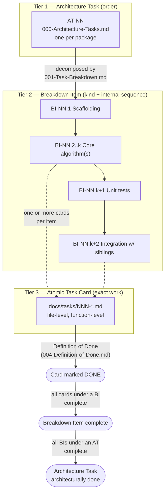

# 001 — Task Breakdown

## 1. Title

**Critical CSS Extraction Engine — Task Breakdown: Decomposing Architecture Task Groups into Engineering Work Items**

## 2. Version

| Field | Value |
|---|---|
| Document Version | 1.0.0 |
| Status | Draft — Phase 16 (Implementation Task Catalog) |
| Last Updated | 2026-07-10 |
| Owners | Core Architecture Working Group / Testing Guild |
| Stability | Draft; the Breakdown Item (BI-NN) numbering under each AT-NN group is expected to be append-only — new items may be inserted as implementation reveals finer-grained work, but existing item numbers must not be renumbered once `docs/tasks/` cards reference them |

## 3. Purpose

[000-Architecture-Tasks.md](./000-Architecture-Tasks.md) answers *in what order* the eleven package-level architecture task groups (AT-01 through AT-11) get built. It deliberately stops at the package boundary: an architecture task group says "build `packages/matcher` against these design documents, after `packages/collector` is architecturally done," but it does not say what an engineer sits down to actually write on day one. This document closes that gap. It decomposes each `AT-NN` group into a set of concrete, independently-assignable **Breakdown Items** (`BI-NN.M`) — module scaffolding, core-algorithm implementation, unit test suites, and cross-package integration work — at a grain fine enough that a single engineer or a single autonomous coding agent session can pick one up and complete it in a bounded unit of work, but still coarse enough that it does not collapse into the file-by-file atomicity of `docs/tasks/`'s task cards.

This document exists because the gap between "build `packages/matcher`" and "here is the exact function signature, file path, and test fixture for today's work" is too large to cross in one step without losing traceability. A three-tier decomposition — architecture task → breakdown item → atomic task card — lets each tier answer exactly one question and nothing else: `000` answers *order*, this document answers *what kinds of work exist inside that order*, and `docs/tasks/` answers *what, precisely, do I write right now*. Collapsing any two of these tiers into one document has been tried informally in this project's predecessor engagements and reliably produces documents that are either too vague to hand to an autonomous agent or too voluminous to read end-to-end during planning — this document's existence is a direct response to that failure mode.

This document also introduces the project's **estimation approach**: a relative-sizing scheme (not calendar time), since a coding-agent-and-human mixed workforce makes hour-based estimates actively misleading (see Section 8.14 and Section 10.2).

## 4. Audience

- Engineering leads and autonomous-agent orchestrators who take an `AT-NN` architecture task group from `000-Architecture-Tasks.md` and need to split it into assignable work before any `docs/tasks/` card exists for it.
- Task-card authors, who use each Breakdown Item below as the direct parent grouping for the atomic cards they write under `docs/tasks/` (e.g., `docs/tasks/001-Implement-Browser-Pool.md` and `docs/tasks/006-Implement-Serializer.md` both trace up through a specific `BI-NN.M` entry in this document, not directly to an `AT-NN` group).
- Reviewers and milestone planners feeding [002-Milestones.md](./002-Milestones.md), who need a work-item-level (not package-level) granularity to build realistic milestone contents.
- Autonomous coding agents that have completed an `AT-NN` group's scaffolding and need the next actionable, appropriately-scoped chunk of work without waiting for a human to hand-write a task card from scratch.

Readers are assumed to have already read [000-Architecture-Tasks.md](./000-Architecture-Tasks.md) in full — this document does not restate that document's package-dependency rationale, only its numbering and scope, and assumes familiarity with `BRIEF.md` §2.4's sixteen-module responsibility table and §2.19's canonical repository layout.

## 5. Prerequisites

- [000-Architecture-Tasks.md](./000-Architecture-Tasks.md) — the eleven `AT-NN` groups this document decomposes, in the exact build order and with the exact design-document citations this document inherits without repeating.
- [docs/architecture/007-Repository-Structure.md](../architecture/007-Repository-Structure.md) — package boundaries, barrel-export conventions, and the internal three-module bundling of `packages/collector` that this document's `BI-03.*` items reflect directly.
- [docs/architecture/006-Design-Principles.md](../architecture/006-Design-Principles.md) — the eight design principles every breakdown item's "core algorithm implementation" work must satisfy.
- [004-Definition-of-Done.md](./004-Definition-of-Done.md) — the seven-gate completion bar every breakdown item's eventual atomic task cards are held to; this document does not redefine "done," it only defines "what is the unit of work."
- `BRIEF.md` §2.4 (sixteen-module responsibility table) and §2.19 (canonical repository layout) — the module-to-package mapping this document's breakdown items are grounded in.
- Familiarity with the Phase 3–13 design documents cited per-package in `000-Architecture-Tasks.md` §8 — this document does not re-cite them exhaustively, only where a specific breakdown item needs a narrower citation than its parent `AT-NN` group.

## 6. Related Documents

- [000-Architecture-Tasks.md](./000-Architecture-Tasks.md) — the sibling document this one refines; every `BI-NN.M` item in Section 8 belongs to exactly one `AT-NN` group defined there.
- [002-Milestones.md](./002-Milestones.md) (parallel-authored, Phase 16) — groups this document's breakdown items into shippable milestones aligned with `BRIEF.md` §2.17's five-phase roadmap; consumes this document's relative-size estimates (Section 8.14) as its milestone-sizing input.
- [003-Acceptance-Tests.md](./003-Acceptance-Tests.md) (parallel-authored, Phase 16) — the per-requirement acceptance criteria each breakdown item's resulting code must satisfy; orthogonal to this document in the same way it is orthogonal to `004-Definition-of-Done.md` (see that document's §7.1).
- [004-Definition-of-Done.md](./004-Definition-of-Done.md) — the completion gate applied to every atomic task card descending from a breakdown item in this document.
- [docs/tasks/](../tasks/) — the atomic task cards, the finest-grained tier; forward-referenced throughout Section 8 (e.g., `../tasks/001-Implement-Browser-Pool.md`, `../tasks/006-Implement-Serializer.md`).
- [docs/architecture/007-Repository-Structure.md](../architecture/007-Repository-Structure.md), [006-Design-Principles.md](../architecture/006-Design-Principles.md) — the structural and principled authority this document's breakdown items must remain consistent with.

## 7. Overview

`000-Architecture-Tasks.md` produced eleven task groups by walking the package dependency graph. This document walks *inside* each of those eleven groups and asks: what are the natural seams along which one package's implementation splits into assignable chunks? The answer, applied uniformly across all eleven groups, is four recurring kinds of breakdown item:

1. **Scaffolding** — package/module directory structure, `package.json`, `tsconfig.json` project references, barrel-export skeleton, and the DTO/interface stubs the package's public surface commits to before any real logic exists. This item type exists so that downstream packages which merely need to compile against a package's *shape* (not its behavior) can start in parallel with that package's own algorithm work — a pattern `000`'s Section 8.13 parallelization argument already assumes is possible, and this document makes it concrete by naming scaffolding as its own item.
2. **Core algorithm implementation** — the actual design-document-to-code translation: the Browser Pool's lease/release state machine, the Selector Matcher's memoization cache, the Dependency Resolver's fixed-point iteration, and so on. This is where the bulk of each design document's Algorithms section becomes real.
3. **Unit tests** — colocated test suites proving the core algorithm's contract in isolation, per [Definition of Done Gate 2](./004-Definition-of-Done.md#8-detailed-design). Called out as its own breakdown item (rather than folded into "core algorithm implementation") because in an agent-driven workflow it is frequently a *separate* session/assignment from the implementation it tests — reviewers benefit from being able to see "was a dedicated test-writing pass done" as a distinct, checkable unit.
4. **Integration with sibling packages** — the work of actually wiring a package's output into the next package in the build-level sequence (e.g., wiring `collector`'s DOM/CSSOM snapshot DTOs into `matcher`'s input contract), including the integration test Definition of Done Gate 3 requires whenever a change crosses a package boundary.

Every `AT-NN` group in Section 8 below is decomposed into these four kinds, tagged `BI-NN.1` (scaffolding) through `BI-NN.4`+ (as many core-algorithm/test/integration items as the package's internal module count requires — `packages/collector`, being three internally bundled modules per `007-Repository-Structure.md`, needs three parallel core-algorithm/test/integration triads rather than one). The result is a work-item catalog that is exhaustive relative to `000`'s scope statements, directly citable from `002-Milestones.md`'s milestone contents, and directly parent-referenceable from `docs/tasks/`'s atomic cards.

## 8. Detailed Design

### 8.1 Breakdown Item Numbering Convention

Each item is numbered `BI-NN.M`, where `NN` matches its parent `AT-NN` group's number from `000-Architecture-Tasks.md` and `M` is a sequence number local to that group, assigned in the order the item should be started (scaffolding always first within a group; integration items always last, since they require the sibling package's contract to exist). `docs/tasks/` atomic cards cite the `BI-NN.M` item they descend from in their own "Related Documents" section — e.g., `../tasks/001-Implement-Browser-Pool.md` descends from `BI-02.2` below, and `../tasks/006-Implement-Serializer.md` descends from `BI-07.2`.

### 8.2 AT-01 — `packages/shared` Breakdown

- **BI-01.1 — Scaffolding.** Create `packages/shared/{src,test}`, `package.json` (zero internal dependencies, per `000` §8.2's DAG-source declaration), `tsconfig.json` with no project references, and an initial `src/index.ts` barrel exporting placeholder (but correctly typed) stubs for `ExtractionResult`, `Diagnostic`, `ViewportProfile`, `MatchedRule`, `DependencyNode`, `CacheFingerprint`, `PluginHookContext`, `RouteManifestEntry`.
- **BI-01.2 — DTO and configuration schema implementation.** Fully specify every DTO field per the design documents cited in `000` §8.2 (`003-Requirements.md`'s module responsibility table, `1000-Diagnostics-Overview.md`'s diagnostic taxonomy), plus the configuration schema types the Configuration Loader (`apps/cli`, `AT-11`) will consume. This item is where `shared`'s "must remain evaluable inside a browser-injected function body" constraint (`000` §8.2) is enforced by construction: no import of `fs`, `path`, Node globals, or DOM-absent-in-page-context APIs.
- **BI-01.3 — Error type hierarchy.** Implement the fail-fast error taxonomy (Design Principle 6) as a class hierarchy (e.g., `ExtractionError` base, `NavigationTimeoutError`, `SelectorMatchError`, `SerializationError` subclasses) with a stable, serializable `Diagnostic` conversion method every downstream package's error handling relies on.
- **BI-01.4 — Unit tests.** Type-level tests (using a type-testing utility, since `shared` has no runtime logic to speak of beyond the error hierarchy's conversion methods) plus runtime unit tests for BI-01.3's error-to-diagnostic conversion.
- **BI-01.5 — Documentation sync.** Update `docs/api/` (or equivalent generated-API reference, per `007`'s Implementation Notes) to reflect the final DTO shapes, since every one of `000`'s ten downstream groups cites `shared`'s DTOs as part of their own input/output contracts — a DTO shape change here after downstream groups start is exactly the churn `000` §8.2 says this ordering avoids.

No integration item exists for `AT-01` — it is the DAG source and has no upstream package to integrate with; its "integration" is, in effect, every other group's scaffolding item importing from it.

### 8.3 AT-02 — `packages/browser` Breakdown

- **BI-02.1 — Scaffolding.** Package skeleton depending on `packages/shared` (types only), Playwright as an external dependency per [ADR-0003-Playwright-As-Browser-Abstraction](../adr/ADR-0003-Playwright-As-Browser-Abstraction.md), and barrel-exported interface stubs for `BrowserManager`, `NavigationEngine`, `ViewportManager`.
- **BI-02.2 — Browser Manager core implementation.** Process/context pooling (lease, release, health-check, graceful shutdown) per [102-Browser-Pool.md](../design/102-Browser-Pool.md) — this is the item `docs/tasks/001-Implement-Browser-Pool.md` descends from.
- **BI-02.3 — Navigation Engine core implementation.** Page navigation and rendering-stabilization heuristics (network-idle detection, font-load waiting, layout-shift settling) per [103-Navigation-Engine.md](../design/103-Navigation-Engine.md) and [104-Rendering-Stabilization.md](../design/104-Rendering-Stabilization.md).
- **BI-02.4 — Viewport Manager core implementation.** Device-profile application (viewport size, device-scale-factor, user-agent override, touch emulation) per [105-Viewport-Manager.md](../design/105-Viewport-Manager.md).
- **BI-02.5 — Unit tests.** Per-module unit suites for BI-02.2 through BI-02.4, run against a real (not mocked) headless Playwright instance where feasible, per this project's general preference (Design Principle 1) for browser-truth over simulated browser behavior even at the unit-test tier.
- **BI-02.6 — Integration with `packages/shared`.** Confirm every public method's parameter and return types resolve to `shared`'s DTOs with no local shadow types; this is the Gate 3 integration test `004-Definition-of-Done.md` §11.2 requires for any package whose public surface changes.

### 8.4 AT-03 — `packages/collector` Breakdown

Per `007-Repository-Structure.md`'s internal three-module bundling (restated in `000` §8.4's Scope) and the explicit Implementation Note in `000` §11 that this bundling "should be reflected in AT-03's breakdown as three internally-separated work streams with their own barrel exports," `AT-03` decomposes into three parallel triads rather than one:

- **BI-03.1 — Package scaffolding.** One `packages/collector` skeleton with three internal directories (`src/dom-collector/`, `src/visibility-engine/`, `src/cssom-walker/`), each with its own `index.ts` barrel, aggregated into the package's top-level barrel — set up now so that a future mechanical package split (per `007`'s Future Work) only requires moving directories, not re-architecting import paths.
- **BI-03.2 — DOM Collector core implementation.** Above-fold node enumeration and snapshot DTO production per [106-DOM-Snapshot.md](../design/106-DOM-Snapshot.md).
- **BI-03.3 — Visibility Engine core implementation.** Geometry engine, intersection engine, overflow/transform/sticky/fixed/virtualized-list handling per [200](../design/200-Visibility-Engine-Overview.md)–[207](../design/207-Virtualized-Lists.md) — this is the item `docs/tasks/005-Implement-Visibility-Engine.md` descends from.
- **BI-03.4 — CSSOM Walker core implementation.** Stylesheet tree traversal including media/supports/layer/import/constructable-stylesheet handling per [300](../design/300-CSSOM-Walker.md)–[307](../design/307-Constructable-Stylesheets.md) — this is the item `docs/tasks/002-Implement-CSSOM-Walker.md` descends from.
- **BI-03.5 — Unit tests (three streams).** One dedicated unit suite per BI-03.2/.3/.4, covering fixture pages exercising each sub-engine's edge cases independently before any combined-pass integration test is attempted.
- **BI-03.6 — Integration: combined single-pass collection.** Per `000` §8.4's Scope note that the three modules "share one browser-context collection pass," this item wires DOM Collector, Visibility Engine, and CSSOM Walker into the single exported collection entry point that produces the above-fold DOM/CSSOM snapshot DTO — the point at which the three streams' outputs are proven mutually consistent (e.g., a node the Visibility Engine marks invisible must not appear in the CSSOM Walker's rule-to-node mapping).
- **BI-03.7 — Integration with `packages/browser`.** Confirm the collection pass correctly acquires its page/context via `AT-02`'s `BrowserManager`/`NavigationEngine` public API, with no direct Playwright import inside `collector` (Design Principle 1's page-context-bridge boundary).

### 8.5 AT-04 — `packages/matcher` Breakdown

- **BI-04.1 — Scaffolding.** Package skeleton depending on `browser`, `collector`, `shared`; barrel stub for the matcher's public `matchRules()` entry point.
- **BI-04.2 — Core matching implementation.** Thin `Element.matches()`/`querySelectorAll` wrapper (never a custom parser, per [ADR-0002](../adr/ADR-0002-No-Custom-Selector-Parser.md)) consuming `collector`'s rule tree and node set, per [400-Selector-Matching.md](../design/400-Selector-Matching.md) — this is the item `docs/tasks/003-Implement-Selector-Matcher.md` descends from.
- **BI-04.3 — Memoization layer.** Selector-to-matched-node-set cache per [401-Selector-Memoization.md](../design/401-Selector-Memoization.md), including cache-key derivation and invalidation-on-DOM-mutation handling.
- **BI-04.4 — Extended selector support.** Pseudo-elements, pseudo-classes, `:is()`/`:where()`/`:has()`, and container-query-aware matching per [402](../design/402-Pseudo-Elements.md)–[405](../design/405-Container-Queries.md).
- **BI-04.5 — Unit tests.** Suites for BI-04.2 through BI-04.4, including the benchmark-tests Definition of Done requires for memoization's performance claims (`004-Definition-of-Done.md` §15).
- **BI-04.6 — Integration with `packages/collector`.** Contract test proving `matcher` correctly consumes `collector`'s rule-tree and node-set DTOs across a version bump of either package — the integration test `000` §12's "agent starts AT-04 before AT-03 is done" edge case is specifically meant to prevent skipping.

### 8.6 AT-05 — `packages/coverage` Breakdown

- **BI-05.1 — Scaffolding.** Package skeleton depending only on `browser`/`shared` (explicitly *not* `matcher` or `collector`, per the no-shared-edge invariant `000` §8.6 states is a design-violation-requiring-ADR if broken).
- **BI-05.2 — CDP Coverage domain integration.** Chrome DevTools Protocol Coverage-domain session setup, start/stop instrumentation, and actually-painted-rule recording per [700-Coverage-Mode.md](../design/700-Coverage-Mode.md) and [ADR-0005-Hybrid-Extraction-Mode](../adr/ADR-0005-Hybrid-Extraction-Mode.md).
- **BI-05.3 — Unit tests.** Coverage-session lifecycle tests and a fixture proving the recorded rule set matches an independently-verified "actually painted" ground truth.
- **BI-05.4 — Integration with `packages/browser`.** Confirm CDP session acquisition goes through `AT-02`'s public API rather than a parallel, uncoordinated CDP connection — two independent CDP sessions against the same page is a known source of Playwright instability this item's test must guard against.

Per `000` §8.13, `BI-05.*` is fully parallel-eligible with `BI-04.*` once `BI-02.*` (browser) is complete; `BI-05.*` has no dependency on `BI-03.*` (collector) at all.

### 8.7 AT-06 — `packages/dependency-graph` Breakdown

- **BI-06.1 — Scaffolding.** Package skeleton depending on `matcher`, `coverage`, `shared`; barrel stubs for `DependencyResolver`, `CascadeResolver`, and the Hybrid strategy composer.
- **BI-06.2 — Dependency Resolver core implementation.** Variables, keyframes, font faces, `@property`, `@counter-style`, `@layer`/`@supports`/media/container query tracking, resolved iteratively to a fixed point, per [500](../design/500-Dependency-Resolution-Overview.md) and [501](../algorithms/501-CSS-Variables.md)–[508](../algorithms/508-Cycle-Detection.md) — this is the item `docs/tasks/004-Implement-Dependency-Resolver.md` descends from.
- **BI-06.3 — Cascade Resolver core implementation.** Specificity/origin/layer ordering per [506-Cascade-Layers.md](../algorithms/506-Cascade-Layers.md), bundled here per `007`'s Implementation Notes rationale that layer ordering is dependency-graph-shaped.
- **BI-06.4 — Hybrid strategy composer.** The single, explicitly-scoped-here (not to `matcher` or `coverage`, per `000` §11's "single most important scoping decision") composition of `matcher` and `coverage` outputs per [701-Hybrid-Mode.md](../design/701-Hybrid-Mode.md) and [702-Computed-Style-Mode.md](../design/702-Computed-Style-Mode.md).
- **BI-06.5 — Cycle detection.** Standalone implementation of [508-Cycle-Detection.md](../algorithms/508-Cycle-Detection.md)'s algorithm, called out separately because `000` §10.2 mandates it also run as a documentation-linting CI check on this catalog's own dependency claims — the runtime cycle detector and the doc-linting reuse of the same algorithm should share one implementation.
- **BI-06.6 — Unit tests.** Fixed-point convergence tests (including deliberately cyclic fixtures proving BI-06.5 terminates correctly), cascade-ordering tests, and Hybrid-composition tests.
- **BI-06.7 — Integration with `packages/matcher` and `packages/coverage`.** Contract tests proving the Hybrid composer correctly merges both packages' outputs without either package needing to know about the other — the explicit non-dependency invariant between `matcher` and `coverage` (`000` §8.5–8.6) is what this integration item exists to protect against silent violation.

### 8.8 AT-07 — `packages/serializer` Breakdown

- **BI-07.1 — Scaffolding.** Package skeleton depending on `dependency-graph`, `shared`; barrel stub for the serializer's public `serialize()` entry point — this is the item `docs/tasks/006-Implement-Serializer.md`'s scaffolding portion traces to.
- **BI-07.2 — Rule ordering and deduplication.** Canonical-ordering algorithm (Design Principle 5) and deduplication per [601-Rule-Ordering.md](../design/601-Rule-Ordering.md) and [602-Deduplication.md](../design/602-Deduplication.md) — the primary core-algorithm item `docs/tasks/006-Implement-Serializer.md` implements.
- **BI-07.3 — Output formatting and compression.** Output-format variants and minification per [603-Compression.md](../design/603-Compression.md) and [606-Output-Formats.md](../design/606-Output-Formats.md).
- **BI-07.4 — Output validation and source maps.** Post-serialization validation pass and source-map emission per [604-Output-Validation.md](../design/604-Output-Validation.md) and [605-Source-Maps.md](../design/605-Source-Maps.md).
- **BI-07.5 — Visual diff and incremental extraction hooks.** Support scaffolding for [703-Visual-Diff.md](../design/703-Visual-Diff.md) and [704-Incremental-Extraction.md](../design/704-Incremental-Extraction.md), consumed later by `apps/visualizer` (`AT-11b`) and `packages/cache` (`AT-08`) respectively.
- **BI-07.6 — Unit tests, including golden-file baseline.** The initial golden-file corpus this package's Definition of Done Gate 5 checks against (`004-Definition-of-Done.md` §8.1) is authored as part of this item, not deferred.
- **BI-07.7 — Integration with `packages/dependency-graph`.** Contract test proving serialization correctly consumes the resolved, fixed-point dependency set — `000` §8.8's stated reason serialization cannot start before `dependency-graph` completes.

### 8.9 AT-08 — `packages/cache` Breakdown

- **BI-08.1 — Scaffolding.** Package skeleton depending only on `shared`; barrel stubs for `Fingerprinter`, `CacheStore` (pluggable backend interface), `RouteCache`, `ViewportCache`.
- **BI-08.2 — Fingerprinting core implementation.** HTML/CSS-asset/viewport/extraction-mode fingerprint derivation per [801-Fingerprinting.md](../design/801-Fingerprinting.md).
- **BI-08.3 — Cache store backends.** In-memory and filesystem `CacheStore` implementations per [802-Cache-Store.md](../design/802-Cache-Store.md); Redis/distributed backend per [806-Distributed-Cache.md](../design/806-Distributed-Cache.md) may be split into its own follow-on item if scheduling favors deferring it to a later milestone (see [002-Milestones.md](./002-Milestones.md)).
- **BI-08.4 — Route and viewport cache, invalidation.** [803-Route-Cache.md](../design/803-Route-Cache.md), [804-Viewport-Cache.md](../design/804-Viewport-Cache.md), [805-Cache-Invalidation.md](../design/805-Cache-Invalidation.md).
- **BI-08.5 — Unit tests.** Fingerprint-stability tests (same input always yields the same fingerprint) and invalidation-correctness tests (a changed input always yields a different fingerprint).
- **BI-08.6 — Integration stub against a mock pipeline.** Per `000` §14's observation that `cache`'s early availability (level 2) lets its fingerprint-gated pipeline-skip behavior be integration-tested against a stub pipeline well before the real pipeline exists, this item is deliberately a *stub* integration (against a hand-written fake extraction function), re-run for real once `AT-11a` (`apps/cli`) exists.

### 8.10 AT-09 — `packages/plugins` Breakdown

- **BI-09.1 — Scaffolding.** Package skeleton depending only on `shared`; barrel stub for the plugin registration/execution runtime and the six lifecycle hook interfaces.
- **BI-09.2 — Lifecycle hook contracts.** `beforeLaunch`, `afterNavigation`, `beforeCollection`, `afterCollection`, `beforeSerialize`, `afterSerialize` per [001-Lifecycle-Hooks.md](../plugins/001-Lifecycle-Hooks.md) and [002-Plugin-API.md](../plugins/002-Plugin-API.md).
- **BI-09.3 — Sandboxing boundary.** Design Principle 7's isolation mechanism per [004-Sandboxing.md](../plugins/004-Sandboxing.md) and [ADR-0004-Plugin-Lifecycle-Model](../adr/ADR-0004-Plugin-Lifecycle-Model.md).
- **BI-09.4 — Reference plugin examples.** At least the canonical examples from [003-Plugin-Examples.md](../plugins/003-Plugin-Examples.md), doubling as this package's own integration-style tests (a plugin author's first real usage of the SDK).
- **BI-09.5 — Unit tests.** Hook-invocation-order tests and sandbox-escape-attempt tests (proving the sandbox actually contains a deliberately malicious example plugin).

### 8.11 AT-10 — `packages/reporter` Breakdown

- **BI-10.1 — Scaffolding.** Package skeleton depending on `dependency-graph`, `serializer`, `shared`.
- **BI-10.2 — Diagnostics core implementation.** Dependency-graph visualization data and matched/unmatched selector reports per [1000-Diagnostics-Overview.md](../design/1000-Diagnostics-Overview.md) and [1004-Visualization.md](../design/1004-Visualization.md).
- **BI-10.3 — Logging, metrics, tracing.** [1001-Logging.md](../design/1001-Logging.md), [1002-Metrics.md](../design/1002-Metrics.md), [1003-Tracing.md](../design/1003-Tracing.md).
- **BI-10.4 — Debug UI data contract.** Data shapes per [1005-Debug-UI.md](../design/1005-Debug-UI.md) consumed later by `apps/visualizer` (`AT-11b`).
- **BI-10.5 — Unit tests.** Report-shape snapshot tests and timing-trace correctness tests.
- **BI-10.6 — Integration with `packages/dependency-graph` and `packages/serializer`.** Contract tests proving reporter correctly reads both packages' terminal outputs without mutating them (reporter is a pure sink per `000` §8.11).

### 8.12 AT-11 — `apps/cli`, `apps/visualizer`, `apps/playground` Breakdown

- **BI-11.1 — CLI scaffolding and argument parsing.** Entry point, argument parser, and the Configuration Loader sub-item `000` §11 explicitly scopes here (not as its own package, pending the Future Work promotion to `packages/config`).
- **BI-11.2 — CLI pipeline orchestration.** Wiring every `packages/*` public API into the sequence diagram from `007-Repository-Structure.md` §Architecture — the first point at which all ten packages are exercised end-to-end.
- **BI-11.3 — Route manifest expansion.** Multi-route/multi-viewport expansion logic feeding the orchestration in BI-11.2.
- **BI-11.4 — CLI integration test suite.** The end-to-end acceptance-gate suite `003-Acceptance-Tests.md` and `004-Definition-of-Done.md` §15 both point to as the primary integration signal.
- **BI-11.5 — Visualizer scaffolding and data consumption.** `apps/visualizer` consuming `packages/reporter` and `packages/dependency-graph` output per `BRIEF.md` §2.12; deferred priority per the Roadmap's Phase 5, but its DTO contracts are exercised as soon as `BI-10.*` exists.
- **BI-11.6 — Playground scaffolding.** `apps/playground` depending directly on `browser`/`collector`/`matcher`/`coverage`/`shared`, bypassing orchestration packages, for low-ceremony plugin-author iteration; explicitly looser completion criteria per `000` §12's edge case on `playground` not being a stability proxy.

### 8.13 The Three-Tier Granularity and Where This Document Sits

This document's `BI-NN.M` items are the middle tier of a three-tier decomposition:

1. **Architecture Task** (`AT-NN`, in `000-Architecture-Tasks.md`) — one per package, answers *build order*.
2. **Breakdown Item** (`BI-NN.M`, this document) — several per package, answers *what kinds of work exist and in what internal sequence*.
3. **Atomic Task Card** (`docs/tasks/NNN-*.md`) — one or more per breakdown item, answers *exactly what to write, in which file, right now*.

An atomic task card's "Related Documents" section must cite both its parent `BI-NN.M` (this document) and, transitively, that item's parent `AT-NN` (`000-Architecture-Tasks.md`) — never `000` directly, since skipping the middle tier is exactly the granularity-collapse this document's Purpose section warns against. The six atomic cards existing at the time of this writing (`docs/tasks/001` through `006`) map onto this document's items as follows: `001-Implement-Browser-Pool.md` → `BI-02.2`; `002-Implement-CSSOM-Walker.md` → `BI-03.4`; `003-Implement-Selector-Matcher.md` → `BI-04.2`; `004-Implement-Dependency-Resolver.md` → `BI-06.2`; `005-Implement-Visibility-Engine.md` → `BI-03.3`; `006-Implement-Serializer.md` → `BI-07.2`/`BI-07.1`.

### 8.14 Estimation Approach: Relative Sizing, Not Calendar Time

This project's implementers are a mixed fleet of human engineers and autonomous coding agents running at variable, non-comparable throughput — an agent may complete a scaffolding item in minutes of wall-clock time but a core-algorithm item spanning several design documents' worth of edge cases in hours, while a human engineer's calendar-time profile is shaped by meetings, context-switching, and review latency that has nothing to do with the work's actual complexity. Calendar-time estimates (story points expressed as days) are therefore actively misleading as a planning input for this specific workforce composition, and this document instead adopts **relative sizing**: every `BI-NN.M` item is tagged with a size class — **S** (scaffolding-shaped: mechanical, low-ambiguity, no novel algorithm), **M** (a single, well-scoped algorithm from one or two design documents), or **L** (an algorithm spanning many design documents' edge cases, or requiring a fixed-point/iterative convergence property to be proven correct) — relative to each other, not to any unit of time. Section 10.2 formalizes the sizing algorithm; the size classes appear inline as a compact tag after each item's heading in a future revision of this document once `002-Milestones.md`'s milestone-construction pass has validated the classification against at least one full `AT-NN` group's actual implementation experience (tracked as this document's own Future Work item, Section 16).

## 9. Architecture



The diagram deliberately shows two different kinds of edges: solid arrows within Tier 2 (`BI-NN.1` → `BI-NN.2..k` → `BI-NN.3` → `BI-NN.4`) represent the *intra-package* sequencing this document imposes (scaffold before implementing, implement before testing, test before integrating), while the dotted arrows into Tier 3 represent the *one-to-many* fan-out from a single breakdown item to potentially several atomic task cards — a large `L`-sized item like `BI-03.3` (Visibility Engine) may spawn multiple cards (one per sub-concern: geometry, intersection, overflow/transform, sticky/fixed, virtualized lists) where a small `S`-sized scaffolding item spawns exactly one.

## 10. Algorithms

### 10.1 Algorithm: Decomposing an Architecture Task into Breakdown Items

**Problem statement.** Given an architecture task group `AT` (its scope description and cited design documents, from `000-Architecture-Tasks.md`), produce an ordered list of breakdown items covering scaffolding, every internally-bundled module's core algorithm, unit tests, and sibling-package integration.

**Inputs.** `AT.scope` (prose scope description), `AT.docs` (cited design document set), `AT.internalModules` (1 for most packages, 3 for `collector` per `007`'s bundling rationale), `AT.dependsOn` (the set of upstream `AT-NN` groups whose public surface this package's integration items must exercise).

**Outputs.** An ordered list `BI = [BI.1, ..., BI.n]` where `BI.1` is always scaffolding, `BI.2` through `BI.(1+|AT.internalModules|)` are one core-algorithm item per internal module, the next item is a unit-test item (or one per internal module, for a multi-module package like `collector`), and the final item(s) are integration items — one per entry in `AT.dependsOn` that this document judges load-bearing enough to warrant its own explicit contract test (in practice, always the immediate upstream package(s) whose output DTOs this package directly consumes).

**Pseudocode.**
```
function decomposeArchitectureTask(AT: ArchitectureTask): BreakdownItem[]
    items = []
    items.push(BreakdownItem(kind=SCAFFOLD, seq=1))
    seq = 2
    for module in AT.internalModules:
        items.push(BreakdownItem(kind=CORE_ALGORITHM, module=module, seq=seq, docs=AT.docsFor(module)))
        seq += 1
    if AT.internalModules.length > 1:
        // combined-pass integration item, e.g. BI-03.6's single-pass collection
        items.push(BreakdownItem(kind=COMBINED_INTEGRATION, seq=seq))
        seq += 1
    for module in AT.internalModules:
        items.push(BreakdownItem(kind=UNIT_TEST, module=module, seq=seq))
        seq += 1
    for upstream in AT.dependsOn.filter(isDirectContractDependency):
        items.push(BreakdownItem(kind=SIBLING_INTEGRATION, upstream=upstream, seq=seq))
        seq += 1
    return items
```

**Time complexity.** `O(M + U)` per architecture task, where `M` is the internal module count (1 or 3 across this project's eleven groups) and `U` is the upstream-dependency count (bounded by the package graph's maximum in-degree, which is 3 for `AT-06`/`dependency-graph`). Across all eleven groups this is `O(V + E)` overall, identical in shape to `000`'s own build-level derivation, since breakdown is a per-node refinement of the same graph.

**Memory complexity.** `O(sum of M_i + U_i across all AT-NN)` to hold the full breakdown-item catalog — at this project's scale (eleven packages, at most three internal modules, at most three upstream contract dependencies) this is under fifty items total, comfortably held in memory as a flat list (Section 8's eleven subsections, ~5–7 items each).

**Failure cases.** A package whose scope description does not cleanly partition into the four kinds (e.g., a core algorithm so entangled with its own scaffolding that no meaningful scaffolding-only commit exists) signals that the package's scope itself is too fine-grained or too coarse-grained relative to `007-Repository-Structure.md`'s package boundaries — this is a repository-structure defect to escalate, not something this document's breakdown algorithm should silently paper over by merging item kinds.

**Optimization opportunities.** None needed at this corpus size (eleven architecture tasks); if the package count grows substantially (e.g., after `packages/collector`'s anticipated future split), this decomposition pattern is directly reusable per new package without modification, since it operates on `AT.internalModules` and `AT.dependsOn`, both of which are already tracked per-package in `000`.

### 10.2 Algorithm: Relative Size Classification

**Problem statement.** Given a breakdown item, assign it a relative size class (`S`, `M`, `L`) usable for milestone planning (`002-Milestones.md`) without reference to calendar time, per Section 8.14's rationale.

**Inputs.** `item.kind` (scaffold / core-algorithm / unit-test / integration), `item.citedDocs` (the design documents it implements), and, for core-algorithm items, whether the underlying design document declares an iterative/fixed-point convergence property (a strong `L` signal, since convergence proofs and their edge cases dominate implementation and test-writing time disproportionately to the code's line count).

**Pseudocode.**
```
function classifySize(item: BreakdownItem): 'S' | 'M' | 'L'
    if item.kind == SCAFFOLD:
        return 'S'
    if item.kind == UNIT_TEST:
        // sized relative to the item it tests, one class down
        return oneClassDown(classifySize(item.testedItem))
    if item.kind in [COMBINED_INTEGRATION, SIBLING_INTEGRATION]:
        return item.citedDocs.length <= 1 ? 'S' : 'M'
    // CORE_ALGORITHM
    if item.declaresFixedPointConvergence or item.citedDocs.length >= 5:
        return 'L'
    if item.citedDocs.length >= 2:
        return 'M'
    return 'S'
```

Applying this classification: `BI-06.2` (Dependency Resolver, 8 cited documents, explicit fixed-point convergence) classifies `L`; `BI-04.3` (memoization, 1 document, no convergence property) classifies `S`-to-`M`; `BI-01.1` (shared scaffolding) classifies `S` by construction.

**Time complexity.** `O(1)` per item given its already-recorded metadata (cited-document count, convergence flag) — the classification is a lookup/threshold check, not a computation over the code itself.

**Memory complexity.** `O(1)` per item; `O(n)` to hold the classification for all `n` breakdown items in this document (n ≈ 50).

**Failure cases.** A borderline item (e.g., exactly at the 2-document or 5-document threshold) should default to the *larger* class — the same fail-fast-favoring-caution bias `004-Definition-of-Done.md` §10.6 applies to ambiguous Gate 3 determinations, since underestimating an item's size causes milestone slippage discovered late, while overestimating merely causes conservative-but-correct planning.

**Optimization opportunities.** Once at least one full `AT-NN` group has been implemented end-to-end, replace the document-count/convergence-flag heuristic with an empirically-calibrated classifier (e.g., regressing actual implementation-session count against these same features) — tracked in Section 16.

## 11. Implementation Notes

- Every `BI-NN.M` item in Section 8 should be tracked as a story/sub-epic beneath its parent `AT-NN` epic in whatever project-tracking tool the team uses, with `docs/tasks/` cards nested beneath the relevant `BI-NN.M` story — directly realizing the epic → story → task mapping `000-Architecture-Tasks.md` §11 anticipates.
- `packages/collector`'s three-stream breakdown (`BI-03.2` through `BI-03.4`) is the canonical example every other multi-concern package's breakdown should follow if `007`'s Future Work package-split ever materializes: keep the internal modules as separately-numbered core-algorithm items with a single combined-integration item bridging them, rather than either merging them into one undifferentiated item or prematurely splitting them into separate `AT-NN` groups before the actual package split happens.
- Integration items (`BI-NN.*`'s last entries in each group) are intentionally the *last* item within a group precisely because [004-Definition-of-Done.md](./004-Definition-of-Done.md) §11.2 treats a new module's first implementation as "crosses a package boundary by construction" — sequencing integration last within the breakdown ensures the contract being integration-tested is the *stable*, post-core-algorithm contract, not a moving target.
- When an autonomous agent completes a breakdown item and no `docs/tasks/` card yet exists for the next item in sequence, the agent (or its orchestrator) should synthesize one referencing this document's relevant `BI-NN.M` entry rather than starting undocumented, untracked work — this preserves the three-tier traceability chain described in Section 8.13 even for work items authored just-in-time rather than up-front.
- This document's breakdown items are deliberately silent on *which* engineer or agent should take which item — that is a staffing decision for `002-Milestones.md` and day-to-day project management, not an architectural concern this document should encode.

## 12. Edge Cases

- **A breakdown item turns out to need splitting further during implementation.** If `BI-06.2` (Dependency Resolver) proves too large even at `L` size to complete as a bounded unit of work, split it into `BI-06.2a` (variables/keyframes/font-faces) and `BI-06.2b` (`@property`/`@layer`/cascade-layer-adjacent dependency tracking) — append-only lettered sub-items, never renumbering the parent, per this document's Version-field stability note.
- **A breakdown item's design documents change mid-implementation.** Mirrors [004-Definition-of-Done.md](./004-Definition-of-Done.md) §12.3: the item is not complete until reconciled with the current document revision, and this document's citation for that item must be updated in the same pull request that reconciles the code.
- **An atomic task card is written that spans two breakdown items.** Per `000-Architecture-Tasks.md` §12's "circular re-scoping" edge case (applied one tier down): if a card genuinely needs both, for example, `BI-04.2` (core matching) and `BI-04.3` (memoization) in one sitting, the card should still declare a single primary `BI-NN.M` parent and note the secondary as an additional citation — splitting the underlying breakdown items themselves is preferred once discovered, to keep the one-card-one-parent-item invariant intact going forward.
- **A parallel-eligible group's breakdown items get staffed sequentially anyway.** Exactly as `000` §8.13/§14 warns for architecture task groups, this document's `BI-04.*`/`BI-05.*` and `BI-08.*`/`BI-09.*` pairs (matcher/coverage; cache/plugins) are equally parallel-eligible at the breakdown-item level — a team or agent fleet that staffs them sequentially anyway is making a scheduling error, not a technical one, identical in kind to the one `000`'s Performance section calls out.
- **`apps/playground`'s breakdown items (`BI-11.6`) reference in-progress upstream package APIs.** Per `000` §12's `apps/playground` edge case, this is expected and acceptable; `BI-11.6`'s own completion criteria (Section 8.12) are intentionally looser than `BI-11.2`'s CLI-orchestration item and must not be read as evidence the full package surface is stable.

## 13. Tradeoffs

| Decision | Alternative Considered | Why Rejected | Cost Accepted |
|---|---|---|---|
| Four recurring item kinds (scaffold, core-algorithm, unit-test, integration) applied uniformly across all eleven groups | A bespoke breakdown shape per package, tailored to each package's own internal structure | Uniformity makes the breakdown predictable to both human planners and autonomous agents parsing this document programmatically; a bespoke shape per package would need its own justification each time and risks silently dropping a kind (e.g., forgetting an integration item for a package that turns out to need one) | Occasionally an item kind is nearly vacuous for a given package (e.g., `packages/shared` has no sibling-integration item, Section 8.2) — accepted as a natural, documented absence rather than a forced, artificial item |
| `packages/collector`'s three internal modules broken out as three parallel core-algorithm items plus one combined-integration item | Treating `collector` as a single undifferentiated breakdown, matching its single `AT-03` grouping | Would hide the genuine internal parallelism (DOM Collector, Visibility Engine, and CSSOM Walker can, in principle, be implemented by three different engineers/agents simultaneously) that `007`'s bundling rationale explicitly preserves for a future package split | One extra item (`BI-03.6`, combined-pass integration) that has no analogue in single-module packages, adding minor asymmetry to Section 8's otherwise-uniform pattern |
| Relative sizing (`S`/`M`/`L`) instead of calendar-time or story-point-as-days estimation | Traditional days-to-complete estimates per item | A mixed human/agent workforce at non-comparable throughput makes calendar-time estimates actively misleading (Section 8.14); relative sizing at least orders items by genuine complexity even when it cannot predict wall-clock duration | `002-Milestones.md` cannot compute a calendar completion date directly from this document's sizes alone — it must additionally model throughput separately, a cost this document accepts as out of its own scope |
| Breakdown items numbered locally within each `AT-NN` group (`BI-NN.M`) rather than globally (`BI-001`, `BI-002`, ... across the whole catalog) | A single global sequence number for every breakdown item | Local numbering keeps an item's parent group visible in its own identifier, useful when an atomic task card or milestone document cites it out of context; global numbering would require a lookup table to recover the parent group | Local numbering means item `BI-03.6` is not adjacent, numerically, to `BI-04.1` despite being adjacent in build order — mitigated by Section 9's diagram and Section 8's ordering following `000`'s AT-NN sequence directly |

## 14. Performance

- **Planning-time complexity.** Decomposing all eleven architecture task groups into this document's ~50 breakdown items is a one-time, `O(V + E)`-shaped exercise (Section 10.1) — not a runtime concern, but its output is the direct input to `002-Milestones.md`'s milestone-construction pass, so an error here (a missing integration item, a misclassified size) propagates into every downstream planning document exactly as `000`'s own leveling errors would propagate into this document.
- **Parallel-execution headroom.** Because breakdown items inherit their parent `AT-NN` group's parallel-eligibility (Section 8.13's callout, mirroring `000` §8.13/§14), the actual parallel headroom available to a staffed team or agent fleet is larger than either document's linear numbering suggests in isolation — a team ignoring both documents' explicit parallelization sections systematically under-parallelizes.
- **Item-size distribution as a staffing signal.** Section 10.2's `S`/`M`/`L` classification, once populated across all ~50 items, gives `002-Milestones.md` a rough workload-balancing input: a milestone boundary drawn across a disproportionate concentration of `L`-sized items (e.g., a milestone containing both `BI-06.2` and `BI-03.3`, the two highest-complexity core-algorithm items in the catalog) is a scheduling risk worth flagging even without calendar-time estimates.
- **Incremental re-planning.** If a design document a breakdown item cites is revised (Section 12's edge case), only that item's size classification and citation list need re-derivation — the decomposition algorithm (Section 10.1) is not re-run wholesale, since it operates at the architecture-task level, one level above where the revision lands.
- **Caching strategy.** Not directly applicable to this document; however, `docs/tasks/`'s atomic cards citing a stable `BI-NN.M` identifier (rather than re-deriving their own scope description each time) is this document's version of a cache — a card can be authored, reviewed, and re-authored without this document changing, as long as the parent item's scope is unchanged.
- **Scalability limits.** At eleven architecture task groups and roughly fifty breakdown items, this document's structure scales comfortably; a `packages/collector` split (per `007`'s Future Work) would add roughly two more three-item core-algorithm/test pairs without requiring a new organizing principle, consistent with `000` §14's equivalent scalability note.

## 15. Testing

- **Coverage of the four item kinds.** Every `AT-NN` group's breakdown in Section 8 includes at least a scaffolding, core-algorithm, and unit-test item; sibling-integration items are included wherever `000`'s dependency edges indicate a genuine contract dependency (all groups except `AT-01`). A documentation-linting check (see Future Work) should verify no group is missing an expected kind.
- **Traceability testing.** Every `docs/tasks/` card's declared parent `BI-NN.M` should resolve to an entry that actually exists in Section 8 — a card citing a non-existent breakdown item is a documentation defect, checkable mechanically by a script that diffs `docs/tasks/*.md`'s "Related Documents" citations against this document's item list.
- **Consistency testing against `000-Architecture-Tasks.md`.** Every `BI-NN.*` group's `NN` prefix must correspond to an actual `AT-NN` in `000`, and every design document cited within a `BI-NN.M` item must appear somewhere in that same `AT-NN`'s citation list in `000` §8 — a breakdown item citing a document its parent architecture task never mentioned signals either a missed citation in `000` or an over-broad breakdown item here.
- **Size-classification back-testing.** Once `002-Milestones.md` and real implementation experience exist for at least one full `AT-NN` group, back-test Section 10.2's classifier against actual agent/engineer session counts per item, per the Future Work item below.
- **Cross-document link testing.** As with `000` and `004`, all relative Markdown links in this document should be validated by the same link-checking CI step (if one exists in this repository's tooling) that governs every other `docs/` file, since a broken cross-reference here breaks the exact traceability chain this document exists to establish.

## 16. Future Work

- **Empirically calibrate the size classifier.** Section 10.2's `S`/`M`/`L` heuristic is currently derived from static features (cited-document count, convergence-property presence); once at least one `AT-NN` group is fully implemented, replace or augment it with a classifier trained on actual completion data (session count, review-cycle count) from that group's breakdown items.
- **Automate the AT-NN → BI-NN.M consistency check.** Per Section 15, write a documentation-linting script that verifies every breakdown item's design-document citations are a subset of its parent architecture task's citation list, and that every `docs/tasks/` card's declared parent breakdown item exists — catching drift between the three tiers automatically rather than relying on manual review, mirroring `000` §10.2's own validation-algorithm precedent.
- **Revisit item granularity after `packages/collector`'s prospective split.** If `007-Repository-Structure.md`'s Future Work package-split for `collector` materializes, this document's `BI-03.*` breakdown is the direct template for the three new packages' breakdowns — track this alongside `000`'s equivalent Future Work item so both documents are revised in the same pass.
- **Promote the Configuration Loader breakdown item if `packages/config` is split out.** Mirroring `000` §11's note: if the Configuration Loader (currently `BI-11.1`'s sub-scope) is promoted to its own package per `007`'s Future Work, a new `AT-NN` entry and corresponding `BI-NN.*` breakdown must be inserted at level 2, and `BI-11.1` reduced to reference the new package rather than owning the logic directly.
- **Generate Section 9's diagram from machine-readable breakdown-item metadata.** Once the size-classification data (Section 10.2) and item metadata (kind, parent `AT-NN`, cited docs) are captured in a structured format (e.g., YAML front matter per item), regenerate both this document's Mermaid diagram and `002-Milestones.md`'s milestone charts from the same source, preventing the two from silently diverging — mirroring `000` §16's identical proposal for its own diagram.

## 17. References

- [000-Architecture-Tasks.md](./000-Architecture-Tasks.md)
- [002-Milestones.md](./002-Milestones.md)
- [003-Acceptance-Tests.md](./003-Acceptance-Tests.md)
- [004-Definition-of-Done.md](./004-Definition-of-Done.md)
- [docs/tasks/](../tasks/) — `001-Implement-Browser-Pool.md`, `002-Implement-CSSOM-Walker.md`, `003-Implement-Selector-Matcher.md`, `004-Implement-Dependency-Resolver.md`, `005-Implement-Visibility-Engine.md`, `006-Implement-Serializer.md`
- [docs/architecture/007-Repository-Structure.md](../architecture/007-Repository-Structure.md)
- [docs/architecture/006-Design-Principles.md](../architecture/006-Design-Principles.md)
- All Phase 3–13 design documents cited per-package in `000-Architecture-Tasks.md` §8, inherited by reference rather than re-cited exhaustively here
- [BRIEF.md](../../BRIEF.md) §2.4 (System Modules), §2.17 (Roadmap), §2.19 (Canonical Repository Layout), §4 (Global Rules)
- Kahn, A. B. (1962), "Topological sorting of large networks" — the same leveled-ordering precedent `000-Architecture-Tasks.md` cites, applicable here one tier down since breakdown-item decomposition is a per-node refinement of the same graph
