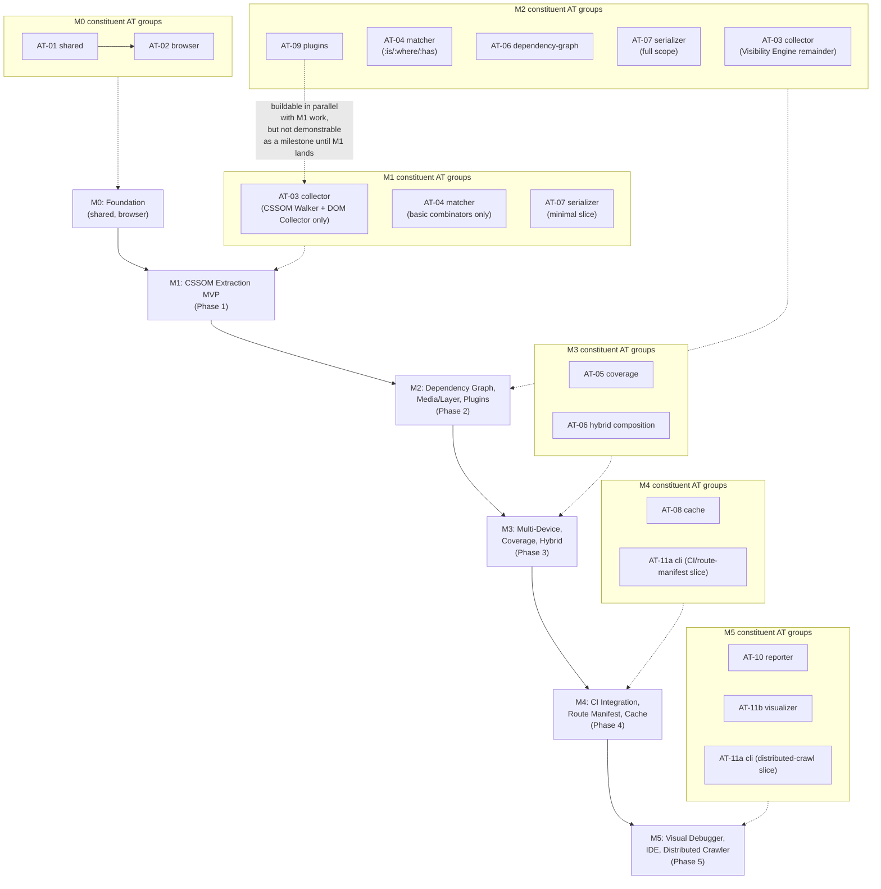
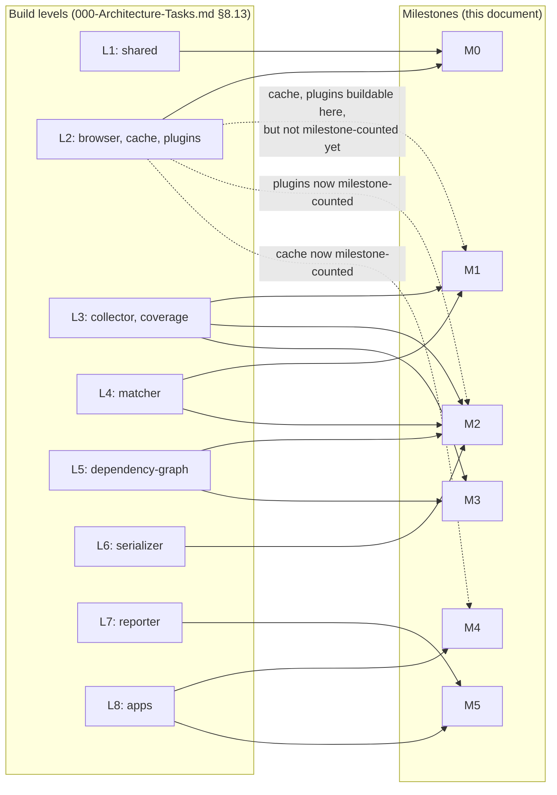

# 002 — Milestones

## 1. Title

**Critical CSS Extraction Engine — Implementation Milestones: Mapping the Five-Phase Engine Roadmap to Exit-Criteria-Gated Delivery Checkpoints**

## 2. Version

| Field | Value |
|---|---|
| Document Version | 1.0.0 |
| Status | Draft — Phase 16 (Implementation Task Catalog) |
| Last Updated | 2026-07-10 |
| Owners | Core Architecture Working Group |
| Stability | Draft; milestone boundaries (M1–M5, M0) are expected to remain stable through implementation since they mirror `BRIEF.md` §2.17's roadmap directly — internal exit-criteria wording may be sharpened as `001-Task-Breakdown.md`'s finer-grained items are written, but milestone *count* and *sequence* should not change without a revision to §2.17 itself |

## 3. Purpose

`BRIEF.md` §2.17 states a five-phase roadmap in nine words per phase — "CSSOM extraction MVP," "Dependency graph, media/layer support, plugin system," and so on. That is a product roadmap, not an engineering plan: it says *what* capability exists at the end of each phase, not *what package-level work must complete*, *in what order*, *with which packages running in parallel*, or *how a reviewer or an autonomous agent knows a milestone is actually finished rather than approximately finished*. This document closes that gap. It takes `000-Architecture-Tasks.md`'s eleven package-level task groups (AT-01 through AT-11) — already sequenced into eight build levels by that document's dependency analysis — and re-groups them into exactly five implementation milestones plus one foundational milestone (M0), each corresponding one-to-one with a phase of `BRIEF.md` §2.17's roadmap. For every milestone, this document states: which AT-NN task groups and which design documents it depends on, a concrete, checkable exit-criteria list (not a restatement of the phase's one-line roadmap description), and where in the milestone sequence it can run in parallel with other work versus where it is strictly blocked on a predecessor.

This document is deliberately downstream of, not a replacement for, `000-Architecture-Tasks.md`'s build-level analysis. That document answers "in what order does each *package* get built"; this document answers "at what point does the *product*, as described by the brief's roadmap, actually reach the next phase" — a related but distinct question, because a milestone can require a task group to be only partially complete (e.g., M1 needs `packages/collector`'s CSSOM Walker sub-module working end-to-end but does not require its Visibility Engine sub-module's sticky/fixed/virtualized-list edge cases to be finished) while other milestones require the same task group's remaining scope. Where the two documents' groupings diverge, this document states the divergence explicitly (Section 8.6) rather than silently reconciling them, since silent reconciliation is exactly the kind of drift `docs/architecture/006-Design-Principles.md`'s determinism-of-process discipline (as applied to documentation itself, per `004-Definition-of-Done.md` §7.2) warns against.

## 4. Audience

- Engineering managers and program leads who need to communicate delivery checkpoints ("we are at M2") to stakeholders in the same vocabulary `BRIEF.md`'s roadmap already uses, without stakeholders needing to understand the eleven-package build-level graph underneath.
- Senior engineers and autonomous coding agents who need to know, at any point in the build, which milestone they are working toward and what specifically must be true to call it done — not a vague sense of "Phase 3 work."
- Reviewers evaluating whether a milestone can be declared complete, who use Section 8's exit criteria as the objective checklist rather than a subjective judgment call.
- Authors of `003-Acceptance-Tests.md`, which maps the brief's acceptance criteria (§2.18) onto specific tests; several of those tests are only exercisable once a particular milestone here has landed (e.g., the multi-device coverage-mode acceptance test requires M3).

## 5. Prerequisites

- [BRIEF.md](../../BRIEF.md) §2.17 (Roadmap) — the five-phase product roadmap this document operationalizes; §2.18 (Acceptance Criteria) — the criteria `003-Acceptance-Tests.md` traces to specific milestones here.
- [000-Architecture-Tasks.md](./000-Architecture-Tasks.md) — the eleven AT-NN task groups and their eight build levels; this document's milestones are built by re-partitioning that leveled graph, not by re-deriving package dependencies from scratch.
- [004-Definition-of-Done.md](./004-Definition-of-Done.md) — the per-task completion gate; a milestone's exit criteria assume every constituent task has already individually passed this gate, and add milestone-level (cross-task) criteria on top.
- [docs/architecture/007-Repository-Structure.md](../architecture/007-Repository-Structure.md) — package boundaries and the build-time dependency graph.
- [docs/STATUS.md](../STATUS.md) — the index of design documents each milestone's exit criteria cite as implementation authority.

## 6. Related Documents

- [000-Architecture-Tasks.md](./000-Architecture-Tasks.md) — the package-level task catalog this document re-groups into milestones.
- [001-Task-Breakdown.md](./001-Task-Breakdown.md) — the finer-grained engineering work items nested beneath each AT-NN task group; a milestone is complete only when every `001`-level item scoped to its constituent task groups is done.
- [003-Acceptance-Tests.md](./003-Acceptance-Tests.md) — the concrete tests proving `BRIEF.md` §2.18's acceptance criteria are met; several of its tests are milestone-gated (Section 12 below cross-references which).
- [004-Definition-of-Done.md](./004-Definition-of-Done.md) — the per-task completion gate every constituent task group's work must pass before a milestone can close.
- [../testing/002-Visual-Tests.md](../testing/002-Visual-Tests.md) — the visual regression suite that becomes exercisable, fixture-by-fixture, as the packages each milestone delivers come online.
- [../testing/003-Golden-Files.md](../testing/003-Golden-Files.md) — the golden-CSS-snapshot suite; M1's serializer-adjacent scope (Section 8.2) is the earliest point this suite has real output to snapshot.
- [BRIEF.md](../../BRIEF.md) §2.17, §2.18.

## 7. Overview

`BRIEF.md` §2.17's five phases, restated with their brief-given one-line descriptions:

1. **Phase 1:** CSSOM extraction MVP
2. **Phase 2:** Dependency graph, media/layer support, plugin system
3. **Phase 3:** Multi-device extraction, coverage mode, hybrid mode
4. **Phase 4:** CI integration, route manifest, incremental cache
5. **Phase 5:** Visual debugger, IDE support, distributed crawler

This document names these **M1 through M5**, and adds **M0 (Foundation)** in front of them — a milestone the brief's roadmap does not name explicitly but that `000-Architecture-Tasks.md`'s build-level analysis makes unavoidable: `packages/shared` and `packages/browser` (AT-01, AT-02) must exist before *any* phase's roadmap item can be implemented, since even the narrowest possible "CSSOM extraction MVP" needs a live page and shared DTOs. Treating M0 as an explicit, separately-exited milestone — rather than silently folding it into M1 — matters because M0's exit criteria (a working browser pool, navigable pages, stable DTOs) are a hard prerequisite gate distinct from M1's own criteria (an actual critical-CSS string emitted from real CSSOM data), and conflating the two would let a team declare "Phase 1 done" once the browser layer works but before extraction logic exists at all — exactly the kind of premature "done" claim `004-Definition-of-Done.md` §7.2 warns against, applied here at the milestone granularity rather than the task-card granularity.

Each milestone below (Section 8) states: the AT-NN task groups it requires (fully or partially — Section 8.6 flags partial requirements explicitly), the concrete exit criteria, and its position in the sequencing diagram (Section 9). The central structural claim this document makes, argued in detail in Section 8.6 and visualized in Section 9, is that **milestone sequencing is stricter than task-group build-level parallelism** — `000-Architecture-Tasks.md` shows that `packages/cache` and `packages/plugins` (AT-08, AT-09) can be *built* concurrently with `packages/browser` (AT-02) at build-level 2, but M2 (which needs `plugins`) cannot be *demonstrated as a working product milestone* until M1's extraction path (which needs `collector`, `matcher`, `serializer` — levels 3, 4, 6) is also functional, because a plugin system with nothing to hook into is not a demonstrable capability. This distinction — build-parallel versus milestone-sequential — is the single most important thing this document adds beyond a mechanical relabeling of `000-Architecture-Tasks.md`'s levels.

## 8. Detailed Design

### 8.1 M0 — Foundation

**Depends on:** AT-01 (`packages/shared`), AT-02 (`packages/browser`).

**Design documents:** [docs/architecture/003-Requirements.md](../architecture/003-Requirements.md), [006-Design-Principles.md](../architecture/006-Design-Principles.md), [100-Browser-Abstraction.md](../design/100-Browser-Abstraction.md) through [106-DOM-Snapshot.md](../design/106-DOM-Snapshot.md), [ADR-0001-Browser-Is-Source-of-Truth](../adr/ADR-0001-Browser-Is-Source-of-Truth.md), [ADR-0003-Playwright-As-Browser-Abstraction](../adr/ADR-0003-Playwright-As-Browser-Abstraction.md).

**Exit criteria:**
- `packages/shared`'s DTO surface (`ExtractionResult`, `Diagnostic`, `ViewportProfile`, `MatchedRule`, `DependencyNode`, `CacheFingerprint`, `PluginHookContext`, `RouteManifestEntry`) is defined, exported, and stable enough that AT-02 through AT-11 compile against it without a breaking change in the same build cycle.
- A `BrowserManager` instance can launch a pooled Playwright browser context, navigate to an arbitrary URL (local fixture or live), and produce a `PageHandle` usable by a downstream package — demonstrated by an integration test that navigates to at least three distinct fixtures from [../testing/001-Fixtures.md](../testing/001-Fixtures.md) without a crash or resource leak across repeated runs.
- The Viewport Manager applies at least one non-default `DeviceProfile` (e.g., mobile) and the Navigation Engine's rendering-stabilization heuristic (per [104-Rendering-Stabilization.md](../design/104-Rendering-Stabilization.md)) reports "stable" on a fixture with async-loaded content, not merely on trivially static fixtures.
- Every constituent task under AT-01/AT-02 individually satisfies [004-Definition-of-Done.md](./004-Definition-of-Done.md) at the "New module implementation" applicability level.

**Why this is a milestone and not folded into M1.** A team can correctly claim "the browser layer works" without a single line of critical-CSS logic existing; conflating that state with "Phase 1 (CSSOM extraction MVP) done" would misrepresent progress to stakeholders reading against `BRIEF.md`'s roadmap. Separating M0 gives a true, checkable "we can drive a browser" checkpoint distinct from "we can extract CSS."

### 8.2 M1 — CSSOM Extraction MVP (BRIEF §2.17 Phase 1)

**Depends on:** M0 (complete); AT-03 (`packages/collector`, CSSOM Walker + DOM Collector sub-modules only — the Visibility Engine's advanced sub-concerns are explicitly deferred, see below); AT-04 (`packages/matcher`); a minimal slice of AT-07 (`packages/serializer` — basic rule ordering and output, not the full compression/source-map/multi-format surface).

**Design documents:** [200-Visibility-Engine-Overview.md](../design/200-Visibility-Engine-Overview.md), [201-Geometry-Engine.md](../design/201-Geometry-Engine.md), [202-Intersection-Engine.md](../design/202-Intersection-Engine.md), [300-CSSOM-Walker.md](../design/300-CSSOM-Walker.md), [301-Stylesheet-Loader.md](../design/301-Stylesheet-Loader.md), [302-Rule-Tree.md](../design/302-Rule-Tree.md), [400-Selector-Matching.md](../design/400-Selector-Matching.md), [401-Selector-Memoization.md](../design/401-Selector-Memoization.md), [600-Serialization-Overview.md](../design/600-Serialization-Overview.md), [601-Rule-Ordering.md](../design/601-Rule-Ordering.md), [ADR-0002-No-Custom-Selector-Parser](../adr/ADR-0002-No-Custom-Selector-Parser.md).

**Exit criteria:**
- Given a single URL and a single default viewport, the pipeline produces a syntactically valid CSS string containing only rules whose selectors match at least one above-the-fold DOM node, verified against at least the Tailwind, Bootstrap, and CSS-Modules fixtures from [../testing/001-Fixtures.md](../testing/001-Fixtures.md).
- The Visibility Engine correctly classifies "above fold" using geometry and viewport intersection only (§201, §202) — sticky/fixed/transform/virtualized-list edge cases (§203–§207) are explicitly **not** required for M1 exit and are deferred to M2's hardening scope (Section 8.6 explains why this split is safe).
- The Selector Matcher uses `element.matches()` exclusively (Design Principle 2 — no custom selector parser), memoizes repeated selector evaluations, and correctly handles basic combinators and attribute selectors; `:is()`/`:where()`/`:has()` and container queries are **not** required for M1 (deferred to M2/M3 per their design docs' own scope).
- The Serializer emits rules in a stable, documented order (per [601-Rule-Ordering.md](../design/601-Rule-Ordering.md)) and the same input produces byte-identical output across repeated runs — the first point at which [../testing/003-Golden-Files.md](../testing/003-Golden-Files.md)'s golden-file suite has real output to snapshot; at least one golden file exists and passes for each M1 fixture.
- [../testing/002-Visual-Tests.md](../testing/002-Visual-Tests.md)'s visual regression suite passes for the M1 fixture subset at the default viewport: injecting only the extracted critical CSS renders the above-the-fold region with no visible regression versus the full-CSS baseline.
- No CSS variables, `@keyframes`, `@font-face`, or `@layer` dependency resolution is required to pass M1 — a rule referencing an unresolved custom property may be included verbatim (over-inclusive is acceptable at MVP; under-inclusive, i.e., dropping a rule the page needs, is not, per Design Principle 3, Correctness Over Premature Optimization).

**Why M1 requires only a slice of `packages/serializer` (AT-07) despite AT-07 nominally depending on AT-06.** `000-Architecture-Tasks.md` AT-07's *architecturally complete* scope depends on AT-06 (`dependency-graph`) because full serialization needs the resolved dependency set. M1 does not need full serialization — it needs enough of the Serializer's rule-ordering and dedup logic to emit a deterministic string from an *unresolved* rule set. This is the one place this document's milestone grouping deliberately diverges from `000-Architecture-Tasks.md`'s task-group boundary (see Section 8.6), implemented as an early, intentionally narrow slice of AT-07 that is later widened to its full scope for M2.

### 8.3 M2 — Dependency Graph, Media/Layer Support, Plugin System (BRIEF §2.17 Phase 2)

**Depends on:** M1 (complete); AT-03 (`packages/collector`, remaining Visibility Engine sub-concerns: §203 Overflow, §204 Transform, §205 Sticky, §206 Fixed, §207 Virtualized Lists — completing AT-03's full scope); AT-04 extended to `:is()`/`:where()`/`:has()` (§404); AT-06 (`packages/dependency-graph`, full scope); AT-07 widened to its full scope (media/`@supports`/layer-aware serialization); AT-09 (`packages/plugins`).

**Design documents:** [203-Overflow-Handling.md](../design/203-Overflow-Handling.md) through [207-Virtualized-Lists.md](../design/207-Virtualized-Lists.md), [303-Media-Rules.md](../design/303-Media-Rules.md), [304-Supports-Rules.md](../design/304-Supports-Rules.md), [305-Cascade-Layers.md](../design/305-Cascade-Layers.md), [306-At-Import.md](../design/306-At-Import.md), [307-Constructable-Stylesheets.md](../design/307-Constructable-Stylesheets.md), [404-Is-Where-Has.md](../design/404-Is-Where-Has.md), [500-Dependency-Resolution-Overview.md](../design/500-Dependency-Resolution-Overview.md), [501-CSS-Variables.md](../algorithms/501-CSS-Variables.md) through [508-Cycle-Detection.md](../algorithms/508-Cycle-Detection.md), [000-Plugin-SDK-Overview.md](../plugins/000-Plugin-SDK-Overview.md) through [004-Sandboxing.md](../plugins/004-Sandboxing.md), [ADR-0004-Plugin-Lifecycle-Model](../adr/ADR-0004-Plugin-Lifecycle-Model.md).

**Exit criteria:**
- The Dependency Resolver correctly follows a CSS custom property's definition (including through `@layer`-scoped redefinition) to its origin and includes it in output; a fixture with at least three levels of variable indirection (per [501-CSS-Variables.md](../algorithms/501-CSS-Variables.md)'s test corpus) resolves correctly with no dropped or duplicated declaration.
- `@keyframes` referenced by an included rule's `animation` property, and `@font-face` referenced by an included rule's `font-family`, are both included in output even when the animation/font-face rule itself would not otherwise match any above-fold selector — the core "dependency graph" capability the brief names.
- Cycle detection (§508) terminates on a fixture engineered to contain a circular custom-property reference, producing a diagnosed cycle error rather than an infinite loop or a stack overflow.
- Media queries, `@supports`, and cascade layers are preserved and correctly reordered in serialized output per their cascade semantics (§303–§305), verified by a golden-file fixture combining all three.
- The Visibility Engine correctly classifies sticky, fixed, transformed, and virtualized-list content per §203–§207, closing the gap M1 deliberately left open.
- `:is()`, `:where()`, and `:has()` selectors match correctly against the collected node set (§404).
- At least one working example plugin (per [003-Plugin-Examples.md](../plugins/003-Plugin-Examples.md)) executes at each of the six lifecycle hooks (`beforeLaunch` through `afterSerialize`) without crashing the host pipeline, and a plugin that throws is caught and reported as a diagnostic rather than crashing the extraction (sandboxing, §004).
- All M1 exit-criteria tests (golden files, visual regression) continue to pass for the original M1 fixture set — M2 must not regress M1's already-demonstrated correctness.

### 8.4 M3 — Multi-Device Extraction, Coverage Mode, Hybrid Mode (BRIEF §2.17 Phase 3)

**Depends on:** M2 (complete); AT-05 (`packages/coverage`); the Hybrid strategy composition within AT-06 (per [701-Hybrid-Mode.md](../design/701-Hybrid-Mode.md), already scoped to `dependency-graph` per `000-Architecture-Tasks.md` §8.7/§11); [702-Computed-Style-Mode.md](../design/702-Computed-Style-Mode.md); multi-viewport merge logic within AT-07/AT-06 boundary (per [016-Data-Flow.md](../architecture/016-Data-Flow.md) §9.3's `MergedMultiViewportRuleSet`).

**Design documents:** [700-Coverage-Mode.md](../design/700-Coverage-Mode.md), [701-Hybrid-Mode.md](../design/701-Hybrid-Mode.md), [702-Computed-Style-Mode.md](../design/702-Computed-Style-Mode.md), [ADR-0005-Hybrid-Extraction-Mode](../adr/ADR-0005-Hybrid-Extraction-Mode.md), [105-Viewport-Manager.md](../design/105-Viewport-Manager.md).

**Exit criteria:**
- The engine independently produces critical CSS for Mobile, Tablet, and Desktop device profiles from a single crawl, with each profile's output separately golden-file-tested and visual-regression-tested per [../testing/002-Visual-Tests.md](../testing/002-Visual-Tests.md)'s fixture × viewport matrix — the first milestone at which that matrix's viewport axis is genuinely exercised beyond a single default profile.
- Multi-viewport merge (identical-rule dedup and media-query normalization across profiles, per `BRIEF.md` §2.6) produces a single merged stylesheet when configured to do so, with no duplicate rule bodies across profile-specific media blocks.
- Coverage Mode records actually-painted rules via the Chrome DevTools Protocol Coverage domain for at least one fixture, independent of and with no shared code path with `packages/matcher` (the non-dependency invariant `000-Architecture-Tasks.md` AT-05 establishes) — verified by an architecture-conformance check that `packages/coverage` imports nothing from `packages/matcher`.
- Hybrid Mode's composition of matcher output and coverage output produces a result that is a superset of matcher-only output and a superset of coverage-only output for at least one fixture engineered so each strategy alone misses a rule the other catches (e.g., a rule matched by a dynamically-added class the DOM Collector's static snapshot misses, but which coverage catches because the class was actually painted).
- `getComputedStyle` verification (§702) catches at least one engineered case where a matched selector's rule is overridden by a later, higher-specificity rule such that the matched selector does not actually determine the rendered style — demonstrating the verification step is not a no-op.

### 8.5 M4 — CI Integration, Route Manifest, Incremental Cache (BRIEF §2.17 Phase 4)

**Depends on:** M3 (complete); AT-08 (`packages/cache`); AT-11a (`apps/cli`, CI-orchestration and route-manifest-expansion scope specifically, not the full app).

**Design documents:** [800-Cache-Overview.md](../design/800-Cache-Overview.md) through [806-Distributed-Cache.md](../design/806-Distributed-Cache.md), [703-Visual-Diff.md](../design/703-Visual-Diff.md), [704-Incremental-Extraction.md](../design/704-Incremental-Extraction.md), [900-SSR-Overview.md](../design/900-SSR-Overview.md) through [906-Fastify.md](../design/906-Fastify.md) (SSR adapters, insofar as CI validates them), `BRIEF.md` §2.9 (Route Manifest), §2.11 (CI/CD Pipeline).

**Exit criteria:**
- A route manifest (`{ "/": "home.css", "/products": "products.css", "/blog/*": "blog.css" }`-shaped, per `BRIEF.md` §2.9) expands wildcard route patterns to a concrete crawl list and produces one output artifact per resolved route.
- Fingerprinting (HTML, CSS assets, viewport, extraction mode, per [801-Fingerprinting.md](../design/801-Fingerprinting.md)) correctly reuses a prior extraction's cached output when a route's fingerprint is unchanged, and correctly invalidates and re-extracts when any fingerprinted input changes — both directions verified by a fixture pair that differs only in one fingerprinted dimension at a time.
- The CI pipeline sequence from `BRIEF.md` §2.11 (`Build → Crawl routes → Generate critical CSS → Compare against baseline → Publish artifacts → Upload reports`) runs end-to-end against a multi-route fixture project and fails the build under each of the three brief-named conditions: CSS growth beyond a configured threshold, a missing dependency detected (per M2's dependency resolver), and an extraction error — each condition independently triggerable and independently verified to produce a non-zero exit code with a diagnostic report.
- [../testing/002-Visual-Tests.md](../testing/002-Visual-Tests.md)'s "compare against baseline" step (dual-render visual diff, [703-Visual-Diff.md](../design/703-Visual-Diff.md)) is wired as a required CI gate, not merely available as a library call.
- Cache hit/miss behavior is observable in CI output (a report distinguishing "reused from cache" routes from "freshly extracted" routes), since an invisible cache is not verifiably "incremental" to a reviewer.

### 8.6 M5 — Visual Debugger, IDE Support, Distributed Crawler (BRIEF §2.17 Phase 5)

**Depends on:** M4 (complete); AT-10 (`packages/reporter`); AT-11b (`apps/visualizer`); distributed-crawler extension to AT-11a's route-manifest expansion (multi-worker crawl orchestration, not a separate package per `007-Repository-Structure.md`'s layout — see Edge Cases).

**Design documents:** [1000-Diagnostics-Overview.md](../design/1000-Diagnostics-Overview.md) through [1005-Debug-UI.md](../design/1005-Debug-UI.md), `BRIEF.md` §2.12 (Diagnostics).

**Exit criteria:**
- The Reporter produces a dependency-graph visualization payload, a matched/unmatched selector report, a stylesheet contribution report, a timing report, and an extraction trace for a representative fixture (`BRIEF.md` §2.12's full diagnostics list, all six items present, not a subset).
- `apps/visualizer` renders the Reporter's payload as an interactive debugging view, including the optional HTML visualization highlighting above-fold nodes and matched rules (`BRIEF.md` §2.12's closing bullet).
- An IDE-support artifact (e.g., a language-server-adjacent hover/inline diagnostic surface, or, at minimum, a machine-readable diagnostics schema an editor extension can consume) exists and is documented, even if a full first-party IDE extension is deferred to post-M5 work (Section 16).
- A distributed crawl (route manifest expansion across more than one worker/machine) completes for a route set too large for a single-process crawl to complete within M4's CI time budget, with results aggregated identically to a single-process crawl of the same routes (a determinism check: distributed and single-process crawls of the same route set produce byte-identical golden output per [../testing/003-Golden-Files.md](../testing/003-Golden-Files.md)).

## 9. Architecture



The dashed edge at the bottom is the diagram's most important annotation: it visually encodes the claim from Section 7 that `packages/plugins` (AT-09) can be *built* concurrently with M1's constituent task groups — per `000-Architecture-Tasks.md` §8.13, AT-09 is level-2, parallel-eligible from AT-01 — but is grouped into **M2**, not M1, because a plugin system has nothing to demonstrably hook into until M1's extraction pipeline exists end-to-end. This is the single case in this document where "may be built early" and "counts toward an earlier milestone" diverge, and it is called out explicitly rather than left for a reader to infer from the AT-numbering alone.

### 9.1 Milestone-Level Sequencing vs. Build-Level Parallelism



## 10. Algorithms

### 10.1 Algorithm: Deriving Milestones from Build Levels

**Problem statement.** Given `000-Architecture-Tasks.md`'s eleven task groups partitioned into eight build levels, and `BRIEF.md` §2.17's five named roadmap phases, produce a milestone partition `{M0, M1, ..., M5}` such that (a) every task group is assigned to exactly one milestone (its *first* milestone where its output becomes product-demonstrable, not merely buildable), (b) the milestone order is a valid topological refinement of the build-level order, and (c) each Mi's exit criteria are independently checkable without reference to a later milestone's work.

**Inputs.** The build-level partition `L = {L1, ..., L8}` from `000-Architecture-Tasks.md` §8.13; the roadmap phase list `P = {P1, ..., P5}` from `BRIEF.md` §2.17; a hand-curated "product-demonstrability" mapping `demo: TaskGroup -> Milestone` that may assign a task group to a later milestone than its build level alone would suggest (the AT-09/plugins case, Section 9).

**Outputs.** A milestone list `M = {M0, M1, ..., M5}`, each `Mi = (taskGroups_i, designDocs_i, exitCriteria_i)`.

**Pseudocode.**
```
function deriveMilestones(L: BuildLevel[], P: RoadmapPhase[], demo: Map<TaskGroup, Milestone>): Milestone[]
    milestones = [M0, M1, M2, M3, M4, M5]  // fixed, one-to-one with P plus foundational M0
    for level in L:
        for taskGroup in level:
            assignedMilestone = demo.get(taskGroup)   // hand-curated override (e.g., AT-09 -> M2)
                                 ?? defaultMilestoneForLevel(level)  // otherwise, first level's natural milestone
            milestones[assignedMilestone].taskGroups.push(taskGroup)
    for m in milestones:
        m.exitCriteria = deriveExitCriteria(m.taskGroups, m.designDocs)  // Section 8's hand-authored criteria
    validateTopologicalRefinement(milestones, L)   // Section 10.2
    return milestones

function validateTopologicalRefinement(milestones, L):
    // every task group's milestone index must be >= the milestone index of
    // every task group it depends on, per 000-Architecture-Tasks.md's dependsOn edges
    for m in milestones:
        for taskGroup in m.taskGroups:
            for dep in taskGroup.dependsOn:
                assert milestoneIndexOf(dep) <= milestoneIndexOf(taskGroup)
```

**Time complexity.** `O(V + E)` where `V` is the eleven task groups and `E` their dependency edges (identical asymptotic class to `000-Architecture-Tasks.md`'s own algorithms, since this is a re-partitioning of the same graph, not a new one), plus `O(1)` lookups into the hand-curated `demo` override map (bounded by the small, fixed number of divergences this document documents explicitly — currently one: AT-09).

**Memory complexity.** `O(V + E)` to hold the graph and the milestone partition simultaneously; negligible at this corpus size (eleven task groups, six milestones).

**Failure cases.** A hand-curated `demo` override that violates the topological refinement invariant (e.g., assigning a task group to an earlier milestone than a task group it depends on) must be rejected by `validateTopologicalRefinement` — this is the milestone-level analogue of `000-Architecture-Tasks.md` §10.2's ordering-validation algorithm, and the two validators should, in practice, be run together whenever either document changes, since a milestone reassignment that breaks build-level ordering is a documentation defect in this document, not a signal that the build-level graph itself needs to change.

**Optimization opportunities.** None needed at this scale (eleven task groups, six milestones); if the roadmap grows beyond five phases in a future brief revision, the same derivation procedure applies without modification, only with a longer `P` and correspondingly more milestones.

### 10.2 Algorithm: Milestone Exit-Criteria Evaluation

**Problem statement.** Given a milestone `Mi` and the current state of the repository (task completions, test results), determine whether `Mi` can be declared complete.

**Inputs.** `Mi.taskGroups` (each individually gated by `004-Definition-of-Done.md`), `Mi.exitCriteria` (Section 8's per-milestone list), the current test-suite results from [../testing/002-Visual-Tests.md](../testing/002-Visual-Tests.md) and [../testing/003-Golden-Files.md](../testing/003-Golden-Files.md) for the milestone's fixture subset.

**Outputs.** `{ milestoneComplete: boolean, unmetCriteria: Criterion[] }`.

**Pseudocode.**
```
function evaluateMilestone(Mi, repoState) -> MilestoneResult:
    unmet = []
    for taskGroup in Mi.taskGroups:
        if not repoState.dodSatisfied(taskGroup):     // 004-Definition-of-Done.md, per constituent task
            unmet.append(TaskGroupNotDone(taskGroup))

    for criterion in Mi.exitCriteria:
        if not repoState.satisfies(criterion):         // e.g., "golden file X passes",
            unmet.append(criterion)                    // "visual regression suite passes for fixture set Y"

    // regression check: prior milestones' exit criteria must still hold
    for priorMilestone in milestonesBefore(Mi):
        for criterion in priorMilestone.exitCriteria:
            if not repoState.satisfies(criterion):
                unmet.append(RegressionInPriorMilestone(priorMilestone, criterion))

    return { milestoneComplete: unmet.isEmpty(), unmetCriteria: unmet }
```

**Time complexity.** `O(C)` where `C` is the total count of exit criteria across the milestone being evaluated and all prior milestones (the regression-check loop), each a `O(1)` lookup against precomputed CI/test results — mirroring `004-Definition-of-Done.md` §10.4's observation that gate evaluation itself is cheap relative to the underlying CI suites it reads from.

**Memory complexity.** `O(C)` for the `unmetCriteria` list in the worst case (every criterion across every milestone up to and including `Mi` unmet simultaneously — a pathological but boundable case).

**Failure cases.** The regression-check loop is the algorithm's most important failure-avoidance feature: without it, a team could declare M3 complete while an M1 golden-file test has silently started failing (e.g., a dependency-graph change in M2 subtly altered M1-fixture output in a way nobody re-checked) — this is exactly the "boiling frog" drift `004-Definition-of-Done.md` §13 names in a different context, recurring here at the milestone level and caught the same way: by mechanically re-checking, not by trusting that "M1 passed once" remains true forever.

**Optimization opportunities.** Cache each prior milestone's last-known-good evaluation result and only re-run its regression check when a change touches a package that milestone's exit criteria depend on (derivable from `Mi.taskGroups`' package set) — an application of the same fingerprint-based skip logic [../testing/002-Visual-Tests.md](../testing/002-Visual-Tests.md) §10.1 and [../testing/003-Golden-Files.md](../testing/003-Golden-Files.md) §10.1 already apply at the individual-test level, lifted to the milestone-regression-check level.

## 11. Implementation Notes

- Milestone boundaries are a planning and communication device, not a branching or release strategy — teams are not required to branch per milestone or ship a release at every Mi; a single `main`-line trunk that happens to satisfy M1's exit criteria at commit X and M2's at commit Y is the expected common case, with `docs/STATUS.md` recording which commit range corresponds to which milestone's completion for audit purposes.
- Because M1 deliberately takes only a slice of AT-07 (Section 8.2), the team implementing AT-07 should track "M1 slice" and "M2 full scope" as two explicitly separate work items within `001-Task-Breakdown.md`'s decomposition of AT-07, not as a single undifferentiated task — otherwise a contributor picking up "the serializer task" has no way to know which scope M1 actually needs first.
- The AT-09 (`plugins`)/M2 divergence (Section 9) is this document's only deliberate case of "buildable earlier than milestone-counted." Any future divergence discovered during implementation (e.g., a team finding `packages/cache` similarly buildable early but not demonstrable until M4, which is already how this document treats it) should be recorded explicitly in Section 8's relevant subsection, following the same pattern, rather than left implicit.
- M0's absence from `BRIEF.md` §2.17's roadmap text is intentional on the brief's part (the brief describes product phases, not infrastructure), and this document's introduction of M0 should not be read as amending the brief — M0 is purely an implementation-planning construct nested "before" Phase 1, not a sixth product phase.
- Each milestone's exit criteria in Section 8 are written to be checkable by an autonomous coding agent without human interpretation wherever possible (specific fixture names, specific design-document section references, specific pass/fail test outcomes) — the same mechanical-checkability discipline `004-Definition-of-Done.md` §11.4 applies to its own gates.

## 12. Edge Cases

- **A milestone's exit criteria are met, but a later milestone's work reveals the earlier milestone's design docs were incomplete.** For example, M3's Hybrid Mode work might reveal an edge case in M1's Selector Matcher that only manifests under coverage-mode composition. The correct response is a new task card against the affected AT-NN group, gated by `004-Definition-of-Done.md` as any other change, and a regression check (Section 10.2) re-run against the *earlier* milestone's exit criteria before the *later* milestone can itself be declared complete — a milestone is never "grandfathered" past a defect discovered downstream.
- **Team wants to start M3 (coverage mode) work before M2 (dependency graph) fully lands, because `packages/coverage` (AT-05) is build-level 3, parallel-eligible with M1/M2's collector work.** This is legitimate *build* parallelism (per `000-Architecture-Tasks.md` §8.13, coverage depends only on `browser`/`shared`) but M3 cannot be *milestone-declared complete* until M2's dependency-graph and plugin exit criteria also hold, per Section 10.2's cross-milestone regression check — teams may stage work across milestones but may not claim milestone completion out of order.
- **A milestone's fixture-based exit criteria (golden files, visual regression) pass on a contributor's machine but not in CI, or vice versa.** Per [../testing/002-Visual-Tests.md](../testing/002-Visual-Tests.md) §8.5's cross-runner pinning discussion, only the CI-run result counts toward milestone exit; a local pass is informative but not authoritative.
- **`BRIEF.md` §2.17 is revised in a future planning cycle (e.g., a sixth phase is added, or phases are reordered).** This document's milestone list must be revised in lockstep — Section 10.1's derivation algorithm is designed to be mechanically re-run against a changed `P`, but the hand-curated `demo` override map (the AT-09/plugins-style divergences) must be manually re-reviewed, since a changed roadmap phase boundary could shift which task groups are "product-demonstrable" at which point.

## 13. Tradeoffs

| Decision | Alternative Considered | Why Rejected | Cost Accepted |
|---|---|---|---|
| Introduce an explicit M0 (Foundation) not named in `BRIEF.md` §2.17 | Fold `shared`/`browser` work silently into M1 | Would let "Phase 1 done" be claimed on browser-layer completion alone, before any extraction logic exists, misrepresenting progress against the brief's own roadmap vocabulary | One extra milestone to track and communicate that has no direct name in the product roadmap, requiring this document to explain the discrepancy (Section 7) |
| Milestone-grouping `packages/plugins` (AT-09) into M2 despite it being build-level-2, parallel-eligible with M0/M1 work | Milestone-group it into M0 or M1, matching its earliest buildable point | A plugin system with nothing to hook into is not a demonstrable capability; grouping it early would let "Phase 2 (...plugin system) done" be silently pre-satisfied by work that happened during M1, muddying the exit-criteria audit trail | Contributors implementing AT-09 early (which is efficient from a staffing perspective) must remember their work is milestone-counted later, requiring the explicit callout in Section 9 |
| M1 takes only a slice of `packages/serializer` (AT-07) rather than waiting for AT-07's full, `000-Architecture-Tasks.md`-defined scope | Delay M1 until AT-06 (dependency-graph) and full AT-07 are both complete, matching AT-07's stated `dependsOn` | Would push the very first demonstrable "critical CSS extraction MVP" milestone behind dependency-graph and full-serializer work that has nothing to do with proving the MVP's core CSSOM-matching capability, delaying the roadmap's most basic proof point for no correctness benefit | Requires this document to define and track a "minimal slice" scope for AT-07 that `000-Architecture-Tasks.md` itself does not define, adding one layer of scope nuance not present in the pure package-dependency graph |
| Milestones as a planning/communication layer only, not a branching/release strategy | Require a release or protected branch per milestone | Would impose release-engineering overhead unrelated to this document's actual purpose (communicating progress against the roadmap), and would conflict with teams that prefer continuous trunk-based delivery | Milestone completion is recorded in `docs/STATUS.md` rather than enforced by branch protection, relying on the same audit discipline `004-Definition-of-Done.md`'s periodic review already establishes |

## 14. Performance

- **Critical-path length.** Because M0 through M5 are strictly sequential (Section 9's top-level chain), the total wall-clock critical path to M5 is the sum of each milestone's own critical path, not the sum of all eleven task groups' individual durations — `000-Architecture-Tasks.md` §8.13's build-level parallelism (e.g., `cache`/`plugins` alongside `browser` at level 2) shortens each *milestone's* internal critical path but does not shorten the *milestone-to-milestone* chain itself, since M2 cannot begin its exit-criteria evaluation until M1 is done by construction (Section 10.2's regression check enforces this even if some M2-scoped code was written early).
- **Where within-milestone parallelism has the most leverage.** M2 is the milestone with the largest constituent task-group count (AT-03 remainder, AT-04 extension, AT-06, AT-07 full scope, AT-09) and therefore the largest opportunity for parallel staffing within a single milestone; M0 and M4 are comparatively narrow (two and two constituent groups respectively) and gain less from additional parallel staffing beyond what their own internal dependency (e.g., AT-01 before AT-02 within M0) already requires.
- **Fixture-cost scaling per milestone.** M1's exit criteria run against three fixtures at one viewport; M3's run against the full fixture set at (at minimum) three viewports — the visual-regression and golden-file suite cost (per [../testing/002-Visual-Tests.md](../testing/002-Visual-Tests.md) §14 and [../testing/003-Golden-Files.md](../testing/003-Golden-Files.md) §14) grows materially from milestone to milestone, and CI budget planning should account for this growth rather than assuming a flat per-milestone test cost.
- **Caching leverage across milestones.** Once M4's incremental cache (AT-08) exists, subsequent milestone work (M5) benefits from cache-accelerated iteration even though M5 does not itself modify the cache layer — an example of an earlier milestone's infrastructure investment paying a compounding dividend on later milestones' inner-loop velocity, distinct from the milestone's own exit-criteria scope.
- **Profiling guidance.** If milestone velocity stalls, first check whether the stall is *within* a milestone's constituent task groups (a staffing/technical problem inside, e.g., M2's dependency-graph work) or *at* a milestone boundary (Section 10.2's regression check repeatedly failing against an earlier milestone, indicating undetected drift) — the two have different remedies, and `000-Architecture-Tasks.md` §14's build-level staffing analysis is the right tool for the former, this document's Section 10.2 evaluation log the right tool for the latter.

## 15. Testing

- **Unit tests.** `evaluateMilestone()` (Section 10.2) tested against mocked `repoState`: all criteria met → `milestoneComplete: true`; one constituent task group's DoD unsatisfied → correctly listed in `unmetCriteria`; a prior milestone's criterion regressed → correctly flagged as `RegressionInPriorMilestone`, distinguishing it in the report from a current-milestone-native failure.
- **Integration tests.** A staged fixture sequence exercising the full M0→M1→M2 transition on a small, controlled fixture set (mirroring [../testing/002-Visual-Tests.md](../testing/002-Visual-Tests.md) §15's integration-test pattern): confirm M1's exit criteria are checkable and pass before any M2-scoped code exists, confirm M2's exit criteria additionally require M2-scoped work (i.e., M1's criteria alone are insufficient to satisfy M2), and confirm the Section 10.2 regression check correctly fails if a synthetic M2-era change is engineered to break an M1 golden file.
- **Visual tests.** Each milestone's exit criteria that reference [../testing/002-Visual-Tests.md](../testing/002-Visual-Tests.md) are, by construction, that suite's own test cases for the milestone's fixture subset — this document does not duplicate that suite's internal testing (covered in `002-Visual-Tests.md` §15) but relies on it as the authoritative pass/fail source for the relevant exit criteria.
- **Golden-file tests.** Symmetric reliance on [../testing/003-Golden-Files.md](../testing/003-Golden-Files.md) for the deterministic-output exit criteria first introduced at M1 and required at every subsequent milestone via the regression check.
- **Regression tests.** The milestone-level regression check (Section 10.2) is itself the primary regression-testing mechanism this document introduces beyond what `../testing/005-Regression-Tests.md` already covers at the individual-test level; the two are complementary layers (individual pinned test behavior vs. milestone-wide "did an earlier milestone's demonstrated capability silently break").
- **Benchmark tests.** Track wall-clock time to reach each milestone (from repository inception or from the prior milestone) as a planning metric, distinct from any per-package benchmark in `../performance/`; a milestone taking materially longer than planned is a scheduling signal this document's Section 14 profiling guidance addresses.

## 16. Future Work

- **Machine-readable milestone manifest.** Mirroring `000-Architecture-Tasks.md` §16's proposal for its own dependency declarations, this document's milestone-to-task-group mapping and exit-criteria list could be expressed as a structured (YAML/JSON) manifest that `docs/STATUS.md` tooling consumes directly to render live milestone-completion percentages, rather than requiring manual updates to this prose document and to `STATUS.md` in parallel.
- **Automated regression-check dashboard.** Section 10.2's cross-milestone regression check is currently something a reviewer or CI job runs on demand; a continuously-updated dashboard showing, for every already-completed milestone, whether its exit criteria still hold against the current `main` would surface drift immediately rather than at the next milestone's evaluation point.
- **Revisit the AT-09/plugins milestone-grouping decision once real implementation experience exists.** If, in practice, teams find that building the plugin system fully in parallel with M1 (rather than waiting to milestone-count it at M2) causes no confusion and meaningfully accelerates M2, consider relaxing the "product-demonstrable" grouping rule in favor of a purely build-level grouping — deferred pending that evidence, per the same reasoning `000-Architecture-Tasks.md` §16 applies to its own AT-08/AT-09 narrative-ordering question.
- **Six-phase roadmap contingency.** If `BRIEF.md` §2.17 is ever revised to add a sixth phase (e.g., a distinct "enterprise multi-tenant" phase), this document's Section 10.1 derivation algorithm supports the extension mechanically, but the hand-curated `demo` override map and Section 8's per-milestone exit-criteria prose require a fresh editorial pass, not a mechanical one — flagged here so the effort is planned for, not assumed away.
- **Milestone-scoped canary/beta rollout policy.** Once `apps/cli` (M4/M5) is consumer-facing, consider whether each milestone should correspond to a specific pre-release version tag (e.g., `v0.1.0-m1`) to give external early adopters a stable reference point — currently out of scope since this document treats milestones as internal planning constructs only (Section 11), but worth revisiting once external users exist.

## 17. References

- [BRIEF.md](../../BRIEF.md) §2.6 (Multi-Viewport Strategy), §2.7 (Hybrid Extraction Mode), §2.8 (Incremental Cache), §2.9 (Route Manifest), §2.11 (CI/CD Pipeline), §2.12 (Diagnostics), §2.17 (Roadmap), §2.18 (Acceptance Criteria)
- [000-Architecture-Tasks.md](./000-Architecture-Tasks.md)
- [001-Task-Breakdown.md](./001-Task-Breakdown.md)
- [003-Acceptance-Tests.md](./003-Acceptance-Tests.md)
- [004-Definition-of-Done.md](./004-Definition-of-Done.md)
- [../testing/002-Visual-Tests.md](../testing/002-Visual-Tests.md)
- [../testing/003-Golden-Files.md](../testing/003-Golden-Files.md)
- [docs/architecture/007-Repository-Structure.md](../architecture/007-Repository-Structure.md)
- [docs/architecture/016-Data-Flow.md](../architecture/016-Data-Flow.md)
- [docs/STATUS.md](../STATUS.md)
- All design/algorithm/plugin/ADR documents cited by file name in Section 8
