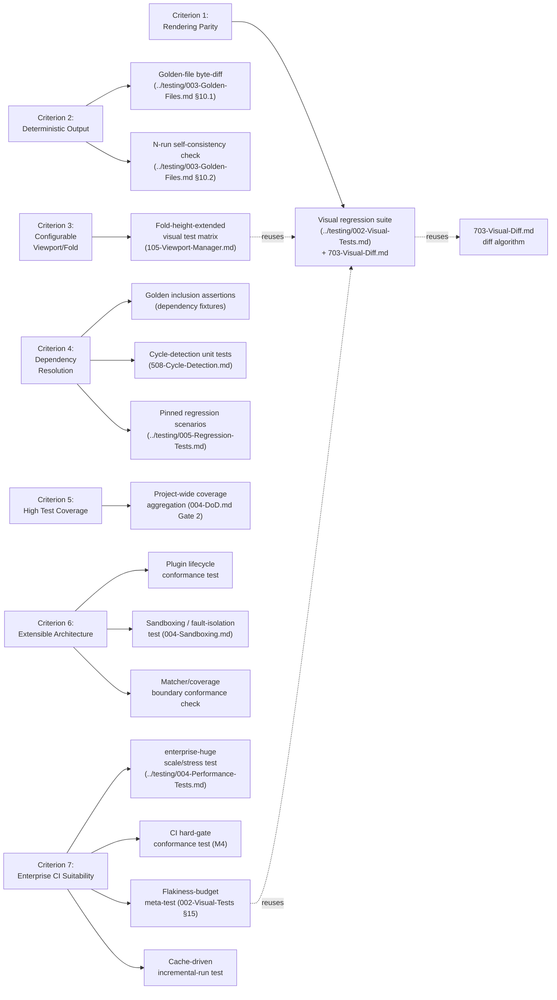
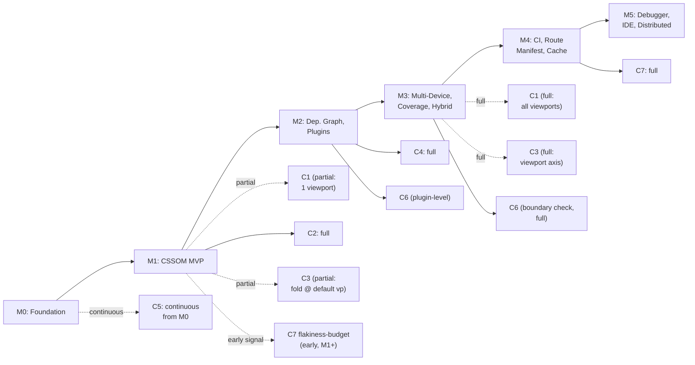

# 003 — Acceptance Tests

## 1. Title

**Critical CSS Extraction Engine — Acceptance Test Catalog: Translating BRIEF §2.18's Seven Acceptance Criteria into Checkable, Automated Proof**

## 2. Version

| Field | Value |
|---|---|
| Document Version | 1.0.0 |
| Status | Draft — Phase 16 (Implementation Task Catalog) |
| Last Updated | 2026-07-10 |
| Owners | Testing Guild / Core Architecture Working Group |
| Stability | Draft; the seven-criterion structure is expected to be stable (it mirrors `BRIEF.md` §2.18 verbatim), but individual test thresholds (visual-diff tolerance, coverage percentage, benchmark regression budget) may be tuned as real measurement data accumulates without invalidating this document's structure |

## 3. Purpose

`BRIEF.md` §2.18 lists seven acceptance criteria in seven short bullet points: rendering parity, deterministic output, configurable viewport/fold, robust dependency resolution, high test coverage, extensible architecture, suitable for enterprise CI pipelines. Each bullet is a claim, not a test. A claim with no attached test is unfalsifiable — a reviewer, a stakeholder, or an autonomous agent has no mechanical way to know whether "rendering parity" holds for this build versus the last one, short of eyeballing a page. This document exists to close that gap, one criterion at a time: for each of the seven, it defines a **specific, automated, already-existing-or-planned test or measurement** that, if it passes, constitutes proof the criterion is met for the current state of the codebase, and it names exactly which document, suite, and fixture set that test lives in so a reader never has to guess where "the test" actually is.

This document is the **content** half of the process/content split `004-Definition-of-Done.md` §7.1 establishes: that document defines the universal per-task completion gate (tests exist, are reviewed, CI is green); this document defines, once, project-wide, what it *means* for the system to actually satisfy each of the seven brief-level promises, independent of which task happened to implement the relevant capability. A task can pass every Definition-of-Done gate and still leave a criterion unproven if no test in this catalog exercises the capability it added — that gap is `docs/STATUS.md`'s job to surface as a traceability defect, not a reason to weaken either document's scope.

## 4. Audience

- Testing Guild engineers implementing or extending the concrete test suites this document names ([../testing/002-Visual-Tests.md](../testing/002-Visual-Tests.md), [../testing/003-Golden-Files.md](../testing/003-Golden-Files.md), [../testing/004-Performance-Tests.md](../testing/004-Performance-Tests.md), and others), who need the exact mapping from a brief-level promise to a suite, fixture, and threshold.
- Milestone owners evaluating whether [002-Milestones.md](./002-Milestones.md)'s milestone exit criteria collectively add up to full acceptance-criteria coverage, and who use this document's Section 12 traceability table to check for gaps.
- Reviewers of a PR that claims to "improve rendering parity" or "improve determinism," who need an objective test result to cite rather than a subjective before/after comparison.
- Autonomous coding agents implementing a task card who need to know, before writing code, which specific acceptance test their change must not regress and, where applicable, which new test their change should extend.
- Engineering managers producing a project-level "are we acceptance-criteria-complete" status report for `docs/STATUS.md`, who need one row per criterion with an unambiguous pass/fail/partial state.

## 5. Prerequisites

- [BRIEF.md](../../BRIEF.md) §2.18 (Acceptance Criteria) — the seven bullets this document exists to operationalize; §2.4 (System Modules), §2.5 (Core Algorithms), §2.6 (Multi-Viewport Strategy) — the capability descriptions each criterion's test draws its concrete scenario from.
- [../testing/000-Testing-Strategy.md](../testing/000-Testing-Strategy.md) — the umbrella test-layer taxonomy (Unit, Integration, Visual, Golden, Performance) every test named below is drawn from.
- [../testing/001-Fixtures.md](../testing/001-Fixtures.md) — the fixture corpus every criterion's test is run against.
- [../testing/002-Visual-Tests.md](../testing/002-Visual-Tests.md) — the visual regression suite; primary proof mechanism for Criterion 1 (Rendering Parity).
- [../testing/003-Golden-Files.md](../testing/003-Golden-Files.md) — the golden-CSS-snapshot suite; primary proof mechanism for Criterion 2 (Deterministic Output).
- [../testing/004-Performance-Tests.md](../testing/004-Performance-Tests.md) — the CI-gating benchmark suite; contributes to Criterion 7 (Enterprise CI Suitability).
- [../testing/005-Regression-Tests.md](../testing/005-Regression-Tests.md) — pinned-behavior regression suite; contributes to Criterion 4 (Dependency Resolution) and Criterion 7.
- [004-Definition-of-Done.md](./004-Definition-of-Done.md) §7.1 — the process/content boundary this document sits on the content side of.
- [000-Architecture-Tasks.md](./000-Architecture-Tasks.md) and [002-Milestones.md](./002-Milestones.md) — the package/milestone structure this document's tests are exercised against as they come online.

## 6. Related Documents

- [004-Definition-of-Done.md](./004-Definition-of-Done.md) — the universal per-task process gate; see its §7.1 for the canonical DoD/Acceptance-Test boundary table.
- [002-Milestones.md](./002-Milestones.md) — the milestone sequence; Section 12 below cross-references which milestone first makes each acceptance test exercisable.
- [000-Architecture-Tasks.md](./000-Architecture-Tasks.md) and [001-Task-Breakdown.md](./001-Task-Breakdown.md) — the package/task structure whose completion each test ultimately verifies.
- [../testing/000-Testing-Strategy.md](../testing/000-Testing-Strategy.md), [001-Fixtures.md](../testing/001-Fixtures.md), [002-Visual-Tests.md](../testing/002-Visual-Tests.md), [003-Golden-Files.md](../testing/003-Golden-Files.md), [004-Performance-Tests.md](../testing/004-Performance-Tests.md), [005-Regression-Tests.md](../testing/005-Regression-Tests.md) — the concrete suites this document maps criteria onto.
- [docs/architecture/006-Design-Principles.md](../architecture/006-Design-Principles.md) — the eight design principles whose enforcement is, in several cases, the mechanism by which a criterion is met (Principle 5 for Criterion 2, Principle 7 for parts of Criterion 6).
- [docs/architecture/003-Requirements.md](../architecture/003-Requirements.md) — the atomic requirements catalog; each acceptance test below traces, where applicable, to specific REQ-IDs.
- [BRIEF.md](../../BRIEF.md) §2.18.

## 7. Overview

Seven criteria, seven subsections in Section 8, each following an identical internal shape so a reader can jump to any one and get the same kind of answer:

1. **Claim** — the brief's exact wording.
2. **Why an eyeball check is insufficient** — the specific failure mode a subjective judgment call would miss.
3. **The test(s)** — named, concrete, already-specified-elsewhere test(s) or measurement(s), with the exact pass condition.
4. **Where it lives** — the suite/document/fixture this test is implemented in, so nothing here duplicates test logic that already has a canonical home.

This document's central design commitment, argued case-by-case in Section 8 and visualized project-wide in Section 9, is **reuse over reinvention**: every one of the seven criteria is provable using a test suite this documentation corpus has *already* specified in Phase 15 (`../testing/`) or Phase 14 (`../performance/`) — this document adds no new test infrastructure of its own. Its job is purely the mapping — stating precisely which existing test, run against which fixture, under which threshold, constitutes proof of which brief-level claim — because that mapping does not exist anywhere else in the corpus (each testing document is scoped to its own suite's internals, not to the brief's acceptance criteria as an organizing frame) and because, without it, "is BRIEF §2.18 satisfied" has no answer more precise than "we have some tests."

## 8. Detailed Design

### 8.1 Criterion 1 — Rendering Parity with the Original Page

**Claim (verbatim, §2.18):** "Rendering parity with original page."

**Why an eyeball check is insufficient.** "Looks the same" tolerates exactly the failure this criterion exists to prevent: a critical CSS extraction that drops a rule affecting an element barely below the fold, or a rule whose absence shifts layout by a few pixels in a way a human skimming a screenshot does not notice but that measurably changes Cumulative Layout Shift in production. A human reviewer's attention is also inconsistent across the dozens-to-hundreds of fixture/viewport combinations a real test matrix covers; a pixel-level, thresholded, automated comparison is consistent across all of them every time.

**The test.** [../testing/703-Visual-Diff.md](../design/703-Visual-Diff.md)'s dual-render pixel-diff mechanism, applied at test-suite scope by [../testing/002-Visual-Tests.md](../testing/002-Visual-Tests.md): for every `(fixture, viewport)` pair in the fixture corpus ([../testing/001-Fixtures.md](../testing/001-Fixtures.md)), render the page twice — once with the full original CSS (`R_full`), once with only the engine's extracted critical CSS (`R_crit`) — crop both to the fold region, and compute the anti-aliasing-aware perceptual diff (`../design/703-Visual-Diff.md` §10.1). **Pass condition:** `diffRatio <= maxDiffRatio` for every fixture × viewport cell in the matrix, with zero cells at `NEW-BASELINE-REQUIRED` or unclassified `FAIL` state in the current CI run. This is precisely `../testing/002-Visual-Tests.md`'s own suite-wide green state — Criterion 1 is met exactly when that suite is fully green across the full matrix, not a subset.

**Where it lives.** [../design/703-Visual-Diff.md](../design/703-Visual-Diff.md) (the diff algorithm), [../testing/002-Visual-Tests.md](../testing/002-Visual-Tests.md) (the test-suite application across fixtures/viewports/time), [../testing/001-Fixtures.md](../testing/001-Fixtures.md) (the fixture corpus). No new test infrastructure required; this criterion's proof is that suite's steady-state passing condition, evaluated project-wide rather than per-PR.

**Milestone gating.** First partially provable at M1 ([002-Milestones.md](./002-Milestones.md) §8.2, single viewport, three fixtures); fully provable — full fixture corpus, full viewport matrix — only at M3 ([002-Milestones.md](./002-Milestones.md) §8.4), since M1/M2 do not yet exercise the multi-device axis.

### 8.2 Criterion 2 — Deterministic Output

**Claim (verbatim, §2.18):** "Deterministic output."

**Why an eyeball check is insufficient.** Determinism is a property about *repeated runs*, not a single run's appearance — no amount of looking at one output tells you whether a second run over identical input would differ. Worse, the specific failure mode (race-dependent worker-thread completion order, unordered `Set`/`Map` iteration) can be stable on a given developer's machine under light load and only manifest under CI's concurrency profile, making it exactly the kind of bug a manual check is structurally unable to catch (`../testing/003-Golden-Files.md` §8.2's framing).

**The test(s).** Two independent, both-necessary tests, exactly as [../testing/003-Golden-Files.md](../testing/003-Golden-Files.md) §8.2 defines them:
1. **Reference stability** — the golden-file byte-diff (`../testing/003-Golden-Files.md` §10.1): for every `(fixture, config)` pair, the current run's serialized CSS text is byte-identical to the last reviewed, approved golden file. **Pass condition:** `MATCH` verdict (zero-tolerance byte equality) for every test ID in the golden matrix.
2. **Self-consistency** — the N-run repeated-invocation check (`../testing/003-Golden-Files.md` §8.4, §10.2): running the pipeline `N >= 3` times against identical input, under deliberately perturbed scheduling (staggered worker delays, forced non-default collection iteration order), produces byte-identical output on every run, independent of whether that output matches any golden file. **Pass condition:** `CONSISTENT` verdict — every pairwise byte-diff among the `N` outputs is empty — for the representative fixture subset defined in `../testing/003-Golden-Files.md` §8.4 (one fixture per Serializer sub-concern, plus `enterprise-huge`).

**Why both, not one.** `../testing/003-Golden-Files.md` §8.2 makes this point directly: reference stability alone cannot distinguish "genuinely deterministic" from "coincidentally stable on this V8 build, sampled once"; self-consistency alone cannot distinguish "internally reproducible" from "reproducibly wrong." Criterion 2 is met only when both hold, and a report claiming "deterministic output achieved" citing only one of the two tests should be treated as incomplete evidence.

**Where it lives.** [../testing/003-Golden-Files.md](../testing/003-Golden-Files.md) in full (both algorithms, Sections 10.1 and 10.2). No new test infrastructure required.

**Milestone gating.** First provable at M1 ([002-Milestones.md](./002-Milestones.md) §8.2 — "the first point at which the golden-file suite has real output to snapshot"); the self-consistency check's representative-fixture subset should be extended as new Serializer sub-concerns land at M2 (full serializer scope) and M3 (multi-viewport merge, a documented nondeterminism risk per `../testing/003-Golden-Files.md` Edge Cases).

### 8.3 Criterion 3 — Configurable Viewport and Fold

**Claim (verbatim, §2.18):** "Configurable viewport and fold."

**Why an eyeball check is insufficient.** "Configurable" is a claim about a *parameter space*, not a single configuration; a screenshot of one viewport's output proves nothing about whether a different viewport or a different fold-height setting is honored, silently ignored, or clamped to a default. This criterion additionally must catch the specific regression where a viewport/fold parameter is *read* by the configuration loader but never actually *threaded through* to the Navigation Engine or Visibility Engine — a wiring bug that a single-configuration smoke test cannot expose.

**The test.** A parameterized instance of [../testing/002-Visual-Tests.md](../testing/002-Visual-Tests.md)'s fixture × viewport matrix, run across the full `DeviceProfile` set from [105-Viewport-Manager.md](../design/105-Viewport-Manager.md) (mobile, tablet, desktop, wide-desktop, at minimum) **plus** at least two non-default, explicitly-configured fold heights per fixture (e.g., a fold height shorter than the viewport's natural height, forcing content that would be "above the fold" at the default setting to be correctly excluded). **Pass condition:** for each `(fixture, viewport, foldHeight)` triple, the extracted critical CSS's above-fold node set matches the Visibility Engine's independently-computed classification for that exact configuration (cross-checked against [201-Geometry-Engine.md](../design/201-Geometry-Engine.md)/[202-Intersection-Engine.md](../design/202-Intersection-Engine.md)'s own unit tests) — i.e., changing the fold height demonstrably changes which rules are extracted, in the direction the configuration change implies (a shorter fold excludes strictly more content than a taller one, for the same fixture).

**Where it lives.** [../testing/002-Visual-Tests.md](../testing/002-Visual-Tests.md)'s test-matrix generation (§8.1), extended with a fold-height axis beyond its default viewport-only axis; [105-Viewport-Manager.md](../design/105-Viewport-Manager.md)'s own unit test suite for `DeviceProfile` application; [201-Geometry-Engine.md](../design/201-Geometry-Engine.md)/[202-Intersection-Engine.md](../design/202-Intersection-Engine.md) unit tests for the underlying geometry math. This is the one criterion in this catalog whose proof requires a small, explicit extension to `../testing/002-Visual-Tests.md`'s matrix (an additional fold-height dimension) rather than relying on that suite's existing default-fold scope alone — noted here rather than silently assumed, per this document's reuse-over-reinvention commitment (Section 7): the extension reuses the existing suite's machinery, it does not stand up a parallel one.

**Milestone gating.** Viewport-axis provable at M3 ([002-Milestones.md](./002-Milestones.md) §8.4, "the first milestone at which that matrix's viewport axis is genuinely exercised"); fold-height-axis provable as early as M1 for the default viewport, since fold configurability is a Visibility Engine property independent of the multi-device milestone.

### 8.4 Criterion 4 — Robust Dependency Resolution

**Claim (verbatim, §2.18):** "Robust dependency resolution."

**Why an eyeball check is insufficient.** Dependency resolution bugs are definitionally about content that is *not visually present in the naive case* — a missing `@keyframes` block only manifests when an animation actually plays, a missing `@font-face` only manifests as a fallback-font substitution a screenshot comparison might tolerate within threshold, and a cyclic custom-property reference should produce a diagnosed error, not a crash or silent infinite loop — none of which a person looking at a single rendered page reliably notices, especially the "correctly reports an engineered failure" cases, which by construction never occur in ordinary well-formed input.

**The test(s).** A dedicated fixture set, engineered specifically to stress each dependency category `BRIEF.md` §2.5 names (CSS variables, keyframes, font faces, `@property`, `@counter-style`, `@layer`, `@supports`, media/container queries, view transitions, scroll timelines), verified via:
1. **Golden-file assertions** ([../testing/003-Golden-Files.md](../testing/003-Golden-Files.md)) that the resolved output *includes* every rule the dependency graph should have pulled in transitively — a positive-inclusion check, since an under-inclusive extraction (dropping a needed rule) is the correctness-critical failure mode per Design Principle 3.
2. **Cycle-detection unit tests** against [508-Cycle-Detection.md](../algorithms/508-Cycle-Detection.md)'s algorithm, using a fixture engineered with a circular custom-property reference: **pass condition** is a diagnosed `CycleDetectedError` (or equivalent, per the error taxonomy in `packages/shared`), not a stack overflow, not an infinite loop, and not silent truncation.
3. **Regression-pinned dependency-resolution scenarios** in [../testing/005-Regression-Tests.md](../testing/005-Regression-Tests.md), one per dependency category, each pinned to the exact expected resolved-rule-set for a fixed fixture, so a future refactor of the Dependency Resolver cannot silently narrow its resolution scope without a test failing.

**Where it lives.** [500-Dependency-Resolution-Overview.md](../design/500-Dependency-Resolution-Overview.md), [501-CSS-Variables.md](../algorithms/501-CSS-Variables.md) through [508-Cycle-Detection.md](../algorithms/508-Cycle-Detection.md) (the algorithms under test), [../testing/003-Golden-Files.md](../testing/003-Golden-Files.md) (inclusion assertions), [../testing/005-Regression-Tests.md](../testing/005-Regression-Tests.md) (pinned scenarios).

**Milestone gating.** Provable at M2 ([002-Milestones.md](./002-Milestones.md) §8.3), the first milestone where `packages/dependency-graph` (AT-06) exists; M2's exit criteria already name the three-levels-of-indirection variable fixture and the engineered cycle fixture as concrete tests, which this criterion's proof reuses directly rather than restating.

### 8.5 Criterion 5 — High Test Coverage

**Claim (verbatim, §2.18):** "High test coverage."

**Why an eyeball check is insufficient.** Coverage is inherently a quantitative, tooling-derived measurement (line/branch percentage) with no meaningful subjective analogue — "this looks well-tested" is not a coverage measurement, and a reviewer's sense of how well-tested a package is correlates poorly with actual branch coverage in a codebase of this size (91+ design documents' worth of behavior across eleven packages).

**The test.** Coverage-tooling output (the same mechanism [004-Definition-of-Done.md](./004-Definition-of-Done.md) Gate 2 already requires per-PR, applied here as a project-wide, point-in-time measurement rather than a per-diff regression check) against each package's configured threshold. **Pass condition, project-wide:** every package under `packages/*` reports line and branch coverage at or above its configured threshold (a per-package, not a single global, threshold — per Section 13's tradeoff discussion, since a thin DTO-only package like `packages/shared` and a large, branch-heavy package like `packages/collector`'s Visibility Engine do not have comparably meaningful coverage targets at the same percentage). This criterion additionally requires that coverage numbers are not gamed by shallow line-covering tests with no meaningful assertions — enforced qualitatively by Gate 6 (Code Review) in `004-Definition-of-Done.md`, since coverage percentage alone cannot detect an assertion-free test that merely exercises a code path without checking its output.

**Where it lives.** [004-Definition-of-Done.md](./004-Definition-of-Done.md) Gate 2 (the per-PR mechanism); this document adds the project-wide aggregation view — a coverage report run across all packages simultaneously, tracked in `docs/STATUS.md`, distinct from any single PR's delta.

**Milestone gating.** Continuously applicable from M0 onward — coverage is not a capability that "arrives" at a specific milestone the way rendering parity or coverage-mode extraction do; it is a property that should hold incrementally as every task group (per `004-Definition-of-Done.md` Gate 2) lands, checked project-wide at each milestone boundary (Section 10.2 of [002-Milestones.md](./002-Milestones.md)) rather than deferred to a single end-of-project audit.

### 8.6 Criterion 6 — Extensible Architecture

**Claim (verbatim, §2.18):** "Extensible architecture."

**Why an eyeball check is insufficient.** "The architecture looks extensible" describes an aspiration about *future* changes that have not been attempted yet; the only way to actually test extensibility is to attempt an extension and observe whether it required changes outside the extension point the architecture claims to provide. A design document asserting a plugin system is extensible is not evidence; a third-party-style plugin that is written *without modifying the pipeline's own source* and that successfully hooks into the pipeline is evidence.

**The test(s).**
1. **Plugin lifecycle conformance test:** each of the six documented hooks (`beforeLaunch`, `afterNavigation`, `beforeCollection`, `afterCollection`, `beforeSerialize`, `afterSerialize`, per [001-Lifecycle-Hooks.md](../plugins/001-Lifecycle-Hooks.md)) has at least one working example plugin from [003-Plugin-Examples.md](../plugins/003-Plugin-Examples.md) that hooks into it, is registered via the public Plugin SDK API only (no modification to `packages/*` source required to add or remove the plugin), and demonstrably changes pipeline output in the way the hook's contract promises (e.g., a `beforeSerialize` plugin that injects a rule must have that rule present in final output; an `afterCollection` plugin that ignores a selector must have that selector's rule absent from output).
2. **Sandboxing/fault-isolation test:** a deliberately malformed plugin (one that throws, one that attempts to access a resource outside its sandboxed API surface per [004-Sandboxing.md](../plugins/004-Sandboxing.md)) is caught by the plugin runtime and surfaces as a `Diagnostic` (per `packages/shared`'s error taxonomy) rather than crashing the host pipeline. **Pass condition:** pipeline completes with a non-fatal diagnostic recorded, output is produced identically to a run with the malformed plugin disabled entirely.
3. **Package-boundary conformance check (architectural extensibility, not just plugin extensibility):** an automated check (the same mechanism [004-Definition-of-Done.md](./004-Definition-of-Done.md) §11.2 uses for Gate 3's boundary determination) verifying that `packages/matcher` and `packages/coverage` share no import edge (the non-dependency invariant `000-Architecture-Tasks.md` AT-05 establishes as a hard architectural constraint) — extensibility at the package level is only real if adding a new peer extraction strategy alongside `matcher`/`coverage` would not require entangling the two existing ones, and this check is the closest mechanical proxy for that property currently defined.

**Where it lives.** [000-Plugin-SDK-Overview.md](../plugins/000-Plugin-SDK-Overview.md) through [004-Sandboxing.md](../plugins/004-Sandboxing.md), [ADR-0004-Plugin-Lifecycle-Model](../adr/ADR-0004-Plugin-Lifecycle-Model.md) (plugin-level extensibility); [docs/architecture/007-Repository-Structure.md](../architecture/007-Repository-Structure.md) and [000-Architecture-Tasks.md](./000-Architecture-Tasks.md) (package-boundary extensibility, particularly the matcher/coverage non-dependency invariant).

**Milestone gating.** Plugin-lifecycle and sandboxing tests first provable at M2 ([002-Milestones.md](./002-Milestones.md) §8.3, which already names both as exit criteria); the package-boundary conformance check is provable from the moment both `packages/matcher` and `packages/coverage` exist, i.e., M3 at the latest, though the check itself (an import-graph lint) can and should run continuously from M1 onward as a standing architectural regression guard, not deferred until both packages are feature-complete.

### 8.7 Criterion 7 — Suitable for Enterprise CI Pipelines

**Claim (verbatim, §2.18):** "Suitable for enterprise CI pipelines."

**Why an eyeball check is insufficient.** "Enterprise-suitable" bundles several distinct, independently-measurable properties (scale, wall-clock budget, deterministic hard-gating, non-flaky signal) that a demo run against a small fixture cannot demonstrate at all — a pipeline that works cleanly on a ten-page marketing site says nothing about whether it degrades gracefully (rather than timing out or exhausting memory) against a thousand-route enterprise site with a 200KB+ stylesheet, which is precisely the scale claim this criterion is making.

**The test(s).**
1. **Scale/stress test:** the full pipeline run against the `enterprise-huge` fixture ([../testing/001-Fixtures.md](../testing/001-Fixtures.md)) at the full route-manifest scale exercised in [002-Milestones.md](./002-Milestones.md) M4's exit criteria, completing within the wall-clock and memory budgets tracked in [../testing/004-Performance-Tests.md](../testing/004-Performance-Tests.md), with no CI worker exhaustion.
2. **CI hard-gate conformance test:** the three brief-named failure conditions from `BRIEF.md` §2.11 (CSS growth beyond threshold, missing dependency detected, extraction error) are each independently, deterministically triggerable and each independently produces a non-zero exit code with a diagnostic report — verified by three engineered fixtures, one per condition, each run through the actual CI pipeline sequence (not a unit-test stub of it), per [002-Milestones.md](./002-Milestones.md) M4's exit criteria.
3. **Flakiness budget test:** the visual-regression suite's own noise floor validation ([../testing/002-Visual-Tests.md](../testing/002-Visual-Tests.md) §15, "Visual tests (of the suite's own noise floor)") — repeated runs of an unchanged fixture against its own baseline across multiple real CI runner instances asserting zero false `FAIL`s — is itself a precondition for "enterprise CI suitability," since a pipeline whose own test gate is flaky is not suitable for an enterprise CI pipeline regardless of how correct its extraction logic is; this document treats that suite's own meta-test as a proxy measurement for this criterion, not a duplicate test.
4. **Cache-driven incremental-run test:** re-running the pipeline against an unchanged route set completes materially faster than the initial run (per the fingerprint-based skip logic in [704-Incremental-Extraction.md](../design/704-Incremental-Extraction.md) and [801-Fingerprinting.md](../design/801-Fingerprinting.md)), with the speedup ratio tracked as a benchmark in [../testing/004-Performance-Tests.md](../testing/004-Performance-Tests.md) — "suitable for enterprise CI" implies the pipeline does not force a full-cost re-extraction on every commit regardless of what changed.

**Where it lives.** [../testing/004-Performance-Tests.md](../testing/004-Performance-Tests.md) (scale/benchmark budgets), [002-Milestones.md](./002-Milestones.md) M4 exit criteria (CI hard-gate conformance), [../testing/002-Visual-Tests.md](../testing/002-Visual-Tests.md) §15 (flakiness-budget meta-test), [704-Incremental-Extraction.md](../design/704-Incremental-Extraction.md)/[801-Fingerprinting.md](../design/801-Fingerprinting.md) (cache-driven incremental-run test).

**Milestone gating.** Fully provable only at M4 ([002-Milestones.md](./002-Milestones.md) §8.5), the milestone whose entire scope is CI integration, route manifest, and incremental cache; the flakiness-budget component (item 3) is exercisable earlier (as soon as `../testing/002-Visual-Tests.md` exists, i.e., from M1 onward) and should not be deferred to M4 merely because the other three sub-tests are — a suite that is already flaky at M1 is a signal worth acting on immediately, not a Criterion-7-specific concern to defer.

## 9. Architecture



### 9.1 Criterion-to-Milestone Gating



## 10. Algorithms

### 10.1 Algorithm: Deriving the Criterion-to-Test Mapping

**Problem statement.** Given `BRIEF.md` §2.18's seven acceptance-criterion bullets and the set of test suites already specified across `../testing/`, `../performance/`, and `../plugins/`, produce a mapping from each criterion to one or more concrete, already-specified tests, such that every criterion has at least one test with a precisely stated pass condition, and no test is invented that duplicates an existing suite's responsibility.

**Inputs.** `criteria = BRIEF §2.18's seven bullets`; `suites = the indexed set of test/measurement documents in docs/STATUS.md tagged under testing/ and performance/`.

**Outputs.** `mapping: Criterion -> Test[]`, where each `Test` names its home document, its exact pass condition, and the milestone at which it first becomes exercisable.

**Pseudocode.**
```
function deriveCriterionMapping(criteria, suites) -> Map<Criterion, Test[]>:
    mapping = {}
    for criterion in criteria:
        candidateSuites = suites.filter(s => s.exercises(criterion))   // manual, reasoned
                                                                         // classification, Section 8
        assert candidateSuites.length >= 1,
            "every criterion must have at least one test -- an unmapped
             criterion is a documentation defect, not an acceptable gap"
        mapping[criterion] = candidateSuites.map(s => Test(
            home: s.canonicalPath,
            passCondition: s.passConditionFor(criterion),   // stated precisely in Section 8,
                                                              // not merely "the suite is green"
            gatingMilestone: firstMilestoneExercising(criterion, s)
        ))
    return mapping
```

**Time complexity.** `O(criteria × suites)` in the worst case for the classification pass (seven criteria against a bounded, small suite count — currently five named testing documents plus the plugin/performance suites, so under two dozen candidate suites total) — trivially cheap; this is a one-time editorial derivation (Section 8's hand-authored content), not a runtime algorithm executed by tooling.

**Memory complexity.** `O(criteria × testsPerCriterion)`, bounded by the small, fixed criterion count (seven) and the small per-criterion test count (one to four, per Section 8) — negligible.

**Failure cases.** A criterion with zero candidate suites is the sole failure mode this algorithm defines, and per the assertion above it is treated as a documentation defect requiring either a new test to be specified (in the relevant `../testing/` document, not invented ad hoc inside this one, per Section 7's reuse commitment) or a re-examination of whether the criterion is actually a distinct, separately-testable claim rather than a restatement of another criterion already mapped.

**Optimization opportunities.** None needed at this scale; if `BRIEF.md` §2.18 is ever revised to add an eighth criterion, the same derivation procedure applies, requiring only that the new criterion be checked against existing suites before assuming a new one must be built.

### 10.2 Algorithm: Project-Wide Acceptance Status Evaluation

**Problem statement.** Given the current state of every test named in Section 8's mapping, produce a single, auditable "is `BRIEF.md` §2.18 satisfied, criterion by criterion" report, suitable for recording in `docs/STATUS.md`.

**Inputs.** `mapping` (from 10.1), `testResults` (current CI state for every named suite).

**Outputs.** `{ criterion: Criterion, status: MET | PARTIAL | NOT_MET, evidence: TestResult[] }[]`.

**Pseudocode.**
```
function evaluateAcceptanceStatus(mapping, testResults) -> CriterionStatus[]:
    report = []
    for (criterion, tests) in mapping:
        results = tests.map(t => testResults.lookup(t))
        if all(r => r.passes for r in results) and all(r => r.scopeIsFull for r in results):
            status = MET
        elif any(r => r.passes for r in results):
            status = PARTIAL          // e.g., Criterion 1 passing at M1's 1-viewport scope
                                       // but not yet at M3's full-matrix scope
        else:
            status = NOT_MET
        report.push({ criterion, status, evidence: results })
    return report
```

**Time complexity.** `O(C × T)` where `C` is the criterion count (seven, fixed) and `T` the per-criterion test count (bounded, Section 10.1) — each an `O(1)` lookup against precomputed CI results, mirroring `004-Definition-of-Done.md` §10.4's and `002-Milestones.md` §10.2's identical observation that gate/criterion evaluation is cheap relative to the underlying suites it reads from.

**Memory complexity.** `O(C × T)` for the evidence list — negligible.

**Failure cases.** A `PARTIAL` status must never be silently rounded up to `MET` in a status report — `002-Milestones.md` §8's milestone-scoped criteria (e.g., Criterion 1's single-viewport M1 scope) are intentionally distinguished from full-scope satisfaction (Criterion 1's full matrix at M3) precisely so a `docs/STATUS.md` reader is never misled into believing full acceptance-criteria coverage exists before it actually does.

**Optimization opportunities.** Cache each criterion's evidence lookup and only re-evaluate when a relevant suite's result changes, mirroring the same fingerprint-driven-skip pattern used throughout the testing corpus (`../testing/002-Visual-Tests.md` §10.1, `../testing/003-Golden-Files.md` §10.1, `002-Milestones.md` §10.2).

## 11. Implementation Notes

- This document does not itself contain test code — every test named in Section 8 is implemented in its home document (`../testing/*`, `../design/703-Visual-Diff.md`, `../plugins/*`, `../performance/*`) or as a task-card-level addition to one of those suites (e.g., Criterion 3's fold-height-axis extension to `../testing/002-Visual-Tests.md`'s matrix). Implementers should treat a Section 8 entry as a work-item specification pointing at an existing suite, not as a standalone spec to reimplement from scratch.
- Where Section 8 identifies a small required extension to an existing suite (Criterion 3's fold-height axis; Criterion 6's package-boundary conformance check, which does not yet have a named home in the corpus), the extension should be tracked as a task card against the *suite's own* document (`../testing/002-Visual-Tests.md` for the former) or, for the boundary-conformance check, as a new small addition to `000-Architecture-Tasks.md`'s CI-conformance tooling — not folded silently into this document's own scope, to preserve the reuse-over-reinvention discipline of Section 7.
- Criterion 5 (coverage) and Criterion 7's flakiness-budget component are explicitly continuous, not milestone-gated to a single point — task-card authors and reviewers should treat these two as standing, always-applicable acceptance obligations rather than boxes checked once and forgotten.
- `docs/STATUS.md` should carry one row per criterion (mirroring this document's Section 8 structure), updated at every milestone boundary per `002-Milestones.md` §10.2's evaluation procedure, rather than a single "acceptance criteria: done" checkbox that obscures partial/full-scope distinctions.

## 12. Edge Cases

- **A criterion's test passes at the fixture-corpus scale but the underlying property does not hold at enterprise scale.** For example, Criterion 2's self-consistency check passing on small fixtures does not guarantee determinism holds under `enterprise-huge`'s heavier worker-thread parallelism — `../testing/003-Golden-Files.md` §8.4 already addresses this by naming `enterprise-huge` explicitly in its representative-fixture subset; this document inherits that mitigation rather than re-deriving a separate one, but flags that any acceptance test scoped only to small fixtures should be treated as insufficient evidence for the corresponding criterion until the large-fixture case is also exercised.
- **A test's pass condition is met, but only because the test itself is under-specified relative to the criterion's actual claim.** E.g., a visual-regression suite that only ever tests fixtures with no dynamic content would trivially satisfy Criterion 1 in a way that says little about real-world rendering parity; `../testing/001-Fixtures.md`'s fixture-diversity commitment (Tailwind, Bootstrap, Shadow DOM, container queries, etc.) is the mitigation, and any future fixture-corpus narrowing should be treated as a live risk to this criterion's proof strength, not merely a testing-suite scope decision.
- **Two criteria's tests conflict in resource usage** (e.g., Criterion 7's scale/stress test and Criterion 1's full visual-regression matrix both wanting the same CI time budget on every PR). Per `002-Milestones.md` §14 and `../testing/004-Performance-Tests.md`'s own cadence guidance, not every acceptance test needs to run on every PR — the self-consistency and enterprise-scale stress tests are explicitly lower-cadence (nightly, or milestone-boundary-triggered) per their home documents, while the golden-file and default-viewport visual tests remain per-PR; this document does not override those suites' own cadence decisions.
- **A criterion is claimed `MET` in a status report, then a later milestone's work causes a regression.** Handled identically to `002-Milestones.md` §10.2's cross-milestone regression check: an acceptance-criterion status of `MET` is re-evaluated, not assumed permanent, at every subsequent milestone boundary.
- **BRIEF.md §2.18 is revised** (a criterion reworded, added, or removed). This document's Section 8 must be revised in lockstep, and any test mapped to a removed criterion should be evaluated for whether it still serves a purpose under a remaining criterion before being retired — a test rarely becomes worthless just because the specific brief bullet that motivated it changes wording.

## 13. Tradeoffs

| Decision | Alternative Considered | Why Rejected | Cost Accepted |
|---|---|---|---|
| Map each criterion to existing, already-specified test suites rather than inventing new criterion-specific test infrastructure | A dedicated, from-scratch "acceptance test suite" separate from `../testing/`'s Phase-15 suites | Would duplicate test logic (a second visual-diff or golden-file mechanism) that already exists and is already carefully specified, risking the two disagreeing about what "passing" means, exactly the failure `../testing/002-Visual-Tests.md` §7 warns against for its own diff-algorithm reuse | This document's own content is thinner than a from-scratch suite specification would be — its value is entirely in the mapping and pass-condition precision, not in novel test mechanics |
| Per-criterion `MET`/`PARTIAL`/`NOT_MET` status, milestone-scoped, rather than a single project-wide binary "acceptance criteria satisfied" flag | A single boolean gate, flipped once all seven criteria's tests are ever observed passing | A binary flag would obscure exactly the kind of partial-scope-vs-full-scope distinction Section 8 repeatedly needs (Criterion 1 at M1's single viewport vs. M3's full matrix) and would risk a premature "done" claim | Requires `docs/STATUS.md` to track a small state machine per criterion rather than a single checkbox |
| Coverage (Criterion 5) measured per-package against per-package thresholds, not one global percentage | A single project-wide coverage percentage target | A thin DTO package (`shared`) and a branch-heavy package (`collector`'s Visibility Engine) do not have comparably meaningful targets at one shared percentage; a global average could mask a genuinely under-tested package behind a well-tested one | Requires maintaining and reviewing per-package thresholds rather than one number, adding light process overhead |
| Treat Criterion 6's package-boundary conformance check (matcher/coverage non-import invariant) as an acceptance test, not merely an architectural lint | Leave it solely as `000-Architecture-Tasks.md`'s architectural constraint, with no acceptance-test-level mapping | "Extensible architecture" is explicitly a brief-level claim, and a peer-strategy non-entanglement invariant is the most concrete, mechanically-checkable proxy this corpus has for architectural extensibility — omitting it would leave Criterion 6 proven only at the plugin level, understating what "extensible" actually requires | Requires this document to introduce a check with no prior canonical home (flagged in Implementation Notes as needing a small new task-card-level addition) |

## 14. Performance

- **Test-execution cost is inherited, not novel.** Every test this document names already has its own performance profile documented in its home suite (`../testing/002-Visual-Tests.md` §14, `../testing/003-Golden-Files.md` §14, `../testing/004-Performance-Tests.md`); this document adds no new runtime cost beyond the small matrix extensions noted in Section 8.3 and 8.6 (fold-height axis, boundary-conformance check), both cheap relative to the suites they extend.
- **Cadence tiering across criteria.** Following the home suites' own cadence guidance, this document's criteria naturally split into per-PR-cadence proofs (Criteria 1's default-viewport slice, 2's golden-diff half, 3's default-fold slice) and lower-cadence proofs (Criterion 2's self-consistency half, Criterion 7's enterprise-scale stress test, Criterion 1's full multi-viewport matrix) — a status report should track these separately, since a `PARTIAL` per-PR-only result is a different confidence level than a `MET` result backed by a recent nightly full-matrix run.
- **Aggregation cost of the project-wide status report (Section 10.2).** `O(C × T)`, negligible; the report's *usefulness* bottleneck is data freshness (how recently each named suite last ran at full scope), not computational cost — this is a scheduling/cadence concern, addressed above, not a performance concern proper.
- **Where criterion proof cost scales fastest.** Criterion 1 and Criterion 3's full-scope proofs scale with `|fixtures| × |viewports| × |foldHeights|`, the largest combinatorial surface in this catalog; Criterion 7's enterprise-scale stress test scales with route-manifest size directly. Both should be monitored via `../testing/004-Performance-Tests.md`'s tracked budgets rather than assumed to remain cheap as the fixture corpus or a real customer's route count grows.
- **Profiling guidance.** If a criterion's status flips from `MET` to `PARTIAL`/`NOT_MET` unexpectedly, first check whether the regression is in the underlying capability or in the *proof* (a suite becoming flaky, a fixture becoming stale) — `002-Milestones.md` §14's identical guidance for milestone-velocity stalls applies here at the criterion-status granularity.

## 15. Testing

This document specifies a *mapping*, not new test code, so its own "testing" concern is narrower than a code-bearing document's:

- **Mapping completeness check.** Section 10.1's derivation algorithm's core invariant — every criterion has at least one mapped test — should be periodically re-verified whenever `../testing/`, `../plugins/`, or `../performance/` documents are added or revised, catching the case where a suite this document relies on is refactored in a way that silently drops the specific pass condition Section 8 depends on.
- **Cross-document consistency check.** Each Section 8 entry's stated pass condition should be spot-checked against its home document's own algorithm section (e.g., Criterion 1's `diffRatio <= maxDiffRatio` claim against `../design/703-Visual-Diff.md` §10.1's actual threshold parameter) to catch drift if the home document's threshold or verdict semantics change without this document being updated in lockstep.
- **Status-report dry run.** Section 10.2's `evaluateAcceptanceStatus` procedure should be exercised against a snapshot of real (or realistically mocked) CI results at each milestone boundary as a rehearsal, confirming the report correctly distinguishes `PARTIAL` from `MET` for at least one criterion known to be milestone-gated (Criterion 1's M1-vs-M3 scope difference is the clearest test case for this).
- **Regression tests.** A pinned "criterion mapping" fixture — this document's Section 8 table itself, effectively — should be diffed against `docs/STATUS.md`'s recorded acceptance-status history at each phase close-out, so a criterion silently sliding from `MET` back to `PARTIAL` is caught in the same audit pass `004-Definition-of-Done.md` §15's periodic review already performs for individual task-level gates.

## 16. Future Work

- **Automated per-criterion status dashboard**, consuming Section 10.2's evaluation output directly rather than requiring a manual `docs/STATUS.md` update — mirrors the identical proposal in `002-Milestones.md` §16 and `004-Definition-of-Done.md` §16, and ideally the three dashboards (task-level DoD, milestone-level exit criteria, criterion-level acceptance status) should eventually be one unified tool reading from one machine-readable manifest rather than three prose documents maintained in parallel.
- **Give the package-boundary conformance check (Criterion 6) a canonical home.** Currently specified only within this document (Section 8.6, item 3) with no dedicated implementation document of its own; once implemented, it should be documented properly (likely as an addition to `000-Architecture-Tasks.md`'s CI-conformance tooling, or a new short document under `docs/testing/`) and this document updated to reference that home rather than describing the check inline.
- **Extend the fold-height acceptance axis (Criterion 3) into a first-class dimension of `../testing/002-Visual-Tests.md`'s matrix**, rather than a documented-here-but-not-yet-implemented extension, once real usage data shows which fold-height configurations customers actually rely on in practice.
- **Investigate a semantic (not merely byte-exact) companion measurement for Criterion 2**, mirroring `../testing/003-Golden-Files.md` §16's own proposed semantic-equivalence companion check — useful for distinguishing "output changed in a way that still satisfies determinism's *intent*" from "output changed in a way that violates it," without diluting the byte-exact gate itself.
- **Criterion weighting for partial-satisfaction reporting.** Currently every criterion is treated as equally load-bearing in a `docs/STATUS.md` summary; consider whether some criteria (Rendering Parity, Deterministic Output) should be weighted as harder blockers for any release than others (IDE-support-adjacent extensibility claims), once the project has real release-gating decisions to make rather than purely internal milestone tracking.

## 17. References

- [BRIEF.md](../../BRIEF.md) §2.4 (System Modules), §2.5 (Core Algorithms), §2.6 (Multi-Viewport Strategy), §2.9 (Route Manifest), §2.11 (CI/CD Pipeline), §2.18 (Acceptance Criteria)
- [000-Architecture-Tasks.md](./000-Architecture-Tasks.md)
- [001-Task-Breakdown.md](./001-Task-Breakdown.md)
- [002-Milestones.md](./002-Milestones.md)
- [004-Definition-of-Done.md](./004-Definition-of-Done.md)
- [../testing/000-Testing-Strategy.md](../testing/000-Testing-Strategy.md)
- [../testing/001-Fixtures.md](../testing/001-Fixtures.md)
- [../testing/002-Visual-Tests.md](../testing/002-Visual-Tests.md)
- [../testing/003-Golden-Files.md](../testing/003-Golden-Files.md)
- [../testing/004-Performance-Tests.md](../testing/004-Performance-Tests.md)
- [../testing/005-Regression-Tests.md](../testing/005-Regression-Tests.md)
- [../design/703-Visual-Diff.md](../design/703-Visual-Diff.md)
- [../design/500-Dependency-Resolution-Overview.md](../design/500-Dependency-Resolution-Overview.md), [../algorithms/501-CSS-Variables.md](../algorithms/501-CSS-Variables.md) through [../algorithms/508-Cycle-Detection.md](../algorithms/508-Cycle-Detection.md)
- [../plugins/000-Plugin-SDK-Overview.md](../plugins/000-Plugin-SDK-Overview.md) through [../plugins/004-Sandboxing.md](../plugins/004-Sandboxing.md)
- [docs/architecture/006-Design-Principles.md](../architecture/006-Design-Principles.md)
- [docs/architecture/007-Repository-Structure.md](../architecture/007-Repository-Structure.md)
- [docs/STATUS.md](../STATUS.md)
