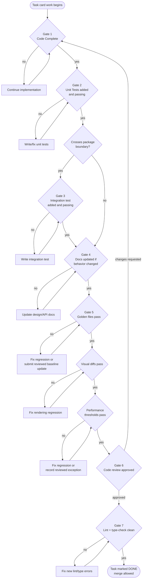
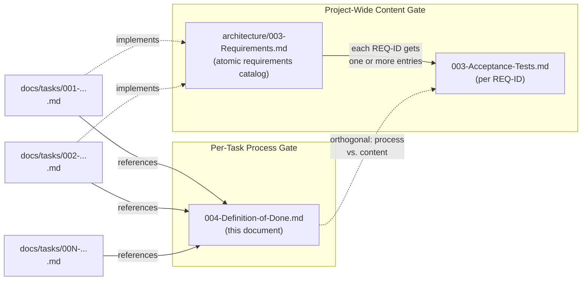

# 004 — Definition of Done

## 1. Title

**Critical CSS Extraction Engine — Definition of Done: The Org-Wide Completion Gate for Every Task Card**

## 2. Version

| Field | Value |
|---|---|
| Document Version | 1.0.0 |
| Status | Draft — Phase 16 (Implementation Task Catalog) |
| Last Updated | 2026-07-10 |
| Owners | Core Architecture Working Group / Testing Guild |
| Stability | Draft; the seven-gate sequence (Section 8) is expected to be stable, but individual gate thresholds (coverage percentage, lint ruleset) may be tuned per-repository without invalidating this document's structure |

## 3. Purpose

`BRIEF.md` Section 2.19's repository layout places `docs/implementation/` alongside `docs/tasks/` for a reason: the engine's implementation work is decomposed into atomic task cards (per [SUMMARY.md](../SUMMARY.md)'s "Planned" list and the five task cards under `docs/tasks/` this same phase introduces), and every one of those cards needs a single, unambiguous, non-negotiable answer to the question "is this task actually finished?" This document is that answer. It defines the **Definition of Done (DoD)**: the universal completion checklist that applies identically to every task card in `docs/tasks/`, regardless of which package it touches, how large it is, or which engineer or autonomous agent implements it.

The DoD exists to solve a specific failure mode that recurs in every software project of this size: a task is marked "done" because the code compiles and a manual smoke test passed, and three weeks later a downstream package breaks because no automated test locked in the behavior, or the golden-file baseline silently drifted, or a doc that described the old behavior was never updated. `docs/architecture/006-Design-Principles.md` Principle 5 (Determinism of Output) and Principle 6 (Fail-Fast Diagnostics) both depend on the engine's automated test surface — golden files, visual diffs, performance benchmarks — actually being exercised and gating merges, not merely existing as aspirational documentation. The DoD is the mechanism that makes that dependency real: it is the checklist a reviewer runs down before approving a pull request, and the checklist every task card in `docs/tasks/` points back to instead of re-deriving its own bespoke completion criteria.

This document is deliberately narrow in scope. It does not define *what* correct behavior looks like for any given feature — that is the job of the per-criterion acceptance tests in [003-Acceptance-Tests.md](./003-Acceptance-Tests.md) (planned, per `BRIEF.md` line 535, to be written alongside this document in Phase 16). The DoD is the **process gate** every task must pass through; acceptance tests are the **content** that proves the specific requirement each task implements is satisfied. Section 4 of this document draws that boundary precisely, because conflating the two is the single most common way a "Definition of Done" document degrades into either an unenforceable platitude ("write good code") or an unmaintainable duplicate of the requirements catalog.

## 4. Audience

- Implementers (human or autonomous coding agent) of any task card under `docs/tasks/`, who must satisfy every applicable gate in Section 8 before requesting review or marking a card complete.
- Reviewers approving pull requests against any package in `packages/` or `apps/`, who use this document as the objective, non-negotiable checklist against which a diff is measured — replacing ad hoc, reviewer-specific standards with one shared bar.
- Task-card authors (Phase 16 and beyond), who cross-reference this document from every card's "Definition of Done" section rather than restating the checklist inline, per the DRY discipline established in `docs/architecture/006-Design-Principles.md`.
- CI/CD platform engineers wiring the gates in Section 8 (golden-file diff, visual regression, performance threshold, lint, type-check) into the pipeline that blocks merges, per [../testing/003-Golden-Files.md](../testing/003-Golden-Files.md), [../testing/002-Visual-Tests.md](../testing/002-Visual-Tests.md), and [../testing/004-Performance-Tests.md](../testing/004-Performance-Tests.md).
- Engineering managers and working-group owners tracking project completion status against `docs/STATUS.md` and `docs/ROADMAP.md`, who need a consistent, auditable signal for "this task is genuinely finished" rather than a self-reported one.

Readers are assumed to be familiar with the project's package layout (`BRIEF.md` Section 2.19), the testing strategy overview ([../testing/000-Testing-Strategy.md](../testing/000-Testing-Strategy.md)), and standard software engineering practice around code review, unit testing, and CI gating. This is not an introduction to testing methodology; it is a specific, binding checklist for this repository.

## 5. Prerequisites

- [../testing/000-Testing-Strategy.md](../testing/000-Testing-Strategy.md) — the umbrella testing philosophy this document's CI gates (Section 8.4–8.6) draw their specific mechanisms from.
- [../testing/001-Fixtures.md](../testing/001-Fixtures.md) — the fixture corpus that golden-file and visual tests (Sections 8.4, 8.5) run against.
- [../testing/002-Visual-Tests.md](../testing/002-Visual-Tests.md) — the visual regression suite this document's Gate 4 invokes.
- [../testing/003-Golden-Files.md](../testing/003-Golden-Files.md) — the byte-exact serialized-output suite this document's Gate 3 invokes.
- [../testing/004-Performance-Tests.md](../testing/004-Performance-Tests.md) — the CI-gating performance benchmark suite this document's Gate 5 invokes.
- `docs/architecture/006-Design-Principles.md` — Principle 3 (Correctness Over Premature Optimization), Principle 5 (Determinism of Output), and Principle 6 (Fail-Fast Diagnostics), all three of which this checklist operationalizes as enforceable, mechanical gates rather than aspirational prose.
- `docs/architecture/003-Requirements.md` — the atomic requirements catalog that task cards implement and that [003-Acceptance-Tests.md](./003-Acceptance-Tests.md) verifies; understanding the DoD/Acceptance-Test boundary (Section 7 below) requires having read this document's framing of requirements as the unit both reference.
- `BRIEF.md` Section 2.18 (Acceptance Criteria) and Section 2.19 (Canonical Repository Layout).

## 6. Related Documents

- [003-Acceptance-Tests.md](./003-Acceptance-Tests.md) (planned) — the per-criterion, project-wide acceptance test catalog; see Section 7 for the precise division of responsibility between that document and this one.
- `docs/tasks/001-Implement-Browser-Pool.md`, `002-Implement-CSSOM-Walker.md`, `003-Implement-Selector-Matcher.md`, `004-Implement-Dependency-Resolver.md`, `005-Implement-Visibility-Engine.md` — the five Phase 16 task cards that each cross-reference this document as their completion gate.
- [../testing/000-Testing-Strategy.md](../testing/000-Testing-Strategy.md), [001-Fixtures.md](../testing/001-Fixtures.md), [002-Visual-Tests.md](../testing/002-Visual-Tests.md), [003-Golden-Files.md](../testing/003-Golden-Files.md), [004-Performance-Tests.md](../testing/004-Performance-Tests.md), [005-Regression-Tests.md](../testing/005-Regression-Tests.md) — the concrete test suites this document's CI gates delegate to.
- `docs/architecture/006-Design-Principles.md` — the design principles this checklist enforces mechanically.
- `docs/architecture/003-Requirements.md` — the requirements catalog task cards and acceptance tests both trace to.
- `BRIEF.md` Section 2.18 (Acceptance Criteria) and Section 4 (Global Rules) — the authoritative source requirements this document, and every document produced under Phase 16, must satisfy.

## 7. Overview

### 7.1 Definition of Done vs. Acceptance Tests — the Boundary

Two documents in this repository sound similar and are frequently confused, so this section states the distinction once, canonically, exactly as `docs/architecture/003-Requirements.md`'s own cross-reference anticipates:

| | **Definition of Done** (this document) | **Acceptance Tests** ([003-Acceptance-Tests.md](./003-Acceptance-Tests.md)) |
|---|---|---|
| **Scope** | Universal — applies identically to *every* task card, regardless of what it implements | Per-criterion — one entry per atomic requirement in `docs/architecture/003-Requirements.md` |
| **Question answered** | "Did this piece of work go through the required process gates (tests exist, docs updated, CI green, reviewed)?" | "Does the system actually satisfy requirement REQ-042?" |
| **Granularity** | One checklist, reused everywhere | One test (or test group) per REQ-ID |
| **Owner** | Testing Guild / Core Architecture Working Group | Requirement owner (varies by module) |
| **Where it lives** | `docs/implementation/004-Definition-of-Done.md` (this file) | `docs/implementation/003-Acceptance-Tests.md` |
| **When it's checked** | On every single pull request, before merge | Continuously, as part of the golden-file/visual/performance suites this document's gates invoke, and explicitly at project-level milestone reviews |
| **Failure mode if absent** | Individually reasonable-looking PRs accumulate untested, undocumented, or unreviewed debt | The system silently fails to meet a specific requirement `BRIEF.md` promised, undetected because no single test named it |

A task card is **process-complete** when it satisfies this document. A *project* is **requirements-complete** when every entry in [003-Acceptance-Tests.md](./003-Acceptance-Tests.md) passes. The two are orthogonal and both required: a task can pass every DoD gate (tests exist, are green, code is reviewed) while still leaving a requirement unimplemented if no task card was ever written against it — that gap is `docs/STATUS.md`'s job to surface, not this document's. Conversely, a change can appear to satisfy a specific acceptance criterion while having skipped code review or documentation updates — that is precisely the gap this document closes.

### 7.2 Why a Single, Shared Checklist

`docs/architecture/006-Design-Principles.md` establishes several principles (determinism, fail-fast diagnostics, correctness-first) that are only as strong as the mechanism enforcing them. Without a shared DoD, each task card's author would restate (or, worse, quietly omit) some subset of "write tests," "update docs," "pass CI" — and because task cards in this project are frequently implemented by autonomous coding agents working from the card's text alone (see `docs/tasks/*.md`'s "Definition of Done" section, which cross-references this file rather than re-deriving it), any omission in one card's bespoke checklist becomes a silent gap in what gets built. Centralizing the checklist here means every task card need only say "see [../implementation/004-Definition-of-Done.md](../implementation/004-Definition-of-Done.md)" — a single point of change when the org's standards evolve, and a single point of truth for what "done" means anywhere in this repository.

## 8. Detailed Design

### 8.1 The Seven Gates

Every task card's work must pass through seven gates, in the order below, before it can be marked complete. A task is **not done** if any gate is skipped, even if the reviewer judges the skip to be low-risk — exceptions require an explicit, written waiver from the relevant working-group owner (Section 12.4), not silent omission.

1. **Gate 1 — Code Complete.** The implementation satisfies the task card's Acceptance Criteria section and the design doc(s) it implements, with no `TODO`/`FIXME` markers left unresolved unless explicitly deferred to a linked follow-up task.
2. **Gate 2 — Unit Tests.** Every new function, class, and branch introduced has unit test coverage exercising both its expected-input and edge-case behavior. Coverage tooling must report no *regression* in the affected package's line/branch coverage relative to the pre-change baseline (per the package's configured threshold; see Section 14.3).
3. **Gate 3 — Integration Test (conditional).** If the change crosses a package boundary (e.g., a change to `packages/browser`'s `PageHandle` shape that `packages/collector` consumes, or a change to `packages/matcher`'s output DTO that `packages/dependency-graph` reads), an integration test exercising the real cross-package call path — not a mocked stand-in for the other package — must be added or updated. Single-package-internal changes are exempt from this gate; see Section 11.2 for how "crosses a boundary" is determined precisely.
4. **Gate 4 — Documentation.** If the change alters observable behavior (a public API signature, a DTO shape, a configuration flag's default, an algorithm's complexity characteristics, or anything else a document under `docs/design/`, `docs/api/`, or `docs/architecture/` currently describes), the corresponding document is updated in the same pull request. Documentation-only tasks are exempt from Gates 2–3 but not from Gates 5–7.
5. **Gate 5 — Golden-File / Visual-Diff / Performance CI Gates.** All three automated CI suites must pass:
   - **Golden files** ([../testing/003-Golden-Files.md](../testing/003-Golden-Files.md)): byte-exact serialized-CSS-output comparison against the fixture corpus's approved baselines. A deliberate output-format change requires an explicit, reviewed golden-file update commit — never a silent baseline overwrite.
   - **Visual diffs** ([../testing/002-Visual-Tests.md](../testing/002-Visual-Tests.md)): rendered-page screenshot comparison across the fixture/viewport matrix, confirming the critical CSS the engine extracted actually renders the above-the-fold content correctly with no visible regression.
   - **Performance thresholds** ([../testing/004-Performance-Tests.md](../testing/004-Performance-Tests.md)): benchmark suite run against `benchmarks/`, gated on the repository's configured regression-percentage thresholds (Section 8 of that document); a task that regresses a benchmark beyond threshold is not done until either the regression is fixed or an explicit, reviewed threshold exception is recorded.
6. **Gate 6 — Code Review.** At least one reviewer who is not the change's author has approved the pull request, confirming Gates 1–5 were actually satisfied (not merely claimed) and that the implementation is idiomatic, follows the package's existing conventions, and does not introduce undocumented coupling.
7. **Gate 7 — Static Analysis Clean.** The change introduces zero new lint errors and zero new type errors (TypeScript strict-mode compilation, per the repository's `tsconfig` and lint configuration) relative to the pre-change baseline. Pre-existing lint/type debt elsewhere in the codebase is not this task's responsibility to fix, but it must not add to it.

### 8.2 Applicability Matrix

Not every gate applies to every kind of task. The matrix below is the authoritative reference a task-card author or reviewer consults when a card's own Definition of Done section says "per 004-Definition-of-Done.md, Section 8.2":

| Task Kind | Gate 1 (Code) | Gate 2 (Unit) | Gate 3 (Integration) | Gate 4 (Docs) | Gate 5 (CI Suites) | Gate 6 (Review) | Gate 7 (Static) |
|---|---|---|---|---|---|---|---|
| New module implementation (e.g., `docs/tasks/001`–`005`) | Required | Required | Required (crosses boundary by construction) | Required | Required (all three) | Required | Required |
| Bug fix, single package | Required | Required (regression test for the bug) | Conditional | Conditional (only if behavior contract changes) | Required | Required | Required |
| Internal refactor, no behavior change | Required | Required (existing tests must still pass; new tests only if coverage gap found) | Conditional | Not required | Required | Required | Required |
| Documentation-only change | N/A | N/A | N/A | Required (this is the whole task) | Not required (no code changed) | Required | N/A |
| Performance optimization | Required | Required (equivalence tests proving output unchanged, per Design Principle 3) | Conditional | Required (Performance section of relevant design doc) | Required (Gate 5's performance suite is the primary signal) | Required | Required |

## 9. Architecture

### 9.1 The Gate Sequence as a Flowchart



### 9.2 Where the DoD Sits Relative to Acceptance Tests



## 10. Algorithms (Gate Evaluation Procedure)

### 10.1 Problem Statement

Given a pull request `PR` implementing task card `T`, determine whether `PR` satisfies the Definition of Done, producing a boolean `is_done` and, if false, the specific list of unsatisfied gates.

### 10.2 Inputs and Outputs

- **Input:** `PR` (diff, CI run results, review state), `T` (the task card, which determines the applicability matrix row via its declared "Task Kind").
- **Output:** `{ is_done: boolean, failing_gates: Gate[] }`.

### 10.3 Pseudocode

```
function evaluateDoD(PR, T):
    applicable = applicabilityMatrixRow(T.kind)   # Section 8.2
    failing = []

    if not PR.diff.satisfiesAcceptanceCriteria(T.acceptanceCriteria):
        failing.append(Gate.CODE_COMPLETE)

    if applicable.unitTests and not PR.ci.unitTestsPass(minCoverageDelta=0):
        failing.append(Gate.UNIT_TESTS)

    if crossesPackageBoundary(PR.diff):           # Section 11.2
        if not PR.ci.integrationTestsPass():
            failing.append(Gate.INTEGRATION_TEST)

    if PR.diff.altersObservableBehavior():
        if not PR.diff.touchesCorrespondingDocs():
            failing.append(Gate.DOCUMENTATION)

    if applicable.ciSuites:
        if not PR.ci.goldenFilesPass():
            failing.append(Gate.GOLDEN_FILES)
        if not PR.ci.visualDiffsPass():
            failing.append(Gate.VISUAL_DIFF)
        if not PR.ci.performanceThresholdsPass():
            failing.append(Gate.PERFORMANCE)

    if not PR.review.hasIndependentApproval():
        failing.append(Gate.CODE_REVIEW)

    if applicable.staticAnalysis and not PR.ci.lintAndTypeCheckClean(baseline=PR.base):
        failing.append(Gate.STATIC_ANALYSIS)

    return { is_done: failing.isEmpty(), failing_gates: failing }
```

### 10.4 Time Complexity

`O(1)` per gate check relative to the size of the change — each gate check is a lookup of a precomputed CI result or review state, not a recomputation. The dominant cost lives entirely inside the underlying CI suites this procedure delegates to (golden-file diffing is `O(fixtures)`, visual diffing is `O(fixtures × viewports)`, performance benchmarking is `O(benchmark scenarios)`; see the respective testing documents for their own complexity budgets). The gate-evaluation procedure itself never re-derives those results — it only reads their pass/fail output.

### 10.5 Memory Complexity

`O(1)` beyond storing the `failing_gates` list, which is bounded by the constant number of gates (seven).

### 10.6 Failure Cases

- **CI result unavailable** (e.g., a suite timed out or was never triggered): treated as a failing gate, never as "skip" — absence of a signal is not evidence of passing, per Principle 6 (Fail-Fast Diagnostics).
- **Ambiguous boundary-crossing determination** (Section 11.2's heuristic returns a borderline case): defaults to requiring Gate 3, since a false-positive integration test requirement costs engineering time, while a false-negative silently ships an untested cross-package contract.
- **Reviewer approves without actually re-running gates 1–5 locally**: this procedure cannot detect a reviewer who rubber-stamps; it is a process/culture failure outside this algorithm's power to catch mechanically. Section 12.3 addresses this via reviewer responsibility, not automation.

### 10.7 Optimization Opportunities

- Cache `applicabilityMatrixRow(T.kind)` per task card rather than recomputing per PR revision.
- Short-circuit evaluation on the first failing gate when the caller only needs a boolean (`is_done`), and only compute the full `failing_gates` list when a human-readable report is requested (e.g., for a PR status comment).
- Incrementally re-evaluate only the gates affected by a PR's latest push (e.g., a documentation-only follow-up commit need not re-run performance benchmarks) — see Section 16 (Future Work) for an incremental-gate-evaluation proposal.

## 11. Implementation Notes

### 11.1 How This Document Is Referenced From Task Cards

Every task card under `docs/tasks/` includes a "Definition of Done" section that reads, verbatim or near-verbatim: *"This task is done when it satisfies [../implementation/004-Definition-of-Done.md](../implementation/004-Definition-of-Done.md), Section 8, at the applicability level for a 'New module implementation' task."* Task cards MUST NOT restate the seven gates inline — doing so creates two sources of truth that will drift. If a specific task has a DoD nuance not captured by the standard applicability matrix (e.g., a task that is unusually performance-sensitive and warrants an additional, task-specific benchmark), the card documents that nuance as an *addition* to, not a replacement of, this document's baseline.

### 11.2 Determining "Crosses a Package Boundary" (Gate 3)

A change crosses a package boundary, triggering Gate 3, if any of the following hold:

1. The change modifies a file under a package's `src/index.ts` (or equivalent public-export surface) or any type/interface re-exported from it.
2. The change modifies the shape (fields, types, or semantics) of any DTO defined in `docs/architecture/016-Data-Flow.md` that is documented as flowing between two or more packages (e.g., `CssomRuleList`, `DomSnapshot`, `MatchedRule`, `GraphNode`).
3. The change is to a new module's first implementation (by construction, a brand-new module's initial implementation always crosses the boundary between "module doesn't exist" and "module is a consumer/producer for its declared upstream/downstream packages" — this is why the Section 8.2 matrix marks all five Phase 16 task cards as "Required (crosses boundary by construction)").

A change that only touches a package's internal, non-exported implementation details (a private helper function, an internal-only type) does not trigger Gate 3, even if it is large.

### 11.3 Golden-File Baseline Updates Are Not a Loophole

Gate 5's golden-file check can, in principle, be satisfied by regenerating the baseline to match new (possibly wrong) output. This document explicitly forbids that shortcut: any pull request that updates a golden-file baseline must, in its description, state *why* the previous baseline is no longer correct, and the reviewer (Gate 6) must independently verify that justification against the design doc the change implements — not merely confirm that the diff and the new baseline agree with each other. This mirrors [../testing/003-Golden-Files.md](../testing/003-Golden-Files.md)'s own update-workflow policy and is restated here because it is a DoD-level concern, not merely a testing-infrastructure detail.

### 11.4 Autonomous-Agent Implementers

Because task cards in this repository are frequently implemented end-to-end by autonomous coding agents (per this document's Section 4 audience list), this DoD is written to be mechanically checkable wherever possible (Gates 2, 5, 7 are fully automatable via CI) and to make the non-automatable gates (1, 3's judgment call, 4, 6) explicit enough that an agent can self-assess against them before requesting human review, reducing review-cycle churn.

## 12. Edge Cases

1. **Task spans multiple pull requests.** The DoD applies to the *task* as a logical unit, not to any single PR. A task tracked across PRs 1–3 is done only when the union of those PRs collectively satisfies all seven gates; an individual PR in the sequence may legitimately skip Gate 5's full suite if it is explicitly a work-in-progress PR merged behind a feature flag, provided the final PR in the sequence re-runs the full suite before the flag is removed.
2. **Emergency hotfix.** A production-incident hotfix may be merged with an abbreviated review (a single fast-approval) but MUST have a follow-up task card opened immediately to backfill any skipped gate (typically Gate 2's full unit-test coverage or Gate 4's documentation), tracked in `docs/STATUS.md` as "hotfix debt" until closed.
3. **Task card's design doc changes after work starts.** If the upstream design document (e.g., [../design/300-CSSOM-Walker.md](../design/300-CSSOM-Walker.md)) is revised mid-implementation, the task is not done until the implementation is reconciled with the *current* revision of the doc, and Gate 4 additionally requires confirming no stale cross-references remain.
4. **Third-party dependency introduces a lint/type baseline shift** unrelated to the task's own change (e.g., an upstream `@types/node` bump surfaces pre-existing type errors elsewhere). Gate 7 is scoped to errors *introduced by this diff*; pre-existing errors surfaced by an unrelated dependency bump are tracked as a separate task, not a blocker for the current one, provided the reviewer confirms the errors are genuinely pre-existing and not caused by the change under review.
5. **Flaky CI suite.** If Gate 5's suite fails intermittently for reasons unrelated to the change (documented flakiness, tracked in `docs/testing/005-Regression-Tests.md`), a reviewer may approve after two consecutive clean re-runs, with the flake logged; this is not a general license to ignore red CI.
6. **Task is purely exploratory/spike work** not intended to ship. Such work is explicitly out of scope for this document — it should not be tracked as a `docs/tasks/` card at all, or should be clearly labeled "spike, not subject to DoD" in its own card to avoid reviewer confusion.

## 13. Tradeoffs

- **Uniform checklist vs. per-package customization.** A single, universal DoD is simpler to teach, audit, and automate than a per-package variant, at the cost of occasionally applying a gate (e.g., visual-diff testing) to a package where it is only marginally relevant (a pure data-structure package like `packages/dependency-graph`'s graph model might not itself produce pixels, but its output feeds a pipeline that does, so the visual-diff suite still meaningfully exercises it end-to-end). We accept this over-application because the alternative — bespoke per-package checklists — reintroduces the drift problem Section 7.2 identifies as the core justification for this document.
- **Mandatory independent review (Gate 6) vs. self-certification.** Self-certification is faster but removes the one gate (Section 10.6) that catches a reviewer-less rubber-stamp; we keep mandatory independent review because `docs/architecture/006-Design-Principles.md`'s principles are only as strong as their enforcement, and enforcement requires a second party.
- **Blocking merge on performance thresholds (Gate 5) vs. advisory-only benchmarks.** Advisory benchmarks are cheaper to maintain (no threshold tuning, no false-positive management) but historically fail to prevent gradual performance regression ("boiling frog" drift), which is precisely the failure mode [../testing/004-Performance-Tests.md](../testing/004-Performance-Tests.md) is designed to gate against. We accept the maintenance cost of threshold tuning in exchange for a hard backstop.
- **Fixed seven-gate sequence vs. a scored/weighted rubric.** A binary pass/fail per gate is easier to automate and reason about than a weighted score, at the cost of not distinguishing "barely failed" from "catastrophically failed." We accept this because the DoD's purpose is a merge gate, not a quality metric — quality trends are `docs/STATUS.md`'s and periodic retrospectives' job, not this document's.

## 14. Performance

- **CPU complexity of DoD evaluation itself:** `O(1)` per PR (Section 10.4); the cost center is the underlying CI suites, not the checklist logic.
- **Memory complexity:** `O(1)` (Section 10.5).
- **Caching strategy:** CI systems should cache unit-test and lint results keyed by content hash of the affected files, so an unrelated commit (e.g., a documentation-only follow-up push) does not re-run the full golden-file/visual/performance suite unnecessarily — see Section 16 for the proposed incremental-gate model.
- **Parallelization opportunities:** Gates 2 (unit), 5's three sub-suites (golden, visual, performance), and 7 (lint/type-check) are mutually independent and should run concurrently in CI rather than sequentially; only Gate 6 (review) and the final aggregation depend on all others completing.
- **Incremental execution:** A change confined to a single package with no cross-boundary impact (Section 11.2) can, in principle, skip re-running golden-file/visual suites for unrelated packages' fixtures — see Future Work (Section 16) for a scoped-suite proposal that has not yet been implemented.
- **Profiling guidance:** If Gate 5's suite becomes a CI bottleneck, profile via [../testing/004-Performance-Tests.md](../testing/004-Performance-Tests.md)'s own benchmarking harness before assuming the fix is "make the DoD stricter" or "make the DoD looser" — often the fix is suite-level (better fixture partitioning, parallel runners), not DoD-level.
- **Scalability limits:** As the task-card catalog under `docs/tasks/` grows into the hundreds, the applicability matrix (Section 8.2) may need additional rows (e.g., a distinct "plugin SDK task" category); this document's structure supports that growth without redesign — new rows are additive, not disruptive to existing ones.

## 15. Testing

This document is itself unusual among the design documents in this repository in that its own "testing" concern is: *how do we test that the DoD is being followed*, not *how do we test a specific module*. The mechanisms are:

- **CI enforcement:** Gates 2, 5, and 7 are enforced automatically; a pull request cannot merge (branch protection) unless all three report green, removing reliance on human memory for the automatable gates.
- **Review checklist artifact:** The pull-request template includes a checkbox list mirroring Section 8.1's seven gates, so Gate 6's reviewer has an explicit, visible artifact to check off rather than relying on tribal knowledge of what "done" means.
- **Periodic audit:** The Testing Guild periodically samples merged PRs against this document's gates retroactively (not to punish, but to detect systemic gaps — e.g., discovering that Gate 4's documentation requirement is being widely skipped signals either a process problem or that this document's Gate 4 trigger condition needs tightening).
- **Meta-test:** [003-Acceptance-Tests.md](./003-Acceptance-Tests.md)'s own entries should each note, where applicable, which task card(s) under `docs/tasks/` are responsible for satisfying them, providing a traceability check that every acceptance criterion has at least one task whose DoD-gated completion is expected to satisfy it — closing the loop described in Section 7.1's table.

## 16. Future Work

- **Machine-readable DoD schema.** `docs/architecture/003-Requirements.md`'s own Future Work section anticipates a machine-readable requirements schema; once that exists, this document's seven gates could similarly be expressed as a schema (e.g., a YAML gate manifest) that CI tooling consumes directly, rather than this prose document being the sole source of truth a human (or agent) must interpret.
- **Incremental/scoped gate evaluation.** As noted in Section 14, a change confined to one package could in principle skip re-running suites scoped to unaffected packages. This requires a reliable, automatically-computed package-impact graph (distinct from the runtime CSS dependency graph this repository also has a graph called "dependency graph" for — see the disambiguation discipline in [../design/500-Dependency-Resolution-Overview.md](../design/500-Dependency-Resolution-Overview.md) Section 7) before it can be implemented safely.
- **Automated Gate-3 boundary detection.** Section 11.2's boundary-crossing determination is currently a documented heuristic applied by a reviewer's judgment; a static-analysis tool that inspects a diff's touched files against each package's declared public-export surface could automate this determination and flag Gate 3 applicability automatically in a PR comment.
- **DoD compliance dashboard.** A lightweight dashboard aggregating, per merged PR, which gates were satisfied and how (e.g., "Gate 5 passed on the second CI run after a documented flake") would make the periodic audit in Section 15 continuous rather than sampled.
- **Tiered DoD for experimental packages.** Should the repository grow an explicitly experimental/incubating package tier (not currently part of `BRIEF.md` Section 2.19's layout), a reduced DoD tier may be warranted for that tier specifically, distinct from the full seven-gate sequence this document mandates for shipped packages.

## 17. References

- [003-Acceptance-Tests.md](./003-Acceptance-Tests.md) (planned, Phase 16) — per-criterion, project-wide acceptance test catalog; see Section 7.1 for the boundary with this document.
- [../testing/000-Testing-Strategy.md](../testing/000-Testing-Strategy.md) — umbrella testing philosophy.
- [../testing/001-Fixtures.md](../testing/001-Fixtures.md) — fixture corpus underlying Gates 3 and 5.
- [../testing/002-Visual-Tests.md](../testing/002-Visual-Tests.md) — visual regression suite (Gate 5).
- [../testing/003-Golden-Files.md](../testing/003-Golden-Files.md) — golden-file suite (Gate 5).
- [../testing/004-Performance-Tests.md](../testing/004-Performance-Tests.md) — performance CI-gating suite (Gate 5).
- [../testing/005-Regression-Tests.md](../testing/005-Regression-Tests.md) — regression suite referenced under flaky-CI handling (Section 12.5).
- `docs/architecture/006-Design-Principles.md` — Principles 1, 3, 5, 6, operationalized by this document's gates.
- `docs/architecture/003-Requirements.md` — atomic requirements catalog; the unit both task cards and acceptance tests trace to.
- `docs/architecture/016-Data-Flow.md` — DTO shapes referenced in Section 11.2's boundary-crossing determination.
- `docs/tasks/001-Implement-Browser-Pool.md`, `002-Implement-CSSOM-Walker.md`, `003-Implement-Selector-Matcher.md`, `004-Implement-Dependency-Resolver.md`, `005-Implement-Visibility-Engine.md` — the five Phase 16 task cards that reference this document as their completion gate.
- `BRIEF.md` Section 2.18 (Acceptance Criteria) and Section 4 (Global Rules).
- `docs/SUMMARY.md` — the planned-documents list that first names this file.
