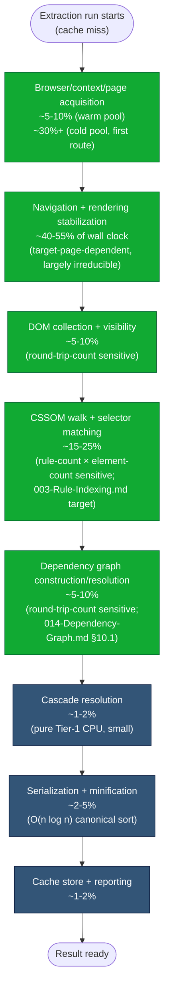

# 000 — Performance Program Overview

## 1. Title

**Critical CSS Extraction Engine — Performance Program Overview**

## 2. Version

| Field | Value |
|---|---|
| Document Version | 1.0.0 |
| Status | Draft — Phase 14 (Performance) |
| Last Updated | 2026-07-10 |
| Owners | Performance Working Group |
| Stability | Introductory/aggregating document; numeric targets in Section 14 are provisional until [005-Benchmarks.md](./005-Benchmarks.md) supplies measured data |

## 3. Purpose

This document opens Phase 14 of the documentation program: the point at which the engine's architecture — already fixed by `docs/architecture/010`–`016` — is examined specifically for where it spends CPU time, wall-clock time, and memory, and what concrete, implementable levers exist to reduce each. It exists to answer three questions that no earlier document answers on its own: **where does time actually go** in a representative extraction run; **which of `BRIEF.md` Section 2.14's nine named optimizations** (rule indexing, selector memoization, parallel stylesheet traversal, browser-side execution, batched serialization, worker threads, route batching, streaming output, memory profiling) **addresses which cost center**; and **how do the five sibling documents in this directory** ([001-Worker-Threads.md](./001-Worker-Threads.md), [002-Parallelization-Strategy.md](./002-Parallelization-Strategy.md), [003-Rule-Indexing.md](./003-Rule-Indexing.md), [004-Memory-Optimization.md](./004-Memory-Optimization.md), [005-Benchmarks.md](./005-Benchmarks.md)) divide that work into independently reviewable, independently implementable units.

A disambiguation this document must state explicitly, because the two documents are easy to conflate and cover adjacent ground: [015-Runtime-Model.md](../architecture/015-Runtime-Model.md) is an **architecture** document. It establishes, at the level of OS processes and V8 isolates, *where code runs* — the Tier 1 (Node host) / Tier 2 (browser renderer) boundary, the three-axis concurrency taxonomy (worker threads, route batching, parallel stylesheet traversal), and the three-pool memory model (Node heap, browser process memory, disk-streamed output). It answers "is this operation allowed to run in parallel, and in which process." This document, and the four siblings it introduces, are **performance** documents. They take that architecture as a fixed constraint and ask a different question: *given* that worker threads exist as an available mechanism, how many should there be, how should work be partitioned across them, and when does using one actually pay for itself versus adding pure overhead? *Given* that route batching is I/O-bound and handled by the event loop, what batch size actually saturates a browser pool without triggering memory pressure? *Given* that selector matching may be indexed and memoized, what index structure, and what is its space/time cost? 015 establishes the legal moves; this Phase draws the concrete tuning curves, data structures, and numbers that make those moves fast. Where 015 says "worker threads parallelize CPU-bound host work" as an architectural fact, [001-Worker-Threads.md](./001-Worker-Threads.md) says "here is the pool-sizing formula, the partitioning algorithm, and the granularity threshold below which a worker thread is a net loss."

## 4. Audience

- Implementers of `apps/cli`'s orchestration layer, who must translate this program's tuning guidance into actual configuration defaults and runtime heuristics.
- Implementers of `packages/matcher`, `packages/dependency-graph`, and `packages/serializer`, whose CPU-bound stages are the candidates this program identifies for indexing, memoization, and worker-thread offload.
- Performance engineers and SREs responsible for CI runner sizing, who need a cost model to answer "how many CPU cores / how much memory should the CI job request for N routes."
- Senior engineers and autonomous coding agents implementing the sibling documents' concrete mechanisms ([001](./001-Worker-Threads.md)–[005](./005-Benchmarks.md)), who should read this document first to understand how their piece fits the whole program before diving into implementation-level detail.

Readers are assumed to already have read [015-Runtime-Model.md](../architecture/015-Runtime-Model.md) in full; this document does not re-derive the Tier 1/Tier 2 process model, only references it.

## 5. Prerequisites

- [BRIEF.md](../../BRIEF.md) Section 2.14 ("Performance Optimizations") — the nine-item list this entire Phase operationalizes.
- [BRIEF.md](../../BRIEF.md) Section 4 (Global Rules) — the structural and stylistic constraints this document, and all Phase 14 siblings, must follow.
- [015-Runtime-Model.md](../architecture/015-Runtime-Model.md) — the architectural concurrency and memory model this program tunes rather than redefines.
- [003-Requirements.md](../architecture/003-Requirements.md) — REQ-510 (memoized selector matching), REQ-511 (parallel stylesheet traversal), REQ-512 (route-batch worker-thread parallelism), REQ-513 (streaming output) — the four performance requirements this Phase must demonstrably satisfy with concrete designs, not merely restate.
- [006-Design-Principles.md](../architecture/006-Design-Principles.md) — Principle 3 ("Provable Equivalence Over Approximation"), which constrains every optimization in this program: an optimization is admissible only if it is provably equivalent to the naive-correct baseline, never an approximation of it.
- [014-Dependency-Graph.md](../architecture/014-Dependency-Graph.md) Section 10.1 — the batched-discovery-query optimization this program's [002-Parallelization-Strategy.md](./002-Parallelization-Strategy.md) generalizes.

## 6. Related Documents

- [001-Worker-Threads.md](./001-Worker-Threads.md) — worker-thread pool sizing, partitioning, and offload-granularity guidance (this Phase, sibling)
- [002-Parallelization-Strategy.md](./002-Parallelization-Strategy.md) — cross-cutting parallelization strategy spanning all three of 015's concurrency axes (this Phase, sibling, forward reference)
- [003-Rule-Indexing.md](./003-Rule-Indexing.md) — rule index and selector memoization data structures (this Phase, sibling, forward reference)
- [004-Memory-Optimization.md](./004-Memory-Optimization.md) — streaming output, memory profiling methodology, and heap-pressure mitigation (this Phase, sibling, forward reference)
- [005-Benchmarks.md](./005-Benchmarks.md) — the benchmark suite and numeric targets that validate every claim made in this document and its siblings (this Phase, sibling, forward reference)
- [../architecture/015-Runtime-Model.md](../architecture/015-Runtime-Model.md) — the architectural concurrency/memory model this Phase tunes
- [../architecture/003-Requirements.md](../architecture/003-Requirements.md) — REQ-510 through REQ-513
- [../architecture/006-Design-Principles.md](../architecture/006-Design-Principles.md) — Principle 3
- [../architecture/014-Dependency-Graph.md](../architecture/014-Dependency-Graph.md) — Section 10.1's batched-query optimization

## 7. Overview

The engine's dominant cost, per [015-Runtime-Model.md](../architecture/015-Runtime-Model.md) Section 14, is not CPU time in the Node host process at all — it is **browser round trips**: process/context/page acquisition, navigation, rendering-stabilization wait, and the serialization cost of every `page.evaluate()` boundary crossing. This is the single most important fact this performance program must internalize before proposing any optimization, because it inverts a naive intuition. A newcomer to this codebase, told "the engine is slow," will often reach first for worker threads and multi-core parallelism — a CPU-bound-system reflex. But per Section 8.3 of the Runtime Model, most of an extraction run's wall-clock time is the Tier 1 host process *waiting*, not *computing*: waiting for Chromium to launch, waiting for a page to navigate and stabilize, waiting for a round trip to return matched selectors. CPU-bound host-side work — dependency-graph bookkeeping, canonical-order serialization — is real, but it is a secondary cost center relative to browser wait time for a typical single-route extraction, and it only becomes the dominant cost at *scale*, when hundreds or thousands of routes each contribute a small CPU-bound tail that sums to a significant aggregate.

This reframing produces the actual optimization priority order this program follows, which sibling documents implement in turn:

1. **Reduce the number and cost of browser round trips** (batched serialization, browser-side execution) — the highest-leverage lever, because it attacks the dominant cost center directly. Covered architecturally in [015-Runtime-Model.md](../architecture/015-Runtime-Model.md) Section 10.2 (`batchedEvaluate`); this program's [002-Parallelization-Strategy.md](./002-Parallelization-Strategy.md) generalizes it across every call site.
2. **Reduce the *work performed inside* each round trip** (rule indexing, selector memoization) — the second-highest lever, since it shrinks the in-page cost that Section 10.2's round-trip batching does not itself reduce. Covered in [003-Rule-Indexing.md](./003-Rule-Indexing.md).
3. **Parallelize what remains, correctly bounded** (worker threads for CPU-bound host work, route batching for I/O-bound orchestration, parallel stylesheet traversal within a page) — necessary at scale, but strictly secondary to (1) and (2), because parallelizing an unnecessarily expensive operation is a weaker win than making the operation itself cheaper. Covered in [001-Worker-Threads.md](./001-Worker-Threads.md) and generalized further in [002-Parallelization-Strategy.md](./002-Parallelization-Strategy.md).
4. **Bound memory rather than let it grow with scale** (streaming output, memory profiling) — orthogonal to the time-focused levers above, but equally load-bearing for enterprise-scale route manifests (REQ-513). Covered in [004-Memory-Optimization.md](./004-Memory-Optimization.md).
5. **Measure, don't assume** (benchmarks) — every numeric claim in items 1–4 is a hypothesis until [005-Benchmarks.md](./005-Benchmarks.md)'s suite produces measured data across representative fixtures; this program treats its own optimization priority order as falsifiable, not doctrinal.

## 8. Detailed Design

### 8.1 Cost Centers of a Single-Route Extraction

Decomposing one extraction (one route, one viewport, cold cache) into its constituent cost centers, mapped to the Tier 1/Tier 2 split from [015-Runtime-Model.md](../architecture/015-Runtime-Model.md) Section 8.1:

| Cost Center | Tier | Nature | Typical Relative Weight (cold, single route) |
|---|---|---|---|
| Cache fingerprint lookup | Tier 1 | CPU (hash compute), fast | Negligible if hit; otherwise proceeds to below |
| Browser/context/page acquisition | Tier 1 orchestration → Tier 2 spawn | Process-launch I/O, amortized across pool lifetime (Cold→Warm is a one-time cost per pool; ContextAcquired/PageAcquired recur per route) | Small when pool is warm; large (hundreds of ms) on first acquisition |
| Navigation + rendering stabilization | Tier 1 issues, both tiers wait | I/O-bound wall-clock wait on the target page's own load/render behavior | Largest single line item for most real-world pages |
| DOM collection, visibility determination | Tier 2 compute, Tier 1 coordinates | In-page CPU + one or more round trips | Moderate; dominated by round-trip count if not batched |
| CSSOM walking, selector matching | Tier 2 compute, Tier 1 coordinates | In-page CPU; scales with `stylesheet-rule-count × visible-element-count` absent indexing | Moderate to large on big stylesheets; this is [003-Rule-Indexing.md](./003-Rule-Indexing.md)'s target |
| Dependency graph construction/resolution | Tier 1 coordination + Tier 2 discovery queries | Mixed; fixed-point loop bookkeeping is Tier 1 CPU, discovery queries are round trips | Moderate; round-trip count matters more than bookkeeping CPU |
| Cascade resolution | Tier 1 | Pure CPU over already-gathered facts | Small |
| Serialization, minification | Tier 1 | Pure CPU, `O(n log n)` canonical sort dominant term | Small to moderate on very large rule sets |
| Cache store, reporting | Tier 1 | Pure CPU/I/O (disk write) | Small |

The dominant weight of "navigation + rendering stabilization" is structural, not an artifact of this engine's own inefficiency: it is bounded below by how long the target application's own JS takes to reach a stable render, which this engine does not control (per [015-Runtime-Model.md](../architecture/015-Runtime-Model.md) Section 14's "Tier-2 CPU cost... is entirely outside this engine's control"). This program's optimizations therefore cannot make a single route faster than the target page itself allows — what they *can* do is (a) minimize the fixed overhead layered on top of that irreducible wait (round-trip count, in-page compute cost), and (b) maximize *throughput across many routes*, since the majority of a CI run's routes are independent and their navigation waits can overlap.

### 8.2 Cost Centers at Scale (Many Routes)

At the scale of hundreds or thousands of routes (the regime REQ-512 and REQ-513 target), the cost model shifts from "how long does one route take" to "what is the aggregate wall-clock time for the whole manifest, and what is peak memory." Two structural facts dominate here, both already established architecturally in [015-Runtime-Model.md](../architecture/015-Runtime-Model.md) and given concrete tuning treatment by this Phase's siblings:

- **Aggregate wall-clock time is bounded below by `ceil(routes / poolConcurrency) × avg-per-route-latency`** (per [015-Runtime-Model.md](../architecture/015-Runtime-Model.md) Section 10.1), so the two levers that matter are increasing `poolConcurrency` (bounded by host memory, since each concurrent page is a renderer process, Section 8.5 of that document) and decreasing `avg-per-route-latency` (this Phase's round-trip and in-page-cost reductions). Worker threads ([001-Worker-Threads.md](./001-Worker-Threads.md)) address a *different* sub-cost — the CPU-bound tail per route — and their contribution to aggregate wall-clock time is bounded by Amdahl's-law-style diminishing returns once that tail is small relative to navigation wait.
- **Peak Node-heap memory is `O(concurrency × avg-result-size)` under streaming output, versus `O(routes × avg-result-size)` under naive buffer-then-write** (per [015-Runtime-Model.md](../architecture/015-Runtime-Model.md) Section 8.5) — the single largest memory-scalability lever available, addressed concretely in [004-Memory-Optimization.md](./004-Memory-Optimization.md).

### 8.3 Mapping BRIEF §2.14 to Sibling Documents

| BRIEF §2.14 Item | Primary Document | Cost Center Addressed (§8.1/§8.2) |
|---|---|---|
| Rule indexing | [003-Rule-Indexing.md](./003-Rule-Indexing.md) | CSSOM walking / selector matching in-page compute |
| Selector memoization | [003-Rule-Indexing.md](./003-Rule-Indexing.md) | Same, across repeated selector/element pairs within a run |
| Parallel stylesheet traversal | [002-Parallelization-Strategy.md](./002-Parallelization-Strategy.md) (Axis 3 of 015 §8.3) | CSSOM walking, within a single page |
| Browser-side execution | [002-Parallelization-Strategy.md](./002-Parallelization-Strategy.md), reinforcing [015-Runtime-Model.md](../architecture/015-Runtime-Model.md) §10.2 | Round-trip count reduction generally |
| Batched serialization | [002-Parallelization-Strategy.md](./002-Parallelization-Strategy.md) | Round-trip count for dependency discovery, visibility queries |
| Worker threads | [001-Worker-Threads.md](./001-Worker-Threads.md) | CPU-bound host-side tail (dependency bookkeeping, serialization) |
| Route batching | [002-Parallelization-Strategy.md](./002-Parallelization-Strategy.md) (Axis 2 of 015 §8.3) | Aggregate wall-clock time at scale |
| Streaming output | [004-Memory-Optimization.md](./004-Memory-Optimization.md) | Peak Node-heap memory at scale |
| Memory profiling | [004-Memory-Optimization.md](./004-Memory-Optimization.md) | Diagnosing all of the above under real load |

This table is the load-bearing artifact of this document: every sibling document's Purpose section should reference the row(s) it owns, and no BRIEF §2.14 item should be left unassigned or double-owned without explicit justification.

## 9. Architecture

The following diagram gives a rough, illustrative cost breakdown for one representative single-route, single-viewport, cold-cache extraction against a moderately complex real-world page (order-of-magnitude percentages, not measured data — [005-Benchmarks.md](./005-Benchmarks.md) supplies the measured version of this diagram against actual fixtures).



The visual point of this diagram is deliberate: the browser-bound stages (green) dwarf the host-bound stages (blue) for a single route. This is precisely why worker threads — a host-CPU-parallelism mechanism — are a secondary, not primary, lever for single-route latency, and why this program orders its priorities (Section 7) the way it does. Worker threads earn their keep primarily in aggregate, across many routes' accumulated host-side CPU tails, not by shrinking any individual route's critical path.

## 10. Algorithms

### 10.1 Algorithm: Aggregate Cost Estimation for a Route Manifest

**Problem statement.** Given a route manifest of size `R`, estimate total wall-clock time and peak memory for an extraction run, as a function of tunable parameters (`poolConcurrency`, `workerThreadCount`, cache hit rate), so that CI runner sizing and phase-14 tuning decisions can be made analytically before running a full benchmark.

**Inputs.** `R` (route count), `cacheHitRate` (fraction, `0..1`), `avgColdLatency` (per-route wall-clock time on a cache miss, dominated by navigation per Section 8.1), `avgWarmLatency` (per-route time on a cache hit — fingerprint lookup only), `poolConcurrency` (`C`), `avgResultSize` (bytes), `streamingEnabled` (boolean).

**Outputs.** `estimatedWallClock`, `estimatedPeakMemory`.

**Pseudocode.**

```text
function estimateRunCost(R, cacheHitRate, avgColdLatency, avgWarmLatency,
                          C, avgResultSize, streamingEnabled) -> (wallClock, peakMemory):
    coldRoutes = R * (1 - cacheHitRate)
    warmRoutes = R * cacheHitRate

    // Warm-cache routes bypass the pool almost entirely (Section 9.1 of 015-Runtime-Model,
    // cache short-circuit before pool acquisition) — treat as effectively unbounded concurrency.
    warmWallClock = avgWarmLatency          // negligible serial contribution, dominated by cold path

    // Cold routes are pool-bound; apply the bound from 015-Runtime-Model Section 10.1.
    coldWallClock = ceil(coldRoutes / C) * avgColdLatency

    wallClock = warmWallClock + coldWallClock

    if streamingEnabled:
        peakMemory = C * avgResultSize            // only in-flight results resident (015 Section 8.5)
    else:
        peakMemory = R * avgResultSize            // naive buffer-everything

    return (wallClock, peakMemory)
```

**Time complexity.** `O(1)` — this is a closed-form estimator, not a simulation; it is deliberately cheap so it can be recomputed interactively while tuning `C` or evaluating cache-hit-rate improvements.

**Memory complexity.** `O(1)` for the estimator itself; the `peakMemory` it *estimates* is `O(C)` or `O(R)` depending on `streamingEnabled`, per Section 8.2.

**Failure cases.** The estimator is only as good as its input latency figures, which must come from real measurement ([005-Benchmarks.md](./005-Benchmarks.md)), not guesswork — a naive first use of this formula with an unmeasured `avgColdLatency` will systematically mislead runner-sizing decisions; this is why Section 15 requires the estimator itself to be validated against actual benchmark runs before being trusted for CI capacity planning.

**Optimization opportunities.** Extend the model with a `workerThreadCount` term once [001-Worker-Threads.md](./001-Worker-Threads.md)'s pool-sizing formula quantifies the CPU-bound tail's contribution to `avgColdLatency`, so that the estimator can separate "time saved by more browser concurrency" from "time saved by more worker threads" rather than folding both into one opaque `avgColdLatency` constant.

### 10.2 Algorithm: Priority Ranking of Candidate Optimizations

**Problem statement.** Given a profiled breakdown of where a specific run's time is going (Section 9's diagram, but measured rather than illustrative), rank which of the five sibling documents' optimizations would yield the largest marginal improvement, so that implementation effort in later phases is spent where it pays off most.

**Inputs.** `profile: Map<CostCenter, measuredTimeShare>` (from a real profiling run, per Section 11); `costCenterToLever: Map<CostCenter, OptimizationLever[]>` (Section 8.3's table, inverted).

**Outputs.** `rankedLevers: OptimizationLever[]`, sorted descending by the time share of the cost center(s) each lever addresses.

**Pseudocode.**

```text
function rankOptimizations(profile, costCenterToLever) -> OptimizationLever[]:
    leverScore = new Map()
    for (costCenter, timeShare) in profile:
        for lever in costCenterToLever[costCenter]:
            leverScore[lever] = (leverScore[lever] or 0) + timeShare
    return sortDescendingByValue(leverScore)
```

**Time complexity.** `O(costCenters × leversPerCostCenter)`, trivially small (single digits of each in this system).

**Memory complexity.** `O(distinctLevers)`, trivially small.

**Failure cases.** A cost center profiled as large but structurally irreducible (navigation wait, per Section 8.1) will rank highly by this algorithm despite having no available lever in this system's control — the algorithm must be paired with the qualitative judgment in Section 8.1 ("Tier-2 CPU cost... is entirely outside this engine's control") to avoid chasing an optimization that does not exist; this is a known limitation, not a bug, and is why this algorithm is advisory input to a human/agent decision, not an autonomous scheduler.

**Optimization opportunities.** Feed this ranking directly from [005-Benchmarks.md](./005-Benchmarks.md)'s continuous benchmark data once that suite exists, turning this from a one-off analysis exercise into a standing dashboard that re-ranks automatically as the codebase and its bottlenecks evolve.

## 11. Implementation Notes

- Every stage boundary in Section 8.1's table should be instrumented with a timing hook feeding the Reporter's timing report (per [015-Runtime-Model.md](../architecture/015-Runtime-Model.md) Section 11's plugin-timing precedent, extended to core pipeline stages, not just plugins) — without this instrumentation, Section 9's diagram and Section 10.2's algorithm have no real data to operate on, and this Phase's priority ordering (Section 7) remains a hypothesis rather than a validated program.
- The cost-center table in Section 8.1 should be treated as a living document: as [003-Rule-Indexing.md](./003-Rule-Indexing.md) and [002-Parallelization-Strategy.md](./002-Parallelization-Strategy.md) land concrete implementations, their actual measured effect on each row's relative weight should be fed back into this document's Section 8.1 table so it stays a true reflection of the system rather than a stale prediction.
- This document's Section 10.1 estimator should be implemented as an actual small utility (e.g., `packages/reporter`'s capacity-planning helper) rather than remaining purely a documentation artifact, so that CI platform engineers (Section 4's audience) can run it against their own manifest sizes and hardware directly.
- Any optimization proposed by a sibling document must be checked against [006-Design-Principles.md](../architecture/006-Design-Principles.md) Principle 3 (provable equivalence) before being accepted — this program's entire premise is that speed and correctness are not in tension here, and any proposal that trades one for the other should be rejected at the design-review stage, not discovered later as a regression.

## 12. Edge Cases

- **Cold pool vs. warm pool.** The very first route in a run pays the full `Cold → Warm` browser-launch cost (per [015-Runtime-Model.md](../architecture/015-Runtime-Model.md) Section 8.2), which is a one-time fixed cost invisible in Section 8.1's per-route steady-state percentages; a benchmark that only measures a single route will systematically overstate acquisition cost relative to a benchmark measuring a full manifest, and this must be accounted for explicitly in [005-Benchmarks.md](./005-Benchmarks.md)'s methodology.
- **Pathologically large individual stylesheets.** A single enterprise stylesheet with tens of thousands of rules shifts Section 8.1's "CSSOM walking, selector matching" row from "moderate" to "dominant," which is exactly the scenario [003-Rule-Indexing.md](./003-Rule-Indexing.md) targets; this program's illustrative percentages in Section 9 should not be read as universal constants, only as a representative-page baseline.
- **CI runners with restrictive CPU/memory quotas.** A CI container capped at, say, 2 vCPUs materially changes both the worker-thread pool-sizing heuristics in [001-Worker-Threads.md](./001-Worker-Threads.md) and the safe `poolConcurrency` ceiling for browser contexts (Section 8.5 memory model) — this program's guidance is host-capacity-relative, not a fixed number, and every sibling document must express its sizing heuristics as formulas over available resources, not hardcoded constants.
- **Near-100% cache hit rate runs (incremental CI).** When most routes are unchanged since the last run, Section 8.2's aggregate cost model collapses toward `warmWallClock` dominating entirely, and the marginal value of every optimization in this program (worker threads, indexing, batching) shrinks correspondingly — this is a *desirable* edge case (the Cache Manager doing its job per [015-Runtime-Model.md](../architecture/015-Runtime-Model.md) Section 14's "single highest-leverage intervention" framing), not a scenario this program needs to further optimize.
- **A target page whose own JS never reaches a stable render (REQ-554 timeout territory).** Section 8.1's "irreducible" navigation-wait cost center is only irreducible up to the configured timeout; beyond that, it becomes a failure, not a cost, and is out of this program's scope (owned by [015-Runtime-Model.md](../architecture/015-Runtime-Model.md) Section 12's edge cases and the forthcoming `104-Rendering-Stabilization.md`).

## 13. Tradeoffs

| Decision | Why | Alternative Considered | Tradeoff Accepted |
|---|---|---|---|
| Prioritize round-trip reduction and in-page cost reduction over worker-thread parallelism (Section 7's ordering) | Matches the actual dominant cost center (browser wait, Section 8.1), avoiding effort spent parallelizing a comparatively small cost center | Lead with worker-thread/multi-core parallelism, the more familiar "scale it up" reflex | Requires more careful, page-execution-model-aware engineering (batched `page.evaluate()`, in-page algorithmic improvements) rather than reaching for a more mechanically simple thread pool first |
| Treat this document as a program overview with numeric placeholders (Section 9's illustrative percentages), deferring hard numbers to [005-Benchmarks.md](./005-Benchmarks.md) | Avoids presenting speculative numbers as measured fact, which would mislead implementers | Fabricate plausible-looking benchmark numbers now for narrative completeness | Section 9's diagram is illustrative rather than authoritative until benchmarks land; readers must not cite it as measured data |
| Split Phase 14 into five narrow sibling documents rather than one large combined performance document | Each sibling stays independently reviewable and independently implementable, consistent with Section 4.2 of `BRIEF.md`'s per-file length/scope discipline | One large `docs/performance/performance.md` covering everything | Slightly more cross-referencing overhead (a reader must traverse links to get the full picture) in exchange for each document staying within its scope and length target |
| Anchor every optimization to REQ-510–513 and Principle 3, rather than treating "faster" as self-justifying | Keeps the program traceable to the requirements it satisfies and prevents correctness-compromising "optimizations" from being accepted | Allow any speed improvement regardless of provenance | Some tempting approximate optimizations (heuristic pruning without a provable superset guarantee) are explicitly out of scope, even if they would measure faster in isolated benchmarks |

## 14. Performance

- **CPU complexity.** Aggregated across a manifest, Tier-1 CPU cost is `O(R × (S_r + D_r))` where `S_r` is the serializer's `O(n log n)` sort per route and `D_r` is the dependency-graph bookkeeping cost per route (per [015-Runtime-Model.md](../architecture/015-Runtime-Model.md) Section 14); Tier-2 CPU cost is per-route and page-dependent, outside this engine's control beyond bounding concurrent page count.
- **Memory complexity.** `O(poolConcurrency × avgPageMemoryFootprint)` for Tier 2 (bounded by `C`, a configuration knob); `O(poolConcurrency × avgResultSize)` for Tier 1 under streaming output (REQ-513, detailed in [004-Memory-Optimization.md](./004-Memory-Optimization.md)); `O(R × avgResultSize)` on disk, which is the acceptable, unbounded-scale destination for completed results.
- **Caching strategy.** The Cache Manager's fingerprint short-circuit remains, per [015-Runtime-Model.md](../architecture/015-Runtime-Model.md) Section 14, the single highest-leverage intervention available anywhere in this system — every optimization this Phase proposes operates strictly on the cache-miss path, and none of them should be read as a substitute for maximizing cache hit rate, which this Phase does not itself own (it is a Phase 1–2 Cache Manager concern).
- **Parallelization opportunities.** This document's Section 8.3 table is the parallelization-opportunity index for the whole Phase; each sibling document elaborates exactly one row (or a small cluster of rows) in depth.
- **Incremental execution.** As in [015-Runtime-Model.md](../architecture/015-Runtime-Model.md) Section 14, incrementality is inherited from the Cache Manager and the Dependency Graph's seed-driven construction; this Phase's contribution is making the *non-incremental* (cache-miss) path as cheap as possible, which is a complementary, not competing, concern.
- **Profiling guidance.** Section 11's instrumentation requirement is the prerequisite for all profiling guidance in this Phase; without per-stage timing data, any claim about where time goes (including this document's own Section 9 diagram) remains an untested hypothesis. Profile Tier 1 with Node's CPU profiler targeted specifically at the serializer/dependency-graph stages (per [015-Runtime-Model.md](../architecture/015-Runtime-Model.md) Section 14's guidance), and treat near-zero Tier-1 CPU usage during a slow run as a signal to look at Tier 2/navigation cost, not a sign the profiler is broken.
- **Scalability limits.** The single-host ceiling identified in [015-Runtime-Model.md](../architecture/015-Runtime-Model.md) Section 14 (`min(RAM/pageFootprint, CPU cores, configured concurrency)`) is the ceiling this entire Phase operates under; none of the optimizations in [001](./001-Worker-Threads.md)–[004](./004-Memory-Optimization.md) change that ceiling, they only improve utilization *within* it. Raising the ceiling itself is explicitly out of this Phase's scope (distributed execution, per that document's Future Work).

## 15. Testing

- **Unit tests.** Section 10.1's cost estimator and Section 10.2's ranking algorithm should each have unit tests covering representative parameter combinations (high cache hit rate, low cache hit rate, small/large `C`), asserting the closed-form outputs match hand-computed expected values.
- **Integration tests.** Not directly applicable to this overview document itself; each sibling document (`001`–`004`) owns integration tests for its specific mechanism.
- **Visual tests.** Not applicable — this is a performance program document, not an output-correctness document.
- **Stress tests.** [005-Benchmarks.md](./005-Benchmarks.md) owns the actual stress-test suite; this document's role is to specify *what* that suite must validate (Section 8's cost-center breakdown, Section 10's estimator) rather than to define the suite itself.
- **Regression tests.** Any measured deviation between this document's Section 9 illustrative diagram and [005-Benchmarks.md](./005-Benchmarks.md)'s actual measured breakdown for the same fixture should trigger an update to this document, keeping Section 8.1's table a living, accurate artifact rather than a one-time snapshot.
- **Benchmark tests.** All numeric validation for this entire Phase routes through [005-Benchmarks.md](./005-Benchmarks.md); this document defines the *questions* the benchmark suite must answer (relative cost-center weights, `poolConcurrency` vs. throughput curves, worker-thread-count vs. CPU-bound-tail curves) without prescribing the suite's own implementation.

## 16. Future Work

- **Populate Section 9's illustrative cost-breakdown diagram with real, versioned measured data** from [005-Benchmarks.md](./005-Benchmarks.md) once that suite exists, and track how the breakdown shifts as [003-Rule-Indexing.md](./003-Rule-Indexing.md) and [002-Parallelization-Strategy.md](./002-Parallelization-Strategy.md) land, to validate (or falsify) this program's priority ordering (Section 7) empirically.
- **Build the Section 10.1 cost estimator into an actual CLI subcommand** (e.g., `cli estimate --routes 5000 --concurrency 8`) so CI platform engineers can use it directly rather than re-deriving the formula by hand.
- **Extend Section 8.2's aggregate cost model to account for a distributed, multi-host execution mode**, once [015-Runtime-Model.md](../architecture/015-Runtime-Model.md)'s Future Work item on distributed execution is designed — this document's single-host model would need a Tier-0 coordination term analogous to that document's proposed extension.
- **Open question: should this program define a standing "performance budget" CI gate** (per [BRIEF.md](../../BRIEF.md) Section 2.11's "fail build if... extraction errors occur") that fails a build when a route's measured extraction time regresses beyond a threshold, not just when output CSS size regresses — this would extend the existing CI gate's scope from output-size regression to latency regression, and needs a design decision on acceptable variance/noise thresholds before being adopted.
- **Open question: how much of this program's guidance should be expressed as auto-tuning** (the engine measuring its own host's CPU/memory/browser-launch latency at startup and picking `poolConcurrency`/`workerThreadCount` defaults accordingly) versus static, user-configured values — auto-tuning could reduce misconfiguration risk but adds nondeterminism to run-to-run timing that some CI environments may find undesirable; flagged here for a future design spike rather than resolved.

## 17. References

- [BRIEF.md](../../BRIEF.md) Section 2.14 (Performance Optimizations), Section 2.11 (CI/CD Pipeline), Section 4 (Global Rules)
- [../architecture/015-Runtime-Model.md](../architecture/015-Runtime-Model.md) — Sections 8.3, 8.5, 10.1, 10.2, 14
- [../architecture/003-Requirements.md](../architecture/003-Requirements.md) — REQ-510 through REQ-513
- [../architecture/006-Design-Principles.md](../architecture/006-Design-Principles.md) — Principle 3
- [../architecture/014-Dependency-Graph.md](../architecture/014-Dependency-Graph.md) — Section 10.1
- [001-Worker-Threads.md](./001-Worker-Threads.md)
- [002-Parallelization-Strategy.md](./002-Parallelization-Strategy.md) (forthcoming, this Phase)
- [003-Rule-Indexing.md](./003-Rule-Indexing.md) (forthcoming, this Phase)
- [004-Memory-Optimization.md](./004-Memory-Optimization.md) (forthcoming, this Phase)
- [005-Benchmarks.md](./005-Benchmarks.md) (forthcoming, this Phase)
- Node.js `worker_threads` documentation — https://nodejs.org/api/worker_threads.html
- Chrome DevTools Protocol documentation — https://chromedevtools.github.io/devtools-protocol/
