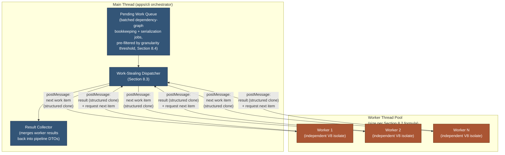

# 001 — Worker Threads

## 1. Title

**Critical CSS Extraction Engine — Worker-Thread Pool Tuning for CPU-Bound Host Work**

## 2. Version

| Field | Value |
|---|---|
| Document Version | 1.0.0 |
| Status | Draft — Phase 14 (Performance) |
| Last Updated | 2026-07-10 |
| Owners | Performance Working Group |
| Stability | Tuning guidance; numeric thresholds (Section 8.4) provisional pending [005-Benchmarks.md](./005-Benchmarks.md) measurement |

## 3. Purpose

[015-Runtime-Model.md](../architecture/015-Runtime-Model.md) Section 8.3 establishes, as architecture, that worker threads are "Axis 1" of this engine's concurrency model: a mechanism for offloading CPU-bound Node host-side work — dependency-graph fixed-point bookkeeping, Serializer canonical-ordering sorts, Minifier compression — from the single-threaded main event loop, without touching the browser-control path at all (Section 8.4's "pattern (b)" default: browser control stays on the main thread; workers handle only post-collection CPU-bound stages). That document deliberately stops at the architectural boundary: it establishes *that* worker threads exist as a legal mechanism and *which* stages are candidates, but not *how many* worker threads to run, *how* to partition work across them, or *when a given piece of work is too small to be worth the hop*. Those are the questions this document answers.

This matters because worker threads are not free parallelism. Every dispatch to a worker thread pays a structured-clone serialization cost to cross into the worker's isolated heap and back (per [015-Runtime-Model.md](../architecture/015-Runtime-Model.md) Section 8.3: "worker threads do **not** share a JS object heap with the main thread"), plus a scheduling/context-switch cost. For genuinely large CPU-bound work — a dependency graph with tens of thousands of nodes, a serializer sort over tens of thousands of rules — that cost is trivially amortized. For small work — a 200-node dependency graph, a handful of rules to sort — the crossing cost can exceed the cost of just doing the work on the main thread, making the "optimization" a net regression. This document gives concrete pool-sizing heuristics, a work-partitioning algorithm with stated complexity, and — critically — an explicit granularity threshold below which offloading to a worker thread should not happen at all, directly addressing the brief's ("worker threads" per `BRIEF.md` Section 2.14) instruction that this is a mandatory but *bounded* optimization, not an unconditional one.

## 4. Audience

- Implementers of `apps/cli`'s orchestrator, who own the code path deciding, per batch, whether and how to dispatch dependency-graph resolution and serialization work to worker threads.
- Implementers of `packages/dependency-graph` and `packages/serializer`, whose stage implementations are the concrete offload candidates this document sizes and partitions.
- Performance engineers validating worker-thread pool configuration against [005-Benchmarks.md](./005-Benchmarks.md)'s throughput curves.
- Senior engineers and autonomous coding agents implementing the pool-sizing and partitioning logic specified here.

Readers are assumed to have read [015-Runtime-Model.md](../architecture/015-Runtime-Model.md) Section 8.3–8.5 and [000-Performance-Overview.md](./000-Performance-Overview.md) in full; this document does not re-derive the Tier 1/Tier 2 process boundary or the three-axis concurrency taxonomy, only tunes Axis 1 within it.

## 5. Prerequisites

- [015-Runtime-Model.md](../architecture/015-Runtime-Model.md) Section 8.3 (three-axis concurrency taxonomy), Section 8.4 (worker-thread route-batch sequence and pattern (a)/(b) discussion), Section 8.5 (memory model), Section 12 (worker-thread crash edge case) — the architectural facts this document tunes against.
- [000-Performance-Overview.md](./000-Performance-Overview.md) Section 7's priority ordering — worker threads are this program's *third* priority, after round-trip reduction and in-page cost reduction, and this document's guidance should be read in that context, not as "maximize worker-thread usage" in isolation.
- [003-Requirements.md](../architecture/003-Requirements.md) REQ-512 ("Route batch processing SHOULD support worker-thread or multi-process parallelism to scale CI throughput linearly with available cores, up to browser-instance resource limits").
- Working familiarity with Node.js `worker_threads`: `Worker`, `postMessage`, structured clone, `SharedArrayBuffer`, and the cost model of each.

## 6. Related Documents

- [../architecture/015-Runtime-Model.md](../architecture/015-Runtime-Model.md) — architectural definition of Axis 1 (worker threads), Axis 2 (route batching), Axis 3 (parallel stylesheet traversal), and the memory model this document's pool sizing must respect
- [000-Performance-Overview.md](./000-Performance-Overview.md) — the Phase 14 program overview and priority ordering this document operates within
- [002-Parallelization-Strategy.md](./002-Parallelization-Strategy.md) — cross-axis parallelization strategy; this document is the deep dive on Axis 1 specifically, that document is the synthesis across all three axes
- [003-Rule-Indexing.md](./003-Rule-Indexing.md) — reduces the *size* of the selector-matching workload before it ever reaches a worker-thread-offload decision; relevant because a smaller workload shifts the granularity threshold (Section 8.4) toward "don't offload"
- [004-Memory-Optimization.md](./004-Memory-Optimization.md) — each worker thread's own heap is a distinct memory pool this document's pool-sizing formula must account for, alongside the browser-pool memory model
- [005-Benchmarks.md](./005-Benchmarks.md) — the benchmark suite that must validate this document's pool-sizing formula and granularity threshold against real hardware and fixtures
- [../architecture/003-Requirements.md](../architecture/003-Requirements.md) — REQ-512

## 7. Overview

Three design questions define the scope of this document, corresponding directly to the task's framing:

1. **Pool sizing** — how many worker threads should the pool contain, as a function of available CPU cores and the fact that a meaningful share of this engine's total wall-clock time is I/O-bound browser wait, not CPU-bound host work (per [000-Performance-Overview.md](./000-Performance-Overview.md) Section 8.1)?
2. **Work partitioning** — given a pool of size `N`, how should a batch of CPU-bound work (dependency-graph resolution across many routes, serialization across many routes) be divided among workers: statically up front, or dynamically as workers finish (work-stealing)?
3. **Granularity threshold** — below what work size does the fixed cost of a worker-thread round trip (structured-clone serialization in, result serialization out, scheduling latency) exceed the cost of just doing the work synchronously on the main thread, making offload actively harmful?

The remainder of this document develops each in turn, closing with concrete pseudocode for partitioning and a worker-pool architecture diagram.

## 8. Detailed Design

### 8.1 What Should Never Be Offloaded

It is easiest to start with the negative case, since it is the one most often gotten wrong in practice. Per [015-Runtime-Model.md](../architecture/015-Runtime-Model.md) Section 8.6 and Section 9.1's pipeline-stage table, the following are **not** worker-thread candidates, and should not become so under future refactors without a specific, benchmarked justification:

- **Anything that needs the live Playwright `Page`/`BrowserContext` object.** Per [015-Runtime-Model.md](../architecture/015-Runtime-Model.md) Section 8.4, Playwright client objects are not shareable across `worker_threads` boundaries; navigation, `page.evaluate()` calls, and CDP session management stay on the main thread by design (pattern (b)), not as a worker-thread limitation to be worked around, but as this engine's deliberate default architecture.
- **Plugin hook execution.** Per Section 8.6 of that document, plugins run in-process on the thread orchestrating the current route specifically so they have direct, zero-copy access to already-in-memory pipeline DTOs; moving plugin execution to a worker thread would reintroduce a structured-clone cost for every hook invocation, for no compensating parallelism benefit (plugin code is typically small and I/O-bound itself, per Section 12's edge case on async plugin work).
- **Cache fingerprint lookups.** These are fast, synchronous hash-table operations on the main thread's already-resident cache index (per [015-Runtime-Model.md](../architecture/015-Runtime-Model.md) Section 8.5); the fixed cost of a worker-thread round trip is orders of magnitude larger than the lookup itself.
- **Small per-route dependency graphs or small serialization batches** — quantified concretely in Section 8.4 below. This is the case this document exists specifically to make precise, because "small" is not self-evident without a stated threshold.

### 8.2 Pool Sizing Heuristic

The naive heuristic for a CPU-bound worker pool is `poolSize = os.cpus().length - 1` (reserve one core for the main thread/event loop). This is the correct heuristic for a workload that is *purely* CPU-bound end to end. This engine's workload is not: per [000-Performance-Overview.md](./000-Performance-Overview.md) Section 8.1, most wall-clock time in a route's lifecycle is spent waiting on browser navigation and round trips, not computing on the Node host. This has a direct, counter-intuitive consequence for pool sizing.

**The corrected heuristic** treats worker-thread pool size as a function of two independent inputs, not one:

```text
workerThreadCount = clamp(
    ceil(cpuCoreCount * hostCpuBoundFraction),
    minWorkers,
    maxWorkers
)
```

where:

- `cpuCoreCount` is `os.cpus().length`, the host's available logical cores.
- `hostCpuBoundFraction` is the empirically measured fraction of total run time attributable to Tier-1 CPU-bound stages (dependency-graph bookkeeping + serialization), per [000-Performance-Overview.md](./000-Performance-Overview.md) Section 8.1's cost-center table — typically small (illustratively 5–15% of a single route's wall clock) but the relevant multiplier here, because there is little value in reserving cores for CPU-bound work that is a minority of total system load. A `hostCpuBoundFraction` near 1.0 (e.g., a batch run of already-cached routes where the only remaining work is re-serialization) pushes this formula back toward the naive `cpuCoreCount - 1` heuristic — correctly, since in that regime the workload genuinely is CPU-bound end to end.
- `minWorkers` (a floor, typically 1–2) ensures a batch of any nontrivial size gets *some* parallelism rather than none, even on a `hostCpuBoundFraction` estimate that rounds down to zero.
- `maxWorkers` (a ceiling, typically `cpuCoreCount - 1`, reserving at least one core for the main thread's event loop and the OS/browser processes it also has to schedule against) prevents oversubscription — running more worker threads than physical cores does not add throughput for CPU-bound work, it only adds scheduling contention and, per Section 8.5's memory note below, additional per-worker heap overhead for no compensating benefit.

This formula's key property, and the reason it differs from a generic Node.js worker-pool tuning guide, is that it explicitly discounts by how CPU-bound this *specific* engine's workload actually is, rather than assuming a fully CPU-bound workload as most generic guidance does. A CI runner with 8 cores and a `hostCpuBoundFraction` of 0.1 should provision roughly 1 worker thread, not 7 — provisioning 7 would leave 6 threads mostly idle, each still paying a small fixed memory cost (Section 8.5) for no throughput gain.

### 8.3 Static Partitioning vs. Work-Stealing

Given a pool of `N` worker threads and a batch of `M` independent work items (e.g., `M` routes' dependency graphs awaiting resolution-bookkeeping, or `M` routes' rule sets awaiting serialization), two partitioning strategies are available:

**Static partitioning.** Divide the `M` items into `N` contiguous chunks up front (`ceil(M/N)` items per worker) and dispatch each chunk once. This is simple, requires exactly `N` `postMessage` calls total, and is the natural first implementation.

**Work-stealing (dynamic partitioning).** Dispatch items to workers one at a time (or in small sub-batches), and refill a worker with its next item as soon as it reports completion, rather than assigning a fixed chunk up front — directly analogous to [015-Runtime-Model.md](../architecture/015-Runtime-Model.md) Section 10.1's "refill on completion" route-scheduling algorithm, applied to worker-thread dispatch instead of browser-page acquisition.

The choice between them hinges on **variance in per-item cost**. If every item costs roughly the same (e.g., serialization batches of similar rule-set size), static partitioning achieves near-optimal load balance with minimal message-passing overhead (`O(N)` messages instead of `O(M)`). If per-item cost varies substantially — which is the realistic case for dependency-graph resolution, where routes differ widely in stylesheet complexity and discovery-loop iteration count (per [014-Dependency-Graph.md](../architecture/014-Dependency-Graph.md) Section 10.1) — static partitioning risks the same pathology [015-Runtime-Model.md](../architecture/015-Runtime-Model.md) Section 10.1 calls out for naive fixed-batch route scheduling: one slow item in a worker's static chunk stalls that worker for the remainder of the batch while other workers idle, producing a `max` rather than `average` bound on completion time. Work-stealing avoids this at the cost of `O(M)` messages instead of `O(N)`, which is the correct tradeoff whenever `M`'s per-item cost variance is high enough that load-balance losses would exceed the added messaging overhead — true for essentially all of this engine's batch workloads at realistic scale (tens to thousands of routes), which is why Section 10 below specifies work-stealing as this document's recommended default, not static partitioning.

### 8.4 Granularity Threshold — When Not to Offload

The fixed cost of a single worker-thread round trip (`postMessage` out, structured-clone serialize, worker-side deserialize, worker computes, structured-clone serialize result, main-thread deserialize) is dominated by serialization cost proportional to payload size plus a roughly constant scheduling/context-switch overhead. Empirically (to be confirmed by [005-Benchmarks.md](./005-Benchmarks.md), but consistent with widely-documented Node.js `worker_threads` overhead figures), this fixed overhead is on the order of **low single-digit milliseconds** for small-to-moderate payloads. This yields a concrete, actionable rule:

> **Do not dispatch a unit of work to a worker thread unless its expected synchronous execution time is at least one order of magnitude larger than the round-trip overhead** — concretely, if the round-trip overhead is ~2ms, do not offload work items expected to take less than ~20ms synchronously. Below that ratio, the parallelism gain (if any workers are otherwise idle) is dominated by the crossing cost, and the "optimization" measurably slows down that item's total (dispatch + execute + return) latency versus just running it inline.

Applied concretely to this engine's two named offload candidates:

- **Dependency-graph resolution bookkeeping.** A small route (a landing page with a handful of stylesheets, per [014-Dependency-Graph.md](../architecture/014-Dependency-Graph.md)'s typical case) may resolve its fixed-point loop bookkeeping in well under a millisecond of pure Tier-1 CPU time — far below the threshold. Only routes whose dependency graph is large (many `Variable`/custom-property chains, deep `@import` nesting) cross the threshold. The practical implementation consequence: **batch multiple routes' bookkeeping into a single worker dispatch** rather than dispatching per-route, so the aggregate work crossing into the worker is comfortably above threshold even when individual routes are not (Section 10's pseudocode reflects this).
- **Serialization/minification.** A small rule set (dozens of rules, a typical single-viewport critical CSS extraction) is well below threshold; a large rule set (an enterprise page's merged multi-viewport critical CSS, potentially thousands of rules, per the "huge enterprise stylesheets" fixture category in `BRIEF.md` Section 2.15) is comfortably above it, given the `O(n log n)` canonical sort's cost scaling with rule count. The same batching mitigation applies for small routes.

This threshold is the single most important number in this document, because it is the concrete answer to the task's requirement to specify "what should NOT be offloaded" — not a qualitative list alone, but a quantitative ratio any implementer can check a proposed offload against.

### 8.5 Memory Cost Per Worker

Each worker thread is a full, independent V8 isolate (per [015-Runtime-Model.md](../architecture/015-Runtime-Model.md) Section 8.3), which carries a non-trivial fixed memory cost (isolate setup, its own copy of loaded modules, its own small heap) independent of how much work it is actually doing — commonly tens of megabytes per idle worker in a typical Node.js application, though this engine's own actual figure should be measured, not assumed (per [005-Benchmarks.md](./005-Benchmarks.md)). This is the reason Section 8.2's `maxWorkers` ceiling matters even when CPU core count alone would suggest a larger pool: an oversized idle pool is a pure memory cost with no offsetting benefit, and it directly competes with the browser-pool's own memory budget (Section 8.5 of [015-Runtime-Model.md](../architecture/015-Runtime-Model.md)) on the same host. [004-Memory-Optimization.md](./004-Memory-Optimization.md) treats this interaction — worker-pool memory vs. browser-pool memory, both drawing from the same host RAM budget — in more depth; this document's contribution is flagging that the worker-pool side of that budget is not free just because worker threads are "cheaper" than full OS processes.

## 9. Architecture



This diagram is the Axis-1-only zoom of [015-Runtime-Model.md](../architecture/015-Runtime-Model.md) Section 9.2's canonical nesting diagram: the Browser Pool and renderer processes from that diagram are deliberately omitted here, because (per Section 8.1 above) they are out of scope for worker-thread dispatch under pattern (b) — this pool exists solely to process already-collected, already-in-Tier-1-memory data.

## 10. Algorithms

### 10.1 Algorithm: Threshold-Filtered Work-Stealing Partition

**Problem statement.** Given a batch of `M` CPU-bound work items (each a route's dependency-graph bookkeeping job or serialization job) with heterogeneous expected cost, and a pool of `N` worker threads, partition and dispatch work such that: (a) items below the granularity threshold (Section 8.4) are coalesced into worker-sized batches rather than dispatched individually; (b) load is balanced via work-stealing rather than static chunking, per Section 8.3's variance argument; (c) pool utilization is kept saturated (no idle worker while unassigned work remains), mirroring the refill discipline of [015-Runtime-Model.md](../architecture/015-Runtime-Model.md) Section 10.1's route scheduler.

**Inputs.** `items: WorkItem[]` (each with an `estimatedCost` field, e.g., dependency-graph node count or rule count, used as a cheap proxy for execution time); `N: number` (worker pool size, per Section 8.2); `threshold: number` (the minimum batched cost worth a worker-thread round trip, per Section 8.4).

**Outputs.** `results: Map<WorkItem, Result>`.

**Pseudocode.**

```text
function scheduleWorkerBatch(items, N, threshold) -> Map<WorkItem, Result>:
    // Step 1: coalesce small items into threshold-sized micro-batches,
    // so no dispatched unit falls below the granularity floor (Section 8.4).
    sorted = items.sortDescendingBy(item => item.estimatedCost)
    microBatches = []
    current = []
    currentCost = 0
    for item in sorted:
        current.push(item)
        currentCost += item.estimatedCost
        if currentCost >= threshold:
            microBatches.push(current)
            current = []
            currentCost = 0
    if current.length > 0:
        microBatches.push(current)   // trailing partial batch, dispatched anyway
                                       // (still cheaper than N separate tiny dispatches)

    // Step 2: work-stealing dispatch across N workers (Section 8.3).
    queue = microBatches               // FIFO; largest micro-batches first improves
                                        // tail latency, same rationale as classic
                                        // longest-processing-time-first scheduling
    results = new Map()
    inFlight = new Set()

    function launchNext(worker):
        if queue.isEmpty():
            return
        batch = queue.shift()
        promise = worker.postMessageAndAwait(batch)
            .then(batchResults => {
                for (item, result) in zip(batch, batchResults):
                    results.set(item, result)
                inFlight.delete(promise)
                launchNext(worker)      // refill this worker immediately
            })
        inFlight.add(promise)

    for worker in workerPool(N):
        launchNext(worker)

    await allSettled(inFlight)
    return results
```

**Time complexity.** `O(M log M)` for the initial cost-descending sort, `O(M)` for micro-batch coalescing, and `O(M/N)` dispatch rounds per worker under balanced work-stealing — the same asymptotic shape as [015-Runtime-Model.md](../architecture/015-Runtime-Model.md) Section 10.1's route scheduler, applied one level down at the worker-thread granularity. Wall-clock time is bounded, under ideal saturation, by `ceil(totalCost / N) `+ per-dispatch overhead × (number of micro-batches / N)`, which is materially better than a naive per-item dispatch's `M × fixedOverhead + totalCost` when `M` is large and per-item cost is small (the exact regime Section 8.4 identifies as otherwise harmful).

**Memory complexity.** `O(M)` for the item list and micro-batch structure (lightweight metadata, not full payloads, mirroring the queue-memory argument in [015-Runtime-Model.md](../architecture/015-Runtime-Model.md) Section 10.1) plus `O(N × avgBatchPayloadSize)` transiently in flight (only currently-dispatched batches' full payloads are resident in both main-thread and worker-thread memory at once).

**Failure cases.** A worker thread crashing mid-batch (per [015-Runtime-Model.md](../architecture/015-Runtime-Model.md) Section 12's edge case) loses that batch's in-flight items; because dependency-graph bookkeeping and serialization are both pure, idempotent functions of their inputs (per that same edge case), the failed batch's items should be re-queued to a healthy worker rather than assumed lost, which this pseudocode's `catch`/re-queue path (elided above for brevity, but required in the real implementation) must handle explicitly. A pathologically inaccurate `estimatedCost` proxy (e.g., node count correlating poorly with actual bookkeeping time for a specific graph shape) degrades load balance but does not break correctness — it is a tuning quality issue, not a liveness or safety one.

**Optimization opportunities.** Replace the static `estimatedCost` proxy with an adaptively learned cost model (e.g., exponentially-weighted moving average of actual measured time per unit of `estimatedCost`, updated across a run) once [005-Benchmarks.md](./005-Benchmarks.md) shows the static proxy's prediction error is large enough to matter; this is a natural refinement, not required for correctness, and is listed in Future Work.

## 11. Implementation Notes

- The `threshold` parameter (Section 8.4) should be a measured constant derived from this engine's own actual `postMessage`/structured-clone round-trip cost on representative CI hardware, not an assumed generic Node.js figure — [005-Benchmarks.md](./005-Benchmarks.md) should include a dedicated micro-benchmark isolating exactly this cost (an empty/trivial worker round trip, repeated many times, measuring p50/p99 latency) so this document's threshold can cite a real, versioned number rather than an illustrative one.
- `workerThreadCount` (Section 8.2) and `poolConcurrency`/`maxBrowserConcurrency` (the browser-pool sizing knob from [015-Runtime-Model.md](../architecture/015-Runtime-Model.md) Section 11) must remain **two independent configuration knobs**, per that document's explicit instruction — an implementer must not derive one from the other via some combined "concurrency" setting, because they bound genuinely different resources (CPU cores vs. Tier-2 renderer memory).
- `WorkItem.estimatedCost` should be populated from data already available cheaply at dispatch time (dependency-graph node/edge count already computed during graph construction; rule count already known from the CSSOM walk) rather than requiring a separate estimation pass — the goal is a free-to-compute proxy, not a new cost center of its own.
- The worker pool should be a long-lived singleton per CLI invocation (constructed once, reused across the whole route manifest), not re-constructed per batch or per route — worker construction itself carries the isolate-setup cost noted in Section 8.5, and repeated construction/teardown would reintroduce exactly the fixed overhead this document is trying to amortize away.
- Structured-clone payloads crossing into and out of workers must be plain data DTOs with no live handles (Playwright `Page`, open file descriptors, etc.) embedded, per [015-Runtime-Model.md](../architecture/015-Runtime-Model.md) Section 12's edge case — this is enforced by construction if dependency-graph and serialization DTOs already conform to [016-Data-Flow.md](../architecture/016-Data-Flow.md)'s plain-data shapes, which they should, independent of this document.

## 12. Edge Cases

- **A host with only 1–2 CPU cores (a constrained CI container).** Section 8.2's formula, applied honestly, may compute `workerThreadCount = 0` or `1` — this is the *correct* output, not a degenerate failure: on a 1-core host, there is no CPU parallelism available at all, and the orchestrator must fall back to running CPU-bound work synchronously on the main thread rather than attempting to spin up a pool that cannot actually run concurrently with the main thread's own event loop.
- **A batch where every item is below the granularity threshold even after coalescing** (Section 10.1's trailing partial batch case) — the algorithm still dispatches it (a partial batch is still cheaper than per-item dispatch), but if the *entire* batch across all routes is below threshold even fully coalesced (a run of only a handful of very small routes), the orchestrator should skip worker dispatch entirely and run the batch synchronously on the main thread — a degenerate case Section 10.1's pseudocode should special-case explicitly (`if totalCost < threshold: run inline`).
- **Extreme cost-estimate skew** (one route's dependency graph is 100x larger than all others combined). Longest-processing-time-first ordering (Section 10.1's descending sort) mitigates but does not eliminate tail latency from this case — the single huge item still occupies one worker for the majority of the batch's wall-clock time regardless of ordering; this is a fundamental limit of work-stealing over indivisible items, not a bug, and the only further mitigation (splitting one route's own dependency-graph bookkeeping into sub-parallel chunks) is flagged in Future Work as a deeper refinement.
- **Worker-thread pool exhaustion of the host's memory budget alongside a concurrently-large browser pool** (Section 8.5's cross-reference to [004-Memory-Optimization.md](./004-Memory-Optimization.md)) — on a memory-constrained host, an implementer sizing `workerThreadCount` purely from Section 8.2's CPU-based formula without checking available RAM against the browser pool's own concurrent memory footprint risks host-level memory pressure; this document's formula is necessary but not sufficient for full host capacity planning, which [000-Performance-Overview.md](./000-Performance-Overview.md) Section 10.1's aggregate cost estimator is meant to catch holistically.
- **`SharedArrayBuffer` future use** (Future Work, also flagged in [015-Runtime-Model.md](../architecture/015-Runtime-Model.md) Section 16) would change this document's message-passing overhead assumptions materially for any hot path it is applied to — this document's cost model (Section 8.4) is specifically for the current, structured-clone-based message-passing design, and would need revision if/when a `SharedArrayBuffer`-backed fast path is adopted for a specific data structure.

## 13. Tradeoffs

| Decision | Why | Alternative Considered | Tradeoff Accepted |
|---|---|---|---|
| Discount pool size by measured `hostCpuBoundFraction` (Section 8.2) rather than using the generic `cores - 1` heuristic | Matches this engine's actual workload shape (browser-wait-dominated, per [000-Performance-Overview.md](./000-Performance-Overview.md) Section 8.1), avoiding an oversized, mostly-idle pool | Generic `cores - 1` sizing, simpler to state and implement | Requires measuring `hostCpuBoundFraction` empirically (Section 11) rather than picking a number from generic Node.js guidance; a wrong estimate under- or over-sizes the pool until corrected |
| Work-stealing dispatch (Section 8.3) as the default, not static partitioning | Avoids the "one slow item stalls a whole worker's static chunk" pathology under this engine's realistic high-variance per-item costs | Static up-front chunking, fewer messages (`O(N)` vs `O(M)`) | More `postMessage` calls (`O(M)`, though mitigated by Section 10.1's coalescing into micro-batches), in exchange for materially better load balance under variance |
| An explicit, quantified granularity threshold (Section 8.4) rather than a qualitative "use judgment" guideline | Gives implementers and code reviewers a concrete, checkable rule, directly satisfying the task's requirement to specify what should *not* be offloaded | Leave the decision to per-call-site judgment | The threshold constant must be kept current via benchmark data (Section 11); a stale threshold (measured on different hardware) could mislead until re-measured |
| Coalesce small work items into threshold-sized micro-batches (Section 10.1) rather than either dispatching every item individually or refusing to offload small items at all | Recovers parallelism benefit for a batch of many small items (common case: many small routes) without violating the per-dispatch granularity floor | Dispatch every item individually regardless of size (violates Section 8.4); or never offload anything below threshold, even in aggregate (leaves parallelism on the table for large batches of small items) | Slightly more bookkeeping complexity (the sort-and-coalesce step) in exchange for correctly handling the realistic "many small items" case, not just the "few large items" case |

## 14. Performance

- **CPU complexity.** `O(M log M)` for Section 10.1's coalescing sort, `O(totalCost / N)` for balanced parallel execution under work-stealing, consistent with Section 10.1's stated bound; this is strictly better than the naive `O(M × fixedOverhead + totalCost)` bound a per-item-dispatch approach would incur when `M` is large relative to `N` and per-item cost is small (Section 8.4's exact concern).
- **Memory complexity.** `O(N × isolateBaseCost)` fixed overhead for the pool itself (Section 8.5) plus `O(N × avgBatchPayloadSize)` transient in-flight payload memory; this is additive to, and must be planned alongside, the browser pool's own Tier-2 memory footprint (per [015-Runtime-Model.md](../architecture/015-Runtime-Model.md) Section 8.5 and [004-Memory-Optimization.md](./004-Memory-Optimization.md)).
- **Caching strategy.** Not directly applicable to this document's scope — worker-thread dispatch operates on already-cache-miss-path data; a cache hit (per [015-Runtime-Model.md](../architecture/015-Runtime-Model.md) Section 9.1) bypasses this entire mechanism by short-circuiting before dependency-graph construction or serialization ever run.
- **Parallelization opportunities.** This document *is* the parallelization-opportunity treatment for Axis 1; the remaining opportunity beyond what Section 10.1 specifies is sub-item parallelism (splitting one very large route's own bookkeeping across multiple workers, per Section 12's extreme-skew edge case), flagged in Future Work rather than specified here.
- **Incremental execution.** Orthogonal to this document; incrementality is a Cache Manager property (per [015-Runtime-Model.md](../architecture/015-Runtime-Model.md) Section 14) that determines *whether* a route's work ever reaches this document's dispatcher at all, not something this document's worker-pool mechanism itself provides.
- **Profiling guidance.** Profile actual worker-thread utilization (percent of wall-clock time each worker spends executing vs. idle waiting for the next dispatch) using Node's `worker_threads`-aware profiling tools or simple instrumentation counters per worker; persistently low utilization across all workers is a signal that `workerThreadCount` (Section 8.2) is oversized for the actual `hostCpuBoundFraction`, while persistently saturated workers with a growing queue backlog signal it is undersized.
- **Scalability limits.** Bounded by `cpuCoreCount` (Section 8.2's `maxWorkers` ceiling) and by available host memory shared with the browser pool (Section 8.5); beyond a single host's core count, further worker-thread scaling has no benefit, and the correct further lever is [015-Runtime-Model.md](../architecture/015-Runtime-Model.md) Section 16's proposed distributed, multi-host execution model, out of this document's scope.

## 15. Testing

- **Unit tests.** Section 10.1's `scheduleWorkerBatch` should be unit-tested with a mock worker pool (no real `worker_threads`), verifying: micro-batch coalescing correctly groups items until the threshold is met; work-stealing refill keeps all mock workers busy until the queue is exhausted; results map back to the correct original `WorkItem` keys; a below-threshold total batch triggers the inline-execution fallback (Section 12's edge case).
- **Integration tests.** Real `worker_threads`-based tests should verify actual structured-clone round-trip behavior for representative dependency-graph and serialization DTOs (per [016-Data-Flow.md](../architecture/016-Data-Flow.md) shapes), a worker crash mid-batch triggering correct re-queue (Section 11's failure-case handling), and pool construction/teardown lifecycle correctness across a full CLI invocation.
- **Visual tests.** Not applicable to this document's scope.
- **Stress tests.** A dedicated stress test sweeping `M` (batch size) from small to very large (thousands of routes' worth of dependency-graph/serialization jobs) at a fixed `N`, verifying wall-clock time scales sub-linearly with `M` (approaching the `O(totalCost/N)` bound) rather than linearly (which would indicate the pool is not actually parallelizing effectively, e.g., due to a scheduling bug serializing dispatch).
- **Regression tests.** Any measured incident of worker-thread offload making a specific workload *slower* than the synchronous baseline (a granularity-threshold miscalibration in practice) should produce a permanent regression test pinning that workload's shape (item count, size distribution) against both the offloaded and inline code paths, to prevent the threshold from silently drifting back into harmful territory.
- **Benchmark tests.** [005-Benchmarks.md](./005-Benchmarks.md) should include: (a) a micro-benchmark isolating raw `postMessage`/structured-clone round-trip cost (feeds Section 8.4's threshold constant); (b) a pool-sizing sweep measuring throughput vs. `workerThreadCount` at fixed `hostCpuBoundFraction`, to validate Section 8.2's formula; (c) a work-stealing-vs-static-partitioning head-to-head under realistic per-item cost variance, to validate Section 8.3's recommendation empirically rather than by argument alone.

## 16. Future Work

- **Adaptive cost-model learning** (Section 10.1's "Optimization opportunities") — replace the static `estimatedCost` proxy with a runtime-learned model once benchmark data shows meaningful prediction error, improving load balance further without requiring a priori knowledge of per-route dependency-graph complexity.
- **Sub-item parallelism for extreme-skew routes** (Section 12's edge case) — investigate splitting a single very large route's dependency-graph bookkeeping or serialization work across multiple workers, rather than treating each route as an indivisible unit; this would require the underlying algorithms in `packages/dependency-graph`/`packages/serializer` to expose a partition-friendly internal structure, which they do not currently guarantee.
- **`SharedArrayBuffer`-backed fast paths** for specific hot, read-mostly data structures (e.g., a shared rule index, per [015-Runtime-Model.md](../architecture/015-Runtime-Model.md) Section 16 and [003-Rule-Indexing.md](./003-Rule-Indexing.md)) once profiling identifies structured-clone serialization cost, rather than actual computation, as the dominant cost of a specific offloaded workload.
- **Reconsider pattern (a)** (per-worker-thread independent browser connections, [015-Runtime-Model.md](../architecture/015-Runtime-Model.md) Section 8.4) once benchmark data shows Axis 2 (main-thread route-batching event-loop capacity) rather than Axis 1's CPU-bound tail is the binding throughput constraint — this document's pool sizing would need a fundamentally different model if that architectural shift is ever adopted, since worker threads would then also be brokering browser I/O, not just CPU-bound work.
- **Open question: should `workerThreadCount` and `hostCpuBoundFraction` be auto-measured at CLI startup** (a brief self-calibration pass against a synthetic workload) rather than requiring manual configuration or a hardcoded default — this would make Section 8.2's formula self-tuning per host, at the cost of a small fixed startup-time overhead and additional run-to-run timing nondeterminism, echoing the same open question raised in [000-Performance-Overview.md](./000-Performance-Overview.md) Section 16.
- **Open question: is a persistent, cross-invocation worker pool (e.g., a long-lived CLI daemon) worth the added operational complexity** to fully amortize isolate-startup cost (Section 8.5) across many separate CI invocations, rather than paying it once per invocation — plausible for high-frequency CI usage patterns, but out of scope for the current per-invocation CLI process model and not evaluated here.

## 17. References

- [../architecture/015-Runtime-Model.md](../architecture/015-Runtime-Model.md) — Sections 8.3, 8.4, 8.5, 8.6, 9.2, 10.1, 12, 16
- [../architecture/003-Requirements.md](../architecture/003-Requirements.md) — REQ-512
- [../architecture/014-Dependency-Graph.md](../architecture/014-Dependency-Graph.md) — Section 10.1
- [../architecture/016-Data-Flow.md](../architecture/016-Data-Flow.md) — DTO shapes crossing the worker-thread boundary
- [000-Performance-Overview.md](./000-Performance-Overview.md) — Phase 14 program overview and priority ordering
- [002-Parallelization-Strategy.md](./002-Parallelization-Strategy.md) (forthcoming, this Phase)
- [003-Rule-Indexing.md](./003-Rule-Indexing.md) (forthcoming, this Phase)
- [004-Memory-Optimization.md](./004-Memory-Optimization.md) (forthcoming, this Phase)
- [005-Benchmarks.md](./005-Benchmarks.md) (forthcoming, this Phase)
- Node.js `worker_threads` documentation — https://nodejs.org/api/worker_threads.html
- Node.js structured clone algorithm documentation — https://nodejs.org/api/worker_threads.html#portpostmessagevalue-transferlist
- Classic longest-processing-time-first scheduling literature (Graham, 1969) — background for Section 10.1's descending-cost ordering heuristic
