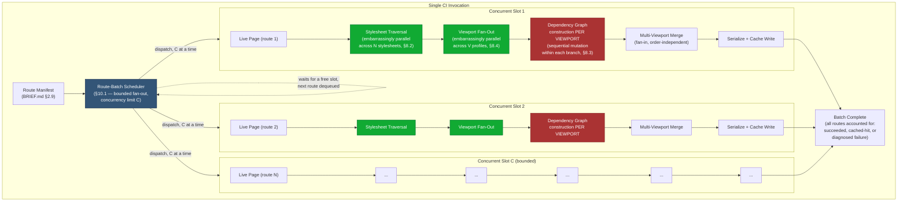

# 002 — Parallelization Strategy

## 1. Title

**Cross-Cutting Parallelization Strategy for the Critical CSS Extraction Engine**

## 2. Version

| Field | Value |
|---|---|
| Document Version | 1.0.0 |
| Status | Draft — Phase 14 (Performance) |
| Last Updated | 2026-07-10 |
| Owners | Performance Working Group |
| Stability | Cross-cutting; describes scheduling and concurrency policy layered over the data shapes and algorithms fixed by Phases 1–7 (Architecture, Design, Algorithms). Changes here must not alter any correctness-bearing invariant established elsewhere. |

## 3. Purpose

Every prior phase of this documentation tree describes one stage of the pipeline in isolation: how a single stylesheet is walked ([300-CSSOM-Walker.md](../design/300-CSSOM-Walker.md)), how one viewport's visibility is computed ([200-Visibility-Engine-Overview.md](../design/200-Visibility-Engine-Overview.md)), how one route's dependency graph is built ([507-Dependency-Graph-Construction.md](../algorithms/507-Dependency-Graph-Construction.md)). None of those documents is the right place to answer a question that only makes sense at the level of an entire CI run: **given N routes, each with M viewport profiles, each with some number of independently-parseable stylesheets, what can safely execute concurrently, on what kind of concurrency primitive (worker thread vs. browser context vs. simple async interleaving), and what must remain strictly sequential no matter how much hardware is thrown at it?**

This document answers that question. It is deliberately narrow in a specific sense: it does not re-derive any stage's internal algorithm (those are owned by their respective Phase 6/7 documents) and it does not re-litigate any correctness invariant (Principle 5, determinism, applies unchanged everywhere parallelism is introduced — parallel execution must be provably order-independent in its *output*, even where it is not order-independent in its *scheduling*). What it does is assemble, in one place, a **decision framework**: given a candidate unit of work in the pipeline, is it (a) embarrassingly parallel, (b) parallel-with-bounded-fan-out, or (c) inherently sequential — and why. It then applies that framework at three concrete granularities that recur throughout the Engine: parallel stylesheet traversal within a single page, parallel viewport branch execution within a single route, and parallel route batching within a single CI invocation.

This document is the single cross-cutting reference that [001-Worker-Threads.md](./001-Worker-Threads.md) (the concrete worker-thread implementation), [004-Memory-Optimization.md](./004-Memory-Optimization.md) (the memory-cost consequence of holding multiple concurrent branches live), and [005-Benchmarks.md](./005-Benchmarks.md) (the empirical validation of the claims made here) all depend on. [000-Performance-Overview.md](./000-Performance-Overview.md) is this phase's charter document and names this document as the parallelization pillar of Phase 14's four-pillar structure (rule indexing, parallelization, worker threads, memory).

## 4. Audience

- Implementers of `apps/cli`'s orchestration layer, who own the route-batch scheduler this document specifies.
- Implementers of `packages/collector` and `packages/matcher`, who need to know which of their internal operations (stylesheet traversal, per-node matching) are safe to parallelize without coordinating with this document's author, and which require explicit synchronization.
- Implementers of `packages/dependency-graph`, who need to understand precisely why their single-writer discipline ([507-Dependency-Graph-Construction.md](../algorithms/507-Dependency-Graph-Construction.md) Section 8.5/11) is a hard boundary this document does not attempt to relax.
- Performance engineers sizing CI runner concurrency (thread count, browser context count) against realistic route-batch sizes.
- Senior engineers reviewing whether a proposed future optimization is safe to parallelize, using the decision framework in Section 8.1 as a checklist.

Readers should already be familiar with [016-Data-Flow.md](../architecture/016-Data-Flow.md) (the data-shape contract this document's parallelism claims are grounded in — every parallelization opportunity claimed here is a direct consequence of a "no shared mutable state" property already established there), [015-Runtime-Model.md](../architecture/015-Runtime-Model.md) (the process/thread/browser-context runtime model this document schedules work onto), and [507-Dependency-Graph-Construction.md](../algorithms/507-Dependency-Graph-Construction.md) (the canonical example of a stage that is *not* parallelizable at its core, used throughout this document as the counterpoint to embarrassingly-parallel stages).

## 5. Prerequisites

- [016-Data-Flow.md](../architecture/016-Data-Flow.md), especially Section 9 (the fan-out/fan-in diagrams this document extends) and Section 13 (Tradeoffs, particularly the "DOM Snapshot as plain serializable records" decision, which is the structural precondition for cross-thread parallelism at all).
- [015-Runtime-Model.md](../architecture/015-Runtime-Model.md), for the process/thread/browser-context boundaries this document schedules onto.
- [006-Design-Principles.md](../architecture/006-Design-Principles.md), Principle 5 (Determinism) — the invariant every parallelization decision in this document must preserve — and Principle 3 (Correctness Over Premature Optimization).
- [507-Dependency-Graph-Construction.md](../algorithms/507-Dependency-Graph-Construction.md) Section 8.5 and Section 11, the specific single-writer discipline this document treats as the canonical non-parallelizable case.
- [401-Selector-Memoization.md](../design/401-Selector-Memoization.md) Performance section, which already flags per-node candidate lookup and shape-signature computation as independently parallelizable across nodes — this document generalizes that observation to the rest of the pipeline rather than restating it.
- Familiarity with fork-join / fan-out-fan-in scheduling models and basic queueing theory (for the route-batch scheduler in Section 10).

## 6. Related Documents

- [016-Data-Flow.md](../architecture/016-Data-Flow.md) — the data-shape contract (Section 9.2's fan-out/fan-in diagram) this document's viewport-parallelism section directly extends.
- [507-Dependency-Graph-Construction.md](../algorithms/507-Dependency-Graph-Construction.md) — the canonical single-writer, non-parallelizable stage this document contrasts against embarrassingly-parallel stages.
- [401-Selector-Memoization.md](../design/401-Selector-Memoization.md) — per-node parallelism opportunity within the matching pass, referenced but not re-derived.
- [000-Performance-Overview.md](./000-Performance-Overview.md) — Phase 14 charter; names this document as the parallelization pillar.
- [001-Worker-Threads.md](./001-Worker-Threads.md) — the concrete worker-thread pool implementation this document's scheduling decisions are realized on top of.
- [003-Rule-Indexing.md](./003-Rule-Indexing.md) — a sibling Phase 14 document; rule-index construction is itself one of the embarrassingly-parallel units of work this document classifies (Section 9.1).
- [004-Memory-Optimization.md](./004-Memory-Optimization.md) — the memory-cost consequence of choosing wider parallelism (more concurrently-live branches) over narrower, sequential execution; this document's Section 13 tradeoffs table is the direct input to that document's sizing model.
- [005-Benchmarks.md](./005-Benchmarks.md) — the empirical validation harness for every complexity/throughput claim made in this document's Algorithms and Performance sections.
- [015-Runtime-Model.md](../architecture/015-Runtime-Model.md) — process/thread/browser-context boundaries.
- [006-Design-Principles.md](../architecture/006-Design-Principles.md) — Principle 5 (Determinism), Principle 3 (Correctness Over Premature Optimization).
- BRIEF.md Section 2.14 (Performance Optimizations) — the authoritative source naming "parallel stylesheet traversal," "worker threads," and "route batching" as in-scope optimizations this document operationalizes.

## 7. Overview

Parallelism in this Engine is not a single mechanism applied uniformly; it is a **layered set of independent decisions**, each scoped to a different granularity of work, each justified by a different structural property of the data it operates on. Three granularities recur across the pipeline and are the organizing structure of this document:

1. **Intra-page, intra-stage parallelism** — within a single (route, viewport) unit of work, can two pieces of the *same* stage's work proceed concurrently? The canonical example is parallel stylesheet traversal: [300-CSSOM-Walker.md](../design/300-CSSOM-Walker.md)'s traversal of `document.styleSheets[0]` does not depend on, and cannot be depended upon by, the traversal of `document.styleSheets[1]` — each `StylesheetRecord` (per [016-Data-Flow.md](../architecture/016-Data-Flow.md) Section 8.4) is an independent unit of read-only browser state.
2. **Cross-branch, intra-route parallelism** — within a single route, can the independent viewport branches ([016-Data-Flow.md](../architecture/016-Data-Flow.md) Section 9.2's Mobile/Tablet/Desktop fan-out) proceed concurrently? This is the largest, most structurally clean parallelism surface in the Engine, because [016-Data-Flow.md](../architecture/016-Data-Flow.md) Section 9.2 already establishes, as a data-flow property, that no viewport branch reads or mutates another's intermediate state.
3. **Cross-route, batch-level parallelism** — across an entire CI invocation processing potentially thousands of routes (per BRIEF.md Section 2.9's Route Manifest), how many routes execute concurrently, and how is that concurrency bounded against finite CI runner resources (CPU cores, memory, browser context limits)? This is where a **scheduler** is required, as opposed to the first two granularities, which are structural properties that simply *permit* concurrency without needing an explicit scheduling policy beyond "run them all at once, bounded by available threads."

Underlying all three is a single organizing question this document answers concretely in Section 8.1: **what makes a unit of work safe to parallelize, and what makes it unsafe?** The answer is not "IO-bound work is parallelizable, CPU-bound work is not" (a common but insufficiently precise heuristic for this domain) — it is specifically about **shared mutable state and ordering dependence**. A unit of work is parallelizable exactly when it reads only from immutable or branch-local inputs and writes only to branch-local outputs, per the "overlay, not mutation" and "independent branch" patterns [016-Data-Flow.md](../architecture/016-Data-Flow.md) already establishes structurally. A unit of work is *not* parallelizable when it involves a single, ordering-sensitive mutable accumulator — and this Engine has exactly one structurally significant instance of that: the per-route dependency graph's fixed-point construction loop ([507-Dependency-Graph-Construction.md](../algorithms/507-Dependency-Graph-Construction.md) Section 8.5, Section 11), which this document treats as the canonical worked example of "inherently sequential" throughout.

The remainder of this document works through the decision framework (Section 8.1), applies it to each of the three granularities (Sections 8.2–8.4), specifies the route-batch scheduler concretely with pseudocode and complexity (Section 10.1), and provides a single Mermaid diagram mapping every parallelization decision across one full CI run (Section 9.1).

## 8. Detailed Design

### 8.1 The Decision Framework: What Parallelizes and What Doesn't

Given a candidate unit of work `U` in the pipeline, this document classifies it using four questions, applied in order — the first question that yields a disqualifying answer places `U` in a stricter category, and later questions are only relevant within the category the earlier questions have not already ruled out:

1. **Does `U` read only from data that is immutable for the duration of `U`'s execution, or from data scoped exclusively to `U`'s own branch?** If `U` reads from a structure that some *other* concurrently-running unit of work might mutate, `U` is disqualified from unsynchronized parallel execution regardless of any other property. This is precisely why the CSSOM Rule List ([016-Data-Flow.md](../architecture/016-Data-Flow.md) Section 8.4) being immutable-once-captured and shared **read-only** across viewport branches is the structural precondition that makes viewport parallelism safe at all — if the CSSOM Rule List were instead mutated per-branch (e.g., an in-place annotation pass), viewport parallelism would require either per-branch copies (increasing memory, per [004-Memory-Optimization.md](./004-Memory-Optimization.md)) or synchronization (increasing latency, defeating the purpose).
2. **Does `U` write only to a structure exclusively owned by `U`'s own branch, with no other concurrently-running unit of work observing or writing to that same structure?** This is the write-side mirror of question 1. A `VisibilityAnnotatedNodeSet` (per [016-Data-Flow.md](../architecture/016-Data-Flow.md) Section 8.3) is written exactly once, by exactly one viewport branch, and read only by that same branch's subsequent stages — no cross-branch write contention is structurally possible, which is what makes the whole viewport fan-out embarrassingly parallel rather than merely "parallel with locking."
3. **Is `U`'s output independent of the *order* in which concurrently-scheduled sibling units of work complete?** This is Principle 5 (Determinism) applied specifically to scheduling: a unit of work can be safely run in parallel with siblings only if the pipeline's eventual merged output does not depend on which sibling happens to finish first. The multi-viewport merge algorithm ([016-Data-Flow.md](../architecture/016-Data-Flow.md) Section 10.1) satisfies this by explicit construction — `sortedSets = cascadedSets.sortBy(viewportProfileId)` as the very first step, guaranteeing the merge's result is identical regardless of completion order, even though the three branches may genuinely complete at different wall-clock times under real parallel execution. A candidate unit of work whose result *does* depend on completion order (e.g., "whichever viewport branch finishes first gets to name the merged rule's canonical `stylesheetIndex`" without an explicit tie-break rule) would fail this test and require an explicit deterministic-reconciliation step before it could be parallelized safely — which is exactly what [016-Data-Flow.md](../architecture/016-Data-Flow.md) Section 9.3's tie-break rule provides.
4. **Does `U` require a single, ordering-sensitive mutable accumulator that later steps' correctness depends on having observed all earlier steps' effects, one at a time, in a specific sequence?** If yes, `U` is inherently sequential, and no amount of scheduling cleverness changes that — the only available performance lever is reducing the *number* of sequential steps or the *cost per step* (e.g., batching, as [507-Dependency-Graph-Construction.md](../algorithms/507-Dependency-Graph-Construction.md) Section 8.5 does for browser round trips), never running the steps concurrently. The per-route dependency graph's fixed-point loop is the canonical instance: `addNode`'s idempotency-by-ID guarantee ([507-Dependency-Graph-Construction.md](../algorithms/507-Dependency-Graph-Construction.md) Section 8.2) depends on every insertion observing the *current* state of `graph.nodesById` at the moment of insertion — two concurrent `addNode` calls for the same logical construct, racing against each other, could both observe "not present yet" and both insert, producing exactly the duplicate-node bug Section 8.2 of that document exists to prevent. This is not a performance limitation that a cleverer data structure could lift; it is a direct consequence of the single-writer discipline [507-Dependency-Graph-Construction.md](../algorithms/507-Dependency-Graph-Construction.md) Section 11 mandates, and this document does not propose relaxing it (see Tradeoffs, Section 13).

This four-question framework produces three practical categories, used consistently throughout the rest of this document:

- **Embarrassingly parallel** — passes all four questions; siblings share no mutable state, order does not affect output, and there is no single accumulator. Stylesheet traversal (Section 8.2) and viewport branch execution (Section 8.4) both fall here.
- **Parallel-with-bounded-fan-out** — passes questions 1–3, but resource constraints (CPU cores, memory, browser context limits) require an explicit scheduler bounding *how many* siblings run concurrently, even though there is no correctness reason to bound them. Route batching (Section 8.5, Section 10.1) falls here — the underlying routes are as independent as viewport branches are, but there are potentially thousands of them against a finite CI runner, which viewport counts (typically 3–6, per [016-Data-Flow.md](../architecture/016-Data-Flow.md) Section 14) never require.
- **Inherently sequential** — fails question 4. The dependency graph's fixed-point construction loop is the sole structurally significant instance of this category in the Engine (Section 8.3).

### 8.2 Parallel Stylesheet Traversal (Intra-Page, Intra-Stage)

**What it is.** [300-CSSOM-Walker.md](../design/300-CSSOM-Walker.md) traverses `document.styleSheets`, producing one `StylesheetRecord` per entry, per [016-Data-Flow.md](../architecture/016-Data-Flow.md) Section 8.4's shape. A page with N accessible stylesheets (author stylesheets, adopted constructable stylesheets per [307-Constructable-Stylesheets.md](../design/307-Constructable-Stylesheets.md)) performs N independent traversals — independent in the strict sense of the framework in Section 8.1: reading `document.styleSheets[i].cssRules` for one `i` has no data dependency on reading `document.styleSheets[j].cssRules` for any other `j`, and each traversal writes only to its own `StylesheetRecord.rules` array.

**Why this passes all four questions.** (1) Each traversal reads only from its own stylesheet's `cssRules`, an immutable-for-the-duration-of-the-pass browser structure (Principle 1: the browser is the live source of truth, and stylesheet content does not mutate mid-extraction under the stability guarantees [104-Rendering-Stabilization.md](../design/104-Rendering-Stabilization.md) establishes). (2) Each traversal writes only to its own `StylesheetRecord`, never touching another stylesheet's record. (3) The eventual `CssomRuleList.stylesheets` array's order is keyed by the browser-reported `stylesheetIndex` (per [016-Data-Flow.md](../architecture/016-Data-Flow.md) Section 8.4), which is a stable fact independent of which traversal happens to finish computing first — the assembly step simply places each completed `StylesheetRecord` at its `stylesheetIndex` position, an `O(1)` write regardless of completion order. (4) There is no accumulator that later stylesheets' traversal depends on earlier ones having already processed — cross-stylesheet cascade concerns (specificity, layer order) are explicitly deferred to Cascade Resolution ([016-Data-Flow.md](../architecture/016-Data-Flow.md) Section 8.7), a later stage that consumes the already-complete `CssomRuleList`, not something the traversal stage itself must reason about.

**Mechanism.** Because each traversal is itself dominated by a single batched `page.evaluate()`-style round trip (per the batching discipline established across [400-Selector-Matching.md](../design/400-Selector-Matching.md) and [507-Dependency-Graph-Construction.md](../algorithms/507-Dependency-Graph-Construction.md)), the practical parallelization mechanism here is **not** N separate browser round trips run concurrently (that would multiply round-trip overhead, the opposite of the batching lesson [507-Dependency-Graph-Construction.md](../algorithms/507-Dependency-Graph-Construction.md) Section 8.5 teaches) — it is a **single batched round trip that enumerates all stylesheets in one `page.evaluate()` call**, with the *parsing/normalization* of each returned `StylesheetRecord`'s raw rule data happening in parallel on the host side, across worker threads, once the batched browser response has returned. This is the crucial distinction this document draws between "parallel across the IPC boundary" (expensive, avoided) and "parallel on the host side after a single batched fetch" (cheap, exploited) — the same distinction [507-Dependency-Graph-Construction.md](../algorithms/507-Dependency-Graph-Construction.md) Section 8.5 draws for dependency-graph wave batching, applied here to stylesheet traversal instead of dependency discovery.

**When it does not help.** For pages with a small stylesheet count (the common case: one or two author bundles), the fixed overhead of dispatching work to a worker thread pool ([001-Worker-Threads.md](./001-Worker-Threads.md)) can exceed the traversal cost itself — see the breakeven analysis in [003-Rule-Indexing.md](./003-Rule-Indexing.md) Section 8.3 for the analogous "small input, parallelism overhead dominates" argument, which applies with the same shape here: a page with two stylesheets of a few hundred rules each parses faster single-threaded than it would round-trip through a worker pool's message-passing overhead. The reference implementation should apply a size threshold (configurable, default informed by [005-Benchmarks.md](./005-Benchmarks.md) empirical data) below which stylesheet parsing runs on the main thread unconditionally.

### 8.3 Why the Dependency Graph Is Not Parallelizable (Cross-Reference, Not Restatement)

This document does not re-derive the dependency-graph construction algorithm — that is [507-Dependency-Graph-Construction.md](../algorithms/507-Dependency-Graph-Construction.md)'s exclusive scope. What this document contributes is placing that algorithm precisely within the decision framework of Section 8.1, so that an engineer scanning this document for "what can I parallelize" does not independently rediscover (or worse, overlook) the reason dependency-graph construction is the one pipeline stage exempted from the "embarrassingly parallel" treatment given to nearly everything else.

Three sub-parts of dependency-graph construction have distinct parallelization postures, and conflating them is the most common design-review mistake this document exists to prevent:

- **The batched browser query within a single wave** ([507-Dependency-Graph-Construction.md](../algorithms/507-Dependency-Graph-Construction.md) Section 8.5, Section 11) — this *is* explicitly parallelizable/chunkable, per that document's own Implementation Notes: "the batched browser query step... is the only point in this algorithm safe to execute with any concurrency." This satisfies Section 8.1's framework because the query step is read-only against the browser and produces a batch of independent results with no cross-node accumulator involved yet.
- **The graph-mutation step within a wave** (`addNode`, `addEdge`, per-edge cycle checks) — this is **inherently sequential**, per [507-Dependency-Graph-Construction.md](../algorithms/507-Dependency-Graph-Construction.md) Section 11's explicit single-writer discipline. It fails question 4 of Section 8.1's framework: `addNode`'s idempotency guarantee is a race condition waiting to happen under concurrent mutation, and cycle detection's incremental, per-edge invariant (Section 8.7 of that document) specifically requires edges to be inserted and checked one at a time, in a deterministic order, precisely to avoid the "a cycle completed by two edges inserted in the same wave, neither individually triggering the check" hazard that document's Section 8.5 calls out.
- **Cross-route graph instances** — fully independent, per [507-Dependency-Graph-Construction.md](../algorithms/507-Dependency-Graph-Construction.md) Section 11 ("worker-thread-parallelized route batches each construct and own an entirely independent `DependencyGraph` instance... there is no cross-route graph sharing"). This is embarrassingly parallel at the route-batch granularity (Section 8.5 below), even though the *inside* of any one route's graph construction is sequential at its mutation step.

The lesson this document draws from this three-way split, generalized beyond the dependency graph specifically: **"is this stage parallelizable" is not always a single yes/no answer for an entire stage — it can and often does differ between a stage's read/query sub-step and its accumulate/mutate sub-step.** Any future stage design that introduces a shared mutable accumulator (a cache, an index, a graph) should be reviewed against this same split before assuming the whole stage inherits the surrounding pipeline's embarrassing parallelism by default.

### 8.4 Parallel Viewport Extraction (Cross-Branch, Intra-Route)

**What it is.** Per [016-Data-Flow.md](../architecture/016-Data-Flow.md) Section 9 ("Fan-out happens once, at Stage 6, and persists through Stage 8"), each configured viewport profile (Mobile, Tablet, Desktop, or any custom profile set) proceeds through Visibility Annotation, Selector Matching, Dependency Resolution, and Cascade Resolution as a structurally independent branch, sharing only the immutable, read-only CSSOM Rule List (and, in the uncommon per-viewport-conditional-CSSOM case flagged in that document's Section 8.4, not even that).

**Why this is the largest, cleanest parallelism surface in the Engine.** Re-applying Section 8.1's framework: (1) each branch reads its own `DomSnapshot` (captured from its own viewport navigation) and the shared, immutable `CssomRuleList` — no branch reads another branch's snapshot or annotation overlay. (2) Each branch writes only its own `VisibilityAnnotatedNodeSet`, `MatchedRuleSet`, `DependencyGraph`, and `CascadedRuleSet` — [016-Data-Flow.md](../architecture/016-Data-Flow.md) Section 9.2 states this explicitly as a load-bearing property ("No branch reads another branch's intermediate state"). (3) The merge step ([016-Data-Flow.md](../architecture/016-Data-Flow.md) Section 10.1) sorts by `viewportProfileId` before merging, making the merged result independent of branch completion order. (4) Within a branch, the dependency-graph mutation sub-step is sequential (Section 8.3 above), but that sequentiality is entirely branch-local — it does not create a cross-branch accumulator, so it does not disqualify the *branch-level* parallelism, only the *intra-branch* dependency-construction sub-step.

**Mechanism.** Three concurrency models are available, and the choice among them is [015-Runtime-Model.md](../architecture/015-Runtime-Model.md)'s to make, not this document's — this document specifies only that the data shapes permit any of the three without modification, per [016-Data-Flow.md](../architecture/016-Data-Flow.md) Section 9.2's point 1:

- **Sequential reuse of one browser context**, navigating to each viewport profile in turn. Zero parallelism, lowest peak memory (only one branch's intermediate data live at a time, per [016-Data-Flow.md](../architecture/016-Data-Flow.md) Section 14's memory analysis), highest wall-clock latency.
- **Multiple browser contexts within one browser process**, one per viewport profile, navigated and processed concurrently. Bounded by the browser's own per-context resource cost and the CI runner's memory budget (see [004-Memory-Optimization.md](./004-Memory-Optimization.md)).
- **Worker-thread-distributed branches**, each owning its own browser context (or sharing a pooled context, per [102-Browser-Pool.md](../design/102-Browser-Pool.md)), with host-side computation (matching, dependency-graph mutation, cascade annotation) distributed across the worker pool ([001-Worker-Threads.md](./001-Worker-Threads.md)).

**The realistic ceiling on this parallelism's benefit.** Viewport counts are small — typically 3 to 6 profiles (per [016-Data-Flow.md](../architecture/016-Data-Flow.md) Section 14) — so the maximum speedup from viewport parallelism alone is bounded by that small constant, not by CI runner core count. This is why viewport parallelism, while structurally the cleanest, is not the dominant lever for large batch runs — that role belongs to route batching (Section 8.5), where the fan-out width (route count) is potentially in the thousands and is the actual determinant of whether a CI run finishes in an acceptable time budget (BRIEF.md Section 2.11).

### 8.5 Route Batching (Cross-Route, Batch-Level)

**What it is.** A single CI invocation processes a Route Manifest (BRIEF.md Section 2.9) expanding to potentially thousands of Route Work Items ([016-Data-Flow.md](../architecture/016-Data-Flow.md) Section 8.1). Each Route Work Item's entire extraction chain — Live Page through Cached Artifact — is as independent of every other Route Work Item's chain as viewport branches are independent of each other within one route, for exactly the same structural reasons: no route reads another route's DOM Snapshot, CSSOM Rule List, dependency graph, or any other intermediate structure, and the Cache Manager's fingerprint-keyed writes ([016-Data-Flow.md](../architecture/016-Data-Flow.md) Section 10.2) are idempotent by content, so even a fingerprint collision across two concurrently-completing routes (the pathological case of two routes producing byte-identical output) is safe by construction, not merely by absence of contention.

**Why this needs an explicit scheduler where viewport parallelism does not.** Route counts are not a small constant like viewport counts — a large site's Route Manifest can expand to thousands of concrete URLs. Running all of them fully concurrently would, in the worst case, attempt to hold thousands of browser contexts and thousands of sets of pipeline intermediate data simultaneously live, trivially exceeding any realistic CI runner's memory and browser-context-count ceilings. This is precisely the "parallel-with-bounded-fan-out" category from Section 8.1: the *correctness* framework raises no objection to unbounded route concurrency (every question in Section 8.1 is answered favorably at the route level, exactly as at the viewport level), but the *resource* framework demands an explicit bound. Section 10.1 specifies the scheduler that provides that bound.

## 9. Architecture

### 9.1 Full Parallelization Map Across One CI Run



This single diagram is deliberately drawn to show all three granularities from Section 7 at once: the outer `SCHED` box is the bounded-fan-out route scheduler (Section 8.5/10.1); within each concurrent slot, stylesheet traversal and viewport fan-out are embarrassingly parallel (green); within each viewport branch, dependency-graph mutation is sequential (red, Section 8.3) even though the *branches themselves* run concurrently. No stage in this diagram is drawn as parallel across slot boundaries without going through the scheduler — this is the visual expression of "resource-bounded, not correctness-bounded," the defining property of route-batch parallelism from Section 8.5.

### 9.2 Decision Framework Applied — Summary Table as a Diagram

```mermaid
flowchart LR
    U["Candidate unit of work U"] --> Q1{"Q1: reads only\nimmutable/branch-local\ndata?"}
    Q1 -->|no| SEQ["Inherently sequential\n(or requires synchronization)"]
    Q1 -->|yes| Q2{"Q2: writes only\nbranch-local data?"}
    Q2 -->|no| SEQ
    Q2 -->|yes| Q3{"Q3: output independent\nof sibling completion\norder?"}
    Q3 -->|no| RECON["Needs explicit\ndeterministic\nreconciliation step\nbefore parallelizing"]
    Q3 -->|yes| Q4{"Q4: single ordering-\nsensitive mutable\naccumulator involved?"}
    Q4 -->|yes| SEQ
    Q4 -->|no, and\nfan-out is small\n(e.g. viewports)| EMBARR["Embarrassingly parallel\n(§8.2, §8.4)"]
    Q4 -->|no, and\nfan-out is large\n(e.g. routes)| BOUNDED["Parallel with\nbounded fan-out\n(§8.5, §10.1)"]
```

## 10. Algorithms

### 10.1 Algorithm: Bounded-Concurrency Route-Batch Scheduler

**Problem statement.** Given a Route Manifest expanding to `R` Route Work Items (per [016-Data-Flow.md](../architecture/016-Data-Flow.md) Section 8.1), each independently processable through the full extraction chain, and a configured concurrency ceiling `C` (bounded by CI runner CPU/memory/browser-context budget), schedule all `R` routes to completion such that: (a) at most `C` routes are ever concurrently in-flight, (b) the batch's overall completion is deterministic in its *set* of outcomes (every route ends in exactly one of: cache-hit-skip, success, or diagnosed-failure) regardless of the wall-clock order in which individual routes complete, and (c) a single route's failure does not abort the batch (REQ-512-style isolation, mirrored from the per-node error isolation in [507-Dependency-Graph-Construction.md](../algorithms/507-Dependency-Graph-Construction.md) Section 10.1's partial-batch-failure handling, applied here at route granularity instead of dependency-wave granularity).

**Inputs.** `routeWorkItems: RouteWorkItem[]` (from Route Manifest expansion); `concurrencyLimit: C` (a positive integer, configurable, defaulting to a value informed by [005-Benchmarks.md](./005-Benchmarks.md) empirical CI-runner sizing); `extractRoute: (RouteWorkItem) => Promise<RouteOutcome>` (the full per-route pipeline, opaque to the scheduler — the scheduler does not know or care that this function internally performs stylesheet-traversal parallelism, viewport fan-out, and sequential dependency-graph construction; it treats `extractRoute` as a single opaque async unit, per the same "treat sub-pipeline as an injected black box" discipline [507-Dependency-Graph-Construction.md](../algorithms/507-Dependency-Graph-Construction.md) Section 11 applies to `evaluateBatch`).

**Outputs.** `BatchResult { outcomes: RouteOutcome[], succeeded: number, cacheHit: number, failed: number }`, with `outcomes` always containing exactly `R` entries regardless of scheduling order.

**Pseudocode.**

```text
function scheduleRouteBatch(routeWorkItems: RouteWorkItem[], concurrencyLimit: C,
                              extractRoute: RouteWorkItem -> Promise<RouteOutcome>) -> BatchResult:

    // Determinism precondition: outcomes are indexed by the route's position
    // in the ORIGINAL manifest-expansion order, never by completion order.
    // This mirrors 016-Data-Flow.md §10.1's "sortBy(viewportProfileId)" discipline,
    // applied here to route identity instead of viewport identity.
    outcomes: RouteOutcome[] = new Array(routeWorkItems.length)   // pre-sized, index-addressed

    queue = routeWorkItems.map((item, index) => ({ item, index }))
    inFlight: Set<Promise<void>> = new Set()
    nextIndex = 0

    function launchNext():
        if nextIndex >= queue.length:
            return null
        { item, index } = queue[nextIndex]
        nextIndex += 1

        promise = extractRoute(item)
            .then(outcome => { outcomes[index] = outcome })
            .catch(error => {
                // Per-route failure isolation: a thrown/rejected extractRoute
                // never propagates to abort sibling routes or the scheduler loop.
                outcomes[index] = RouteOutcome.diagnosedFailure(item, error)
            })
            .finally(() => inFlight.delete(promise))

        inFlight.add(promise)
        return promise

    // Prime the pipeline: fill up to C concurrent slots.
    for i in range(min(C, queue.length)):
        launchNext()

    // Steady state: whenever any in-flight route completes, backfill one more.
    while inFlight.size > 0:
        await Promise.race(inFlight)          // wake on ANY completion, order-agnostic
        if nextIndex < queue.length:
            launchNext()

    return BatchResult {
        outcomes: outcomes,
        succeeded: outcomes.count(o => o.kind == 'success'),
        cacheHit: outcomes.count(o => o.kind == 'cache-hit'),
        failed: outcomes.count(o => o.kind == 'diagnosed-failure')
    }
```

**Why `Promise.race` over a fixed-size worker-pool abstraction.** An earlier design considered mapping routes onto a fixed-size pool of `C` long-lived workers, each pulling from a shared queue (a classic worker-pool pattern). The pseudocode above achieves the identical scheduling behavior (at most `C` concurrent, immediate backfill on completion) without introducing a persistent worker-identity concept the scheduler itself does not need — "which worker ran which route" is irrelevant to this document's correctness or performance claims, only "how many routes are concurrently in flight" is. [001-Worker-Threads.md](./001-Worker-Threads.md) is where worker *identity* becomes relevant (because worker threads have real setup/teardown cost and browser-context affinity, per that document's pool-sizing discussion) — this document's scheduler is deliberately written at a level of abstraction that is agnostic to whether `extractRoute` internally dispatches onto a worker-thread pool, a browser-context pool, or runs entirely within the calling process; that binding decision belongs to [001-Worker-Threads.md](./001-Worker-Threads.md) and [015-Runtime-Model.md](../architecture/015-Runtime-Model.md), not here.

**Time complexity.** `O(R / C)` wall-clock rounds in the idealized case where every route takes roughly equal wall-clock time `T` (total wall-clock ≈ `(R / C) × T`), which is the entire point of bounded parallelism — this is a `C`-times speedup over strictly sequential route processing (`O(R × T)`), bounded above by `C` regardless of how large `R` grows, and bounded below by 1 (no speedup) if `C = 1`. The scheduler's own bookkeeping overhead (queue management, `Promise.race` polling, outcome-array writes) is `O(R)` total across the whole batch — negligible relative to `T`, the per-route extraction cost, which dominates by orders of magnitude (a single route's extraction, per [016-Data-Flow.md](../architecture/016-Data-Flow.md) Section 14, is itself `O(S×E)`-dominated at minimum).

**Memory complexity.** `O(C × perRoutePeakMemory)` for the concurrently in-flight routes' intermediate pipeline state (DOM snapshots, CSSOM rule lists, dependency graphs, per viewport, per in-flight route) — this is the direct multiplier [004-Memory-Optimization.md](./004-Memory-Optimization.md) uses as its primary sizing input for recommending a `concurrencyLimit` given a CI runner's memory budget. The `outcomes` array itself is `O(R)`, but each individual `RouteOutcome` is small (a `CacheEntry` reference or a `bundleId`+diagnostic, not the full intermediate pipeline state, per [016-Data-Flow.md](../architecture/016-Data-Flow.md) Section 13's memory-shedding discipline of not retaining large upstream structures past their consuming stage) — so the `O(R)` term here is negligible relative to the `O(C × perRoutePeakMemory)` term for realistic `R` in the thousands and `perRoutePeakMemory` in the low megabytes.

**Failure cases.** A route whose `extractRoute` call never resolves (a hung navigation, an unresponsive browser context) would stall that one concurrency slot indefinitely without a bounding timeout — this is why `extractRoute` itself, not this scheduler, is responsible for enforcing a per-route timeout (per BRIEF.md Section 2.16's "timeout protection" requirement) that guarantees every `extractRoute` promise eventually settles, one way or another, within a bounded duration; the scheduler's `Promise.race`-based backfill loop is correct only under the precondition that every promise it races eventually settles. A `concurrencyLimit` configured larger than the CI runner can actually sustain (e.g., exceeding available browser-context slots in [102-Browser-Pool.md](../design/102-Browser-Pool.md)'s pool) does not corrupt correctness — every route still eventually completes — but degrades to thrashing (context creation/contention overhead exceeding the parallelism benefit), which is a tuning failure, not a scheduler-logic failure, and should be caught by [005-Benchmarks.md](./005-Benchmarks.md)'s sizing benchmarks rather than by this algorithm's own logic.

**Optimization opportunities.** Prioritize dequeuing routes with a known-larger estimated cost (e.g., routes whose manifest entry or historical benchmark data indicates an unusually large stylesheet count) earlier in the queue, so that the batch's tail latency is not dominated by one large route being scheduled last after `C-1` small routes have already drained — a classic longest-processing-time-first scheduling heuristic, flagged here as a future refinement (see Future Work) rather than part of the baseline algorithm, since it requires a cost-estimation input this document does not currently specify a source for.

## 11. Implementation Notes

- `extractRoute`'s internal parallelism (stylesheet traversal, viewport fan-out) must not itself attempt to acquire more than its fair share of a shared, process-wide worker-thread pool without coordinating with the outer route-batch scheduler's `concurrencyLimit` — if both layers independently assume they own the full available core count, the Engine can oversubscribe CPU by a factor of `C`, producing exactly the thrashing failure mode described above. [001-Worker-Threads.md](./001-Worker-Threads.md) is the authority on how the worker-thread pool is shared/partitioned between the route-scheduler layer and the intra-route parallelism layer (Section 8.2, Section 8.4).
- The `outcomes` array's index-addressed, pre-sized construction (Section 10.1) is a structural determinism guarantee, not a convention — implementers must not use an append-on-completion pattern (`outcomes.push(...)`), which would make `outcomes`' element order depend on completion order, silently reintroducing the exact nondeterminism this algorithm is designed to avoid, per Principle 5.
- Per-route diagnostics (timing, cache-hit/miss, failure reason) must be attached to the `RouteOutcome` at the point of completion, not reconstructed after the fact by inspecting scheduler-internal state, consistent with the "diagnostics travel with the data" principle already established in [016-Data-Flow.md](../architecture/016-Data-Flow.md) Section 9.1.
- `concurrencyLimit`'s default value should be derived empirically from [005-Benchmarks.md](./005-Benchmarks.md)'s CI-runner-class sizing data (e.g., a small default for a 2-core shared CI runner, a larger default for a dedicated 16-core self-hosted runner), never hardcoded to a single global constant that assumes a specific runner class.
- The scheduler must be re-entrant-safe with respect to the Cache Manager's fingerprint-keyed writes (per [016-Data-Flow.md](../architecture/016-Data-Flow.md) Section 10.2's idempotent-write guarantee) — two routes that happen to produce byte-identical fingerprints (e.g., two distinct manifest entries resolving to visually and structurally identical pages) may complete concurrently and both attempt a cache write for the same fingerprint; this is safe by the Cache Manager's own idempotency contract and requires no additional coordination at the scheduler level.

## 12. Edge Cases

- **A batch of exactly one route.** The scheduler must produce identical behavior (a fully populated, order-correct `outcomes` array of length 1) whether `concurrencyLimit` is 1 or 100 — the general algorithm is not special-cased for small `R`, mirroring [016-Data-Flow.md](../architecture/016-Data-Flow.md) Section 12's "single-viewport configuration... still executes the full algorithm rather than special-casing" testability argument, applied here at the route-batch level.
- **`concurrencyLimit` greater than `R`.** The priming loop's `min(C, queue.length)` guard (Section 10.1) ensures the scheduler never attempts to launch more routes than exist; this is a correctness requirement, not merely an optimization, since launching phantom routes would corrupt `outcomes`' indexing.
- **All routes are cache hits.** Per Section 8.5's caching-strategy cross-reference ([016-Data-Flow.md](../architecture/016-Data-Flow.md) Section 14), a cache hit short-circuits before Stage 8.1's Live Page acquisition; the scheduler still dispatches each such route through `extractRoute` (which internally resolves quickly via cache lookup) rather than attempting to special-case cache-hit detection at the scheduler layer — keeping the scheduler's contract with `extractRoute` uniform (one opaque async call per route) regardless of what that call does internally.
- **A viewport branch within one route hangs while sibling viewport branches in the same route complete normally.** This is a sub-route-level failure mode owned by [016-Data-Flow.md](../architecture/016-Data-Flow.md)'s and [015-Runtime-Model.md](../architecture/015-Runtime-Model.md)'s per-branch timeout handling, not by this document's route-level scheduler — the route-level scheduler only observes the aggregate `extractRoute` promise for the whole route, and it is `extractRoute`'s own responsibility to bound each of its internal viewport branches with a timeout so that the aggregate promise itself is guaranteed to settle (see Failure Cases, Section 10.1).
- **Stylesheet traversal parallelism (Section 8.2) applied to a page with exactly one stylesheet.** Degenerates to a no-op single-item "batch," correctly falling below the size threshold discussed in Section 8.2's "when it does not help" note — no special-casing required, the general parallel-traversal code path simply processes a batch of size one with no parallelism overhead incurred beyond a single threshold check.
- **Route work items that share a common origin/browser-context pool exhausting available contexts before `concurrencyLimit` is reached.** A CI environment with `concurrencyLimit = 20` but only 8 browser contexts available in [102-Browser-Pool.md](../design/102-Browser-Pool.md)'s pool creates a secondary bottleneck the scheduler itself does not observe (from the scheduler's point of view, `extractRoute` simply takes longer to resolve while waiting for a free context) — this is not a scheduler bug, but implementers should ensure `concurrencyLimit` is configured no larger than the browser-context pool's actual capacity to avoid a confusing "scheduler looks under-parallelized" symptom whose root cause is actually pool exhaustion one layer down.

## 13. Tradeoffs

| Decision | Alternative Considered | Why Chosen | Cost Accepted |
|---|---|---|---|
| Bounded-concurrency scheduler (`Promise.race`-based backfill) for route batching, no explicit bound for viewport fan-out | Apply the same explicit bounded-concurrency scheduler uniformly to both viewport and route granularities | Viewport counts are a small, fixed constant (3–6) that never threatens resource exhaustion; adding scheduling machinery there is complexity without benefit | Two different code paths (unbounded fan-out for viewports, bounded scheduler for routes) rather than one uniform mechanism — accepted because the two granularities have genuinely different resource-risk profiles |
| Route-level parallelism treats `extractRoute` as an opaque black box, agnostic to its internal parallelism | Have the route scheduler explicitly coordinate thread/context allocation down to the stylesheet-traversal and viewport-fan-out sub-steps | Keeps the scheduler simple and testable in isolation from pipeline internals; matches the same "treat sub-pipeline as injected dependency" discipline already used in [507-Dependency-Graph-Construction.md](../algorithms/507-Dependency-Graph-Construction.md) | Requires a separate, explicit coordination mechanism ([001-Worker-Threads.md](./001-Worker-Threads.md)) to prevent oversubscription between the two layers, rather than getting that coordination "for free" from a single unified scheduler |
| Dependency-graph mutation remains strictly sequential per branch, never relaxed even under time pressure | Explore lock-based or CRDT-style concurrent graph mutation to parallelize `addNode`/`addEdge` within a single branch's wave | Correctness risk (duplicate nodes, missed cycles) of concurrent mutation is judged unacceptable relative to the performance gain, which [507-Dependency-Graph-Construction.md](../algorithms/507-Dependency-Graph-Construction.md) Section 8.5 already shows is small in absolute terms (`W` waves, not `D` nodes, dominate cost) | Foregoes a theoretical further speedup within a single branch's dependency resolution, in favor of a proven-simple, race-free single-writer model |
| Index-addressed, pre-sized `outcomes` array rather than append-on-completion | Append each `RouteOutcome` to a list as routes complete, sort/reconcile order afterward | Makes the determinism guarantee structural (the array's shape is fixed at scheduling start) rather than a post-hoc reconciliation step that could be forgotten or implemented incorrectly | Requires knowing `R` (the total route count) upfront, which is already true given the Route Manifest is fully expanded before scheduling begins — no real cost accepted here |
| Stylesheet-traversal parallelism applied on the host side, after a single batched browser round trip, not as N separate round trips | Parallelize the browser-side round trips themselves (N concurrent `page.evaluate()` calls, one per stylesheet) | Concurrent round trips across the Node↔browser IPC boundary multiply per-call fixed overhead; a single batched round trip amortizes that overhead once, exactly mirroring [507-Dependency-Graph-Construction.md](../algorithms/507-Dependency-Graph-Construction.md) Section 8.5's wave-batching argument | Requires the CSSOM Walker to support a "fetch all stylesheets in one call" query shape, a small additional implementation requirement over a naive per-stylesheet query API |

## 14. Performance

- **CPU complexity.** Aggregate CI-run CPU cost is `O(R × (per-route pipeline cost))`, unaffected in total work by parallelization — parallelism changes wall-clock latency, not total CPU-seconds consumed (indeed, parallelism modestly *increases* total CPU-seconds due to scheduling/coordination overhead, a cost this document accepts as negligible relative to the wall-clock win, per Section 10.1's complexity analysis).
- **Memory complexity.** Peak memory is `O(C × perRoutePeakMemory)` for route-batch concurrency (Section 10.1), each `perRoutePeakMemory` itself bounded by `O(V × per-viewport-branch peak)` while a route's viewport branches are concurrently live (per [016-Data-Flow.md](../architecture/016-Data-Flow.md) Section 14) — the two multipliers (`C` and `V`) compose multiplicatively in the worst case (all routes' all viewport branches simultaneously live), which is precisely the sizing surface [004-Memory-Optimization.md](./004-Memory-Optimization.md) exists to bound via configuration guidance and sequential-fallback strategies.
- **Caching strategy.** Route-batch parallelism composes cleanly with the Cache Manager's fingerprint-keyed short-circuit ([016-Data-Flow.md](../architecture/016-Data-Flow.md) Section 10.2): a cache-hit route resolves its `extractRoute` promise quickly without consuming its slot's peak-memory budget for long, which in practice means a batch with a high cache-hit rate (e.g., a CI run against a mostly-unchanged site) drains its scheduler queue faster than the worst-case `O(R/C)` bound suggests, since cache-hit routes' wall-clock cost is far below `T`.
- **Parallelization opportunities.** This entire document is the parallelization-opportunities answer for the whole Engine; the three granularities in Sections 8.2/8.4/8.5 are, respectively, small-constant-bounded (stylesheets per page, viewports per route) and large-and-explicitly-scheduled (routes per batch) — any future pipeline stage proposing new parallelism should be run through the Section 8.1 decision framework before being added here.
- **Incremental execution.** A future incremental re-extraction mode (REQ-704, per [016-Data-Flow.md](../architecture/016-Data-Flow.md) Section 16) that re-processes only routes whose upstream content changed would apply this document's scheduler unchanged to the (much smaller) subset of affected `RouteWorkItem`s — the scheduler's contract (`routeWorkItems: RouteWorkItem[]`) is already agnostic to whether that list is the full manifest or a filtered delta.
- **Profiling guidance.** Per-route and per-viewport-branch timing should be captured distinctly (as [016-Data-Flow.md](../architecture/016-Data-Flow.md) Section 14 already requires) and, in addition, the scheduler itself should report **slot utilization** (the fraction of wall-clock time each of the `C` concurrent slots was actually occupied by in-flight work, versus idle waiting for the next route to dequeue) — a low slot-utilization number is the primary diagnostic signal that `concurrencyLimit` is set higher than the batch's actual route count or higher than downstream resource pools ([102-Browser-Pool.md](../design/102-Browser-Pool.md)) can sustain.
- **Scalability limits.** Route-batch parallelism scales until `C` saturates either CPU cores, memory (per [004-Memory-Optimization.md](./004-Memory-Optimization.md)), or the browser-context pool's capacity ([102-Browser-Pool.md](../design/102-Browser-Pool.md)) — whichever is the binding constraint for a given CI runner class, which [005-Benchmarks.md](./005-Benchmarks.md) should measure and report per runner class rather than this document asserting a universal number.

## 15. Testing

- **Unit tests.** Test `scheduleRouteBatch` against synthetic `extractRoute` stubs with controllable resolve timing (including deliberately-reordered completion — route 5 resolves before route 1) and assert the `outcomes` array's order always matches the input `routeWorkItems` order, never completion order; test that at most `C` stubs are ever simultaneously "in-flight" (instrumented via a counter incremented/decremented inside the stub) across a range of `C` and `R` values including `C > R`, `C == 1`, `C == R`.
- **Integration tests.** Run the full scheduler against a real (small) route manifest with real `extractRoute` pipeline invocations, across a range of `concurrencyLimit` values, asserting output CSS is byte-identical to a fully sequential (`C = 1`) run — this is the determinism-under-parallelism invariant this whole document exists to protect, and it must be validated end to end, not merely at the scheduler-unit level.
- **Visual tests.** Not directly exercised by this document's scheduling logic; validated transitively once each route's output flows through the existing visual-parity harness ([001-Vision.md](../architecture/001-Vision.md) Section 15), run once per `concurrencyLimit` configuration in CI as a smoke check that parallelism does not silently corrupt any individual route's output.
- **Stress tests.** A synthetic batch of several thousand lightweight routes (mirroring `fixtures/enterprise-huge/`'s scale ambitions) run at several `concurrencyLimit` settings (1, 4, 16, 64) to confirm wall-clock time scales as `O(R/C)` as predicted and that peak memory scales as `O(C × perRoutePeakMemory)` without unbounded growth — a direct empirical check of Section 10.1's complexity claims, feeding [005-Benchmarks.md](./005-Benchmarks.md)'s tracked metrics.
- **Regression tests.** Any bug where scheduling order leaked into output (e.g., a `MergedRule`'s `stylesheetIndex` tie-break silently depending on which viewport branch happened to finish first, or a route's position in `outcomes` depending on completion order) becomes a permanent fixture, tested at both the unit level (Section 10.1's pseudocode in isolation) and the integration level (byte-identical output across differing `concurrencyLimit` values).
- **Benchmark tests.** Track wall-clock time and peak memory as a function of `R` (route count) and `C` (concurrency limit) across CI-runner classes, per [005-Benchmarks.md](./005-Benchmarks.md)'s benchmark matrix, specifically validating the `O(R/C)` scaling claim and identifying the empirical `C` value at which additional concurrency stops yielding wall-clock improvement (the resource-saturation point referenced in Performance, Scalability Limits).

## 16. Future Work

- **Longest-processing-time-first route prioritization** (flagged in Algorithms, Optimization Opportunities) — requires a cost-estimation signal (historical per-route benchmark data, or a cheap static proxy such as manifest-declared stylesheet count) this document does not yet specify a source for; worth investigating once [005-Benchmarks.md](./005-Benchmarks.md) accumulates enough historical per-route timing data to make such estimates reliable.
- **Dynamic `concurrencyLimit` auto-tuning**, adjusting `C` mid-batch in response to observed slot-utilization and system resource pressure (e.g., backing off `C` if memory pressure is detected), rather than a single static configured value for the whole batch — an open research question requiring careful interaction with the browser-context pool's own sizing policy ([102-Browser-Pool.md](../design/102-Browser-Pool.md)) to avoid two independent auto-tuning mechanisms fighting each other.
- **Incremental/streaming scheduler input**, accepting new `RouteWorkItem`s appended to the queue after scheduling has already begun (e.g., a crawler discovering new routes while extraction is already underway) rather than requiring the full Route Manifest to be expanded upfront — currently out of scope, since the Route Manifest's expansion is assumed complete before `scheduleRouteBatch` is invoked (Section 10.1's Inputs), but a future streaming-crawler integration might require relaxing that assumption.
- **Cross-CI-run scheduling awareness** — coordinating `concurrencyLimit` across multiple simultaneous CI jobs sharing the same underlying infrastructure (e.g., a CI provider running several pipeline jobs on the same physical host), which this document currently treats as entirely out of scope, assuming each CI invocation has exclusive access to its configured resource budget; revisit if [005-Benchmarks.md](./005-Benchmarks.md) data reveals resource contention across concurrent CI jobs is a material real-world issue.
- **Formal verification of the determinism claim** for the scheduler (Section 10.1), analogous to the property-based testing future work already flagged for dependency-graph construction in [507-Dependency-Graph-Construction.md](../algorithms/507-Dependency-Graph-Construction.md) Section 16 — a property-based test generating random completion-order permutations and asserting invariant `outcomes` array contents would be a natural extension of the regression-testing strategy in Section 15.

## 17. References

- [016-Data-Flow.md](../architecture/016-Data-Flow.md)
- [507-Dependency-Graph-Construction.md](../algorithms/507-Dependency-Graph-Construction.md)
- [401-Selector-Memoization.md](../design/401-Selector-Memoization.md)
- [015-Runtime-Model.md](../architecture/015-Runtime-Model.md)
- [006-Design-Principles.md](../architecture/006-Design-Principles.md)
- [102-Browser-Pool.md](../design/102-Browser-Pool.md)
- [300-CSSOM-Walker.md](../design/300-CSSOM-Walker.md)
- [307-Constructable-Stylesheets.md](../design/307-Constructable-Stylesheets.md)
- [104-Rendering-Stabilization.md](../design/104-Rendering-Stabilization.md)
- [000-Performance-Overview.md](./000-Performance-Overview.md)
- [001-Worker-Threads.md](./001-Worker-Threads.md)
- [003-Rule-Indexing.md](./003-Rule-Indexing.md)
- [004-Memory-Optimization.md](./004-Memory-Optimization.md)
- [005-Benchmarks.md](./005-Benchmarks.md)
- BRIEF.md, Section 2.9 (Route Manifest), Section 2.11 (CI/CD Pipeline), Section 2.14 (Performance Optimizations), Section 2.16 (Security — timeout protection)
- MDN documentation: `Promise.race()`, `Promise.allSettled()`
- Node.js `worker_threads` module documentation
