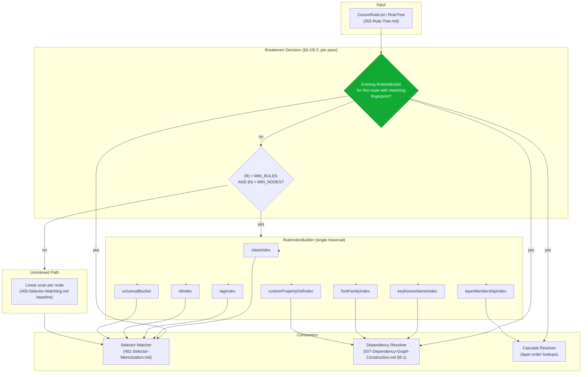
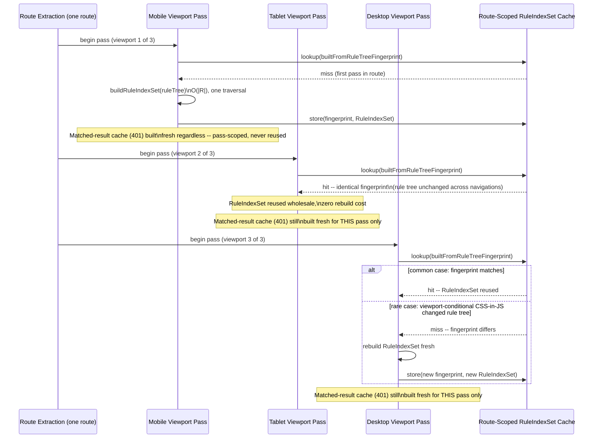

# 003 — Rule Indexing

## 1. Title

**Engine-Level Rule-Indexing Strategy: Pre-Computed Rule-Tree Indexes, Breakeven Analysis, and Cross-Viewport Reuse**

## 2. Version

| Field | Value |
|---|---|
| Document Version | 1.0.0 |
| Status | Draft — Phase 14 (Performance) |
| Last Updated | 2026-07-10 |
| Owners | Performance Working Group |
| Stability | Cross-cutting; generalizes and extends the per-pass reverse index specified in [401-Selector-Memoization.md](../design/401-Selector-Memoization.md) to the whole-engine, multi-pass level. Does not alter that document's correctness contract. |

## 3. Purpose

[401-Selector-Memoization.md](../design/401-Selector-Memoization.md) already specifies a reverse selector-to-candidate-node index — `classIndex`, `tagIndex`, `idIndex`, and a universal-bucket fallback — built once per `(route, viewport, mode)` extraction pass and consumed by the Selector Matcher to avoid an `O(|R|)` per-node scan. That document is scoped, deliberately and correctly, to the **matching pass**: its index exists to answer "which rules are candidates for this specific node," and its lifetime is a single pass, discarded at pass end per that document's Cache Invalidation section.

This document exists because that framing, while correct for its scope, is not the *only* place indexing over the rule tree matters, and conflating "the reverse index used during matching" with "rule indexing as a general engine-level concern" would leave three distinct, real questions unanswered:

1. **Is building any index always worth it?** [401-Selector-Memoization.md](../design/401-Selector-Memoization.md) asserts the index reduces per-node scan cost from `O(|R|)` to near-`O(1)`, but does not quantify the point at which index-construction cost itself exceeds what an unindexed linear scan would have cost in the first place — a real concern for the Engine's smaller fixtures (a landing page with forty rules gains nothing, and loses something, from building a `Map`-backed index before scanning those forty rules directly).
2. **Is the index specific to one matching pass, or can its *structure* — as opposed to the matched-result cache, which [401-Selector-Memoization.md](../design/401-Selector-Memoization.md) correctly scopes to one pass only — be reused across the three-to-six matching passes a single route performs (one per viewport profile), since all of those passes share the same underlying rule tree?**
3. **Is rule-tree indexing only a Selector Matcher concern, or does it recur at other points in the pipeline that also need fast "find rules matching criterion X" lookups** — the Dependency Resolver's discovery routines ([507-Dependency-Graph-Construction.md](../algorithms/507-Dependency-Graph-Construction.md)) and the Cascade Resolver both need to locate specific rules (by referenced custom-property name, by layer membership) within the same rule tree, and asking each of those consumers to build its own bespoke index independently is both wasteful and a source of drift?

This document answers all three, at the engine level, cross-cutting the Selector Matcher, Dependency Resolver, and Cascade Resolver alike — broader in scope than [401-Selector-Memoization.md](../design/401-Selector-Memoization.md)'s per-pass matching-specific reverse index, and explicitly not a replacement for it. Wherever this document and [401-Selector-Memoization.md](../design/401-Selector-Memoization.md) describe what could be read as the same structure (the class/tag/id reverse index), this document is the authority on **construction-cost economics and cross-viewport-pass structural reuse**, while [401-Selector-Memoization.md](../design/401-Selector-Memoization.md) remains the authority on **the matched-result memoization cache's correctness-critical, pass-scoped lifetime** — that boundary is restated precisely in Section 8.5 below to prevent the two documents from being read as contradictory.

## 4. Audience

- Implementers of `packages/matcher`'s index-construction code path, who need the breakeven-threshold model in Section 10.2 to decide, per fixture, whether to build an index at all.
- Implementers of `packages/dependency-graph` and the (forthcoming) Cascade Resolver, who need a shared indexing abstraction rather than each independently reinventing "map from selector-property to matching rules."
- Performance engineers instrumenting and interpreting index-build-time versus lookup-savings tradeoffs across the Engine's fixture suite ([001-Vision.md](../architecture/001-Vision.md) Section 15's fixture families, referenced throughout this repository).
- Implementers of the multi-viewport pipeline ([016-Data-Flow.md](../architecture/016-Data-Flow.md) Section 9), who need to understand precisely what part of an index structure is safe to reuse across a route's viewport passes and what is not.

Readers should already be familiar with [401-Selector-Memoization.md](../design/401-Selector-Memoization.md) in full — this document assumes that baseline and does not re-derive its Reverse Selector-to-Candidate-Node Index construction algorithm, only extends the economic and cross-pass-reuse analysis around it — and with [016-Data-Flow.md](../architecture/016-Data-Flow.md)'s multi-viewport fan-out model (Section 9.2), since cross-viewport index reuse (Section 8.4 below) is meaningless without that model as context.

## 5. Prerequisites

- [401-Selector-Memoization.md](../design/401-Selector-Memoization.md) in full, especially Section "Reverse Selector-to-Candidate-Node Index," "Memory and Time Tradeoffs of Index Size vs. Lookup Speed," and the "Optimization Opportunities" note about persisting index *structure* (not matched-result booleans) across viewport variants — the specific forward-reference this document fulfills.
- [016-Data-Flow.md](../architecture/016-Data-Flow.md) Section 8.4 (CSSOM Rule List) and Section 9.2 (multi-viewport fan-out), establishing that the rule tree is viewport-independent while the *candidate/visibility* set is not.
- [507-Dependency-Graph-Construction.md](../algorithms/507-Dependency-Graph-Construction.md) Section 8.1, which independently needs a "find the `@keyframes`/`@font-face`/`@property` rule matching name X" lookup — a second, distinct consumer of rule-tree indexing this document generalizes to.
- [302-Rule-Tree.md](../design/302-Rule-Tree.md), the canonical in-memory rule-tree representation this document's indexes are built over.
- [405-Container-Queries.md](../design/405-Container-Queries.md), for the boundary condition on what is safe to reuse across viewport passes when container-query-scoped rules are present (directly relevant to Section 8.4's reuse analysis).
- Basic familiarity with amortized-cost analysis and breakeven-point reasoning (the point at which a fixed setup cost is repaid by variable per-operation savings).

## 6. Related Documents

- [401-Selector-Memoization.md](../design/401-Selector-Memoization.md) — the per-pass, matching-specific reverse index and matched-result cache; this document generalizes its indexing concept and specifically fulfills its "persist the reverse index structure... across viewport variants" Optimization Opportunities note.
- [016-Data-Flow.md](../architecture/016-Data-Flow.md) — the multi-viewport fan-out/fan-in model (Section 9) that defines what "reuse across viewport passes" structurally means and what it must not violate.
- [507-Dependency-Graph-Construction.md](../algorithms/507-Dependency-Graph-Construction.md) — a second consumer of rule-tree indexing (locating `@keyframes`/`@font-face`/`@property`/`@layer` declarations by name), whose dispatch-table design (Section 8.1 of that document) this document's engine-level index is built to serve alongside the Selector Matcher.
- [302-Rule-Tree.md](../design/302-Rule-Tree.md) — the underlying rule-tree data structure this document indexes.
- [405-Container-Queries.md](../design/405-Container-Queries.md) — defines the precise viewport-conditional rule subset that bounds what index structure is safe to share across viewport passes (Section 8.4).
- [000-Performance-Overview.md](./000-Performance-Overview.md) — Phase 14 charter; names this document as the rule-indexing pillar alongside parallelization, worker threads, and memory optimization.
- [002-Parallelization-Strategy.md](./002-Parallelization-Strategy.md) — sibling Phase 14 document; index construction is itself one of the embarrassingly-parallel units of work classified there (Section 9.1), cross-referenced in this document's Performance section.
- [001-Worker-Threads.md](./001-Worker-Threads.md) — the worker-thread pool this document's index-construction parallelism (where it clears the breakeven threshold) is dispatched onto.
- [004-Memory-Optimization.md](./004-Memory-Optimization.md) — the memory-cost consequence of retaining an index structure across a route's full viewport-pass lifetime rather than discarding and rebuilding it per pass.
- [005-Benchmarks.md](./005-Benchmarks.md) — the empirical harness validating this document's breakeven-threshold model against real fixture corpora.
- [006-Design-Principles.md](../architecture/006-Design-Principles.md) — Principle 3 (Correctness Over Premature Optimization), which directly motivates the breakeven analysis in Section 10.2 (an index that costs more than it saves is a premature optimization by definition, even though it is not a correctness bug).
- BRIEF.md Section 2.14 (Performance Optimizations) — names "rule indexing" as an explicit, distinct optimization target alongside "selector memoization."

## 7. Overview

An index over a rule tree is, structurally, nothing more than a precomputed answer to a question the Engine is going to ask many times: "given this criterion (a class name, a tag name, an ID, a referenced custom-property name, a layer name), which rules are relevant?" [401-Selector-Memoization.md](../design/401-Selector-Memoization.md) already builds exactly this kind of index for one specific criterion set (class/tag/id, for selector matching) and one specific consumer (the Selector Matcher), rebuilding it fresh at the start of every `(route, viewport, mode)` pass and discarding it at pass end.

That per-pass rebuild-and-discard lifecycle is the right choice for the **matched-result cache** component of that document's design (Section "Cache Invalidation and Scope" of [401-Selector-Memoization.md](../design/401-Selector-Memoization.md) explains at length why matched booleans must never leak across viewport passes, since the candidate rule set itself can differ between viewports once container-query and media-query conditions are resolved). But the **index structure** — the `Map<className, Set<RuleId>>` and its siblings — is a different kind of artifact entirely: it is a pure function of the rule tree's *lexical* content (which classes/tags/ids appear in which rules' selectors), not of any node's visibility, matched state, or viewport-specific geometry. For the substantial majority of routes, where the CSSOM Rule List is viewport-independent (per [016-Data-Flow.md](../architecture/016-Data-Flow.md) Section 8.4's "common case, no viewport-conditional component mounting"), the *same* index structure would be correctly reusable across all of a route's viewport passes, and rebuilding it fresh for every one of typically 3–6 viewport passes is pure waste this document exists to eliminate.

This document is organized around three questions, each answered in its own subsection of Detailed Design:

1. **When does building an index pay for itself at all** (Section 8.2/8.3)? Index construction has a real, non-zero cost (`O(|R|)`, per [401-Selector-Memoization.md](../design/401-Selector-Memoization.md) Algorithms), and for small rule trees — the majority of real-world "above-the-fold" critical-CSS extraction targets, which are often a few hundred rules at most, not the enterprise-huge fixture's tens of thousands — that cost is not obviously smaller than simply scanning the rule list linearly per node. This document derives a concrete breakeven model.
2. **What, precisely, is safe to reuse across a route's viewport passes, and what is not** (Section 8.4)? This is the direct fulfillment of [401-Selector-Memoization.md](../design/401-Selector-Memoization.md)'s own forward-reference, made concrete with an explicit invalidation boundary tied to container-query and media-query rule-set differences.
3. **What is the shared indexing abstraction that serves the Selector Matcher, Dependency Resolver, and (future) Cascade Resolver alike**, rather than three independently-built, subtly-different indexing implementations drifting apart over time (Section 8.6)?

## 8. Detailed Design

### 8.1 What "Rule Indexing" Means at the Engine Level, Distinct from the Matching-Pass Reverse Index

At the engine level, a **Rule Index** is any precomputed `Map<Criterion, Set<RuleId>>` (or the union/superset-safe-fallback-augmented variant [401-Selector-Memoization.md](../design/401-Selector-Memoization.md) specifies) built once against a `CssomRuleList`/`RuleTree` and consulted by one or more downstream stages in place of a linear scan of all rules. This document's engine-level `RuleIndexSet` is a **superset** of what [401-Selector-Memoization.md](../design/401-Selector-Memoization.md) specifies for matching purposes:

```text
RuleIndexSet {
  // Matching-relevant indexes, identical in structure and construction
  // algorithm to 401-Selector-Memoization.md's classIndex/tagIndex/idIndex/
  // universalBucket -- NOT reimplemented here, referenced by construction.
  classIndex: Map<string, Set<RuleId>>
  tagIndex: Map<string, Set<RuleId>>
  idIndex: Map<string, Set<RuleId>>
  universalBucket: Set<RuleId>

  // Dependency-resolution-relevant indexes, new to this document, serving
  // 507-Dependency-Graph-Construction.md §8.1's discovery routines.
  keyframesNameIndex: Map<string, RuleId>       // @keyframes name -> defining rule
  fontFamilyIndex: Map<string, Set<RuleId>>     // @font-face family -> defining rules
  customPropertyDefIndex: Map<string, RuleId>   // @property name -> defining rule
  layerMembershipIndex: Map<string, Set<RuleId>> // @layer name -> member rules

  // Metadata, used by breakeven decision (§8.2) and cross-pass reuse (§8.4)
  builtFromRuleTreeFingerprint: string   // content hash of the CSSOM Rule List
  viewportConditionalRuleIds: Set<RuleId> // rules inside @media/@container blocks
  ruleCount: number
  buildDurationMs: number
}
```

**Why one `RuleIndexSet`, not three independently-built indexes per consumer.** The Selector Matcher, Dependency Resolver, and Cascade Resolver all need to answer structurally identical questions ("which rules match criterion X") against the same underlying rule tree, differing only in *which* criterion each cares about (class/tag/id for matching; construct name for dependency discovery; layer name for cascade ordering). Building three separate indexing implementations — one per consumer — would triple the `O(|R|)` traversal cost of walking the rule tree to extract lexical facts, when a single traversal can populate all the maps above in one pass over the same rule list. This is a direct generalization of the "why a strategy table rather than duplicated logic" argument [507-Dependency-Graph-Construction.md](../algorithms/507-Dependency-Graph-Construction.md) Section 8.1 makes for discovery-routine dispatch, applied here to index construction instead of discovery dispatch.

**Relationship to [401-Selector-Memoization.md](../design/401-Selector-Memoization.md)'s reverse index.** The `classIndex`/`tagIndex`/`idIndex`/`universalBucket` fields above are, structurally, identical to that document's specification — same construction algorithm (`extractShapeKeys`, same lexical, superset-safe conservatism), same superset-safety invariant, same consumer contract. This document does not redefine them; it places them as one quadrant of a larger, shared `RuleIndexSet` and adds the construction-economics and cross-pass-reuse layers those fields did not previously have attached at the engine level.

### 8.2 The Breakeven Problem: When Index Construction Costs More Than It Saves

**The concrete cost model.** Building any one of the maps in `RuleIndexSet` costs `O(|R| × avgKeysPerRule)` (per [401-Selector-Memoization.md](../design/401-Selector-Memoization.md) Algorithms), effectively `O(|R|)` for realistic `avgKeysPerRule`. Consulting the index for `|N|` nodes costs `O(|N| × avgCandidatesPerNode)`. Without the index, a naive linear scan (the [400-Selector-Matching.md](../design/400-Selector-Matching.md) baseline, pre-filtering aside) costs `O(|N| × |R|)`. The index is worth building exactly when:

```text
indexBuildCost + indexedLookupCost  <  unindexedScanCost
O(|R|)  +  O(|N| × avgCandidatesPerNode)  <  O(|N| × |R|)
```

Rearranging, the index pays for itself when `|N|` is large enough that the *savings per node* (`|R| - avgCandidatesPerNode`, the difference between a full unindexed scan and an indexed lookup, per node) accumulated across all `|N|` nodes exceeds the one-time `O(|R|)` build cost. Concretely:

```text
|N| × (|R| - avgCandidatesPerNode)  >  |R|
=>  |N|  >  |R| / (|R| - avgCandidatesPerNode)
```

For a rule tree with high selectivity (each node matches only a small fraction of rules, so `avgCandidatesPerNode ≪ |R|`), the right-hand side approaches `|R| / |R| = 1` — i.e., the index pays for itself almost immediately, after just a handful of nodes, which is the common case for component-heavy pages ([401-Selector-Memoization.md](../design/401-Selector-Memoization.md)'s own motivating scenario). But for a rule tree with **low selectivity** — a stylesheet dominated by broad universal-bucket-falling selectors, deeply nested combinators the lexical classifier cannot confidently key (all falling into `universalBucket`, which every node must still scan linearly per [401-Selector-Memoization.md](../design/401-Selector-Memoization.md) Section "Reverse Selector-to-Candidate-Node Index"), `avgCandidatesPerNode` approaches `|R|` itself, and the breakeven point recedes toward "never" — the index costs `O(|R|)` to build and saves almost nothing, because nearly every rule ends up a candidate for nearly every node regardless of indexing.

**Why small stylesheets specifically may not benefit, independent of selectivity.** Even at high selectivity, if `|R|` itself is small (a landing-page fixture with forty rules total, none of them component-repeated at scale), the *absolute* build cost is tiny, but so is the *absolute* savings — `|N| × (|R| - avgCandidatesPerNode)` for `|R| = 40` and `|N| = 60` (a small, simple page) is, at most, a few thousand avoided comparisons, a quantity dwarfed by the fixed per-call overhead of allocating `Map`/`Set` structures, hashing class-name strings, and the general constant-factor cost real language runtimes impose on `Map`-backed structures relative to a tight linear-scan loop over a small array. This is the sense in which "small stylesheets may not benefit" is true even independent of the asymptotic breakeven formula above — asymptotics correctly predict the crossover *exists*, but the crossover for genuinely tiny `|R|` can sit below the constant-factor noise floor, meaning the index is a net loss purely due to allocation/hashing overhead that the big-O model does not capture. Section 10.2 makes this concrete with a two-term cost model that includes a constant-overhead term specifically to capture this effect.

### 8.3 Decision Policy: Build, Skip, or Defer

Given the breakeven analysis above, this document specifies a concrete, three-way decision policy applied once per `(route, viewport)` matching pass, before any indexing work begins:

1. **Skip indexing entirely** if `|R|` is below a configured `MIN_RULES_FOR_INDEXING` threshold (default informed by [005-Benchmarks.md](./005-Benchmarks.md) empirical measurement across the fixture suite, expected to be in the low hundreds of rules) — fall through directly to the [400-Selector-Matching.md](../design/400-Selector-Matching.md) baseline's per-pair pre-filter without building any `RuleIndexSet` map at all. This is not a correctness fallback (as the universal-bucket fallback within the index is); it is a deliberate, always-safe choice to skip a step whose cost/benefit calculus does not favor it for this particular rule tree size.
2. **Build the index** if `|R|` exceeds the threshold and `|N|` (the visibility-annotated node count for this viewport pass) also exceeds a second, paired threshold (`MIN_NODES_FOR_INDEXING`) — both must be true, since a huge rule tree matched against a handful of visible nodes (an unusual but possible above-fold-only extraction against a very sparse critical region) does not accumulate enough per-node savings to repay the build cost either, symmetric to the `|R|`-side threshold.
3. **Defer to cross-pass reuse** (Section 8.4) if a `RuleIndexSet` already exists for this route's `builtFromRuleTreeFingerprint`, from an earlier viewport pass in the same route — in this case indexing cost is not merely "amortized," it is **zero** for this pass, which is the single largest lever this document adds beyond what a naive per-pass breakeven policy alone would achieve.

This is expressed concretely as pseudocode in Section 10.1.

### 8.4 Index Reuse Across Viewport Passes Within One Route

**The structural argument.** Per [016-Data-Flow.md](../architecture/016-Data-Flow.md) Section 8.4, the CSSOM Rule List is captured per viewport navigation but is, in the common case (no viewport-conditional CSS-in-JS component mounting), structurally identical across a route's viewport passes — same stylesheets, same rules, same selectors. The `classIndex`/`tagIndex`/`idIndex`/`universalBucket`/`keyframesNameIndex`/etc. maps in a `RuleIndexSet` are, by construction (Section 8.1), a pure function of the rule tree's lexical content alone — they do not reference any node, any visibility annotation, or any viewport-specific fact. **What varies between viewport passes is not the rule tree's indexable lexical content; it is which of those rules end up in `CandidateRuleSet` at all**, because media-query and container-query conditions resolve differently per viewport (per [405-Container-Queries.md](../design/405-Container-Queries.md) and [401-Selector-Memoization.md](../design/401-Selector-Memoization.md)'s own Cache Invalidation section).

This is precisely the boundary [401-Selector-Memoization.md](../design/401-Selector-Memoization.md)'s Optimization Opportunities note gestures at without making concrete: **the index structure can be shared across viewport passes; the matched-result cache (a different structure entirely, per that document) cannot.** This document makes the boundary concrete by splitting a `RuleIndexSet`'s contents into two categories:

- **Viewport-invariant entries** — index entries keyed by classes/tags/ids/construct-names that appear on rules **outside** any `@media`/`@container` conditional block (i.e., rules that are unconditionally present in every viewport pass's candidate set). These entries are safe to reuse byte-for-byte across all of a route's viewport passes.
- **Viewport-conditional entries** — index entries that reference rules recorded in `viewportConditionalRuleIds` (rules nested inside `@media`/`@container` blocks, per [016-Data-Flow.md](../architecture/016-Data-Flow.md) Section 8.4's `CssomRuleRecord.mediaConditionText`/`parentRuleIndex` fields). These entries are still lexically valid (the rule's selector still references the same class/tag/id regardless of which viewport ultimately activates it), but whether that rule is actually a *candidate* for a given viewport pass depends on that viewport's resolved media/container state — the index entry itself does not need rebuilding, but the pass-specific "is this candidate rule even in scope for this viewport" filter (already the Selector Matcher's own responsibility, orthogonal to indexing per se) must still be applied per pass.

The key realization is that **both categories of index entry are safe to reuse across viewport passes without rebuilding** — because indexing answers "which rules lexically reference criterion X," a viewport-independent question, while candidacy (whether a viewport-conditional rule actually applies at this viewport) is a downstream filter the Cascade/Matching stage already applies regardless of indexing. The only case requiring an index rebuild is when the rule tree **itself** differs across viewport navigations (the uncommon CSS-in-JS-conditional-mounting case flagged in [016-Data-Flow.md](../architecture/016-Data-Flow.md) Section 8.4), detected via a change in `builtFromRuleTreeFingerprint`.

**Concrete reuse protocol.** At the start of each viewport pass within one route:

1. Compute (or retrieve, if already computed earlier in the route) `builtFromRuleTreeFingerprint` for the current viewport's captured `CssomRuleList` — a content hash over the stylesheet/rule structure, independent of viewport.
2. If a `RuleIndexSet` already exists for this route (from an earlier viewport pass) with a matching fingerprint, reuse it wholesale — zero rebuild cost.
3. If the fingerprint differs (the rare CSS-in-JS-conditional case), rebuild the `RuleIndexSet` fresh for this viewport pass, exactly as if it were the route's first pass.
4. In either case, the *matched-result memoization cache* from [401-Selector-Memoization.md](../design/401-Selector-Memoization.md) is still constructed fresh, per that document's unmodified, correctness-critical, pass-scoped lifetime rule — reuse never applies to it, only to the `RuleIndexSet`.

### 8.5 The Precise Boundary Between This Document and 401-Selector-Memoization.md

To avoid the two documents reading as contradictory, the boundary is stated explicitly and is the single most important cross-reference in this document:

| Concern | Owning Document | Lifetime |
|---|---|---|
| `classIndex`/`tagIndex`/`idIndex`/`universalBucket` construction algorithm (lexical key extraction, superset safety) | [401-Selector-Memoization.md](../design/401-Selector-Memoization.md) | N/A — algorithm, not an instance |
| Whether to build an index at all for a given `(|R|, |N|)` pair (breakeven decision) | This document, Section 8.2/8.3 | Decision made once per pass, before indexing begins |
| Whether an already-built index instance can be reused across this route's viewport passes | This document, Section 8.4 | Spans the route's full viewport-pass sequence |
| Matched-result `(shapeSignature, selectorText) -> boolean` cache | [401-Selector-Memoization.md](../design/401-Selector-Memoization.md) | Strictly one `(route, viewport, mode)` pass — never reused, per that document's Cache Invalidation section |
| Dependency-resolution-relevant indexes (`keyframesNameIndex`, etc.) | This document, Section 8.1 | Same reuse rules as the matching-relevant indexes (Section 8.4) |

Any implementation change that appears to relax [401-Selector-Memoization.md](../design/401-Selector-Memoization.md)'s matched-result cache lifetime in the name of this document's cross-pass reuse guidance is a misreading of this boundary and must be rejected in review — this document extends indexing economics and reuse, it does not touch matched-result correctness scoping.

### 8.6 Shared Indexing Abstraction Across Consumers

Because `RuleIndexSet` (Section 8.1) is built once per route (subject to reuse per Section 8.4) and consumed by up to three distinct stages, this document specifies it as a component owned by neither the Selector Matcher nor the Dependency Resolver exclusively, but by a shared `packages/matcher`-adjacent module (`RuleIndexBuilder`) that both stages depend on as a read-only input — mirroring the same "single, shared, injected dependency rather than duplicated per-consumer logic" pattern [507-Dependency-Graph-Construction.md](../algorithms/507-Dependency-Graph-Construction.md) Section 8.1 already establishes for its own `DiscoveryRoutine` dispatch table. The Dependency Resolver's discovery routines ([501-CSS-Variables.md](../algorithms/501-CSS-Variables.md) through [506-Cascade-Layers.md](../algorithms/506-Cascade-Layers.md)) consult `keyframesNameIndex`/`fontFamilyIndex`/`customPropertyDefIndex`/`layerMembershipIndex` in place of a linear scan over the full rule tree when resolving a construct reference (e.g., `animation-name: fade-in` resolving to the `@keyframes fade-in` rule) — a direct, additive performance benefit to those discovery routines that this document makes available without requiring [507-Dependency-Graph-Construction.md](../algorithms/507-Dependency-Graph-Construction.md) to specify its own separate indexing scheme.

## 9. Architecture

### 9.1 RuleIndexSet Construction and Consumption



### 9.2 Index Reuse Across Three Viewport Passes — Sequence Diagram



The second diagram is the concrete visualization this document's Purpose section promises: the `RuleIndexSet` (top of each pass) is built once and reused twice across three viewport passes in the common case, while the matched-result memoization cache — drawn as a note rather than a cached lookup, deliberately — is rebuilt fresh every single pass without exception, making the two structures' divergent lifetimes visually unmistakable.

## 10. Algorithms

### 10.1 Algorithm: Breakeven-Gated Index Construction with Cross-Pass Reuse

**Problem statement.** Given a rule tree, a route-scoped cache of previously-built `RuleIndexSet`s (keyed by rule-tree fingerprint), and the current viewport pass's node count, decide whether to reuse an existing index, build a new one, or skip indexing entirely — minimizing total work (build cost plus lookup cost) across a route's full viewport-pass sequence, never producing an incorrect candidate set relative to the unindexed baseline.

**Inputs.** `ruleTree: RuleTree`; `nodeCount: number` (`|N|` for the current viewport pass); `routeIndexCache: Map<fingerprint, RuleIndexSet>` (scoped to the current route only, discarded at route end); `MIN_RULES_FOR_INDEXING`, `MIN_NODES_FOR_INDEXING`: configured thresholds (Section 8.3).

**Outputs.** `IndexDecision { strategy: 'reuse' | 'build' | 'skip', indexSet: RuleIndexSet | null }`.

**Pseudocode.**

```text
function resolveRuleIndex(ruleTree, nodeCount, routeIndexCache,
                            MIN_RULES_FOR_INDEXING, MIN_NODES_FOR_INDEXING) -> IndexDecision:

    fingerprint = computeRuleTreeFingerprint(ruleTree)   // O(|R|), content hash

    // Step 1: cross-pass reuse check (§8.4) -- always attempted first,
    // since a cache hit here is strictly cheaper than even evaluating
    // the breakeven decision.
    if routeIndexCache.has(fingerprint):
        return IndexDecision { strategy: 'reuse', indexSet: routeIndexCache.get(fingerprint) }

    // Step 2: breakeven decision (§8.2/8.3) -- only reached on a cache miss,
    // i.e. this route's first viewport pass, or a rule-tree change mid-route.
    ruleCount = ruleTree.totalRuleCount()   // O(1), maintained incrementally by 302-Rule-Tree.md

    if ruleCount < MIN_RULES_FOR_INDEXING or nodeCount < MIN_NODES_FOR_INDEXING:
        return IndexDecision { strategy: 'skip', indexSet: null }

    // Step 3: build -- single traversal populating all RuleIndexSet maps at once (§8.1/8.6)
    startTime = now()
    indexSet = buildRuleIndexSet(ruleTree)   // O(|R| x avgKeysPerRule), one pass over ruleTree
    indexSet.builtFromRuleTreeFingerprint = fingerprint
    indexSet.buildDurationMs = now() - startTime

    routeIndexCache.set(fingerprint, indexSet)   // available for reuse by next viewport pass
    return IndexDecision { strategy: 'build', indexSet: indexSet }


function buildRuleIndexSet(ruleTree: RuleTree) -> RuleIndexSet:
    classIndex = new Map(); tagIndex = new Map(); idIndex = new Map()
    universalBucket = new Set()
    keyframesNameIndex = new Map(); fontFamilyIndex = new Map()
    customPropertyDefIndex = new Map(); layerMembershipIndex = new Map()
    viewportConditionalRuleIds = new Set()

    for rule in ruleTree.allRules():             // single O(|R|) traversal, all maps populated together
        if rule.isInsideConditionalBlock():      // @media / @container ancestor, per 016-Data-Flow.md §8.4
            viewportConditionalRuleIds.add(rule.ruleId)

        if rule.ruleType == 'style':
            keys = extractShapeKeys(rule.selectorText)   // per 401-Selector-Memoization.md, lexical only
            if keys.isEmpty() or keys.isAmbiguous():
                universalBucket.add(rule.ruleId)
            else:
                for k in keys.classNames: classIndex.getOrCreate(k).add(rule.ruleId)
                for k in keys.tagNames: tagIndex.getOrCreate(k).add(rule.ruleId)
                for k in keys.ids: idIndex.getOrCreate(k).add(rule.ruleId)
        elif rule.ruleType == 'keyframes':
            keyframesNameIndex.set(rule.name, rule.ruleId)
        elif rule.ruleType == 'font-face':
            fontFamilyIndex.getOrCreate(rule.fontFamily).add(rule.ruleId)
        elif rule.ruleType == 'property':
            customPropertyDefIndex.set(rule.propertyName, rule.ruleId)
        elif rule.ruleType == 'layer':
            for member in rule.memberRuleIds:
                layerMembershipIndex.getOrCreate(rule.layerName).add(member)

    return RuleIndexSet {
        classIndex, tagIndex, idIndex, universalBucket,
        keyframesNameIndex, fontFamilyIndex, customPropertyDefIndex, layerMembershipIndex,
        viewportConditionalRuleIds,
        ruleCount: ruleTree.totalRuleCount()
        // builtFromRuleTreeFingerprint, buildDurationMs set by caller
    }
```

**Time complexity.** `computeRuleTreeFingerprint`: `O(|R|)`, a single content hash over the rule tree — dominated in practice by string hashing of `selectorText`/`declarationText`, cheap relative to full parsing. `resolveRuleIndex`'s reuse path (Step 1 hit): `O(|R|)` for the fingerprint computation alone (unavoidable, since correctness requires confirming the rule tree has not changed even on the "reuse" path) plus `O(1)` for the cache lookup — no index-construction cost at all. `resolveRuleIndex`'s build path: `O(|R|)` fingerprint plus `O(|R| × avgKeysPerRule)` for `buildRuleIndexSet`, effectively `O(|R|)` for realistic `avgKeysPerRule`, identical to [401-Selector-Memoization.md](../design/401-Selector-Memoization.md)'s own bound, since this document's single traversal populates all eight maps in the same asymptotic cost as that document's four. Across a full route of `V` viewport passes, total indexing cost is `O(|R|)` (fingerprint, every pass) `+ O(|R| × avgKeysPerRule)` (build, at most once per route in the common case, not once per pass) — a reduction from `O(V × |R| × avgKeysPerRule)` under a naive per-pass-rebuild policy to `O(V × |R| + |R| × avgKeysPerRule)`, i.e., the expensive term's `V` multiplier is eliminated entirely in the common case.

**Memory complexity.** `O(|R| × avgKeysPerRule)` for one route-scoped `RuleIndexSet`, identical to [401-Selector-Memoization.md](../design/401-Selector-Memoization.md)'s bound for its subset of that structure; `routeIndexCache` holds at most a small number of distinct `RuleIndexSet` instances per route (in the overwhelming common case, exactly one, since the fingerprint is stable across all viewport passes; in the rare CSS-in-JS-conditional case, at most `V`, one per distinct rule-tree variant observed) — bounded by `O(V × |R| × avgKeysPerRule)` in the pathological worst case where every viewport pass produces a genuinely distinct rule tree, identical to the cost of the naive always-rebuild policy in that worst case, and strictly better in every other case.

**Failure cases.** A fingerprint collision (two structurally distinct rule trees hashing to the same fingerprint) would cause an incorrect index reuse — a correctness bug, not merely a performance one, since a stale index for a different rule tree could omit or misattribute candidate rules; mitigated by using a cryptographically-strong content hash (not a weak checksum) over the full rule tree's canonical serialization, mirroring the same fingerprinting discipline the Cache Manager already applies at the content-fingerprint layer ([006-Design-Principles.md](../architecture/006-Design-Principles.md) Principle 8), and by the general rarity of hash collisions at practical rule-tree sizes with a well-chosen hash function. A misconfigured `MIN_RULES_FOR_INDEXING`/`MIN_NODES_FOR_INDEXING` threshold pair does not risk correctness either way (skipping indexing always falls through to the already-correct unindexed baseline; building an index that turns out not to have been worth it only wastes some CPU time) — this is purely a tuning concern, addressed empirically via [005-Benchmarks.md](./005-Benchmarks.md), not a failure mode requiring defensive code.

**Optimization opportunities.** Compute `computeRuleTreeFingerprint` incrementally as the rule tree is captured (per [016-Data-Flow.md](../architecture/016-Data-Flow.md) Section 8.4's per-stylesheet traversal, itself parallelizable per [002-Parallelization-Strategy.md](./002-Parallelization-Strategy.md) Section 8.2), rather than as a separate `O(|R|)` pass after the fact, so that the fingerprint is available "for free" by the time `resolveRuleIndex` needs it; explore skipping the fingerprint recomputation entirely on the second and subsequent viewport passes when [016-Data-Flow.md](../architecture/016-Data-Flow.md)'s own navigation/stabilization layer can positively assert "no CSS-in-JS conditional mounting occurred for this route" (a stronger, route-level guarantee that would let `resolveRuleIndex` skip Step 1's `O(|R|)` fingerprint cost entirely on reuse, not just skip the `O(|R| × avgKeysPerRule)` build cost) — flagged as a future refinement pending confirmation that such a guarantee can be established cheaply and correctly (see Future Work).

### 10.2 Algorithm: Breakeven Threshold Estimation (Empirical Model)

**Problem statement.** Provide a concrete, two-term cost model (asymptotic term plus constant-overhead term) implementers can use to derive sane default values for `MIN_RULES_FOR_INDEXING` and `MIN_NODES_FOR_INDEXING`, rather than picking arbitrary numbers, and to explain why the pure asymptotic breakeven formula from Section 8.2 alone understates the true threshold for small `|R|`.

**Inputs.** Empirically measured constants (to be calibrated per [005-Benchmarks.md](./005-Benchmarks.md)): `c_scan` (cost per rule of one unindexed pre-filter comparison, per [400-Selector-Matching.md](../design/400-Selector-Matching.md)'s baseline); `c_lookup` (cost per indexed candidate-set hash lookup); `c_build` (cost per rule of index-construction traversal, including key extraction); `c_overhead` (fixed constant cost of allocating the `Map`/`Set` structures themselves, largely independent of `|R|`).

**Outputs.** A recommended `MIN_RULES_FOR_INDEXING` value and a formula for validating it against a specific fixture's measured `(|R|, |N|, avgCandidatesPerNode)`.

**Model.**

```text
unindexedCost(R, N)        = N x R x c_scan
indexedCost(R, N, avgCand) = c_overhead + R x c_build + N x avgCand x c_lookup

// Index is worth building iff:
indexedCost(R, N, avgCand) < unindexedCost(R, N)

// Solving for the breakeven N (holding R, avgCand fixed):
N_breakeven = (c_overhead + R x c_build) / (R x c_scan - avgCand x c_lookup)
```

**Interpretation.** For a fixed rule count `R`, as `avgCand` (the average number of index-returned candidates per node) approaches `R` itself (low selectivity — most rules are candidates for most nodes regardless of indexing), the denominator `R x c_scan - avgCand x c_lookup` shrinks toward zero, driving `N_breakeven` toward infinity — precisely capturing Section 8.2's qualitative claim that low-selectivity stylesheets may never recoup index-build cost, now expressed as a concrete formula rather than an assertion. Conversely, for high selectivity (`avgCand ≪ R`), the denominator approaches `R x c_scan`, and `N_breakeven` approaches `(c_overhead + R x c_build) / (R x c_scan)` — small for any reasonably-sized `R`, confirming the index pays for itself quickly in the common, high-selectivity, component-repetitive case [401-Selector-Memoization.md](../design/401-Selector-Memoization.md) is primarily motivated by.

**Time/memory complexity.** The model itself is `O(1)` to evaluate per pass, given the calibrated constants — it is a decision heuristic, not an algorithm operating over the rule tree itself (that cost is already accounted for in Section 10.1).

**Failure cases.** Constants (`c_scan`, `c_lookup`, `c_build`, `c_overhead`) calibrated against one JavaScript runtime/engine version may not transfer precisely to another (V8 version differences, JIT warm-up effects) — this is why [005-Benchmarks.md](./005-Benchmarks.md), not this document, owns the actual numeric calibration and should recalibrate periodically as the runtime environment changes, with this document's model providing only the *shape* of the relationship (which terms matter, how they interact), not fixed numeric constants.

**Optimization opportunities.** A future adaptive variant could measure `avgCandidatesPerNode` empirically for the *first* several nodes of a pass (a cheap sample) before committing to the build/skip decision for the remainder of that pass, rather than relying solely on the static `MIN_RULES_FOR_INDEXING`/`MIN_NODES_FOR_INDEXING` thresholds computed without any actual selectivity measurement — flagged in Future Work as a refinement requiring more implementation complexity than the static-threshold baseline this document specifies.

## 11. Implementation Notes

- `buildRuleIndexSet` must be implemented as a single traversal populating all eight maps (Section 10.1), never as eight separate traversals over the rule tree, to preserve the `O(|R|)` (not `O(8 × |R|)`, though that would still be asymptotically identical, merely wasteful in constant factor) cost this document's complexity analysis assumes.
- `routeIndexCache` (Section 10.1) must be scoped strictly to a single route's lifetime — a fresh, empty cache instance per route, never a shared module-level or cross-route cache — mirroring exactly the same structural-scoping discipline [401-Selector-Memoization.md](../design/401-Selector-Memoization.md) Implementation Notes mandates for its own per-pass structures, applied here at route rather than pass granularity. This is a distinct, wider scope than the matched-result cache's pass-scoped lifetime (Section 8.5's table), and implementers must not conflate the two scopes.
- `computeRuleTreeFingerprint` should reuse whatever content-hashing primitive the Cache Manager already uses for its own fingerprinting (per [006-Design-Principles.md](../architecture/006-Design-Principles.md) Principle 8), rather than introducing a second, subtly-different hashing scheme — consistency here reduces the number of distinct "how do we hash a rule tree" implementations to one, mirroring [507-Dependency-Graph-Construction.md](../algorithms/507-Dependency-Graph-Construction.md) Implementation Notes' analogous "one canonical serialization discipline" guidance for node/edge keys.
- `MIN_RULES_FOR_INDEXING` and `MIN_NODES_FOR_INDEXING` must be exposed as configuration, alongside `BATCH_SIZE` ([400-Selector-Matching.md](../design/400-Selector-Matching.md)) and the memoization cache's max-size setting ([401-Selector-Memoization.md](../design/401-Selector-Memoization.md)), as part of the Selector Matcher/Rule Index Builder's unified configuration schema — never hardcoded, since [005-Benchmarks.md](./005-Benchmarks.md)'s calibration is expected to refine these defaults over time as fixture coverage grows.
- Diagnostics from this layer — `strategy` chosen (`reuse`/`build`/`skip`), `buildDurationMs` when built, and the count of viewport passes within a route that reused a given `RuleIndexSet` — should be threaded into the same Reporter `stats` block [401-Selector-Memoization.md](../design/401-Selector-Memoization.md) Implementation Notes already specifies for cache hit rate and distinct-shape count, giving operators a single unified performance-diagnostics surface for the whole indexing subsystem rather than two disjoint reporting paths.

## 12. Edge Cases

- **A route with a single viewport profile configured.** Cross-pass reuse (Section 8.4) is vacuous (there is only one pass), so the breakeven decision (Section 8.3) is the only relevant policy; the algorithm must behave identically to running the breakeven decision alone with no reuse-path code executed unnecessarily — a direct parallel to [016-Data-Flow.md](../architecture/016-Data-Flow.md) Section 12's "single-viewport configuration... merge step... still executes the full algorithm" testability argument, applied here to indexing instead of merging.
- **A route where the CSSOM Rule List genuinely differs across every viewport pass** (the uncommon CSS-in-JS-conditional-mounting case). `routeIndexCache` degrades gracefully to "build fresh every pass" — functionally identical, in the worst case, to a naive always-rebuild policy, never worse, since the reuse check's own cost (`O(|R|)` fingerprinting) is already accounted for as part of the always-required baseline cost in Section 10.1's complexity analysis.
- **A rule tree that changes mid-route due to a navigation bug** (the same Stability Violation edge case [016-Data-Flow.md](../architecture/016-Data-Flow.md) Section 12 already flags for the DOM Snapshot/CSSOM Rule List atomicity assumption). The fingerprint-keyed `routeIndexCache` naturally handles this correctly — a changed rule tree produces a changed fingerprint, triggering a rebuild rather than an incorrect reuse — but the underlying stability violation itself should still be surfaced as a `StabilityViolationWarning` diagnostic per that document's existing guidance; this document's index-reuse mechanism is a safety net against consuming a stale index, not a substitute for detecting and reporting the underlying instability.
- **A rule tree exactly at the `MIN_RULES_FOR_INDEXING` threshold boundary.** The comparison must be strict and consistently applied (`ruleCount < MIN_RULES_FOR_INDEXING`, Section 10.1) so that a fixture sitting exactly on the boundary produces stable, reproducible behavior across runs rather than being sensitive to off-by-one threshold definitions — a determinism concern (Principle 5) as much as a correctness one, since flip-flopping between `build` and `skip` for a stable input would make performance diagnostics noisy without any actual change in the underlying data.
- **`universalBucket`-heavy stylesheets (low selectivity, per Section 8.2).** Even when the size thresholds are cleared and an index is built, `avgCandidatesPerNode` approaching `|R|` means the built index provides little practical benefit despite passing the size-based gate — this is a known, accepted gap in the static-threshold policy (Section 8.3), not a bug; Section 10.2's Future Work flags an adaptive, selectivity-aware refinement as the eventual remedy.
- **Shadow DOM nested rule trees.** Per [401-Selector-Memoization.md](../design/401-Selector-Memoization.md) Edge Cases, shadow-scoped rules must not share cache/index entries across a shadow boundary with light-DOM rules; this document's `RuleIndexSet` is therefore built per shadow scope (one `RuleIndexSet` for the light-DOM rule tree, one additional `RuleIndexSet` per distinct shadow root's rule tree, each independently subject to its own breakeven decision and its own cross-pass reuse check, since a page's shadow roots may have very different rule counts than its light DOM).

## 13. Tradeoffs

| Decision | Alternative Considered | Why Chosen | Cost Accepted |
|---|---|---|---|
| A single, shared `RuleIndexSet` serving Selector Matcher, Dependency Resolver, and Cascade Resolver, built in one traversal | Three independently-built indexes, one per consumer, each built by that consumer's own code | Avoids tripling rule-tree traversal cost and avoids three independently-evolving indexing implementations drifting out of sync | Introduces a shared-module dependency all three consumers must agree on, requiring coordination when any one consumer's indexing needs change |
| Explicit breakeven decision (skip below thresholds) rather than always building an index unconditionally | Always build the index, on the argument that [401-Selector-Memoization.md](../design/401-Selector-Memoization.md) shows it "never performs asymptotically worse than the baseline" | That document's claim is about asymptotic worst case, not about small-`\|R\|` constant-factor overhead (Section 8.2); always building pays real, measurable overhead on the substantial fraction of real-world routes with small rule trees | Requires calibrated thresholds ([005-Benchmarks.md](./005-Benchmarks.md)) rather than a single "always index" rule that needs no tuning at all |
| Cross-pass index-structure reuse keyed by rule-tree content fingerprint | Rebuild the index fresh every viewport pass, accepting the cost as the price of correctness-by-construction simplicity | The common case (viewport-independent CSSOM) makes rebuilding pure waste; a fingerprint check is cheap (`O(\|R\|)`, already required for other purposes) relative to the `O(\|R\| x avgKeysPerRule)` rebuild it avoids | Requires a route-scoped cache and a fingerprint-comparison step on every pass, adding a small amount of bookkeeping complexity relative to a stateless "always rebuild" policy |
| Static, configured size thresholds (`MIN_RULES_FOR_INDEXING`/`MIN_NODES_FOR_INDEXING`) rather than dynamic, selectivity-sampling-based decision | Sample actual `avgCandidatesPerNode` empirically per route before deciding, per Section 10.2's Optimization Opportunities | Simpler to implement and reason about; avoids the complexity and edge cases of a sampling phase (e.g., what if the sample is unrepresentative of the full node set) | Foregoes precision for low-selectivity-but-large-|R| stylesheets (Edge Cases) that clear the size threshold but still gain little from indexing — accepted as a known gap pending empirical data justifying the added complexity |
| Fingerprint-based reuse validity check on every pass (not skipped even on the common "definitely unchanged" path) | Skip the fingerprint check entirely after the first pass, trusting that CSS-in-JS conditional mounting is rare enough to ignore | Correctness — an unchecked assumption of rule-tree stability is exactly the class of "silent staleness" risk [401-Selector-Memoization.md](../design/401-Selector-Memoization.md) explicitly warns against for its own cache; this document extends that same discipline to index reuse | Pays an `O(\|R\|)` fingerprint cost on every viewport pass even when the rule tree provably never changes, a cost judged acceptable since it is far smaller than the `O(\|R\| x avgKeysPerRule)` cost it protects the correctness of avoiding |

## 14. Performance

- **CPU complexity.** Per route: `O(V × |R|)` for per-pass fingerprinting (unavoidable, every pass) plus `O(|R| × avgKeysPerRule)` for index construction, paid at most once per route in the common case rather than once per viewport pass — a reduction of the dominant `avgKeysPerRule`-weighted term's multiplier from `V` to `1`, exactly the benefit this document's Purpose section promises, made concrete in Section 10.1's complexity analysis.
- **Memory complexity.** `O(|R| × avgKeysPerRule)` for one route's `RuleIndexSet` in the common case, `O(V × |R| × avgKeysPerRule)` in the rare worst case of a genuinely distinct rule tree per viewport pass — no worse than the naive always-rebuild-per-pass policy in the worst case, strictly better in every other case, per Section 10.1's Memory Complexity analysis.
- **Caching strategy.** Two independent caching layers coexist and must not be conflated (Section 8.5's boundary table): the route-scoped `RuleIndexSet` cache (this document, reused across viewport passes) and the pass-scoped matched-result memoization cache ([401-Selector-Memoization.md](../design/401-Selector-Memoization.md), never reused). Both are distinct from, and unrelated to, the Cache Manager's cross-run, fingerprint-keyed artifact cache ([016-Data-Flow.md](../architecture/016-Data-Flow.md) Section 10.2) — three caching layers, three distinct lifetimes, three distinct owning documents, a distinction this document, [401-Selector-Memoization.md](../design/401-Selector-Memoization.md), and [016-Data-Flow.md](../architecture/016-Data-Flow.md) collectively must keep unambiguous for implementers.
- **Parallelization opportunities.** Index construction (`buildRuleIndexSet`, Section 10.1) is embarrassingly parallel in the same sense [002-Parallelization-Strategy.md](./002-Parallelization-Strategy.md) Section 8.2 establishes for stylesheet traversal — the rule tree can be sharded (by stylesheet, or by rule-index range) and each shard's partial maps merged in `O(|R|)` total, dispatched onto the same worker-thread pool [001-Worker-Threads.md](./001-Worker-Threads.md) governs, subject to the same "only worth it above a size threshold" caveat as the indexing decision itself (parallelizing the construction of an index that was barely worth building in the first place compounds, rather than resolves, the marginal-benefit problem Section 8.2 describes).
- **Incremental execution.** Cross-pass reuse (Section 8.4) is this document's own incremental-execution contribution; a further, not-yet-implemented refinement would extend reuse across *routes* that happen to share byte-identical rule trees (e.g., a design system's shared component library stylesheet reused verbatim across many routes in the same batch) — explicitly flagged as out of scope here (see Future Work) since cross-route reuse raises the same correctness-sensitivity questions [401-Selector-Memoization.md](../design/401-Selector-Memoization.md) Future Work already raises for its own cross-run cache tier, and should be solved once, coherently, rather than independently per document.
- **Profiling guidance.** Track, per route: which strategy (`reuse`/`build`/`skip`) was chosen for each viewport pass, `buildDurationMs` when built, and the reuse count (how many subsequent passes in the route benefited from a single build) — a route where every pass independently chooses `build` (zero reuse) despite a viewport-independent site is the primary signal of either a fingerprinting bug or an unexpectedly CSS-in-JS-conditional site, and should be investigated as a priority, since it silently forfeits this document's entire cross-pass benefit.
- **Scalability limits.** The breakeven-threshold policy (Section 8.3) is what keeps this subsystem from becoming a net negative at the small-`|R|` end of the fixture spectrum; the cross-pass reuse policy (Section 8.4) is what keeps it from paying a `V`-multiplied cost at the large-`|R|`, many-viewport end. Practical scalability is therefore bounded by the same `|R|` and shadow-DOM-count factors [401-Selector-Memoization.md](../design/401-Selector-Memoization.md) Performance section already identifies, with this document's contribution being a strictly-better-or-equal cost profile across the whole size spectrum rather than a new independent limit.

## 15. Testing

- **Unit tests.** Test `resolveRuleIndex`'s three-way decision (`reuse`/`build`/`skip`) against synthetic rule trees and node counts spanning both sides of each configured threshold, asserting the exact boundary behavior specified in Edge Cases (strict, stable comparison at the threshold value itself); test `buildRuleIndexSet`'s single-traversal construction against the same selector/construct-name corpus used for [401-Selector-Memoization.md](../design/401-Selector-Memoization.md)'s and [507-Dependency-Graph-Construction.md](../algorithms/507-Dependency-Graph-Construction.md)'s own unit tests, asserting all eight maps are populated correctly from one pass; test `computeRuleTreeFingerprint`'s determinism (same rule tree content always yields the same fingerprint regardless of traversal order) and sensitivity (any change to selector text, declaration text, or rule structure changes the fingerprint).
- **Integration tests.** Run a synthetic multi-viewport route (3+ profiles) against a rule tree engineered to be viewport-invariant, asserting the `RuleIndexSet` is built exactly once and reused for every subsequent pass (via the `buildDurationMs`/reuse-count diagnostics from Implementation Notes); run a second fixture engineered with genuine viewport-conditional CSS-in-JS mounting, asserting the fingerprint check correctly detects the difference and rebuilds rather than incorrectly reusing a stale index — this pairing is the critical correctness invariant for Section 8.4's entire reuse mechanism.
- **Visual tests.** Not directly exercised by this layer in isolation; correctness is validated transitively — output CSS must be byte-identical whether a given pass took the `reuse`, `build`, or `skip` path, since all three are performance-equivalent, never correctness-divergent, paths to the same [400-Selector-Matching.md](../design/400-Selector-Matching.md) baseline result.
- **Stress tests.** A fixture with `|R|` swept across several orders of magnitude (tens, hundreds, thousands, tens of thousands of rules) crossed with `|N|` similarly swept, measuring actual wall-clock cost of `skip` versus `build` paths at each combination, to empirically validate (and recalibrate, per [005-Benchmarks.md](./005-Benchmarks.md)) the breakeven model in Section 10.2 against real measured constants rather than assumed ones; a dedicated `fixtures/enterprise-huge/`-scale fixture with 6 viewport profiles to validate the cross-pass reuse benefit at the scale where it matters most.
- **Regression tests.** Any bug where an index was incorrectly reused across a genuinely-changed rule tree (a fingerprint collision or a fingerprinting logic error) is treated as a P0 correctness bug, identically to a stale-cache bug in [401-Selector-Memoization.md](../design/401-Selector-Memoization.md), and becomes a permanent fixture; any bug where the breakeven decision's threshold comparison produced unstable (flip-flopping) behavior for a stable input becomes a determinism regression fixture.
- **Benchmark tests.** Track, per fixture in the standard suite ([401-Selector-Memoization.md](../design/401-Selector-Memoization.md) Testing section's fixture list — Tailwind, Bootstrap, CSS Modules, Styled Components, Emotion, Shadow DOM, SVG, Container Queries, Nested CSS, huge enterprise stylesheets), the strategy chosen, build duration, and reuse count across a representative multi-viewport batch run, feeding [005-Benchmarks.md](./005-Benchmarks.md)'s tracked-metrics dashboard and its periodic threshold-recalibration process.

## 16. Future Work

- **Adaptive, selectivity-sampling-based decision policy** (Section 10.2 Optimization Opportunities) — replacing or augmenting the static size thresholds with an empirical sample of `avgCandidatesPerNode` taken from the first several nodes of a pass, to correctly handle the low-selectivity-but-large-`|R|` gap identified in Edge Cases without waiting for a full [005-Benchmarks.md](./005-Benchmarks.md) recalibration cycle to catch it.
- **Cross-route index reuse** for design systems/component libraries shared verbatim across many routes in one batch — explicitly deferred here, pending the same correctness-sensitivity resolution [401-Selector-Memoization.md](../design/401-Selector-Memoization.md) Future Work already flags for its own hypothetical cross-run cache tier; the two documents' future cross-run caching ambitions should be unified into a single proposal rather than developed independently, to avoid two subtly different fingerprint-based cross-run mechanisms coexisting in the same codebase.
- **Route-level "definitely viewport-independent" assertion** (Section 10.1 Optimization Opportunities) — investigating whether [011-Execution-Pipeline.md](../architecture/011-Execution-Pipeline.md)'s navigation/stabilization layer can cheaply and correctly assert, upfront, that a given route's CSS is not viewport-conditionally mounted, allowing `resolveRuleIndex` to skip even the `O(\|R\|)` fingerprint-recomputation cost on later passes, not merely the build cost — requires further design work to establish such an assertion's own correctness basis before it could be relied upon.
- **Extending `RuleIndexSet` with additional criterion maps** as new consumers emerge — e.g., an attribute-selector-value index if a future Cascade Resolver refinement needs fast "find rules with `[data-theme="dark"]`" lookups beyond what the existing four matching-relevant maps provide; this document's single-shared-index architecture (Section 8.6) is explicitly designed to accommodate such additions without requiring a new, separately-maintained index structure per new consumer.
- **Empirical validation of the two-term cost model** (Section 10.2) against [005-Benchmarks.md](./005-Benchmarks.md)'s full fixture corpus once available, and periodic recalibration of `c_scan`/`c_lookup`/`c_build`/`c_overhead` as the underlying JavaScript runtime evolves (V8 version upgrades, JIT behavior changes) — flagged as an ongoing maintenance concern for [005-Benchmarks.md](./005-Benchmarks.md) rather than a one-time task.

## 17. References

- [401-Selector-Memoization.md](../design/401-Selector-Memoization.md)
- [016-Data-Flow.md](../architecture/016-Data-Flow.md)
- [507-Dependency-Graph-Construction.md](../algorithms/507-Dependency-Graph-Construction.md)
- [302-Rule-Tree.md](../design/302-Rule-Tree.md)
- [405-Container-Queries.md](../design/405-Container-Queries.md)
- [400-Selector-Matching.md](../design/400-Selector-Matching.md)
- [501-CSS-Variables.md](../algorithms/501-CSS-Variables.md)
- [506-Cascade-Layers.md](../algorithms/506-Cascade-Layers.md)
- [006-Design-Principles.md](../architecture/006-Design-Principles.md) — Principle 3, Principle 8
- [000-Performance-Overview.md](./000-Performance-Overview.md)
- [001-Worker-Threads.md](./001-Worker-Threads.md)
- [002-Parallelization-Strategy.md](./002-Parallelization-Strategy.md)
- [004-Memory-Optimization.md](./004-Memory-Optimization.md)
- [005-Benchmarks.md](./005-Benchmarks.md)
- BRIEF.md, Section 2.14 (Performance Optimizations)
- W3C CSSOM specification — https://www.w3.org/TR/cssom-1/
- Cormen, Leiserson, Rivest, Stein, *Introduction to Algorithms* — amortized cost analysis and breakeven-point reasoning for precomputed index structures
