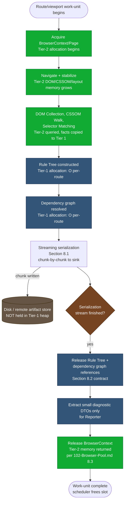

# 004 — Memory Optimization

## 1. Title

**Performance Engineering RFC: Cross-Pipeline Memory Optimization — Streaming Serialization, Prompt Intermediate-State Release, Context-Reuse Tradeoffs, and Profiling Methodology**

## 2. Version

| Field | Value |
|---|---|
| Document Version | 1.0.0 |
| Status | Draft — Phase 14 (Performance) |
| Last Updated | 2026-07-10 |
| Owners | Performance Working Group |
| Stability | Elaborates the memory model committed to in [015-Runtime-Model.md](../architecture/015-Runtime-Model.md) Section 8.5 into concrete, implementable mechanisms; resolves the "streaming serialization" open item flagged in [600-Serialization-Overview.md](../design/600-Serialization-Overview.md) Future Work and the "chunked sub-batching" mitigation referenced by [106-DOM-Snapshot.md](../design/106-DOM-Snapshot.md) Section 14. Sibling to [000-Performance-Overview.md](./000-Performance-Overview.md), [001-Worker-Threads.md](./001-Worker-Threads.md), [002-Parallelization-Strategy.md](./002-Parallelization-Strategy.md), and [003-Rule-Indexing.md](./003-Rule-Indexing.md); feeds numeric targets into [005-Benchmarks.md](./005-Benchmarks.md). |

## 3. Purpose

This document specifies **how the engine keeps its own memory footprint bounded and predictable** as route manifests, stylesheets, and DOM trees scale toward the "huge enterprise" end of the fixture spectrum (`fixtures/enterprise-huge/`, per `BRIEF.md` Section 2.15). It is the concrete engineering counterpart to the architectural memory model already established in [015-Runtime-Model.md](../architecture/015-Runtime-Model.md) Section 8.5 (the Tier-1 Node heap / Tier-2 browser-process / disk-streamed-output three-pool split) and to the isolation-vs-reuse tension already surfaced, at the browser-pool level, in [102-Browser-Pool.md](../design/102-Browser-Pool.md) Sections 8.1, 8.9, and 13.

Four concerns are in scope:

1. **Streaming output** instead of buffering whole-page DOM snapshots or whole-batch result sets — extending REQ-513's streaming-output requirement, already partially specified in [015-Runtime-Model.md](../architecture/015-Runtime-Model.md) Section 8.5, down to the serializer's own internal emission strategy, closing the gap [600-Serialization-Overview.md](../design/600-Serialization-Overview.md) Future Work left open.
2. **Prompt release of per-route intermediate state** — the Rule Tree ([302-Rule-Tree.md](../design/302-Rule-Tree.md)) and the runtime dependency graph ([014-Dependency-Graph.md](../architecture/014-Dependency-Graph.md), [507-Dependency-Graph-Construction.md](../algorithms/507-Dependency-Graph-Construction.md)) — once serialization for that route/viewport completes, rather than retaining them for the lifetime of the batch.
3. **Browser-context memory reuse versus fresh-context-per-route**, quantifying the isolation-vs-GC-pressure tradeoff that [102-Browser-Pool.md](../design/102-Browser-Pool.md) Section 8.9 names but does not fully cost out, and giving operators a decision procedure rather than a binary default.
4. **Memory profiling methodology** — heap snapshots for Tier 1, peak RSS tracking per route/viewport for Tier 2, and how the two are correlated into a single diagnosable picture rather than two disconnected numbers.

This document does not re-derive the three-tier model itself (that is [015-Runtime-Model.md](../architecture/015-Runtime-Model.md) Section 8.5's job); it takes that model as given and asks, for each tier, "what concrete mechanism keeps this tier's peak usage bounded, and how do we know it's working."

## 4. Audience

- Implementers of `packages/serializer`, who must build the chunk-emission machinery this document specifies rather than the "collect all, then write" pattern REQ-513 already warns against.
- Implementers of `packages/collector` and `packages/dependency-graph`, who own the Rule Tree and dependency-graph lifecycles this document requires to be released promptly.
- Implementers of `packages/browser`, who own the context-reuse opt-in this document quantifies the cost/benefit of.
- Performance engineers and CI operators who need a repeatable profiling methodology to validate memory claims empirically rather than trusting Big-O arguments alone, and who consume this document's numeric targets in [005-Benchmarks.md](./005-Benchmarks.md).
- Senior engineers evaluating whether this engine is safe to run, unmodified, against genuinely enterprise-scale sites (tens of thousands of routes, tens of thousands of rules per stylesheet) inside a memory-constrained CI runner.

## 5. Prerequisites

Readers should already be familiar with:

- V8's heap model (young/old generation, major/minor GC, external memory accounting for `Buffer`/`ArrayBuffer`-backed data) and Node's `--max-old-space-size`, `process.memoryUsage()`, and `v8.getHeapSnapshot()` APIs.
- Operating-system-level RSS (Resident Set Size) as distinct from V8 heap size — a Node process's RSS includes the V8 heap, but also native addon memory, `Buffer` allocations outside the V8 heap, and (critically for this engine) the memory of any child renderer processes it has spawned, which RSS-per-process does *not* aggregate automatically.
- Node.js streams (`Readable`/`Writable`, backpressure via `.write()`'s boolean return and the `'drain'` event) as the mechanism underlying this document's streaming-serialization design.
- The Tier-1/Tier-2/disk three-pool memory model from [015-Runtime-Model.md](../architecture/015-Runtime-Model.md) Section 8.5, and the Browser Pool's acquire/release protocol from [102-Browser-Pool.md](../design/102-Browser-Pool.md) Section 8.

## 6. Related Documents

- [015-Runtime-Model.md](../architecture/015-Runtime-Model.md) — the architectural memory model (Section 8.5) this document elaborates.
- [102-Browser-Pool.md](../design/102-Browser-Pool.md) — the browser-context isolation-unit design and the `reuseContextForSameViewport` opt-in this document costs out (Sections 8.1, 8.9, 13).
- [106-DOM-Snapshot.md](../design/106-DOM-Snapshot.md) — the eager DOM-collection design whose Section 14 flags chunked sub-batching as the mitigation for pathologically large DOMs, which this document's streaming design generalizes.
- [302-Rule-Tree.md](../design/302-Rule-Tree.md) — the Rule Tree's flat-array/columnar layout and its Section 8.2 GC-pressure argument, which motivates this document's prompt-release requirement.
- [014-Dependency-Graph.md](../architecture/014-Dependency-Graph.md) and [507-Dependency-Graph-Construction.md](../algorithms/507-Dependency-Graph-Construction.md) — the runtime dependency graph whose per-route lifetime this document bounds.
- [600-Serialization-Overview.md](../design/600-Serialization-Overview.md) — whose Future Work section flags streaming serialization as an open item; this document closes it.
- [003-Requirements.md](../architecture/003-Requirements.md) — REQ-513 (streaming output), REQ-512 (worker-thread parallelism), REQ-553 (enterprise CI fitness), whose memory implications this document operationalizes.
- [000-Performance-Overview.md](./000-Performance-Overview.md) — Phase 14's index document, situating this file among its siblings.
- [001-Worker-Threads.md](./001-Worker-Threads.md), [002-Parallelization-Strategy.md](./002-Parallelization-Strategy.md), [003-Rule-Indexing.md](./003-Rule-Indexing.md) — sibling Phase 14 documents; this document's context-reuse discussion assumes the concurrency model those documents specify.
- [005-Benchmarks.md](./005-Benchmarks.md) — the benchmark suite that empirically validates every complexity and threshold claim this document makes.

## 7. Overview

Three failure modes motivate this document, each observed (or directly predicted by existing architecture documents) at enterprise scale:

**Failure mode 1 — batch-level buffering.** A naive implementation collects every route's `ExtractionResult` into an in-memory array and writes the whole batch at the very end. For a route manifest with tens of thousands of entries, this makes Tier-1 (Node heap) memory scale as `O(routes × avg-result-size)` — exactly the anti-pattern [015-Runtime-Model.md](../architecture/015-Runtime-Model.md) Section 8.5 already names and REQ-513 already forbids at the architectural level. This document is where the *mechanism* satisfying that requirement is specified down to the serializer's own emission strategy, not merely at the route-batch-scheduler level [015-Runtime-Model.md](../architecture/015-Runtime-Model.md) Section 10.1 already covers.

**Failure mode 2 — retained per-route intermediate state.** Even with route-level streaming in place, a subtler leak remains: if the Rule Tree and dependency graph built for route N are not explicitly dereferenced once route N's serialization completes, they remain reachable for as long as any code path (a diagnostic reporter, a plugin hook, a closure capturing the whole `ExtractionContext`) still holds a reference. At `fixtures/enterprise-huge/` scale (50,000+ rules per stylesheet, per [302-Rule-Tree.md](../design/302-Rule-Tree.md) Section 15), a single Rule Tree can be a multi-megabyte live object graph; retaining `C` of them simultaneously (one per in-flight route, per the bounded-concurrency scheduler in [015-Runtime-Model.md](../architecture/015-Runtime-Model.md) Section 10.1) is by design and acceptable, but retaining more than `C` — because completed routes' Rule Trees were never released — silently degrades the `O(concurrency)` memory bound the whole streaming architecture exists to guarantee back toward `O(routes)`.

**Failure mode 3 — browser-process memory under naive context management.** [102-Browser-Pool.md](../design/102-Browser-Pool.md) Section 8.1 already establishes `BrowserContext` as the default isolation unit, torn down on every `release()`. This is correct for correctness, but it has a memory-*shape* consequence this document quantifies: context teardown forces Chromium to release that context's DOM/CSSOM/layout memory back to the OS (or at least to Chromium's own allocator, subject to its own reuse heuristics) on a fixed cadence — once per route — rather than allowing memory to accumulate across routes the way a long-lived reused context's heap might, subject to V8/Blink's own GC timing rather than an explicit teardown boundary. This is a *good* property for peak-memory predictability, but it is not free: context creation has a fixed latency cost (Section 8.1's launch-time argument), and an operator optimizing purely for throughput, not peak memory, may reasonably want to trade some of that predictability away. Section 8 of this document gives the decision procedure.

The remainder of this document specifies, in turn: a streaming-serialization design that generalizes the escape valve [015-Runtime-Model.md](../architecture/015-Runtime-Model.md) Section 8.5 already sketches at the batch level down to the serializer's internal chunk-emission protocol; an explicit release-on-completion contract for the Rule Tree and dependency graph; a quantified decision procedure for context reuse versus fresh-context-per-route; and a profiling methodology combining V8 heap snapshots (Tier 1) with peak-RSS-per-route tracking (Tier 2) into one coherent diagnostic picture.

## 8. Detailed Design

### 8.1 Streaming Serialization

**Why streaming, and why at the serializer level specifically.** [015-Runtime-Model.md](../architecture/015-Runtime-Model.md) Section 8.5 already establishes that completed `ExtractionResult`s should be written to disk as soon as they are finalized, changing Tier-1 memory from `O(routes)` to `O(concurrency)`. That is a *batch-level* streaming property: it bounds how many completed results are held simultaneously, but it says nothing about whether a *single* result's serialization itself buffers its entire output string in memory before any of it is written. For the overwhelming majority of routes this distinction is academic — a single page's critical CSS output, even at enterprise scale, is typically kilobytes to low hundreds of kilobytes, trivially fitting in memory as one contiguous string. [600-Serialization-Overview.md](../design/600-Serialization-Overview.md) Future Work correctly identifies this as "an unusual enterprise case," not the common one — but it is not vacuous: a synthetic worst case (a single route whose above-the-fold viewport nonetheless matches against a stylesheet with 50,000+ utility-class rules, each contributing a full declaration block, per the `fixtures/enterprise-huge/` utility-class variant referenced in [602-Deduplication.md](../design/602-Deduplication.md)) can produce a single serialized output large enough — several megabytes of formatted CSS text plus an accompanying source map — that holding it as one in-memory string before any of it reaches disk is a measurable, avoidable peak-memory spike riding on top of the otherwise well-controlled `O(concurrency)` batch-level bound.

**Design.** The Serializer is restructured around a `SerializationStream` abstraction: rather than a function `serialize(ruleTree: RuleTree, depGraph: DependencyGraph) -> string`, the entry point becomes `serialize(ruleTree, depGraph, sink: Writable) -> Promise<SerializationSummary>`, where `sink` is a Node `Writable` (typically a `fs.createWriteStream()` handle, but transparently substitutable with an in-memory `Writable` for callers — such as the CLI's `--stdout` mode or unit tests — that genuinely need the whole string). The Serializer's canonical-ordering sort (per [006-Design-Principles.md](../architecture/006-Design-Principles.md)'s Canonical Ordering discipline) is unaffected — sorting the Rule Tree's already-matched, already-deduplicated entries is a Tier-1 CPU-bound step over data already resident in memory, orthogonal to how the *output* is emitted — but the subsequent formatting/emission pass is restructured from "build one string, return it" to "emit one rule's formatted declaration block per `sink.write()` call, respecting the stream's backpressure signal." Source-map segment emission ([605-Source-Maps.md](../design/605-Source-Maps.md)) is threaded through the same sink using the streaming-VLQ-encoding approach that document's own Future Work anticipates, keeping the two artifact streams (CSS text, source map) synchronized chunk-for-chunk rather than requiring either to be fully materialized before the other can begin.

**Backpressure is not optional.** A streaming design that ignores `Writable.write()`'s boolean return value (`false` meaning "internal buffer is full, caller should pause") merely relocates the buffering problem from the Serializer's own code into the stream's internal buffer, achieving no net memory improvement — Node's stream implementation will happily buffer an unbounded number of `write()` calls in memory if the producer never respects `'drain'`. The specified emission loop (Section 10.1's pseudocode) therefore explicitly awaits `'drain'` when `write()` returns `false`, which is also what makes the streaming design compose correctly with a slow disk or a rate-limited remote artifact store (an S3-backed `Writable`, for a CI pipeline uploading directly to blob storage) without the Serializer needing any sink-specific knowledge.

**What does not change.** The Serializer's *decision-making* — which rules to include, in what canonical order, how `@media`/`@supports`/`@layer` wrapping is nested (per [303-Media-Rules.md](../design/303-Media-Rules.md), [304-Supports-Rules.md](../design/304-Supports-Rules.md), [305-Cascade-Layers.md](../design/305-Cascade-Layers.md)) — is entirely unaffected by this document; streaming is purely an emission-strategy change, deliberately kept orthogonal to correctness-affecting logic so that the two concerns can be tested (and reviewed) independently, per this project's general preference (evident throughout [006-Design-Principles.md](../architecture/006-Design-Principles.md)) for additive, isolated changes over changes that touch correctness and performance in the same commit.

### 8.2 Prompt Release of Per-Route Intermediate State

**The contract.** Once a route/viewport's `ExtractionResult` has been fully written (the `SerializationStream`'s terminal `'finish'` event has fired), the orchestrating code (the per-route work-unit state machine described architecturally in [011-Execution-Pipeline.md](../architecture/011-Execution-Pipeline.md)) MUST drop its own references to that route's Rule Tree and dependency graph before returning the route's work-unit as complete to the scheduler. Concretely, this means the `ExtractionContext` object threaded through a single route's pipeline stages (per [011-Execution-Pipeline.md](../architecture/011-Execution-Pipeline.md)'s stage table) is not itself retained across route boundaries in any master collection — the bounded-concurrency scheduler (per [015-Runtime-Model.md](../architecture/015-Runtime-Model.md) Section 10.1) tracks only `inFlight`-set membership, a `RouteDescriptor` and a `Promise`, never the `ExtractionContext` itself once that promise resolves.

**Why this needs to be a stated contract rather than an emergent property.** V8's garbage collector reclaims genuinely unreachable objects automatically — nothing in this document asks implementers to manually free memory in a language that does not support that. The risk this section addresses is not V8 failing to collect garbage; it is application code *accidentally keeping objects reachable* longer than necessary, which is a correctness bug in the application's reference graph, not a GC deficiency. Three concrete accidental-retention paths are named explicitly so implementers watch for them:

1. **Diagnostic/reporting code that accumulates full context objects "just in case," rather than the specific, small diagnostic DTOs (matched-selector reports, timing reports, per [007-Repository-Structure.md](../architecture/007-Repository-Structure.md) Section 2.12's diagnostics list) actually needed for the batch-level report.** The Reporter (Tier 1, per [015-Runtime-Model.md](../architecture/015-Runtime-Model.md) Section 9.1's stage table) must be specified to extract and retain only the named diagnostic DTOs at the moment each route completes, never a reference to that route's full `RuleTree`/`DependencyGraph` objects themselves.
2. **A plugin's `afterSerialize` hook (per `BRIEF.md` Section 2.13) closing over the full context object in a way that outlives the hook's own invocation** — e.g., a plugin author pushing the context object itself (rather than a derived, small summary) onto a plugin-owned array for later use. Per [015-Runtime-Model.md](../architecture/015-Runtime-Model.md) Section 8.6, plugin code runs in-process with full access to whatever object references the hook dispatcher passes it; the hook dispatcher's contract (Principle 7's "narrow, typed context object" per [006-Design-Principles.md](../architecture/006-Design-Principles.md)) already limits *what* is passed, but cannot prevent a plugin from retaining what it *is* given for longer than intended. This is a documented plugin-authoring hazard (Section 12), not a violation the runtime can mechanically detect and reject.
3. **A closure captured earlier in the pipeline (e.g., an error handler registered at route-start time) that captures the entire `ExtractionContext` in its closure scope for error-reporting purposes**, and is itself retained in an event-listener array longer than the route's lifetime (a classic Node `EventEmitter` listener-leak pattern). Implementers must ensure any such listener is deregistered as part of the same completion step that triggers Rule-Tree/dependency-graph release, not left to be garbage-collected "eventually" alongside its captured closure — deregistration is what actually breaks the reachability chain.

**Interaction with the worker-thread model.** [001-Worker-Threads.md](./001-Worker-Threads.md) and [015-Runtime-Model.md](../architecture/015-Runtime-Model.md) Section 8.3's Axis-1 taxonomy already establish that dependency-graph fixed-point bookkeeping and Serializer sorting may run inside a dedicated worker thread, communicating with the main thread via structured-clone message passing. This is, incidentally, a *forcing function* that helps this section's contract rather than working against it: a worker thread's own heap is entirely separate from the main thread's, and a worker thread that terminates (or is recycled) after finishing a route's CPU-bound work discards that worker's entire heap — including any Rule-Tree/dependency-graph data that crossed into it — as a side effect of the worker's own lifecycle, independent of whether the main thread's reference-discipline (this section's contract) is perfectly followed. This makes the worker-thread axis a natural, structurally-enforced backstop for this section's discipline, though it does not substitute for correct reference management on the main thread, where the *original* Rule Tree and dependency graph objects (prior to the structured-clone copy sent to a worker) still live and must still be released per this section's contract.

### 8.3 Browser-Context Memory Reuse Versus Fresh-Context-Per-Route

**The tension, quantified.** [102-Browser-Pool.md](../design/102-Browser-Pool.md) Section 8.1 establishes `BrowserContext` teardown-on-release as the default, for isolation reasons stated there; Section 8.9 names an opt-in `reuseContextForSameViewport` mode as a documented alternative but does not quantify when an operator should reach for it. This document supplies that quantification along three axes:

| Axis | Fresh context per route (default) | Reused context (opt-in) |
|---|---|---|
| **Isolation** | Complete — no `localStorage`, cookie, IndexedDB, or global-`window`-state leakage between routes is possible, because the context itself does not survive between routes. | Only as good as the target application's own state hygiene — a target page that sets persistent state deliberately (analytics cookies, a client-side router's cached navigation state) can leak that state into the next route's evaluation, silently corrupting cross-route determinism (REQ-500) in a way that is specific to the *target application under test*, not to this engine's own code. |
| **Peak Tier-2 memory shape** | Sawtooth: memory rises during a route's navigation/collection, then drops sharply back toward baseline at context teardown, bounded by `maxConcurrency × single-route-peak`, independent of total route count — matching [102-Browser-Pool.md](../design/102-Browser-Pool.md) Section 14's `O(maxConcurrency × avgContextMemoryFootprint)` claim. | Monotonically-trending-upward-then-plateauing within a single reused context's lifetime, because Blink's own context-scoped allocator does not necessarily return all freed memory to the OS between navigations within the same context (a known characteristic of Chromium's internal partition allocator, not a bug this engine can fix); peak memory per reused-context "slot" can therefore exceed a single fresh context's peak, though total peak across all `maxConcurrency` slots is still bounded by the same ceiling — the risk is a *slower-draining* peak, not an unbounded one. |
| **Throughput** | Pays one context-creation cost per route (Section 8.1's launch-time argument; small relative to navigation cost for typical pages, but non-negligible at very high route-manifest scale with fast-loading pages). | Amortizes context-creation cost across N same-viewport routes in sequence, trading it for a `Page.reset()`-equivalent cost per route instead — measurably cheaper per [102-Browser-Pool.md](../design/102-Browser-Pool.md) Section 14's cold-start-vs-warm-acquisition latency split, at the cost above. |

**Decision procedure.** An operator should reach for `reuseContextForSameViewport` only when *all* of the following hold, and should otherwise accept the default:

1. The target application is known (through prior audit, not assumption) not to set cross-navigation persistent state that would affect selector matching, visibility geometry, or any other input to this engine's own decisions — this is a claim about the *page under test*, which this engine cannot verify automatically, hence the opt-in, documented-risk framing rather than a runtime safety check.
2. The route manifest contains long sequential runs of same-viewport routes (context reuse requires matching viewport, per Section 8.9's naming), making the amortization benefit real rather than theoretical — a route manifest that interleaves viewports every route gets none of the throughput benefit while still carrying the isolation risk.
3. Empirical benchmarking (per [005-Benchmarks.md](./005-Benchmarks.md)) on a representative sample of the *actual* target site, not merely the synthetic fixture suite, shows a throughput improvement large enough to justify accepting the residual isolation risk — this document deliberately declines to state a universal numeric threshold, because the tradeoff is inherently target-application-dependent in a way no synthetic fixture can fully stand in for.

This decision procedure is intentionally conservative — it treats isolation as the default and reuse as something to be earned by evidence — consistent with [102-Browser-Pool.md](../design/102-Browser-Pool.md) Section 13's own tradeoff table framing a silent isolation violation as "strictly worse than a recoverable performance cost."

### 8.4 Memory Profiling Methodology

**Two tiers, two instruments, one correlated picture.** Per [015-Runtime-Model.md](../architecture/015-Runtime-Model.md) Section 14's profiling guidance (which this section operationalizes into concrete tooling and procedure), Tier-1 and Tier-2 memory require genuinely different instruments, and conflating them — reading only one number and drawing conclusions about the whole system — is the single most common methodological error this section exists to prevent.

**Tier 1 — V8 heap snapshots.** Node's `v8.getHeapSnapshot()` (or the equivalent `--inspect` DevTools "Take Heap Snapshot" action) is taken at three fixed points per benchmark run: immediately after startup (baseline), at the midpoint of a large batch (steady-state, `concurrency` routes in flight), and immediately after the batch completes but before process exit (post-drain — this snapshot is the direct empirical check on Section 8.2's release-on-completion contract: a post-drain snapshot showing retained `RuleTree`/`DependencyGraph` instances in numbers exceeding what a handful of slow-to-finalize diagnostics might plausibly hold indicates a reference-retention bug). Heap snapshots are diffed (`snapshot2 - snapshot1` via retained-size comparison, a standard Chrome DevTools heap-snapshot-comparison workflow) rather than read in isolation, because a single snapshot's absolute retained size is far less diagnostic than its *growth* between two points that should, by this document's design, show near-identical steady-state memory.

**Tier 2 — peak RSS per route/viewport.** Because Chromium's renderer-process memory is invisible to Node's own `process.memoryUsage()` (which reports only the Node host process's own memory), Tier-2 measurement requires OS-level process monitoring correlated back to the specific route/viewport that process was serving at the time. The benchmark harness (specified fully in [005-Benchmarks.md](./005-Benchmarks.md)) samples each renderer child process's RSS (via `/proc/<pid>/status`'s `VmRSS` on Linux CI runners, or Playwright's own CDP `Memory.getProcessMemoryDistribution` where available for closer-to-ground-truth JS-heap-plus-DOM breakdown rather than whole-process RSS) at a fixed interval (default 250ms) for the duration of each route/viewport's extraction, retaining the observed maximum as that route's "peak RSS" figure. This is deliberately a *sampled maximum*, not a continuously-integrated average — the failure mode this document cares about most (an OOM-killed host, per [015-Runtime-Model.md](../architecture/015-Runtime-Model.md) Section 12's edge case) is triggered by a transient peak, not by sustained average usage, so the sampled-max methodology is the one that actually predicts the failure this profiling exists to prevent.

**Correlating the two.** A single "memory report" artifact per benchmark run (consumed by [005-Benchmarks.md](./005-Benchmarks.md)'s regression-detection pipeline) pairs each route/viewport's Tier-2 peak RSS with the Tier-1 heap-snapshot delta measured across that same route's processing window, plus the route's wall-clock duration. This makes it possible to distinguish, for a route that shows elevated total memory, whether the elevation is a Tier-1 problem (this engine's own reference-retention discipline, Section 8.2, has a bug) or a Tier-2 problem (the target page itself is unusually memory-heavy, which is a property of the page under test, not of this engine, per [015-Runtime-Model.md](../architecture/015-Runtime-Model.md) Section 8.5's Tier-2 definition) — a distinction that matters enormously for what action, if any, an operator should take.

## 9. Architecture

### 9.1 Memory Lifecycle Per Extraction



**Reading the diagram.** The two colored bands (Tier 1, Tier 2) each rise and fall independently and on different triggers: Tier-2 memory rises at context acquisition and falls at context release (a coarse, per-route boundary owned by [102-Browser-Pool.md](../design/102-Browser-Pool.md)); Tier-1 memory for this specific route's Rule Tree and dependency graph rises as those structures are built and falls at the `Release` step immediately following serialization completion (Section 8.2's contract) — a boundary that occurs *before* context release, not after, because there is no dependency requiring the browser context to remain open once all browser-side querying for that route has already happened and been copied into Tier-1 structures. Disk-streamed output (the amber band) never appears as a peak in either tier's memory graph at all, which is precisely the property Section 8.1 is designed to produce.

## 10. Algorithms

### 10.1 Algorithm: Backpressure-Respecting Streaming Serialization

**Problem statement.** Given a canonically-sorted, already-matched `RuleTree` (from [302-Rule-Tree.md](../design/302-Rule-Tree.md)) and its associated resolved `DependencyGraph` fragment (ordering constraints only — the actual dependency-driven inclusion decisions have already been made upstream per [507-Dependency-Graph-Construction.md](../algorithms/507-Dependency-Graph-Construction.md)), emit the formatted CSS output to a `Writable` sink such that peak additional memory used by the emission process itself is bounded independent of total output size, and the emission loop never issues a `write()` faster than the sink can drain.

**Inputs.** `ruleTree: RuleRecord[]` (canonically ordered, per Section 8.1); `atRuleContexts: AtRuleContextRecord[]` (side-table, per [302-Rule-Tree.md](../design/302-Rule-Tree.md) Section 7); `sink: Writable`; `sourceMapSink: Writable | null`.

**Outputs.** `Promise<SerializationSummary>` — resolves once `sink` emits `'finish'`, carrying byte-count and rule-count totals for diagnostics (small, fixed-size — not the output itself).

**Pseudocode.**

```text
function streamSerialize(ruleTree, atRuleContexts, sink, sourceMapSink) -> Promise<SerializationSummary>:
    openContexts = new Stack()          // tracks currently-open @media/@supports/@layer wrappers
    bytesWritten = 0
    rulesWritten = 0
    sourceMapState = initVlqState()     // small, fixed-size incremental encoder state

    for record in ruleTree:             // O(R), single forward pass, canonical order already established
        targetContext = atRuleContexts[record.contextId]

        closeCount = divergingSuffixLength(openContexts, targetContext.path)
        for i in 1..closeCount:
            chunk = renderContextClose(openContexts.pop())
            await writeChunk(sink, chunk)          // may await 'drain'

        for ctx in targetContext.path.suffixAfter(openContexts):
            chunk = renderContextOpen(ctx)
            await writeChunk(sink, chunk)
            openContexts.push(ctx)

        declarationChunk = renderDeclarationBlock(record)   // O(declarations in this rule)
        await writeChunk(sink, declarationChunk)
        bytesWritten += declarationChunk.length
        rulesWritten += 1

        if sourceMapSink != null:
            mapChunk = encodeVlqSegment(sourceMapState, record.originalLocation)  // O(1) amortized
            await writeChunk(sourceMapSink, mapChunk)

    while openContexts.length > 0:
        chunk = renderContextClose(openContexts.pop())
        await writeChunk(sink, chunk)

    await endStream(sink)
    if sourceMapSink != null: await endStream(sourceMapSink)

    return { bytesWritten, rulesWritten }

function writeChunk(stream, chunk) -> Promise<void>:
    canContinue = stream.write(chunk)
    if not canContinue:
        await onceEvent(stream, 'drain')   // backpressure: pause producer until sink signals ready
```

**Time complexity.** `O(R + D)` where `R` is total rule count and `D` is total declaration count across all rules — a single forward pass over the already-sorted Rule Tree, with `openContexts` stack operations amortizing to `O(1)` per rule across the whole pass (each at-rule context is pushed and popped at most once per contiguous run of rules sharing it, and canonical ordering already groups same-context rules contiguously, per [302-Rule-Tree.md](../design/302-Rule-Tree.md)'s ordering guarantee). This is asymptotically identical to the non-streaming "build one string" approach — streaming changes *memory* shape, not asymptotic CPU cost.

**Memory complexity.** `O(k + c)` where `k` is the maximum at-rule nesting depth (the `openContexts` stack's bound, small and bounded per [302-Rule-Tree.md](../design/302-Rule-Tree.md) Section 10) and `c` is a small constant chunk-buffer size (the largest single `renderDeclarationBlock`/`renderContextOpen` output, bounded by a single rule's declaration count, not by total output size) — critically, **not** `O(R)` or `O(bytes-of-total-output)`, which is the entire improvement this algorithm delivers over "build one string, then write it."

**Failure cases.** A sink that never emits `'drain'` after signaling backpressure (a misbehaving or already-destroyed stream) causes the emission loop to hang indefinitely awaiting an event that will never fire; the implementation must wrap the `'drain'` wait in the same per-route timeout budget REQ-554 already mandates for browser operations, surfacing a `SerializationTimeoutError` rather than hanging the route's work-unit forever. A sink that emits an `'error'` event mid-stream (a disk-full condition, a network interruption to a remote artifact store) must abort the remaining loop iterations immediately rather than continuing to accumulate `write()` calls against a now-broken stream.

**Optimization opportunities.** The `divergingSuffixLength`/context-open-close bookkeeping is a candidate for the same worker-thread offload [001-Worker-Threads.md](./001-Worker-Threads.md) already applies to canonical sorting, if profiling (Section 8.4) shows context-tracking overhead, not I/O wait, dominates a particular workload's serialization wall-clock time — though for the overwhelmingly I/O-bound common case, the `await writeChunk` backpressure waits are expected to dominate wall-clock time far more than the `O(1)`-amortized bookkeeping around them, making this optimization low-priority absent contrary benchmark evidence.

## 11. Implementation Notes

- The `Writable` sink abstraction must be constructed once per route, not shared or pooled across routes — a shared sink would reintroduce exactly the cross-route coupling this document's isolation-and-independent-release philosophy is designed to avoid, and would make partial-batch-failure/resume semantics (per [015-Runtime-Model.md](../architecture/015-Runtime-Model.md) Section 13's tradeoff table) substantially harder to reason about.
- Rule-Tree and dependency-graph release (Section 8.2) should be implemented as an explicit `context.ruleTree = null; context.dependencyGraph = null;`-style dereference at the completion step, not merely "let it go out of scope naturally" — an explicit dereference is more auditable in code review and is immune to a future refactor accidentally introducing a longer-lived closure that recaptures the reference.
- The `reuseContextForSameViewport` opt-in (Section 8.3) must be surfaced in configuration as an explicit, named, documented flag — never inferred automatically from route-manifest shape — per this document's conservative decision-procedure stance in Section 8.3.
- Heap-snapshot capture (Section 8.4) adds its own overhead (a full heap snapshot can itself take seconds and temporarily increase memory) and must therefore be opt-in, invoked only in dedicated profiling/benchmark runs (per [005-Benchmarks.md](./005-Benchmarks.md)), never in production batch runs by default.

## 12. Edge Cases

- **A route whose single-viewport output alone is large enough to be memory-relevant** (the enterprise utility-class worst case, Section 8.1) is exactly the case streaming serialization targets; a route whose output is small (the common case) still benefits from streaming's uniform code path, just without a measurable peak-memory difference versus the non-streaming alternative — the design deliberately does not special-case "small vs. large" output, applying one streaming code path uniformly for simplicity and testability (per [006-Design-Principles.md](../architecture/006-Design-Principles.md) Principle 6).
- **A plugin's `beforeSerialize`/`afterSerialize` hook (per `BRIEF.md` Section 2.13) that expects to receive or return a complete string**, written against a pre-streaming plugin API version, requires either a compatibility shim (buffering the stream into a string solely for that plugin's hook invocation, accepting the memory cost locally and only for plugins that request it) or a documented plugin-API version boundary; this project's plugin capability-declaration model ([015-Runtime-Model.md](../architecture/015-Runtime-Model.md) Section 8.6) is the natural place to add a `needsFullOutputString` capability flag gating which behavior a given plugin receives.
- **Context reuse combined with a plugin that itself sets persistent browser state** (e.g., a plugin injecting a script via `beforeCollection` that writes to `localStorage` for its own bookkeeping) compounds the isolation risk named in Section 8.3 in a way that is specific to *this engine's own plugin's* behavior, not only the target application's — this should be called out explicitly in plugin-authoring documentation as an additional reason plugin authors should avoid persistent browser-side state absent an explicit, declared need.
- **A worker-thread crash (per [015-Runtime-Model.md](../architecture/015-Runtime-Model.md) Section 12) occurring mid-serialization**, after some chunks have already been written to the sink but before the stream has been properly finished, leaves a partial, invalid output artifact on disk; the re-queuing behavior that document already specifies for worker crashes must be paired, in this document's streaming design, with either a fresh sink (a new output file, with the partial one discarded/overwritten) or an idempotent truncate-and-restart of the same sink — never an append, which would silently corrupt the artifact with duplicated content.
- **Memory profiling's own sampling interval (Section 8.4, default 250ms) missing a very short-lived spike** (a peak narrower than the sampling interval) is a known limitation of sampled-maximum RSS tracking; for routes suspected of pathological short-lived spikes, [005-Benchmarks.md](./005-Benchmarks.md)'s methodology allows a tighter sampling interval as an explicit, opt-in, higher-overhead profiling mode rather than lowering the default interval for all runs.

## 13. Tradeoffs

| Decision | Chosen | Rejected Alternative | Why |
|---|---|---|---|
| Streaming serialization via `Writable` sink, chunk-by-chunk | Buffer full output string, write once | Buffering is simpler and was `600-Serialization-Overview.md`'s original design; rejected for the enterprise-scale-output memory spike it permits, per Section 8.1 |
| Explicit dereference of Rule Tree/dependency graph at route completion (Section 8.2) | Rely on implicit scope-exit garbage collection | Implicit release is correct in the overwhelming majority of code paths but silently fails under the three accidental-retention patterns named in Section 8.2; an explicit, auditable dereference is a small cost that removes a whole class of hard-to-diagnose memory-growth bugs |
| Conservative decision procedure for context reuse (isolation-first default, opt-in reuse gated on evidence) | Default to reuse for its throughput benefit, opt-out for isolation | A silent isolation violation is a correctness bug (per [102-Browser-Pool.md](../design/102-Browser-Pool.md) Section 13's own framing), strictly worse than a recoverable throughput cost; this document inherits that document's risk framing rather than re-litigating it |
| Sampled-maximum RSS tracking (Section 8.4) rather than continuous full-resolution monitoring | Full-resolution (every tick) RSS sampling | Continuous full-resolution sampling itself imposes non-trivial overhead (frequent `/proc` reads or CDP round trips) that would distort the very measurement being taken; a fixed sampling interval is a standard, well-understood tradeoff between measurement fidelity and measurement-induced overhead |
| Heap snapshots at three fixed points (baseline/steady-state/post-drain) rather than continuous heap profiling | Continuous `--prof`-style sampling profiler | Continuous heap profiling has materially higher overhead and produces far more data than needed to validate this document's specific claim (steady-state memory should not grow across routes); three targeted snapshots are sufficient and cheaper, with continuous profiling reserved for deep-dive investigation of an already-suspected leak |

## 14. Performance

- **CPU complexity.** Streaming serialization (Section 10.1) is `O(R + D)`, identical to the non-streaming baseline — this document's changes are memory-shape optimizations, not CPU-complexity improvements, and should not be expected to change wall-clock serialization time materially except insofar as backpressure waits introduce I/O-bound pauses that a buffer-then-write approach would not have (compensated for by that approach's own final, larger, single write incurring its own I/O wait at the end instead).
- **Memory complexity.** Tier-1 per-route intermediate state (Rule Tree, dependency graph) is bounded at `O(concurrency × avg-per-route-structure-size)` given Section 8.2's release contract is honored, down from an unbounded `O(routes × avg-per-route-structure-size)` if it is not; streaming serialization (Section 10.1) removes the additional `O(single-route-output-size)` transient spike a buffer-then-write approach would add on top of that bound for large-output routes.
- **Caching strategy.** This document does not introduce new caching behavior; it is complementary to the Cache Manager's fingerprint-gated short-circuit ([015-Runtime-Model.md](../architecture/015-Runtime-Model.md) Section 9.1), which remains the single highest-leverage memory intervention (a cache hit allocates neither Tier-1 intermediate state nor any Tier-2 browser resources at all for that route).
- **Parallelization opportunities.** The streaming-serialization emission loop (Section 10.1) is itself sequential per route (canonical ordering is inherently a sequential-emission concern) but is fully independent across concurrently-in-flight routes, composing without modification with the Axis-2 route-batching concurrency model ([015-Runtime-Model.md](../architecture/015-Runtime-Model.md) Section 8.3) and the Axis-1 worker-thread offload of the upstream sorting step ([001-Worker-Threads.md](./001-Worker-Threads.md)).
- **Incremental execution.** Section 8.2's prompt-release contract is itself a form of incremental execution at the memory level — each route's intermediate state has a bounded lifetime independent of total batch size, which is what makes the engine's memory profile "incremental" (bounded per unit of concurrent work) rather than "cumulative" (growing with total work done).
- **Profiling guidance.** Follow Section 8.4's methodology precisely: heap snapshots for Tier 1, sampled peak RSS for Tier 2, correlated per route/viewport in a single report. Profile the post-drain heap snapshot first, as the single highest-value check (it directly validates or refutes Section 8.2's central claim) before investing time in steady-state or Tier-2 investigation.
- **Scalability limits.** With Section 8.2's contract honored, Tier-1 memory scalability is bounded by `maxConcurrency`, not by route-manifest size — meaning this document's design, correctly implemented, removes route count as a Tier-1 scalability variable entirely, leaving `maxConcurrency` (a Tier-2, browser-process-memory-bound lever, per [102-Browser-Pool.md](../design/102-Browser-Pool.md) Section 14) as the sole remaining scalability ceiling for the whole system — precisely the outcome [015-Runtime-Model.md](../architecture/015-Runtime-Model.md) Section 8.5 already identifies as the goal.

## 15. Testing

- **Unit tests.** `streamSerialize` (Section 10.1) against a small, hand-constructed Rule Tree with nested `@media`/`@supports` contexts, asserting the emitted chunk sequence matches the expected open/close/declaration ordering byte-for-byte against a golden fixture, and separately asserting behavior when the sink's `write()` synchronously returns `false` (a mock `Writable` that never drains within a test's synchronous window) triggers the expected await-then-resume behavior rather than a hang.
- **Integration tests.** A full route extraction through a mocked sink capturing all chunks, reassembled and compared against the non-streaming baseline serializer's output for the same input, asserting byte-for-byte equivalence — the two code paths must be provably equivalent in output, differing only in memory shape, which is the core correctness invariant this document's change must preserve.
- **Visual tests.** Not directly applicable to this document's scope (serialization emission strategy and memory lifecycle do not affect rendered output); golden-CSS-snapshot comparison (per `BRIEF.md` Section 2.15's testing layers) is the relevant analogue and is covered by the integration-test equivalence check above.
- **Stress tests.** Run the full pipeline against `fixtures/enterprise-huge/`'s utility-class variant (50,000+ rules, per [602-Deduplication.md](../design/602-Deduplication.md) Section 15) with heap snapshots taken per Section 8.4's three-point methodology, asserting post-drain retained size for `RuleRecord`/`DependencyGraph`-typed objects stays within a small constant bound (not growing with cumulative routes processed in the stress run) — this is the direct empirical test of Section 8.2's central release-contract claim.
- **Regression tests.** Track peak RSS and post-drain heap-snapshot retained size, per route category, across engine versions and dependency (Playwright) upgrades, feeding [005-Benchmarks.md](./005-Benchmarks.md)'s regression-detection thresholds — a version bump that increases post-drain retained size beyond a configured tolerance should fail CI per that document's gate design.
- **Benchmark tests.** Measure wall-clock serialization time and peak transient memory for streaming versus a retained non-streaming reference implementation (kept alive in a test-only code path specifically for this comparison) across increasing single-route output sizes, confirming the `O(k + c)` bound in Section 10.1 holds in practice as output size grows into the megabyte range, per [005-Benchmarks.md](./005-Benchmarks.md)'s scaling-curve methodology.

## 16. Future Work

- **Streaming the Rule Tree's own construction, not merely its serialization** — extending [302-Rule-Tree.md](../design/302-Rule-Tree.md) Section 16's windowed/columnar-construction direction to a fully incremental pipeline where rule discovery, matching, and serialization proceed as a single streaming pipeline rather than three discrete phases each requiring the full intermediate structure to exist before the next phase begins; this is a substantially larger architectural change than this document's scope and is deferred pending evidence (from [005-Benchmarks.md](./005-Benchmarks.md)) that Rule-Tree construction itself, not merely serialization, is a measurable peak-memory contributor at realistic scale.
- **Adaptive `reuseContextForSameViewport` selection**, automatically detecting (via a lightweight, opt-in state-leakage probe run once per target site) whether a given target application is safe for context reuse, rather than requiring an operator's manual audit per Section 8.3's decision procedure — explicitly deferred because reliable automatic detection of "does this page set problematic persistent state" is itself a research question, not an engineering one with an obvious near-term answer.
- **CDP-based, sub-250ms-resolution Tier-2 memory sampling** using Chromium's `Memory.getProcessMemoryDistribution` continuously rather than at a fixed polling interval, closing the short-lived-spike blind spot named in Section 12, contingent on confirming the CDP call's own overhead does not itself distort the measurement it is trying to take.
- **Cross-route Tier-2 memory-pressure-driven backpressure** feeding back into the route-batch scheduler (the same open question [015-Runtime-Model.md](../architecture/015-Runtime-Model.md) Future Work and [102-Browser-Pool.md](../design/102-Browser-Pool.md) Future Work both flag and defer identically) — this document's profiling methodology (Section 8.4) is the natural signal source such a mechanism would consume, once the scheduler-side design questions those documents defer are resolved.
- **Formal memory budget configuration** — allowing an operator to specify a target peak-RSS ceiling directly (rather than only the indirect `maxConcurrency` lever) and having the scheduler dynamically infer an appropriate concurrency level from recent per-route peak-RSS observations (per Section 8.4's data), an open research question requiring the adaptive backpressure mechanism above as a prerequisite.

## 17. References

- [015-Runtime-Model.md](../architecture/015-Runtime-Model.md) — Section 8.5, the three-tier memory model this document elaborates.
- [102-Browser-Pool.md](../design/102-Browser-Pool.md) — Sections 8.1, 8.9, 13, the context-isolation-vs-reuse tradeoff quantified in Section 8.3 of this document.
- [106-DOM-Snapshot.md](../design/106-DOM-Snapshot.md) — Section 14's chunked-sub-batching mitigation, generalized here.
- [302-Rule-Tree.md](../design/302-Rule-Tree.md) — Sections 8.2, 10, 15, 16; the flat-layout GC-pressure argument and windowed-construction Future Work item this document's release contract and Future Work build on.
- [014-Dependency-Graph.md](../architecture/014-Dependency-Graph.md), [507-Dependency-Graph-Construction.md](../algorithms/507-Dependency-Graph-Construction.md) — the dependency graph whose per-route lifetime Section 8.2 bounds.
- [600-Serialization-Overview.md](../design/600-Serialization-Overview.md) — Future Work's streaming-serialization item, resolved by Section 8.1/10.1 of this document.
- [605-Source-Maps.md](../design/605-Source-Maps.md) — incremental segment emission, threaded through the same sink per Section 8.1.
- [602-Deduplication.md](../design/602-Deduplication.md) — Section 15, the utility-class enterprise fixture variant used as the streaming-serialization stress case.
- [003-Requirements.md](../architecture/003-Requirements.md) — REQ-513 (streaming output), REQ-512 (worker-thread parallelism), REQ-500 (determinism), REQ-554 (timeout protection).
- [001-Worker-Threads.md](./001-Worker-Threads.md) — Axis-1 concurrency model this document's Section 8.2 interaction analysis and Section 10.1 optimization opportunity both depend on.
- [002-Parallelization-Strategy.md](./002-Parallelization-Strategy.md) — the concurrency model this document's memory bounds are expressed relative to (`maxConcurrency`).
- [003-Rule-Indexing.md](./003-Rule-Indexing.md) — sibling Phase 14 document; rule-indexing structures interact with, but are distinct from, the Rule Tree lifecycle this document bounds.
- [005-Benchmarks.md](./005-Benchmarks.md) — the benchmark suite validating every numeric and complexity claim in this document.
- Node.js documentation — `stream.Writable`, backpressure and the `'drain'` event; `v8.getHeapSnapshot()`; `process.memoryUsage()`.
- Chromium documentation — CDP `Memory` domain (`getProcessMemoryDistribution`); PartitionAlloc behavior as relevant to Section 8.3's reused-context memory-shape discussion.
