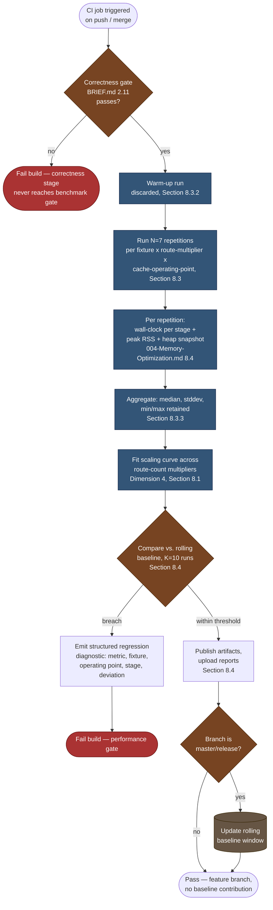

# 005 — Benchmarks

## 1. Title

**Performance Engineering RFC: The Benchmark Suite — Metrics, Fixtures, Methodology, and CI Regression Gating**

## 2. Version

| Field | Value |
|---|---|
| Document Version | 1.0.0 |
| Status | Draft — Phase 14 (Performance) |
| Last Updated | 2026-07-10 |
| Owners | Performance Working Group |
| Stability | Fulfills the forward references left by [007-Repository-Structure.md](../architecture/007-Repository-Structure.md) ("feeding the forthcoming `docs/performance/005-Benchmarks.md`"), [003-Requirements.md](../architecture/003-Requirements.md) ("numeric scalability targets... belong in `../performance/005-Benchmarks.md`"), and [006-Design-Principles.md](../architecture/006-Design-Principles.md) Principle 3's "additive, benchmarked" mandate; operationalizes the CI gate sketched in `BRIEF.md` Section 2.11. Sibling to [000-Performance-Overview.md](./000-Performance-Overview.md), [001-Worker-Threads.md](./001-Worker-Threads.md), [002-Parallelization-Strategy.md](./002-Parallelization-Strategy.md), and [003-Rule-Indexing.md](./003-Rule-Indexing.md); consumes the profiling methodology of [004-Memory-Optimization.md](./004-Memory-Optimization.md). |

## 3. Purpose

Every other document in this repository that makes a Big-O complexity claim also, almost without exception, defers the *empirical* validation of that claim to "Phase 14's benchmark suite" — a phrase that recurs across [007-Repository-Structure.md](../architecture/007-Repository-Structure.md), [101-Playwright-Adapter.md](../design/101-Playwright-Adapter.md), [106-DOM-Snapshot.md](../design/106-DOM-Snapshot.md), [200-Visibility-Engine-Overview.md](../design/200-Visibility-Engine-Overview.md), [202-Intersection-Engine.md](../design/202-Intersection-Engine.md), [206-Fixed-Elements.md](../design/206-Fixed-Elements.md), [303-Media-Rules.md](../design/303-Media-Rules.md), [602-Deduplication.md](../design/602-Deduplication.md), [014-Dependency-Graph.md](../architecture/014-Dependency-Graph.md), [015-Runtime-Model.md](../architecture/015-Runtime-Model.md), and [102-Browser-Pool.md](../design/102-Browser-Pool.md), among others. This document is that suite's specification. It is the single place where "benchmarked," as `006-Design-Principles.md` Principle 3 requires of every performance optimization, is given a concrete, reproducible, CI-enforceable meaning rather than remaining an aspiration each individual design document merely gestures toward.

Four things are specified:

1. **What is measured** — wall-clock time per route/viewport, memory peak (consuming [004-Memory-Optimization.md](./004-Memory-Optimization.md)'s profiling methodology directly), cache hit-rate impact on throughput, and scaling curves as route count grows.
2. **The `fixtures/enterprise-huge/` fixture family** — treated here as the existing, already-referenced fixture concept every sibling document assumes; this document is where its role specifically as a *benchmark* input (as opposed to its correctness/regression role, covered by `BRIEF.md` Section 2.15's testing-layers framing) is made precise.
3. **Methodology** — warm-cache versus cold-cache runs, and the statistical discipline (multiple-run averaging, variance reporting) required before any single number is trusted.
4. **Regression-detection thresholds** feeding the CI gate `BRIEF.md` Section 2.11 sketches at a high level (`Build → Crawl routes → Generate critical CSS → Compare against baseline → Publish artifacts → Upload reports`, "fail build if... CSS grows beyond threshold").

## 4. Audience

- Implementers of any package who are about to submit a performance-optimization PR and need to know exactly what benchmark evidence Principle 3 requires them to attach.
- CI/CD pipeline maintainers wiring the regression gate described here into the pipeline already sketched in `BRIEF.md` Section 2.11.
- Performance engineers investigating a reported regression, who need to know which benchmark, which fixture variant, and which historical baseline to consult.
- Senior engineers evaluating whether this project's performance claims (scattered across a dozen design documents as asymptotic arguments) are backed by reproducible empirical evidence, and how to reproduce that evidence themselves.

## 5. Prerequisites

Readers should be familiar with:

- Basic statistical concepts relevant to microbenchmarking: sample mean, standard deviation, and why a single-run wall-clock measurement on a shared or noisy CI runner is not, by itself, trustworthy evidence of a regression.
- The Tier-1/Tier-2/disk three-pool memory model and the heap-snapshot/peak-RSS profiling methodology specified in [015-Runtime-Model.md](../architecture/015-Runtime-Model.md) Section 8.5 and [004-Memory-Optimization.md](./004-Memory-Optimization.md) Section 8.4, which this document's memory metric directly consumes rather than re-specifying.
- The Cache Manager's fingerprint-gated short-circuit model ([015-Runtime-Model.md](../architecture/015-Runtime-Model.md) Section 9.1), whose cache-hit-rate impact this document measures as a distinct benchmark dimension.
- The bounded-concurrency route-batch scheduling algorithm ([015-Runtime-Model.md](../architecture/015-Runtime-Model.md) Section 10.1), which governs how "wall-clock time per route" composes into a batch-level throughput number.
- General familiarity with CI regression-gate patterns (a build failing because a tracked metric crossed a threshold relative to a stored baseline) as used in performance-sensitive open-source projects (e.g., browser engine or compiler CI benchmark dashboards).

## 6. Related Documents

- [004-Memory-Optimization.md](./004-Memory-Optimization.md) — the memory-profiling methodology (heap snapshots, peak RSS) this document's memory metric consumes verbatim.
- [015-Runtime-Model.md](../architecture/015-Runtime-Model.md) — the Tier-1/Tier-2 memory model, the bounded-concurrency scheduler, and the Cache Manager short-circuit whose effects this document measures.
- [007-Repository-Structure.md](../architecture/007-Repository-Structure.md) — Sections describing `fixtures/` and `benchmarks/`, whose conventions (per-fixture golden output, standalone-runnable `benchmarks/*.bench.js` harnesses, structured JSON output for CI trend-tracking) this document builds directly on.
- [003-Requirements.md](../architecture/003-Requirements.md) — REQ-512, REQ-513, REQ-553, whose qualitative claims this document attaches numeric scalability targets to.
- [006-Design-Principles.md](../architecture/006-Design-Principles.md) — Principle 3, the "additive, benchmarked" mandate this entire document exists to satisfy.
- [102-Browser-Pool.md](../design/102-Browser-Pool.md) — cold-start/warm-acquisition latency and `maxConcurrency`-vs-peak-memory sizing guidance, both explicitly deferred to this document's empirical benchmarking.
- [000-Performance-Overview.md](./000-Performance-Overview.md), [001-Worker-Threads.md](./001-Worker-Threads.md), [002-Parallelization-Strategy.md](./002-Parallelization-Strategy.md), [003-Rule-Indexing.md](./003-Rule-Indexing.md) — sibling Phase 14 documents whose complexity/parallelization/indexing claims this suite validates.
- `BRIEF.md` Section 2.11 (CI/CD pipeline), Section 2.15 (Testing Strategy — Performance benchmarks as a layer), Section 2.19 (Canonical Repository Layout — `fixtures/`, `benchmarks/`).

## 7. Overview

The benchmark suite occupies a specific, narrow niche among this project's four testing layers (per `BRIEF.md` Section 2.15: Unit, Integration, Visual Regression, Golden CSS Snapshots, and — the layer this document specifies — Performance Benchmarks). It is distinct from the other layers in a way worth stating precisely, because conflating benchmark tests with correctness tests is a recurring, named anti-pattern this document must avoid reproducing:

- **Golden CSS snapshot tests answer "is the output correct?"** — byte-for-byte (or semantically-equivalent) comparison against a known-good artifact. They fail on any output difference, however small, and are inherently binary (pass/fail), not continuous.
- **Benchmark tests answer "is the output produced fast enough, and using little enough memory, relative to history?"** — they do not re-validate correctness at all (a benchmark run assumes the golden-snapshot suite already passed for the same input), and they are inherently continuous (a wall-clock number, a memory number), requiring a *threshold*, not an equality check, to turn into a pass/fail CI signal.

This distinction matters architecturally: a benchmark regression and a correctness regression are different failure classes requiring different triage, and this document's CI gate (Section 8.4) is deliberately designed to run *after*, and independently of, the correctness-focused golden-snapshot gate, so that a benchmark-threshold failure is never confused with (or masked by) a correctness failure in the same CI run.

The suite has four measurement dimensions (Section 8.1), one canonical fixture family it leans on most heavily for stress-scale numbers (Section 8.2, `fixtures/enterprise-huge/`), a methodology governing how any single number is trusted enough to compare against history at all (Section 8.3), and a regression-detection mechanism that turns trusted numbers into a CI pass/fail decision (Section 8.4). The remainder of this document specifies each in turn, followed by a runnable harness algorithm (Section 10) that ties measurement, statistical aggregation, and regression comparison into one reusable procedure every individual `benchmarks/*.bench.js` file invokes rather than reimplementing.

## 8. Detailed Design

### 8.1 What Is Measured

**Dimension 1 — Wall-clock time per route/viewport.** The atomic unit of measurement is a single route/viewport extraction's end-to-end wall-clock duration, measured from the moment a `PageHandle` is acquired from the Browser Pool ([102-Browser-Pool.md](../design/102-Browser-Pool.md) Section 8.2) to the moment that route's `SerializationStream` finishes (per [004-Memory-Optimization.md](./004-Memory-Optimization.md) Section 8.1) — deliberately excluding queue-wait time before acquisition, because queue-wait time is a function of concurrency configuration and batch composition (Dimension 4's concern), not of the per-route extraction algorithm's own efficiency, and conflating the two would make a `maxConcurrency` misconfiguration look, incorrectly, like an algorithmic regression. Per-route timings are further broken down by pipeline stage (navigation/stabilization, DOM collection, CSSOM walk/selector matching, dependency resolution, serialization) using the same stage boundaries [011-Execution-Pipeline.md](../architecture/011-Execution-Pipeline.md) already defines architecturally, so that a regression can be attributed to a specific stage rather than only to "the route got slower" in aggregate.

**Dimension 2 — Memory peak.** Consumed directly from [004-Memory-Optimization.md](./004-Memory-Optimization.md) Section 8.4's two-instrument methodology: Tier-1 post-drain heap-snapshot retained size (validating that document's release-on-completion contract holds under benchmark-scale load) and Tier-2 sampled peak RSS per route/viewport. This document does not re-specify the instrumentation; it specifies how these numbers, once collected, become part of a benchmark run's reported result and are subject to the same regression-threshold treatment as wall-clock numbers (Section 8.4).

**Dimension 3 — Cache hit-rate impact on throughput.** Because [015-Runtime-Model.md](../architecture/015-Runtime-Model.md) Section 9.1 identifies the Cache Manager's fingerprint-gated short-circuit as "the single highest-leverage intervention in this whole runtime model," the benchmark suite measures throughput (routes/second, aggregate batch wall-clock) at three fixed cache-hit-rate operating points rather than only one: **0% hit rate** (cold cache, every route pays full extraction cost — the worst case and the one most sensitive to every other performance optimization in this document's scope), **100% hit rate** (every route short-circuits — establishes the fixed per-route overhead floor that exists even when almost no extraction work happens: fingerprint computation and lookup cost), and a **realistic mixed rate** (a fixed 70% hit rate, chosen as a representative steady-state CI value for a route manifest where most routes are unchanged between consecutive runs and only a minority have actually changed markup/CSS). Reporting all three, rather than only a single blended number, is what makes it possible to distinguish "the cache got less effective" (a hit-rate-driven regression, likely a fingerprinting bug) from "extraction itself got slower" (a cold-path regression, likely an algorithmic one) — two very different root causes that a single blended throughput number would conflate.

**Dimension 4 — Scaling curves as route count grows.** Rather than a single fixed-size benchmark run, the suite runs each fixture at a small, fixed set of route-count multipliers (1×, 4×, 16×, 64×, synthetically generated by replicating the base fixture's route manifest with distinct query-string-only variations to avoid cache-fingerprint collisions while preserving identical per-route extraction cost) and fits the resulting (route-count, wall-clock) and (route-count, peak-memory) pairs against the complexity class each relevant design document already claims (e.g., `O(routes)` batch wall-clock under bounded concurrency per [015-Runtime-Model.md](../architecture/015-Runtime-Model.md) Section 10.1's scheduler, `O(concurrency)` — i.e., *flat*, not growing — Tier-1 peak memory per [004-Memory-Optimization.md](./004-Memory-Optimization.md) Section 8.2). A curve that fits a *worse* complexity class than claimed (e.g., empirically superlinear wall-clock growth where linear was claimed) is treated as a scaling regression distinct from, and generally more serious than, a fixed-percentage regression at any single route-count point, because it indicates the regression *compounds* at exactly the enterprise scale this project's acceptance criteria (`BRIEF.md` Section 2.18, "Suitable for enterprise CI pipelines") most depend on.

### 8.2 The `fixtures/enterprise-huge/` Benchmark Fixture

Per [007-Repository-Structure.md](../architecture/007-Repository-Structure.md) Section 2.15/2.19, `fixtures/enterprise-huge/` is the fixture family already established across this repository's design documents as the standard stress-scale input: a 50,000+-rule utility-class stylesheet variant (referenced by [302-Rule-Tree.md](../design/302-Rule-Tree.md) Section 15 and [602-Deduplication.md](../design/602-Deduplication.md) Section 15), a large-DOM variant (tens of thousands of elements, referenced by [106-DOM-Snapshot.md](../design/106-DOM-Snapshot.md) Sections 14–15 and [200-Visibility-Engine-Overview.md](../design/200-Visibility-Engine-Overview.md) Section 15), and a high-dependency-fan-out variant (referenced by [014-Dependency-Graph.md](../architecture/014-Dependency-Graph.md) Section 15). This document does not redefine the fixture; it specifies **how the benchmark suite consumes it**, which is distinct from how the stress-test layer (a different testing layer per `BRIEF.md` Section 2.15) consumes the same fixture:

- **Stress tests** (owned by each individual design document's own Testing section) ask a binary question against this fixture: does the system survive/complete without crashing, timing out, or violating a documented invariant (e.g., [015-Runtime-Model.md](../architecture/015-Runtime-Model.md) Section 15's stress test asking whether the concurrency model degrades gracefully near a memory ceiling rather than OOM-crashing).
- **Benchmark tests** (this document's scope) ask a continuous question against the same fixture: exactly how much wall-clock time and memory does the system use, expressed as a number to be tracked over time and compared against a stored baseline — the fixture is identical, but the question asked of it, and the pass/fail mechanism, are different.

Each `fixtures/enterprise-huge/` variant used for benchmarking (as opposed to stress-testing) additionally requires a **stable, versioned identity** — the fixture's own content must not silently drift between benchmark runs (a fixture change would invalidate historical baseline comparisons exactly as surely as an engine regression would, and the two are easy to confuse without this discipline). This project's fixtures are therefore themselves subject to the same content-fingerprinting discipline the Cache Manager applies to target-page assets ([015-Runtime-Model.md](../architecture/015-Runtime-Model.md) Section 9.1): a benchmark result record (Section 10.1) always includes the fixture's own content hash alongside the engine version under test, so that a historical baseline comparison can detect and refuse to compare across an inadvertent fixture change, surfacing a `FixtureDriftDetected` diagnostic rather than silently reporting a spurious regression or, worse, a spurious improvement.

### 8.3 Methodology — Warm vs. Cold Cache, and Statistical Significance

**Warm vs. cold cache runs, and why both are required.** A cold-cache run (Section 8.1 Dimension 3's 0% operating point) measures the engine's raw extraction algorithms with no caching benefit at all — this is the number every asymptotic-complexity claim in this repository's design documents is actually about, and it is the number most directly comparable across engine versions regardless of how the Cache Manager's own fingerprinting logic evolves. A warm-cache run (the 100% operating point) measures the fixed overhead floor of the fingerprint-check-and-short-circuit path itself — a number that matters because a regression *here* (the cache-check path itself getting slower) would silently erode the benefit caching is supposed to provide, even while every actual extraction algorithm stays fast. Reporting only a blended, realistic-workload number (Section 8.1's 70% mixed point) without also reporting the two pure endpoints would make it structurally impossible to tell which of these two very different problems, if either, caused an observed regression in the blended number — this is the same "conflating two failure classes into one number" hazard Section 7 already warns against for correctness-versus-performance, recurring here at the caching level specifically.

**Multiple-run averaging and variance reporting.** A single benchmark run's wall-clock number, on a shared or virtualized CI runner, is subject to enough environmental noise (host CPU contention from co-scheduled jobs, thermal throttling, filesystem cache state) that a single run is not, by itself, trustworthy evidence of anything. The methodology therefore requires:

1. **A fixed number of repetitions** (default `N=7`, an odd number chosen so a median is unambiguous) of each (fixture, route-count-multiplier, cache-operating-point) combination, run sequentially within the same CI job invocation (not across separate jobs, which would reintroduce host-variance as a confound).
2. **A mandatory warm-up run**, discarded from the reported statistics, before the `N` measured repetitions begin — this absorbs one-time costs (JIT warm-up in V8, OS-level page-cache population for fixture files, Chromium's own first-navigation cold-start cost that [102-Browser-Pool.md](../design/102-Browser-Pool.md) Section 8.1 already identifies as disproportionately expensive relative to subsequent navigations) that are real but are not part of what any individual benchmark is trying to measure.
3. **Median, not mean, as the headline statistic**, with the full distribution (min, max, standard deviation, and all `N` raw values) retained in the structured result artifact — median is more robust to the single-outlier-run problem (one repetition coinciding with an unrelated CI-runner hiccup) than a mean would be, while retaining the full distribution keeps the mean available for anyone who specifically wants it, and makes an unusually high variance itself a visible, diagnosable signal (a benchmark whose `N=7` runs show high standard deviation relative to its median is flagging environmental noise or engine non-determinism worth investigating on its own terms, independent of whether the median itself regressed).
4. **A minimum-detectable-difference floor**, below which the regression gate (Section 8.4) does not fire regardless of the raw percentage change, computed from each benchmark's own historical variance (a benchmark whose historical runs show ±8% run-to-run variance cannot reliably detect a 3% regression, and a fixed global threshold that ignores this would either be too strict for noisy benchmarks or too loose for stable ones — Section 8.4 makes this per-benchmark, not global).

### 8.4 Regression-Detection Thresholds Feeding the CI Gate

**Where this sits in the pipeline.** `BRIEF.md` Section 2.11 sketches the CI pipeline as `Build → Crawl routes → Generate critical CSS → Compare against baseline → Publish artifacts → Upload reports`, failing the build if "CSS grows beyond threshold, missing dependencies detected, extraction errors occur." That sketch is phrased in terms of the *correctness* dimension (golden-snapshot comparison, dependency-graph completeness) — this document's regression gate is the performance-dimension analogue, running as a distinct stage immediately after the correctness gate (never interleaved with it, per Section 7's failure-class-separation principle) and consuming this suite's own benchmark-result artifacts rather than the golden-snapshot comparison's artifacts.

**Threshold model.** Each tracked metric (per-route wall-clock by stage, per-route peak RSS, per-route Tier-1 heap-snapshot delta, batch throughput at each cache operating point, and the fitted scaling-curve exponent from Dimension 4) has an independently configured regression threshold, expressed as a percentage degradation relative to the stored rolling baseline (the median of the same metric's last `K` accepted CI runs on the same branch, default `K=10`, chosen to smooth out ordinary run-to-run variance without letting the baseline drift so slowly that a genuine, sustained regression across several small commits escapes detection by never individually crossing the threshold relative to an already-degraded recent baseline — a known failure mode of naive "compare only to the immediately preceding run" baselining, which this rolling-window design deliberately avoids). Default thresholds, informed by Section 8.3's minimum-detectable-difference floor and adjustable per metric as historical variance data accumulates:

| Metric class | Default threshold | Rationale |
|---|---|---|
| Per-route wall-clock (any pipeline stage) | 10% degradation vs. rolling baseline, and never below the benchmark's own minimum-detectable-difference floor (Section 8.3) | Loose enough to tolerate ordinary CI-runner noise (per Section 8.3's variance data), tight enough to catch a materially real regression before several accumulate |
| Tier-1 post-drain heap-snapshot retained size | Any statistically significant increase (not a percentage — an *absolute*, near-zero-tolerance threshold) | Per [004-Memory-Optimization.md](./004-Memory-Optimization.md) Section 8.2, post-drain retained size should be flat regardless of route count; any sustained increase is evidence of a reference-retention regression, not measurement noise, and should not be tolerated at any percentage |
| Tier-2 peak RSS per route | 15% degradation vs. rolling baseline | Slightly looser than wall-clock because Tier-2 memory is more sensitive to Chromium-version-level noise (per [004-Memory-Optimization.md](./004-Memory-Optimization.md) Section 8.3's PartitionAlloc note) outside this engine's own control |
| Batch throughput at 0%/70%/100% cache operating points | 10% degradation vs. rolling baseline, evaluated independently per operating point (Section 8.3) | Independent evaluation is required precisely so a cache-path-specific regression and a cold-extraction-path regression are never masked by each other |
| Scaling-curve fitted exponent (Dimension 4) | Any move to a worse complexity class (e.g., empirical exponent crossing from ~1.0 toward >1.2 on a log-log fit) | A threshold expressed in complexity-class terms, not percentage, because a scaling regression's danger is precisely that it compounds — a small percentage change in fitted exponent at benchmark-scale route counts corresponds to an enormous absolute difference at true enterprise scale |

**Gate behavior on threshold breach.** A breach on any single tracked metric fails the performance-gate CI stage (distinct from, and running after, the correctness gate per Section 7), publishing a structured diagnostic identifying the specific metric, fixture variant, cache operating point, and the percentage/absolute deviation from baseline — mirroring `BRIEF.md` Section 2.11's "Publish artifacts → Upload reports" steps, but performance-gate-specific rather than reusing the correctness gate's artifact format. Per this project's general preference for actionable rather than merely alarming CI failures (a preference evident throughout [006-Design-Principles.md](../architecture/006-Design-Principles.md)'s emphasis on diagnosability), the failure message names the specific pipeline stage (per Dimension 1's stage breakdown) implicated, so a triaging engineer's first action is "look at the last few commits touching that stage" rather than "re-run the whole benchmark suite and hope for a clearer signal."

**Baseline promotion.** A CI run whose performance gate passes on the `master`/`release` branch (per this repository's branching model, evident in the git history's `Merge branch ... into 'release'` pattern) is eligible to become part of the rolling baseline window for subsequent comparisons; a run on a feature branch is compared *against* the current baseline but never *contributes to* it, preventing an in-progress, not-yet-reviewed performance regression from corrupting the baseline other branches are compared against.

## 9. Architecture

### 9.1 Benchmark Pipeline and Regression-Detection Flow



**Reading the diagram.** The correctness gate (`BRIEF.md` Section 2.11) is a hard prerequisite gating entry into this document's own pipeline — a build with a correctness failure never reaches the benchmark stage at all, which is deliberate: benchmarking an already-known-incorrect implementation produces numbers with no diagnostic value (per Section 7's failure-class-separation principle). Once inside the benchmark pipeline, the flow is strictly linear through measurement and aggregation, then forks at the regression-comparison decision point into either a normal publish-and-possibly-promote path or a diagnostic-and-fail path — the baseline-promotion fork (bottom right) is evaluated only on the passing path, ensuring a regression can never itself become the new baseline other branches are unfairly compared against.

## 10. Algorithms

### 10.1 Algorithm: Benchmark Harness Run-and-Compare

**Problem statement.** Given a named benchmark (a fixture identifier, a route-count multiplier, and a cache operating point), execute it with sufficient statistical rigor to produce a trustworthy summary statistic per tracked metric, then compare that summary against the stored rolling baseline for the same benchmark identity, producing either a pass result or a structured regression diagnostic.

**Inputs.** `benchmarkId: { fixture, routeMultiplier, cacheOperatingPoint }`; `runExtraction: (fixture, routeMultiplier, cacheOperatingPoint) => Promise<RunMeasurement>` (a single repetition, returning per-stage wall-clock, peak RSS, and heap-snapshot delta per Section 8.1); `baselineStore: BaselineStore` (persists/retrieves the rolling `K`-run window per benchmark identity); `thresholds: ThresholdConfig` (per Section 8.4's table).

**Outputs.** `BenchmarkComparisonResult` — per-metric pass/fail status, deviation-from-baseline percentage or absolute delta, and (on any breach) a structured diagnostic identifying the implicated metric and pipeline stage.

**Pseudocode.**

```text
function runAndCompareBenchmark(benchmarkId, runExtraction, baselineStore, thresholds) -> BenchmarkComparisonResult:
    // 1. Warm-up (discarded), Section 8.3.2
    discard(await runExtraction(benchmarkId.fixture, benchmarkId.routeMultiplier, benchmarkId.cacheOperatingPoint))

    // 2. N=7 measured repetitions, Section 8.3.1
    measurements = []
    for i in 1..7:
        m = await runExtraction(benchmarkId.fixture, benchmarkId.routeMultiplier, benchmarkId.cacheOperatingPoint)
        measurements.append(m)                      // O(1) append per repetition

    // 3. Aggregate per metric, Section 8.3.3            -- O(metrics x N log N) for the sort-based median
    aggregated = {}
    for metric in trackedMetrics(measurements[0]):       // wall-clock per stage, peak RSS, heap delta
        values = sortedValues(measurements, metric)      // O(N log N), N is tiny (7) so effectively O(1)
        aggregated[metric] = {
            median: values[len(values) // 2],
            stddev: computeStddev(values),
            min: values[0],
            max: values[-1],
            raw: values
        }

    // 4. Fit scaling curve if this benchmarkId is part of a multiplier sweep, Dimension 4
    scalingFit = null
    if isPartOfMultiplierSweep(benchmarkId):
        siblingResults = collectSiblingMultiplierResults(benchmarkId, aggregated)  // O(multipliers), fixed small set
        scalingFit = fitLogLogSlope(siblingResults)      // O(multipliers), linear regression on log-log pairs

    // 5. Fixture-drift check, Section 8.2
    currentFixtureHash = hashFixtureContent(benchmarkId.fixture)   // O(fixture size), amortized via content cache
    baseline = baselineStore.get(benchmarkId)
    if baseline != null and baseline.fixtureHash != currentFixtureHash:
        return driftDetectedResult(benchmarkId, currentFixtureHash, baseline.fixtureHash)

    // 6. Per-metric threshold comparison, Section 8.4
    breaches = []
    for metric, agg in aggregated:
        if baseline == null:
            continue                                    // first-ever run for this identity: record only, no comparison
        threshold = thresholds.forMetric(metric)
        mdd = baseline.minimumDetectableDifference(metric)   // Section 8.3.4
        deviation = computeDeviation(agg.median, baseline.median(metric), threshold.kind)  // % or absolute, per metric class
        if deviation.exceeds(threshold.value) and deviation.exceeds(mdd):
            breaches.append({ metric, deviation, stage: metric.stage })

    if scalingFit != null and baseline != null:
        if scalingFit.exponent - baseline.scalingExponent > thresholds.scalingExponentDelta:
            breaches.append({ metric: "scaling-exponent", deviation: scalingFit.exponent - baseline.scalingExponent })

    // 7. Publish + conditionally promote, Section 8.4
    result = { benchmarkId, aggregated, scalingFit, breaches, passed: breaches.isEmpty() }
    publishArtifact(result)
    if result.passed and isBaselineEligibleBranch():
        baselineStore.recordRun(benchmarkId, aggregated, scalingFit, currentFixtureHash)  // rolling K=10 window, evicting oldest

    return result
```

**Time complexity.** `O(N × routeCost)` for the measured-repetition phase, where `routeCost` is the extraction pipeline's own cost for the benchmark's configured route count (the quantity every *other* design document's own complexity claim is about — this harness's own overhead is asymptotically negligible relative to it), plus `O(metrics × N log N)` for aggregation (with `N=7` fixed and small, this term is effectively constant per metric) and `O(multipliers)` for the scaling-curve fit (a fixed, small sweep size, typically 4). The harness's own bookkeeping is therefore `O(1)` relative to `routeCost` for any realistic benchmark configuration — it does not itself become a scalability concern as route counts grow, which is a deliberate design property (a benchmark harness whose own overhead scaled with the thing it measures would corrupt the very numbers it produces).

**Memory complexity.** `O(N × metrics)` for retained raw measurement values (small: `N=7` repetitions times a handful of tracked metrics, each a scalar) plus whatever `runExtraction`'s own memory footprint is for a single repetition — the harness does not retain more than one repetition's full `RunMeasurement` at a time beyond what aggregation requires, consistent with [004-Memory-Optimization.md](./004-Memory-Optimization.md)'s own prompt-release discipline applied here at the harness level.

**Failure cases.** `runExtraction` itself throwing (an extraction error, distinct from a performance regression) must abort the benchmark run entirely with a distinct `BenchmarkExecutionError` — never silently excluded from the `N=7` sample as an outlier, because a repetition that failed to complete is a correctness signal masquerading as a missing data point, and treating it as "just drop this sample" would hide a real bug behind an artificially clean benchmark result. A `baselineStore` unavailable (e.g., a CI runner without access to the historical-results backing store) must fail the *benchmark comparison* step gracefully (recording the run's own numbers, skipping only the comparison-against-baseline step with a clear "no baseline available" diagnostic) rather than failing the entire CI job — a missing baseline is a degraded-but-recoverable condition, not equivalent to an actual regression.

**Optimization opportunities.** The `N=7` repetitions for a single `benchmarkId` are themselves embarrassingly parallel *in principle* (no repetition depends on another's result), but are deliberately run sequentially within a single CI job to avoid exactly the host-contention noise Section 8.3 already identifies as the reason multiple-run averaging is needed in the first place — parallelizing them would reintroduce the very noise source this design works to eliminate, so this is a case (worth calling out explicitly, mirroring [006-Design-Principles.md](../architecture/006-Design-Principles.md) Principle 3's spirit) where an obvious-looking parallelization opportunity is correctly rejected because it would degrade measurement quality, not merely because it is unnecessary.

## 11. Implementation Notes

- Benchmark harnesses live in `benchmarks/`, one file per tracked concern (e.g., `benchmarks/rule-indexing.bench.js`, `benchmarks/memory-lifecycle.bench.js`, `benchmarks/dependency-resolution.bench.js`), each a standalone-runnable Node script per [007-Repository-Structure.md](../architecture/007-Repository-Structure.md)'s convention, importing `runAndCompareBenchmark` (Section 10.1) as a shared library rather than reimplementing the statistical/comparison logic per file.
- Structured JSON result output (per [007-Repository-Structure.md](../architecture/007-Repository-Structure.md)'s "emits structured JSON results consumable by CI trend-tracking") is the canonical artifact format for both the `publishArtifact` call in Section 10.1 and the rolling baseline store itself — a single schema serves both the human-facing CI report and the machine-consumed historical comparison, avoiding format drift between the two.
- The rolling baseline store (`BaselineStore` in Section 10.1) should itself be a simple, auditable artifact (a JSON file per benchmark identity, versioned in the same artifact-publishing system as other CI outputs) rather than a bespoke database, consistent with this project's general preference (evident in [007-Repository-Structure.md](../architecture/007-Repository-Structure.md)'s emphasis on standalone-runnable, dependency-light tooling) for CI infrastructure that a single engineer can inspect and reason about without specialized tooling.
- Cache-operating-point benchmarks (Section 8.1 Dimension 3) require a benchmark-harness-controlled cache state (explicitly pre-populating the Cache Manager to a known 0%/70%/100% hit rate before each repetition) rather than relying on incidental cache state left over from a prior benchmark or CI job — an uncontrolled starting cache state would make the three operating points non-reproducible, defeating the entire purpose of measuring them as distinct points.

## 12. Edge Cases

- **A benchmark run on a CI runner class that changes between baseline-window entries** (e.g., a CI provider migrating runner hardware mid-history) invalidates the rolling baseline's comparability even though no code or fixture changed; the baseline record (Section 10.1) should include a runner-class identifier alongside the fixture hash, and a runner-class change should trigger the same `FixtureDriftDetected`-style "cannot compare, reset baseline" handling as an actual fixture content change, rather than silently comparing across incompatible hardware and reporting a spurious hardware-driven regression.
- **A benchmark whose historical variance is high enough that its minimum-detectable-difference floor (Section 8.3.4) exceeds the configured default threshold (Section 8.4's table)** effectively disables regression detection for that specific metric until either the benchmark itself is made less noisy (e.g., by increasing `N` for that specific benchmark) or the threshold is deliberately relaxed with that tradeoff acknowledged — this is surfaced explicitly in the published artifact (a "regression detection is currently ineffective for this metric" annotation) rather than silently passing every run for a noisy metric with no visible warning.
- **A genuine, intentional performance tradeoff** (e.g., a correctness fix from [507-Dependency-Graph-Construction.md](../algorithms/507-Dependency-Graph-Construction.md) that necessarily costs some wall-clock time to close a cycle-detection gap) legitimately crossing a regression threshold requires an explicit, reviewed baseline-reset mechanism (a PR-level annotation acknowledging the new, intentionally higher baseline) rather than either silently failing CI forever after or silently disabling the gate — this mirrors [006-Design-Principles.md](../architecture/006-Design-Principles.md) Principle 3's framing that correctness-motivated cost is acceptable when explicit and reviewed, never when silent.
- **Route-count multiplier sweep fixtures (Dimension 4) that are synthetically generated (replicated routes with distinct query strings) may not perfectly represent real enterprise route-manifest diversity** (real routes differ in DOM/CSS content, not just identity) — the scaling-curve fit from synthetic replication validates the *scheduler and memory-lifecycle* scaling claims (which are genuinely route-count-driven, not content-driven) but does not, by itself, validate that per-route extraction cost itself stays constant as *content* diversity grows; this document's scope is explicitly the former, with the latter left to the stress-test layer's use of the same `fixtures/enterprise-huge/` family's content-diversity variants.
- **A `baselineStore` write racing with a concurrent CI job for the same branch** (two merges landing close together, both attempting to promote a baseline) requires the store's `recordRun` operation to be append-then-prune (append the new run, then evict beyond the `K=10` window) under a lock or atomic-append primitive appropriate to wherever the store is hosted, to avoid a lost-update race silently dropping one job's contribution to the rolling window.

## 13. Tradeoffs

| Decision | Chosen | Rejected Alternative | Why |
|---|---|---|---|
| Median of `N=7` repetitions, with a discarded warm-up run | Single-run measurement, or mean instead of median | A single run is provably unreliable on shared CI infrastructure (Section 8.3); mean is less robust to single-outlier noise than median; the fixed, small `N` keeps CI job duration bounded while still providing meaningful statistical robustness |
| Independent thresholds per cache operating point (0%/70%/100%) rather than one blended throughput number | A single blended-workload throughput metric | A blended number cannot distinguish a cache-path regression from a cold-extraction-path regression (Section 8.3), which are different bugs requiring different fixes |
| Rolling `K=10`-run baseline window rather than a single fixed "golden" baseline or immediately-preceding-run comparison | A fixed golden baseline (updated only on deliberate, reviewed re-baselining) | A fixed golden baseline never updates for legitimate, gradual, intentional performance changes without an explicit re-baselining process that would need to happen constantly at this project's expected commit velocity; a rolling window self-adjusts to legitimate drift while remaining resistant to gradual regression escaping detection (Section 8.4), at the cost of being more complex to reason about than a single fixed number |
| Complexity-class-based threshold for the scaling-curve metric, rather than a percentage threshold like other metrics | A uniform percentage threshold applied to the fitted exponent | A percentage change in a fitted exponent is not intuitively meaningful (a "10% change" from exponent 1.0 to 1.1 sounds small but represents a qualitative shift toward superlinear behavior that compounds catastrophically at enterprise scale) — a complexity-class-aware threshold captures the actual risk this metric exists to catch |
| Synthetic route-count multiplier sweep (replicated routes) for Dimension 4 rather than requiring a genuinely distinct enterprise-scale route manifest per multiplier | Sourcing a real, large, distinct fixture at every multiplier level | A real distinct fixture at 4 different scales is expensive to construct and maintain, and conflates route-count scaling with content-diversity effects (Section 12); synthetic replication isolates the specific scaling claim (scheduler/memory-lifecycle behavior as route *count* grows) this dimension is meant to validate, accepting the named limitation in exchange for a maintainable, reproducible sweep |

## 14. Performance

- **CPU complexity.** The benchmark harness's own overhead is `O(1)` relative to the extraction pipeline's own cost per repetition (Section 10.1), by design; the suite as a whole runs in wall-clock time proportional to `sum over benchmarks of (N x per-repetition extraction cost)`, which for the full Phase 14 benchmark suite (a modest number of distinct `benchmarkId`s per Section 11's one-file-per-concern convention) is expected to run in low tens of minutes on typical CI hardware — a figure this document does not hard-commit to, deferring the actual number to the suite's own first several CI runs once implemented.
- **Memory complexity.** Harness-level memory is `O(N × metrics)` per benchmark (Section 10.1), negligible; the dominant memory cost during a benchmark run is the extraction pipeline's own Tier-1/Tier-2 usage under measurement, which is precisely what Dimension 2 (Section 8.1) is measuring, not overhead the harness itself introduces.
- **Caching strategy.** This document's own artifacts (benchmark results, baseline windows) are not subject to the engine's own Cache Manager — they are CI-pipeline-level artifacts, a distinct concern from the engine's runtime caching behavior that Dimension 3 measures as a subject, not a mechanism this document itself employs.
- **Parallelization opportunities.** Distinct `benchmarkId`s (different fixtures, different route multipliers) are independent of each other and can run concurrently across CI job shards without affecting each other's measurement validity, unlike the `N=7` repetitions *within* one `benchmarkId` (Section 10.1's optimization-opportunities discussion, which explicitly rejects parallelizing those specifically to preserve measurement quality) — this is the one dimension along which the suite should scale out as more benchmarks are added over time, keeping total CI wall-clock roughly flat as the suite grows, contingent on sufficient CI runner parallelism being available.
- **Incremental execution.** A CI run touching only, say, `packages/dependency-graph` could in principle run only the dependency-resolution-specific benchmarks rather than the full suite, using the same changed-file-scoping discipline `.gitlab-ci.yml`'s PHP-linting stage already applies in this repository's existing CI configuration (per the root `CLAUDE.md`'s description of that pipeline linting only changed files) — this is named as a direct future optimization (Section 16) rather than committed to in this document's initial specification, to avoid the risk of a scoping heuristic incorrectly excluding a benchmark that a change does, in fact, affect indirectly (e.g., a shared-package change affecting multiple downstream benchmarks).
- **Profiling guidance.** When a benchmark regression is reported, consult the per-stage wall-clock breakdown (Section 8.1 Dimension 1) first to localize which pipeline stage regressed before reaching for a general-purpose profiler — the stage breakdown is designed to make this the fast first step, with a full CPU/heap profiler (per [004-Memory-Optimization.md](./004-Memory-Optimization.md) Section 8.4 and [015-Runtime-Model.md](../architecture/015-Runtime-Model.md) Section 14) reserved for the deeper investigation once a specific stage is implicated.
- **Scalability limits.** The suite's own scalability limit is CI wall-clock budget, not anything intrinsic to the measurement methodology — as the number of tracked benchmarks grows, Section 14's parallelization-across-shards lever is the mitigation, with the alternative of reducing `N` (Section 8.3) explicitly discouraged, since `N` is what makes any individual result trustworthy in the first place and should not be sacrificed merely to keep total suite runtime down.

## 15. Testing

- **Unit tests.** The statistical aggregation functions (`computeStddev`, `fitLogLogSlope`, `computeDeviation`) against hand-constructed input arrays with known, precomputed expected outputs — these are pure functions with no browser/CI dependency and should be tested as ordinary unit-tested utility code, independent of the harness's integration with `runExtraction`.
- **Integration tests.** `runAndCompareBenchmark` (Section 10.1) against a mocked `runExtraction` returning deterministic, scripted `RunMeasurement` values (including a scripted single-repetition failure, to verify the `BenchmarkExecutionError` abort-not-drop behavior in Section 10.1's failure-cases discussion) and a mocked `baselineStore`, verifying the full run→aggregate→compare→publish→conditionally-promote flow behaves correctly without requiring an actual browser or actual extraction pipeline.
- **Visual tests.** Not applicable to this document's scope directly; the benchmark suite's own published-artifact report format (a human-readable summary alongside the machine-consumed JSON, per Section 11) should itself be reviewed for legibility as part of routine documentation/tooling review, but this is not a "visual regression test" in the sense `BRIEF.md` Section 2.15 uses that term for rendered-page comparison.
- **Stress tests.** Run the full harness against the largest configured route-count multiplier (64×) of `fixtures/enterprise-huge/`'s combined variants simultaneously (large stylesheet, large DOM, high dependency fan-out, all at once) to confirm the harness itself remains stable and its own overhead stays negligible (per Section 14's `O(1)`-relative-to-pipeline-cost claim) even at the most demanding configuration the suite defines.
- **Regression tests.** The regression-detection mechanism itself (Section 8.4, Section 10.1) needs regression tests of its own: a scripted sequence of historical baseline entries followed by a deliberately-regressed final run, asserting the harness correctly flags exactly the metrics that should breach and does not flag metrics within the minimum-detectable-difference floor — testing the tester, treated as seriously as testing any other correctness-critical component per this project's general engineering discipline.
- **Benchmark tests.** In the specific, narrower sense of "does this document's own suite produce numbers matching the complexity claims made elsewhere in this repository" — this is precisely what running the suite against a fresh checkout, ahead of Phase 14 sign-off, validates: every Big-O claim across [102-Browser-Pool.md](../design/102-Browser-Pool.md), [014-Dependency-Graph.md](../architecture/014-Dependency-Graph.md), [015-Runtime-Model.md](../architecture/015-Runtime-Model.md), [302-Rule-Tree.md](../design/302-Rule-Tree.md), and [004-Memory-Optimization.md](./004-Memory-Optimization.md) that explicitly defers to "Phase 14's benchmark suite" should have a corresponding entry in this suite's fixture/metric matrix, and Phase 14 is not complete until that cross-reference audit passes.

## 16. Future Work

- **Changed-file-scoped incremental benchmark selection** (Section 14's Incremental Execution note), running only the subset of benchmarks plausibly affected by a given diff rather than the full suite on every CI run, mirroring the existing `.gitlab-ci.yml` changed-file-scoping pattern already used for PHP linting elsewhere in this organization's tooling conventions — deferred pending a dependency-aware "which benchmarks does this changed package affect" mapping that does not yet exist.
- **Automatic minimum-detectable-difference-floor tuning** (Section 8.3.4), recomputing each benchmark's floor from its own accumulating variance history automatically rather than requiring a human to notice and adjust a per-benchmark override, closing the gap named in Section 12's "regression detection is currently ineffective for this metric" edge case.
- **Real-world route-manifest content-diversity benchmarking** (Section 12's named limitation of the synthetic multiplier-sweep approach), sourcing an actual large, anonymized enterprise route manifest (with real, diverse per-route DOM/CSS content, not query-string-only replication) as an additional, optional benchmark input for teams willing to contribute one, to validate content-diversity-driven scaling behavior the current synthetic sweep cannot address.
- **Cross-engine-version historical trend visualization**, building a dashboard over the rolling baseline store's accumulated history (beyond just the `K=10` comparison window) to let performance engineers see long-term trend lines per metric rather than only pass/fail per CI run — a pure tooling/visualization investment on top of data this document's design already collects, not requiring any change to the measurement methodology itself.
- **Distributed benchmark execution across multiple CI runner classes**, deliberately running the same benchmark suite on more than one hardware profile to distinguish genuine engine regressions from runner-class-specific artifacts more robustly than Section 12's single-runner-class-identifier tagging currently allows, contingent on the CI provider offering enough runner-class diversity to make this cost-effective.

## 17. References

- `BRIEF.md` Section 2.11 (CI/CD Pipeline), Section 2.14 (Performance Optimizations), Section 2.15 (Testing Strategy), Section 2.18 (Acceptance Criteria), Section 2.19 (Canonical Repository Layout).
- [004-Memory-Optimization.md](./004-Memory-Optimization.md) — Section 8.4's profiling methodology, consumed directly by this document's memory metric (Dimension 2).
- [015-Runtime-Model.md](../architecture/015-Runtime-Model.md) — Sections 8.5, 9.1, 10.1; the memory model, Cache Manager short-circuit, and bounded-concurrency scheduler this suite measures.
- [007-Repository-Structure.md](../architecture/007-Repository-Structure.md) — `fixtures/`, `benchmarks/` conventions this document builds on.
- [006-Design-Principles.md](../architecture/006-Design-Principles.md) — Principle 3, the "additive, benchmarked" mandate this entire document operationalizes.
- [003-Requirements.md](../architecture/003-Requirements.md) — REQ-512, REQ-513, REQ-553, and the explicit forward reference to this document for numeric scalability targets.
- [102-Browser-Pool.md](../design/102-Browser-Pool.md) — cold-start/warm-acquisition latency and `maxConcurrency` sizing guidance deferred to this document's benchmarking.
- [302-Rule-Tree.md](../design/302-Rule-Tree.md), [602-Deduplication.md](../design/602-Deduplication.md), [106-DOM-Snapshot.md](../design/106-DOM-Snapshot.md), [200-Visibility-Engine-Overview.md](../design/200-Visibility-Engine-Overview.md), [014-Dependency-Graph.md](../architecture/014-Dependency-Graph.md) — each document's own deferred-to-Phase-14 benchmark claims, validated by this suite.
- [000-Performance-Overview.md](./000-Performance-Overview.md), [001-Worker-Threads.md](./001-Worker-Threads.md), [002-Parallelization-Strategy.md](./002-Parallelization-Strategy.md), [003-Rule-Indexing.md](./003-Rule-Indexing.md) — sibling Phase 14 documents whose complexity/parallelization/indexing claims this suite validates.
- Statistical methodology references — median-vs-mean robustness for noisy microbenchmark environments; log-log linear regression for empirical complexity-class fitting, as commonly used in algorithmic-performance CI dashboards for browser engines and compilers.
