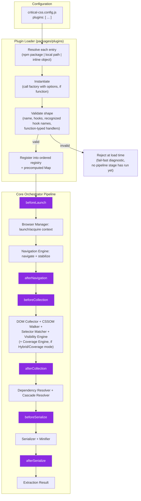
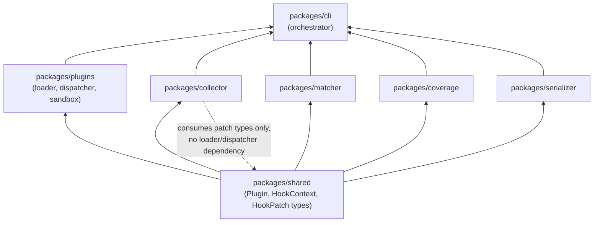

# 000 — Plugin SDK Overview

## 1. Title

**Critical CSS Extraction Engine — Plugin SDK Overview: Shape, Registration, and Composition with the Extraction Pipeline**

## 2. Version

| Field | Value |
|---|---|
| Document Version | 1.0.0 |
| Status | Draft — Phase 12 (Plugin SDK) |
| Last Updated | 2026-07-10 |
| Owners | Plugin System Working Group |
| Stability | Foundational; hook set and registration contract stable against [ADR-0004](../adr/ADR-0004-Plugin-Lifecycle-Model.md), implementation surface open to refinement pre-1.0 |

## 3. Purpose

This document is the entry point for the Plugin SDK: the public surface (`packages/plugins`) through which third-party and first-party code extends the Critical CSS Extraction Engine without forking or patching the core orchestrator. It defines, at the level a plugin author or SDK maintainer needs first, three things: **what a plugin is** (a plain module exporting a metadata object and zero or more named handler functions, one per lifecycle hook), **how plugins enter and move through the system** (discovery from configuration, validation, registration, per-hook invocation in declared order), and **how the Plugin System composes with the rest of the engine** — specifically, how it coexists with the pluggable extraction-strategy design (CSSOM-only, Coverage-only, Hybrid — [ADR-0005-Hybrid-Extraction-Mode](../adr/ADR-0005-Hybrid-Extraction-Mode.md), [701-Hybrid-Mode.md](../design/701-Hybrid-Mode.md)) without either subsystem needing to special-case the other.

This document is intentionally shallow on hook-by-hook mechanics (deferred to [001-Lifecycle-Hooks.md](./001-Lifecycle-Hooks.md)), on the concrete TypeScript interfaces and DTOs a plugin implements (deferred to [002-Plugin-API.md](./002-Plugin-API.md)), on worked examples (deferred to [003-Plugin-Examples.md](./003-Plugin-Examples.md)), and on the execution-isolation and trust model (deferred to [004-Sandboxing.md](./004-Sandboxing.md)). Its job is to give a reader — plugin author, core maintainer, or reviewer — the whole-system mental model those four documents each assume without re-deriving.

Everything in this document is a direct implementation of [ADR-0004-Plugin-Lifecycle-Model](../adr/ADR-0004-Plugin-Lifecycle-Model.md), which is normative for *why* the SDK is shaped this way; this document is normative for *what the SDK's public surface looks like as a result*.

## 4. Audience

- Plugin authors evaluating whether the SDK can express a capability they need (selector ignore-lists, CSS rewriting, rule injection, custom visibility policy, custom selector-matching augmentation — per Section 2.13 of BRIEF.md) before writing a line of plugin code.
- SDK maintainers implementing `packages/plugins`: the loader, the validator, the hook dispatcher, and the public type definitions plugin authors import against.
- Core orchestrator maintainers (`packages/cli`, the pipeline driver) who must call into the Plugin System at exactly six points and must understand what guarantees the Plugin System does and does not make about plugin behavior at each point.
- Extraction-strategy maintainers (CSSOM Selector Matcher, Coverage Engine, Hybrid reconciler — [ADR-0005](../adr/ADR-0005-Hybrid-Extraction-Mode.md)) who need to know precisely where plugin-contributed patches (ignored selectors, injected rules, visibility overrides) enter their own data flow, so that strategy-specific logic and plugin logic never silently fight over the same decision.
- Reviewers evaluating a new plugin capability proposal, for whom this document's composition model (Section 8.4) is the first check: "does this fit the existing hook set and patch model, or does it require a new hook (an RFC-gated change per [ADR-0004](../adr/ADR-0004-Plugin-Lifecycle-Model.md))?"

Readers should already be familiar with [ADR-0004-Plugin-Lifecycle-Model](../adr/ADR-0004-Plugin-Lifecycle-Model.md) in full — this document does not re-argue that ADR's rejected alternatives (middleware chains, event emitters) and assumes the reader accepts discrete lifecycle hooks as the chosen model. Readers should also have a working knowledge of the overall pipeline stages from [011-Execution-Pipeline.md](../architecture/011-Execution-Pipeline.md) and the repository layout from [007-Repository-Structure.md](../architecture/007-Repository-Structure.md).

## 5. Prerequisites

- [ADR-0004-Plugin-Lifecycle-Model](../adr/ADR-0004-Plugin-Lifecycle-Model.md) — the architectural decision this entire document operationalizes: discrete, named, engine-controlled hooks over middleware chains or event emitters, patch-based (not direct-mutation) plugin contributions, declared-order deterministic multi-plugin composition.
- [011-Execution-Pipeline.md](../architecture/011-Execution-Pipeline.md) — the pipeline stages (launch → navigate → collect → resolve dependencies → serialize) that the six hooks are anchored to.
- [007-Repository-Structure.md](../architecture/007-Repository-Structure.md) — establishes `packages/plugins` as the SDK's home within the monorepo and its position relative to `packages/collector`, `packages/matcher`, `packages/coverage`, and `packages/serializer`.
- [ADR-0005-Hybrid-Extraction-Mode](../adr/ADR-0005-Hybrid-Extraction-Mode.md) and [701-Hybrid-Mode.md](../design/701-Hybrid-Mode.md) — the pluggable extraction-strategy design (CSSOM / Coverage / Hybrid) this document explains the Plugin System's relationship to (Section 8.4).
- BRIEF.md Section 2.4 (System Modules table, "Plugin System" row: "Lifecycle hooks, sandboxing, extensibility") and Section 2.13 (the six named hooks and the five plugin capabilities) — the two brief sections this whole `docs/plugins/` phase exists to satisfy.
- Familiarity with Node.js module resolution (CommonJS/ESM interop) and with npm-package-based plugin ecosystems generally (ESLint plugins, Webpack plugins, Babel plugins) as a general point of reference for "what does installing and configuring a plugin look like to an end user."

## 6. Related Documents

- [ADR-0004-Plugin-Lifecycle-Model](../adr/ADR-0004-Plugin-Lifecycle-Model.md) — the decision record this document implements.
- [001-Lifecycle-Hooks.md](./001-Lifecycle-Hooks.md) — the hook-by-hook deep dive this overview forward-references throughout Section 8.
- [002-Plugin-API.md](./002-Plugin-API.md) — concrete TypeScript interfaces, DTOs, configuration schema, and error types for the plugin surface this document describes only at the conceptual level.
- [003-Plugin-Examples.md](./003-Plugin-Examples.md) — worked, end-to-end example plugins (selector-ignore, CSS-rewrite, rule-injection, custom-visibility, custom-matching) demonstrating every capability named in Section 2.13 of BRIEF.md.
- [004-Sandboxing.md](./004-Sandboxing.md) — the execution-isolation and trust boundary a plugin operates within, elaborating [ADR-0004](../adr/ADR-0004-Plugin-Lifecycle-Model.md)'s Edge Cases sandboxing discussion.
- [ADR-0005-Hybrid-Extraction-Mode](../adr/ADR-0005-Hybrid-Extraction-Mode.md) and [701-Hybrid-Mode.md](../design/701-Hybrid-Mode.md) — the extraction-strategy system this document's Section 8.4 explains composition with.
- [207-Virtualized-Lists.md](../design/207-Virtualized-Lists.md) Section 8.5 — a concrete, already-specified consumer of the `beforeCollection` hook (force-render mitigation), useful as a worked "this is what a real plugin does" reference even though its full mechanics are properly [001-Lifecycle-Hooks.md](./001-Lifecycle-Hooks.md)'s and [003-Plugin-Examples.md](./003-Plugin-Examples.md)'s territory.
- [011-Execution-Pipeline.md](../architecture/011-Execution-Pipeline.md) and [007-Repository-Structure.md](../architecture/007-Repository-Structure.md) — pipeline and repository context.
- [006-Design-Principles.md](../architecture/006-Design-Principles.md) — Principle 1 (Browser Is Source of Truth), Principle 3 (explicit opt-in over silent defaults), Principle 6 (fail-fast diagnostics), all directly inherited by the Plugin System's design.

## 7. Overview

BRIEF.md Section 2.4 lists "Plugin System" as one of sixteen first-class system modules, with the stated responsibility "Lifecycle hooks, sandboxing, extensibility." Section 2.13 names the six hooks — `beforeLaunch`, `afterNavigation`, `beforeCollection`, `afterCollection`, `beforeSerialize`, `afterSerialize` — and the five capabilities plugins must be able to express: ignore selectors, rewrite CSS, inject rules, customize visibility, customize matching. [ADR-0004-Plugin-Lifecycle-Model](../adr/ADR-0004-Plugin-Lifecycle-Model.md) settled the *architectural* question of how extensibility is modeled (discrete hooks, patch-based contribution, engine-controlled ordering) and rejected the two most obvious alternatives (middleware chains, event emitters) with reasoning this document does not repeat.

What remained an open question after that ADR — and what this document, together with its three siblings, closes — is the **SDK-level question**: given "discrete lifecycle hooks" as the chosen model, what does a plugin concretely *look like* as a unit of distributable code, how does it get from "a file on disk or an npm package name in a config array" to "code the orchestrator actually calls at the right pipeline stage," and how does the whole apparatus avoid colliding with the engine's *other* major pluggable-behavior axis — the extraction-strategy selection (CSSOM / Coverage / Hybrid) that Section 2.7 of BRIEF.md and [ADR-0005](../adr/ADR-0005-Hybrid-Extraction-Mode.md) already established as a separate configuration dimension.

This document answers those questions in four parts, corresponding to Section 8's subsections: **8.1** defines the plugin unit itself (a module shape, not a class hierarchy — see the Why/Alternatives discussion there); **8.2** specifies the registration and loading pipeline from configuration to a validated, ordered, in-memory plugin registry; **8.3** describes, at the overview level, how that registry is consulted at each of the six hook points (full mechanics deferred to [001-Lifecycle-Hooks.md](./001-Lifecycle-Hooks.md)); and **8.4** — the section most load-bearing for readers coming from the extraction-strategy side of the codebase — explains precisely why plugins and extraction-strategy selection are orthogonal, non-conflicting configuration axes, and where in the pipeline their effects actually meet.

## 8. Detailed Design

### 8.1 What a Plugin Is

**A plugin is a plain JavaScript/TypeScript module that exports a single default (or named, per [002-Plugin-API.md](./002-Plugin-API.md)'s exact contract) object conforming to the `Plugin` interface**: a small metadata block (`name`, `version`, optionally `dependsOn` — reserved, per [ADR-0004](../adr/ADR-0004-Plugin-Lifecycle-Model.md) Edge Cases, for future explicit ordering declarations, not yet load-bearing) plus a `hooks` object whose keys are a subset of the six hook names and whose values are `async` functions matching that hook's documented context-in, patch-out signature.

```ts
// Conceptual shape; the authoritative interface lives in 002-Plugin-API.md.
interface Plugin {
  name: string;
  version: string;
  hooks: Partial<{
    beforeLaunch: (ctx: BeforeLaunchContext) => Promise<BeforeLaunchPatch | void>;
    afterNavigation: (ctx: AfterNavigationContext) => Promise<AfterNavigationPatch | void>;
    beforeCollection: (ctx: BeforeCollectionContext) => Promise<BeforeCollectionPatch | void>;
    afterCollection: (ctx: AfterCollectionContext) => Promise<AfterCollectionPatch | void>;
    beforeSerialize: (ctx: BeforeSerializeContext) => Promise<BeforeSerializePatch | void>;
    afterSerialize: (ctx: AfterSerializeContext) => Promise<AfterSerializePatch | void>;
  }>;
}
```

**Why a plain object-with-functions shape, rather than a class a plugin author extends.** Three shapes were considered: (a) a base class (`class MyPlugin extends EnginePlugin { beforeCollection() {...} }`), (b) a factory function returning a hooks object (`export default function myPlugin(options) { return { hooks: {...} } }`), and (c) the plain object described above, either static or itself produced by a factory for configurability. The engine adopts (c), with the common convention that a plugin's *package* exports a factory function (so options can be closed over) whose *return value* is the plain `Plugin` object the loader actually registers — meaning (b) and (c) are not really competitors but two halves of the same design: factories for authoring ergonomics, plain objects for the loader's validation and registration contract.

A base class was rejected because inheritance introduces exactly the kind of coupling to internal engine structure that [ADR-0004](../adr/ADR-0004-Plugin-Lifecycle-Model.md) rejects at the hook-dispatch level: a base class's constructor, lifecycle methods, and protected fields become part of the plugin's compatibility surface with the engine even when a plugin author never intended to depend on them, and evolving the base class across engine versions risks silently breaking plugins that happen to override or rely on inherited behavior beyond the documented hook contract. A plain object with a fixed, small set of optional named function properties has no inheritance surface at all — a plugin either implements `hooks.beforeCollection` or it does not, and there is no intermediate, partially-overridden state to reason about. This mirrors the same "small, curated, versioned surface over an open-ended one" reasoning [ADR-0004](../adr/ADR-0004-Plugin-Lifecycle-Model.md) applies to the hook set itself, applied one level up to the plugin *unit* shape.

**Why validation happens at load time, not merely relying on TypeScript types.** Plugins are frequently authored in plain JavaScript, installed as compiled npm packages, or hand-written by teams without the engine's own TypeScript type definitions in scope; a purely type-level contract (an interface a `.d.ts` file describes) provides zero runtime protection against a malformed plugin (missing `name`, `hooks` not an object, a hook value that is not a function). The loader (Section 8.2) therefore performs a runtime shape check identical in spirit to the per-hook patch validation [ADR-0004](../adr/ADR-0004-Plugin-Lifecycle-Model.md)'s `runHook` algorithm already performs on patches — the same "trust the shape, not the source" posture applied at plugin-registration time instead of only at patch-return time.

### 8.2 Registration and Loading

Plugins enter the system exclusively through configuration — there is no filesystem auto-discovery (no "drop a file in `plugins/` and it's picked up"), a deliberate choice mirrored on the same reasoning [ADR-0004](../adr/ADR-0004-Plugin-Lifecycle-Model.md) Implementation Notes item 4 already applies to *ordering* ("declaration order in configuration, not discovery order in `node_modules`"): implicit discovery makes "which plugins are active, and in what order" a fact about the filesystem or package manager rather than a fact stated once, explicitly, in a reviewable configuration file.

```jsonc
// critical-css.config.js (conceptual; exact schema in 002-Plugin-API.md)
{
  "plugins": [
    "critical-css-plugin-ignore-ads",              // npm package name, resolved via require.resolve
    ["./plugins/force-render-carousel.js", { "maxIncrements": 40 }], // local path + options tuple
    { "name": "inline-rule-injector", "hooks": { /* inline plugin object, for small one-off cases */ } }
  ]
}
```

The loader accepts three plugin-reference forms — an npm package specifier, a local file path, and (least common, mainly for tests and trivial one-off cases) an inline plugin object — normalizes all three to a resolved module, invokes it if it is a factory function (passing the second tuple element as `options`), and produces a `Plugin` object per Section 8.1's shape. Loading proceeds as follows:

1. **Resolve** each configured entry to a module (via Node's `require.resolve`/dynamic `import()` for package/path entries; pass-through for inline objects).
2. **Instantiate** — call the module's default export as a factory with its configured `options` if it is a function; otherwise treat the default export itself as the `Plugin` object.
3. **Validate** the resulting shape against the `Plugin` interface (Section 8.1): `name` is a non-empty string, `hooks` is a plain object, every present key is one of the six recognized hook names, every value is a function. A plugin failing validation is rejected at load time — before any pipeline stage runs — with a diagnostic naming the offending plugin entry and the specific shape violation, per [006-Design-Principles.md](../architecture/006-Design-Principles.md) Principle 6 (fail loudly, at the earliest possible point, rather than at first hook invocation deep into a run).
4. **Register** the validated plugin into an ordered, immutable-for-the-run registry, indexed both by declaration order (for the dispatch algorithm — [001-Lifecycle-Hooks.md](./001-Lifecycle-Hooks.md)) and by hook name (a precomputed `Map<HookName, Plugin[]>` so hook dispatch never re-scans the full plugin list — the same optimization opportunity [ADR-0004](../adr/ADR-0004-Plugin-Lifecycle-Model.md)'s Algorithms section flags: "cache the 'which plugins implement which hooks' lookup at plugin-registration time rather than re-checking on every hook firing").

**Why validation and registration are a distinct phase from hook dispatch, rather than validating each plugin lazily on its first invocation.** Lazy, first-use validation would mean a malformed plugin's error surfaces only when the pipeline reaches whichever hook that plugin happens to implement — potentially after an expensive browser launch and navigation have already occurred (Section 2.11 of BRIEF.md's CI-pipeline framing makes wasted, late-failing CI minutes a real cost, not a hypothetical one). Eager, load-time validation of every configured plugin's full shape (including checking that every declared hook name is recognized, even if that hook has not fired yet) surfaces the failure before any pipeline work begins, at the cost of marginally more work during startup — a cost judged negligible relative to a full extraction run.

### 8.3 Hook Consultation Overview

Once the registry exists, the core orchestrator consults it at exactly six points, one per pipeline stage transition, using the shared `runHook(hookName, context, plugins, config)` primitive [ADR-0004](../adr/ADR-0004-Plugin-Lifecycle-Model.md) already specifies at the algorithmic level. This document states only the overview; [001-Lifecycle-Hooks.md](./001-Lifecycle-Hooks.md) is the authoritative per-hook reference for context shape, patch shape, synchronicity, and multi-plugin ordering semantics. At the level relevant here:

- The orchestrator never calls a plugin's hook function directly — it always goes through the dispatcher, which handles the per-plugin timeout, patch validation, and failure-policy branching [ADR-0004](../adr/ADR-0004-Plugin-Lifecycle-Model.md)'s Algorithms section specifies.
- The dispatcher looks up `pluginsByHook.get(hookName)` (Section 8.2's precomputed index) rather than filtering the full plugin list, giving `O(k)` dispatch overhead per hook firing where `k` is the (typically small) number of plugins implementing that specific hook, not the total plugin count `n`.
- Every hook firing produces a merged patch that the orchestrator applies to pipeline state using stage-specific merge rules (documented per-hook in [002-Plugin-API.md](./002-Plugin-API.md)), and every firing's per-plugin timing and success/failure is recorded for the Reporter (Section 2.12 of BRIEF.md), exactly as [ADR-0004](../adr/ADR-0004-Plugin-Lifecycle-Model.md) Implementation Notes item 6 requires.

### 8.4 Composition with the Pluggable Extraction-Strategy Design

This is the section most likely to be a source of confusion for engineers who work primarily on the extraction-strategy side of the codebase (CSSOM Selector Matcher, Coverage Engine, Hybrid reconciler), because both the Plugin System and extraction-strategy selection are, in a loose sense, "pluggable behavior" — but they are pluggable along genuinely orthogonal axes, and understanding why is the key to avoiding accidental coupling between the two subsystems as both evolve.

**Extraction-strategy selection (CSSOM / Coverage / Hybrid) answers: "which signal source(s) does the engine trust to decide whether a given CSS rule is used?"** This is a single, run-wide configuration choice (Section 2.7 of BRIEF.md, [ADR-0005](../adr/ADR-0005-Hybrid-Extraction-Mode.md)) made once per extraction run, orthogonal to which plugins are installed. Whether the engine is running CSSOM-only, Coverage-only, or Hybrid mode, the *pipeline shape* — launch, navigate, collect, resolve, serialize — and therefore the six hook points, are unchanged; extraction-mode selection changes what happens *inside* the collection and resolution stages (which signal collectors run, how their outputs are reconciled), not whether or where plugin hooks fire around those stages.

**The Plugin System answers a different question: "does any installed third-party or first-party extension want to observe or adjust pipeline state at one of six fixed transition points?"** This is orthogonal to extraction-mode selection in both directions:

- A plugin's hook implementation never needs to know or branch on which extraction mode is active to do its job for the five capabilities named in Section 2.13 of BRIEF.md. A selector-ignore plugin's `beforeCollection` patch (`{ ignoreSelectors: [...] }`) is consumed identically regardless of whether the subsequent collection stage runs CSSOM matching, Coverage, or both — the ignore-list is applied as a pre-filter *before* whichever signal collector(s) run, per the merge contract [002-Plugin-API.md](./002-Plugin-API.md) specifies for that hook's patch shape.
- Conversely, the extraction-mode reconciler ([701-Hybrid-Mode.md](../design/701-Hybrid-Mode.md)) never needs to know how many plugins are installed or what they do; it consumes whatever post-plugin-patch inputs the collection stage hands it (already-filtered node set, already-injected rules) as ordinary inputs, with no plugin-awareness baked into the reconciliation algorithm itself.

**Where the two systems' effects actually meet: the patch-application boundary at the start and end of the collection stage.** Concretely, `beforeCollection`'s merged patch (ignored selectors, visibility overrides, custom-matching augmentation) is applied to the collection stage's *inputs* before any signal collector (CSSOM matcher, Coverage session, or both, depending on active mode) begins running; `afterCollection`'s merged patch is applied to the collection stage's *outputs* after whichever signal collector(s) have produced their results but before dependency resolution begins. This means the extraction-mode reconciler, whatever mode is active, only ever sees a single, already-plugin-adjusted view of "what to match against" and "what was matched" — it has no separate, mode-specific plugin integration to implement, and the Plugin System has no separate, plugin-specific extraction-mode integration to implement. Each subsystem implements its contract against the *pipeline stage*, not against the other subsystem.

**Why this boundary was deliberately drawn at the stage level rather than allowing plugins to hook into an individual signal collector (e.g., a plugin hook specifically for "after CSSOM matching but before Coverage reconciliation" within Hybrid mode).** A finer-grained hook set — one hook per signal collector, rather than one hook per pipeline stage — was considered and rejected for the same reason [ADR-0004](../adr/ADR-0004-Plugin-Lifecycle-Model.md) rejected per-node hooks: it would require every future extraction-strategy change (a new signal source, a reordering of collectors within Hybrid mode) to also be a plugin-API-compatibility decision, coupling two subsystems that otherwise have no reason to evolve in lockstep. Anchoring plugin hooks to pipeline *stages* (which are stable per [011-Execution-Pipeline.md](../architecture/011-Execution-Pipeline.md) and unlikely to be restructured even as extraction strategies evolve) rather than to extraction-strategy *internals* (which are actively evolving — Hybrid mode is a Phase 9 addition layered onto an already-shipped CSSOM-only baseline) keeps the plugin compatibility surface stable across extraction-strategy changes, and keeps extraction-strategy implementation free to add, reorder, or reweight signal collectors without touching the Plugin System at all.

**A concrete illustration: a custom-visibility plugin under Hybrid mode.** Consider a plugin contributing a `visibilityOverride` function via `beforeCollection` (one of the five Section 2.13 capabilities). Under CSSOM-only mode, that override is consulted by the Visibility Engine exactly once, gating which nodes the Selector Matcher considers. Under Hybrid mode, the identical override is consulted by the identical Visibility Engine call — Hybrid mode does not run a second, independent visibility pass; it runs one visibility pass (feeding CSSOM matching) plus a page-wide Coverage session (which does not consult per-node visibility at all, by construction, since Coverage measures rule usage across the whole loaded page, per [700-Coverage-Mode.md](../design/700-Coverage-Mode.md)) plus targeted computed-style verification (which samples specific nodes already selected by the visibility-gated CSSOM pass). The plugin's override therefore has an identical, single point of effect regardless of extraction mode — it never needs mode-specific logic, and the reconciler never needs plugin-specific logic to account for it having already run.

### 8.5 The `packages/plugins` Package Boundary

Per [007-Repository-Structure.md](../architecture/007-Repository-Structure.md), the Plugin System's implementation lives in `packages/plugins`, exposing: the `Plugin` interface and per-hook context/patch types (re-exported from `packages/shared` where a type is needed by both plugin authors and core pipeline packages, to avoid a circular dependency between `packages/plugins` and, e.g., `packages/collector`); the loader (Section 8.2); the dispatcher/`runHook` primitive (consumed by `packages/cli`'s orchestrator, not owned by it, so the dispatch algorithm has one implementation and one test suite regardless of which entry point — CLI, programmatic API, SSR middleware — drives an extraction run); and the sandboxing boundary ([004-Sandboxing.md](./004-Sandboxing.md)). Core pipeline packages (`packages/collector`, `packages/matcher`, `packages/coverage`, `packages/serializer`) depend on `packages/plugins` only for the shared context/patch *types* they must accept as inputs and produce as outputs at their stage boundary — they do not depend on the loader or dispatcher internals, preserving the one-directional dependency Section 8.4 describes conceptually as "stage-level integration, not internals-level integration."

## 9. Architecture

### 9.1 Plugin Registration and the Six Hook Points Along the Pipeline



### 9.2 Plugin System and Extraction Strategy as Orthogonal Configuration Axes

```mermaid
flowchart LR
    subgraph AxisA["Axis 1: Extraction Strategy (run-wide)"]
        CSSOM["CSSOM-only"]
        COVERAGE["Coverage-only"]
        HYBRID["Hybrid"]
    end

    subgraph AxisB["Axis 2: Installed Plugins (independent of Axis 1)"]
        P1["selector-ignore plugin"]
        P2["css-rewrite plugin"]
        P3["custom-visibility plugin"]
        NONE["(zero plugins installed)"]
    end

    AxisA -.orthogonal, no cross-dependency.- AxisB

    subgraph Meeting["Where effects meet: the Collection stage boundary"]
        PRE["beforeCollection patch applied\nto collection INPUTS\n(ignore-lists, visibility overrides,\nmatching augmentation)"]
        RUN["Active extraction-mode signal\ncollector(s) run against\nplugin-adjusted inputs"]
        POST["afterCollection patch applied\nto collection OUTPUTS\n(injected rules, rewritten CSS)"]
    end

    AxisA --> RUN
    AxisB --> PRE
    PRE --> RUN --> POST
    POST --> NEXT["Dependency Resolution\n(mode-agnostic, plugin-agnostic\nfrom this point)"]
```



### 9.3 `packages/plugins` Dependency Boundary



## 10. Algorithms

### 10.1 Algorithm: Plugin Load and Registration

**Problem statement.** Given an ordered list of configured plugin references (package names, local paths, or inline objects, optionally paired with options), resolve each to a validated `Plugin` object, and produce an ordered registry plus a precomputed per-hook index, failing fast and specifically on the first invalid entry.

**Inputs.** `pluginRefs: PluginRef[]` (from configuration); `config: { allowInline: boolean }`.

**Outputs.** `PluginRegistry { ordered: Plugin[], byHook: Map<HookName, Plugin[]> }`, or a thrown `PluginLoadError` identifying the first offending entry.

**Pseudocode.**

```text
function loadPlugins(pluginRefs, config) -> PluginRegistry:
    ordered = []
    byHook = new Map()  // HookName -> Plugin[]
    for name in SIX_HOOK_NAMES:
        byHook.set(name, [])

    for ref in pluginRefs:
        module = resolveModule(ref)              // require.resolve / dynamic import, or pass-through for inline
        candidate = isFunction(module.default)
            ? module.default(ref.options)          // factory form
            : module.default ?? module              // plain-object form
        errors = validatePluginShape(candidate)     // name: non-empty string; hooks: plain object;
                                                     // every hooks key in SIX_HOOK_NAMES; every value is function
        if errors.length > 0:
            throw new PluginLoadError(ref, errors)   // fail fast; no pipeline stage has started

        ordered.push(candidate)
        for hookName in Object.keys(candidate.hooks):
            byHook.get(hookName).push(candidate)

    return { ordered, byHook }
```

**Time complexity.** `O(P + H)` where `P` is the number of configured plugins and `H` is the total number of hook implementations across all plugins (bounded by `6P`); each plugin is resolved, instantiated, and validated once, and each of its implemented hooks is appended to exactly one `byHook` bucket once.

**Memory complexity.** `O(P + H)` for the registry itself — the ordered list plus the per-hook index, both proportional to plugin and hook-implementation count, negligible relative to per-run DOM/CSSOM data structures.

**Failure cases.** A configured package name that cannot be resolved (`require.resolve` throws `MODULE_NOT_FOUND`) — surfaced as a `PluginLoadError` naming the unresolved specifier. A factory function that throws during instantiation (e.g., invalid options) — surfaced with the original error attached as `cause`. A candidate failing shape validation (missing `name`, `hooks` not an object, an unrecognized hook name — e.g., a typo like `beforeColletion` — or a non-function hook value) — every such condition is caught at load time, before any browser is launched, per [006-Design-Principles.md](../architecture/006-Design-Principles.md) Principle 6.

**Optimization opportunities.** Plugin resolution and instantiation (`resolveModule`, factory invocation) can run concurrently across independent plugin references (`Promise.all`) since they have no ordering dependency on each other at load time — only *hook dispatch order* (Section 8.3, elaborated in [001-Lifecycle-Hooks.md](./001-Lifecycle-Hooks.md)) must respect declaration order, not the loading process itself.

### 10.2 Algorithm: Per-Hook Index Lookup at Dispatch Time

**Problem statement.** Given a hook name and the registry built by 10.1, return the ordered list of plugins implementing that hook in `O(1)` amortized time, avoiding an `O(P)` scan of all installed plugins on every one of the (up to six) hook firings per extraction run.

**Inputs.** `registry: PluginRegistry`, `hookName: HookName`.

**Outputs.** `Plugin[]` (possibly empty), in declared order.

**Pseudocode.**

```text
function pluginsForHook(registry, hookName) -> Plugin[]:
    return registry.byHook.get(hookName) ?? []
```

**Time complexity.** `O(1)` — a single map lookup, independent of total plugin count `P`, since the index was precomputed once at load time (10.1) rather than being recomputed per firing.

**Memory complexity.** `O(1)` beyond the already-allocated registry; no new allocation per lookup.

**Failure cases.** None under normal operation; an unrecognized `hookName` (a bug in the orchestrator, not a plugin-authoring error, since hook names are an internal enum, not user input) would indicate a defect in the core pipeline's dispatch call sites, not a plugin problem, and is guarded by a compile-time enum/union type in [002-Plugin-API.md](./002-Plugin-API.md)'s type definitions rather than a runtime check here.

**Optimization opportunities.** None beyond what precomputation already provides; this lookup is already at the theoretical floor for the operation.

## 11. Implementation Notes

1. **The loader must run to completion (or fail) before `beforeLaunch` fires.** A plugin misconfiguration must never surface mid-run; the entire registration phase (Section 8.2, Algorithm 10.1) is a synchronous-feeling (even though internally `async`, per the concurrent-resolution optimization) precondition gate before the orchestrator begins the pipeline proper.
2. **Factory-form plugin packages should validate their own `options` argument independently of the SDK's shape validation.** The SDK validates that the *resulting* `Plugin` object is well-formed; it does not know or enforce anything about a specific plugin's options schema. Plugin authors are expected to throw a clear error from within their factory function for invalid options, which the loader surfaces as-is (with `cause` chaining) rather than attempting to interpret.
3. **The `byHook` index must be rebuilt, not incrementally patched, on any registry change.** Because plugin registration is a one-time, load-time operation per extraction run (no dynamic plugin installation/removal mid-run is supported, deliberately, to keep the "declared order" guarantee meaningful), there is no incremental-update code path to maintain — simplifying the implementation relative to a hypothetical hot-reloadable plugin system.
4. **Inline plugin objects (Section 8.2's third reference form) are intended for tests, fixtures, and small one-off project-local customizations, not for distribution.** The SDK does not prevent publishing a package that only ever produces inline objects, but the documented convention (elaborated in [003-Plugin-Examples.md](./003-Plugin-Examples.md)) is that distributable plugins use the factory-function-exporting-a-package form, since inline objects cannot carry their own `package.json`-level versioning or dependency metadata.
5. **`packages/shared`'s hook context/patch types are the actual compatibility surface, not `packages/plugins`' internal loader/dispatcher code.** A plugin author's code depends on `packages/shared`'s exported types (directly, or transitively via a thin `@critical-css/plugin-sdk` convenience re-export package) — never on `packages/plugins` internals — reinforcing the one-directional dependency shown in Section 9.3's diagram and keeping the loader/dispatcher free to be refactored without being a plugin-facing breaking change, so long as the type contracts in `packages/shared` are preserved.
6. **SSR adapters (Section 2.10 of BRIEF.md) may themselves be implemented as plugins**, per [ADR-0004](../adr/ADR-0004-Plugin-Lifecycle-Model.md) Implementation Notes item 5's observation that `beforeLaunch`/`afterNavigation` are natural extension points for framework-aware readiness signals — this is a composition pattern, not a separate mechanism, and such adapters go through the identical loader/dispatcher path described in this document.

## 12. Edge Cases

- **A plugin package name resolves to a module whose default export is `undefined`** (e.g., a CommonJS package exporting only named exports, misconfigured build output) — the loader treats this as a shape-validation failure (`candidate` is `undefined`, which fails every subsequent shape check) with a diagnostic pointing at the specific configured entry, not a generic "cannot read property of undefined" crash.
- **Two plugins declare the same `name`.** Names are not required to be globally unique (no package-registry-style uniqueness enforcement), but the loader emits a non-fatal diagnostic warning when a duplicate is detected, since duplicate names make per-plugin timing/diagnostics (Reporter integration, [ADR-0004](../adr/ADR-0004-Plugin-Lifecycle-Model.md) Implementation Notes item 6) harder to attribute correctly; declared order, not name, remains the authoritative disambiguator for merge-precedence purposes.
- **A plugin implements zero hooks** (an empty `hooks: {}` object, or a plugin intended purely for its side effects at load time — unusual but not disallowed). This is valid: the plugin is registered but never appears in any `byHook` bucket, and is therefore never invoked; the SDK does not treat "implements nothing" as an error, only as inert.
- **A local-path plugin reference points outside the project's configured filesystem sandbox** (relevant once [004-Sandboxing.md](./004-Sandboxing.md)'s filesystem-access boundary is in force) — flagged as a load-time diagnostic warning (not necessarily a hard failure, pending that document's final sandboxing policy) since a plugin able to read/write arbitrary filesystem paths outside its declared sandbox directory is a security-relevant condition independent of whether the plugin is otherwise well-formed.
- **CommonJS/ESM interop mismatches** — a plugin package published as ESM-only consumed from a CommonJS-context engine build, or vice versa — are resolved via Node's standard dynamic `import()` fallback path when static `require` fails, consistent with how the wider Node.js ecosystem has converged on handling this transition; the loader does not attempt bespoke module-format detection beyond what Node's own resolution algorithm already provides.
- **A plugin's package version is incompatible with the engine's plugin-API version** (e.g., a plugin authored against a hook context shape from an older major version). This is a versioning/compatibility-shim question explicitly deferred as Future Work in [ADR-0004](../adr/ADR-0004-Plugin-Lifecycle-Model.md)'s "open question" and inherited here unresolved; the current SDK has no automated compatibility-shim layer and relies on semantic-version-range guidance in [002-Plugin-API.md](./002-Plugin-API.md) instead.
- **Extraction-strategy mode is changed (e.g., CSSOM-only to Hybrid) without touching plugin configuration at all.** Per Section 8.4, this must produce no change whatsoever in which hooks fire, in what order, or in what shape their contexts/patches take — only in what happens inside the Collection stage's internals between `beforeCollection` and `afterCollection`. Any observed difference in hook behavior correlated with extraction-mode changes would indicate a boundary violation (a leak of extraction-strategy internals into the plugin contract) and should be treated as a defect against Section 8.4's design intent, not an acceptable coupling.

## 13. Tradeoffs

| Dimension | Class-based Plugin Base | Factory-only (no plain-object contract) | Plain Object + Optional Factory Wrapper (Chosen) |
|---|---|---|---|
| Compatibility surface exposed to plugin authors | Large (inherited methods/fields become part of the contract) | Small, but ambiguous what the factory must return | Small and explicit (`name`, `version`, `hooks`) |
| Ergonomics for options-driven configuration | Constructor arguments | Natural (closure over options) | Natural (factory closes over options, returns plain object) |
| Ease of runtime shape validation | Harder (must inspect prototype chain) | Must still validate the returned value's shape | Straightforward (plain object property checks) |
| Testability (constructing a plugin in a unit test without a real factory) | Requires instantiating the class | N/A if only factories are supported | Trivial — an inline plain object is a valid plugin |
| Precedent in comparable ecosystems | Less common in modern JS tooling plugin systems | Common (Babel, PostCSS) | Common (ESLint flat config, Rollup) — chosen for familiarity |

**Why not require every plugin to be a factory function.** Requiring a factory even for the common case of a plugin with no configurable options (a fixed, no-options selector-ignore list baked into the plugin itself) adds ceremony (`export default () => ({ name: ..., hooks: {...} })` vs. `export default { name: ..., hooks: {...} }`) with no corresponding benefit for that case; the SDK accepts both shapes at the loader level (Algorithm 10.1's `isFunction(module.default)` branch) so authors pay the factory-function tax only when they actually need configurability.

**Why the loader does not attempt "duck typing plus best-effort coercion"** (e.g., accepting a plugin that exports hook functions as top-level named exports rather than nested under a `hooks` key, and reconstructing the expected shape). Coercive, forgiving parsing of multiple possible input shapes was rejected as a false convenience: it multiplies the number of "is this a valid plugin" code paths the loader must maintain and test, multiplies the ways a subtly malformed plugin can silently be *partially* accepted (e.g., three of five expected hook functions get picked up, two are silently missed due to a naming mismatch), and works against the fail-fast, single-clear-shape philosophy [ADR-0004](../adr/ADR-0004-Plugin-Lifecycle-Model.md) already established for patches. A single, explicit, documented shape with a clear validation error for anything else is preferred even at the cost of slightly more verbose plugin authoring.

**Why extraction-strategy mode and plugin configuration are kept as two independent configuration keys rather than unified into one "behavior profile."** A unified profile (e.g., a single named preset bundling "Hybrid mode + these three plugins") was considered for onboarding convenience but rejected as the *underlying* configuration model, because it would obscure the orthogonality Section 8.4 establishes — two independent axes are simpler to reason about, test, and document independently than a combined matrix of named presets, even though nothing prevents layering named presets *on top of* the two independent keys as a pure convenience/UX feature in the CLI (`packages/cli`), which remains an option not foreclosed by this decision.

## 14. Performance

- **CPU complexity:** Plugin loading (Algorithm 10.1) is `O(P + H)`, a one-time, per-run cost dominated in practice by module resolution I/O (`require.resolve`/dynamic `import()`), not by the shape-validation logic itself; hook dispatch overhead is bounded by [ADR-0004](../adr/ADR-0004-Plugin-Lifecycle-Model.md)'s `O(hooks × pluginsPerHook)` analysis, unaffected by total installed-plugin count beyond what actually implements a given hook (Algorithm 10.2's `O(1)` lookup).
- **Memory complexity:** `O(P + H)` for the registry; negligible relative to DOM/CSSOM snapshot memory for any realistic plugin count (low single digits to low tens, per [ADR-0004](../adr/ADR-0004-Plugin-Lifecycle-Model.md)'s scalability discussion).
- **Caching strategy:** The `byHook` index (Algorithm 10.1/10.2) is the SDK's primary caching mechanism — computed once at load time, consulted `O(1)` per hook firing thereafter. No cross-run plugin-result caching is provided by the SDK itself; that responsibility rests with individual plugin implementations, as [ADR-0004](../adr/ADR-0004-Plugin-Lifecycle-Model.md) Performance section already notes.
- **Parallelization opportunities:** Module resolution/instantiation across independent plugin references during loading (Implementation Notes, Algorithm 10.1) can run concurrently; hook *invocation* itself remains sequential, declared-order, by design (per [ADR-0004](../adr/ADR-0004-Plugin-Lifecycle-Model.md), pending its flagged future opt-in parallel-execution mode for order-independent plugins).
- **Incremental execution:** Plugin loading is not incremental across runs in the current design (each CLI invocation or programmatic-API call reloads and re-validates plugins from configuration); a persistent-process mode (e.g., a long-running SSR middleware process, [900-SSR-Overview.md](../design/900-SSR-Overview.md)) should load plugins once at process startup and reuse the resulting registry across requests rather than reloading per request, which the SDK's registry object is designed to support (it is a plain, immutable-for-its-lifetime value, safe to hold across many extraction runs within one process).
- **Profiling guidance:** Combine [ADR-0004](../adr/ADR-0004-Plugin-Lifecycle-Model.md)'s per-hook, per-plugin timing diagnostics with a one-time "plugin load phase duration" metric to distinguish "plugins are slow to load" (a one-time, amortizable-in-a-long-running-process cost) from "plugins are slow to execute per hook" (a recurring, per-run cost) when investigating overall extraction latency regressions.
- **Scalability limits:** Bounded almost entirely by [ADR-0004](../adr/ADR-0004-Plugin-Lifecycle-Model.md)'s existing analysis; the SDK's own loading/registration overhead is not expected to be a meaningful contributor at any realistic plugin count.

## 15. Testing

- **Unit tests:** `loadPlugins` (Algorithm 10.1) against every plugin-reference form (package, path, inline), every malformed-shape variant (missing `name`, non-object `hooks`, unrecognized hook key, non-function hook value, throwing factory), and the `byHook` index's correctness after loading a mixed set of plugins with overlapping and non-overlapping hook implementations.
- **Integration tests:** A full pipeline run (using the fixture suite referenced across sibling design documents) with a small representative set of plugins (one per Section 2.13 capability) registered via real configuration, asserting each plugin's hook fires exactly once, in declared order, with the documented context shape, and that its patch is correctly reflected in final output.
- **Visual tests:** For plugins altering visibility or injecting rules, the standard visual-regression pipeline ([ADR-0001-Browser-Is-Source-of-Truth](../adr/ADR-0001-Browser-Is-Source-of-Truth.md) Testing section) run with and without the plugin enabled, per [ADR-0004](../adr/ADR-0004-Plugin-Lifecycle-Model.md)'s existing guidance, inherited unchanged here.
- **Stress tests:** Load a large synthetic number (hundreds) of trivial no-op plugins to validate that loading remains linear and that hook dispatch overhead does not degrade non-linearly as installed-plugin count grows, extending [ADR-0004](../adr/ADR-0004-Plugin-Lifecycle-Model.md)'s own stress-test guidance to the loader specifically.
- **Regression tests:** Every reported plugin-loading bug (a resolution edge case, an interop mismatch, a validation false-positive/negative) becomes a permanent loader-test fixture, mirroring [ADR-0004](../adr/ADR-0004-Plugin-Lifecycle-Model.md)'s regression-test posture for hook dispatch.
- **Benchmark tests:** Track plugin-load-phase duration and total per-run plugin overhead as percentages of total extraction time across CI runs, extending [ADR-0004](../adr/ADR-0004-Plugin-Lifecycle-Model.md)'s benchmark guidance with a loading-specific breakdown.
- **Composition tests (specific to Section 8.4):** Run the identical plugin set against all three extraction modes (CSSOM-only, Coverage-only, Hybrid) and assert that hook firing order, context shapes, and patch-application semantics are byte-for-byte identical across modes — the concrete, automatable check that Section 8.4's orthogonality claim actually holds in the implementation, not just in the design narrative.

## 16. Future Work

- **A thin, convenience `@critical-css/plugin-sdk` package** re-exporting `packages/shared`'s types plus authoring helpers (a `definePlugin()` identity-function-with-better-type-inference helper, in the style of Vite's `defineConfig()`), improving plugin-author ergonomics without changing the underlying `Plugin` interface contract.
- **Explicit inter-plugin dependency declarations** (the reserved-but-unused `dependsOn` metadata field, Section 8.1) — formalizing ordering requirements beyond declared-configuration-order, as already flagged in [ADR-0004](../adr/ADR-0004-Plugin-Lifecycle-Model.md)'s Future Work.
- **A plugin compatibility-shim layer** for surviving hook-contract changes across major engine versions, addressing the open question [ADR-0004](../adr/ADR-0004-Plugin-Lifecycle-Model.md) raises but does not resolve.
- **A public plugin registry/marketplace** with a machine-checkable manifest schema (beyond `package.json`), enabling discovery and trust-scoring of community plugins — meaningfully gated on [004-Sandboxing.md](./004-Sandboxing.md)'s hardened-sandbox future work landing first, since a public registry substantially raises the stakes of the current same-process trust model.
- **Research idea:** whether the SDK should offer an opt-in "extraction-strategy-aware" plugin capability tier for genuinely advanced use cases that do need to know the active mode (e.g., a diagnostics plugin that reports differently under Hybrid vs. CSSOM-only) — distinct from, and without weakening, the default orthogonality Section 8.4 establishes for the common case.
- **Open question:** should the loader support a "dry validate only" mode (validate all configured plugins' shapes without instantiating or running any pipeline stage), useful for a pre-commit or CI lint step that catches plugin misconfiguration even earlier than the current load-time failure, which still requires an actual extraction-run invocation to trigger.

## 17. References

- [ADR-0004-Plugin-Lifecycle-Model](../adr/ADR-0004-Plugin-Lifecycle-Model.md)
- [ADR-0005-Hybrid-Extraction-Mode](../adr/ADR-0005-Hybrid-Extraction-Mode.md)
- [001-Lifecycle-Hooks.md](./001-Lifecycle-Hooks.md)
- [002-Plugin-API.md](./002-Plugin-API.md)
- [003-Plugin-Examples.md](./003-Plugin-Examples.md)
- [004-Sandboxing.md](./004-Sandboxing.md)
- [701-Hybrid-Mode.md](../design/701-Hybrid-Mode.md)
- [207-Virtualized-Lists.md](../design/207-Virtualized-Lists.md)
- [011-Execution-Pipeline.md](../architecture/011-Execution-Pipeline.md)
- [007-Repository-Structure.md](../architecture/007-Repository-Structure.md)
- [006-Design-Principles.md](../architecture/006-Design-Principles.md)
- ESLint flat config plugin model documentation (precedent for plain-object plugin shape)
- Rollup and Vite plugin API documentation (precedent for factory-returning-plain-object conventions and `defineConfig`-style authoring helpers)
- Node.js module resolution and ESM/CommonJS interoperability documentation
