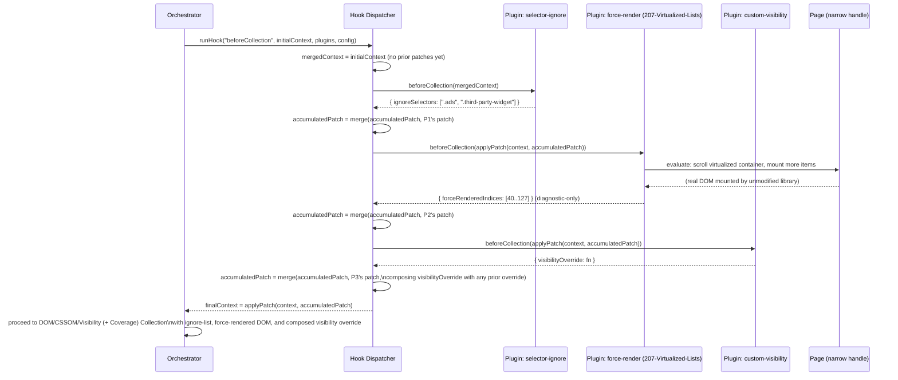
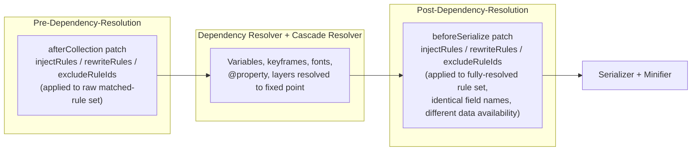

# 001 — Lifecycle Hooks

## 1. Title

**Critical CSS Extraction Engine — Lifecycle Hooks: Invocation Points, Context Contracts, Mutation Boundaries, and Multi-Plugin Dispatch**

## 2. Version

| Field | Value |
|---|---|
| Document Version | 1.0.0 |
| Status | Draft — Phase 12 (Plugin SDK) |
| Last Updated | 2026-07-10 |
| Owners | Plugin System Working Group |
| Stability | Hook set and dispatch algorithm stable against [ADR-0004](../adr/ADR-0004-Plugin-Lifecycle-Model.md); per-hook patch field sets are additive-extensible per that ADR's Implementation Notes item 3 |

## 3. Purpose

This document is the authoritative, hook-by-hook reference for the six named plugin lifecycle hooks specified in Section 2.13 of BRIEF.md — `beforeLaunch`, `afterNavigation`, `beforeCollection`, `afterCollection`, `beforeSerialize`, `afterSerialize` — and decided as the engine's sole extensibility mechanism by [ADR-0004-Plugin-Lifecycle-Model](../adr/ADR-0004-Plugin-Lifecycle-Model.md). Where [000-Plugin-SDK-Overview.md](./000-Plugin-SDK-Overview.md) establishes the whole-system shape (what a plugin is, how it is loaded, how it relates to extraction-strategy selection), this document goes one level deeper into the one artifact every plugin author actually writes code against: a specific hook's context object and permitted patch shape.

For each of the six hooks, this document specifies: the **exact point** in the pipeline at which the orchestrator invokes it (relative to the stages already named in [011-Execution-Pipeline.md](../architecture/011-Execution-Pipeline.md) and diagrammed in [ADR-0004](../adr/ADR-0004-Plugin-Lifecycle-Model.md)'s Architecture section); the **context** the hook receives (what is knowable and legitimately inspectable at that pipeline stage, and — just as importantly — what is deliberately absent); the **patch** the hook may return and the mutations that patch is permitted to express; whether the hook's own execution and its interaction with the rest of the pipeline is synchronous or asynchronous; and how **multiple plugins** implementing the same hook are ordered and composed. The chapter closes with the authoritative pseudocode for the hook-dispatch algorithm — a refinement of [ADR-0004](../adr/ADR-0004-Plugin-Lifecycle-Model.md)'s `runHook` sketch with the specifics this document's per-hook contracts require — and a sequence diagram of multiple plugins firing on a single hook.

Concrete TypeScript types backing every context/patch shape described narratively here are defined formally in [002-Plugin-API.md](./002-Plugin-API.md); this document is the conceptual and behavioral reference those types implement. Worked example plugins consuming these exact contracts are in [003-Plugin-Examples.md](./003-Plugin-Examples.md). The execution-isolation guarantees implicitly assumed throughout (a plugin cannot escape its context object to reach live browser handles directly, except where a hook's contract narrowly and explicitly grants such access) are the subject of [004-Sandboxing.md](./004-Sandboxing.md).

## 4. Audience

- Plugin authors implementing any of the six hooks, for whom this document is the primary reference determining what their hook function will receive and what shape its return value must take.
- Core orchestrator maintainers (`packages/cli` and the pipeline driver) responsible for the six actual call sites into the dispatcher this document specifies.
- Reviewers of new plugin proposals checking whether a requested capability is already expressible through an existing hook's documented patch shape, or whether it would require extending a patch contract (a minor-version-compatible, additive change) or, in the extreme, a new hook (a major, RFC-gated change per [ADR-0004](../adr/ADR-0004-Plugin-Lifecycle-Model.md)).
- Implementers of [002-Plugin-API.md](./002-Plugin-API.md)'s concrete type definitions, who must encode exactly the contracts this document specifies narratively.
- Implementers of the Reporter (Section 2.12 of BRIEF.md), who consume this document's per-hook timing/diagnostics contract (Section 8's "Diagnostics Emitted" subsections) to build the plugin-attribution portion of the timing report.

Readers must have read [000-Plugin-SDK-Overview.md](./000-Plugin-SDK-Overview.md) and [ADR-0004-Plugin-Lifecycle-Model](../adr/ADR-0004-Plugin-Lifecycle-Model.md) in full before this document; both are treated as settled context here, not re-argued.

## 5. Prerequisites

- [000-Plugin-SDK-Overview.md](./000-Plugin-SDK-Overview.md) — plugin shape, registration, and the orthogonality of plugin configuration from extraction-strategy selection (Section 8.4 of that document), assumed throughout.
- [ADR-0004-Plugin-Lifecycle-Model](../adr/ADR-0004-Plugin-Lifecycle-Model.md) — the architectural decision and its `runHook` sketch, which this document's Section 10 refines rather than re-derives.
- [011-Execution-Pipeline.md](../architecture/011-Execution-Pipeline.md) — the pipeline stages each hook is anchored between.
- [104-Rendering-Stabilization.md](../design/104-Rendering-Stabilization.md) — the stabilization contract `afterNavigation` receives the result of, and the frame-quiescence primitive several hooks' example use cases (Section 8.3's virtualization mitigation) build on at a narrower scale.
- [106-DOM-Snapshot.md](../design/106-DOM-Snapshot.md) — the snapshot shape `afterCollection`'s context is built from.
- [400-Selector-Matching.md](../design/400-Selector-Matching.md), [200-Visibility-Engine-Overview.md](../design/200-Visibility-Engine-Overview.md) — the matching/visibility subsystems `beforeCollection`'s patch fields (`ignoreSelectors`, `visibilityOverride`, matching augmentation) feed into.
- [600-Serialization-Overview.md](../design/600-Serialization-Overview.md) — the serialization stage `beforeSerialize`/`afterSerialize` bracket.
- [207-Virtualized-Lists.md](../design/207-Virtualized-Lists.md) Section 8.5 — the fully worked force-render mitigation via `beforeCollection`, used throughout this document (Section 8.3) as the running concrete example of a non-trivial hook consumer.

## 6. Related Documents

- [000-Plugin-SDK-Overview.md](./000-Plugin-SDK-Overview.md) — plugin shape and registration; this document assumes it.
- [ADR-0004-Plugin-Lifecycle-Model](../adr/ADR-0004-Plugin-Lifecycle-Model.md) — the decision record; this document is its detailed elaboration.
- [002-Plugin-API.md](./002-Plugin-API.md) — concrete TypeScript interfaces for every context/patch shape this document describes.
- [003-Plugin-Examples.md](./003-Plugin-Examples.md) — worked examples exercising every hook and every Section 2.13 capability.
- [004-Sandboxing.md](./004-Sandboxing.md) — execution-isolation boundary each hook's context respects.
- [207-Virtualized-Lists.md](../design/207-Virtualized-Lists.md) — the force-render `beforeCollection` mitigation used as a running example (Section 8.3).
- [104-Rendering-Stabilization.md](../design/104-Rendering-Stabilization.md), [106-DOM-Snapshot.md](../design/106-DOM-Snapshot.md), [400-Selector-Matching.md](../design/400-Selector-Matching.md), [200-Visibility-Engine-Overview.md](../design/200-Visibility-Engine-Overview.md), [600-Serialization-Overview.md](../design/600-Serialization-Overview.md) — the pipeline-stage documents each hook's context/patch is scoped against.
- [006-Design-Principles.md](../architecture/006-Design-Principles.md) — Principle 1, Principle 3, Principle 6, inherited throughout.

## 7. Overview

[ADR-0004](../adr/ADR-0004-Plugin-Lifecycle-Model.md) establishes the general shape of a hook firing: a read-only context view in, a schema-validated partial patch out, sequential declared-order execution across plugins implementing the same hook, per-plugin timeouts, and a configurable failure policy. What that ADR does not do — deliberately, since an ADR records a decision and its rationale, not an implementation-level API reference — is specify, hook by hook, exactly what fields populate each context object and exactly what a patch may legally contain for that specific stage. That gap is this document's entire content.

The six hooks bracket five pipeline transitions (Browser Manager launch, Navigation Engine stabilization, DOM/CSSOM/Visibility/Coverage collection, Dependency/Cascade resolution, Serialization/Minification) with a "before" and "after" hook around three of those transitions (collection, and — via `beforeLaunch`/`afterNavigation` and `beforeSerialize`/`afterSerialize` — around the other two in a slightly asymmetric arrangement explained in Section 8's per-hook rationale). Section 8 covers each hook in turn, always in the fixed order: invocation point, context contract, patch contract, sync/async posture, multi-plugin ordering notes specific to that hook, and diagnostics emitted. Section 9 diagrams the full pipeline with hook points and a multi-plugin sequence. Section 10 gives the refined dispatch algorithm.

## 8. Detailed Design

### 8.1 `beforeLaunch`

**Invocation point.** Immediately before the Browser Manager (Section 2.4 of BRIEF.md) launches or acquires a pooled browser context, and before any page, navigation, or DOM state exists. This is the earliest possible hook — nothing about the target page is yet known beyond static configuration.

**Context received (`BeforeLaunchContext`).** Launch configuration only: the resolved viewport profile(s) to be used (Mobile/Tablet/Desktop, per Section 2.6 of BRIEF.md), the selected browser engine (Chromium/Firefox/WebKit, per [ADR-0003-Playwright-As-Browser-Abstraction](../adr/ADR-0003-Playwright-As-Browser-Abstraction.md)), the active extraction mode (CSSOM/Coverage/Hybrid — read-only, informational; per [000-Plugin-SDK-Overview.md](./000-Plugin-SDK-Overview.md) Section 8.4, a plugin must not need to branch on this, but may read it for diagnostics purposes), the target route/URL about to be navigated to, and engine-wide configuration (timeouts, user agent overrides). There is no `Page`, `BrowserContext`, or DOM/CSSOM reference in this context, because none has been created yet.

**Patch permitted (`BeforeLaunchPatch`).** Launch-configuration overrides only: additional Playwright launch options (extra HTTP headers, a custom user agent string, viewport dimension overrides, geolocation/permissions overrides), and a `Record<string, unknown>` blob of arbitrary "context metadata" a plugin wants threaded through to later hooks (since no other channel exists yet for a plugin to stash state that later invocations of the same plugin, at later hooks, can read back — see Implementation Notes item 1). A `beforeLaunch` patch may not reference any DOM node, CSS rule, or navigation state, since none exists — schema validation rejects any attempt to do so.

**Synchronous vs. asynchronous.** Always invoked and awaited as `async`; a plugin frequently needs this hook to perform genuinely asynchronous setup (reading a large ignore-list configuration file from disk once per run, per [ADR-0004](../adr/ADR-0004-Plugin-Lifecycle-Model.md) Performance section's caching guidance, or fetching a remote feature-flag value).

**Multi-plugin ordering.** Declared-order sequential, per [ADR-0004](../adr/ADR-0004-Plugin-Lifecycle-Model.md)'s general algorithm. Launch-option overrides use last-writer-wins-by-declared-order for scalar fields (viewport override) and shallow-merge for object fields (extra HTTP headers merge key-by-key, later plugin's value winning on key collision), documented precisely in [002-Plugin-API.md](./002-Plugin-API.md).

**Diagnostics emitted.** `beforeLaunch` timing per plugin; a warning diagnostic if two plugins' launch-option patches collide on the same scalar field (informational, since last-writer-wins is a defined, not an error, outcome, but worth surfacing since it usually indicates an unintended configuration overlap).

### 8.2 `afterNavigation`

**Invocation point.** Immediately after the Navigation Engine has navigated to the target route and the rendering-stabilization contract of [104-Rendering-Stabilization.md](../design/104-Rendering-Stabilization.md) has been satisfied (network-idle-equivalent, or a custom application-declared readiness signal, per that document's Section 8.5) — but strictly before DOM/CSSOM collection begins. The page is fully loaded and stabilized by the engine's normal criteria; nothing has been enumerated or captured from it yet.

**Context received (`AfterNavigationContext`).** A narrow, capability-scoped page-driving handle (not the raw Playwright `Page` object — see [004-Sandboxing.md](./004-Sandboxing.md) for the exact narrowing), exposing only: `evaluate(fn, ...args)` for running a function in the page's JS context and returning a structured-cloneable result, `waitForNextAnimationFrame()`, and `scrollTo(x, y)`/`querySelectorScrollTop` convenience helpers layered on `evaluate`. Also included: the final resolved URL (post-redirects), the navigation timing (time-to-stabilization), and the same read-only launch/extraction-mode metadata `beforeLaunch` saw, plus any `contextMetadata` a plugin's own `beforeLaunch` invocation previously returned (Implementation Notes item 1).

**Patch permitted (`AfterNavigationPatch`).** No structural pipeline mutation — `afterNavigation` is, by design, the one hook in the set that is close to observation-only for pipeline-state purposes, because there is genuinely little for a plugin to legitimately hand back at this point beyond diagnostics (the DOM has not been collected yet, so there is no ignore-list or visibility override to attach to anything concrete). The permitted patch is limited to: additional diagnostics/annotations to attach to the extraction result's report (a plugin might record "custom readiness signal X was observed at time T" for later correlation), and — the one exception with real pipeline effect — an optional `extendStabilizationMs` value requesting additional settle time before collection proceeds, consumed by the orchestrator as a bounded extension (capped by engine-wide configuration, never unbounded) to [104-Rendering-Stabilization.md](../design/104-Rendering-Stabilization.md)'s existing deadline discipline.

**Synchronous vs. asynchronous.** `async`; commonly used for exactly the kind of "drive the live page a little further" actions the virtualization force-render mitigation ([207-Virtualized-Lists.md](../design/207-Virtualized-Lists.md) Section 8.5) actually performs at `beforeCollection` rather than here — `afterNavigation` is the *earlier*, narrower point at which a plugin could, in principle, perform a similar page-driving action, but the documented convention (Section 8.3, and [207-Virtualized-Lists.md](../design/207-Virtualized-Lists.md) itself) places force-render mitigations at `beforeCollection` instead, specifically because `beforeCollection`'s context additionally exposes the detection heuristics' output (Section 8.3), letting the plugin target only containers actually flagged as likely-virtualized rather than acting blindly.

**Multi-plugin ordering.** Declared-order sequential; `extendStabilizationMs` values from multiple plugins are summed (not last-writer-wins), since each plugin's request for more settle time is assumed additive and independent, capped at the engine-wide maximum regardless of how many plugins request extensions.

**Diagnostics emitted.** Per-plugin timing; a diagnostic if the summed `extendStabilizationMs` requests are capped (informing the operator that a plugin's requested extension was not fully honored).

### 8.3 `beforeCollection`

**Invocation point.** Immediately before the DOM Collector, CSSOM Walker, Selector Matcher, Visibility Engine, and (if Hybrid or Coverage mode is active) Coverage session begin their pass, per [000-Plugin-SDK-Overview.md](./000-Plugin-SDK-Overview.md) Section 8.4's stage-boundary framing — this is the single most consequential hook for the five capabilities named in Section 2.13 of BRIEF.md, since four of the five (ignore selectors, customize visibility, customize matching, and — via the force-render pattern — indirectly affecting what gets collected at all) are expressed through this hook's patch.

**Context received (`BeforeCollectionContext`).** The same narrow page-driving handle `afterNavigation` received (still valid — the page has not been torn down), plus, new at this stage: the output of the virtualization-detection heuristics ([207-Virtualized-Lists.md](../design/207-Virtualized-Lists.md) Section 8.1's `VirtualizationCandidate[]`, computed by the engine as a matter of course before this hook fires, specifically so `beforeCollection` plugins can consume it without recomputing it themselves), the currently active fold/viewport geometry for the viewport profile being processed, and the full stylesheet inventory the CSSOM Walker is about to traverse (URLs, inline `<style>` presence, `@import` graph — read-only, per [300-CSSOM-Walker.md](../design/300-CSSOM-Walker.md)). The live DOM itself is not handed over as a data structure (no snapshot exists yet — that is precisely what this hook precedes); a plugin wanting to *inspect* current DOM state does so via `context.evaluate(...)`, the same narrow page-driving primitive, not via a pre-built object.

**Patch permitted (`BeforeCollectionPatch`).** This is the richest patch contract of the six hooks:

- `ignoreSelectors: string[]` — selectors the Selector Matcher must treat as never-matching for this run, regardless of what the CSSOM/Coverage signals would otherwise report (the direct implementation of Section 2.13's "ignore selectors" capability).
- `visibilityOverride: (node: NodeRef) => boolean | undefined` — a function the Visibility Engine consults per node, whose non-`undefined` return value takes precedence over the Engine's own geometry/intersection classification for that node only (Section 2.13's "customize visibility"; the mechanism [207-Virtualized-Lists.md](../design/207-Virtualized-Lists.md) itself does not use directly, since that document's mitigation instead causes more real nodes to exist rather than reclassifying existing ones, but a distinct, equally valid use of the same field).
- `matchingAugmentation: MatchingAugmentation[]` — a list of engine-recognized augmentation directives (e.g., "also treat selector list X as matching if custom predicate Y holds," used for pseudo-class-like custom framework conventions the native `element.matches()` cannot express — Section 2.13's "customize matching"; never a replacement selector parser, per [ADR-0002-No-Custom-Selector-Parser](../adr/ADR-0002-No-Custom-Selector-Parser.md), only an additive predicate layered on top of native matching).
- **Side-effecting page-driving actions performed during the hook's own execution** (not part of the returned patch object, but a documented, sanctioned use of the `context.evaluate`/`scrollTo`/`waitForNextAnimationFrame` primitives already in context) — this is exactly the force-render mechanism [207-Virtualized-Lists.md](../design/207-Virtualized-Lists.md) Section 8.5 specifies: the plugin drives real scroll events, waits for the real virtualization library to mount additional real DOM, then restores scroll position, all before returning. The hook's *returned patch* in this case is diagnostic-only (`{ forceRenderedIndices: [...] }`, per that document's Section 9.3 sequence), since the actual effect (more DOM existing) is achieved by direct page-driving, not by a declarative patch field — a deliberate asymmetry, explained in Implementation Notes item 2.

**Synchronous vs. asynchronous.** `async`, and frequently the longest-running of the six hooks in practice, precisely because it is the natural home for page-driving side effects (Section 8.5 of [207-Virtualized-Lists.md](../design/207-Virtualized-Lists.md)) bounded by the plugin's own configured timeout (a stricter, hook-specific timeout is recommended in configuration for `beforeCollection` specifically, given this expected cost, per Implementation Notes item 3).

**Multi-plugin ordering.** Declared-order sequential. `ignoreSelectors` arrays concatenate (deduplicated) across plugins; `matchingAugmentation` arrays concatenate; `visibilityOverride` functions compose left-to-right, with each subsequent plugin's override function receiving, as an additional argument, the prior plugins' combined override result for that node (so a later plugin can choose to respect or override an earlier plugin's visibility decision, rather than the two functions racing independently) — the one field in this hook's patch contract requiring genuine function-composition rather than plain data-merge, documented precisely in [002-Plugin-API.md](./002-Plugin-API.md).

**Diagnostics emitted.** Per-plugin timing (with a distinct "page-driving time" sub-metric, since this is the hook where such time is expected and should not be conflated with pure computation time); the count of selectors added to the ignore-list and by which plugin; a warning if two plugins' `visibilityOverride` functions disagree for the same node (both are applied via composition, per above, but disagreement is worth surfacing as a diagnostic since it often indicates overlapping plugin responsibilities that should be consolidated).

### 8.4 `afterCollection`

**Invocation point.** Immediately after the DOM Collector, CSSOM Walker, Selector Matcher, Visibility Engine, and any active Coverage/Hybrid reconciliation ([701-Hybrid-Mode.md](../design/701-Hybrid-Mode.md)) have produced their combined output, but strictly before the Dependency Resolver and Cascade Resolver begin (Section 2.5 of BRIEF.md). This is the mirror point to `beforeCollection` and the second of the two hooks most relevant to Section 2.13's capability list, specifically "rewrite CSS" and "inject rules."

**Context received (`AfterCollectionContext`).** A read-only view of the full collection result: the matched-rule set (per node and aggregate, in the shape [400-Selector-Matching.md](../design/400-Selector-Matching.md) and, if Hybrid mode is active, [701-Hybrid-Mode.md](../design/701-Hybrid-Mode.md)'s reconciled strong-include/provisional partition produce), the unmatched-rule set (feeding the same diagnostic correlation [207-Virtualized-Lists.md](../design/207-Virtualized-Lists.md) Section 8.2 describes for virtualization-caused gaps), the visibility classification per node, and the stylesheet inventory with source locations for every included rule (needed by a CSS-rewriting plugin to know which rule, in which original stylesheet, at which position, a rewrite applies to). The live page handle from `beforeCollection` is still technically reachable (the browser context has not been torn down) but its further use at this stage is discouraged in guidance (not sandboxed-forbidden) since collection has already happened — a plugin driving further page state here cannot retroactively affect a collection pass that already completed, and would need `beforeCollection` instead for that purpose.

**Patch permitted (`AfterCollectionPatch`).**

- `injectRules: CssRuleInput[]` — additional CSS rules (selector + declaration block, or a raw CSS-rule-text string parsed by the engine's existing CSSOM machinery, never a custom parser per [ADR-0002](../adr/ADR-0002-No-Custom-Selector-Parser.md)) to be included in the critical bundle unconditionally, regardless of what matching/coverage found — Section 2.13's "inject rules" capability, useful for a plugin that knows, out-of-band, that some rule is needed even though the current snapshot's matching signals did not (or could not) confirm it, e.g., a rule targeting a state class only ever applied via a later user interaction the extraction run does not simulate.
- `rewriteRules: RuleRewrite[]` — a list of `{ ruleId, newCssText }` pairs identifying an already-matched rule (by the stable `ruleId` the CSSOM Walker assigns) and providing replacement CSS text for it — Section 2.13's "rewrite CSS" capability, used for cases like stripping vendor-prefixed properties a target browser matrix does not need, or rewriting a custom property's fallback value for a specific deployment target.
- `excludeRuleIds: string[]` — the complement of `injectRules`: rule IDs to drop from the matched set despite having been matched, distinct from `ignoreSelectors` (which prevents a *match* from happening at all, at `beforeCollection`, before Coverage/matching runs) in that this field removes an *already-confirmed* match after the fact, useful when a plugin's exclusion criterion depends on information only available post-matching (e.g., "exclude any matched rule whose selector specificity exceeds threshold X," which cannot be evaluated pre-match).

**Synchronous vs. asynchronous.** `async`, though in practice most `afterCollection` plugin logic is pure computation over the already-collected data (no further page-driving), so real-world execution time is typically far shorter than `beforeCollection`'s.

**Multi-plugin ordering.** Declared-order sequential. `injectRules` and `excludeRuleIds` concatenate across plugins (deduplicated by rule identity/content hash for `injectRules`, by `ruleId` for `excludeRuleIds`). `rewriteRules` is the one field requiring explicit conflict resolution: if two plugins both rewrite the same `ruleId`, the later-declared plugin's rewrite wins, applied to the *original* rule text (not chained onto the earlier plugin's rewrite) unless the later plugin's rewrite handler explicitly requests chaining via a documented opt-in flag in [002-Plugin-API.md](./002-Plugin-API.md) — chaining is opt-in, not default, because most rewrite plugins are not written expecting their input to already be another plugin's output, and silently chaining by default risks compounding unintended transformations.

**Diagnostics emitted.** Per-plugin timing; counts of injected/rewritten/excluded rules per plugin; a warning on `rewriteRules` collision (per above); a warning if `excludeRuleIds` references a `ruleId` not present in the matched set (a no-op, likely indicating a stale rule-ID reference in plugin configuration, e.g., from a previous run's report).

### 8.5 `beforeSerialize`

**Invocation point.** Immediately before the Serializer begins rule-ordering and deduplication (Section 2.5, 2.14's "Rule Ordering"/"Deduplication" per [601-Rule-Ordering.md](../design/601-Rule-Ordering.md)/[602-Deduplication.md](../design/602-Deduplication.md)), after Dependency Resolution and Cascade Resolution have fully completed. The rule set entering this hook is the final, dependency-closed (variables, keyframes, fonts, `@property`, layers all resolved per Section 2.5 of BRIEF.md) set that will be serialized, but not yet ordered, deduplicated, or formatted.

**Context received (`BeforeSerializeContext`).** The fully dependency-resolved rule set (read-only), the resolved cascade-ordering metadata (specificity/origin/layer information the Cascade Resolver computed, needed by a plugin wanting to reason about final ordering before it is baked in), and the target output format configuration (per Section 2.5's Serializer responsibility and [606-Output-Formats.md](../design/606-Output-Formats.md)) — a plugin can inspect, but the format itself is not mutable here (format selection is a run-wide configuration concern, not a per-hook patch field, consistent with [000-Plugin-SDK-Overview.md](./000-Plugin-SDK-Overview.md) Section 8.4's orthogonality principle applied to output format rather than extraction strategy).

**Patch permitted (`BeforeSerializePatch`).** A final-stage variant of `afterCollection`'s `injectRules`/`excludeRuleIds`/`rewriteRules` (Section 8.4), applied post-dependency-resolution instead of pre — useful for a plugin whose logic genuinely depends on the fully resolved rule set (e.g., "exclude any rule contributing to a resolved custom-property chain longer than N," which cannot be evaluated before dependency resolution completes) rather than the pre-resolution view `afterCollection` offers. The two hooks' patch fields are deliberately named identically (`injectRules`, `rewriteRules`, `excludeRuleIds`) to signal their structural equivalence to plugin authors, differing only in *when* in the pipeline they apply and therefore what data is available to decide their contents.

**Synchronous vs. asynchronous.** `async`; almost always pure computation, since no page-driving primitive is exposed at this stage (the context handle from `beforeCollection`/`afterCollection` is not carried forward — by this point the browser context is frequently already released back to the pool per [ADR-0003](../adr/ADR-0003-Playwright-As-Browser-Abstraction.md)'s pooling model, and a plugin needing further page access at this late stage is a strong signal the logic belongs at an earlier hook).

**Multi-plugin ordering.** Identical merge semantics to `afterCollection`'s (Section 8.4), applied to the post-resolution rule set instead.

**Diagnostics emitted.** Per-plugin timing; the same injected/rewritten/excluded counts and collision warnings as `afterCollection`, tagged distinctly in the Reporter's output so an operator can tell which stage a given rule's final inclusion/exclusion/rewrite was decided at.

### 8.6 `afterSerialize`

**Invocation point.** Immediately after the Serializer and Minifier (Section 2.5 of BRIEF.md) have produced final output, the last point in the pipeline before the extraction result is returned to the caller (CLI, programmatic API, SSR middleware). Per [ADR-0004](../adr/ADR-0004-Plugin-Lifecycle-Model.md) Edge Cases, a plugin failure at this hook must not necessarily invalidate an otherwise-successful extraction, since the actual work (a valid, serialized CSS payload) is already complete by the time this hook fires.

**Context received (`AfterSerializeContext`).** The final serialized output (CSS text, plus per-route/per-viewport variants if multiple were generated per Section 2.6 of BRIEF.md), the full diagnostics/report bundle (dependency graph, matched/unmatched selector reports, timing report per Section 2.12 of BRIEF.md, including every prior hook's own timing/diagnostics entries — making `afterSerialize` the one hook whose context includes the *complete* history of every earlier hook's contributions, useful for a plugin implementing custom reporting/publishing logic), and cache-fingerprinting metadata (per Section 2.8's incremental cache, [803-Route-Cache.md](../design/803-Route-Cache.md)) for a plugin wanting to correlate output against cache hit/miss state.

**Patch permitted (`AfterSerializePatch`).** No further CSS-content mutation is permitted at this hook — by design, since the output has already been serialized and minified, and re-opening content mutation this late would mean re-running serialization/minification for one plugin's benefit, defeating the purpose of treating `afterSerialize` as a strictly observational, side-effect-only stage. The permitted patch is limited to: additional entries appended to the diagnostics/report bundle (a plugin publishing results to an external system might append a `{ publishedTo: 'https://...' }` annotation), and a boolean `blockOnFailure` override (default `false` for this specific hook, distinct from the engine-wide `failurePolicy`) that a plugin author can set to request that *this plugin's own* failure at `afterSerialize` should fail the overall run despite the hook's generally lenient default — an explicit opt-in escape hatch for organizations wanting strict "any plugin failure anywhere fails the build" CI semantics, addressing the exact configurability [ADR-0004](../adr/ADR-0004-Plugin-Lifecycle-Model.md) Edge Cases flags as necessary.

**Synchronous vs. asynchronous.** `async`; commonly used for I/O-bound side effects entirely outside the CSS pipeline itself (publishing to a CDN, posting a Slack notification, writing a custom report format to disk) — the natural home for exactly this class of "do something with the finished result" plugin, contrasted with every earlier hook's "influence the result while it is still being produced" character.

**Multi-plugin ordering.** Declared-order sequential, though since this hook's patch has no cross-plugin data-merge conflicts possible (report-bundle entries simply accumulate, `blockOnFailure` is per-plugin and does not interact with other plugins' values), ordering matters here primarily for diagnostics-timeline readability rather than for any correctness-relevant merge semantics — the one hook where relaxing strict sequential ordering to allow concurrent execution would be lowest-risk to consider (flagged in Future Work, consistent with [ADR-0004](../adr/ADR-0004-Plugin-Lifecycle-Model.md)'s own flagged future parallel-execution option).

**Diagnostics emitted.** Per-plugin timing; the full six-hook timing summary this hook's own context already contains is, by this point, itself finalized and available for the Reporter to render as the complete plugin-attribution section of the timing report (Section 2.12 of BRIEF.md).

## 9. Architecture

### 9.1 Pipeline with All Six Hook Points and Per-Hook Context/Patch Summary

```mermaid
flowchart TD
    START([Run Start]) --> BL["beforeLaunch\nctx: launch config, viewport, engine, mode (read-only)\npatch: launch overrides, contextMetadata"]
    BL --> LAUNCH["Browser Manager: launch/acquire context"]
    LAUNCH --> NAV["Navigation Engine: navigate + stabilize (104)"]
    NAV --> AN["afterNavigation\nctx: page handle, final URL, timing\npatch: diagnostics, extendStabilizationMs"]
    AN --> BC["beforeCollection\nctx: page handle, virtualization candidates (207),\nfold geometry, stylesheet inventory\npatch: ignoreSelectors, visibilityOverride,\nmatchingAugmentation, + page-driving side effects"]
    BC --> COLLECT["DOM Collector + CSSOM Walker +\nSelector Matcher + Visibility Engine\n(+ Coverage, if Hybrid/Coverage mode)"]
    COLLECT --> AC["afterCollection\nctx: matched/unmatched sets, visibility, stylesheet inventory\npatch: injectRules, rewriteRules, excludeRuleIds"]
    AC --> DEP["Dependency Resolver + Cascade Resolver"]
    DEP --> BS["beforeSerialize\nctx: resolved rule set, cascade ordering, output format\npatch: injectRules, rewriteRules, excludeRuleIds (post-resolution)"]
    BS --> SER["Serializer + Minifier"]
    SER --> AS["afterSerialize\nctx: final CSS, full diagnostics bundle, cache metadata\npatch: report annotations, blockOnFailure"]
    AS --> DONE([Extraction Result])

    style BL fill:#8a2be2,color:#fff
    style AN fill:#8a2be2,color:#fff
    style BC fill:#8a2be2,color:#fff
    style AC fill:#8a2be2,color:#fff
    style BS fill:#8a2be2,color:#fff
    style AS fill:#8a2be2,color:#fff
```



### 9.2 Sequence: Multiple Plugins Firing on `beforeCollection`



### 9.3 Hook-Level Data Flow: Pre- vs. Post-Resolution Patch Symmetry



## 10. Algorithms

### 10.1 Refined Hook-Dispatch Algorithm

**Problem statement.** [ADR-0004](../adr/ADR-0004-Plugin-Lifecycle-Model.md) specifies the general `runHook` shape. This section refines it with the hook-specific merge-function dispatch this document's per-hook contracts require (composition for `visibilityOverride`, concatenation-with-dedup for array fields, last-writer-wins for scalars, sum-with-cap for `extendStabilizationMs`), since "merge the patch" is not a single generic operation across all six hooks' fields — each field has its own documented merge function, looked up by hook name and field name.

**Inputs.** `hookName: HookName`, `initialContext: HookContext`, `plugins: Plugin[]` (already filtered to those implementing `hookName`, per [000-Plugin-SDK-Overview.md](./000-Plugin-SDK-Overview.md) Algorithm 10.2's `O(1)` lookup), `mergeFunctions: Map<FieldName, MergeFn>` (per-hook, per-field, defined in [002-Plugin-API.md](./002-Plugin-API.md)), `config: { timeoutMs, failurePolicy }`.

**Outputs.** `finalContext: HookContext`, `diagnostics: HookDiagnostic[]`.

**Pseudocode.**

```text
function runHook(hookName, initialContext, plugins, mergeFunctions, config) -> (HookContext, Diagnostic[]):
    context = deepFreezeReadonlyView(initialContext)
    accumulatedPatch = {}
    diagnostics = []

    for plugin in plugins:   // already pre-filtered to implementers of hookName; declared order preserved
        startTime = now()
        mergedContextView = applyPatch(context, accumulatedPatch)

        try:
            result = await withTimeout(
                plugin.hooks[hookName](mergedContextView),
                config.timeoutMs
            )
            validatePatchShape(hookName, result)     // per-hook schema, 002-Plugin-API.md

            for field, value in (result ?? {}):
                mergeFn = mergeFunctions.get(hookName, field)   // e.g. concatDedup, lastWriterWins,
                                                                  // composeOverride, sumWithCap
                accumulatedPatch[field] = mergeFn(accumulatedPatch[field], value, plugin)

            diagnostics.push(SuccessDiagnostic(plugin, hookName, now() - startTime))

        catch (err):
            diagnostics.push(FailureDiagnostic(plugin, hookName, err, now() - startTime))
            switch config.failurePolicy:
                case "abort":
                    throw new PluginHookError(plugin, hookName, err)
                case "skip":
                case "log-only":
                    continue

    return (applyPatch(context, accumulatedPatch), diagnostics)
```

**Time complexity.** `O(k × (c + p))` per hook firing, where `k` is the number of plugins implementing that hook (bounded by `O(1)` lookup from [000-Plugin-SDK-Overview.md](./000-Plugin-SDK-Overview.md) Algorithm 10.2, not a scan of all `n` installed plugins), `c` is the cost of constructing `mergedContextView` (bounded by context size, itself deliberately minimal per stage), and `p` is per-plugin patch-merge cost (dominated, for most fields, by `O(1)` scalar merges or `O(m)` array concatenation where `m` is patch-array size, small in practice). This matches and refines [ADR-0004](../adr/ADR-0004-Plugin-Lifecycle-Model.md)'s `O(n)`-per-firing statement, sharpened to `O(k)` given the precomputed per-hook index.

**Memory complexity.** `O(contextSize + Σ patchSize)` across the `k` invocations for this firing; the `visibilityOverride` composition case (Section 8.3) is the one field whose merge produces a closure chain of depth up to `k` rather than a flat data merge, adding `O(k)` call-stack depth to every subsequent visibility check during Collection — bounded and small in practice (plugin counts implementing this specific field are expected to be low single digits), but worth noting as the one super-linear-feeling (though still linear in `k`) cost this hook set's design accepts, per Implementation Notes item 4.

**Failure cases.** Identical to [ADR-0004](../adr/ADR-0004-Plugin-Lifecycle-Model.md)'s general treatment (throw, timeout, invalid-shape), plus one hook-specific addition: a `mergeFn` itself throwing (e.g., a malformed `rewriteRules` entry referencing a `ruleId` that fails a stricter-than-schema-level validity check during merge) is treated identically to a plugin-thrown error for failure-policy purposes, attributed to the plugin whose patch triggered it.

**Optimization opportunities.** For hooks where no installed plugin implements a given field at all (the common case for most (hook, field) pairs on most runs), the merge loop can skip calling `mergeFn` entirely and use the raw accumulated value directly — a cheap fast-path check (`accumulatedPatch[field] === undefined && Object.keys(result).length === 1`) avoiding unnecessary function-call overhead in the hot path when only one plugin contributes to a given field.

### 10.2 Algorithm: `visibilityOverride` Composition (the One Genuinely Stateful Merge)

**Problem statement.** Given zero or more plugins' `visibilityOverride` functions contributed across sequential `beforeCollection` invocations, produce a single composed function the Visibility Engine calls once per node, respecting declared-order precedence (a later plugin can see and choose to respect or override an earlier plugin's decision for the same node) without re-invoking earlier plugins' functions redundantly per node.

**Inputs.** `priorOverride: (NodeRef) => boolean | undefined` (the composed function from all earlier plugins, or a trivial always-`undefined` function if none), `newOverride: (NodeRef, priorResult: boolean | undefined) => boolean | undefined` (the newly contributed plugin's function, which receives the prior composed result as a second argument per Section 8.3).

**Outputs.** `composedOverride: (NodeRef) => boolean | undefined`.

**Pseudocode.**

```text
function composeVisibilityOverride(priorOverride, newOverride) -> (NodeRef) => boolean | undefined:
    return function(node):
        priorResult = priorOverride(node)     // O(1) if priorOverride is itself already-composed and memoized per node per run
        return newOverride(node, priorResult)  // newOverride may return priorResult unchanged, or its own decision
```

**Time complexity.** `O(k)` per node evaluated (once per node, per plugin implementing `visibilityOverride`, since each layer's function must run to produce the input to the next) — this is the field for which per-node cost genuinely scales with plugin count `k`, unlike every other field's `O(1)`-per-node cost (which is paid once, at merge time, not per node at Visibility Engine evaluation time). In practice `k` is small (per [ADR-0004](../adr/ADR-0004-Plugin-Lifecycle-Model.md)'s scalability discussion), keeping this bounded.

**Memory complexity.** `O(k)` for the closure chain depth; no per-node memory beyond the Visibility Engine's own existing per-node classification storage.

**Failure cases.** A plugin's `visibilityOverride` function throwing during actual per-node evaluation (as opposed to during the `beforeCollection` hook's own top-level execution) is a distinct failure mode from the hook-level failures Section 10.1 handles — per-node evaluation happens later, during Collection, outside the `runHook` try/catch entirely. The composed function must therefore itself be defensively wrapped (catch-per-node, falling back to `undefined` for that node with a diagnostic) so a single node's evaluation failure does not abort the entire Collection pass.

**Optimization opportunities.** When `k = 1` (the overwhelmingly common case — most runs install zero or one plugin implementing `visibilityOverride`), skip composition entirely and use the single plugin's function directly, avoiding the closure-chain indirection for the common path.

## 11. Implementation Notes

1. **`contextMetadata` (introduced at `beforeLaunch`, Section 8.1) is the sole general-purpose channel for a single plugin to carry its own state across its own multiple hook invocations within one run.** Because each hook context is freshly constructed and plugins are stateless functions (not objects with instance fields, per [000-Plugin-SDK-Overview.md](./000-Plugin-SDK-Overview.md) Section 8.1's plain-object-over-class rationale), a plugin needing to remember something from `beforeLaunch` at, say, `afterCollection`, must round-trip it through `contextMetadata`, which the orchestrator threads through every subsequent context object unchanged (keyed by plugin name, so plugins do not collide with each other's metadata). Plugin authors needing heavier state should instead use in-memory closures within their own module scope (valid within one process, per [000-Plugin-SDK-Overview.md](./000-Plugin-SDK-Overview.md) Implementation Notes item 5's persistent-process guidance) rather than `contextMetadata`, which is intended for small, serializable values.
2. **The force-render pattern's patch being diagnostic-only (Section 8.3) while its actual effect is a page-driving side effect is a deliberate, documented exception to "patches are the only way plugins affect engine state."** [ADR-0004](../adr/ADR-0004-Plugin-Lifecycle-Model.md) Implementation Notes item 2 states this principle for *data* mutations (DOM node handles, CSSOM rule trees are never handed over directly); it does not and was never intended to forbid a narrowly-scoped, sanctioned page-driving primitive (`context.evaluate`/`scrollTo` at `beforeCollection`/`afterNavigation` specifically) from causing real, browser-native side effects that are themselves subsequently observed through the ordinary collection pipeline, exactly as [207-Virtualized-Lists.md](../design/207-Virtualized-Lists.md) Section 8.5's "why this is fully consistent with Principle 1" argument establishes. The distinction that matters is fabricated-vs-real DOM, not patch-vs-side-effect as a mechanism.
3. **`beforeCollection` deserves its own, typically longer, timeout configuration distinct from the other five hooks' default**, given its documented tendency to host page-driving side effects (force-render being the primary example); [002-Plugin-API.md](./002-Plugin-API.md)'s configuration schema exposes a per-hook timeout override for exactly this reason, rather than forcing one global timeout value to fit both "a plugin computing a static ignore-list" and "a plugin scrolling through 40 increments of a virtualized list."
4. **The `visibilityOverride` composition chain (Algorithm 10.2) is the one place this hook set's design deliberately accepts `O(k)`-per-node cost instead of the `O(1)`-per-node cost every other patch field achieves.** This was judged acceptable because per-node visibility classification is already, by construction, one of the more expensive per-node operations in the pipeline ([200-Visibility-Engine-Overview.md](../design/200-Visibility-Engine-Overview.md)'s geometry/intersection/overflow/transform checks), so a small, bounded additional per-node cost proportional to installed-plugin count is a marginal addition relative to the baseline, not a new order-of-magnitude cost class.
5. **`injectRules`/`rewriteRules`/`excludeRuleIds` appearing identically at both `afterCollection` and `beforeSerialize` (Sections 8.4/8.5) is intentional symmetry, not duplication to be "cleaned up."** The two hooks answer the same question ("what rules should the final bundle contain") at two different points in dependency resolution, and a plugin author should choose whichever hook's data availability matches their logic's actual dependency — documented explicitly here so a future maintainer does not mistake the repetition for redundant API surface needing consolidation.
6. **Per-hook diagnostics (Section 8's "Diagnostics Emitted" subsections) must all feed a single, unified `PluginTimingReport` structure**, keyed by `(hookName, pluginName)`, consumed by the Reporter (Section 2.12 of BRIEF.md) and fully available by `afterSerialize` (Section 8.6), which is why that hook's context includes the complete prior history rather than only its own.

## 12. Edge Cases

- **A `beforeCollection` plugin's force-render side effect perturbs `afterNavigation`'s already-satisfied stabilization criteria** (e.g., the scroll-triggered re-mount causes new network requests the stabilization contract of [104-Rendering-Stabilization.md](../design/104-Rendering-Stabilization.md) would ordinarily wait for, if it were still watching) — per [207-Virtualized-Lists.md](../design/207-Virtualized-Lists.md) Section 8.5's own caveat, this is the plugin author's responsibility to bound (via `settleFramesPerIncrement`/`maxElapsedMs`) since the orchestrator's stabilization watch is not re-armed during `beforeCollection`; a plugin causing pathological additional loading behavior during this hook is a plugin-authoring bug, not a framework defect, but is exactly the kind of risk [207-Virtualized-Lists.md](../design/207-Virtualized-Lists.md) Section 8.5 already flags under "why this must be opt-in."
- **`extendStabilizationMs` (Section 8.2) requested by a plugin exceeds the engine-wide cap.** The cap always wins; the diagnostic records both the requested and the honored value, and the pipeline proceeds at the capped duration rather than failing the run — a deliberate "degrade gracefully, log loudly" choice consistent with [006-Design-Principles.md](../architecture/006-Design-Principles.md) Principle 6.
- **A `beforeCollection` `ignoreSelectors` entry and an `afterCollection` `injectRules` entry from two different plugins target the same underlying CSS rule** (one plugin says "never match this selector," another injects a rule with identical selector text unconditionally). Both are honored: `ignoreSelectors` only suppresses the *matching-derived* inclusion path, while `injectRules` is an unconditional addition independent of matching — the rule ends up included via injection despite being ignored for matching purposes, a defined (if slightly surprising in isolation) outcome documented explicitly here so it is not mistaken for a bug; the Reporter's diagnostics surface both facts (ignored-for-matching, present-via-injection) side by side for the same rule to make this legible to an operator.
- **A `rewriteRules` entry at `afterCollection` targets a `ruleId` that a later `excludeRuleIds` entry at `beforeSerialize` also removes.** The rewrite is simply moot (its output is discarded along with the rule) — no error, since a rule being excluded after being rewritten is a valid, if slightly wasteful, sequence of independent plugin decisions; a diagnostic notes the "rewritten-then-excluded" sequence for visibility, not as an error.
- **A plugin's hook function is itself synchronous (returns a value directly, not a `Promise`)** rather than declared `async`. The dispatcher (`await withTimeout(plugin.hooks[hookName](...), ...)`) handles this transparently since `await`ing a non-Promise value resolves immediately with that value — no special-casing required, though [ADR-0004](../adr/ADR-0004-Plugin-Lifecycle-Model.md) Algorithms section's flagged "fast-path for synchronous-looking hook implementations" optimization specifically targets this case for skipping unnecessary timeout-wrapper machinery.
- **Two plugins both implement `beforeLaunch` and both attempt to override the same scalar launch option (e.g., viewport width)** — resolved by last-writer-wins-by-declared-order (Section 8.1), with a collision diagnostic; this is the simplest and most common multi-plugin conflict shape across all six hooks and is handled uniformly wherever a field's documented merge function is `lastWriterWins`.
- **A hook context's read-only view is inspected via `JSON.stringify` or similar by a plugin attempting to detect "am I the first/only plugin running."** Plugins must not rely on positional or count-based introspection of context internals to infer other installed plugins' presence — this is explicitly unsupported and not guaranteed stable across engine versions; the only sanctioned way to reason about "other plugins' effects" is via each hook's documented, typed patch/merge contract (e.g., `visibilityOverride`'s explicit `priorResult` argument), never via ad hoc context inspection.

## 13. Tradeoffs

| Dimension | Fewer, coarser-grained hooks (e.g., merge `beforeCollection`/`afterCollection` into one "collection" hook) | Six hooks as specified (Chosen) | More, finer-grained hooks (e.g., separate hooks per signal collector) |
|---|---|---|---|
| Ability to influence collection *inputs* vs. only inspect *outputs* | Lost — a single "collection" hook firing after the fact cannot pre-filter what the Selector Matcher considers | Preserved — `beforeCollection` acts on inputs, `afterCollection` on outputs | Preserved, and further subdivided per signal source |
| API surface size / cognitive load for plugin authors | Smaller, but conflates two structurally different capabilities (ignore/customize vs. inject/rewrite) into one hook's patch shape | Six hooks, cleanly separated by capability and pipeline-stage data availability | Larger; couples plugin API to extraction-strategy internals (rejected per [000-Plugin-SDK-Overview.md](./000-Plugin-SDK-Overview.md) Section 8.4) |
| Coupling to extraction-strategy (CSSOM/Coverage/Hybrid) internals | None | None | High — a per-signal-collector hook set would need to change whenever Hybrid mode's internal collector composition changes |
| Symmetry between `afterCollection` and `beforeSerialize`'s patch fields | N/A (no equivalent second hook) | Deliberate, documented symmetry (Implementation Notes item 5) letting a plugin choose pre- vs. post-dependency-resolution timing | N/A |
| Risk of "which hook do I use" ambiguity for plugin authors | Lower (fewer choices) | Slightly higher for the `afterCollection`-vs-`beforeSerialize` choice specifically, mitigated by this document's explicit guidance | Highest — many near-duplicate hooks with subtle distinctions |

**Why the before/after pairing was chosen around collection and serialization but not around launch/navigation as a symmetric pair.** A `beforeNavigation` hook (paired with `afterNavigation`) and an `afterLaunch` hook (paired with `beforeLaunch`) were considered for full symmetry but rejected as low-value additions: `beforeNavigation` would fire after `beforeLaunch` but before any navigation has occurred, with essentially the same context `beforeLaunch` already has (nothing page-specific yet exists) — it would not enable any capability not already achievable at `beforeLaunch` itself, since no navigation-specific decision can yet be made. Symmetrically, `afterLaunch` would fire after the browser context exists but before navigation, a state with limited plugin-relevant information (a blank page) and no capability gap `afterNavigation` does not already close once navigation completes. Adding these two hooks purely for aesthetic symmetry would violate [ADR-0004](../adr/ADR-0004-Plugin-Lifecycle-Model.md)'s "small, curated, justified-by-actual-need" hook-set philosophy — every hook in the set must correspond to a real, distinct capability gap, not merely round out a diagram.

**Why `beforeSerialize` was retained as a distinct hook from `afterCollection` despite significant field-shape overlap (Implementation Notes item 5), rather than merging the two.** The two hooks' *shared field names* reflect a shared *kind* of capability (inject/rewrite/exclude rules), but they operate over genuinely different data (pre- vs. post-dependency-resolution rule sets), and a plugin's correct choice between them depends on whether its decision logic needs resolved custom-property values, resolved keyframe/font dependencies, and finalized cascade ordering (only available post-resolution) or not. Collapsing them into one hook would force every such plugin to either always pay the cost of running after full dependency resolution (even when its logic does not need that data, delaying its ability to catch a problem as early as possible) or would require inventing a separate "which resolution state do you want" parameter within a single hook — itself just as much complexity as two named hooks, with less clarity about what state is guaranteed at invocation time.

**Future implications.** Per [ADR-0004](../adr/ADR-0004-Plugin-Lifecycle-Model.md)'s "future implications" guidance, any proposal for a seventh hook, or for further subdividing an existing hook, must first demonstrate that the desired capability cannot be expressed as an additive field on an existing hook's patch contract (the path this document's own `beforeCollection`/`afterCollection` field sets were arrived at) before an RFC for a structurally new hook is entertained.

## 14. Performance

- **CPU complexity:** Per-hook dispatch cost is `O(k × (c + p))` per firing (Algorithm 10.1), six firings per run; total plugin overhead across a run is the sum of six such firings, each independently small relative to DOM/CSSOM collection and matching workloads, except for `visibilityOverride`'s `O(k)`-per-node cost (Algorithm 10.2), which is the one field whose cost scales with the size of the DOM snapshot (`O(N × k)` across all nodes) rather than being a flat per-firing cost — worth calling out specifically as the one hook-contract field with this different complexity class.
- **Memory complexity:** Bounded by context size (deliberately minimal per stage, Section 8's per-hook context contracts) plus accumulated patch size; `afterSerialize`'s context, carrying the complete six-hook diagnostics history (Implementation Notes item 6), is the single largest context object by construction, though still small relative to the CSS/DOM data it accompanies.
- **Caching strategy:** No hook result is cached across runs by default (identical to [ADR-0004](../adr/ADR-0004-Plugin-Lifecycle-Model.md)'s existing guidance); `contextMetadata` (Implementation Notes item 1) is the sanctioned within-run carry-forward mechanism, not a cross-run cache.
- **Parallelization opportunities:** `afterSerialize` (Section 8.6) is identified as the lowest-risk hook to consider for an opt-in concurrent-execution mode (Section 8.6's ordering discussion and Future Work), since its patch fields have no cross-plugin merge conflicts requiring sequential visibility into prior plugins' contributions, unlike every other hook's fields.
- **Incremental execution:** Hook dispatch is not itself incremental; a plugin wanting to skip redundant work across runs with an unchanged fingerprint (Section 2.8 of BRIEF.md) must implement its own check against the fingerprinting metadata available in `afterSerialize`'s context (or via its own external state) — the SDK provides no built-in incremental-hook-skipping primitive.
- **Profiling guidance:** The per-hook, per-plugin `PluginTimingReport` (Implementation Notes item 6) should be examined per hook, not only in aggregate, since a plugin's cost profile can differ sharply by hook — a force-render plugin is expected to dominate `beforeCollection` timing but contribute negligibly elsewhere, and a report showing unexpected cost at, say, `beforeSerialize` for the same plugin would be a signal worth investigating as a possible logic-placement mistake (see Tradeoffs' `afterCollection`-vs-`beforeSerialize` guidance).
- **Scalability limits:** Identical to [ADR-0004](../adr/ADR-0004-Plugin-Lifecycle-Model.md)'s analysis for five of the six hooks' fields; `visibilityOverride`'s `O(N × k)` composition cost (Algorithm 10.2) is the one field whose scalability limit is jointly a function of DOM size and plugin count rather than plugin count alone, and is the first place to look if a large page with several `visibilityOverride`-implementing plugins shows disproportionate Collection-stage slowdown.

## 15. Testing

- **Unit tests:** Every hook's context-construction logic (correct fields present, correct read-only-ness enforced) tested in isolation; every documented merge function (`concatDedup`, `lastWriterWins`, `composeOverride`, `sumWithCap`) tested against multi-plugin conflict scenarios specific to that function.
- **Integration tests:** One example plugin per Section 2.13 capability (ignore-selectors, CSS-rewrite via `rewriteRules`, rule-injection via `injectRules`, custom-visibility via `visibilityOverride`, custom-matching via `matchingAugmentation`) registered together against the fixture suite, asserting each hook fires with the documented context shape and that all five plugins' patches compose correctly without unintended interaction, extending [000-Plugin-SDK-Overview.md](./000-Plugin-SDK-Overview.md)'s composition-test guidance to the per-hook-field level.
- **Visual tests:** The virtualization force-render example ([207-Virtualized-Lists.md](../design/207-Virtualized-Lists.md)) run through the standard visual-regression pipeline with and without the plugin, verifying force-rendered items' CSS is present in output without altering the captured page's visual state (scroll position correctly restored per that document's Section 8.5).
- **Stress tests:** A large number of plugins (tens) all implementing `visibilityOverride` specifically, to validate Algorithm 10.2's `O(N × k)` cost remains within acceptable bounds and does not degrade pathologically as `k` grows, extending [000-Plugin-SDK-Overview.md](./000-Plugin-SDK-Overview.md)'s general stress-test guidance to this specific worst-case field.
- **Regression tests:** Every reported per-hook merge-conflict misbehavior (a `rewriteRules` collision resolved incorrectly, a `visibilityOverride` composition producing the wrong final classification for a node) becomes a permanent fixture, per hook and per field.
- **Benchmark tests:** Track per-hook overhead broken out by field-merge-function cost specifically (not only aggregate per-hook timing), to catch a regression isolated to, say, `visibilityOverride` composition without it being masked by aggregate `beforeCollection` timing dominated by an unrelated force-render plugin's page-driving cost in the same benchmark run.

## 16. Future Work

- **Opt-in concurrent execution for `afterSerialize`-implementing plugins** (Section 8.6, Tradeoffs), the lowest-risk candidate hook for relaxing strict sequential ordering given its lack of cross-plugin merge conflicts.
- **A stricter, per-hook-configurable timeout schema** (Implementation Notes item 3) already partially motivated here; formalizing recommended defaults per hook (longer for `beforeCollection`, shorter for `beforeSerialize`) as documented, not merely ad hoc, guidance.
- **A `dependsOn`-aware composition order for `visibilityOverride` specifically** (building on [ADR-0004](../adr/ADR-0004-Plugin-Lifecycle-Model.md)'s general Future Work item on inter-plugin dependency declarations), letting a plugin explicitly request "run after plugin X's visibility override, not merely after whatever declared-order happens to place me," which the current declared-order-only composition (Algorithm 10.2) does not support.
- **Research idea:** whether `matchingAugmentation` (Section 8.3) should be formalized against a machine-checkable predicate DSL rather than an opaque engine-recognized directive list, to reduce the risk of augmentation directives silently drifting into de facto custom-selector-parsing territory that [ADR-0002-No-Custom-Selector-Parser](../adr/ADR-0002-No-Custom-Selector-Parser.md) forbids.
- **Open question:** should `afterNavigation`'s currently narrow, mostly-observational patch contract (Section 8.2) be extended with additional page-driving-result fields as real-world plugin use cases emerge that are better placed there than at `beforeCollection`, or does the existing convention (place page-driving mitigations at `beforeCollection`, per Section 8.3's rationale) already cover the realistic need, making further extension unnecessary complexity.
- **Open question:** whether a future major version should introduce an automated compatibility shim translating older plugins' hook contracts to a changed shape, the same open question [ADR-0004](../adr/ADR-0004-Plugin-Lifecycle-Model.md) raises at the architectural level, inherited here unresolved at the per-hook-contract level of detail.

## 17. References

- [ADR-0004-Plugin-Lifecycle-Model](../adr/ADR-0004-Plugin-Lifecycle-Model.md)
- [000-Plugin-SDK-Overview.md](./000-Plugin-SDK-Overview.md)
- [002-Plugin-API.md](./002-Plugin-API.md)
- [003-Plugin-Examples.md](./003-Plugin-Examples.md)
- [004-Sandboxing.md](./004-Sandboxing.md)
- [207-Virtualized-Lists.md](../design/207-Virtualized-Lists.md)
- [104-Rendering-Stabilization.md](../design/104-Rendering-Stabilization.md)
- [106-DOM-Snapshot.md](../design/106-DOM-Snapshot.md)
- [400-Selector-Matching.md](../design/400-Selector-Matching.md)
- [200-Visibility-Engine-Overview.md](../design/200-Visibility-Engine-Overview.md)
- [300-CSSOM-Walker.md](../design/300-CSSOM-Walker.md)
- [600-Serialization-Overview.md](../design/600-Serialization-Overview.md), [601-Rule-Ordering.md](../design/601-Rule-Ordering.md), [602-Deduplication.md](../design/602-Deduplication.md), [606-Output-Formats.md](../design/606-Output-Formats.md)
- [701-Hybrid-Mode.md](../design/701-Hybrid-Mode.md)
- [803-Route-Cache.md](../design/803-Route-Cache.md)
- [ADR-0002-No-Custom-Selector-Parser](../adr/ADR-0002-No-Custom-Selector-Parser.md), [ADR-0003-Playwright-As-Browser-Abstraction](../adr/ADR-0003-Playwright-As-Browser-Abstraction.md)
- [006-Design-Principles.md](../architecture/006-Design-Principles.md)
- Webpack Tapable hook system documentation (precedent for typed, named hook contracts with per-hook data shapes)
