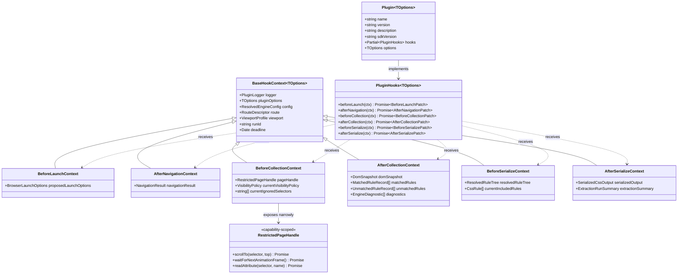
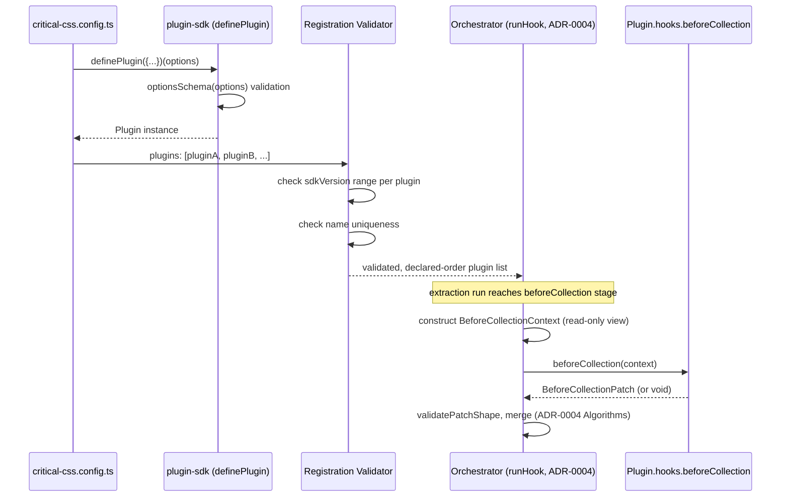

# 002 — Plugin API

## 1. Title

**Critical CSS Extraction Engine — Plugin API Surface: Interfaces, Hook Signatures, Context Objects, Registration, and Versioning**

## 2. Version

| Field | Value |
|---|---|
| Document Version | 1.0.0 |
| Status | Accepted |
| Last Updated | 2026-07-10 |
| Owners | Plugin System Working Group |
| Stability | Stable (Phase 12 design document; breaking changes to the surface described here require a major-version RFC per Section 8.6) |

## 3. Purpose

[ADR-0004-Plugin-Lifecycle-Model](../adr/ADR-0004-Plugin-Lifecycle-Model.md) established *why* the Engine exposes extensibility as six discrete, named lifecycle hooks rather than a middleware chain or event emitter, and specified the orchestration algorithm (`runHook`) that invokes those hooks in declared order with patch-based, schema-validated mutation. That ADR deliberately stopped short of nailing down the concrete TypeScript-level surface a plugin author actually writes against: the exact shape of the `Plugin` object, the parameter and return types of each of the six hook handlers, the shape and contents of the context object passed into every handler, the registration entry points (`definePlugin`, the `plugins` configuration array), and the compatibility contract governing how that surface itself may evolve across Engine versions.

This document is that concrete surface. It exists so that a plugin author can implement a working, correctly-typed plugin by reading one document, without needing to reverse-engineer hook contracts from orchestrator source code or from the narrative prose of the ADR. It is the single normative source for: (a) the `Plugin` TypeScript interface and its `hooks` map; (b) the per-hook context object shapes (`BeforeLaunchContext`, `AfterNavigationContext`, `BeforeCollectionContext`, `AfterCollectionContext`, `BeforeSerializeContext`, `AfterSerializeContext`) and their corresponding patch return types; (c) the `definePlugin()` helper and the `plugins: PluginRegistration[]` configuration array that determines declared execution order; and (d) the semantic-versioning contract that governs the Plugin API package (`@critical-css-engine/plugin-sdk`) independently of the Engine's own release cadence.

## 4. Audience

- Plugin authors writing TypeScript (or JavaScript with JSDoc types) plugins against the SDK, who need exact signatures rather than prose descriptions.
- Engine core maintainers implementing the orchestrator's hook-invocation call sites, who must keep the runtime behavior in lock-step with the types this document defines as the source of truth.
- SSR framework-adapter authors (React SSR, Next.js, Astro, Remix, Express, Fastify — BRIEF.md Section 2.10) who commonly implement their adapters as `beforeLaunch`/`afterNavigation` plugins and need the context shapes for those two hooks in full detail.
- Authors of the worked examples in [003-Plugin-Examples.md](./003-Plugin-Examples.md), which are written directly against the interfaces this document defines.
- Reviewers of the sandboxing model in [004-Sandboxing.md](./004-Sandboxing.md), who need to know precisely what a context object does and does not expose, since the sandbox boundary is enforced at the context-construction layer this document specifies.
- Toolchain authors building editor tooling (autocomplete, inline documentation) against the published `.d.ts` output of `@critical-css-engine/plugin-sdk`.

## 5. Prerequisites

- [ADR-0004-Plugin-Lifecycle-Model](../adr/ADR-0004-Plugin-Lifecycle-Model.md) — the architectural justification for discrete hooks, the `runHook` orchestration algorithm, and the patch-merge semantics this document's types implement concretely. This document assumes that ADR's Algorithms and Implementation Notes sections as background and does not re-derive them.
- [000-Plugin-SDK-Overview.md](./000-Plugin-SDK-Overview.md) — the SDK's package structure, installation, and high-level mental model, of which this document is the API-reference deep-dive.
- [001-Lifecycle-Hooks.md](./001-Lifecycle-Hooks.md) — the per-hook narrative semantics (what each hook is *for*, what pipeline guarantees hold at each point); this document assumes that narrative context and focuses on the resulting concrete types.
- Working familiarity with TypeScript generics, discriminated unions, and `Readonly<T>`/deep-readonly patterns, since the context objects make heavy use of all three to enforce the read-only-view contract from the ADR.
- [106-DOM-Snapshot.md](../design/106-DOM-Snapshot.md) and [400-Selector-Matching.md](../design/400-Selector-Matching.md) — familiarity with `DomSnapshot`, `MatchedRuleSet`, and `UnmatchedRuleSet` shapes, since several context objects expose read-only views of these same data structures.

## 6. Related Documents

- [ADR-0004-Plugin-Lifecycle-Model](../adr/ADR-0004-Plugin-Lifecycle-Model.md) — architectural foundation for everything in this document.
- [000-Plugin-SDK-Overview.md](./000-Plugin-SDK-Overview.md) — SDK-level overview; sibling Phase 12 document.
- [001-Lifecycle-Hooks.md](./001-Lifecycle-Hooks.md) — narrative per-hook semantics; sibling Phase 12 document.
- [003-Plugin-Examples.md](./003-Plugin-Examples.md) — worked examples implemented directly against this document's interfaces; sibling Phase 12 document.
- [004-Sandboxing.md](./004-Sandboxing.md) — the execution-isolation model enforced at the context-construction boundary this document specifies; sibling Phase 12 document.
- [design/207-Virtualized-Lists.md](../design/207-Virtualized-Lists.md) — a `beforeCollection` plugin use case (force-render) whose patch shape (`forceRenderedIndices`) is formalized in Section 8.3 of this document.
- [design/403-Pseudo-Classes.md](../design/403-Pseudo-Classes.md) — the `beforeCollection` `syntheticState` patch shape, formalized in Section 8.3 of this document.
- [design/400-Selector-Matching.md](../design/400-Selector-Matching.md), [design/106-DOM-Snapshot.md](../design/106-DOM-Snapshot.md) — data shapes referenced by context objects.

## 7. Overview

The Plugin API surface is deliberately partitioned into four concerns that this document addresses in turn: **(1) the `Plugin` shape** — what an author's module must export or construct to be installable; **(2) hook signatures** — for each of the six hooks, the exact input (context) and output (patch) types, expressed as TypeScript function signatures; **(3) the context object family** — a set of related-but-distinct types, one per hook, unified by a shared base shape (`BaseHookContext`) carrying cross-cutting facilities (logger, config, run metadata) and specialized per hook with stage-specific, read-only views of pipeline state; **(4) registration and versioning** — the `definePlugin()` ergonomic helper, the `plugins` configuration array's declared-order semantics, and the independent semantic-versioning contract for the `@critical-css-engine/plugin-sdk` package.

A guiding design constraint threads through all four: **every type in this surface is either an input the plugin receives read-only, or an output the plugin returns as a plain, serializable-shape patch object.** No context object exposes a mutable reference to live pipeline state, a live `Page`/browser handle, or a callback that can alter control flow — this is the type-level enforcement of ADR-0004's "patches, not direct mutation" consequence, and is what makes the sandboxing boundary in [004-Sandboxing.md](./004-Sandboxing.md) tractable to reason about and to actually enforce at the object-construction layer, not merely by developer convention.

## 8. Detailed Design

### 8.1 The `Plugin` Interface

```typescript
/**
 * The root shape every installable plugin must satisfy. A plugin is a
 * plain object — not a class instance, not a function — so that plugin
 * definitions remain trivially serializable for diagnostics/logging and
 * trivially comparable for the declared-order deduplication check the
 * orchestrator performs at registration time (Section 8.5).
 */
export interface Plugin<TOptions = void> {
  /** Stable, unique identifier. Used for diagnostics, ordering, and
   *  conflict-resolution attribution (ADR-0004 Algorithms: "later plugin
   *  wins" is reported by this name, not by array index, so reordering
   *  the plugins array does not silently change what a diagnostic means). */
  readonly name: string;

  /** SemVer string for the *plugin itself* (not the SDK) — surfaced in
   *  diagnostics and the extraction trace so a regression can be
   *  attributed to a specific plugin version, not merely a plugin name. */
  readonly version: string;

  /** Optional human-readable description, surfaced in `--list-plugins`
   *  CLI output and the Reporter's plugin inventory view. */
  readonly description?: string;

  /** The minimum and/or exact range of `@critical-css-engine/plugin-sdk`
   *  versions this plugin was authored against, checked at registration
   *  time per Section 8.6's compatibility contract. */
  readonly sdkVersion: string; // SemVer range, e.g. "^2.0.0"

  /** The hook implementations. A plugin may implement zero, some, or all
   *  six hooks; an unimplemented hook is a no-op for that plugin and is
   *  skipped silently by `runHook` (ADR-0004 Algorithms). */
  readonly hooks: Partial<PluginHooks<TOptions>>;

  /** Plugin-author-declared static options, validated once at plugin
   *  construction time via `definePlugin`'s optional `optionsSchema`
   *  (Section 8.5) and made available read-only inside every hook
   *  context's `context.pluginOptions`. Not re-validated per hook firing. */
  readonly options?: TOptions;
}

/** The complete map of hook name to handler function signature. */
export interface PluginHooks<TOptions = void> {
  beforeLaunch(ctx: BeforeLaunchContext<TOptions>): Promise<BeforeLaunchPatch | void>;
  afterNavigation(ctx: AfterNavigationContext<TOptions>): Promise<AfterNavigationPatch | void>;
  beforeCollection(ctx: BeforeCollectionContext<TOptions>): Promise<BeforeCollectionPatch | void>;
  afterCollection(ctx: AfterCollectionContext<TOptions>): Promise<AfterCollectionPatch | void>;
  beforeSerialize(ctx: BeforeSerializeContext<TOptions>): Promise<BeforeSerializePatch | void>;
  afterSerialize(ctx: AfterSerializeContext<TOptions>): Promise<AfterSerializePatch | void>;
}
```

**Why a plain object, not a class.** A class instance invites plugin authors to stash mutable instance state (`this.cache = {}`) that silently persists and accumulates across hook firings and, worse, across concurrent extraction runs sharing a plugin instance (Section 12 Edge Cases) — a plain object with a `hooks` map of pure(ish) async functions makes cross-run state contamination an opt-in choice (a closure variable a plugin author deliberately captures) rather than an implicit, class-shaped invitation. Class-based plugin models are common in comparable ecosystems (Webpack's class-with-`apply(compiler)` model is the most direct precedent) but Webpack's own plugin-authoring guidance has, over successive major versions, moved toward encouraging stateless-where-possible plugin bodies for exactly this reason — this design starts from that end state rather than migrating toward it later.

**Why `name`+`version` are mandatory, not optional.** ADR-0004's Algorithms section requires per-plugin diagnostics attribution (`reportSuccess(plugin, hookName)`, `reportFailure(plugin, hookName, err)`) and the Tradeoffs/Edge Cases sections require deterministic, attributable conflict resolution ("later plugin wins... with a diagnostic warning logged" — the warning must name the plugin). Making both fields mandatory at the type level, rather than optional-with-a-fallback-to-array-index, ensures every diagnostic emitted by the orchestrator is human-actionable from day one rather than only after a plugin author remembers to add a name.

**Alternatives considered.**
- *A single `apply(engine)` registration function per plugin (Webpack-style), where the plugin imperatively calls `engine.hooks.beforeCollection.tap(name, fn)` inside its own body.* Rejected: this reintroduces an imperative registration API surface that must itself be versioned and stabilized (what methods does `engine.hooks.beforeCollection` expose — `.tap`, `.tapAsync`, `.tapPromise`, as in Tapable?), duplicating machinery ADR-0004 already rejected in spirit (an imperative "hook registration object" is a small step from a general event-emitter/middleware surface). The declarative `hooks: {...}` map keeps the entire plugin, including which hooks it implements, statically inspectable without executing any plugin code — valuable both for the orchestrator's registration-time validation (Section 8.5) and for tooling (a `--list-plugins` command can enumerate implemented hooks without invoking `apply`).
- *Hooks returning `this`-mutating side effects instead of declarative patches.* Rejected for the same reasons ADR-0004 rejected direct mutation generally; kept out of scope for this document since it is inherited directly from the ADR's Decision section.

### 8.2 Per-Hook Context Objects

Every context object extends a common `BaseHookContext<TOptions>`:

```typescript
export interface BaseHookContext<TOptions = void> {
  /** Structured logger scoped to this plugin + this hook firing; every
   *  log line is automatically tagged with plugin name, hook name, and
   *  the current extraction run's correlation ID, so plugin log output
   *  is attributable in aggregated CI logs without the plugin author
   *  doing any tagging themselves. */
  readonly logger: PluginLogger;

  /** The plugin's own validated, static options (Section 8.1), passed
   *  through unchanged on every hook firing for this plugin instance. */
  readonly pluginOptions: Readonly<TOptions>;

  /** The fully-resolved Engine configuration for this extraction run
   *  (merged defaults + project config + CLI overrides), exposed
   *  read-only. Plugins commonly read `config.viewport`,
   *  `config.route`, or custom top-level config keys reserved for
   *  plugin use under `config.plugins.<pluginName>`. */
  readonly config: Readonly<ResolvedEngineConfig>;

  /** Which route and viewport this extraction run is currently
   *  processing — present on every hook, including `beforeLaunch`,
   *  because route/viewport are known before the browser launches
   *  (they come from the run's input, not from anything observed
   *  in-browser). */
  readonly route: Readonly<RouteDescriptor>;
  readonly viewport: Readonly<ViewportProfile>;

  /** Monotonic run-scoped correlation ID, stable across all six hooks
   *  for a single extraction run, for cross-referencing plugin log
   *  lines with the Reporter's timing/trace output. */
  readonly runId: string;

  /** Wall-clock deadline (per ADR-0004 Algorithms `config.timeoutMs`)
   *  this specific hook invocation must complete before, exposed so a
   *  plugin can implement its own internal, tighter time-budgeting
   *  (e.g., 207-Virtualized-Lists.md's force-render loop keeping its
   *  own `maxElapsedMs` comfortably under this value — see
   *  003-Plugin-Examples.md Example A). */
  readonly deadline: Date;
}
```

Each hook's context adds exactly the stage-scoped facts that legitimately exist at that pipeline point (ADR-0004 Implementation Notes item 1), and nothing more:

```typescript
/** Nothing browser- or DOM-related exists yet; only launch-time config. */
export interface BeforeLaunchContext<TOptions = void>
  extends BaseHookContext<TOptions> {
  /** The launch configuration the Browser Manager is about to apply;
   *  a plugin may return a patch adjusting a narrow, allow-listed
   *  subset of these fields (Section 8.3). */
  readonly proposedLaunchOptions: Readonly<BrowserLaunchOptions>;
}

/** Browser launched, navigation + stabilization complete; no DOM/CSSOM
 *  collection has happened yet. */
export interface AfterNavigationContext<TOptions = void>
  extends BaseHookContext<TOptions> {
  /** Read-only facts about the completed navigation — final URL (after
   *  redirects), HTTP status, and the stabilization outcome from
   *  104-Rendering-Stabilization.md (quiet-frame count reached, timed
   *  out, or satisfied by a custom readiness signal). No live `Page`
   *  reference is exposed here by default — see 004-Sandboxing.md for
   *  the narrowly-scoped, opt-in page-access capability required by
   *  force-render-style plugins, which is granted at `beforeCollection`,
   *  not here, because navigation-time page manipulation is out of this
   *  hook's intended scope (ADR-0004 Edge Cases, "seventh generic hook"
   *  discussion). */
  readonly navigationResult: Readonly<NavigationResult>;
}

/** Stabilized page is available; DOM/CSSOM collection has not yet run.
 *  This is the hook with the broadest legitimate capability grant,
 *  because force-render-style mitigations (207-Virtualized-Lists.md
 *  Section 8.5) and synthetic-state declarations
 *  (403-Pseudo-Classes.md) both require acting before collection. */
export interface BeforeCollectionContext<TOptions = void>
  extends BaseHookContext<TOptions> {
  /** A narrowly-scoped, capability-restricted handle permitting a fixed,
   *  documented set of page interactions (scroll-position manipulation,
   *  animation-frame waiting) — never arbitrary `page.evaluate()` of
   *  plugin-supplied strings, never raw CDP access. See
   *  004-Sandboxing.md Section 8.2 for the exhaustive capability list
   *  and the rationale for keeping it fixed rather than open-ended. */
  readonly pageHandle: RestrictedPageHandle;

  /** The current, still-mutable-by-later-plugins visibility predicate
   *  and selector-ignore configuration, threaded through from any
   *  earlier plugin's patch in this same hook firing (ADR-0004
   *  Algorithms, `mergedContextView`). */
  readonly currentVisibilityPolicy: Readonly<VisibilityPolicy>;
  readonly currentIgnoredSelectors: ReadonlyArray<string>;
}

/** Collection has completed: full DOM snapshot, matched/unmatched rule
 *  sets, and visibility classifications are available, read-only. */
export interface AfterCollectionContext<TOptions = void>
  extends BaseHookContext<TOptions> {
  readonly domSnapshot: Readonly<DomSnapshot>; // 106-DOM-Snapshot.md
  readonly matchedRules: ReadonlyArray<Readonly<MatchedRuleRecord>>; // 400-Selector-Matching.md
  readonly unmatchedRules: ReadonlyArray<Readonly<UnmatchedRuleRecord>>;
  readonly diagnostics: ReadonlyArray<Readonly<EngineDiagnostic>>; // e.g. PotentialVirtualizationDetected
}

/** Dependency resolution has completed; serialization has not started.
 *  This is the primary hook for CSS rewriting/injection (BRIEF.md
 *  Section 2.13: "rewrite CSS, inject rules"). */
export interface BeforeSerializeContext<TOptions = void>
  extends BaseHookContext<TOptions> {
  readonly resolvedRuleTree: Readonly<ResolvedRuleTree>; // post-dependency-resolution
  readonly currentIncludedRules: ReadonlyArray<Readonly<CssRule>>;
}

/** Serialization complete; this is an observation-only hook by strong
 *  convention (Section 8.4) — its patch type exists for symmetry and
 *  for the narrow, documented "post-hoc output annotation" use case,
 *  not for further CSS rewriting. */
export interface AfterSerializeContext<TOptions = void>
  extends BaseHookContext<TOptions> {
  readonly serializedOutput: Readonly<SerializedCssOutput>; // 600-Serialization-Overview.md shape
  readonly extractionSummary: Readonly<ExtractionRunSummary>;
}
```

### 8.3 Per-Hook Patch (Return) Types

```typescript
export interface BeforeLaunchPatch {
  /** Allow-listed subset of launch options a plugin may override — not
   *  the full BrowserLaunchOptions shape, to prevent a plugin from,
   *  e.g., disabling the sandbox flag Section 004-Sandboxing.md relies
   *  on for browser-process isolation. */
  launchOptionsOverride?: Partial<Pick<BrowserLaunchOptions,
    "viewport" | "userAgent" | "extraHTTPHeaders" | "locale" | "timezoneId">>;
}

export interface AfterNavigationPatch {
  /** A plugin may report an additional, framework-specific readiness
   *  fact for diagnostics correlation; it cannot re-trigger navigation
   *  or stabilization (both already happened) — see 001-Lifecycle-Hooks.md
   *  for why this hook is patch-poor by design relative to its
   *  observation richness. */
  readinessAnnotations?: Record<string, string | number | boolean>;
}

export interface BeforeCollectionPatch {
  /** Selectors to exclude from matching entirely (BRIEF.md Section
   *  2.13: "ignore selectors"). Arrays from multiple plugins concatenate
   *  with declared-order dedup, per ADR-0004 Edge Cases. */
  ignoreSelectors?: string[];

  /** A visibility-classification override function, applied after the
   *  Visibility Engine's own geometry-based classification, for the
   *  "customize visibility" capability named in BRIEF.md Section 2.13.
   *  Must be a pure function of the (already-collected) node record —
   *  it is invoked host-side, not shipped into the browser. */
  visibilityOverride?: (node: Readonly<DomNodeRecord>) => boolean | undefined;

  /** A matching-augmentation function for the "customize matching"
   *  capability — invoked after native `element.matches()` per
   *  400-Selector-Matching.md, never replacing it (ADR-0002). */
  matchingOverride?: (selector: string, node: Readonly<DomNodeRecord>) => boolean | undefined;

  /** The 207-Virtualized-Lists.md force-render mitigation's result,
   *  a diagnostic-only patch field (Section 9.3 of that document):
   *  it does not itself alter matching, it records which indices were
   *  force-mounted for Reporter correlation. */
  forceRenderedIndices?: number[];

  /** The 403-Pseudo-Classes.md synthetic-state declaration: force-retain
   *  specific dynamic-pseudo-class rules for named base selectors. */
  syntheticState?: Array<{ selector: string; pseudoClasses: string[] }>;
}

export interface AfterCollectionPatch {
  /** Additional diagnostics a plugin wants attributed into the
   *  Reporter's output alongside the Engine's own (e.g., a plugin
   *  correlating PotentialVirtualizationDetected with its own
   *  force-render coverage report — 207-Virtualized-Lists.md
   *  Implementation Notes). */
  additionalDiagnostics?: EngineDiagnostic[];
}

export interface BeforeSerializePatch {
  /** New CSS rules to inject verbatim (BRIEF.md Section 2.13: "inject
   *  rules"), inserted at declared-order position, subject to the same
   *  Rule Tree/Cascade Layer ordering rules as engine-discovered rules
   *  (302-Rule-Tree.md, 305-Cascade-Layers.md). */
  injectRules?: CssRule[];

  /** Rules to remove from the currently-included set, by stable rule
   *  identity (BRIEF.md Section 2.13: "rewrite CSS" — removal is the
   *  primitive; full rewriting is expressed as remove-then-inject to
   *  keep patch semantics simple and auditable — see
   *  003-Plugin-Examples.md Example C). */
  removeRuleIds?: string[];
}

export interface AfterSerializePatch {
  /** Purely observational annotations attached to the extraction
   *  summary (e.g., a plugin recording its own timing/coverage metrics
   *  for the Reporter) — never mutates `serializedOutput` itself. */
  summaryAnnotations?: Record<string, unknown>;
}
```

**Why patches are per-hook distinct types, not one generic `Patch` union.** A generic `Patch` type covering all six hooks' fields would either be a large union requiring runtime discrimination (reintroducing exactly the "what can I return from here" ambiguity ADR-0004's Implementation Notes item 3 warns against) or would need every field marked optional across all hooks, silently permitting a plugin to return, say, `injectRules` from `beforeCollection` with no compile-time error — undermining the "beforeCollection may return an updated visibility predicate; it may not return a serialized CSS string" invariant the ADR states as load-bearing. Per-hook distinct return types make invalid patches a TypeScript compile error for typed plugin authors and a schema-validation error (per `validatePatchShape`, ADR-0004 Algorithms) for untyped/JavaScript plugin authors, at zero runtime cost differential between the two designs.

### 8.4 `afterSerialize`'s Deliberately Weak Patch Contract

Unlike the other five hooks, `AfterSerializePatch` carries no field capable of altering `serializedOutput` itself — only `summaryAnnotations`, a free-form bag attached to the run summary, not the CSS payload. This is a deliberate design choice, not an oversight: allowing post-serialization CSS mutation would mean the Serializer's own invariants (rule ordering per [601-Rule-Ordering.md](../design/601-Rule-Ordering.md), deduplication per [602-Deduplication.md](../design/602-Deduplication.md), and output validation per [604-Output-Validation.md](../design/604-Output-Validation.md)) could be silently violated by a plugin running strictly after the component responsible for enforcing them, with no re-validation pass currently specified to catch it. Plugins needing to affect the *content* of the serialized CSS must do so via `beforeSerialize`'s `injectRules`/`removeRuleIds`, before the Serializer's invariant-enforcing pass runs; `afterSerialize` exists for genuinely observational concerns — metrics emission, cache-warming side effects, external reporting — consistent with ADR-0004's own note that a diagnostics-only plugin failure at this last hook should not necessarily invalidate an otherwise-successful run.

### 8.5 Registration: `definePlugin` and the `plugins` Configuration Array

```typescript
export function definePlugin<TOptions = void>(
  definition: Omit<Plugin<TOptions>, "options"> & {
    /** Optional runtime validator for author-supplied options, run once
     *  at registration time (not per hook firing); throwing here is a
     *  registration-time failure, surfaced before any extraction run
     *  begins, never a mid-run plugin-hook failure. */
    optionsSchema?: (input: unknown) => TOptions;
  }
): (options?: TOptions) => Plugin<TOptions> {
  return (options) => ({
    ...definition,
    options: definition.optionsSchema
      ? definition.optionsSchema(options)
      : (options as TOptions),
  });
}
```

`definePlugin` is a thin ergonomic factory, not a required entry point — a plugin author may construct a `Plugin` object literal directly and it is equally valid, since `definePlugin`'s only added value is (a) inferring `TOptions` from `optionsSchema`'s return type so a plugin's hook handlers get correctly-typed `pluginOptions` without manual generic annotation, and (b) running the options validator exactly once at registration rather than requiring every hook handler to defensively re-validate its own options.

Project configuration declares plugin order explicitly:

```typescript
export interface ResolvedEngineConfig {
  // ...other fields
  readonly plugins: PluginRegistration[];
}

export type PluginRegistration = Plugin<unknown>;
```

```typescript
// critical-css.config.ts
import { definePlugin } from "@critical-css-engine/plugin-sdk";
import { forceRenderVirtualized } from "./plugins/force-render-virtualized";
import { focusVisibleSynthesis } from "./plugins/focus-visible-synthesis";

export default {
  plugins: [
    forceRenderVirtualized({ maxIncrements: 40 }), // runs first for beforeCollection
    focusVisibleSynthesis({ selectors: [".nav-link", ".cta-button"] }), // runs second
  ],
};
```

Execution order for any given hook is exactly the order plugins appear in this array (ADR-0004 Implementation Notes item 4) — never discovery order, never alphabetical, never priority-numbered. **Why no priority/weight system was added on top of array order:** a numeric priority system (as some plugin ecosystems use) introduces a second, independent ordering axis that must be reconciled with declaration order whenever two plugins share a priority value, reintroducing exactly the kind of "incidental, not explicit" ordering ambiguity ADR-0004's Decision section explicitly rejected discovery-order-based ordering for. Array order is a single, total, unambiguous order with no tie-breaking rule needed.

### 8.6 API Versioning and Compatibility Contract

The Plugin API surface (this document) is versioned independently as the `@critical-css-engine/plugin-sdk` npm package, following strict SemVer with the following concrete commitments:

- **Patch releases (`x.y.Z`):** bug fixes to the SDK's runtime helpers (e.g., `definePlugin`) that do not alter any exported type's shape.
- **Minor releases (`x.Y.z`):** additive, backward-compatible changes only — a new optional field on an existing context or patch type, a new exported utility type, or (per ADR-0004 Future Work) a net-new seventh field within an existing patch type. A plugin compiled against `plugin-sdk@2.1.0` continues to compile and run unmodified against `plugin-sdk@2.4.0`.
- **Major releases (`X.y.z`):** the only releases permitted to remove or rename an existing field, change a field's type incompatibly, add a *required* field to a context or patch object, or add/remove a hook name from `PluginHooks`. Each major release ships a compatibility-shim guide (per ADR-0004 Future Work's open question, resolved here for the API-surface layer specifically: shims are provided as best-effort, time-boxed compatibility layers for one prior major version, not indefinitely).

`Plugin.sdkVersion` (Section 8.1) is checked at registration time against the running Engine's bundled `plugin-sdk` version using standard SemVer range semantics; a mismatch (plugin declares `"^1.0.0"`, Engine bundles `plugin-sdk@2.x`) is a hard registration-time error, not a warning, because silently running a plugin against a context shape it was not authored for risks the exact "plugin depends on unstable internals" failure mode ADR-0004's Tradeoffs table identifies as the primary risk this entire model exists to avoid.

**Why the Plugin API is versioned independently of the Engine's own release version**, rather than simply reusing the Engine's version number: the Engine's own version increments for changes with no bearing on the plugin surface at all (a new SSR framework adapter, a Serializer optimization) — coupling plugin-surface stability to Engine release cadence would force spurious major-version bumps of the plugin API (and therefore spurious plugin-author migration work) for changes plugin authors do not care about, or conversely would risk under-signaling a genuine plugin-breaking change buried in what looks like an Engine minor release. Precedent: ESLint's rule/plugin API version and ESLint's own CLI version have diverged in exactly this way for similar reasons.

## 9. Architecture



### 9.1 Registration and Invocation Flow



## 10. Algorithms

### 10.1 Algorithm: Context Object Construction (Read-Only View Materialization)

**Problem statement.** For a given hook firing, construct the stage-specific context object exposed to plugin code such that it contains exactly the fields that hook's TypeScript interface declares, is deeply immutable from the plugin's perspective, and reflects any patch contributions from earlier plugins in the same hook firing (ADR-0004's `mergedContextView`), without allowing the plugin to obtain a reference to the underlying mutable pipeline data structures.

**Inputs.** `hookName: HookName`, `pipelineState: InternalPipelineState` (never exposed directly), `accumulatedPatch: object`, `pluginOptions: unknown`, `runMetadata: RunMetadata`.

**Outputs.** `context: BaseHookContext & StageSpecificFields` — a frozen, structurally-shared view object.

**Pseudocode.**
```text
function buildContext(hookName, pipelineState, accumulatedPatch, pluginOptions, runMetadata):
    stageFields = selectStageFields(hookName, pipelineState)
        // e.g. for "beforeCollection": { pageHandle: wrapAsRestrictedHandle(pipelineState.page),
        //                                 currentVisibilityPolicy: pipelineState.visibilityPolicy,
        //                                 currentIgnoredSelectors: pipelineState.ignoredSelectors }
        // Only fields declared on that hook's context interface are selected;
        // this function is the single place a new hook's field set is added,
        // preventing accidental leakage of unrelated pipeline internals.

    mergedStageFields = applyPatch(stageFields, accumulatedPatch)
        // prior plugins' patches for THIS hook firing are folded in here,
        // e.g. currentIgnoredSelectors already includes an earlier
        // plugin's contributed selectors (ADR-0004 Algorithms)

    baseFields = {
        logger: scopedLogger(runMetadata, hookName),
        pluginOptions: pluginOptions,
        config: runMetadata.resolvedConfig,   // already immutable
        route: runMetadata.route,
        viewport: runMetadata.viewport,
        runId: runMetadata.runId,
        deadline: computeDeadline(runMetadata.timeoutMs),
    }

    combined = { ...baseFields, ...mergedStageFields }
    return deepFreeze(structuralShare(combined))
        // structuralShare avoids a full deep-copy of large fields (e.g.
        // domSnapshot) by reusing existing frozen sub-objects where the
        // patch did not touch them — see Optimization Opportunities.
```

**Time complexity.** `O(F)` where `F` is the number of fields selected for the given hook's context (a small, fixed number per hook, independent of DOM/CSSOM size) plus `O(P)` for applying the accumulated patch, `P` bounded by patch size, not pipeline-state size. Freezing large nested read-only views (e.g., `domSnapshot` for `afterCollection`) uses structural sharing rather than a deep copy, keeping this close to `O(F + P)` rather than `O(pipelineStateSize)`.

**Memory complexity.** `O(F)` for the new context wrapper object itself; large nested structures (`domSnapshot`, `resolvedRuleTree`) are referenced via structural sharing, not duplicated, so memory overhead per hook firing does not scale with DOM/CSSOM size.

**Failure cases.** A future hook implementation accidentally selecting a field not declared on that hook's TypeScript interface is caught at compile time for typed plugin authors (the extra field is simply inaccessible/untyped) but is a runtime-only omission for JavaScript plugin authors — mitigated by `deepFreeze` making any attempted read of an unexpected extra field behave identically to reading `undefined` off a frozen object, never a silent mutation vector. Attempting to mutate any field of `context` (e.g., `context.currentIgnoredSelectors.push(...)`) throws in strict mode (frozen array) rather than silently succeeding and being ignored — a deliberate fail-loud choice over fail-silent, per Principle 6's fail-fast posture applied here.

**Optimization opportunities.** Cache the `selectStageFields` field-selection function's output shape (which fields, not values) per hook name, since it is a pure function of `hookName` alone; only the values need per-firing recomputation. For hooks with no plugins implementing them (a common case — a plugin implementing only `beforeCollection` still causes `afterNavigation`'s context to be theoretically constructible but, per Section 10.2, construction can be skipped entirely if the plugin list for that hook is empty, avoiding the cost of building a context object no plugin will ever see.

### 10.2 Algorithm: Skip-Construction Fast Path

**Problem statement.** Avoid the cost of constructing a hook's context object entirely when no installed plugin implements that hook — a common case for plugins that implement only one or two of the six hooks.

**Inputs.** `hookName: HookName`, `plugins: Plugin[]`.

**Outputs.** `boolean` — whether to proceed with context construction and invocation.

**Pseudocode.**
```text
function shouldInvokeHook(hookName, plugins) -> boolean:
    // Precomputed once at registration time (Section 8.5), not per firing.
    return plugins.some(p => p.hooks[hookName] != null)
```

**Time complexity.** `O(1)` per hook firing (the `some(...)` scan is precomputed once at registration and cached as a `Set<HookName>` of "hooks with at least one implementer"; the per-firing check is a single set-membership test).

**Memory complexity.** `O(1)` — a fixed-size (six-entry) boolean/set structure.

**Failure cases.** None specific; a mis-registered plugin whose `hooks` object contains a key not in `PluginHooks` (a typo, e.g. `beforeCollction`) is caught at plugin-registration validation time (Section 8.5's `Reg` validator) with a structured "unknown hook name" error, rather than silently never being invoked and never being explained.

**Optimization opportunities.** None beyond the registration-time precomputation already specified; this is already an `O(1)` operation on the hot path.

## 11. Implementation Notes

1. **`RestrictedPageHandle` (Section 8.2, `BeforeCollectionContext`) is the sole point of contact between plugin code and the live browser page**, and its exhaustive capability list is normatively defined in [004-Sandboxing.md](./004-Sandboxing.md), not this document — this document only asserts that it exists and is not a raw Playwright `Page` reference. Any new capability added to `RestrictedPageHandle` in the future must be evaluated against 004-Sandboxing.md's threat model before being added, not merely against developer convenience.
2. **`Readonly<T>` in these signatures denotes the TypeScript structural marker, not a runtime guarantee by itself** — the runtime guarantee is `deepFreeze` (Section 10.1), applied by the orchestrator at context-construction time; TypeScript's `Readonly<T>` alone would not stop a plugin author from casting away readonly-ness (`as Writable<T>`) and mutating anyway. Both layers exist deliberately: the type layer catches accidental mutation attempts at compile time for well-behaved plugins; the runtime `deepFreeze` layer catches deliberate or JavaScript (non-typed) attempts, throwing rather than silently no-op'ing (strict-mode frozen-object semantics).
3. **`pluginOptions` validation happens exactly once, at `definePlugin`'s factory-invocation time (registration), not once per hook firing** — this is a deliberate performance and correctness choice: re-validating on every hook firing would be wasted work for static options and would risk a plugin observing a different (re-parsed) options object across hooks within the same run if validation involved any non-determinism (e.g., a `Date.now()`-based default) — a single validation pass and object gives every hook firing the identical, `===`-stable `pluginOptions` reference for the run's duration.
4. **`config` (the resolved Engine configuration) is exposed in full to every hook**, including plugin-authored top-level config outside the plugin's own `pluginOptions` (e.g., reading `config.viewport` directly rather than requiring every plugin to redundantly declare its own `viewport` option) — this is a deliberate convenience given that viewport/route context is frequently needed by plugins regardless of what hook they implement, and config is genuinely static/read-only for the whole run, unlike `pipelineState`, so exposing all of it carries none of the mutation risk that motivated restricting `pageHandle`.
5. **Hook context types are exported from `@critical-css-engine/plugin-sdk`'s root entry point**, not from per-hook submodule paths, specifically so a plugin author's import statement (`import type { BeforeCollectionContext } from "@critical-css-engine/plugin-sdk"`) remains stable even if the internal module layout implementing these types is reorganized in a minor release — internal reorganization is not a compatibility-relevant change per Section 8.6 as long as the root-level export surface is preserved.
6. **The `deadline` field (Section 8.2) is informational, not enforced by the plugin** — the orchestrator enforces the actual timeout externally (ADR-0004 Algorithms, `withTimeout`) regardless of whether a plugin reads or respects `deadline`; exposing it is purely so well-behaved plugins performing their own internal bounded loops (207-Virtualized-Lists.md's force-render example) can budget conservatively under it, not so a plugin can extend or bypass the real enforcement mechanism.

## 12. Edge Cases

- **A plugin instance shared across multiple concurrent extraction runs** (e.g., a batch CI run processing many routes in parallel, reusing one `Plugin` object per route's orchestrator). Because `Plugin` objects are plain, and `pluginOptions` is validated once and treated as immutable, a shared `Plugin` instance is safe for concurrent use by construction — the risk is entirely confined to a plugin author who deliberately introduces a closure-captured mutable variable inside their own hook implementation (e.g., a module-level counter) — this document's types cannot prevent that, and 004-Sandboxing.md's guidance explicitly calls out cross-run state leakage via closures as a plugin-authoring anti-pattern to document, not something the type system can statically forbid.
- **A plugin declares a hook handler with an incompatible signature** (e.g., a plugin authored against `plugin-sdk@1.x`'s `BeforeCollectionContext`, which lacked `currentIgnoredSelectors`, now receiving `plugin-sdk@2.x`'s superset context). Handled by Section 8.6's `sdkVersion` range check at registration — an incompatible major-version plugin is rejected at registration time with an actionable error naming the plugin, its declared `sdkVersion`, and the running SDK version, rather than being allowed to run and silently receive `undefined` for fields it does not know to expect.
- **Two plugins implementing `beforeCollection` both declare `visibilityOverride` functions with conflicting classifications for the same node.** Per ADR-0004's documented merge rule for scalar/function-valued fields (last-writer-wins by declared order), the later plugin's `visibilityOverride` function is retained as *the* override for that hook firing; this document additionally specifies that the earlier plugin's override is not composed/chained automatically (no implicit function composition), since automatic composition order is exactly the kind of "two plugins' patches conflict" ambiguity ADR-0004 resolves via explicit last-writer-wins rather than an attempted automatic merge of function values — a plugin author needing both behaviors must explicitly call the other plugin's exported function themselves (a documented, supported pattern requiring the two plugins to have an explicit, author-visible dependency, addressed further in [003-Plugin-Examples.md](./003-Plugin-Examples.md)).
- **`optionsSchema` throws during registration for a plugin invoked with no arguments** (`somePlugin()` where the schema requires a field). This is a registration-time hard failure, surfaced before any browser launches, with a stack trace attributing the failure to the specific `definePlugin` call site — never deferred to a later hook-firing-time failure, since options are static and their validity is fully knowable before any extraction run begins.
- **A plugin's `hooks` object is empty (`{}`)** — a technically valid, if useless, plugin (implements no hooks at all). Registration succeeds; the plugin is a permanent no-op for every hook (Section 10.2's fast path ensures it incurs literally zero invocation cost), which is intentionally permitted rather than rejected, since a plugin author might construct such a plugin as a documented placeholder/scaffold during incremental development.
- **A context object's nested reference-typed field (e.g., `domSnapshot.fragments[0]`) is passed by a plugin into a long-lived closure and read after the hook has resolved.** Because `deepFreeze` prevents mutation but does not prevent retention, a plugin can hold a reference to (now-stale, but not corrupted) context data indefinitely; this is explicitly permitted (frozen data read after the fact is still correct, just potentially superseded by a later run's data if the plugin instance is reused) and is called out here only so implementers do not attempt to add reference invalidation/expiry machinery that would add complexity without a corresponding correctness benefit — stale-but-immutable data is safe data.

## 13. Tradeoffs

| Decision | Why | Alternative Considered | Tradeoff Accepted |
|---|---|---|---|
| Plain-object `Plugin` shape, no class/`apply(engine)` imperative registration | Keeps the plugin surface statically inspectable and avoids reinventing a Tapable-style hook-registration API on top of ADR-0004's already-decided model | Class-based plugin with an `apply(engine)` method (Webpack-style) | Slightly less familiar to authors coming from Webpack/Rollup's plugin conventions; documented explicitly in 000-Plugin-SDK-Overview.md to bridge the mental-model gap |
| Distinct TypeScript type per hook's context and patch, not one generic union | Compile-time and schema-validation-time prevention of "wrong patch for this hook" errors, directly enforcing ADR-0004's per-hook contract framing | One `HookContext`/`HookPatch` generic type with all fields optional across all hooks | More type declarations to maintain in the SDK package; judged worthwhile given the correctness value of making invalid patches a compile error |
| `afterSerialize` deliberately excludes any CSS-mutating patch field | Preserves the Serializer's already-enforced invariants (ordering, dedup, validation) from being silently violated by code running after those checks | Allow `afterSerialize` a `rewriteOutput` field for last-mile CSS post-processing | Plugins needing CSS-content changes must front-load that logic into `beforeSerialize`, which is judged the correct pressure to apply (encourages plugins to work with, not around, the Serializer's invariants) |
| No priority/weight ordering system; declared array order only | A single, total, unambiguous ordering axis with no tie-breaking rule required | Numeric priority per plugin, with array order as tie-breaker | Plugin authors must manually reorder the `plugins` array to change relative ordering rather than adjusting an isolated priority number; judged acceptable since array reordering is a one-line config change |
| `sdkVersion` compatibility check is a hard registration-time error on mismatch | Prevents a plugin silently running against a context shape it was not authored for | Warn-only on mismatch, let the plugin attempt to run anyway | Some plugins that would have worked fine despite a nominal version mismatch (e.g., only using fields present in both versions) are rejected unnecessarily; judged an acceptable false-positive rate given the alternative risk (a genuinely broken plugin silently corrupting a run) |

**Why these choices together form a coherent surface, not a grab-bag:** every tradeoff in this table optimizes for the same underlying value ADR-0004 already established as primary — a plugin author's ability to reason locally about exactly what one hook can see and return, at the cost of some flexibility and some author-side verbosity (explicit imports, explicit reordering, explicit remove-then-inject instead of implicit rewriting). This document's job was to carry that value all the way down to concrete types without diluting it at the implementation-detail layer, where it would have been easy to reintroduce ambiguity "just for this one convenience."

**Future implications.** Because context and patch types are the actual compatibility surface (Section 8.6), any future hook-set change proposed per ADR-0004's Future Work items (parallel execution flags, `dependsOn` declarations, a hardened sandbox mode) will manifest here first as new optional fields on `BaseHookContext`/`Plugin` before manifesting anywhere else — this document's structure (one section per concern) is intended to make such additions easy to locate and add without restructuring the document itself.

## 14. Performance

- **CPU complexity.** Context construction is `O(F + P)` per hook firing (Section 10.1), independent of plugin count beyond the patch-size term `P`, which itself is `O(patchSize × pluginsImplementingThisHook)` per ADR-0004's Algorithms — this document's contribution (context materialization) is a small, bounded addition on top of that already-accounted-for cost, not a new asymptotic category.
- **Memory complexity.** Structural sharing (Section 10.1) keeps per-hook-firing memory overhead proportional to context field count and patch size, not to the size of large nested pipeline structures like `domSnapshot`; the dominant memory cost of a hook firing remains the pipeline data itself, already resident regardless of plugins.
- **Caching strategy.** `shouldInvokeHook` results (Section 10.2) and `selectStageFields`'s shape (Section 10.1) are both computed once at plugin-registration time and reused for every hook firing across the entire extraction run — neither is recomputed per firing.
- **Parallelization opportunities.** None introduced at the API-surface layer beyond what ADR-0004 already specifies (sequential-by-default, with a future opt-in parallel mode for order-independent plugins); this document's context-construction step is a prerequisite serialization point regardless of whether plugin invocation itself becomes concurrent, since even concurrent plugins for the same hook would each need a (structurally-shared, so cheap) context snapshot.
- **Incremental execution.** Not directly applicable to context construction itself; however, `config`/`route`/`viewport` fields are stable across an entire batch run's per-route invocations if a plugin instance is reused, allowing a plugin's own internal memoization (ADR-0004 Performance) to key off `runId` changes rather than recomputing from scratch on data that has not changed.
- **Profiling guidance.** Context-construction time should be attributed separately from plugin-execution time in the Reporter's per-hook timing breakdown (ADR-0004 Implementation Notes item 6), since a pathologically large `domSnapshot` combined with a naive (non-structural-sharing) freezing implementation would show up here specifically, distinct from any individual plugin's own cost.
- **Scalability limits.** Bounded entirely by the underlying pipeline data size for context construction, and by plugin count times per-hook cost for invocation (ADR-0004 Performance) — this document introduces no additional scalability ceiling beyond what those two already-analyzed factors impose.

## 15. Testing

- **Unit tests.** Type-level tests (`tsd`/`expect-type`-style) asserting that each hook's context/patch types have exactly the documented fields, that invalid patches (e.g., `injectRules` on `BeforeCollectionPatch`) are compile errors, and that `definePlugin`'s inferred `TOptions` generic flows correctly into `pluginOptions`'s type inside hook handlers. Runtime unit tests for `buildContext` (Section 10.1) verifying deep-freeze behavior, structural sharing (reference equality of untouched nested fields across two calls with different patches), and `shouldInvokeHook`'s `O(1)` fast path.
- **Integration tests.** Register plugins spanning all six hooks against the fixture suite (BRIEF.md Section 2.15) and assert that each hook's context contains exactly the documented fields with expected values (e.g., `AfterCollectionContext.matchedRules` matches the Selector Matcher's independently-verified output for a known fixture).
- **Visual tests.** Not directly applicable to this document's API-surface concern; deferred to [003-Plugin-Examples.md](./003-Plugin-Examples.md)'s example-specific visual tests, which exercise this API surface end-to-end.
- **Stress tests.** A synthetic plugin reading every field of the largest context object (`AfterCollectionContext` for a fixture with a very large DOM snapshot) across many repeated hook firings, verifying context-construction overhead remains sub-linear in snapshot size (structural sharing working as intended) rather than degrading to `O(snapshotSize)` per firing.
- **Regression tests.** Any reported case of a plugin receiving an unexpectedly mutable or stale field becomes a permanent fixture in the SDK's type-level and runtime test suite; any accidental field leakage between hook context types (a field appearing where it is not documented) is treated as a `P0` regression given the compatibility-contract stakes (Section 8.6).
- **Benchmark tests.** Track `buildContext` wall-clock cost as a function of `domSnapshot` size across CI runs, to catch structural-sharing regressions (e.g., an incautious refactor that reintroduces a deep copy) before they silently degrade collection-phase latency at scale.

## 16. Future Work

- **Generated `.d.ts` documentation site** rendering this document's types with inline JSDoc directly from the `@critical-css-engine/plugin-sdk` source, so this markdown document and the published type declarations cannot drift silently — currently maintained as two artifacts kept manually in sync, flagged as a process risk worth automating.
- **A `dependsOn` field on `Plugin`** (mirroring ADR-0004 Future Work's `dependsOn: ['other-plugin-name']` proposal), which would let the registration validator (Section 8.5) verify and, if configured, auto-order plugins with declared dependencies, rather than requiring an author to manually place their plugin correctly in the `plugins` array.
- **A `readonly capabilities` declaration on `Plugin`**, allowing a plugin to declare upfront which optional capabilities it needs (e.g., `pageHandle` access), enabling the registration validator to reject a plugin at registration time if a capability it needs has been administratively disabled (per [004-Sandboxing.md](./004-Sandboxing.md)'s configurable restriction model), rather than the plugin discovering the restriction only when a hook fires and a capability is unexpectedly absent/no-op.
- **Open question: should `BeforeSerializePatch.removeRuleIds` support pattern-based removal** (e.g., a selector-glob or source-file-path pattern) in addition to exact rule IDs, to reduce boilerplate for plugins removing many related rules (as in [003-Plugin-Examples.md](./003-Plugin-Examples.md) Example C's vendor-prefix stripping) — deferred pending real-world usage data on how often exact-ID removal proves cumbersome in practice.
- **Open question: should a `sharedState` context field be added**, a structured, explicitly-declared (not implicit-closure) mechanism for one plugin to publish data another later plugin in the same run can read, formalizing the currently-ad-hoc "call the other plugin's exported function" pattern noted in Section 12's Edge Cases — this would need its own ADR given the determinism and ordering questions it raises, analogous in spirit to ADR-0004's own treatment of inter-plugin dependencies as out of scope for the base model.

## 17. References

- [ADR-0004-Plugin-Lifecycle-Model](../adr/ADR-0004-Plugin-Lifecycle-Model.md)
- [000-Plugin-SDK-Overview.md](./000-Plugin-SDK-Overview.md)
- [001-Lifecycle-Hooks.md](./001-Lifecycle-Hooks.md)
- [003-Plugin-Examples.md](./003-Plugin-Examples.md)
- [004-Sandboxing.md](./004-Sandboxing.md)
- [design/106-DOM-Snapshot.md](../design/106-DOM-Snapshot.md)
- [design/400-Selector-Matching.md](../design/400-Selector-Matching.md)
- [design/207-Virtualized-Lists.md](../design/207-Virtualized-Lists.md)
- [design/403-Pseudo-Classes.md](../design/403-Pseudo-Classes.md)
- [design/600-Serialization-Overview.md](../design/600-Serialization-Overview.md), [601-Rule-Ordering.md](../design/601-Rule-Ordering.md), [602-Deduplication.md](../design/602-Deduplication.md), [604-Output-Validation.md](../design/604-Output-Validation.md)
- [architecture/006-Design-Principles.md](../architecture/006-Design-Principles.md)
- BRIEF.md Section 2.10 (SSR Framework Adapters), Section 2.13 (Plugin System Hooks), Section 2.15 (Testing Strategy) — repository root
- TypeScript Handbook — Discriminated Unions, `Readonly<T>`, Utility Types
- Webpack Plugin API and Tapable documentation — precedent and contrast for imperative `apply(compiler)` registration
- ESLint Plugin/Rule API versioning documentation — precedent for independently versioning a plugin API surface from the host tool's own version
- SemVer 2.0.0 specification — https://semver.org/
